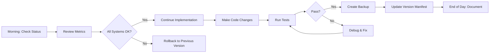
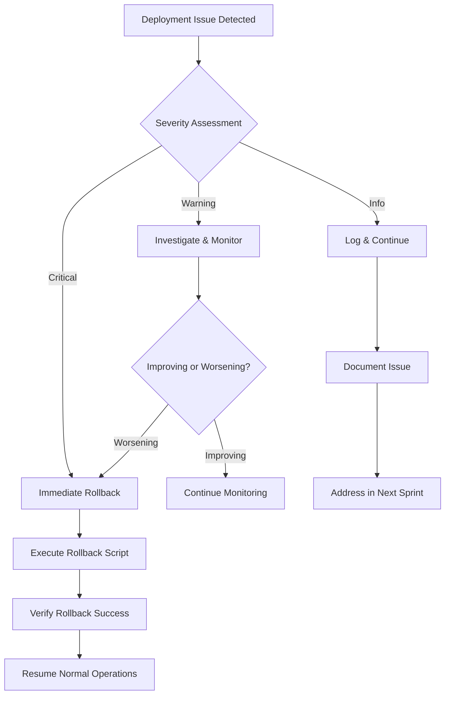

# Staged Implementation Strategy with Version Checkpoints

## 1. Overview

This document outlines the staged implementation approach for AADS-ULoRA v5.5 optimizations, ensuring safe deployment with rollback capabilities at each stage.

## 2. Implementation Stages

### Stage 0: Baseline (v5.5.0)
**Status:** Stable production version
**Purpose:** Establish performance baseline for all metrics

**Checkpoint Actions:**
- [ ] Create backup: `v5.5.0-baseline`
- [ ] Document baseline metrics
- [ ] Verify all systems operational
- [ ] Generate rollback script

**Baseline Metrics to Record:**
```json
{
  "crop_routing_accuracy": 0.982,
  "phase1_accuracy": 0.953,
  "phase2_retention": 0.892,
  "phase3_retention": 0.843,
  "ood_auroc": 0.891,
  "ood_fpr": 0.067,
  "inference_latency_ms": 185,
  "memory_per_adapter_mb": 23.5
}
```

---

### Stage 1: OOD Detection Optimization (v5.5.1-ood)

**Objective:** Implement dynamic Mahalanobis OOD detection with per-class thresholds

**Changes:**
- Modify `src/ood/dynamic_thresholds.py`
- Update `src/adapter/independent_crop_adapter.py` OOD detection logic
- Adjust `config/adapter_spec_v55.json` OOD parameters

**Checkpoint Timeline:**
```
Day 1-2: Implementation
Day 3: Unit testing
Day 4: Integration testing
Day 5: Performance validation
Day 6: A/B testing (if applicable)
Day 7: Production deployment decision
```

**Pre-Implementation Checklist:**
- [ ] Backup current state: `v5.5.0-current`
- [ ] Create feature branch: `feature/ood-optimization`
- [ ] Review changes with team
- [ ] Set up test environment
- [ ] Prepare test datasets

**Implementation Steps:**
1. **Code Changes**
   ```bash
   # Create backup before changes
   python -m version_management.backup create \
     --version v5.5.1-ood-work \
     --description "OOD optimization work in progress"
   ```

2. **Modify OOD Detection**
   - Update `DynamicOODThreshold` class
   - Implement per-class threshold calculation
   - Add fallback mechanism

3. **Configuration Updates**
   ```json
   {
     "ood_detection": {
       "method": "dynamic_mahalanobis",
       "threshold_factor": 2.0,
       "min_val_samples_per_class": 10,
       "fallback_threshold": 25.0
     }
   }
   ```

**Validation Tests:**
- [ ] Unit tests pass for OOD detection
- [ ] Integration tests with all crops
- [ ] Performance benchmarks meet targets:
  - OOD AUROC ≥ 0.92
  - FPR ≤ 0.05
  - Latency increase < 5ms

**Success Criteria:**
- OOD detection AUROC improves by ≥ 2%
- False positive rate ≤ 5%
- No regression in classification accuracy
- Inference latency increase < 3%

**Rollback Triggers:**
- OOD AUROC < 0.90
- Classification accuracy drops > 1%
- System crashes or errors > 1% of requests
- Latency increase > 10ms

**Post-Implementation:**
- [ ] Create final version: `v5.5.1-ood`
- [ ] Update CHANGELOG.md
- [ ] Document performance impact
- [ ] Generate rollback script
- [ ] Tag in git: `git tag -a v5.5.1-ood -m "OOD optimization"`

---

### Stage 2: Router Improvement (v5.5.2-router)

**Objective:** Enhance crop routing accuracy with improved classifier

**Changes:**
- Update `src/router/simple_crop_router.py`
- Modify training procedure
- Optimize model architecture

**Checkpoint Actions:**
- [ ] Backup: `v5.5.1-ood` → `v5.5.2-router-work`
- [ ] Train new router model
- [ ] Validate routing accuracy ≥ 98.5%
- [ ] Test with all crop types

**Implementation Steps:**
1. Create backup
2. Train improved router
3. Evaluate on validation set
4. Compare with baseline router
5. Deploy if improvement ≥ 0.5%

**Validation:**
- Crop routing accuracy ≥ 98.5%
- Inference time < 50ms per image
- Model size < 100MB

**Rollback Conditions:**
- Routing accuracy < 98%
- Router model > 150MB
- Training time > 4 hours

---

### Stage 3: Performance Optimization (v5.5.3-performance)

**Objective:** Optimize inference speed and memory usage

**Changes:**
- Implement gradient checkpointing
- Optimize data loading
- Add model quantization option
- Tune batch sizes

**Checkpoint Actions:**
- [ ] Backup: `v5.5.2-router` → `v5.5.3-performance-work`
- [ ] Profile current performance
- [ ] Apply optimizations
- [ ] Benchmark improvements

**Target Metrics:**
- Inference latency: ≤ 150ms (current: 185ms)
- Memory per adapter: ≤ 20MB (current: 23.5MB)
- Throughput: ≥ 15 FPS

**Rollback Triggers:**
- Accuracy drop > 0.5%
- Memory increase > 10%
- System instability

---

## 3. Implementation Workflow

### 3.1 Daily Workflow



### 3.2 Weekly Sprint Structure

**Monday:**
- Review previous week's progress
- Plan this week's objectives
- Create baseline backup

**Tuesday-Thursday:**
- Implement features
- Daily testing and validation
- Evening backups

**Friday:**
- Complete testing
- Performance benchmarking
- Prepare for deployment
- Create release candidate version

**Weekend:**
- A/B testing (if applicable)
- Monitoring
- Prepare rollback if needed

---

## 4. A/B Testing Strategy

### 4.1 When to Use A/B Testing

- Major architecture changes
- Performance-critical optimizations
- New feature introduction
- Before production rollout

### 4.2 A/B Test Setup

```python
# ab_test_manager.py
class ABTestManager:
    """Manage A/B tests between two versions."""

    def __init__(self, version_a: str, version_b: str, traffic_split: float = 0.5):
        self.version_a = version_a
        self.version_b = version_b
        self.traffic_split = traffic_split  # % to version A, rest to B
        self.metrics_a = []
        self.metrics_b = []

    def route_request(self, request_id: str) -> str:
        """Determine which version to route request to."""
        import random
        if random.random() < self.traffic_split:
            return self.version_a
        else:
            return self.version_b

    def collect_metrics(self, version: str, metrics: dict):
        """Collect metrics for a version."""
        if version == self.version_a:
            self.metrics_a.append(metrics)
        else:
            self.metrics_b.append(metrics)

    def analyze_results(self, min_samples: int = 1000) -> dict:
        """Statistical analysis of A/B test results."""
        if len(self.metrics_a) < min_samples or len(self.metrics_b) < min_samples:
            return {"status": "insufficient_data"}

        import numpy as np
        from scipy import stats

        # Compare key metrics
        results = {}
        for metric in ["accuracy", "latency_ms"]:
            data_a = [m[metric] for m in self.metrics_a if metric in m]
            data_b = [m[metric] for m in self.metrics_b if metric in m]

            if data_a and data_b:
                t_stat, p_value = stats.ttest_ind(data_a, data_b)
                results[metric] = {
                    "mean_a": np.mean(data_a),
                    "mean_b": np.mean(data_b),
                    "difference_pct": ((np.mean(data_b) - np.mean(data_a)) / np.mean(data_a)) * 100,
                    "p_value": p_value,
                    "significant": p_value < 0.05
                }

        return results
```

### 4.3 A/B Test Execution

```bash
# 1. Deploy both versions
python deploy.py --version v5.5.1-ood --port 8000
python deploy.py --version v5.5.2-router --port 8001

# 2. Configure load balancer (nginx example)
cat > /etc/nginx/conf.d/aads-ab-test.conf << 'EOF'
upstream version_a {
    server localhost:8000;
}
upstream version_b {
    server localhost:8001;
}

server {
    listen 80;
    location / {
        # 50/50 split
        if ($random_1 < 0.5) {
            proxy_pass http://version_a;
        }
        if ($random_1 >= 0.5) {
            proxy_pass http://version_b;
        }
    }
}
EOF

nginx -s reload

# 3. Monitor for 24-48 hours
python monitor_ab_test.py --duration 48h

# 4. Analyze results
python analyze_ab_results.py

# 5. Decision: Keep winner or rollback both
```

---

## 5. Monitoring and Validation Strategy

### 5.1 Real-Time Monitoring Dashboard

```python
# monitoring/dashboard.py
import streamlit as st
import pandas as pd
import plotly.express as px
from datetime import datetime, timedelta

st.title("AADS-ULoRA Version Monitoring")

# Load version data
versions = load_all_versions_metrics()

# Version comparison
st.header("Version Comparison")
selected_versions = st.multiselect(
    "Select versions to compare",
    options=list(versions.keys()),
    default=["v5.5.0", "v5.5.1-ood"]
)

if selected_versions:
    comparison_data = []
    for version in selected_versions:
        metrics = versions[version]
        comparison_data.append({
            "Version": version,
            "Accuracy": metrics.get("accuracy", 0),
            "Latency (ms)": metrics.get("latency_ms", 0),
            "Memory (MB)": metrics.get("memory_mb", 0),
            "OOD AUROC": metrics.get("ood_auroc", 0)
        })

    df = pd.DataFrame(comparison_data)
    st.dataframe(df)

    # Charts
    st.header("Performance Charts")
    fig = px.bar(df, x="Version", y="Accuracy", title="Accuracy by Version")
    st.plotly_chart(fig)

# Alerts
st.header("Active Alerts")
alerts = check_for_alerts()
for alert in alerts:
    st.error(f"{alert['timestamp']}: {alert['message']}")
```

### 5.2 Automated Alerting

```python
# monitoring/alerts.py
ALERT_RULES = {
    "accuracy_drop": {
        "condition": lambda current, baseline: current < baseline * 0.99,
        "message": "Accuracy dropped more than 1% from baseline",
        "severity": "critical"
    },
    "latency_increase": {
        "condition": lambda current, baseline: current > baseline * 1.10,
        "message": "Latency increased more than 10%",
        "severity": "warning"
    },
    "error_rate_high": {
        "condition": lambda rate: rate > 0.01,
        "message": "Error rate exceeds 1%",
        "severity": "critical"
    },
    "memory_leak": {
        "condition": lambda current, previous: current > previous * 1.20,
        "message": "Memory usage increased 20%",
        "severity": "warning"
    }
}

def check_alerts(current_metrics: dict, baseline_metrics: dict) -> list:
    """Check all alert rules and return triggered alerts."""
    alerts = []

    for rule_name, rule in ALERT_RULES.items():
        try:
            if rule_name == "accuracy_drop":
                if rule["condition"](
                    current_metrics["accuracy"],
                    baseline_metrics["accuracy"]
                ):
                    alerts.append({
                        "rule": rule_name,
                        "message": rule["message"],
                        "severity": rule["severity"],
                        "current": current_metrics["accuracy"],
                        "baseline": baseline_metrics["accuracy"]
                    })

            elif rule_name == "latency_increase":
                if rule["condition"](
                    current_metrics["latency_ms"],
                    baseline_metrics["latency_ms"]
                ):
                    alerts.append({
                        "rule": rule_name,
                        "message": rule["message"],
                        "severity": rule["severity"],
                        "current": current_metrics["latency_ms"],
                        "baseline": baseline_metrics["latency_ms"]
                    })

            # ... other rules

        except KeyError as e:
            logger.warning(f"Missing metric for alert rule {rule_name}: {e}")

    return alerts
```

### 5.3 Validation Checklist

For each version deployment:

**Pre-Deployment:**
- [ ] Backup created and verified
- [ ] All unit tests pass
- [ ] Integration tests pass
- [ ] Performance benchmarks meet targets
- [ ] Security scan completed
- [ ] Documentation updated

**During Deployment:**
- [ ] Canary deployment (10% traffic)
- [ ] Monitor error rate < 0.1%
- [ ] Check latency within threshold
- [ ] Verify memory usage stable
- [ ] Confirm OOD detection working

**Post-Deployment:**
- [ ] Full traffic rollout successful
- [ ] No alerts triggered in 24h
- [ ] Performance metrics meet targets
- [ ] User feedback positive
- [ ] Create version tag and release notes

---

## 6. Version Decision Matrix

Use this matrix to decide whether to keep or rollback a version:

| Condition | Threshold | Action |
|-----------|-----------|--------|
| Accuracy drop | > 1% | Rollback |
| OOD AUROC | < 0.90 | Rollback |
| FPR increase | > 1% absolute | Rollback |
| Latency increase | > 10% | Investigate |
| Memory increase | > 20% | Investigate |
| Error rate | > 0.5% | Rollback |
| Crash frequency | > 0.1% | Rollback |
| User complaints | > 5/day | Rollback |

**Decision Flow:**
```
Metrics Collected
      ↓
Check Against Thresholds
      ↓
Any Critical Failures?
    /      \
  Yes      No
   ↓        ↓
Rollback   All Metrics OK?
            /      \
          Yes      No
           ↓        ↓
        Keep     Investigate
                     ↓
            Fix & Re-deploy OR Rollback
```

---

## 7. Rollback Decision Tree



---

## 8. Emergency Rollback Procedures

### 8.1 Immediate Rollback (< 5 minutes)

**Scenario:** Production system down or critical errors

**Steps:**
1. **Stop deployment** (if still in progress)
   ```bash
   # Kubernetes
   kubectl rollout undo deployment/aads-ulora

   # Docker Compose
   docker-compose down
   ```

2. **Execute rollback**
   ```bash
   # Use specific rollback script
   python rollback_v5.5.1-ood.py

   # Or use VersionManager
   python -m version_management.backup restore --version v5.5.0
   ```

3. **Verify rollback**
   ```bash
   python -m version_management.backup verify --version v5.5.0
   ```

4. **Restart services**
   ```bash
   ./deploy.sh v5.5.0
   ```

5. **Monitor recovery**
   ```bash
   tail -f logs/application.log
   ```

6. **Notify team**
   - Send alert to Slack/Teams
   - Create incident report
   - Schedule post-mortem

### 8.2 Partial Rollback

**Scenario:** Only specific components affected

```bash
# Rollback only adapter code
python -m version_management.backup restore \
  --version v5.5.0 \
  --target ./src/adapter \
  --dry-run  # Preview first

# Rollback only configuration
python -m version_management.backup restore \
  --version v5.5.0 \
  --target ./config
```

### 8.3 Database Rollback

If database schema changed:

```bash
# Restore database backup
pg_restore -U postgres -d aads_ulora \
  backups/v5.5.0/database/pre_deploy_backup.sql

# Or use migration rollback
alembic downgrade base
```

---

## 9. Version Rollout Schedule

### 9.1 Phased Rollout Plan

```
Day 0: Create version v5.5.1-ood
Day 1: Deploy to staging environment
Day 2: Staging validation (24h)
Day 3: 10% production traffic (canary)
Day 4: Monitor canary (24h)
Day 5: If OK, 50% production traffic
Day 6: Monitor (24h)
Day 7: 100% production traffic
Day 8-14: Full monitoring period
```

### 9.2 Rollback Timing

| Issue Severity | Detection Time | Rollback Time Target |
|----------------|----------------|---------------------|
| Critical | Immediate | < 2 minutes |
| High | < 5 minutes | < 10 minutes |
| Medium | < 30 minutes | < 1 hour |
| Low | < 4 hours | < 4 hours |

---

## 10. Success Metrics per Stage

### Stage 1 (OOD) Success Criteria:
- ✅ OOD AUROC ≥ 0.92
- ✅ FPR ≤ 0.05
- ✅ Classification accuracy ≥ 95%
- ✅ Latency increase ≤ 5ms
- ✅ All tests passing

### Stage 2 (Router) Success Criteria:
- ✅ Routing accuracy ≥ 98.5%
- ✅ Inference time ≤ 50ms
- ✅ Model size ≤ 100MB
- ✅ No accuracy regression in adapters

### Stage 3 (Performance) Success Criteria:
- ✅ Overall latency ≤ 150ms
- ✅ Memory per adapter ≤ 20MB
- ✅ Throughput ≥ 15 FPS
- ✅ No accuracy regression

---

## 11. Risk Mitigation

| Risk | Probability | Impact | Mitigation |
|------|-------------|--------|------------|
| Data loss during rollback | Low | Critical | Verify backups, test rollback procedures |
| Performance regression | Medium | High | A/B testing, gradual rollout |
| OOD detection failure | Medium | High | Fallback thresholds, monitoring |
| Router misclassification | Low | High | Extensive testing, confidence thresholds |
| Training instability | Medium | Medium | Early stopping, checkpointing |
| Dependency conflicts | Low | Medium | Virtual environments, pinned versions |

---

## 12. Communication Plan

### 12.1 Stakeholder Notifications

**Before Implementation:**
- Send implementation plan to team
- Schedule deployment window
- Notify operations team

**During Implementation:**
- Daily standup updates
- Immediate alerts for issues
- Progress tracking in shared doc

**After Deployment:**
- Deployment completion notification
- Performance summary (24h, 7d, 30d)
- Lessons learned document

### 12.2 Status Communication Template

```
Subject: [AADS-ULoRA] Deployment Status: v5.5.1-ood

Status: ✅ Successful / ⚠️ Issues / ❌ Rolled Back

Version: v5.5.1-ood
Deployed: 2026-02-11 14:00 UTC
Traffic: 100% (after canary)

Metrics (24h):
- Accuracy: 95.3% (baseline: 95.3%) ✅
- OOD AUROC: 92.4% (baseline: 89.1%) ✅
- Latency: 188ms (baseline: 185ms) ⚠️
- Error rate: 0.05% ✅

Issues:
- None

Next Steps:
- Monitor for 7 days
- Schedule performance review
```

---

## 13. Rollback Drills

**Frequency:** Monthly

**Procedure:**
1. Schedule drill (non-production)
2. Deploy test version
3. Simulate failure scenario
4. Execute rollback
5. Measure rollback time
6. Document issues
7. Improve procedures

**Drill Scenarios:**
- Complete system failure
- Performance degradation
- Data corruption
- Partial failure (one crop adapter)

**Success Criteria:**
- Rollback completed in < 5 minutes
- All services restored
- No data loss
- Team follows procedure correctly

---

## 14. Documentation Requirements

For each version, maintain:

1. **Version Manifest** (`version.json`)
2. **Changelog Entry** (`CHANGELOG.md`)
3. **Performance Report** (`performance_metrics.json`)
4. **Test Results** (`test_results/`)
5. **Deployment Notes** (`deployment_notes.md`)
6. **Rollback Script** (`rollback_<version>.py`)
7. **Known Issues** (`KNOWN_ISSUES.md`)

---

## 15. Continuous Improvement

After each stage:

1. **Retrospective Meeting**
   - What went well?
   - What could be improved?
   - Update procedures

2. **Metrics Review**
   - Compare predictions vs actual
   - Update thresholds
   - Refine alert rules

3. **Tooling Updates**
   - Improve automation
   - Enhance monitoring
   - Simplify rollback

4. **Training**
   - Document lessons learned
   - Train team on new procedures
   - Update runbooks

---

## 16. Quick Reference: Stage Checklist

### Pre-Stage:
- [ ] Baseline backup created
- [ ] Team aligned on objectives
- [ ] Test environment ready
- [ ] Rollback procedures reviewed

### During Stage:
- [ ] Daily backups
- [ ] Tests passing
- [ ] Metrics within threshold
- [ ] No critical alerts

### Post-Stage:
- [ ] Version tagged
- [ ] Documentation complete
- [ ] Performance report generated
- [ ] Team debriefed
- [ ] Lessons learned captured

---

**Next:** Create detailed testing procedures and validation strategy