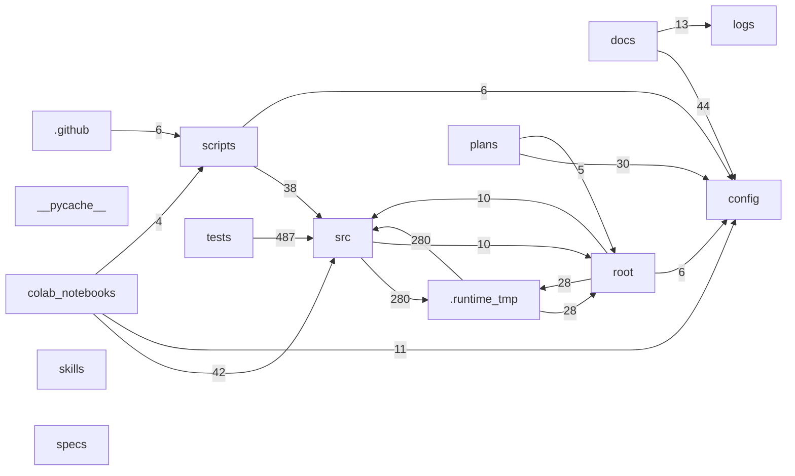

# Repository File Relationships (Detailed)

- Generated at (UTC): `2026-03-03T18:13:56Z`
- Scan root: `.`
- Excluded directories: `.venv,.git`
- Deep inference: `enabled`
- Total files scanned: `435`

## Legend

- `relation_type`: semantic connection from source file to target file.
- `confidence=explicit`: parsed from direct syntax/link/command/path evidence.
- `confidence=inferred`: heuristic or contextual relationship.

## Global Metrics

### File Counts by Type

| Type | Count |
|---|---:|
| `.py` | 144 |
| `.md` | 94 |
| `.json` | 52 |
| `.pyc` | 30 |
| `.pth` | 28 |
| `.pt` | 19 |
| `.ipynb` | 18 |
| `.pdf` | 12 |
| `.yaml` | 10 |
| `<noext>` | 8 |
| `.tex` | 4 |
| `.txt` | 4 |
| `.log` | 3 |
| `.ini` | 2 |
| `.24856` | 1 |
| `.csv` | 1 |
| `.example` | 1 |
| `.sh` | 1 |
| `.tag` | 1 |
| `.yml` | 1 |
| `.zip` | 1 |

### File Counts by Category

| Category | Count |
|---|---:|
| `.runtime_tmp` | 90 |
| `src` | 76 |
| `docs` | 73 |
| `tests` | 69 |
| `scripts` | 29 |
| `skills` | 27 |
| `colab_notebooks` | 20 |
| `root` | 17 |
| `plans` | 13 |
| `config` | 10 |
| `logs` | 4 |
| `.github` | 3 |
| `specs` | 3 |
| `__pycache__` | 1 |

### Edge Counts by Relation Type

| Relation Type | Count |
|---|---:|
| `mirror_of` | 1818 |
| `imports` | 582 |
| `validates` | 201 |
| `uses_config` | 95 |
| `links_to` | 57 |
| `mentions_artifact` | 48 |
| `owned_by_context` | 17 |
| `references_path` | 11 |
| `invokes` | 6 |
| `compatibility_alias` | 1 |

### Edge Counts by Confidence

| Confidence | Count |
|---|---:|
| `explicit` | 2650 |
| `inferred` | 186 |

## High-Level Relationship Map



## Directory-Level Relationship Matrix

| Source \ Target | `.github` | `.runtime_tmp` | `__pycache__` | `colab_notebooks` | `config` | `docs` | `logs` | `plans` | `root` | `scripts` | `skills` | `specs` | `src` | `tests` |
|---|---:|---:|---:|---:|---:|---:|---:|---:|---:|---:|---:|---:|---:|---:|
| `.github` | 0 | 0 | 0 | 0 | 0 | 0 | 1 | 0 | 0 | 6 | 0 | 0 | 0 | 0 |
| `.runtime_tmp` | 0 | 1092 | 0 | 0 | 0 | 0 | 0 | 0 | 28 | 0 | 0 | 0 | 280 | 0 |
| `__pycache__` | 0 | 0 | 0 | 0 | 0 | 0 | 0 | 0 | 0 | 0 | 0 | 0 | 0 | 0 |
| `colab_notebooks` | 0 | 0 | 0 | 2 | 11 | 0 | 0 | 0 | 1 | 4 | 0 | 0 | 42 | 0 |
| `config` | 0 | 0 | 0 | 0 | 2 | 0 | 1 | 0 | 0 | 0 | 0 | 0 | 0 | 0 |
| `docs` | 0 | 0 | 0 | 1 | 44 | 72 | 13 | 0 | 4 | 2 | 0 | 0 | 0 | 0 |
| `logs` | 0 | 0 | 0 | 0 | 0 | 4 | 0 | 0 | 0 | 0 | 0 | 0 | 0 | 0 |
| `plans` | 0 | 0 | 0 | 1 | 30 | 4 | 2 | 0 | 5 | 0 | 0 | 0 | 3 | 1 |
| `root` | 0 | 28 | 0 | 0 | 6 | 0 | 0 | 0 | 0 | 0 | 0 | 0 | 10 | 0 |
| `scripts` | 0 | 0 | 0 | 0 | 6 | 0 | 2 | 0 | 0 | 0 | 0 | 0 | 38 | 0 |
| `skills` | 0 | 0 | 0 | 0 | 4 | 0 | 0 | 0 | 0 | 0 | 0 | 0 | 0 | 0 |
| `specs` | 0 | 0 | 0 | 0 | 0 | 0 | 0 | 0 | 0 | 0 | 0 | 0 | 0 | 0 |
| `src` | 0 | 280 | 0 | 0 | 1 | 0 | 2 | 0 | 10 | 0 | 0 | 0 | 268 | 0 |
| `tests` | 0 | 0 | 0 | 0 | 0 | 0 | 0 | 0 | 0 | 2 | 0 | 0 | 487 | 36 |

## Per-File Relationship Catalog

### `.coveragerc`

- `type`: `<noext>`
- `size`: `1239` bytes (1.21 KB)
- `sha256`: `2e86e1d17afc9a84936e5cfa0249dfc888d981706b51964de04d4cd37b6831d7`
- `category`: `root`
- `purpose`: Repository file artifact.

- `outgoing_edges`: 0 (explicit=0, inferred=0)
  - none

- `incoming_edges`: 0 (explicit=0, inferred=0)
  - none

### `.env.example`

- `type`: `.example`
- `size`: `533` bytes (533 B)
- `sha256`: `72ed47a648b6e30b773dfe0ab2eb8c13919d9738823f6ef2ee052c7535547a75`
- `category`: `root`
- `purpose`: Repository file artifact.

- `outgoing_edges`: 0 (explicit=0, inferred=0)
  - none

- `incoming_edges`: 0 (explicit=0, inferred=0)
  - none

### `.github/ISSUE_TEMPLATE.md`

- `type`: `.md`
- `size`: `2035` bytes (1.99 KB)
- `sha256`: `3f744e389bb6455ab2e53868a1a0e372fee85840f8f2540306f1d4393143cf87`
- `category`: `.github`
- `purpose`: Bug Report.

- `outgoing_edges`: 0 (explicit=0, inferred=0)
  - none

- `incoming_edges`: 0 (explicit=0, inferred=0)
  - none

### `.github/PULL_REQUEST_TEMPLATE.md`

- `type`: `.md`
- `size`: `2052` bytes (2.00 KB)
- `sha256`: `ced5397d0f569342e3841011d731d7d71023ea042fb3b89aa6105aae9f084249`
- `category`: `.github`
- `purpose`: Description.

- `outgoing_edges`: 0 (explicit=0, inferred=0)
  - none

- `incoming_edges`: 0 (explicit=0, inferred=0)
  - none

### `.github/workflows/ci.yml`

- `type`: `.yml`
- `size`: `4436` bytes (4.33 KB)
- `sha256`: `f7637010f61e7d3ea4be3354199d5f22974b325d602ef12be66110c1994ebece`
- `category`: `.github`
- `purpose`: Repository file artifact.

- `outgoing_edges`: 7 (explicit=6, inferred=1)
  - [`mentions_artifact` | `inferred`] -> `logs/phase5_router_benchmark.json` | evidence: text mention of 'phase5_router_benchmark.json'
  - [`invokes` | `explicit`] -> `scripts/benchmark_router_phase5.py` | evidence: workflow command: python scripts/benchmark_router_phase5.py
  - [`invokes` | `explicit`] -> `scripts/check_markdown_links.py` | evidence: workflow command: python scripts/check_markdown_links.py --root .
  - [`invokes` | `explicit`] -> `scripts/check_phase5_perf_regression.py` | evidence: workflow command: python scripts/check_phase5_perf_regression.py
  - [`invokes` | `explicit`] -> `scripts/profile_policy_sanity.py` | evidence: workflow command: python scripts/profile_policy_sanity.py
  - [`invokes` | `explicit`] -> `scripts/run_policy_regression_bundle.py` | evidence: workflow command: python scripts/run_policy_regression_bundle.py
  - [`invokes` | `explicit`] -> `scripts/run_test_suites.py` | evidence: workflow command: python scripts/run_test_suites.py \

- `incoming_edges`: 0 (explicit=0, inferred=0)
  - none

### `.gitignore`

- `type`: `<noext>`
- `size`: `1698` bytes (1.66 KB)
- `sha256`: `ec0b90036e7ce3f80c4c609cddd135d74333ee67983808715aca4c5bd8af3fd9`
- `category`: `root`
- `purpose`: Repository file artifact.

- `outgoing_edges`: 0 (explicit=0, inferred=0)
  - none

- `incoming_edges`: 0 (explicit=0, inferred=0)
  - none

### `.pre-commit-config.yaml`

- `type`: `.yaml`
- `size`: `256` bytes (256 B)
- `sha256`: `9f4e23c5c04580967941fbcee87d0a6c2d56d3b835ccb15ba8f2737f361c82db`
- `category`: `root`
- `purpose`: Repository file artifact.

- `outgoing_edges`: 0 (explicit=0, inferred=0)
  - none

- `incoming_edges`: 0 (explicit=0, inferred=0)
  - none

### `.runtime_tmp/.pytest_cache/v/cache/lastfailed`

- `type`: `<noext>`
- `size`: `2` bytes (2 B)
- `sha256`: `44136fa355b3678a1146ad16f7e8649e94fb4fc21fe77e8310c060f61caaff8a`
- `category`: `.runtime_tmp`
- `purpose`: Repository file artifact.

- `outgoing_edges`: 0 (explicit=0, inferred=0)
  - none

- `incoming_edges`: 0 (explicit=0, inferred=0)
  - none

### `.runtime_tmp/.pytest_cache/v/cache/nodeids`

- `type`: `<noext>`
- `size`: `17664` bytes (17.25 KB)
- `sha256`: `9c36433b578fa9b117b34c172e6c5e24b5bdc7974746f6fe6a247ec2c1936f54`
- `category`: `.runtime_tmp`
- `purpose`: Repository file artifact.

- `outgoing_edges`: 0 (explicit=0, inferred=0)
  - none

- `incoming_edges`: 0 (explicit=0, inferred=0)
  - none

### `.runtime_tmp/pytest_basetemp_012fb61a5ecb4ed99b69d38975c2efbf/test_load_taxonomy_and_compati0/taxonomy.json`

- `type`: `.json`
- `size`: `199` bytes (199 B)
- `sha256`: `fa7a8e2f12a9bd11d8ed05591420e50c2544f9bb8777e3bd26ad4694d6f18124`
- `category`: `.runtime_tmp`
- `purpose`: Repository file artifact.

- `outgoing_edges`: 5 (explicit=5, inferred=0)
  - [`mirror_of` | `explicit`] -> `.runtime_tmp/pytest_basetemp_3314f714a2f346bc8d59e16849e556c8/test_load_taxonomy_and_compati0/taxonomy.json` | evidence: sha256 match fa7a8e2f12a9
  - [`mirror_of` | `explicit`] -> `.runtime_tmp/pytest_basetemp_4a02f50ec1aa40da96eb94b6bcf44c96/test_load_taxonomy_and_compati0/taxonomy.json` | evidence: sha256 match fa7a8e2f12a9
  - [`mirror_of` | `explicit`] -> `.runtime_tmp/pytest_basetemp_4e5421b4bb154b6f8a6ddd223adc50d3/test_load_taxonomy_and_compati0/taxonomy.json` | evidence: sha256 match fa7a8e2f12a9
  - [`mirror_of` | `explicit`] -> `.runtime_tmp/pytest_basetemp_5ca72085d7694f689588f07e486602d7/test_load_taxonomy_and_compati0/taxonomy.json` | evidence: sha256 match fa7a8e2f12a9
  - [`mirror_of` | `explicit`] -> `.runtime_tmp/pytest_basetemp_61c9bf86a85341ae816c18d9d44abdcf/test_load_taxonomy_and_compati0/taxonomy.json` | evidence: sha256 match fa7a8e2f12a9

- `incoming_edges`: 5 (explicit=5, inferred=0)
  - [`mirror_of` | `explicit`] <- `.runtime_tmp/pytest_basetemp_3314f714a2f346bc8d59e16849e556c8/test_load_taxonomy_and_compati0/taxonomy.json` | evidence: sha256 match fa7a8e2f12a9
  - [`mirror_of` | `explicit`] <- `.runtime_tmp/pytest_basetemp_4a02f50ec1aa40da96eb94b6bcf44c96/test_load_taxonomy_and_compati0/taxonomy.json` | evidence: sha256 match fa7a8e2f12a9
  - [`mirror_of` | `explicit`] <- `.runtime_tmp/pytest_basetemp_4e5421b4bb154b6f8a6ddd223adc50d3/test_load_taxonomy_and_compati0/taxonomy.json` | evidence: sha256 match fa7a8e2f12a9
  - [`mirror_of` | `explicit`] <- `.runtime_tmp/pytest_basetemp_5ca72085d7694f689588f07e486602d7/test_load_taxonomy_and_compati0/taxonomy.json` | evidence: sha256 match fa7a8e2f12a9
  - [`mirror_of` | `explicit`] <- `.runtime_tmp/pytest_basetemp_61c9bf86a85341ae816c18d9d44abdcf/test_load_taxonomy_and_compati0/taxonomy.json` | evidence: sha256 match fa7a8e2f12a9

### `.runtime_tmp/pytest_basetemp_033a9e097d34471faca3d46afa3b0a0e/test_adapter_save_load_roundtr0/model_dir/continual_sd_lora_adapter/adapter_meta.json`

- `type`: `.json`
- `size`: `566` bytes (566 B)
- `sha256`: `253121698389c88e67bc5f0ef5fc47b82dff01b0e7f7a69fce1d47ea87e80f63`
- `category`: `.runtime_tmp`
- `purpose`: Repository file artifact.

- `outgoing_edges`: 12 (explicit=12, inferred=0)
  - [`mirror_of` | `explicit`] -> `.runtime_tmp/pytest_basetemp_1a654f81dbb147cba0a334d00bd7de30/test_adapter_metadata_contains0/model_dir/continual_sd_lora_adapter/adapter_meta.json` | evidence: sha256 match 253121698389
  - [`mirror_of` | `explicit`] -> `.runtime_tmp/pytest_basetemp_1a654f81dbb147cba0a334d00bd7de30/test_adapter_save_load_roundtr0/model_dir/continual_sd_lora_adapter/adapter_meta.json` | evidence: sha256 match 253121698389
  - [`mirror_of` | `explicit`] -> `.runtime_tmp/pytest_basetemp_256e226d897f453ca20fd24a5c22cc26/test_adapter_metadata_contains0/model_dir/continual_sd_lora_adapter/adapter_meta.json` | evidence: sha256 match 253121698389
  - [`mirror_of` | `explicit`] -> `.runtime_tmp/pytest_basetemp_256e226d897f453ca20fd24a5c22cc26/test_adapter_save_load_roundtr0/model_dir/continual_sd_lora_adapter/adapter_meta.json` | evidence: sha256 match 253121698389
  - [`mirror_of` | `explicit`] -> `.runtime_tmp/pytest_basetemp_67fb2b80059945e68d4e4d2f46a9ffdf/test_adapter_save_load_roundtr0/model_dir/continual_sd_lora_adapter/adapter_meta.json` | evidence: sha256 match 253121698389
  - [`mirror_of` | `explicit`] -> `.runtime_tmp/pytest_basetemp_7ad835789b874bf7af7dd9fa82aaf9a9/test_adapter_save_load_roundtr0/model_dir/continual_sd_lora_adapter/adapter_meta.json` | evidence: sha256 match 253121698389
  - [`mirror_of` | `explicit`] -> `.runtime_tmp/pytest_basetemp_ae52df468f034b55b4d8f141a43eadbc/test_adapter_metadata_contains0/model_dir/continual_sd_lora_adapter/adapter_meta.json` | evidence: sha256 match 253121698389
  - [`mirror_of` | `explicit`] -> `.runtime_tmp/pytest_basetemp_ae52df468f034b55b4d8f141a43eadbc/test_adapter_save_load_roundtr0/model_dir/continual_sd_lora_adapter/adapter_meta.json` | evidence: sha256 match 253121698389
  - [`mirror_of` | `explicit`] -> `.runtime_tmp/pytest_basetemp_d04f25bb9f87425ab55a207542446cad/test_adapter_save_load_roundtr0/model_dir/continual_sd_lora_adapter/adapter_meta.json` | evidence: sha256 match 253121698389
  - [`mirror_of` | `explicit`] -> `.runtime_tmp/pytest_basetemp_fa273c67a3d7435cbf52e43703c47d9b/test_adapter_metadata_contains0/model_dir/continual_sd_lora_adapter/adapter_meta.json` | evidence: sha256 match 253121698389
  - [`mirror_of` | `explicit`] -> `.runtime_tmp/pytest_basetemp_fa273c67a3d7435cbf52e43703c47d9b/test_adapter_save_load_roundtr0/model_dir/continual_sd_lora_adapter/adapter_meta.json` | evidence: sha256 match 253121698389
  - [`mirror_of` | `explicit`] -> `.runtime_tmp/pytest_basetemp_ff79e08a56c64d6eb01de2b7354627ec/test_adapter_save_load_roundtr0/model_dir/continual_sd_lora_adapter/adapter_meta.json` | evidence: sha256 match 253121698389

- `incoming_edges`: 12 (explicit=12, inferred=0)
  - [`mirror_of` | `explicit`] <- `.runtime_tmp/pytest_basetemp_1a654f81dbb147cba0a334d00bd7de30/test_adapter_metadata_contains0/model_dir/continual_sd_lora_adapter/adapter_meta.json` | evidence: sha256 match 253121698389
  - [`mirror_of` | `explicit`] <- `.runtime_tmp/pytest_basetemp_1a654f81dbb147cba0a334d00bd7de30/test_adapter_save_load_roundtr0/model_dir/continual_sd_lora_adapter/adapter_meta.json` | evidence: sha256 match 253121698389
  - [`mirror_of` | `explicit`] <- `.runtime_tmp/pytest_basetemp_256e226d897f453ca20fd24a5c22cc26/test_adapter_metadata_contains0/model_dir/continual_sd_lora_adapter/adapter_meta.json` | evidence: sha256 match 253121698389
  - [`mirror_of` | `explicit`] <- `.runtime_tmp/pytest_basetemp_256e226d897f453ca20fd24a5c22cc26/test_adapter_save_load_roundtr0/model_dir/continual_sd_lora_adapter/adapter_meta.json` | evidence: sha256 match 253121698389
  - [`mirror_of` | `explicit`] <- `.runtime_tmp/pytest_basetemp_67fb2b80059945e68d4e4d2f46a9ffdf/test_adapter_save_load_roundtr0/model_dir/continual_sd_lora_adapter/adapter_meta.json` | evidence: sha256 match 253121698389
  - [`mirror_of` | `explicit`] <- `.runtime_tmp/pytest_basetemp_7ad835789b874bf7af7dd9fa82aaf9a9/test_adapter_save_load_roundtr0/model_dir/continual_sd_lora_adapter/adapter_meta.json` | evidence: sha256 match 253121698389
  - [`mirror_of` | `explicit`] <- `.runtime_tmp/pytest_basetemp_ae52df468f034b55b4d8f141a43eadbc/test_adapter_metadata_contains0/model_dir/continual_sd_lora_adapter/adapter_meta.json` | evidence: sha256 match 253121698389
  - [`mirror_of` | `explicit`] <- `.runtime_tmp/pytest_basetemp_ae52df468f034b55b4d8f141a43eadbc/test_adapter_save_load_roundtr0/model_dir/continual_sd_lora_adapter/adapter_meta.json` | evidence: sha256 match 253121698389
  - [`mirror_of` | `explicit`] <- `.runtime_tmp/pytest_basetemp_d04f25bb9f87425ab55a207542446cad/test_adapter_save_load_roundtr0/model_dir/continual_sd_lora_adapter/adapter_meta.json` | evidence: sha256 match 253121698389
  - [`mirror_of` | `explicit`] <- `.runtime_tmp/pytest_basetemp_fa273c67a3d7435cbf52e43703c47d9b/test_adapter_metadata_contains0/model_dir/continual_sd_lora_adapter/adapter_meta.json` | evidence: sha256 match 253121698389
  - [`mirror_of` | `explicit`] <- `.runtime_tmp/pytest_basetemp_fa273c67a3d7435cbf52e43703c47d9b/test_adapter_save_load_roundtr0/model_dir/continual_sd_lora_adapter/adapter_meta.json` | evidence: sha256 match 253121698389
  - [`mirror_of` | `explicit`] <- `.runtime_tmp/pytest_basetemp_ff79e08a56c64d6eb01de2b7354627ec/test_adapter_save_load_roundtr0/model_dir/continual_sd_lora_adapter/adapter_meta.json` | evidence: sha256 match 253121698389

### `.runtime_tmp/pytest_basetemp_033a9e097d34471faca3d46afa3b0a0e/test_adapter_save_load_roundtr0/model_dir/continual_sd_lora_adapter/classifier.pth`

- `type`: `.pth`
- `size`: `0` bytes (0 B)
- `sha256`: `e3b0c44298fc1c149afbf4c8996fb92427ae41e4649b934ca495991b7852b855`
- `category`: `.runtime_tmp`
- `purpose`: Repository file artifact.

- `outgoing_edges`: 38 (explicit=38, inferred=0)
  - [`mirror_of` | `explicit`] -> `.runtime_tmp/pytest_basetemp_033a9e097d34471faca3d46afa3b0a0e/test_adapter_save_load_roundtr0/model_dir/continual_sd_lora_adapter/fusion.pth` | evidence: sha256 match e3b0c44298fc
  - [`mirror_of` | `explicit`] -> `.runtime_tmp/pytest_basetemp_1a654f81dbb147cba0a334d00bd7de30/test_adapter_metadata_contains0/model_dir/continual_sd_lora_adapter/classifier.pth` | evidence: sha256 match e3b0c44298fc
  - [`mirror_of` | `explicit`] -> `.runtime_tmp/pytest_basetemp_1a654f81dbb147cba0a334d00bd7de30/test_adapter_metadata_contains0/model_dir/continual_sd_lora_adapter/fusion.pth` | evidence: sha256 match e3b0c44298fc
  - [`mirror_of` | `explicit`] -> `.runtime_tmp/pytest_basetemp_1a654f81dbb147cba0a334d00bd7de30/test_adapter_save_load_roundtr0/model_dir/continual_sd_lora_adapter/classifier.pth` | evidence: sha256 match e3b0c44298fc
  - [`mirror_of` | `explicit`] -> `.runtime_tmp/pytest_basetemp_1a654f81dbb147cba0a334d00bd7de30/test_adapter_save_load_roundtr0/model_dir/continual_sd_lora_adapter/fusion.pth` | evidence: sha256 match e3b0c44298fc
  - [`mirror_of` | `explicit`] -> `.runtime_tmp/pytest_basetemp_256e226d897f453ca20fd24a5c22cc26/test_adapter_metadata_contains0/model_dir/continual_sd_lora_adapter/classifier.pth` | evidence: sha256 match e3b0c44298fc
  - [`mirror_of` | `explicit`] -> `.runtime_tmp/pytest_basetemp_256e226d897f453ca20fd24a5c22cc26/test_adapter_metadata_contains0/model_dir/continual_sd_lora_adapter/fusion.pth` | evidence: sha256 match e3b0c44298fc
  - [`mirror_of` | `explicit`] -> `.runtime_tmp/pytest_basetemp_256e226d897f453ca20fd24a5c22cc26/test_adapter_save_load_roundtr0/model_dir/continual_sd_lora_adapter/classifier.pth` | evidence: sha256 match e3b0c44298fc
  - [`mirror_of` | `explicit`] -> `.runtime_tmp/pytest_basetemp_256e226d897f453ca20fd24a5c22cc26/test_adapter_save_load_roundtr0/model_dir/continual_sd_lora_adapter/fusion.pth` | evidence: sha256 match e3b0c44298fc
  - [`mirror_of` | `explicit`] -> `.runtime_tmp/pytest_basetemp_67fb2b80059945e68d4e4d2f46a9ffdf/test_adapter_save_load_roundtr0/model_dir/continual_sd_lora_adapter/classifier.pth` | evidence: sha256 match e3b0c44298fc
  - [`mirror_of` | `explicit`] -> `.runtime_tmp/pytest_basetemp_67fb2b80059945e68d4e4d2f46a9ffdf/test_adapter_save_load_roundtr0/model_dir/continual_sd_lora_adapter/fusion.pth` | evidence: sha256 match e3b0c44298fc
  - [`mirror_of` | `explicit`] -> `.runtime_tmp/pytest_basetemp_7ad835789b874bf7af7dd9fa82aaf9a9/test_adapter_save_load_roundtr0/model_dir/continual_sd_lora_adapter/classifier.pth` | evidence: sha256 match e3b0c44298fc
  - [`mirror_of` | `explicit`] -> `.runtime_tmp/pytest_basetemp_7ad835789b874bf7af7dd9fa82aaf9a9/test_adapter_save_load_roundtr0/model_dir/continual_sd_lora_adapter/fusion.pth` | evidence: sha256 match e3b0c44298fc
  - [`mirror_of` | `explicit`] -> `.runtime_tmp/pytest_basetemp_939d2f03c4aa4b4aa7caef6e82b52124/test_adapter_save_load_roundtr0/model_dir/continual_sd_lora_adapter/classifier.pth` | evidence: sha256 match e3b0c44298fc
  - [`mirror_of` | `explicit`] -> `.runtime_tmp/pytest_basetemp_939d2f03c4aa4b4aa7caef6e82b52124/test_adapter_save_load_roundtr0/model_dir/continual_sd_lora_adapter/fusion.pth` | evidence: sha256 match e3b0c44298fc
  - [`mirror_of` | `explicit`] -> `.runtime_tmp/pytest_basetemp_ae52df468f034b55b4d8f141a43eadbc/test_adapter_metadata_contains0/model_dir/continual_sd_lora_adapter/classifier.pth` | evidence: sha256 match e3b0c44298fc
  - [`mirror_of` | `explicit`] -> `.runtime_tmp/pytest_basetemp_ae52df468f034b55b4d8f141a43eadbc/test_adapter_metadata_contains0/model_dir/continual_sd_lora_adapter/fusion.pth` | evidence: sha256 match e3b0c44298fc
  - [`mirror_of` | `explicit`] -> `.runtime_tmp/pytest_basetemp_ae52df468f034b55b4d8f141a43eadbc/test_adapter_save_load_roundtr0/model_dir/continual_sd_lora_adapter/classifier.pth` | evidence: sha256 match e3b0c44298fc
  - [`mirror_of` | `explicit`] -> `.runtime_tmp/pytest_basetemp_ae52df468f034b55b4d8f141a43eadbc/test_adapter_save_load_roundtr0/model_dir/continual_sd_lora_adapter/fusion.pth` | evidence: sha256 match e3b0c44298fc
  - [`mirror_of` | `explicit`] -> `.runtime_tmp/pytest_basetemp_d04f25bb9f87425ab55a207542446cad/test_adapter_save_load_roundtr0/model_dir/continual_sd_lora_adapter/classifier.pth` | evidence: sha256 match e3b0c44298fc
  - [`mirror_of` | `explicit`] -> `.runtime_tmp/pytest_basetemp_d04f25bb9f87425ab55a207542446cad/test_adapter_save_load_roundtr0/model_dir/continual_sd_lora_adapter/fusion.pth` | evidence: sha256 match e3b0c44298fc
  - [`mirror_of` | `explicit`] -> `.runtime_tmp/pytest_basetemp_fa273c67a3d7435cbf52e43703c47d9b/test_adapter_metadata_contains0/model_dir/continual_sd_lora_adapter/classifier.pth` | evidence: sha256 match e3b0c44298fc
  - [`mirror_of` | `explicit`] -> `.runtime_tmp/pytest_basetemp_fa273c67a3d7435cbf52e43703c47d9b/test_adapter_metadata_contains0/model_dir/continual_sd_lora_adapter/fusion.pth` | evidence: sha256 match e3b0c44298fc
  - [`mirror_of` | `explicit`] -> `.runtime_tmp/pytest_basetemp_fa273c67a3d7435cbf52e43703c47d9b/test_adapter_save_load_roundtr0/model_dir/continual_sd_lora_adapter/classifier.pth` | evidence: sha256 match e3b0c44298fc
  - [`mirror_of` | `explicit`] -> `.runtime_tmp/pytest_basetemp_fa273c67a3d7435cbf52e43703c47d9b/test_adapter_save_load_roundtr0/model_dir/continual_sd_lora_adapter/fusion.pth` | evidence: sha256 match e3b0c44298fc
  - [`mirror_of` | `explicit`] -> `.runtime_tmp/pytest_basetemp_ff79e08a56c64d6eb01de2b7354627ec/test_adapter_save_load_roundtr0/model_dir/continual_sd_lora_adapter/classifier.pth` | evidence: sha256 match e3b0c44298fc
  - [`mirror_of` | `explicit`] -> `.runtime_tmp/pytest_basetemp_ff79e08a56c64d6eb01de2b7354627ec/test_adapter_save_load_roundtr0/model_dir/continual_sd_lora_adapter/fusion.pth` | evidence: sha256 match e3b0c44298fc
  - [`mirror_of` | `explicit`] -> `setup_git.sh` | evidence: sha256 match e3b0c44298fc
  - [`mirror_of` | `explicit`] -> `src/adapter/__init__.py` | evidence: sha256 match e3b0c44298fc
  - [`mirror_of` | `explicit`] -> `src/core/__init__.py` | evidence: sha256 match e3b0c44298fc
  - [`mirror_of` | `explicit`] -> `src/dataset/__init__.py` | evidence: sha256 match e3b0c44298fc
  - [`mirror_of` | `explicit`] -> `src/debugging/__init__.py` | evidence: sha256 match e3b0c44298fc
  - [`mirror_of` | `explicit`] -> `src/evaluation/__init__.py` | evidence: sha256 match e3b0c44298fc
  - [`mirror_of` | `explicit`] -> `src/monitoring/__init__.py` | evidence: sha256 match e3b0c44298fc
  - [`mirror_of` | `explicit`] -> `src/ood/__init__.py` | evidence: sha256 match e3b0c44298fc
  - [`mirror_of` | `explicit`] -> `src/pipeline/__init__.py` | evidence: sha256 match e3b0c44298fc
  - [`mirror_of` | `explicit`] -> `src/utils/__init__.py` | evidence: sha256 match e3b0c44298fc
  - [`mirror_of` | `explicit`] -> `src/visualization/__init__.py` | evidence: sha256 match e3b0c44298fc

- `incoming_edges`: 38 (explicit=38, inferred=0)
  - [`mirror_of` | `explicit`] <- `.runtime_tmp/pytest_basetemp_033a9e097d34471faca3d46afa3b0a0e/test_adapter_save_load_roundtr0/model_dir/continual_sd_lora_adapter/fusion.pth` | evidence: sha256 match e3b0c44298fc
  - [`mirror_of` | `explicit`] <- `.runtime_tmp/pytest_basetemp_1a654f81dbb147cba0a334d00bd7de30/test_adapter_metadata_contains0/model_dir/continual_sd_lora_adapter/classifier.pth` | evidence: sha256 match e3b0c44298fc
  - [`mirror_of` | `explicit`] <- `.runtime_tmp/pytest_basetemp_1a654f81dbb147cba0a334d00bd7de30/test_adapter_metadata_contains0/model_dir/continual_sd_lora_adapter/fusion.pth` | evidence: sha256 match e3b0c44298fc
  - [`mirror_of` | `explicit`] <- `.runtime_tmp/pytest_basetemp_1a654f81dbb147cba0a334d00bd7de30/test_adapter_save_load_roundtr0/model_dir/continual_sd_lora_adapter/classifier.pth` | evidence: sha256 match e3b0c44298fc
  - [`mirror_of` | `explicit`] <- `.runtime_tmp/pytest_basetemp_1a654f81dbb147cba0a334d00bd7de30/test_adapter_save_load_roundtr0/model_dir/continual_sd_lora_adapter/fusion.pth` | evidence: sha256 match e3b0c44298fc
  - [`mirror_of` | `explicit`] <- `.runtime_tmp/pytest_basetemp_256e226d897f453ca20fd24a5c22cc26/test_adapter_metadata_contains0/model_dir/continual_sd_lora_adapter/classifier.pth` | evidence: sha256 match e3b0c44298fc
  - [`mirror_of` | `explicit`] <- `.runtime_tmp/pytest_basetemp_256e226d897f453ca20fd24a5c22cc26/test_adapter_metadata_contains0/model_dir/continual_sd_lora_adapter/fusion.pth` | evidence: sha256 match e3b0c44298fc
  - [`mirror_of` | `explicit`] <- `.runtime_tmp/pytest_basetemp_256e226d897f453ca20fd24a5c22cc26/test_adapter_save_load_roundtr0/model_dir/continual_sd_lora_adapter/classifier.pth` | evidence: sha256 match e3b0c44298fc
  - [`mirror_of` | `explicit`] <- `.runtime_tmp/pytest_basetemp_256e226d897f453ca20fd24a5c22cc26/test_adapter_save_load_roundtr0/model_dir/continual_sd_lora_adapter/fusion.pth` | evidence: sha256 match e3b0c44298fc
  - [`mirror_of` | `explicit`] <- `.runtime_tmp/pytest_basetemp_67fb2b80059945e68d4e4d2f46a9ffdf/test_adapter_save_load_roundtr0/model_dir/continual_sd_lora_adapter/classifier.pth` | evidence: sha256 match e3b0c44298fc
  - [`mirror_of` | `explicit`] <- `.runtime_tmp/pytest_basetemp_67fb2b80059945e68d4e4d2f46a9ffdf/test_adapter_save_load_roundtr0/model_dir/continual_sd_lora_adapter/fusion.pth` | evidence: sha256 match e3b0c44298fc
  - [`mirror_of` | `explicit`] <- `.runtime_tmp/pytest_basetemp_7ad835789b874bf7af7dd9fa82aaf9a9/test_adapter_save_load_roundtr0/model_dir/continual_sd_lora_adapter/classifier.pth` | evidence: sha256 match e3b0c44298fc
  - [`mirror_of` | `explicit`] <- `.runtime_tmp/pytest_basetemp_7ad835789b874bf7af7dd9fa82aaf9a9/test_adapter_save_load_roundtr0/model_dir/continual_sd_lora_adapter/fusion.pth` | evidence: sha256 match e3b0c44298fc
  - [`mirror_of` | `explicit`] <- `.runtime_tmp/pytest_basetemp_939d2f03c4aa4b4aa7caef6e82b52124/test_adapter_save_load_roundtr0/model_dir/continual_sd_lora_adapter/classifier.pth` | evidence: sha256 match e3b0c44298fc
  - [`mirror_of` | `explicit`] <- `.runtime_tmp/pytest_basetemp_939d2f03c4aa4b4aa7caef6e82b52124/test_adapter_save_load_roundtr0/model_dir/continual_sd_lora_adapter/fusion.pth` | evidence: sha256 match e3b0c44298fc
  - [`mirror_of` | `explicit`] <- `.runtime_tmp/pytest_basetemp_ae52df468f034b55b4d8f141a43eadbc/test_adapter_metadata_contains0/model_dir/continual_sd_lora_adapter/classifier.pth` | evidence: sha256 match e3b0c44298fc
  - [`mirror_of` | `explicit`] <- `.runtime_tmp/pytest_basetemp_ae52df468f034b55b4d8f141a43eadbc/test_adapter_metadata_contains0/model_dir/continual_sd_lora_adapter/fusion.pth` | evidence: sha256 match e3b0c44298fc
  - [`mirror_of` | `explicit`] <- `.runtime_tmp/pytest_basetemp_ae52df468f034b55b4d8f141a43eadbc/test_adapter_save_load_roundtr0/model_dir/continual_sd_lora_adapter/classifier.pth` | evidence: sha256 match e3b0c44298fc
  - [`mirror_of` | `explicit`] <- `.runtime_tmp/pytest_basetemp_ae52df468f034b55b4d8f141a43eadbc/test_adapter_save_load_roundtr0/model_dir/continual_sd_lora_adapter/fusion.pth` | evidence: sha256 match e3b0c44298fc
  - [`mirror_of` | `explicit`] <- `.runtime_tmp/pytest_basetemp_d04f25bb9f87425ab55a207542446cad/test_adapter_save_load_roundtr0/model_dir/continual_sd_lora_adapter/classifier.pth` | evidence: sha256 match e3b0c44298fc
  - [`mirror_of` | `explicit`] <- `.runtime_tmp/pytest_basetemp_d04f25bb9f87425ab55a207542446cad/test_adapter_save_load_roundtr0/model_dir/continual_sd_lora_adapter/fusion.pth` | evidence: sha256 match e3b0c44298fc
  - [`mirror_of` | `explicit`] <- `.runtime_tmp/pytest_basetemp_fa273c67a3d7435cbf52e43703c47d9b/test_adapter_metadata_contains0/model_dir/continual_sd_lora_adapter/classifier.pth` | evidence: sha256 match e3b0c44298fc
  - [`mirror_of` | `explicit`] <- `.runtime_tmp/pytest_basetemp_fa273c67a3d7435cbf52e43703c47d9b/test_adapter_metadata_contains0/model_dir/continual_sd_lora_adapter/fusion.pth` | evidence: sha256 match e3b0c44298fc
  - [`mirror_of` | `explicit`] <- `.runtime_tmp/pytest_basetemp_fa273c67a3d7435cbf52e43703c47d9b/test_adapter_save_load_roundtr0/model_dir/continual_sd_lora_adapter/classifier.pth` | evidence: sha256 match e3b0c44298fc
  - [`mirror_of` | `explicit`] <- `.runtime_tmp/pytest_basetemp_fa273c67a3d7435cbf52e43703c47d9b/test_adapter_save_load_roundtr0/model_dir/continual_sd_lora_adapter/fusion.pth` | evidence: sha256 match e3b0c44298fc
  - [`mirror_of` | `explicit`] <- `.runtime_tmp/pytest_basetemp_ff79e08a56c64d6eb01de2b7354627ec/test_adapter_save_load_roundtr0/model_dir/continual_sd_lora_adapter/classifier.pth` | evidence: sha256 match e3b0c44298fc
  - [`mirror_of` | `explicit`] <- `.runtime_tmp/pytest_basetemp_ff79e08a56c64d6eb01de2b7354627ec/test_adapter_save_load_roundtr0/model_dir/continual_sd_lora_adapter/fusion.pth` | evidence: sha256 match e3b0c44298fc
  - [`mirror_of` | `explicit`] <- `setup_git.sh` | evidence: sha256 match e3b0c44298fc
  - [`mirror_of` | `explicit`] <- `src/adapter/__init__.py` | evidence: sha256 match e3b0c44298fc
  - [`mirror_of` | `explicit`] <- `src/core/__init__.py` | evidence: sha256 match e3b0c44298fc
  - [`mirror_of` | `explicit`] <- `src/dataset/__init__.py` | evidence: sha256 match e3b0c44298fc
  - [`mirror_of` | `explicit`] <- `src/debugging/__init__.py` | evidence: sha256 match e3b0c44298fc
  - [`mirror_of` | `explicit`] <- `src/evaluation/__init__.py` | evidence: sha256 match e3b0c44298fc
  - [`mirror_of` | `explicit`] <- `src/monitoring/__init__.py` | evidence: sha256 match e3b0c44298fc
  - [`mirror_of` | `explicit`] <- `src/ood/__init__.py` | evidence: sha256 match e3b0c44298fc
  - [`mirror_of` | `explicit`] <- `src/pipeline/__init__.py` | evidence: sha256 match e3b0c44298fc
  - [`mirror_of` | `explicit`] <- `src/utils/__init__.py` | evidence: sha256 match e3b0c44298fc
  - [`mirror_of` | `explicit`] <- `src/visualization/__init__.py` | evidence: sha256 match e3b0c44298fc

### `.runtime_tmp/pytest_basetemp_033a9e097d34471faca3d46afa3b0a0e/test_adapter_save_load_roundtr0/model_dir/continual_sd_lora_adapter/fusion.pth`

- `type`: `.pth`
- `size`: `0` bytes (0 B)
- `sha256`: `e3b0c44298fc1c149afbf4c8996fb92427ae41e4649b934ca495991b7852b855`
- `category`: `.runtime_tmp`
- `purpose`: Repository file artifact.

- `outgoing_edges`: 38 (explicit=38, inferred=0)
  - [`mirror_of` | `explicit`] -> `.runtime_tmp/pytest_basetemp_033a9e097d34471faca3d46afa3b0a0e/test_adapter_save_load_roundtr0/model_dir/continual_sd_lora_adapter/classifier.pth` | evidence: sha256 match e3b0c44298fc
  - [`mirror_of` | `explicit`] -> `.runtime_tmp/pytest_basetemp_1a654f81dbb147cba0a334d00bd7de30/test_adapter_metadata_contains0/model_dir/continual_sd_lora_adapter/classifier.pth` | evidence: sha256 match e3b0c44298fc
  - [`mirror_of` | `explicit`] -> `.runtime_tmp/pytest_basetemp_1a654f81dbb147cba0a334d00bd7de30/test_adapter_metadata_contains0/model_dir/continual_sd_lora_adapter/fusion.pth` | evidence: sha256 match e3b0c44298fc
  - [`mirror_of` | `explicit`] -> `.runtime_tmp/pytest_basetemp_1a654f81dbb147cba0a334d00bd7de30/test_adapter_save_load_roundtr0/model_dir/continual_sd_lora_adapter/classifier.pth` | evidence: sha256 match e3b0c44298fc
  - [`mirror_of` | `explicit`] -> `.runtime_tmp/pytest_basetemp_1a654f81dbb147cba0a334d00bd7de30/test_adapter_save_load_roundtr0/model_dir/continual_sd_lora_adapter/fusion.pth` | evidence: sha256 match e3b0c44298fc
  - [`mirror_of` | `explicit`] -> `.runtime_tmp/pytest_basetemp_256e226d897f453ca20fd24a5c22cc26/test_adapter_metadata_contains0/model_dir/continual_sd_lora_adapter/classifier.pth` | evidence: sha256 match e3b0c44298fc
  - [`mirror_of` | `explicit`] -> `.runtime_tmp/pytest_basetemp_256e226d897f453ca20fd24a5c22cc26/test_adapter_metadata_contains0/model_dir/continual_sd_lora_adapter/fusion.pth` | evidence: sha256 match e3b0c44298fc
  - [`mirror_of` | `explicit`] -> `.runtime_tmp/pytest_basetemp_256e226d897f453ca20fd24a5c22cc26/test_adapter_save_load_roundtr0/model_dir/continual_sd_lora_adapter/classifier.pth` | evidence: sha256 match e3b0c44298fc
  - [`mirror_of` | `explicit`] -> `.runtime_tmp/pytest_basetemp_256e226d897f453ca20fd24a5c22cc26/test_adapter_save_load_roundtr0/model_dir/continual_sd_lora_adapter/fusion.pth` | evidence: sha256 match e3b0c44298fc
  - [`mirror_of` | `explicit`] -> `.runtime_tmp/pytest_basetemp_67fb2b80059945e68d4e4d2f46a9ffdf/test_adapter_save_load_roundtr0/model_dir/continual_sd_lora_adapter/classifier.pth` | evidence: sha256 match e3b0c44298fc
  - [`mirror_of` | `explicit`] -> `.runtime_tmp/pytest_basetemp_67fb2b80059945e68d4e4d2f46a9ffdf/test_adapter_save_load_roundtr0/model_dir/continual_sd_lora_adapter/fusion.pth` | evidence: sha256 match e3b0c44298fc
  - [`mirror_of` | `explicit`] -> `.runtime_tmp/pytest_basetemp_7ad835789b874bf7af7dd9fa82aaf9a9/test_adapter_save_load_roundtr0/model_dir/continual_sd_lora_adapter/classifier.pth` | evidence: sha256 match e3b0c44298fc
  - [`mirror_of` | `explicit`] -> `.runtime_tmp/pytest_basetemp_7ad835789b874bf7af7dd9fa82aaf9a9/test_adapter_save_load_roundtr0/model_dir/continual_sd_lora_adapter/fusion.pth` | evidence: sha256 match e3b0c44298fc
  - [`mirror_of` | `explicit`] -> `.runtime_tmp/pytest_basetemp_939d2f03c4aa4b4aa7caef6e82b52124/test_adapter_save_load_roundtr0/model_dir/continual_sd_lora_adapter/classifier.pth` | evidence: sha256 match e3b0c44298fc
  - [`mirror_of` | `explicit`] -> `.runtime_tmp/pytest_basetemp_939d2f03c4aa4b4aa7caef6e82b52124/test_adapter_save_load_roundtr0/model_dir/continual_sd_lora_adapter/fusion.pth` | evidence: sha256 match e3b0c44298fc
  - [`mirror_of` | `explicit`] -> `.runtime_tmp/pytest_basetemp_ae52df468f034b55b4d8f141a43eadbc/test_adapter_metadata_contains0/model_dir/continual_sd_lora_adapter/classifier.pth` | evidence: sha256 match e3b0c44298fc
  - [`mirror_of` | `explicit`] -> `.runtime_tmp/pytest_basetemp_ae52df468f034b55b4d8f141a43eadbc/test_adapter_metadata_contains0/model_dir/continual_sd_lora_adapter/fusion.pth` | evidence: sha256 match e3b0c44298fc
  - [`mirror_of` | `explicit`] -> `.runtime_tmp/pytest_basetemp_ae52df468f034b55b4d8f141a43eadbc/test_adapter_save_load_roundtr0/model_dir/continual_sd_lora_adapter/classifier.pth` | evidence: sha256 match e3b0c44298fc
  - [`mirror_of` | `explicit`] -> `.runtime_tmp/pytest_basetemp_ae52df468f034b55b4d8f141a43eadbc/test_adapter_save_load_roundtr0/model_dir/continual_sd_lora_adapter/fusion.pth` | evidence: sha256 match e3b0c44298fc
  - [`mirror_of` | `explicit`] -> `.runtime_tmp/pytest_basetemp_d04f25bb9f87425ab55a207542446cad/test_adapter_save_load_roundtr0/model_dir/continual_sd_lora_adapter/classifier.pth` | evidence: sha256 match e3b0c44298fc
  - [`mirror_of` | `explicit`] -> `.runtime_tmp/pytest_basetemp_d04f25bb9f87425ab55a207542446cad/test_adapter_save_load_roundtr0/model_dir/continual_sd_lora_adapter/fusion.pth` | evidence: sha256 match e3b0c44298fc
  - [`mirror_of` | `explicit`] -> `.runtime_tmp/pytest_basetemp_fa273c67a3d7435cbf52e43703c47d9b/test_adapter_metadata_contains0/model_dir/continual_sd_lora_adapter/classifier.pth` | evidence: sha256 match e3b0c44298fc
  - [`mirror_of` | `explicit`] -> `.runtime_tmp/pytest_basetemp_fa273c67a3d7435cbf52e43703c47d9b/test_adapter_metadata_contains0/model_dir/continual_sd_lora_adapter/fusion.pth` | evidence: sha256 match e3b0c44298fc
  - [`mirror_of` | `explicit`] -> `.runtime_tmp/pytest_basetemp_fa273c67a3d7435cbf52e43703c47d9b/test_adapter_save_load_roundtr0/model_dir/continual_sd_lora_adapter/classifier.pth` | evidence: sha256 match e3b0c44298fc
  - [`mirror_of` | `explicit`] -> `.runtime_tmp/pytest_basetemp_fa273c67a3d7435cbf52e43703c47d9b/test_adapter_save_load_roundtr0/model_dir/continual_sd_lora_adapter/fusion.pth` | evidence: sha256 match e3b0c44298fc
  - [`mirror_of` | `explicit`] -> `.runtime_tmp/pytest_basetemp_ff79e08a56c64d6eb01de2b7354627ec/test_adapter_save_load_roundtr0/model_dir/continual_sd_lora_adapter/classifier.pth` | evidence: sha256 match e3b0c44298fc
  - [`mirror_of` | `explicit`] -> `.runtime_tmp/pytest_basetemp_ff79e08a56c64d6eb01de2b7354627ec/test_adapter_save_load_roundtr0/model_dir/continual_sd_lora_adapter/fusion.pth` | evidence: sha256 match e3b0c44298fc
  - [`mirror_of` | `explicit`] -> `setup_git.sh` | evidence: sha256 match e3b0c44298fc
  - [`mirror_of` | `explicit`] -> `src/adapter/__init__.py` | evidence: sha256 match e3b0c44298fc
  - [`mirror_of` | `explicit`] -> `src/core/__init__.py` | evidence: sha256 match e3b0c44298fc
  - [`mirror_of` | `explicit`] -> `src/dataset/__init__.py` | evidence: sha256 match e3b0c44298fc
  - [`mirror_of` | `explicit`] -> `src/debugging/__init__.py` | evidence: sha256 match e3b0c44298fc
  - [`mirror_of` | `explicit`] -> `src/evaluation/__init__.py` | evidence: sha256 match e3b0c44298fc
  - [`mirror_of` | `explicit`] -> `src/monitoring/__init__.py` | evidence: sha256 match e3b0c44298fc
  - [`mirror_of` | `explicit`] -> `src/ood/__init__.py` | evidence: sha256 match e3b0c44298fc
  - [`mirror_of` | `explicit`] -> `src/pipeline/__init__.py` | evidence: sha256 match e3b0c44298fc
  - [`mirror_of` | `explicit`] -> `src/utils/__init__.py` | evidence: sha256 match e3b0c44298fc
  - [`mirror_of` | `explicit`] -> `src/visualization/__init__.py` | evidence: sha256 match e3b0c44298fc

- `incoming_edges`: 38 (explicit=38, inferred=0)
  - [`mirror_of` | `explicit`] <- `.runtime_tmp/pytest_basetemp_033a9e097d34471faca3d46afa3b0a0e/test_adapter_save_load_roundtr0/model_dir/continual_sd_lora_adapter/classifier.pth` | evidence: sha256 match e3b0c44298fc
  - [`mirror_of` | `explicit`] <- `.runtime_tmp/pytest_basetemp_1a654f81dbb147cba0a334d00bd7de30/test_adapter_metadata_contains0/model_dir/continual_sd_lora_adapter/classifier.pth` | evidence: sha256 match e3b0c44298fc
  - [`mirror_of` | `explicit`] <- `.runtime_tmp/pytest_basetemp_1a654f81dbb147cba0a334d00bd7de30/test_adapter_metadata_contains0/model_dir/continual_sd_lora_adapter/fusion.pth` | evidence: sha256 match e3b0c44298fc
  - [`mirror_of` | `explicit`] <- `.runtime_tmp/pytest_basetemp_1a654f81dbb147cba0a334d00bd7de30/test_adapter_save_load_roundtr0/model_dir/continual_sd_lora_adapter/classifier.pth` | evidence: sha256 match e3b0c44298fc
  - [`mirror_of` | `explicit`] <- `.runtime_tmp/pytest_basetemp_1a654f81dbb147cba0a334d00bd7de30/test_adapter_save_load_roundtr0/model_dir/continual_sd_lora_adapter/fusion.pth` | evidence: sha256 match e3b0c44298fc
  - [`mirror_of` | `explicit`] <- `.runtime_tmp/pytest_basetemp_256e226d897f453ca20fd24a5c22cc26/test_adapter_metadata_contains0/model_dir/continual_sd_lora_adapter/classifier.pth` | evidence: sha256 match e3b0c44298fc
  - [`mirror_of` | `explicit`] <- `.runtime_tmp/pytest_basetemp_256e226d897f453ca20fd24a5c22cc26/test_adapter_metadata_contains0/model_dir/continual_sd_lora_adapter/fusion.pth` | evidence: sha256 match e3b0c44298fc
  - [`mirror_of` | `explicit`] <- `.runtime_tmp/pytest_basetemp_256e226d897f453ca20fd24a5c22cc26/test_adapter_save_load_roundtr0/model_dir/continual_sd_lora_adapter/classifier.pth` | evidence: sha256 match e3b0c44298fc
  - [`mirror_of` | `explicit`] <- `.runtime_tmp/pytest_basetemp_256e226d897f453ca20fd24a5c22cc26/test_adapter_save_load_roundtr0/model_dir/continual_sd_lora_adapter/fusion.pth` | evidence: sha256 match e3b0c44298fc
  - [`mirror_of` | `explicit`] <- `.runtime_tmp/pytest_basetemp_67fb2b80059945e68d4e4d2f46a9ffdf/test_adapter_save_load_roundtr0/model_dir/continual_sd_lora_adapter/classifier.pth` | evidence: sha256 match e3b0c44298fc
  - [`mirror_of` | `explicit`] <- `.runtime_tmp/pytest_basetemp_67fb2b80059945e68d4e4d2f46a9ffdf/test_adapter_save_load_roundtr0/model_dir/continual_sd_lora_adapter/fusion.pth` | evidence: sha256 match e3b0c44298fc
  - [`mirror_of` | `explicit`] <- `.runtime_tmp/pytest_basetemp_7ad835789b874bf7af7dd9fa82aaf9a9/test_adapter_save_load_roundtr0/model_dir/continual_sd_lora_adapter/classifier.pth` | evidence: sha256 match e3b0c44298fc
  - [`mirror_of` | `explicit`] <- `.runtime_tmp/pytest_basetemp_7ad835789b874bf7af7dd9fa82aaf9a9/test_adapter_save_load_roundtr0/model_dir/continual_sd_lora_adapter/fusion.pth` | evidence: sha256 match e3b0c44298fc
  - [`mirror_of` | `explicit`] <- `.runtime_tmp/pytest_basetemp_939d2f03c4aa4b4aa7caef6e82b52124/test_adapter_save_load_roundtr0/model_dir/continual_sd_lora_adapter/classifier.pth` | evidence: sha256 match e3b0c44298fc
  - [`mirror_of` | `explicit`] <- `.runtime_tmp/pytest_basetemp_939d2f03c4aa4b4aa7caef6e82b52124/test_adapter_save_load_roundtr0/model_dir/continual_sd_lora_adapter/fusion.pth` | evidence: sha256 match e3b0c44298fc
  - [`mirror_of` | `explicit`] <- `.runtime_tmp/pytest_basetemp_ae52df468f034b55b4d8f141a43eadbc/test_adapter_metadata_contains0/model_dir/continual_sd_lora_adapter/classifier.pth` | evidence: sha256 match e3b0c44298fc
  - [`mirror_of` | `explicit`] <- `.runtime_tmp/pytest_basetemp_ae52df468f034b55b4d8f141a43eadbc/test_adapter_metadata_contains0/model_dir/continual_sd_lora_adapter/fusion.pth` | evidence: sha256 match e3b0c44298fc
  - [`mirror_of` | `explicit`] <- `.runtime_tmp/pytest_basetemp_ae52df468f034b55b4d8f141a43eadbc/test_adapter_save_load_roundtr0/model_dir/continual_sd_lora_adapter/classifier.pth` | evidence: sha256 match e3b0c44298fc
  - [`mirror_of` | `explicit`] <- `.runtime_tmp/pytest_basetemp_ae52df468f034b55b4d8f141a43eadbc/test_adapter_save_load_roundtr0/model_dir/continual_sd_lora_adapter/fusion.pth` | evidence: sha256 match e3b0c44298fc
  - [`mirror_of` | `explicit`] <- `.runtime_tmp/pytest_basetemp_d04f25bb9f87425ab55a207542446cad/test_adapter_save_load_roundtr0/model_dir/continual_sd_lora_adapter/classifier.pth` | evidence: sha256 match e3b0c44298fc
  - [`mirror_of` | `explicit`] <- `.runtime_tmp/pytest_basetemp_d04f25bb9f87425ab55a207542446cad/test_adapter_save_load_roundtr0/model_dir/continual_sd_lora_adapter/fusion.pth` | evidence: sha256 match e3b0c44298fc
  - [`mirror_of` | `explicit`] <- `.runtime_tmp/pytest_basetemp_fa273c67a3d7435cbf52e43703c47d9b/test_adapter_metadata_contains0/model_dir/continual_sd_lora_adapter/classifier.pth` | evidence: sha256 match e3b0c44298fc
  - [`mirror_of` | `explicit`] <- `.runtime_tmp/pytest_basetemp_fa273c67a3d7435cbf52e43703c47d9b/test_adapter_metadata_contains0/model_dir/continual_sd_lora_adapter/fusion.pth` | evidence: sha256 match e3b0c44298fc
  - [`mirror_of` | `explicit`] <- `.runtime_tmp/pytest_basetemp_fa273c67a3d7435cbf52e43703c47d9b/test_adapter_save_load_roundtr0/model_dir/continual_sd_lora_adapter/classifier.pth` | evidence: sha256 match e3b0c44298fc
  - [`mirror_of` | `explicit`] <- `.runtime_tmp/pytest_basetemp_fa273c67a3d7435cbf52e43703c47d9b/test_adapter_save_load_roundtr0/model_dir/continual_sd_lora_adapter/fusion.pth` | evidence: sha256 match e3b0c44298fc
  - [`mirror_of` | `explicit`] <- `.runtime_tmp/pytest_basetemp_ff79e08a56c64d6eb01de2b7354627ec/test_adapter_save_load_roundtr0/model_dir/continual_sd_lora_adapter/classifier.pth` | evidence: sha256 match e3b0c44298fc
  - [`mirror_of` | `explicit`] <- `.runtime_tmp/pytest_basetemp_ff79e08a56c64d6eb01de2b7354627ec/test_adapter_save_load_roundtr0/model_dir/continual_sd_lora_adapter/fusion.pth` | evidence: sha256 match e3b0c44298fc
  - [`mirror_of` | `explicit`] <- `setup_git.sh` | evidence: sha256 match e3b0c44298fc
  - [`mirror_of` | `explicit`] <- `src/adapter/__init__.py` | evidence: sha256 match e3b0c44298fc
  - [`mirror_of` | `explicit`] <- `src/core/__init__.py` | evidence: sha256 match e3b0c44298fc
  - [`mirror_of` | `explicit`] <- `src/dataset/__init__.py` | evidence: sha256 match e3b0c44298fc
  - [`mirror_of` | `explicit`] <- `src/debugging/__init__.py` | evidence: sha256 match e3b0c44298fc
  - [`mirror_of` | `explicit`] <- `src/evaluation/__init__.py` | evidence: sha256 match e3b0c44298fc
  - [`mirror_of` | `explicit`] <- `src/monitoring/__init__.py` | evidence: sha256 match e3b0c44298fc
  - [`mirror_of` | `explicit`] <- `src/ood/__init__.py` | evidence: sha256 match e3b0c44298fc
  - [`mirror_of` | `explicit`] <- `src/pipeline/__init__.py` | evidence: sha256 match e3b0c44298fc
  - [`mirror_of` | `explicit`] <- `src/utils/__init__.py` | evidence: sha256 match e3b0c44298fc
  - [`mirror_of` | `explicit`] <- `src/visualization/__init__.py` | evidence: sha256 match e3b0c44298fc

### `.runtime_tmp/pytest_basetemp_09fbb9f0a036418cb44d1307203e2764/test_checkpoint_with_metadata0/checkpoint.pt`

- `type`: `.pt`
- `size`: `2237` bytes (2.18 KB)
- `sha256`: `9a11d1a962c3fc25c7a4976e5060cd6818319d8802f04306c168ff085e66c46e`
- `category`: `.runtime_tmp`
- `purpose`: Repository file artifact.

- `outgoing_edges`: 0 (explicit=0, inferred=0)
  - none

- `incoming_edges`: 0 (explicit=0, inferred=0)
  - none

### `.runtime_tmp/pytest_basetemp_09fbb9f0a036418cb44d1307203e2764/test_load_checkpoint_function0/checkpoint.pt`

- `type`: `.pt`
- `size`: `2493` bytes (2.43 KB)
- `sha256`: `5bfbd6fdc7858208932e2e2b08ef2890c84a43ce0d88e0fa4eb459f707fe282a`
- `category`: `.runtime_tmp`
- `purpose`: Repository file artifact.

- `outgoing_edges`: 0 (explicit=0, inferred=0)
  - none

- `incoming_edges`: 0 (explicit=0, inferred=0)
  - none

### `.runtime_tmp/pytest_basetemp_09fbb9f0a036418cb44d1307203e2764/test_save_checkpoint0/checkpoint.pt`

- `type`: `.pt`
- `size`: `3835` bytes (3.75 KB)
- `sha256`: `4e5059c23c726c38e6a8d442ece00f17b46c5c1cde98a7d31af9d3f4f6e0953a`
- `category`: `.runtime_tmp`
- `purpose`: Repository file artifact.

- `outgoing_edges`: 0 (explicit=0, inferred=0)
  - none

- `incoming_edges`: 0 (explicit=0, inferred=0)
  - none

### `.runtime_tmp/pytest_basetemp_09fbb9f0a036418cb44d1307203e2764/test_save_checkpoint_function0/checkpoint.pt`

- `type`: `.pt`
- `size`: `2493` bytes (2.43 KB)
- `sha256`: `744767cb570fd47e74cac025d492cd6fb177c8d34d180a3ae1f84452e67532e0`
- `category`: `.runtime_tmp`
- `purpose`: Repository file artifact.

- `outgoing_edges`: 0 (explicit=0, inferred=0)
  - none

- `incoming_edges`: 0 (explicit=0, inferred=0)
  - none

### `.runtime_tmp/pytest_basetemp_09fbb9f0a036418cb44d1307203e2764/test_save_model0/model.pt`

- `type`: `.pt`
- `size`: `3657` bytes (3.57 KB)
- `sha256`: `ee03b1ced8d4f8ce065364e4c4cb999969bbfe737721ff65f1cf5eedbf27a7b5`
- `category`: `.runtime_tmp`
- `purpose`: Repository file artifact.

- `outgoing_edges`: 0 (explicit=0, inferred=0)
  - none

- `incoming_edges`: 0 (explicit=0, inferred=0)
  - none

### `.runtime_tmp/pytest_basetemp_09fbb9f0a036418cb44d1307203e2764/test_save_with_compression0/model_compressed.pt`

- `type`: `.pt`
- `size`: `3767` bytes (3.68 KB)
- `sha256`: `6a63944b967f0b08d802c2b5472f2f0fb3e6b56d15167553fb4e37172ef29928`
- `category`: `.runtime_tmp`
- `purpose`: Repository file artifact.

- `outgoing_edges`: 0 (explicit=0, inferred=0)
  - none

- `incoming_edges`: 0 (explicit=0, inferred=0)
  - none

### `.runtime_tmp/pytest_basetemp_0a482c5fe4084c1c99c06127414166f5/test_config_manager_backfills_0/config/base.json`

- `type`: `.json`
- `size`: `420` bytes (420 B)
- `sha256`: `7ed5cc8af3e97c34a1f2a3f87f07f899bd145f788214a92d0ed8bc2640577046`
- `category`: `.runtime_tmp`
- `purpose`: Repository file artifact.

- `outgoing_edges`: 8 (explicit=8, inferred=0)
  - [`mirror_of` | `explicit`] -> `.runtime_tmp/pytest_basetemp_48aa239ccf5d4397aa6e93578489701e/test_config_manager_backfills_0/config/base.json` | evidence: sha256 match 7ed5cc8af3e9
  - [`mirror_of` | `explicit`] -> `.runtime_tmp/pytest_basetemp_597de389dd004ee3a2c69ff0b1d8d396/test_config_manager_backfills_0/config/base.json` | evidence: sha256 match 7ed5cc8af3e9
  - [`mirror_of` | `explicit`] -> `.runtime_tmp/pytest_basetemp_908657b4d8714db3b8f26bbf023f6350/test_config_manager_backfills_0/config/base.json` | evidence: sha256 match 7ed5cc8af3e9
  - [`mirror_of` | `explicit`] -> `.runtime_tmp/pytest_basetemp_a7d24f1cce504d89b13f12f2fb97cc20/test_config_manager_backfills_0/config/base.json` | evidence: sha256 match 7ed5cc8af3e9
  - [`mirror_of` | `explicit`] -> `.runtime_tmp/pytest_basetemp_aa1352554c4543abb76149acdc4b282a/test_config_manager_backfills_0/config/base.json` | evidence: sha256 match 7ed5cc8af3e9
  - [`mirror_of` | `explicit`] -> `.runtime_tmp/pytest_basetemp_b166d57ea2284819943679b7f6bf34ef/test_config_manager_backfills_0/config/base.json` | evidence: sha256 match 7ed5cc8af3e9
  - [`mirror_of` | `explicit`] -> `.runtime_tmp/pytest_basetemp_db8d1bedb6684b339926b8535f8a5085/test_config_manager_backfills_0/config/base.json` | evidence: sha256 match 7ed5cc8af3e9
  - [`mirror_of` | `explicit`] -> `.runtime_tmp/pytest_basetemp_f125b9dbab1f4bc4997fac76482f1c83/test_config_manager_backfills_0/config/base.json` | evidence: sha256 match 7ed5cc8af3e9

- `incoming_edges`: 8 (explicit=8, inferred=0)
  - [`mirror_of` | `explicit`] <- `.runtime_tmp/pytest_basetemp_48aa239ccf5d4397aa6e93578489701e/test_config_manager_backfills_0/config/base.json` | evidence: sha256 match 7ed5cc8af3e9
  - [`mirror_of` | `explicit`] <- `.runtime_tmp/pytest_basetemp_597de389dd004ee3a2c69ff0b1d8d396/test_config_manager_backfills_0/config/base.json` | evidence: sha256 match 7ed5cc8af3e9
  - [`mirror_of` | `explicit`] <- `.runtime_tmp/pytest_basetemp_908657b4d8714db3b8f26bbf023f6350/test_config_manager_backfills_0/config/base.json` | evidence: sha256 match 7ed5cc8af3e9
  - [`mirror_of` | `explicit`] <- `.runtime_tmp/pytest_basetemp_a7d24f1cce504d89b13f12f2fb97cc20/test_config_manager_backfills_0/config/base.json` | evidence: sha256 match 7ed5cc8af3e9
  - [`mirror_of` | `explicit`] <- `.runtime_tmp/pytest_basetemp_aa1352554c4543abb76149acdc4b282a/test_config_manager_backfills_0/config/base.json` | evidence: sha256 match 7ed5cc8af3e9
  - [`mirror_of` | `explicit`] <- `.runtime_tmp/pytest_basetemp_b166d57ea2284819943679b7f6bf34ef/test_config_manager_backfills_0/config/base.json` | evidence: sha256 match 7ed5cc8af3e9
  - [`mirror_of` | `explicit`] <- `.runtime_tmp/pytest_basetemp_db8d1bedb6684b339926b8535f8a5085/test_config_manager_backfills_0/config/base.json` | evidence: sha256 match 7ed5cc8af3e9
  - [`mirror_of` | `explicit`] <- `.runtime_tmp/pytest_basetemp_f125b9dbab1f4bc4997fac76482f1c83/test_config_manager_backfills_0/config/base.json` | evidence: sha256 match 7ed5cc8af3e9

### `.runtime_tmp/pytest_basetemp_0a482c5fe4084c1c99c06127414166f5/test_config_manager_prefers_tr0/config/base.json`

- `type`: `.json`
- `size`: `454` bytes (454 B)
- `sha256`: `02d94cdb725c61a863dc91fcf8a1b9b88064a17c754feb077f135b82626c5c61`
- `category`: `.runtime_tmp`
- `purpose`: Repository file artifact.

- `outgoing_edges`: 8 (explicit=8, inferred=0)
  - [`mirror_of` | `explicit`] -> `.runtime_tmp/pytest_basetemp_48aa239ccf5d4397aa6e93578489701e/test_config_manager_prefers_tr0/config/base.json` | evidence: sha256 match 02d94cdb725c
  - [`mirror_of` | `explicit`] -> `.runtime_tmp/pytest_basetemp_597de389dd004ee3a2c69ff0b1d8d396/test_config_manager_prefers_tr0/config/base.json` | evidence: sha256 match 02d94cdb725c
  - [`mirror_of` | `explicit`] -> `.runtime_tmp/pytest_basetemp_908657b4d8714db3b8f26bbf023f6350/test_config_manager_prefers_tr0/config/base.json` | evidence: sha256 match 02d94cdb725c
  - [`mirror_of` | `explicit`] -> `.runtime_tmp/pytest_basetemp_a7d24f1cce504d89b13f12f2fb97cc20/test_config_manager_prefers_tr0/config/base.json` | evidence: sha256 match 02d94cdb725c
  - [`mirror_of` | `explicit`] -> `.runtime_tmp/pytest_basetemp_aa1352554c4543abb76149acdc4b282a/test_config_manager_prefers_tr0/config/base.json` | evidence: sha256 match 02d94cdb725c
  - [`mirror_of` | `explicit`] -> `.runtime_tmp/pytest_basetemp_b166d57ea2284819943679b7f6bf34ef/test_config_manager_prefers_tr0/config/base.json` | evidence: sha256 match 02d94cdb725c
  - [`mirror_of` | `explicit`] -> `.runtime_tmp/pytest_basetemp_db8d1bedb6684b339926b8535f8a5085/test_config_manager_prefers_tr0/config/base.json` | evidence: sha256 match 02d94cdb725c
  - [`mirror_of` | `explicit`] -> `.runtime_tmp/pytest_basetemp_f125b9dbab1f4bc4997fac76482f1c83/test_config_manager_prefers_tr0/config/base.json` | evidence: sha256 match 02d94cdb725c

- `incoming_edges`: 8 (explicit=8, inferred=0)
  - [`mirror_of` | `explicit`] <- `.runtime_tmp/pytest_basetemp_48aa239ccf5d4397aa6e93578489701e/test_config_manager_prefers_tr0/config/base.json` | evidence: sha256 match 02d94cdb725c
  - [`mirror_of` | `explicit`] <- `.runtime_tmp/pytest_basetemp_597de389dd004ee3a2c69ff0b1d8d396/test_config_manager_prefers_tr0/config/base.json` | evidence: sha256 match 02d94cdb725c
  - [`mirror_of` | `explicit`] <- `.runtime_tmp/pytest_basetemp_908657b4d8714db3b8f26bbf023f6350/test_config_manager_prefers_tr0/config/base.json` | evidence: sha256 match 02d94cdb725c
  - [`mirror_of` | `explicit`] <- `.runtime_tmp/pytest_basetemp_a7d24f1cce504d89b13f12f2fb97cc20/test_config_manager_prefers_tr0/config/base.json` | evidence: sha256 match 02d94cdb725c
  - [`mirror_of` | `explicit`] <- `.runtime_tmp/pytest_basetemp_aa1352554c4543abb76149acdc4b282a/test_config_manager_prefers_tr0/config/base.json` | evidence: sha256 match 02d94cdb725c
  - [`mirror_of` | `explicit`] <- `.runtime_tmp/pytest_basetemp_b166d57ea2284819943679b7f6bf34ef/test_config_manager_prefers_tr0/config/base.json` | evidence: sha256 match 02d94cdb725c
  - [`mirror_of` | `explicit`] <- `.runtime_tmp/pytest_basetemp_db8d1bedb6684b339926b8535f8a5085/test_config_manager_prefers_tr0/config/base.json` | evidence: sha256 match 02d94cdb725c
  - [`mirror_of` | `explicit`] <- `.runtime_tmp/pytest_basetemp_f125b9dbab1f4bc4997fac76482f1c83/test_config_manager_prefers_tr0/config/base.json` | evidence: sha256 match 02d94cdb725c

### `.runtime_tmp/pytest_basetemp_1a654f81dbb147cba0a334d00bd7de30/test_adapter_metadata_contains0/model_dir/continual_sd_lora_adapter/adapter_meta.json`

- `type`: `.json`
- `size`: `566` bytes (566 B)
- `sha256`: `253121698389c88e67bc5f0ef5fc47b82dff01b0e7f7a69fce1d47ea87e80f63`
- `category`: `.runtime_tmp`
- `purpose`: Repository file artifact.

- `outgoing_edges`: 12 (explicit=12, inferred=0)
  - [`mirror_of` | `explicit`] -> `.runtime_tmp/pytest_basetemp_033a9e097d34471faca3d46afa3b0a0e/test_adapter_save_load_roundtr0/model_dir/continual_sd_lora_adapter/adapter_meta.json` | evidence: sha256 match 253121698389
  - [`mirror_of` | `explicit`] -> `.runtime_tmp/pytest_basetemp_1a654f81dbb147cba0a334d00bd7de30/test_adapter_save_load_roundtr0/model_dir/continual_sd_lora_adapter/adapter_meta.json` | evidence: sha256 match 253121698389
  - [`mirror_of` | `explicit`] -> `.runtime_tmp/pytest_basetemp_256e226d897f453ca20fd24a5c22cc26/test_adapter_metadata_contains0/model_dir/continual_sd_lora_adapter/adapter_meta.json` | evidence: sha256 match 253121698389
  - [`mirror_of` | `explicit`] -> `.runtime_tmp/pytest_basetemp_256e226d897f453ca20fd24a5c22cc26/test_adapter_save_load_roundtr0/model_dir/continual_sd_lora_adapter/adapter_meta.json` | evidence: sha256 match 253121698389
  - [`mirror_of` | `explicit`] -> `.runtime_tmp/pytest_basetemp_67fb2b80059945e68d4e4d2f46a9ffdf/test_adapter_save_load_roundtr0/model_dir/continual_sd_lora_adapter/adapter_meta.json` | evidence: sha256 match 253121698389
  - [`mirror_of` | `explicit`] -> `.runtime_tmp/pytest_basetemp_7ad835789b874bf7af7dd9fa82aaf9a9/test_adapter_save_load_roundtr0/model_dir/continual_sd_lora_adapter/adapter_meta.json` | evidence: sha256 match 253121698389
  - [`mirror_of` | `explicit`] -> `.runtime_tmp/pytest_basetemp_ae52df468f034b55b4d8f141a43eadbc/test_adapter_metadata_contains0/model_dir/continual_sd_lora_adapter/adapter_meta.json` | evidence: sha256 match 253121698389
  - [`mirror_of` | `explicit`] -> `.runtime_tmp/pytest_basetemp_ae52df468f034b55b4d8f141a43eadbc/test_adapter_save_load_roundtr0/model_dir/continual_sd_lora_adapter/adapter_meta.json` | evidence: sha256 match 253121698389
  - [`mirror_of` | `explicit`] -> `.runtime_tmp/pytest_basetemp_d04f25bb9f87425ab55a207542446cad/test_adapter_save_load_roundtr0/model_dir/continual_sd_lora_adapter/adapter_meta.json` | evidence: sha256 match 253121698389
  - [`mirror_of` | `explicit`] -> `.runtime_tmp/pytest_basetemp_fa273c67a3d7435cbf52e43703c47d9b/test_adapter_metadata_contains0/model_dir/continual_sd_lora_adapter/adapter_meta.json` | evidence: sha256 match 253121698389
  - [`mirror_of` | `explicit`] -> `.runtime_tmp/pytest_basetemp_fa273c67a3d7435cbf52e43703c47d9b/test_adapter_save_load_roundtr0/model_dir/continual_sd_lora_adapter/adapter_meta.json` | evidence: sha256 match 253121698389
  - [`mirror_of` | `explicit`] -> `.runtime_tmp/pytest_basetemp_ff79e08a56c64d6eb01de2b7354627ec/test_adapter_save_load_roundtr0/model_dir/continual_sd_lora_adapter/adapter_meta.json` | evidence: sha256 match 253121698389

- `incoming_edges`: 12 (explicit=12, inferred=0)
  - [`mirror_of` | `explicit`] <- `.runtime_tmp/pytest_basetemp_033a9e097d34471faca3d46afa3b0a0e/test_adapter_save_load_roundtr0/model_dir/continual_sd_lora_adapter/adapter_meta.json` | evidence: sha256 match 253121698389
  - [`mirror_of` | `explicit`] <- `.runtime_tmp/pytest_basetemp_1a654f81dbb147cba0a334d00bd7de30/test_adapter_save_load_roundtr0/model_dir/continual_sd_lora_adapter/adapter_meta.json` | evidence: sha256 match 253121698389
  - [`mirror_of` | `explicit`] <- `.runtime_tmp/pytest_basetemp_256e226d897f453ca20fd24a5c22cc26/test_adapter_metadata_contains0/model_dir/continual_sd_lora_adapter/adapter_meta.json` | evidence: sha256 match 253121698389
  - [`mirror_of` | `explicit`] <- `.runtime_tmp/pytest_basetemp_256e226d897f453ca20fd24a5c22cc26/test_adapter_save_load_roundtr0/model_dir/continual_sd_lora_adapter/adapter_meta.json` | evidence: sha256 match 253121698389
  - [`mirror_of` | `explicit`] <- `.runtime_tmp/pytest_basetemp_67fb2b80059945e68d4e4d2f46a9ffdf/test_adapter_save_load_roundtr0/model_dir/continual_sd_lora_adapter/adapter_meta.json` | evidence: sha256 match 253121698389
  - [`mirror_of` | `explicit`] <- `.runtime_tmp/pytest_basetemp_7ad835789b874bf7af7dd9fa82aaf9a9/test_adapter_save_load_roundtr0/model_dir/continual_sd_lora_adapter/adapter_meta.json` | evidence: sha256 match 253121698389
  - [`mirror_of` | `explicit`] <- `.runtime_tmp/pytest_basetemp_ae52df468f034b55b4d8f141a43eadbc/test_adapter_metadata_contains0/model_dir/continual_sd_lora_adapter/adapter_meta.json` | evidence: sha256 match 253121698389
  - [`mirror_of` | `explicit`] <- `.runtime_tmp/pytest_basetemp_ae52df468f034b55b4d8f141a43eadbc/test_adapter_save_load_roundtr0/model_dir/continual_sd_lora_adapter/adapter_meta.json` | evidence: sha256 match 253121698389
  - [`mirror_of` | `explicit`] <- `.runtime_tmp/pytest_basetemp_d04f25bb9f87425ab55a207542446cad/test_adapter_save_load_roundtr0/model_dir/continual_sd_lora_adapter/adapter_meta.json` | evidence: sha256 match 253121698389
  - [`mirror_of` | `explicit`] <- `.runtime_tmp/pytest_basetemp_fa273c67a3d7435cbf52e43703c47d9b/test_adapter_metadata_contains0/model_dir/continual_sd_lora_adapter/adapter_meta.json` | evidence: sha256 match 253121698389
  - [`mirror_of` | `explicit`] <- `.runtime_tmp/pytest_basetemp_fa273c67a3d7435cbf52e43703c47d9b/test_adapter_save_load_roundtr0/model_dir/continual_sd_lora_adapter/adapter_meta.json` | evidence: sha256 match 253121698389
  - [`mirror_of` | `explicit`] <- `.runtime_tmp/pytest_basetemp_ff79e08a56c64d6eb01de2b7354627ec/test_adapter_save_load_roundtr0/model_dir/continual_sd_lora_adapter/adapter_meta.json` | evidence: sha256 match 253121698389

### `.runtime_tmp/pytest_basetemp_1a654f81dbb147cba0a334d00bd7de30/test_adapter_metadata_contains0/model_dir/continual_sd_lora_adapter/classifier.pth`

- `type`: `.pth`
- `size`: `0` bytes (0 B)
- `sha256`: `e3b0c44298fc1c149afbf4c8996fb92427ae41e4649b934ca495991b7852b855`
- `category`: `.runtime_tmp`
- `purpose`: Repository file artifact.

- `outgoing_edges`: 38 (explicit=38, inferred=0)
  - [`mirror_of` | `explicit`] -> `.runtime_tmp/pytest_basetemp_033a9e097d34471faca3d46afa3b0a0e/test_adapter_save_load_roundtr0/model_dir/continual_sd_lora_adapter/classifier.pth` | evidence: sha256 match e3b0c44298fc
  - [`mirror_of` | `explicit`] -> `.runtime_tmp/pytest_basetemp_033a9e097d34471faca3d46afa3b0a0e/test_adapter_save_load_roundtr0/model_dir/continual_sd_lora_adapter/fusion.pth` | evidence: sha256 match e3b0c44298fc
  - [`mirror_of` | `explicit`] -> `.runtime_tmp/pytest_basetemp_1a654f81dbb147cba0a334d00bd7de30/test_adapter_metadata_contains0/model_dir/continual_sd_lora_adapter/fusion.pth` | evidence: sha256 match e3b0c44298fc
  - [`mirror_of` | `explicit`] -> `.runtime_tmp/pytest_basetemp_1a654f81dbb147cba0a334d00bd7de30/test_adapter_save_load_roundtr0/model_dir/continual_sd_lora_adapter/classifier.pth` | evidence: sha256 match e3b0c44298fc
  - [`mirror_of` | `explicit`] -> `.runtime_tmp/pytest_basetemp_1a654f81dbb147cba0a334d00bd7de30/test_adapter_save_load_roundtr0/model_dir/continual_sd_lora_adapter/fusion.pth` | evidence: sha256 match e3b0c44298fc
  - [`mirror_of` | `explicit`] -> `.runtime_tmp/pytest_basetemp_256e226d897f453ca20fd24a5c22cc26/test_adapter_metadata_contains0/model_dir/continual_sd_lora_adapter/classifier.pth` | evidence: sha256 match e3b0c44298fc
  - [`mirror_of` | `explicit`] -> `.runtime_tmp/pytest_basetemp_256e226d897f453ca20fd24a5c22cc26/test_adapter_metadata_contains0/model_dir/continual_sd_lora_adapter/fusion.pth` | evidence: sha256 match e3b0c44298fc
  - [`mirror_of` | `explicit`] -> `.runtime_tmp/pytest_basetemp_256e226d897f453ca20fd24a5c22cc26/test_adapter_save_load_roundtr0/model_dir/continual_sd_lora_adapter/classifier.pth` | evidence: sha256 match e3b0c44298fc
  - [`mirror_of` | `explicit`] -> `.runtime_tmp/pytest_basetemp_256e226d897f453ca20fd24a5c22cc26/test_adapter_save_load_roundtr0/model_dir/continual_sd_lora_adapter/fusion.pth` | evidence: sha256 match e3b0c44298fc
  - [`mirror_of` | `explicit`] -> `.runtime_tmp/pytest_basetemp_67fb2b80059945e68d4e4d2f46a9ffdf/test_adapter_save_load_roundtr0/model_dir/continual_sd_lora_adapter/classifier.pth` | evidence: sha256 match e3b0c44298fc
  - [`mirror_of` | `explicit`] -> `.runtime_tmp/pytest_basetemp_67fb2b80059945e68d4e4d2f46a9ffdf/test_adapter_save_load_roundtr0/model_dir/continual_sd_lora_adapter/fusion.pth` | evidence: sha256 match e3b0c44298fc
  - [`mirror_of` | `explicit`] -> `.runtime_tmp/pytest_basetemp_7ad835789b874bf7af7dd9fa82aaf9a9/test_adapter_save_load_roundtr0/model_dir/continual_sd_lora_adapter/classifier.pth` | evidence: sha256 match e3b0c44298fc
  - [`mirror_of` | `explicit`] -> `.runtime_tmp/pytest_basetemp_7ad835789b874bf7af7dd9fa82aaf9a9/test_adapter_save_load_roundtr0/model_dir/continual_sd_lora_adapter/fusion.pth` | evidence: sha256 match e3b0c44298fc
  - [`mirror_of` | `explicit`] -> `.runtime_tmp/pytest_basetemp_939d2f03c4aa4b4aa7caef6e82b52124/test_adapter_save_load_roundtr0/model_dir/continual_sd_lora_adapter/classifier.pth` | evidence: sha256 match e3b0c44298fc
  - [`mirror_of` | `explicit`] -> `.runtime_tmp/pytest_basetemp_939d2f03c4aa4b4aa7caef6e82b52124/test_adapter_save_load_roundtr0/model_dir/continual_sd_lora_adapter/fusion.pth` | evidence: sha256 match e3b0c44298fc
  - [`mirror_of` | `explicit`] -> `.runtime_tmp/pytest_basetemp_ae52df468f034b55b4d8f141a43eadbc/test_adapter_metadata_contains0/model_dir/continual_sd_lora_adapter/classifier.pth` | evidence: sha256 match e3b0c44298fc
  - [`mirror_of` | `explicit`] -> `.runtime_tmp/pytest_basetemp_ae52df468f034b55b4d8f141a43eadbc/test_adapter_metadata_contains0/model_dir/continual_sd_lora_adapter/fusion.pth` | evidence: sha256 match e3b0c44298fc
  - [`mirror_of` | `explicit`] -> `.runtime_tmp/pytest_basetemp_ae52df468f034b55b4d8f141a43eadbc/test_adapter_save_load_roundtr0/model_dir/continual_sd_lora_adapter/classifier.pth` | evidence: sha256 match e3b0c44298fc
  - [`mirror_of` | `explicit`] -> `.runtime_tmp/pytest_basetemp_ae52df468f034b55b4d8f141a43eadbc/test_adapter_save_load_roundtr0/model_dir/continual_sd_lora_adapter/fusion.pth` | evidence: sha256 match e3b0c44298fc
  - [`mirror_of` | `explicit`] -> `.runtime_tmp/pytest_basetemp_d04f25bb9f87425ab55a207542446cad/test_adapter_save_load_roundtr0/model_dir/continual_sd_lora_adapter/classifier.pth` | evidence: sha256 match e3b0c44298fc
  - [`mirror_of` | `explicit`] -> `.runtime_tmp/pytest_basetemp_d04f25bb9f87425ab55a207542446cad/test_adapter_save_load_roundtr0/model_dir/continual_sd_lora_adapter/fusion.pth` | evidence: sha256 match e3b0c44298fc
  - [`mirror_of` | `explicit`] -> `.runtime_tmp/pytest_basetemp_fa273c67a3d7435cbf52e43703c47d9b/test_adapter_metadata_contains0/model_dir/continual_sd_lora_adapter/classifier.pth` | evidence: sha256 match e3b0c44298fc
  - [`mirror_of` | `explicit`] -> `.runtime_tmp/pytest_basetemp_fa273c67a3d7435cbf52e43703c47d9b/test_adapter_metadata_contains0/model_dir/continual_sd_lora_adapter/fusion.pth` | evidence: sha256 match e3b0c44298fc
  - [`mirror_of` | `explicit`] -> `.runtime_tmp/pytest_basetemp_fa273c67a3d7435cbf52e43703c47d9b/test_adapter_save_load_roundtr0/model_dir/continual_sd_lora_adapter/classifier.pth` | evidence: sha256 match e3b0c44298fc
  - [`mirror_of` | `explicit`] -> `.runtime_tmp/pytest_basetemp_fa273c67a3d7435cbf52e43703c47d9b/test_adapter_save_load_roundtr0/model_dir/continual_sd_lora_adapter/fusion.pth` | evidence: sha256 match e3b0c44298fc
  - [`mirror_of` | `explicit`] -> `.runtime_tmp/pytest_basetemp_ff79e08a56c64d6eb01de2b7354627ec/test_adapter_save_load_roundtr0/model_dir/continual_sd_lora_adapter/classifier.pth` | evidence: sha256 match e3b0c44298fc
  - [`mirror_of` | `explicit`] -> `.runtime_tmp/pytest_basetemp_ff79e08a56c64d6eb01de2b7354627ec/test_adapter_save_load_roundtr0/model_dir/continual_sd_lora_adapter/fusion.pth` | evidence: sha256 match e3b0c44298fc
  - [`mirror_of` | `explicit`] -> `setup_git.sh` | evidence: sha256 match e3b0c44298fc
  - [`mirror_of` | `explicit`] -> `src/adapter/__init__.py` | evidence: sha256 match e3b0c44298fc
  - [`mirror_of` | `explicit`] -> `src/core/__init__.py` | evidence: sha256 match e3b0c44298fc
  - [`mirror_of` | `explicit`] -> `src/dataset/__init__.py` | evidence: sha256 match e3b0c44298fc
  - [`mirror_of` | `explicit`] -> `src/debugging/__init__.py` | evidence: sha256 match e3b0c44298fc
  - [`mirror_of` | `explicit`] -> `src/evaluation/__init__.py` | evidence: sha256 match e3b0c44298fc
  - [`mirror_of` | `explicit`] -> `src/monitoring/__init__.py` | evidence: sha256 match e3b0c44298fc
  - [`mirror_of` | `explicit`] -> `src/ood/__init__.py` | evidence: sha256 match e3b0c44298fc
  - [`mirror_of` | `explicit`] -> `src/pipeline/__init__.py` | evidence: sha256 match e3b0c44298fc
  - [`mirror_of` | `explicit`] -> `src/utils/__init__.py` | evidence: sha256 match e3b0c44298fc
  - [`mirror_of` | `explicit`] -> `src/visualization/__init__.py` | evidence: sha256 match e3b0c44298fc

- `incoming_edges`: 38 (explicit=38, inferred=0)
  - [`mirror_of` | `explicit`] <- `.runtime_tmp/pytest_basetemp_033a9e097d34471faca3d46afa3b0a0e/test_adapter_save_load_roundtr0/model_dir/continual_sd_lora_adapter/classifier.pth` | evidence: sha256 match e3b0c44298fc
  - [`mirror_of` | `explicit`] <- `.runtime_tmp/pytest_basetemp_033a9e097d34471faca3d46afa3b0a0e/test_adapter_save_load_roundtr0/model_dir/continual_sd_lora_adapter/fusion.pth` | evidence: sha256 match e3b0c44298fc
  - [`mirror_of` | `explicit`] <- `.runtime_tmp/pytest_basetemp_1a654f81dbb147cba0a334d00bd7de30/test_adapter_metadata_contains0/model_dir/continual_sd_lora_adapter/fusion.pth` | evidence: sha256 match e3b0c44298fc
  - [`mirror_of` | `explicit`] <- `.runtime_tmp/pytest_basetemp_1a654f81dbb147cba0a334d00bd7de30/test_adapter_save_load_roundtr0/model_dir/continual_sd_lora_adapter/classifier.pth` | evidence: sha256 match e3b0c44298fc
  - [`mirror_of` | `explicit`] <- `.runtime_tmp/pytest_basetemp_1a654f81dbb147cba0a334d00bd7de30/test_adapter_save_load_roundtr0/model_dir/continual_sd_lora_adapter/fusion.pth` | evidence: sha256 match e3b0c44298fc
  - [`mirror_of` | `explicit`] <- `.runtime_tmp/pytest_basetemp_256e226d897f453ca20fd24a5c22cc26/test_adapter_metadata_contains0/model_dir/continual_sd_lora_adapter/classifier.pth` | evidence: sha256 match e3b0c44298fc
  - [`mirror_of` | `explicit`] <- `.runtime_tmp/pytest_basetemp_256e226d897f453ca20fd24a5c22cc26/test_adapter_metadata_contains0/model_dir/continual_sd_lora_adapter/fusion.pth` | evidence: sha256 match e3b0c44298fc
  - [`mirror_of` | `explicit`] <- `.runtime_tmp/pytest_basetemp_256e226d897f453ca20fd24a5c22cc26/test_adapter_save_load_roundtr0/model_dir/continual_sd_lora_adapter/classifier.pth` | evidence: sha256 match e3b0c44298fc
  - [`mirror_of` | `explicit`] <- `.runtime_tmp/pytest_basetemp_256e226d897f453ca20fd24a5c22cc26/test_adapter_save_load_roundtr0/model_dir/continual_sd_lora_adapter/fusion.pth` | evidence: sha256 match e3b0c44298fc
  - [`mirror_of` | `explicit`] <- `.runtime_tmp/pytest_basetemp_67fb2b80059945e68d4e4d2f46a9ffdf/test_adapter_save_load_roundtr0/model_dir/continual_sd_lora_adapter/classifier.pth` | evidence: sha256 match e3b0c44298fc
  - [`mirror_of` | `explicit`] <- `.runtime_tmp/pytest_basetemp_67fb2b80059945e68d4e4d2f46a9ffdf/test_adapter_save_load_roundtr0/model_dir/continual_sd_lora_adapter/fusion.pth` | evidence: sha256 match e3b0c44298fc
  - [`mirror_of` | `explicit`] <- `.runtime_tmp/pytest_basetemp_7ad835789b874bf7af7dd9fa82aaf9a9/test_adapter_save_load_roundtr0/model_dir/continual_sd_lora_adapter/classifier.pth` | evidence: sha256 match e3b0c44298fc
  - [`mirror_of` | `explicit`] <- `.runtime_tmp/pytest_basetemp_7ad835789b874bf7af7dd9fa82aaf9a9/test_adapter_save_load_roundtr0/model_dir/continual_sd_lora_adapter/fusion.pth` | evidence: sha256 match e3b0c44298fc
  - [`mirror_of` | `explicit`] <- `.runtime_tmp/pytest_basetemp_939d2f03c4aa4b4aa7caef6e82b52124/test_adapter_save_load_roundtr0/model_dir/continual_sd_lora_adapter/classifier.pth` | evidence: sha256 match e3b0c44298fc
  - [`mirror_of` | `explicit`] <- `.runtime_tmp/pytest_basetemp_939d2f03c4aa4b4aa7caef6e82b52124/test_adapter_save_load_roundtr0/model_dir/continual_sd_lora_adapter/fusion.pth` | evidence: sha256 match e3b0c44298fc
  - [`mirror_of` | `explicit`] <- `.runtime_tmp/pytest_basetemp_ae52df468f034b55b4d8f141a43eadbc/test_adapter_metadata_contains0/model_dir/continual_sd_lora_adapter/classifier.pth` | evidence: sha256 match e3b0c44298fc
  - [`mirror_of` | `explicit`] <- `.runtime_tmp/pytest_basetemp_ae52df468f034b55b4d8f141a43eadbc/test_adapter_metadata_contains0/model_dir/continual_sd_lora_adapter/fusion.pth` | evidence: sha256 match e3b0c44298fc
  - [`mirror_of` | `explicit`] <- `.runtime_tmp/pytest_basetemp_ae52df468f034b55b4d8f141a43eadbc/test_adapter_save_load_roundtr0/model_dir/continual_sd_lora_adapter/classifier.pth` | evidence: sha256 match e3b0c44298fc
  - [`mirror_of` | `explicit`] <- `.runtime_tmp/pytest_basetemp_ae52df468f034b55b4d8f141a43eadbc/test_adapter_save_load_roundtr0/model_dir/continual_sd_lora_adapter/fusion.pth` | evidence: sha256 match e3b0c44298fc
  - [`mirror_of` | `explicit`] <- `.runtime_tmp/pytest_basetemp_d04f25bb9f87425ab55a207542446cad/test_adapter_save_load_roundtr0/model_dir/continual_sd_lora_adapter/classifier.pth` | evidence: sha256 match e3b0c44298fc
  - [`mirror_of` | `explicit`] <- `.runtime_tmp/pytest_basetemp_d04f25bb9f87425ab55a207542446cad/test_adapter_save_load_roundtr0/model_dir/continual_sd_lora_adapter/fusion.pth` | evidence: sha256 match e3b0c44298fc
  - [`mirror_of` | `explicit`] <- `.runtime_tmp/pytest_basetemp_fa273c67a3d7435cbf52e43703c47d9b/test_adapter_metadata_contains0/model_dir/continual_sd_lora_adapter/classifier.pth` | evidence: sha256 match e3b0c44298fc
  - [`mirror_of` | `explicit`] <- `.runtime_tmp/pytest_basetemp_fa273c67a3d7435cbf52e43703c47d9b/test_adapter_metadata_contains0/model_dir/continual_sd_lora_adapter/fusion.pth` | evidence: sha256 match e3b0c44298fc
  - [`mirror_of` | `explicit`] <- `.runtime_tmp/pytest_basetemp_fa273c67a3d7435cbf52e43703c47d9b/test_adapter_save_load_roundtr0/model_dir/continual_sd_lora_adapter/classifier.pth` | evidence: sha256 match e3b0c44298fc
  - [`mirror_of` | `explicit`] <- `.runtime_tmp/pytest_basetemp_fa273c67a3d7435cbf52e43703c47d9b/test_adapter_save_load_roundtr0/model_dir/continual_sd_lora_adapter/fusion.pth` | evidence: sha256 match e3b0c44298fc
  - [`mirror_of` | `explicit`] <- `.runtime_tmp/pytest_basetemp_ff79e08a56c64d6eb01de2b7354627ec/test_adapter_save_load_roundtr0/model_dir/continual_sd_lora_adapter/classifier.pth` | evidence: sha256 match e3b0c44298fc
  - [`mirror_of` | `explicit`] <- `.runtime_tmp/pytest_basetemp_ff79e08a56c64d6eb01de2b7354627ec/test_adapter_save_load_roundtr0/model_dir/continual_sd_lora_adapter/fusion.pth` | evidence: sha256 match e3b0c44298fc
  - [`mirror_of` | `explicit`] <- `setup_git.sh` | evidence: sha256 match e3b0c44298fc
  - [`mirror_of` | `explicit`] <- `src/adapter/__init__.py` | evidence: sha256 match e3b0c44298fc
  - [`mirror_of` | `explicit`] <- `src/core/__init__.py` | evidence: sha256 match e3b0c44298fc
  - [`mirror_of` | `explicit`] <- `src/dataset/__init__.py` | evidence: sha256 match e3b0c44298fc
  - [`mirror_of` | `explicit`] <- `src/debugging/__init__.py` | evidence: sha256 match e3b0c44298fc
  - [`mirror_of` | `explicit`] <- `src/evaluation/__init__.py` | evidence: sha256 match e3b0c44298fc
  - [`mirror_of` | `explicit`] <- `src/monitoring/__init__.py` | evidence: sha256 match e3b0c44298fc
  - [`mirror_of` | `explicit`] <- `src/ood/__init__.py` | evidence: sha256 match e3b0c44298fc
  - [`mirror_of` | `explicit`] <- `src/pipeline/__init__.py` | evidence: sha256 match e3b0c44298fc
  - [`mirror_of` | `explicit`] <- `src/utils/__init__.py` | evidence: sha256 match e3b0c44298fc
  - [`mirror_of` | `explicit`] <- `src/visualization/__init__.py` | evidence: sha256 match e3b0c44298fc

### `.runtime_tmp/pytest_basetemp_1a654f81dbb147cba0a334d00bd7de30/test_adapter_metadata_contains0/model_dir/continual_sd_lora_adapter/fusion.pth`

- `type`: `.pth`
- `size`: `0` bytes (0 B)
- `sha256`: `e3b0c44298fc1c149afbf4c8996fb92427ae41e4649b934ca495991b7852b855`
- `category`: `.runtime_tmp`
- `purpose`: Repository file artifact.

- `outgoing_edges`: 38 (explicit=38, inferred=0)
  - [`mirror_of` | `explicit`] -> `.runtime_tmp/pytest_basetemp_033a9e097d34471faca3d46afa3b0a0e/test_adapter_save_load_roundtr0/model_dir/continual_sd_lora_adapter/classifier.pth` | evidence: sha256 match e3b0c44298fc
  - [`mirror_of` | `explicit`] -> `.runtime_tmp/pytest_basetemp_033a9e097d34471faca3d46afa3b0a0e/test_adapter_save_load_roundtr0/model_dir/continual_sd_lora_adapter/fusion.pth` | evidence: sha256 match e3b0c44298fc
  - [`mirror_of` | `explicit`] -> `.runtime_tmp/pytest_basetemp_1a654f81dbb147cba0a334d00bd7de30/test_adapter_metadata_contains0/model_dir/continual_sd_lora_adapter/classifier.pth` | evidence: sha256 match e3b0c44298fc
  - [`mirror_of` | `explicit`] -> `.runtime_tmp/pytest_basetemp_1a654f81dbb147cba0a334d00bd7de30/test_adapter_save_load_roundtr0/model_dir/continual_sd_lora_adapter/classifier.pth` | evidence: sha256 match e3b0c44298fc
  - [`mirror_of` | `explicit`] -> `.runtime_tmp/pytest_basetemp_1a654f81dbb147cba0a334d00bd7de30/test_adapter_save_load_roundtr0/model_dir/continual_sd_lora_adapter/fusion.pth` | evidence: sha256 match e3b0c44298fc
  - [`mirror_of` | `explicit`] -> `.runtime_tmp/pytest_basetemp_256e226d897f453ca20fd24a5c22cc26/test_adapter_metadata_contains0/model_dir/continual_sd_lora_adapter/classifier.pth` | evidence: sha256 match e3b0c44298fc
  - [`mirror_of` | `explicit`] -> `.runtime_tmp/pytest_basetemp_256e226d897f453ca20fd24a5c22cc26/test_adapter_metadata_contains0/model_dir/continual_sd_lora_adapter/fusion.pth` | evidence: sha256 match e3b0c44298fc
  - [`mirror_of` | `explicit`] -> `.runtime_tmp/pytest_basetemp_256e226d897f453ca20fd24a5c22cc26/test_adapter_save_load_roundtr0/model_dir/continual_sd_lora_adapter/classifier.pth` | evidence: sha256 match e3b0c44298fc
  - [`mirror_of` | `explicit`] -> `.runtime_tmp/pytest_basetemp_256e226d897f453ca20fd24a5c22cc26/test_adapter_save_load_roundtr0/model_dir/continual_sd_lora_adapter/fusion.pth` | evidence: sha256 match e3b0c44298fc
  - [`mirror_of` | `explicit`] -> `.runtime_tmp/pytest_basetemp_67fb2b80059945e68d4e4d2f46a9ffdf/test_adapter_save_load_roundtr0/model_dir/continual_sd_lora_adapter/classifier.pth` | evidence: sha256 match e3b0c44298fc
  - [`mirror_of` | `explicit`] -> `.runtime_tmp/pytest_basetemp_67fb2b80059945e68d4e4d2f46a9ffdf/test_adapter_save_load_roundtr0/model_dir/continual_sd_lora_adapter/fusion.pth` | evidence: sha256 match e3b0c44298fc
  - [`mirror_of` | `explicit`] -> `.runtime_tmp/pytest_basetemp_7ad835789b874bf7af7dd9fa82aaf9a9/test_adapter_save_load_roundtr0/model_dir/continual_sd_lora_adapter/classifier.pth` | evidence: sha256 match e3b0c44298fc
  - [`mirror_of` | `explicit`] -> `.runtime_tmp/pytest_basetemp_7ad835789b874bf7af7dd9fa82aaf9a9/test_adapter_save_load_roundtr0/model_dir/continual_sd_lora_adapter/fusion.pth` | evidence: sha256 match e3b0c44298fc
  - [`mirror_of` | `explicit`] -> `.runtime_tmp/pytest_basetemp_939d2f03c4aa4b4aa7caef6e82b52124/test_adapter_save_load_roundtr0/model_dir/continual_sd_lora_adapter/classifier.pth` | evidence: sha256 match e3b0c44298fc
  - [`mirror_of` | `explicit`] -> `.runtime_tmp/pytest_basetemp_939d2f03c4aa4b4aa7caef6e82b52124/test_adapter_save_load_roundtr0/model_dir/continual_sd_lora_adapter/fusion.pth` | evidence: sha256 match e3b0c44298fc
  - [`mirror_of` | `explicit`] -> `.runtime_tmp/pytest_basetemp_ae52df468f034b55b4d8f141a43eadbc/test_adapter_metadata_contains0/model_dir/continual_sd_lora_adapter/classifier.pth` | evidence: sha256 match e3b0c44298fc
  - [`mirror_of` | `explicit`] -> `.runtime_tmp/pytest_basetemp_ae52df468f034b55b4d8f141a43eadbc/test_adapter_metadata_contains0/model_dir/continual_sd_lora_adapter/fusion.pth` | evidence: sha256 match e3b0c44298fc
  - [`mirror_of` | `explicit`] -> `.runtime_tmp/pytest_basetemp_ae52df468f034b55b4d8f141a43eadbc/test_adapter_save_load_roundtr0/model_dir/continual_sd_lora_adapter/classifier.pth` | evidence: sha256 match e3b0c44298fc
  - [`mirror_of` | `explicit`] -> `.runtime_tmp/pytest_basetemp_ae52df468f034b55b4d8f141a43eadbc/test_adapter_save_load_roundtr0/model_dir/continual_sd_lora_adapter/fusion.pth` | evidence: sha256 match e3b0c44298fc
  - [`mirror_of` | `explicit`] -> `.runtime_tmp/pytest_basetemp_d04f25bb9f87425ab55a207542446cad/test_adapter_save_load_roundtr0/model_dir/continual_sd_lora_adapter/classifier.pth` | evidence: sha256 match e3b0c44298fc
  - [`mirror_of` | `explicit`] -> `.runtime_tmp/pytest_basetemp_d04f25bb9f87425ab55a207542446cad/test_adapter_save_load_roundtr0/model_dir/continual_sd_lora_adapter/fusion.pth` | evidence: sha256 match e3b0c44298fc
  - [`mirror_of` | `explicit`] -> `.runtime_tmp/pytest_basetemp_fa273c67a3d7435cbf52e43703c47d9b/test_adapter_metadata_contains0/model_dir/continual_sd_lora_adapter/classifier.pth` | evidence: sha256 match e3b0c44298fc
  - [`mirror_of` | `explicit`] -> `.runtime_tmp/pytest_basetemp_fa273c67a3d7435cbf52e43703c47d9b/test_adapter_metadata_contains0/model_dir/continual_sd_lora_adapter/fusion.pth` | evidence: sha256 match e3b0c44298fc
  - [`mirror_of` | `explicit`] -> `.runtime_tmp/pytest_basetemp_fa273c67a3d7435cbf52e43703c47d9b/test_adapter_save_load_roundtr0/model_dir/continual_sd_lora_adapter/classifier.pth` | evidence: sha256 match e3b0c44298fc
  - [`mirror_of` | `explicit`] -> `.runtime_tmp/pytest_basetemp_fa273c67a3d7435cbf52e43703c47d9b/test_adapter_save_load_roundtr0/model_dir/continual_sd_lora_adapter/fusion.pth` | evidence: sha256 match e3b0c44298fc
  - [`mirror_of` | `explicit`] -> `.runtime_tmp/pytest_basetemp_ff79e08a56c64d6eb01de2b7354627ec/test_adapter_save_load_roundtr0/model_dir/continual_sd_lora_adapter/classifier.pth` | evidence: sha256 match e3b0c44298fc
  - [`mirror_of` | `explicit`] -> `.runtime_tmp/pytest_basetemp_ff79e08a56c64d6eb01de2b7354627ec/test_adapter_save_load_roundtr0/model_dir/continual_sd_lora_adapter/fusion.pth` | evidence: sha256 match e3b0c44298fc
  - [`mirror_of` | `explicit`] -> `setup_git.sh` | evidence: sha256 match e3b0c44298fc
  - [`mirror_of` | `explicit`] -> `src/adapter/__init__.py` | evidence: sha256 match e3b0c44298fc
  - [`mirror_of` | `explicit`] -> `src/core/__init__.py` | evidence: sha256 match e3b0c44298fc
  - [`mirror_of` | `explicit`] -> `src/dataset/__init__.py` | evidence: sha256 match e3b0c44298fc
  - [`mirror_of` | `explicit`] -> `src/debugging/__init__.py` | evidence: sha256 match e3b0c44298fc
  - [`mirror_of` | `explicit`] -> `src/evaluation/__init__.py` | evidence: sha256 match e3b0c44298fc
  - [`mirror_of` | `explicit`] -> `src/monitoring/__init__.py` | evidence: sha256 match e3b0c44298fc
  - [`mirror_of` | `explicit`] -> `src/ood/__init__.py` | evidence: sha256 match e3b0c44298fc
  - [`mirror_of` | `explicit`] -> `src/pipeline/__init__.py` | evidence: sha256 match e3b0c44298fc
  - [`mirror_of` | `explicit`] -> `src/utils/__init__.py` | evidence: sha256 match e3b0c44298fc
  - [`mirror_of` | `explicit`] -> `src/visualization/__init__.py` | evidence: sha256 match e3b0c44298fc

- `incoming_edges`: 38 (explicit=38, inferred=0)
  - [`mirror_of` | `explicit`] <- `.runtime_tmp/pytest_basetemp_033a9e097d34471faca3d46afa3b0a0e/test_adapter_save_load_roundtr0/model_dir/continual_sd_lora_adapter/classifier.pth` | evidence: sha256 match e3b0c44298fc
  - [`mirror_of` | `explicit`] <- `.runtime_tmp/pytest_basetemp_033a9e097d34471faca3d46afa3b0a0e/test_adapter_save_load_roundtr0/model_dir/continual_sd_lora_adapter/fusion.pth` | evidence: sha256 match e3b0c44298fc
  - [`mirror_of` | `explicit`] <- `.runtime_tmp/pytest_basetemp_1a654f81dbb147cba0a334d00bd7de30/test_adapter_metadata_contains0/model_dir/continual_sd_lora_adapter/classifier.pth` | evidence: sha256 match e3b0c44298fc
  - [`mirror_of` | `explicit`] <- `.runtime_tmp/pytest_basetemp_1a654f81dbb147cba0a334d00bd7de30/test_adapter_save_load_roundtr0/model_dir/continual_sd_lora_adapter/classifier.pth` | evidence: sha256 match e3b0c44298fc
  - [`mirror_of` | `explicit`] <- `.runtime_tmp/pytest_basetemp_1a654f81dbb147cba0a334d00bd7de30/test_adapter_save_load_roundtr0/model_dir/continual_sd_lora_adapter/fusion.pth` | evidence: sha256 match e3b0c44298fc
  - [`mirror_of` | `explicit`] <- `.runtime_tmp/pytest_basetemp_256e226d897f453ca20fd24a5c22cc26/test_adapter_metadata_contains0/model_dir/continual_sd_lora_adapter/classifier.pth` | evidence: sha256 match e3b0c44298fc
  - [`mirror_of` | `explicit`] <- `.runtime_tmp/pytest_basetemp_256e226d897f453ca20fd24a5c22cc26/test_adapter_metadata_contains0/model_dir/continual_sd_lora_adapter/fusion.pth` | evidence: sha256 match e3b0c44298fc
  - [`mirror_of` | `explicit`] <- `.runtime_tmp/pytest_basetemp_256e226d897f453ca20fd24a5c22cc26/test_adapter_save_load_roundtr0/model_dir/continual_sd_lora_adapter/classifier.pth` | evidence: sha256 match e3b0c44298fc
  - [`mirror_of` | `explicit`] <- `.runtime_tmp/pytest_basetemp_256e226d897f453ca20fd24a5c22cc26/test_adapter_save_load_roundtr0/model_dir/continual_sd_lora_adapter/fusion.pth` | evidence: sha256 match e3b0c44298fc
  - [`mirror_of` | `explicit`] <- `.runtime_tmp/pytest_basetemp_67fb2b80059945e68d4e4d2f46a9ffdf/test_adapter_save_load_roundtr0/model_dir/continual_sd_lora_adapter/classifier.pth` | evidence: sha256 match e3b0c44298fc
  - [`mirror_of` | `explicit`] <- `.runtime_tmp/pytest_basetemp_67fb2b80059945e68d4e4d2f46a9ffdf/test_adapter_save_load_roundtr0/model_dir/continual_sd_lora_adapter/fusion.pth` | evidence: sha256 match e3b0c44298fc
  - [`mirror_of` | `explicit`] <- `.runtime_tmp/pytest_basetemp_7ad835789b874bf7af7dd9fa82aaf9a9/test_adapter_save_load_roundtr0/model_dir/continual_sd_lora_adapter/classifier.pth` | evidence: sha256 match e3b0c44298fc
  - [`mirror_of` | `explicit`] <- `.runtime_tmp/pytest_basetemp_7ad835789b874bf7af7dd9fa82aaf9a9/test_adapter_save_load_roundtr0/model_dir/continual_sd_lora_adapter/fusion.pth` | evidence: sha256 match e3b0c44298fc
  - [`mirror_of` | `explicit`] <- `.runtime_tmp/pytest_basetemp_939d2f03c4aa4b4aa7caef6e82b52124/test_adapter_save_load_roundtr0/model_dir/continual_sd_lora_adapter/classifier.pth` | evidence: sha256 match e3b0c44298fc
  - [`mirror_of` | `explicit`] <- `.runtime_tmp/pytest_basetemp_939d2f03c4aa4b4aa7caef6e82b52124/test_adapter_save_load_roundtr0/model_dir/continual_sd_lora_adapter/fusion.pth` | evidence: sha256 match e3b0c44298fc
  - [`mirror_of` | `explicit`] <- `.runtime_tmp/pytest_basetemp_ae52df468f034b55b4d8f141a43eadbc/test_adapter_metadata_contains0/model_dir/continual_sd_lora_adapter/classifier.pth` | evidence: sha256 match e3b0c44298fc
  - [`mirror_of` | `explicit`] <- `.runtime_tmp/pytest_basetemp_ae52df468f034b55b4d8f141a43eadbc/test_adapter_metadata_contains0/model_dir/continual_sd_lora_adapter/fusion.pth` | evidence: sha256 match e3b0c44298fc
  - [`mirror_of` | `explicit`] <- `.runtime_tmp/pytest_basetemp_ae52df468f034b55b4d8f141a43eadbc/test_adapter_save_load_roundtr0/model_dir/continual_sd_lora_adapter/classifier.pth` | evidence: sha256 match e3b0c44298fc
  - [`mirror_of` | `explicit`] <- `.runtime_tmp/pytest_basetemp_ae52df468f034b55b4d8f141a43eadbc/test_adapter_save_load_roundtr0/model_dir/continual_sd_lora_adapter/fusion.pth` | evidence: sha256 match e3b0c44298fc
  - [`mirror_of` | `explicit`] <- `.runtime_tmp/pytest_basetemp_d04f25bb9f87425ab55a207542446cad/test_adapter_save_load_roundtr0/model_dir/continual_sd_lora_adapter/classifier.pth` | evidence: sha256 match e3b0c44298fc
  - [`mirror_of` | `explicit`] <- `.runtime_tmp/pytest_basetemp_d04f25bb9f87425ab55a207542446cad/test_adapter_save_load_roundtr0/model_dir/continual_sd_lora_adapter/fusion.pth` | evidence: sha256 match e3b0c44298fc
  - [`mirror_of` | `explicit`] <- `.runtime_tmp/pytest_basetemp_fa273c67a3d7435cbf52e43703c47d9b/test_adapter_metadata_contains0/model_dir/continual_sd_lora_adapter/classifier.pth` | evidence: sha256 match e3b0c44298fc
  - [`mirror_of` | `explicit`] <- `.runtime_tmp/pytest_basetemp_fa273c67a3d7435cbf52e43703c47d9b/test_adapter_metadata_contains0/model_dir/continual_sd_lora_adapter/fusion.pth` | evidence: sha256 match e3b0c44298fc
  - [`mirror_of` | `explicit`] <- `.runtime_tmp/pytest_basetemp_fa273c67a3d7435cbf52e43703c47d9b/test_adapter_save_load_roundtr0/model_dir/continual_sd_lora_adapter/classifier.pth` | evidence: sha256 match e3b0c44298fc
  - [`mirror_of` | `explicit`] <- `.runtime_tmp/pytest_basetemp_fa273c67a3d7435cbf52e43703c47d9b/test_adapter_save_load_roundtr0/model_dir/continual_sd_lora_adapter/fusion.pth` | evidence: sha256 match e3b0c44298fc
  - [`mirror_of` | `explicit`] <- `.runtime_tmp/pytest_basetemp_ff79e08a56c64d6eb01de2b7354627ec/test_adapter_save_load_roundtr0/model_dir/continual_sd_lora_adapter/classifier.pth` | evidence: sha256 match e3b0c44298fc
  - [`mirror_of` | `explicit`] <- `.runtime_tmp/pytest_basetemp_ff79e08a56c64d6eb01de2b7354627ec/test_adapter_save_load_roundtr0/model_dir/continual_sd_lora_adapter/fusion.pth` | evidence: sha256 match e3b0c44298fc
  - [`mirror_of` | `explicit`] <- `setup_git.sh` | evidence: sha256 match e3b0c44298fc
  - [`mirror_of` | `explicit`] <- `src/adapter/__init__.py` | evidence: sha256 match e3b0c44298fc
  - [`mirror_of` | `explicit`] <- `src/core/__init__.py` | evidence: sha256 match e3b0c44298fc
  - [`mirror_of` | `explicit`] <- `src/dataset/__init__.py` | evidence: sha256 match e3b0c44298fc
  - [`mirror_of` | `explicit`] <- `src/debugging/__init__.py` | evidence: sha256 match e3b0c44298fc
  - [`mirror_of` | `explicit`] <- `src/evaluation/__init__.py` | evidence: sha256 match e3b0c44298fc
  - [`mirror_of` | `explicit`] <- `src/monitoring/__init__.py` | evidence: sha256 match e3b0c44298fc
  - [`mirror_of` | `explicit`] <- `src/ood/__init__.py` | evidence: sha256 match e3b0c44298fc
  - [`mirror_of` | `explicit`] <- `src/pipeline/__init__.py` | evidence: sha256 match e3b0c44298fc
  - [`mirror_of` | `explicit`] <- `src/utils/__init__.py` | evidence: sha256 match e3b0c44298fc
  - [`mirror_of` | `explicit`] <- `src/visualization/__init__.py` | evidence: sha256 match e3b0c44298fc

### `.runtime_tmp/pytest_basetemp_1a654f81dbb147cba0a334d00bd7de30/test_adapter_save_load_roundtr0/model_dir/continual_sd_lora_adapter/adapter_meta.json`

- `type`: `.json`
- `size`: `566` bytes (566 B)
- `sha256`: `253121698389c88e67bc5f0ef5fc47b82dff01b0e7f7a69fce1d47ea87e80f63`
- `category`: `.runtime_tmp`
- `purpose`: Repository file artifact.

- `outgoing_edges`: 12 (explicit=12, inferred=0)
  - [`mirror_of` | `explicit`] -> `.runtime_tmp/pytest_basetemp_033a9e097d34471faca3d46afa3b0a0e/test_adapter_save_load_roundtr0/model_dir/continual_sd_lora_adapter/adapter_meta.json` | evidence: sha256 match 253121698389
  - [`mirror_of` | `explicit`] -> `.runtime_tmp/pytest_basetemp_1a654f81dbb147cba0a334d00bd7de30/test_adapter_metadata_contains0/model_dir/continual_sd_lora_adapter/adapter_meta.json` | evidence: sha256 match 253121698389
  - [`mirror_of` | `explicit`] -> `.runtime_tmp/pytest_basetemp_256e226d897f453ca20fd24a5c22cc26/test_adapter_metadata_contains0/model_dir/continual_sd_lora_adapter/adapter_meta.json` | evidence: sha256 match 253121698389
  - [`mirror_of` | `explicit`] -> `.runtime_tmp/pytest_basetemp_256e226d897f453ca20fd24a5c22cc26/test_adapter_save_load_roundtr0/model_dir/continual_sd_lora_adapter/adapter_meta.json` | evidence: sha256 match 253121698389
  - [`mirror_of` | `explicit`] -> `.runtime_tmp/pytest_basetemp_67fb2b80059945e68d4e4d2f46a9ffdf/test_adapter_save_load_roundtr0/model_dir/continual_sd_lora_adapter/adapter_meta.json` | evidence: sha256 match 253121698389
  - [`mirror_of` | `explicit`] -> `.runtime_tmp/pytest_basetemp_7ad835789b874bf7af7dd9fa82aaf9a9/test_adapter_save_load_roundtr0/model_dir/continual_sd_lora_adapter/adapter_meta.json` | evidence: sha256 match 253121698389
  - [`mirror_of` | `explicit`] -> `.runtime_tmp/pytest_basetemp_ae52df468f034b55b4d8f141a43eadbc/test_adapter_metadata_contains0/model_dir/continual_sd_lora_adapter/adapter_meta.json` | evidence: sha256 match 253121698389
  - [`mirror_of` | `explicit`] -> `.runtime_tmp/pytest_basetemp_ae52df468f034b55b4d8f141a43eadbc/test_adapter_save_load_roundtr0/model_dir/continual_sd_lora_adapter/adapter_meta.json` | evidence: sha256 match 253121698389
  - [`mirror_of` | `explicit`] -> `.runtime_tmp/pytest_basetemp_d04f25bb9f87425ab55a207542446cad/test_adapter_save_load_roundtr0/model_dir/continual_sd_lora_adapter/adapter_meta.json` | evidence: sha256 match 253121698389
  - [`mirror_of` | `explicit`] -> `.runtime_tmp/pytest_basetemp_fa273c67a3d7435cbf52e43703c47d9b/test_adapter_metadata_contains0/model_dir/continual_sd_lora_adapter/adapter_meta.json` | evidence: sha256 match 253121698389
  - [`mirror_of` | `explicit`] -> `.runtime_tmp/pytest_basetemp_fa273c67a3d7435cbf52e43703c47d9b/test_adapter_save_load_roundtr0/model_dir/continual_sd_lora_adapter/adapter_meta.json` | evidence: sha256 match 253121698389
  - [`mirror_of` | `explicit`] -> `.runtime_tmp/pytest_basetemp_ff79e08a56c64d6eb01de2b7354627ec/test_adapter_save_load_roundtr0/model_dir/continual_sd_lora_adapter/adapter_meta.json` | evidence: sha256 match 253121698389

- `incoming_edges`: 12 (explicit=12, inferred=0)
  - [`mirror_of` | `explicit`] <- `.runtime_tmp/pytest_basetemp_033a9e097d34471faca3d46afa3b0a0e/test_adapter_save_load_roundtr0/model_dir/continual_sd_lora_adapter/adapter_meta.json` | evidence: sha256 match 253121698389
  - [`mirror_of` | `explicit`] <- `.runtime_tmp/pytest_basetemp_1a654f81dbb147cba0a334d00bd7de30/test_adapter_metadata_contains0/model_dir/continual_sd_lora_adapter/adapter_meta.json` | evidence: sha256 match 253121698389
  - [`mirror_of` | `explicit`] <- `.runtime_tmp/pytest_basetemp_256e226d897f453ca20fd24a5c22cc26/test_adapter_metadata_contains0/model_dir/continual_sd_lora_adapter/adapter_meta.json` | evidence: sha256 match 253121698389
  - [`mirror_of` | `explicit`] <- `.runtime_tmp/pytest_basetemp_256e226d897f453ca20fd24a5c22cc26/test_adapter_save_load_roundtr0/model_dir/continual_sd_lora_adapter/adapter_meta.json` | evidence: sha256 match 253121698389
  - [`mirror_of` | `explicit`] <- `.runtime_tmp/pytest_basetemp_67fb2b80059945e68d4e4d2f46a9ffdf/test_adapter_save_load_roundtr0/model_dir/continual_sd_lora_adapter/adapter_meta.json` | evidence: sha256 match 253121698389
  - [`mirror_of` | `explicit`] <- `.runtime_tmp/pytest_basetemp_7ad835789b874bf7af7dd9fa82aaf9a9/test_adapter_save_load_roundtr0/model_dir/continual_sd_lora_adapter/adapter_meta.json` | evidence: sha256 match 253121698389
  - [`mirror_of` | `explicit`] <- `.runtime_tmp/pytest_basetemp_ae52df468f034b55b4d8f141a43eadbc/test_adapter_metadata_contains0/model_dir/continual_sd_lora_adapter/adapter_meta.json` | evidence: sha256 match 253121698389
  - [`mirror_of` | `explicit`] <- `.runtime_tmp/pytest_basetemp_ae52df468f034b55b4d8f141a43eadbc/test_adapter_save_load_roundtr0/model_dir/continual_sd_lora_adapter/adapter_meta.json` | evidence: sha256 match 253121698389
  - [`mirror_of` | `explicit`] <- `.runtime_tmp/pytest_basetemp_d04f25bb9f87425ab55a207542446cad/test_adapter_save_load_roundtr0/model_dir/continual_sd_lora_adapter/adapter_meta.json` | evidence: sha256 match 253121698389
  - [`mirror_of` | `explicit`] <- `.runtime_tmp/pytest_basetemp_fa273c67a3d7435cbf52e43703c47d9b/test_adapter_metadata_contains0/model_dir/continual_sd_lora_adapter/adapter_meta.json` | evidence: sha256 match 253121698389
  - [`mirror_of` | `explicit`] <- `.runtime_tmp/pytest_basetemp_fa273c67a3d7435cbf52e43703c47d9b/test_adapter_save_load_roundtr0/model_dir/continual_sd_lora_adapter/adapter_meta.json` | evidence: sha256 match 253121698389
  - [`mirror_of` | `explicit`] <- `.runtime_tmp/pytest_basetemp_ff79e08a56c64d6eb01de2b7354627ec/test_adapter_save_load_roundtr0/model_dir/continual_sd_lora_adapter/adapter_meta.json` | evidence: sha256 match 253121698389

### `.runtime_tmp/pytest_basetemp_1a654f81dbb147cba0a334d00bd7de30/test_adapter_save_load_roundtr0/model_dir/continual_sd_lora_adapter/classifier.pth`

- `type`: `.pth`
- `size`: `0` bytes (0 B)
- `sha256`: `e3b0c44298fc1c149afbf4c8996fb92427ae41e4649b934ca495991b7852b855`
- `category`: `.runtime_tmp`
- `purpose`: Repository file artifact.

- `outgoing_edges`: 38 (explicit=38, inferred=0)
  - [`mirror_of` | `explicit`] -> `.runtime_tmp/pytest_basetemp_033a9e097d34471faca3d46afa3b0a0e/test_adapter_save_load_roundtr0/model_dir/continual_sd_lora_adapter/classifier.pth` | evidence: sha256 match e3b0c44298fc
  - [`mirror_of` | `explicit`] -> `.runtime_tmp/pytest_basetemp_033a9e097d34471faca3d46afa3b0a0e/test_adapter_save_load_roundtr0/model_dir/continual_sd_lora_adapter/fusion.pth` | evidence: sha256 match e3b0c44298fc
  - [`mirror_of` | `explicit`] -> `.runtime_tmp/pytest_basetemp_1a654f81dbb147cba0a334d00bd7de30/test_adapter_metadata_contains0/model_dir/continual_sd_lora_adapter/classifier.pth` | evidence: sha256 match e3b0c44298fc
  - [`mirror_of` | `explicit`] -> `.runtime_tmp/pytest_basetemp_1a654f81dbb147cba0a334d00bd7de30/test_adapter_metadata_contains0/model_dir/continual_sd_lora_adapter/fusion.pth` | evidence: sha256 match e3b0c44298fc
  - [`mirror_of` | `explicit`] -> `.runtime_tmp/pytest_basetemp_1a654f81dbb147cba0a334d00bd7de30/test_adapter_save_load_roundtr0/model_dir/continual_sd_lora_adapter/fusion.pth` | evidence: sha256 match e3b0c44298fc
  - [`mirror_of` | `explicit`] -> `.runtime_tmp/pytest_basetemp_256e226d897f453ca20fd24a5c22cc26/test_adapter_metadata_contains0/model_dir/continual_sd_lora_adapter/classifier.pth` | evidence: sha256 match e3b0c44298fc
  - [`mirror_of` | `explicit`] -> `.runtime_tmp/pytest_basetemp_256e226d897f453ca20fd24a5c22cc26/test_adapter_metadata_contains0/model_dir/continual_sd_lora_adapter/fusion.pth` | evidence: sha256 match e3b0c44298fc
  - [`mirror_of` | `explicit`] -> `.runtime_tmp/pytest_basetemp_256e226d897f453ca20fd24a5c22cc26/test_adapter_save_load_roundtr0/model_dir/continual_sd_lora_adapter/classifier.pth` | evidence: sha256 match e3b0c44298fc
  - [`mirror_of` | `explicit`] -> `.runtime_tmp/pytest_basetemp_256e226d897f453ca20fd24a5c22cc26/test_adapter_save_load_roundtr0/model_dir/continual_sd_lora_adapter/fusion.pth` | evidence: sha256 match e3b0c44298fc
  - [`mirror_of` | `explicit`] -> `.runtime_tmp/pytest_basetemp_67fb2b80059945e68d4e4d2f46a9ffdf/test_adapter_save_load_roundtr0/model_dir/continual_sd_lora_adapter/classifier.pth` | evidence: sha256 match e3b0c44298fc
  - [`mirror_of` | `explicit`] -> `.runtime_tmp/pytest_basetemp_67fb2b80059945e68d4e4d2f46a9ffdf/test_adapter_save_load_roundtr0/model_dir/continual_sd_lora_adapter/fusion.pth` | evidence: sha256 match e3b0c44298fc
  - [`mirror_of` | `explicit`] -> `.runtime_tmp/pytest_basetemp_7ad835789b874bf7af7dd9fa82aaf9a9/test_adapter_save_load_roundtr0/model_dir/continual_sd_lora_adapter/classifier.pth` | evidence: sha256 match e3b0c44298fc
  - [`mirror_of` | `explicit`] -> `.runtime_tmp/pytest_basetemp_7ad835789b874bf7af7dd9fa82aaf9a9/test_adapter_save_load_roundtr0/model_dir/continual_sd_lora_adapter/fusion.pth` | evidence: sha256 match e3b0c44298fc
  - [`mirror_of` | `explicit`] -> `.runtime_tmp/pytest_basetemp_939d2f03c4aa4b4aa7caef6e82b52124/test_adapter_save_load_roundtr0/model_dir/continual_sd_lora_adapter/classifier.pth` | evidence: sha256 match e3b0c44298fc
  - [`mirror_of` | `explicit`] -> `.runtime_tmp/pytest_basetemp_939d2f03c4aa4b4aa7caef6e82b52124/test_adapter_save_load_roundtr0/model_dir/continual_sd_lora_adapter/fusion.pth` | evidence: sha256 match e3b0c44298fc
  - [`mirror_of` | `explicit`] -> `.runtime_tmp/pytest_basetemp_ae52df468f034b55b4d8f141a43eadbc/test_adapter_metadata_contains0/model_dir/continual_sd_lora_adapter/classifier.pth` | evidence: sha256 match e3b0c44298fc
  - [`mirror_of` | `explicit`] -> `.runtime_tmp/pytest_basetemp_ae52df468f034b55b4d8f141a43eadbc/test_adapter_metadata_contains0/model_dir/continual_sd_lora_adapter/fusion.pth` | evidence: sha256 match e3b0c44298fc
  - [`mirror_of` | `explicit`] -> `.runtime_tmp/pytest_basetemp_ae52df468f034b55b4d8f141a43eadbc/test_adapter_save_load_roundtr0/model_dir/continual_sd_lora_adapter/classifier.pth` | evidence: sha256 match e3b0c44298fc
  - [`mirror_of` | `explicit`] -> `.runtime_tmp/pytest_basetemp_ae52df468f034b55b4d8f141a43eadbc/test_adapter_save_load_roundtr0/model_dir/continual_sd_lora_adapter/fusion.pth` | evidence: sha256 match e3b0c44298fc
  - [`mirror_of` | `explicit`] -> `.runtime_tmp/pytest_basetemp_d04f25bb9f87425ab55a207542446cad/test_adapter_save_load_roundtr0/model_dir/continual_sd_lora_adapter/classifier.pth` | evidence: sha256 match e3b0c44298fc
  - [`mirror_of` | `explicit`] -> `.runtime_tmp/pytest_basetemp_d04f25bb9f87425ab55a207542446cad/test_adapter_save_load_roundtr0/model_dir/continual_sd_lora_adapter/fusion.pth` | evidence: sha256 match e3b0c44298fc
  - [`mirror_of` | `explicit`] -> `.runtime_tmp/pytest_basetemp_fa273c67a3d7435cbf52e43703c47d9b/test_adapter_metadata_contains0/model_dir/continual_sd_lora_adapter/classifier.pth` | evidence: sha256 match e3b0c44298fc
  - [`mirror_of` | `explicit`] -> `.runtime_tmp/pytest_basetemp_fa273c67a3d7435cbf52e43703c47d9b/test_adapter_metadata_contains0/model_dir/continual_sd_lora_adapter/fusion.pth` | evidence: sha256 match e3b0c44298fc
  - [`mirror_of` | `explicit`] -> `.runtime_tmp/pytest_basetemp_fa273c67a3d7435cbf52e43703c47d9b/test_adapter_save_load_roundtr0/model_dir/continual_sd_lora_adapter/classifier.pth` | evidence: sha256 match e3b0c44298fc
  - [`mirror_of` | `explicit`] -> `.runtime_tmp/pytest_basetemp_fa273c67a3d7435cbf52e43703c47d9b/test_adapter_save_load_roundtr0/model_dir/continual_sd_lora_adapter/fusion.pth` | evidence: sha256 match e3b0c44298fc
  - [`mirror_of` | `explicit`] -> `.runtime_tmp/pytest_basetemp_ff79e08a56c64d6eb01de2b7354627ec/test_adapter_save_load_roundtr0/model_dir/continual_sd_lora_adapter/classifier.pth` | evidence: sha256 match e3b0c44298fc
  - [`mirror_of` | `explicit`] -> `.runtime_tmp/pytest_basetemp_ff79e08a56c64d6eb01de2b7354627ec/test_adapter_save_load_roundtr0/model_dir/continual_sd_lora_adapter/fusion.pth` | evidence: sha256 match e3b0c44298fc
  - [`mirror_of` | `explicit`] -> `setup_git.sh` | evidence: sha256 match e3b0c44298fc
  - [`mirror_of` | `explicit`] -> `src/adapter/__init__.py` | evidence: sha256 match e3b0c44298fc
  - [`mirror_of` | `explicit`] -> `src/core/__init__.py` | evidence: sha256 match e3b0c44298fc
  - [`mirror_of` | `explicit`] -> `src/dataset/__init__.py` | evidence: sha256 match e3b0c44298fc
  - [`mirror_of` | `explicit`] -> `src/debugging/__init__.py` | evidence: sha256 match e3b0c44298fc
  - [`mirror_of` | `explicit`] -> `src/evaluation/__init__.py` | evidence: sha256 match e3b0c44298fc
  - [`mirror_of` | `explicit`] -> `src/monitoring/__init__.py` | evidence: sha256 match e3b0c44298fc
  - [`mirror_of` | `explicit`] -> `src/ood/__init__.py` | evidence: sha256 match e3b0c44298fc
  - [`mirror_of` | `explicit`] -> `src/pipeline/__init__.py` | evidence: sha256 match e3b0c44298fc
  - [`mirror_of` | `explicit`] -> `src/utils/__init__.py` | evidence: sha256 match e3b0c44298fc
  - [`mirror_of` | `explicit`] -> `src/visualization/__init__.py` | evidence: sha256 match e3b0c44298fc

- `incoming_edges`: 38 (explicit=38, inferred=0)
  - [`mirror_of` | `explicit`] <- `.runtime_tmp/pytest_basetemp_033a9e097d34471faca3d46afa3b0a0e/test_adapter_save_load_roundtr0/model_dir/continual_sd_lora_adapter/classifier.pth` | evidence: sha256 match e3b0c44298fc
  - [`mirror_of` | `explicit`] <- `.runtime_tmp/pytest_basetemp_033a9e097d34471faca3d46afa3b0a0e/test_adapter_save_load_roundtr0/model_dir/continual_sd_lora_adapter/fusion.pth` | evidence: sha256 match e3b0c44298fc
  - [`mirror_of` | `explicit`] <- `.runtime_tmp/pytest_basetemp_1a654f81dbb147cba0a334d00bd7de30/test_adapter_metadata_contains0/model_dir/continual_sd_lora_adapter/classifier.pth` | evidence: sha256 match e3b0c44298fc
  - [`mirror_of` | `explicit`] <- `.runtime_tmp/pytest_basetemp_1a654f81dbb147cba0a334d00bd7de30/test_adapter_metadata_contains0/model_dir/continual_sd_lora_adapter/fusion.pth` | evidence: sha256 match e3b0c44298fc
  - [`mirror_of` | `explicit`] <- `.runtime_tmp/pytest_basetemp_1a654f81dbb147cba0a334d00bd7de30/test_adapter_save_load_roundtr0/model_dir/continual_sd_lora_adapter/fusion.pth` | evidence: sha256 match e3b0c44298fc
  - [`mirror_of` | `explicit`] <- `.runtime_tmp/pytest_basetemp_256e226d897f453ca20fd24a5c22cc26/test_adapter_metadata_contains0/model_dir/continual_sd_lora_adapter/classifier.pth` | evidence: sha256 match e3b0c44298fc
  - [`mirror_of` | `explicit`] <- `.runtime_tmp/pytest_basetemp_256e226d897f453ca20fd24a5c22cc26/test_adapter_metadata_contains0/model_dir/continual_sd_lora_adapter/fusion.pth` | evidence: sha256 match e3b0c44298fc
  - [`mirror_of` | `explicit`] <- `.runtime_tmp/pytest_basetemp_256e226d897f453ca20fd24a5c22cc26/test_adapter_save_load_roundtr0/model_dir/continual_sd_lora_adapter/classifier.pth` | evidence: sha256 match e3b0c44298fc
  - [`mirror_of` | `explicit`] <- `.runtime_tmp/pytest_basetemp_256e226d897f453ca20fd24a5c22cc26/test_adapter_save_load_roundtr0/model_dir/continual_sd_lora_adapter/fusion.pth` | evidence: sha256 match e3b0c44298fc
  - [`mirror_of` | `explicit`] <- `.runtime_tmp/pytest_basetemp_67fb2b80059945e68d4e4d2f46a9ffdf/test_adapter_save_load_roundtr0/model_dir/continual_sd_lora_adapter/classifier.pth` | evidence: sha256 match e3b0c44298fc
  - [`mirror_of` | `explicit`] <- `.runtime_tmp/pytest_basetemp_67fb2b80059945e68d4e4d2f46a9ffdf/test_adapter_save_load_roundtr0/model_dir/continual_sd_lora_adapter/fusion.pth` | evidence: sha256 match e3b0c44298fc
  - [`mirror_of` | `explicit`] <- `.runtime_tmp/pytest_basetemp_7ad835789b874bf7af7dd9fa82aaf9a9/test_adapter_save_load_roundtr0/model_dir/continual_sd_lora_adapter/classifier.pth` | evidence: sha256 match e3b0c44298fc
  - [`mirror_of` | `explicit`] <- `.runtime_tmp/pytest_basetemp_7ad835789b874bf7af7dd9fa82aaf9a9/test_adapter_save_load_roundtr0/model_dir/continual_sd_lora_adapter/fusion.pth` | evidence: sha256 match e3b0c44298fc
  - [`mirror_of` | `explicit`] <- `.runtime_tmp/pytest_basetemp_939d2f03c4aa4b4aa7caef6e82b52124/test_adapter_save_load_roundtr0/model_dir/continual_sd_lora_adapter/classifier.pth` | evidence: sha256 match e3b0c44298fc
  - [`mirror_of` | `explicit`] <- `.runtime_tmp/pytest_basetemp_939d2f03c4aa4b4aa7caef6e82b52124/test_adapter_save_load_roundtr0/model_dir/continual_sd_lora_adapter/fusion.pth` | evidence: sha256 match e3b0c44298fc
  - [`mirror_of` | `explicit`] <- `.runtime_tmp/pytest_basetemp_ae52df468f034b55b4d8f141a43eadbc/test_adapter_metadata_contains0/model_dir/continual_sd_lora_adapter/classifier.pth` | evidence: sha256 match e3b0c44298fc
  - [`mirror_of` | `explicit`] <- `.runtime_tmp/pytest_basetemp_ae52df468f034b55b4d8f141a43eadbc/test_adapter_metadata_contains0/model_dir/continual_sd_lora_adapter/fusion.pth` | evidence: sha256 match e3b0c44298fc
  - [`mirror_of` | `explicit`] <- `.runtime_tmp/pytest_basetemp_ae52df468f034b55b4d8f141a43eadbc/test_adapter_save_load_roundtr0/model_dir/continual_sd_lora_adapter/classifier.pth` | evidence: sha256 match e3b0c44298fc
  - [`mirror_of` | `explicit`] <- `.runtime_tmp/pytest_basetemp_ae52df468f034b55b4d8f141a43eadbc/test_adapter_save_load_roundtr0/model_dir/continual_sd_lora_adapter/fusion.pth` | evidence: sha256 match e3b0c44298fc
  - [`mirror_of` | `explicit`] <- `.runtime_tmp/pytest_basetemp_d04f25bb9f87425ab55a207542446cad/test_adapter_save_load_roundtr0/model_dir/continual_sd_lora_adapter/classifier.pth` | evidence: sha256 match e3b0c44298fc
  - [`mirror_of` | `explicit`] <- `.runtime_tmp/pytest_basetemp_d04f25bb9f87425ab55a207542446cad/test_adapter_save_load_roundtr0/model_dir/continual_sd_lora_adapter/fusion.pth` | evidence: sha256 match e3b0c44298fc
  - [`mirror_of` | `explicit`] <- `.runtime_tmp/pytest_basetemp_fa273c67a3d7435cbf52e43703c47d9b/test_adapter_metadata_contains0/model_dir/continual_sd_lora_adapter/classifier.pth` | evidence: sha256 match e3b0c44298fc
  - [`mirror_of` | `explicit`] <- `.runtime_tmp/pytest_basetemp_fa273c67a3d7435cbf52e43703c47d9b/test_adapter_metadata_contains0/model_dir/continual_sd_lora_adapter/fusion.pth` | evidence: sha256 match e3b0c44298fc
  - [`mirror_of` | `explicit`] <- `.runtime_tmp/pytest_basetemp_fa273c67a3d7435cbf52e43703c47d9b/test_adapter_save_load_roundtr0/model_dir/continual_sd_lora_adapter/classifier.pth` | evidence: sha256 match e3b0c44298fc
  - [`mirror_of` | `explicit`] <- `.runtime_tmp/pytest_basetemp_fa273c67a3d7435cbf52e43703c47d9b/test_adapter_save_load_roundtr0/model_dir/continual_sd_lora_adapter/fusion.pth` | evidence: sha256 match e3b0c44298fc
  - [`mirror_of` | `explicit`] <- `.runtime_tmp/pytest_basetemp_ff79e08a56c64d6eb01de2b7354627ec/test_adapter_save_load_roundtr0/model_dir/continual_sd_lora_adapter/classifier.pth` | evidence: sha256 match e3b0c44298fc
  - [`mirror_of` | `explicit`] <- `.runtime_tmp/pytest_basetemp_ff79e08a56c64d6eb01de2b7354627ec/test_adapter_save_load_roundtr0/model_dir/continual_sd_lora_adapter/fusion.pth` | evidence: sha256 match e3b0c44298fc
  - [`mirror_of` | `explicit`] <- `setup_git.sh` | evidence: sha256 match e3b0c44298fc
  - [`mirror_of` | `explicit`] <- `src/adapter/__init__.py` | evidence: sha256 match e3b0c44298fc
  - [`mirror_of` | `explicit`] <- `src/core/__init__.py` | evidence: sha256 match e3b0c44298fc
  - [`mirror_of` | `explicit`] <- `src/dataset/__init__.py` | evidence: sha256 match e3b0c44298fc
  - [`mirror_of` | `explicit`] <- `src/debugging/__init__.py` | evidence: sha256 match e3b0c44298fc
  - [`mirror_of` | `explicit`] <- `src/evaluation/__init__.py` | evidence: sha256 match e3b0c44298fc
  - [`mirror_of` | `explicit`] <- `src/monitoring/__init__.py` | evidence: sha256 match e3b0c44298fc
  - [`mirror_of` | `explicit`] <- `src/ood/__init__.py` | evidence: sha256 match e3b0c44298fc
  - [`mirror_of` | `explicit`] <- `src/pipeline/__init__.py` | evidence: sha256 match e3b0c44298fc
  - [`mirror_of` | `explicit`] <- `src/utils/__init__.py` | evidence: sha256 match e3b0c44298fc
  - [`mirror_of` | `explicit`] <- `src/visualization/__init__.py` | evidence: sha256 match e3b0c44298fc

### `.runtime_tmp/pytest_basetemp_1a654f81dbb147cba0a334d00bd7de30/test_adapter_save_load_roundtr0/model_dir/continual_sd_lora_adapter/fusion.pth`

- `type`: `.pth`
- `size`: `0` bytes (0 B)
- `sha256`: `e3b0c44298fc1c149afbf4c8996fb92427ae41e4649b934ca495991b7852b855`
- `category`: `.runtime_tmp`
- `purpose`: Repository file artifact.

- `outgoing_edges`: 38 (explicit=38, inferred=0)
  - [`mirror_of` | `explicit`] -> `.runtime_tmp/pytest_basetemp_033a9e097d34471faca3d46afa3b0a0e/test_adapter_save_load_roundtr0/model_dir/continual_sd_lora_adapter/classifier.pth` | evidence: sha256 match e3b0c44298fc
  - [`mirror_of` | `explicit`] -> `.runtime_tmp/pytest_basetemp_033a9e097d34471faca3d46afa3b0a0e/test_adapter_save_load_roundtr0/model_dir/continual_sd_lora_adapter/fusion.pth` | evidence: sha256 match e3b0c44298fc
  - [`mirror_of` | `explicit`] -> `.runtime_tmp/pytest_basetemp_1a654f81dbb147cba0a334d00bd7de30/test_adapter_metadata_contains0/model_dir/continual_sd_lora_adapter/classifier.pth` | evidence: sha256 match e3b0c44298fc
  - [`mirror_of` | `explicit`] -> `.runtime_tmp/pytest_basetemp_1a654f81dbb147cba0a334d00bd7de30/test_adapter_metadata_contains0/model_dir/continual_sd_lora_adapter/fusion.pth` | evidence: sha256 match e3b0c44298fc
  - [`mirror_of` | `explicit`] -> `.runtime_tmp/pytest_basetemp_1a654f81dbb147cba0a334d00bd7de30/test_adapter_save_load_roundtr0/model_dir/continual_sd_lora_adapter/classifier.pth` | evidence: sha256 match e3b0c44298fc
  - [`mirror_of` | `explicit`] -> `.runtime_tmp/pytest_basetemp_256e226d897f453ca20fd24a5c22cc26/test_adapter_metadata_contains0/model_dir/continual_sd_lora_adapter/classifier.pth` | evidence: sha256 match e3b0c44298fc
  - [`mirror_of` | `explicit`] -> `.runtime_tmp/pytest_basetemp_256e226d897f453ca20fd24a5c22cc26/test_adapter_metadata_contains0/model_dir/continual_sd_lora_adapter/fusion.pth` | evidence: sha256 match e3b0c44298fc
  - [`mirror_of` | `explicit`] -> `.runtime_tmp/pytest_basetemp_256e226d897f453ca20fd24a5c22cc26/test_adapter_save_load_roundtr0/model_dir/continual_sd_lora_adapter/classifier.pth` | evidence: sha256 match e3b0c44298fc
  - [`mirror_of` | `explicit`] -> `.runtime_tmp/pytest_basetemp_256e226d897f453ca20fd24a5c22cc26/test_adapter_save_load_roundtr0/model_dir/continual_sd_lora_adapter/fusion.pth` | evidence: sha256 match e3b0c44298fc
  - [`mirror_of` | `explicit`] -> `.runtime_tmp/pytest_basetemp_67fb2b80059945e68d4e4d2f46a9ffdf/test_adapter_save_load_roundtr0/model_dir/continual_sd_lora_adapter/classifier.pth` | evidence: sha256 match e3b0c44298fc
  - [`mirror_of` | `explicit`] -> `.runtime_tmp/pytest_basetemp_67fb2b80059945e68d4e4d2f46a9ffdf/test_adapter_save_load_roundtr0/model_dir/continual_sd_lora_adapter/fusion.pth` | evidence: sha256 match e3b0c44298fc
  - [`mirror_of` | `explicit`] -> `.runtime_tmp/pytest_basetemp_7ad835789b874bf7af7dd9fa82aaf9a9/test_adapter_save_load_roundtr0/model_dir/continual_sd_lora_adapter/classifier.pth` | evidence: sha256 match e3b0c44298fc
  - [`mirror_of` | `explicit`] -> `.runtime_tmp/pytest_basetemp_7ad835789b874bf7af7dd9fa82aaf9a9/test_adapter_save_load_roundtr0/model_dir/continual_sd_lora_adapter/fusion.pth` | evidence: sha256 match e3b0c44298fc
  - [`mirror_of` | `explicit`] -> `.runtime_tmp/pytest_basetemp_939d2f03c4aa4b4aa7caef6e82b52124/test_adapter_save_load_roundtr0/model_dir/continual_sd_lora_adapter/classifier.pth` | evidence: sha256 match e3b0c44298fc
  - [`mirror_of` | `explicit`] -> `.runtime_tmp/pytest_basetemp_939d2f03c4aa4b4aa7caef6e82b52124/test_adapter_save_load_roundtr0/model_dir/continual_sd_lora_adapter/fusion.pth` | evidence: sha256 match e3b0c44298fc
  - [`mirror_of` | `explicit`] -> `.runtime_tmp/pytest_basetemp_ae52df468f034b55b4d8f141a43eadbc/test_adapter_metadata_contains0/model_dir/continual_sd_lora_adapter/classifier.pth` | evidence: sha256 match e3b0c44298fc
  - [`mirror_of` | `explicit`] -> `.runtime_tmp/pytest_basetemp_ae52df468f034b55b4d8f141a43eadbc/test_adapter_metadata_contains0/model_dir/continual_sd_lora_adapter/fusion.pth` | evidence: sha256 match e3b0c44298fc
  - [`mirror_of` | `explicit`] -> `.runtime_tmp/pytest_basetemp_ae52df468f034b55b4d8f141a43eadbc/test_adapter_save_load_roundtr0/model_dir/continual_sd_lora_adapter/classifier.pth` | evidence: sha256 match e3b0c44298fc
  - [`mirror_of` | `explicit`] -> `.runtime_tmp/pytest_basetemp_ae52df468f034b55b4d8f141a43eadbc/test_adapter_save_load_roundtr0/model_dir/continual_sd_lora_adapter/fusion.pth` | evidence: sha256 match e3b0c44298fc
  - [`mirror_of` | `explicit`] -> `.runtime_tmp/pytest_basetemp_d04f25bb9f87425ab55a207542446cad/test_adapter_save_load_roundtr0/model_dir/continual_sd_lora_adapter/classifier.pth` | evidence: sha256 match e3b0c44298fc
  - [`mirror_of` | `explicit`] -> `.runtime_tmp/pytest_basetemp_d04f25bb9f87425ab55a207542446cad/test_adapter_save_load_roundtr0/model_dir/continual_sd_lora_adapter/fusion.pth` | evidence: sha256 match e3b0c44298fc
  - [`mirror_of` | `explicit`] -> `.runtime_tmp/pytest_basetemp_fa273c67a3d7435cbf52e43703c47d9b/test_adapter_metadata_contains0/model_dir/continual_sd_lora_adapter/classifier.pth` | evidence: sha256 match e3b0c44298fc
  - [`mirror_of` | `explicit`] -> `.runtime_tmp/pytest_basetemp_fa273c67a3d7435cbf52e43703c47d9b/test_adapter_metadata_contains0/model_dir/continual_sd_lora_adapter/fusion.pth` | evidence: sha256 match e3b0c44298fc
  - [`mirror_of` | `explicit`] -> `.runtime_tmp/pytest_basetemp_fa273c67a3d7435cbf52e43703c47d9b/test_adapter_save_load_roundtr0/model_dir/continual_sd_lora_adapter/classifier.pth` | evidence: sha256 match e3b0c44298fc
  - [`mirror_of` | `explicit`] -> `.runtime_tmp/pytest_basetemp_fa273c67a3d7435cbf52e43703c47d9b/test_adapter_save_load_roundtr0/model_dir/continual_sd_lora_adapter/fusion.pth` | evidence: sha256 match e3b0c44298fc
  - [`mirror_of` | `explicit`] -> `.runtime_tmp/pytest_basetemp_ff79e08a56c64d6eb01de2b7354627ec/test_adapter_save_load_roundtr0/model_dir/continual_sd_lora_adapter/classifier.pth` | evidence: sha256 match e3b0c44298fc
  - [`mirror_of` | `explicit`] -> `.runtime_tmp/pytest_basetemp_ff79e08a56c64d6eb01de2b7354627ec/test_adapter_save_load_roundtr0/model_dir/continual_sd_lora_adapter/fusion.pth` | evidence: sha256 match e3b0c44298fc
  - [`mirror_of` | `explicit`] -> `setup_git.sh` | evidence: sha256 match e3b0c44298fc
  - [`mirror_of` | `explicit`] -> `src/adapter/__init__.py` | evidence: sha256 match e3b0c44298fc
  - [`mirror_of` | `explicit`] -> `src/core/__init__.py` | evidence: sha256 match e3b0c44298fc
  - [`mirror_of` | `explicit`] -> `src/dataset/__init__.py` | evidence: sha256 match e3b0c44298fc
  - [`mirror_of` | `explicit`] -> `src/debugging/__init__.py` | evidence: sha256 match e3b0c44298fc
  - [`mirror_of` | `explicit`] -> `src/evaluation/__init__.py` | evidence: sha256 match e3b0c44298fc
  - [`mirror_of` | `explicit`] -> `src/monitoring/__init__.py` | evidence: sha256 match e3b0c44298fc
  - [`mirror_of` | `explicit`] -> `src/ood/__init__.py` | evidence: sha256 match e3b0c44298fc
  - [`mirror_of` | `explicit`] -> `src/pipeline/__init__.py` | evidence: sha256 match e3b0c44298fc
  - [`mirror_of` | `explicit`] -> `src/utils/__init__.py` | evidence: sha256 match e3b0c44298fc
  - [`mirror_of` | `explicit`] -> `src/visualization/__init__.py` | evidence: sha256 match e3b0c44298fc

- `incoming_edges`: 38 (explicit=38, inferred=0)
  - [`mirror_of` | `explicit`] <- `.runtime_tmp/pytest_basetemp_033a9e097d34471faca3d46afa3b0a0e/test_adapter_save_load_roundtr0/model_dir/continual_sd_lora_adapter/classifier.pth` | evidence: sha256 match e3b0c44298fc
  - [`mirror_of` | `explicit`] <- `.runtime_tmp/pytest_basetemp_033a9e097d34471faca3d46afa3b0a0e/test_adapter_save_load_roundtr0/model_dir/continual_sd_lora_adapter/fusion.pth` | evidence: sha256 match e3b0c44298fc
  - [`mirror_of` | `explicit`] <- `.runtime_tmp/pytest_basetemp_1a654f81dbb147cba0a334d00bd7de30/test_adapter_metadata_contains0/model_dir/continual_sd_lora_adapter/classifier.pth` | evidence: sha256 match e3b0c44298fc
  - [`mirror_of` | `explicit`] <- `.runtime_tmp/pytest_basetemp_1a654f81dbb147cba0a334d00bd7de30/test_adapter_metadata_contains0/model_dir/continual_sd_lora_adapter/fusion.pth` | evidence: sha256 match e3b0c44298fc
  - [`mirror_of` | `explicit`] <- `.runtime_tmp/pytest_basetemp_1a654f81dbb147cba0a334d00bd7de30/test_adapter_save_load_roundtr0/model_dir/continual_sd_lora_adapter/classifier.pth` | evidence: sha256 match e3b0c44298fc
  - [`mirror_of` | `explicit`] <- `.runtime_tmp/pytest_basetemp_256e226d897f453ca20fd24a5c22cc26/test_adapter_metadata_contains0/model_dir/continual_sd_lora_adapter/classifier.pth` | evidence: sha256 match e3b0c44298fc
  - [`mirror_of` | `explicit`] <- `.runtime_tmp/pytest_basetemp_256e226d897f453ca20fd24a5c22cc26/test_adapter_metadata_contains0/model_dir/continual_sd_lora_adapter/fusion.pth` | evidence: sha256 match e3b0c44298fc
  - [`mirror_of` | `explicit`] <- `.runtime_tmp/pytest_basetemp_256e226d897f453ca20fd24a5c22cc26/test_adapter_save_load_roundtr0/model_dir/continual_sd_lora_adapter/classifier.pth` | evidence: sha256 match e3b0c44298fc
  - [`mirror_of` | `explicit`] <- `.runtime_tmp/pytest_basetemp_256e226d897f453ca20fd24a5c22cc26/test_adapter_save_load_roundtr0/model_dir/continual_sd_lora_adapter/fusion.pth` | evidence: sha256 match e3b0c44298fc
  - [`mirror_of` | `explicit`] <- `.runtime_tmp/pytest_basetemp_67fb2b80059945e68d4e4d2f46a9ffdf/test_adapter_save_load_roundtr0/model_dir/continual_sd_lora_adapter/classifier.pth` | evidence: sha256 match e3b0c44298fc
  - [`mirror_of` | `explicit`] <- `.runtime_tmp/pytest_basetemp_67fb2b80059945e68d4e4d2f46a9ffdf/test_adapter_save_load_roundtr0/model_dir/continual_sd_lora_adapter/fusion.pth` | evidence: sha256 match e3b0c44298fc
  - [`mirror_of` | `explicit`] <- `.runtime_tmp/pytest_basetemp_7ad835789b874bf7af7dd9fa82aaf9a9/test_adapter_save_load_roundtr0/model_dir/continual_sd_lora_adapter/classifier.pth` | evidence: sha256 match e3b0c44298fc
  - [`mirror_of` | `explicit`] <- `.runtime_tmp/pytest_basetemp_7ad835789b874bf7af7dd9fa82aaf9a9/test_adapter_save_load_roundtr0/model_dir/continual_sd_lora_adapter/fusion.pth` | evidence: sha256 match e3b0c44298fc
  - [`mirror_of` | `explicit`] <- `.runtime_tmp/pytest_basetemp_939d2f03c4aa4b4aa7caef6e82b52124/test_adapter_save_load_roundtr0/model_dir/continual_sd_lora_adapter/classifier.pth` | evidence: sha256 match e3b0c44298fc
  - [`mirror_of` | `explicit`] <- `.runtime_tmp/pytest_basetemp_939d2f03c4aa4b4aa7caef6e82b52124/test_adapter_save_load_roundtr0/model_dir/continual_sd_lora_adapter/fusion.pth` | evidence: sha256 match e3b0c44298fc
  - [`mirror_of` | `explicit`] <- `.runtime_tmp/pytest_basetemp_ae52df468f034b55b4d8f141a43eadbc/test_adapter_metadata_contains0/model_dir/continual_sd_lora_adapter/classifier.pth` | evidence: sha256 match e3b0c44298fc
  - [`mirror_of` | `explicit`] <- `.runtime_tmp/pytest_basetemp_ae52df468f034b55b4d8f141a43eadbc/test_adapter_metadata_contains0/model_dir/continual_sd_lora_adapter/fusion.pth` | evidence: sha256 match e3b0c44298fc
  - [`mirror_of` | `explicit`] <- `.runtime_tmp/pytest_basetemp_ae52df468f034b55b4d8f141a43eadbc/test_adapter_save_load_roundtr0/model_dir/continual_sd_lora_adapter/classifier.pth` | evidence: sha256 match e3b0c44298fc
  - [`mirror_of` | `explicit`] <- `.runtime_tmp/pytest_basetemp_ae52df468f034b55b4d8f141a43eadbc/test_adapter_save_load_roundtr0/model_dir/continual_sd_lora_adapter/fusion.pth` | evidence: sha256 match e3b0c44298fc
  - [`mirror_of` | `explicit`] <- `.runtime_tmp/pytest_basetemp_d04f25bb9f87425ab55a207542446cad/test_adapter_save_load_roundtr0/model_dir/continual_sd_lora_adapter/classifier.pth` | evidence: sha256 match e3b0c44298fc
  - [`mirror_of` | `explicit`] <- `.runtime_tmp/pytest_basetemp_d04f25bb9f87425ab55a207542446cad/test_adapter_save_load_roundtr0/model_dir/continual_sd_lora_adapter/fusion.pth` | evidence: sha256 match e3b0c44298fc
  - [`mirror_of` | `explicit`] <- `.runtime_tmp/pytest_basetemp_fa273c67a3d7435cbf52e43703c47d9b/test_adapter_metadata_contains0/model_dir/continual_sd_lora_adapter/classifier.pth` | evidence: sha256 match e3b0c44298fc
  - [`mirror_of` | `explicit`] <- `.runtime_tmp/pytest_basetemp_fa273c67a3d7435cbf52e43703c47d9b/test_adapter_metadata_contains0/model_dir/continual_sd_lora_adapter/fusion.pth` | evidence: sha256 match e3b0c44298fc
  - [`mirror_of` | `explicit`] <- `.runtime_tmp/pytest_basetemp_fa273c67a3d7435cbf52e43703c47d9b/test_adapter_save_load_roundtr0/model_dir/continual_sd_lora_adapter/classifier.pth` | evidence: sha256 match e3b0c44298fc
  - [`mirror_of` | `explicit`] <- `.runtime_tmp/pytest_basetemp_fa273c67a3d7435cbf52e43703c47d9b/test_adapter_save_load_roundtr0/model_dir/continual_sd_lora_adapter/fusion.pth` | evidence: sha256 match e3b0c44298fc
  - [`mirror_of` | `explicit`] <- `.runtime_tmp/pytest_basetemp_ff79e08a56c64d6eb01de2b7354627ec/test_adapter_save_load_roundtr0/model_dir/continual_sd_lora_adapter/classifier.pth` | evidence: sha256 match e3b0c44298fc
  - [`mirror_of` | `explicit`] <- `.runtime_tmp/pytest_basetemp_ff79e08a56c64d6eb01de2b7354627ec/test_adapter_save_load_roundtr0/model_dir/continual_sd_lora_adapter/fusion.pth` | evidence: sha256 match e3b0c44298fc
  - [`mirror_of` | `explicit`] <- `setup_git.sh` | evidence: sha256 match e3b0c44298fc
  - [`mirror_of` | `explicit`] <- `src/adapter/__init__.py` | evidence: sha256 match e3b0c44298fc
  - [`mirror_of` | `explicit`] <- `src/core/__init__.py` | evidence: sha256 match e3b0c44298fc
  - [`mirror_of` | `explicit`] <- `src/dataset/__init__.py` | evidence: sha256 match e3b0c44298fc
  - [`mirror_of` | `explicit`] <- `src/debugging/__init__.py` | evidence: sha256 match e3b0c44298fc
  - [`mirror_of` | `explicit`] <- `src/evaluation/__init__.py` | evidence: sha256 match e3b0c44298fc
  - [`mirror_of` | `explicit`] <- `src/monitoring/__init__.py` | evidence: sha256 match e3b0c44298fc
  - [`mirror_of` | `explicit`] <- `src/ood/__init__.py` | evidence: sha256 match e3b0c44298fc
  - [`mirror_of` | `explicit`] <- `src/pipeline/__init__.py` | evidence: sha256 match e3b0c44298fc
  - [`mirror_of` | `explicit`] <- `src/utils/__init__.py` | evidence: sha256 match e3b0c44298fc
  - [`mirror_of` | `explicit`] <- `src/visualization/__init__.py` | evidence: sha256 match e3b0c44298fc

### `.runtime_tmp/pytest_basetemp_1d492a2406ed42e78fa72dba919d93a1/test_adapter_metadata_roundtri0/model/continual_sd_lora_adapter/adapter_meta.json`

- `type`: `.json`
- `size`: `566` bytes (566 B)
- `sha256`: `a904c23ffb8edaf05a3a0c280e9761c8e0b5de55a35d37bee019289ec42737fa`
- `category`: `.runtime_tmp`
- `purpose`: Repository file artifact.

- `outgoing_edges`: 2 (explicit=2, inferred=0)
  - [`mirror_of` | `explicit`] -> `.runtime_tmp/pytest_basetemp_c9fb00fa20de40c3bd18e9e10398521f/test_adapter_metadata_roundtri0/model/continual_sd_lora_adapter/adapter_meta.json` | evidence: sha256 match a904c23ffb8e
  - [`mirror_of` | `explicit`] -> `.runtime_tmp/pytest_basetemp_dbc987908b144ceda8ac77a6ff944f95/test_adapter_metadata_roundtri0/model/continual_sd_lora_adapter/adapter_meta.json` | evidence: sha256 match a904c23ffb8e

- `incoming_edges`: 2 (explicit=2, inferred=0)
  - [`mirror_of` | `explicit`] <- `.runtime_tmp/pytest_basetemp_c9fb00fa20de40c3bd18e9e10398521f/test_adapter_metadata_roundtri0/model/continual_sd_lora_adapter/adapter_meta.json` | evidence: sha256 match a904c23ffb8e
  - [`mirror_of` | `explicit`] <- `.runtime_tmp/pytest_basetemp_dbc987908b144ceda8ac77a6ff944f95/test_adapter_metadata_roundtri0/model/continual_sd_lora_adapter/adapter_meta.json` | evidence: sha256 match a904c23ffb8e

### `.runtime_tmp/pytest_basetemp_256e226d897f453ca20fd24a5c22cc26/test_adapter_metadata_contains0/model_dir/continual_sd_lora_adapter/adapter_meta.json`

- `type`: `.json`
- `size`: `566` bytes (566 B)
- `sha256`: `253121698389c88e67bc5f0ef5fc47b82dff01b0e7f7a69fce1d47ea87e80f63`
- `category`: `.runtime_tmp`
- `purpose`: Repository file artifact.

- `outgoing_edges`: 12 (explicit=12, inferred=0)
  - [`mirror_of` | `explicit`] -> `.runtime_tmp/pytest_basetemp_033a9e097d34471faca3d46afa3b0a0e/test_adapter_save_load_roundtr0/model_dir/continual_sd_lora_adapter/adapter_meta.json` | evidence: sha256 match 253121698389
  - [`mirror_of` | `explicit`] -> `.runtime_tmp/pytest_basetemp_1a654f81dbb147cba0a334d00bd7de30/test_adapter_metadata_contains0/model_dir/continual_sd_lora_adapter/adapter_meta.json` | evidence: sha256 match 253121698389
  - [`mirror_of` | `explicit`] -> `.runtime_tmp/pytest_basetemp_1a654f81dbb147cba0a334d00bd7de30/test_adapter_save_load_roundtr0/model_dir/continual_sd_lora_adapter/adapter_meta.json` | evidence: sha256 match 253121698389
  - [`mirror_of` | `explicit`] -> `.runtime_tmp/pytest_basetemp_256e226d897f453ca20fd24a5c22cc26/test_adapter_save_load_roundtr0/model_dir/continual_sd_lora_adapter/adapter_meta.json` | evidence: sha256 match 253121698389
  - [`mirror_of` | `explicit`] -> `.runtime_tmp/pytest_basetemp_67fb2b80059945e68d4e4d2f46a9ffdf/test_adapter_save_load_roundtr0/model_dir/continual_sd_lora_adapter/adapter_meta.json` | evidence: sha256 match 253121698389
  - [`mirror_of` | `explicit`] -> `.runtime_tmp/pytest_basetemp_7ad835789b874bf7af7dd9fa82aaf9a9/test_adapter_save_load_roundtr0/model_dir/continual_sd_lora_adapter/adapter_meta.json` | evidence: sha256 match 253121698389
  - [`mirror_of` | `explicit`] -> `.runtime_tmp/pytest_basetemp_ae52df468f034b55b4d8f141a43eadbc/test_adapter_metadata_contains0/model_dir/continual_sd_lora_adapter/adapter_meta.json` | evidence: sha256 match 253121698389
  - [`mirror_of` | `explicit`] -> `.runtime_tmp/pytest_basetemp_ae52df468f034b55b4d8f141a43eadbc/test_adapter_save_load_roundtr0/model_dir/continual_sd_lora_adapter/adapter_meta.json` | evidence: sha256 match 253121698389
  - [`mirror_of` | `explicit`] -> `.runtime_tmp/pytest_basetemp_d04f25bb9f87425ab55a207542446cad/test_adapter_save_load_roundtr0/model_dir/continual_sd_lora_adapter/adapter_meta.json` | evidence: sha256 match 253121698389
  - [`mirror_of` | `explicit`] -> `.runtime_tmp/pytest_basetemp_fa273c67a3d7435cbf52e43703c47d9b/test_adapter_metadata_contains0/model_dir/continual_sd_lora_adapter/adapter_meta.json` | evidence: sha256 match 253121698389
  - [`mirror_of` | `explicit`] -> `.runtime_tmp/pytest_basetemp_fa273c67a3d7435cbf52e43703c47d9b/test_adapter_save_load_roundtr0/model_dir/continual_sd_lora_adapter/adapter_meta.json` | evidence: sha256 match 253121698389
  - [`mirror_of` | `explicit`] -> `.runtime_tmp/pytest_basetemp_ff79e08a56c64d6eb01de2b7354627ec/test_adapter_save_load_roundtr0/model_dir/continual_sd_lora_adapter/adapter_meta.json` | evidence: sha256 match 253121698389

- `incoming_edges`: 12 (explicit=12, inferred=0)
  - [`mirror_of` | `explicit`] <- `.runtime_tmp/pytest_basetemp_033a9e097d34471faca3d46afa3b0a0e/test_adapter_save_load_roundtr0/model_dir/continual_sd_lora_adapter/adapter_meta.json` | evidence: sha256 match 253121698389
  - [`mirror_of` | `explicit`] <- `.runtime_tmp/pytest_basetemp_1a654f81dbb147cba0a334d00bd7de30/test_adapter_metadata_contains0/model_dir/continual_sd_lora_adapter/adapter_meta.json` | evidence: sha256 match 253121698389
  - [`mirror_of` | `explicit`] <- `.runtime_tmp/pytest_basetemp_1a654f81dbb147cba0a334d00bd7de30/test_adapter_save_load_roundtr0/model_dir/continual_sd_lora_adapter/adapter_meta.json` | evidence: sha256 match 253121698389
  - [`mirror_of` | `explicit`] <- `.runtime_tmp/pytest_basetemp_256e226d897f453ca20fd24a5c22cc26/test_adapter_save_load_roundtr0/model_dir/continual_sd_lora_adapter/adapter_meta.json` | evidence: sha256 match 253121698389
  - [`mirror_of` | `explicit`] <- `.runtime_tmp/pytest_basetemp_67fb2b80059945e68d4e4d2f46a9ffdf/test_adapter_save_load_roundtr0/model_dir/continual_sd_lora_adapter/adapter_meta.json` | evidence: sha256 match 253121698389
  - [`mirror_of` | `explicit`] <- `.runtime_tmp/pytest_basetemp_7ad835789b874bf7af7dd9fa82aaf9a9/test_adapter_save_load_roundtr0/model_dir/continual_sd_lora_adapter/adapter_meta.json` | evidence: sha256 match 253121698389
  - [`mirror_of` | `explicit`] <- `.runtime_tmp/pytest_basetemp_ae52df468f034b55b4d8f141a43eadbc/test_adapter_metadata_contains0/model_dir/continual_sd_lora_adapter/adapter_meta.json` | evidence: sha256 match 253121698389
  - [`mirror_of` | `explicit`] <- `.runtime_tmp/pytest_basetemp_ae52df468f034b55b4d8f141a43eadbc/test_adapter_save_load_roundtr0/model_dir/continual_sd_lora_adapter/adapter_meta.json` | evidence: sha256 match 253121698389
  - [`mirror_of` | `explicit`] <- `.runtime_tmp/pytest_basetemp_d04f25bb9f87425ab55a207542446cad/test_adapter_save_load_roundtr0/model_dir/continual_sd_lora_adapter/adapter_meta.json` | evidence: sha256 match 253121698389
  - [`mirror_of` | `explicit`] <- `.runtime_tmp/pytest_basetemp_fa273c67a3d7435cbf52e43703c47d9b/test_adapter_metadata_contains0/model_dir/continual_sd_lora_adapter/adapter_meta.json` | evidence: sha256 match 253121698389
  - [`mirror_of` | `explicit`] <- `.runtime_tmp/pytest_basetemp_fa273c67a3d7435cbf52e43703c47d9b/test_adapter_save_load_roundtr0/model_dir/continual_sd_lora_adapter/adapter_meta.json` | evidence: sha256 match 253121698389
  - [`mirror_of` | `explicit`] <- `.runtime_tmp/pytest_basetemp_ff79e08a56c64d6eb01de2b7354627ec/test_adapter_save_load_roundtr0/model_dir/continual_sd_lora_adapter/adapter_meta.json` | evidence: sha256 match 253121698389

### `.runtime_tmp/pytest_basetemp_256e226d897f453ca20fd24a5c22cc26/test_adapter_metadata_contains0/model_dir/continual_sd_lora_adapter/classifier.pth`

- `type`: `.pth`
- `size`: `0` bytes (0 B)
- `sha256`: `e3b0c44298fc1c149afbf4c8996fb92427ae41e4649b934ca495991b7852b855`
- `category`: `.runtime_tmp`
- `purpose`: Repository file artifact.

- `outgoing_edges`: 38 (explicit=38, inferred=0)
  - [`mirror_of` | `explicit`] -> `.runtime_tmp/pytest_basetemp_033a9e097d34471faca3d46afa3b0a0e/test_adapter_save_load_roundtr0/model_dir/continual_sd_lora_adapter/classifier.pth` | evidence: sha256 match e3b0c44298fc
  - [`mirror_of` | `explicit`] -> `.runtime_tmp/pytest_basetemp_033a9e097d34471faca3d46afa3b0a0e/test_adapter_save_load_roundtr0/model_dir/continual_sd_lora_adapter/fusion.pth` | evidence: sha256 match e3b0c44298fc
  - [`mirror_of` | `explicit`] -> `.runtime_tmp/pytest_basetemp_1a654f81dbb147cba0a334d00bd7de30/test_adapter_metadata_contains0/model_dir/continual_sd_lora_adapter/classifier.pth` | evidence: sha256 match e3b0c44298fc
  - [`mirror_of` | `explicit`] -> `.runtime_tmp/pytest_basetemp_1a654f81dbb147cba0a334d00bd7de30/test_adapter_metadata_contains0/model_dir/continual_sd_lora_adapter/fusion.pth` | evidence: sha256 match e3b0c44298fc
  - [`mirror_of` | `explicit`] -> `.runtime_tmp/pytest_basetemp_1a654f81dbb147cba0a334d00bd7de30/test_adapter_save_load_roundtr0/model_dir/continual_sd_lora_adapter/classifier.pth` | evidence: sha256 match e3b0c44298fc
  - [`mirror_of` | `explicit`] -> `.runtime_tmp/pytest_basetemp_1a654f81dbb147cba0a334d00bd7de30/test_adapter_save_load_roundtr0/model_dir/continual_sd_lora_adapter/fusion.pth` | evidence: sha256 match e3b0c44298fc
  - [`mirror_of` | `explicit`] -> `.runtime_tmp/pytest_basetemp_256e226d897f453ca20fd24a5c22cc26/test_adapter_metadata_contains0/model_dir/continual_sd_lora_adapter/fusion.pth` | evidence: sha256 match e3b0c44298fc
  - [`mirror_of` | `explicit`] -> `.runtime_tmp/pytest_basetemp_256e226d897f453ca20fd24a5c22cc26/test_adapter_save_load_roundtr0/model_dir/continual_sd_lora_adapter/classifier.pth` | evidence: sha256 match e3b0c44298fc
  - [`mirror_of` | `explicit`] -> `.runtime_tmp/pytest_basetemp_256e226d897f453ca20fd24a5c22cc26/test_adapter_save_load_roundtr0/model_dir/continual_sd_lora_adapter/fusion.pth` | evidence: sha256 match e3b0c44298fc
  - [`mirror_of` | `explicit`] -> `.runtime_tmp/pytest_basetemp_67fb2b80059945e68d4e4d2f46a9ffdf/test_adapter_save_load_roundtr0/model_dir/continual_sd_lora_adapter/classifier.pth` | evidence: sha256 match e3b0c44298fc
  - [`mirror_of` | `explicit`] -> `.runtime_tmp/pytest_basetemp_67fb2b80059945e68d4e4d2f46a9ffdf/test_adapter_save_load_roundtr0/model_dir/continual_sd_lora_adapter/fusion.pth` | evidence: sha256 match e3b0c44298fc
  - [`mirror_of` | `explicit`] -> `.runtime_tmp/pytest_basetemp_7ad835789b874bf7af7dd9fa82aaf9a9/test_adapter_save_load_roundtr0/model_dir/continual_sd_lora_adapter/classifier.pth` | evidence: sha256 match e3b0c44298fc
  - [`mirror_of` | `explicit`] -> `.runtime_tmp/pytest_basetemp_7ad835789b874bf7af7dd9fa82aaf9a9/test_adapter_save_load_roundtr0/model_dir/continual_sd_lora_adapter/fusion.pth` | evidence: sha256 match e3b0c44298fc
  - [`mirror_of` | `explicit`] -> `.runtime_tmp/pytest_basetemp_939d2f03c4aa4b4aa7caef6e82b52124/test_adapter_save_load_roundtr0/model_dir/continual_sd_lora_adapter/classifier.pth` | evidence: sha256 match e3b0c44298fc
  - [`mirror_of` | `explicit`] -> `.runtime_tmp/pytest_basetemp_939d2f03c4aa4b4aa7caef6e82b52124/test_adapter_save_load_roundtr0/model_dir/continual_sd_lora_adapter/fusion.pth` | evidence: sha256 match e3b0c44298fc
  - [`mirror_of` | `explicit`] -> `.runtime_tmp/pytest_basetemp_ae52df468f034b55b4d8f141a43eadbc/test_adapter_metadata_contains0/model_dir/continual_sd_lora_adapter/classifier.pth` | evidence: sha256 match e3b0c44298fc
  - [`mirror_of` | `explicit`] -> `.runtime_tmp/pytest_basetemp_ae52df468f034b55b4d8f141a43eadbc/test_adapter_metadata_contains0/model_dir/continual_sd_lora_adapter/fusion.pth` | evidence: sha256 match e3b0c44298fc
  - [`mirror_of` | `explicit`] -> `.runtime_tmp/pytest_basetemp_ae52df468f034b55b4d8f141a43eadbc/test_adapter_save_load_roundtr0/model_dir/continual_sd_lora_adapter/classifier.pth` | evidence: sha256 match e3b0c44298fc
  - [`mirror_of` | `explicit`] -> `.runtime_tmp/pytest_basetemp_ae52df468f034b55b4d8f141a43eadbc/test_adapter_save_load_roundtr0/model_dir/continual_sd_lora_adapter/fusion.pth` | evidence: sha256 match e3b0c44298fc
  - [`mirror_of` | `explicit`] -> `.runtime_tmp/pytest_basetemp_d04f25bb9f87425ab55a207542446cad/test_adapter_save_load_roundtr0/model_dir/continual_sd_lora_adapter/classifier.pth` | evidence: sha256 match e3b0c44298fc
  - [`mirror_of` | `explicit`] -> `.runtime_tmp/pytest_basetemp_d04f25bb9f87425ab55a207542446cad/test_adapter_save_load_roundtr0/model_dir/continual_sd_lora_adapter/fusion.pth` | evidence: sha256 match e3b0c44298fc
  - [`mirror_of` | `explicit`] -> `.runtime_tmp/pytest_basetemp_fa273c67a3d7435cbf52e43703c47d9b/test_adapter_metadata_contains0/model_dir/continual_sd_lora_adapter/classifier.pth` | evidence: sha256 match e3b0c44298fc
  - [`mirror_of` | `explicit`] -> `.runtime_tmp/pytest_basetemp_fa273c67a3d7435cbf52e43703c47d9b/test_adapter_metadata_contains0/model_dir/continual_sd_lora_adapter/fusion.pth` | evidence: sha256 match e3b0c44298fc
  - [`mirror_of` | `explicit`] -> `.runtime_tmp/pytest_basetemp_fa273c67a3d7435cbf52e43703c47d9b/test_adapter_save_load_roundtr0/model_dir/continual_sd_lora_adapter/classifier.pth` | evidence: sha256 match e3b0c44298fc
  - [`mirror_of` | `explicit`] -> `.runtime_tmp/pytest_basetemp_fa273c67a3d7435cbf52e43703c47d9b/test_adapter_save_load_roundtr0/model_dir/continual_sd_lora_adapter/fusion.pth` | evidence: sha256 match e3b0c44298fc
  - [`mirror_of` | `explicit`] -> `.runtime_tmp/pytest_basetemp_ff79e08a56c64d6eb01de2b7354627ec/test_adapter_save_load_roundtr0/model_dir/continual_sd_lora_adapter/classifier.pth` | evidence: sha256 match e3b0c44298fc
  - [`mirror_of` | `explicit`] -> `.runtime_tmp/pytest_basetemp_ff79e08a56c64d6eb01de2b7354627ec/test_adapter_save_load_roundtr0/model_dir/continual_sd_lora_adapter/fusion.pth` | evidence: sha256 match e3b0c44298fc
  - [`mirror_of` | `explicit`] -> `setup_git.sh` | evidence: sha256 match e3b0c44298fc
  - [`mirror_of` | `explicit`] -> `src/adapter/__init__.py` | evidence: sha256 match e3b0c44298fc
  - [`mirror_of` | `explicit`] -> `src/core/__init__.py` | evidence: sha256 match e3b0c44298fc
  - [`mirror_of` | `explicit`] -> `src/dataset/__init__.py` | evidence: sha256 match e3b0c44298fc
  - [`mirror_of` | `explicit`] -> `src/debugging/__init__.py` | evidence: sha256 match e3b0c44298fc
  - [`mirror_of` | `explicit`] -> `src/evaluation/__init__.py` | evidence: sha256 match e3b0c44298fc
  - [`mirror_of` | `explicit`] -> `src/monitoring/__init__.py` | evidence: sha256 match e3b0c44298fc
  - [`mirror_of` | `explicit`] -> `src/ood/__init__.py` | evidence: sha256 match e3b0c44298fc
  - [`mirror_of` | `explicit`] -> `src/pipeline/__init__.py` | evidence: sha256 match e3b0c44298fc
  - [`mirror_of` | `explicit`] -> `src/utils/__init__.py` | evidence: sha256 match e3b0c44298fc
  - [`mirror_of` | `explicit`] -> `src/visualization/__init__.py` | evidence: sha256 match e3b0c44298fc

- `incoming_edges`: 38 (explicit=38, inferred=0)
  - [`mirror_of` | `explicit`] <- `.runtime_tmp/pytest_basetemp_033a9e097d34471faca3d46afa3b0a0e/test_adapter_save_load_roundtr0/model_dir/continual_sd_lora_adapter/classifier.pth` | evidence: sha256 match e3b0c44298fc
  - [`mirror_of` | `explicit`] <- `.runtime_tmp/pytest_basetemp_033a9e097d34471faca3d46afa3b0a0e/test_adapter_save_load_roundtr0/model_dir/continual_sd_lora_adapter/fusion.pth` | evidence: sha256 match e3b0c44298fc
  - [`mirror_of` | `explicit`] <- `.runtime_tmp/pytest_basetemp_1a654f81dbb147cba0a334d00bd7de30/test_adapter_metadata_contains0/model_dir/continual_sd_lora_adapter/classifier.pth` | evidence: sha256 match e3b0c44298fc
  - [`mirror_of` | `explicit`] <- `.runtime_tmp/pytest_basetemp_1a654f81dbb147cba0a334d00bd7de30/test_adapter_metadata_contains0/model_dir/continual_sd_lora_adapter/fusion.pth` | evidence: sha256 match e3b0c44298fc
  - [`mirror_of` | `explicit`] <- `.runtime_tmp/pytest_basetemp_1a654f81dbb147cba0a334d00bd7de30/test_adapter_save_load_roundtr0/model_dir/continual_sd_lora_adapter/classifier.pth` | evidence: sha256 match e3b0c44298fc
  - [`mirror_of` | `explicit`] <- `.runtime_tmp/pytest_basetemp_1a654f81dbb147cba0a334d00bd7de30/test_adapter_save_load_roundtr0/model_dir/continual_sd_lora_adapter/fusion.pth` | evidence: sha256 match e3b0c44298fc
  - [`mirror_of` | `explicit`] <- `.runtime_tmp/pytest_basetemp_256e226d897f453ca20fd24a5c22cc26/test_adapter_metadata_contains0/model_dir/continual_sd_lora_adapter/fusion.pth` | evidence: sha256 match e3b0c44298fc
  - [`mirror_of` | `explicit`] <- `.runtime_tmp/pytest_basetemp_256e226d897f453ca20fd24a5c22cc26/test_adapter_save_load_roundtr0/model_dir/continual_sd_lora_adapter/classifier.pth` | evidence: sha256 match e3b0c44298fc
  - [`mirror_of` | `explicit`] <- `.runtime_tmp/pytest_basetemp_256e226d897f453ca20fd24a5c22cc26/test_adapter_save_load_roundtr0/model_dir/continual_sd_lora_adapter/fusion.pth` | evidence: sha256 match e3b0c44298fc
  - [`mirror_of` | `explicit`] <- `.runtime_tmp/pytest_basetemp_67fb2b80059945e68d4e4d2f46a9ffdf/test_adapter_save_load_roundtr0/model_dir/continual_sd_lora_adapter/classifier.pth` | evidence: sha256 match e3b0c44298fc
  - [`mirror_of` | `explicit`] <- `.runtime_tmp/pytest_basetemp_67fb2b80059945e68d4e4d2f46a9ffdf/test_adapter_save_load_roundtr0/model_dir/continual_sd_lora_adapter/fusion.pth` | evidence: sha256 match e3b0c44298fc
  - [`mirror_of` | `explicit`] <- `.runtime_tmp/pytest_basetemp_7ad835789b874bf7af7dd9fa82aaf9a9/test_adapter_save_load_roundtr0/model_dir/continual_sd_lora_adapter/classifier.pth` | evidence: sha256 match e3b0c44298fc
  - [`mirror_of` | `explicit`] <- `.runtime_tmp/pytest_basetemp_7ad835789b874bf7af7dd9fa82aaf9a9/test_adapter_save_load_roundtr0/model_dir/continual_sd_lora_adapter/fusion.pth` | evidence: sha256 match e3b0c44298fc
  - [`mirror_of` | `explicit`] <- `.runtime_tmp/pytest_basetemp_939d2f03c4aa4b4aa7caef6e82b52124/test_adapter_save_load_roundtr0/model_dir/continual_sd_lora_adapter/classifier.pth` | evidence: sha256 match e3b0c44298fc
  - [`mirror_of` | `explicit`] <- `.runtime_tmp/pytest_basetemp_939d2f03c4aa4b4aa7caef6e82b52124/test_adapter_save_load_roundtr0/model_dir/continual_sd_lora_adapter/fusion.pth` | evidence: sha256 match e3b0c44298fc
  - [`mirror_of` | `explicit`] <- `.runtime_tmp/pytest_basetemp_ae52df468f034b55b4d8f141a43eadbc/test_adapter_metadata_contains0/model_dir/continual_sd_lora_adapter/classifier.pth` | evidence: sha256 match e3b0c44298fc
  - [`mirror_of` | `explicit`] <- `.runtime_tmp/pytest_basetemp_ae52df468f034b55b4d8f141a43eadbc/test_adapter_metadata_contains0/model_dir/continual_sd_lora_adapter/fusion.pth` | evidence: sha256 match e3b0c44298fc
  - [`mirror_of` | `explicit`] <- `.runtime_tmp/pytest_basetemp_ae52df468f034b55b4d8f141a43eadbc/test_adapter_save_load_roundtr0/model_dir/continual_sd_lora_adapter/classifier.pth` | evidence: sha256 match e3b0c44298fc
  - [`mirror_of` | `explicit`] <- `.runtime_tmp/pytest_basetemp_ae52df468f034b55b4d8f141a43eadbc/test_adapter_save_load_roundtr0/model_dir/continual_sd_lora_adapter/fusion.pth` | evidence: sha256 match e3b0c44298fc
  - [`mirror_of` | `explicit`] <- `.runtime_tmp/pytest_basetemp_d04f25bb9f87425ab55a207542446cad/test_adapter_save_load_roundtr0/model_dir/continual_sd_lora_adapter/classifier.pth` | evidence: sha256 match e3b0c44298fc
  - [`mirror_of` | `explicit`] <- `.runtime_tmp/pytest_basetemp_d04f25bb9f87425ab55a207542446cad/test_adapter_save_load_roundtr0/model_dir/continual_sd_lora_adapter/fusion.pth` | evidence: sha256 match e3b0c44298fc
  - [`mirror_of` | `explicit`] <- `.runtime_tmp/pytest_basetemp_fa273c67a3d7435cbf52e43703c47d9b/test_adapter_metadata_contains0/model_dir/continual_sd_lora_adapter/classifier.pth` | evidence: sha256 match e3b0c44298fc
  - [`mirror_of` | `explicit`] <- `.runtime_tmp/pytest_basetemp_fa273c67a3d7435cbf52e43703c47d9b/test_adapter_metadata_contains0/model_dir/continual_sd_lora_adapter/fusion.pth` | evidence: sha256 match e3b0c44298fc
  - [`mirror_of` | `explicit`] <- `.runtime_tmp/pytest_basetemp_fa273c67a3d7435cbf52e43703c47d9b/test_adapter_save_load_roundtr0/model_dir/continual_sd_lora_adapter/classifier.pth` | evidence: sha256 match e3b0c44298fc
  - [`mirror_of` | `explicit`] <- `.runtime_tmp/pytest_basetemp_fa273c67a3d7435cbf52e43703c47d9b/test_adapter_save_load_roundtr0/model_dir/continual_sd_lora_adapter/fusion.pth` | evidence: sha256 match e3b0c44298fc
  - [`mirror_of` | `explicit`] <- `.runtime_tmp/pytest_basetemp_ff79e08a56c64d6eb01de2b7354627ec/test_adapter_save_load_roundtr0/model_dir/continual_sd_lora_adapter/classifier.pth` | evidence: sha256 match e3b0c44298fc
  - [`mirror_of` | `explicit`] <- `.runtime_tmp/pytest_basetemp_ff79e08a56c64d6eb01de2b7354627ec/test_adapter_save_load_roundtr0/model_dir/continual_sd_lora_adapter/fusion.pth` | evidence: sha256 match e3b0c44298fc
  - [`mirror_of` | `explicit`] <- `setup_git.sh` | evidence: sha256 match e3b0c44298fc
  - [`mirror_of` | `explicit`] <- `src/adapter/__init__.py` | evidence: sha256 match e3b0c44298fc
  - [`mirror_of` | `explicit`] <- `src/core/__init__.py` | evidence: sha256 match e3b0c44298fc
  - [`mirror_of` | `explicit`] <- `src/dataset/__init__.py` | evidence: sha256 match e3b0c44298fc
  - [`mirror_of` | `explicit`] <- `src/debugging/__init__.py` | evidence: sha256 match e3b0c44298fc
  - [`mirror_of` | `explicit`] <- `src/evaluation/__init__.py` | evidence: sha256 match e3b0c44298fc
  - [`mirror_of` | `explicit`] <- `src/monitoring/__init__.py` | evidence: sha256 match e3b0c44298fc
  - [`mirror_of` | `explicit`] <- `src/ood/__init__.py` | evidence: sha256 match e3b0c44298fc
  - [`mirror_of` | `explicit`] <- `src/pipeline/__init__.py` | evidence: sha256 match e3b0c44298fc
  - [`mirror_of` | `explicit`] <- `src/utils/__init__.py` | evidence: sha256 match e3b0c44298fc
  - [`mirror_of` | `explicit`] <- `src/visualization/__init__.py` | evidence: sha256 match e3b0c44298fc

### `.runtime_tmp/pytest_basetemp_256e226d897f453ca20fd24a5c22cc26/test_adapter_metadata_contains0/model_dir/continual_sd_lora_adapter/fusion.pth`

- `type`: `.pth`
- `size`: `0` bytes (0 B)
- `sha256`: `e3b0c44298fc1c149afbf4c8996fb92427ae41e4649b934ca495991b7852b855`
- `category`: `.runtime_tmp`
- `purpose`: Repository file artifact.

- `outgoing_edges`: 38 (explicit=38, inferred=0)
  - [`mirror_of` | `explicit`] -> `.runtime_tmp/pytest_basetemp_033a9e097d34471faca3d46afa3b0a0e/test_adapter_save_load_roundtr0/model_dir/continual_sd_lora_adapter/classifier.pth` | evidence: sha256 match e3b0c44298fc
  - [`mirror_of` | `explicit`] -> `.runtime_tmp/pytest_basetemp_033a9e097d34471faca3d46afa3b0a0e/test_adapter_save_load_roundtr0/model_dir/continual_sd_lora_adapter/fusion.pth` | evidence: sha256 match e3b0c44298fc
  - [`mirror_of` | `explicit`] -> `.runtime_tmp/pytest_basetemp_1a654f81dbb147cba0a334d00bd7de30/test_adapter_metadata_contains0/model_dir/continual_sd_lora_adapter/classifier.pth` | evidence: sha256 match e3b0c44298fc
  - [`mirror_of` | `explicit`] -> `.runtime_tmp/pytest_basetemp_1a654f81dbb147cba0a334d00bd7de30/test_adapter_metadata_contains0/model_dir/continual_sd_lora_adapter/fusion.pth` | evidence: sha256 match e3b0c44298fc
  - [`mirror_of` | `explicit`] -> `.runtime_tmp/pytest_basetemp_1a654f81dbb147cba0a334d00bd7de30/test_adapter_save_load_roundtr0/model_dir/continual_sd_lora_adapter/classifier.pth` | evidence: sha256 match e3b0c44298fc
  - [`mirror_of` | `explicit`] -> `.runtime_tmp/pytest_basetemp_1a654f81dbb147cba0a334d00bd7de30/test_adapter_save_load_roundtr0/model_dir/continual_sd_lora_adapter/fusion.pth` | evidence: sha256 match e3b0c44298fc
  - [`mirror_of` | `explicit`] -> `.runtime_tmp/pytest_basetemp_256e226d897f453ca20fd24a5c22cc26/test_adapter_metadata_contains0/model_dir/continual_sd_lora_adapter/classifier.pth` | evidence: sha256 match e3b0c44298fc
  - [`mirror_of` | `explicit`] -> `.runtime_tmp/pytest_basetemp_256e226d897f453ca20fd24a5c22cc26/test_adapter_save_load_roundtr0/model_dir/continual_sd_lora_adapter/classifier.pth` | evidence: sha256 match e3b0c44298fc
  - [`mirror_of` | `explicit`] -> `.runtime_tmp/pytest_basetemp_256e226d897f453ca20fd24a5c22cc26/test_adapter_save_load_roundtr0/model_dir/continual_sd_lora_adapter/fusion.pth` | evidence: sha256 match e3b0c44298fc
  - [`mirror_of` | `explicit`] -> `.runtime_tmp/pytest_basetemp_67fb2b80059945e68d4e4d2f46a9ffdf/test_adapter_save_load_roundtr0/model_dir/continual_sd_lora_adapter/classifier.pth` | evidence: sha256 match e3b0c44298fc
  - [`mirror_of` | `explicit`] -> `.runtime_tmp/pytest_basetemp_67fb2b80059945e68d4e4d2f46a9ffdf/test_adapter_save_load_roundtr0/model_dir/continual_sd_lora_adapter/fusion.pth` | evidence: sha256 match e3b0c44298fc
  - [`mirror_of` | `explicit`] -> `.runtime_tmp/pytest_basetemp_7ad835789b874bf7af7dd9fa82aaf9a9/test_adapter_save_load_roundtr0/model_dir/continual_sd_lora_adapter/classifier.pth` | evidence: sha256 match e3b0c44298fc
  - [`mirror_of` | `explicit`] -> `.runtime_tmp/pytest_basetemp_7ad835789b874bf7af7dd9fa82aaf9a9/test_adapter_save_load_roundtr0/model_dir/continual_sd_lora_adapter/fusion.pth` | evidence: sha256 match e3b0c44298fc
  - [`mirror_of` | `explicit`] -> `.runtime_tmp/pytest_basetemp_939d2f03c4aa4b4aa7caef6e82b52124/test_adapter_save_load_roundtr0/model_dir/continual_sd_lora_adapter/classifier.pth` | evidence: sha256 match e3b0c44298fc
  - [`mirror_of` | `explicit`] -> `.runtime_tmp/pytest_basetemp_939d2f03c4aa4b4aa7caef6e82b52124/test_adapter_save_load_roundtr0/model_dir/continual_sd_lora_adapter/fusion.pth` | evidence: sha256 match e3b0c44298fc
  - [`mirror_of` | `explicit`] -> `.runtime_tmp/pytest_basetemp_ae52df468f034b55b4d8f141a43eadbc/test_adapter_metadata_contains0/model_dir/continual_sd_lora_adapter/classifier.pth` | evidence: sha256 match e3b0c44298fc
  - [`mirror_of` | `explicit`] -> `.runtime_tmp/pytest_basetemp_ae52df468f034b55b4d8f141a43eadbc/test_adapter_metadata_contains0/model_dir/continual_sd_lora_adapter/fusion.pth` | evidence: sha256 match e3b0c44298fc
  - [`mirror_of` | `explicit`] -> `.runtime_tmp/pytest_basetemp_ae52df468f034b55b4d8f141a43eadbc/test_adapter_save_load_roundtr0/model_dir/continual_sd_lora_adapter/classifier.pth` | evidence: sha256 match e3b0c44298fc
  - [`mirror_of` | `explicit`] -> `.runtime_tmp/pytest_basetemp_ae52df468f034b55b4d8f141a43eadbc/test_adapter_save_load_roundtr0/model_dir/continual_sd_lora_adapter/fusion.pth` | evidence: sha256 match e3b0c44298fc
  - [`mirror_of` | `explicit`] -> `.runtime_tmp/pytest_basetemp_d04f25bb9f87425ab55a207542446cad/test_adapter_save_load_roundtr0/model_dir/continual_sd_lora_adapter/classifier.pth` | evidence: sha256 match e3b0c44298fc
  - [`mirror_of` | `explicit`] -> `.runtime_tmp/pytest_basetemp_d04f25bb9f87425ab55a207542446cad/test_adapter_save_load_roundtr0/model_dir/continual_sd_lora_adapter/fusion.pth` | evidence: sha256 match e3b0c44298fc
  - [`mirror_of` | `explicit`] -> `.runtime_tmp/pytest_basetemp_fa273c67a3d7435cbf52e43703c47d9b/test_adapter_metadata_contains0/model_dir/continual_sd_lora_adapter/classifier.pth` | evidence: sha256 match e3b0c44298fc
  - [`mirror_of` | `explicit`] -> `.runtime_tmp/pytest_basetemp_fa273c67a3d7435cbf52e43703c47d9b/test_adapter_metadata_contains0/model_dir/continual_sd_lora_adapter/fusion.pth` | evidence: sha256 match e3b0c44298fc
  - [`mirror_of` | `explicit`] -> `.runtime_tmp/pytest_basetemp_fa273c67a3d7435cbf52e43703c47d9b/test_adapter_save_load_roundtr0/model_dir/continual_sd_lora_adapter/classifier.pth` | evidence: sha256 match e3b0c44298fc
  - [`mirror_of` | `explicit`] -> `.runtime_tmp/pytest_basetemp_fa273c67a3d7435cbf52e43703c47d9b/test_adapter_save_load_roundtr0/model_dir/continual_sd_lora_adapter/fusion.pth` | evidence: sha256 match e3b0c44298fc
  - [`mirror_of` | `explicit`] -> `.runtime_tmp/pytest_basetemp_ff79e08a56c64d6eb01de2b7354627ec/test_adapter_save_load_roundtr0/model_dir/continual_sd_lora_adapter/classifier.pth` | evidence: sha256 match e3b0c44298fc
  - [`mirror_of` | `explicit`] -> `.runtime_tmp/pytest_basetemp_ff79e08a56c64d6eb01de2b7354627ec/test_adapter_save_load_roundtr0/model_dir/continual_sd_lora_adapter/fusion.pth` | evidence: sha256 match e3b0c44298fc
  - [`mirror_of` | `explicit`] -> `setup_git.sh` | evidence: sha256 match e3b0c44298fc
  - [`mirror_of` | `explicit`] -> `src/adapter/__init__.py` | evidence: sha256 match e3b0c44298fc
  - [`mirror_of` | `explicit`] -> `src/core/__init__.py` | evidence: sha256 match e3b0c44298fc
  - [`mirror_of` | `explicit`] -> `src/dataset/__init__.py` | evidence: sha256 match e3b0c44298fc
  - [`mirror_of` | `explicit`] -> `src/debugging/__init__.py` | evidence: sha256 match e3b0c44298fc
  - [`mirror_of` | `explicit`] -> `src/evaluation/__init__.py` | evidence: sha256 match e3b0c44298fc
  - [`mirror_of` | `explicit`] -> `src/monitoring/__init__.py` | evidence: sha256 match e3b0c44298fc
  - [`mirror_of` | `explicit`] -> `src/ood/__init__.py` | evidence: sha256 match e3b0c44298fc
  - [`mirror_of` | `explicit`] -> `src/pipeline/__init__.py` | evidence: sha256 match e3b0c44298fc
  - [`mirror_of` | `explicit`] -> `src/utils/__init__.py` | evidence: sha256 match e3b0c44298fc
  - [`mirror_of` | `explicit`] -> `src/visualization/__init__.py` | evidence: sha256 match e3b0c44298fc

- `incoming_edges`: 38 (explicit=38, inferred=0)
  - [`mirror_of` | `explicit`] <- `.runtime_tmp/pytest_basetemp_033a9e097d34471faca3d46afa3b0a0e/test_adapter_save_load_roundtr0/model_dir/continual_sd_lora_adapter/classifier.pth` | evidence: sha256 match e3b0c44298fc
  - [`mirror_of` | `explicit`] <- `.runtime_tmp/pytest_basetemp_033a9e097d34471faca3d46afa3b0a0e/test_adapter_save_load_roundtr0/model_dir/continual_sd_lora_adapter/fusion.pth` | evidence: sha256 match e3b0c44298fc
  - [`mirror_of` | `explicit`] <- `.runtime_tmp/pytest_basetemp_1a654f81dbb147cba0a334d00bd7de30/test_adapter_metadata_contains0/model_dir/continual_sd_lora_adapter/classifier.pth` | evidence: sha256 match e3b0c44298fc
  - [`mirror_of` | `explicit`] <- `.runtime_tmp/pytest_basetemp_1a654f81dbb147cba0a334d00bd7de30/test_adapter_metadata_contains0/model_dir/continual_sd_lora_adapter/fusion.pth` | evidence: sha256 match e3b0c44298fc
  - [`mirror_of` | `explicit`] <- `.runtime_tmp/pytest_basetemp_1a654f81dbb147cba0a334d00bd7de30/test_adapter_save_load_roundtr0/model_dir/continual_sd_lora_adapter/classifier.pth` | evidence: sha256 match e3b0c44298fc
  - [`mirror_of` | `explicit`] <- `.runtime_tmp/pytest_basetemp_1a654f81dbb147cba0a334d00bd7de30/test_adapter_save_load_roundtr0/model_dir/continual_sd_lora_adapter/fusion.pth` | evidence: sha256 match e3b0c44298fc
  - [`mirror_of` | `explicit`] <- `.runtime_tmp/pytest_basetemp_256e226d897f453ca20fd24a5c22cc26/test_adapter_metadata_contains0/model_dir/continual_sd_lora_adapter/classifier.pth` | evidence: sha256 match e3b0c44298fc
  - [`mirror_of` | `explicit`] <- `.runtime_tmp/pytest_basetemp_256e226d897f453ca20fd24a5c22cc26/test_adapter_save_load_roundtr0/model_dir/continual_sd_lora_adapter/classifier.pth` | evidence: sha256 match e3b0c44298fc
  - [`mirror_of` | `explicit`] <- `.runtime_tmp/pytest_basetemp_256e226d897f453ca20fd24a5c22cc26/test_adapter_save_load_roundtr0/model_dir/continual_sd_lora_adapter/fusion.pth` | evidence: sha256 match e3b0c44298fc
  - [`mirror_of` | `explicit`] <- `.runtime_tmp/pytest_basetemp_67fb2b80059945e68d4e4d2f46a9ffdf/test_adapter_save_load_roundtr0/model_dir/continual_sd_lora_adapter/classifier.pth` | evidence: sha256 match e3b0c44298fc
  - [`mirror_of` | `explicit`] <- `.runtime_tmp/pytest_basetemp_67fb2b80059945e68d4e4d2f46a9ffdf/test_adapter_save_load_roundtr0/model_dir/continual_sd_lora_adapter/fusion.pth` | evidence: sha256 match e3b0c44298fc
  - [`mirror_of` | `explicit`] <- `.runtime_tmp/pytest_basetemp_7ad835789b874bf7af7dd9fa82aaf9a9/test_adapter_save_load_roundtr0/model_dir/continual_sd_lora_adapter/classifier.pth` | evidence: sha256 match e3b0c44298fc
  - [`mirror_of` | `explicit`] <- `.runtime_tmp/pytest_basetemp_7ad835789b874bf7af7dd9fa82aaf9a9/test_adapter_save_load_roundtr0/model_dir/continual_sd_lora_adapter/fusion.pth` | evidence: sha256 match e3b0c44298fc
  - [`mirror_of` | `explicit`] <- `.runtime_tmp/pytest_basetemp_939d2f03c4aa4b4aa7caef6e82b52124/test_adapter_save_load_roundtr0/model_dir/continual_sd_lora_adapter/classifier.pth` | evidence: sha256 match e3b0c44298fc
  - [`mirror_of` | `explicit`] <- `.runtime_tmp/pytest_basetemp_939d2f03c4aa4b4aa7caef6e82b52124/test_adapter_save_load_roundtr0/model_dir/continual_sd_lora_adapter/fusion.pth` | evidence: sha256 match e3b0c44298fc
  - [`mirror_of` | `explicit`] <- `.runtime_tmp/pytest_basetemp_ae52df468f034b55b4d8f141a43eadbc/test_adapter_metadata_contains0/model_dir/continual_sd_lora_adapter/classifier.pth` | evidence: sha256 match e3b0c44298fc
  - [`mirror_of` | `explicit`] <- `.runtime_tmp/pytest_basetemp_ae52df468f034b55b4d8f141a43eadbc/test_adapter_metadata_contains0/model_dir/continual_sd_lora_adapter/fusion.pth` | evidence: sha256 match e3b0c44298fc
  - [`mirror_of` | `explicit`] <- `.runtime_tmp/pytest_basetemp_ae52df468f034b55b4d8f141a43eadbc/test_adapter_save_load_roundtr0/model_dir/continual_sd_lora_adapter/classifier.pth` | evidence: sha256 match e3b0c44298fc
  - [`mirror_of` | `explicit`] <- `.runtime_tmp/pytest_basetemp_ae52df468f034b55b4d8f141a43eadbc/test_adapter_save_load_roundtr0/model_dir/continual_sd_lora_adapter/fusion.pth` | evidence: sha256 match e3b0c44298fc
  - [`mirror_of` | `explicit`] <- `.runtime_tmp/pytest_basetemp_d04f25bb9f87425ab55a207542446cad/test_adapter_save_load_roundtr0/model_dir/continual_sd_lora_adapter/classifier.pth` | evidence: sha256 match e3b0c44298fc
  - [`mirror_of` | `explicit`] <- `.runtime_tmp/pytest_basetemp_d04f25bb9f87425ab55a207542446cad/test_adapter_save_load_roundtr0/model_dir/continual_sd_lora_adapter/fusion.pth` | evidence: sha256 match e3b0c44298fc
  - [`mirror_of` | `explicit`] <- `.runtime_tmp/pytest_basetemp_fa273c67a3d7435cbf52e43703c47d9b/test_adapter_metadata_contains0/model_dir/continual_sd_lora_adapter/classifier.pth` | evidence: sha256 match e3b0c44298fc
  - [`mirror_of` | `explicit`] <- `.runtime_tmp/pytest_basetemp_fa273c67a3d7435cbf52e43703c47d9b/test_adapter_metadata_contains0/model_dir/continual_sd_lora_adapter/fusion.pth` | evidence: sha256 match e3b0c44298fc
  - [`mirror_of` | `explicit`] <- `.runtime_tmp/pytest_basetemp_fa273c67a3d7435cbf52e43703c47d9b/test_adapter_save_load_roundtr0/model_dir/continual_sd_lora_adapter/classifier.pth` | evidence: sha256 match e3b0c44298fc
  - [`mirror_of` | `explicit`] <- `.runtime_tmp/pytest_basetemp_fa273c67a3d7435cbf52e43703c47d9b/test_adapter_save_load_roundtr0/model_dir/continual_sd_lora_adapter/fusion.pth` | evidence: sha256 match e3b0c44298fc
  - [`mirror_of` | `explicit`] <- `.runtime_tmp/pytest_basetemp_ff79e08a56c64d6eb01de2b7354627ec/test_adapter_save_load_roundtr0/model_dir/continual_sd_lora_adapter/classifier.pth` | evidence: sha256 match e3b0c44298fc
  - [`mirror_of` | `explicit`] <- `.runtime_tmp/pytest_basetemp_ff79e08a56c64d6eb01de2b7354627ec/test_adapter_save_load_roundtr0/model_dir/continual_sd_lora_adapter/fusion.pth` | evidence: sha256 match e3b0c44298fc
  - [`mirror_of` | `explicit`] <- `setup_git.sh` | evidence: sha256 match e3b0c44298fc
  - [`mirror_of` | `explicit`] <- `src/adapter/__init__.py` | evidence: sha256 match e3b0c44298fc
  - [`mirror_of` | `explicit`] <- `src/core/__init__.py` | evidence: sha256 match e3b0c44298fc
  - [`mirror_of` | `explicit`] <- `src/dataset/__init__.py` | evidence: sha256 match e3b0c44298fc
  - [`mirror_of` | `explicit`] <- `src/debugging/__init__.py` | evidence: sha256 match e3b0c44298fc
  - [`mirror_of` | `explicit`] <- `src/evaluation/__init__.py` | evidence: sha256 match e3b0c44298fc
  - [`mirror_of` | `explicit`] <- `src/monitoring/__init__.py` | evidence: sha256 match e3b0c44298fc
  - [`mirror_of` | `explicit`] <- `src/ood/__init__.py` | evidence: sha256 match e3b0c44298fc
  - [`mirror_of` | `explicit`] <- `src/pipeline/__init__.py` | evidence: sha256 match e3b0c44298fc
  - [`mirror_of` | `explicit`] <- `src/utils/__init__.py` | evidence: sha256 match e3b0c44298fc
  - [`mirror_of` | `explicit`] <- `src/visualization/__init__.py` | evidence: sha256 match e3b0c44298fc

### `.runtime_tmp/pytest_basetemp_256e226d897f453ca20fd24a5c22cc26/test_adapter_save_load_roundtr0/model_dir/continual_sd_lora_adapter/adapter_meta.json`

- `type`: `.json`
- `size`: `566` bytes (566 B)
- `sha256`: `253121698389c88e67bc5f0ef5fc47b82dff01b0e7f7a69fce1d47ea87e80f63`
- `category`: `.runtime_tmp`
- `purpose`: Repository file artifact.

- `outgoing_edges`: 12 (explicit=12, inferred=0)
  - [`mirror_of` | `explicit`] -> `.runtime_tmp/pytest_basetemp_033a9e097d34471faca3d46afa3b0a0e/test_adapter_save_load_roundtr0/model_dir/continual_sd_lora_adapter/adapter_meta.json` | evidence: sha256 match 253121698389
  - [`mirror_of` | `explicit`] -> `.runtime_tmp/pytest_basetemp_1a654f81dbb147cba0a334d00bd7de30/test_adapter_metadata_contains0/model_dir/continual_sd_lora_adapter/adapter_meta.json` | evidence: sha256 match 253121698389
  - [`mirror_of` | `explicit`] -> `.runtime_tmp/pytest_basetemp_1a654f81dbb147cba0a334d00bd7de30/test_adapter_save_load_roundtr0/model_dir/continual_sd_lora_adapter/adapter_meta.json` | evidence: sha256 match 253121698389
  - [`mirror_of` | `explicit`] -> `.runtime_tmp/pytest_basetemp_256e226d897f453ca20fd24a5c22cc26/test_adapter_metadata_contains0/model_dir/continual_sd_lora_adapter/adapter_meta.json` | evidence: sha256 match 253121698389
  - [`mirror_of` | `explicit`] -> `.runtime_tmp/pytest_basetemp_67fb2b80059945e68d4e4d2f46a9ffdf/test_adapter_save_load_roundtr0/model_dir/continual_sd_lora_adapter/adapter_meta.json` | evidence: sha256 match 253121698389
  - [`mirror_of` | `explicit`] -> `.runtime_tmp/pytest_basetemp_7ad835789b874bf7af7dd9fa82aaf9a9/test_adapter_save_load_roundtr0/model_dir/continual_sd_lora_adapter/adapter_meta.json` | evidence: sha256 match 253121698389
  - [`mirror_of` | `explicit`] -> `.runtime_tmp/pytest_basetemp_ae52df468f034b55b4d8f141a43eadbc/test_adapter_metadata_contains0/model_dir/continual_sd_lora_adapter/adapter_meta.json` | evidence: sha256 match 253121698389
  - [`mirror_of` | `explicit`] -> `.runtime_tmp/pytest_basetemp_ae52df468f034b55b4d8f141a43eadbc/test_adapter_save_load_roundtr0/model_dir/continual_sd_lora_adapter/adapter_meta.json` | evidence: sha256 match 253121698389
  - [`mirror_of` | `explicit`] -> `.runtime_tmp/pytest_basetemp_d04f25bb9f87425ab55a207542446cad/test_adapter_save_load_roundtr0/model_dir/continual_sd_lora_adapter/adapter_meta.json` | evidence: sha256 match 253121698389
  - [`mirror_of` | `explicit`] -> `.runtime_tmp/pytest_basetemp_fa273c67a3d7435cbf52e43703c47d9b/test_adapter_metadata_contains0/model_dir/continual_sd_lora_adapter/adapter_meta.json` | evidence: sha256 match 253121698389
  - [`mirror_of` | `explicit`] -> `.runtime_tmp/pytest_basetemp_fa273c67a3d7435cbf52e43703c47d9b/test_adapter_save_load_roundtr0/model_dir/continual_sd_lora_adapter/adapter_meta.json` | evidence: sha256 match 253121698389
  - [`mirror_of` | `explicit`] -> `.runtime_tmp/pytest_basetemp_ff79e08a56c64d6eb01de2b7354627ec/test_adapter_save_load_roundtr0/model_dir/continual_sd_lora_adapter/adapter_meta.json` | evidence: sha256 match 253121698389

- `incoming_edges`: 12 (explicit=12, inferred=0)
  - [`mirror_of` | `explicit`] <- `.runtime_tmp/pytest_basetemp_033a9e097d34471faca3d46afa3b0a0e/test_adapter_save_load_roundtr0/model_dir/continual_sd_lora_adapter/adapter_meta.json` | evidence: sha256 match 253121698389
  - [`mirror_of` | `explicit`] <- `.runtime_tmp/pytest_basetemp_1a654f81dbb147cba0a334d00bd7de30/test_adapter_metadata_contains0/model_dir/continual_sd_lora_adapter/adapter_meta.json` | evidence: sha256 match 253121698389
  - [`mirror_of` | `explicit`] <- `.runtime_tmp/pytest_basetemp_1a654f81dbb147cba0a334d00bd7de30/test_adapter_save_load_roundtr0/model_dir/continual_sd_lora_adapter/adapter_meta.json` | evidence: sha256 match 253121698389
  - [`mirror_of` | `explicit`] <- `.runtime_tmp/pytest_basetemp_256e226d897f453ca20fd24a5c22cc26/test_adapter_metadata_contains0/model_dir/continual_sd_lora_adapter/adapter_meta.json` | evidence: sha256 match 253121698389
  - [`mirror_of` | `explicit`] <- `.runtime_tmp/pytest_basetemp_67fb2b80059945e68d4e4d2f46a9ffdf/test_adapter_save_load_roundtr0/model_dir/continual_sd_lora_adapter/adapter_meta.json` | evidence: sha256 match 253121698389
  - [`mirror_of` | `explicit`] <- `.runtime_tmp/pytest_basetemp_7ad835789b874bf7af7dd9fa82aaf9a9/test_adapter_save_load_roundtr0/model_dir/continual_sd_lora_adapter/adapter_meta.json` | evidence: sha256 match 253121698389
  - [`mirror_of` | `explicit`] <- `.runtime_tmp/pytest_basetemp_ae52df468f034b55b4d8f141a43eadbc/test_adapter_metadata_contains0/model_dir/continual_sd_lora_adapter/adapter_meta.json` | evidence: sha256 match 253121698389
  - [`mirror_of` | `explicit`] <- `.runtime_tmp/pytest_basetemp_ae52df468f034b55b4d8f141a43eadbc/test_adapter_save_load_roundtr0/model_dir/continual_sd_lora_adapter/adapter_meta.json` | evidence: sha256 match 253121698389
  - [`mirror_of` | `explicit`] <- `.runtime_tmp/pytest_basetemp_d04f25bb9f87425ab55a207542446cad/test_adapter_save_load_roundtr0/model_dir/continual_sd_lora_adapter/adapter_meta.json` | evidence: sha256 match 253121698389
  - [`mirror_of` | `explicit`] <- `.runtime_tmp/pytest_basetemp_fa273c67a3d7435cbf52e43703c47d9b/test_adapter_metadata_contains0/model_dir/continual_sd_lora_adapter/adapter_meta.json` | evidence: sha256 match 253121698389
  - [`mirror_of` | `explicit`] <- `.runtime_tmp/pytest_basetemp_fa273c67a3d7435cbf52e43703c47d9b/test_adapter_save_load_roundtr0/model_dir/continual_sd_lora_adapter/adapter_meta.json` | evidence: sha256 match 253121698389
  - [`mirror_of` | `explicit`] <- `.runtime_tmp/pytest_basetemp_ff79e08a56c64d6eb01de2b7354627ec/test_adapter_save_load_roundtr0/model_dir/continual_sd_lora_adapter/adapter_meta.json` | evidence: sha256 match 253121698389

### `.runtime_tmp/pytest_basetemp_256e226d897f453ca20fd24a5c22cc26/test_adapter_save_load_roundtr0/model_dir/continual_sd_lora_adapter/classifier.pth`

- `type`: `.pth`
- `size`: `0` bytes (0 B)
- `sha256`: `e3b0c44298fc1c149afbf4c8996fb92427ae41e4649b934ca495991b7852b855`
- `category`: `.runtime_tmp`
- `purpose`: Repository file artifact.

- `outgoing_edges`: 38 (explicit=38, inferred=0)
  - [`mirror_of` | `explicit`] -> `.runtime_tmp/pytest_basetemp_033a9e097d34471faca3d46afa3b0a0e/test_adapter_save_load_roundtr0/model_dir/continual_sd_lora_adapter/classifier.pth` | evidence: sha256 match e3b0c44298fc
  - [`mirror_of` | `explicit`] -> `.runtime_tmp/pytest_basetemp_033a9e097d34471faca3d46afa3b0a0e/test_adapter_save_load_roundtr0/model_dir/continual_sd_lora_adapter/fusion.pth` | evidence: sha256 match e3b0c44298fc
  - [`mirror_of` | `explicit`] -> `.runtime_tmp/pytest_basetemp_1a654f81dbb147cba0a334d00bd7de30/test_adapter_metadata_contains0/model_dir/continual_sd_lora_adapter/classifier.pth` | evidence: sha256 match e3b0c44298fc
  - [`mirror_of` | `explicit`] -> `.runtime_tmp/pytest_basetemp_1a654f81dbb147cba0a334d00bd7de30/test_adapter_metadata_contains0/model_dir/continual_sd_lora_adapter/fusion.pth` | evidence: sha256 match e3b0c44298fc
  - [`mirror_of` | `explicit`] -> `.runtime_tmp/pytest_basetemp_1a654f81dbb147cba0a334d00bd7de30/test_adapter_save_load_roundtr0/model_dir/continual_sd_lora_adapter/classifier.pth` | evidence: sha256 match e3b0c44298fc
  - [`mirror_of` | `explicit`] -> `.runtime_tmp/pytest_basetemp_1a654f81dbb147cba0a334d00bd7de30/test_adapter_save_load_roundtr0/model_dir/continual_sd_lora_adapter/fusion.pth` | evidence: sha256 match e3b0c44298fc
  - [`mirror_of` | `explicit`] -> `.runtime_tmp/pytest_basetemp_256e226d897f453ca20fd24a5c22cc26/test_adapter_metadata_contains0/model_dir/continual_sd_lora_adapter/classifier.pth` | evidence: sha256 match e3b0c44298fc
  - [`mirror_of` | `explicit`] -> `.runtime_tmp/pytest_basetemp_256e226d897f453ca20fd24a5c22cc26/test_adapter_metadata_contains0/model_dir/continual_sd_lora_adapter/fusion.pth` | evidence: sha256 match e3b0c44298fc
  - [`mirror_of` | `explicit`] -> `.runtime_tmp/pytest_basetemp_256e226d897f453ca20fd24a5c22cc26/test_adapter_save_load_roundtr0/model_dir/continual_sd_lora_adapter/fusion.pth` | evidence: sha256 match e3b0c44298fc
  - [`mirror_of` | `explicit`] -> `.runtime_tmp/pytest_basetemp_67fb2b80059945e68d4e4d2f46a9ffdf/test_adapter_save_load_roundtr0/model_dir/continual_sd_lora_adapter/classifier.pth` | evidence: sha256 match e3b0c44298fc
  - [`mirror_of` | `explicit`] -> `.runtime_tmp/pytest_basetemp_67fb2b80059945e68d4e4d2f46a9ffdf/test_adapter_save_load_roundtr0/model_dir/continual_sd_lora_adapter/fusion.pth` | evidence: sha256 match e3b0c44298fc
  - [`mirror_of` | `explicit`] -> `.runtime_tmp/pytest_basetemp_7ad835789b874bf7af7dd9fa82aaf9a9/test_adapter_save_load_roundtr0/model_dir/continual_sd_lora_adapter/classifier.pth` | evidence: sha256 match e3b0c44298fc
  - [`mirror_of` | `explicit`] -> `.runtime_tmp/pytest_basetemp_7ad835789b874bf7af7dd9fa82aaf9a9/test_adapter_save_load_roundtr0/model_dir/continual_sd_lora_adapter/fusion.pth` | evidence: sha256 match e3b0c44298fc
  - [`mirror_of` | `explicit`] -> `.runtime_tmp/pytest_basetemp_939d2f03c4aa4b4aa7caef6e82b52124/test_adapter_save_load_roundtr0/model_dir/continual_sd_lora_adapter/classifier.pth` | evidence: sha256 match e3b0c44298fc
  - [`mirror_of` | `explicit`] -> `.runtime_tmp/pytest_basetemp_939d2f03c4aa4b4aa7caef6e82b52124/test_adapter_save_load_roundtr0/model_dir/continual_sd_lora_adapter/fusion.pth` | evidence: sha256 match e3b0c44298fc
  - [`mirror_of` | `explicit`] -> `.runtime_tmp/pytest_basetemp_ae52df468f034b55b4d8f141a43eadbc/test_adapter_metadata_contains0/model_dir/continual_sd_lora_adapter/classifier.pth` | evidence: sha256 match e3b0c44298fc
  - [`mirror_of` | `explicit`] -> `.runtime_tmp/pytest_basetemp_ae52df468f034b55b4d8f141a43eadbc/test_adapter_metadata_contains0/model_dir/continual_sd_lora_adapter/fusion.pth` | evidence: sha256 match e3b0c44298fc
  - [`mirror_of` | `explicit`] -> `.runtime_tmp/pytest_basetemp_ae52df468f034b55b4d8f141a43eadbc/test_adapter_save_load_roundtr0/model_dir/continual_sd_lora_adapter/classifier.pth` | evidence: sha256 match e3b0c44298fc
  - [`mirror_of` | `explicit`] -> `.runtime_tmp/pytest_basetemp_ae52df468f034b55b4d8f141a43eadbc/test_adapter_save_load_roundtr0/model_dir/continual_sd_lora_adapter/fusion.pth` | evidence: sha256 match e3b0c44298fc
  - [`mirror_of` | `explicit`] -> `.runtime_tmp/pytest_basetemp_d04f25bb9f87425ab55a207542446cad/test_adapter_save_load_roundtr0/model_dir/continual_sd_lora_adapter/classifier.pth` | evidence: sha256 match e3b0c44298fc
  - [`mirror_of` | `explicit`] -> `.runtime_tmp/pytest_basetemp_d04f25bb9f87425ab55a207542446cad/test_adapter_save_load_roundtr0/model_dir/continual_sd_lora_adapter/fusion.pth` | evidence: sha256 match e3b0c44298fc
  - [`mirror_of` | `explicit`] -> `.runtime_tmp/pytest_basetemp_fa273c67a3d7435cbf52e43703c47d9b/test_adapter_metadata_contains0/model_dir/continual_sd_lora_adapter/classifier.pth` | evidence: sha256 match e3b0c44298fc
  - [`mirror_of` | `explicit`] -> `.runtime_tmp/pytest_basetemp_fa273c67a3d7435cbf52e43703c47d9b/test_adapter_metadata_contains0/model_dir/continual_sd_lora_adapter/fusion.pth` | evidence: sha256 match e3b0c44298fc
  - [`mirror_of` | `explicit`] -> `.runtime_tmp/pytest_basetemp_fa273c67a3d7435cbf52e43703c47d9b/test_adapter_save_load_roundtr0/model_dir/continual_sd_lora_adapter/classifier.pth` | evidence: sha256 match e3b0c44298fc
  - [`mirror_of` | `explicit`] -> `.runtime_tmp/pytest_basetemp_fa273c67a3d7435cbf52e43703c47d9b/test_adapter_save_load_roundtr0/model_dir/continual_sd_lora_adapter/fusion.pth` | evidence: sha256 match e3b0c44298fc
  - [`mirror_of` | `explicit`] -> `.runtime_tmp/pytest_basetemp_ff79e08a56c64d6eb01de2b7354627ec/test_adapter_save_load_roundtr0/model_dir/continual_sd_lora_adapter/classifier.pth` | evidence: sha256 match e3b0c44298fc
  - [`mirror_of` | `explicit`] -> `.runtime_tmp/pytest_basetemp_ff79e08a56c64d6eb01de2b7354627ec/test_adapter_save_load_roundtr0/model_dir/continual_sd_lora_adapter/fusion.pth` | evidence: sha256 match e3b0c44298fc
  - [`mirror_of` | `explicit`] -> `setup_git.sh` | evidence: sha256 match e3b0c44298fc
  - [`mirror_of` | `explicit`] -> `src/adapter/__init__.py` | evidence: sha256 match e3b0c44298fc
  - [`mirror_of` | `explicit`] -> `src/core/__init__.py` | evidence: sha256 match e3b0c44298fc
  - [`mirror_of` | `explicit`] -> `src/dataset/__init__.py` | evidence: sha256 match e3b0c44298fc
  - [`mirror_of` | `explicit`] -> `src/debugging/__init__.py` | evidence: sha256 match e3b0c44298fc
  - [`mirror_of` | `explicit`] -> `src/evaluation/__init__.py` | evidence: sha256 match e3b0c44298fc
  - [`mirror_of` | `explicit`] -> `src/monitoring/__init__.py` | evidence: sha256 match e3b0c44298fc
  - [`mirror_of` | `explicit`] -> `src/ood/__init__.py` | evidence: sha256 match e3b0c44298fc
  - [`mirror_of` | `explicit`] -> `src/pipeline/__init__.py` | evidence: sha256 match e3b0c44298fc
  - [`mirror_of` | `explicit`] -> `src/utils/__init__.py` | evidence: sha256 match e3b0c44298fc
  - [`mirror_of` | `explicit`] -> `src/visualization/__init__.py` | evidence: sha256 match e3b0c44298fc

- `incoming_edges`: 38 (explicit=38, inferred=0)
  - [`mirror_of` | `explicit`] <- `.runtime_tmp/pytest_basetemp_033a9e097d34471faca3d46afa3b0a0e/test_adapter_save_load_roundtr0/model_dir/continual_sd_lora_adapter/classifier.pth` | evidence: sha256 match e3b0c44298fc
  - [`mirror_of` | `explicit`] <- `.runtime_tmp/pytest_basetemp_033a9e097d34471faca3d46afa3b0a0e/test_adapter_save_load_roundtr0/model_dir/continual_sd_lora_adapter/fusion.pth` | evidence: sha256 match e3b0c44298fc
  - [`mirror_of` | `explicit`] <- `.runtime_tmp/pytest_basetemp_1a654f81dbb147cba0a334d00bd7de30/test_adapter_metadata_contains0/model_dir/continual_sd_lora_adapter/classifier.pth` | evidence: sha256 match e3b0c44298fc
  - [`mirror_of` | `explicit`] <- `.runtime_tmp/pytest_basetemp_1a654f81dbb147cba0a334d00bd7de30/test_adapter_metadata_contains0/model_dir/continual_sd_lora_adapter/fusion.pth` | evidence: sha256 match e3b0c44298fc
  - [`mirror_of` | `explicit`] <- `.runtime_tmp/pytest_basetemp_1a654f81dbb147cba0a334d00bd7de30/test_adapter_save_load_roundtr0/model_dir/continual_sd_lora_adapter/classifier.pth` | evidence: sha256 match e3b0c44298fc
  - [`mirror_of` | `explicit`] <- `.runtime_tmp/pytest_basetemp_1a654f81dbb147cba0a334d00bd7de30/test_adapter_save_load_roundtr0/model_dir/continual_sd_lora_adapter/fusion.pth` | evidence: sha256 match e3b0c44298fc
  - [`mirror_of` | `explicit`] <- `.runtime_tmp/pytest_basetemp_256e226d897f453ca20fd24a5c22cc26/test_adapter_metadata_contains0/model_dir/continual_sd_lora_adapter/classifier.pth` | evidence: sha256 match e3b0c44298fc
  - [`mirror_of` | `explicit`] <- `.runtime_tmp/pytest_basetemp_256e226d897f453ca20fd24a5c22cc26/test_adapter_metadata_contains0/model_dir/continual_sd_lora_adapter/fusion.pth` | evidence: sha256 match e3b0c44298fc
  - [`mirror_of` | `explicit`] <- `.runtime_tmp/pytest_basetemp_256e226d897f453ca20fd24a5c22cc26/test_adapter_save_load_roundtr0/model_dir/continual_sd_lora_adapter/fusion.pth` | evidence: sha256 match e3b0c44298fc
  - [`mirror_of` | `explicit`] <- `.runtime_tmp/pytest_basetemp_67fb2b80059945e68d4e4d2f46a9ffdf/test_adapter_save_load_roundtr0/model_dir/continual_sd_lora_adapter/classifier.pth` | evidence: sha256 match e3b0c44298fc
  - [`mirror_of` | `explicit`] <- `.runtime_tmp/pytest_basetemp_67fb2b80059945e68d4e4d2f46a9ffdf/test_adapter_save_load_roundtr0/model_dir/continual_sd_lora_adapter/fusion.pth` | evidence: sha256 match e3b0c44298fc
  - [`mirror_of` | `explicit`] <- `.runtime_tmp/pytest_basetemp_7ad835789b874bf7af7dd9fa82aaf9a9/test_adapter_save_load_roundtr0/model_dir/continual_sd_lora_adapter/classifier.pth` | evidence: sha256 match e3b0c44298fc
  - [`mirror_of` | `explicit`] <- `.runtime_tmp/pytest_basetemp_7ad835789b874bf7af7dd9fa82aaf9a9/test_adapter_save_load_roundtr0/model_dir/continual_sd_lora_adapter/fusion.pth` | evidence: sha256 match e3b0c44298fc
  - [`mirror_of` | `explicit`] <- `.runtime_tmp/pytest_basetemp_939d2f03c4aa4b4aa7caef6e82b52124/test_adapter_save_load_roundtr0/model_dir/continual_sd_lora_adapter/classifier.pth` | evidence: sha256 match e3b0c44298fc
  - [`mirror_of` | `explicit`] <- `.runtime_tmp/pytest_basetemp_939d2f03c4aa4b4aa7caef6e82b52124/test_adapter_save_load_roundtr0/model_dir/continual_sd_lora_adapter/fusion.pth` | evidence: sha256 match e3b0c44298fc
  - [`mirror_of` | `explicit`] <- `.runtime_tmp/pytest_basetemp_ae52df468f034b55b4d8f141a43eadbc/test_adapter_metadata_contains0/model_dir/continual_sd_lora_adapter/classifier.pth` | evidence: sha256 match e3b0c44298fc
  - [`mirror_of` | `explicit`] <- `.runtime_tmp/pytest_basetemp_ae52df468f034b55b4d8f141a43eadbc/test_adapter_metadata_contains0/model_dir/continual_sd_lora_adapter/fusion.pth` | evidence: sha256 match e3b0c44298fc
  - [`mirror_of` | `explicit`] <- `.runtime_tmp/pytest_basetemp_ae52df468f034b55b4d8f141a43eadbc/test_adapter_save_load_roundtr0/model_dir/continual_sd_lora_adapter/classifier.pth` | evidence: sha256 match e3b0c44298fc
  - [`mirror_of` | `explicit`] <- `.runtime_tmp/pytest_basetemp_ae52df468f034b55b4d8f141a43eadbc/test_adapter_save_load_roundtr0/model_dir/continual_sd_lora_adapter/fusion.pth` | evidence: sha256 match e3b0c44298fc
  - [`mirror_of` | `explicit`] <- `.runtime_tmp/pytest_basetemp_d04f25bb9f87425ab55a207542446cad/test_adapter_save_load_roundtr0/model_dir/continual_sd_lora_adapter/classifier.pth` | evidence: sha256 match e3b0c44298fc
  - [`mirror_of` | `explicit`] <- `.runtime_tmp/pytest_basetemp_d04f25bb9f87425ab55a207542446cad/test_adapter_save_load_roundtr0/model_dir/continual_sd_lora_adapter/fusion.pth` | evidence: sha256 match e3b0c44298fc
  - [`mirror_of` | `explicit`] <- `.runtime_tmp/pytest_basetemp_fa273c67a3d7435cbf52e43703c47d9b/test_adapter_metadata_contains0/model_dir/continual_sd_lora_adapter/classifier.pth` | evidence: sha256 match e3b0c44298fc
  - [`mirror_of` | `explicit`] <- `.runtime_tmp/pytest_basetemp_fa273c67a3d7435cbf52e43703c47d9b/test_adapter_metadata_contains0/model_dir/continual_sd_lora_adapter/fusion.pth` | evidence: sha256 match e3b0c44298fc
  - [`mirror_of` | `explicit`] <- `.runtime_tmp/pytest_basetemp_fa273c67a3d7435cbf52e43703c47d9b/test_adapter_save_load_roundtr0/model_dir/continual_sd_lora_adapter/classifier.pth` | evidence: sha256 match e3b0c44298fc
  - [`mirror_of` | `explicit`] <- `.runtime_tmp/pytest_basetemp_fa273c67a3d7435cbf52e43703c47d9b/test_adapter_save_load_roundtr0/model_dir/continual_sd_lora_adapter/fusion.pth` | evidence: sha256 match e3b0c44298fc
  - [`mirror_of` | `explicit`] <- `.runtime_tmp/pytest_basetemp_ff79e08a56c64d6eb01de2b7354627ec/test_adapter_save_load_roundtr0/model_dir/continual_sd_lora_adapter/classifier.pth` | evidence: sha256 match e3b0c44298fc
  - [`mirror_of` | `explicit`] <- `.runtime_tmp/pytest_basetemp_ff79e08a56c64d6eb01de2b7354627ec/test_adapter_save_load_roundtr0/model_dir/continual_sd_lora_adapter/fusion.pth` | evidence: sha256 match e3b0c44298fc
  - [`mirror_of` | `explicit`] <- `setup_git.sh` | evidence: sha256 match e3b0c44298fc
  - [`mirror_of` | `explicit`] <- `src/adapter/__init__.py` | evidence: sha256 match e3b0c44298fc
  - [`mirror_of` | `explicit`] <- `src/core/__init__.py` | evidence: sha256 match e3b0c44298fc
  - [`mirror_of` | `explicit`] <- `src/dataset/__init__.py` | evidence: sha256 match e3b0c44298fc
  - [`mirror_of` | `explicit`] <- `src/debugging/__init__.py` | evidence: sha256 match e3b0c44298fc
  - [`mirror_of` | `explicit`] <- `src/evaluation/__init__.py` | evidence: sha256 match e3b0c44298fc
  - [`mirror_of` | `explicit`] <- `src/monitoring/__init__.py` | evidence: sha256 match e3b0c44298fc
  - [`mirror_of` | `explicit`] <- `src/ood/__init__.py` | evidence: sha256 match e3b0c44298fc
  - [`mirror_of` | `explicit`] <- `src/pipeline/__init__.py` | evidence: sha256 match e3b0c44298fc
  - [`mirror_of` | `explicit`] <- `src/utils/__init__.py` | evidence: sha256 match e3b0c44298fc
  - [`mirror_of` | `explicit`] <- `src/visualization/__init__.py` | evidence: sha256 match e3b0c44298fc

### `.runtime_tmp/pytest_basetemp_256e226d897f453ca20fd24a5c22cc26/test_adapter_save_load_roundtr0/model_dir/continual_sd_lora_adapter/fusion.pth`

- `type`: `.pth`
- `size`: `0` bytes (0 B)
- `sha256`: `e3b0c44298fc1c149afbf4c8996fb92427ae41e4649b934ca495991b7852b855`
- `category`: `.runtime_tmp`
- `purpose`: Repository file artifact.

- `outgoing_edges`: 38 (explicit=38, inferred=0)
  - [`mirror_of` | `explicit`] -> `.runtime_tmp/pytest_basetemp_033a9e097d34471faca3d46afa3b0a0e/test_adapter_save_load_roundtr0/model_dir/continual_sd_lora_adapter/classifier.pth` | evidence: sha256 match e3b0c44298fc
  - [`mirror_of` | `explicit`] -> `.runtime_tmp/pytest_basetemp_033a9e097d34471faca3d46afa3b0a0e/test_adapter_save_load_roundtr0/model_dir/continual_sd_lora_adapter/fusion.pth` | evidence: sha256 match e3b0c44298fc
  - [`mirror_of` | `explicit`] -> `.runtime_tmp/pytest_basetemp_1a654f81dbb147cba0a334d00bd7de30/test_adapter_metadata_contains0/model_dir/continual_sd_lora_adapter/classifier.pth` | evidence: sha256 match e3b0c44298fc
  - [`mirror_of` | `explicit`] -> `.runtime_tmp/pytest_basetemp_1a654f81dbb147cba0a334d00bd7de30/test_adapter_metadata_contains0/model_dir/continual_sd_lora_adapter/fusion.pth` | evidence: sha256 match e3b0c44298fc
  - [`mirror_of` | `explicit`] -> `.runtime_tmp/pytest_basetemp_1a654f81dbb147cba0a334d00bd7de30/test_adapter_save_load_roundtr0/model_dir/continual_sd_lora_adapter/classifier.pth` | evidence: sha256 match e3b0c44298fc
  - [`mirror_of` | `explicit`] -> `.runtime_tmp/pytest_basetemp_1a654f81dbb147cba0a334d00bd7de30/test_adapter_save_load_roundtr0/model_dir/continual_sd_lora_adapter/fusion.pth` | evidence: sha256 match e3b0c44298fc
  - [`mirror_of` | `explicit`] -> `.runtime_tmp/pytest_basetemp_256e226d897f453ca20fd24a5c22cc26/test_adapter_metadata_contains0/model_dir/continual_sd_lora_adapter/classifier.pth` | evidence: sha256 match e3b0c44298fc
  - [`mirror_of` | `explicit`] -> `.runtime_tmp/pytest_basetemp_256e226d897f453ca20fd24a5c22cc26/test_adapter_metadata_contains0/model_dir/continual_sd_lora_adapter/fusion.pth` | evidence: sha256 match e3b0c44298fc
  - [`mirror_of` | `explicit`] -> `.runtime_tmp/pytest_basetemp_256e226d897f453ca20fd24a5c22cc26/test_adapter_save_load_roundtr0/model_dir/continual_sd_lora_adapter/classifier.pth` | evidence: sha256 match e3b0c44298fc
  - [`mirror_of` | `explicit`] -> `.runtime_tmp/pytest_basetemp_67fb2b80059945e68d4e4d2f46a9ffdf/test_adapter_save_load_roundtr0/model_dir/continual_sd_lora_adapter/classifier.pth` | evidence: sha256 match e3b0c44298fc
  - [`mirror_of` | `explicit`] -> `.runtime_tmp/pytest_basetemp_67fb2b80059945e68d4e4d2f46a9ffdf/test_adapter_save_load_roundtr0/model_dir/continual_sd_lora_adapter/fusion.pth` | evidence: sha256 match e3b0c44298fc
  - [`mirror_of` | `explicit`] -> `.runtime_tmp/pytest_basetemp_7ad835789b874bf7af7dd9fa82aaf9a9/test_adapter_save_load_roundtr0/model_dir/continual_sd_lora_adapter/classifier.pth` | evidence: sha256 match e3b0c44298fc
  - [`mirror_of` | `explicit`] -> `.runtime_tmp/pytest_basetemp_7ad835789b874bf7af7dd9fa82aaf9a9/test_adapter_save_load_roundtr0/model_dir/continual_sd_lora_adapter/fusion.pth` | evidence: sha256 match e3b0c44298fc
  - [`mirror_of` | `explicit`] -> `.runtime_tmp/pytest_basetemp_939d2f03c4aa4b4aa7caef6e82b52124/test_adapter_save_load_roundtr0/model_dir/continual_sd_lora_adapter/classifier.pth` | evidence: sha256 match e3b0c44298fc
  - [`mirror_of` | `explicit`] -> `.runtime_tmp/pytest_basetemp_939d2f03c4aa4b4aa7caef6e82b52124/test_adapter_save_load_roundtr0/model_dir/continual_sd_lora_adapter/fusion.pth` | evidence: sha256 match e3b0c44298fc
  - [`mirror_of` | `explicit`] -> `.runtime_tmp/pytest_basetemp_ae52df468f034b55b4d8f141a43eadbc/test_adapter_metadata_contains0/model_dir/continual_sd_lora_adapter/classifier.pth` | evidence: sha256 match e3b0c44298fc
  - [`mirror_of` | `explicit`] -> `.runtime_tmp/pytest_basetemp_ae52df468f034b55b4d8f141a43eadbc/test_adapter_metadata_contains0/model_dir/continual_sd_lora_adapter/fusion.pth` | evidence: sha256 match e3b0c44298fc
  - [`mirror_of` | `explicit`] -> `.runtime_tmp/pytest_basetemp_ae52df468f034b55b4d8f141a43eadbc/test_adapter_save_load_roundtr0/model_dir/continual_sd_lora_adapter/classifier.pth` | evidence: sha256 match e3b0c44298fc
  - [`mirror_of` | `explicit`] -> `.runtime_tmp/pytest_basetemp_ae52df468f034b55b4d8f141a43eadbc/test_adapter_save_load_roundtr0/model_dir/continual_sd_lora_adapter/fusion.pth` | evidence: sha256 match e3b0c44298fc
  - [`mirror_of` | `explicit`] -> `.runtime_tmp/pytest_basetemp_d04f25bb9f87425ab55a207542446cad/test_adapter_save_load_roundtr0/model_dir/continual_sd_lora_adapter/classifier.pth` | evidence: sha256 match e3b0c44298fc
  - [`mirror_of` | `explicit`] -> `.runtime_tmp/pytest_basetemp_d04f25bb9f87425ab55a207542446cad/test_adapter_save_load_roundtr0/model_dir/continual_sd_lora_adapter/fusion.pth` | evidence: sha256 match e3b0c44298fc
  - [`mirror_of` | `explicit`] -> `.runtime_tmp/pytest_basetemp_fa273c67a3d7435cbf52e43703c47d9b/test_adapter_metadata_contains0/model_dir/continual_sd_lora_adapter/classifier.pth` | evidence: sha256 match e3b0c44298fc
  - [`mirror_of` | `explicit`] -> `.runtime_tmp/pytest_basetemp_fa273c67a3d7435cbf52e43703c47d9b/test_adapter_metadata_contains0/model_dir/continual_sd_lora_adapter/fusion.pth` | evidence: sha256 match e3b0c44298fc
  - [`mirror_of` | `explicit`] -> `.runtime_tmp/pytest_basetemp_fa273c67a3d7435cbf52e43703c47d9b/test_adapter_save_load_roundtr0/model_dir/continual_sd_lora_adapter/classifier.pth` | evidence: sha256 match e3b0c44298fc
  - [`mirror_of` | `explicit`] -> `.runtime_tmp/pytest_basetemp_fa273c67a3d7435cbf52e43703c47d9b/test_adapter_save_load_roundtr0/model_dir/continual_sd_lora_adapter/fusion.pth` | evidence: sha256 match e3b0c44298fc
  - [`mirror_of` | `explicit`] -> `.runtime_tmp/pytest_basetemp_ff79e08a56c64d6eb01de2b7354627ec/test_adapter_save_load_roundtr0/model_dir/continual_sd_lora_adapter/classifier.pth` | evidence: sha256 match e3b0c44298fc
  - [`mirror_of` | `explicit`] -> `.runtime_tmp/pytest_basetemp_ff79e08a56c64d6eb01de2b7354627ec/test_adapter_save_load_roundtr0/model_dir/continual_sd_lora_adapter/fusion.pth` | evidence: sha256 match e3b0c44298fc
  - [`mirror_of` | `explicit`] -> `setup_git.sh` | evidence: sha256 match e3b0c44298fc
  - [`mirror_of` | `explicit`] -> `src/adapter/__init__.py` | evidence: sha256 match e3b0c44298fc
  - [`mirror_of` | `explicit`] -> `src/core/__init__.py` | evidence: sha256 match e3b0c44298fc
  - [`mirror_of` | `explicit`] -> `src/dataset/__init__.py` | evidence: sha256 match e3b0c44298fc
  - [`mirror_of` | `explicit`] -> `src/debugging/__init__.py` | evidence: sha256 match e3b0c44298fc
  - [`mirror_of` | `explicit`] -> `src/evaluation/__init__.py` | evidence: sha256 match e3b0c44298fc
  - [`mirror_of` | `explicit`] -> `src/monitoring/__init__.py` | evidence: sha256 match e3b0c44298fc
  - [`mirror_of` | `explicit`] -> `src/ood/__init__.py` | evidence: sha256 match e3b0c44298fc
  - [`mirror_of` | `explicit`] -> `src/pipeline/__init__.py` | evidence: sha256 match e3b0c44298fc
  - [`mirror_of` | `explicit`] -> `src/utils/__init__.py` | evidence: sha256 match e3b0c44298fc
  - [`mirror_of` | `explicit`] -> `src/visualization/__init__.py` | evidence: sha256 match e3b0c44298fc

- `incoming_edges`: 38 (explicit=38, inferred=0)
  - [`mirror_of` | `explicit`] <- `.runtime_tmp/pytest_basetemp_033a9e097d34471faca3d46afa3b0a0e/test_adapter_save_load_roundtr0/model_dir/continual_sd_lora_adapter/classifier.pth` | evidence: sha256 match e3b0c44298fc
  - [`mirror_of` | `explicit`] <- `.runtime_tmp/pytest_basetemp_033a9e097d34471faca3d46afa3b0a0e/test_adapter_save_load_roundtr0/model_dir/continual_sd_lora_adapter/fusion.pth` | evidence: sha256 match e3b0c44298fc
  - [`mirror_of` | `explicit`] <- `.runtime_tmp/pytest_basetemp_1a654f81dbb147cba0a334d00bd7de30/test_adapter_metadata_contains0/model_dir/continual_sd_lora_adapter/classifier.pth` | evidence: sha256 match e3b0c44298fc
  - [`mirror_of` | `explicit`] <- `.runtime_tmp/pytest_basetemp_1a654f81dbb147cba0a334d00bd7de30/test_adapter_metadata_contains0/model_dir/continual_sd_lora_adapter/fusion.pth` | evidence: sha256 match e3b0c44298fc
  - [`mirror_of` | `explicit`] <- `.runtime_tmp/pytest_basetemp_1a654f81dbb147cba0a334d00bd7de30/test_adapter_save_load_roundtr0/model_dir/continual_sd_lora_adapter/classifier.pth` | evidence: sha256 match e3b0c44298fc
  - [`mirror_of` | `explicit`] <- `.runtime_tmp/pytest_basetemp_1a654f81dbb147cba0a334d00bd7de30/test_adapter_save_load_roundtr0/model_dir/continual_sd_lora_adapter/fusion.pth` | evidence: sha256 match e3b0c44298fc
  - [`mirror_of` | `explicit`] <- `.runtime_tmp/pytest_basetemp_256e226d897f453ca20fd24a5c22cc26/test_adapter_metadata_contains0/model_dir/continual_sd_lora_adapter/classifier.pth` | evidence: sha256 match e3b0c44298fc
  - [`mirror_of` | `explicit`] <- `.runtime_tmp/pytest_basetemp_256e226d897f453ca20fd24a5c22cc26/test_adapter_metadata_contains0/model_dir/continual_sd_lora_adapter/fusion.pth` | evidence: sha256 match e3b0c44298fc
  - [`mirror_of` | `explicit`] <- `.runtime_tmp/pytest_basetemp_256e226d897f453ca20fd24a5c22cc26/test_adapter_save_load_roundtr0/model_dir/continual_sd_lora_adapter/classifier.pth` | evidence: sha256 match e3b0c44298fc
  - [`mirror_of` | `explicit`] <- `.runtime_tmp/pytest_basetemp_67fb2b80059945e68d4e4d2f46a9ffdf/test_adapter_save_load_roundtr0/model_dir/continual_sd_lora_adapter/classifier.pth` | evidence: sha256 match e3b0c44298fc
  - [`mirror_of` | `explicit`] <- `.runtime_tmp/pytest_basetemp_67fb2b80059945e68d4e4d2f46a9ffdf/test_adapter_save_load_roundtr0/model_dir/continual_sd_lora_adapter/fusion.pth` | evidence: sha256 match e3b0c44298fc
  - [`mirror_of` | `explicit`] <- `.runtime_tmp/pytest_basetemp_7ad835789b874bf7af7dd9fa82aaf9a9/test_adapter_save_load_roundtr0/model_dir/continual_sd_lora_adapter/classifier.pth` | evidence: sha256 match e3b0c44298fc
  - [`mirror_of` | `explicit`] <- `.runtime_tmp/pytest_basetemp_7ad835789b874bf7af7dd9fa82aaf9a9/test_adapter_save_load_roundtr0/model_dir/continual_sd_lora_adapter/fusion.pth` | evidence: sha256 match e3b0c44298fc
  - [`mirror_of` | `explicit`] <- `.runtime_tmp/pytest_basetemp_939d2f03c4aa4b4aa7caef6e82b52124/test_adapter_save_load_roundtr0/model_dir/continual_sd_lora_adapter/classifier.pth` | evidence: sha256 match e3b0c44298fc
  - [`mirror_of` | `explicit`] <- `.runtime_tmp/pytest_basetemp_939d2f03c4aa4b4aa7caef6e82b52124/test_adapter_save_load_roundtr0/model_dir/continual_sd_lora_adapter/fusion.pth` | evidence: sha256 match e3b0c44298fc
  - [`mirror_of` | `explicit`] <- `.runtime_tmp/pytest_basetemp_ae52df468f034b55b4d8f141a43eadbc/test_adapter_metadata_contains0/model_dir/continual_sd_lora_adapter/classifier.pth` | evidence: sha256 match e3b0c44298fc
  - [`mirror_of` | `explicit`] <- `.runtime_tmp/pytest_basetemp_ae52df468f034b55b4d8f141a43eadbc/test_adapter_metadata_contains0/model_dir/continual_sd_lora_adapter/fusion.pth` | evidence: sha256 match e3b0c44298fc
  - [`mirror_of` | `explicit`] <- `.runtime_tmp/pytest_basetemp_ae52df468f034b55b4d8f141a43eadbc/test_adapter_save_load_roundtr0/model_dir/continual_sd_lora_adapter/classifier.pth` | evidence: sha256 match e3b0c44298fc
  - [`mirror_of` | `explicit`] <- `.runtime_tmp/pytest_basetemp_ae52df468f034b55b4d8f141a43eadbc/test_adapter_save_load_roundtr0/model_dir/continual_sd_lora_adapter/fusion.pth` | evidence: sha256 match e3b0c44298fc
  - [`mirror_of` | `explicit`] <- `.runtime_tmp/pytest_basetemp_d04f25bb9f87425ab55a207542446cad/test_adapter_save_load_roundtr0/model_dir/continual_sd_lora_adapter/classifier.pth` | evidence: sha256 match e3b0c44298fc
  - [`mirror_of` | `explicit`] <- `.runtime_tmp/pytest_basetemp_d04f25bb9f87425ab55a207542446cad/test_adapter_save_load_roundtr0/model_dir/continual_sd_lora_adapter/fusion.pth` | evidence: sha256 match e3b0c44298fc
  - [`mirror_of` | `explicit`] <- `.runtime_tmp/pytest_basetemp_fa273c67a3d7435cbf52e43703c47d9b/test_adapter_metadata_contains0/model_dir/continual_sd_lora_adapter/classifier.pth` | evidence: sha256 match e3b0c44298fc
  - [`mirror_of` | `explicit`] <- `.runtime_tmp/pytest_basetemp_fa273c67a3d7435cbf52e43703c47d9b/test_adapter_metadata_contains0/model_dir/continual_sd_lora_adapter/fusion.pth` | evidence: sha256 match e3b0c44298fc
  - [`mirror_of` | `explicit`] <- `.runtime_tmp/pytest_basetemp_fa273c67a3d7435cbf52e43703c47d9b/test_adapter_save_load_roundtr0/model_dir/continual_sd_lora_adapter/classifier.pth` | evidence: sha256 match e3b0c44298fc
  - [`mirror_of` | `explicit`] <- `.runtime_tmp/pytest_basetemp_fa273c67a3d7435cbf52e43703c47d9b/test_adapter_save_load_roundtr0/model_dir/continual_sd_lora_adapter/fusion.pth` | evidence: sha256 match e3b0c44298fc
  - [`mirror_of` | `explicit`] <- `.runtime_tmp/pytest_basetemp_ff79e08a56c64d6eb01de2b7354627ec/test_adapter_save_load_roundtr0/model_dir/continual_sd_lora_adapter/classifier.pth` | evidence: sha256 match e3b0c44298fc
  - [`mirror_of` | `explicit`] <- `.runtime_tmp/pytest_basetemp_ff79e08a56c64d6eb01de2b7354627ec/test_adapter_save_load_roundtr0/model_dir/continual_sd_lora_adapter/fusion.pth` | evidence: sha256 match e3b0c44298fc
  - [`mirror_of` | `explicit`] <- `setup_git.sh` | evidence: sha256 match e3b0c44298fc
  - [`mirror_of` | `explicit`] <- `src/adapter/__init__.py` | evidence: sha256 match e3b0c44298fc
  - [`mirror_of` | `explicit`] <- `src/core/__init__.py` | evidence: sha256 match e3b0c44298fc
  - [`mirror_of` | `explicit`] <- `src/dataset/__init__.py` | evidence: sha256 match e3b0c44298fc
  - [`mirror_of` | `explicit`] <- `src/debugging/__init__.py` | evidence: sha256 match e3b0c44298fc
  - [`mirror_of` | `explicit`] <- `src/evaluation/__init__.py` | evidence: sha256 match e3b0c44298fc
  - [`mirror_of` | `explicit`] <- `src/monitoring/__init__.py` | evidence: sha256 match e3b0c44298fc
  - [`mirror_of` | `explicit`] <- `src/ood/__init__.py` | evidence: sha256 match e3b0c44298fc
  - [`mirror_of` | `explicit`] <- `src/pipeline/__init__.py` | evidence: sha256 match e3b0c44298fc
  - [`mirror_of` | `explicit`] <- `src/utils/__init__.py` | evidence: sha256 match e3b0c44298fc
  - [`mirror_of` | `explicit`] <- `src/visualization/__init__.py` | evidence: sha256 match e3b0c44298fc

### `.runtime_tmp/pytest_basetemp_3314f714a2f346bc8d59e16849e556c8/test_load_taxonomy_and_compati0/taxonomy.json`

- `type`: `.json`
- `size`: `199` bytes (199 B)
- `sha256`: `fa7a8e2f12a9bd11d8ed05591420e50c2544f9bb8777e3bd26ad4694d6f18124`
- `category`: `.runtime_tmp`
- `purpose`: Repository file artifact.

- `outgoing_edges`: 5 (explicit=5, inferred=0)
  - [`mirror_of` | `explicit`] -> `.runtime_tmp/pytest_basetemp_012fb61a5ecb4ed99b69d38975c2efbf/test_load_taxonomy_and_compati0/taxonomy.json` | evidence: sha256 match fa7a8e2f12a9
  - [`mirror_of` | `explicit`] -> `.runtime_tmp/pytest_basetemp_4a02f50ec1aa40da96eb94b6bcf44c96/test_load_taxonomy_and_compati0/taxonomy.json` | evidence: sha256 match fa7a8e2f12a9
  - [`mirror_of` | `explicit`] -> `.runtime_tmp/pytest_basetemp_4e5421b4bb154b6f8a6ddd223adc50d3/test_load_taxonomy_and_compati0/taxonomy.json` | evidence: sha256 match fa7a8e2f12a9
  - [`mirror_of` | `explicit`] -> `.runtime_tmp/pytest_basetemp_5ca72085d7694f689588f07e486602d7/test_load_taxonomy_and_compati0/taxonomy.json` | evidence: sha256 match fa7a8e2f12a9
  - [`mirror_of` | `explicit`] -> `.runtime_tmp/pytest_basetemp_61c9bf86a85341ae816c18d9d44abdcf/test_load_taxonomy_and_compati0/taxonomy.json` | evidence: sha256 match fa7a8e2f12a9

- `incoming_edges`: 5 (explicit=5, inferred=0)
  - [`mirror_of` | `explicit`] <- `.runtime_tmp/pytest_basetemp_012fb61a5ecb4ed99b69d38975c2efbf/test_load_taxonomy_and_compati0/taxonomy.json` | evidence: sha256 match fa7a8e2f12a9
  - [`mirror_of` | `explicit`] <- `.runtime_tmp/pytest_basetemp_4a02f50ec1aa40da96eb94b6bcf44c96/test_load_taxonomy_and_compati0/taxonomy.json` | evidence: sha256 match fa7a8e2f12a9
  - [`mirror_of` | `explicit`] <- `.runtime_tmp/pytest_basetemp_4e5421b4bb154b6f8a6ddd223adc50d3/test_load_taxonomy_and_compati0/taxonomy.json` | evidence: sha256 match fa7a8e2f12a9
  - [`mirror_of` | `explicit`] <- `.runtime_tmp/pytest_basetemp_5ca72085d7694f689588f07e486602d7/test_load_taxonomy_and_compati0/taxonomy.json` | evidence: sha256 match fa7a8e2f12a9
  - [`mirror_of` | `explicit`] <- `.runtime_tmp/pytest_basetemp_61c9bf86a85341ae816c18d9d44abdcf/test_load_taxonomy_and_compati0/taxonomy.json` | evidence: sha256 match fa7a8e2f12a9

### `.runtime_tmp/pytest_basetemp_33ff2ae1de95480ea855543d112351ec/test_save_load_aliases0/router_test.pt`

- `type`: `.pt`
- `size`: `2565` bytes (2.50 KB)
- `sha256`: `ad649180483bf1e1497513b1b910124ff004d035012772f2fbbb9113bfbb4a25`
- `category`: `.runtime_tmp`
- `purpose`: Repository file artifact.

- `outgoing_edges`: 0 (explicit=0, inferred=0)
  - none

- `incoming_edges`: 0 (explicit=0, inferred=0)
  - none

### `.runtime_tmp/pytest_basetemp_48aa239ccf5d4397aa6e93578489701e/test_config_manager_backfills_0/config/base.json`

- `type`: `.json`
- `size`: `420` bytes (420 B)
- `sha256`: `7ed5cc8af3e97c34a1f2a3f87f07f899bd145f788214a92d0ed8bc2640577046`
- `category`: `.runtime_tmp`
- `purpose`: Repository file artifact.

- `outgoing_edges`: 8 (explicit=8, inferred=0)
  - [`mirror_of` | `explicit`] -> `.runtime_tmp/pytest_basetemp_0a482c5fe4084c1c99c06127414166f5/test_config_manager_backfills_0/config/base.json` | evidence: sha256 match 7ed5cc8af3e9
  - [`mirror_of` | `explicit`] -> `.runtime_tmp/pytest_basetemp_597de389dd004ee3a2c69ff0b1d8d396/test_config_manager_backfills_0/config/base.json` | evidence: sha256 match 7ed5cc8af3e9
  - [`mirror_of` | `explicit`] -> `.runtime_tmp/pytest_basetemp_908657b4d8714db3b8f26bbf023f6350/test_config_manager_backfills_0/config/base.json` | evidence: sha256 match 7ed5cc8af3e9
  - [`mirror_of` | `explicit`] -> `.runtime_tmp/pytest_basetemp_a7d24f1cce504d89b13f12f2fb97cc20/test_config_manager_backfills_0/config/base.json` | evidence: sha256 match 7ed5cc8af3e9
  - [`mirror_of` | `explicit`] -> `.runtime_tmp/pytest_basetemp_aa1352554c4543abb76149acdc4b282a/test_config_manager_backfills_0/config/base.json` | evidence: sha256 match 7ed5cc8af3e9
  - [`mirror_of` | `explicit`] -> `.runtime_tmp/pytest_basetemp_b166d57ea2284819943679b7f6bf34ef/test_config_manager_backfills_0/config/base.json` | evidence: sha256 match 7ed5cc8af3e9
  - [`mirror_of` | `explicit`] -> `.runtime_tmp/pytest_basetemp_db8d1bedb6684b339926b8535f8a5085/test_config_manager_backfills_0/config/base.json` | evidence: sha256 match 7ed5cc8af3e9
  - [`mirror_of` | `explicit`] -> `.runtime_tmp/pytest_basetemp_f125b9dbab1f4bc4997fac76482f1c83/test_config_manager_backfills_0/config/base.json` | evidence: sha256 match 7ed5cc8af3e9

- `incoming_edges`: 8 (explicit=8, inferred=0)
  - [`mirror_of` | `explicit`] <- `.runtime_tmp/pytest_basetemp_0a482c5fe4084c1c99c06127414166f5/test_config_manager_backfills_0/config/base.json` | evidence: sha256 match 7ed5cc8af3e9
  - [`mirror_of` | `explicit`] <- `.runtime_tmp/pytest_basetemp_597de389dd004ee3a2c69ff0b1d8d396/test_config_manager_backfills_0/config/base.json` | evidence: sha256 match 7ed5cc8af3e9
  - [`mirror_of` | `explicit`] <- `.runtime_tmp/pytest_basetemp_908657b4d8714db3b8f26bbf023f6350/test_config_manager_backfills_0/config/base.json` | evidence: sha256 match 7ed5cc8af3e9
  - [`mirror_of` | `explicit`] <- `.runtime_tmp/pytest_basetemp_a7d24f1cce504d89b13f12f2fb97cc20/test_config_manager_backfills_0/config/base.json` | evidence: sha256 match 7ed5cc8af3e9
  - [`mirror_of` | `explicit`] <- `.runtime_tmp/pytest_basetemp_aa1352554c4543abb76149acdc4b282a/test_config_manager_backfills_0/config/base.json` | evidence: sha256 match 7ed5cc8af3e9
  - [`mirror_of` | `explicit`] <- `.runtime_tmp/pytest_basetemp_b166d57ea2284819943679b7f6bf34ef/test_config_manager_backfills_0/config/base.json` | evidence: sha256 match 7ed5cc8af3e9
  - [`mirror_of` | `explicit`] <- `.runtime_tmp/pytest_basetemp_db8d1bedb6684b339926b8535f8a5085/test_config_manager_backfills_0/config/base.json` | evidence: sha256 match 7ed5cc8af3e9
  - [`mirror_of` | `explicit`] <- `.runtime_tmp/pytest_basetemp_f125b9dbab1f4bc4997fac76482f1c83/test_config_manager_backfills_0/config/base.json` | evidence: sha256 match 7ed5cc8af3e9

### `.runtime_tmp/pytest_basetemp_48aa239ccf5d4397aa6e93578489701e/test_config_manager_prefers_tr0/config/base.json`

- `type`: `.json`
- `size`: `454` bytes (454 B)
- `sha256`: `02d94cdb725c61a863dc91fcf8a1b9b88064a17c754feb077f135b82626c5c61`
- `category`: `.runtime_tmp`
- `purpose`: Repository file artifact.

- `outgoing_edges`: 8 (explicit=8, inferred=0)
  - [`mirror_of` | `explicit`] -> `.runtime_tmp/pytest_basetemp_0a482c5fe4084c1c99c06127414166f5/test_config_manager_prefers_tr0/config/base.json` | evidence: sha256 match 02d94cdb725c
  - [`mirror_of` | `explicit`] -> `.runtime_tmp/pytest_basetemp_597de389dd004ee3a2c69ff0b1d8d396/test_config_manager_prefers_tr0/config/base.json` | evidence: sha256 match 02d94cdb725c
  - [`mirror_of` | `explicit`] -> `.runtime_tmp/pytest_basetemp_908657b4d8714db3b8f26bbf023f6350/test_config_manager_prefers_tr0/config/base.json` | evidence: sha256 match 02d94cdb725c
  - [`mirror_of` | `explicit`] -> `.runtime_tmp/pytest_basetemp_a7d24f1cce504d89b13f12f2fb97cc20/test_config_manager_prefers_tr0/config/base.json` | evidence: sha256 match 02d94cdb725c
  - [`mirror_of` | `explicit`] -> `.runtime_tmp/pytest_basetemp_aa1352554c4543abb76149acdc4b282a/test_config_manager_prefers_tr0/config/base.json` | evidence: sha256 match 02d94cdb725c
  - [`mirror_of` | `explicit`] -> `.runtime_tmp/pytest_basetemp_b166d57ea2284819943679b7f6bf34ef/test_config_manager_prefers_tr0/config/base.json` | evidence: sha256 match 02d94cdb725c
  - [`mirror_of` | `explicit`] -> `.runtime_tmp/pytest_basetemp_db8d1bedb6684b339926b8535f8a5085/test_config_manager_prefers_tr0/config/base.json` | evidence: sha256 match 02d94cdb725c
  - [`mirror_of` | `explicit`] -> `.runtime_tmp/pytest_basetemp_f125b9dbab1f4bc4997fac76482f1c83/test_config_manager_prefers_tr0/config/base.json` | evidence: sha256 match 02d94cdb725c

- `incoming_edges`: 8 (explicit=8, inferred=0)
  - [`mirror_of` | `explicit`] <- `.runtime_tmp/pytest_basetemp_0a482c5fe4084c1c99c06127414166f5/test_config_manager_prefers_tr0/config/base.json` | evidence: sha256 match 02d94cdb725c
  - [`mirror_of` | `explicit`] <- `.runtime_tmp/pytest_basetemp_597de389dd004ee3a2c69ff0b1d8d396/test_config_manager_prefers_tr0/config/base.json` | evidence: sha256 match 02d94cdb725c
  - [`mirror_of` | `explicit`] <- `.runtime_tmp/pytest_basetemp_908657b4d8714db3b8f26bbf023f6350/test_config_manager_prefers_tr0/config/base.json` | evidence: sha256 match 02d94cdb725c
  - [`mirror_of` | `explicit`] <- `.runtime_tmp/pytest_basetemp_a7d24f1cce504d89b13f12f2fb97cc20/test_config_manager_prefers_tr0/config/base.json` | evidence: sha256 match 02d94cdb725c
  - [`mirror_of` | `explicit`] <- `.runtime_tmp/pytest_basetemp_aa1352554c4543abb76149acdc4b282a/test_config_manager_prefers_tr0/config/base.json` | evidence: sha256 match 02d94cdb725c
  - [`mirror_of` | `explicit`] <- `.runtime_tmp/pytest_basetemp_b166d57ea2284819943679b7f6bf34ef/test_config_manager_prefers_tr0/config/base.json` | evidence: sha256 match 02d94cdb725c
  - [`mirror_of` | `explicit`] <- `.runtime_tmp/pytest_basetemp_db8d1bedb6684b339926b8535f8a5085/test_config_manager_prefers_tr0/config/base.json` | evidence: sha256 match 02d94cdb725c
  - [`mirror_of` | `explicit`] <- `.runtime_tmp/pytest_basetemp_f125b9dbab1f4bc4997fac76482f1c83/test_config_manager_prefers_tr0/config/base.json` | evidence: sha256 match 02d94cdb725c

### `.runtime_tmp/pytest_basetemp_4a02f50ec1aa40da96eb94b6bcf44c96/test_load_taxonomy_and_compati0/taxonomy.json`

- `type`: `.json`
- `size`: `199` bytes (199 B)
- `sha256`: `fa7a8e2f12a9bd11d8ed05591420e50c2544f9bb8777e3bd26ad4694d6f18124`
- `category`: `.runtime_tmp`
- `purpose`: Repository file artifact.

- `outgoing_edges`: 5 (explicit=5, inferred=0)
  - [`mirror_of` | `explicit`] -> `.runtime_tmp/pytest_basetemp_012fb61a5ecb4ed99b69d38975c2efbf/test_load_taxonomy_and_compati0/taxonomy.json` | evidence: sha256 match fa7a8e2f12a9
  - [`mirror_of` | `explicit`] -> `.runtime_tmp/pytest_basetemp_3314f714a2f346bc8d59e16849e556c8/test_load_taxonomy_and_compati0/taxonomy.json` | evidence: sha256 match fa7a8e2f12a9
  - [`mirror_of` | `explicit`] -> `.runtime_tmp/pytest_basetemp_4e5421b4bb154b6f8a6ddd223adc50d3/test_load_taxonomy_and_compati0/taxonomy.json` | evidence: sha256 match fa7a8e2f12a9
  - [`mirror_of` | `explicit`] -> `.runtime_tmp/pytest_basetemp_5ca72085d7694f689588f07e486602d7/test_load_taxonomy_and_compati0/taxonomy.json` | evidence: sha256 match fa7a8e2f12a9
  - [`mirror_of` | `explicit`] -> `.runtime_tmp/pytest_basetemp_61c9bf86a85341ae816c18d9d44abdcf/test_load_taxonomy_and_compati0/taxonomy.json` | evidence: sha256 match fa7a8e2f12a9

- `incoming_edges`: 5 (explicit=5, inferred=0)
  - [`mirror_of` | `explicit`] <- `.runtime_tmp/pytest_basetemp_012fb61a5ecb4ed99b69d38975c2efbf/test_load_taxonomy_and_compati0/taxonomy.json` | evidence: sha256 match fa7a8e2f12a9
  - [`mirror_of` | `explicit`] <- `.runtime_tmp/pytest_basetemp_3314f714a2f346bc8d59e16849e556c8/test_load_taxonomy_and_compati0/taxonomy.json` | evidence: sha256 match fa7a8e2f12a9
  - [`mirror_of` | `explicit`] <- `.runtime_tmp/pytest_basetemp_4e5421b4bb154b6f8a6ddd223adc50d3/test_load_taxonomy_and_compati0/taxonomy.json` | evidence: sha256 match fa7a8e2f12a9
  - [`mirror_of` | `explicit`] <- `.runtime_tmp/pytest_basetemp_5ca72085d7694f689588f07e486602d7/test_load_taxonomy_and_compati0/taxonomy.json` | evidence: sha256 match fa7a8e2f12a9
  - [`mirror_of` | `explicit`] <- `.runtime_tmp/pytest_basetemp_61c9bf86a85341ae816c18d9d44abdcf/test_load_taxonomy_and_compati0/taxonomy.json` | evidence: sha256 match fa7a8e2f12a9

### `.runtime_tmp/pytest_basetemp_4e5421b4bb154b6f8a6ddd223adc50d3/test_load_taxonomy_and_compati0/taxonomy.json`

- `type`: `.json`
- `size`: `199` bytes (199 B)
- `sha256`: `fa7a8e2f12a9bd11d8ed05591420e50c2544f9bb8777e3bd26ad4694d6f18124`
- `category`: `.runtime_tmp`
- `purpose`: Repository file artifact.

- `outgoing_edges`: 5 (explicit=5, inferred=0)
  - [`mirror_of` | `explicit`] -> `.runtime_tmp/pytest_basetemp_012fb61a5ecb4ed99b69d38975c2efbf/test_load_taxonomy_and_compati0/taxonomy.json` | evidence: sha256 match fa7a8e2f12a9
  - [`mirror_of` | `explicit`] -> `.runtime_tmp/pytest_basetemp_3314f714a2f346bc8d59e16849e556c8/test_load_taxonomy_and_compati0/taxonomy.json` | evidence: sha256 match fa7a8e2f12a9
  - [`mirror_of` | `explicit`] -> `.runtime_tmp/pytest_basetemp_4a02f50ec1aa40da96eb94b6bcf44c96/test_load_taxonomy_and_compati0/taxonomy.json` | evidence: sha256 match fa7a8e2f12a9
  - [`mirror_of` | `explicit`] -> `.runtime_tmp/pytest_basetemp_5ca72085d7694f689588f07e486602d7/test_load_taxonomy_and_compati0/taxonomy.json` | evidence: sha256 match fa7a8e2f12a9
  - [`mirror_of` | `explicit`] -> `.runtime_tmp/pytest_basetemp_61c9bf86a85341ae816c18d9d44abdcf/test_load_taxonomy_and_compati0/taxonomy.json` | evidence: sha256 match fa7a8e2f12a9

- `incoming_edges`: 5 (explicit=5, inferred=0)
  - [`mirror_of` | `explicit`] <- `.runtime_tmp/pytest_basetemp_012fb61a5ecb4ed99b69d38975c2efbf/test_load_taxonomy_and_compati0/taxonomy.json` | evidence: sha256 match fa7a8e2f12a9
  - [`mirror_of` | `explicit`] <- `.runtime_tmp/pytest_basetemp_3314f714a2f346bc8d59e16849e556c8/test_load_taxonomy_and_compati0/taxonomy.json` | evidence: sha256 match fa7a8e2f12a9
  - [`mirror_of` | `explicit`] <- `.runtime_tmp/pytest_basetemp_4a02f50ec1aa40da96eb94b6bcf44c96/test_load_taxonomy_and_compati0/taxonomy.json` | evidence: sha256 match fa7a8e2f12a9
  - [`mirror_of` | `explicit`] <- `.runtime_tmp/pytest_basetemp_5ca72085d7694f689588f07e486602d7/test_load_taxonomy_and_compati0/taxonomy.json` | evidence: sha256 match fa7a8e2f12a9
  - [`mirror_of` | `explicit`] <- `.runtime_tmp/pytest_basetemp_61c9bf86a85341ae816c18d9d44abdcf/test_load_taxonomy_and_compati0/taxonomy.json` | evidence: sha256 match fa7a8e2f12a9

### `.runtime_tmp/pytest_basetemp_597de389dd004ee3a2c69ff0b1d8d396/test_config_manager_backfills_0/config/base.json`

- `type`: `.json`
- `size`: `420` bytes (420 B)
- `sha256`: `7ed5cc8af3e97c34a1f2a3f87f07f899bd145f788214a92d0ed8bc2640577046`
- `category`: `.runtime_tmp`
- `purpose`: Repository file artifact.

- `outgoing_edges`: 8 (explicit=8, inferred=0)
  - [`mirror_of` | `explicit`] -> `.runtime_tmp/pytest_basetemp_0a482c5fe4084c1c99c06127414166f5/test_config_manager_backfills_0/config/base.json` | evidence: sha256 match 7ed5cc8af3e9
  - [`mirror_of` | `explicit`] -> `.runtime_tmp/pytest_basetemp_48aa239ccf5d4397aa6e93578489701e/test_config_manager_backfills_0/config/base.json` | evidence: sha256 match 7ed5cc8af3e9
  - [`mirror_of` | `explicit`] -> `.runtime_tmp/pytest_basetemp_908657b4d8714db3b8f26bbf023f6350/test_config_manager_backfills_0/config/base.json` | evidence: sha256 match 7ed5cc8af3e9
  - [`mirror_of` | `explicit`] -> `.runtime_tmp/pytest_basetemp_a7d24f1cce504d89b13f12f2fb97cc20/test_config_manager_backfills_0/config/base.json` | evidence: sha256 match 7ed5cc8af3e9
  - [`mirror_of` | `explicit`] -> `.runtime_tmp/pytest_basetemp_aa1352554c4543abb76149acdc4b282a/test_config_manager_backfills_0/config/base.json` | evidence: sha256 match 7ed5cc8af3e9
  - [`mirror_of` | `explicit`] -> `.runtime_tmp/pytest_basetemp_b166d57ea2284819943679b7f6bf34ef/test_config_manager_backfills_0/config/base.json` | evidence: sha256 match 7ed5cc8af3e9
  - [`mirror_of` | `explicit`] -> `.runtime_tmp/pytest_basetemp_db8d1bedb6684b339926b8535f8a5085/test_config_manager_backfills_0/config/base.json` | evidence: sha256 match 7ed5cc8af3e9
  - [`mirror_of` | `explicit`] -> `.runtime_tmp/pytest_basetemp_f125b9dbab1f4bc4997fac76482f1c83/test_config_manager_backfills_0/config/base.json` | evidence: sha256 match 7ed5cc8af3e9

- `incoming_edges`: 8 (explicit=8, inferred=0)
  - [`mirror_of` | `explicit`] <- `.runtime_tmp/pytest_basetemp_0a482c5fe4084c1c99c06127414166f5/test_config_manager_backfills_0/config/base.json` | evidence: sha256 match 7ed5cc8af3e9
  - [`mirror_of` | `explicit`] <- `.runtime_tmp/pytest_basetemp_48aa239ccf5d4397aa6e93578489701e/test_config_manager_backfills_0/config/base.json` | evidence: sha256 match 7ed5cc8af3e9
  - [`mirror_of` | `explicit`] <- `.runtime_tmp/pytest_basetemp_908657b4d8714db3b8f26bbf023f6350/test_config_manager_backfills_0/config/base.json` | evidence: sha256 match 7ed5cc8af3e9
  - [`mirror_of` | `explicit`] <- `.runtime_tmp/pytest_basetemp_a7d24f1cce504d89b13f12f2fb97cc20/test_config_manager_backfills_0/config/base.json` | evidence: sha256 match 7ed5cc8af3e9
  - [`mirror_of` | `explicit`] <- `.runtime_tmp/pytest_basetemp_aa1352554c4543abb76149acdc4b282a/test_config_manager_backfills_0/config/base.json` | evidence: sha256 match 7ed5cc8af3e9
  - [`mirror_of` | `explicit`] <- `.runtime_tmp/pytest_basetemp_b166d57ea2284819943679b7f6bf34ef/test_config_manager_backfills_0/config/base.json` | evidence: sha256 match 7ed5cc8af3e9
  - [`mirror_of` | `explicit`] <- `.runtime_tmp/pytest_basetemp_db8d1bedb6684b339926b8535f8a5085/test_config_manager_backfills_0/config/base.json` | evidence: sha256 match 7ed5cc8af3e9
  - [`mirror_of` | `explicit`] <- `.runtime_tmp/pytest_basetemp_f125b9dbab1f4bc4997fac76482f1c83/test_config_manager_backfills_0/config/base.json` | evidence: sha256 match 7ed5cc8af3e9

### `.runtime_tmp/pytest_basetemp_597de389dd004ee3a2c69ff0b1d8d396/test_config_manager_prefers_tr0/config/base.json`

- `type`: `.json`
- `size`: `454` bytes (454 B)
- `sha256`: `02d94cdb725c61a863dc91fcf8a1b9b88064a17c754feb077f135b82626c5c61`
- `category`: `.runtime_tmp`
- `purpose`: Repository file artifact.

- `outgoing_edges`: 8 (explicit=8, inferred=0)
  - [`mirror_of` | `explicit`] -> `.runtime_tmp/pytest_basetemp_0a482c5fe4084c1c99c06127414166f5/test_config_manager_prefers_tr0/config/base.json` | evidence: sha256 match 02d94cdb725c
  - [`mirror_of` | `explicit`] -> `.runtime_tmp/pytest_basetemp_48aa239ccf5d4397aa6e93578489701e/test_config_manager_prefers_tr0/config/base.json` | evidence: sha256 match 02d94cdb725c
  - [`mirror_of` | `explicit`] -> `.runtime_tmp/pytest_basetemp_908657b4d8714db3b8f26bbf023f6350/test_config_manager_prefers_tr0/config/base.json` | evidence: sha256 match 02d94cdb725c
  - [`mirror_of` | `explicit`] -> `.runtime_tmp/pytest_basetemp_a7d24f1cce504d89b13f12f2fb97cc20/test_config_manager_prefers_tr0/config/base.json` | evidence: sha256 match 02d94cdb725c
  - [`mirror_of` | `explicit`] -> `.runtime_tmp/pytest_basetemp_aa1352554c4543abb76149acdc4b282a/test_config_manager_prefers_tr0/config/base.json` | evidence: sha256 match 02d94cdb725c
  - [`mirror_of` | `explicit`] -> `.runtime_tmp/pytest_basetemp_b166d57ea2284819943679b7f6bf34ef/test_config_manager_prefers_tr0/config/base.json` | evidence: sha256 match 02d94cdb725c
  - [`mirror_of` | `explicit`] -> `.runtime_tmp/pytest_basetemp_db8d1bedb6684b339926b8535f8a5085/test_config_manager_prefers_tr0/config/base.json` | evidence: sha256 match 02d94cdb725c
  - [`mirror_of` | `explicit`] -> `.runtime_tmp/pytest_basetemp_f125b9dbab1f4bc4997fac76482f1c83/test_config_manager_prefers_tr0/config/base.json` | evidence: sha256 match 02d94cdb725c

- `incoming_edges`: 8 (explicit=8, inferred=0)
  - [`mirror_of` | `explicit`] <- `.runtime_tmp/pytest_basetemp_0a482c5fe4084c1c99c06127414166f5/test_config_manager_prefers_tr0/config/base.json` | evidence: sha256 match 02d94cdb725c
  - [`mirror_of` | `explicit`] <- `.runtime_tmp/pytest_basetemp_48aa239ccf5d4397aa6e93578489701e/test_config_manager_prefers_tr0/config/base.json` | evidence: sha256 match 02d94cdb725c
  - [`mirror_of` | `explicit`] <- `.runtime_tmp/pytest_basetemp_908657b4d8714db3b8f26bbf023f6350/test_config_manager_prefers_tr0/config/base.json` | evidence: sha256 match 02d94cdb725c
  - [`mirror_of` | `explicit`] <- `.runtime_tmp/pytest_basetemp_a7d24f1cce504d89b13f12f2fb97cc20/test_config_manager_prefers_tr0/config/base.json` | evidence: sha256 match 02d94cdb725c
  - [`mirror_of` | `explicit`] <- `.runtime_tmp/pytest_basetemp_aa1352554c4543abb76149acdc4b282a/test_config_manager_prefers_tr0/config/base.json` | evidence: sha256 match 02d94cdb725c
  - [`mirror_of` | `explicit`] <- `.runtime_tmp/pytest_basetemp_b166d57ea2284819943679b7f6bf34ef/test_config_manager_prefers_tr0/config/base.json` | evidence: sha256 match 02d94cdb725c
  - [`mirror_of` | `explicit`] <- `.runtime_tmp/pytest_basetemp_db8d1bedb6684b339926b8535f8a5085/test_config_manager_prefers_tr0/config/base.json` | evidence: sha256 match 02d94cdb725c
  - [`mirror_of` | `explicit`] <- `.runtime_tmp/pytest_basetemp_f125b9dbab1f4bc4997fac76482f1c83/test_config_manager_prefers_tr0/config/base.json` | evidence: sha256 match 02d94cdb725c

### `.runtime_tmp/pytest_basetemp_5ca72085d7694f689588f07e486602d7/test_load_taxonomy_and_compati0/taxonomy.json`

- `type`: `.json`
- `size`: `199` bytes (199 B)
- `sha256`: `fa7a8e2f12a9bd11d8ed05591420e50c2544f9bb8777e3bd26ad4694d6f18124`
- `category`: `.runtime_tmp`
- `purpose`: Repository file artifact.

- `outgoing_edges`: 5 (explicit=5, inferred=0)
  - [`mirror_of` | `explicit`] -> `.runtime_tmp/pytest_basetemp_012fb61a5ecb4ed99b69d38975c2efbf/test_load_taxonomy_and_compati0/taxonomy.json` | evidence: sha256 match fa7a8e2f12a9
  - [`mirror_of` | `explicit`] -> `.runtime_tmp/pytest_basetemp_3314f714a2f346bc8d59e16849e556c8/test_load_taxonomy_and_compati0/taxonomy.json` | evidence: sha256 match fa7a8e2f12a9
  - [`mirror_of` | `explicit`] -> `.runtime_tmp/pytest_basetemp_4a02f50ec1aa40da96eb94b6bcf44c96/test_load_taxonomy_and_compati0/taxonomy.json` | evidence: sha256 match fa7a8e2f12a9
  - [`mirror_of` | `explicit`] -> `.runtime_tmp/pytest_basetemp_4e5421b4bb154b6f8a6ddd223adc50d3/test_load_taxonomy_and_compati0/taxonomy.json` | evidence: sha256 match fa7a8e2f12a9
  - [`mirror_of` | `explicit`] -> `.runtime_tmp/pytest_basetemp_61c9bf86a85341ae816c18d9d44abdcf/test_load_taxonomy_and_compati0/taxonomy.json` | evidence: sha256 match fa7a8e2f12a9

- `incoming_edges`: 5 (explicit=5, inferred=0)
  - [`mirror_of` | `explicit`] <- `.runtime_tmp/pytest_basetemp_012fb61a5ecb4ed99b69d38975c2efbf/test_load_taxonomy_and_compati0/taxonomy.json` | evidence: sha256 match fa7a8e2f12a9
  - [`mirror_of` | `explicit`] <- `.runtime_tmp/pytest_basetemp_3314f714a2f346bc8d59e16849e556c8/test_load_taxonomy_and_compati0/taxonomy.json` | evidence: sha256 match fa7a8e2f12a9
  - [`mirror_of` | `explicit`] <- `.runtime_tmp/pytest_basetemp_4a02f50ec1aa40da96eb94b6bcf44c96/test_load_taxonomy_and_compati0/taxonomy.json` | evidence: sha256 match fa7a8e2f12a9
  - [`mirror_of` | `explicit`] <- `.runtime_tmp/pytest_basetemp_4e5421b4bb154b6f8a6ddd223adc50d3/test_load_taxonomy_and_compati0/taxonomy.json` | evidence: sha256 match fa7a8e2f12a9
  - [`mirror_of` | `explicit`] <- `.runtime_tmp/pytest_basetemp_61c9bf86a85341ae816c18d9d44abdcf/test_load_taxonomy_and_compati0/taxonomy.json` | evidence: sha256 match fa7a8e2f12a9

### `.runtime_tmp/pytest_basetemp_61c9bf86a85341ae816c18d9d44abdcf/test_load_taxonomy_and_compati0/taxonomy.json`

- `type`: `.json`
- `size`: `199` bytes (199 B)
- `sha256`: `fa7a8e2f12a9bd11d8ed05591420e50c2544f9bb8777e3bd26ad4694d6f18124`
- `category`: `.runtime_tmp`
- `purpose`: Repository file artifact.

- `outgoing_edges`: 5 (explicit=5, inferred=0)
  - [`mirror_of` | `explicit`] -> `.runtime_tmp/pytest_basetemp_012fb61a5ecb4ed99b69d38975c2efbf/test_load_taxonomy_and_compati0/taxonomy.json` | evidence: sha256 match fa7a8e2f12a9
  - [`mirror_of` | `explicit`] -> `.runtime_tmp/pytest_basetemp_3314f714a2f346bc8d59e16849e556c8/test_load_taxonomy_and_compati0/taxonomy.json` | evidence: sha256 match fa7a8e2f12a9
  - [`mirror_of` | `explicit`] -> `.runtime_tmp/pytest_basetemp_4a02f50ec1aa40da96eb94b6bcf44c96/test_load_taxonomy_and_compati0/taxonomy.json` | evidence: sha256 match fa7a8e2f12a9
  - [`mirror_of` | `explicit`] -> `.runtime_tmp/pytest_basetemp_4e5421b4bb154b6f8a6ddd223adc50d3/test_load_taxonomy_and_compati0/taxonomy.json` | evidence: sha256 match fa7a8e2f12a9
  - [`mirror_of` | `explicit`] -> `.runtime_tmp/pytest_basetemp_5ca72085d7694f689588f07e486602d7/test_load_taxonomy_and_compati0/taxonomy.json` | evidence: sha256 match fa7a8e2f12a9

- `incoming_edges`: 5 (explicit=5, inferred=0)
  - [`mirror_of` | `explicit`] <- `.runtime_tmp/pytest_basetemp_012fb61a5ecb4ed99b69d38975c2efbf/test_load_taxonomy_and_compati0/taxonomy.json` | evidence: sha256 match fa7a8e2f12a9
  - [`mirror_of` | `explicit`] <- `.runtime_tmp/pytest_basetemp_3314f714a2f346bc8d59e16849e556c8/test_load_taxonomy_and_compati0/taxonomy.json` | evidence: sha256 match fa7a8e2f12a9
  - [`mirror_of` | `explicit`] <- `.runtime_tmp/pytest_basetemp_4a02f50ec1aa40da96eb94b6bcf44c96/test_load_taxonomy_and_compati0/taxonomy.json` | evidence: sha256 match fa7a8e2f12a9
  - [`mirror_of` | `explicit`] <- `.runtime_tmp/pytest_basetemp_4e5421b4bb154b6f8a6ddd223adc50d3/test_load_taxonomy_and_compati0/taxonomy.json` | evidence: sha256 match fa7a8e2f12a9
  - [`mirror_of` | `explicit`] <- `.runtime_tmp/pytest_basetemp_5ca72085d7694f689588f07e486602d7/test_load_taxonomy_and_compati0/taxonomy.json` | evidence: sha256 match fa7a8e2f12a9

### `.runtime_tmp/pytest_basetemp_67fb2b80059945e68d4e4d2f46a9ffdf/test_adapter_save_load_roundtr0/model_dir/continual_sd_lora_adapter/adapter_meta.json`

- `type`: `.json`
- `size`: `566` bytes (566 B)
- `sha256`: `253121698389c88e67bc5f0ef5fc47b82dff01b0e7f7a69fce1d47ea87e80f63`
- `category`: `.runtime_tmp`
- `purpose`: Repository file artifact.

- `outgoing_edges`: 12 (explicit=12, inferred=0)
  - [`mirror_of` | `explicit`] -> `.runtime_tmp/pytest_basetemp_033a9e097d34471faca3d46afa3b0a0e/test_adapter_save_load_roundtr0/model_dir/continual_sd_lora_adapter/adapter_meta.json` | evidence: sha256 match 253121698389
  - [`mirror_of` | `explicit`] -> `.runtime_tmp/pytest_basetemp_1a654f81dbb147cba0a334d00bd7de30/test_adapter_metadata_contains0/model_dir/continual_sd_lora_adapter/adapter_meta.json` | evidence: sha256 match 253121698389
  - [`mirror_of` | `explicit`] -> `.runtime_tmp/pytest_basetemp_1a654f81dbb147cba0a334d00bd7de30/test_adapter_save_load_roundtr0/model_dir/continual_sd_lora_adapter/adapter_meta.json` | evidence: sha256 match 253121698389
  - [`mirror_of` | `explicit`] -> `.runtime_tmp/pytest_basetemp_256e226d897f453ca20fd24a5c22cc26/test_adapter_metadata_contains0/model_dir/continual_sd_lora_adapter/adapter_meta.json` | evidence: sha256 match 253121698389
  - [`mirror_of` | `explicit`] -> `.runtime_tmp/pytest_basetemp_256e226d897f453ca20fd24a5c22cc26/test_adapter_save_load_roundtr0/model_dir/continual_sd_lora_adapter/adapter_meta.json` | evidence: sha256 match 253121698389
  - [`mirror_of` | `explicit`] -> `.runtime_tmp/pytest_basetemp_7ad835789b874bf7af7dd9fa82aaf9a9/test_adapter_save_load_roundtr0/model_dir/continual_sd_lora_adapter/adapter_meta.json` | evidence: sha256 match 253121698389
  - [`mirror_of` | `explicit`] -> `.runtime_tmp/pytest_basetemp_ae52df468f034b55b4d8f141a43eadbc/test_adapter_metadata_contains0/model_dir/continual_sd_lora_adapter/adapter_meta.json` | evidence: sha256 match 253121698389
  - [`mirror_of` | `explicit`] -> `.runtime_tmp/pytest_basetemp_ae52df468f034b55b4d8f141a43eadbc/test_adapter_save_load_roundtr0/model_dir/continual_sd_lora_adapter/adapter_meta.json` | evidence: sha256 match 253121698389
  - [`mirror_of` | `explicit`] -> `.runtime_tmp/pytest_basetemp_d04f25bb9f87425ab55a207542446cad/test_adapter_save_load_roundtr0/model_dir/continual_sd_lora_adapter/adapter_meta.json` | evidence: sha256 match 253121698389
  - [`mirror_of` | `explicit`] -> `.runtime_tmp/pytest_basetemp_fa273c67a3d7435cbf52e43703c47d9b/test_adapter_metadata_contains0/model_dir/continual_sd_lora_adapter/adapter_meta.json` | evidence: sha256 match 253121698389
  - [`mirror_of` | `explicit`] -> `.runtime_tmp/pytest_basetemp_fa273c67a3d7435cbf52e43703c47d9b/test_adapter_save_load_roundtr0/model_dir/continual_sd_lora_adapter/adapter_meta.json` | evidence: sha256 match 253121698389
  - [`mirror_of` | `explicit`] -> `.runtime_tmp/pytest_basetemp_ff79e08a56c64d6eb01de2b7354627ec/test_adapter_save_load_roundtr0/model_dir/continual_sd_lora_adapter/adapter_meta.json` | evidence: sha256 match 253121698389

- `incoming_edges`: 12 (explicit=12, inferred=0)
  - [`mirror_of` | `explicit`] <- `.runtime_tmp/pytest_basetemp_033a9e097d34471faca3d46afa3b0a0e/test_adapter_save_load_roundtr0/model_dir/continual_sd_lora_adapter/adapter_meta.json` | evidence: sha256 match 253121698389
  - [`mirror_of` | `explicit`] <- `.runtime_tmp/pytest_basetemp_1a654f81dbb147cba0a334d00bd7de30/test_adapter_metadata_contains0/model_dir/continual_sd_lora_adapter/adapter_meta.json` | evidence: sha256 match 253121698389
  - [`mirror_of` | `explicit`] <- `.runtime_tmp/pytest_basetemp_1a654f81dbb147cba0a334d00bd7de30/test_adapter_save_load_roundtr0/model_dir/continual_sd_lora_adapter/adapter_meta.json` | evidence: sha256 match 253121698389
  - [`mirror_of` | `explicit`] <- `.runtime_tmp/pytest_basetemp_256e226d897f453ca20fd24a5c22cc26/test_adapter_metadata_contains0/model_dir/continual_sd_lora_adapter/adapter_meta.json` | evidence: sha256 match 253121698389
  - [`mirror_of` | `explicit`] <- `.runtime_tmp/pytest_basetemp_256e226d897f453ca20fd24a5c22cc26/test_adapter_save_load_roundtr0/model_dir/continual_sd_lora_adapter/adapter_meta.json` | evidence: sha256 match 253121698389
  - [`mirror_of` | `explicit`] <- `.runtime_tmp/pytest_basetemp_7ad835789b874bf7af7dd9fa82aaf9a9/test_adapter_save_load_roundtr0/model_dir/continual_sd_lora_adapter/adapter_meta.json` | evidence: sha256 match 253121698389
  - [`mirror_of` | `explicit`] <- `.runtime_tmp/pytest_basetemp_ae52df468f034b55b4d8f141a43eadbc/test_adapter_metadata_contains0/model_dir/continual_sd_lora_adapter/adapter_meta.json` | evidence: sha256 match 253121698389
  - [`mirror_of` | `explicit`] <- `.runtime_tmp/pytest_basetemp_ae52df468f034b55b4d8f141a43eadbc/test_adapter_save_load_roundtr0/model_dir/continual_sd_lora_adapter/adapter_meta.json` | evidence: sha256 match 253121698389
  - [`mirror_of` | `explicit`] <- `.runtime_tmp/pytest_basetemp_d04f25bb9f87425ab55a207542446cad/test_adapter_save_load_roundtr0/model_dir/continual_sd_lora_adapter/adapter_meta.json` | evidence: sha256 match 253121698389
  - [`mirror_of` | `explicit`] <- `.runtime_tmp/pytest_basetemp_fa273c67a3d7435cbf52e43703c47d9b/test_adapter_metadata_contains0/model_dir/continual_sd_lora_adapter/adapter_meta.json` | evidence: sha256 match 253121698389
  - [`mirror_of` | `explicit`] <- `.runtime_tmp/pytest_basetemp_fa273c67a3d7435cbf52e43703c47d9b/test_adapter_save_load_roundtr0/model_dir/continual_sd_lora_adapter/adapter_meta.json` | evidence: sha256 match 253121698389
  - [`mirror_of` | `explicit`] <- `.runtime_tmp/pytest_basetemp_ff79e08a56c64d6eb01de2b7354627ec/test_adapter_save_load_roundtr0/model_dir/continual_sd_lora_adapter/adapter_meta.json` | evidence: sha256 match 253121698389

### `.runtime_tmp/pytest_basetemp_67fb2b80059945e68d4e4d2f46a9ffdf/test_adapter_save_load_roundtr0/model_dir/continual_sd_lora_adapter/classifier.pth`

- `type`: `.pth`
- `size`: `0` bytes (0 B)
- `sha256`: `e3b0c44298fc1c149afbf4c8996fb92427ae41e4649b934ca495991b7852b855`
- `category`: `.runtime_tmp`
- `purpose`: Repository file artifact.

- `outgoing_edges`: 38 (explicit=38, inferred=0)
  - [`mirror_of` | `explicit`] -> `.runtime_tmp/pytest_basetemp_033a9e097d34471faca3d46afa3b0a0e/test_adapter_save_load_roundtr0/model_dir/continual_sd_lora_adapter/classifier.pth` | evidence: sha256 match e3b0c44298fc
  - [`mirror_of` | `explicit`] -> `.runtime_tmp/pytest_basetemp_033a9e097d34471faca3d46afa3b0a0e/test_adapter_save_load_roundtr0/model_dir/continual_sd_lora_adapter/fusion.pth` | evidence: sha256 match e3b0c44298fc
  - [`mirror_of` | `explicit`] -> `.runtime_tmp/pytest_basetemp_1a654f81dbb147cba0a334d00bd7de30/test_adapter_metadata_contains0/model_dir/continual_sd_lora_adapter/classifier.pth` | evidence: sha256 match e3b0c44298fc
  - [`mirror_of` | `explicit`] -> `.runtime_tmp/pytest_basetemp_1a654f81dbb147cba0a334d00bd7de30/test_adapter_metadata_contains0/model_dir/continual_sd_lora_adapter/fusion.pth` | evidence: sha256 match e3b0c44298fc
  - [`mirror_of` | `explicit`] -> `.runtime_tmp/pytest_basetemp_1a654f81dbb147cba0a334d00bd7de30/test_adapter_save_load_roundtr0/model_dir/continual_sd_lora_adapter/classifier.pth` | evidence: sha256 match e3b0c44298fc
  - [`mirror_of` | `explicit`] -> `.runtime_tmp/pytest_basetemp_1a654f81dbb147cba0a334d00bd7de30/test_adapter_save_load_roundtr0/model_dir/continual_sd_lora_adapter/fusion.pth` | evidence: sha256 match e3b0c44298fc
  - [`mirror_of` | `explicit`] -> `.runtime_tmp/pytest_basetemp_256e226d897f453ca20fd24a5c22cc26/test_adapter_metadata_contains0/model_dir/continual_sd_lora_adapter/classifier.pth` | evidence: sha256 match e3b0c44298fc
  - [`mirror_of` | `explicit`] -> `.runtime_tmp/pytest_basetemp_256e226d897f453ca20fd24a5c22cc26/test_adapter_metadata_contains0/model_dir/continual_sd_lora_adapter/fusion.pth` | evidence: sha256 match e3b0c44298fc
  - [`mirror_of` | `explicit`] -> `.runtime_tmp/pytest_basetemp_256e226d897f453ca20fd24a5c22cc26/test_adapter_save_load_roundtr0/model_dir/continual_sd_lora_adapter/classifier.pth` | evidence: sha256 match e3b0c44298fc
  - [`mirror_of` | `explicit`] -> `.runtime_tmp/pytest_basetemp_256e226d897f453ca20fd24a5c22cc26/test_adapter_save_load_roundtr0/model_dir/continual_sd_lora_adapter/fusion.pth` | evidence: sha256 match e3b0c44298fc
  - [`mirror_of` | `explicit`] -> `.runtime_tmp/pytest_basetemp_67fb2b80059945e68d4e4d2f46a9ffdf/test_adapter_save_load_roundtr0/model_dir/continual_sd_lora_adapter/fusion.pth` | evidence: sha256 match e3b0c44298fc
  - [`mirror_of` | `explicit`] -> `.runtime_tmp/pytest_basetemp_7ad835789b874bf7af7dd9fa82aaf9a9/test_adapter_save_load_roundtr0/model_dir/continual_sd_lora_adapter/classifier.pth` | evidence: sha256 match e3b0c44298fc
  - [`mirror_of` | `explicit`] -> `.runtime_tmp/pytest_basetemp_7ad835789b874bf7af7dd9fa82aaf9a9/test_adapter_save_load_roundtr0/model_dir/continual_sd_lora_adapter/fusion.pth` | evidence: sha256 match e3b0c44298fc
  - [`mirror_of` | `explicit`] -> `.runtime_tmp/pytest_basetemp_939d2f03c4aa4b4aa7caef6e82b52124/test_adapter_save_load_roundtr0/model_dir/continual_sd_lora_adapter/classifier.pth` | evidence: sha256 match e3b0c44298fc
  - [`mirror_of` | `explicit`] -> `.runtime_tmp/pytest_basetemp_939d2f03c4aa4b4aa7caef6e82b52124/test_adapter_save_load_roundtr0/model_dir/continual_sd_lora_adapter/fusion.pth` | evidence: sha256 match e3b0c44298fc
  - [`mirror_of` | `explicit`] -> `.runtime_tmp/pytest_basetemp_ae52df468f034b55b4d8f141a43eadbc/test_adapter_metadata_contains0/model_dir/continual_sd_lora_adapter/classifier.pth` | evidence: sha256 match e3b0c44298fc
  - [`mirror_of` | `explicit`] -> `.runtime_tmp/pytest_basetemp_ae52df468f034b55b4d8f141a43eadbc/test_adapter_metadata_contains0/model_dir/continual_sd_lora_adapter/fusion.pth` | evidence: sha256 match e3b0c44298fc
  - [`mirror_of` | `explicit`] -> `.runtime_tmp/pytest_basetemp_ae52df468f034b55b4d8f141a43eadbc/test_adapter_save_load_roundtr0/model_dir/continual_sd_lora_adapter/classifier.pth` | evidence: sha256 match e3b0c44298fc
  - [`mirror_of` | `explicit`] -> `.runtime_tmp/pytest_basetemp_ae52df468f034b55b4d8f141a43eadbc/test_adapter_save_load_roundtr0/model_dir/continual_sd_lora_adapter/fusion.pth` | evidence: sha256 match e3b0c44298fc
  - [`mirror_of` | `explicit`] -> `.runtime_tmp/pytest_basetemp_d04f25bb9f87425ab55a207542446cad/test_adapter_save_load_roundtr0/model_dir/continual_sd_lora_adapter/classifier.pth` | evidence: sha256 match e3b0c44298fc
  - [`mirror_of` | `explicit`] -> `.runtime_tmp/pytest_basetemp_d04f25bb9f87425ab55a207542446cad/test_adapter_save_load_roundtr0/model_dir/continual_sd_lora_adapter/fusion.pth` | evidence: sha256 match e3b0c44298fc
  - [`mirror_of` | `explicit`] -> `.runtime_tmp/pytest_basetemp_fa273c67a3d7435cbf52e43703c47d9b/test_adapter_metadata_contains0/model_dir/continual_sd_lora_adapter/classifier.pth` | evidence: sha256 match e3b0c44298fc
  - [`mirror_of` | `explicit`] -> `.runtime_tmp/pytest_basetemp_fa273c67a3d7435cbf52e43703c47d9b/test_adapter_metadata_contains0/model_dir/continual_sd_lora_adapter/fusion.pth` | evidence: sha256 match e3b0c44298fc
  - [`mirror_of` | `explicit`] -> `.runtime_tmp/pytest_basetemp_fa273c67a3d7435cbf52e43703c47d9b/test_adapter_save_load_roundtr0/model_dir/continual_sd_lora_adapter/classifier.pth` | evidence: sha256 match e3b0c44298fc
  - [`mirror_of` | `explicit`] -> `.runtime_tmp/pytest_basetemp_fa273c67a3d7435cbf52e43703c47d9b/test_adapter_save_load_roundtr0/model_dir/continual_sd_lora_adapter/fusion.pth` | evidence: sha256 match e3b0c44298fc
  - [`mirror_of` | `explicit`] -> `.runtime_tmp/pytest_basetemp_ff79e08a56c64d6eb01de2b7354627ec/test_adapter_save_load_roundtr0/model_dir/continual_sd_lora_adapter/classifier.pth` | evidence: sha256 match e3b0c44298fc
  - [`mirror_of` | `explicit`] -> `.runtime_tmp/pytest_basetemp_ff79e08a56c64d6eb01de2b7354627ec/test_adapter_save_load_roundtr0/model_dir/continual_sd_lora_adapter/fusion.pth` | evidence: sha256 match e3b0c44298fc
  - [`mirror_of` | `explicit`] -> `setup_git.sh` | evidence: sha256 match e3b0c44298fc
  - [`mirror_of` | `explicit`] -> `src/adapter/__init__.py` | evidence: sha256 match e3b0c44298fc
  - [`mirror_of` | `explicit`] -> `src/core/__init__.py` | evidence: sha256 match e3b0c44298fc
  - [`mirror_of` | `explicit`] -> `src/dataset/__init__.py` | evidence: sha256 match e3b0c44298fc
  - [`mirror_of` | `explicit`] -> `src/debugging/__init__.py` | evidence: sha256 match e3b0c44298fc
  - [`mirror_of` | `explicit`] -> `src/evaluation/__init__.py` | evidence: sha256 match e3b0c44298fc
  - [`mirror_of` | `explicit`] -> `src/monitoring/__init__.py` | evidence: sha256 match e3b0c44298fc
  - [`mirror_of` | `explicit`] -> `src/ood/__init__.py` | evidence: sha256 match e3b0c44298fc
  - [`mirror_of` | `explicit`] -> `src/pipeline/__init__.py` | evidence: sha256 match e3b0c44298fc
  - [`mirror_of` | `explicit`] -> `src/utils/__init__.py` | evidence: sha256 match e3b0c44298fc
  - [`mirror_of` | `explicit`] -> `src/visualization/__init__.py` | evidence: sha256 match e3b0c44298fc

- `incoming_edges`: 38 (explicit=38, inferred=0)
  - [`mirror_of` | `explicit`] <- `.runtime_tmp/pytest_basetemp_033a9e097d34471faca3d46afa3b0a0e/test_adapter_save_load_roundtr0/model_dir/continual_sd_lora_adapter/classifier.pth` | evidence: sha256 match e3b0c44298fc
  - [`mirror_of` | `explicit`] <- `.runtime_tmp/pytest_basetemp_033a9e097d34471faca3d46afa3b0a0e/test_adapter_save_load_roundtr0/model_dir/continual_sd_lora_adapter/fusion.pth` | evidence: sha256 match e3b0c44298fc
  - [`mirror_of` | `explicit`] <- `.runtime_tmp/pytest_basetemp_1a654f81dbb147cba0a334d00bd7de30/test_adapter_metadata_contains0/model_dir/continual_sd_lora_adapter/classifier.pth` | evidence: sha256 match e3b0c44298fc
  - [`mirror_of` | `explicit`] <- `.runtime_tmp/pytest_basetemp_1a654f81dbb147cba0a334d00bd7de30/test_adapter_metadata_contains0/model_dir/continual_sd_lora_adapter/fusion.pth` | evidence: sha256 match e3b0c44298fc
  - [`mirror_of` | `explicit`] <- `.runtime_tmp/pytest_basetemp_1a654f81dbb147cba0a334d00bd7de30/test_adapter_save_load_roundtr0/model_dir/continual_sd_lora_adapter/classifier.pth` | evidence: sha256 match e3b0c44298fc
  - [`mirror_of` | `explicit`] <- `.runtime_tmp/pytest_basetemp_1a654f81dbb147cba0a334d00bd7de30/test_adapter_save_load_roundtr0/model_dir/continual_sd_lora_adapter/fusion.pth` | evidence: sha256 match e3b0c44298fc
  - [`mirror_of` | `explicit`] <- `.runtime_tmp/pytest_basetemp_256e226d897f453ca20fd24a5c22cc26/test_adapter_metadata_contains0/model_dir/continual_sd_lora_adapter/classifier.pth` | evidence: sha256 match e3b0c44298fc
  - [`mirror_of` | `explicit`] <- `.runtime_tmp/pytest_basetemp_256e226d897f453ca20fd24a5c22cc26/test_adapter_metadata_contains0/model_dir/continual_sd_lora_adapter/fusion.pth` | evidence: sha256 match e3b0c44298fc
  - [`mirror_of` | `explicit`] <- `.runtime_tmp/pytest_basetemp_256e226d897f453ca20fd24a5c22cc26/test_adapter_save_load_roundtr0/model_dir/continual_sd_lora_adapter/classifier.pth` | evidence: sha256 match e3b0c44298fc
  - [`mirror_of` | `explicit`] <- `.runtime_tmp/pytest_basetemp_256e226d897f453ca20fd24a5c22cc26/test_adapter_save_load_roundtr0/model_dir/continual_sd_lora_adapter/fusion.pth` | evidence: sha256 match e3b0c44298fc
  - [`mirror_of` | `explicit`] <- `.runtime_tmp/pytest_basetemp_67fb2b80059945e68d4e4d2f46a9ffdf/test_adapter_save_load_roundtr0/model_dir/continual_sd_lora_adapter/fusion.pth` | evidence: sha256 match e3b0c44298fc
  - [`mirror_of` | `explicit`] <- `.runtime_tmp/pytest_basetemp_7ad835789b874bf7af7dd9fa82aaf9a9/test_adapter_save_load_roundtr0/model_dir/continual_sd_lora_adapter/classifier.pth` | evidence: sha256 match e3b0c44298fc
  - [`mirror_of` | `explicit`] <- `.runtime_tmp/pytest_basetemp_7ad835789b874bf7af7dd9fa82aaf9a9/test_adapter_save_load_roundtr0/model_dir/continual_sd_lora_adapter/fusion.pth` | evidence: sha256 match e3b0c44298fc
  - [`mirror_of` | `explicit`] <- `.runtime_tmp/pytest_basetemp_939d2f03c4aa4b4aa7caef6e82b52124/test_adapter_save_load_roundtr0/model_dir/continual_sd_lora_adapter/classifier.pth` | evidence: sha256 match e3b0c44298fc
  - [`mirror_of` | `explicit`] <- `.runtime_tmp/pytest_basetemp_939d2f03c4aa4b4aa7caef6e82b52124/test_adapter_save_load_roundtr0/model_dir/continual_sd_lora_adapter/fusion.pth` | evidence: sha256 match e3b0c44298fc
  - [`mirror_of` | `explicit`] <- `.runtime_tmp/pytest_basetemp_ae52df468f034b55b4d8f141a43eadbc/test_adapter_metadata_contains0/model_dir/continual_sd_lora_adapter/classifier.pth` | evidence: sha256 match e3b0c44298fc
  - [`mirror_of` | `explicit`] <- `.runtime_tmp/pytest_basetemp_ae52df468f034b55b4d8f141a43eadbc/test_adapter_metadata_contains0/model_dir/continual_sd_lora_adapter/fusion.pth` | evidence: sha256 match e3b0c44298fc
  - [`mirror_of` | `explicit`] <- `.runtime_tmp/pytest_basetemp_ae52df468f034b55b4d8f141a43eadbc/test_adapter_save_load_roundtr0/model_dir/continual_sd_lora_adapter/classifier.pth` | evidence: sha256 match e3b0c44298fc
  - [`mirror_of` | `explicit`] <- `.runtime_tmp/pytest_basetemp_ae52df468f034b55b4d8f141a43eadbc/test_adapter_save_load_roundtr0/model_dir/continual_sd_lora_adapter/fusion.pth` | evidence: sha256 match e3b0c44298fc
  - [`mirror_of` | `explicit`] <- `.runtime_tmp/pytest_basetemp_d04f25bb9f87425ab55a207542446cad/test_adapter_save_load_roundtr0/model_dir/continual_sd_lora_adapter/classifier.pth` | evidence: sha256 match e3b0c44298fc
  - [`mirror_of` | `explicit`] <- `.runtime_tmp/pytest_basetemp_d04f25bb9f87425ab55a207542446cad/test_adapter_save_load_roundtr0/model_dir/continual_sd_lora_adapter/fusion.pth` | evidence: sha256 match e3b0c44298fc
  - [`mirror_of` | `explicit`] <- `.runtime_tmp/pytest_basetemp_fa273c67a3d7435cbf52e43703c47d9b/test_adapter_metadata_contains0/model_dir/continual_sd_lora_adapter/classifier.pth` | evidence: sha256 match e3b0c44298fc
  - [`mirror_of` | `explicit`] <- `.runtime_tmp/pytest_basetemp_fa273c67a3d7435cbf52e43703c47d9b/test_adapter_metadata_contains0/model_dir/continual_sd_lora_adapter/fusion.pth` | evidence: sha256 match e3b0c44298fc
  - [`mirror_of` | `explicit`] <- `.runtime_tmp/pytest_basetemp_fa273c67a3d7435cbf52e43703c47d9b/test_adapter_save_load_roundtr0/model_dir/continual_sd_lora_adapter/classifier.pth` | evidence: sha256 match e3b0c44298fc
  - [`mirror_of` | `explicit`] <- `.runtime_tmp/pytest_basetemp_fa273c67a3d7435cbf52e43703c47d9b/test_adapter_save_load_roundtr0/model_dir/continual_sd_lora_adapter/fusion.pth` | evidence: sha256 match e3b0c44298fc
  - [`mirror_of` | `explicit`] <- `.runtime_tmp/pytest_basetemp_ff79e08a56c64d6eb01de2b7354627ec/test_adapter_save_load_roundtr0/model_dir/continual_sd_lora_adapter/classifier.pth` | evidence: sha256 match e3b0c44298fc
  - [`mirror_of` | `explicit`] <- `.runtime_tmp/pytest_basetemp_ff79e08a56c64d6eb01de2b7354627ec/test_adapter_save_load_roundtr0/model_dir/continual_sd_lora_adapter/fusion.pth` | evidence: sha256 match e3b0c44298fc
  - [`mirror_of` | `explicit`] <- `setup_git.sh` | evidence: sha256 match e3b0c44298fc
  - [`mirror_of` | `explicit`] <- `src/adapter/__init__.py` | evidence: sha256 match e3b0c44298fc
  - [`mirror_of` | `explicit`] <- `src/core/__init__.py` | evidence: sha256 match e3b0c44298fc
  - [`mirror_of` | `explicit`] <- `src/dataset/__init__.py` | evidence: sha256 match e3b0c44298fc
  - [`mirror_of` | `explicit`] <- `src/debugging/__init__.py` | evidence: sha256 match e3b0c44298fc
  - [`mirror_of` | `explicit`] <- `src/evaluation/__init__.py` | evidence: sha256 match e3b0c44298fc
  - [`mirror_of` | `explicit`] <- `src/monitoring/__init__.py` | evidence: sha256 match e3b0c44298fc
  - [`mirror_of` | `explicit`] <- `src/ood/__init__.py` | evidence: sha256 match e3b0c44298fc
  - [`mirror_of` | `explicit`] <- `src/pipeline/__init__.py` | evidence: sha256 match e3b0c44298fc
  - [`mirror_of` | `explicit`] <- `src/utils/__init__.py` | evidence: sha256 match e3b0c44298fc
  - [`mirror_of` | `explicit`] <- `src/visualization/__init__.py` | evidence: sha256 match e3b0c44298fc

### `.runtime_tmp/pytest_basetemp_67fb2b80059945e68d4e4d2f46a9ffdf/test_adapter_save_load_roundtr0/model_dir/continual_sd_lora_adapter/fusion.pth`

- `type`: `.pth`
- `size`: `0` bytes (0 B)
- `sha256`: `e3b0c44298fc1c149afbf4c8996fb92427ae41e4649b934ca495991b7852b855`
- `category`: `.runtime_tmp`
- `purpose`: Repository file artifact.

- `outgoing_edges`: 38 (explicit=38, inferred=0)
  - [`mirror_of` | `explicit`] -> `.runtime_tmp/pytest_basetemp_033a9e097d34471faca3d46afa3b0a0e/test_adapter_save_load_roundtr0/model_dir/continual_sd_lora_adapter/classifier.pth` | evidence: sha256 match e3b0c44298fc
  - [`mirror_of` | `explicit`] -> `.runtime_tmp/pytest_basetemp_033a9e097d34471faca3d46afa3b0a0e/test_adapter_save_load_roundtr0/model_dir/continual_sd_lora_adapter/fusion.pth` | evidence: sha256 match e3b0c44298fc
  - [`mirror_of` | `explicit`] -> `.runtime_tmp/pytest_basetemp_1a654f81dbb147cba0a334d00bd7de30/test_adapter_metadata_contains0/model_dir/continual_sd_lora_adapter/classifier.pth` | evidence: sha256 match e3b0c44298fc
  - [`mirror_of` | `explicit`] -> `.runtime_tmp/pytest_basetemp_1a654f81dbb147cba0a334d00bd7de30/test_adapter_metadata_contains0/model_dir/continual_sd_lora_adapter/fusion.pth` | evidence: sha256 match e3b0c44298fc
  - [`mirror_of` | `explicit`] -> `.runtime_tmp/pytest_basetemp_1a654f81dbb147cba0a334d00bd7de30/test_adapter_save_load_roundtr0/model_dir/continual_sd_lora_adapter/classifier.pth` | evidence: sha256 match e3b0c44298fc
  - [`mirror_of` | `explicit`] -> `.runtime_tmp/pytest_basetemp_1a654f81dbb147cba0a334d00bd7de30/test_adapter_save_load_roundtr0/model_dir/continual_sd_lora_adapter/fusion.pth` | evidence: sha256 match e3b0c44298fc
  - [`mirror_of` | `explicit`] -> `.runtime_tmp/pytest_basetemp_256e226d897f453ca20fd24a5c22cc26/test_adapter_metadata_contains0/model_dir/continual_sd_lora_adapter/classifier.pth` | evidence: sha256 match e3b0c44298fc
  - [`mirror_of` | `explicit`] -> `.runtime_tmp/pytest_basetemp_256e226d897f453ca20fd24a5c22cc26/test_adapter_metadata_contains0/model_dir/continual_sd_lora_adapter/fusion.pth` | evidence: sha256 match e3b0c44298fc
  - [`mirror_of` | `explicit`] -> `.runtime_tmp/pytest_basetemp_256e226d897f453ca20fd24a5c22cc26/test_adapter_save_load_roundtr0/model_dir/continual_sd_lora_adapter/classifier.pth` | evidence: sha256 match e3b0c44298fc
  - [`mirror_of` | `explicit`] -> `.runtime_tmp/pytest_basetemp_256e226d897f453ca20fd24a5c22cc26/test_adapter_save_load_roundtr0/model_dir/continual_sd_lora_adapter/fusion.pth` | evidence: sha256 match e3b0c44298fc
  - [`mirror_of` | `explicit`] -> `.runtime_tmp/pytest_basetemp_67fb2b80059945e68d4e4d2f46a9ffdf/test_adapter_save_load_roundtr0/model_dir/continual_sd_lora_adapter/classifier.pth` | evidence: sha256 match e3b0c44298fc
  - [`mirror_of` | `explicit`] -> `.runtime_tmp/pytest_basetemp_7ad835789b874bf7af7dd9fa82aaf9a9/test_adapter_save_load_roundtr0/model_dir/continual_sd_lora_adapter/classifier.pth` | evidence: sha256 match e3b0c44298fc
  - [`mirror_of` | `explicit`] -> `.runtime_tmp/pytest_basetemp_7ad835789b874bf7af7dd9fa82aaf9a9/test_adapter_save_load_roundtr0/model_dir/continual_sd_lora_adapter/fusion.pth` | evidence: sha256 match e3b0c44298fc
  - [`mirror_of` | `explicit`] -> `.runtime_tmp/pytest_basetemp_939d2f03c4aa4b4aa7caef6e82b52124/test_adapter_save_load_roundtr0/model_dir/continual_sd_lora_adapter/classifier.pth` | evidence: sha256 match e3b0c44298fc
  - [`mirror_of` | `explicit`] -> `.runtime_tmp/pytest_basetemp_939d2f03c4aa4b4aa7caef6e82b52124/test_adapter_save_load_roundtr0/model_dir/continual_sd_lora_adapter/fusion.pth` | evidence: sha256 match e3b0c44298fc
  - [`mirror_of` | `explicit`] -> `.runtime_tmp/pytest_basetemp_ae52df468f034b55b4d8f141a43eadbc/test_adapter_metadata_contains0/model_dir/continual_sd_lora_adapter/classifier.pth` | evidence: sha256 match e3b0c44298fc
  - [`mirror_of` | `explicit`] -> `.runtime_tmp/pytest_basetemp_ae52df468f034b55b4d8f141a43eadbc/test_adapter_metadata_contains0/model_dir/continual_sd_lora_adapter/fusion.pth` | evidence: sha256 match e3b0c44298fc
  - [`mirror_of` | `explicit`] -> `.runtime_tmp/pytest_basetemp_ae52df468f034b55b4d8f141a43eadbc/test_adapter_save_load_roundtr0/model_dir/continual_sd_lora_adapter/classifier.pth` | evidence: sha256 match e3b0c44298fc
  - [`mirror_of` | `explicit`] -> `.runtime_tmp/pytest_basetemp_ae52df468f034b55b4d8f141a43eadbc/test_adapter_save_load_roundtr0/model_dir/continual_sd_lora_adapter/fusion.pth` | evidence: sha256 match e3b0c44298fc
  - [`mirror_of` | `explicit`] -> `.runtime_tmp/pytest_basetemp_d04f25bb9f87425ab55a207542446cad/test_adapter_save_load_roundtr0/model_dir/continual_sd_lora_adapter/classifier.pth` | evidence: sha256 match e3b0c44298fc
  - [`mirror_of` | `explicit`] -> `.runtime_tmp/pytest_basetemp_d04f25bb9f87425ab55a207542446cad/test_adapter_save_load_roundtr0/model_dir/continual_sd_lora_adapter/fusion.pth` | evidence: sha256 match e3b0c44298fc
  - [`mirror_of` | `explicit`] -> `.runtime_tmp/pytest_basetemp_fa273c67a3d7435cbf52e43703c47d9b/test_adapter_metadata_contains0/model_dir/continual_sd_lora_adapter/classifier.pth` | evidence: sha256 match e3b0c44298fc
  - [`mirror_of` | `explicit`] -> `.runtime_tmp/pytest_basetemp_fa273c67a3d7435cbf52e43703c47d9b/test_adapter_metadata_contains0/model_dir/continual_sd_lora_adapter/fusion.pth` | evidence: sha256 match e3b0c44298fc
  - [`mirror_of` | `explicit`] -> `.runtime_tmp/pytest_basetemp_fa273c67a3d7435cbf52e43703c47d9b/test_adapter_save_load_roundtr0/model_dir/continual_sd_lora_adapter/classifier.pth` | evidence: sha256 match e3b0c44298fc
  - [`mirror_of` | `explicit`] -> `.runtime_tmp/pytest_basetemp_fa273c67a3d7435cbf52e43703c47d9b/test_adapter_save_load_roundtr0/model_dir/continual_sd_lora_adapter/fusion.pth` | evidence: sha256 match e3b0c44298fc
  - [`mirror_of` | `explicit`] -> `.runtime_tmp/pytest_basetemp_ff79e08a56c64d6eb01de2b7354627ec/test_adapter_save_load_roundtr0/model_dir/continual_sd_lora_adapter/classifier.pth` | evidence: sha256 match e3b0c44298fc
  - [`mirror_of` | `explicit`] -> `.runtime_tmp/pytest_basetemp_ff79e08a56c64d6eb01de2b7354627ec/test_adapter_save_load_roundtr0/model_dir/continual_sd_lora_adapter/fusion.pth` | evidence: sha256 match e3b0c44298fc
  - [`mirror_of` | `explicit`] -> `setup_git.sh` | evidence: sha256 match e3b0c44298fc
  - [`mirror_of` | `explicit`] -> `src/adapter/__init__.py` | evidence: sha256 match e3b0c44298fc
  - [`mirror_of` | `explicit`] -> `src/core/__init__.py` | evidence: sha256 match e3b0c44298fc
  - [`mirror_of` | `explicit`] -> `src/dataset/__init__.py` | evidence: sha256 match e3b0c44298fc
  - [`mirror_of` | `explicit`] -> `src/debugging/__init__.py` | evidence: sha256 match e3b0c44298fc
  - [`mirror_of` | `explicit`] -> `src/evaluation/__init__.py` | evidence: sha256 match e3b0c44298fc
  - [`mirror_of` | `explicit`] -> `src/monitoring/__init__.py` | evidence: sha256 match e3b0c44298fc
  - [`mirror_of` | `explicit`] -> `src/ood/__init__.py` | evidence: sha256 match e3b0c44298fc
  - [`mirror_of` | `explicit`] -> `src/pipeline/__init__.py` | evidence: sha256 match e3b0c44298fc
  - [`mirror_of` | `explicit`] -> `src/utils/__init__.py` | evidence: sha256 match e3b0c44298fc
  - [`mirror_of` | `explicit`] -> `src/visualization/__init__.py` | evidence: sha256 match e3b0c44298fc

- `incoming_edges`: 38 (explicit=38, inferred=0)
  - [`mirror_of` | `explicit`] <- `.runtime_tmp/pytest_basetemp_033a9e097d34471faca3d46afa3b0a0e/test_adapter_save_load_roundtr0/model_dir/continual_sd_lora_adapter/classifier.pth` | evidence: sha256 match e3b0c44298fc
  - [`mirror_of` | `explicit`] <- `.runtime_tmp/pytest_basetemp_033a9e097d34471faca3d46afa3b0a0e/test_adapter_save_load_roundtr0/model_dir/continual_sd_lora_adapter/fusion.pth` | evidence: sha256 match e3b0c44298fc
  - [`mirror_of` | `explicit`] <- `.runtime_tmp/pytest_basetemp_1a654f81dbb147cba0a334d00bd7de30/test_adapter_metadata_contains0/model_dir/continual_sd_lora_adapter/classifier.pth` | evidence: sha256 match e3b0c44298fc
  - [`mirror_of` | `explicit`] <- `.runtime_tmp/pytest_basetemp_1a654f81dbb147cba0a334d00bd7de30/test_adapter_metadata_contains0/model_dir/continual_sd_lora_adapter/fusion.pth` | evidence: sha256 match e3b0c44298fc
  - [`mirror_of` | `explicit`] <- `.runtime_tmp/pytest_basetemp_1a654f81dbb147cba0a334d00bd7de30/test_adapter_save_load_roundtr0/model_dir/continual_sd_lora_adapter/classifier.pth` | evidence: sha256 match e3b0c44298fc
  - [`mirror_of` | `explicit`] <- `.runtime_tmp/pytest_basetemp_1a654f81dbb147cba0a334d00bd7de30/test_adapter_save_load_roundtr0/model_dir/continual_sd_lora_adapter/fusion.pth` | evidence: sha256 match e3b0c44298fc
  - [`mirror_of` | `explicit`] <- `.runtime_tmp/pytest_basetemp_256e226d897f453ca20fd24a5c22cc26/test_adapter_metadata_contains0/model_dir/continual_sd_lora_adapter/classifier.pth` | evidence: sha256 match e3b0c44298fc
  - [`mirror_of` | `explicit`] <- `.runtime_tmp/pytest_basetemp_256e226d897f453ca20fd24a5c22cc26/test_adapter_metadata_contains0/model_dir/continual_sd_lora_adapter/fusion.pth` | evidence: sha256 match e3b0c44298fc
  - [`mirror_of` | `explicit`] <- `.runtime_tmp/pytest_basetemp_256e226d897f453ca20fd24a5c22cc26/test_adapter_save_load_roundtr0/model_dir/continual_sd_lora_adapter/classifier.pth` | evidence: sha256 match e3b0c44298fc
  - [`mirror_of` | `explicit`] <- `.runtime_tmp/pytest_basetemp_256e226d897f453ca20fd24a5c22cc26/test_adapter_save_load_roundtr0/model_dir/continual_sd_lora_adapter/fusion.pth` | evidence: sha256 match e3b0c44298fc
  - [`mirror_of` | `explicit`] <- `.runtime_tmp/pytest_basetemp_67fb2b80059945e68d4e4d2f46a9ffdf/test_adapter_save_load_roundtr0/model_dir/continual_sd_lora_adapter/classifier.pth` | evidence: sha256 match e3b0c44298fc
  - [`mirror_of` | `explicit`] <- `.runtime_tmp/pytest_basetemp_7ad835789b874bf7af7dd9fa82aaf9a9/test_adapter_save_load_roundtr0/model_dir/continual_sd_lora_adapter/classifier.pth` | evidence: sha256 match e3b0c44298fc
  - [`mirror_of` | `explicit`] <- `.runtime_tmp/pytest_basetemp_7ad835789b874bf7af7dd9fa82aaf9a9/test_adapter_save_load_roundtr0/model_dir/continual_sd_lora_adapter/fusion.pth` | evidence: sha256 match e3b0c44298fc
  - [`mirror_of` | `explicit`] <- `.runtime_tmp/pytest_basetemp_939d2f03c4aa4b4aa7caef6e82b52124/test_adapter_save_load_roundtr0/model_dir/continual_sd_lora_adapter/classifier.pth` | evidence: sha256 match e3b0c44298fc
  - [`mirror_of` | `explicit`] <- `.runtime_tmp/pytest_basetemp_939d2f03c4aa4b4aa7caef6e82b52124/test_adapter_save_load_roundtr0/model_dir/continual_sd_lora_adapter/fusion.pth` | evidence: sha256 match e3b0c44298fc
  - [`mirror_of` | `explicit`] <- `.runtime_tmp/pytest_basetemp_ae52df468f034b55b4d8f141a43eadbc/test_adapter_metadata_contains0/model_dir/continual_sd_lora_adapter/classifier.pth` | evidence: sha256 match e3b0c44298fc
  - [`mirror_of` | `explicit`] <- `.runtime_tmp/pytest_basetemp_ae52df468f034b55b4d8f141a43eadbc/test_adapter_metadata_contains0/model_dir/continual_sd_lora_adapter/fusion.pth` | evidence: sha256 match e3b0c44298fc
  - [`mirror_of` | `explicit`] <- `.runtime_tmp/pytest_basetemp_ae52df468f034b55b4d8f141a43eadbc/test_adapter_save_load_roundtr0/model_dir/continual_sd_lora_adapter/classifier.pth` | evidence: sha256 match e3b0c44298fc
  - [`mirror_of` | `explicit`] <- `.runtime_tmp/pytest_basetemp_ae52df468f034b55b4d8f141a43eadbc/test_adapter_save_load_roundtr0/model_dir/continual_sd_lora_adapter/fusion.pth` | evidence: sha256 match e3b0c44298fc
  - [`mirror_of` | `explicit`] <- `.runtime_tmp/pytest_basetemp_d04f25bb9f87425ab55a207542446cad/test_adapter_save_load_roundtr0/model_dir/continual_sd_lora_adapter/classifier.pth` | evidence: sha256 match e3b0c44298fc
  - [`mirror_of` | `explicit`] <- `.runtime_tmp/pytest_basetemp_d04f25bb9f87425ab55a207542446cad/test_adapter_save_load_roundtr0/model_dir/continual_sd_lora_adapter/fusion.pth` | evidence: sha256 match e3b0c44298fc
  - [`mirror_of` | `explicit`] <- `.runtime_tmp/pytest_basetemp_fa273c67a3d7435cbf52e43703c47d9b/test_adapter_metadata_contains0/model_dir/continual_sd_lora_adapter/classifier.pth` | evidence: sha256 match e3b0c44298fc
  - [`mirror_of` | `explicit`] <- `.runtime_tmp/pytest_basetemp_fa273c67a3d7435cbf52e43703c47d9b/test_adapter_metadata_contains0/model_dir/continual_sd_lora_adapter/fusion.pth` | evidence: sha256 match e3b0c44298fc
  - [`mirror_of` | `explicit`] <- `.runtime_tmp/pytest_basetemp_fa273c67a3d7435cbf52e43703c47d9b/test_adapter_save_load_roundtr0/model_dir/continual_sd_lora_adapter/classifier.pth` | evidence: sha256 match e3b0c44298fc
  - [`mirror_of` | `explicit`] <- `.runtime_tmp/pytest_basetemp_fa273c67a3d7435cbf52e43703c47d9b/test_adapter_save_load_roundtr0/model_dir/continual_sd_lora_adapter/fusion.pth` | evidence: sha256 match e3b0c44298fc
  - [`mirror_of` | `explicit`] <- `.runtime_tmp/pytest_basetemp_ff79e08a56c64d6eb01de2b7354627ec/test_adapter_save_load_roundtr0/model_dir/continual_sd_lora_adapter/classifier.pth` | evidence: sha256 match e3b0c44298fc
  - [`mirror_of` | `explicit`] <- `.runtime_tmp/pytest_basetemp_ff79e08a56c64d6eb01de2b7354627ec/test_adapter_save_load_roundtr0/model_dir/continual_sd_lora_adapter/fusion.pth` | evidence: sha256 match e3b0c44298fc
  - [`mirror_of` | `explicit`] <- `setup_git.sh` | evidence: sha256 match e3b0c44298fc
  - [`mirror_of` | `explicit`] <- `src/adapter/__init__.py` | evidence: sha256 match e3b0c44298fc
  - [`mirror_of` | `explicit`] <- `src/core/__init__.py` | evidence: sha256 match e3b0c44298fc
  - [`mirror_of` | `explicit`] <- `src/dataset/__init__.py` | evidence: sha256 match e3b0c44298fc
  - [`mirror_of` | `explicit`] <- `src/debugging/__init__.py` | evidence: sha256 match e3b0c44298fc
  - [`mirror_of` | `explicit`] <- `src/evaluation/__init__.py` | evidence: sha256 match e3b0c44298fc
  - [`mirror_of` | `explicit`] <- `src/monitoring/__init__.py` | evidence: sha256 match e3b0c44298fc
  - [`mirror_of` | `explicit`] <- `src/ood/__init__.py` | evidence: sha256 match e3b0c44298fc
  - [`mirror_of` | `explicit`] <- `src/pipeline/__init__.py` | evidence: sha256 match e3b0c44298fc
  - [`mirror_of` | `explicit`] <- `src/utils/__init__.py` | evidence: sha256 match e3b0c44298fc
  - [`mirror_of` | `explicit`] <- `src/visualization/__init__.py` | evidence: sha256 match e3b0c44298fc

### `.runtime_tmp/pytest_basetemp_728a24d240844552a85ebfff71ae79bd/test_checkpoint_with_metadata0/checkpoint.pt`

- `type`: `.pt`
- `size`: `2237` bytes (2.18 KB)
- `sha256`: `b1324129d0c4c1906cfe2939a79f453deba5592b65504354ae58fbff54932ccd`
- `category`: `.runtime_tmp`
- `purpose`: Repository file artifact.

- `outgoing_edges`: 0 (explicit=0, inferred=0)
  - none

- `incoming_edges`: 0 (explicit=0, inferred=0)
  - none

### `.runtime_tmp/pytest_basetemp_728a24d240844552a85ebfff71ae79bd/test_load_checkpoint_function0/checkpoint.pt`

- `type`: `.pt`
- `size`: `2493` bytes (2.43 KB)
- `sha256`: `ef82fbd43d967fe9b74f1e9d2ff7d34623f9661582917fd23f3ca69fe6904441`
- `category`: `.runtime_tmp`
- `purpose`: Repository file artifact.

- `outgoing_edges`: 0 (explicit=0, inferred=0)
  - none

- `incoming_edges`: 0 (explicit=0, inferred=0)
  - none

### `.runtime_tmp/pytest_basetemp_728a24d240844552a85ebfff71ae79bd/test_save_checkpoint0/checkpoint.pt`

- `type`: `.pt`
- `size`: `3835` bytes (3.75 KB)
- `sha256`: `1ef0edb1139f1c464096fcb937d30c62a8ef99ffb9d09c2b8838bfd7159fc768`
- `category`: `.runtime_tmp`
- `purpose`: Repository file artifact.

- `outgoing_edges`: 0 (explicit=0, inferred=0)
  - none

- `incoming_edges`: 0 (explicit=0, inferred=0)
  - none

### `.runtime_tmp/pytest_basetemp_728a24d240844552a85ebfff71ae79bd/test_save_checkpoint_function0/checkpoint.pt`

- `type`: `.pt`
- `size`: `2493` bytes (2.43 KB)
- `sha256`: `7b6a7346de3399e3dbdfaa25a7f35516d1f2d6a0da073fa567c5dd8a86de1d26`
- `category`: `.runtime_tmp`
- `purpose`: Repository file artifact.

- `outgoing_edges`: 0 (explicit=0, inferred=0)
  - none

- `incoming_edges`: 0 (explicit=0, inferred=0)
  - none

### `.runtime_tmp/pytest_basetemp_728a24d240844552a85ebfff71ae79bd/test_save_model0/model.pt`

- `type`: `.pt`
- `size`: `3657` bytes (3.57 KB)
- `sha256`: `c08f65259f4f4166d54af73c1bf2330565d0f51a45620ee2269dba5926575771`
- `category`: `.runtime_tmp`
- `purpose`: Repository file artifact.

- `outgoing_edges`: 0 (explicit=0, inferred=0)
  - none

- `incoming_edges`: 0 (explicit=0, inferred=0)
  - none

### `.runtime_tmp/pytest_basetemp_728a24d240844552a85ebfff71ae79bd/test_save_with_compression0/model_compressed.pt`

- `type`: `.pt`
- `size`: `3767` bytes (3.68 KB)
- `sha256`: `5f7ece62dfbf7f5b005b23ee42ddd839d18c0d18f440c438b8668e7ab8252d7f`
- `category`: `.runtime_tmp`
- `purpose`: Repository file artifact.

- `outgoing_edges`: 0 (explicit=0, inferred=0)
  - none

- `incoming_edges`: 0 (explicit=0, inferred=0)
  - none

### `.runtime_tmp/pytest_basetemp_7ad835789b874bf7af7dd9fa82aaf9a9/test_adapter_save_load_roundtr0/model_dir/continual_sd_lora_adapter/adapter_meta.json`

- `type`: `.json`
- `size`: `566` bytes (566 B)
- `sha256`: `253121698389c88e67bc5f0ef5fc47b82dff01b0e7f7a69fce1d47ea87e80f63`
- `category`: `.runtime_tmp`
- `purpose`: Repository file artifact.

- `outgoing_edges`: 12 (explicit=12, inferred=0)
  - [`mirror_of` | `explicit`] -> `.runtime_tmp/pytest_basetemp_033a9e097d34471faca3d46afa3b0a0e/test_adapter_save_load_roundtr0/model_dir/continual_sd_lora_adapter/adapter_meta.json` | evidence: sha256 match 253121698389
  - [`mirror_of` | `explicit`] -> `.runtime_tmp/pytest_basetemp_1a654f81dbb147cba0a334d00bd7de30/test_adapter_metadata_contains0/model_dir/continual_sd_lora_adapter/adapter_meta.json` | evidence: sha256 match 253121698389
  - [`mirror_of` | `explicit`] -> `.runtime_tmp/pytest_basetemp_1a654f81dbb147cba0a334d00bd7de30/test_adapter_save_load_roundtr0/model_dir/continual_sd_lora_adapter/adapter_meta.json` | evidence: sha256 match 253121698389
  - [`mirror_of` | `explicit`] -> `.runtime_tmp/pytest_basetemp_256e226d897f453ca20fd24a5c22cc26/test_adapter_metadata_contains0/model_dir/continual_sd_lora_adapter/adapter_meta.json` | evidence: sha256 match 253121698389
  - [`mirror_of` | `explicit`] -> `.runtime_tmp/pytest_basetemp_256e226d897f453ca20fd24a5c22cc26/test_adapter_save_load_roundtr0/model_dir/continual_sd_lora_adapter/adapter_meta.json` | evidence: sha256 match 253121698389
  - [`mirror_of` | `explicit`] -> `.runtime_tmp/pytest_basetemp_67fb2b80059945e68d4e4d2f46a9ffdf/test_adapter_save_load_roundtr0/model_dir/continual_sd_lora_adapter/adapter_meta.json` | evidence: sha256 match 253121698389
  - [`mirror_of` | `explicit`] -> `.runtime_tmp/pytest_basetemp_ae52df468f034b55b4d8f141a43eadbc/test_adapter_metadata_contains0/model_dir/continual_sd_lora_adapter/adapter_meta.json` | evidence: sha256 match 253121698389
  - [`mirror_of` | `explicit`] -> `.runtime_tmp/pytest_basetemp_ae52df468f034b55b4d8f141a43eadbc/test_adapter_save_load_roundtr0/model_dir/continual_sd_lora_adapter/adapter_meta.json` | evidence: sha256 match 253121698389
  - [`mirror_of` | `explicit`] -> `.runtime_tmp/pytest_basetemp_d04f25bb9f87425ab55a207542446cad/test_adapter_save_load_roundtr0/model_dir/continual_sd_lora_adapter/adapter_meta.json` | evidence: sha256 match 253121698389
  - [`mirror_of` | `explicit`] -> `.runtime_tmp/pytest_basetemp_fa273c67a3d7435cbf52e43703c47d9b/test_adapter_metadata_contains0/model_dir/continual_sd_lora_adapter/adapter_meta.json` | evidence: sha256 match 253121698389
  - [`mirror_of` | `explicit`] -> `.runtime_tmp/pytest_basetemp_fa273c67a3d7435cbf52e43703c47d9b/test_adapter_save_load_roundtr0/model_dir/continual_sd_lora_adapter/adapter_meta.json` | evidence: sha256 match 253121698389
  - [`mirror_of` | `explicit`] -> `.runtime_tmp/pytest_basetemp_ff79e08a56c64d6eb01de2b7354627ec/test_adapter_save_load_roundtr0/model_dir/continual_sd_lora_adapter/adapter_meta.json` | evidence: sha256 match 253121698389

- `incoming_edges`: 12 (explicit=12, inferred=0)
  - [`mirror_of` | `explicit`] <- `.runtime_tmp/pytest_basetemp_033a9e097d34471faca3d46afa3b0a0e/test_adapter_save_load_roundtr0/model_dir/continual_sd_lora_adapter/adapter_meta.json` | evidence: sha256 match 253121698389
  - [`mirror_of` | `explicit`] <- `.runtime_tmp/pytest_basetemp_1a654f81dbb147cba0a334d00bd7de30/test_adapter_metadata_contains0/model_dir/continual_sd_lora_adapter/adapter_meta.json` | evidence: sha256 match 253121698389
  - [`mirror_of` | `explicit`] <- `.runtime_tmp/pytest_basetemp_1a654f81dbb147cba0a334d00bd7de30/test_adapter_save_load_roundtr0/model_dir/continual_sd_lora_adapter/adapter_meta.json` | evidence: sha256 match 253121698389
  - [`mirror_of` | `explicit`] <- `.runtime_tmp/pytest_basetemp_256e226d897f453ca20fd24a5c22cc26/test_adapter_metadata_contains0/model_dir/continual_sd_lora_adapter/adapter_meta.json` | evidence: sha256 match 253121698389
  - [`mirror_of` | `explicit`] <- `.runtime_tmp/pytest_basetemp_256e226d897f453ca20fd24a5c22cc26/test_adapter_save_load_roundtr0/model_dir/continual_sd_lora_adapter/adapter_meta.json` | evidence: sha256 match 253121698389
  - [`mirror_of` | `explicit`] <- `.runtime_tmp/pytest_basetemp_67fb2b80059945e68d4e4d2f46a9ffdf/test_adapter_save_load_roundtr0/model_dir/continual_sd_lora_adapter/adapter_meta.json` | evidence: sha256 match 253121698389
  - [`mirror_of` | `explicit`] <- `.runtime_tmp/pytest_basetemp_ae52df468f034b55b4d8f141a43eadbc/test_adapter_metadata_contains0/model_dir/continual_sd_lora_adapter/adapter_meta.json` | evidence: sha256 match 253121698389
  - [`mirror_of` | `explicit`] <- `.runtime_tmp/pytest_basetemp_ae52df468f034b55b4d8f141a43eadbc/test_adapter_save_load_roundtr0/model_dir/continual_sd_lora_adapter/adapter_meta.json` | evidence: sha256 match 253121698389
  - [`mirror_of` | `explicit`] <- `.runtime_tmp/pytest_basetemp_d04f25bb9f87425ab55a207542446cad/test_adapter_save_load_roundtr0/model_dir/continual_sd_lora_adapter/adapter_meta.json` | evidence: sha256 match 253121698389
  - [`mirror_of` | `explicit`] <- `.runtime_tmp/pytest_basetemp_fa273c67a3d7435cbf52e43703c47d9b/test_adapter_metadata_contains0/model_dir/continual_sd_lora_adapter/adapter_meta.json` | evidence: sha256 match 253121698389
  - [`mirror_of` | `explicit`] <- `.runtime_tmp/pytest_basetemp_fa273c67a3d7435cbf52e43703c47d9b/test_adapter_save_load_roundtr0/model_dir/continual_sd_lora_adapter/adapter_meta.json` | evidence: sha256 match 253121698389
  - [`mirror_of` | `explicit`] <- `.runtime_tmp/pytest_basetemp_ff79e08a56c64d6eb01de2b7354627ec/test_adapter_save_load_roundtr0/model_dir/continual_sd_lora_adapter/adapter_meta.json` | evidence: sha256 match 253121698389

### `.runtime_tmp/pytest_basetemp_7ad835789b874bf7af7dd9fa82aaf9a9/test_adapter_save_load_roundtr0/model_dir/continual_sd_lora_adapter/classifier.pth`

- `type`: `.pth`
- `size`: `0` bytes (0 B)
- `sha256`: `e3b0c44298fc1c149afbf4c8996fb92427ae41e4649b934ca495991b7852b855`
- `category`: `.runtime_tmp`
- `purpose`: Repository file artifact.

- `outgoing_edges`: 38 (explicit=38, inferred=0)
  - [`mirror_of` | `explicit`] -> `.runtime_tmp/pytest_basetemp_033a9e097d34471faca3d46afa3b0a0e/test_adapter_save_load_roundtr0/model_dir/continual_sd_lora_adapter/classifier.pth` | evidence: sha256 match e3b0c44298fc
  - [`mirror_of` | `explicit`] -> `.runtime_tmp/pytest_basetemp_033a9e097d34471faca3d46afa3b0a0e/test_adapter_save_load_roundtr0/model_dir/continual_sd_lora_adapter/fusion.pth` | evidence: sha256 match e3b0c44298fc
  - [`mirror_of` | `explicit`] -> `.runtime_tmp/pytest_basetemp_1a654f81dbb147cba0a334d00bd7de30/test_adapter_metadata_contains0/model_dir/continual_sd_lora_adapter/classifier.pth` | evidence: sha256 match e3b0c44298fc
  - [`mirror_of` | `explicit`] -> `.runtime_tmp/pytest_basetemp_1a654f81dbb147cba0a334d00bd7de30/test_adapter_metadata_contains0/model_dir/continual_sd_lora_adapter/fusion.pth` | evidence: sha256 match e3b0c44298fc
  - [`mirror_of` | `explicit`] -> `.runtime_tmp/pytest_basetemp_1a654f81dbb147cba0a334d00bd7de30/test_adapter_save_load_roundtr0/model_dir/continual_sd_lora_adapter/classifier.pth` | evidence: sha256 match e3b0c44298fc
  - [`mirror_of` | `explicit`] -> `.runtime_tmp/pytest_basetemp_1a654f81dbb147cba0a334d00bd7de30/test_adapter_save_load_roundtr0/model_dir/continual_sd_lora_adapter/fusion.pth` | evidence: sha256 match e3b0c44298fc
  - [`mirror_of` | `explicit`] -> `.runtime_tmp/pytest_basetemp_256e226d897f453ca20fd24a5c22cc26/test_adapter_metadata_contains0/model_dir/continual_sd_lora_adapter/classifier.pth` | evidence: sha256 match e3b0c44298fc
  - [`mirror_of` | `explicit`] -> `.runtime_tmp/pytest_basetemp_256e226d897f453ca20fd24a5c22cc26/test_adapter_metadata_contains0/model_dir/continual_sd_lora_adapter/fusion.pth` | evidence: sha256 match e3b0c44298fc
  - [`mirror_of` | `explicit`] -> `.runtime_tmp/pytest_basetemp_256e226d897f453ca20fd24a5c22cc26/test_adapter_save_load_roundtr0/model_dir/continual_sd_lora_adapter/classifier.pth` | evidence: sha256 match e3b0c44298fc
  - [`mirror_of` | `explicit`] -> `.runtime_tmp/pytest_basetemp_256e226d897f453ca20fd24a5c22cc26/test_adapter_save_load_roundtr0/model_dir/continual_sd_lora_adapter/fusion.pth` | evidence: sha256 match e3b0c44298fc
  - [`mirror_of` | `explicit`] -> `.runtime_tmp/pytest_basetemp_67fb2b80059945e68d4e4d2f46a9ffdf/test_adapter_save_load_roundtr0/model_dir/continual_sd_lora_adapter/classifier.pth` | evidence: sha256 match e3b0c44298fc
  - [`mirror_of` | `explicit`] -> `.runtime_tmp/pytest_basetemp_67fb2b80059945e68d4e4d2f46a9ffdf/test_adapter_save_load_roundtr0/model_dir/continual_sd_lora_adapter/fusion.pth` | evidence: sha256 match e3b0c44298fc
  - [`mirror_of` | `explicit`] -> `.runtime_tmp/pytest_basetemp_7ad835789b874bf7af7dd9fa82aaf9a9/test_adapter_save_load_roundtr0/model_dir/continual_sd_lora_adapter/fusion.pth` | evidence: sha256 match e3b0c44298fc
  - [`mirror_of` | `explicit`] -> `.runtime_tmp/pytest_basetemp_939d2f03c4aa4b4aa7caef6e82b52124/test_adapter_save_load_roundtr0/model_dir/continual_sd_lora_adapter/classifier.pth` | evidence: sha256 match e3b0c44298fc
  - [`mirror_of` | `explicit`] -> `.runtime_tmp/pytest_basetemp_939d2f03c4aa4b4aa7caef6e82b52124/test_adapter_save_load_roundtr0/model_dir/continual_sd_lora_adapter/fusion.pth` | evidence: sha256 match e3b0c44298fc
  - [`mirror_of` | `explicit`] -> `.runtime_tmp/pytest_basetemp_ae52df468f034b55b4d8f141a43eadbc/test_adapter_metadata_contains0/model_dir/continual_sd_lora_adapter/classifier.pth` | evidence: sha256 match e3b0c44298fc
  - [`mirror_of` | `explicit`] -> `.runtime_tmp/pytest_basetemp_ae52df468f034b55b4d8f141a43eadbc/test_adapter_metadata_contains0/model_dir/continual_sd_lora_adapter/fusion.pth` | evidence: sha256 match e3b0c44298fc
  - [`mirror_of` | `explicit`] -> `.runtime_tmp/pytest_basetemp_ae52df468f034b55b4d8f141a43eadbc/test_adapter_save_load_roundtr0/model_dir/continual_sd_lora_adapter/classifier.pth` | evidence: sha256 match e3b0c44298fc
  - [`mirror_of` | `explicit`] -> `.runtime_tmp/pytest_basetemp_ae52df468f034b55b4d8f141a43eadbc/test_adapter_save_load_roundtr0/model_dir/continual_sd_lora_adapter/fusion.pth` | evidence: sha256 match e3b0c44298fc
  - [`mirror_of` | `explicit`] -> `.runtime_tmp/pytest_basetemp_d04f25bb9f87425ab55a207542446cad/test_adapter_save_load_roundtr0/model_dir/continual_sd_lora_adapter/classifier.pth` | evidence: sha256 match e3b0c44298fc
  - [`mirror_of` | `explicit`] -> `.runtime_tmp/pytest_basetemp_d04f25bb9f87425ab55a207542446cad/test_adapter_save_load_roundtr0/model_dir/continual_sd_lora_adapter/fusion.pth` | evidence: sha256 match e3b0c44298fc
  - [`mirror_of` | `explicit`] -> `.runtime_tmp/pytest_basetemp_fa273c67a3d7435cbf52e43703c47d9b/test_adapter_metadata_contains0/model_dir/continual_sd_lora_adapter/classifier.pth` | evidence: sha256 match e3b0c44298fc
  - [`mirror_of` | `explicit`] -> `.runtime_tmp/pytest_basetemp_fa273c67a3d7435cbf52e43703c47d9b/test_adapter_metadata_contains0/model_dir/continual_sd_lora_adapter/fusion.pth` | evidence: sha256 match e3b0c44298fc
  - [`mirror_of` | `explicit`] -> `.runtime_tmp/pytest_basetemp_fa273c67a3d7435cbf52e43703c47d9b/test_adapter_save_load_roundtr0/model_dir/continual_sd_lora_adapter/classifier.pth` | evidence: sha256 match e3b0c44298fc
  - [`mirror_of` | `explicit`] -> `.runtime_tmp/pytest_basetemp_fa273c67a3d7435cbf52e43703c47d9b/test_adapter_save_load_roundtr0/model_dir/continual_sd_lora_adapter/fusion.pth` | evidence: sha256 match e3b0c44298fc
  - [`mirror_of` | `explicit`] -> `.runtime_tmp/pytest_basetemp_ff79e08a56c64d6eb01de2b7354627ec/test_adapter_save_load_roundtr0/model_dir/continual_sd_lora_adapter/classifier.pth` | evidence: sha256 match e3b0c44298fc
  - [`mirror_of` | `explicit`] -> `.runtime_tmp/pytest_basetemp_ff79e08a56c64d6eb01de2b7354627ec/test_adapter_save_load_roundtr0/model_dir/continual_sd_lora_adapter/fusion.pth` | evidence: sha256 match e3b0c44298fc
  - [`mirror_of` | `explicit`] -> `setup_git.sh` | evidence: sha256 match e3b0c44298fc
  - [`mirror_of` | `explicit`] -> `src/adapter/__init__.py` | evidence: sha256 match e3b0c44298fc
  - [`mirror_of` | `explicit`] -> `src/core/__init__.py` | evidence: sha256 match e3b0c44298fc
  - [`mirror_of` | `explicit`] -> `src/dataset/__init__.py` | evidence: sha256 match e3b0c44298fc
  - [`mirror_of` | `explicit`] -> `src/debugging/__init__.py` | evidence: sha256 match e3b0c44298fc
  - [`mirror_of` | `explicit`] -> `src/evaluation/__init__.py` | evidence: sha256 match e3b0c44298fc
  - [`mirror_of` | `explicit`] -> `src/monitoring/__init__.py` | evidence: sha256 match e3b0c44298fc
  - [`mirror_of` | `explicit`] -> `src/ood/__init__.py` | evidence: sha256 match e3b0c44298fc
  - [`mirror_of` | `explicit`] -> `src/pipeline/__init__.py` | evidence: sha256 match e3b0c44298fc
  - [`mirror_of` | `explicit`] -> `src/utils/__init__.py` | evidence: sha256 match e3b0c44298fc
  - [`mirror_of` | `explicit`] -> `src/visualization/__init__.py` | evidence: sha256 match e3b0c44298fc

- `incoming_edges`: 38 (explicit=38, inferred=0)
  - [`mirror_of` | `explicit`] <- `.runtime_tmp/pytest_basetemp_033a9e097d34471faca3d46afa3b0a0e/test_adapter_save_load_roundtr0/model_dir/continual_sd_lora_adapter/classifier.pth` | evidence: sha256 match e3b0c44298fc
  - [`mirror_of` | `explicit`] <- `.runtime_tmp/pytest_basetemp_033a9e097d34471faca3d46afa3b0a0e/test_adapter_save_load_roundtr0/model_dir/continual_sd_lora_adapter/fusion.pth` | evidence: sha256 match e3b0c44298fc
  - [`mirror_of` | `explicit`] <- `.runtime_tmp/pytest_basetemp_1a654f81dbb147cba0a334d00bd7de30/test_adapter_metadata_contains0/model_dir/continual_sd_lora_adapter/classifier.pth` | evidence: sha256 match e3b0c44298fc
  - [`mirror_of` | `explicit`] <- `.runtime_tmp/pytest_basetemp_1a654f81dbb147cba0a334d00bd7de30/test_adapter_metadata_contains0/model_dir/continual_sd_lora_adapter/fusion.pth` | evidence: sha256 match e3b0c44298fc
  - [`mirror_of` | `explicit`] <- `.runtime_tmp/pytest_basetemp_1a654f81dbb147cba0a334d00bd7de30/test_adapter_save_load_roundtr0/model_dir/continual_sd_lora_adapter/classifier.pth` | evidence: sha256 match e3b0c44298fc
  - [`mirror_of` | `explicit`] <- `.runtime_tmp/pytest_basetemp_1a654f81dbb147cba0a334d00bd7de30/test_adapter_save_load_roundtr0/model_dir/continual_sd_lora_adapter/fusion.pth` | evidence: sha256 match e3b0c44298fc
  - [`mirror_of` | `explicit`] <- `.runtime_tmp/pytest_basetemp_256e226d897f453ca20fd24a5c22cc26/test_adapter_metadata_contains0/model_dir/continual_sd_lora_adapter/classifier.pth` | evidence: sha256 match e3b0c44298fc
  - [`mirror_of` | `explicit`] <- `.runtime_tmp/pytest_basetemp_256e226d897f453ca20fd24a5c22cc26/test_adapter_metadata_contains0/model_dir/continual_sd_lora_adapter/fusion.pth` | evidence: sha256 match e3b0c44298fc
  - [`mirror_of` | `explicit`] <- `.runtime_tmp/pytest_basetemp_256e226d897f453ca20fd24a5c22cc26/test_adapter_save_load_roundtr0/model_dir/continual_sd_lora_adapter/classifier.pth` | evidence: sha256 match e3b0c44298fc
  - [`mirror_of` | `explicit`] <- `.runtime_tmp/pytest_basetemp_256e226d897f453ca20fd24a5c22cc26/test_adapter_save_load_roundtr0/model_dir/continual_sd_lora_adapter/fusion.pth` | evidence: sha256 match e3b0c44298fc
  - [`mirror_of` | `explicit`] <- `.runtime_tmp/pytest_basetemp_67fb2b80059945e68d4e4d2f46a9ffdf/test_adapter_save_load_roundtr0/model_dir/continual_sd_lora_adapter/classifier.pth` | evidence: sha256 match e3b0c44298fc
  - [`mirror_of` | `explicit`] <- `.runtime_tmp/pytest_basetemp_67fb2b80059945e68d4e4d2f46a9ffdf/test_adapter_save_load_roundtr0/model_dir/continual_sd_lora_adapter/fusion.pth` | evidence: sha256 match e3b0c44298fc
  - [`mirror_of` | `explicit`] <- `.runtime_tmp/pytest_basetemp_7ad835789b874bf7af7dd9fa82aaf9a9/test_adapter_save_load_roundtr0/model_dir/continual_sd_lora_adapter/fusion.pth` | evidence: sha256 match e3b0c44298fc
  - [`mirror_of` | `explicit`] <- `.runtime_tmp/pytest_basetemp_939d2f03c4aa4b4aa7caef6e82b52124/test_adapter_save_load_roundtr0/model_dir/continual_sd_lora_adapter/classifier.pth` | evidence: sha256 match e3b0c44298fc
  - [`mirror_of` | `explicit`] <- `.runtime_tmp/pytest_basetemp_939d2f03c4aa4b4aa7caef6e82b52124/test_adapter_save_load_roundtr0/model_dir/continual_sd_lora_adapter/fusion.pth` | evidence: sha256 match e3b0c44298fc
  - [`mirror_of` | `explicit`] <- `.runtime_tmp/pytest_basetemp_ae52df468f034b55b4d8f141a43eadbc/test_adapter_metadata_contains0/model_dir/continual_sd_lora_adapter/classifier.pth` | evidence: sha256 match e3b0c44298fc
  - [`mirror_of` | `explicit`] <- `.runtime_tmp/pytest_basetemp_ae52df468f034b55b4d8f141a43eadbc/test_adapter_metadata_contains0/model_dir/continual_sd_lora_adapter/fusion.pth` | evidence: sha256 match e3b0c44298fc
  - [`mirror_of` | `explicit`] <- `.runtime_tmp/pytest_basetemp_ae52df468f034b55b4d8f141a43eadbc/test_adapter_save_load_roundtr0/model_dir/continual_sd_lora_adapter/classifier.pth` | evidence: sha256 match e3b0c44298fc
  - [`mirror_of` | `explicit`] <- `.runtime_tmp/pytest_basetemp_ae52df468f034b55b4d8f141a43eadbc/test_adapter_save_load_roundtr0/model_dir/continual_sd_lora_adapter/fusion.pth` | evidence: sha256 match e3b0c44298fc
  - [`mirror_of` | `explicit`] <- `.runtime_tmp/pytest_basetemp_d04f25bb9f87425ab55a207542446cad/test_adapter_save_load_roundtr0/model_dir/continual_sd_lora_adapter/classifier.pth` | evidence: sha256 match e3b0c44298fc
  - [`mirror_of` | `explicit`] <- `.runtime_tmp/pytest_basetemp_d04f25bb9f87425ab55a207542446cad/test_adapter_save_load_roundtr0/model_dir/continual_sd_lora_adapter/fusion.pth` | evidence: sha256 match e3b0c44298fc
  - [`mirror_of` | `explicit`] <- `.runtime_tmp/pytest_basetemp_fa273c67a3d7435cbf52e43703c47d9b/test_adapter_metadata_contains0/model_dir/continual_sd_lora_adapter/classifier.pth` | evidence: sha256 match e3b0c44298fc
  - [`mirror_of` | `explicit`] <- `.runtime_tmp/pytest_basetemp_fa273c67a3d7435cbf52e43703c47d9b/test_adapter_metadata_contains0/model_dir/continual_sd_lora_adapter/fusion.pth` | evidence: sha256 match e3b0c44298fc
  - [`mirror_of` | `explicit`] <- `.runtime_tmp/pytest_basetemp_fa273c67a3d7435cbf52e43703c47d9b/test_adapter_save_load_roundtr0/model_dir/continual_sd_lora_adapter/classifier.pth` | evidence: sha256 match e3b0c44298fc
  - [`mirror_of` | `explicit`] <- `.runtime_tmp/pytest_basetemp_fa273c67a3d7435cbf52e43703c47d9b/test_adapter_save_load_roundtr0/model_dir/continual_sd_lora_adapter/fusion.pth` | evidence: sha256 match e3b0c44298fc
  - [`mirror_of` | `explicit`] <- `.runtime_tmp/pytest_basetemp_ff79e08a56c64d6eb01de2b7354627ec/test_adapter_save_load_roundtr0/model_dir/continual_sd_lora_adapter/classifier.pth` | evidence: sha256 match e3b0c44298fc
  - [`mirror_of` | `explicit`] <- `.runtime_tmp/pytest_basetemp_ff79e08a56c64d6eb01de2b7354627ec/test_adapter_save_load_roundtr0/model_dir/continual_sd_lora_adapter/fusion.pth` | evidence: sha256 match e3b0c44298fc
  - [`mirror_of` | `explicit`] <- `setup_git.sh` | evidence: sha256 match e3b0c44298fc
  - [`mirror_of` | `explicit`] <- `src/adapter/__init__.py` | evidence: sha256 match e3b0c44298fc
  - [`mirror_of` | `explicit`] <- `src/core/__init__.py` | evidence: sha256 match e3b0c44298fc
  - [`mirror_of` | `explicit`] <- `src/dataset/__init__.py` | evidence: sha256 match e3b0c44298fc
  - [`mirror_of` | `explicit`] <- `src/debugging/__init__.py` | evidence: sha256 match e3b0c44298fc
  - [`mirror_of` | `explicit`] <- `src/evaluation/__init__.py` | evidence: sha256 match e3b0c44298fc
  - [`mirror_of` | `explicit`] <- `src/monitoring/__init__.py` | evidence: sha256 match e3b0c44298fc
  - [`mirror_of` | `explicit`] <- `src/ood/__init__.py` | evidence: sha256 match e3b0c44298fc
  - [`mirror_of` | `explicit`] <- `src/pipeline/__init__.py` | evidence: sha256 match e3b0c44298fc
  - [`mirror_of` | `explicit`] <- `src/utils/__init__.py` | evidence: sha256 match e3b0c44298fc
  - [`mirror_of` | `explicit`] <- `src/visualization/__init__.py` | evidence: sha256 match e3b0c44298fc

### `.runtime_tmp/pytest_basetemp_7ad835789b874bf7af7dd9fa82aaf9a9/test_adapter_save_load_roundtr0/model_dir/continual_sd_lora_adapter/fusion.pth`

- `type`: `.pth`
- `size`: `0` bytes (0 B)
- `sha256`: `e3b0c44298fc1c149afbf4c8996fb92427ae41e4649b934ca495991b7852b855`
- `category`: `.runtime_tmp`
- `purpose`: Repository file artifact.

- `outgoing_edges`: 38 (explicit=38, inferred=0)
  - [`mirror_of` | `explicit`] -> `.runtime_tmp/pytest_basetemp_033a9e097d34471faca3d46afa3b0a0e/test_adapter_save_load_roundtr0/model_dir/continual_sd_lora_adapter/classifier.pth` | evidence: sha256 match e3b0c44298fc
  - [`mirror_of` | `explicit`] -> `.runtime_tmp/pytest_basetemp_033a9e097d34471faca3d46afa3b0a0e/test_adapter_save_load_roundtr0/model_dir/continual_sd_lora_adapter/fusion.pth` | evidence: sha256 match e3b0c44298fc
  - [`mirror_of` | `explicit`] -> `.runtime_tmp/pytest_basetemp_1a654f81dbb147cba0a334d00bd7de30/test_adapter_metadata_contains0/model_dir/continual_sd_lora_adapter/classifier.pth` | evidence: sha256 match e3b0c44298fc
  - [`mirror_of` | `explicit`] -> `.runtime_tmp/pytest_basetemp_1a654f81dbb147cba0a334d00bd7de30/test_adapter_metadata_contains0/model_dir/continual_sd_lora_adapter/fusion.pth` | evidence: sha256 match e3b0c44298fc
  - [`mirror_of` | `explicit`] -> `.runtime_tmp/pytest_basetemp_1a654f81dbb147cba0a334d00bd7de30/test_adapter_save_load_roundtr0/model_dir/continual_sd_lora_adapter/classifier.pth` | evidence: sha256 match e3b0c44298fc
  - [`mirror_of` | `explicit`] -> `.runtime_tmp/pytest_basetemp_1a654f81dbb147cba0a334d00bd7de30/test_adapter_save_load_roundtr0/model_dir/continual_sd_lora_adapter/fusion.pth` | evidence: sha256 match e3b0c44298fc
  - [`mirror_of` | `explicit`] -> `.runtime_tmp/pytest_basetemp_256e226d897f453ca20fd24a5c22cc26/test_adapter_metadata_contains0/model_dir/continual_sd_lora_adapter/classifier.pth` | evidence: sha256 match e3b0c44298fc
  - [`mirror_of` | `explicit`] -> `.runtime_tmp/pytest_basetemp_256e226d897f453ca20fd24a5c22cc26/test_adapter_metadata_contains0/model_dir/continual_sd_lora_adapter/fusion.pth` | evidence: sha256 match e3b0c44298fc
  - [`mirror_of` | `explicit`] -> `.runtime_tmp/pytest_basetemp_256e226d897f453ca20fd24a5c22cc26/test_adapter_save_load_roundtr0/model_dir/continual_sd_lora_adapter/classifier.pth` | evidence: sha256 match e3b0c44298fc
  - [`mirror_of` | `explicit`] -> `.runtime_tmp/pytest_basetemp_256e226d897f453ca20fd24a5c22cc26/test_adapter_save_load_roundtr0/model_dir/continual_sd_lora_adapter/fusion.pth` | evidence: sha256 match e3b0c44298fc
  - [`mirror_of` | `explicit`] -> `.runtime_tmp/pytest_basetemp_67fb2b80059945e68d4e4d2f46a9ffdf/test_adapter_save_load_roundtr0/model_dir/continual_sd_lora_adapter/classifier.pth` | evidence: sha256 match e3b0c44298fc
  - [`mirror_of` | `explicit`] -> `.runtime_tmp/pytest_basetemp_67fb2b80059945e68d4e4d2f46a9ffdf/test_adapter_save_load_roundtr0/model_dir/continual_sd_lora_adapter/fusion.pth` | evidence: sha256 match e3b0c44298fc
  - [`mirror_of` | `explicit`] -> `.runtime_tmp/pytest_basetemp_7ad835789b874bf7af7dd9fa82aaf9a9/test_adapter_save_load_roundtr0/model_dir/continual_sd_lora_adapter/classifier.pth` | evidence: sha256 match e3b0c44298fc
  - [`mirror_of` | `explicit`] -> `.runtime_tmp/pytest_basetemp_939d2f03c4aa4b4aa7caef6e82b52124/test_adapter_save_load_roundtr0/model_dir/continual_sd_lora_adapter/classifier.pth` | evidence: sha256 match e3b0c44298fc
  - [`mirror_of` | `explicit`] -> `.runtime_tmp/pytest_basetemp_939d2f03c4aa4b4aa7caef6e82b52124/test_adapter_save_load_roundtr0/model_dir/continual_sd_lora_adapter/fusion.pth` | evidence: sha256 match e3b0c44298fc
  - [`mirror_of` | `explicit`] -> `.runtime_tmp/pytest_basetemp_ae52df468f034b55b4d8f141a43eadbc/test_adapter_metadata_contains0/model_dir/continual_sd_lora_adapter/classifier.pth` | evidence: sha256 match e3b0c44298fc
  - [`mirror_of` | `explicit`] -> `.runtime_tmp/pytest_basetemp_ae52df468f034b55b4d8f141a43eadbc/test_adapter_metadata_contains0/model_dir/continual_sd_lora_adapter/fusion.pth` | evidence: sha256 match e3b0c44298fc
  - [`mirror_of` | `explicit`] -> `.runtime_tmp/pytest_basetemp_ae52df468f034b55b4d8f141a43eadbc/test_adapter_save_load_roundtr0/model_dir/continual_sd_lora_adapter/classifier.pth` | evidence: sha256 match e3b0c44298fc
  - [`mirror_of` | `explicit`] -> `.runtime_tmp/pytest_basetemp_ae52df468f034b55b4d8f141a43eadbc/test_adapter_save_load_roundtr0/model_dir/continual_sd_lora_adapter/fusion.pth` | evidence: sha256 match e3b0c44298fc
  - [`mirror_of` | `explicit`] -> `.runtime_tmp/pytest_basetemp_d04f25bb9f87425ab55a207542446cad/test_adapter_save_load_roundtr0/model_dir/continual_sd_lora_adapter/classifier.pth` | evidence: sha256 match e3b0c44298fc
  - [`mirror_of` | `explicit`] -> `.runtime_tmp/pytest_basetemp_d04f25bb9f87425ab55a207542446cad/test_adapter_save_load_roundtr0/model_dir/continual_sd_lora_adapter/fusion.pth` | evidence: sha256 match e3b0c44298fc
  - [`mirror_of` | `explicit`] -> `.runtime_tmp/pytest_basetemp_fa273c67a3d7435cbf52e43703c47d9b/test_adapter_metadata_contains0/model_dir/continual_sd_lora_adapter/classifier.pth` | evidence: sha256 match e3b0c44298fc
  - [`mirror_of` | `explicit`] -> `.runtime_tmp/pytest_basetemp_fa273c67a3d7435cbf52e43703c47d9b/test_adapter_metadata_contains0/model_dir/continual_sd_lora_adapter/fusion.pth` | evidence: sha256 match e3b0c44298fc
  - [`mirror_of` | `explicit`] -> `.runtime_tmp/pytest_basetemp_fa273c67a3d7435cbf52e43703c47d9b/test_adapter_save_load_roundtr0/model_dir/continual_sd_lora_adapter/classifier.pth` | evidence: sha256 match e3b0c44298fc
  - [`mirror_of` | `explicit`] -> `.runtime_tmp/pytest_basetemp_fa273c67a3d7435cbf52e43703c47d9b/test_adapter_save_load_roundtr0/model_dir/continual_sd_lora_adapter/fusion.pth` | evidence: sha256 match e3b0c44298fc
  - [`mirror_of` | `explicit`] -> `.runtime_tmp/pytest_basetemp_ff79e08a56c64d6eb01de2b7354627ec/test_adapter_save_load_roundtr0/model_dir/continual_sd_lora_adapter/classifier.pth` | evidence: sha256 match e3b0c44298fc
  - [`mirror_of` | `explicit`] -> `.runtime_tmp/pytest_basetemp_ff79e08a56c64d6eb01de2b7354627ec/test_adapter_save_load_roundtr0/model_dir/continual_sd_lora_adapter/fusion.pth` | evidence: sha256 match e3b0c44298fc
  - [`mirror_of` | `explicit`] -> `setup_git.sh` | evidence: sha256 match e3b0c44298fc
  - [`mirror_of` | `explicit`] -> `src/adapter/__init__.py` | evidence: sha256 match e3b0c44298fc
  - [`mirror_of` | `explicit`] -> `src/core/__init__.py` | evidence: sha256 match e3b0c44298fc
  - [`mirror_of` | `explicit`] -> `src/dataset/__init__.py` | evidence: sha256 match e3b0c44298fc
  - [`mirror_of` | `explicit`] -> `src/debugging/__init__.py` | evidence: sha256 match e3b0c44298fc
  - [`mirror_of` | `explicit`] -> `src/evaluation/__init__.py` | evidence: sha256 match e3b0c44298fc
  - [`mirror_of` | `explicit`] -> `src/monitoring/__init__.py` | evidence: sha256 match e3b0c44298fc
  - [`mirror_of` | `explicit`] -> `src/ood/__init__.py` | evidence: sha256 match e3b0c44298fc
  - [`mirror_of` | `explicit`] -> `src/pipeline/__init__.py` | evidence: sha256 match e3b0c44298fc
  - [`mirror_of` | `explicit`] -> `src/utils/__init__.py` | evidence: sha256 match e3b0c44298fc
  - [`mirror_of` | `explicit`] -> `src/visualization/__init__.py` | evidence: sha256 match e3b0c44298fc

- `incoming_edges`: 38 (explicit=38, inferred=0)
  - [`mirror_of` | `explicit`] <- `.runtime_tmp/pytest_basetemp_033a9e097d34471faca3d46afa3b0a0e/test_adapter_save_load_roundtr0/model_dir/continual_sd_lora_adapter/classifier.pth` | evidence: sha256 match e3b0c44298fc
  - [`mirror_of` | `explicit`] <- `.runtime_tmp/pytest_basetemp_033a9e097d34471faca3d46afa3b0a0e/test_adapter_save_load_roundtr0/model_dir/continual_sd_lora_adapter/fusion.pth` | evidence: sha256 match e3b0c44298fc
  - [`mirror_of` | `explicit`] <- `.runtime_tmp/pytest_basetemp_1a654f81dbb147cba0a334d00bd7de30/test_adapter_metadata_contains0/model_dir/continual_sd_lora_adapter/classifier.pth` | evidence: sha256 match e3b0c44298fc
  - [`mirror_of` | `explicit`] <- `.runtime_tmp/pytest_basetemp_1a654f81dbb147cba0a334d00bd7de30/test_adapter_metadata_contains0/model_dir/continual_sd_lora_adapter/fusion.pth` | evidence: sha256 match e3b0c44298fc
  - [`mirror_of` | `explicit`] <- `.runtime_tmp/pytest_basetemp_1a654f81dbb147cba0a334d00bd7de30/test_adapter_save_load_roundtr0/model_dir/continual_sd_lora_adapter/classifier.pth` | evidence: sha256 match e3b0c44298fc
  - [`mirror_of` | `explicit`] <- `.runtime_tmp/pytest_basetemp_1a654f81dbb147cba0a334d00bd7de30/test_adapter_save_load_roundtr0/model_dir/continual_sd_lora_adapter/fusion.pth` | evidence: sha256 match e3b0c44298fc
  - [`mirror_of` | `explicit`] <- `.runtime_tmp/pytest_basetemp_256e226d897f453ca20fd24a5c22cc26/test_adapter_metadata_contains0/model_dir/continual_sd_lora_adapter/classifier.pth` | evidence: sha256 match e3b0c44298fc
  - [`mirror_of` | `explicit`] <- `.runtime_tmp/pytest_basetemp_256e226d897f453ca20fd24a5c22cc26/test_adapter_metadata_contains0/model_dir/continual_sd_lora_adapter/fusion.pth` | evidence: sha256 match e3b0c44298fc
  - [`mirror_of` | `explicit`] <- `.runtime_tmp/pytest_basetemp_256e226d897f453ca20fd24a5c22cc26/test_adapter_save_load_roundtr0/model_dir/continual_sd_lora_adapter/classifier.pth` | evidence: sha256 match e3b0c44298fc
  - [`mirror_of` | `explicit`] <- `.runtime_tmp/pytest_basetemp_256e226d897f453ca20fd24a5c22cc26/test_adapter_save_load_roundtr0/model_dir/continual_sd_lora_adapter/fusion.pth` | evidence: sha256 match e3b0c44298fc
  - [`mirror_of` | `explicit`] <- `.runtime_tmp/pytest_basetemp_67fb2b80059945e68d4e4d2f46a9ffdf/test_adapter_save_load_roundtr0/model_dir/continual_sd_lora_adapter/classifier.pth` | evidence: sha256 match e3b0c44298fc
  - [`mirror_of` | `explicit`] <- `.runtime_tmp/pytest_basetemp_67fb2b80059945e68d4e4d2f46a9ffdf/test_adapter_save_load_roundtr0/model_dir/continual_sd_lora_adapter/fusion.pth` | evidence: sha256 match e3b0c44298fc
  - [`mirror_of` | `explicit`] <- `.runtime_tmp/pytest_basetemp_7ad835789b874bf7af7dd9fa82aaf9a9/test_adapter_save_load_roundtr0/model_dir/continual_sd_lora_adapter/classifier.pth` | evidence: sha256 match e3b0c44298fc
  - [`mirror_of` | `explicit`] <- `.runtime_tmp/pytest_basetemp_939d2f03c4aa4b4aa7caef6e82b52124/test_adapter_save_load_roundtr0/model_dir/continual_sd_lora_adapter/classifier.pth` | evidence: sha256 match e3b0c44298fc
  - [`mirror_of` | `explicit`] <- `.runtime_tmp/pytest_basetemp_939d2f03c4aa4b4aa7caef6e82b52124/test_adapter_save_load_roundtr0/model_dir/continual_sd_lora_adapter/fusion.pth` | evidence: sha256 match e3b0c44298fc
  - [`mirror_of` | `explicit`] <- `.runtime_tmp/pytest_basetemp_ae52df468f034b55b4d8f141a43eadbc/test_adapter_metadata_contains0/model_dir/continual_sd_lora_adapter/classifier.pth` | evidence: sha256 match e3b0c44298fc
  - [`mirror_of` | `explicit`] <- `.runtime_tmp/pytest_basetemp_ae52df468f034b55b4d8f141a43eadbc/test_adapter_metadata_contains0/model_dir/continual_sd_lora_adapter/fusion.pth` | evidence: sha256 match e3b0c44298fc
  - [`mirror_of` | `explicit`] <- `.runtime_tmp/pytest_basetemp_ae52df468f034b55b4d8f141a43eadbc/test_adapter_save_load_roundtr0/model_dir/continual_sd_lora_adapter/classifier.pth` | evidence: sha256 match e3b0c44298fc
  - [`mirror_of` | `explicit`] <- `.runtime_tmp/pytest_basetemp_ae52df468f034b55b4d8f141a43eadbc/test_adapter_save_load_roundtr0/model_dir/continual_sd_lora_adapter/fusion.pth` | evidence: sha256 match e3b0c44298fc
  - [`mirror_of` | `explicit`] <- `.runtime_tmp/pytest_basetemp_d04f25bb9f87425ab55a207542446cad/test_adapter_save_load_roundtr0/model_dir/continual_sd_lora_adapter/classifier.pth` | evidence: sha256 match e3b0c44298fc
  - [`mirror_of` | `explicit`] <- `.runtime_tmp/pytest_basetemp_d04f25bb9f87425ab55a207542446cad/test_adapter_save_load_roundtr0/model_dir/continual_sd_lora_adapter/fusion.pth` | evidence: sha256 match e3b0c44298fc
  - [`mirror_of` | `explicit`] <- `.runtime_tmp/pytest_basetemp_fa273c67a3d7435cbf52e43703c47d9b/test_adapter_metadata_contains0/model_dir/continual_sd_lora_adapter/classifier.pth` | evidence: sha256 match e3b0c44298fc
  - [`mirror_of` | `explicit`] <- `.runtime_tmp/pytest_basetemp_fa273c67a3d7435cbf52e43703c47d9b/test_adapter_metadata_contains0/model_dir/continual_sd_lora_adapter/fusion.pth` | evidence: sha256 match e3b0c44298fc
  - [`mirror_of` | `explicit`] <- `.runtime_tmp/pytest_basetemp_fa273c67a3d7435cbf52e43703c47d9b/test_adapter_save_load_roundtr0/model_dir/continual_sd_lora_adapter/classifier.pth` | evidence: sha256 match e3b0c44298fc
  - [`mirror_of` | `explicit`] <- `.runtime_tmp/pytest_basetemp_fa273c67a3d7435cbf52e43703c47d9b/test_adapter_save_load_roundtr0/model_dir/continual_sd_lora_adapter/fusion.pth` | evidence: sha256 match e3b0c44298fc
  - [`mirror_of` | `explicit`] <- `.runtime_tmp/pytest_basetemp_ff79e08a56c64d6eb01de2b7354627ec/test_adapter_save_load_roundtr0/model_dir/continual_sd_lora_adapter/classifier.pth` | evidence: sha256 match e3b0c44298fc
  - [`mirror_of` | `explicit`] <- `.runtime_tmp/pytest_basetemp_ff79e08a56c64d6eb01de2b7354627ec/test_adapter_save_load_roundtr0/model_dir/continual_sd_lora_adapter/fusion.pth` | evidence: sha256 match e3b0c44298fc
  - [`mirror_of` | `explicit`] <- `setup_git.sh` | evidence: sha256 match e3b0c44298fc
  - [`mirror_of` | `explicit`] <- `src/adapter/__init__.py` | evidence: sha256 match e3b0c44298fc
  - [`mirror_of` | `explicit`] <- `src/core/__init__.py` | evidence: sha256 match e3b0c44298fc
  - [`mirror_of` | `explicit`] <- `src/dataset/__init__.py` | evidence: sha256 match e3b0c44298fc
  - [`mirror_of` | `explicit`] <- `src/debugging/__init__.py` | evidence: sha256 match e3b0c44298fc
  - [`mirror_of` | `explicit`] <- `src/evaluation/__init__.py` | evidence: sha256 match e3b0c44298fc
  - [`mirror_of` | `explicit`] <- `src/monitoring/__init__.py` | evidence: sha256 match e3b0c44298fc
  - [`mirror_of` | `explicit`] <- `src/ood/__init__.py` | evidence: sha256 match e3b0c44298fc
  - [`mirror_of` | `explicit`] <- `src/pipeline/__init__.py` | evidence: sha256 match e3b0c44298fc
  - [`mirror_of` | `explicit`] <- `src/utils/__init__.py` | evidence: sha256 match e3b0c44298fc
  - [`mirror_of` | `explicit`] <- `src/visualization/__init__.py` | evidence: sha256 match e3b0c44298fc

### `.runtime_tmp/pytest_basetemp_908657b4d8714db3b8f26bbf023f6350/test_config_manager_backfills_0/config/base.json`

- `type`: `.json`
- `size`: `420` bytes (420 B)
- `sha256`: `7ed5cc8af3e97c34a1f2a3f87f07f899bd145f788214a92d0ed8bc2640577046`
- `category`: `.runtime_tmp`
- `purpose`: Repository file artifact.

- `outgoing_edges`: 8 (explicit=8, inferred=0)
  - [`mirror_of` | `explicit`] -> `.runtime_tmp/pytest_basetemp_0a482c5fe4084c1c99c06127414166f5/test_config_manager_backfills_0/config/base.json` | evidence: sha256 match 7ed5cc8af3e9
  - [`mirror_of` | `explicit`] -> `.runtime_tmp/pytest_basetemp_48aa239ccf5d4397aa6e93578489701e/test_config_manager_backfills_0/config/base.json` | evidence: sha256 match 7ed5cc8af3e9
  - [`mirror_of` | `explicit`] -> `.runtime_tmp/pytest_basetemp_597de389dd004ee3a2c69ff0b1d8d396/test_config_manager_backfills_0/config/base.json` | evidence: sha256 match 7ed5cc8af3e9
  - [`mirror_of` | `explicit`] -> `.runtime_tmp/pytest_basetemp_a7d24f1cce504d89b13f12f2fb97cc20/test_config_manager_backfills_0/config/base.json` | evidence: sha256 match 7ed5cc8af3e9
  - [`mirror_of` | `explicit`] -> `.runtime_tmp/pytest_basetemp_aa1352554c4543abb76149acdc4b282a/test_config_manager_backfills_0/config/base.json` | evidence: sha256 match 7ed5cc8af3e9
  - [`mirror_of` | `explicit`] -> `.runtime_tmp/pytest_basetemp_b166d57ea2284819943679b7f6bf34ef/test_config_manager_backfills_0/config/base.json` | evidence: sha256 match 7ed5cc8af3e9
  - [`mirror_of` | `explicit`] -> `.runtime_tmp/pytest_basetemp_db8d1bedb6684b339926b8535f8a5085/test_config_manager_backfills_0/config/base.json` | evidence: sha256 match 7ed5cc8af3e9
  - [`mirror_of` | `explicit`] -> `.runtime_tmp/pytest_basetemp_f125b9dbab1f4bc4997fac76482f1c83/test_config_manager_backfills_0/config/base.json` | evidence: sha256 match 7ed5cc8af3e9

- `incoming_edges`: 8 (explicit=8, inferred=0)
  - [`mirror_of` | `explicit`] <- `.runtime_tmp/pytest_basetemp_0a482c5fe4084c1c99c06127414166f5/test_config_manager_backfills_0/config/base.json` | evidence: sha256 match 7ed5cc8af3e9
  - [`mirror_of` | `explicit`] <- `.runtime_tmp/pytest_basetemp_48aa239ccf5d4397aa6e93578489701e/test_config_manager_backfills_0/config/base.json` | evidence: sha256 match 7ed5cc8af3e9
  - [`mirror_of` | `explicit`] <- `.runtime_tmp/pytest_basetemp_597de389dd004ee3a2c69ff0b1d8d396/test_config_manager_backfills_0/config/base.json` | evidence: sha256 match 7ed5cc8af3e9
  - [`mirror_of` | `explicit`] <- `.runtime_tmp/pytest_basetemp_a7d24f1cce504d89b13f12f2fb97cc20/test_config_manager_backfills_0/config/base.json` | evidence: sha256 match 7ed5cc8af3e9
  - [`mirror_of` | `explicit`] <- `.runtime_tmp/pytest_basetemp_aa1352554c4543abb76149acdc4b282a/test_config_manager_backfills_0/config/base.json` | evidence: sha256 match 7ed5cc8af3e9
  - [`mirror_of` | `explicit`] <- `.runtime_tmp/pytest_basetemp_b166d57ea2284819943679b7f6bf34ef/test_config_manager_backfills_0/config/base.json` | evidence: sha256 match 7ed5cc8af3e9
  - [`mirror_of` | `explicit`] <- `.runtime_tmp/pytest_basetemp_db8d1bedb6684b339926b8535f8a5085/test_config_manager_backfills_0/config/base.json` | evidence: sha256 match 7ed5cc8af3e9
  - [`mirror_of` | `explicit`] <- `.runtime_tmp/pytest_basetemp_f125b9dbab1f4bc4997fac76482f1c83/test_config_manager_backfills_0/config/base.json` | evidence: sha256 match 7ed5cc8af3e9

### `.runtime_tmp/pytest_basetemp_908657b4d8714db3b8f26bbf023f6350/test_config_manager_prefers_tr0/config/base.json`

- `type`: `.json`
- `size`: `454` bytes (454 B)
- `sha256`: `02d94cdb725c61a863dc91fcf8a1b9b88064a17c754feb077f135b82626c5c61`
- `category`: `.runtime_tmp`
- `purpose`: Repository file artifact.

- `outgoing_edges`: 8 (explicit=8, inferred=0)
  - [`mirror_of` | `explicit`] -> `.runtime_tmp/pytest_basetemp_0a482c5fe4084c1c99c06127414166f5/test_config_manager_prefers_tr0/config/base.json` | evidence: sha256 match 02d94cdb725c
  - [`mirror_of` | `explicit`] -> `.runtime_tmp/pytest_basetemp_48aa239ccf5d4397aa6e93578489701e/test_config_manager_prefers_tr0/config/base.json` | evidence: sha256 match 02d94cdb725c
  - [`mirror_of` | `explicit`] -> `.runtime_tmp/pytest_basetemp_597de389dd004ee3a2c69ff0b1d8d396/test_config_manager_prefers_tr0/config/base.json` | evidence: sha256 match 02d94cdb725c
  - [`mirror_of` | `explicit`] -> `.runtime_tmp/pytest_basetemp_a7d24f1cce504d89b13f12f2fb97cc20/test_config_manager_prefers_tr0/config/base.json` | evidence: sha256 match 02d94cdb725c
  - [`mirror_of` | `explicit`] -> `.runtime_tmp/pytest_basetemp_aa1352554c4543abb76149acdc4b282a/test_config_manager_prefers_tr0/config/base.json` | evidence: sha256 match 02d94cdb725c
  - [`mirror_of` | `explicit`] -> `.runtime_tmp/pytest_basetemp_b166d57ea2284819943679b7f6bf34ef/test_config_manager_prefers_tr0/config/base.json` | evidence: sha256 match 02d94cdb725c
  - [`mirror_of` | `explicit`] -> `.runtime_tmp/pytest_basetemp_db8d1bedb6684b339926b8535f8a5085/test_config_manager_prefers_tr0/config/base.json` | evidence: sha256 match 02d94cdb725c
  - [`mirror_of` | `explicit`] -> `.runtime_tmp/pytest_basetemp_f125b9dbab1f4bc4997fac76482f1c83/test_config_manager_prefers_tr0/config/base.json` | evidence: sha256 match 02d94cdb725c

- `incoming_edges`: 8 (explicit=8, inferred=0)
  - [`mirror_of` | `explicit`] <- `.runtime_tmp/pytest_basetemp_0a482c5fe4084c1c99c06127414166f5/test_config_manager_prefers_tr0/config/base.json` | evidence: sha256 match 02d94cdb725c
  - [`mirror_of` | `explicit`] <- `.runtime_tmp/pytest_basetemp_48aa239ccf5d4397aa6e93578489701e/test_config_manager_prefers_tr0/config/base.json` | evidence: sha256 match 02d94cdb725c
  - [`mirror_of` | `explicit`] <- `.runtime_tmp/pytest_basetemp_597de389dd004ee3a2c69ff0b1d8d396/test_config_manager_prefers_tr0/config/base.json` | evidence: sha256 match 02d94cdb725c
  - [`mirror_of` | `explicit`] <- `.runtime_tmp/pytest_basetemp_a7d24f1cce504d89b13f12f2fb97cc20/test_config_manager_prefers_tr0/config/base.json` | evidence: sha256 match 02d94cdb725c
  - [`mirror_of` | `explicit`] <- `.runtime_tmp/pytest_basetemp_aa1352554c4543abb76149acdc4b282a/test_config_manager_prefers_tr0/config/base.json` | evidence: sha256 match 02d94cdb725c
  - [`mirror_of` | `explicit`] <- `.runtime_tmp/pytest_basetemp_b166d57ea2284819943679b7f6bf34ef/test_config_manager_prefers_tr0/config/base.json` | evidence: sha256 match 02d94cdb725c
  - [`mirror_of` | `explicit`] <- `.runtime_tmp/pytest_basetemp_db8d1bedb6684b339926b8535f8a5085/test_config_manager_prefers_tr0/config/base.json` | evidence: sha256 match 02d94cdb725c
  - [`mirror_of` | `explicit`] <- `.runtime_tmp/pytest_basetemp_f125b9dbab1f4bc4997fac76482f1c83/test_config_manager_prefers_tr0/config/base.json` | evidence: sha256 match 02d94cdb725c

### `.runtime_tmp/pytest_basetemp_939d2f03c4aa4b4aa7caef6e82b52124/test_adapter_save_load_roundtr0/model_dir/continual_sd_lora_adapter/adapter_meta.json`

- `type`: `.json`
- `size`: `547` bytes (547 B)
- `sha256`: `26a9f6b32b68b0a7a4ab8be5d948b7927fcd18032e0217527180d27d7898f078`
- `category`: `.runtime_tmp`
- `purpose`: Repository file artifact.

- `outgoing_edges`: 0 (explicit=0, inferred=0)
  - none

- `incoming_edges`: 0 (explicit=0, inferred=0)
  - none

### `.runtime_tmp/pytest_basetemp_939d2f03c4aa4b4aa7caef6e82b52124/test_adapter_save_load_roundtr0/model_dir/continual_sd_lora_adapter/classifier.pth`

- `type`: `.pth`
- `size`: `0` bytes (0 B)
- `sha256`: `e3b0c44298fc1c149afbf4c8996fb92427ae41e4649b934ca495991b7852b855`
- `category`: `.runtime_tmp`
- `purpose`: Repository file artifact.

- `outgoing_edges`: 38 (explicit=38, inferred=0)
  - [`mirror_of` | `explicit`] -> `.runtime_tmp/pytest_basetemp_033a9e097d34471faca3d46afa3b0a0e/test_adapter_save_load_roundtr0/model_dir/continual_sd_lora_adapter/classifier.pth` | evidence: sha256 match e3b0c44298fc
  - [`mirror_of` | `explicit`] -> `.runtime_tmp/pytest_basetemp_033a9e097d34471faca3d46afa3b0a0e/test_adapter_save_load_roundtr0/model_dir/continual_sd_lora_adapter/fusion.pth` | evidence: sha256 match e3b0c44298fc
  - [`mirror_of` | `explicit`] -> `.runtime_tmp/pytest_basetemp_1a654f81dbb147cba0a334d00bd7de30/test_adapter_metadata_contains0/model_dir/continual_sd_lora_adapter/classifier.pth` | evidence: sha256 match e3b0c44298fc
  - [`mirror_of` | `explicit`] -> `.runtime_tmp/pytest_basetemp_1a654f81dbb147cba0a334d00bd7de30/test_adapter_metadata_contains0/model_dir/continual_sd_lora_adapter/fusion.pth` | evidence: sha256 match e3b0c44298fc
  - [`mirror_of` | `explicit`] -> `.runtime_tmp/pytest_basetemp_1a654f81dbb147cba0a334d00bd7de30/test_adapter_save_load_roundtr0/model_dir/continual_sd_lora_adapter/classifier.pth` | evidence: sha256 match e3b0c44298fc
  - [`mirror_of` | `explicit`] -> `.runtime_tmp/pytest_basetemp_1a654f81dbb147cba0a334d00bd7de30/test_adapter_save_load_roundtr0/model_dir/continual_sd_lora_adapter/fusion.pth` | evidence: sha256 match e3b0c44298fc
  - [`mirror_of` | `explicit`] -> `.runtime_tmp/pytest_basetemp_256e226d897f453ca20fd24a5c22cc26/test_adapter_metadata_contains0/model_dir/continual_sd_lora_adapter/classifier.pth` | evidence: sha256 match e3b0c44298fc
  - [`mirror_of` | `explicit`] -> `.runtime_tmp/pytest_basetemp_256e226d897f453ca20fd24a5c22cc26/test_adapter_metadata_contains0/model_dir/continual_sd_lora_adapter/fusion.pth` | evidence: sha256 match e3b0c44298fc
  - [`mirror_of` | `explicit`] -> `.runtime_tmp/pytest_basetemp_256e226d897f453ca20fd24a5c22cc26/test_adapter_save_load_roundtr0/model_dir/continual_sd_lora_adapter/classifier.pth` | evidence: sha256 match e3b0c44298fc
  - [`mirror_of` | `explicit`] -> `.runtime_tmp/pytest_basetemp_256e226d897f453ca20fd24a5c22cc26/test_adapter_save_load_roundtr0/model_dir/continual_sd_lora_adapter/fusion.pth` | evidence: sha256 match e3b0c44298fc
  - [`mirror_of` | `explicit`] -> `.runtime_tmp/pytest_basetemp_67fb2b80059945e68d4e4d2f46a9ffdf/test_adapter_save_load_roundtr0/model_dir/continual_sd_lora_adapter/classifier.pth` | evidence: sha256 match e3b0c44298fc
  - [`mirror_of` | `explicit`] -> `.runtime_tmp/pytest_basetemp_67fb2b80059945e68d4e4d2f46a9ffdf/test_adapter_save_load_roundtr0/model_dir/continual_sd_lora_adapter/fusion.pth` | evidence: sha256 match e3b0c44298fc
  - [`mirror_of` | `explicit`] -> `.runtime_tmp/pytest_basetemp_7ad835789b874bf7af7dd9fa82aaf9a9/test_adapter_save_load_roundtr0/model_dir/continual_sd_lora_adapter/classifier.pth` | evidence: sha256 match e3b0c44298fc
  - [`mirror_of` | `explicit`] -> `.runtime_tmp/pytest_basetemp_7ad835789b874bf7af7dd9fa82aaf9a9/test_adapter_save_load_roundtr0/model_dir/continual_sd_lora_adapter/fusion.pth` | evidence: sha256 match e3b0c44298fc
  - [`mirror_of` | `explicit`] -> `.runtime_tmp/pytest_basetemp_939d2f03c4aa4b4aa7caef6e82b52124/test_adapter_save_load_roundtr0/model_dir/continual_sd_lora_adapter/fusion.pth` | evidence: sha256 match e3b0c44298fc
  - [`mirror_of` | `explicit`] -> `.runtime_tmp/pytest_basetemp_ae52df468f034b55b4d8f141a43eadbc/test_adapter_metadata_contains0/model_dir/continual_sd_lora_adapter/classifier.pth` | evidence: sha256 match e3b0c44298fc
  - [`mirror_of` | `explicit`] -> `.runtime_tmp/pytest_basetemp_ae52df468f034b55b4d8f141a43eadbc/test_adapter_metadata_contains0/model_dir/continual_sd_lora_adapter/fusion.pth` | evidence: sha256 match e3b0c44298fc
  - [`mirror_of` | `explicit`] -> `.runtime_tmp/pytest_basetemp_ae52df468f034b55b4d8f141a43eadbc/test_adapter_save_load_roundtr0/model_dir/continual_sd_lora_adapter/classifier.pth` | evidence: sha256 match e3b0c44298fc
  - [`mirror_of` | `explicit`] -> `.runtime_tmp/pytest_basetemp_ae52df468f034b55b4d8f141a43eadbc/test_adapter_save_load_roundtr0/model_dir/continual_sd_lora_adapter/fusion.pth` | evidence: sha256 match e3b0c44298fc
  - [`mirror_of` | `explicit`] -> `.runtime_tmp/pytest_basetemp_d04f25bb9f87425ab55a207542446cad/test_adapter_save_load_roundtr0/model_dir/continual_sd_lora_adapter/classifier.pth` | evidence: sha256 match e3b0c44298fc
  - [`mirror_of` | `explicit`] -> `.runtime_tmp/pytest_basetemp_d04f25bb9f87425ab55a207542446cad/test_adapter_save_load_roundtr0/model_dir/continual_sd_lora_adapter/fusion.pth` | evidence: sha256 match e3b0c44298fc
  - [`mirror_of` | `explicit`] -> `.runtime_tmp/pytest_basetemp_fa273c67a3d7435cbf52e43703c47d9b/test_adapter_metadata_contains0/model_dir/continual_sd_lora_adapter/classifier.pth` | evidence: sha256 match e3b0c44298fc
  - [`mirror_of` | `explicit`] -> `.runtime_tmp/pytest_basetemp_fa273c67a3d7435cbf52e43703c47d9b/test_adapter_metadata_contains0/model_dir/continual_sd_lora_adapter/fusion.pth` | evidence: sha256 match e3b0c44298fc
  - [`mirror_of` | `explicit`] -> `.runtime_tmp/pytest_basetemp_fa273c67a3d7435cbf52e43703c47d9b/test_adapter_save_load_roundtr0/model_dir/continual_sd_lora_adapter/classifier.pth` | evidence: sha256 match e3b0c44298fc
  - [`mirror_of` | `explicit`] -> `.runtime_tmp/pytest_basetemp_fa273c67a3d7435cbf52e43703c47d9b/test_adapter_save_load_roundtr0/model_dir/continual_sd_lora_adapter/fusion.pth` | evidence: sha256 match e3b0c44298fc
  - [`mirror_of` | `explicit`] -> `.runtime_tmp/pytest_basetemp_ff79e08a56c64d6eb01de2b7354627ec/test_adapter_save_load_roundtr0/model_dir/continual_sd_lora_adapter/classifier.pth` | evidence: sha256 match e3b0c44298fc
  - [`mirror_of` | `explicit`] -> `.runtime_tmp/pytest_basetemp_ff79e08a56c64d6eb01de2b7354627ec/test_adapter_save_load_roundtr0/model_dir/continual_sd_lora_adapter/fusion.pth` | evidence: sha256 match e3b0c44298fc
  - [`mirror_of` | `explicit`] -> `setup_git.sh` | evidence: sha256 match e3b0c44298fc
  - [`mirror_of` | `explicit`] -> `src/adapter/__init__.py` | evidence: sha256 match e3b0c44298fc
  - [`mirror_of` | `explicit`] -> `src/core/__init__.py` | evidence: sha256 match e3b0c44298fc
  - [`mirror_of` | `explicit`] -> `src/dataset/__init__.py` | evidence: sha256 match e3b0c44298fc
  - [`mirror_of` | `explicit`] -> `src/debugging/__init__.py` | evidence: sha256 match e3b0c44298fc
  - [`mirror_of` | `explicit`] -> `src/evaluation/__init__.py` | evidence: sha256 match e3b0c44298fc
  - [`mirror_of` | `explicit`] -> `src/monitoring/__init__.py` | evidence: sha256 match e3b0c44298fc
  - [`mirror_of` | `explicit`] -> `src/ood/__init__.py` | evidence: sha256 match e3b0c44298fc
  - [`mirror_of` | `explicit`] -> `src/pipeline/__init__.py` | evidence: sha256 match e3b0c44298fc
  - [`mirror_of` | `explicit`] -> `src/utils/__init__.py` | evidence: sha256 match e3b0c44298fc
  - [`mirror_of` | `explicit`] -> `src/visualization/__init__.py` | evidence: sha256 match e3b0c44298fc

- `incoming_edges`: 38 (explicit=38, inferred=0)
  - [`mirror_of` | `explicit`] <- `.runtime_tmp/pytest_basetemp_033a9e097d34471faca3d46afa3b0a0e/test_adapter_save_load_roundtr0/model_dir/continual_sd_lora_adapter/classifier.pth` | evidence: sha256 match e3b0c44298fc
  - [`mirror_of` | `explicit`] <- `.runtime_tmp/pytest_basetemp_033a9e097d34471faca3d46afa3b0a0e/test_adapter_save_load_roundtr0/model_dir/continual_sd_lora_adapter/fusion.pth` | evidence: sha256 match e3b0c44298fc
  - [`mirror_of` | `explicit`] <- `.runtime_tmp/pytest_basetemp_1a654f81dbb147cba0a334d00bd7de30/test_adapter_metadata_contains0/model_dir/continual_sd_lora_adapter/classifier.pth` | evidence: sha256 match e3b0c44298fc
  - [`mirror_of` | `explicit`] <- `.runtime_tmp/pytest_basetemp_1a654f81dbb147cba0a334d00bd7de30/test_adapter_metadata_contains0/model_dir/continual_sd_lora_adapter/fusion.pth` | evidence: sha256 match e3b0c44298fc
  - [`mirror_of` | `explicit`] <- `.runtime_tmp/pytest_basetemp_1a654f81dbb147cba0a334d00bd7de30/test_adapter_save_load_roundtr0/model_dir/continual_sd_lora_adapter/classifier.pth` | evidence: sha256 match e3b0c44298fc
  - [`mirror_of` | `explicit`] <- `.runtime_tmp/pytest_basetemp_1a654f81dbb147cba0a334d00bd7de30/test_adapter_save_load_roundtr0/model_dir/continual_sd_lora_adapter/fusion.pth` | evidence: sha256 match e3b0c44298fc
  - [`mirror_of` | `explicit`] <- `.runtime_tmp/pytest_basetemp_256e226d897f453ca20fd24a5c22cc26/test_adapter_metadata_contains0/model_dir/continual_sd_lora_adapter/classifier.pth` | evidence: sha256 match e3b0c44298fc
  - [`mirror_of` | `explicit`] <- `.runtime_tmp/pytest_basetemp_256e226d897f453ca20fd24a5c22cc26/test_adapter_metadata_contains0/model_dir/continual_sd_lora_adapter/fusion.pth` | evidence: sha256 match e3b0c44298fc
  - [`mirror_of` | `explicit`] <- `.runtime_tmp/pytest_basetemp_256e226d897f453ca20fd24a5c22cc26/test_adapter_save_load_roundtr0/model_dir/continual_sd_lora_adapter/classifier.pth` | evidence: sha256 match e3b0c44298fc
  - [`mirror_of` | `explicit`] <- `.runtime_tmp/pytest_basetemp_256e226d897f453ca20fd24a5c22cc26/test_adapter_save_load_roundtr0/model_dir/continual_sd_lora_adapter/fusion.pth` | evidence: sha256 match e3b0c44298fc
  - [`mirror_of` | `explicit`] <- `.runtime_tmp/pytest_basetemp_67fb2b80059945e68d4e4d2f46a9ffdf/test_adapter_save_load_roundtr0/model_dir/continual_sd_lora_adapter/classifier.pth` | evidence: sha256 match e3b0c44298fc
  - [`mirror_of` | `explicit`] <- `.runtime_tmp/pytest_basetemp_67fb2b80059945e68d4e4d2f46a9ffdf/test_adapter_save_load_roundtr0/model_dir/continual_sd_lora_adapter/fusion.pth` | evidence: sha256 match e3b0c44298fc
  - [`mirror_of` | `explicit`] <- `.runtime_tmp/pytest_basetemp_7ad835789b874bf7af7dd9fa82aaf9a9/test_adapter_save_load_roundtr0/model_dir/continual_sd_lora_adapter/classifier.pth` | evidence: sha256 match e3b0c44298fc
  - [`mirror_of` | `explicit`] <- `.runtime_tmp/pytest_basetemp_7ad835789b874bf7af7dd9fa82aaf9a9/test_adapter_save_load_roundtr0/model_dir/continual_sd_lora_adapter/fusion.pth` | evidence: sha256 match e3b0c44298fc
  - [`mirror_of` | `explicit`] <- `.runtime_tmp/pytest_basetemp_939d2f03c4aa4b4aa7caef6e82b52124/test_adapter_save_load_roundtr0/model_dir/continual_sd_lora_adapter/fusion.pth` | evidence: sha256 match e3b0c44298fc
  - [`mirror_of` | `explicit`] <- `.runtime_tmp/pytest_basetemp_ae52df468f034b55b4d8f141a43eadbc/test_adapter_metadata_contains0/model_dir/continual_sd_lora_adapter/classifier.pth` | evidence: sha256 match e3b0c44298fc
  - [`mirror_of` | `explicit`] <- `.runtime_tmp/pytest_basetemp_ae52df468f034b55b4d8f141a43eadbc/test_adapter_metadata_contains0/model_dir/continual_sd_lora_adapter/fusion.pth` | evidence: sha256 match e3b0c44298fc
  - [`mirror_of` | `explicit`] <- `.runtime_tmp/pytest_basetemp_ae52df468f034b55b4d8f141a43eadbc/test_adapter_save_load_roundtr0/model_dir/continual_sd_lora_adapter/classifier.pth` | evidence: sha256 match e3b0c44298fc
  - [`mirror_of` | `explicit`] <- `.runtime_tmp/pytest_basetemp_ae52df468f034b55b4d8f141a43eadbc/test_adapter_save_load_roundtr0/model_dir/continual_sd_lora_adapter/fusion.pth` | evidence: sha256 match e3b0c44298fc
  - [`mirror_of` | `explicit`] <- `.runtime_tmp/pytest_basetemp_d04f25bb9f87425ab55a207542446cad/test_adapter_save_load_roundtr0/model_dir/continual_sd_lora_adapter/classifier.pth` | evidence: sha256 match e3b0c44298fc
  - [`mirror_of` | `explicit`] <- `.runtime_tmp/pytest_basetemp_d04f25bb9f87425ab55a207542446cad/test_adapter_save_load_roundtr0/model_dir/continual_sd_lora_adapter/fusion.pth` | evidence: sha256 match e3b0c44298fc
  - [`mirror_of` | `explicit`] <- `.runtime_tmp/pytest_basetemp_fa273c67a3d7435cbf52e43703c47d9b/test_adapter_metadata_contains0/model_dir/continual_sd_lora_adapter/classifier.pth` | evidence: sha256 match e3b0c44298fc
  - [`mirror_of` | `explicit`] <- `.runtime_tmp/pytest_basetemp_fa273c67a3d7435cbf52e43703c47d9b/test_adapter_metadata_contains0/model_dir/continual_sd_lora_adapter/fusion.pth` | evidence: sha256 match e3b0c44298fc
  - [`mirror_of` | `explicit`] <- `.runtime_tmp/pytest_basetemp_fa273c67a3d7435cbf52e43703c47d9b/test_adapter_save_load_roundtr0/model_dir/continual_sd_lora_adapter/classifier.pth` | evidence: sha256 match e3b0c44298fc
  - [`mirror_of` | `explicit`] <- `.runtime_tmp/pytest_basetemp_fa273c67a3d7435cbf52e43703c47d9b/test_adapter_save_load_roundtr0/model_dir/continual_sd_lora_adapter/fusion.pth` | evidence: sha256 match e3b0c44298fc
  - [`mirror_of` | `explicit`] <- `.runtime_tmp/pytest_basetemp_ff79e08a56c64d6eb01de2b7354627ec/test_adapter_save_load_roundtr0/model_dir/continual_sd_lora_adapter/classifier.pth` | evidence: sha256 match e3b0c44298fc
  - [`mirror_of` | `explicit`] <- `.runtime_tmp/pytest_basetemp_ff79e08a56c64d6eb01de2b7354627ec/test_adapter_save_load_roundtr0/model_dir/continual_sd_lora_adapter/fusion.pth` | evidence: sha256 match e3b0c44298fc
  - [`mirror_of` | `explicit`] <- `setup_git.sh` | evidence: sha256 match e3b0c44298fc
  - [`mirror_of` | `explicit`] <- `src/adapter/__init__.py` | evidence: sha256 match e3b0c44298fc
  - [`mirror_of` | `explicit`] <- `src/core/__init__.py` | evidence: sha256 match e3b0c44298fc
  - [`mirror_of` | `explicit`] <- `src/dataset/__init__.py` | evidence: sha256 match e3b0c44298fc
  - [`mirror_of` | `explicit`] <- `src/debugging/__init__.py` | evidence: sha256 match e3b0c44298fc
  - [`mirror_of` | `explicit`] <- `src/evaluation/__init__.py` | evidence: sha256 match e3b0c44298fc
  - [`mirror_of` | `explicit`] <- `src/monitoring/__init__.py` | evidence: sha256 match e3b0c44298fc
  - [`mirror_of` | `explicit`] <- `src/ood/__init__.py` | evidence: sha256 match e3b0c44298fc
  - [`mirror_of` | `explicit`] <- `src/pipeline/__init__.py` | evidence: sha256 match e3b0c44298fc
  - [`mirror_of` | `explicit`] <- `src/utils/__init__.py` | evidence: sha256 match e3b0c44298fc
  - [`mirror_of` | `explicit`] <- `src/visualization/__init__.py` | evidence: sha256 match e3b0c44298fc

### `.runtime_tmp/pytest_basetemp_939d2f03c4aa4b4aa7caef6e82b52124/test_adapter_save_load_roundtr0/model_dir/continual_sd_lora_adapter/fusion.pth`

- `type`: `.pth`
- `size`: `0` bytes (0 B)
- `sha256`: `e3b0c44298fc1c149afbf4c8996fb92427ae41e4649b934ca495991b7852b855`
- `category`: `.runtime_tmp`
- `purpose`: Repository file artifact.

- `outgoing_edges`: 38 (explicit=38, inferred=0)
  - [`mirror_of` | `explicit`] -> `.runtime_tmp/pytest_basetemp_033a9e097d34471faca3d46afa3b0a0e/test_adapter_save_load_roundtr0/model_dir/continual_sd_lora_adapter/classifier.pth` | evidence: sha256 match e3b0c44298fc
  - [`mirror_of` | `explicit`] -> `.runtime_tmp/pytest_basetemp_033a9e097d34471faca3d46afa3b0a0e/test_adapter_save_load_roundtr0/model_dir/continual_sd_lora_adapter/fusion.pth` | evidence: sha256 match e3b0c44298fc
  - [`mirror_of` | `explicit`] -> `.runtime_tmp/pytest_basetemp_1a654f81dbb147cba0a334d00bd7de30/test_adapter_metadata_contains0/model_dir/continual_sd_lora_adapter/classifier.pth` | evidence: sha256 match e3b0c44298fc
  - [`mirror_of` | `explicit`] -> `.runtime_tmp/pytest_basetemp_1a654f81dbb147cba0a334d00bd7de30/test_adapter_metadata_contains0/model_dir/continual_sd_lora_adapter/fusion.pth` | evidence: sha256 match e3b0c44298fc
  - [`mirror_of` | `explicit`] -> `.runtime_tmp/pytest_basetemp_1a654f81dbb147cba0a334d00bd7de30/test_adapter_save_load_roundtr0/model_dir/continual_sd_lora_adapter/classifier.pth` | evidence: sha256 match e3b0c44298fc
  - [`mirror_of` | `explicit`] -> `.runtime_tmp/pytest_basetemp_1a654f81dbb147cba0a334d00bd7de30/test_adapter_save_load_roundtr0/model_dir/continual_sd_lora_adapter/fusion.pth` | evidence: sha256 match e3b0c44298fc
  - [`mirror_of` | `explicit`] -> `.runtime_tmp/pytest_basetemp_256e226d897f453ca20fd24a5c22cc26/test_adapter_metadata_contains0/model_dir/continual_sd_lora_adapter/classifier.pth` | evidence: sha256 match e3b0c44298fc
  - [`mirror_of` | `explicit`] -> `.runtime_tmp/pytest_basetemp_256e226d897f453ca20fd24a5c22cc26/test_adapter_metadata_contains0/model_dir/continual_sd_lora_adapter/fusion.pth` | evidence: sha256 match e3b0c44298fc
  - [`mirror_of` | `explicit`] -> `.runtime_tmp/pytest_basetemp_256e226d897f453ca20fd24a5c22cc26/test_adapter_save_load_roundtr0/model_dir/continual_sd_lora_adapter/classifier.pth` | evidence: sha256 match e3b0c44298fc
  - [`mirror_of` | `explicit`] -> `.runtime_tmp/pytest_basetemp_256e226d897f453ca20fd24a5c22cc26/test_adapter_save_load_roundtr0/model_dir/continual_sd_lora_adapter/fusion.pth` | evidence: sha256 match e3b0c44298fc
  - [`mirror_of` | `explicit`] -> `.runtime_tmp/pytest_basetemp_67fb2b80059945e68d4e4d2f46a9ffdf/test_adapter_save_load_roundtr0/model_dir/continual_sd_lora_adapter/classifier.pth` | evidence: sha256 match e3b0c44298fc
  - [`mirror_of` | `explicit`] -> `.runtime_tmp/pytest_basetemp_67fb2b80059945e68d4e4d2f46a9ffdf/test_adapter_save_load_roundtr0/model_dir/continual_sd_lora_adapter/fusion.pth` | evidence: sha256 match e3b0c44298fc
  - [`mirror_of` | `explicit`] -> `.runtime_tmp/pytest_basetemp_7ad835789b874bf7af7dd9fa82aaf9a9/test_adapter_save_load_roundtr0/model_dir/continual_sd_lora_adapter/classifier.pth` | evidence: sha256 match e3b0c44298fc
  - [`mirror_of` | `explicit`] -> `.runtime_tmp/pytest_basetemp_7ad835789b874bf7af7dd9fa82aaf9a9/test_adapter_save_load_roundtr0/model_dir/continual_sd_lora_adapter/fusion.pth` | evidence: sha256 match e3b0c44298fc
  - [`mirror_of` | `explicit`] -> `.runtime_tmp/pytest_basetemp_939d2f03c4aa4b4aa7caef6e82b52124/test_adapter_save_load_roundtr0/model_dir/continual_sd_lora_adapter/classifier.pth` | evidence: sha256 match e3b0c44298fc
  - [`mirror_of` | `explicit`] -> `.runtime_tmp/pytest_basetemp_ae52df468f034b55b4d8f141a43eadbc/test_adapter_metadata_contains0/model_dir/continual_sd_lora_adapter/classifier.pth` | evidence: sha256 match e3b0c44298fc
  - [`mirror_of` | `explicit`] -> `.runtime_tmp/pytest_basetemp_ae52df468f034b55b4d8f141a43eadbc/test_adapter_metadata_contains0/model_dir/continual_sd_lora_adapter/fusion.pth` | evidence: sha256 match e3b0c44298fc
  - [`mirror_of` | `explicit`] -> `.runtime_tmp/pytest_basetemp_ae52df468f034b55b4d8f141a43eadbc/test_adapter_save_load_roundtr0/model_dir/continual_sd_lora_adapter/classifier.pth` | evidence: sha256 match e3b0c44298fc
  - [`mirror_of` | `explicit`] -> `.runtime_tmp/pytest_basetemp_ae52df468f034b55b4d8f141a43eadbc/test_adapter_save_load_roundtr0/model_dir/continual_sd_lora_adapter/fusion.pth` | evidence: sha256 match e3b0c44298fc
  - [`mirror_of` | `explicit`] -> `.runtime_tmp/pytest_basetemp_d04f25bb9f87425ab55a207542446cad/test_adapter_save_load_roundtr0/model_dir/continual_sd_lora_adapter/classifier.pth` | evidence: sha256 match e3b0c44298fc
  - [`mirror_of` | `explicit`] -> `.runtime_tmp/pytest_basetemp_d04f25bb9f87425ab55a207542446cad/test_adapter_save_load_roundtr0/model_dir/continual_sd_lora_adapter/fusion.pth` | evidence: sha256 match e3b0c44298fc
  - [`mirror_of` | `explicit`] -> `.runtime_tmp/pytest_basetemp_fa273c67a3d7435cbf52e43703c47d9b/test_adapter_metadata_contains0/model_dir/continual_sd_lora_adapter/classifier.pth` | evidence: sha256 match e3b0c44298fc
  - [`mirror_of` | `explicit`] -> `.runtime_tmp/pytest_basetemp_fa273c67a3d7435cbf52e43703c47d9b/test_adapter_metadata_contains0/model_dir/continual_sd_lora_adapter/fusion.pth` | evidence: sha256 match e3b0c44298fc
  - [`mirror_of` | `explicit`] -> `.runtime_tmp/pytest_basetemp_fa273c67a3d7435cbf52e43703c47d9b/test_adapter_save_load_roundtr0/model_dir/continual_sd_lora_adapter/classifier.pth` | evidence: sha256 match e3b0c44298fc
  - [`mirror_of` | `explicit`] -> `.runtime_tmp/pytest_basetemp_fa273c67a3d7435cbf52e43703c47d9b/test_adapter_save_load_roundtr0/model_dir/continual_sd_lora_adapter/fusion.pth` | evidence: sha256 match e3b0c44298fc
  - [`mirror_of` | `explicit`] -> `.runtime_tmp/pytest_basetemp_ff79e08a56c64d6eb01de2b7354627ec/test_adapter_save_load_roundtr0/model_dir/continual_sd_lora_adapter/classifier.pth` | evidence: sha256 match e3b0c44298fc
  - [`mirror_of` | `explicit`] -> `.runtime_tmp/pytest_basetemp_ff79e08a56c64d6eb01de2b7354627ec/test_adapter_save_load_roundtr0/model_dir/continual_sd_lora_adapter/fusion.pth` | evidence: sha256 match e3b0c44298fc
  - [`mirror_of` | `explicit`] -> `setup_git.sh` | evidence: sha256 match e3b0c44298fc
  - [`mirror_of` | `explicit`] -> `src/adapter/__init__.py` | evidence: sha256 match e3b0c44298fc
  - [`mirror_of` | `explicit`] -> `src/core/__init__.py` | evidence: sha256 match e3b0c44298fc
  - [`mirror_of` | `explicit`] -> `src/dataset/__init__.py` | evidence: sha256 match e3b0c44298fc
  - [`mirror_of` | `explicit`] -> `src/debugging/__init__.py` | evidence: sha256 match e3b0c44298fc
  - [`mirror_of` | `explicit`] -> `src/evaluation/__init__.py` | evidence: sha256 match e3b0c44298fc
  - [`mirror_of` | `explicit`] -> `src/monitoring/__init__.py` | evidence: sha256 match e3b0c44298fc
  - [`mirror_of` | `explicit`] -> `src/ood/__init__.py` | evidence: sha256 match e3b0c44298fc
  - [`mirror_of` | `explicit`] -> `src/pipeline/__init__.py` | evidence: sha256 match e3b0c44298fc
  - [`mirror_of` | `explicit`] -> `src/utils/__init__.py` | evidence: sha256 match e3b0c44298fc
  - [`mirror_of` | `explicit`] -> `src/visualization/__init__.py` | evidence: sha256 match e3b0c44298fc

- `incoming_edges`: 38 (explicit=38, inferred=0)
  - [`mirror_of` | `explicit`] <- `.runtime_tmp/pytest_basetemp_033a9e097d34471faca3d46afa3b0a0e/test_adapter_save_load_roundtr0/model_dir/continual_sd_lora_adapter/classifier.pth` | evidence: sha256 match e3b0c44298fc
  - [`mirror_of` | `explicit`] <- `.runtime_tmp/pytest_basetemp_033a9e097d34471faca3d46afa3b0a0e/test_adapter_save_load_roundtr0/model_dir/continual_sd_lora_adapter/fusion.pth` | evidence: sha256 match e3b0c44298fc
  - [`mirror_of` | `explicit`] <- `.runtime_tmp/pytest_basetemp_1a654f81dbb147cba0a334d00bd7de30/test_adapter_metadata_contains0/model_dir/continual_sd_lora_adapter/classifier.pth` | evidence: sha256 match e3b0c44298fc
  - [`mirror_of` | `explicit`] <- `.runtime_tmp/pytest_basetemp_1a654f81dbb147cba0a334d00bd7de30/test_adapter_metadata_contains0/model_dir/continual_sd_lora_adapter/fusion.pth` | evidence: sha256 match e3b0c44298fc
  - [`mirror_of` | `explicit`] <- `.runtime_tmp/pytest_basetemp_1a654f81dbb147cba0a334d00bd7de30/test_adapter_save_load_roundtr0/model_dir/continual_sd_lora_adapter/classifier.pth` | evidence: sha256 match e3b0c44298fc
  - [`mirror_of` | `explicit`] <- `.runtime_tmp/pytest_basetemp_1a654f81dbb147cba0a334d00bd7de30/test_adapter_save_load_roundtr0/model_dir/continual_sd_lora_adapter/fusion.pth` | evidence: sha256 match e3b0c44298fc
  - [`mirror_of` | `explicit`] <- `.runtime_tmp/pytest_basetemp_256e226d897f453ca20fd24a5c22cc26/test_adapter_metadata_contains0/model_dir/continual_sd_lora_adapter/classifier.pth` | evidence: sha256 match e3b0c44298fc
  - [`mirror_of` | `explicit`] <- `.runtime_tmp/pytest_basetemp_256e226d897f453ca20fd24a5c22cc26/test_adapter_metadata_contains0/model_dir/continual_sd_lora_adapter/fusion.pth` | evidence: sha256 match e3b0c44298fc
  - [`mirror_of` | `explicit`] <- `.runtime_tmp/pytest_basetemp_256e226d897f453ca20fd24a5c22cc26/test_adapter_save_load_roundtr0/model_dir/continual_sd_lora_adapter/classifier.pth` | evidence: sha256 match e3b0c44298fc
  - [`mirror_of` | `explicit`] <- `.runtime_tmp/pytest_basetemp_256e226d897f453ca20fd24a5c22cc26/test_adapter_save_load_roundtr0/model_dir/continual_sd_lora_adapter/fusion.pth` | evidence: sha256 match e3b0c44298fc
  - [`mirror_of` | `explicit`] <- `.runtime_tmp/pytest_basetemp_67fb2b80059945e68d4e4d2f46a9ffdf/test_adapter_save_load_roundtr0/model_dir/continual_sd_lora_adapter/classifier.pth` | evidence: sha256 match e3b0c44298fc
  - [`mirror_of` | `explicit`] <- `.runtime_tmp/pytest_basetemp_67fb2b80059945e68d4e4d2f46a9ffdf/test_adapter_save_load_roundtr0/model_dir/continual_sd_lora_adapter/fusion.pth` | evidence: sha256 match e3b0c44298fc
  - [`mirror_of` | `explicit`] <- `.runtime_tmp/pytest_basetemp_7ad835789b874bf7af7dd9fa82aaf9a9/test_adapter_save_load_roundtr0/model_dir/continual_sd_lora_adapter/classifier.pth` | evidence: sha256 match e3b0c44298fc
  - [`mirror_of` | `explicit`] <- `.runtime_tmp/pytest_basetemp_7ad835789b874bf7af7dd9fa82aaf9a9/test_adapter_save_load_roundtr0/model_dir/continual_sd_lora_adapter/fusion.pth` | evidence: sha256 match e3b0c44298fc
  - [`mirror_of` | `explicit`] <- `.runtime_tmp/pytest_basetemp_939d2f03c4aa4b4aa7caef6e82b52124/test_adapter_save_load_roundtr0/model_dir/continual_sd_lora_adapter/classifier.pth` | evidence: sha256 match e3b0c44298fc
  - [`mirror_of` | `explicit`] <- `.runtime_tmp/pytest_basetemp_ae52df468f034b55b4d8f141a43eadbc/test_adapter_metadata_contains0/model_dir/continual_sd_lora_adapter/classifier.pth` | evidence: sha256 match e3b0c44298fc
  - [`mirror_of` | `explicit`] <- `.runtime_tmp/pytest_basetemp_ae52df468f034b55b4d8f141a43eadbc/test_adapter_metadata_contains0/model_dir/continual_sd_lora_adapter/fusion.pth` | evidence: sha256 match e3b0c44298fc
  - [`mirror_of` | `explicit`] <- `.runtime_tmp/pytest_basetemp_ae52df468f034b55b4d8f141a43eadbc/test_adapter_save_load_roundtr0/model_dir/continual_sd_lora_adapter/classifier.pth` | evidence: sha256 match e3b0c44298fc
  - [`mirror_of` | `explicit`] <- `.runtime_tmp/pytest_basetemp_ae52df468f034b55b4d8f141a43eadbc/test_adapter_save_load_roundtr0/model_dir/continual_sd_lora_adapter/fusion.pth` | evidence: sha256 match e3b0c44298fc
  - [`mirror_of` | `explicit`] <- `.runtime_tmp/pytest_basetemp_d04f25bb9f87425ab55a207542446cad/test_adapter_save_load_roundtr0/model_dir/continual_sd_lora_adapter/classifier.pth` | evidence: sha256 match e3b0c44298fc
  - [`mirror_of` | `explicit`] <- `.runtime_tmp/pytest_basetemp_d04f25bb9f87425ab55a207542446cad/test_adapter_save_load_roundtr0/model_dir/continual_sd_lora_adapter/fusion.pth` | evidence: sha256 match e3b0c44298fc
  - [`mirror_of` | `explicit`] <- `.runtime_tmp/pytest_basetemp_fa273c67a3d7435cbf52e43703c47d9b/test_adapter_metadata_contains0/model_dir/continual_sd_lora_adapter/classifier.pth` | evidence: sha256 match e3b0c44298fc
  - [`mirror_of` | `explicit`] <- `.runtime_tmp/pytest_basetemp_fa273c67a3d7435cbf52e43703c47d9b/test_adapter_metadata_contains0/model_dir/continual_sd_lora_adapter/fusion.pth` | evidence: sha256 match e3b0c44298fc
  - [`mirror_of` | `explicit`] <- `.runtime_tmp/pytest_basetemp_fa273c67a3d7435cbf52e43703c47d9b/test_adapter_save_load_roundtr0/model_dir/continual_sd_lora_adapter/classifier.pth` | evidence: sha256 match e3b0c44298fc
  - [`mirror_of` | `explicit`] <- `.runtime_tmp/pytest_basetemp_fa273c67a3d7435cbf52e43703c47d9b/test_adapter_save_load_roundtr0/model_dir/continual_sd_lora_adapter/fusion.pth` | evidence: sha256 match e3b0c44298fc
  - [`mirror_of` | `explicit`] <- `.runtime_tmp/pytest_basetemp_ff79e08a56c64d6eb01de2b7354627ec/test_adapter_save_load_roundtr0/model_dir/continual_sd_lora_adapter/classifier.pth` | evidence: sha256 match e3b0c44298fc
  - [`mirror_of` | `explicit`] <- `.runtime_tmp/pytest_basetemp_ff79e08a56c64d6eb01de2b7354627ec/test_adapter_save_load_roundtr0/model_dir/continual_sd_lora_adapter/fusion.pth` | evidence: sha256 match e3b0c44298fc
  - [`mirror_of` | `explicit`] <- `setup_git.sh` | evidence: sha256 match e3b0c44298fc
  - [`mirror_of` | `explicit`] <- `src/adapter/__init__.py` | evidence: sha256 match e3b0c44298fc
  - [`mirror_of` | `explicit`] <- `src/core/__init__.py` | evidence: sha256 match e3b0c44298fc
  - [`mirror_of` | `explicit`] <- `src/dataset/__init__.py` | evidence: sha256 match e3b0c44298fc
  - [`mirror_of` | `explicit`] <- `src/debugging/__init__.py` | evidence: sha256 match e3b0c44298fc
  - [`mirror_of` | `explicit`] <- `src/evaluation/__init__.py` | evidence: sha256 match e3b0c44298fc
  - [`mirror_of` | `explicit`] <- `src/monitoring/__init__.py` | evidence: sha256 match e3b0c44298fc
  - [`mirror_of` | `explicit`] <- `src/ood/__init__.py` | evidence: sha256 match e3b0c44298fc
  - [`mirror_of` | `explicit`] <- `src/pipeline/__init__.py` | evidence: sha256 match e3b0c44298fc
  - [`mirror_of` | `explicit`] <- `src/utils/__init__.py` | evidence: sha256 match e3b0c44298fc
  - [`mirror_of` | `explicit`] <- `src/visualization/__init__.py` | evidence: sha256 match e3b0c44298fc

### `.runtime_tmp/pytest_basetemp_a7d24f1cce504d89b13f12f2fb97cc20/test_config_manager_backfills_0/config/base.json`

- `type`: `.json`
- `size`: `420` bytes (420 B)
- `sha256`: `7ed5cc8af3e97c34a1f2a3f87f07f899bd145f788214a92d0ed8bc2640577046`
- `category`: `.runtime_tmp`
- `purpose`: Repository file artifact.

- `outgoing_edges`: 8 (explicit=8, inferred=0)
  - [`mirror_of` | `explicit`] -> `.runtime_tmp/pytest_basetemp_0a482c5fe4084c1c99c06127414166f5/test_config_manager_backfills_0/config/base.json` | evidence: sha256 match 7ed5cc8af3e9
  - [`mirror_of` | `explicit`] -> `.runtime_tmp/pytest_basetemp_48aa239ccf5d4397aa6e93578489701e/test_config_manager_backfills_0/config/base.json` | evidence: sha256 match 7ed5cc8af3e9
  - [`mirror_of` | `explicit`] -> `.runtime_tmp/pytest_basetemp_597de389dd004ee3a2c69ff0b1d8d396/test_config_manager_backfills_0/config/base.json` | evidence: sha256 match 7ed5cc8af3e9
  - [`mirror_of` | `explicit`] -> `.runtime_tmp/pytest_basetemp_908657b4d8714db3b8f26bbf023f6350/test_config_manager_backfills_0/config/base.json` | evidence: sha256 match 7ed5cc8af3e9
  - [`mirror_of` | `explicit`] -> `.runtime_tmp/pytest_basetemp_aa1352554c4543abb76149acdc4b282a/test_config_manager_backfills_0/config/base.json` | evidence: sha256 match 7ed5cc8af3e9
  - [`mirror_of` | `explicit`] -> `.runtime_tmp/pytest_basetemp_b166d57ea2284819943679b7f6bf34ef/test_config_manager_backfills_0/config/base.json` | evidence: sha256 match 7ed5cc8af3e9
  - [`mirror_of` | `explicit`] -> `.runtime_tmp/pytest_basetemp_db8d1bedb6684b339926b8535f8a5085/test_config_manager_backfills_0/config/base.json` | evidence: sha256 match 7ed5cc8af3e9
  - [`mirror_of` | `explicit`] -> `.runtime_tmp/pytest_basetemp_f125b9dbab1f4bc4997fac76482f1c83/test_config_manager_backfills_0/config/base.json` | evidence: sha256 match 7ed5cc8af3e9

- `incoming_edges`: 8 (explicit=8, inferred=0)
  - [`mirror_of` | `explicit`] <- `.runtime_tmp/pytest_basetemp_0a482c5fe4084c1c99c06127414166f5/test_config_manager_backfills_0/config/base.json` | evidence: sha256 match 7ed5cc8af3e9
  - [`mirror_of` | `explicit`] <- `.runtime_tmp/pytest_basetemp_48aa239ccf5d4397aa6e93578489701e/test_config_manager_backfills_0/config/base.json` | evidence: sha256 match 7ed5cc8af3e9
  - [`mirror_of` | `explicit`] <- `.runtime_tmp/pytest_basetemp_597de389dd004ee3a2c69ff0b1d8d396/test_config_manager_backfills_0/config/base.json` | evidence: sha256 match 7ed5cc8af3e9
  - [`mirror_of` | `explicit`] <- `.runtime_tmp/pytest_basetemp_908657b4d8714db3b8f26bbf023f6350/test_config_manager_backfills_0/config/base.json` | evidence: sha256 match 7ed5cc8af3e9
  - [`mirror_of` | `explicit`] <- `.runtime_tmp/pytest_basetemp_aa1352554c4543abb76149acdc4b282a/test_config_manager_backfills_0/config/base.json` | evidence: sha256 match 7ed5cc8af3e9
  - [`mirror_of` | `explicit`] <- `.runtime_tmp/pytest_basetemp_b166d57ea2284819943679b7f6bf34ef/test_config_manager_backfills_0/config/base.json` | evidence: sha256 match 7ed5cc8af3e9
  - [`mirror_of` | `explicit`] <- `.runtime_tmp/pytest_basetemp_db8d1bedb6684b339926b8535f8a5085/test_config_manager_backfills_0/config/base.json` | evidence: sha256 match 7ed5cc8af3e9
  - [`mirror_of` | `explicit`] <- `.runtime_tmp/pytest_basetemp_f125b9dbab1f4bc4997fac76482f1c83/test_config_manager_backfills_0/config/base.json` | evidence: sha256 match 7ed5cc8af3e9

### `.runtime_tmp/pytest_basetemp_a7d24f1cce504d89b13f12f2fb97cc20/test_config_manager_prefers_tr0/config/base.json`

- `type`: `.json`
- `size`: `454` bytes (454 B)
- `sha256`: `02d94cdb725c61a863dc91fcf8a1b9b88064a17c754feb077f135b82626c5c61`
- `category`: `.runtime_tmp`
- `purpose`: Repository file artifact.

- `outgoing_edges`: 8 (explicit=8, inferred=0)
  - [`mirror_of` | `explicit`] -> `.runtime_tmp/pytest_basetemp_0a482c5fe4084c1c99c06127414166f5/test_config_manager_prefers_tr0/config/base.json` | evidence: sha256 match 02d94cdb725c
  - [`mirror_of` | `explicit`] -> `.runtime_tmp/pytest_basetemp_48aa239ccf5d4397aa6e93578489701e/test_config_manager_prefers_tr0/config/base.json` | evidence: sha256 match 02d94cdb725c
  - [`mirror_of` | `explicit`] -> `.runtime_tmp/pytest_basetemp_597de389dd004ee3a2c69ff0b1d8d396/test_config_manager_prefers_tr0/config/base.json` | evidence: sha256 match 02d94cdb725c
  - [`mirror_of` | `explicit`] -> `.runtime_tmp/pytest_basetemp_908657b4d8714db3b8f26bbf023f6350/test_config_manager_prefers_tr0/config/base.json` | evidence: sha256 match 02d94cdb725c
  - [`mirror_of` | `explicit`] -> `.runtime_tmp/pytest_basetemp_aa1352554c4543abb76149acdc4b282a/test_config_manager_prefers_tr0/config/base.json` | evidence: sha256 match 02d94cdb725c
  - [`mirror_of` | `explicit`] -> `.runtime_tmp/pytest_basetemp_b166d57ea2284819943679b7f6bf34ef/test_config_manager_prefers_tr0/config/base.json` | evidence: sha256 match 02d94cdb725c
  - [`mirror_of` | `explicit`] -> `.runtime_tmp/pytest_basetemp_db8d1bedb6684b339926b8535f8a5085/test_config_manager_prefers_tr0/config/base.json` | evidence: sha256 match 02d94cdb725c
  - [`mirror_of` | `explicit`] -> `.runtime_tmp/pytest_basetemp_f125b9dbab1f4bc4997fac76482f1c83/test_config_manager_prefers_tr0/config/base.json` | evidence: sha256 match 02d94cdb725c

- `incoming_edges`: 8 (explicit=8, inferred=0)
  - [`mirror_of` | `explicit`] <- `.runtime_tmp/pytest_basetemp_0a482c5fe4084c1c99c06127414166f5/test_config_manager_prefers_tr0/config/base.json` | evidence: sha256 match 02d94cdb725c
  - [`mirror_of` | `explicit`] <- `.runtime_tmp/pytest_basetemp_48aa239ccf5d4397aa6e93578489701e/test_config_manager_prefers_tr0/config/base.json` | evidence: sha256 match 02d94cdb725c
  - [`mirror_of` | `explicit`] <- `.runtime_tmp/pytest_basetemp_597de389dd004ee3a2c69ff0b1d8d396/test_config_manager_prefers_tr0/config/base.json` | evidence: sha256 match 02d94cdb725c
  - [`mirror_of` | `explicit`] <- `.runtime_tmp/pytest_basetemp_908657b4d8714db3b8f26bbf023f6350/test_config_manager_prefers_tr0/config/base.json` | evidence: sha256 match 02d94cdb725c
  - [`mirror_of` | `explicit`] <- `.runtime_tmp/pytest_basetemp_aa1352554c4543abb76149acdc4b282a/test_config_manager_prefers_tr0/config/base.json` | evidence: sha256 match 02d94cdb725c
  - [`mirror_of` | `explicit`] <- `.runtime_tmp/pytest_basetemp_b166d57ea2284819943679b7f6bf34ef/test_config_manager_prefers_tr0/config/base.json` | evidence: sha256 match 02d94cdb725c
  - [`mirror_of` | `explicit`] <- `.runtime_tmp/pytest_basetemp_db8d1bedb6684b339926b8535f8a5085/test_config_manager_prefers_tr0/config/base.json` | evidence: sha256 match 02d94cdb725c
  - [`mirror_of` | `explicit`] <- `.runtime_tmp/pytest_basetemp_f125b9dbab1f4bc4997fac76482f1c83/test_config_manager_prefers_tr0/config/base.json` | evidence: sha256 match 02d94cdb725c

### `.runtime_tmp/pytest_basetemp_aa1352554c4543abb76149acdc4b282a/test_config_manager_backfills_0/config/base.json`

- `type`: `.json`
- `size`: `420` bytes (420 B)
- `sha256`: `7ed5cc8af3e97c34a1f2a3f87f07f899bd145f788214a92d0ed8bc2640577046`
- `category`: `.runtime_tmp`
- `purpose`: Repository file artifact.

- `outgoing_edges`: 8 (explicit=8, inferred=0)
  - [`mirror_of` | `explicit`] -> `.runtime_tmp/pytest_basetemp_0a482c5fe4084c1c99c06127414166f5/test_config_manager_backfills_0/config/base.json` | evidence: sha256 match 7ed5cc8af3e9
  - [`mirror_of` | `explicit`] -> `.runtime_tmp/pytest_basetemp_48aa239ccf5d4397aa6e93578489701e/test_config_manager_backfills_0/config/base.json` | evidence: sha256 match 7ed5cc8af3e9
  - [`mirror_of` | `explicit`] -> `.runtime_tmp/pytest_basetemp_597de389dd004ee3a2c69ff0b1d8d396/test_config_manager_backfills_0/config/base.json` | evidence: sha256 match 7ed5cc8af3e9
  - [`mirror_of` | `explicit`] -> `.runtime_tmp/pytest_basetemp_908657b4d8714db3b8f26bbf023f6350/test_config_manager_backfills_0/config/base.json` | evidence: sha256 match 7ed5cc8af3e9
  - [`mirror_of` | `explicit`] -> `.runtime_tmp/pytest_basetemp_a7d24f1cce504d89b13f12f2fb97cc20/test_config_manager_backfills_0/config/base.json` | evidence: sha256 match 7ed5cc8af3e9
  - [`mirror_of` | `explicit`] -> `.runtime_tmp/pytest_basetemp_b166d57ea2284819943679b7f6bf34ef/test_config_manager_backfills_0/config/base.json` | evidence: sha256 match 7ed5cc8af3e9
  - [`mirror_of` | `explicit`] -> `.runtime_tmp/pytest_basetemp_db8d1bedb6684b339926b8535f8a5085/test_config_manager_backfills_0/config/base.json` | evidence: sha256 match 7ed5cc8af3e9
  - [`mirror_of` | `explicit`] -> `.runtime_tmp/pytest_basetemp_f125b9dbab1f4bc4997fac76482f1c83/test_config_manager_backfills_0/config/base.json` | evidence: sha256 match 7ed5cc8af3e9

- `incoming_edges`: 8 (explicit=8, inferred=0)
  - [`mirror_of` | `explicit`] <- `.runtime_tmp/pytest_basetemp_0a482c5fe4084c1c99c06127414166f5/test_config_manager_backfills_0/config/base.json` | evidence: sha256 match 7ed5cc8af3e9
  - [`mirror_of` | `explicit`] <- `.runtime_tmp/pytest_basetemp_48aa239ccf5d4397aa6e93578489701e/test_config_manager_backfills_0/config/base.json` | evidence: sha256 match 7ed5cc8af3e9
  - [`mirror_of` | `explicit`] <- `.runtime_tmp/pytest_basetemp_597de389dd004ee3a2c69ff0b1d8d396/test_config_manager_backfills_0/config/base.json` | evidence: sha256 match 7ed5cc8af3e9
  - [`mirror_of` | `explicit`] <- `.runtime_tmp/pytest_basetemp_908657b4d8714db3b8f26bbf023f6350/test_config_manager_backfills_0/config/base.json` | evidence: sha256 match 7ed5cc8af3e9
  - [`mirror_of` | `explicit`] <- `.runtime_tmp/pytest_basetemp_a7d24f1cce504d89b13f12f2fb97cc20/test_config_manager_backfills_0/config/base.json` | evidence: sha256 match 7ed5cc8af3e9
  - [`mirror_of` | `explicit`] <- `.runtime_tmp/pytest_basetemp_b166d57ea2284819943679b7f6bf34ef/test_config_manager_backfills_0/config/base.json` | evidence: sha256 match 7ed5cc8af3e9
  - [`mirror_of` | `explicit`] <- `.runtime_tmp/pytest_basetemp_db8d1bedb6684b339926b8535f8a5085/test_config_manager_backfills_0/config/base.json` | evidence: sha256 match 7ed5cc8af3e9
  - [`mirror_of` | `explicit`] <- `.runtime_tmp/pytest_basetemp_f125b9dbab1f4bc4997fac76482f1c83/test_config_manager_backfills_0/config/base.json` | evidence: sha256 match 7ed5cc8af3e9

### `.runtime_tmp/pytest_basetemp_aa1352554c4543abb76149acdc4b282a/test_config_manager_prefers_tr0/config/base.json`

- `type`: `.json`
- `size`: `454` bytes (454 B)
- `sha256`: `02d94cdb725c61a863dc91fcf8a1b9b88064a17c754feb077f135b82626c5c61`
- `category`: `.runtime_tmp`
- `purpose`: Repository file artifact.

- `outgoing_edges`: 8 (explicit=8, inferred=0)
  - [`mirror_of` | `explicit`] -> `.runtime_tmp/pytest_basetemp_0a482c5fe4084c1c99c06127414166f5/test_config_manager_prefers_tr0/config/base.json` | evidence: sha256 match 02d94cdb725c
  - [`mirror_of` | `explicit`] -> `.runtime_tmp/pytest_basetemp_48aa239ccf5d4397aa6e93578489701e/test_config_manager_prefers_tr0/config/base.json` | evidence: sha256 match 02d94cdb725c
  - [`mirror_of` | `explicit`] -> `.runtime_tmp/pytest_basetemp_597de389dd004ee3a2c69ff0b1d8d396/test_config_manager_prefers_tr0/config/base.json` | evidence: sha256 match 02d94cdb725c
  - [`mirror_of` | `explicit`] -> `.runtime_tmp/pytest_basetemp_908657b4d8714db3b8f26bbf023f6350/test_config_manager_prefers_tr0/config/base.json` | evidence: sha256 match 02d94cdb725c
  - [`mirror_of` | `explicit`] -> `.runtime_tmp/pytest_basetemp_a7d24f1cce504d89b13f12f2fb97cc20/test_config_manager_prefers_tr0/config/base.json` | evidence: sha256 match 02d94cdb725c
  - [`mirror_of` | `explicit`] -> `.runtime_tmp/pytest_basetemp_b166d57ea2284819943679b7f6bf34ef/test_config_manager_prefers_tr0/config/base.json` | evidence: sha256 match 02d94cdb725c
  - [`mirror_of` | `explicit`] -> `.runtime_tmp/pytest_basetemp_db8d1bedb6684b339926b8535f8a5085/test_config_manager_prefers_tr0/config/base.json` | evidence: sha256 match 02d94cdb725c
  - [`mirror_of` | `explicit`] -> `.runtime_tmp/pytest_basetemp_f125b9dbab1f4bc4997fac76482f1c83/test_config_manager_prefers_tr0/config/base.json` | evidence: sha256 match 02d94cdb725c

- `incoming_edges`: 8 (explicit=8, inferred=0)
  - [`mirror_of` | `explicit`] <- `.runtime_tmp/pytest_basetemp_0a482c5fe4084c1c99c06127414166f5/test_config_manager_prefers_tr0/config/base.json` | evidence: sha256 match 02d94cdb725c
  - [`mirror_of` | `explicit`] <- `.runtime_tmp/pytest_basetemp_48aa239ccf5d4397aa6e93578489701e/test_config_manager_prefers_tr0/config/base.json` | evidence: sha256 match 02d94cdb725c
  - [`mirror_of` | `explicit`] <- `.runtime_tmp/pytest_basetemp_597de389dd004ee3a2c69ff0b1d8d396/test_config_manager_prefers_tr0/config/base.json` | evidence: sha256 match 02d94cdb725c
  - [`mirror_of` | `explicit`] <- `.runtime_tmp/pytest_basetemp_908657b4d8714db3b8f26bbf023f6350/test_config_manager_prefers_tr0/config/base.json` | evidence: sha256 match 02d94cdb725c
  - [`mirror_of` | `explicit`] <- `.runtime_tmp/pytest_basetemp_a7d24f1cce504d89b13f12f2fb97cc20/test_config_manager_prefers_tr0/config/base.json` | evidence: sha256 match 02d94cdb725c
  - [`mirror_of` | `explicit`] <- `.runtime_tmp/pytest_basetemp_b166d57ea2284819943679b7f6bf34ef/test_config_manager_prefers_tr0/config/base.json` | evidence: sha256 match 02d94cdb725c
  - [`mirror_of` | `explicit`] <- `.runtime_tmp/pytest_basetemp_db8d1bedb6684b339926b8535f8a5085/test_config_manager_prefers_tr0/config/base.json` | evidence: sha256 match 02d94cdb725c
  - [`mirror_of` | `explicit`] <- `.runtime_tmp/pytest_basetemp_f125b9dbab1f4bc4997fac76482f1c83/test_config_manager_prefers_tr0/config/base.json` | evidence: sha256 match 02d94cdb725c

### `.runtime_tmp/pytest_basetemp_ae52df468f034b55b4d8f141a43eadbc/test_adapter_metadata_contains0/model_dir/continual_sd_lora_adapter/adapter_meta.json`

- `type`: `.json`
- `size`: `566` bytes (566 B)
- `sha256`: `253121698389c88e67bc5f0ef5fc47b82dff01b0e7f7a69fce1d47ea87e80f63`
- `category`: `.runtime_tmp`
- `purpose`: Repository file artifact.

- `outgoing_edges`: 12 (explicit=12, inferred=0)
  - [`mirror_of` | `explicit`] -> `.runtime_tmp/pytest_basetemp_033a9e097d34471faca3d46afa3b0a0e/test_adapter_save_load_roundtr0/model_dir/continual_sd_lora_adapter/adapter_meta.json` | evidence: sha256 match 253121698389
  - [`mirror_of` | `explicit`] -> `.runtime_tmp/pytest_basetemp_1a654f81dbb147cba0a334d00bd7de30/test_adapter_metadata_contains0/model_dir/continual_sd_lora_adapter/adapter_meta.json` | evidence: sha256 match 253121698389
  - [`mirror_of` | `explicit`] -> `.runtime_tmp/pytest_basetemp_1a654f81dbb147cba0a334d00bd7de30/test_adapter_save_load_roundtr0/model_dir/continual_sd_lora_adapter/adapter_meta.json` | evidence: sha256 match 253121698389
  - [`mirror_of` | `explicit`] -> `.runtime_tmp/pytest_basetemp_256e226d897f453ca20fd24a5c22cc26/test_adapter_metadata_contains0/model_dir/continual_sd_lora_adapter/adapter_meta.json` | evidence: sha256 match 253121698389
  - [`mirror_of` | `explicit`] -> `.runtime_tmp/pytest_basetemp_256e226d897f453ca20fd24a5c22cc26/test_adapter_save_load_roundtr0/model_dir/continual_sd_lora_adapter/adapter_meta.json` | evidence: sha256 match 253121698389
  - [`mirror_of` | `explicit`] -> `.runtime_tmp/pytest_basetemp_67fb2b80059945e68d4e4d2f46a9ffdf/test_adapter_save_load_roundtr0/model_dir/continual_sd_lora_adapter/adapter_meta.json` | evidence: sha256 match 253121698389
  - [`mirror_of` | `explicit`] -> `.runtime_tmp/pytest_basetemp_7ad835789b874bf7af7dd9fa82aaf9a9/test_adapter_save_load_roundtr0/model_dir/continual_sd_lora_adapter/adapter_meta.json` | evidence: sha256 match 253121698389
  - [`mirror_of` | `explicit`] -> `.runtime_tmp/pytest_basetemp_ae52df468f034b55b4d8f141a43eadbc/test_adapter_save_load_roundtr0/model_dir/continual_sd_lora_adapter/adapter_meta.json` | evidence: sha256 match 253121698389
  - [`mirror_of` | `explicit`] -> `.runtime_tmp/pytest_basetemp_d04f25bb9f87425ab55a207542446cad/test_adapter_save_load_roundtr0/model_dir/continual_sd_lora_adapter/adapter_meta.json` | evidence: sha256 match 253121698389
  - [`mirror_of` | `explicit`] -> `.runtime_tmp/pytest_basetemp_fa273c67a3d7435cbf52e43703c47d9b/test_adapter_metadata_contains0/model_dir/continual_sd_lora_adapter/adapter_meta.json` | evidence: sha256 match 253121698389
  - [`mirror_of` | `explicit`] -> `.runtime_tmp/pytest_basetemp_fa273c67a3d7435cbf52e43703c47d9b/test_adapter_save_load_roundtr0/model_dir/continual_sd_lora_adapter/adapter_meta.json` | evidence: sha256 match 253121698389
  - [`mirror_of` | `explicit`] -> `.runtime_tmp/pytest_basetemp_ff79e08a56c64d6eb01de2b7354627ec/test_adapter_save_load_roundtr0/model_dir/continual_sd_lora_adapter/adapter_meta.json` | evidence: sha256 match 253121698389

- `incoming_edges`: 12 (explicit=12, inferred=0)
  - [`mirror_of` | `explicit`] <- `.runtime_tmp/pytest_basetemp_033a9e097d34471faca3d46afa3b0a0e/test_adapter_save_load_roundtr0/model_dir/continual_sd_lora_adapter/adapter_meta.json` | evidence: sha256 match 253121698389
  - [`mirror_of` | `explicit`] <- `.runtime_tmp/pytest_basetemp_1a654f81dbb147cba0a334d00bd7de30/test_adapter_metadata_contains0/model_dir/continual_sd_lora_adapter/adapter_meta.json` | evidence: sha256 match 253121698389
  - [`mirror_of` | `explicit`] <- `.runtime_tmp/pytest_basetemp_1a654f81dbb147cba0a334d00bd7de30/test_adapter_save_load_roundtr0/model_dir/continual_sd_lora_adapter/adapter_meta.json` | evidence: sha256 match 253121698389
  - [`mirror_of` | `explicit`] <- `.runtime_tmp/pytest_basetemp_256e226d897f453ca20fd24a5c22cc26/test_adapter_metadata_contains0/model_dir/continual_sd_lora_adapter/adapter_meta.json` | evidence: sha256 match 253121698389
  - [`mirror_of` | `explicit`] <- `.runtime_tmp/pytest_basetemp_256e226d897f453ca20fd24a5c22cc26/test_adapter_save_load_roundtr0/model_dir/continual_sd_lora_adapter/adapter_meta.json` | evidence: sha256 match 253121698389
  - [`mirror_of` | `explicit`] <- `.runtime_tmp/pytest_basetemp_67fb2b80059945e68d4e4d2f46a9ffdf/test_adapter_save_load_roundtr0/model_dir/continual_sd_lora_adapter/adapter_meta.json` | evidence: sha256 match 253121698389
  - [`mirror_of` | `explicit`] <- `.runtime_tmp/pytest_basetemp_7ad835789b874bf7af7dd9fa82aaf9a9/test_adapter_save_load_roundtr0/model_dir/continual_sd_lora_adapter/adapter_meta.json` | evidence: sha256 match 253121698389
  - [`mirror_of` | `explicit`] <- `.runtime_tmp/pytest_basetemp_ae52df468f034b55b4d8f141a43eadbc/test_adapter_save_load_roundtr0/model_dir/continual_sd_lora_adapter/adapter_meta.json` | evidence: sha256 match 253121698389
  - [`mirror_of` | `explicit`] <- `.runtime_tmp/pytest_basetemp_d04f25bb9f87425ab55a207542446cad/test_adapter_save_load_roundtr0/model_dir/continual_sd_lora_adapter/adapter_meta.json` | evidence: sha256 match 253121698389
  - [`mirror_of` | `explicit`] <- `.runtime_tmp/pytest_basetemp_fa273c67a3d7435cbf52e43703c47d9b/test_adapter_metadata_contains0/model_dir/continual_sd_lora_adapter/adapter_meta.json` | evidence: sha256 match 253121698389
  - [`mirror_of` | `explicit`] <- `.runtime_tmp/pytest_basetemp_fa273c67a3d7435cbf52e43703c47d9b/test_adapter_save_load_roundtr0/model_dir/continual_sd_lora_adapter/adapter_meta.json` | evidence: sha256 match 253121698389
  - [`mirror_of` | `explicit`] <- `.runtime_tmp/pytest_basetemp_ff79e08a56c64d6eb01de2b7354627ec/test_adapter_save_load_roundtr0/model_dir/continual_sd_lora_adapter/adapter_meta.json` | evidence: sha256 match 253121698389

### `.runtime_tmp/pytest_basetemp_ae52df468f034b55b4d8f141a43eadbc/test_adapter_metadata_contains0/model_dir/continual_sd_lora_adapter/classifier.pth`

- `type`: `.pth`
- `size`: `0` bytes (0 B)
- `sha256`: `e3b0c44298fc1c149afbf4c8996fb92427ae41e4649b934ca495991b7852b855`
- `category`: `.runtime_tmp`
- `purpose`: Repository file artifact.

- `outgoing_edges`: 38 (explicit=38, inferred=0)
  - [`mirror_of` | `explicit`] -> `.runtime_tmp/pytest_basetemp_033a9e097d34471faca3d46afa3b0a0e/test_adapter_save_load_roundtr0/model_dir/continual_sd_lora_adapter/classifier.pth` | evidence: sha256 match e3b0c44298fc
  - [`mirror_of` | `explicit`] -> `.runtime_tmp/pytest_basetemp_033a9e097d34471faca3d46afa3b0a0e/test_adapter_save_load_roundtr0/model_dir/continual_sd_lora_adapter/fusion.pth` | evidence: sha256 match e3b0c44298fc
  - [`mirror_of` | `explicit`] -> `.runtime_tmp/pytest_basetemp_1a654f81dbb147cba0a334d00bd7de30/test_adapter_metadata_contains0/model_dir/continual_sd_lora_adapter/classifier.pth` | evidence: sha256 match e3b0c44298fc
  - [`mirror_of` | `explicit`] -> `.runtime_tmp/pytest_basetemp_1a654f81dbb147cba0a334d00bd7de30/test_adapter_metadata_contains0/model_dir/continual_sd_lora_adapter/fusion.pth` | evidence: sha256 match e3b0c44298fc
  - [`mirror_of` | `explicit`] -> `.runtime_tmp/pytest_basetemp_1a654f81dbb147cba0a334d00bd7de30/test_adapter_save_load_roundtr0/model_dir/continual_sd_lora_adapter/classifier.pth` | evidence: sha256 match e3b0c44298fc
  - [`mirror_of` | `explicit`] -> `.runtime_tmp/pytest_basetemp_1a654f81dbb147cba0a334d00bd7de30/test_adapter_save_load_roundtr0/model_dir/continual_sd_lora_adapter/fusion.pth` | evidence: sha256 match e3b0c44298fc
  - [`mirror_of` | `explicit`] -> `.runtime_tmp/pytest_basetemp_256e226d897f453ca20fd24a5c22cc26/test_adapter_metadata_contains0/model_dir/continual_sd_lora_adapter/classifier.pth` | evidence: sha256 match e3b0c44298fc
  - [`mirror_of` | `explicit`] -> `.runtime_tmp/pytest_basetemp_256e226d897f453ca20fd24a5c22cc26/test_adapter_metadata_contains0/model_dir/continual_sd_lora_adapter/fusion.pth` | evidence: sha256 match e3b0c44298fc
  - [`mirror_of` | `explicit`] -> `.runtime_tmp/pytest_basetemp_256e226d897f453ca20fd24a5c22cc26/test_adapter_save_load_roundtr0/model_dir/continual_sd_lora_adapter/classifier.pth` | evidence: sha256 match e3b0c44298fc
  - [`mirror_of` | `explicit`] -> `.runtime_tmp/pytest_basetemp_256e226d897f453ca20fd24a5c22cc26/test_adapter_save_load_roundtr0/model_dir/continual_sd_lora_adapter/fusion.pth` | evidence: sha256 match e3b0c44298fc
  - [`mirror_of` | `explicit`] -> `.runtime_tmp/pytest_basetemp_67fb2b80059945e68d4e4d2f46a9ffdf/test_adapter_save_load_roundtr0/model_dir/continual_sd_lora_adapter/classifier.pth` | evidence: sha256 match e3b0c44298fc
  - [`mirror_of` | `explicit`] -> `.runtime_tmp/pytest_basetemp_67fb2b80059945e68d4e4d2f46a9ffdf/test_adapter_save_load_roundtr0/model_dir/continual_sd_lora_adapter/fusion.pth` | evidence: sha256 match e3b0c44298fc
  - [`mirror_of` | `explicit`] -> `.runtime_tmp/pytest_basetemp_7ad835789b874bf7af7dd9fa82aaf9a9/test_adapter_save_load_roundtr0/model_dir/continual_sd_lora_adapter/classifier.pth` | evidence: sha256 match e3b0c44298fc
  - [`mirror_of` | `explicit`] -> `.runtime_tmp/pytest_basetemp_7ad835789b874bf7af7dd9fa82aaf9a9/test_adapter_save_load_roundtr0/model_dir/continual_sd_lora_adapter/fusion.pth` | evidence: sha256 match e3b0c44298fc
  - [`mirror_of` | `explicit`] -> `.runtime_tmp/pytest_basetemp_939d2f03c4aa4b4aa7caef6e82b52124/test_adapter_save_load_roundtr0/model_dir/continual_sd_lora_adapter/classifier.pth` | evidence: sha256 match e3b0c44298fc
  - [`mirror_of` | `explicit`] -> `.runtime_tmp/pytest_basetemp_939d2f03c4aa4b4aa7caef6e82b52124/test_adapter_save_load_roundtr0/model_dir/continual_sd_lora_adapter/fusion.pth` | evidence: sha256 match e3b0c44298fc
  - [`mirror_of` | `explicit`] -> `.runtime_tmp/pytest_basetemp_ae52df468f034b55b4d8f141a43eadbc/test_adapter_metadata_contains0/model_dir/continual_sd_lora_adapter/fusion.pth` | evidence: sha256 match e3b0c44298fc
  - [`mirror_of` | `explicit`] -> `.runtime_tmp/pytest_basetemp_ae52df468f034b55b4d8f141a43eadbc/test_adapter_save_load_roundtr0/model_dir/continual_sd_lora_adapter/classifier.pth` | evidence: sha256 match e3b0c44298fc
  - [`mirror_of` | `explicit`] -> `.runtime_tmp/pytest_basetemp_ae52df468f034b55b4d8f141a43eadbc/test_adapter_save_load_roundtr0/model_dir/continual_sd_lora_adapter/fusion.pth` | evidence: sha256 match e3b0c44298fc
  - [`mirror_of` | `explicit`] -> `.runtime_tmp/pytest_basetemp_d04f25bb9f87425ab55a207542446cad/test_adapter_save_load_roundtr0/model_dir/continual_sd_lora_adapter/classifier.pth` | evidence: sha256 match e3b0c44298fc
  - [`mirror_of` | `explicit`] -> `.runtime_tmp/pytest_basetemp_d04f25bb9f87425ab55a207542446cad/test_adapter_save_load_roundtr0/model_dir/continual_sd_lora_adapter/fusion.pth` | evidence: sha256 match e3b0c44298fc
  - [`mirror_of` | `explicit`] -> `.runtime_tmp/pytest_basetemp_fa273c67a3d7435cbf52e43703c47d9b/test_adapter_metadata_contains0/model_dir/continual_sd_lora_adapter/classifier.pth` | evidence: sha256 match e3b0c44298fc
  - [`mirror_of` | `explicit`] -> `.runtime_tmp/pytest_basetemp_fa273c67a3d7435cbf52e43703c47d9b/test_adapter_metadata_contains0/model_dir/continual_sd_lora_adapter/fusion.pth` | evidence: sha256 match e3b0c44298fc
  - [`mirror_of` | `explicit`] -> `.runtime_tmp/pytest_basetemp_fa273c67a3d7435cbf52e43703c47d9b/test_adapter_save_load_roundtr0/model_dir/continual_sd_lora_adapter/classifier.pth` | evidence: sha256 match e3b0c44298fc
  - [`mirror_of` | `explicit`] -> `.runtime_tmp/pytest_basetemp_fa273c67a3d7435cbf52e43703c47d9b/test_adapter_save_load_roundtr0/model_dir/continual_sd_lora_adapter/fusion.pth` | evidence: sha256 match e3b0c44298fc
  - [`mirror_of` | `explicit`] -> `.runtime_tmp/pytest_basetemp_ff79e08a56c64d6eb01de2b7354627ec/test_adapter_save_load_roundtr0/model_dir/continual_sd_lora_adapter/classifier.pth` | evidence: sha256 match e3b0c44298fc
  - [`mirror_of` | `explicit`] -> `.runtime_tmp/pytest_basetemp_ff79e08a56c64d6eb01de2b7354627ec/test_adapter_save_load_roundtr0/model_dir/continual_sd_lora_adapter/fusion.pth` | evidence: sha256 match e3b0c44298fc
  - [`mirror_of` | `explicit`] -> `setup_git.sh` | evidence: sha256 match e3b0c44298fc
  - [`mirror_of` | `explicit`] -> `src/adapter/__init__.py` | evidence: sha256 match e3b0c44298fc
  - [`mirror_of` | `explicit`] -> `src/core/__init__.py` | evidence: sha256 match e3b0c44298fc
  - [`mirror_of` | `explicit`] -> `src/dataset/__init__.py` | evidence: sha256 match e3b0c44298fc
  - [`mirror_of` | `explicit`] -> `src/debugging/__init__.py` | evidence: sha256 match e3b0c44298fc
  - [`mirror_of` | `explicit`] -> `src/evaluation/__init__.py` | evidence: sha256 match e3b0c44298fc
  - [`mirror_of` | `explicit`] -> `src/monitoring/__init__.py` | evidence: sha256 match e3b0c44298fc
  - [`mirror_of` | `explicit`] -> `src/ood/__init__.py` | evidence: sha256 match e3b0c44298fc
  - [`mirror_of` | `explicit`] -> `src/pipeline/__init__.py` | evidence: sha256 match e3b0c44298fc
  - [`mirror_of` | `explicit`] -> `src/utils/__init__.py` | evidence: sha256 match e3b0c44298fc
  - [`mirror_of` | `explicit`] -> `src/visualization/__init__.py` | evidence: sha256 match e3b0c44298fc

- `incoming_edges`: 38 (explicit=38, inferred=0)
  - [`mirror_of` | `explicit`] <- `.runtime_tmp/pytest_basetemp_033a9e097d34471faca3d46afa3b0a0e/test_adapter_save_load_roundtr0/model_dir/continual_sd_lora_adapter/classifier.pth` | evidence: sha256 match e3b0c44298fc
  - [`mirror_of` | `explicit`] <- `.runtime_tmp/pytest_basetemp_033a9e097d34471faca3d46afa3b0a0e/test_adapter_save_load_roundtr0/model_dir/continual_sd_lora_adapter/fusion.pth` | evidence: sha256 match e3b0c44298fc
  - [`mirror_of` | `explicit`] <- `.runtime_tmp/pytest_basetemp_1a654f81dbb147cba0a334d00bd7de30/test_adapter_metadata_contains0/model_dir/continual_sd_lora_adapter/classifier.pth` | evidence: sha256 match e3b0c44298fc
  - [`mirror_of` | `explicit`] <- `.runtime_tmp/pytest_basetemp_1a654f81dbb147cba0a334d00bd7de30/test_adapter_metadata_contains0/model_dir/continual_sd_lora_adapter/fusion.pth` | evidence: sha256 match e3b0c44298fc
  - [`mirror_of` | `explicit`] <- `.runtime_tmp/pytest_basetemp_1a654f81dbb147cba0a334d00bd7de30/test_adapter_save_load_roundtr0/model_dir/continual_sd_lora_adapter/classifier.pth` | evidence: sha256 match e3b0c44298fc
  - [`mirror_of` | `explicit`] <- `.runtime_tmp/pytest_basetemp_1a654f81dbb147cba0a334d00bd7de30/test_adapter_save_load_roundtr0/model_dir/continual_sd_lora_adapter/fusion.pth` | evidence: sha256 match e3b0c44298fc
  - [`mirror_of` | `explicit`] <- `.runtime_tmp/pytest_basetemp_256e226d897f453ca20fd24a5c22cc26/test_adapter_metadata_contains0/model_dir/continual_sd_lora_adapter/classifier.pth` | evidence: sha256 match e3b0c44298fc
  - [`mirror_of` | `explicit`] <- `.runtime_tmp/pytest_basetemp_256e226d897f453ca20fd24a5c22cc26/test_adapter_metadata_contains0/model_dir/continual_sd_lora_adapter/fusion.pth` | evidence: sha256 match e3b0c44298fc
  - [`mirror_of` | `explicit`] <- `.runtime_tmp/pytest_basetemp_256e226d897f453ca20fd24a5c22cc26/test_adapter_save_load_roundtr0/model_dir/continual_sd_lora_adapter/classifier.pth` | evidence: sha256 match e3b0c44298fc
  - [`mirror_of` | `explicit`] <- `.runtime_tmp/pytest_basetemp_256e226d897f453ca20fd24a5c22cc26/test_adapter_save_load_roundtr0/model_dir/continual_sd_lora_adapter/fusion.pth` | evidence: sha256 match e3b0c44298fc
  - [`mirror_of` | `explicit`] <- `.runtime_tmp/pytest_basetemp_67fb2b80059945e68d4e4d2f46a9ffdf/test_adapter_save_load_roundtr0/model_dir/continual_sd_lora_adapter/classifier.pth` | evidence: sha256 match e3b0c44298fc
  - [`mirror_of` | `explicit`] <- `.runtime_tmp/pytest_basetemp_67fb2b80059945e68d4e4d2f46a9ffdf/test_adapter_save_load_roundtr0/model_dir/continual_sd_lora_adapter/fusion.pth` | evidence: sha256 match e3b0c44298fc
  - [`mirror_of` | `explicit`] <- `.runtime_tmp/pytest_basetemp_7ad835789b874bf7af7dd9fa82aaf9a9/test_adapter_save_load_roundtr0/model_dir/continual_sd_lora_adapter/classifier.pth` | evidence: sha256 match e3b0c44298fc
  - [`mirror_of` | `explicit`] <- `.runtime_tmp/pytest_basetemp_7ad835789b874bf7af7dd9fa82aaf9a9/test_adapter_save_load_roundtr0/model_dir/continual_sd_lora_adapter/fusion.pth` | evidence: sha256 match e3b0c44298fc
  - [`mirror_of` | `explicit`] <- `.runtime_tmp/pytest_basetemp_939d2f03c4aa4b4aa7caef6e82b52124/test_adapter_save_load_roundtr0/model_dir/continual_sd_lora_adapter/classifier.pth` | evidence: sha256 match e3b0c44298fc
  - [`mirror_of` | `explicit`] <- `.runtime_tmp/pytest_basetemp_939d2f03c4aa4b4aa7caef6e82b52124/test_adapter_save_load_roundtr0/model_dir/continual_sd_lora_adapter/fusion.pth` | evidence: sha256 match e3b0c44298fc
  - [`mirror_of` | `explicit`] <- `.runtime_tmp/pytest_basetemp_ae52df468f034b55b4d8f141a43eadbc/test_adapter_metadata_contains0/model_dir/continual_sd_lora_adapter/fusion.pth` | evidence: sha256 match e3b0c44298fc
  - [`mirror_of` | `explicit`] <- `.runtime_tmp/pytest_basetemp_ae52df468f034b55b4d8f141a43eadbc/test_adapter_save_load_roundtr0/model_dir/continual_sd_lora_adapter/classifier.pth` | evidence: sha256 match e3b0c44298fc
  - [`mirror_of` | `explicit`] <- `.runtime_tmp/pytest_basetemp_ae52df468f034b55b4d8f141a43eadbc/test_adapter_save_load_roundtr0/model_dir/continual_sd_lora_adapter/fusion.pth` | evidence: sha256 match e3b0c44298fc
  - [`mirror_of` | `explicit`] <- `.runtime_tmp/pytest_basetemp_d04f25bb9f87425ab55a207542446cad/test_adapter_save_load_roundtr0/model_dir/continual_sd_lora_adapter/classifier.pth` | evidence: sha256 match e3b0c44298fc
  - [`mirror_of` | `explicit`] <- `.runtime_tmp/pytest_basetemp_d04f25bb9f87425ab55a207542446cad/test_adapter_save_load_roundtr0/model_dir/continual_sd_lora_adapter/fusion.pth` | evidence: sha256 match e3b0c44298fc
  - [`mirror_of` | `explicit`] <- `.runtime_tmp/pytest_basetemp_fa273c67a3d7435cbf52e43703c47d9b/test_adapter_metadata_contains0/model_dir/continual_sd_lora_adapter/classifier.pth` | evidence: sha256 match e3b0c44298fc
  - [`mirror_of` | `explicit`] <- `.runtime_tmp/pytest_basetemp_fa273c67a3d7435cbf52e43703c47d9b/test_adapter_metadata_contains0/model_dir/continual_sd_lora_adapter/fusion.pth` | evidence: sha256 match e3b0c44298fc
  - [`mirror_of` | `explicit`] <- `.runtime_tmp/pytest_basetemp_fa273c67a3d7435cbf52e43703c47d9b/test_adapter_save_load_roundtr0/model_dir/continual_sd_lora_adapter/classifier.pth` | evidence: sha256 match e3b0c44298fc
  - [`mirror_of` | `explicit`] <- `.runtime_tmp/pytest_basetemp_fa273c67a3d7435cbf52e43703c47d9b/test_adapter_save_load_roundtr0/model_dir/continual_sd_lora_adapter/fusion.pth` | evidence: sha256 match e3b0c44298fc
  - [`mirror_of` | `explicit`] <- `.runtime_tmp/pytest_basetemp_ff79e08a56c64d6eb01de2b7354627ec/test_adapter_save_load_roundtr0/model_dir/continual_sd_lora_adapter/classifier.pth` | evidence: sha256 match e3b0c44298fc
  - [`mirror_of` | `explicit`] <- `.runtime_tmp/pytest_basetemp_ff79e08a56c64d6eb01de2b7354627ec/test_adapter_save_load_roundtr0/model_dir/continual_sd_lora_adapter/fusion.pth` | evidence: sha256 match e3b0c44298fc
  - [`mirror_of` | `explicit`] <- `setup_git.sh` | evidence: sha256 match e3b0c44298fc
  - [`mirror_of` | `explicit`] <- `src/adapter/__init__.py` | evidence: sha256 match e3b0c44298fc
  - [`mirror_of` | `explicit`] <- `src/core/__init__.py` | evidence: sha256 match e3b0c44298fc
  - [`mirror_of` | `explicit`] <- `src/dataset/__init__.py` | evidence: sha256 match e3b0c44298fc
  - [`mirror_of` | `explicit`] <- `src/debugging/__init__.py` | evidence: sha256 match e3b0c44298fc
  - [`mirror_of` | `explicit`] <- `src/evaluation/__init__.py` | evidence: sha256 match e3b0c44298fc
  - [`mirror_of` | `explicit`] <- `src/monitoring/__init__.py` | evidence: sha256 match e3b0c44298fc
  - [`mirror_of` | `explicit`] <- `src/ood/__init__.py` | evidence: sha256 match e3b0c44298fc
  - [`mirror_of` | `explicit`] <- `src/pipeline/__init__.py` | evidence: sha256 match e3b0c44298fc
  - [`mirror_of` | `explicit`] <- `src/utils/__init__.py` | evidence: sha256 match e3b0c44298fc
  - [`mirror_of` | `explicit`] <- `src/visualization/__init__.py` | evidence: sha256 match e3b0c44298fc

### `.runtime_tmp/pytest_basetemp_ae52df468f034b55b4d8f141a43eadbc/test_adapter_metadata_contains0/model_dir/continual_sd_lora_adapter/fusion.pth`

- `type`: `.pth`
- `size`: `0` bytes (0 B)
- `sha256`: `e3b0c44298fc1c149afbf4c8996fb92427ae41e4649b934ca495991b7852b855`
- `category`: `.runtime_tmp`
- `purpose`: Repository file artifact.

- `outgoing_edges`: 38 (explicit=38, inferred=0)
  - [`mirror_of` | `explicit`] -> `.runtime_tmp/pytest_basetemp_033a9e097d34471faca3d46afa3b0a0e/test_adapter_save_load_roundtr0/model_dir/continual_sd_lora_adapter/classifier.pth` | evidence: sha256 match e3b0c44298fc
  - [`mirror_of` | `explicit`] -> `.runtime_tmp/pytest_basetemp_033a9e097d34471faca3d46afa3b0a0e/test_adapter_save_load_roundtr0/model_dir/continual_sd_lora_adapter/fusion.pth` | evidence: sha256 match e3b0c44298fc
  - [`mirror_of` | `explicit`] -> `.runtime_tmp/pytest_basetemp_1a654f81dbb147cba0a334d00bd7de30/test_adapter_metadata_contains0/model_dir/continual_sd_lora_adapter/classifier.pth` | evidence: sha256 match e3b0c44298fc
  - [`mirror_of` | `explicit`] -> `.runtime_tmp/pytest_basetemp_1a654f81dbb147cba0a334d00bd7de30/test_adapter_metadata_contains0/model_dir/continual_sd_lora_adapter/fusion.pth` | evidence: sha256 match e3b0c44298fc
  - [`mirror_of` | `explicit`] -> `.runtime_tmp/pytest_basetemp_1a654f81dbb147cba0a334d00bd7de30/test_adapter_save_load_roundtr0/model_dir/continual_sd_lora_adapter/classifier.pth` | evidence: sha256 match e3b0c44298fc
  - [`mirror_of` | `explicit`] -> `.runtime_tmp/pytest_basetemp_1a654f81dbb147cba0a334d00bd7de30/test_adapter_save_load_roundtr0/model_dir/continual_sd_lora_adapter/fusion.pth` | evidence: sha256 match e3b0c44298fc
  - [`mirror_of` | `explicit`] -> `.runtime_tmp/pytest_basetemp_256e226d897f453ca20fd24a5c22cc26/test_adapter_metadata_contains0/model_dir/continual_sd_lora_adapter/classifier.pth` | evidence: sha256 match e3b0c44298fc
  - [`mirror_of` | `explicit`] -> `.runtime_tmp/pytest_basetemp_256e226d897f453ca20fd24a5c22cc26/test_adapter_metadata_contains0/model_dir/continual_sd_lora_adapter/fusion.pth` | evidence: sha256 match e3b0c44298fc
  - [`mirror_of` | `explicit`] -> `.runtime_tmp/pytest_basetemp_256e226d897f453ca20fd24a5c22cc26/test_adapter_save_load_roundtr0/model_dir/continual_sd_lora_adapter/classifier.pth` | evidence: sha256 match e3b0c44298fc
  - [`mirror_of` | `explicit`] -> `.runtime_tmp/pytest_basetemp_256e226d897f453ca20fd24a5c22cc26/test_adapter_save_load_roundtr0/model_dir/continual_sd_lora_adapter/fusion.pth` | evidence: sha256 match e3b0c44298fc
  - [`mirror_of` | `explicit`] -> `.runtime_tmp/pytest_basetemp_67fb2b80059945e68d4e4d2f46a9ffdf/test_adapter_save_load_roundtr0/model_dir/continual_sd_lora_adapter/classifier.pth` | evidence: sha256 match e3b0c44298fc
  - [`mirror_of` | `explicit`] -> `.runtime_tmp/pytest_basetemp_67fb2b80059945e68d4e4d2f46a9ffdf/test_adapter_save_load_roundtr0/model_dir/continual_sd_lora_adapter/fusion.pth` | evidence: sha256 match e3b0c44298fc
  - [`mirror_of` | `explicit`] -> `.runtime_tmp/pytest_basetemp_7ad835789b874bf7af7dd9fa82aaf9a9/test_adapter_save_load_roundtr0/model_dir/continual_sd_lora_adapter/classifier.pth` | evidence: sha256 match e3b0c44298fc
  - [`mirror_of` | `explicit`] -> `.runtime_tmp/pytest_basetemp_7ad835789b874bf7af7dd9fa82aaf9a9/test_adapter_save_load_roundtr0/model_dir/continual_sd_lora_adapter/fusion.pth` | evidence: sha256 match e3b0c44298fc
  - [`mirror_of` | `explicit`] -> `.runtime_tmp/pytest_basetemp_939d2f03c4aa4b4aa7caef6e82b52124/test_adapter_save_load_roundtr0/model_dir/continual_sd_lora_adapter/classifier.pth` | evidence: sha256 match e3b0c44298fc
  - [`mirror_of` | `explicit`] -> `.runtime_tmp/pytest_basetemp_939d2f03c4aa4b4aa7caef6e82b52124/test_adapter_save_load_roundtr0/model_dir/continual_sd_lora_adapter/fusion.pth` | evidence: sha256 match e3b0c44298fc
  - [`mirror_of` | `explicit`] -> `.runtime_tmp/pytest_basetemp_ae52df468f034b55b4d8f141a43eadbc/test_adapter_metadata_contains0/model_dir/continual_sd_lora_adapter/classifier.pth` | evidence: sha256 match e3b0c44298fc
  - [`mirror_of` | `explicit`] -> `.runtime_tmp/pytest_basetemp_ae52df468f034b55b4d8f141a43eadbc/test_adapter_save_load_roundtr0/model_dir/continual_sd_lora_adapter/classifier.pth` | evidence: sha256 match e3b0c44298fc
  - [`mirror_of` | `explicit`] -> `.runtime_tmp/pytest_basetemp_ae52df468f034b55b4d8f141a43eadbc/test_adapter_save_load_roundtr0/model_dir/continual_sd_lora_adapter/fusion.pth` | evidence: sha256 match e3b0c44298fc
  - [`mirror_of` | `explicit`] -> `.runtime_tmp/pytest_basetemp_d04f25bb9f87425ab55a207542446cad/test_adapter_save_load_roundtr0/model_dir/continual_sd_lora_adapter/classifier.pth` | evidence: sha256 match e3b0c44298fc
  - [`mirror_of` | `explicit`] -> `.runtime_tmp/pytest_basetemp_d04f25bb9f87425ab55a207542446cad/test_adapter_save_load_roundtr0/model_dir/continual_sd_lora_adapter/fusion.pth` | evidence: sha256 match e3b0c44298fc
  - [`mirror_of` | `explicit`] -> `.runtime_tmp/pytest_basetemp_fa273c67a3d7435cbf52e43703c47d9b/test_adapter_metadata_contains0/model_dir/continual_sd_lora_adapter/classifier.pth` | evidence: sha256 match e3b0c44298fc
  - [`mirror_of` | `explicit`] -> `.runtime_tmp/pytest_basetemp_fa273c67a3d7435cbf52e43703c47d9b/test_adapter_metadata_contains0/model_dir/continual_sd_lora_adapter/fusion.pth` | evidence: sha256 match e3b0c44298fc
  - [`mirror_of` | `explicit`] -> `.runtime_tmp/pytest_basetemp_fa273c67a3d7435cbf52e43703c47d9b/test_adapter_save_load_roundtr0/model_dir/continual_sd_lora_adapter/classifier.pth` | evidence: sha256 match e3b0c44298fc
  - [`mirror_of` | `explicit`] -> `.runtime_tmp/pytest_basetemp_fa273c67a3d7435cbf52e43703c47d9b/test_adapter_save_load_roundtr0/model_dir/continual_sd_lora_adapter/fusion.pth` | evidence: sha256 match e3b0c44298fc
  - [`mirror_of` | `explicit`] -> `.runtime_tmp/pytest_basetemp_ff79e08a56c64d6eb01de2b7354627ec/test_adapter_save_load_roundtr0/model_dir/continual_sd_lora_adapter/classifier.pth` | evidence: sha256 match e3b0c44298fc
  - [`mirror_of` | `explicit`] -> `.runtime_tmp/pytest_basetemp_ff79e08a56c64d6eb01de2b7354627ec/test_adapter_save_load_roundtr0/model_dir/continual_sd_lora_adapter/fusion.pth` | evidence: sha256 match e3b0c44298fc
  - [`mirror_of` | `explicit`] -> `setup_git.sh` | evidence: sha256 match e3b0c44298fc
  - [`mirror_of` | `explicit`] -> `src/adapter/__init__.py` | evidence: sha256 match e3b0c44298fc
  - [`mirror_of` | `explicit`] -> `src/core/__init__.py` | evidence: sha256 match e3b0c44298fc
  - [`mirror_of` | `explicit`] -> `src/dataset/__init__.py` | evidence: sha256 match e3b0c44298fc
  - [`mirror_of` | `explicit`] -> `src/debugging/__init__.py` | evidence: sha256 match e3b0c44298fc
  - [`mirror_of` | `explicit`] -> `src/evaluation/__init__.py` | evidence: sha256 match e3b0c44298fc
  - [`mirror_of` | `explicit`] -> `src/monitoring/__init__.py` | evidence: sha256 match e3b0c44298fc
  - [`mirror_of` | `explicit`] -> `src/ood/__init__.py` | evidence: sha256 match e3b0c44298fc
  - [`mirror_of` | `explicit`] -> `src/pipeline/__init__.py` | evidence: sha256 match e3b0c44298fc
  - [`mirror_of` | `explicit`] -> `src/utils/__init__.py` | evidence: sha256 match e3b0c44298fc
  - [`mirror_of` | `explicit`] -> `src/visualization/__init__.py` | evidence: sha256 match e3b0c44298fc

- `incoming_edges`: 38 (explicit=38, inferred=0)
  - [`mirror_of` | `explicit`] <- `.runtime_tmp/pytest_basetemp_033a9e097d34471faca3d46afa3b0a0e/test_adapter_save_load_roundtr0/model_dir/continual_sd_lora_adapter/classifier.pth` | evidence: sha256 match e3b0c44298fc
  - [`mirror_of` | `explicit`] <- `.runtime_tmp/pytest_basetemp_033a9e097d34471faca3d46afa3b0a0e/test_adapter_save_load_roundtr0/model_dir/continual_sd_lora_adapter/fusion.pth` | evidence: sha256 match e3b0c44298fc
  - [`mirror_of` | `explicit`] <- `.runtime_tmp/pytest_basetemp_1a654f81dbb147cba0a334d00bd7de30/test_adapter_metadata_contains0/model_dir/continual_sd_lora_adapter/classifier.pth` | evidence: sha256 match e3b0c44298fc
  - [`mirror_of` | `explicit`] <- `.runtime_tmp/pytest_basetemp_1a654f81dbb147cba0a334d00bd7de30/test_adapter_metadata_contains0/model_dir/continual_sd_lora_adapter/fusion.pth` | evidence: sha256 match e3b0c44298fc
  - [`mirror_of` | `explicit`] <- `.runtime_tmp/pytest_basetemp_1a654f81dbb147cba0a334d00bd7de30/test_adapter_save_load_roundtr0/model_dir/continual_sd_lora_adapter/classifier.pth` | evidence: sha256 match e3b0c44298fc
  - [`mirror_of` | `explicit`] <- `.runtime_tmp/pytest_basetemp_1a654f81dbb147cba0a334d00bd7de30/test_adapter_save_load_roundtr0/model_dir/continual_sd_lora_adapter/fusion.pth` | evidence: sha256 match e3b0c44298fc
  - [`mirror_of` | `explicit`] <- `.runtime_tmp/pytest_basetemp_256e226d897f453ca20fd24a5c22cc26/test_adapter_metadata_contains0/model_dir/continual_sd_lora_adapter/classifier.pth` | evidence: sha256 match e3b0c44298fc
  - [`mirror_of` | `explicit`] <- `.runtime_tmp/pytest_basetemp_256e226d897f453ca20fd24a5c22cc26/test_adapter_metadata_contains0/model_dir/continual_sd_lora_adapter/fusion.pth` | evidence: sha256 match e3b0c44298fc
  - [`mirror_of` | `explicit`] <- `.runtime_tmp/pytest_basetemp_256e226d897f453ca20fd24a5c22cc26/test_adapter_save_load_roundtr0/model_dir/continual_sd_lora_adapter/classifier.pth` | evidence: sha256 match e3b0c44298fc
  - [`mirror_of` | `explicit`] <- `.runtime_tmp/pytest_basetemp_256e226d897f453ca20fd24a5c22cc26/test_adapter_save_load_roundtr0/model_dir/continual_sd_lora_adapter/fusion.pth` | evidence: sha256 match e3b0c44298fc
  - [`mirror_of` | `explicit`] <- `.runtime_tmp/pytest_basetemp_67fb2b80059945e68d4e4d2f46a9ffdf/test_adapter_save_load_roundtr0/model_dir/continual_sd_lora_adapter/classifier.pth` | evidence: sha256 match e3b0c44298fc
  - [`mirror_of` | `explicit`] <- `.runtime_tmp/pytest_basetemp_67fb2b80059945e68d4e4d2f46a9ffdf/test_adapter_save_load_roundtr0/model_dir/continual_sd_lora_adapter/fusion.pth` | evidence: sha256 match e3b0c44298fc
  - [`mirror_of` | `explicit`] <- `.runtime_tmp/pytest_basetemp_7ad835789b874bf7af7dd9fa82aaf9a9/test_adapter_save_load_roundtr0/model_dir/continual_sd_lora_adapter/classifier.pth` | evidence: sha256 match e3b0c44298fc
  - [`mirror_of` | `explicit`] <- `.runtime_tmp/pytest_basetemp_7ad835789b874bf7af7dd9fa82aaf9a9/test_adapter_save_load_roundtr0/model_dir/continual_sd_lora_adapter/fusion.pth` | evidence: sha256 match e3b0c44298fc
  - [`mirror_of` | `explicit`] <- `.runtime_tmp/pytest_basetemp_939d2f03c4aa4b4aa7caef6e82b52124/test_adapter_save_load_roundtr0/model_dir/continual_sd_lora_adapter/classifier.pth` | evidence: sha256 match e3b0c44298fc
  - [`mirror_of` | `explicit`] <- `.runtime_tmp/pytest_basetemp_939d2f03c4aa4b4aa7caef6e82b52124/test_adapter_save_load_roundtr0/model_dir/continual_sd_lora_adapter/fusion.pth` | evidence: sha256 match e3b0c44298fc
  - [`mirror_of` | `explicit`] <- `.runtime_tmp/pytest_basetemp_ae52df468f034b55b4d8f141a43eadbc/test_adapter_metadata_contains0/model_dir/continual_sd_lora_adapter/classifier.pth` | evidence: sha256 match e3b0c44298fc
  - [`mirror_of` | `explicit`] <- `.runtime_tmp/pytest_basetemp_ae52df468f034b55b4d8f141a43eadbc/test_adapter_save_load_roundtr0/model_dir/continual_sd_lora_adapter/classifier.pth` | evidence: sha256 match e3b0c44298fc
  - [`mirror_of` | `explicit`] <- `.runtime_tmp/pytest_basetemp_ae52df468f034b55b4d8f141a43eadbc/test_adapter_save_load_roundtr0/model_dir/continual_sd_lora_adapter/fusion.pth` | evidence: sha256 match e3b0c44298fc
  - [`mirror_of` | `explicit`] <- `.runtime_tmp/pytest_basetemp_d04f25bb9f87425ab55a207542446cad/test_adapter_save_load_roundtr0/model_dir/continual_sd_lora_adapter/classifier.pth` | evidence: sha256 match e3b0c44298fc
  - [`mirror_of` | `explicit`] <- `.runtime_tmp/pytest_basetemp_d04f25bb9f87425ab55a207542446cad/test_adapter_save_load_roundtr0/model_dir/continual_sd_lora_adapter/fusion.pth` | evidence: sha256 match e3b0c44298fc
  - [`mirror_of` | `explicit`] <- `.runtime_tmp/pytest_basetemp_fa273c67a3d7435cbf52e43703c47d9b/test_adapter_metadata_contains0/model_dir/continual_sd_lora_adapter/classifier.pth` | evidence: sha256 match e3b0c44298fc
  - [`mirror_of` | `explicit`] <- `.runtime_tmp/pytest_basetemp_fa273c67a3d7435cbf52e43703c47d9b/test_adapter_metadata_contains0/model_dir/continual_sd_lora_adapter/fusion.pth` | evidence: sha256 match e3b0c44298fc
  - [`mirror_of` | `explicit`] <- `.runtime_tmp/pytest_basetemp_fa273c67a3d7435cbf52e43703c47d9b/test_adapter_save_load_roundtr0/model_dir/continual_sd_lora_adapter/classifier.pth` | evidence: sha256 match e3b0c44298fc
  - [`mirror_of` | `explicit`] <- `.runtime_tmp/pytest_basetemp_fa273c67a3d7435cbf52e43703c47d9b/test_adapter_save_load_roundtr0/model_dir/continual_sd_lora_adapter/fusion.pth` | evidence: sha256 match e3b0c44298fc
  - [`mirror_of` | `explicit`] <- `.runtime_tmp/pytest_basetemp_ff79e08a56c64d6eb01de2b7354627ec/test_adapter_save_load_roundtr0/model_dir/continual_sd_lora_adapter/classifier.pth` | evidence: sha256 match e3b0c44298fc
  - [`mirror_of` | `explicit`] <- `.runtime_tmp/pytest_basetemp_ff79e08a56c64d6eb01de2b7354627ec/test_adapter_save_load_roundtr0/model_dir/continual_sd_lora_adapter/fusion.pth` | evidence: sha256 match e3b0c44298fc
  - [`mirror_of` | `explicit`] <- `setup_git.sh` | evidence: sha256 match e3b0c44298fc
  - [`mirror_of` | `explicit`] <- `src/adapter/__init__.py` | evidence: sha256 match e3b0c44298fc
  - [`mirror_of` | `explicit`] <- `src/core/__init__.py` | evidence: sha256 match e3b0c44298fc
  - [`mirror_of` | `explicit`] <- `src/dataset/__init__.py` | evidence: sha256 match e3b0c44298fc
  - [`mirror_of` | `explicit`] <- `src/debugging/__init__.py` | evidence: sha256 match e3b0c44298fc
  - [`mirror_of` | `explicit`] <- `src/evaluation/__init__.py` | evidence: sha256 match e3b0c44298fc
  - [`mirror_of` | `explicit`] <- `src/monitoring/__init__.py` | evidence: sha256 match e3b0c44298fc
  - [`mirror_of` | `explicit`] <- `src/ood/__init__.py` | evidence: sha256 match e3b0c44298fc
  - [`mirror_of` | `explicit`] <- `src/pipeline/__init__.py` | evidence: sha256 match e3b0c44298fc
  - [`mirror_of` | `explicit`] <- `src/utils/__init__.py` | evidence: sha256 match e3b0c44298fc
  - [`mirror_of` | `explicit`] <- `src/visualization/__init__.py` | evidence: sha256 match e3b0c44298fc

### `.runtime_tmp/pytest_basetemp_ae52df468f034b55b4d8f141a43eadbc/test_adapter_save_load_roundtr0/model_dir/continual_sd_lora_adapter/adapter_meta.json`

- `type`: `.json`
- `size`: `566` bytes (566 B)
- `sha256`: `253121698389c88e67bc5f0ef5fc47b82dff01b0e7f7a69fce1d47ea87e80f63`
- `category`: `.runtime_tmp`
- `purpose`: Repository file artifact.

- `outgoing_edges`: 12 (explicit=12, inferred=0)
  - [`mirror_of` | `explicit`] -> `.runtime_tmp/pytest_basetemp_033a9e097d34471faca3d46afa3b0a0e/test_adapter_save_load_roundtr0/model_dir/continual_sd_lora_adapter/adapter_meta.json` | evidence: sha256 match 253121698389
  - [`mirror_of` | `explicit`] -> `.runtime_tmp/pytest_basetemp_1a654f81dbb147cba0a334d00bd7de30/test_adapter_metadata_contains0/model_dir/continual_sd_lora_adapter/adapter_meta.json` | evidence: sha256 match 253121698389
  - [`mirror_of` | `explicit`] -> `.runtime_tmp/pytest_basetemp_1a654f81dbb147cba0a334d00bd7de30/test_adapter_save_load_roundtr0/model_dir/continual_sd_lora_adapter/adapter_meta.json` | evidence: sha256 match 253121698389
  - [`mirror_of` | `explicit`] -> `.runtime_tmp/pytest_basetemp_256e226d897f453ca20fd24a5c22cc26/test_adapter_metadata_contains0/model_dir/continual_sd_lora_adapter/adapter_meta.json` | evidence: sha256 match 253121698389
  - [`mirror_of` | `explicit`] -> `.runtime_tmp/pytest_basetemp_256e226d897f453ca20fd24a5c22cc26/test_adapter_save_load_roundtr0/model_dir/continual_sd_lora_adapter/adapter_meta.json` | evidence: sha256 match 253121698389
  - [`mirror_of` | `explicit`] -> `.runtime_tmp/pytest_basetemp_67fb2b80059945e68d4e4d2f46a9ffdf/test_adapter_save_load_roundtr0/model_dir/continual_sd_lora_adapter/adapter_meta.json` | evidence: sha256 match 253121698389
  - [`mirror_of` | `explicit`] -> `.runtime_tmp/pytest_basetemp_7ad835789b874bf7af7dd9fa82aaf9a9/test_adapter_save_load_roundtr0/model_dir/continual_sd_lora_adapter/adapter_meta.json` | evidence: sha256 match 253121698389
  - [`mirror_of` | `explicit`] -> `.runtime_tmp/pytest_basetemp_ae52df468f034b55b4d8f141a43eadbc/test_adapter_metadata_contains0/model_dir/continual_sd_lora_adapter/adapter_meta.json` | evidence: sha256 match 253121698389
  - [`mirror_of` | `explicit`] -> `.runtime_tmp/pytest_basetemp_d04f25bb9f87425ab55a207542446cad/test_adapter_save_load_roundtr0/model_dir/continual_sd_lora_adapter/adapter_meta.json` | evidence: sha256 match 253121698389
  - [`mirror_of` | `explicit`] -> `.runtime_tmp/pytest_basetemp_fa273c67a3d7435cbf52e43703c47d9b/test_adapter_metadata_contains0/model_dir/continual_sd_lora_adapter/adapter_meta.json` | evidence: sha256 match 253121698389
  - [`mirror_of` | `explicit`] -> `.runtime_tmp/pytest_basetemp_fa273c67a3d7435cbf52e43703c47d9b/test_adapter_save_load_roundtr0/model_dir/continual_sd_lora_adapter/adapter_meta.json` | evidence: sha256 match 253121698389
  - [`mirror_of` | `explicit`] -> `.runtime_tmp/pytest_basetemp_ff79e08a56c64d6eb01de2b7354627ec/test_adapter_save_load_roundtr0/model_dir/continual_sd_lora_adapter/adapter_meta.json` | evidence: sha256 match 253121698389

- `incoming_edges`: 12 (explicit=12, inferred=0)
  - [`mirror_of` | `explicit`] <- `.runtime_tmp/pytest_basetemp_033a9e097d34471faca3d46afa3b0a0e/test_adapter_save_load_roundtr0/model_dir/continual_sd_lora_adapter/adapter_meta.json` | evidence: sha256 match 253121698389
  - [`mirror_of` | `explicit`] <- `.runtime_tmp/pytest_basetemp_1a654f81dbb147cba0a334d00bd7de30/test_adapter_metadata_contains0/model_dir/continual_sd_lora_adapter/adapter_meta.json` | evidence: sha256 match 253121698389
  - [`mirror_of` | `explicit`] <- `.runtime_tmp/pytest_basetemp_1a654f81dbb147cba0a334d00bd7de30/test_adapter_save_load_roundtr0/model_dir/continual_sd_lora_adapter/adapter_meta.json` | evidence: sha256 match 253121698389
  - [`mirror_of` | `explicit`] <- `.runtime_tmp/pytest_basetemp_256e226d897f453ca20fd24a5c22cc26/test_adapter_metadata_contains0/model_dir/continual_sd_lora_adapter/adapter_meta.json` | evidence: sha256 match 253121698389
  - [`mirror_of` | `explicit`] <- `.runtime_tmp/pytest_basetemp_256e226d897f453ca20fd24a5c22cc26/test_adapter_save_load_roundtr0/model_dir/continual_sd_lora_adapter/adapter_meta.json` | evidence: sha256 match 253121698389
  - [`mirror_of` | `explicit`] <- `.runtime_tmp/pytest_basetemp_67fb2b80059945e68d4e4d2f46a9ffdf/test_adapter_save_load_roundtr0/model_dir/continual_sd_lora_adapter/adapter_meta.json` | evidence: sha256 match 253121698389
  - [`mirror_of` | `explicit`] <- `.runtime_tmp/pytest_basetemp_7ad835789b874bf7af7dd9fa82aaf9a9/test_adapter_save_load_roundtr0/model_dir/continual_sd_lora_adapter/adapter_meta.json` | evidence: sha256 match 253121698389
  - [`mirror_of` | `explicit`] <- `.runtime_tmp/pytest_basetemp_ae52df468f034b55b4d8f141a43eadbc/test_adapter_metadata_contains0/model_dir/continual_sd_lora_adapter/adapter_meta.json` | evidence: sha256 match 253121698389
  - [`mirror_of` | `explicit`] <- `.runtime_tmp/pytest_basetemp_d04f25bb9f87425ab55a207542446cad/test_adapter_save_load_roundtr0/model_dir/continual_sd_lora_adapter/adapter_meta.json` | evidence: sha256 match 253121698389
  - [`mirror_of` | `explicit`] <- `.runtime_tmp/pytest_basetemp_fa273c67a3d7435cbf52e43703c47d9b/test_adapter_metadata_contains0/model_dir/continual_sd_lora_adapter/adapter_meta.json` | evidence: sha256 match 253121698389
  - [`mirror_of` | `explicit`] <- `.runtime_tmp/pytest_basetemp_fa273c67a3d7435cbf52e43703c47d9b/test_adapter_save_load_roundtr0/model_dir/continual_sd_lora_adapter/adapter_meta.json` | evidence: sha256 match 253121698389
  - [`mirror_of` | `explicit`] <- `.runtime_tmp/pytest_basetemp_ff79e08a56c64d6eb01de2b7354627ec/test_adapter_save_load_roundtr0/model_dir/continual_sd_lora_adapter/adapter_meta.json` | evidence: sha256 match 253121698389

### `.runtime_tmp/pytest_basetemp_ae52df468f034b55b4d8f141a43eadbc/test_adapter_save_load_roundtr0/model_dir/continual_sd_lora_adapter/classifier.pth`

- `type`: `.pth`
- `size`: `0` bytes (0 B)
- `sha256`: `e3b0c44298fc1c149afbf4c8996fb92427ae41e4649b934ca495991b7852b855`
- `category`: `.runtime_tmp`
- `purpose`: Repository file artifact.

- `outgoing_edges`: 38 (explicit=38, inferred=0)
  - [`mirror_of` | `explicit`] -> `.runtime_tmp/pytest_basetemp_033a9e097d34471faca3d46afa3b0a0e/test_adapter_save_load_roundtr0/model_dir/continual_sd_lora_adapter/classifier.pth` | evidence: sha256 match e3b0c44298fc
  - [`mirror_of` | `explicit`] -> `.runtime_tmp/pytest_basetemp_033a9e097d34471faca3d46afa3b0a0e/test_adapter_save_load_roundtr0/model_dir/continual_sd_lora_adapter/fusion.pth` | evidence: sha256 match e3b0c44298fc
  - [`mirror_of` | `explicit`] -> `.runtime_tmp/pytest_basetemp_1a654f81dbb147cba0a334d00bd7de30/test_adapter_metadata_contains0/model_dir/continual_sd_lora_adapter/classifier.pth` | evidence: sha256 match e3b0c44298fc
  - [`mirror_of` | `explicit`] -> `.runtime_tmp/pytest_basetemp_1a654f81dbb147cba0a334d00bd7de30/test_adapter_metadata_contains0/model_dir/continual_sd_lora_adapter/fusion.pth` | evidence: sha256 match e3b0c44298fc
  - [`mirror_of` | `explicit`] -> `.runtime_tmp/pytest_basetemp_1a654f81dbb147cba0a334d00bd7de30/test_adapter_save_load_roundtr0/model_dir/continual_sd_lora_adapter/classifier.pth` | evidence: sha256 match e3b0c44298fc
  - [`mirror_of` | `explicit`] -> `.runtime_tmp/pytest_basetemp_1a654f81dbb147cba0a334d00bd7de30/test_adapter_save_load_roundtr0/model_dir/continual_sd_lora_adapter/fusion.pth` | evidence: sha256 match e3b0c44298fc
  - [`mirror_of` | `explicit`] -> `.runtime_tmp/pytest_basetemp_256e226d897f453ca20fd24a5c22cc26/test_adapter_metadata_contains0/model_dir/continual_sd_lora_adapter/classifier.pth` | evidence: sha256 match e3b0c44298fc
  - [`mirror_of` | `explicit`] -> `.runtime_tmp/pytest_basetemp_256e226d897f453ca20fd24a5c22cc26/test_adapter_metadata_contains0/model_dir/continual_sd_lora_adapter/fusion.pth` | evidence: sha256 match e3b0c44298fc
  - [`mirror_of` | `explicit`] -> `.runtime_tmp/pytest_basetemp_256e226d897f453ca20fd24a5c22cc26/test_adapter_save_load_roundtr0/model_dir/continual_sd_lora_adapter/classifier.pth` | evidence: sha256 match e3b0c44298fc
  - [`mirror_of` | `explicit`] -> `.runtime_tmp/pytest_basetemp_256e226d897f453ca20fd24a5c22cc26/test_adapter_save_load_roundtr0/model_dir/continual_sd_lora_adapter/fusion.pth` | evidence: sha256 match e3b0c44298fc
  - [`mirror_of` | `explicit`] -> `.runtime_tmp/pytest_basetemp_67fb2b80059945e68d4e4d2f46a9ffdf/test_adapter_save_load_roundtr0/model_dir/continual_sd_lora_adapter/classifier.pth` | evidence: sha256 match e3b0c44298fc
  - [`mirror_of` | `explicit`] -> `.runtime_tmp/pytest_basetemp_67fb2b80059945e68d4e4d2f46a9ffdf/test_adapter_save_load_roundtr0/model_dir/continual_sd_lora_adapter/fusion.pth` | evidence: sha256 match e3b0c44298fc
  - [`mirror_of` | `explicit`] -> `.runtime_tmp/pytest_basetemp_7ad835789b874bf7af7dd9fa82aaf9a9/test_adapter_save_load_roundtr0/model_dir/continual_sd_lora_adapter/classifier.pth` | evidence: sha256 match e3b0c44298fc
  - [`mirror_of` | `explicit`] -> `.runtime_tmp/pytest_basetemp_7ad835789b874bf7af7dd9fa82aaf9a9/test_adapter_save_load_roundtr0/model_dir/continual_sd_lora_adapter/fusion.pth` | evidence: sha256 match e3b0c44298fc
  - [`mirror_of` | `explicit`] -> `.runtime_tmp/pytest_basetemp_939d2f03c4aa4b4aa7caef6e82b52124/test_adapter_save_load_roundtr0/model_dir/continual_sd_lora_adapter/classifier.pth` | evidence: sha256 match e3b0c44298fc
  - [`mirror_of` | `explicit`] -> `.runtime_tmp/pytest_basetemp_939d2f03c4aa4b4aa7caef6e82b52124/test_adapter_save_load_roundtr0/model_dir/continual_sd_lora_adapter/fusion.pth` | evidence: sha256 match e3b0c44298fc
  - [`mirror_of` | `explicit`] -> `.runtime_tmp/pytest_basetemp_ae52df468f034b55b4d8f141a43eadbc/test_adapter_metadata_contains0/model_dir/continual_sd_lora_adapter/classifier.pth` | evidence: sha256 match e3b0c44298fc
  - [`mirror_of` | `explicit`] -> `.runtime_tmp/pytest_basetemp_ae52df468f034b55b4d8f141a43eadbc/test_adapter_metadata_contains0/model_dir/continual_sd_lora_adapter/fusion.pth` | evidence: sha256 match e3b0c44298fc
  - [`mirror_of` | `explicit`] -> `.runtime_tmp/pytest_basetemp_ae52df468f034b55b4d8f141a43eadbc/test_adapter_save_load_roundtr0/model_dir/continual_sd_lora_adapter/fusion.pth` | evidence: sha256 match e3b0c44298fc
  - [`mirror_of` | `explicit`] -> `.runtime_tmp/pytest_basetemp_d04f25bb9f87425ab55a207542446cad/test_adapter_save_load_roundtr0/model_dir/continual_sd_lora_adapter/classifier.pth` | evidence: sha256 match e3b0c44298fc
  - [`mirror_of` | `explicit`] -> `.runtime_tmp/pytest_basetemp_d04f25bb9f87425ab55a207542446cad/test_adapter_save_load_roundtr0/model_dir/continual_sd_lora_adapter/fusion.pth` | evidence: sha256 match e3b0c44298fc
  - [`mirror_of` | `explicit`] -> `.runtime_tmp/pytest_basetemp_fa273c67a3d7435cbf52e43703c47d9b/test_adapter_metadata_contains0/model_dir/continual_sd_lora_adapter/classifier.pth` | evidence: sha256 match e3b0c44298fc
  - [`mirror_of` | `explicit`] -> `.runtime_tmp/pytest_basetemp_fa273c67a3d7435cbf52e43703c47d9b/test_adapter_metadata_contains0/model_dir/continual_sd_lora_adapter/fusion.pth` | evidence: sha256 match e3b0c44298fc
  - [`mirror_of` | `explicit`] -> `.runtime_tmp/pytest_basetemp_fa273c67a3d7435cbf52e43703c47d9b/test_adapter_save_load_roundtr0/model_dir/continual_sd_lora_adapter/classifier.pth` | evidence: sha256 match e3b0c44298fc
  - [`mirror_of` | `explicit`] -> `.runtime_tmp/pytest_basetemp_fa273c67a3d7435cbf52e43703c47d9b/test_adapter_save_load_roundtr0/model_dir/continual_sd_lora_adapter/fusion.pth` | evidence: sha256 match e3b0c44298fc
  - [`mirror_of` | `explicit`] -> `.runtime_tmp/pytest_basetemp_ff79e08a56c64d6eb01de2b7354627ec/test_adapter_save_load_roundtr0/model_dir/continual_sd_lora_adapter/classifier.pth` | evidence: sha256 match e3b0c44298fc
  - [`mirror_of` | `explicit`] -> `.runtime_tmp/pytest_basetemp_ff79e08a56c64d6eb01de2b7354627ec/test_adapter_save_load_roundtr0/model_dir/continual_sd_lora_adapter/fusion.pth` | evidence: sha256 match e3b0c44298fc
  - [`mirror_of` | `explicit`] -> `setup_git.sh` | evidence: sha256 match e3b0c44298fc
  - [`mirror_of` | `explicit`] -> `src/adapter/__init__.py` | evidence: sha256 match e3b0c44298fc
  - [`mirror_of` | `explicit`] -> `src/core/__init__.py` | evidence: sha256 match e3b0c44298fc
  - [`mirror_of` | `explicit`] -> `src/dataset/__init__.py` | evidence: sha256 match e3b0c44298fc
  - [`mirror_of` | `explicit`] -> `src/debugging/__init__.py` | evidence: sha256 match e3b0c44298fc
  - [`mirror_of` | `explicit`] -> `src/evaluation/__init__.py` | evidence: sha256 match e3b0c44298fc
  - [`mirror_of` | `explicit`] -> `src/monitoring/__init__.py` | evidence: sha256 match e3b0c44298fc
  - [`mirror_of` | `explicit`] -> `src/ood/__init__.py` | evidence: sha256 match e3b0c44298fc
  - [`mirror_of` | `explicit`] -> `src/pipeline/__init__.py` | evidence: sha256 match e3b0c44298fc
  - [`mirror_of` | `explicit`] -> `src/utils/__init__.py` | evidence: sha256 match e3b0c44298fc
  - [`mirror_of` | `explicit`] -> `src/visualization/__init__.py` | evidence: sha256 match e3b0c44298fc

- `incoming_edges`: 38 (explicit=38, inferred=0)
  - [`mirror_of` | `explicit`] <- `.runtime_tmp/pytest_basetemp_033a9e097d34471faca3d46afa3b0a0e/test_adapter_save_load_roundtr0/model_dir/continual_sd_lora_adapter/classifier.pth` | evidence: sha256 match e3b0c44298fc
  - [`mirror_of` | `explicit`] <- `.runtime_tmp/pytest_basetemp_033a9e097d34471faca3d46afa3b0a0e/test_adapter_save_load_roundtr0/model_dir/continual_sd_lora_adapter/fusion.pth` | evidence: sha256 match e3b0c44298fc
  - [`mirror_of` | `explicit`] <- `.runtime_tmp/pytest_basetemp_1a654f81dbb147cba0a334d00bd7de30/test_adapter_metadata_contains0/model_dir/continual_sd_lora_adapter/classifier.pth` | evidence: sha256 match e3b0c44298fc
  - [`mirror_of` | `explicit`] <- `.runtime_tmp/pytest_basetemp_1a654f81dbb147cba0a334d00bd7de30/test_adapter_metadata_contains0/model_dir/continual_sd_lora_adapter/fusion.pth` | evidence: sha256 match e3b0c44298fc
  - [`mirror_of` | `explicit`] <- `.runtime_tmp/pytest_basetemp_1a654f81dbb147cba0a334d00bd7de30/test_adapter_save_load_roundtr0/model_dir/continual_sd_lora_adapter/classifier.pth` | evidence: sha256 match e3b0c44298fc
  - [`mirror_of` | `explicit`] <- `.runtime_tmp/pytest_basetemp_1a654f81dbb147cba0a334d00bd7de30/test_adapter_save_load_roundtr0/model_dir/continual_sd_lora_adapter/fusion.pth` | evidence: sha256 match e3b0c44298fc
  - [`mirror_of` | `explicit`] <- `.runtime_tmp/pytest_basetemp_256e226d897f453ca20fd24a5c22cc26/test_adapter_metadata_contains0/model_dir/continual_sd_lora_adapter/classifier.pth` | evidence: sha256 match e3b0c44298fc
  - [`mirror_of` | `explicit`] <- `.runtime_tmp/pytest_basetemp_256e226d897f453ca20fd24a5c22cc26/test_adapter_metadata_contains0/model_dir/continual_sd_lora_adapter/fusion.pth` | evidence: sha256 match e3b0c44298fc
  - [`mirror_of` | `explicit`] <- `.runtime_tmp/pytest_basetemp_256e226d897f453ca20fd24a5c22cc26/test_adapter_save_load_roundtr0/model_dir/continual_sd_lora_adapter/classifier.pth` | evidence: sha256 match e3b0c44298fc
  - [`mirror_of` | `explicit`] <- `.runtime_tmp/pytest_basetemp_256e226d897f453ca20fd24a5c22cc26/test_adapter_save_load_roundtr0/model_dir/continual_sd_lora_adapter/fusion.pth` | evidence: sha256 match e3b0c44298fc
  - [`mirror_of` | `explicit`] <- `.runtime_tmp/pytest_basetemp_67fb2b80059945e68d4e4d2f46a9ffdf/test_adapter_save_load_roundtr0/model_dir/continual_sd_lora_adapter/classifier.pth` | evidence: sha256 match e3b0c44298fc
  - [`mirror_of` | `explicit`] <- `.runtime_tmp/pytest_basetemp_67fb2b80059945e68d4e4d2f46a9ffdf/test_adapter_save_load_roundtr0/model_dir/continual_sd_lora_adapter/fusion.pth` | evidence: sha256 match e3b0c44298fc
  - [`mirror_of` | `explicit`] <- `.runtime_tmp/pytest_basetemp_7ad835789b874bf7af7dd9fa82aaf9a9/test_adapter_save_load_roundtr0/model_dir/continual_sd_lora_adapter/classifier.pth` | evidence: sha256 match e3b0c44298fc
  - [`mirror_of` | `explicit`] <- `.runtime_tmp/pytest_basetemp_7ad835789b874bf7af7dd9fa82aaf9a9/test_adapter_save_load_roundtr0/model_dir/continual_sd_lora_adapter/fusion.pth` | evidence: sha256 match e3b0c44298fc
  - [`mirror_of` | `explicit`] <- `.runtime_tmp/pytest_basetemp_939d2f03c4aa4b4aa7caef6e82b52124/test_adapter_save_load_roundtr0/model_dir/continual_sd_lora_adapter/classifier.pth` | evidence: sha256 match e3b0c44298fc
  - [`mirror_of` | `explicit`] <- `.runtime_tmp/pytest_basetemp_939d2f03c4aa4b4aa7caef6e82b52124/test_adapter_save_load_roundtr0/model_dir/continual_sd_lora_adapter/fusion.pth` | evidence: sha256 match e3b0c44298fc
  - [`mirror_of` | `explicit`] <- `.runtime_tmp/pytest_basetemp_ae52df468f034b55b4d8f141a43eadbc/test_adapter_metadata_contains0/model_dir/continual_sd_lora_adapter/classifier.pth` | evidence: sha256 match e3b0c44298fc
  - [`mirror_of` | `explicit`] <- `.runtime_tmp/pytest_basetemp_ae52df468f034b55b4d8f141a43eadbc/test_adapter_metadata_contains0/model_dir/continual_sd_lora_adapter/fusion.pth` | evidence: sha256 match e3b0c44298fc
  - [`mirror_of` | `explicit`] <- `.runtime_tmp/pytest_basetemp_ae52df468f034b55b4d8f141a43eadbc/test_adapter_save_load_roundtr0/model_dir/continual_sd_lora_adapter/fusion.pth` | evidence: sha256 match e3b0c44298fc
  - [`mirror_of` | `explicit`] <- `.runtime_tmp/pytest_basetemp_d04f25bb9f87425ab55a207542446cad/test_adapter_save_load_roundtr0/model_dir/continual_sd_lora_adapter/classifier.pth` | evidence: sha256 match e3b0c44298fc
  - [`mirror_of` | `explicit`] <- `.runtime_tmp/pytest_basetemp_d04f25bb9f87425ab55a207542446cad/test_adapter_save_load_roundtr0/model_dir/continual_sd_lora_adapter/fusion.pth` | evidence: sha256 match e3b0c44298fc
  - [`mirror_of` | `explicit`] <- `.runtime_tmp/pytest_basetemp_fa273c67a3d7435cbf52e43703c47d9b/test_adapter_metadata_contains0/model_dir/continual_sd_lora_adapter/classifier.pth` | evidence: sha256 match e3b0c44298fc
  - [`mirror_of` | `explicit`] <- `.runtime_tmp/pytest_basetemp_fa273c67a3d7435cbf52e43703c47d9b/test_adapter_metadata_contains0/model_dir/continual_sd_lora_adapter/fusion.pth` | evidence: sha256 match e3b0c44298fc
  - [`mirror_of` | `explicit`] <- `.runtime_tmp/pytest_basetemp_fa273c67a3d7435cbf52e43703c47d9b/test_adapter_save_load_roundtr0/model_dir/continual_sd_lora_adapter/classifier.pth` | evidence: sha256 match e3b0c44298fc
  - [`mirror_of` | `explicit`] <- `.runtime_tmp/pytest_basetemp_fa273c67a3d7435cbf52e43703c47d9b/test_adapter_save_load_roundtr0/model_dir/continual_sd_lora_adapter/fusion.pth` | evidence: sha256 match e3b0c44298fc
  - [`mirror_of` | `explicit`] <- `.runtime_tmp/pytest_basetemp_ff79e08a56c64d6eb01de2b7354627ec/test_adapter_save_load_roundtr0/model_dir/continual_sd_lora_adapter/classifier.pth` | evidence: sha256 match e3b0c44298fc
  - [`mirror_of` | `explicit`] <- `.runtime_tmp/pytest_basetemp_ff79e08a56c64d6eb01de2b7354627ec/test_adapter_save_load_roundtr0/model_dir/continual_sd_lora_adapter/fusion.pth` | evidence: sha256 match e3b0c44298fc
  - [`mirror_of` | `explicit`] <- `setup_git.sh` | evidence: sha256 match e3b0c44298fc
  - [`mirror_of` | `explicit`] <- `src/adapter/__init__.py` | evidence: sha256 match e3b0c44298fc
  - [`mirror_of` | `explicit`] <- `src/core/__init__.py` | evidence: sha256 match e3b0c44298fc
  - [`mirror_of` | `explicit`] <- `src/dataset/__init__.py` | evidence: sha256 match e3b0c44298fc
  - [`mirror_of` | `explicit`] <- `src/debugging/__init__.py` | evidence: sha256 match e3b0c44298fc
  - [`mirror_of` | `explicit`] <- `src/evaluation/__init__.py` | evidence: sha256 match e3b0c44298fc
  - [`mirror_of` | `explicit`] <- `src/monitoring/__init__.py` | evidence: sha256 match e3b0c44298fc
  - [`mirror_of` | `explicit`] <- `src/ood/__init__.py` | evidence: sha256 match e3b0c44298fc
  - [`mirror_of` | `explicit`] <- `src/pipeline/__init__.py` | evidence: sha256 match e3b0c44298fc
  - [`mirror_of` | `explicit`] <- `src/utils/__init__.py` | evidence: sha256 match e3b0c44298fc
  - [`mirror_of` | `explicit`] <- `src/visualization/__init__.py` | evidence: sha256 match e3b0c44298fc

### `.runtime_tmp/pytest_basetemp_ae52df468f034b55b4d8f141a43eadbc/test_adapter_save_load_roundtr0/model_dir/continual_sd_lora_adapter/fusion.pth`

- `type`: `.pth`
- `size`: `0` bytes (0 B)
- `sha256`: `e3b0c44298fc1c149afbf4c8996fb92427ae41e4649b934ca495991b7852b855`
- `category`: `.runtime_tmp`
- `purpose`: Repository file artifact.

- `outgoing_edges`: 38 (explicit=38, inferred=0)
  - [`mirror_of` | `explicit`] -> `.runtime_tmp/pytest_basetemp_033a9e097d34471faca3d46afa3b0a0e/test_adapter_save_load_roundtr0/model_dir/continual_sd_lora_adapter/classifier.pth` | evidence: sha256 match e3b0c44298fc
  - [`mirror_of` | `explicit`] -> `.runtime_tmp/pytest_basetemp_033a9e097d34471faca3d46afa3b0a0e/test_adapter_save_load_roundtr0/model_dir/continual_sd_lora_adapter/fusion.pth` | evidence: sha256 match e3b0c44298fc
  - [`mirror_of` | `explicit`] -> `.runtime_tmp/pytest_basetemp_1a654f81dbb147cba0a334d00bd7de30/test_adapter_metadata_contains0/model_dir/continual_sd_lora_adapter/classifier.pth` | evidence: sha256 match e3b0c44298fc
  - [`mirror_of` | `explicit`] -> `.runtime_tmp/pytest_basetemp_1a654f81dbb147cba0a334d00bd7de30/test_adapter_metadata_contains0/model_dir/continual_sd_lora_adapter/fusion.pth` | evidence: sha256 match e3b0c44298fc
  - [`mirror_of` | `explicit`] -> `.runtime_tmp/pytest_basetemp_1a654f81dbb147cba0a334d00bd7de30/test_adapter_save_load_roundtr0/model_dir/continual_sd_lora_adapter/classifier.pth` | evidence: sha256 match e3b0c44298fc
  - [`mirror_of` | `explicit`] -> `.runtime_tmp/pytest_basetemp_1a654f81dbb147cba0a334d00bd7de30/test_adapter_save_load_roundtr0/model_dir/continual_sd_lora_adapter/fusion.pth` | evidence: sha256 match e3b0c44298fc
  - [`mirror_of` | `explicit`] -> `.runtime_tmp/pytest_basetemp_256e226d897f453ca20fd24a5c22cc26/test_adapter_metadata_contains0/model_dir/continual_sd_lora_adapter/classifier.pth` | evidence: sha256 match e3b0c44298fc
  - [`mirror_of` | `explicit`] -> `.runtime_tmp/pytest_basetemp_256e226d897f453ca20fd24a5c22cc26/test_adapter_metadata_contains0/model_dir/continual_sd_lora_adapter/fusion.pth` | evidence: sha256 match e3b0c44298fc
  - [`mirror_of` | `explicit`] -> `.runtime_tmp/pytest_basetemp_256e226d897f453ca20fd24a5c22cc26/test_adapter_save_load_roundtr0/model_dir/continual_sd_lora_adapter/classifier.pth` | evidence: sha256 match e3b0c44298fc
  - [`mirror_of` | `explicit`] -> `.runtime_tmp/pytest_basetemp_256e226d897f453ca20fd24a5c22cc26/test_adapter_save_load_roundtr0/model_dir/continual_sd_lora_adapter/fusion.pth` | evidence: sha256 match e3b0c44298fc
  - [`mirror_of` | `explicit`] -> `.runtime_tmp/pytest_basetemp_67fb2b80059945e68d4e4d2f46a9ffdf/test_adapter_save_load_roundtr0/model_dir/continual_sd_lora_adapter/classifier.pth` | evidence: sha256 match e3b0c44298fc
  - [`mirror_of` | `explicit`] -> `.runtime_tmp/pytest_basetemp_67fb2b80059945e68d4e4d2f46a9ffdf/test_adapter_save_load_roundtr0/model_dir/continual_sd_lora_adapter/fusion.pth` | evidence: sha256 match e3b0c44298fc
  - [`mirror_of` | `explicit`] -> `.runtime_tmp/pytest_basetemp_7ad835789b874bf7af7dd9fa82aaf9a9/test_adapter_save_load_roundtr0/model_dir/continual_sd_lora_adapter/classifier.pth` | evidence: sha256 match e3b0c44298fc
  - [`mirror_of` | `explicit`] -> `.runtime_tmp/pytest_basetemp_7ad835789b874bf7af7dd9fa82aaf9a9/test_adapter_save_load_roundtr0/model_dir/continual_sd_lora_adapter/fusion.pth` | evidence: sha256 match e3b0c44298fc
  - [`mirror_of` | `explicit`] -> `.runtime_tmp/pytest_basetemp_939d2f03c4aa4b4aa7caef6e82b52124/test_adapter_save_load_roundtr0/model_dir/continual_sd_lora_adapter/classifier.pth` | evidence: sha256 match e3b0c44298fc
  - [`mirror_of` | `explicit`] -> `.runtime_tmp/pytest_basetemp_939d2f03c4aa4b4aa7caef6e82b52124/test_adapter_save_load_roundtr0/model_dir/continual_sd_lora_adapter/fusion.pth` | evidence: sha256 match e3b0c44298fc
  - [`mirror_of` | `explicit`] -> `.runtime_tmp/pytest_basetemp_ae52df468f034b55b4d8f141a43eadbc/test_adapter_metadata_contains0/model_dir/continual_sd_lora_adapter/classifier.pth` | evidence: sha256 match e3b0c44298fc
  - [`mirror_of` | `explicit`] -> `.runtime_tmp/pytest_basetemp_ae52df468f034b55b4d8f141a43eadbc/test_adapter_metadata_contains0/model_dir/continual_sd_lora_adapter/fusion.pth` | evidence: sha256 match e3b0c44298fc
  - [`mirror_of` | `explicit`] -> `.runtime_tmp/pytest_basetemp_ae52df468f034b55b4d8f141a43eadbc/test_adapter_save_load_roundtr0/model_dir/continual_sd_lora_adapter/classifier.pth` | evidence: sha256 match e3b0c44298fc
  - [`mirror_of` | `explicit`] -> `.runtime_tmp/pytest_basetemp_d04f25bb9f87425ab55a207542446cad/test_adapter_save_load_roundtr0/model_dir/continual_sd_lora_adapter/classifier.pth` | evidence: sha256 match e3b0c44298fc
  - [`mirror_of` | `explicit`] -> `.runtime_tmp/pytest_basetemp_d04f25bb9f87425ab55a207542446cad/test_adapter_save_load_roundtr0/model_dir/continual_sd_lora_adapter/fusion.pth` | evidence: sha256 match e3b0c44298fc
  - [`mirror_of` | `explicit`] -> `.runtime_tmp/pytest_basetemp_fa273c67a3d7435cbf52e43703c47d9b/test_adapter_metadata_contains0/model_dir/continual_sd_lora_adapter/classifier.pth` | evidence: sha256 match e3b0c44298fc
  - [`mirror_of` | `explicit`] -> `.runtime_tmp/pytest_basetemp_fa273c67a3d7435cbf52e43703c47d9b/test_adapter_metadata_contains0/model_dir/continual_sd_lora_adapter/fusion.pth` | evidence: sha256 match e3b0c44298fc
  - [`mirror_of` | `explicit`] -> `.runtime_tmp/pytest_basetemp_fa273c67a3d7435cbf52e43703c47d9b/test_adapter_save_load_roundtr0/model_dir/continual_sd_lora_adapter/classifier.pth` | evidence: sha256 match e3b0c44298fc
  - [`mirror_of` | `explicit`] -> `.runtime_tmp/pytest_basetemp_fa273c67a3d7435cbf52e43703c47d9b/test_adapter_save_load_roundtr0/model_dir/continual_sd_lora_adapter/fusion.pth` | evidence: sha256 match e3b0c44298fc
  - [`mirror_of` | `explicit`] -> `.runtime_tmp/pytest_basetemp_ff79e08a56c64d6eb01de2b7354627ec/test_adapter_save_load_roundtr0/model_dir/continual_sd_lora_adapter/classifier.pth` | evidence: sha256 match e3b0c44298fc
  - [`mirror_of` | `explicit`] -> `.runtime_tmp/pytest_basetemp_ff79e08a56c64d6eb01de2b7354627ec/test_adapter_save_load_roundtr0/model_dir/continual_sd_lora_adapter/fusion.pth` | evidence: sha256 match e3b0c44298fc
  - [`mirror_of` | `explicit`] -> `setup_git.sh` | evidence: sha256 match e3b0c44298fc
  - [`mirror_of` | `explicit`] -> `src/adapter/__init__.py` | evidence: sha256 match e3b0c44298fc
  - [`mirror_of` | `explicit`] -> `src/core/__init__.py` | evidence: sha256 match e3b0c44298fc
  - [`mirror_of` | `explicit`] -> `src/dataset/__init__.py` | evidence: sha256 match e3b0c44298fc
  - [`mirror_of` | `explicit`] -> `src/debugging/__init__.py` | evidence: sha256 match e3b0c44298fc
  - [`mirror_of` | `explicit`] -> `src/evaluation/__init__.py` | evidence: sha256 match e3b0c44298fc
  - [`mirror_of` | `explicit`] -> `src/monitoring/__init__.py` | evidence: sha256 match e3b0c44298fc
  - [`mirror_of` | `explicit`] -> `src/ood/__init__.py` | evidence: sha256 match e3b0c44298fc
  - [`mirror_of` | `explicit`] -> `src/pipeline/__init__.py` | evidence: sha256 match e3b0c44298fc
  - [`mirror_of` | `explicit`] -> `src/utils/__init__.py` | evidence: sha256 match e3b0c44298fc
  - [`mirror_of` | `explicit`] -> `src/visualization/__init__.py` | evidence: sha256 match e3b0c44298fc

- `incoming_edges`: 38 (explicit=38, inferred=0)
  - [`mirror_of` | `explicit`] <- `.runtime_tmp/pytest_basetemp_033a9e097d34471faca3d46afa3b0a0e/test_adapter_save_load_roundtr0/model_dir/continual_sd_lora_adapter/classifier.pth` | evidence: sha256 match e3b0c44298fc
  - [`mirror_of` | `explicit`] <- `.runtime_tmp/pytest_basetemp_033a9e097d34471faca3d46afa3b0a0e/test_adapter_save_load_roundtr0/model_dir/continual_sd_lora_adapter/fusion.pth` | evidence: sha256 match e3b0c44298fc
  - [`mirror_of` | `explicit`] <- `.runtime_tmp/pytest_basetemp_1a654f81dbb147cba0a334d00bd7de30/test_adapter_metadata_contains0/model_dir/continual_sd_lora_adapter/classifier.pth` | evidence: sha256 match e3b0c44298fc
  - [`mirror_of` | `explicit`] <- `.runtime_tmp/pytest_basetemp_1a654f81dbb147cba0a334d00bd7de30/test_adapter_metadata_contains0/model_dir/continual_sd_lora_adapter/fusion.pth` | evidence: sha256 match e3b0c44298fc
  - [`mirror_of` | `explicit`] <- `.runtime_tmp/pytest_basetemp_1a654f81dbb147cba0a334d00bd7de30/test_adapter_save_load_roundtr0/model_dir/continual_sd_lora_adapter/classifier.pth` | evidence: sha256 match e3b0c44298fc
  - [`mirror_of` | `explicit`] <- `.runtime_tmp/pytest_basetemp_1a654f81dbb147cba0a334d00bd7de30/test_adapter_save_load_roundtr0/model_dir/continual_sd_lora_adapter/fusion.pth` | evidence: sha256 match e3b0c44298fc
  - [`mirror_of` | `explicit`] <- `.runtime_tmp/pytest_basetemp_256e226d897f453ca20fd24a5c22cc26/test_adapter_metadata_contains0/model_dir/continual_sd_lora_adapter/classifier.pth` | evidence: sha256 match e3b0c44298fc
  - [`mirror_of` | `explicit`] <- `.runtime_tmp/pytest_basetemp_256e226d897f453ca20fd24a5c22cc26/test_adapter_metadata_contains0/model_dir/continual_sd_lora_adapter/fusion.pth` | evidence: sha256 match e3b0c44298fc
  - [`mirror_of` | `explicit`] <- `.runtime_tmp/pytest_basetemp_256e226d897f453ca20fd24a5c22cc26/test_adapter_save_load_roundtr0/model_dir/continual_sd_lora_adapter/classifier.pth` | evidence: sha256 match e3b0c44298fc
  - [`mirror_of` | `explicit`] <- `.runtime_tmp/pytest_basetemp_256e226d897f453ca20fd24a5c22cc26/test_adapter_save_load_roundtr0/model_dir/continual_sd_lora_adapter/fusion.pth` | evidence: sha256 match e3b0c44298fc
  - [`mirror_of` | `explicit`] <- `.runtime_tmp/pytest_basetemp_67fb2b80059945e68d4e4d2f46a9ffdf/test_adapter_save_load_roundtr0/model_dir/continual_sd_lora_adapter/classifier.pth` | evidence: sha256 match e3b0c44298fc
  - [`mirror_of` | `explicit`] <- `.runtime_tmp/pytest_basetemp_67fb2b80059945e68d4e4d2f46a9ffdf/test_adapter_save_load_roundtr0/model_dir/continual_sd_lora_adapter/fusion.pth` | evidence: sha256 match e3b0c44298fc
  - [`mirror_of` | `explicit`] <- `.runtime_tmp/pytest_basetemp_7ad835789b874bf7af7dd9fa82aaf9a9/test_adapter_save_load_roundtr0/model_dir/continual_sd_lora_adapter/classifier.pth` | evidence: sha256 match e3b0c44298fc
  - [`mirror_of` | `explicit`] <- `.runtime_tmp/pytest_basetemp_7ad835789b874bf7af7dd9fa82aaf9a9/test_adapter_save_load_roundtr0/model_dir/continual_sd_lora_adapter/fusion.pth` | evidence: sha256 match e3b0c44298fc
  - [`mirror_of` | `explicit`] <- `.runtime_tmp/pytest_basetemp_939d2f03c4aa4b4aa7caef6e82b52124/test_adapter_save_load_roundtr0/model_dir/continual_sd_lora_adapter/classifier.pth` | evidence: sha256 match e3b0c44298fc
  - [`mirror_of` | `explicit`] <- `.runtime_tmp/pytest_basetemp_939d2f03c4aa4b4aa7caef6e82b52124/test_adapter_save_load_roundtr0/model_dir/continual_sd_lora_adapter/fusion.pth` | evidence: sha256 match e3b0c44298fc
  - [`mirror_of` | `explicit`] <- `.runtime_tmp/pytest_basetemp_ae52df468f034b55b4d8f141a43eadbc/test_adapter_metadata_contains0/model_dir/continual_sd_lora_adapter/classifier.pth` | evidence: sha256 match e3b0c44298fc
  - [`mirror_of` | `explicit`] <- `.runtime_tmp/pytest_basetemp_ae52df468f034b55b4d8f141a43eadbc/test_adapter_metadata_contains0/model_dir/continual_sd_lora_adapter/fusion.pth` | evidence: sha256 match e3b0c44298fc
  - [`mirror_of` | `explicit`] <- `.runtime_tmp/pytest_basetemp_ae52df468f034b55b4d8f141a43eadbc/test_adapter_save_load_roundtr0/model_dir/continual_sd_lora_adapter/classifier.pth` | evidence: sha256 match e3b0c44298fc
  - [`mirror_of` | `explicit`] <- `.runtime_tmp/pytest_basetemp_d04f25bb9f87425ab55a207542446cad/test_adapter_save_load_roundtr0/model_dir/continual_sd_lora_adapter/classifier.pth` | evidence: sha256 match e3b0c44298fc
  - [`mirror_of` | `explicit`] <- `.runtime_tmp/pytest_basetemp_d04f25bb9f87425ab55a207542446cad/test_adapter_save_load_roundtr0/model_dir/continual_sd_lora_adapter/fusion.pth` | evidence: sha256 match e3b0c44298fc
  - [`mirror_of` | `explicit`] <- `.runtime_tmp/pytest_basetemp_fa273c67a3d7435cbf52e43703c47d9b/test_adapter_metadata_contains0/model_dir/continual_sd_lora_adapter/classifier.pth` | evidence: sha256 match e3b0c44298fc
  - [`mirror_of` | `explicit`] <- `.runtime_tmp/pytest_basetemp_fa273c67a3d7435cbf52e43703c47d9b/test_adapter_metadata_contains0/model_dir/continual_sd_lora_adapter/fusion.pth` | evidence: sha256 match e3b0c44298fc
  - [`mirror_of` | `explicit`] <- `.runtime_tmp/pytest_basetemp_fa273c67a3d7435cbf52e43703c47d9b/test_adapter_save_load_roundtr0/model_dir/continual_sd_lora_adapter/classifier.pth` | evidence: sha256 match e3b0c44298fc
  - [`mirror_of` | `explicit`] <- `.runtime_tmp/pytest_basetemp_fa273c67a3d7435cbf52e43703c47d9b/test_adapter_save_load_roundtr0/model_dir/continual_sd_lora_adapter/fusion.pth` | evidence: sha256 match e3b0c44298fc
  - [`mirror_of` | `explicit`] <- `.runtime_tmp/pytest_basetemp_ff79e08a56c64d6eb01de2b7354627ec/test_adapter_save_load_roundtr0/model_dir/continual_sd_lora_adapter/classifier.pth` | evidence: sha256 match e3b0c44298fc
  - [`mirror_of` | `explicit`] <- `.runtime_tmp/pytest_basetemp_ff79e08a56c64d6eb01de2b7354627ec/test_adapter_save_load_roundtr0/model_dir/continual_sd_lora_adapter/fusion.pth` | evidence: sha256 match e3b0c44298fc
  - [`mirror_of` | `explicit`] <- `setup_git.sh` | evidence: sha256 match e3b0c44298fc
  - [`mirror_of` | `explicit`] <- `src/adapter/__init__.py` | evidence: sha256 match e3b0c44298fc
  - [`mirror_of` | `explicit`] <- `src/core/__init__.py` | evidence: sha256 match e3b0c44298fc
  - [`mirror_of` | `explicit`] <- `src/dataset/__init__.py` | evidence: sha256 match e3b0c44298fc
  - [`mirror_of` | `explicit`] <- `src/debugging/__init__.py` | evidence: sha256 match e3b0c44298fc
  - [`mirror_of` | `explicit`] <- `src/evaluation/__init__.py` | evidence: sha256 match e3b0c44298fc
  - [`mirror_of` | `explicit`] <- `src/monitoring/__init__.py` | evidence: sha256 match e3b0c44298fc
  - [`mirror_of` | `explicit`] <- `src/ood/__init__.py` | evidence: sha256 match e3b0c44298fc
  - [`mirror_of` | `explicit`] <- `src/pipeline/__init__.py` | evidence: sha256 match e3b0c44298fc
  - [`mirror_of` | `explicit`] <- `src/utils/__init__.py` | evidence: sha256 match e3b0c44298fc
  - [`mirror_of` | `explicit`] <- `src/visualization/__init__.py` | evidence: sha256 match e3b0c44298fc

### `.runtime_tmp/pytest_basetemp_b166d57ea2284819943679b7f6bf34ef/test_config_manager_backfills_0/config/base.json`

- `type`: `.json`
- `size`: `420` bytes (420 B)
- `sha256`: `7ed5cc8af3e97c34a1f2a3f87f07f899bd145f788214a92d0ed8bc2640577046`
- `category`: `.runtime_tmp`
- `purpose`: Repository file artifact.

- `outgoing_edges`: 8 (explicit=8, inferred=0)
  - [`mirror_of` | `explicit`] -> `.runtime_tmp/pytest_basetemp_0a482c5fe4084c1c99c06127414166f5/test_config_manager_backfills_0/config/base.json` | evidence: sha256 match 7ed5cc8af3e9
  - [`mirror_of` | `explicit`] -> `.runtime_tmp/pytest_basetemp_48aa239ccf5d4397aa6e93578489701e/test_config_manager_backfills_0/config/base.json` | evidence: sha256 match 7ed5cc8af3e9
  - [`mirror_of` | `explicit`] -> `.runtime_tmp/pytest_basetemp_597de389dd004ee3a2c69ff0b1d8d396/test_config_manager_backfills_0/config/base.json` | evidence: sha256 match 7ed5cc8af3e9
  - [`mirror_of` | `explicit`] -> `.runtime_tmp/pytest_basetemp_908657b4d8714db3b8f26bbf023f6350/test_config_manager_backfills_0/config/base.json` | evidence: sha256 match 7ed5cc8af3e9
  - [`mirror_of` | `explicit`] -> `.runtime_tmp/pytest_basetemp_a7d24f1cce504d89b13f12f2fb97cc20/test_config_manager_backfills_0/config/base.json` | evidence: sha256 match 7ed5cc8af3e9
  - [`mirror_of` | `explicit`] -> `.runtime_tmp/pytest_basetemp_aa1352554c4543abb76149acdc4b282a/test_config_manager_backfills_0/config/base.json` | evidence: sha256 match 7ed5cc8af3e9
  - [`mirror_of` | `explicit`] -> `.runtime_tmp/pytest_basetemp_db8d1bedb6684b339926b8535f8a5085/test_config_manager_backfills_0/config/base.json` | evidence: sha256 match 7ed5cc8af3e9
  - [`mirror_of` | `explicit`] -> `.runtime_tmp/pytest_basetemp_f125b9dbab1f4bc4997fac76482f1c83/test_config_manager_backfills_0/config/base.json` | evidence: sha256 match 7ed5cc8af3e9

- `incoming_edges`: 8 (explicit=8, inferred=0)
  - [`mirror_of` | `explicit`] <- `.runtime_tmp/pytest_basetemp_0a482c5fe4084c1c99c06127414166f5/test_config_manager_backfills_0/config/base.json` | evidence: sha256 match 7ed5cc8af3e9
  - [`mirror_of` | `explicit`] <- `.runtime_tmp/pytest_basetemp_48aa239ccf5d4397aa6e93578489701e/test_config_manager_backfills_0/config/base.json` | evidence: sha256 match 7ed5cc8af3e9
  - [`mirror_of` | `explicit`] <- `.runtime_tmp/pytest_basetemp_597de389dd004ee3a2c69ff0b1d8d396/test_config_manager_backfills_0/config/base.json` | evidence: sha256 match 7ed5cc8af3e9
  - [`mirror_of` | `explicit`] <- `.runtime_tmp/pytest_basetemp_908657b4d8714db3b8f26bbf023f6350/test_config_manager_backfills_0/config/base.json` | evidence: sha256 match 7ed5cc8af3e9
  - [`mirror_of` | `explicit`] <- `.runtime_tmp/pytest_basetemp_a7d24f1cce504d89b13f12f2fb97cc20/test_config_manager_backfills_0/config/base.json` | evidence: sha256 match 7ed5cc8af3e9
  - [`mirror_of` | `explicit`] <- `.runtime_tmp/pytest_basetemp_aa1352554c4543abb76149acdc4b282a/test_config_manager_backfills_0/config/base.json` | evidence: sha256 match 7ed5cc8af3e9
  - [`mirror_of` | `explicit`] <- `.runtime_tmp/pytest_basetemp_db8d1bedb6684b339926b8535f8a5085/test_config_manager_backfills_0/config/base.json` | evidence: sha256 match 7ed5cc8af3e9
  - [`mirror_of` | `explicit`] <- `.runtime_tmp/pytest_basetemp_f125b9dbab1f4bc4997fac76482f1c83/test_config_manager_backfills_0/config/base.json` | evidence: sha256 match 7ed5cc8af3e9

### `.runtime_tmp/pytest_basetemp_b166d57ea2284819943679b7f6bf34ef/test_config_manager_prefers_tr0/config/base.json`

- `type`: `.json`
- `size`: `454` bytes (454 B)
- `sha256`: `02d94cdb725c61a863dc91fcf8a1b9b88064a17c754feb077f135b82626c5c61`
- `category`: `.runtime_tmp`
- `purpose`: Repository file artifact.

- `outgoing_edges`: 8 (explicit=8, inferred=0)
  - [`mirror_of` | `explicit`] -> `.runtime_tmp/pytest_basetemp_0a482c5fe4084c1c99c06127414166f5/test_config_manager_prefers_tr0/config/base.json` | evidence: sha256 match 02d94cdb725c
  - [`mirror_of` | `explicit`] -> `.runtime_tmp/pytest_basetemp_48aa239ccf5d4397aa6e93578489701e/test_config_manager_prefers_tr0/config/base.json` | evidence: sha256 match 02d94cdb725c
  - [`mirror_of` | `explicit`] -> `.runtime_tmp/pytest_basetemp_597de389dd004ee3a2c69ff0b1d8d396/test_config_manager_prefers_tr0/config/base.json` | evidence: sha256 match 02d94cdb725c
  - [`mirror_of` | `explicit`] -> `.runtime_tmp/pytest_basetemp_908657b4d8714db3b8f26bbf023f6350/test_config_manager_prefers_tr0/config/base.json` | evidence: sha256 match 02d94cdb725c
  - [`mirror_of` | `explicit`] -> `.runtime_tmp/pytest_basetemp_a7d24f1cce504d89b13f12f2fb97cc20/test_config_manager_prefers_tr0/config/base.json` | evidence: sha256 match 02d94cdb725c
  - [`mirror_of` | `explicit`] -> `.runtime_tmp/pytest_basetemp_aa1352554c4543abb76149acdc4b282a/test_config_manager_prefers_tr0/config/base.json` | evidence: sha256 match 02d94cdb725c
  - [`mirror_of` | `explicit`] -> `.runtime_tmp/pytest_basetemp_db8d1bedb6684b339926b8535f8a5085/test_config_manager_prefers_tr0/config/base.json` | evidence: sha256 match 02d94cdb725c
  - [`mirror_of` | `explicit`] -> `.runtime_tmp/pytest_basetemp_f125b9dbab1f4bc4997fac76482f1c83/test_config_manager_prefers_tr0/config/base.json` | evidence: sha256 match 02d94cdb725c

- `incoming_edges`: 8 (explicit=8, inferred=0)
  - [`mirror_of` | `explicit`] <- `.runtime_tmp/pytest_basetemp_0a482c5fe4084c1c99c06127414166f5/test_config_manager_prefers_tr0/config/base.json` | evidence: sha256 match 02d94cdb725c
  - [`mirror_of` | `explicit`] <- `.runtime_tmp/pytest_basetemp_48aa239ccf5d4397aa6e93578489701e/test_config_manager_prefers_tr0/config/base.json` | evidence: sha256 match 02d94cdb725c
  - [`mirror_of` | `explicit`] <- `.runtime_tmp/pytest_basetemp_597de389dd004ee3a2c69ff0b1d8d396/test_config_manager_prefers_tr0/config/base.json` | evidence: sha256 match 02d94cdb725c
  - [`mirror_of` | `explicit`] <- `.runtime_tmp/pytest_basetemp_908657b4d8714db3b8f26bbf023f6350/test_config_manager_prefers_tr0/config/base.json` | evidence: sha256 match 02d94cdb725c
  - [`mirror_of` | `explicit`] <- `.runtime_tmp/pytest_basetemp_a7d24f1cce504d89b13f12f2fb97cc20/test_config_manager_prefers_tr0/config/base.json` | evidence: sha256 match 02d94cdb725c
  - [`mirror_of` | `explicit`] <- `.runtime_tmp/pytest_basetemp_aa1352554c4543abb76149acdc4b282a/test_config_manager_prefers_tr0/config/base.json` | evidence: sha256 match 02d94cdb725c
  - [`mirror_of` | `explicit`] <- `.runtime_tmp/pytest_basetemp_db8d1bedb6684b339926b8535f8a5085/test_config_manager_prefers_tr0/config/base.json` | evidence: sha256 match 02d94cdb725c
  - [`mirror_of` | `explicit`] <- `.runtime_tmp/pytest_basetemp_f125b9dbab1f4bc4997fac76482f1c83/test_config_manager_prefers_tr0/config/base.json` | evidence: sha256 match 02d94cdb725c

### `.runtime_tmp/pytest_basetemp_c9fb00fa20de40c3bd18e9e10398521f/test_adapter_metadata_roundtri0/model/continual_sd_lora_adapter/adapter_meta.json`

- `type`: `.json`
- `size`: `566` bytes (566 B)
- `sha256`: `a904c23ffb8edaf05a3a0c280e9761c8e0b5de55a35d37bee019289ec42737fa`
- `category`: `.runtime_tmp`
- `purpose`: Repository file artifact.

- `outgoing_edges`: 2 (explicit=2, inferred=0)
  - [`mirror_of` | `explicit`] -> `.runtime_tmp/pytest_basetemp_1d492a2406ed42e78fa72dba919d93a1/test_adapter_metadata_roundtri0/model/continual_sd_lora_adapter/adapter_meta.json` | evidence: sha256 match a904c23ffb8e
  - [`mirror_of` | `explicit`] -> `.runtime_tmp/pytest_basetemp_dbc987908b144ceda8ac77a6ff944f95/test_adapter_metadata_roundtri0/model/continual_sd_lora_adapter/adapter_meta.json` | evidence: sha256 match a904c23ffb8e

- `incoming_edges`: 2 (explicit=2, inferred=0)
  - [`mirror_of` | `explicit`] <- `.runtime_tmp/pytest_basetemp_1d492a2406ed42e78fa72dba919d93a1/test_adapter_metadata_roundtri0/model/continual_sd_lora_adapter/adapter_meta.json` | evidence: sha256 match a904c23ffb8e
  - [`mirror_of` | `explicit`] <- `.runtime_tmp/pytest_basetemp_dbc987908b144ceda8ac77a6ff944f95/test_adapter_metadata_roundtri0/model/continual_sd_lora_adapter/adapter_meta.json` | evidence: sha256 match a904c23ffb8e

### `.runtime_tmp/pytest_basetemp_ce3c650dec1d489996aee947d68e0271/test_checkpoint_with_metadata0/checkpoint.pt`

- `type`: `.pt`
- `size`: `2237` bytes (2.18 KB)
- `sha256`: `473380cd9ef5f6a3879f4bb772926602a8e4342f78d090d1d28f56759d94827c`
- `category`: `.runtime_tmp`
- `purpose`: Repository file artifact.

- `outgoing_edges`: 0 (explicit=0, inferred=0)
  - none

- `incoming_edges`: 0 (explicit=0, inferred=0)
  - none

### `.runtime_tmp/pytest_basetemp_ce3c650dec1d489996aee947d68e0271/test_load_checkpoint_function0/checkpoint.pt`

- `type`: `.pt`
- `size`: `2493` bytes (2.43 KB)
- `sha256`: `ccbcbe9b5d8c3cf5dcee21c6e98bd6168a38fe95c0322c8d0bcf471d75ac1c95`
- `category`: `.runtime_tmp`
- `purpose`: Repository file artifact.

- `outgoing_edges`: 0 (explicit=0, inferred=0)
  - none

- `incoming_edges`: 0 (explicit=0, inferred=0)
  - none

### `.runtime_tmp/pytest_basetemp_ce3c650dec1d489996aee947d68e0271/test_save_checkpoint0/checkpoint.pt`

- `type`: `.pt`
- `size`: `3835` bytes (3.75 KB)
- `sha256`: `aaa9ad41eaf0227d05e031ebcf151250e6700fe39f46824c461634a384d205cd`
- `category`: `.runtime_tmp`
- `purpose`: Repository file artifact.

- `outgoing_edges`: 0 (explicit=0, inferred=0)
  - none

- `incoming_edges`: 0 (explicit=0, inferred=0)
  - none

### `.runtime_tmp/pytest_basetemp_ce3c650dec1d489996aee947d68e0271/test_save_checkpoint_function0/checkpoint.pt`

- `type`: `.pt`
- `size`: `2493` bytes (2.43 KB)
- `sha256`: `a5643cd2a532163308e0403207f6bd3d0f1d830c3df107c390b6755b07c547d2`
- `category`: `.runtime_tmp`
- `purpose`: Repository file artifact.

- `outgoing_edges`: 0 (explicit=0, inferred=0)
  - none

- `incoming_edges`: 0 (explicit=0, inferred=0)
  - none

### `.runtime_tmp/pytest_basetemp_ce3c650dec1d489996aee947d68e0271/test_save_model0/model.pt`

- `type`: `.pt`
- `size`: `3657` bytes (3.57 KB)
- `sha256`: `780f2e30a4685544e139f82b463750e8d0b989c55a26215482e52403fba4a866`
- `category`: `.runtime_tmp`
- `purpose`: Repository file artifact.

- `outgoing_edges`: 0 (explicit=0, inferred=0)
  - none

- `incoming_edges`: 0 (explicit=0, inferred=0)
  - none

### `.runtime_tmp/pytest_basetemp_ce3c650dec1d489996aee947d68e0271/test_save_with_compression0/model_compressed.pt`

- `type`: `.pt`
- `size`: `3767` bytes (3.68 KB)
- `sha256`: `6ba659b151953a0f51c1bde67f4f3dc9487ab7de20b8e7a019dabfbded33aa2c`
- `category`: `.runtime_tmp`
- `purpose`: Repository file artifact.

- `outgoing_edges`: 0 (explicit=0, inferred=0)
  - none

- `incoming_edges`: 0 (explicit=0, inferred=0)
  - none

### `.runtime_tmp/pytest_basetemp_d04f25bb9f87425ab55a207542446cad/test_adapter_save_load_roundtr0/model_dir/continual_sd_lora_adapter/adapter_meta.json`

- `type`: `.json`
- `size`: `566` bytes (566 B)
- `sha256`: `253121698389c88e67bc5f0ef5fc47b82dff01b0e7f7a69fce1d47ea87e80f63`
- `category`: `.runtime_tmp`
- `purpose`: Repository file artifact.

- `outgoing_edges`: 12 (explicit=12, inferred=0)
  - [`mirror_of` | `explicit`] -> `.runtime_tmp/pytest_basetemp_033a9e097d34471faca3d46afa3b0a0e/test_adapter_save_load_roundtr0/model_dir/continual_sd_lora_adapter/adapter_meta.json` | evidence: sha256 match 253121698389
  - [`mirror_of` | `explicit`] -> `.runtime_tmp/pytest_basetemp_1a654f81dbb147cba0a334d00bd7de30/test_adapter_metadata_contains0/model_dir/continual_sd_lora_adapter/adapter_meta.json` | evidence: sha256 match 253121698389
  - [`mirror_of` | `explicit`] -> `.runtime_tmp/pytest_basetemp_1a654f81dbb147cba0a334d00bd7de30/test_adapter_save_load_roundtr0/model_dir/continual_sd_lora_adapter/adapter_meta.json` | evidence: sha256 match 253121698389
  - [`mirror_of` | `explicit`] -> `.runtime_tmp/pytest_basetemp_256e226d897f453ca20fd24a5c22cc26/test_adapter_metadata_contains0/model_dir/continual_sd_lora_adapter/adapter_meta.json` | evidence: sha256 match 253121698389
  - [`mirror_of` | `explicit`] -> `.runtime_tmp/pytest_basetemp_256e226d897f453ca20fd24a5c22cc26/test_adapter_save_load_roundtr0/model_dir/continual_sd_lora_adapter/adapter_meta.json` | evidence: sha256 match 253121698389
  - [`mirror_of` | `explicit`] -> `.runtime_tmp/pytest_basetemp_67fb2b80059945e68d4e4d2f46a9ffdf/test_adapter_save_load_roundtr0/model_dir/continual_sd_lora_adapter/adapter_meta.json` | evidence: sha256 match 253121698389
  - [`mirror_of` | `explicit`] -> `.runtime_tmp/pytest_basetemp_7ad835789b874bf7af7dd9fa82aaf9a9/test_adapter_save_load_roundtr0/model_dir/continual_sd_lora_adapter/adapter_meta.json` | evidence: sha256 match 253121698389
  - [`mirror_of` | `explicit`] -> `.runtime_tmp/pytest_basetemp_ae52df468f034b55b4d8f141a43eadbc/test_adapter_metadata_contains0/model_dir/continual_sd_lora_adapter/adapter_meta.json` | evidence: sha256 match 253121698389
  - [`mirror_of` | `explicit`] -> `.runtime_tmp/pytest_basetemp_ae52df468f034b55b4d8f141a43eadbc/test_adapter_save_load_roundtr0/model_dir/continual_sd_lora_adapter/adapter_meta.json` | evidence: sha256 match 253121698389
  - [`mirror_of` | `explicit`] -> `.runtime_tmp/pytest_basetemp_fa273c67a3d7435cbf52e43703c47d9b/test_adapter_metadata_contains0/model_dir/continual_sd_lora_adapter/adapter_meta.json` | evidence: sha256 match 253121698389
  - [`mirror_of` | `explicit`] -> `.runtime_tmp/pytest_basetemp_fa273c67a3d7435cbf52e43703c47d9b/test_adapter_save_load_roundtr0/model_dir/continual_sd_lora_adapter/adapter_meta.json` | evidence: sha256 match 253121698389
  - [`mirror_of` | `explicit`] -> `.runtime_tmp/pytest_basetemp_ff79e08a56c64d6eb01de2b7354627ec/test_adapter_save_load_roundtr0/model_dir/continual_sd_lora_adapter/adapter_meta.json` | evidence: sha256 match 253121698389

- `incoming_edges`: 12 (explicit=12, inferred=0)
  - [`mirror_of` | `explicit`] <- `.runtime_tmp/pytest_basetemp_033a9e097d34471faca3d46afa3b0a0e/test_adapter_save_load_roundtr0/model_dir/continual_sd_lora_adapter/adapter_meta.json` | evidence: sha256 match 253121698389
  - [`mirror_of` | `explicit`] <- `.runtime_tmp/pytest_basetemp_1a654f81dbb147cba0a334d00bd7de30/test_adapter_metadata_contains0/model_dir/continual_sd_lora_adapter/adapter_meta.json` | evidence: sha256 match 253121698389
  - [`mirror_of` | `explicit`] <- `.runtime_tmp/pytest_basetemp_1a654f81dbb147cba0a334d00bd7de30/test_adapter_save_load_roundtr0/model_dir/continual_sd_lora_adapter/adapter_meta.json` | evidence: sha256 match 253121698389
  - [`mirror_of` | `explicit`] <- `.runtime_tmp/pytest_basetemp_256e226d897f453ca20fd24a5c22cc26/test_adapter_metadata_contains0/model_dir/continual_sd_lora_adapter/adapter_meta.json` | evidence: sha256 match 253121698389
  - [`mirror_of` | `explicit`] <- `.runtime_tmp/pytest_basetemp_256e226d897f453ca20fd24a5c22cc26/test_adapter_save_load_roundtr0/model_dir/continual_sd_lora_adapter/adapter_meta.json` | evidence: sha256 match 253121698389
  - [`mirror_of` | `explicit`] <- `.runtime_tmp/pytest_basetemp_67fb2b80059945e68d4e4d2f46a9ffdf/test_adapter_save_load_roundtr0/model_dir/continual_sd_lora_adapter/adapter_meta.json` | evidence: sha256 match 253121698389
  - [`mirror_of` | `explicit`] <- `.runtime_tmp/pytest_basetemp_7ad835789b874bf7af7dd9fa82aaf9a9/test_adapter_save_load_roundtr0/model_dir/continual_sd_lora_adapter/adapter_meta.json` | evidence: sha256 match 253121698389
  - [`mirror_of` | `explicit`] <- `.runtime_tmp/pytest_basetemp_ae52df468f034b55b4d8f141a43eadbc/test_adapter_metadata_contains0/model_dir/continual_sd_lora_adapter/adapter_meta.json` | evidence: sha256 match 253121698389
  - [`mirror_of` | `explicit`] <- `.runtime_tmp/pytest_basetemp_ae52df468f034b55b4d8f141a43eadbc/test_adapter_save_load_roundtr0/model_dir/continual_sd_lora_adapter/adapter_meta.json` | evidence: sha256 match 253121698389
  - [`mirror_of` | `explicit`] <- `.runtime_tmp/pytest_basetemp_fa273c67a3d7435cbf52e43703c47d9b/test_adapter_metadata_contains0/model_dir/continual_sd_lora_adapter/adapter_meta.json` | evidence: sha256 match 253121698389
  - [`mirror_of` | `explicit`] <- `.runtime_tmp/pytest_basetemp_fa273c67a3d7435cbf52e43703c47d9b/test_adapter_save_load_roundtr0/model_dir/continual_sd_lora_adapter/adapter_meta.json` | evidence: sha256 match 253121698389
  - [`mirror_of` | `explicit`] <- `.runtime_tmp/pytest_basetemp_ff79e08a56c64d6eb01de2b7354627ec/test_adapter_save_load_roundtr0/model_dir/continual_sd_lora_adapter/adapter_meta.json` | evidence: sha256 match 253121698389

### `.runtime_tmp/pytest_basetemp_d04f25bb9f87425ab55a207542446cad/test_adapter_save_load_roundtr0/model_dir/continual_sd_lora_adapter/classifier.pth`

- `type`: `.pth`
- `size`: `0` bytes (0 B)
- `sha256`: `e3b0c44298fc1c149afbf4c8996fb92427ae41e4649b934ca495991b7852b855`
- `category`: `.runtime_tmp`
- `purpose`: Repository file artifact.

- `outgoing_edges`: 38 (explicit=38, inferred=0)
  - [`mirror_of` | `explicit`] -> `.runtime_tmp/pytest_basetemp_033a9e097d34471faca3d46afa3b0a0e/test_adapter_save_load_roundtr0/model_dir/continual_sd_lora_adapter/classifier.pth` | evidence: sha256 match e3b0c44298fc
  - [`mirror_of` | `explicit`] -> `.runtime_tmp/pytest_basetemp_033a9e097d34471faca3d46afa3b0a0e/test_adapter_save_load_roundtr0/model_dir/continual_sd_lora_adapter/fusion.pth` | evidence: sha256 match e3b0c44298fc
  - [`mirror_of` | `explicit`] -> `.runtime_tmp/pytest_basetemp_1a654f81dbb147cba0a334d00bd7de30/test_adapter_metadata_contains0/model_dir/continual_sd_lora_adapter/classifier.pth` | evidence: sha256 match e3b0c44298fc
  - [`mirror_of` | `explicit`] -> `.runtime_tmp/pytest_basetemp_1a654f81dbb147cba0a334d00bd7de30/test_adapter_metadata_contains0/model_dir/continual_sd_lora_adapter/fusion.pth` | evidence: sha256 match e3b0c44298fc
  - [`mirror_of` | `explicit`] -> `.runtime_tmp/pytest_basetemp_1a654f81dbb147cba0a334d00bd7de30/test_adapter_save_load_roundtr0/model_dir/continual_sd_lora_adapter/classifier.pth` | evidence: sha256 match e3b0c44298fc
  - [`mirror_of` | `explicit`] -> `.runtime_tmp/pytest_basetemp_1a654f81dbb147cba0a334d00bd7de30/test_adapter_save_load_roundtr0/model_dir/continual_sd_lora_adapter/fusion.pth` | evidence: sha256 match e3b0c44298fc
  - [`mirror_of` | `explicit`] -> `.runtime_tmp/pytest_basetemp_256e226d897f453ca20fd24a5c22cc26/test_adapter_metadata_contains0/model_dir/continual_sd_lora_adapter/classifier.pth` | evidence: sha256 match e3b0c44298fc
  - [`mirror_of` | `explicit`] -> `.runtime_tmp/pytest_basetemp_256e226d897f453ca20fd24a5c22cc26/test_adapter_metadata_contains0/model_dir/continual_sd_lora_adapter/fusion.pth` | evidence: sha256 match e3b0c44298fc
  - [`mirror_of` | `explicit`] -> `.runtime_tmp/pytest_basetemp_256e226d897f453ca20fd24a5c22cc26/test_adapter_save_load_roundtr0/model_dir/continual_sd_lora_adapter/classifier.pth` | evidence: sha256 match e3b0c44298fc
  - [`mirror_of` | `explicit`] -> `.runtime_tmp/pytest_basetemp_256e226d897f453ca20fd24a5c22cc26/test_adapter_save_load_roundtr0/model_dir/continual_sd_lora_adapter/fusion.pth` | evidence: sha256 match e3b0c44298fc
  - [`mirror_of` | `explicit`] -> `.runtime_tmp/pytest_basetemp_67fb2b80059945e68d4e4d2f46a9ffdf/test_adapter_save_load_roundtr0/model_dir/continual_sd_lora_adapter/classifier.pth` | evidence: sha256 match e3b0c44298fc
  - [`mirror_of` | `explicit`] -> `.runtime_tmp/pytest_basetemp_67fb2b80059945e68d4e4d2f46a9ffdf/test_adapter_save_load_roundtr0/model_dir/continual_sd_lora_adapter/fusion.pth` | evidence: sha256 match e3b0c44298fc
  - [`mirror_of` | `explicit`] -> `.runtime_tmp/pytest_basetemp_7ad835789b874bf7af7dd9fa82aaf9a9/test_adapter_save_load_roundtr0/model_dir/continual_sd_lora_adapter/classifier.pth` | evidence: sha256 match e3b0c44298fc
  - [`mirror_of` | `explicit`] -> `.runtime_tmp/pytest_basetemp_7ad835789b874bf7af7dd9fa82aaf9a9/test_adapter_save_load_roundtr0/model_dir/continual_sd_lora_adapter/fusion.pth` | evidence: sha256 match e3b0c44298fc
  - [`mirror_of` | `explicit`] -> `.runtime_tmp/pytest_basetemp_939d2f03c4aa4b4aa7caef6e82b52124/test_adapter_save_load_roundtr0/model_dir/continual_sd_lora_adapter/classifier.pth` | evidence: sha256 match e3b0c44298fc
  - [`mirror_of` | `explicit`] -> `.runtime_tmp/pytest_basetemp_939d2f03c4aa4b4aa7caef6e82b52124/test_adapter_save_load_roundtr0/model_dir/continual_sd_lora_adapter/fusion.pth` | evidence: sha256 match e3b0c44298fc
  - [`mirror_of` | `explicit`] -> `.runtime_tmp/pytest_basetemp_ae52df468f034b55b4d8f141a43eadbc/test_adapter_metadata_contains0/model_dir/continual_sd_lora_adapter/classifier.pth` | evidence: sha256 match e3b0c44298fc
  - [`mirror_of` | `explicit`] -> `.runtime_tmp/pytest_basetemp_ae52df468f034b55b4d8f141a43eadbc/test_adapter_metadata_contains0/model_dir/continual_sd_lora_adapter/fusion.pth` | evidence: sha256 match e3b0c44298fc
  - [`mirror_of` | `explicit`] -> `.runtime_tmp/pytest_basetemp_ae52df468f034b55b4d8f141a43eadbc/test_adapter_save_load_roundtr0/model_dir/continual_sd_lora_adapter/classifier.pth` | evidence: sha256 match e3b0c44298fc
  - [`mirror_of` | `explicit`] -> `.runtime_tmp/pytest_basetemp_ae52df468f034b55b4d8f141a43eadbc/test_adapter_save_load_roundtr0/model_dir/continual_sd_lora_adapter/fusion.pth` | evidence: sha256 match e3b0c44298fc
  - [`mirror_of` | `explicit`] -> `.runtime_tmp/pytest_basetemp_d04f25bb9f87425ab55a207542446cad/test_adapter_save_load_roundtr0/model_dir/continual_sd_lora_adapter/fusion.pth` | evidence: sha256 match e3b0c44298fc
  - [`mirror_of` | `explicit`] -> `.runtime_tmp/pytest_basetemp_fa273c67a3d7435cbf52e43703c47d9b/test_adapter_metadata_contains0/model_dir/continual_sd_lora_adapter/classifier.pth` | evidence: sha256 match e3b0c44298fc
  - [`mirror_of` | `explicit`] -> `.runtime_tmp/pytest_basetemp_fa273c67a3d7435cbf52e43703c47d9b/test_adapter_metadata_contains0/model_dir/continual_sd_lora_adapter/fusion.pth` | evidence: sha256 match e3b0c44298fc
  - [`mirror_of` | `explicit`] -> `.runtime_tmp/pytest_basetemp_fa273c67a3d7435cbf52e43703c47d9b/test_adapter_save_load_roundtr0/model_dir/continual_sd_lora_adapter/classifier.pth` | evidence: sha256 match e3b0c44298fc
  - [`mirror_of` | `explicit`] -> `.runtime_tmp/pytest_basetemp_fa273c67a3d7435cbf52e43703c47d9b/test_adapter_save_load_roundtr0/model_dir/continual_sd_lora_adapter/fusion.pth` | evidence: sha256 match e3b0c44298fc
  - [`mirror_of` | `explicit`] -> `.runtime_tmp/pytest_basetemp_ff79e08a56c64d6eb01de2b7354627ec/test_adapter_save_load_roundtr0/model_dir/continual_sd_lora_adapter/classifier.pth` | evidence: sha256 match e3b0c44298fc
  - [`mirror_of` | `explicit`] -> `.runtime_tmp/pytest_basetemp_ff79e08a56c64d6eb01de2b7354627ec/test_adapter_save_load_roundtr0/model_dir/continual_sd_lora_adapter/fusion.pth` | evidence: sha256 match e3b0c44298fc
  - [`mirror_of` | `explicit`] -> `setup_git.sh` | evidence: sha256 match e3b0c44298fc
  - [`mirror_of` | `explicit`] -> `src/adapter/__init__.py` | evidence: sha256 match e3b0c44298fc
  - [`mirror_of` | `explicit`] -> `src/core/__init__.py` | evidence: sha256 match e3b0c44298fc
  - [`mirror_of` | `explicit`] -> `src/dataset/__init__.py` | evidence: sha256 match e3b0c44298fc
  - [`mirror_of` | `explicit`] -> `src/debugging/__init__.py` | evidence: sha256 match e3b0c44298fc
  - [`mirror_of` | `explicit`] -> `src/evaluation/__init__.py` | evidence: sha256 match e3b0c44298fc
  - [`mirror_of` | `explicit`] -> `src/monitoring/__init__.py` | evidence: sha256 match e3b0c44298fc
  - [`mirror_of` | `explicit`] -> `src/ood/__init__.py` | evidence: sha256 match e3b0c44298fc
  - [`mirror_of` | `explicit`] -> `src/pipeline/__init__.py` | evidence: sha256 match e3b0c44298fc
  - [`mirror_of` | `explicit`] -> `src/utils/__init__.py` | evidence: sha256 match e3b0c44298fc
  - [`mirror_of` | `explicit`] -> `src/visualization/__init__.py` | evidence: sha256 match e3b0c44298fc

- `incoming_edges`: 38 (explicit=38, inferred=0)
  - [`mirror_of` | `explicit`] <- `.runtime_tmp/pytest_basetemp_033a9e097d34471faca3d46afa3b0a0e/test_adapter_save_load_roundtr0/model_dir/continual_sd_lora_adapter/classifier.pth` | evidence: sha256 match e3b0c44298fc
  - [`mirror_of` | `explicit`] <- `.runtime_tmp/pytest_basetemp_033a9e097d34471faca3d46afa3b0a0e/test_adapter_save_load_roundtr0/model_dir/continual_sd_lora_adapter/fusion.pth` | evidence: sha256 match e3b0c44298fc
  - [`mirror_of` | `explicit`] <- `.runtime_tmp/pytest_basetemp_1a654f81dbb147cba0a334d00bd7de30/test_adapter_metadata_contains0/model_dir/continual_sd_lora_adapter/classifier.pth` | evidence: sha256 match e3b0c44298fc
  - [`mirror_of` | `explicit`] <- `.runtime_tmp/pytest_basetemp_1a654f81dbb147cba0a334d00bd7de30/test_adapter_metadata_contains0/model_dir/continual_sd_lora_adapter/fusion.pth` | evidence: sha256 match e3b0c44298fc
  - [`mirror_of` | `explicit`] <- `.runtime_tmp/pytest_basetemp_1a654f81dbb147cba0a334d00bd7de30/test_adapter_save_load_roundtr0/model_dir/continual_sd_lora_adapter/classifier.pth` | evidence: sha256 match e3b0c44298fc
  - [`mirror_of` | `explicit`] <- `.runtime_tmp/pytest_basetemp_1a654f81dbb147cba0a334d00bd7de30/test_adapter_save_load_roundtr0/model_dir/continual_sd_lora_adapter/fusion.pth` | evidence: sha256 match e3b0c44298fc
  - [`mirror_of` | `explicit`] <- `.runtime_tmp/pytest_basetemp_256e226d897f453ca20fd24a5c22cc26/test_adapter_metadata_contains0/model_dir/continual_sd_lora_adapter/classifier.pth` | evidence: sha256 match e3b0c44298fc
  - [`mirror_of` | `explicit`] <- `.runtime_tmp/pytest_basetemp_256e226d897f453ca20fd24a5c22cc26/test_adapter_metadata_contains0/model_dir/continual_sd_lora_adapter/fusion.pth` | evidence: sha256 match e3b0c44298fc
  - [`mirror_of` | `explicit`] <- `.runtime_tmp/pytest_basetemp_256e226d897f453ca20fd24a5c22cc26/test_adapter_save_load_roundtr0/model_dir/continual_sd_lora_adapter/classifier.pth` | evidence: sha256 match e3b0c44298fc
  - [`mirror_of` | `explicit`] <- `.runtime_tmp/pytest_basetemp_256e226d897f453ca20fd24a5c22cc26/test_adapter_save_load_roundtr0/model_dir/continual_sd_lora_adapter/fusion.pth` | evidence: sha256 match e3b0c44298fc
  - [`mirror_of` | `explicit`] <- `.runtime_tmp/pytest_basetemp_67fb2b80059945e68d4e4d2f46a9ffdf/test_adapter_save_load_roundtr0/model_dir/continual_sd_lora_adapter/classifier.pth` | evidence: sha256 match e3b0c44298fc
  - [`mirror_of` | `explicit`] <- `.runtime_tmp/pytest_basetemp_67fb2b80059945e68d4e4d2f46a9ffdf/test_adapter_save_load_roundtr0/model_dir/continual_sd_lora_adapter/fusion.pth` | evidence: sha256 match e3b0c44298fc
  - [`mirror_of` | `explicit`] <- `.runtime_tmp/pytest_basetemp_7ad835789b874bf7af7dd9fa82aaf9a9/test_adapter_save_load_roundtr0/model_dir/continual_sd_lora_adapter/classifier.pth` | evidence: sha256 match e3b0c44298fc
  - [`mirror_of` | `explicit`] <- `.runtime_tmp/pytest_basetemp_7ad835789b874bf7af7dd9fa82aaf9a9/test_adapter_save_load_roundtr0/model_dir/continual_sd_lora_adapter/fusion.pth` | evidence: sha256 match e3b0c44298fc
  - [`mirror_of` | `explicit`] <- `.runtime_tmp/pytest_basetemp_939d2f03c4aa4b4aa7caef6e82b52124/test_adapter_save_load_roundtr0/model_dir/continual_sd_lora_adapter/classifier.pth` | evidence: sha256 match e3b0c44298fc
  - [`mirror_of` | `explicit`] <- `.runtime_tmp/pytest_basetemp_939d2f03c4aa4b4aa7caef6e82b52124/test_adapter_save_load_roundtr0/model_dir/continual_sd_lora_adapter/fusion.pth` | evidence: sha256 match e3b0c44298fc
  - [`mirror_of` | `explicit`] <- `.runtime_tmp/pytest_basetemp_ae52df468f034b55b4d8f141a43eadbc/test_adapter_metadata_contains0/model_dir/continual_sd_lora_adapter/classifier.pth` | evidence: sha256 match e3b0c44298fc
  - [`mirror_of` | `explicit`] <- `.runtime_tmp/pytest_basetemp_ae52df468f034b55b4d8f141a43eadbc/test_adapter_metadata_contains0/model_dir/continual_sd_lora_adapter/fusion.pth` | evidence: sha256 match e3b0c44298fc
  - [`mirror_of` | `explicit`] <- `.runtime_tmp/pytest_basetemp_ae52df468f034b55b4d8f141a43eadbc/test_adapter_save_load_roundtr0/model_dir/continual_sd_lora_adapter/classifier.pth` | evidence: sha256 match e3b0c44298fc
  - [`mirror_of` | `explicit`] <- `.runtime_tmp/pytest_basetemp_ae52df468f034b55b4d8f141a43eadbc/test_adapter_save_load_roundtr0/model_dir/continual_sd_lora_adapter/fusion.pth` | evidence: sha256 match e3b0c44298fc
  - [`mirror_of` | `explicit`] <- `.runtime_tmp/pytest_basetemp_d04f25bb9f87425ab55a207542446cad/test_adapter_save_load_roundtr0/model_dir/continual_sd_lora_adapter/fusion.pth` | evidence: sha256 match e3b0c44298fc
  - [`mirror_of` | `explicit`] <- `.runtime_tmp/pytest_basetemp_fa273c67a3d7435cbf52e43703c47d9b/test_adapter_metadata_contains0/model_dir/continual_sd_lora_adapter/classifier.pth` | evidence: sha256 match e3b0c44298fc
  - [`mirror_of` | `explicit`] <- `.runtime_tmp/pytest_basetemp_fa273c67a3d7435cbf52e43703c47d9b/test_adapter_metadata_contains0/model_dir/continual_sd_lora_adapter/fusion.pth` | evidence: sha256 match e3b0c44298fc
  - [`mirror_of` | `explicit`] <- `.runtime_tmp/pytest_basetemp_fa273c67a3d7435cbf52e43703c47d9b/test_adapter_save_load_roundtr0/model_dir/continual_sd_lora_adapter/classifier.pth` | evidence: sha256 match e3b0c44298fc
  - [`mirror_of` | `explicit`] <- `.runtime_tmp/pytest_basetemp_fa273c67a3d7435cbf52e43703c47d9b/test_adapter_save_load_roundtr0/model_dir/continual_sd_lora_adapter/fusion.pth` | evidence: sha256 match e3b0c44298fc
  - [`mirror_of` | `explicit`] <- `.runtime_tmp/pytest_basetemp_ff79e08a56c64d6eb01de2b7354627ec/test_adapter_save_load_roundtr0/model_dir/continual_sd_lora_adapter/classifier.pth` | evidence: sha256 match e3b0c44298fc
  - [`mirror_of` | `explicit`] <- `.runtime_tmp/pytest_basetemp_ff79e08a56c64d6eb01de2b7354627ec/test_adapter_save_load_roundtr0/model_dir/continual_sd_lora_adapter/fusion.pth` | evidence: sha256 match e3b0c44298fc
  - [`mirror_of` | `explicit`] <- `setup_git.sh` | evidence: sha256 match e3b0c44298fc
  - [`mirror_of` | `explicit`] <- `src/adapter/__init__.py` | evidence: sha256 match e3b0c44298fc
  - [`mirror_of` | `explicit`] <- `src/core/__init__.py` | evidence: sha256 match e3b0c44298fc
  - [`mirror_of` | `explicit`] <- `src/dataset/__init__.py` | evidence: sha256 match e3b0c44298fc
  - [`mirror_of` | `explicit`] <- `src/debugging/__init__.py` | evidence: sha256 match e3b0c44298fc
  - [`mirror_of` | `explicit`] <- `src/evaluation/__init__.py` | evidence: sha256 match e3b0c44298fc
  - [`mirror_of` | `explicit`] <- `src/monitoring/__init__.py` | evidence: sha256 match e3b0c44298fc
  - [`mirror_of` | `explicit`] <- `src/ood/__init__.py` | evidence: sha256 match e3b0c44298fc
  - [`mirror_of` | `explicit`] <- `src/pipeline/__init__.py` | evidence: sha256 match e3b0c44298fc
  - [`mirror_of` | `explicit`] <- `src/utils/__init__.py` | evidence: sha256 match e3b0c44298fc
  - [`mirror_of` | `explicit`] <- `src/visualization/__init__.py` | evidence: sha256 match e3b0c44298fc

### `.runtime_tmp/pytest_basetemp_d04f25bb9f87425ab55a207542446cad/test_adapter_save_load_roundtr0/model_dir/continual_sd_lora_adapter/fusion.pth`

- `type`: `.pth`
- `size`: `0` bytes (0 B)
- `sha256`: `e3b0c44298fc1c149afbf4c8996fb92427ae41e4649b934ca495991b7852b855`
- `category`: `.runtime_tmp`
- `purpose`: Repository file artifact.

- `outgoing_edges`: 38 (explicit=38, inferred=0)
  - [`mirror_of` | `explicit`] -> `.runtime_tmp/pytest_basetemp_033a9e097d34471faca3d46afa3b0a0e/test_adapter_save_load_roundtr0/model_dir/continual_sd_lora_adapter/classifier.pth` | evidence: sha256 match e3b0c44298fc
  - [`mirror_of` | `explicit`] -> `.runtime_tmp/pytest_basetemp_033a9e097d34471faca3d46afa3b0a0e/test_adapter_save_load_roundtr0/model_dir/continual_sd_lora_adapter/fusion.pth` | evidence: sha256 match e3b0c44298fc
  - [`mirror_of` | `explicit`] -> `.runtime_tmp/pytest_basetemp_1a654f81dbb147cba0a334d00bd7de30/test_adapter_metadata_contains0/model_dir/continual_sd_lora_adapter/classifier.pth` | evidence: sha256 match e3b0c44298fc
  - [`mirror_of` | `explicit`] -> `.runtime_tmp/pytest_basetemp_1a654f81dbb147cba0a334d00bd7de30/test_adapter_metadata_contains0/model_dir/continual_sd_lora_adapter/fusion.pth` | evidence: sha256 match e3b0c44298fc
  - [`mirror_of` | `explicit`] -> `.runtime_tmp/pytest_basetemp_1a654f81dbb147cba0a334d00bd7de30/test_adapter_save_load_roundtr0/model_dir/continual_sd_lora_adapter/classifier.pth` | evidence: sha256 match e3b0c44298fc
  - [`mirror_of` | `explicit`] -> `.runtime_tmp/pytest_basetemp_1a654f81dbb147cba0a334d00bd7de30/test_adapter_save_load_roundtr0/model_dir/continual_sd_lora_adapter/fusion.pth` | evidence: sha256 match e3b0c44298fc
  - [`mirror_of` | `explicit`] -> `.runtime_tmp/pytest_basetemp_256e226d897f453ca20fd24a5c22cc26/test_adapter_metadata_contains0/model_dir/continual_sd_lora_adapter/classifier.pth` | evidence: sha256 match e3b0c44298fc
  - [`mirror_of` | `explicit`] -> `.runtime_tmp/pytest_basetemp_256e226d897f453ca20fd24a5c22cc26/test_adapter_metadata_contains0/model_dir/continual_sd_lora_adapter/fusion.pth` | evidence: sha256 match e3b0c44298fc
  - [`mirror_of` | `explicit`] -> `.runtime_tmp/pytest_basetemp_256e226d897f453ca20fd24a5c22cc26/test_adapter_save_load_roundtr0/model_dir/continual_sd_lora_adapter/classifier.pth` | evidence: sha256 match e3b0c44298fc
  - [`mirror_of` | `explicit`] -> `.runtime_tmp/pytest_basetemp_256e226d897f453ca20fd24a5c22cc26/test_adapter_save_load_roundtr0/model_dir/continual_sd_lora_adapter/fusion.pth` | evidence: sha256 match e3b0c44298fc
  - [`mirror_of` | `explicit`] -> `.runtime_tmp/pytest_basetemp_67fb2b80059945e68d4e4d2f46a9ffdf/test_adapter_save_load_roundtr0/model_dir/continual_sd_lora_adapter/classifier.pth` | evidence: sha256 match e3b0c44298fc
  - [`mirror_of` | `explicit`] -> `.runtime_tmp/pytest_basetemp_67fb2b80059945e68d4e4d2f46a9ffdf/test_adapter_save_load_roundtr0/model_dir/continual_sd_lora_adapter/fusion.pth` | evidence: sha256 match e3b0c44298fc
  - [`mirror_of` | `explicit`] -> `.runtime_tmp/pytest_basetemp_7ad835789b874bf7af7dd9fa82aaf9a9/test_adapter_save_load_roundtr0/model_dir/continual_sd_lora_adapter/classifier.pth` | evidence: sha256 match e3b0c44298fc
  - [`mirror_of` | `explicit`] -> `.runtime_tmp/pytest_basetemp_7ad835789b874bf7af7dd9fa82aaf9a9/test_adapter_save_load_roundtr0/model_dir/continual_sd_lora_adapter/fusion.pth` | evidence: sha256 match e3b0c44298fc
  - [`mirror_of` | `explicit`] -> `.runtime_tmp/pytest_basetemp_939d2f03c4aa4b4aa7caef6e82b52124/test_adapter_save_load_roundtr0/model_dir/continual_sd_lora_adapter/classifier.pth` | evidence: sha256 match e3b0c44298fc
  - [`mirror_of` | `explicit`] -> `.runtime_tmp/pytest_basetemp_939d2f03c4aa4b4aa7caef6e82b52124/test_adapter_save_load_roundtr0/model_dir/continual_sd_lora_adapter/fusion.pth` | evidence: sha256 match e3b0c44298fc
  - [`mirror_of` | `explicit`] -> `.runtime_tmp/pytest_basetemp_ae52df468f034b55b4d8f141a43eadbc/test_adapter_metadata_contains0/model_dir/continual_sd_lora_adapter/classifier.pth` | evidence: sha256 match e3b0c44298fc
  - [`mirror_of` | `explicit`] -> `.runtime_tmp/pytest_basetemp_ae52df468f034b55b4d8f141a43eadbc/test_adapter_metadata_contains0/model_dir/continual_sd_lora_adapter/fusion.pth` | evidence: sha256 match e3b0c44298fc
  - [`mirror_of` | `explicit`] -> `.runtime_tmp/pytest_basetemp_ae52df468f034b55b4d8f141a43eadbc/test_adapter_save_load_roundtr0/model_dir/continual_sd_lora_adapter/classifier.pth` | evidence: sha256 match e3b0c44298fc
  - [`mirror_of` | `explicit`] -> `.runtime_tmp/pytest_basetemp_ae52df468f034b55b4d8f141a43eadbc/test_adapter_save_load_roundtr0/model_dir/continual_sd_lora_adapter/fusion.pth` | evidence: sha256 match e3b0c44298fc
  - [`mirror_of` | `explicit`] -> `.runtime_tmp/pytest_basetemp_d04f25bb9f87425ab55a207542446cad/test_adapter_save_load_roundtr0/model_dir/continual_sd_lora_adapter/classifier.pth` | evidence: sha256 match e3b0c44298fc
  - [`mirror_of` | `explicit`] -> `.runtime_tmp/pytest_basetemp_fa273c67a3d7435cbf52e43703c47d9b/test_adapter_metadata_contains0/model_dir/continual_sd_lora_adapter/classifier.pth` | evidence: sha256 match e3b0c44298fc
  - [`mirror_of` | `explicit`] -> `.runtime_tmp/pytest_basetemp_fa273c67a3d7435cbf52e43703c47d9b/test_adapter_metadata_contains0/model_dir/continual_sd_lora_adapter/fusion.pth` | evidence: sha256 match e3b0c44298fc
  - [`mirror_of` | `explicit`] -> `.runtime_tmp/pytest_basetemp_fa273c67a3d7435cbf52e43703c47d9b/test_adapter_save_load_roundtr0/model_dir/continual_sd_lora_adapter/classifier.pth` | evidence: sha256 match e3b0c44298fc
  - [`mirror_of` | `explicit`] -> `.runtime_tmp/pytest_basetemp_fa273c67a3d7435cbf52e43703c47d9b/test_adapter_save_load_roundtr0/model_dir/continual_sd_lora_adapter/fusion.pth` | evidence: sha256 match e3b0c44298fc
  - [`mirror_of` | `explicit`] -> `.runtime_tmp/pytest_basetemp_ff79e08a56c64d6eb01de2b7354627ec/test_adapter_save_load_roundtr0/model_dir/continual_sd_lora_adapter/classifier.pth` | evidence: sha256 match e3b0c44298fc
  - [`mirror_of` | `explicit`] -> `.runtime_tmp/pytest_basetemp_ff79e08a56c64d6eb01de2b7354627ec/test_adapter_save_load_roundtr0/model_dir/continual_sd_lora_adapter/fusion.pth` | evidence: sha256 match e3b0c44298fc
  - [`mirror_of` | `explicit`] -> `setup_git.sh` | evidence: sha256 match e3b0c44298fc
  - [`mirror_of` | `explicit`] -> `src/adapter/__init__.py` | evidence: sha256 match e3b0c44298fc
  - [`mirror_of` | `explicit`] -> `src/core/__init__.py` | evidence: sha256 match e3b0c44298fc
  - [`mirror_of` | `explicit`] -> `src/dataset/__init__.py` | evidence: sha256 match e3b0c44298fc
  - [`mirror_of` | `explicit`] -> `src/debugging/__init__.py` | evidence: sha256 match e3b0c44298fc
  - [`mirror_of` | `explicit`] -> `src/evaluation/__init__.py` | evidence: sha256 match e3b0c44298fc
  - [`mirror_of` | `explicit`] -> `src/monitoring/__init__.py` | evidence: sha256 match e3b0c44298fc
  - [`mirror_of` | `explicit`] -> `src/ood/__init__.py` | evidence: sha256 match e3b0c44298fc
  - [`mirror_of` | `explicit`] -> `src/pipeline/__init__.py` | evidence: sha256 match e3b0c44298fc
  - [`mirror_of` | `explicit`] -> `src/utils/__init__.py` | evidence: sha256 match e3b0c44298fc
  - [`mirror_of` | `explicit`] -> `src/visualization/__init__.py` | evidence: sha256 match e3b0c44298fc

- `incoming_edges`: 38 (explicit=38, inferred=0)
  - [`mirror_of` | `explicit`] <- `.runtime_tmp/pytest_basetemp_033a9e097d34471faca3d46afa3b0a0e/test_adapter_save_load_roundtr0/model_dir/continual_sd_lora_adapter/classifier.pth` | evidence: sha256 match e3b0c44298fc
  - [`mirror_of` | `explicit`] <- `.runtime_tmp/pytest_basetemp_033a9e097d34471faca3d46afa3b0a0e/test_adapter_save_load_roundtr0/model_dir/continual_sd_lora_adapter/fusion.pth` | evidence: sha256 match e3b0c44298fc
  - [`mirror_of` | `explicit`] <- `.runtime_tmp/pytest_basetemp_1a654f81dbb147cba0a334d00bd7de30/test_adapter_metadata_contains0/model_dir/continual_sd_lora_adapter/classifier.pth` | evidence: sha256 match e3b0c44298fc
  - [`mirror_of` | `explicit`] <- `.runtime_tmp/pytest_basetemp_1a654f81dbb147cba0a334d00bd7de30/test_adapter_metadata_contains0/model_dir/continual_sd_lora_adapter/fusion.pth` | evidence: sha256 match e3b0c44298fc
  - [`mirror_of` | `explicit`] <- `.runtime_tmp/pytest_basetemp_1a654f81dbb147cba0a334d00bd7de30/test_adapter_save_load_roundtr0/model_dir/continual_sd_lora_adapter/classifier.pth` | evidence: sha256 match e3b0c44298fc
  - [`mirror_of` | `explicit`] <- `.runtime_tmp/pytest_basetemp_1a654f81dbb147cba0a334d00bd7de30/test_adapter_save_load_roundtr0/model_dir/continual_sd_lora_adapter/fusion.pth` | evidence: sha256 match e3b0c44298fc
  - [`mirror_of` | `explicit`] <- `.runtime_tmp/pytest_basetemp_256e226d897f453ca20fd24a5c22cc26/test_adapter_metadata_contains0/model_dir/continual_sd_lora_adapter/classifier.pth` | evidence: sha256 match e3b0c44298fc
  - [`mirror_of` | `explicit`] <- `.runtime_tmp/pytest_basetemp_256e226d897f453ca20fd24a5c22cc26/test_adapter_metadata_contains0/model_dir/continual_sd_lora_adapter/fusion.pth` | evidence: sha256 match e3b0c44298fc
  - [`mirror_of` | `explicit`] <- `.runtime_tmp/pytest_basetemp_256e226d897f453ca20fd24a5c22cc26/test_adapter_save_load_roundtr0/model_dir/continual_sd_lora_adapter/classifier.pth` | evidence: sha256 match e3b0c44298fc
  - [`mirror_of` | `explicit`] <- `.runtime_tmp/pytest_basetemp_256e226d897f453ca20fd24a5c22cc26/test_adapter_save_load_roundtr0/model_dir/continual_sd_lora_adapter/fusion.pth` | evidence: sha256 match e3b0c44298fc
  - [`mirror_of` | `explicit`] <- `.runtime_tmp/pytest_basetemp_67fb2b80059945e68d4e4d2f46a9ffdf/test_adapter_save_load_roundtr0/model_dir/continual_sd_lora_adapter/classifier.pth` | evidence: sha256 match e3b0c44298fc
  - [`mirror_of` | `explicit`] <- `.runtime_tmp/pytest_basetemp_67fb2b80059945e68d4e4d2f46a9ffdf/test_adapter_save_load_roundtr0/model_dir/continual_sd_lora_adapter/fusion.pth` | evidence: sha256 match e3b0c44298fc
  - [`mirror_of` | `explicit`] <- `.runtime_tmp/pytest_basetemp_7ad835789b874bf7af7dd9fa82aaf9a9/test_adapter_save_load_roundtr0/model_dir/continual_sd_lora_adapter/classifier.pth` | evidence: sha256 match e3b0c44298fc
  - [`mirror_of` | `explicit`] <- `.runtime_tmp/pytest_basetemp_7ad835789b874bf7af7dd9fa82aaf9a9/test_adapter_save_load_roundtr0/model_dir/continual_sd_lora_adapter/fusion.pth` | evidence: sha256 match e3b0c44298fc
  - [`mirror_of` | `explicit`] <- `.runtime_tmp/pytest_basetemp_939d2f03c4aa4b4aa7caef6e82b52124/test_adapter_save_load_roundtr0/model_dir/continual_sd_lora_adapter/classifier.pth` | evidence: sha256 match e3b0c44298fc
  - [`mirror_of` | `explicit`] <- `.runtime_tmp/pytest_basetemp_939d2f03c4aa4b4aa7caef6e82b52124/test_adapter_save_load_roundtr0/model_dir/continual_sd_lora_adapter/fusion.pth` | evidence: sha256 match e3b0c44298fc
  - [`mirror_of` | `explicit`] <- `.runtime_tmp/pytest_basetemp_ae52df468f034b55b4d8f141a43eadbc/test_adapter_metadata_contains0/model_dir/continual_sd_lora_adapter/classifier.pth` | evidence: sha256 match e3b0c44298fc
  - [`mirror_of` | `explicit`] <- `.runtime_tmp/pytest_basetemp_ae52df468f034b55b4d8f141a43eadbc/test_adapter_metadata_contains0/model_dir/continual_sd_lora_adapter/fusion.pth` | evidence: sha256 match e3b0c44298fc
  - [`mirror_of` | `explicit`] <- `.runtime_tmp/pytest_basetemp_ae52df468f034b55b4d8f141a43eadbc/test_adapter_save_load_roundtr0/model_dir/continual_sd_lora_adapter/classifier.pth` | evidence: sha256 match e3b0c44298fc
  - [`mirror_of` | `explicit`] <- `.runtime_tmp/pytest_basetemp_ae52df468f034b55b4d8f141a43eadbc/test_adapter_save_load_roundtr0/model_dir/continual_sd_lora_adapter/fusion.pth` | evidence: sha256 match e3b0c44298fc
  - [`mirror_of` | `explicit`] <- `.runtime_tmp/pytest_basetemp_d04f25bb9f87425ab55a207542446cad/test_adapter_save_load_roundtr0/model_dir/continual_sd_lora_adapter/classifier.pth` | evidence: sha256 match e3b0c44298fc
  - [`mirror_of` | `explicit`] <- `.runtime_tmp/pytest_basetemp_fa273c67a3d7435cbf52e43703c47d9b/test_adapter_metadata_contains0/model_dir/continual_sd_lora_adapter/classifier.pth` | evidence: sha256 match e3b0c44298fc
  - [`mirror_of` | `explicit`] <- `.runtime_tmp/pytest_basetemp_fa273c67a3d7435cbf52e43703c47d9b/test_adapter_metadata_contains0/model_dir/continual_sd_lora_adapter/fusion.pth` | evidence: sha256 match e3b0c44298fc
  - [`mirror_of` | `explicit`] <- `.runtime_tmp/pytest_basetemp_fa273c67a3d7435cbf52e43703c47d9b/test_adapter_save_load_roundtr0/model_dir/continual_sd_lora_adapter/classifier.pth` | evidence: sha256 match e3b0c44298fc
  - [`mirror_of` | `explicit`] <- `.runtime_tmp/pytest_basetemp_fa273c67a3d7435cbf52e43703c47d9b/test_adapter_save_load_roundtr0/model_dir/continual_sd_lora_adapter/fusion.pth` | evidence: sha256 match e3b0c44298fc
  - [`mirror_of` | `explicit`] <- `.runtime_tmp/pytest_basetemp_ff79e08a56c64d6eb01de2b7354627ec/test_adapter_save_load_roundtr0/model_dir/continual_sd_lora_adapter/classifier.pth` | evidence: sha256 match e3b0c44298fc
  - [`mirror_of` | `explicit`] <- `.runtime_tmp/pytest_basetemp_ff79e08a56c64d6eb01de2b7354627ec/test_adapter_save_load_roundtr0/model_dir/continual_sd_lora_adapter/fusion.pth` | evidence: sha256 match e3b0c44298fc
  - [`mirror_of` | `explicit`] <- `setup_git.sh` | evidence: sha256 match e3b0c44298fc
  - [`mirror_of` | `explicit`] <- `src/adapter/__init__.py` | evidence: sha256 match e3b0c44298fc
  - [`mirror_of` | `explicit`] <- `src/core/__init__.py` | evidence: sha256 match e3b0c44298fc
  - [`mirror_of` | `explicit`] <- `src/dataset/__init__.py` | evidence: sha256 match e3b0c44298fc
  - [`mirror_of` | `explicit`] <- `src/debugging/__init__.py` | evidence: sha256 match e3b0c44298fc
  - [`mirror_of` | `explicit`] <- `src/evaluation/__init__.py` | evidence: sha256 match e3b0c44298fc
  - [`mirror_of` | `explicit`] <- `src/monitoring/__init__.py` | evidence: sha256 match e3b0c44298fc
  - [`mirror_of` | `explicit`] <- `src/ood/__init__.py` | evidence: sha256 match e3b0c44298fc
  - [`mirror_of` | `explicit`] <- `src/pipeline/__init__.py` | evidence: sha256 match e3b0c44298fc
  - [`mirror_of` | `explicit`] <- `src/utils/__init__.py` | evidence: sha256 match e3b0c44298fc
  - [`mirror_of` | `explicit`] <- `src/visualization/__init__.py` | evidence: sha256 match e3b0c44298fc

### `.runtime_tmp/pytest_basetemp_db8d1bedb6684b339926b8535f8a5085/test_config_manager_backfills_0/config/base.json`

- `type`: `.json`
- `size`: `420` bytes (420 B)
- `sha256`: `7ed5cc8af3e97c34a1f2a3f87f07f899bd145f788214a92d0ed8bc2640577046`
- `category`: `.runtime_tmp`
- `purpose`: Repository file artifact.

- `outgoing_edges`: 8 (explicit=8, inferred=0)
  - [`mirror_of` | `explicit`] -> `.runtime_tmp/pytest_basetemp_0a482c5fe4084c1c99c06127414166f5/test_config_manager_backfills_0/config/base.json` | evidence: sha256 match 7ed5cc8af3e9
  - [`mirror_of` | `explicit`] -> `.runtime_tmp/pytest_basetemp_48aa239ccf5d4397aa6e93578489701e/test_config_manager_backfills_0/config/base.json` | evidence: sha256 match 7ed5cc8af3e9
  - [`mirror_of` | `explicit`] -> `.runtime_tmp/pytest_basetemp_597de389dd004ee3a2c69ff0b1d8d396/test_config_manager_backfills_0/config/base.json` | evidence: sha256 match 7ed5cc8af3e9
  - [`mirror_of` | `explicit`] -> `.runtime_tmp/pytest_basetemp_908657b4d8714db3b8f26bbf023f6350/test_config_manager_backfills_0/config/base.json` | evidence: sha256 match 7ed5cc8af3e9
  - [`mirror_of` | `explicit`] -> `.runtime_tmp/pytest_basetemp_a7d24f1cce504d89b13f12f2fb97cc20/test_config_manager_backfills_0/config/base.json` | evidence: sha256 match 7ed5cc8af3e9
  - [`mirror_of` | `explicit`] -> `.runtime_tmp/pytest_basetemp_aa1352554c4543abb76149acdc4b282a/test_config_manager_backfills_0/config/base.json` | evidence: sha256 match 7ed5cc8af3e9
  - [`mirror_of` | `explicit`] -> `.runtime_tmp/pytest_basetemp_b166d57ea2284819943679b7f6bf34ef/test_config_manager_backfills_0/config/base.json` | evidence: sha256 match 7ed5cc8af3e9
  - [`mirror_of` | `explicit`] -> `.runtime_tmp/pytest_basetemp_f125b9dbab1f4bc4997fac76482f1c83/test_config_manager_backfills_0/config/base.json` | evidence: sha256 match 7ed5cc8af3e9

- `incoming_edges`: 8 (explicit=8, inferred=0)
  - [`mirror_of` | `explicit`] <- `.runtime_tmp/pytest_basetemp_0a482c5fe4084c1c99c06127414166f5/test_config_manager_backfills_0/config/base.json` | evidence: sha256 match 7ed5cc8af3e9
  - [`mirror_of` | `explicit`] <- `.runtime_tmp/pytest_basetemp_48aa239ccf5d4397aa6e93578489701e/test_config_manager_backfills_0/config/base.json` | evidence: sha256 match 7ed5cc8af3e9
  - [`mirror_of` | `explicit`] <- `.runtime_tmp/pytest_basetemp_597de389dd004ee3a2c69ff0b1d8d396/test_config_manager_backfills_0/config/base.json` | evidence: sha256 match 7ed5cc8af3e9
  - [`mirror_of` | `explicit`] <- `.runtime_tmp/pytest_basetemp_908657b4d8714db3b8f26bbf023f6350/test_config_manager_backfills_0/config/base.json` | evidence: sha256 match 7ed5cc8af3e9
  - [`mirror_of` | `explicit`] <- `.runtime_tmp/pytest_basetemp_a7d24f1cce504d89b13f12f2fb97cc20/test_config_manager_backfills_0/config/base.json` | evidence: sha256 match 7ed5cc8af3e9
  - [`mirror_of` | `explicit`] <- `.runtime_tmp/pytest_basetemp_aa1352554c4543abb76149acdc4b282a/test_config_manager_backfills_0/config/base.json` | evidence: sha256 match 7ed5cc8af3e9
  - [`mirror_of` | `explicit`] <- `.runtime_tmp/pytest_basetemp_b166d57ea2284819943679b7f6bf34ef/test_config_manager_backfills_0/config/base.json` | evidence: sha256 match 7ed5cc8af3e9
  - [`mirror_of` | `explicit`] <- `.runtime_tmp/pytest_basetemp_f125b9dbab1f4bc4997fac76482f1c83/test_config_manager_backfills_0/config/base.json` | evidence: sha256 match 7ed5cc8af3e9

### `.runtime_tmp/pytest_basetemp_db8d1bedb6684b339926b8535f8a5085/test_config_manager_prefers_tr0/config/base.json`

- `type`: `.json`
- `size`: `454` bytes (454 B)
- `sha256`: `02d94cdb725c61a863dc91fcf8a1b9b88064a17c754feb077f135b82626c5c61`
- `category`: `.runtime_tmp`
- `purpose`: Repository file artifact.

- `outgoing_edges`: 8 (explicit=8, inferred=0)
  - [`mirror_of` | `explicit`] -> `.runtime_tmp/pytest_basetemp_0a482c5fe4084c1c99c06127414166f5/test_config_manager_prefers_tr0/config/base.json` | evidence: sha256 match 02d94cdb725c
  - [`mirror_of` | `explicit`] -> `.runtime_tmp/pytest_basetemp_48aa239ccf5d4397aa6e93578489701e/test_config_manager_prefers_tr0/config/base.json` | evidence: sha256 match 02d94cdb725c
  - [`mirror_of` | `explicit`] -> `.runtime_tmp/pytest_basetemp_597de389dd004ee3a2c69ff0b1d8d396/test_config_manager_prefers_tr0/config/base.json` | evidence: sha256 match 02d94cdb725c
  - [`mirror_of` | `explicit`] -> `.runtime_tmp/pytest_basetemp_908657b4d8714db3b8f26bbf023f6350/test_config_manager_prefers_tr0/config/base.json` | evidence: sha256 match 02d94cdb725c
  - [`mirror_of` | `explicit`] -> `.runtime_tmp/pytest_basetemp_a7d24f1cce504d89b13f12f2fb97cc20/test_config_manager_prefers_tr0/config/base.json` | evidence: sha256 match 02d94cdb725c
  - [`mirror_of` | `explicit`] -> `.runtime_tmp/pytest_basetemp_aa1352554c4543abb76149acdc4b282a/test_config_manager_prefers_tr0/config/base.json` | evidence: sha256 match 02d94cdb725c
  - [`mirror_of` | `explicit`] -> `.runtime_tmp/pytest_basetemp_b166d57ea2284819943679b7f6bf34ef/test_config_manager_prefers_tr0/config/base.json` | evidence: sha256 match 02d94cdb725c
  - [`mirror_of` | `explicit`] -> `.runtime_tmp/pytest_basetemp_f125b9dbab1f4bc4997fac76482f1c83/test_config_manager_prefers_tr0/config/base.json` | evidence: sha256 match 02d94cdb725c

- `incoming_edges`: 8 (explicit=8, inferred=0)
  - [`mirror_of` | `explicit`] <- `.runtime_tmp/pytest_basetemp_0a482c5fe4084c1c99c06127414166f5/test_config_manager_prefers_tr0/config/base.json` | evidence: sha256 match 02d94cdb725c
  - [`mirror_of` | `explicit`] <- `.runtime_tmp/pytest_basetemp_48aa239ccf5d4397aa6e93578489701e/test_config_manager_prefers_tr0/config/base.json` | evidence: sha256 match 02d94cdb725c
  - [`mirror_of` | `explicit`] <- `.runtime_tmp/pytest_basetemp_597de389dd004ee3a2c69ff0b1d8d396/test_config_manager_prefers_tr0/config/base.json` | evidence: sha256 match 02d94cdb725c
  - [`mirror_of` | `explicit`] <- `.runtime_tmp/pytest_basetemp_908657b4d8714db3b8f26bbf023f6350/test_config_manager_prefers_tr0/config/base.json` | evidence: sha256 match 02d94cdb725c
  - [`mirror_of` | `explicit`] <- `.runtime_tmp/pytest_basetemp_a7d24f1cce504d89b13f12f2fb97cc20/test_config_manager_prefers_tr0/config/base.json` | evidence: sha256 match 02d94cdb725c
  - [`mirror_of` | `explicit`] <- `.runtime_tmp/pytest_basetemp_aa1352554c4543abb76149acdc4b282a/test_config_manager_prefers_tr0/config/base.json` | evidence: sha256 match 02d94cdb725c
  - [`mirror_of` | `explicit`] <- `.runtime_tmp/pytest_basetemp_b166d57ea2284819943679b7f6bf34ef/test_config_manager_prefers_tr0/config/base.json` | evidence: sha256 match 02d94cdb725c
  - [`mirror_of` | `explicit`] <- `.runtime_tmp/pytest_basetemp_f125b9dbab1f4bc4997fac76482f1c83/test_config_manager_prefers_tr0/config/base.json` | evidence: sha256 match 02d94cdb725c

### `.runtime_tmp/pytest_basetemp_dbc987908b144ceda8ac77a6ff944f95/test_adapter_metadata_roundtri0/model/continual_sd_lora_adapter/adapter_meta.json`

- `type`: `.json`
- `size`: `566` bytes (566 B)
- `sha256`: `a904c23ffb8edaf05a3a0c280e9761c8e0b5de55a35d37bee019289ec42737fa`
- `category`: `.runtime_tmp`
- `purpose`: Repository file artifact.

- `outgoing_edges`: 2 (explicit=2, inferred=0)
  - [`mirror_of` | `explicit`] -> `.runtime_tmp/pytest_basetemp_1d492a2406ed42e78fa72dba919d93a1/test_adapter_metadata_roundtri0/model/continual_sd_lora_adapter/adapter_meta.json` | evidence: sha256 match a904c23ffb8e
  - [`mirror_of` | `explicit`] -> `.runtime_tmp/pytest_basetemp_c9fb00fa20de40c3bd18e9e10398521f/test_adapter_metadata_roundtri0/model/continual_sd_lora_adapter/adapter_meta.json` | evidence: sha256 match a904c23ffb8e

- `incoming_edges`: 2 (explicit=2, inferred=0)
  - [`mirror_of` | `explicit`] <- `.runtime_tmp/pytest_basetemp_1d492a2406ed42e78fa72dba919d93a1/test_adapter_metadata_roundtri0/model/continual_sd_lora_adapter/adapter_meta.json` | evidence: sha256 match a904c23ffb8e
  - [`mirror_of` | `explicit`] <- `.runtime_tmp/pytest_basetemp_c9fb00fa20de40c3bd18e9e10398521f/test_adapter_metadata_roundtri0/model/continual_sd_lora_adapter/adapter_meta.json` | evidence: sha256 match a904c23ffb8e

### `.runtime_tmp/pytest_basetemp_f125b9dbab1f4bc4997fac76482f1c83/test_config_manager_backfills_0/config/base.json`

- `type`: `.json`
- `size`: `420` bytes (420 B)
- `sha256`: `7ed5cc8af3e97c34a1f2a3f87f07f899bd145f788214a92d0ed8bc2640577046`
- `category`: `.runtime_tmp`
- `purpose`: Repository file artifact.

- `outgoing_edges`: 8 (explicit=8, inferred=0)
  - [`mirror_of` | `explicit`] -> `.runtime_tmp/pytest_basetemp_0a482c5fe4084c1c99c06127414166f5/test_config_manager_backfills_0/config/base.json` | evidence: sha256 match 7ed5cc8af3e9
  - [`mirror_of` | `explicit`] -> `.runtime_tmp/pytest_basetemp_48aa239ccf5d4397aa6e93578489701e/test_config_manager_backfills_0/config/base.json` | evidence: sha256 match 7ed5cc8af3e9
  - [`mirror_of` | `explicit`] -> `.runtime_tmp/pytest_basetemp_597de389dd004ee3a2c69ff0b1d8d396/test_config_manager_backfills_0/config/base.json` | evidence: sha256 match 7ed5cc8af3e9
  - [`mirror_of` | `explicit`] -> `.runtime_tmp/pytest_basetemp_908657b4d8714db3b8f26bbf023f6350/test_config_manager_backfills_0/config/base.json` | evidence: sha256 match 7ed5cc8af3e9
  - [`mirror_of` | `explicit`] -> `.runtime_tmp/pytest_basetemp_a7d24f1cce504d89b13f12f2fb97cc20/test_config_manager_backfills_0/config/base.json` | evidence: sha256 match 7ed5cc8af3e9
  - [`mirror_of` | `explicit`] -> `.runtime_tmp/pytest_basetemp_aa1352554c4543abb76149acdc4b282a/test_config_manager_backfills_0/config/base.json` | evidence: sha256 match 7ed5cc8af3e9
  - [`mirror_of` | `explicit`] -> `.runtime_tmp/pytest_basetemp_b166d57ea2284819943679b7f6bf34ef/test_config_manager_backfills_0/config/base.json` | evidence: sha256 match 7ed5cc8af3e9
  - [`mirror_of` | `explicit`] -> `.runtime_tmp/pytest_basetemp_db8d1bedb6684b339926b8535f8a5085/test_config_manager_backfills_0/config/base.json` | evidence: sha256 match 7ed5cc8af3e9

- `incoming_edges`: 8 (explicit=8, inferred=0)
  - [`mirror_of` | `explicit`] <- `.runtime_tmp/pytest_basetemp_0a482c5fe4084c1c99c06127414166f5/test_config_manager_backfills_0/config/base.json` | evidence: sha256 match 7ed5cc8af3e9
  - [`mirror_of` | `explicit`] <- `.runtime_tmp/pytest_basetemp_48aa239ccf5d4397aa6e93578489701e/test_config_manager_backfills_0/config/base.json` | evidence: sha256 match 7ed5cc8af3e9
  - [`mirror_of` | `explicit`] <- `.runtime_tmp/pytest_basetemp_597de389dd004ee3a2c69ff0b1d8d396/test_config_manager_backfills_0/config/base.json` | evidence: sha256 match 7ed5cc8af3e9
  - [`mirror_of` | `explicit`] <- `.runtime_tmp/pytest_basetemp_908657b4d8714db3b8f26bbf023f6350/test_config_manager_backfills_0/config/base.json` | evidence: sha256 match 7ed5cc8af3e9
  - [`mirror_of` | `explicit`] <- `.runtime_tmp/pytest_basetemp_a7d24f1cce504d89b13f12f2fb97cc20/test_config_manager_backfills_0/config/base.json` | evidence: sha256 match 7ed5cc8af3e9
  - [`mirror_of` | `explicit`] <- `.runtime_tmp/pytest_basetemp_aa1352554c4543abb76149acdc4b282a/test_config_manager_backfills_0/config/base.json` | evidence: sha256 match 7ed5cc8af3e9
  - [`mirror_of` | `explicit`] <- `.runtime_tmp/pytest_basetemp_b166d57ea2284819943679b7f6bf34ef/test_config_manager_backfills_0/config/base.json` | evidence: sha256 match 7ed5cc8af3e9
  - [`mirror_of` | `explicit`] <- `.runtime_tmp/pytest_basetemp_db8d1bedb6684b339926b8535f8a5085/test_config_manager_backfills_0/config/base.json` | evidence: sha256 match 7ed5cc8af3e9

### `.runtime_tmp/pytest_basetemp_f125b9dbab1f4bc4997fac76482f1c83/test_config_manager_prefers_tr0/config/base.json`

- `type`: `.json`
- `size`: `454` bytes (454 B)
- `sha256`: `02d94cdb725c61a863dc91fcf8a1b9b88064a17c754feb077f135b82626c5c61`
- `category`: `.runtime_tmp`
- `purpose`: Repository file artifact.

- `outgoing_edges`: 8 (explicit=8, inferred=0)
  - [`mirror_of` | `explicit`] -> `.runtime_tmp/pytest_basetemp_0a482c5fe4084c1c99c06127414166f5/test_config_manager_prefers_tr0/config/base.json` | evidence: sha256 match 02d94cdb725c
  - [`mirror_of` | `explicit`] -> `.runtime_tmp/pytest_basetemp_48aa239ccf5d4397aa6e93578489701e/test_config_manager_prefers_tr0/config/base.json` | evidence: sha256 match 02d94cdb725c
  - [`mirror_of` | `explicit`] -> `.runtime_tmp/pytest_basetemp_597de389dd004ee3a2c69ff0b1d8d396/test_config_manager_prefers_tr0/config/base.json` | evidence: sha256 match 02d94cdb725c
  - [`mirror_of` | `explicit`] -> `.runtime_tmp/pytest_basetemp_908657b4d8714db3b8f26bbf023f6350/test_config_manager_prefers_tr0/config/base.json` | evidence: sha256 match 02d94cdb725c
  - [`mirror_of` | `explicit`] -> `.runtime_tmp/pytest_basetemp_a7d24f1cce504d89b13f12f2fb97cc20/test_config_manager_prefers_tr0/config/base.json` | evidence: sha256 match 02d94cdb725c
  - [`mirror_of` | `explicit`] -> `.runtime_tmp/pytest_basetemp_aa1352554c4543abb76149acdc4b282a/test_config_manager_prefers_tr0/config/base.json` | evidence: sha256 match 02d94cdb725c
  - [`mirror_of` | `explicit`] -> `.runtime_tmp/pytest_basetemp_b166d57ea2284819943679b7f6bf34ef/test_config_manager_prefers_tr0/config/base.json` | evidence: sha256 match 02d94cdb725c
  - [`mirror_of` | `explicit`] -> `.runtime_tmp/pytest_basetemp_db8d1bedb6684b339926b8535f8a5085/test_config_manager_prefers_tr0/config/base.json` | evidence: sha256 match 02d94cdb725c

- `incoming_edges`: 8 (explicit=8, inferred=0)
  - [`mirror_of` | `explicit`] <- `.runtime_tmp/pytest_basetemp_0a482c5fe4084c1c99c06127414166f5/test_config_manager_prefers_tr0/config/base.json` | evidence: sha256 match 02d94cdb725c
  - [`mirror_of` | `explicit`] <- `.runtime_tmp/pytest_basetemp_48aa239ccf5d4397aa6e93578489701e/test_config_manager_prefers_tr0/config/base.json` | evidence: sha256 match 02d94cdb725c
  - [`mirror_of` | `explicit`] <- `.runtime_tmp/pytest_basetemp_597de389dd004ee3a2c69ff0b1d8d396/test_config_manager_prefers_tr0/config/base.json` | evidence: sha256 match 02d94cdb725c
  - [`mirror_of` | `explicit`] <- `.runtime_tmp/pytest_basetemp_908657b4d8714db3b8f26bbf023f6350/test_config_manager_prefers_tr0/config/base.json` | evidence: sha256 match 02d94cdb725c
  - [`mirror_of` | `explicit`] <- `.runtime_tmp/pytest_basetemp_a7d24f1cce504d89b13f12f2fb97cc20/test_config_manager_prefers_tr0/config/base.json` | evidence: sha256 match 02d94cdb725c
  - [`mirror_of` | `explicit`] <- `.runtime_tmp/pytest_basetemp_aa1352554c4543abb76149acdc4b282a/test_config_manager_prefers_tr0/config/base.json` | evidence: sha256 match 02d94cdb725c
  - [`mirror_of` | `explicit`] <- `.runtime_tmp/pytest_basetemp_b166d57ea2284819943679b7f6bf34ef/test_config_manager_prefers_tr0/config/base.json` | evidence: sha256 match 02d94cdb725c
  - [`mirror_of` | `explicit`] <- `.runtime_tmp/pytest_basetemp_db8d1bedb6684b339926b8535f8a5085/test_config_manager_prefers_tr0/config/base.json` | evidence: sha256 match 02d94cdb725c

### `.runtime_tmp/pytest_basetemp_fa273c67a3d7435cbf52e43703c47d9b/test_adapter_metadata_contains0/model_dir/continual_sd_lora_adapter/adapter_meta.json`

- `type`: `.json`
- `size`: `566` bytes (566 B)
- `sha256`: `253121698389c88e67bc5f0ef5fc47b82dff01b0e7f7a69fce1d47ea87e80f63`
- `category`: `.runtime_tmp`
- `purpose`: Repository file artifact.

- `outgoing_edges`: 12 (explicit=12, inferred=0)
  - [`mirror_of` | `explicit`] -> `.runtime_tmp/pytest_basetemp_033a9e097d34471faca3d46afa3b0a0e/test_adapter_save_load_roundtr0/model_dir/continual_sd_lora_adapter/adapter_meta.json` | evidence: sha256 match 253121698389
  - [`mirror_of` | `explicit`] -> `.runtime_tmp/pytest_basetemp_1a654f81dbb147cba0a334d00bd7de30/test_adapter_metadata_contains0/model_dir/continual_sd_lora_adapter/adapter_meta.json` | evidence: sha256 match 253121698389
  - [`mirror_of` | `explicit`] -> `.runtime_tmp/pytest_basetemp_1a654f81dbb147cba0a334d00bd7de30/test_adapter_save_load_roundtr0/model_dir/continual_sd_lora_adapter/adapter_meta.json` | evidence: sha256 match 253121698389
  - [`mirror_of` | `explicit`] -> `.runtime_tmp/pytest_basetemp_256e226d897f453ca20fd24a5c22cc26/test_adapter_metadata_contains0/model_dir/continual_sd_lora_adapter/adapter_meta.json` | evidence: sha256 match 253121698389
  - [`mirror_of` | `explicit`] -> `.runtime_tmp/pytest_basetemp_256e226d897f453ca20fd24a5c22cc26/test_adapter_save_load_roundtr0/model_dir/continual_sd_lora_adapter/adapter_meta.json` | evidence: sha256 match 253121698389
  - [`mirror_of` | `explicit`] -> `.runtime_tmp/pytest_basetemp_67fb2b80059945e68d4e4d2f46a9ffdf/test_adapter_save_load_roundtr0/model_dir/continual_sd_lora_adapter/adapter_meta.json` | evidence: sha256 match 253121698389
  - [`mirror_of` | `explicit`] -> `.runtime_tmp/pytest_basetemp_7ad835789b874bf7af7dd9fa82aaf9a9/test_adapter_save_load_roundtr0/model_dir/continual_sd_lora_adapter/adapter_meta.json` | evidence: sha256 match 253121698389
  - [`mirror_of` | `explicit`] -> `.runtime_tmp/pytest_basetemp_ae52df468f034b55b4d8f141a43eadbc/test_adapter_metadata_contains0/model_dir/continual_sd_lora_adapter/adapter_meta.json` | evidence: sha256 match 253121698389
  - [`mirror_of` | `explicit`] -> `.runtime_tmp/pytest_basetemp_ae52df468f034b55b4d8f141a43eadbc/test_adapter_save_load_roundtr0/model_dir/continual_sd_lora_adapter/adapter_meta.json` | evidence: sha256 match 253121698389
  - [`mirror_of` | `explicit`] -> `.runtime_tmp/pytest_basetemp_d04f25bb9f87425ab55a207542446cad/test_adapter_save_load_roundtr0/model_dir/continual_sd_lora_adapter/adapter_meta.json` | evidence: sha256 match 253121698389
  - [`mirror_of` | `explicit`] -> `.runtime_tmp/pytest_basetemp_fa273c67a3d7435cbf52e43703c47d9b/test_adapter_save_load_roundtr0/model_dir/continual_sd_lora_adapter/adapter_meta.json` | evidence: sha256 match 253121698389
  - [`mirror_of` | `explicit`] -> `.runtime_tmp/pytest_basetemp_ff79e08a56c64d6eb01de2b7354627ec/test_adapter_save_load_roundtr0/model_dir/continual_sd_lora_adapter/adapter_meta.json` | evidence: sha256 match 253121698389

- `incoming_edges`: 12 (explicit=12, inferred=0)
  - [`mirror_of` | `explicit`] <- `.runtime_tmp/pytest_basetemp_033a9e097d34471faca3d46afa3b0a0e/test_adapter_save_load_roundtr0/model_dir/continual_sd_lora_adapter/adapter_meta.json` | evidence: sha256 match 253121698389
  - [`mirror_of` | `explicit`] <- `.runtime_tmp/pytest_basetemp_1a654f81dbb147cba0a334d00bd7de30/test_adapter_metadata_contains0/model_dir/continual_sd_lora_adapter/adapter_meta.json` | evidence: sha256 match 253121698389
  - [`mirror_of` | `explicit`] <- `.runtime_tmp/pytest_basetemp_1a654f81dbb147cba0a334d00bd7de30/test_adapter_save_load_roundtr0/model_dir/continual_sd_lora_adapter/adapter_meta.json` | evidence: sha256 match 253121698389
  - [`mirror_of` | `explicit`] <- `.runtime_tmp/pytest_basetemp_256e226d897f453ca20fd24a5c22cc26/test_adapter_metadata_contains0/model_dir/continual_sd_lora_adapter/adapter_meta.json` | evidence: sha256 match 253121698389
  - [`mirror_of` | `explicit`] <- `.runtime_tmp/pytest_basetemp_256e226d897f453ca20fd24a5c22cc26/test_adapter_save_load_roundtr0/model_dir/continual_sd_lora_adapter/adapter_meta.json` | evidence: sha256 match 253121698389
  - [`mirror_of` | `explicit`] <- `.runtime_tmp/pytest_basetemp_67fb2b80059945e68d4e4d2f46a9ffdf/test_adapter_save_load_roundtr0/model_dir/continual_sd_lora_adapter/adapter_meta.json` | evidence: sha256 match 253121698389
  - [`mirror_of` | `explicit`] <- `.runtime_tmp/pytest_basetemp_7ad835789b874bf7af7dd9fa82aaf9a9/test_adapter_save_load_roundtr0/model_dir/continual_sd_lora_adapter/adapter_meta.json` | evidence: sha256 match 253121698389
  - [`mirror_of` | `explicit`] <- `.runtime_tmp/pytest_basetemp_ae52df468f034b55b4d8f141a43eadbc/test_adapter_metadata_contains0/model_dir/continual_sd_lora_adapter/adapter_meta.json` | evidence: sha256 match 253121698389
  - [`mirror_of` | `explicit`] <- `.runtime_tmp/pytest_basetemp_ae52df468f034b55b4d8f141a43eadbc/test_adapter_save_load_roundtr0/model_dir/continual_sd_lora_adapter/adapter_meta.json` | evidence: sha256 match 253121698389
  - [`mirror_of` | `explicit`] <- `.runtime_tmp/pytest_basetemp_d04f25bb9f87425ab55a207542446cad/test_adapter_save_load_roundtr0/model_dir/continual_sd_lora_adapter/adapter_meta.json` | evidence: sha256 match 253121698389
  - [`mirror_of` | `explicit`] <- `.runtime_tmp/pytest_basetemp_fa273c67a3d7435cbf52e43703c47d9b/test_adapter_save_load_roundtr0/model_dir/continual_sd_lora_adapter/adapter_meta.json` | evidence: sha256 match 253121698389
  - [`mirror_of` | `explicit`] <- `.runtime_tmp/pytest_basetemp_ff79e08a56c64d6eb01de2b7354627ec/test_adapter_save_load_roundtr0/model_dir/continual_sd_lora_adapter/adapter_meta.json` | evidence: sha256 match 253121698389

### `.runtime_tmp/pytest_basetemp_fa273c67a3d7435cbf52e43703c47d9b/test_adapter_metadata_contains0/model_dir/continual_sd_lora_adapter/classifier.pth`

- `type`: `.pth`
- `size`: `0` bytes (0 B)
- `sha256`: `e3b0c44298fc1c149afbf4c8996fb92427ae41e4649b934ca495991b7852b855`
- `category`: `.runtime_tmp`
- `purpose`: Repository file artifact.

- `outgoing_edges`: 38 (explicit=38, inferred=0)
  - [`mirror_of` | `explicit`] -> `.runtime_tmp/pytest_basetemp_033a9e097d34471faca3d46afa3b0a0e/test_adapter_save_load_roundtr0/model_dir/continual_sd_lora_adapter/classifier.pth` | evidence: sha256 match e3b0c44298fc
  - [`mirror_of` | `explicit`] -> `.runtime_tmp/pytest_basetemp_033a9e097d34471faca3d46afa3b0a0e/test_adapter_save_load_roundtr0/model_dir/continual_sd_lora_adapter/fusion.pth` | evidence: sha256 match e3b0c44298fc
  - [`mirror_of` | `explicit`] -> `.runtime_tmp/pytest_basetemp_1a654f81dbb147cba0a334d00bd7de30/test_adapter_metadata_contains0/model_dir/continual_sd_lora_adapter/classifier.pth` | evidence: sha256 match e3b0c44298fc
  - [`mirror_of` | `explicit`] -> `.runtime_tmp/pytest_basetemp_1a654f81dbb147cba0a334d00bd7de30/test_adapter_metadata_contains0/model_dir/continual_sd_lora_adapter/fusion.pth` | evidence: sha256 match e3b0c44298fc
  - [`mirror_of` | `explicit`] -> `.runtime_tmp/pytest_basetemp_1a654f81dbb147cba0a334d00bd7de30/test_adapter_save_load_roundtr0/model_dir/continual_sd_lora_adapter/classifier.pth` | evidence: sha256 match e3b0c44298fc
  - [`mirror_of` | `explicit`] -> `.runtime_tmp/pytest_basetemp_1a654f81dbb147cba0a334d00bd7de30/test_adapter_save_load_roundtr0/model_dir/continual_sd_lora_adapter/fusion.pth` | evidence: sha256 match e3b0c44298fc
  - [`mirror_of` | `explicit`] -> `.runtime_tmp/pytest_basetemp_256e226d897f453ca20fd24a5c22cc26/test_adapter_metadata_contains0/model_dir/continual_sd_lora_adapter/classifier.pth` | evidence: sha256 match e3b0c44298fc
  - [`mirror_of` | `explicit`] -> `.runtime_tmp/pytest_basetemp_256e226d897f453ca20fd24a5c22cc26/test_adapter_metadata_contains0/model_dir/continual_sd_lora_adapter/fusion.pth` | evidence: sha256 match e3b0c44298fc
  - [`mirror_of` | `explicit`] -> `.runtime_tmp/pytest_basetemp_256e226d897f453ca20fd24a5c22cc26/test_adapter_save_load_roundtr0/model_dir/continual_sd_lora_adapter/classifier.pth` | evidence: sha256 match e3b0c44298fc
  - [`mirror_of` | `explicit`] -> `.runtime_tmp/pytest_basetemp_256e226d897f453ca20fd24a5c22cc26/test_adapter_save_load_roundtr0/model_dir/continual_sd_lora_adapter/fusion.pth` | evidence: sha256 match e3b0c44298fc
  - [`mirror_of` | `explicit`] -> `.runtime_tmp/pytest_basetemp_67fb2b80059945e68d4e4d2f46a9ffdf/test_adapter_save_load_roundtr0/model_dir/continual_sd_lora_adapter/classifier.pth` | evidence: sha256 match e3b0c44298fc
  - [`mirror_of` | `explicit`] -> `.runtime_tmp/pytest_basetemp_67fb2b80059945e68d4e4d2f46a9ffdf/test_adapter_save_load_roundtr0/model_dir/continual_sd_lora_adapter/fusion.pth` | evidence: sha256 match e3b0c44298fc
  - [`mirror_of` | `explicit`] -> `.runtime_tmp/pytest_basetemp_7ad835789b874bf7af7dd9fa82aaf9a9/test_adapter_save_load_roundtr0/model_dir/continual_sd_lora_adapter/classifier.pth` | evidence: sha256 match e3b0c44298fc
  - [`mirror_of` | `explicit`] -> `.runtime_tmp/pytest_basetemp_7ad835789b874bf7af7dd9fa82aaf9a9/test_adapter_save_load_roundtr0/model_dir/continual_sd_lora_adapter/fusion.pth` | evidence: sha256 match e3b0c44298fc
  - [`mirror_of` | `explicit`] -> `.runtime_tmp/pytest_basetemp_939d2f03c4aa4b4aa7caef6e82b52124/test_adapter_save_load_roundtr0/model_dir/continual_sd_lora_adapter/classifier.pth` | evidence: sha256 match e3b0c44298fc
  - [`mirror_of` | `explicit`] -> `.runtime_tmp/pytest_basetemp_939d2f03c4aa4b4aa7caef6e82b52124/test_adapter_save_load_roundtr0/model_dir/continual_sd_lora_adapter/fusion.pth` | evidence: sha256 match e3b0c44298fc
  - [`mirror_of` | `explicit`] -> `.runtime_tmp/pytest_basetemp_ae52df468f034b55b4d8f141a43eadbc/test_adapter_metadata_contains0/model_dir/continual_sd_lora_adapter/classifier.pth` | evidence: sha256 match e3b0c44298fc
  - [`mirror_of` | `explicit`] -> `.runtime_tmp/pytest_basetemp_ae52df468f034b55b4d8f141a43eadbc/test_adapter_metadata_contains0/model_dir/continual_sd_lora_adapter/fusion.pth` | evidence: sha256 match e3b0c44298fc
  - [`mirror_of` | `explicit`] -> `.runtime_tmp/pytest_basetemp_ae52df468f034b55b4d8f141a43eadbc/test_adapter_save_load_roundtr0/model_dir/continual_sd_lora_adapter/classifier.pth` | evidence: sha256 match e3b0c44298fc
  - [`mirror_of` | `explicit`] -> `.runtime_tmp/pytest_basetemp_ae52df468f034b55b4d8f141a43eadbc/test_adapter_save_load_roundtr0/model_dir/continual_sd_lora_adapter/fusion.pth` | evidence: sha256 match e3b0c44298fc
  - [`mirror_of` | `explicit`] -> `.runtime_tmp/pytest_basetemp_d04f25bb9f87425ab55a207542446cad/test_adapter_save_load_roundtr0/model_dir/continual_sd_lora_adapter/classifier.pth` | evidence: sha256 match e3b0c44298fc
  - [`mirror_of` | `explicit`] -> `.runtime_tmp/pytest_basetemp_d04f25bb9f87425ab55a207542446cad/test_adapter_save_load_roundtr0/model_dir/continual_sd_lora_adapter/fusion.pth` | evidence: sha256 match e3b0c44298fc
  - [`mirror_of` | `explicit`] -> `.runtime_tmp/pytest_basetemp_fa273c67a3d7435cbf52e43703c47d9b/test_adapter_metadata_contains0/model_dir/continual_sd_lora_adapter/fusion.pth` | evidence: sha256 match e3b0c44298fc
  - [`mirror_of` | `explicit`] -> `.runtime_tmp/pytest_basetemp_fa273c67a3d7435cbf52e43703c47d9b/test_adapter_save_load_roundtr0/model_dir/continual_sd_lora_adapter/classifier.pth` | evidence: sha256 match e3b0c44298fc
  - [`mirror_of` | `explicit`] -> `.runtime_tmp/pytest_basetemp_fa273c67a3d7435cbf52e43703c47d9b/test_adapter_save_load_roundtr0/model_dir/continual_sd_lora_adapter/fusion.pth` | evidence: sha256 match e3b0c44298fc
  - [`mirror_of` | `explicit`] -> `.runtime_tmp/pytest_basetemp_ff79e08a56c64d6eb01de2b7354627ec/test_adapter_save_load_roundtr0/model_dir/continual_sd_lora_adapter/classifier.pth` | evidence: sha256 match e3b0c44298fc
  - [`mirror_of` | `explicit`] -> `.runtime_tmp/pytest_basetemp_ff79e08a56c64d6eb01de2b7354627ec/test_adapter_save_load_roundtr0/model_dir/continual_sd_lora_adapter/fusion.pth` | evidence: sha256 match e3b0c44298fc
  - [`mirror_of` | `explicit`] -> `setup_git.sh` | evidence: sha256 match e3b0c44298fc
  - [`mirror_of` | `explicit`] -> `src/adapter/__init__.py` | evidence: sha256 match e3b0c44298fc
  - [`mirror_of` | `explicit`] -> `src/core/__init__.py` | evidence: sha256 match e3b0c44298fc
  - [`mirror_of` | `explicit`] -> `src/dataset/__init__.py` | evidence: sha256 match e3b0c44298fc
  - [`mirror_of` | `explicit`] -> `src/debugging/__init__.py` | evidence: sha256 match e3b0c44298fc
  - [`mirror_of` | `explicit`] -> `src/evaluation/__init__.py` | evidence: sha256 match e3b0c44298fc
  - [`mirror_of` | `explicit`] -> `src/monitoring/__init__.py` | evidence: sha256 match e3b0c44298fc
  - [`mirror_of` | `explicit`] -> `src/ood/__init__.py` | evidence: sha256 match e3b0c44298fc
  - [`mirror_of` | `explicit`] -> `src/pipeline/__init__.py` | evidence: sha256 match e3b0c44298fc
  - [`mirror_of` | `explicit`] -> `src/utils/__init__.py` | evidence: sha256 match e3b0c44298fc
  - [`mirror_of` | `explicit`] -> `src/visualization/__init__.py` | evidence: sha256 match e3b0c44298fc

- `incoming_edges`: 38 (explicit=38, inferred=0)
  - [`mirror_of` | `explicit`] <- `.runtime_tmp/pytest_basetemp_033a9e097d34471faca3d46afa3b0a0e/test_adapter_save_load_roundtr0/model_dir/continual_sd_lora_adapter/classifier.pth` | evidence: sha256 match e3b0c44298fc
  - [`mirror_of` | `explicit`] <- `.runtime_tmp/pytest_basetemp_033a9e097d34471faca3d46afa3b0a0e/test_adapter_save_load_roundtr0/model_dir/continual_sd_lora_adapter/fusion.pth` | evidence: sha256 match e3b0c44298fc
  - [`mirror_of` | `explicit`] <- `.runtime_tmp/pytest_basetemp_1a654f81dbb147cba0a334d00bd7de30/test_adapter_metadata_contains0/model_dir/continual_sd_lora_adapter/classifier.pth` | evidence: sha256 match e3b0c44298fc
  - [`mirror_of` | `explicit`] <- `.runtime_tmp/pytest_basetemp_1a654f81dbb147cba0a334d00bd7de30/test_adapter_metadata_contains0/model_dir/continual_sd_lora_adapter/fusion.pth` | evidence: sha256 match e3b0c44298fc
  - [`mirror_of` | `explicit`] <- `.runtime_tmp/pytest_basetemp_1a654f81dbb147cba0a334d00bd7de30/test_adapter_save_load_roundtr0/model_dir/continual_sd_lora_adapter/classifier.pth` | evidence: sha256 match e3b0c44298fc
  - [`mirror_of` | `explicit`] <- `.runtime_tmp/pytest_basetemp_1a654f81dbb147cba0a334d00bd7de30/test_adapter_save_load_roundtr0/model_dir/continual_sd_lora_adapter/fusion.pth` | evidence: sha256 match e3b0c44298fc
  - [`mirror_of` | `explicit`] <- `.runtime_tmp/pytest_basetemp_256e226d897f453ca20fd24a5c22cc26/test_adapter_metadata_contains0/model_dir/continual_sd_lora_adapter/classifier.pth` | evidence: sha256 match e3b0c44298fc
  - [`mirror_of` | `explicit`] <- `.runtime_tmp/pytest_basetemp_256e226d897f453ca20fd24a5c22cc26/test_adapter_metadata_contains0/model_dir/continual_sd_lora_adapter/fusion.pth` | evidence: sha256 match e3b0c44298fc
  - [`mirror_of` | `explicit`] <- `.runtime_tmp/pytest_basetemp_256e226d897f453ca20fd24a5c22cc26/test_adapter_save_load_roundtr0/model_dir/continual_sd_lora_adapter/classifier.pth` | evidence: sha256 match e3b0c44298fc
  - [`mirror_of` | `explicit`] <- `.runtime_tmp/pytest_basetemp_256e226d897f453ca20fd24a5c22cc26/test_adapter_save_load_roundtr0/model_dir/continual_sd_lora_adapter/fusion.pth` | evidence: sha256 match e3b0c44298fc
  - [`mirror_of` | `explicit`] <- `.runtime_tmp/pytest_basetemp_67fb2b80059945e68d4e4d2f46a9ffdf/test_adapter_save_load_roundtr0/model_dir/continual_sd_lora_adapter/classifier.pth` | evidence: sha256 match e3b0c44298fc
  - [`mirror_of` | `explicit`] <- `.runtime_tmp/pytest_basetemp_67fb2b80059945e68d4e4d2f46a9ffdf/test_adapter_save_load_roundtr0/model_dir/continual_sd_lora_adapter/fusion.pth` | evidence: sha256 match e3b0c44298fc
  - [`mirror_of` | `explicit`] <- `.runtime_tmp/pytest_basetemp_7ad835789b874bf7af7dd9fa82aaf9a9/test_adapter_save_load_roundtr0/model_dir/continual_sd_lora_adapter/classifier.pth` | evidence: sha256 match e3b0c44298fc
  - [`mirror_of` | `explicit`] <- `.runtime_tmp/pytest_basetemp_7ad835789b874bf7af7dd9fa82aaf9a9/test_adapter_save_load_roundtr0/model_dir/continual_sd_lora_adapter/fusion.pth` | evidence: sha256 match e3b0c44298fc
  - [`mirror_of` | `explicit`] <- `.runtime_tmp/pytest_basetemp_939d2f03c4aa4b4aa7caef6e82b52124/test_adapter_save_load_roundtr0/model_dir/continual_sd_lora_adapter/classifier.pth` | evidence: sha256 match e3b0c44298fc
  - [`mirror_of` | `explicit`] <- `.runtime_tmp/pytest_basetemp_939d2f03c4aa4b4aa7caef6e82b52124/test_adapter_save_load_roundtr0/model_dir/continual_sd_lora_adapter/fusion.pth` | evidence: sha256 match e3b0c44298fc
  - [`mirror_of` | `explicit`] <- `.runtime_tmp/pytest_basetemp_ae52df468f034b55b4d8f141a43eadbc/test_adapter_metadata_contains0/model_dir/continual_sd_lora_adapter/classifier.pth` | evidence: sha256 match e3b0c44298fc
  - [`mirror_of` | `explicit`] <- `.runtime_tmp/pytest_basetemp_ae52df468f034b55b4d8f141a43eadbc/test_adapter_metadata_contains0/model_dir/continual_sd_lora_adapter/fusion.pth` | evidence: sha256 match e3b0c44298fc
  - [`mirror_of` | `explicit`] <- `.runtime_tmp/pytest_basetemp_ae52df468f034b55b4d8f141a43eadbc/test_adapter_save_load_roundtr0/model_dir/continual_sd_lora_adapter/classifier.pth` | evidence: sha256 match e3b0c44298fc
  - [`mirror_of` | `explicit`] <- `.runtime_tmp/pytest_basetemp_ae52df468f034b55b4d8f141a43eadbc/test_adapter_save_load_roundtr0/model_dir/continual_sd_lora_adapter/fusion.pth` | evidence: sha256 match e3b0c44298fc
  - [`mirror_of` | `explicit`] <- `.runtime_tmp/pytest_basetemp_d04f25bb9f87425ab55a207542446cad/test_adapter_save_load_roundtr0/model_dir/continual_sd_lora_adapter/classifier.pth` | evidence: sha256 match e3b0c44298fc
  - [`mirror_of` | `explicit`] <- `.runtime_tmp/pytest_basetemp_d04f25bb9f87425ab55a207542446cad/test_adapter_save_load_roundtr0/model_dir/continual_sd_lora_adapter/fusion.pth` | evidence: sha256 match e3b0c44298fc
  - [`mirror_of` | `explicit`] <- `.runtime_tmp/pytest_basetemp_fa273c67a3d7435cbf52e43703c47d9b/test_adapter_metadata_contains0/model_dir/continual_sd_lora_adapter/fusion.pth` | evidence: sha256 match e3b0c44298fc
  - [`mirror_of` | `explicit`] <- `.runtime_tmp/pytest_basetemp_fa273c67a3d7435cbf52e43703c47d9b/test_adapter_save_load_roundtr0/model_dir/continual_sd_lora_adapter/classifier.pth` | evidence: sha256 match e3b0c44298fc
  - [`mirror_of` | `explicit`] <- `.runtime_tmp/pytest_basetemp_fa273c67a3d7435cbf52e43703c47d9b/test_adapter_save_load_roundtr0/model_dir/continual_sd_lora_adapter/fusion.pth` | evidence: sha256 match e3b0c44298fc
  - [`mirror_of` | `explicit`] <- `.runtime_tmp/pytest_basetemp_ff79e08a56c64d6eb01de2b7354627ec/test_adapter_save_load_roundtr0/model_dir/continual_sd_lora_adapter/classifier.pth` | evidence: sha256 match e3b0c44298fc
  - [`mirror_of` | `explicit`] <- `.runtime_tmp/pytest_basetemp_ff79e08a56c64d6eb01de2b7354627ec/test_adapter_save_load_roundtr0/model_dir/continual_sd_lora_adapter/fusion.pth` | evidence: sha256 match e3b0c44298fc
  - [`mirror_of` | `explicit`] <- `setup_git.sh` | evidence: sha256 match e3b0c44298fc
  - [`mirror_of` | `explicit`] <- `src/adapter/__init__.py` | evidence: sha256 match e3b0c44298fc
  - [`mirror_of` | `explicit`] <- `src/core/__init__.py` | evidence: sha256 match e3b0c44298fc
  - [`mirror_of` | `explicit`] <- `src/dataset/__init__.py` | evidence: sha256 match e3b0c44298fc
  - [`mirror_of` | `explicit`] <- `src/debugging/__init__.py` | evidence: sha256 match e3b0c44298fc
  - [`mirror_of` | `explicit`] <- `src/evaluation/__init__.py` | evidence: sha256 match e3b0c44298fc
  - [`mirror_of` | `explicit`] <- `src/monitoring/__init__.py` | evidence: sha256 match e3b0c44298fc
  - [`mirror_of` | `explicit`] <- `src/ood/__init__.py` | evidence: sha256 match e3b0c44298fc
  - [`mirror_of` | `explicit`] <- `src/pipeline/__init__.py` | evidence: sha256 match e3b0c44298fc
  - [`mirror_of` | `explicit`] <- `src/utils/__init__.py` | evidence: sha256 match e3b0c44298fc
  - [`mirror_of` | `explicit`] <- `src/visualization/__init__.py` | evidence: sha256 match e3b0c44298fc

### `.runtime_tmp/pytest_basetemp_fa273c67a3d7435cbf52e43703c47d9b/test_adapter_metadata_contains0/model_dir/continual_sd_lora_adapter/fusion.pth`

- `type`: `.pth`
- `size`: `0` bytes (0 B)
- `sha256`: `e3b0c44298fc1c149afbf4c8996fb92427ae41e4649b934ca495991b7852b855`
- `category`: `.runtime_tmp`
- `purpose`: Repository file artifact.

- `outgoing_edges`: 38 (explicit=38, inferred=0)
  - [`mirror_of` | `explicit`] -> `.runtime_tmp/pytest_basetemp_033a9e097d34471faca3d46afa3b0a0e/test_adapter_save_load_roundtr0/model_dir/continual_sd_lora_adapter/classifier.pth` | evidence: sha256 match e3b0c44298fc
  - [`mirror_of` | `explicit`] -> `.runtime_tmp/pytest_basetemp_033a9e097d34471faca3d46afa3b0a0e/test_adapter_save_load_roundtr0/model_dir/continual_sd_lora_adapter/fusion.pth` | evidence: sha256 match e3b0c44298fc
  - [`mirror_of` | `explicit`] -> `.runtime_tmp/pytest_basetemp_1a654f81dbb147cba0a334d00bd7de30/test_adapter_metadata_contains0/model_dir/continual_sd_lora_adapter/classifier.pth` | evidence: sha256 match e3b0c44298fc
  - [`mirror_of` | `explicit`] -> `.runtime_tmp/pytest_basetemp_1a654f81dbb147cba0a334d00bd7de30/test_adapter_metadata_contains0/model_dir/continual_sd_lora_adapter/fusion.pth` | evidence: sha256 match e3b0c44298fc
  - [`mirror_of` | `explicit`] -> `.runtime_tmp/pytest_basetemp_1a654f81dbb147cba0a334d00bd7de30/test_adapter_save_load_roundtr0/model_dir/continual_sd_lora_adapter/classifier.pth` | evidence: sha256 match e3b0c44298fc
  - [`mirror_of` | `explicit`] -> `.runtime_tmp/pytest_basetemp_1a654f81dbb147cba0a334d00bd7de30/test_adapter_save_load_roundtr0/model_dir/continual_sd_lora_adapter/fusion.pth` | evidence: sha256 match e3b0c44298fc
  - [`mirror_of` | `explicit`] -> `.runtime_tmp/pytest_basetemp_256e226d897f453ca20fd24a5c22cc26/test_adapter_metadata_contains0/model_dir/continual_sd_lora_adapter/classifier.pth` | evidence: sha256 match e3b0c44298fc
  - [`mirror_of` | `explicit`] -> `.runtime_tmp/pytest_basetemp_256e226d897f453ca20fd24a5c22cc26/test_adapter_metadata_contains0/model_dir/continual_sd_lora_adapter/fusion.pth` | evidence: sha256 match e3b0c44298fc
  - [`mirror_of` | `explicit`] -> `.runtime_tmp/pytest_basetemp_256e226d897f453ca20fd24a5c22cc26/test_adapter_save_load_roundtr0/model_dir/continual_sd_lora_adapter/classifier.pth` | evidence: sha256 match e3b0c44298fc
  - [`mirror_of` | `explicit`] -> `.runtime_tmp/pytest_basetemp_256e226d897f453ca20fd24a5c22cc26/test_adapter_save_load_roundtr0/model_dir/continual_sd_lora_adapter/fusion.pth` | evidence: sha256 match e3b0c44298fc
  - [`mirror_of` | `explicit`] -> `.runtime_tmp/pytest_basetemp_67fb2b80059945e68d4e4d2f46a9ffdf/test_adapter_save_load_roundtr0/model_dir/continual_sd_lora_adapter/classifier.pth` | evidence: sha256 match e3b0c44298fc
  - [`mirror_of` | `explicit`] -> `.runtime_tmp/pytest_basetemp_67fb2b80059945e68d4e4d2f46a9ffdf/test_adapter_save_load_roundtr0/model_dir/continual_sd_lora_adapter/fusion.pth` | evidence: sha256 match e3b0c44298fc
  - [`mirror_of` | `explicit`] -> `.runtime_tmp/pytest_basetemp_7ad835789b874bf7af7dd9fa82aaf9a9/test_adapter_save_load_roundtr0/model_dir/continual_sd_lora_adapter/classifier.pth` | evidence: sha256 match e3b0c44298fc
  - [`mirror_of` | `explicit`] -> `.runtime_tmp/pytest_basetemp_7ad835789b874bf7af7dd9fa82aaf9a9/test_adapter_save_load_roundtr0/model_dir/continual_sd_lora_adapter/fusion.pth` | evidence: sha256 match e3b0c44298fc
  - [`mirror_of` | `explicit`] -> `.runtime_tmp/pytest_basetemp_939d2f03c4aa4b4aa7caef6e82b52124/test_adapter_save_load_roundtr0/model_dir/continual_sd_lora_adapter/classifier.pth` | evidence: sha256 match e3b0c44298fc
  - [`mirror_of` | `explicit`] -> `.runtime_tmp/pytest_basetemp_939d2f03c4aa4b4aa7caef6e82b52124/test_adapter_save_load_roundtr0/model_dir/continual_sd_lora_adapter/fusion.pth` | evidence: sha256 match e3b0c44298fc
  - [`mirror_of` | `explicit`] -> `.runtime_tmp/pytest_basetemp_ae52df468f034b55b4d8f141a43eadbc/test_adapter_metadata_contains0/model_dir/continual_sd_lora_adapter/classifier.pth` | evidence: sha256 match e3b0c44298fc
  - [`mirror_of` | `explicit`] -> `.runtime_tmp/pytest_basetemp_ae52df468f034b55b4d8f141a43eadbc/test_adapter_metadata_contains0/model_dir/continual_sd_lora_adapter/fusion.pth` | evidence: sha256 match e3b0c44298fc
  - [`mirror_of` | `explicit`] -> `.runtime_tmp/pytest_basetemp_ae52df468f034b55b4d8f141a43eadbc/test_adapter_save_load_roundtr0/model_dir/continual_sd_lora_adapter/classifier.pth` | evidence: sha256 match e3b0c44298fc
  - [`mirror_of` | `explicit`] -> `.runtime_tmp/pytest_basetemp_ae52df468f034b55b4d8f141a43eadbc/test_adapter_save_load_roundtr0/model_dir/continual_sd_lora_adapter/fusion.pth` | evidence: sha256 match e3b0c44298fc
  - [`mirror_of` | `explicit`] -> `.runtime_tmp/pytest_basetemp_d04f25bb9f87425ab55a207542446cad/test_adapter_save_load_roundtr0/model_dir/continual_sd_lora_adapter/classifier.pth` | evidence: sha256 match e3b0c44298fc
  - [`mirror_of` | `explicit`] -> `.runtime_tmp/pytest_basetemp_d04f25bb9f87425ab55a207542446cad/test_adapter_save_load_roundtr0/model_dir/continual_sd_lora_adapter/fusion.pth` | evidence: sha256 match e3b0c44298fc
  - [`mirror_of` | `explicit`] -> `.runtime_tmp/pytest_basetemp_fa273c67a3d7435cbf52e43703c47d9b/test_adapter_metadata_contains0/model_dir/continual_sd_lora_adapter/classifier.pth` | evidence: sha256 match e3b0c44298fc
  - [`mirror_of` | `explicit`] -> `.runtime_tmp/pytest_basetemp_fa273c67a3d7435cbf52e43703c47d9b/test_adapter_save_load_roundtr0/model_dir/continual_sd_lora_adapter/classifier.pth` | evidence: sha256 match e3b0c44298fc
  - [`mirror_of` | `explicit`] -> `.runtime_tmp/pytest_basetemp_fa273c67a3d7435cbf52e43703c47d9b/test_adapter_save_load_roundtr0/model_dir/continual_sd_lora_adapter/fusion.pth` | evidence: sha256 match e3b0c44298fc
  - [`mirror_of` | `explicit`] -> `.runtime_tmp/pytest_basetemp_ff79e08a56c64d6eb01de2b7354627ec/test_adapter_save_load_roundtr0/model_dir/continual_sd_lora_adapter/classifier.pth` | evidence: sha256 match e3b0c44298fc
  - [`mirror_of` | `explicit`] -> `.runtime_tmp/pytest_basetemp_ff79e08a56c64d6eb01de2b7354627ec/test_adapter_save_load_roundtr0/model_dir/continual_sd_lora_adapter/fusion.pth` | evidence: sha256 match e3b0c44298fc
  - [`mirror_of` | `explicit`] -> `setup_git.sh` | evidence: sha256 match e3b0c44298fc
  - [`mirror_of` | `explicit`] -> `src/adapter/__init__.py` | evidence: sha256 match e3b0c44298fc
  - [`mirror_of` | `explicit`] -> `src/core/__init__.py` | evidence: sha256 match e3b0c44298fc
  - [`mirror_of` | `explicit`] -> `src/dataset/__init__.py` | evidence: sha256 match e3b0c44298fc
  - [`mirror_of` | `explicit`] -> `src/debugging/__init__.py` | evidence: sha256 match e3b0c44298fc
  - [`mirror_of` | `explicit`] -> `src/evaluation/__init__.py` | evidence: sha256 match e3b0c44298fc
  - [`mirror_of` | `explicit`] -> `src/monitoring/__init__.py` | evidence: sha256 match e3b0c44298fc
  - [`mirror_of` | `explicit`] -> `src/ood/__init__.py` | evidence: sha256 match e3b0c44298fc
  - [`mirror_of` | `explicit`] -> `src/pipeline/__init__.py` | evidence: sha256 match e3b0c44298fc
  - [`mirror_of` | `explicit`] -> `src/utils/__init__.py` | evidence: sha256 match e3b0c44298fc
  - [`mirror_of` | `explicit`] -> `src/visualization/__init__.py` | evidence: sha256 match e3b0c44298fc

- `incoming_edges`: 38 (explicit=38, inferred=0)
  - [`mirror_of` | `explicit`] <- `.runtime_tmp/pytest_basetemp_033a9e097d34471faca3d46afa3b0a0e/test_adapter_save_load_roundtr0/model_dir/continual_sd_lora_adapter/classifier.pth` | evidence: sha256 match e3b0c44298fc
  - [`mirror_of` | `explicit`] <- `.runtime_tmp/pytest_basetemp_033a9e097d34471faca3d46afa3b0a0e/test_adapter_save_load_roundtr0/model_dir/continual_sd_lora_adapter/fusion.pth` | evidence: sha256 match e3b0c44298fc
  - [`mirror_of` | `explicit`] <- `.runtime_tmp/pytest_basetemp_1a654f81dbb147cba0a334d00bd7de30/test_adapter_metadata_contains0/model_dir/continual_sd_lora_adapter/classifier.pth` | evidence: sha256 match e3b0c44298fc
  - [`mirror_of` | `explicit`] <- `.runtime_tmp/pytest_basetemp_1a654f81dbb147cba0a334d00bd7de30/test_adapter_metadata_contains0/model_dir/continual_sd_lora_adapter/fusion.pth` | evidence: sha256 match e3b0c44298fc
  - [`mirror_of` | `explicit`] <- `.runtime_tmp/pytest_basetemp_1a654f81dbb147cba0a334d00bd7de30/test_adapter_save_load_roundtr0/model_dir/continual_sd_lora_adapter/classifier.pth` | evidence: sha256 match e3b0c44298fc
  - [`mirror_of` | `explicit`] <- `.runtime_tmp/pytest_basetemp_1a654f81dbb147cba0a334d00bd7de30/test_adapter_save_load_roundtr0/model_dir/continual_sd_lora_adapter/fusion.pth` | evidence: sha256 match e3b0c44298fc
  - [`mirror_of` | `explicit`] <- `.runtime_tmp/pytest_basetemp_256e226d897f453ca20fd24a5c22cc26/test_adapter_metadata_contains0/model_dir/continual_sd_lora_adapter/classifier.pth` | evidence: sha256 match e3b0c44298fc
  - [`mirror_of` | `explicit`] <- `.runtime_tmp/pytest_basetemp_256e226d897f453ca20fd24a5c22cc26/test_adapter_metadata_contains0/model_dir/continual_sd_lora_adapter/fusion.pth` | evidence: sha256 match e3b0c44298fc
  - [`mirror_of` | `explicit`] <- `.runtime_tmp/pytest_basetemp_256e226d897f453ca20fd24a5c22cc26/test_adapter_save_load_roundtr0/model_dir/continual_sd_lora_adapter/classifier.pth` | evidence: sha256 match e3b0c44298fc
  - [`mirror_of` | `explicit`] <- `.runtime_tmp/pytest_basetemp_256e226d897f453ca20fd24a5c22cc26/test_adapter_save_load_roundtr0/model_dir/continual_sd_lora_adapter/fusion.pth` | evidence: sha256 match e3b0c44298fc
  - [`mirror_of` | `explicit`] <- `.runtime_tmp/pytest_basetemp_67fb2b80059945e68d4e4d2f46a9ffdf/test_adapter_save_load_roundtr0/model_dir/continual_sd_lora_adapter/classifier.pth` | evidence: sha256 match e3b0c44298fc
  - [`mirror_of` | `explicit`] <- `.runtime_tmp/pytest_basetemp_67fb2b80059945e68d4e4d2f46a9ffdf/test_adapter_save_load_roundtr0/model_dir/continual_sd_lora_adapter/fusion.pth` | evidence: sha256 match e3b0c44298fc
  - [`mirror_of` | `explicit`] <- `.runtime_tmp/pytest_basetemp_7ad835789b874bf7af7dd9fa82aaf9a9/test_adapter_save_load_roundtr0/model_dir/continual_sd_lora_adapter/classifier.pth` | evidence: sha256 match e3b0c44298fc
  - [`mirror_of` | `explicit`] <- `.runtime_tmp/pytest_basetemp_7ad835789b874bf7af7dd9fa82aaf9a9/test_adapter_save_load_roundtr0/model_dir/continual_sd_lora_adapter/fusion.pth` | evidence: sha256 match e3b0c44298fc
  - [`mirror_of` | `explicit`] <- `.runtime_tmp/pytest_basetemp_939d2f03c4aa4b4aa7caef6e82b52124/test_adapter_save_load_roundtr0/model_dir/continual_sd_lora_adapter/classifier.pth` | evidence: sha256 match e3b0c44298fc
  - [`mirror_of` | `explicit`] <- `.runtime_tmp/pytest_basetemp_939d2f03c4aa4b4aa7caef6e82b52124/test_adapter_save_load_roundtr0/model_dir/continual_sd_lora_adapter/fusion.pth` | evidence: sha256 match e3b0c44298fc
  - [`mirror_of` | `explicit`] <- `.runtime_tmp/pytest_basetemp_ae52df468f034b55b4d8f141a43eadbc/test_adapter_metadata_contains0/model_dir/continual_sd_lora_adapter/classifier.pth` | evidence: sha256 match e3b0c44298fc
  - [`mirror_of` | `explicit`] <- `.runtime_tmp/pytest_basetemp_ae52df468f034b55b4d8f141a43eadbc/test_adapter_metadata_contains0/model_dir/continual_sd_lora_adapter/fusion.pth` | evidence: sha256 match e3b0c44298fc
  - [`mirror_of` | `explicit`] <- `.runtime_tmp/pytest_basetemp_ae52df468f034b55b4d8f141a43eadbc/test_adapter_save_load_roundtr0/model_dir/continual_sd_lora_adapter/classifier.pth` | evidence: sha256 match e3b0c44298fc
  - [`mirror_of` | `explicit`] <- `.runtime_tmp/pytest_basetemp_ae52df468f034b55b4d8f141a43eadbc/test_adapter_save_load_roundtr0/model_dir/continual_sd_lora_adapter/fusion.pth` | evidence: sha256 match e3b0c44298fc
  - [`mirror_of` | `explicit`] <- `.runtime_tmp/pytest_basetemp_d04f25bb9f87425ab55a207542446cad/test_adapter_save_load_roundtr0/model_dir/continual_sd_lora_adapter/classifier.pth` | evidence: sha256 match e3b0c44298fc
  - [`mirror_of` | `explicit`] <- `.runtime_tmp/pytest_basetemp_d04f25bb9f87425ab55a207542446cad/test_adapter_save_load_roundtr0/model_dir/continual_sd_lora_adapter/fusion.pth` | evidence: sha256 match e3b0c44298fc
  - [`mirror_of` | `explicit`] <- `.runtime_tmp/pytest_basetemp_fa273c67a3d7435cbf52e43703c47d9b/test_adapter_metadata_contains0/model_dir/continual_sd_lora_adapter/classifier.pth` | evidence: sha256 match e3b0c44298fc
  - [`mirror_of` | `explicit`] <- `.runtime_tmp/pytest_basetemp_fa273c67a3d7435cbf52e43703c47d9b/test_adapter_save_load_roundtr0/model_dir/continual_sd_lora_adapter/classifier.pth` | evidence: sha256 match e3b0c44298fc
  - [`mirror_of` | `explicit`] <- `.runtime_tmp/pytest_basetemp_fa273c67a3d7435cbf52e43703c47d9b/test_adapter_save_load_roundtr0/model_dir/continual_sd_lora_adapter/fusion.pth` | evidence: sha256 match e3b0c44298fc
  - [`mirror_of` | `explicit`] <- `.runtime_tmp/pytest_basetemp_ff79e08a56c64d6eb01de2b7354627ec/test_adapter_save_load_roundtr0/model_dir/continual_sd_lora_adapter/classifier.pth` | evidence: sha256 match e3b0c44298fc
  - [`mirror_of` | `explicit`] <- `.runtime_tmp/pytest_basetemp_ff79e08a56c64d6eb01de2b7354627ec/test_adapter_save_load_roundtr0/model_dir/continual_sd_lora_adapter/fusion.pth` | evidence: sha256 match e3b0c44298fc
  - [`mirror_of` | `explicit`] <- `setup_git.sh` | evidence: sha256 match e3b0c44298fc
  - [`mirror_of` | `explicit`] <- `src/adapter/__init__.py` | evidence: sha256 match e3b0c44298fc
  - [`mirror_of` | `explicit`] <- `src/core/__init__.py` | evidence: sha256 match e3b0c44298fc
  - [`mirror_of` | `explicit`] <- `src/dataset/__init__.py` | evidence: sha256 match e3b0c44298fc
  - [`mirror_of` | `explicit`] <- `src/debugging/__init__.py` | evidence: sha256 match e3b0c44298fc
  - [`mirror_of` | `explicit`] <- `src/evaluation/__init__.py` | evidence: sha256 match e3b0c44298fc
  - [`mirror_of` | `explicit`] <- `src/monitoring/__init__.py` | evidence: sha256 match e3b0c44298fc
  - [`mirror_of` | `explicit`] <- `src/ood/__init__.py` | evidence: sha256 match e3b0c44298fc
  - [`mirror_of` | `explicit`] <- `src/pipeline/__init__.py` | evidence: sha256 match e3b0c44298fc
  - [`mirror_of` | `explicit`] <- `src/utils/__init__.py` | evidence: sha256 match e3b0c44298fc
  - [`mirror_of` | `explicit`] <- `src/visualization/__init__.py` | evidence: sha256 match e3b0c44298fc

### `.runtime_tmp/pytest_basetemp_fa273c67a3d7435cbf52e43703c47d9b/test_adapter_save_load_roundtr0/model_dir/continual_sd_lora_adapter/adapter_meta.json`

- `type`: `.json`
- `size`: `566` bytes (566 B)
- `sha256`: `253121698389c88e67bc5f0ef5fc47b82dff01b0e7f7a69fce1d47ea87e80f63`
- `category`: `.runtime_tmp`
- `purpose`: Repository file artifact.

- `outgoing_edges`: 12 (explicit=12, inferred=0)
  - [`mirror_of` | `explicit`] -> `.runtime_tmp/pytest_basetemp_033a9e097d34471faca3d46afa3b0a0e/test_adapter_save_load_roundtr0/model_dir/continual_sd_lora_adapter/adapter_meta.json` | evidence: sha256 match 253121698389
  - [`mirror_of` | `explicit`] -> `.runtime_tmp/pytest_basetemp_1a654f81dbb147cba0a334d00bd7de30/test_adapter_metadata_contains0/model_dir/continual_sd_lora_adapter/adapter_meta.json` | evidence: sha256 match 253121698389
  - [`mirror_of` | `explicit`] -> `.runtime_tmp/pytest_basetemp_1a654f81dbb147cba0a334d00bd7de30/test_adapter_save_load_roundtr0/model_dir/continual_sd_lora_adapter/adapter_meta.json` | evidence: sha256 match 253121698389
  - [`mirror_of` | `explicit`] -> `.runtime_tmp/pytest_basetemp_256e226d897f453ca20fd24a5c22cc26/test_adapter_metadata_contains0/model_dir/continual_sd_lora_adapter/adapter_meta.json` | evidence: sha256 match 253121698389
  - [`mirror_of` | `explicit`] -> `.runtime_tmp/pytest_basetemp_256e226d897f453ca20fd24a5c22cc26/test_adapter_save_load_roundtr0/model_dir/continual_sd_lora_adapter/adapter_meta.json` | evidence: sha256 match 253121698389
  - [`mirror_of` | `explicit`] -> `.runtime_tmp/pytest_basetemp_67fb2b80059945e68d4e4d2f46a9ffdf/test_adapter_save_load_roundtr0/model_dir/continual_sd_lora_adapter/adapter_meta.json` | evidence: sha256 match 253121698389
  - [`mirror_of` | `explicit`] -> `.runtime_tmp/pytest_basetemp_7ad835789b874bf7af7dd9fa82aaf9a9/test_adapter_save_load_roundtr0/model_dir/continual_sd_lora_adapter/adapter_meta.json` | evidence: sha256 match 253121698389
  - [`mirror_of` | `explicit`] -> `.runtime_tmp/pytest_basetemp_ae52df468f034b55b4d8f141a43eadbc/test_adapter_metadata_contains0/model_dir/continual_sd_lora_adapter/adapter_meta.json` | evidence: sha256 match 253121698389
  - [`mirror_of` | `explicit`] -> `.runtime_tmp/pytest_basetemp_ae52df468f034b55b4d8f141a43eadbc/test_adapter_save_load_roundtr0/model_dir/continual_sd_lora_adapter/adapter_meta.json` | evidence: sha256 match 253121698389
  - [`mirror_of` | `explicit`] -> `.runtime_tmp/pytest_basetemp_d04f25bb9f87425ab55a207542446cad/test_adapter_save_load_roundtr0/model_dir/continual_sd_lora_adapter/adapter_meta.json` | evidence: sha256 match 253121698389
  - [`mirror_of` | `explicit`] -> `.runtime_tmp/pytest_basetemp_fa273c67a3d7435cbf52e43703c47d9b/test_adapter_metadata_contains0/model_dir/continual_sd_lora_adapter/adapter_meta.json` | evidence: sha256 match 253121698389
  - [`mirror_of` | `explicit`] -> `.runtime_tmp/pytest_basetemp_ff79e08a56c64d6eb01de2b7354627ec/test_adapter_save_load_roundtr0/model_dir/continual_sd_lora_adapter/adapter_meta.json` | evidence: sha256 match 253121698389

- `incoming_edges`: 12 (explicit=12, inferred=0)
  - [`mirror_of` | `explicit`] <- `.runtime_tmp/pytest_basetemp_033a9e097d34471faca3d46afa3b0a0e/test_adapter_save_load_roundtr0/model_dir/continual_sd_lora_adapter/adapter_meta.json` | evidence: sha256 match 253121698389
  - [`mirror_of` | `explicit`] <- `.runtime_tmp/pytest_basetemp_1a654f81dbb147cba0a334d00bd7de30/test_adapter_metadata_contains0/model_dir/continual_sd_lora_adapter/adapter_meta.json` | evidence: sha256 match 253121698389
  - [`mirror_of` | `explicit`] <- `.runtime_tmp/pytest_basetemp_1a654f81dbb147cba0a334d00bd7de30/test_adapter_save_load_roundtr0/model_dir/continual_sd_lora_adapter/adapter_meta.json` | evidence: sha256 match 253121698389
  - [`mirror_of` | `explicit`] <- `.runtime_tmp/pytest_basetemp_256e226d897f453ca20fd24a5c22cc26/test_adapter_metadata_contains0/model_dir/continual_sd_lora_adapter/adapter_meta.json` | evidence: sha256 match 253121698389
  - [`mirror_of` | `explicit`] <- `.runtime_tmp/pytest_basetemp_256e226d897f453ca20fd24a5c22cc26/test_adapter_save_load_roundtr0/model_dir/continual_sd_lora_adapter/adapter_meta.json` | evidence: sha256 match 253121698389
  - [`mirror_of` | `explicit`] <- `.runtime_tmp/pytest_basetemp_67fb2b80059945e68d4e4d2f46a9ffdf/test_adapter_save_load_roundtr0/model_dir/continual_sd_lora_adapter/adapter_meta.json` | evidence: sha256 match 253121698389
  - [`mirror_of` | `explicit`] <- `.runtime_tmp/pytest_basetemp_7ad835789b874bf7af7dd9fa82aaf9a9/test_adapter_save_load_roundtr0/model_dir/continual_sd_lora_adapter/adapter_meta.json` | evidence: sha256 match 253121698389
  - [`mirror_of` | `explicit`] <- `.runtime_tmp/pytest_basetemp_ae52df468f034b55b4d8f141a43eadbc/test_adapter_metadata_contains0/model_dir/continual_sd_lora_adapter/adapter_meta.json` | evidence: sha256 match 253121698389
  - [`mirror_of` | `explicit`] <- `.runtime_tmp/pytest_basetemp_ae52df468f034b55b4d8f141a43eadbc/test_adapter_save_load_roundtr0/model_dir/continual_sd_lora_adapter/adapter_meta.json` | evidence: sha256 match 253121698389
  - [`mirror_of` | `explicit`] <- `.runtime_tmp/pytest_basetemp_d04f25bb9f87425ab55a207542446cad/test_adapter_save_load_roundtr0/model_dir/continual_sd_lora_adapter/adapter_meta.json` | evidence: sha256 match 253121698389
  - [`mirror_of` | `explicit`] <- `.runtime_tmp/pytest_basetemp_fa273c67a3d7435cbf52e43703c47d9b/test_adapter_metadata_contains0/model_dir/continual_sd_lora_adapter/adapter_meta.json` | evidence: sha256 match 253121698389
  - [`mirror_of` | `explicit`] <- `.runtime_tmp/pytest_basetemp_ff79e08a56c64d6eb01de2b7354627ec/test_adapter_save_load_roundtr0/model_dir/continual_sd_lora_adapter/adapter_meta.json` | evidence: sha256 match 253121698389

### `.runtime_tmp/pytest_basetemp_fa273c67a3d7435cbf52e43703c47d9b/test_adapter_save_load_roundtr0/model_dir/continual_sd_lora_adapter/classifier.pth`

- `type`: `.pth`
- `size`: `0` bytes (0 B)
- `sha256`: `e3b0c44298fc1c149afbf4c8996fb92427ae41e4649b934ca495991b7852b855`
- `category`: `.runtime_tmp`
- `purpose`: Repository file artifact.

- `outgoing_edges`: 38 (explicit=38, inferred=0)
  - [`mirror_of` | `explicit`] -> `.runtime_tmp/pytest_basetemp_033a9e097d34471faca3d46afa3b0a0e/test_adapter_save_load_roundtr0/model_dir/continual_sd_lora_adapter/classifier.pth` | evidence: sha256 match e3b0c44298fc
  - [`mirror_of` | `explicit`] -> `.runtime_tmp/pytest_basetemp_033a9e097d34471faca3d46afa3b0a0e/test_adapter_save_load_roundtr0/model_dir/continual_sd_lora_adapter/fusion.pth` | evidence: sha256 match e3b0c44298fc
  - [`mirror_of` | `explicit`] -> `.runtime_tmp/pytest_basetemp_1a654f81dbb147cba0a334d00bd7de30/test_adapter_metadata_contains0/model_dir/continual_sd_lora_adapter/classifier.pth` | evidence: sha256 match e3b0c44298fc
  - [`mirror_of` | `explicit`] -> `.runtime_tmp/pytest_basetemp_1a654f81dbb147cba0a334d00bd7de30/test_adapter_metadata_contains0/model_dir/continual_sd_lora_adapter/fusion.pth` | evidence: sha256 match e3b0c44298fc
  - [`mirror_of` | `explicit`] -> `.runtime_tmp/pytest_basetemp_1a654f81dbb147cba0a334d00bd7de30/test_adapter_save_load_roundtr0/model_dir/continual_sd_lora_adapter/classifier.pth` | evidence: sha256 match e3b0c44298fc
  - [`mirror_of` | `explicit`] -> `.runtime_tmp/pytest_basetemp_1a654f81dbb147cba0a334d00bd7de30/test_adapter_save_load_roundtr0/model_dir/continual_sd_lora_adapter/fusion.pth` | evidence: sha256 match e3b0c44298fc
  - [`mirror_of` | `explicit`] -> `.runtime_tmp/pytest_basetemp_256e226d897f453ca20fd24a5c22cc26/test_adapter_metadata_contains0/model_dir/continual_sd_lora_adapter/classifier.pth` | evidence: sha256 match e3b0c44298fc
  - [`mirror_of` | `explicit`] -> `.runtime_tmp/pytest_basetemp_256e226d897f453ca20fd24a5c22cc26/test_adapter_metadata_contains0/model_dir/continual_sd_lora_adapter/fusion.pth` | evidence: sha256 match e3b0c44298fc
  - [`mirror_of` | `explicit`] -> `.runtime_tmp/pytest_basetemp_256e226d897f453ca20fd24a5c22cc26/test_adapter_save_load_roundtr0/model_dir/continual_sd_lora_adapter/classifier.pth` | evidence: sha256 match e3b0c44298fc
  - [`mirror_of` | `explicit`] -> `.runtime_tmp/pytest_basetemp_256e226d897f453ca20fd24a5c22cc26/test_adapter_save_load_roundtr0/model_dir/continual_sd_lora_adapter/fusion.pth` | evidence: sha256 match e3b0c44298fc
  - [`mirror_of` | `explicit`] -> `.runtime_tmp/pytest_basetemp_67fb2b80059945e68d4e4d2f46a9ffdf/test_adapter_save_load_roundtr0/model_dir/continual_sd_lora_adapter/classifier.pth` | evidence: sha256 match e3b0c44298fc
  - [`mirror_of` | `explicit`] -> `.runtime_tmp/pytest_basetemp_67fb2b80059945e68d4e4d2f46a9ffdf/test_adapter_save_load_roundtr0/model_dir/continual_sd_lora_adapter/fusion.pth` | evidence: sha256 match e3b0c44298fc
  - [`mirror_of` | `explicit`] -> `.runtime_tmp/pytest_basetemp_7ad835789b874bf7af7dd9fa82aaf9a9/test_adapter_save_load_roundtr0/model_dir/continual_sd_lora_adapter/classifier.pth` | evidence: sha256 match e3b0c44298fc
  - [`mirror_of` | `explicit`] -> `.runtime_tmp/pytest_basetemp_7ad835789b874bf7af7dd9fa82aaf9a9/test_adapter_save_load_roundtr0/model_dir/continual_sd_lora_adapter/fusion.pth` | evidence: sha256 match e3b0c44298fc
  - [`mirror_of` | `explicit`] -> `.runtime_tmp/pytest_basetemp_939d2f03c4aa4b4aa7caef6e82b52124/test_adapter_save_load_roundtr0/model_dir/continual_sd_lora_adapter/classifier.pth` | evidence: sha256 match e3b0c44298fc
  - [`mirror_of` | `explicit`] -> `.runtime_tmp/pytest_basetemp_939d2f03c4aa4b4aa7caef6e82b52124/test_adapter_save_load_roundtr0/model_dir/continual_sd_lora_adapter/fusion.pth` | evidence: sha256 match e3b0c44298fc
  - [`mirror_of` | `explicit`] -> `.runtime_tmp/pytest_basetemp_ae52df468f034b55b4d8f141a43eadbc/test_adapter_metadata_contains0/model_dir/continual_sd_lora_adapter/classifier.pth` | evidence: sha256 match e3b0c44298fc
  - [`mirror_of` | `explicit`] -> `.runtime_tmp/pytest_basetemp_ae52df468f034b55b4d8f141a43eadbc/test_adapter_metadata_contains0/model_dir/continual_sd_lora_adapter/fusion.pth` | evidence: sha256 match e3b0c44298fc
  - [`mirror_of` | `explicit`] -> `.runtime_tmp/pytest_basetemp_ae52df468f034b55b4d8f141a43eadbc/test_adapter_save_load_roundtr0/model_dir/continual_sd_lora_adapter/classifier.pth` | evidence: sha256 match e3b0c44298fc
  - [`mirror_of` | `explicit`] -> `.runtime_tmp/pytest_basetemp_ae52df468f034b55b4d8f141a43eadbc/test_adapter_save_load_roundtr0/model_dir/continual_sd_lora_adapter/fusion.pth` | evidence: sha256 match e3b0c44298fc
  - [`mirror_of` | `explicit`] -> `.runtime_tmp/pytest_basetemp_d04f25bb9f87425ab55a207542446cad/test_adapter_save_load_roundtr0/model_dir/continual_sd_lora_adapter/classifier.pth` | evidence: sha256 match e3b0c44298fc
  - [`mirror_of` | `explicit`] -> `.runtime_tmp/pytest_basetemp_d04f25bb9f87425ab55a207542446cad/test_adapter_save_load_roundtr0/model_dir/continual_sd_lora_adapter/fusion.pth` | evidence: sha256 match e3b0c44298fc
  - [`mirror_of` | `explicit`] -> `.runtime_tmp/pytest_basetemp_fa273c67a3d7435cbf52e43703c47d9b/test_adapter_metadata_contains0/model_dir/continual_sd_lora_adapter/classifier.pth` | evidence: sha256 match e3b0c44298fc
  - [`mirror_of` | `explicit`] -> `.runtime_tmp/pytest_basetemp_fa273c67a3d7435cbf52e43703c47d9b/test_adapter_metadata_contains0/model_dir/continual_sd_lora_adapter/fusion.pth` | evidence: sha256 match e3b0c44298fc
  - [`mirror_of` | `explicit`] -> `.runtime_tmp/pytest_basetemp_fa273c67a3d7435cbf52e43703c47d9b/test_adapter_save_load_roundtr0/model_dir/continual_sd_lora_adapter/fusion.pth` | evidence: sha256 match e3b0c44298fc
  - [`mirror_of` | `explicit`] -> `.runtime_tmp/pytest_basetemp_ff79e08a56c64d6eb01de2b7354627ec/test_adapter_save_load_roundtr0/model_dir/continual_sd_lora_adapter/classifier.pth` | evidence: sha256 match e3b0c44298fc
  - [`mirror_of` | `explicit`] -> `.runtime_tmp/pytest_basetemp_ff79e08a56c64d6eb01de2b7354627ec/test_adapter_save_load_roundtr0/model_dir/continual_sd_lora_adapter/fusion.pth` | evidence: sha256 match e3b0c44298fc
  - [`mirror_of` | `explicit`] -> `setup_git.sh` | evidence: sha256 match e3b0c44298fc
  - [`mirror_of` | `explicit`] -> `src/adapter/__init__.py` | evidence: sha256 match e3b0c44298fc
  - [`mirror_of` | `explicit`] -> `src/core/__init__.py` | evidence: sha256 match e3b0c44298fc
  - [`mirror_of` | `explicit`] -> `src/dataset/__init__.py` | evidence: sha256 match e3b0c44298fc
  - [`mirror_of` | `explicit`] -> `src/debugging/__init__.py` | evidence: sha256 match e3b0c44298fc
  - [`mirror_of` | `explicit`] -> `src/evaluation/__init__.py` | evidence: sha256 match e3b0c44298fc
  - [`mirror_of` | `explicit`] -> `src/monitoring/__init__.py` | evidence: sha256 match e3b0c44298fc
  - [`mirror_of` | `explicit`] -> `src/ood/__init__.py` | evidence: sha256 match e3b0c44298fc
  - [`mirror_of` | `explicit`] -> `src/pipeline/__init__.py` | evidence: sha256 match e3b0c44298fc
  - [`mirror_of` | `explicit`] -> `src/utils/__init__.py` | evidence: sha256 match e3b0c44298fc
  - [`mirror_of` | `explicit`] -> `src/visualization/__init__.py` | evidence: sha256 match e3b0c44298fc

- `incoming_edges`: 38 (explicit=38, inferred=0)
  - [`mirror_of` | `explicit`] <- `.runtime_tmp/pytest_basetemp_033a9e097d34471faca3d46afa3b0a0e/test_adapter_save_load_roundtr0/model_dir/continual_sd_lora_adapter/classifier.pth` | evidence: sha256 match e3b0c44298fc
  - [`mirror_of` | `explicit`] <- `.runtime_tmp/pytest_basetemp_033a9e097d34471faca3d46afa3b0a0e/test_adapter_save_load_roundtr0/model_dir/continual_sd_lora_adapter/fusion.pth` | evidence: sha256 match e3b0c44298fc
  - [`mirror_of` | `explicit`] <- `.runtime_tmp/pytest_basetemp_1a654f81dbb147cba0a334d00bd7de30/test_adapter_metadata_contains0/model_dir/continual_sd_lora_adapter/classifier.pth` | evidence: sha256 match e3b0c44298fc
  - [`mirror_of` | `explicit`] <- `.runtime_tmp/pytest_basetemp_1a654f81dbb147cba0a334d00bd7de30/test_adapter_metadata_contains0/model_dir/continual_sd_lora_adapter/fusion.pth` | evidence: sha256 match e3b0c44298fc
  - [`mirror_of` | `explicit`] <- `.runtime_tmp/pytest_basetemp_1a654f81dbb147cba0a334d00bd7de30/test_adapter_save_load_roundtr0/model_dir/continual_sd_lora_adapter/classifier.pth` | evidence: sha256 match e3b0c44298fc
  - [`mirror_of` | `explicit`] <- `.runtime_tmp/pytest_basetemp_1a654f81dbb147cba0a334d00bd7de30/test_adapter_save_load_roundtr0/model_dir/continual_sd_lora_adapter/fusion.pth` | evidence: sha256 match e3b0c44298fc
  - [`mirror_of` | `explicit`] <- `.runtime_tmp/pytest_basetemp_256e226d897f453ca20fd24a5c22cc26/test_adapter_metadata_contains0/model_dir/continual_sd_lora_adapter/classifier.pth` | evidence: sha256 match e3b0c44298fc
  - [`mirror_of` | `explicit`] <- `.runtime_tmp/pytest_basetemp_256e226d897f453ca20fd24a5c22cc26/test_adapter_metadata_contains0/model_dir/continual_sd_lora_adapter/fusion.pth` | evidence: sha256 match e3b0c44298fc
  - [`mirror_of` | `explicit`] <- `.runtime_tmp/pytest_basetemp_256e226d897f453ca20fd24a5c22cc26/test_adapter_save_load_roundtr0/model_dir/continual_sd_lora_adapter/classifier.pth` | evidence: sha256 match e3b0c44298fc
  - [`mirror_of` | `explicit`] <- `.runtime_tmp/pytest_basetemp_256e226d897f453ca20fd24a5c22cc26/test_adapter_save_load_roundtr0/model_dir/continual_sd_lora_adapter/fusion.pth` | evidence: sha256 match e3b0c44298fc
  - [`mirror_of` | `explicit`] <- `.runtime_tmp/pytest_basetemp_67fb2b80059945e68d4e4d2f46a9ffdf/test_adapter_save_load_roundtr0/model_dir/continual_sd_lora_adapter/classifier.pth` | evidence: sha256 match e3b0c44298fc
  - [`mirror_of` | `explicit`] <- `.runtime_tmp/pytest_basetemp_67fb2b80059945e68d4e4d2f46a9ffdf/test_adapter_save_load_roundtr0/model_dir/continual_sd_lora_adapter/fusion.pth` | evidence: sha256 match e3b0c44298fc
  - [`mirror_of` | `explicit`] <- `.runtime_tmp/pytest_basetemp_7ad835789b874bf7af7dd9fa82aaf9a9/test_adapter_save_load_roundtr0/model_dir/continual_sd_lora_adapter/classifier.pth` | evidence: sha256 match e3b0c44298fc
  - [`mirror_of` | `explicit`] <- `.runtime_tmp/pytest_basetemp_7ad835789b874bf7af7dd9fa82aaf9a9/test_adapter_save_load_roundtr0/model_dir/continual_sd_lora_adapter/fusion.pth` | evidence: sha256 match e3b0c44298fc
  - [`mirror_of` | `explicit`] <- `.runtime_tmp/pytest_basetemp_939d2f03c4aa4b4aa7caef6e82b52124/test_adapter_save_load_roundtr0/model_dir/continual_sd_lora_adapter/classifier.pth` | evidence: sha256 match e3b0c44298fc
  - [`mirror_of` | `explicit`] <- `.runtime_tmp/pytest_basetemp_939d2f03c4aa4b4aa7caef6e82b52124/test_adapter_save_load_roundtr0/model_dir/continual_sd_lora_adapter/fusion.pth` | evidence: sha256 match e3b0c44298fc
  - [`mirror_of` | `explicit`] <- `.runtime_tmp/pytest_basetemp_ae52df468f034b55b4d8f141a43eadbc/test_adapter_metadata_contains0/model_dir/continual_sd_lora_adapter/classifier.pth` | evidence: sha256 match e3b0c44298fc
  - [`mirror_of` | `explicit`] <- `.runtime_tmp/pytest_basetemp_ae52df468f034b55b4d8f141a43eadbc/test_adapter_metadata_contains0/model_dir/continual_sd_lora_adapter/fusion.pth` | evidence: sha256 match e3b0c44298fc
  - [`mirror_of` | `explicit`] <- `.runtime_tmp/pytest_basetemp_ae52df468f034b55b4d8f141a43eadbc/test_adapter_save_load_roundtr0/model_dir/continual_sd_lora_adapter/classifier.pth` | evidence: sha256 match e3b0c44298fc
  - [`mirror_of` | `explicit`] <- `.runtime_tmp/pytest_basetemp_ae52df468f034b55b4d8f141a43eadbc/test_adapter_save_load_roundtr0/model_dir/continual_sd_lora_adapter/fusion.pth` | evidence: sha256 match e3b0c44298fc
  - [`mirror_of` | `explicit`] <- `.runtime_tmp/pytest_basetemp_d04f25bb9f87425ab55a207542446cad/test_adapter_save_load_roundtr0/model_dir/continual_sd_lora_adapter/classifier.pth` | evidence: sha256 match e3b0c44298fc
  - [`mirror_of` | `explicit`] <- `.runtime_tmp/pytest_basetemp_d04f25bb9f87425ab55a207542446cad/test_adapter_save_load_roundtr0/model_dir/continual_sd_lora_adapter/fusion.pth` | evidence: sha256 match e3b0c44298fc
  - [`mirror_of` | `explicit`] <- `.runtime_tmp/pytest_basetemp_fa273c67a3d7435cbf52e43703c47d9b/test_adapter_metadata_contains0/model_dir/continual_sd_lora_adapter/classifier.pth` | evidence: sha256 match e3b0c44298fc
  - [`mirror_of` | `explicit`] <- `.runtime_tmp/pytest_basetemp_fa273c67a3d7435cbf52e43703c47d9b/test_adapter_metadata_contains0/model_dir/continual_sd_lora_adapter/fusion.pth` | evidence: sha256 match e3b0c44298fc
  - [`mirror_of` | `explicit`] <- `.runtime_tmp/pytest_basetemp_fa273c67a3d7435cbf52e43703c47d9b/test_adapter_save_load_roundtr0/model_dir/continual_sd_lora_adapter/fusion.pth` | evidence: sha256 match e3b0c44298fc
  - [`mirror_of` | `explicit`] <- `.runtime_tmp/pytest_basetemp_ff79e08a56c64d6eb01de2b7354627ec/test_adapter_save_load_roundtr0/model_dir/continual_sd_lora_adapter/classifier.pth` | evidence: sha256 match e3b0c44298fc
  - [`mirror_of` | `explicit`] <- `.runtime_tmp/pytest_basetemp_ff79e08a56c64d6eb01de2b7354627ec/test_adapter_save_load_roundtr0/model_dir/continual_sd_lora_adapter/fusion.pth` | evidence: sha256 match e3b0c44298fc
  - [`mirror_of` | `explicit`] <- `setup_git.sh` | evidence: sha256 match e3b0c44298fc
  - [`mirror_of` | `explicit`] <- `src/adapter/__init__.py` | evidence: sha256 match e3b0c44298fc
  - [`mirror_of` | `explicit`] <- `src/core/__init__.py` | evidence: sha256 match e3b0c44298fc
  - [`mirror_of` | `explicit`] <- `src/dataset/__init__.py` | evidence: sha256 match e3b0c44298fc
  - [`mirror_of` | `explicit`] <- `src/debugging/__init__.py` | evidence: sha256 match e3b0c44298fc
  - [`mirror_of` | `explicit`] <- `src/evaluation/__init__.py` | evidence: sha256 match e3b0c44298fc
  - [`mirror_of` | `explicit`] <- `src/monitoring/__init__.py` | evidence: sha256 match e3b0c44298fc
  - [`mirror_of` | `explicit`] <- `src/ood/__init__.py` | evidence: sha256 match e3b0c44298fc
  - [`mirror_of` | `explicit`] <- `src/pipeline/__init__.py` | evidence: sha256 match e3b0c44298fc
  - [`mirror_of` | `explicit`] <- `src/utils/__init__.py` | evidence: sha256 match e3b0c44298fc
  - [`mirror_of` | `explicit`] <- `src/visualization/__init__.py` | evidence: sha256 match e3b0c44298fc

### `.runtime_tmp/pytest_basetemp_fa273c67a3d7435cbf52e43703c47d9b/test_adapter_save_load_roundtr0/model_dir/continual_sd_lora_adapter/fusion.pth`

- `type`: `.pth`
- `size`: `0` bytes (0 B)
- `sha256`: `e3b0c44298fc1c149afbf4c8996fb92427ae41e4649b934ca495991b7852b855`
- `category`: `.runtime_tmp`
- `purpose`: Repository file artifact.

- `outgoing_edges`: 38 (explicit=38, inferred=0)
  - [`mirror_of` | `explicit`] -> `.runtime_tmp/pytest_basetemp_033a9e097d34471faca3d46afa3b0a0e/test_adapter_save_load_roundtr0/model_dir/continual_sd_lora_adapter/classifier.pth` | evidence: sha256 match e3b0c44298fc
  - [`mirror_of` | `explicit`] -> `.runtime_tmp/pytest_basetemp_033a9e097d34471faca3d46afa3b0a0e/test_adapter_save_load_roundtr0/model_dir/continual_sd_lora_adapter/fusion.pth` | evidence: sha256 match e3b0c44298fc
  - [`mirror_of` | `explicit`] -> `.runtime_tmp/pytest_basetemp_1a654f81dbb147cba0a334d00bd7de30/test_adapter_metadata_contains0/model_dir/continual_sd_lora_adapter/classifier.pth` | evidence: sha256 match e3b0c44298fc
  - [`mirror_of` | `explicit`] -> `.runtime_tmp/pytest_basetemp_1a654f81dbb147cba0a334d00bd7de30/test_adapter_metadata_contains0/model_dir/continual_sd_lora_adapter/fusion.pth` | evidence: sha256 match e3b0c44298fc
  - [`mirror_of` | `explicit`] -> `.runtime_tmp/pytest_basetemp_1a654f81dbb147cba0a334d00bd7de30/test_adapter_save_load_roundtr0/model_dir/continual_sd_lora_adapter/classifier.pth` | evidence: sha256 match e3b0c44298fc
  - [`mirror_of` | `explicit`] -> `.runtime_tmp/pytest_basetemp_1a654f81dbb147cba0a334d00bd7de30/test_adapter_save_load_roundtr0/model_dir/continual_sd_lora_adapter/fusion.pth` | evidence: sha256 match e3b0c44298fc
  - [`mirror_of` | `explicit`] -> `.runtime_tmp/pytest_basetemp_256e226d897f453ca20fd24a5c22cc26/test_adapter_metadata_contains0/model_dir/continual_sd_lora_adapter/classifier.pth` | evidence: sha256 match e3b0c44298fc
  - [`mirror_of` | `explicit`] -> `.runtime_tmp/pytest_basetemp_256e226d897f453ca20fd24a5c22cc26/test_adapter_metadata_contains0/model_dir/continual_sd_lora_adapter/fusion.pth` | evidence: sha256 match e3b0c44298fc
  - [`mirror_of` | `explicit`] -> `.runtime_tmp/pytest_basetemp_256e226d897f453ca20fd24a5c22cc26/test_adapter_save_load_roundtr0/model_dir/continual_sd_lora_adapter/classifier.pth` | evidence: sha256 match e3b0c44298fc
  - [`mirror_of` | `explicit`] -> `.runtime_tmp/pytest_basetemp_256e226d897f453ca20fd24a5c22cc26/test_adapter_save_load_roundtr0/model_dir/continual_sd_lora_adapter/fusion.pth` | evidence: sha256 match e3b0c44298fc
  - [`mirror_of` | `explicit`] -> `.runtime_tmp/pytest_basetemp_67fb2b80059945e68d4e4d2f46a9ffdf/test_adapter_save_load_roundtr0/model_dir/continual_sd_lora_adapter/classifier.pth` | evidence: sha256 match e3b0c44298fc
  - [`mirror_of` | `explicit`] -> `.runtime_tmp/pytest_basetemp_67fb2b80059945e68d4e4d2f46a9ffdf/test_adapter_save_load_roundtr0/model_dir/continual_sd_lora_adapter/fusion.pth` | evidence: sha256 match e3b0c44298fc
  - [`mirror_of` | `explicit`] -> `.runtime_tmp/pytest_basetemp_7ad835789b874bf7af7dd9fa82aaf9a9/test_adapter_save_load_roundtr0/model_dir/continual_sd_lora_adapter/classifier.pth` | evidence: sha256 match e3b0c44298fc
  - [`mirror_of` | `explicit`] -> `.runtime_tmp/pytest_basetemp_7ad835789b874bf7af7dd9fa82aaf9a9/test_adapter_save_load_roundtr0/model_dir/continual_sd_lora_adapter/fusion.pth` | evidence: sha256 match e3b0c44298fc
  - [`mirror_of` | `explicit`] -> `.runtime_tmp/pytest_basetemp_939d2f03c4aa4b4aa7caef6e82b52124/test_adapter_save_load_roundtr0/model_dir/continual_sd_lora_adapter/classifier.pth` | evidence: sha256 match e3b0c44298fc
  - [`mirror_of` | `explicit`] -> `.runtime_tmp/pytest_basetemp_939d2f03c4aa4b4aa7caef6e82b52124/test_adapter_save_load_roundtr0/model_dir/continual_sd_lora_adapter/fusion.pth` | evidence: sha256 match e3b0c44298fc
  - [`mirror_of` | `explicit`] -> `.runtime_tmp/pytest_basetemp_ae52df468f034b55b4d8f141a43eadbc/test_adapter_metadata_contains0/model_dir/continual_sd_lora_adapter/classifier.pth` | evidence: sha256 match e3b0c44298fc
  - [`mirror_of` | `explicit`] -> `.runtime_tmp/pytest_basetemp_ae52df468f034b55b4d8f141a43eadbc/test_adapter_metadata_contains0/model_dir/continual_sd_lora_adapter/fusion.pth` | evidence: sha256 match e3b0c44298fc
  - [`mirror_of` | `explicit`] -> `.runtime_tmp/pytest_basetemp_ae52df468f034b55b4d8f141a43eadbc/test_adapter_save_load_roundtr0/model_dir/continual_sd_lora_adapter/classifier.pth` | evidence: sha256 match e3b0c44298fc
  - [`mirror_of` | `explicit`] -> `.runtime_tmp/pytest_basetemp_ae52df468f034b55b4d8f141a43eadbc/test_adapter_save_load_roundtr0/model_dir/continual_sd_lora_adapter/fusion.pth` | evidence: sha256 match e3b0c44298fc
  - [`mirror_of` | `explicit`] -> `.runtime_tmp/pytest_basetemp_d04f25bb9f87425ab55a207542446cad/test_adapter_save_load_roundtr0/model_dir/continual_sd_lora_adapter/classifier.pth` | evidence: sha256 match e3b0c44298fc
  - [`mirror_of` | `explicit`] -> `.runtime_tmp/pytest_basetemp_d04f25bb9f87425ab55a207542446cad/test_adapter_save_load_roundtr0/model_dir/continual_sd_lora_adapter/fusion.pth` | evidence: sha256 match e3b0c44298fc
  - [`mirror_of` | `explicit`] -> `.runtime_tmp/pytest_basetemp_fa273c67a3d7435cbf52e43703c47d9b/test_adapter_metadata_contains0/model_dir/continual_sd_lora_adapter/classifier.pth` | evidence: sha256 match e3b0c44298fc
  - [`mirror_of` | `explicit`] -> `.runtime_tmp/pytest_basetemp_fa273c67a3d7435cbf52e43703c47d9b/test_adapter_metadata_contains0/model_dir/continual_sd_lora_adapter/fusion.pth` | evidence: sha256 match e3b0c44298fc
  - [`mirror_of` | `explicit`] -> `.runtime_tmp/pytest_basetemp_fa273c67a3d7435cbf52e43703c47d9b/test_adapter_save_load_roundtr0/model_dir/continual_sd_lora_adapter/classifier.pth` | evidence: sha256 match e3b0c44298fc
  - [`mirror_of` | `explicit`] -> `.runtime_tmp/pytest_basetemp_ff79e08a56c64d6eb01de2b7354627ec/test_adapter_save_load_roundtr0/model_dir/continual_sd_lora_adapter/classifier.pth` | evidence: sha256 match e3b0c44298fc
  - [`mirror_of` | `explicit`] -> `.runtime_tmp/pytest_basetemp_ff79e08a56c64d6eb01de2b7354627ec/test_adapter_save_load_roundtr0/model_dir/continual_sd_lora_adapter/fusion.pth` | evidence: sha256 match e3b0c44298fc
  - [`mirror_of` | `explicit`] -> `setup_git.sh` | evidence: sha256 match e3b0c44298fc
  - [`mirror_of` | `explicit`] -> `src/adapter/__init__.py` | evidence: sha256 match e3b0c44298fc
  - [`mirror_of` | `explicit`] -> `src/core/__init__.py` | evidence: sha256 match e3b0c44298fc
  - [`mirror_of` | `explicit`] -> `src/dataset/__init__.py` | evidence: sha256 match e3b0c44298fc
  - [`mirror_of` | `explicit`] -> `src/debugging/__init__.py` | evidence: sha256 match e3b0c44298fc
  - [`mirror_of` | `explicit`] -> `src/evaluation/__init__.py` | evidence: sha256 match e3b0c44298fc
  - [`mirror_of` | `explicit`] -> `src/monitoring/__init__.py` | evidence: sha256 match e3b0c44298fc
  - [`mirror_of` | `explicit`] -> `src/ood/__init__.py` | evidence: sha256 match e3b0c44298fc
  - [`mirror_of` | `explicit`] -> `src/pipeline/__init__.py` | evidence: sha256 match e3b0c44298fc
  - [`mirror_of` | `explicit`] -> `src/utils/__init__.py` | evidence: sha256 match e3b0c44298fc
  - [`mirror_of` | `explicit`] -> `src/visualization/__init__.py` | evidence: sha256 match e3b0c44298fc

- `incoming_edges`: 38 (explicit=38, inferred=0)
  - [`mirror_of` | `explicit`] <- `.runtime_tmp/pytest_basetemp_033a9e097d34471faca3d46afa3b0a0e/test_adapter_save_load_roundtr0/model_dir/continual_sd_lora_adapter/classifier.pth` | evidence: sha256 match e3b0c44298fc
  - [`mirror_of` | `explicit`] <- `.runtime_tmp/pytest_basetemp_033a9e097d34471faca3d46afa3b0a0e/test_adapter_save_load_roundtr0/model_dir/continual_sd_lora_adapter/fusion.pth` | evidence: sha256 match e3b0c44298fc
  - [`mirror_of` | `explicit`] <- `.runtime_tmp/pytest_basetemp_1a654f81dbb147cba0a334d00bd7de30/test_adapter_metadata_contains0/model_dir/continual_sd_lora_adapter/classifier.pth` | evidence: sha256 match e3b0c44298fc
  - [`mirror_of` | `explicit`] <- `.runtime_tmp/pytest_basetemp_1a654f81dbb147cba0a334d00bd7de30/test_adapter_metadata_contains0/model_dir/continual_sd_lora_adapter/fusion.pth` | evidence: sha256 match e3b0c44298fc
  - [`mirror_of` | `explicit`] <- `.runtime_tmp/pytest_basetemp_1a654f81dbb147cba0a334d00bd7de30/test_adapter_save_load_roundtr0/model_dir/continual_sd_lora_adapter/classifier.pth` | evidence: sha256 match e3b0c44298fc
  - [`mirror_of` | `explicit`] <- `.runtime_tmp/pytest_basetemp_1a654f81dbb147cba0a334d00bd7de30/test_adapter_save_load_roundtr0/model_dir/continual_sd_lora_adapter/fusion.pth` | evidence: sha256 match e3b0c44298fc
  - [`mirror_of` | `explicit`] <- `.runtime_tmp/pytest_basetemp_256e226d897f453ca20fd24a5c22cc26/test_adapter_metadata_contains0/model_dir/continual_sd_lora_adapter/classifier.pth` | evidence: sha256 match e3b0c44298fc
  - [`mirror_of` | `explicit`] <- `.runtime_tmp/pytest_basetemp_256e226d897f453ca20fd24a5c22cc26/test_adapter_metadata_contains0/model_dir/continual_sd_lora_adapter/fusion.pth` | evidence: sha256 match e3b0c44298fc
  - [`mirror_of` | `explicit`] <- `.runtime_tmp/pytest_basetemp_256e226d897f453ca20fd24a5c22cc26/test_adapter_save_load_roundtr0/model_dir/continual_sd_lora_adapter/classifier.pth` | evidence: sha256 match e3b0c44298fc
  - [`mirror_of` | `explicit`] <- `.runtime_tmp/pytest_basetemp_256e226d897f453ca20fd24a5c22cc26/test_adapter_save_load_roundtr0/model_dir/continual_sd_lora_adapter/fusion.pth` | evidence: sha256 match e3b0c44298fc
  - [`mirror_of` | `explicit`] <- `.runtime_tmp/pytest_basetemp_67fb2b80059945e68d4e4d2f46a9ffdf/test_adapter_save_load_roundtr0/model_dir/continual_sd_lora_adapter/classifier.pth` | evidence: sha256 match e3b0c44298fc
  - [`mirror_of` | `explicit`] <- `.runtime_tmp/pytest_basetemp_67fb2b80059945e68d4e4d2f46a9ffdf/test_adapter_save_load_roundtr0/model_dir/continual_sd_lora_adapter/fusion.pth` | evidence: sha256 match e3b0c44298fc
  - [`mirror_of` | `explicit`] <- `.runtime_tmp/pytest_basetemp_7ad835789b874bf7af7dd9fa82aaf9a9/test_adapter_save_load_roundtr0/model_dir/continual_sd_lora_adapter/classifier.pth` | evidence: sha256 match e3b0c44298fc
  - [`mirror_of` | `explicit`] <- `.runtime_tmp/pytest_basetemp_7ad835789b874bf7af7dd9fa82aaf9a9/test_adapter_save_load_roundtr0/model_dir/continual_sd_lora_adapter/fusion.pth` | evidence: sha256 match e3b0c44298fc
  - [`mirror_of` | `explicit`] <- `.runtime_tmp/pytest_basetemp_939d2f03c4aa4b4aa7caef6e82b52124/test_adapter_save_load_roundtr0/model_dir/continual_sd_lora_adapter/classifier.pth` | evidence: sha256 match e3b0c44298fc
  - [`mirror_of` | `explicit`] <- `.runtime_tmp/pytest_basetemp_939d2f03c4aa4b4aa7caef6e82b52124/test_adapter_save_load_roundtr0/model_dir/continual_sd_lora_adapter/fusion.pth` | evidence: sha256 match e3b0c44298fc
  - [`mirror_of` | `explicit`] <- `.runtime_tmp/pytest_basetemp_ae52df468f034b55b4d8f141a43eadbc/test_adapter_metadata_contains0/model_dir/continual_sd_lora_adapter/classifier.pth` | evidence: sha256 match e3b0c44298fc
  - [`mirror_of` | `explicit`] <- `.runtime_tmp/pytest_basetemp_ae52df468f034b55b4d8f141a43eadbc/test_adapter_metadata_contains0/model_dir/continual_sd_lora_adapter/fusion.pth` | evidence: sha256 match e3b0c44298fc
  - [`mirror_of` | `explicit`] <- `.runtime_tmp/pytest_basetemp_ae52df468f034b55b4d8f141a43eadbc/test_adapter_save_load_roundtr0/model_dir/continual_sd_lora_adapter/classifier.pth` | evidence: sha256 match e3b0c44298fc
  - [`mirror_of` | `explicit`] <- `.runtime_tmp/pytest_basetemp_ae52df468f034b55b4d8f141a43eadbc/test_adapter_save_load_roundtr0/model_dir/continual_sd_lora_adapter/fusion.pth` | evidence: sha256 match e3b0c44298fc
  - [`mirror_of` | `explicit`] <- `.runtime_tmp/pytest_basetemp_d04f25bb9f87425ab55a207542446cad/test_adapter_save_load_roundtr0/model_dir/continual_sd_lora_adapter/classifier.pth` | evidence: sha256 match e3b0c44298fc
  - [`mirror_of` | `explicit`] <- `.runtime_tmp/pytest_basetemp_d04f25bb9f87425ab55a207542446cad/test_adapter_save_load_roundtr0/model_dir/continual_sd_lora_adapter/fusion.pth` | evidence: sha256 match e3b0c44298fc
  - [`mirror_of` | `explicit`] <- `.runtime_tmp/pytest_basetemp_fa273c67a3d7435cbf52e43703c47d9b/test_adapter_metadata_contains0/model_dir/continual_sd_lora_adapter/classifier.pth` | evidence: sha256 match e3b0c44298fc
  - [`mirror_of` | `explicit`] <- `.runtime_tmp/pytest_basetemp_fa273c67a3d7435cbf52e43703c47d9b/test_adapter_metadata_contains0/model_dir/continual_sd_lora_adapter/fusion.pth` | evidence: sha256 match e3b0c44298fc
  - [`mirror_of` | `explicit`] <- `.runtime_tmp/pytest_basetemp_fa273c67a3d7435cbf52e43703c47d9b/test_adapter_save_load_roundtr0/model_dir/continual_sd_lora_adapter/classifier.pth` | evidence: sha256 match e3b0c44298fc
  - [`mirror_of` | `explicit`] <- `.runtime_tmp/pytest_basetemp_ff79e08a56c64d6eb01de2b7354627ec/test_adapter_save_load_roundtr0/model_dir/continual_sd_lora_adapter/classifier.pth` | evidence: sha256 match e3b0c44298fc
  - [`mirror_of` | `explicit`] <- `.runtime_tmp/pytest_basetemp_ff79e08a56c64d6eb01de2b7354627ec/test_adapter_save_load_roundtr0/model_dir/continual_sd_lora_adapter/fusion.pth` | evidence: sha256 match e3b0c44298fc
  - [`mirror_of` | `explicit`] <- `setup_git.sh` | evidence: sha256 match e3b0c44298fc
  - [`mirror_of` | `explicit`] <- `src/adapter/__init__.py` | evidence: sha256 match e3b0c44298fc
  - [`mirror_of` | `explicit`] <- `src/core/__init__.py` | evidence: sha256 match e3b0c44298fc
  - [`mirror_of` | `explicit`] <- `src/dataset/__init__.py` | evidence: sha256 match e3b0c44298fc
  - [`mirror_of` | `explicit`] <- `src/debugging/__init__.py` | evidence: sha256 match e3b0c44298fc
  - [`mirror_of` | `explicit`] <- `src/evaluation/__init__.py` | evidence: sha256 match e3b0c44298fc
  - [`mirror_of` | `explicit`] <- `src/monitoring/__init__.py` | evidence: sha256 match e3b0c44298fc
  - [`mirror_of` | `explicit`] <- `src/ood/__init__.py` | evidence: sha256 match e3b0c44298fc
  - [`mirror_of` | `explicit`] <- `src/pipeline/__init__.py` | evidence: sha256 match e3b0c44298fc
  - [`mirror_of` | `explicit`] <- `src/utils/__init__.py` | evidence: sha256 match e3b0c44298fc
  - [`mirror_of` | `explicit`] <- `src/visualization/__init__.py` | evidence: sha256 match e3b0c44298fc

### `.runtime_tmp/pytest_basetemp_ff79e08a56c64d6eb01de2b7354627ec/test_adapter_save_load_roundtr0/model_dir/continual_sd_lora_adapter/adapter_meta.json`

- `type`: `.json`
- `size`: `566` bytes (566 B)
- `sha256`: `253121698389c88e67bc5f0ef5fc47b82dff01b0e7f7a69fce1d47ea87e80f63`
- `category`: `.runtime_tmp`
- `purpose`: Repository file artifact.

- `outgoing_edges`: 12 (explicit=12, inferred=0)
  - [`mirror_of` | `explicit`] -> `.runtime_tmp/pytest_basetemp_033a9e097d34471faca3d46afa3b0a0e/test_adapter_save_load_roundtr0/model_dir/continual_sd_lora_adapter/adapter_meta.json` | evidence: sha256 match 253121698389
  - [`mirror_of` | `explicit`] -> `.runtime_tmp/pytest_basetemp_1a654f81dbb147cba0a334d00bd7de30/test_adapter_metadata_contains0/model_dir/continual_sd_lora_adapter/adapter_meta.json` | evidence: sha256 match 253121698389
  - [`mirror_of` | `explicit`] -> `.runtime_tmp/pytest_basetemp_1a654f81dbb147cba0a334d00bd7de30/test_adapter_save_load_roundtr0/model_dir/continual_sd_lora_adapter/adapter_meta.json` | evidence: sha256 match 253121698389
  - [`mirror_of` | `explicit`] -> `.runtime_tmp/pytest_basetemp_256e226d897f453ca20fd24a5c22cc26/test_adapter_metadata_contains0/model_dir/continual_sd_lora_adapter/adapter_meta.json` | evidence: sha256 match 253121698389
  - [`mirror_of` | `explicit`] -> `.runtime_tmp/pytest_basetemp_256e226d897f453ca20fd24a5c22cc26/test_adapter_save_load_roundtr0/model_dir/continual_sd_lora_adapter/adapter_meta.json` | evidence: sha256 match 253121698389
  - [`mirror_of` | `explicit`] -> `.runtime_tmp/pytest_basetemp_67fb2b80059945e68d4e4d2f46a9ffdf/test_adapter_save_load_roundtr0/model_dir/continual_sd_lora_adapter/adapter_meta.json` | evidence: sha256 match 253121698389
  - [`mirror_of` | `explicit`] -> `.runtime_tmp/pytest_basetemp_7ad835789b874bf7af7dd9fa82aaf9a9/test_adapter_save_load_roundtr0/model_dir/continual_sd_lora_adapter/adapter_meta.json` | evidence: sha256 match 253121698389
  - [`mirror_of` | `explicit`] -> `.runtime_tmp/pytest_basetemp_ae52df468f034b55b4d8f141a43eadbc/test_adapter_metadata_contains0/model_dir/continual_sd_lora_adapter/adapter_meta.json` | evidence: sha256 match 253121698389
  - [`mirror_of` | `explicit`] -> `.runtime_tmp/pytest_basetemp_ae52df468f034b55b4d8f141a43eadbc/test_adapter_save_load_roundtr0/model_dir/continual_sd_lora_adapter/adapter_meta.json` | evidence: sha256 match 253121698389
  - [`mirror_of` | `explicit`] -> `.runtime_tmp/pytest_basetemp_d04f25bb9f87425ab55a207542446cad/test_adapter_save_load_roundtr0/model_dir/continual_sd_lora_adapter/adapter_meta.json` | evidence: sha256 match 253121698389
  - [`mirror_of` | `explicit`] -> `.runtime_tmp/pytest_basetemp_fa273c67a3d7435cbf52e43703c47d9b/test_adapter_metadata_contains0/model_dir/continual_sd_lora_adapter/adapter_meta.json` | evidence: sha256 match 253121698389
  - [`mirror_of` | `explicit`] -> `.runtime_tmp/pytest_basetemp_fa273c67a3d7435cbf52e43703c47d9b/test_adapter_save_load_roundtr0/model_dir/continual_sd_lora_adapter/adapter_meta.json` | evidence: sha256 match 253121698389

- `incoming_edges`: 12 (explicit=12, inferred=0)
  - [`mirror_of` | `explicit`] <- `.runtime_tmp/pytest_basetemp_033a9e097d34471faca3d46afa3b0a0e/test_adapter_save_load_roundtr0/model_dir/continual_sd_lora_adapter/adapter_meta.json` | evidence: sha256 match 253121698389
  - [`mirror_of` | `explicit`] <- `.runtime_tmp/pytest_basetemp_1a654f81dbb147cba0a334d00bd7de30/test_adapter_metadata_contains0/model_dir/continual_sd_lora_adapter/adapter_meta.json` | evidence: sha256 match 253121698389
  - [`mirror_of` | `explicit`] <- `.runtime_tmp/pytest_basetemp_1a654f81dbb147cba0a334d00bd7de30/test_adapter_save_load_roundtr0/model_dir/continual_sd_lora_adapter/adapter_meta.json` | evidence: sha256 match 253121698389
  - [`mirror_of` | `explicit`] <- `.runtime_tmp/pytest_basetemp_256e226d897f453ca20fd24a5c22cc26/test_adapter_metadata_contains0/model_dir/continual_sd_lora_adapter/adapter_meta.json` | evidence: sha256 match 253121698389
  - [`mirror_of` | `explicit`] <- `.runtime_tmp/pytest_basetemp_256e226d897f453ca20fd24a5c22cc26/test_adapter_save_load_roundtr0/model_dir/continual_sd_lora_adapter/adapter_meta.json` | evidence: sha256 match 253121698389
  - [`mirror_of` | `explicit`] <- `.runtime_tmp/pytest_basetemp_67fb2b80059945e68d4e4d2f46a9ffdf/test_adapter_save_load_roundtr0/model_dir/continual_sd_lora_adapter/adapter_meta.json` | evidence: sha256 match 253121698389
  - [`mirror_of` | `explicit`] <- `.runtime_tmp/pytest_basetemp_7ad835789b874bf7af7dd9fa82aaf9a9/test_adapter_save_load_roundtr0/model_dir/continual_sd_lora_adapter/adapter_meta.json` | evidence: sha256 match 253121698389
  - [`mirror_of` | `explicit`] <- `.runtime_tmp/pytest_basetemp_ae52df468f034b55b4d8f141a43eadbc/test_adapter_metadata_contains0/model_dir/continual_sd_lora_adapter/adapter_meta.json` | evidence: sha256 match 253121698389
  - [`mirror_of` | `explicit`] <- `.runtime_tmp/pytest_basetemp_ae52df468f034b55b4d8f141a43eadbc/test_adapter_save_load_roundtr0/model_dir/continual_sd_lora_adapter/adapter_meta.json` | evidence: sha256 match 253121698389
  - [`mirror_of` | `explicit`] <- `.runtime_tmp/pytest_basetemp_d04f25bb9f87425ab55a207542446cad/test_adapter_save_load_roundtr0/model_dir/continual_sd_lora_adapter/adapter_meta.json` | evidence: sha256 match 253121698389
  - [`mirror_of` | `explicit`] <- `.runtime_tmp/pytest_basetemp_fa273c67a3d7435cbf52e43703c47d9b/test_adapter_metadata_contains0/model_dir/continual_sd_lora_adapter/adapter_meta.json` | evidence: sha256 match 253121698389
  - [`mirror_of` | `explicit`] <- `.runtime_tmp/pytest_basetemp_fa273c67a3d7435cbf52e43703c47d9b/test_adapter_save_load_roundtr0/model_dir/continual_sd_lora_adapter/adapter_meta.json` | evidence: sha256 match 253121698389

### `.runtime_tmp/pytest_basetemp_ff79e08a56c64d6eb01de2b7354627ec/test_adapter_save_load_roundtr0/model_dir/continual_sd_lora_adapter/classifier.pth`

- `type`: `.pth`
- `size`: `0` bytes (0 B)
- `sha256`: `e3b0c44298fc1c149afbf4c8996fb92427ae41e4649b934ca495991b7852b855`
- `category`: `.runtime_tmp`
- `purpose`: Repository file artifact.

- `outgoing_edges`: 38 (explicit=38, inferred=0)
  - [`mirror_of` | `explicit`] -> `.runtime_tmp/pytest_basetemp_033a9e097d34471faca3d46afa3b0a0e/test_adapter_save_load_roundtr0/model_dir/continual_sd_lora_adapter/classifier.pth` | evidence: sha256 match e3b0c44298fc
  - [`mirror_of` | `explicit`] -> `.runtime_tmp/pytest_basetemp_033a9e097d34471faca3d46afa3b0a0e/test_adapter_save_load_roundtr0/model_dir/continual_sd_lora_adapter/fusion.pth` | evidence: sha256 match e3b0c44298fc
  - [`mirror_of` | `explicit`] -> `.runtime_tmp/pytest_basetemp_1a654f81dbb147cba0a334d00bd7de30/test_adapter_metadata_contains0/model_dir/continual_sd_lora_adapter/classifier.pth` | evidence: sha256 match e3b0c44298fc
  - [`mirror_of` | `explicit`] -> `.runtime_tmp/pytest_basetemp_1a654f81dbb147cba0a334d00bd7de30/test_adapter_metadata_contains0/model_dir/continual_sd_lora_adapter/fusion.pth` | evidence: sha256 match e3b0c44298fc
  - [`mirror_of` | `explicit`] -> `.runtime_tmp/pytest_basetemp_1a654f81dbb147cba0a334d00bd7de30/test_adapter_save_load_roundtr0/model_dir/continual_sd_lora_adapter/classifier.pth` | evidence: sha256 match e3b0c44298fc
  - [`mirror_of` | `explicit`] -> `.runtime_tmp/pytest_basetemp_1a654f81dbb147cba0a334d00bd7de30/test_adapter_save_load_roundtr0/model_dir/continual_sd_lora_adapter/fusion.pth` | evidence: sha256 match e3b0c44298fc
  - [`mirror_of` | `explicit`] -> `.runtime_tmp/pytest_basetemp_256e226d897f453ca20fd24a5c22cc26/test_adapter_metadata_contains0/model_dir/continual_sd_lora_adapter/classifier.pth` | evidence: sha256 match e3b0c44298fc
  - [`mirror_of` | `explicit`] -> `.runtime_tmp/pytest_basetemp_256e226d897f453ca20fd24a5c22cc26/test_adapter_metadata_contains0/model_dir/continual_sd_lora_adapter/fusion.pth` | evidence: sha256 match e3b0c44298fc
  - [`mirror_of` | `explicit`] -> `.runtime_tmp/pytest_basetemp_256e226d897f453ca20fd24a5c22cc26/test_adapter_save_load_roundtr0/model_dir/continual_sd_lora_adapter/classifier.pth` | evidence: sha256 match e3b0c44298fc
  - [`mirror_of` | `explicit`] -> `.runtime_tmp/pytest_basetemp_256e226d897f453ca20fd24a5c22cc26/test_adapter_save_load_roundtr0/model_dir/continual_sd_lora_adapter/fusion.pth` | evidence: sha256 match e3b0c44298fc
  - [`mirror_of` | `explicit`] -> `.runtime_tmp/pytest_basetemp_67fb2b80059945e68d4e4d2f46a9ffdf/test_adapter_save_load_roundtr0/model_dir/continual_sd_lora_adapter/classifier.pth` | evidence: sha256 match e3b0c44298fc
  - [`mirror_of` | `explicit`] -> `.runtime_tmp/pytest_basetemp_67fb2b80059945e68d4e4d2f46a9ffdf/test_adapter_save_load_roundtr0/model_dir/continual_sd_lora_adapter/fusion.pth` | evidence: sha256 match e3b0c44298fc
  - [`mirror_of` | `explicit`] -> `.runtime_tmp/pytest_basetemp_7ad835789b874bf7af7dd9fa82aaf9a9/test_adapter_save_load_roundtr0/model_dir/continual_sd_lora_adapter/classifier.pth` | evidence: sha256 match e3b0c44298fc
  - [`mirror_of` | `explicit`] -> `.runtime_tmp/pytest_basetemp_7ad835789b874bf7af7dd9fa82aaf9a9/test_adapter_save_load_roundtr0/model_dir/continual_sd_lora_adapter/fusion.pth` | evidence: sha256 match e3b0c44298fc
  - [`mirror_of` | `explicit`] -> `.runtime_tmp/pytest_basetemp_939d2f03c4aa4b4aa7caef6e82b52124/test_adapter_save_load_roundtr0/model_dir/continual_sd_lora_adapter/classifier.pth` | evidence: sha256 match e3b0c44298fc
  - [`mirror_of` | `explicit`] -> `.runtime_tmp/pytest_basetemp_939d2f03c4aa4b4aa7caef6e82b52124/test_adapter_save_load_roundtr0/model_dir/continual_sd_lora_adapter/fusion.pth` | evidence: sha256 match e3b0c44298fc
  - [`mirror_of` | `explicit`] -> `.runtime_tmp/pytest_basetemp_ae52df468f034b55b4d8f141a43eadbc/test_adapter_metadata_contains0/model_dir/continual_sd_lora_adapter/classifier.pth` | evidence: sha256 match e3b0c44298fc
  - [`mirror_of` | `explicit`] -> `.runtime_tmp/pytest_basetemp_ae52df468f034b55b4d8f141a43eadbc/test_adapter_metadata_contains0/model_dir/continual_sd_lora_adapter/fusion.pth` | evidence: sha256 match e3b0c44298fc
  - [`mirror_of` | `explicit`] -> `.runtime_tmp/pytest_basetemp_ae52df468f034b55b4d8f141a43eadbc/test_adapter_save_load_roundtr0/model_dir/continual_sd_lora_adapter/classifier.pth` | evidence: sha256 match e3b0c44298fc
  - [`mirror_of` | `explicit`] -> `.runtime_tmp/pytest_basetemp_ae52df468f034b55b4d8f141a43eadbc/test_adapter_save_load_roundtr0/model_dir/continual_sd_lora_adapter/fusion.pth` | evidence: sha256 match e3b0c44298fc
  - [`mirror_of` | `explicit`] -> `.runtime_tmp/pytest_basetemp_d04f25bb9f87425ab55a207542446cad/test_adapter_save_load_roundtr0/model_dir/continual_sd_lora_adapter/classifier.pth` | evidence: sha256 match e3b0c44298fc
  - [`mirror_of` | `explicit`] -> `.runtime_tmp/pytest_basetemp_d04f25bb9f87425ab55a207542446cad/test_adapter_save_load_roundtr0/model_dir/continual_sd_lora_adapter/fusion.pth` | evidence: sha256 match e3b0c44298fc
  - [`mirror_of` | `explicit`] -> `.runtime_tmp/pytest_basetemp_fa273c67a3d7435cbf52e43703c47d9b/test_adapter_metadata_contains0/model_dir/continual_sd_lora_adapter/classifier.pth` | evidence: sha256 match e3b0c44298fc
  - [`mirror_of` | `explicit`] -> `.runtime_tmp/pytest_basetemp_fa273c67a3d7435cbf52e43703c47d9b/test_adapter_metadata_contains0/model_dir/continual_sd_lora_adapter/fusion.pth` | evidence: sha256 match e3b0c44298fc
  - [`mirror_of` | `explicit`] -> `.runtime_tmp/pytest_basetemp_fa273c67a3d7435cbf52e43703c47d9b/test_adapter_save_load_roundtr0/model_dir/continual_sd_lora_adapter/classifier.pth` | evidence: sha256 match e3b0c44298fc
  - [`mirror_of` | `explicit`] -> `.runtime_tmp/pytest_basetemp_fa273c67a3d7435cbf52e43703c47d9b/test_adapter_save_load_roundtr0/model_dir/continual_sd_lora_adapter/fusion.pth` | evidence: sha256 match e3b0c44298fc
  - [`mirror_of` | `explicit`] -> `.runtime_tmp/pytest_basetemp_ff79e08a56c64d6eb01de2b7354627ec/test_adapter_save_load_roundtr0/model_dir/continual_sd_lora_adapter/fusion.pth` | evidence: sha256 match e3b0c44298fc
  - [`mirror_of` | `explicit`] -> `setup_git.sh` | evidence: sha256 match e3b0c44298fc
  - [`mirror_of` | `explicit`] -> `src/adapter/__init__.py` | evidence: sha256 match e3b0c44298fc
  - [`mirror_of` | `explicit`] -> `src/core/__init__.py` | evidence: sha256 match e3b0c44298fc
  - [`mirror_of` | `explicit`] -> `src/dataset/__init__.py` | evidence: sha256 match e3b0c44298fc
  - [`mirror_of` | `explicit`] -> `src/debugging/__init__.py` | evidence: sha256 match e3b0c44298fc
  - [`mirror_of` | `explicit`] -> `src/evaluation/__init__.py` | evidence: sha256 match e3b0c44298fc
  - [`mirror_of` | `explicit`] -> `src/monitoring/__init__.py` | evidence: sha256 match e3b0c44298fc
  - [`mirror_of` | `explicit`] -> `src/ood/__init__.py` | evidence: sha256 match e3b0c44298fc
  - [`mirror_of` | `explicit`] -> `src/pipeline/__init__.py` | evidence: sha256 match e3b0c44298fc
  - [`mirror_of` | `explicit`] -> `src/utils/__init__.py` | evidence: sha256 match e3b0c44298fc
  - [`mirror_of` | `explicit`] -> `src/visualization/__init__.py` | evidence: sha256 match e3b0c44298fc

- `incoming_edges`: 38 (explicit=38, inferred=0)
  - [`mirror_of` | `explicit`] <- `.runtime_tmp/pytest_basetemp_033a9e097d34471faca3d46afa3b0a0e/test_adapter_save_load_roundtr0/model_dir/continual_sd_lora_adapter/classifier.pth` | evidence: sha256 match e3b0c44298fc
  - [`mirror_of` | `explicit`] <- `.runtime_tmp/pytest_basetemp_033a9e097d34471faca3d46afa3b0a0e/test_adapter_save_load_roundtr0/model_dir/continual_sd_lora_adapter/fusion.pth` | evidence: sha256 match e3b0c44298fc
  - [`mirror_of` | `explicit`] <- `.runtime_tmp/pytest_basetemp_1a654f81dbb147cba0a334d00bd7de30/test_adapter_metadata_contains0/model_dir/continual_sd_lora_adapter/classifier.pth` | evidence: sha256 match e3b0c44298fc
  - [`mirror_of` | `explicit`] <- `.runtime_tmp/pytest_basetemp_1a654f81dbb147cba0a334d00bd7de30/test_adapter_metadata_contains0/model_dir/continual_sd_lora_adapter/fusion.pth` | evidence: sha256 match e3b0c44298fc
  - [`mirror_of` | `explicit`] <- `.runtime_tmp/pytest_basetemp_1a654f81dbb147cba0a334d00bd7de30/test_adapter_save_load_roundtr0/model_dir/continual_sd_lora_adapter/classifier.pth` | evidence: sha256 match e3b0c44298fc
  - [`mirror_of` | `explicit`] <- `.runtime_tmp/pytest_basetemp_1a654f81dbb147cba0a334d00bd7de30/test_adapter_save_load_roundtr0/model_dir/continual_sd_lora_adapter/fusion.pth` | evidence: sha256 match e3b0c44298fc
  - [`mirror_of` | `explicit`] <- `.runtime_tmp/pytest_basetemp_256e226d897f453ca20fd24a5c22cc26/test_adapter_metadata_contains0/model_dir/continual_sd_lora_adapter/classifier.pth` | evidence: sha256 match e3b0c44298fc
  - [`mirror_of` | `explicit`] <- `.runtime_tmp/pytest_basetemp_256e226d897f453ca20fd24a5c22cc26/test_adapter_metadata_contains0/model_dir/continual_sd_lora_adapter/fusion.pth` | evidence: sha256 match e3b0c44298fc
  - [`mirror_of` | `explicit`] <- `.runtime_tmp/pytest_basetemp_256e226d897f453ca20fd24a5c22cc26/test_adapter_save_load_roundtr0/model_dir/continual_sd_lora_adapter/classifier.pth` | evidence: sha256 match e3b0c44298fc
  - [`mirror_of` | `explicit`] <- `.runtime_tmp/pytest_basetemp_256e226d897f453ca20fd24a5c22cc26/test_adapter_save_load_roundtr0/model_dir/continual_sd_lora_adapter/fusion.pth` | evidence: sha256 match e3b0c44298fc
  - [`mirror_of` | `explicit`] <- `.runtime_tmp/pytest_basetemp_67fb2b80059945e68d4e4d2f46a9ffdf/test_adapter_save_load_roundtr0/model_dir/continual_sd_lora_adapter/classifier.pth` | evidence: sha256 match e3b0c44298fc
  - [`mirror_of` | `explicit`] <- `.runtime_tmp/pytest_basetemp_67fb2b80059945e68d4e4d2f46a9ffdf/test_adapter_save_load_roundtr0/model_dir/continual_sd_lora_adapter/fusion.pth` | evidence: sha256 match e3b0c44298fc
  - [`mirror_of` | `explicit`] <- `.runtime_tmp/pytest_basetemp_7ad835789b874bf7af7dd9fa82aaf9a9/test_adapter_save_load_roundtr0/model_dir/continual_sd_lora_adapter/classifier.pth` | evidence: sha256 match e3b0c44298fc
  - [`mirror_of` | `explicit`] <- `.runtime_tmp/pytest_basetemp_7ad835789b874bf7af7dd9fa82aaf9a9/test_adapter_save_load_roundtr0/model_dir/continual_sd_lora_adapter/fusion.pth` | evidence: sha256 match e3b0c44298fc
  - [`mirror_of` | `explicit`] <- `.runtime_tmp/pytest_basetemp_939d2f03c4aa4b4aa7caef6e82b52124/test_adapter_save_load_roundtr0/model_dir/continual_sd_lora_adapter/classifier.pth` | evidence: sha256 match e3b0c44298fc
  - [`mirror_of` | `explicit`] <- `.runtime_tmp/pytest_basetemp_939d2f03c4aa4b4aa7caef6e82b52124/test_adapter_save_load_roundtr0/model_dir/continual_sd_lora_adapter/fusion.pth` | evidence: sha256 match e3b0c44298fc
  - [`mirror_of` | `explicit`] <- `.runtime_tmp/pytest_basetemp_ae52df468f034b55b4d8f141a43eadbc/test_adapter_metadata_contains0/model_dir/continual_sd_lora_adapter/classifier.pth` | evidence: sha256 match e3b0c44298fc
  - [`mirror_of` | `explicit`] <- `.runtime_tmp/pytest_basetemp_ae52df468f034b55b4d8f141a43eadbc/test_adapter_metadata_contains0/model_dir/continual_sd_lora_adapter/fusion.pth` | evidence: sha256 match e3b0c44298fc
  - [`mirror_of` | `explicit`] <- `.runtime_tmp/pytest_basetemp_ae52df468f034b55b4d8f141a43eadbc/test_adapter_save_load_roundtr0/model_dir/continual_sd_lora_adapter/classifier.pth` | evidence: sha256 match e3b0c44298fc
  - [`mirror_of` | `explicit`] <- `.runtime_tmp/pytest_basetemp_ae52df468f034b55b4d8f141a43eadbc/test_adapter_save_load_roundtr0/model_dir/continual_sd_lora_adapter/fusion.pth` | evidence: sha256 match e3b0c44298fc
  - [`mirror_of` | `explicit`] <- `.runtime_tmp/pytest_basetemp_d04f25bb9f87425ab55a207542446cad/test_adapter_save_load_roundtr0/model_dir/continual_sd_lora_adapter/classifier.pth` | evidence: sha256 match e3b0c44298fc
  - [`mirror_of` | `explicit`] <- `.runtime_tmp/pytest_basetemp_d04f25bb9f87425ab55a207542446cad/test_adapter_save_load_roundtr0/model_dir/continual_sd_lora_adapter/fusion.pth` | evidence: sha256 match e3b0c44298fc
  - [`mirror_of` | `explicit`] <- `.runtime_tmp/pytest_basetemp_fa273c67a3d7435cbf52e43703c47d9b/test_adapter_metadata_contains0/model_dir/continual_sd_lora_adapter/classifier.pth` | evidence: sha256 match e3b0c44298fc
  - [`mirror_of` | `explicit`] <- `.runtime_tmp/pytest_basetemp_fa273c67a3d7435cbf52e43703c47d9b/test_adapter_metadata_contains0/model_dir/continual_sd_lora_adapter/fusion.pth` | evidence: sha256 match e3b0c44298fc
  - [`mirror_of` | `explicit`] <- `.runtime_tmp/pytest_basetemp_fa273c67a3d7435cbf52e43703c47d9b/test_adapter_save_load_roundtr0/model_dir/continual_sd_lora_adapter/classifier.pth` | evidence: sha256 match e3b0c44298fc
  - [`mirror_of` | `explicit`] <- `.runtime_tmp/pytest_basetemp_fa273c67a3d7435cbf52e43703c47d9b/test_adapter_save_load_roundtr0/model_dir/continual_sd_lora_adapter/fusion.pth` | evidence: sha256 match e3b0c44298fc
  - [`mirror_of` | `explicit`] <- `.runtime_tmp/pytest_basetemp_ff79e08a56c64d6eb01de2b7354627ec/test_adapter_save_load_roundtr0/model_dir/continual_sd_lora_adapter/fusion.pth` | evidence: sha256 match e3b0c44298fc
  - [`mirror_of` | `explicit`] <- `setup_git.sh` | evidence: sha256 match e3b0c44298fc
  - [`mirror_of` | `explicit`] <- `src/adapter/__init__.py` | evidence: sha256 match e3b0c44298fc
  - [`mirror_of` | `explicit`] <- `src/core/__init__.py` | evidence: sha256 match e3b0c44298fc
  - [`mirror_of` | `explicit`] <- `src/dataset/__init__.py` | evidence: sha256 match e3b0c44298fc
  - [`mirror_of` | `explicit`] <- `src/debugging/__init__.py` | evidence: sha256 match e3b0c44298fc
  - [`mirror_of` | `explicit`] <- `src/evaluation/__init__.py` | evidence: sha256 match e3b0c44298fc
  - [`mirror_of` | `explicit`] <- `src/monitoring/__init__.py` | evidence: sha256 match e3b0c44298fc
  - [`mirror_of` | `explicit`] <- `src/ood/__init__.py` | evidence: sha256 match e3b0c44298fc
  - [`mirror_of` | `explicit`] <- `src/pipeline/__init__.py` | evidence: sha256 match e3b0c44298fc
  - [`mirror_of` | `explicit`] <- `src/utils/__init__.py` | evidence: sha256 match e3b0c44298fc
  - [`mirror_of` | `explicit`] <- `src/visualization/__init__.py` | evidence: sha256 match e3b0c44298fc

### `.runtime_tmp/pytest_basetemp_ff79e08a56c64d6eb01de2b7354627ec/test_adapter_save_load_roundtr0/model_dir/continual_sd_lora_adapter/fusion.pth`

- `type`: `.pth`
- `size`: `0` bytes (0 B)
- `sha256`: `e3b0c44298fc1c149afbf4c8996fb92427ae41e4649b934ca495991b7852b855`
- `category`: `.runtime_tmp`
- `purpose`: Repository file artifact.

- `outgoing_edges`: 38 (explicit=38, inferred=0)
  - [`mirror_of` | `explicit`] -> `.runtime_tmp/pytest_basetemp_033a9e097d34471faca3d46afa3b0a0e/test_adapter_save_load_roundtr0/model_dir/continual_sd_lora_adapter/classifier.pth` | evidence: sha256 match e3b0c44298fc
  - [`mirror_of` | `explicit`] -> `.runtime_tmp/pytest_basetemp_033a9e097d34471faca3d46afa3b0a0e/test_adapter_save_load_roundtr0/model_dir/continual_sd_lora_adapter/fusion.pth` | evidence: sha256 match e3b0c44298fc
  - [`mirror_of` | `explicit`] -> `.runtime_tmp/pytest_basetemp_1a654f81dbb147cba0a334d00bd7de30/test_adapter_metadata_contains0/model_dir/continual_sd_lora_adapter/classifier.pth` | evidence: sha256 match e3b0c44298fc
  - [`mirror_of` | `explicit`] -> `.runtime_tmp/pytest_basetemp_1a654f81dbb147cba0a334d00bd7de30/test_adapter_metadata_contains0/model_dir/continual_sd_lora_adapter/fusion.pth` | evidence: sha256 match e3b0c44298fc
  - [`mirror_of` | `explicit`] -> `.runtime_tmp/pytest_basetemp_1a654f81dbb147cba0a334d00bd7de30/test_adapter_save_load_roundtr0/model_dir/continual_sd_lora_adapter/classifier.pth` | evidence: sha256 match e3b0c44298fc
  - [`mirror_of` | `explicit`] -> `.runtime_tmp/pytest_basetemp_1a654f81dbb147cba0a334d00bd7de30/test_adapter_save_load_roundtr0/model_dir/continual_sd_lora_adapter/fusion.pth` | evidence: sha256 match e3b0c44298fc
  - [`mirror_of` | `explicit`] -> `.runtime_tmp/pytest_basetemp_256e226d897f453ca20fd24a5c22cc26/test_adapter_metadata_contains0/model_dir/continual_sd_lora_adapter/classifier.pth` | evidence: sha256 match e3b0c44298fc
  - [`mirror_of` | `explicit`] -> `.runtime_tmp/pytest_basetemp_256e226d897f453ca20fd24a5c22cc26/test_adapter_metadata_contains0/model_dir/continual_sd_lora_adapter/fusion.pth` | evidence: sha256 match e3b0c44298fc
  - [`mirror_of` | `explicit`] -> `.runtime_tmp/pytest_basetemp_256e226d897f453ca20fd24a5c22cc26/test_adapter_save_load_roundtr0/model_dir/continual_sd_lora_adapter/classifier.pth` | evidence: sha256 match e3b0c44298fc
  - [`mirror_of` | `explicit`] -> `.runtime_tmp/pytest_basetemp_256e226d897f453ca20fd24a5c22cc26/test_adapter_save_load_roundtr0/model_dir/continual_sd_lora_adapter/fusion.pth` | evidence: sha256 match e3b0c44298fc
  - [`mirror_of` | `explicit`] -> `.runtime_tmp/pytest_basetemp_67fb2b80059945e68d4e4d2f46a9ffdf/test_adapter_save_load_roundtr0/model_dir/continual_sd_lora_adapter/classifier.pth` | evidence: sha256 match e3b0c44298fc
  - [`mirror_of` | `explicit`] -> `.runtime_tmp/pytest_basetemp_67fb2b80059945e68d4e4d2f46a9ffdf/test_adapter_save_load_roundtr0/model_dir/continual_sd_lora_adapter/fusion.pth` | evidence: sha256 match e3b0c44298fc
  - [`mirror_of` | `explicit`] -> `.runtime_tmp/pytest_basetemp_7ad835789b874bf7af7dd9fa82aaf9a9/test_adapter_save_load_roundtr0/model_dir/continual_sd_lora_adapter/classifier.pth` | evidence: sha256 match e3b0c44298fc
  - [`mirror_of` | `explicit`] -> `.runtime_tmp/pytest_basetemp_7ad835789b874bf7af7dd9fa82aaf9a9/test_adapter_save_load_roundtr0/model_dir/continual_sd_lora_adapter/fusion.pth` | evidence: sha256 match e3b0c44298fc
  - [`mirror_of` | `explicit`] -> `.runtime_tmp/pytest_basetemp_939d2f03c4aa4b4aa7caef6e82b52124/test_adapter_save_load_roundtr0/model_dir/continual_sd_lora_adapter/classifier.pth` | evidence: sha256 match e3b0c44298fc
  - [`mirror_of` | `explicit`] -> `.runtime_tmp/pytest_basetemp_939d2f03c4aa4b4aa7caef6e82b52124/test_adapter_save_load_roundtr0/model_dir/continual_sd_lora_adapter/fusion.pth` | evidence: sha256 match e3b0c44298fc
  - [`mirror_of` | `explicit`] -> `.runtime_tmp/pytest_basetemp_ae52df468f034b55b4d8f141a43eadbc/test_adapter_metadata_contains0/model_dir/continual_sd_lora_adapter/classifier.pth` | evidence: sha256 match e3b0c44298fc
  - [`mirror_of` | `explicit`] -> `.runtime_tmp/pytest_basetemp_ae52df468f034b55b4d8f141a43eadbc/test_adapter_metadata_contains0/model_dir/continual_sd_lora_adapter/fusion.pth` | evidence: sha256 match e3b0c44298fc
  - [`mirror_of` | `explicit`] -> `.runtime_tmp/pytest_basetemp_ae52df468f034b55b4d8f141a43eadbc/test_adapter_save_load_roundtr0/model_dir/continual_sd_lora_adapter/classifier.pth` | evidence: sha256 match e3b0c44298fc
  - [`mirror_of` | `explicit`] -> `.runtime_tmp/pytest_basetemp_ae52df468f034b55b4d8f141a43eadbc/test_adapter_save_load_roundtr0/model_dir/continual_sd_lora_adapter/fusion.pth` | evidence: sha256 match e3b0c44298fc
  - [`mirror_of` | `explicit`] -> `.runtime_tmp/pytest_basetemp_d04f25bb9f87425ab55a207542446cad/test_adapter_save_load_roundtr0/model_dir/continual_sd_lora_adapter/classifier.pth` | evidence: sha256 match e3b0c44298fc
  - [`mirror_of` | `explicit`] -> `.runtime_tmp/pytest_basetemp_d04f25bb9f87425ab55a207542446cad/test_adapter_save_load_roundtr0/model_dir/continual_sd_lora_adapter/fusion.pth` | evidence: sha256 match e3b0c44298fc
  - [`mirror_of` | `explicit`] -> `.runtime_tmp/pytest_basetemp_fa273c67a3d7435cbf52e43703c47d9b/test_adapter_metadata_contains0/model_dir/continual_sd_lora_adapter/classifier.pth` | evidence: sha256 match e3b0c44298fc
  - [`mirror_of` | `explicit`] -> `.runtime_tmp/pytest_basetemp_fa273c67a3d7435cbf52e43703c47d9b/test_adapter_metadata_contains0/model_dir/continual_sd_lora_adapter/fusion.pth` | evidence: sha256 match e3b0c44298fc
  - [`mirror_of` | `explicit`] -> `.runtime_tmp/pytest_basetemp_fa273c67a3d7435cbf52e43703c47d9b/test_adapter_save_load_roundtr0/model_dir/continual_sd_lora_adapter/classifier.pth` | evidence: sha256 match e3b0c44298fc
  - [`mirror_of` | `explicit`] -> `.runtime_tmp/pytest_basetemp_fa273c67a3d7435cbf52e43703c47d9b/test_adapter_save_load_roundtr0/model_dir/continual_sd_lora_adapter/fusion.pth` | evidence: sha256 match e3b0c44298fc
  - [`mirror_of` | `explicit`] -> `.runtime_tmp/pytest_basetemp_ff79e08a56c64d6eb01de2b7354627ec/test_adapter_save_load_roundtr0/model_dir/continual_sd_lora_adapter/classifier.pth` | evidence: sha256 match e3b0c44298fc
  - [`mirror_of` | `explicit`] -> `setup_git.sh` | evidence: sha256 match e3b0c44298fc
  - [`mirror_of` | `explicit`] -> `src/adapter/__init__.py` | evidence: sha256 match e3b0c44298fc
  - [`mirror_of` | `explicit`] -> `src/core/__init__.py` | evidence: sha256 match e3b0c44298fc
  - [`mirror_of` | `explicit`] -> `src/dataset/__init__.py` | evidence: sha256 match e3b0c44298fc
  - [`mirror_of` | `explicit`] -> `src/debugging/__init__.py` | evidence: sha256 match e3b0c44298fc
  - [`mirror_of` | `explicit`] -> `src/evaluation/__init__.py` | evidence: sha256 match e3b0c44298fc
  - [`mirror_of` | `explicit`] -> `src/monitoring/__init__.py` | evidence: sha256 match e3b0c44298fc
  - [`mirror_of` | `explicit`] -> `src/ood/__init__.py` | evidence: sha256 match e3b0c44298fc
  - [`mirror_of` | `explicit`] -> `src/pipeline/__init__.py` | evidence: sha256 match e3b0c44298fc
  - [`mirror_of` | `explicit`] -> `src/utils/__init__.py` | evidence: sha256 match e3b0c44298fc
  - [`mirror_of` | `explicit`] -> `src/visualization/__init__.py` | evidence: sha256 match e3b0c44298fc

- `incoming_edges`: 38 (explicit=38, inferred=0)
  - [`mirror_of` | `explicit`] <- `.runtime_tmp/pytest_basetemp_033a9e097d34471faca3d46afa3b0a0e/test_adapter_save_load_roundtr0/model_dir/continual_sd_lora_adapter/classifier.pth` | evidence: sha256 match e3b0c44298fc
  - [`mirror_of` | `explicit`] <- `.runtime_tmp/pytest_basetemp_033a9e097d34471faca3d46afa3b0a0e/test_adapter_save_load_roundtr0/model_dir/continual_sd_lora_adapter/fusion.pth` | evidence: sha256 match e3b0c44298fc
  - [`mirror_of` | `explicit`] <- `.runtime_tmp/pytest_basetemp_1a654f81dbb147cba0a334d00bd7de30/test_adapter_metadata_contains0/model_dir/continual_sd_lora_adapter/classifier.pth` | evidence: sha256 match e3b0c44298fc
  - [`mirror_of` | `explicit`] <- `.runtime_tmp/pytest_basetemp_1a654f81dbb147cba0a334d00bd7de30/test_adapter_metadata_contains0/model_dir/continual_sd_lora_adapter/fusion.pth` | evidence: sha256 match e3b0c44298fc
  - [`mirror_of` | `explicit`] <- `.runtime_tmp/pytest_basetemp_1a654f81dbb147cba0a334d00bd7de30/test_adapter_save_load_roundtr0/model_dir/continual_sd_lora_adapter/classifier.pth` | evidence: sha256 match e3b0c44298fc
  - [`mirror_of` | `explicit`] <- `.runtime_tmp/pytest_basetemp_1a654f81dbb147cba0a334d00bd7de30/test_adapter_save_load_roundtr0/model_dir/continual_sd_lora_adapter/fusion.pth` | evidence: sha256 match e3b0c44298fc
  - [`mirror_of` | `explicit`] <- `.runtime_tmp/pytest_basetemp_256e226d897f453ca20fd24a5c22cc26/test_adapter_metadata_contains0/model_dir/continual_sd_lora_adapter/classifier.pth` | evidence: sha256 match e3b0c44298fc
  - [`mirror_of` | `explicit`] <- `.runtime_tmp/pytest_basetemp_256e226d897f453ca20fd24a5c22cc26/test_adapter_metadata_contains0/model_dir/continual_sd_lora_adapter/fusion.pth` | evidence: sha256 match e3b0c44298fc
  - [`mirror_of` | `explicit`] <- `.runtime_tmp/pytest_basetemp_256e226d897f453ca20fd24a5c22cc26/test_adapter_save_load_roundtr0/model_dir/continual_sd_lora_adapter/classifier.pth` | evidence: sha256 match e3b0c44298fc
  - [`mirror_of` | `explicit`] <- `.runtime_tmp/pytest_basetemp_256e226d897f453ca20fd24a5c22cc26/test_adapter_save_load_roundtr0/model_dir/continual_sd_lora_adapter/fusion.pth` | evidence: sha256 match e3b0c44298fc
  - [`mirror_of` | `explicit`] <- `.runtime_tmp/pytest_basetemp_67fb2b80059945e68d4e4d2f46a9ffdf/test_adapter_save_load_roundtr0/model_dir/continual_sd_lora_adapter/classifier.pth` | evidence: sha256 match e3b0c44298fc
  - [`mirror_of` | `explicit`] <- `.runtime_tmp/pytest_basetemp_67fb2b80059945e68d4e4d2f46a9ffdf/test_adapter_save_load_roundtr0/model_dir/continual_sd_lora_adapter/fusion.pth` | evidence: sha256 match e3b0c44298fc
  - [`mirror_of` | `explicit`] <- `.runtime_tmp/pytest_basetemp_7ad835789b874bf7af7dd9fa82aaf9a9/test_adapter_save_load_roundtr0/model_dir/continual_sd_lora_adapter/classifier.pth` | evidence: sha256 match e3b0c44298fc
  - [`mirror_of` | `explicit`] <- `.runtime_tmp/pytest_basetemp_7ad835789b874bf7af7dd9fa82aaf9a9/test_adapter_save_load_roundtr0/model_dir/continual_sd_lora_adapter/fusion.pth` | evidence: sha256 match e3b0c44298fc
  - [`mirror_of` | `explicit`] <- `.runtime_tmp/pytest_basetemp_939d2f03c4aa4b4aa7caef6e82b52124/test_adapter_save_load_roundtr0/model_dir/continual_sd_lora_adapter/classifier.pth` | evidence: sha256 match e3b0c44298fc
  - [`mirror_of` | `explicit`] <- `.runtime_tmp/pytest_basetemp_939d2f03c4aa4b4aa7caef6e82b52124/test_adapter_save_load_roundtr0/model_dir/continual_sd_lora_adapter/fusion.pth` | evidence: sha256 match e3b0c44298fc
  - [`mirror_of` | `explicit`] <- `.runtime_tmp/pytest_basetemp_ae52df468f034b55b4d8f141a43eadbc/test_adapter_metadata_contains0/model_dir/continual_sd_lora_adapter/classifier.pth` | evidence: sha256 match e3b0c44298fc
  - [`mirror_of` | `explicit`] <- `.runtime_tmp/pytest_basetemp_ae52df468f034b55b4d8f141a43eadbc/test_adapter_metadata_contains0/model_dir/continual_sd_lora_adapter/fusion.pth` | evidence: sha256 match e3b0c44298fc
  - [`mirror_of` | `explicit`] <- `.runtime_tmp/pytest_basetemp_ae52df468f034b55b4d8f141a43eadbc/test_adapter_save_load_roundtr0/model_dir/continual_sd_lora_adapter/classifier.pth` | evidence: sha256 match e3b0c44298fc
  - [`mirror_of` | `explicit`] <- `.runtime_tmp/pytest_basetemp_ae52df468f034b55b4d8f141a43eadbc/test_adapter_save_load_roundtr0/model_dir/continual_sd_lora_adapter/fusion.pth` | evidence: sha256 match e3b0c44298fc
  - [`mirror_of` | `explicit`] <- `.runtime_tmp/pytest_basetemp_d04f25bb9f87425ab55a207542446cad/test_adapter_save_load_roundtr0/model_dir/continual_sd_lora_adapter/classifier.pth` | evidence: sha256 match e3b0c44298fc
  - [`mirror_of` | `explicit`] <- `.runtime_tmp/pytest_basetemp_d04f25bb9f87425ab55a207542446cad/test_adapter_save_load_roundtr0/model_dir/continual_sd_lora_adapter/fusion.pth` | evidence: sha256 match e3b0c44298fc
  - [`mirror_of` | `explicit`] <- `.runtime_tmp/pytest_basetemp_fa273c67a3d7435cbf52e43703c47d9b/test_adapter_metadata_contains0/model_dir/continual_sd_lora_adapter/classifier.pth` | evidence: sha256 match e3b0c44298fc
  - [`mirror_of` | `explicit`] <- `.runtime_tmp/pytest_basetemp_fa273c67a3d7435cbf52e43703c47d9b/test_adapter_metadata_contains0/model_dir/continual_sd_lora_adapter/fusion.pth` | evidence: sha256 match e3b0c44298fc
  - [`mirror_of` | `explicit`] <- `.runtime_tmp/pytest_basetemp_fa273c67a3d7435cbf52e43703c47d9b/test_adapter_save_load_roundtr0/model_dir/continual_sd_lora_adapter/classifier.pth` | evidence: sha256 match e3b0c44298fc
  - [`mirror_of` | `explicit`] <- `.runtime_tmp/pytest_basetemp_fa273c67a3d7435cbf52e43703c47d9b/test_adapter_save_load_roundtr0/model_dir/continual_sd_lora_adapter/fusion.pth` | evidence: sha256 match e3b0c44298fc
  - [`mirror_of` | `explicit`] <- `.runtime_tmp/pytest_basetemp_ff79e08a56c64d6eb01de2b7354627ec/test_adapter_save_load_roundtr0/model_dir/continual_sd_lora_adapter/classifier.pth` | evidence: sha256 match e3b0c44298fc
  - [`mirror_of` | `explicit`] <- `setup_git.sh` | evidence: sha256 match e3b0c44298fc
  - [`mirror_of` | `explicit`] <- `src/adapter/__init__.py` | evidence: sha256 match e3b0c44298fc
  - [`mirror_of` | `explicit`] <- `src/core/__init__.py` | evidence: sha256 match e3b0c44298fc
  - [`mirror_of` | `explicit`] <- `src/dataset/__init__.py` | evidence: sha256 match e3b0c44298fc
  - [`mirror_of` | `explicit`] <- `src/debugging/__init__.py` | evidence: sha256 match e3b0c44298fc
  - [`mirror_of` | `explicit`] <- `src/evaluation/__init__.py` | evidence: sha256 match e3b0c44298fc
  - [`mirror_of` | `explicit`] <- `src/monitoring/__init__.py` | evidence: sha256 match e3b0c44298fc
  - [`mirror_of` | `explicit`] <- `src/ood/__init__.py` | evidence: sha256 match e3b0c44298fc
  - [`mirror_of` | `explicit`] <- `src/pipeline/__init__.py` | evidence: sha256 match e3b0c44298fc
  - [`mirror_of` | `explicit`] <- `src/utils/__init__.py` | evidence: sha256 match e3b0c44298fc
  - [`mirror_of` | `explicit`] <- `src/visualization/__init__.py` | evidence: sha256 match e3b0c44298fc

### `AGENTS.md`

- `type`: `.md`
- `size`: `3265` bytes (3.19 KB)
- `sha256`: `2b38d9d0aa024ff3c5d6d35ff335a913d6d292f8ae742cb924bab71ee1bcbcb1`
- `category`: `root`
- `purpose`: Skills.

- `outgoing_edges`: 0 (explicit=0, inferred=0)
  - none

- `incoming_edges`: 0 (explicit=0, inferred=0)
  - none

### `LICENSE`

- `type`: `<noext>`
- `size`: `1099` bytes (1.07 KB)
- `sha256`: `301f2ceafab660c8b22b12dc3861b73717e2b875158c77db1ac14cca07594240`
- `category`: `root`
- `purpose`: Repository file artifact.

- `outgoing_edges`: 0 (explicit=0, inferred=0)
  - none

- `incoming_edges`: 0 (explicit=0, inferred=0)
  - none

### `PLAN.md`

- `type`: `.md`
- `size`: `9424` bytes (9.20 KB)
- `sha256`: `a077ac47bf93c33a47fd0ce8db1ae035ebea30c68dcbe969f53943b278c54f62`
- `category`: `root`
- `purpose`: AADS v6 Overhaul Plan: SD-LoRA-Only Continual Learning Stack.

- `outgoing_edges`: 2 (explicit=2, inferred=0)
  - [`uses_config` | `explicit`] -> `config/base.json` | evidence: mentions config path config/base.json
  - [`uses_config` | `explicit`] -> `config/colab.json` | evidence: mentions config path config/colab.json

- `incoming_edges`: 0 (explicit=0, inferred=0)
  - none

### `README.md`

- `type`: `.md`
- `size`: `1489` bytes (1.45 KB)
- `sha256`: `ff23f0e9c392f4fd8480450a18a7fff0dd8f9858a7fa56d1718a0bbf78186a81`
- `category`: `root`
- `purpose`: Primary project overview and quick-start entrypoint.

- `outgoing_edges`: 0 (explicit=0, inferred=0)
  - none

- `incoming_edges`: 4 (explicit=4, inferred=0)
  - [`links_to` | `explicit`] <- `docs/archive/v5_legacy/README.md` | evidence: markdown link ../README.md
  - [`links_to` | `explicit`] <- `docs/archive/v5_legacy/guides/SEAMLESS_AUTOTRAIN_GUIDE.md` | evidence: markdown link ../../README.md
  - [`links_to` | `explicit`] <- `docs/archive/v5_legacy/user_guide/colab_training_manual.md` | evidence: markdown link ../README.md
  - [`links_to` | `explicit`] <- `plans/archive/v5_legacy/optimization_phase1_consistency_report.md` | evidence: markdown link ../README.md

### `SECURITY.md`

- `type`: `.md`
- `size`: `3079` bytes (3.01 KB)
- `sha256`: `69ec3ebfc40e84bd9e25b163ec96c67ed44d4d1438e476eb17a6d2e1c814addd`
- `category`: `root`
- `purpose`: Security Policy.

- `outgoing_edges`: 0 (explicit=0, inferred=0)
  - none

- `incoming_edges`: 1 (explicit=1, inferred=0)
  - [`links_to` | `explicit`] <- `docs/archive/v5_legacy/README.md` | evidence: markdown link ../SECURITY.md

### `__pycache__/setup.cpython-313.pyc`

- `type`: `.pyc`
- `size`: `2129` bytes (2.08 KB)
- `sha256`: `3983e46b551496c6f5458e3bdcba91c987ea66b0bc140b00b843432b5fe8b58d`
- `category`: `__pycache__`
- `purpose`: Repository file artifact.

- `outgoing_edges`: 0 (explicit=0, inferred=0)
  - none

- `incoming_edges`: 0 (explicit=0, inferred=0)
  - none

### `colab_notebooks/1_crop_router_pipeline.ipynb`

- `type`: `.ipynb`
- `size`: `10476` bytes (10.23 KB)
- `sha256`: `726a7ba47b9be224a8cde9fffe2bb8a8ae90bd5ed64837a17873307a45c8837c`
- `category`: `colab_notebooks`
- `purpose`: 1) Crop Router Pipeline (Colab).

- `outgoing_edges`: 4 (explicit=4, inferred=0)
  - [`imports` | `explicit`] -> `src/pipeline/independent_multi_crop_pipeline.py` | evidence: notebook from-import src.pipeline.independent_multi_crop_pipeline
  - [`imports` | `explicit`] -> `src/pipeline/independent_multi_crop_pipeline.py` | evidence: notebook from-import src.pipeline.independent_multi_crop_pipeline.IndependentMultiCropPipeline

rt
  - [`imports` | `explicit`] -> `src/router/vlm_pipeline.py` | evidence: notebook from-import src.router.vlm_pipeline
  - [`imports` | `explicit`] -> `src/router/vlm_pipeline.py` | evidence: notebook from-import src.router.vlm_pipeline.VLMPipeline

rt

- `incoming_edges`: 0 (explicit=0, inferred=0)
  - none

### `colab_notebooks/2_interactive_adapter_training.ipynb`

- `type`: `.ipynb`
- `size`: `28192` bytes (27.53 KB)
- `sha256`: `9ebcda080f108d1b0f4e909572730f4cb2ce220c7b8f4298f302348bedd39276`
- `category`: `colab_notebooks`
- `purpose`: 2) Interactive Adapter Training (Colab).

- `outgoing_edges`: 2 (explicit=2, inferred=0)
  - [`imports` | `explicit`] -> `src/adapter/independent_crop_adapter.py` | evidence: notebook from-import src.adapter.independent_crop_adapter
  - [`imports` | `explicit`] -> `src/adapter/independent_crop_adapter.py` | evidence: notebook from-import src.adapter.independent_crop_adapter.IndependentCropAdapter
from src

- `incoming_edges`: 0 (explicit=0, inferred=0)
  - none

### `colab_notebooks/README.md`

- `type`: `.md`
- `size`: `1081` bytes (1.06 KB)
- `sha256`: `b5d193c2a9c372d69f8d829710fd4c8fd28965c93832e277bf1af0ce039a9414`
- `category`: `colab_notebooks`
- `purpose`: Colab notebook workflow artifact.

- `outgoing_edges`: 0 (explicit=0, inferred=0)
  - none

- `incoming_edges`: 1 (explicit=1, inferred=0)
  - [`links_to` | `explicit`] <- `docs/archive/v5_legacy/README.md` | evidence: markdown link ../colab_notebooks/README.md

### `colab_notebooks/archive/v5_legacy/0_AUTO_TRAIN_COMPLETE_PIPELINE.ipynb`

- `type`: `.ipynb`
- `size`: `93998` bytes (91.79 KB)
- `sha256`: `cb32848b23faf23b48d20481a0af5a7bb0e37bbaa39f29045367f1974356c1af`
- `category`: `colab_notebooks`
- `purpose`: AADS-ULoRA v5.5 - Complete Auto-Training Pipeline.

- `outgoing_edges`: 7 (explicit=7, inferred=0)
  - [`imports` | `explicit`] -> `src/core/config_manager.py` | evidence: notebook from-import src.core.config_manager
  - [`imports` | `explicit`] -> `src/core/config_manager.py` | evidence: notebook from-import src.core.config_manager.config_manager
  - [`imports` | `explicit`] -> `src/core/config_manager.py` | evidence: notebook from-import src.core.config_manager.get_config
    from src
  - [`imports` | `explicit`] -> `src/training/__init__.py` | evidence: notebook from-import src.training.colab_phase1_training
  - [`imports` | `explicit`] -> `src/training/__init__.py` | evidence: notebook from-import src.training.colab_phase1_training.ColabPhase1Trainer
    from src
  - [`imports` | `explicit`] -> `src/training/__init__.py` | evidence: notebook from-import src.training.colab_phase3_conec_lora
  - [`imports` | `explicit`] -> `src/training/__init__.py` | evidence: notebook from-import src.training.colab_phase3_conec_lora.ColabPhase3Trainer
    import torch
    import torchvision
    from PIL import Image
    
    print

- `incoming_edges`: 0 (explicit=0, inferred=0)
  - none

### `colab_notebooks/archive/v5_legacy/1_data_preparation.ipynb`

- `type`: `.ipynb`
- `size`: `16407` bytes (16.02 KB)
- `sha256`: `f38cd67561fb2c9ecd18086f34f67010b8bd7293d38a6658c843ae871642e1b9`
- `category`: `colab_notebooks`
- `purpose`: AADS-ULoRA Colab: Data Preparation.

- `outgoing_edges`: 2 (explicit=2, inferred=0)
  - [`imports` | `explicit`] -> `src/core/colab_contract.py` | evidence: notebook from-import src.core.colab_contract
  - [`imports` | `explicit`] -> `src/core/colab_contract.py` | evidence: notebook from-import src.core.colab_contract.is_placeholder_drive_id

logging

- `incoming_edges`: 0 (explicit=0, inferred=0)
  - none

### `colab_notebooks/archive/v5_legacy/2_phase1_training.ipynb`

- `type`: `.ipynb`
- `size`: `13165` bytes (12.86 KB)
- `sha256`: `6d702bbdb2651f0320d3b4409afc8c2dd9a89f54b51e9638107b4c389ac128e4`
- `category`: `colab_notebooks`
- `purpose`: AADS-ULoRA Colab: Phase 1 Training (DoRA).

- `outgoing_edges`: 4 (explicit=4, inferred=0)
  - [`imports` | `explicit`] -> `src/dataset/colab_datasets.py` | evidence: notebook from-import src.dataset.colab_datasets
  - [`imports` | `explicit`] -> `src/dataset/colab_datasets.py` | evidence: notebook from-import src.dataset.colab_datasets.ColabCropDataset
from src
  - [`imports` | `explicit`] -> `src/training/__init__.py` | evidence: notebook from-import src.training.colab_phase1_training
  - [`imports` | `explicit`] -> `src/training/__init__.py` | evidence: notebook from-import src.training.colab_phase1_training.ColabPhase1Trainer

- `incoming_edges`: 0 (explicit=0, inferred=0)
  - none

### `colab_notebooks/archive/v5_legacy/3_phase2_training.ipynb`

- `type`: `.ipynb`
- `size`: `13563` bytes (13.25 KB)
- `sha256`: `54eb71754855b338090ab889aef230d042e92ac074c2ed4ff15b3484f946c542`
- `category`: `colab_notebooks`
- `purpose`: AADS-ULoRA Colab: Phase 2 Training (SD-LoRA).

- `outgoing_edges`: 4 (explicit=4, inferred=0)
  - [`imports` | `explicit`] -> `src/dataset/colab_datasets.py` | evidence: notebook from-import src.dataset.colab_datasets
  - [`imports` | `explicit`] -> `src/dataset/colab_datasets.py` | evidence: notebook from-import src.dataset.colab_datasets.ColabCropDataset
from src
  - [`imports` | `explicit`] -> `src/training/__init__.py` | evidence: notebook from-import src.training.colab_phase2_sd_lora
  - [`imports` | `explicit`] -> `src/training/__init__.py` | evidence: notebook from-import src.training.colab_phase2_sd_lora.ColabPhase2Trainer

- `incoming_edges`: 0 (explicit=0, inferred=0)
  - none

### `colab_notebooks/archive/v5_legacy/4_phase3_training.ipynb`

- `type`: `.ipynb`
- `size`: `18715` bytes (18.28 KB)
- `sha256`: `b9e0d6a480386fdeda8f14195e7e1ff66b1b90754882a18aab8b54bf6b9e0cdf`
- `category`: `colab_notebooks`
- `purpose`: AADS-ULoRA Colab: Phase 3 Training (CoNeC-LoRA).

- `outgoing_edges`: 5 (explicit=5, inferred=0)
  - [`imports` | `explicit`] -> `src/dataset/colab_datasets.py` | evidence: notebook from-import src.dataset.colab_datasets
  - [`imports` | `explicit`] -> `src/dataset/colab_datasets.py` | evidence: notebook from-import src.dataset.colab_datasets.ColabDomainShiftDataset
from src
  - [`imports` | `explicit`] -> `src/training/__init__.py` | evidence: notebook from-import src.training.colab_phase3_conec_lora
  - [`imports` | `explicit`] -> `src/training/__init__.py` | evidence: notebook from-import src.training.colab_phase3_conec_lora.CoNeCConfig
from src
  - [`imports` | `explicit`] -> `src/training/__init__.py` | evidence: notebook from-import src.training.colab_phase3_conec_lora.ColabPhase3Trainer

- `incoming_edges`: 0 (explicit=0, inferred=0)
  - none

### `colab_notebooks/archive/v5_legacy/5_testing_validation.ipynb`

- `type`: `.ipynb`
- `size`: `35860` bytes (35.02 KB)
- `sha256`: `e574047d53aec3ccd5641187f1ecdc9131e5e7b263eff4706b9b2c5e9ce59bd3`
- `category`: `colab_notebooks`
- `purpose`: AADS-ULoRA Colab: Testing and Validation.

- `outgoing_edges`: 12 (explicit=12, inferred=0)
  - [`references_path` | `explicit`] -> `config/colab.json` | evidence: path reference config/colab.json
  - [`uses_config` | `explicit`] -> `config/colab.json` | evidence: mentions config path config/colab.json
  - [`imports` | `explicit`] -> `src/core/artifact_manifest.py` | evidence: notebook from-import src.core.artifact_manifest
  - [`imports` | `explicit`] -> `src/core/artifact_manifest.py` | evidence: notebook from-import src.core.artifact_manifest.validate_manifest_artifacts

gate_check
  - [`imports` | `explicit`] -> `src/dataset/colab_datasets.py` | evidence: notebook from-import src.dataset.colab_datasets
  - [`imports` | `explicit`] -> `src/dataset/colab_datasets.py` | evidence: notebook from-import src.dataset.colab_datasets.ColabCropDataset
  - [`imports` | `explicit`] -> `src/dataset/colab_datasets.py` | evidence: notebook from-import src.dataset.colab_datasets.ColabDomainShiftDataset
from src
  - [`imports` | `explicit`] -> `src/training/__init__.py` | evidence: notebook from-import src.training.colab_phase1_training
  - [`imports` | `explicit`] -> `src/training/__init__.py` | evidence: notebook from-import src.training.colab_phase1_training.ColabPhase1Trainer
from src
  - [`imports` | `explicit`] -> `src/training/__init__.py` | evidence: notebook from-import src.training.colab_phase3_conec_lora
  - [`imports` | `explicit`] -> `src/training/__init__.py` | evidence: notebook from-import src.training.colab_phase3_conec_lora.CoNeCConfig
from src
  - [`imports` | `explicit`] -> `src/training/__init__.py` | evidence: notebook from-import src.training.colab_phase3_conec_lora.ColabPhase3Trainer

- `incoming_edges`: 0 (explicit=0, inferred=0)
  - none

### `colab_notebooks/archive/v5_legacy/6_performance_monitoring.ipynb`

- `type`: `.ipynb`
- `size`: `28800` bytes (28.12 KB)
- `sha256`: `e6b56748a3a2f2ce2eb76c8b6f15db3b64123732a1c2c18d6dbeec679f969b89`
- `category`: `colab_notebooks`
- `purpose`: AADS-ULoRA Colab: Performance Monitoring.

- `outgoing_edges`: 0 (explicit=0, inferred=0)
  - none

- `incoming_edges`: 0 (explicit=0, inferred=0)
  - none

### `colab_notebooks/archive/v5_legacy/7_VLM_ROUTER_ONECLICK.ipynb`

- `type`: `.ipynb`
- `size`: `13582` bytes (13.26 KB)
- `sha256`: `fe44e23285ea31db5d902fc2f2eec29105bebcbd79edd776fe54a1199d8c9324`
- `category`: `colab_notebooks`
- `purpose`: AADS-ULoRA VLM Router (One-Click Colab).

- `outgoing_edges`: 6 (explicit=6, inferred=0)
  - [`references_path` | `explicit`] -> `config/colab.json` | evidence: path reference config/colab.json
  - [`uses_config` | `explicit`] -> `config/colab.json` | evidence: mentions config path config/colab.json
  - [`references_path` | `explicit`] -> `config/plant_taxonomy.json` | evidence: path reference config/plant_taxonomy.json
  - [`uses_config` | `explicit`] -> `config/plant_taxonomy.json` | evidence: mentions config path config/plant_taxonomy.json
  - [`imports` | `explicit`] -> `src/router/vlm_pipeline.py` | evidence: notebook from-import src.router.vlm_pipeline
  - [`imports` | `explicit`] -> `src/router/vlm_pipeline.py` | evidence: notebook from-import src.router.vlm_pipeline.VLMPipeline
except Exception

- `incoming_edges`: 0 (explicit=0, inferred=0)
  - none

### `colab_notebooks/archive/v5_legacy/TEST_VLM_ROUTER.ipynb`

- `type`: `.ipynb`
- `size`: `15817` bytes (15.45 KB)
- `sha256`: `2650951c543f949c1c82531cf0c243b8a7ae9f71479fd2049a4e49a8a40f55eb`
- `category`: `colab_notebooks`
- `purpose`: 🧪 VLM Router Test - GroundingDINO → SAM2 → BioCLIP2.

- `outgoing_edges`: 2 (explicit=2, inferred=0)
  - [`imports` | `explicit`] -> `src/router/vlm_pipeline.py` | evidence: notebook from-import src.router.vlm_pipeline
  - [`imports` | `explicit`] -> `src/router/vlm_pipeline.py` | evidence: notebook from-import src.router.vlm_pipeline.VLMPipeline
import torch

- `incoming_edges`: 0 (explicit=0, inferred=0)
  - none

### `colab_notebooks/archive/v5_legacy/colab_bootstrap.ipynb`

- `type`: `.ipynb`
- `size`: `34991` bytes (34.17 KB)
- `sha256`: `cff933b28b5846ff80fb7724f50ba96cd47e3e906754d594f0de9a9ffd85657c`
- `category`: `colab_notebooks`
- `purpose`: AADS-ULoRA Colab Bootstrap.

- `outgoing_edges`: 3 (explicit=3, inferred=0)
  - [`references_path` | `explicit`] -> `colab_notebooks/requirements_colab.txt` | evidence: path reference colab_notebooks/requirements_colab.txt
  - [`references_path` | `explicit`] -> `config/colab.json` | evidence: path reference config/colab.json
  - [`uses_config` | `explicit`] -> `config/colab.json` | evidence: mentions config path config/colab.json

- `incoming_edges`: 0 (explicit=0, inferred=0)
  - none

### `colab_notebooks/archive/v6_superseded_2026-03-02/0_AUTO_TRAIN_COMPLETE_PIPELINE.ipynb`

- `type`: `.ipynb`
- `size`: `6789` bytes (6.63 KB)
- `sha256`: `a972235d70f0c5aeaec9555788a14752b91ade355687b732fef93ce2e4385cd3`
- `category`: `colab_notebooks`
- `purpose`: AADS v6 Continual Auto Train.

- `outgoing_edges`: 4 (explicit=4, inferred=0)
  - [`references_path` | `explicit`] -> `scripts/colab_auto_orchestrator.py` | evidence: path reference scripts/colab_auto_orchestrator.py
  - [`references_path` | `explicit`] -> `scripts/colab_setup_dependencies.py` | evidence: path reference scripts/colab_setup_dependencies.py
  - [`references_path` | `explicit`] -> `scripts/evaluate_dataset_layout.py` | evidence: path reference scripts/evaluate_dataset_layout.py
  - [`references_path` | `explicit`] -> `scripts/validate_notebook_imports.py` | evidence: path reference scripts/validate_notebook_imports.py

- `incoming_edges`: 0 (explicit=0, inferred=0)
  - none

### `colab_notebooks/archive/v6_superseded_2026-03-02/1_data_preparation.ipynb`

- `type`: `.ipynb`
- `size`: `15683` bytes (15.32 KB)
- `sha256`: `1f85febc58b60f3bea8bac572975e91f497eaf68dbe4054738c7d93dc3b2e556`
- `category`: `colab_notebooks`
- `purpose`: Colab notebook workflow artifact.

- `outgoing_edges`: 0 (explicit=0, inferred=0)
  - none

- `incoming_edges`: 0 (explicit=0, inferred=0)
  - none

### `colab_notebooks/archive/v6_superseded_2026-03-02/2_continual_sd_lora_training.ipynb`

- `type`: `.ipynb`
- `size`: `14796` bytes (14.45 KB)
- `sha256`: `9cbdd3156ab27f8ba8b236d73ddf0a632b2ed022b4168c1fe9da486edf160708`
- `category`: `colab_notebooks`
- `purpose`: Colab notebook workflow artifact.

- `outgoing_edges`: 1 (explicit=1, inferred=0)
  - [`uses_config` | `explicit`] -> `config/base.json` | evidence: mentions config path config/base.json

- `incoming_edges`: 0 (explicit=0, inferred=0)
  - none

### `colab_notebooks/archive/v6_superseded_2026-03-02/5_testing_validation.ipynb`

- `type`: `.ipynb`
- `size`: `14033` bytes (13.70 KB)
- `sha256`: `d8ac3b724a48d8a68cb1c800f0307680b5067f291061d19382fb86204b762d06`
- `category`: `colab_notebooks`
- `purpose`: Colab notebook workflow artifact.

- `outgoing_edges`: 0 (explicit=0, inferred=0)
  - none

- `incoming_edges`: 0 (explicit=0, inferred=0)
  - none

### `colab_notebooks/archive/v6_superseded_2026-03-02/6_performance_monitoring.ipynb`

- `type`: `.ipynb`
- `size`: `14612` bytes (14.27 KB)
- `sha256`: `0d58fd0000b73601aa6cd01a59122ffb22127af7a30a5738ac7e658c96652ea6`
- `category`: `colab_notebooks`
- `purpose`: Colab notebook workflow artifact.

- `outgoing_edges`: 0 (explicit=0, inferred=0)
  - none

- `incoming_edges`: 0 (explicit=0, inferred=0)
  - none

### `colab_notebooks/archive/v6_superseded_2026-03-02/colab_bootstrap.ipynb`

- `type`: `.ipynb`
- `size`: `35043` bytes (34.22 KB)
- `sha256`: `8e5693730c18a9e8ae44b4c3bc7c9490a3afdee5d2a8db093d7a257a7d9e28e1`
- `category`: `colab_notebooks`
- `purpose`: AADS-ULoRA Colab Bootstrap.

- `outgoing_edges`: 3 (explicit=3, inferred=0)
  - [`references_path` | `explicit`] -> `colab_notebooks/requirements_colab.txt` | evidence: path reference colab_notebooks/requirements_colab.txt
  - [`references_path` | `explicit`] -> `config/colab.json` | evidence: path reference config/colab.json
  - [`uses_config` | `explicit`] -> `config/colab.json` | evidence: mentions config path config/colab.json

- `incoming_edges`: 0 (explicit=0, inferred=0)
  - none

### `colab_notebooks/requirements_colab.txt`

- `type`: `.txt`
- `size`: `123` bytes (123 B)
- `sha256`: `4372329443a79543a1dc3dfb531350409b124e388dcf3f50e4626d871b653c76`
- `category`: `colab_notebooks`
- `purpose`: Colab notebook workflow artifact.

- `outgoing_edges`: 1 (explicit=1, inferred=0)
  - [`compatibility_alias` | `explicit`] -> `requirements_colab.txt` | evidence: mirror requirements file includes canonical dependency list

- `incoming_edges`: 3 (explicit=3, inferred=0)
  - [`references_path` | `explicit`] <- `colab_notebooks/archive/v5_legacy/colab_bootstrap.ipynb` | evidence: path reference colab_notebooks/requirements_colab.txt
  - [`references_path` | `explicit`] <- `colab_notebooks/archive/v6_superseded_2026-03-02/colab_bootstrap.ipynb` | evidence: path reference colab_notebooks/requirements_colab.txt
  - [`links_to` | `explicit`] <- `plans/archive/v5_legacy/optimization_executive_summary.md` | evidence: markdown link ../colab_notebooks/requirements_colab.txt

### `config/.gitattributes`

- `type`: `<noext>`
- `size`: `73` bytes (73 B)
- `sha256`: `8cce4616b9e9f9a49c11769d20655620abdd0d8476e93358a4730ad71bec6454`
- `category`: `config`
- `purpose`: Configuration contract or runtime settings file.

- `outgoing_edges`: 0 (explicit=0, inferred=0)
  - none

- `incoming_edges`: 4 (explicit=4, inferred=0)
  - [`uses_config` | `explicit`] <- `docs/archive/v5_legacy/REPO_FILE_RELATIONS_DETAILED.md` | evidence: mentions config path config/.gitattributes
  - [`uses_config` | `explicit`] <- `docs/archive/v5_legacy/reports/repository_relationships_snapshot.json` | evidence: mentions config path config/.gitattributes
  - [`uses_config` | `explicit`] <- `plans/v6_repo_audit_coverage.csv` | evidence: mentions config path config/.gitattributes
  - [`uses_config` | `explicit`] <- `plans/v6_repo_audit_manifest.json` | evidence: mentions config path config/.gitattributes

### `config/.gitignore`

- `type`: `<noext>`
- `size`: `1516` bytes (1.48 KB)
- `sha256`: `a8bb901d46b1c29e94b73cfed1a6f5e1f6854e3302aff8437e8b34d18191bf90`
- `category`: `config`
- `purpose`: Configuration contract or runtime settings file.

- `outgoing_edges`: 0 (explicit=0, inferred=0)
  - none

- `incoming_edges`: 4 (explicit=4, inferred=0)
  - [`uses_config` | `explicit`] <- `docs/archive/v5_legacy/REPO_FILE_RELATIONS_DETAILED.md` | evidence: mentions config path config/.gitignore
  - [`uses_config` | `explicit`] <- `docs/archive/v5_legacy/reports/repository_relationships_snapshot.json` | evidence: mentions config path config/.gitignore
  - [`uses_config` | `explicit`] <- `plans/v6_repo_audit_coverage.csv` | evidence: mentions config path config/.gitignore
  - [`uses_config` | `explicit`] <- `plans/v6_repo_audit_manifest.json` | evidence: mentions config path config/.gitignore

### `config/.runtime_tmp/pytest-cache-files-80f1e94fa25a4bce8f22b4161bd09bc8/.gitignore`

- `type`: `<noext>`
- `size`: `39` bytes (39 B)
- `sha256`: `e7c6bb30148cf667606dcd63e7ca77acaa3cfb0c8303bf09e6419e1e1669dc6d`
- `category`: `config`
- `purpose`: Configuration contract or runtime settings file.

- `outgoing_edges`: 0 (explicit=0, inferred=0)
  - none

- `incoming_edges`: 0 (explicit=0, inferred=0)
  - none

### `config/.runtime_tmp/pytest-cache-files-80f1e94fa25a4bce8f22b4161bd09bc8/CACHEDIR.TAG`

- `type`: `.tag`
- `size`: `191` bytes (191 B)
- `sha256`: `37dc88ef9a0abeddbe81053a6dd8fdfb13afb613045ea1eb4a5c815a74a3bde4`
- `category`: `config`
- `purpose`: Configuration contract or runtime settings file.

- `outgoing_edges`: 0 (explicit=0, inferred=0)
  - none

- `incoming_edges`: 0 (explicit=0, inferred=0)
  - none

### `config/.runtime_tmp/pytest-cache-files-80f1e94fa25a4bce8f22b4161bd09bc8/README.md`

- `type`: `.md`
- `size`: `310` bytes (310 B)
- `sha256`: `420e808d79a6c25d3cda0af33bc4782314a14949866682c68ce8149e89b66b70`
- `category`: `config`
- `purpose`: Configuration contract or runtime settings file.

- `outgoing_edges`: 0 (explicit=0, inferred=0)
  - none

- `incoming_edges`: 0 (explicit=0, inferred=0)
  - none

### `config/base.json`

- `type`: `.json`
- `size`: `27405` bytes (26.76 KB)
- `sha256`: `29f6ebdeffadb9aeb8035050230fb3c3173752775733ec934dcea5563a86adad`
- `category`: `config`
- `purpose`: Configuration contract or runtime settings file.

- `outgoing_edges`: 1 (explicit=1, inferred=0)
  - [`uses_config` | `explicit`] -> `config/plant_taxonomy.json` | evidence: mentions config path config/plant_taxonomy.json

- `incoming_edges`: 17 (explicit=17, inferred=0)
  - [`uses_config` | `explicit`] <- `PLAN.md` | evidence: mentions config path config/base.json
  - [`uses_config` | `explicit`] <- `colab_notebooks/archive/v6_superseded_2026-03-02/2_continual_sd_lora_training.ipynb` | evidence: mentions config path config/base.json
  - [`uses_config` | `explicit`] <- `docs/architecture/overview.md` | evidence: mentions config path config/base.json
  - [`uses_config` | `explicit`] <- `docs/archive/v5_legacy/REPO_FILE_RELATIONS.md` | evidence: mentions config path config/base.json
  - [`uses_config` | `explicit`] <- `docs/archive/v5_legacy/REPO_FILE_RELATIONS_DETAILED.md` | evidence: mentions config path config/base.json
  - [`uses_config` | `explicit`] <- `docs/archive/v5_legacy/architecture/crop-router-technical-guide.md` | evidence: mentions config path config/base.json
  - [`uses_config` | `explicit`] <- `docs/archive/v5_legacy/development/development-setup.md` | evidence: mentions config path config/base.json
  - [`uses_config` | `explicit`] <- `docs/archive/v5_legacy/reports/repository_relationships_snapshot.json` | evidence: mentions config path config/base.json
  - [`uses_config` | `explicit`] <- `docs/archive/v5_legacy/security/README.md` | evidence: mentions config path config/base.json
  - [`uses_config` | `explicit`] <- `plan-aadsV6ArchitectureEvaluation.prompt.md` | evidence: mentions config path config/base.json
  - [`links_to` | `explicit`] <- `plans/archive/v5_legacy/optimization_executive_summary.md` | evidence: markdown link ../config/base.json
  - [`uses_config` | `explicit`] <- `plans/archive/v5_legacy/optimization_executive_summary.md` | evidence: mentions config path config/base.json
  - [`uses_config` | `explicit`] <- `plans/archive/v5_legacy/optimization_phase2_config_dependency_report.md` | evidence: mentions config path config/base.json
  - [`uses_config` | `explicit`] <- `plans/v6_repo_audit_coverage.csv` | evidence: mentions config path config/base.json
  - [`uses_config` | `explicit`] <- `plans/v6_repo_audit_manifest.json` | evidence: mentions config path config/base.json
  - [`uses_config` | `explicit`] <- `scripts/profile_policy_sanity.py` | evidence: mentions config path config/base.json
  - [`uses_config` | `explicit`] <- `skills/aads-config-pipeline-guardrails/references/config-pipeline-checklist.md` | evidence: mentions config path config/base.json

### `config/colab.json`

- `type`: `.json`
- `size`: `35973` bytes (35.13 KB)
- `sha256`: `b1aa4fe1b7ad45c1940edda8e6ac8ea30b445f4e1a7e558e5469e1b5829bd3a9`
- `category`: `config`
- `purpose`: Configuration contract or runtime settings file.

- `outgoing_edges`: 2 (explicit=1, inferred=1)
  - [`uses_config` | `explicit`] -> `config/plant_taxonomy.json` | evidence: mentions config path config/plant_taxonomy.json
  - [`mentions_artifact` | `inferred`] -> `logs/training.log` | evidence: text mention of 'training.log'

- `incoming_edges`: 34 (explicit=34, inferred=0)
  - [`uses_config` | `explicit`] <- `PLAN.md` | evidence: mentions config path config/colab.json
  - [`references_path` | `explicit`] <- `colab_notebooks/archive/v5_legacy/5_testing_validation.ipynb` | evidence: path reference config/colab.json
  - [`uses_config` | `explicit`] <- `colab_notebooks/archive/v5_legacy/5_testing_validation.ipynb` | evidence: mentions config path config/colab.json
  - [`references_path` | `explicit`] <- `colab_notebooks/archive/v5_legacy/7_VLM_ROUTER_ONECLICK.ipynb` | evidence: path reference config/colab.json
  - [`uses_config` | `explicit`] <- `colab_notebooks/archive/v5_legacy/7_VLM_ROUTER_ONECLICK.ipynb` | evidence: mentions config path config/colab.json
  - [`references_path` | `explicit`] <- `colab_notebooks/archive/v5_legacy/colab_bootstrap.ipynb` | evidence: path reference config/colab.json
  - [`uses_config` | `explicit`] <- `colab_notebooks/archive/v5_legacy/colab_bootstrap.ipynb` | evidence: mentions config path config/colab.json
  - [`references_path` | `explicit`] <- `colab_notebooks/archive/v6_superseded_2026-03-02/colab_bootstrap.ipynb` | evidence: path reference config/colab.json
  - [`uses_config` | `explicit`] <- `colab_notebooks/archive/v6_superseded_2026-03-02/colab_bootstrap.ipynb` | evidence: mentions config path config/colab.json
  - [`uses_config` | `explicit`] <- `docs/architecture/overview.md` | evidence: mentions config path config/colab.json
  - [`uses_config` | `explicit`] <- `docs/archive/v5_legacy/REPO_FILE_RELATIONS.md` | evidence: mentions config path config/colab.json
  - [`uses_config` | `explicit`] <- `docs/archive/v5_legacy/REPO_FILE_RELATIONS_DETAILED.md` | evidence: mentions config path config/colab.json
  - [`uses_config` | `explicit`] <- `docs/archive/v5_legacy/SAM3_BIOCLIP25_PIPELINE.md` | evidence: mentions config path config/colab.json
  - [`uses_config` | `explicit`] <- `docs/archive/v5_legacy/architecture/crop-router-technical-guide.md` | evidence: mentions config path config/colab.json
  - [`uses_config` | `explicit`] <- `docs/archive/v5_legacy/colab_migration_guide.md` | evidence: mentions config path config/colab.json
  - [`uses_config` | `explicit`] <- `docs/archive/v5_legacy/development/development-setup.md` | evidence: mentions config path config/colab.json
  - [`uses_config` | `explicit`] <- `docs/archive/v5_legacy/guides/COLAB_MIGRATION_IMPLEMENTATION.md` | evidence: mentions config path config/colab.json
  - [`uses_config` | `explicit`] <- `docs/archive/v5_legacy/guides/COLAB_QUICK_START.md` | evidence: mentions config path config/colab.json
  - [`uses_config` | `explicit`] <- `docs/archive/v5_legacy/guides/SEAMLESS_AUTOTRAIN_GUIDE.md` | evidence: mentions config path config/colab.json
  - [`uses_config` | `explicit`] <- `docs/archive/v5_legacy/reports/repository_relationships_snapshot.json` | evidence: mentions config path config/colab.json
  - [`uses_config` | `explicit`] <- `docs/archive/v5_legacy/reports/v55/VLM_FIX_SUMMARY.md` | evidence: mentions config path config/colab.json
  - [`uses_config` | `explicit`] <- `docs/archive/v5_legacy/user_guide/cheatsheet_colab.md` | evidence: mentions config path config/colab.json
  - [`uses_config` | `explicit`] <- `docs/archive/v5_legacy/user_guide/colab_training_manual.md` | evidence: mentions config path config/colab.json
  - [`uses_config` | `explicit`] <- `plan-aadsV6ArchitectureEvaluation.prompt.md` | evidence: mentions config path config/colab.json
  - [`uses_config` | `explicit`] <- `plans/archive/v5_legacy/colab_migration_plan.md` | evidence: mentions config path config/colab.json
  - [`links_to` | `explicit`] <- `plans/archive/v5_legacy/optimization_executive_summary.md` | evidence: markdown link ../config/colab.json
  - [`uses_config` | `explicit`] <- `plans/archive/v5_legacy/optimization_executive_summary.md` | evidence: mentions config path config/colab.json
  - [`uses_config` | `explicit`] <- `plans/archive/v5_legacy/optimization_phase2_config_dependency_report.md` | evidence: mentions config path config/colab.json
  - [`uses_config` | `explicit`] <- `plans/v6_repo_audit_coverage.csv` | evidence: mentions config path config/colab.json
  - [`uses_config` | `explicit`] <- `plans/v6_repo_audit_manifest.json` | evidence: mentions config path config/colab.json
  - [`uses_config` | `explicit`] <- `scripts/colab_interactive_vlm_test.py` | evidence: mentions config path config/colab.json
  - [`uses_config` | `explicit`] <- `scripts/debug_sam3_bioclip_pipeline.py` | evidence: mentions config path config/colab.json
  - [`uses_config` | `explicit`] <- `scripts/profile_policy_sanity.py` | evidence: mentions config path config/colab.json
  - [`uses_config` | `explicit`] <- `skills/aads-config-pipeline-guardrails/references/config-pipeline-checklist.md` | evidence: mentions config path config/colab.json

### `config/perf_guardrails_phase5.json`

- `type`: `.json`
- `size`: `768` bytes (768 B)
- `sha256`: `f6b17e41dd316d6f22d3726562a16c856e40212e0bdb3e99de25830eaaeed78f`
- `category`: `config`
- `purpose`: Configuration contract or runtime settings file.

- `outgoing_edges`: 0 (explicit=0, inferred=0)
  - none

- `incoming_edges`: 12 (explicit=12, inferred=0)
  - [`uses_config` | `explicit`] <- `docs/architecture/overview.md` | evidence: mentions config path config/perf_guardrails_phase5.json
  - [`uses_config` | `explicit`] <- `docs/archive/v5_legacy/REPO_FILE_RELATIONS_DETAILED.md` | evidence: mentions config path config/perf_guardrails_phase5.json
  - [`uses_config` | `explicit`] <- `docs/archive/v5_legacy/development/development-setup.md` | evidence: mentions config path config/perf_guardrails_phase5.json
  - [`uses_config` | `explicit`] <- `docs/archive/v5_legacy/reports/phase5_optimization_executive_summary.md` | evidence: mentions config path config/perf_guardrails_phase5.json
  - [`uses_config` | `explicit`] <- `docs/archive/v5_legacy/reports/repository_relationships_snapshot.json` | evidence: mentions config path config/perf_guardrails_phase5.json
  - [`uses_config` | `explicit`] <- `plan-aadsV6ArchitectureEvaluation.prompt.md` | evidence: mentions config path config/perf_guardrails_phase5.json
  - [`uses_config` | `explicit`] <- `plans/archive/v5_legacy/optimization_phase5_baseline_report.md` | evidence: mentions config path config/perf_guardrails_phase5.json
  - [`uses_config` | `explicit`] <- `plans/archive/v5_legacy/optimization_phase5_performance_plan.md` | evidence: mentions config path config/perf_guardrails_phase5.json
  - [`uses_config` | `explicit`] <- `plans/v6_repo_audit_coverage.csv` | evidence: mentions config path config/perf_guardrails_phase5.json
  - [`uses_config` | `explicit`] <- `plans/v6_repo_audit_manifest.json` | evidence: mentions config path config/perf_guardrails_phase5.json
  - [`uses_config` | `explicit`] <- `scripts/check_phase5_perf_regression.py` | evidence: mentions config path config/perf_guardrails_phase5.json
  - [`uses_config` | `explicit`] <- `skills/aads-router-ood-guardrails/references/router-guardrails.md` | evidence: mentions config path config/perf_guardrails_phase5.json

### `config/plant_taxonomy.json`

- `type`: `.json`
- `size`: `5446` bytes (5.32 KB)
- `sha256`: `344d0929580cc21e83816eb44748b879aba0f30abe11539ca3490a3919f5c2ce`
- `category`: `config`
- `purpose`: Configuration contract or runtime settings file.

- `outgoing_edges`: 0 (explicit=0, inferred=0)
  - none

- `incoming_edges`: 15 (explicit=15, inferred=0)
  - [`references_path` | `explicit`] <- `colab_notebooks/archive/v5_legacy/7_VLM_ROUTER_ONECLICK.ipynb` | evidence: path reference config/plant_taxonomy.json
  - [`uses_config` | `explicit`] <- `colab_notebooks/archive/v5_legacy/7_VLM_ROUTER_ONECLICK.ipynb` | evidence: mentions config path config/plant_taxonomy.json
  - [`uses_config` | `explicit`] <- `config/base.json` | evidence: mentions config path config/plant_taxonomy.json
  - [`uses_config` | `explicit`] <- `config/colab.json` | evidence: mentions config path config/plant_taxonomy.json
  - [`uses_config` | `explicit`] <- `docs/archive/v5_legacy/REPO_FILE_RELATIONS.md` | evidence: mentions config path config/plant_taxonomy.json
  - [`uses_config` | `explicit`] <- `docs/archive/v5_legacy/REPO_FILE_RELATIONS_DETAILED.md` | evidence: mentions config path config/plant_taxonomy.json
  - [`links_to` | `explicit`] <- `docs/archive/v5_legacy/dynamic_plant_detection.md` | evidence: markdown link ../config/plant_taxonomy.json
  - [`uses_config` | `explicit`] <- `docs/archive/v5_legacy/dynamic_plant_detection.md` | evidence: mentions config path config/plant_taxonomy.json
  - [`uses_config` | `explicit`] <- `docs/archive/v5_legacy/reports/repository_relationships_snapshot.json` | evidence: mentions config path config/plant_taxonomy.json
  - [`uses_config` | `explicit`] <- `plan-aadsV6ArchitectureEvaluation.prompt.md` | evidence: mentions config path config/plant_taxonomy.json
  - [`uses_config` | `explicit`] <- `plans/v6_repo_audit_coverage.csv` | evidence: mentions config path config/plant_taxonomy.json
  - [`uses_config` | `explicit`] <- `plans/v6_repo_audit_manifest.json` | evidence: mentions config path config/plant_taxonomy.json
  - [`uses_config` | `explicit`] <- `scripts/test_dynamic_taxonomy.py` | evidence: mentions config path config/plant_taxonomy.json
  - [`uses_config` | `explicit`] <- `skills/aads-config-pipeline-guardrails/references/config-pipeline-checklist.md` | evidence: mentions config path config/plant_taxonomy.json
  - [`uses_config` | `explicit`] <- `src/router/vlm_pipeline.py` | evidence: mentions config path config/plant_taxonomy.json

### `config/pytest.ini`

- `type`: `.ini`
- `size`: `524` bytes (524 B)
- `sha256`: `15edd4e2fc5a6f86ed29af6e83f992ee0470f62bf68b1a55504814cf9e84d107`
- `category`: `config`
- `purpose`: Configuration contract or runtime settings file.

- `outgoing_edges`: 0 (explicit=0, inferred=0)
  - none

- `incoming_edges`: 18 (explicit=18, inferred=0)
  - [`uses_config` | `explicit`] <- `docs/archive/v5_legacy/REPO_FILE_RELATIONS.md` | evidence: mentions config path config/pytest.ini
  - [`uses_config` | `explicit`] <- `docs/archive/v5_legacy/REPO_FILE_RELATIONS_DETAILED.md` | evidence: mentions config path config/pytest.ini
  - [`uses_config` | `explicit`] <- `docs/archive/v5_legacy/architecture/comprehensive-codebase-evaluation.md` | evidence: mentions config path config/pytest.ini
  - [`uses_config` | `explicit`] <- `docs/archive/v5_legacy/architecture/vlm-pipeline-guide.md` | evidence: mentions config path config/pytest.ini
  - [`uses_config` | `explicit`] <- `docs/archive/v5_legacy/contributing/README.md` | evidence: mentions config path config/pytest.ini
  - [`uses_config` | `explicit`] <- `docs/archive/v5_legacy/development/rollback-guide.md` | evidence: mentions config path config/pytest.ini
  - [`uses_config` | `explicit`] <- `docs/archive/v5_legacy/development/synchronization-report.md` | evidence: mentions config path config/pytest.ini
  - [`uses_config` | `explicit`] <- `docs/archive/v5_legacy/reports/phase5_optimization_executive_summary.md` | evidence: mentions config path config/pytest.ini
  - [`uses_config` | `explicit`] <- `docs/archive/v5_legacy/reports/repository_relationships_snapshot.json` | evidence: mentions config path config/pytest.ini
  - [`uses_config` | `explicit`] <- `plans/archive/v5_legacy/optimization_phase0_baseline.md` | evidence: mentions config path config/pytest.ini
  - [`links_to` | `explicit`] <- `plans/archive/v5_legacy/optimization_phase1_consistency_report.md` | evidence: markdown link ../config/pytest.ini
  - [`uses_config` | `explicit`] <- `plans/archive/v5_legacy/optimization_phase1_consistency_report.md` | evidence: mentions config path config/pytest.ini
  - [`uses_config` | `explicit`] <- `plans/archive/v5_legacy/optimization_phase3_hotspot_blueprint.md` | evidence: mentions config path config/pytest.ini
  - [`uses_config` | `explicit`] <- `plans/archive/v5_legacy/optimization_phase4_prioritized_backlog.md` | evidence: mentions config path config/pytest.ini
  - [`uses_config` | `explicit`] <- `plans/archive/v5_legacy/optimization_phase5_baseline_report.md` | evidence: mentions config path config/pytest.ini
  - [`uses_config` | `explicit`] <- `plans/archive/v5_legacy/optimization_phase5_performance_plan.md` | evidence: mentions config path config/pytest.ini
  - [`uses_config` | `explicit`] <- `plans/v6_repo_audit_coverage.csv` | evidence: mentions config path config/pytest.ini
  - [`uses_config` | `explicit`] <- `plans/v6_repo_audit_manifest.json` | evidence: mentions config path config/pytest.ini

### `docs/README.md`

- `type`: `.md`
- `size`: `410` bytes (410 B)
- `sha256`: `b45f86c129801c564b02cf0cdc7b466f31eae15efd117716377f52f7e125df06`
- `category`: `docs`
- `purpose`: AADS Documentation Index (v6).

- `outgoing_edges`: 0 (explicit=0, inferred=0)
  - none

- `incoming_edges`: 17 (explicit=0, inferred=17)
  - [`owned_by_context` | `inferred`] <- `docs/archive/v5_legacy/literature/lit_review/Advanced Out-of-Distribution Detection Frameworks for Fine-Grained Plant Disease Diagnosis_ A Synthesis of Vision Transformers, Foundation Models, and Parameter-Efficient Adaptation.pdf` | evidence: context owner fallback for low-signal artifact in 'docs'
  - [`owned_by_context` | `inferred`] <- `docs/archive/v5_legacy/literature/lit_review/IE4197_EOZTEMEL_FİNALRAPOR_B.OZ_150321033;D.SENER_150321014;E.ERIM_150321054.pdf` | evidence: context owner fallback for low-signal artifact in 'docs'
  - [`owned_by_context` | `inferred`] <- `docs/archive/v5_legacy/literature/lit_review/Incremental Adapter Updates Literature Review.pdf` | evidence: context owner fallback for low-signal artifact in 'docs'
  - [`owned_by_context` | `inferred`] <- `docs/archive/v5_legacy/literature/lit_review/OOD Detection Research For Agriculture.pdf` | evidence: context owner fallback for low-signal artifact in 'docs'
  - [`owned_by_context` | `inferred`] <- `docs/archive/v5_legacy/literature/lit_review/OOD Detection and ViT Research.pdf` | evidence: context owner fallback for low-signal artifact in 'docs'
  - [`owned_by_context` | `inferred`] <- `docs/archive/v5_legacy/literature/lit_review/Project Evaluation and Literature Review.pdf` | evidence: context owner fallback for low-signal artifact in 'docs'
  - [`owned_by_context` | `inferred`] <- `docs/archive/v5_legacy/reports/maintenance/desktop_ini_archive_2026-02-24.zip` | evidence: context owner fallback for low-signal artifact in 'docs'
  - [`owned_by_context` | `inferred`] <- `docs/archive/v5_legacy/user_guide/documents/aaaa.pdf` | evidence: context owner fallback for low-signal artifact in 'docs'
  - [`owned_by_context` | `inferred`] <- `docs/archive/v5_legacy/user_guide/documents/adapter_guide.pdf` | evidence: context owner fallback for low-signal artifact in 'docs'
  - [`owned_by_context` | `inferred`] <- `docs/archive/v5_legacy/user_guide/documents/implementation.pdf` | evidence: context owner fallback for low-signal artifact in 'docs'
  - [`owned_by_context` | `inferred`] <- `docs/archive/v5_legacy/user_guide/documents/implementation_part_2.pdf` | evidence: context owner fallback for low-signal artifact in 'docs'
  - [`owned_by_context` | `inferred`] <- `docs/archive/v5_legacy/user_guide/documents/main.pdf` | evidence: context owner fallback for low-signal artifact in 'docs'
  - [`owned_by_context` | `inferred`] <- `docs/archive/v5_legacy/user_guide/documents/mobile (1).pdf` | evidence: context owner fallback for low-signal artifact in 'docs'
  - [`owned_by_context` | `inferred`] <- `logs/backup.log` | evidence: context owner fallback for low-signal artifact in 'logs'
  - [`owned_by_context` | `inferred`] <- `logs/performance_monitor.log` | evidence: context owner fallback for low-signal artifact in 'logs'
  - [`owned_by_context` | `inferred`] <- `logs/phase5_router_benchmark.json` | evidence: context owner fallback for low-signal artifact in 'logs'
  - [`owned_by_context` | `inferred`] <- `logs/training.log` | evidence: context owner fallback for low-signal artifact in 'logs'

### `docs/REPO_FILE_RELATIONS.md`

- `type`: `.md`
- `size`: `562` bytes (562 B)
- `sha256`: `6313487e018fd03a42310c346c6dcaae061abe4a17ad21b596555e1c9102d495`
- `category`: `docs`
- `purpose`: Repository File Relations (v6).

- `outgoing_edges`: 0 (explicit=0, inferred=0)
  - none

- `incoming_edges`: 0 (explicit=0, inferred=0)
  - none

### `docs/architecture/overview.md`

- `type`: `.md`
- `size`: `2713` bytes (2.65 KB)
- `sha256`: `7b9b6b21d115ce29efaab5157d8681da5a1e402bd793bc4c17e94a0eac1592fa`
- `category`: `docs`
- `purpose`: AADS v6 Architecture Overview.

- `outgoing_edges`: 3 (explicit=3, inferred=0)
  - [`uses_config` | `explicit`] -> `config/base.json` | evidence: mentions config path config/base.json
  - [`uses_config` | `explicit`] -> `config/colab.json` | evidence: mentions config path config/colab.json
  - [`uses_config` | `explicit`] -> `config/perf_guardrails_phase5.json` | evidence: mentions config path config/perf_guardrails_phase5.json

- `incoming_edges`: 1 (explicit=1, inferred=0)
  - [`links_to` | `explicit`] <- `plans/archive/v5_legacy/optimization_phase1_consistency_report.md` | evidence: markdown link ../docs/architecture/overview.md

### `docs/archive/v5_legacy/README.md`

- `type`: `.md`
- `size`: `5390` bytes (5.26 KB)
- `sha256`: `64a13ac5bc203354277e98c5e1c389c1fc031fbc7dadb4dcff6415920fa1c496`
- `category`: `docs`
- `purpose`: AADS-ULoRA Documentation Index.

- `outgoing_edges`: 26 (explicit=26, inferred=0)
  - [`links_to` | `explicit`] -> `README.md` | evidence: markdown link ../README.md
  - [`links_to` | `explicit`] -> `SECURITY.md` | evidence: markdown link ../SECURITY.md
  - [`links_to` | `explicit`] -> `colab_notebooks/README.md` | evidence: markdown link ../colab_notebooks/README.md
  - [`links_to` | `explicit`] -> `docs/archive/v5_legacy/REPO_FILE_RELATIONS.md` | evidence: markdown link REPO_FILE_RELATIONS.md
  - [`links_to` | `explicit`] -> `docs/archive/v5_legacy/REPO_FILE_RELATIONS_DETAILED.md` | evidence: markdown link REPO_FILE_RELATIONS_DETAILED.md
  - [`links_to` | `explicit`] -> `docs/archive/v5_legacy/architecture/comprehensive-codebase-evaluation.md` | evidence: markdown link architecture/comprehensive-codebase-evaluation.md
  - [`links_to` | `explicit`] -> `docs/archive/v5_legacy/architecture/crop-router-technical-guide.md` | evidence: markdown link architecture/crop-router-technical-guide.md
  - [`links_to` | `explicit`] -> `docs/archive/v5_legacy/architecture/overview.md` | evidence: markdown link architecture/overview.md
  - [`links_to` | `explicit`] -> `docs/archive/v5_legacy/architecture/vlm-pipeline-guide.md` | evidence: markdown link architecture/vlm-pipeline-guide.md
  - [`links_to` | `explicit`] -> `docs/archive/v5_legacy/colab_data_pipeline.md` | evidence: markdown link colab_data_pipeline.md
  - [`links_to` | `explicit`] -> `docs/archive/v5_legacy/colab_migration_guide.md` | evidence: markdown link colab_migration_guide.md
  - [`links_to` | `explicit`] -> `docs/archive/v5_legacy/contributing/README.md` | evidence: markdown link contributing/README.md
  - [`links_to` | `explicit`] -> `docs/archive/v5_legacy/deployment/README.md` | evidence: markdown link deployment/README.md
  - [`links_to` | `explicit`] -> `docs/archive/v5_legacy/development/development-setup.md` | evidence: markdown link development/development-setup.md
  - [`links_to` | `explicit`] -> `docs/archive/v5_legacy/development/github-setup.md` | evidence: markdown link development/github-setup.md
  - [`links_to` | `explicit`] -> `docs/archive/v5_legacy/development/implementation-plan.md` | evidence: markdown link development/implementation-plan.md
  - [`links_to` | `explicit`] -> `docs/archive/v5_legacy/development/project-fix-summary.md` | evidence: markdown link development/project-fix-summary.md
  - [`links_to` | `explicit`] -> `docs/archive/v5_legacy/development/synchronization-report.md` | evidence: markdown link development/synchronization-report.md
  - [`links_to` | `explicit`] -> `docs/archive/v5_legacy/development/test-documentation.md` | evidence: markdown link development/test-documentation.md
  - [`links_to` | `explicit`] -> `docs/archive/v5_legacy/guides/COLAB_MIGRATION_IMPLEMENTATION.md` | evidence: markdown link guides/COLAB_MIGRATION_IMPLEMENTATION.md
  - [`links_to` | `explicit`] -> `docs/archive/v5_legacy/reports/README.md` | evidence: markdown link reports/README.md
  - [`links_to` | `explicit`] -> `docs/archive/v5_legacy/security/README.md` | evidence: markdown link security/README.md
  - [`links_to` | `explicit`] -> `docs/archive/v5_legacy/user_guide/cheatsheet_colab.md` | evidence: markdown link user_guide/cheatsheet_colab.md
  - [`links_to` | `explicit`] -> `docs/archive/v5_legacy/user_guide/colab_training_manual.md` | evidence: markdown link user_guide/colab_training_manual.md
  - [`links_to` | `explicit`] -> `docs/archive/v5_legacy/user_guide/tomato_crop_adapter_manual.md` | evidence: markdown link user_guide/tomato_crop_adapter_manual.md
  - [`links_to` | `explicit`] -> `scripts/README.md` | evidence: markdown link ../scripts/README.md

- `incoming_edges`: 0 (explicit=0, inferred=0)
  - none

### `docs/archive/v5_legacy/REPO_FILE_RELATIONS.md`

- `type`: `.md`
- `size`: `6490` bytes (6.34 KB)
- `sha256`: `80cbd3595c317418e2230b0bb18e712ad3a376705d1a0ccaa4eb9aa9c4a43779`
- `category`: `docs`
- `purpose`: Repository File & Relationship Map.

- `outgoing_edges`: 5 (explicit=5, inferred=0)
  - [`uses_config` | `explicit`] -> `config/base.json` | evidence: mentions config path config/base.json
  - [`uses_config` | `explicit`] -> `config/colab.json` | evidence: mentions config path config/colab.json
  - [`uses_config` | `explicit`] -> `config/plant_taxonomy.json` | evidence: mentions config path config/plant_taxonomy.json
  - [`uses_config` | `explicit`] -> `config/pytest.ini` | evidence: mentions config path config/pytest.ini
  - [`links_to` | `explicit`] -> `scripts/README.md` | evidence: markdown link ../scripts/README.md#vlm-test-decision-matrix

- `incoming_edges`: 1 (explicit=1, inferred=0)
  - [`links_to` | `explicit`] <- `docs/archive/v5_legacy/README.md` | evidence: markdown link REPO_FILE_RELATIONS.md

### `docs/archive/v5_legacy/REPO_FILE_RELATIONS_DETAILED.md`

- `type`: `.md`
- `size`: `389255` bytes (380.13 KB)
- `sha256`: `d0a9fb953816fe3dc0b71668d94b0010516a6bbcc03ccb219090a05cea3aa3b3`
- `category`: `docs`
- `purpose`: Repository File Relationships (Detailed).

- `outgoing_edges`: 24 (explicit=7, inferred=17)
  - [`uses_config` | `explicit`] -> `config/.gitattributes` | evidence: mentions config path config/.gitattributes
  - [`uses_config` | `explicit`] -> `config/.gitignore` | evidence: mentions config path config/.gitignore
  - [`uses_config` | `explicit`] -> `config/base.json` | evidence: mentions config path config/base.json
  - [`uses_config` | `explicit`] -> `config/colab.json` | evidence: mentions config path config/colab.json
  - [`uses_config` | `explicit`] -> `config/perf_guardrails_phase5.json` | evidence: mentions config path config/perf_guardrails_phase5.json
  - [`uses_config` | `explicit`] -> `config/plant_taxonomy.json` | evidence: mentions config path config/plant_taxonomy.json
  - [`uses_config` | `explicit`] -> `config/pytest.ini` | evidence: mentions config path config/pytest.ini
  - [`mentions_artifact` | `inferred`] -> `docs/archive/v5_legacy/literature/lit_review/Advanced Out-of-Distribution Detection Frameworks for Fine-Grained Plant Disease Diagnosis_ A Synthesis of Vision Transformers, Foundation Models, and Parameter-Efficient Adaptation.pdf` | evidence: text mention of 'Advanced Out-of-Distribution Detection Frameworks for Fine-Grained Plant Disease Diagnosis_ A Synthesis of Vision Transformers, Foundation Models, and Parameter-Efficient Adaptation.pdf'
  - [`mentions_artifact` | `inferred`] -> `docs/archive/v5_legacy/literature/lit_review/IE4197_EOZTEMEL_FİNALRAPOR_B.OZ_150321033;D.SENER_150321014;E.ERIM_150321054.pdf` | evidence: text mention of 'IE4197_EOZTEMEL_FİNALRAPOR_B.OZ_150321033;D.SENER_150321014;E.ERIM_150321054.pdf'
  - [`mentions_artifact` | `inferred`] -> `docs/archive/v5_legacy/literature/lit_review/Incremental Adapter Updates Literature Review.pdf` | evidence: text mention of 'Incremental Adapter Updates Literature Review.pdf'
  - [`mentions_artifact` | `inferred`] -> `docs/archive/v5_legacy/literature/lit_review/OOD Detection Research For Agriculture.pdf` | evidence: text mention of 'OOD Detection Research For Agriculture.pdf'
  - [`mentions_artifact` | `inferred`] -> `docs/archive/v5_legacy/literature/lit_review/OOD Detection and ViT Research.pdf` | evidence: text mention of 'OOD Detection and ViT Research.pdf'
  - [`mentions_artifact` | `inferred`] -> `docs/archive/v5_legacy/literature/lit_review/Project Evaluation and Literature Review.pdf` | evidence: text mention of 'Project Evaluation and Literature Review.pdf'
  - [`mentions_artifact` | `inferred`] -> `docs/archive/v5_legacy/reports/maintenance/desktop_ini_archive_2026-02-24.zip` | evidence: text mention of 'desktop_ini_archive_2026-02-24.zip'
  - [`mentions_artifact` | `inferred`] -> `docs/archive/v5_legacy/user_guide/documents/aaaa.pdf` | evidence: text mention of 'aaaa.pdf'
  - [`mentions_artifact` | `inferred`] -> `docs/archive/v5_legacy/user_guide/documents/adapter_guide.pdf` | evidence: text mention of 'adapter_guide.pdf'
  - [`mentions_artifact` | `inferred`] -> `docs/archive/v5_legacy/user_guide/documents/implementation.pdf` | evidence: text mention of 'implementation.pdf'
  - [`mentions_artifact` | `inferred`] -> `docs/archive/v5_legacy/user_guide/documents/implementation_part_2.pdf` | evidence: text mention of 'implementation_part_2.pdf'
  - [`mentions_artifact` | `inferred`] -> `docs/archive/v5_legacy/user_guide/documents/main.pdf` | evidence: text mention of 'main.pdf'
  - [`mentions_artifact` | `inferred`] -> `docs/archive/v5_legacy/user_guide/documents/mobile (1).pdf` | evidence: text mention of 'mobile (1).pdf'
  - [`mentions_artifact` | `inferred`] -> `logs/backup.log` | evidence: text mention of 'backup.log'
  - [`mentions_artifact` | `inferred`] -> `logs/performance_monitor.log` | evidence: text mention of 'performance_monitor.log'
  - [`mentions_artifact` | `inferred`] -> `logs/phase5_router_benchmark.json` | evidence: text mention of 'phase5_router_benchmark.json'
  - [`mentions_artifact` | `inferred`] -> `logs/training.log` | evidence: text mention of 'training.log'

- `incoming_edges`: 1 (explicit=1, inferred=0)
  - [`links_to` | `explicit`] <- `docs/archive/v5_legacy/README.md` | evidence: markdown link REPO_FILE_RELATIONS_DETAILED.md

### `docs/archive/v5_legacy/SAM3_BIOCLIP25_PIPELINE.md`

- `type`: `.md`
- `size`: `12910` bytes (12.61 KB)
- `sha256`: `94b863c141ccf93992b4c0b2e426e8d4cf32b4417c76e73a6f6061f9f4cf85cc`
- `category`: `docs`
- `purpose`: SAM3 + BioCLIP-2.5 Pipeline Implementation.

- `outgoing_edges`: 1 (explicit=1, inferred=0)
  - [`uses_config` | `explicit`] -> `config/colab.json` | evidence: mentions config path config/colab.json

- `incoming_edges`: 0 (explicit=0, inferred=0)
  - none

### `docs/archive/v5_legacy/api/api-reference.md`

- `type`: `.md`
- `size`: `8731` bytes (8.53 KB)
- `sha256`: `898cef33704a47b158351d7d95b0fc367edc460f5032d8be21cf0923d4c7b379`
- `category`: `docs`
- `purpose`: AADS-ULoRA v5.5 API Reference.

- `outgoing_edges`: 0 (explicit=0, inferred=0)
  - none

- `incoming_edges`: 0 (explicit=0, inferred=0)
  - none

### `docs/archive/v5_legacy/architecture/comprehensive-codebase-evaluation.md`

- `type`: `.md`
- `size`: `2234` bytes (2.18 KB)
- `sha256`: `12eeb8483d4616a3044854a58a1a57eee464e2beea80813f3f8a8317126c3038`
- `category`: `docs`
- `purpose`: Comprehensive Codebase Evaluation.

- `outgoing_edges`: 1 (explicit=1, inferred=0)
  - [`uses_config` | `explicit`] -> `config/pytest.ini` | evidence: mentions config path config/pytest.ini

- `incoming_edges`: 1 (explicit=1, inferred=0)
  - [`links_to` | `explicit`] <- `docs/archive/v5_legacy/README.md` | evidence: markdown link architecture/comprehensive-codebase-evaluation.md

### `docs/archive/v5_legacy/architecture/crop-router-technical-guide.md`

- `type`: `.md`
- `size`: `2096` bytes (2.05 KB)
- `sha256`: `7df35b4a40f5c7b12afd6582a2561e03fc586dc3f44215b74b3fae6c10ec4698`
- `category`: `docs`
- `purpose`: Crop Router Technical Guide.

- `outgoing_edges`: 2 (explicit=2, inferred=0)
  - [`uses_config` | `explicit`] -> `config/base.json` | evidence: mentions config path config/base.json
  - [`uses_config` | `explicit`] -> `config/colab.json` | evidence: mentions config path config/colab.json

- `incoming_edges`: 1 (explicit=1, inferred=0)
  - [`links_to` | `explicit`] <- `docs/archive/v5_legacy/README.md` | evidence: markdown link architecture/crop-router-technical-guide.md

### `docs/archive/v5_legacy/architecture/overview.md`

- `type`: `.md`
- `size`: `3018` bytes (2.95 KB)
- `sha256`: `d016c06f29134b094e94eddf39b0e7d3feee85ea9c19a0b17f0405df83aac57c`
- `category`: `docs`
- `purpose`: AADS-ULoRA Architecture Overview.

- `outgoing_edges`: 0 (explicit=0, inferred=0)
  - none

- `incoming_edges`: 1 (explicit=1, inferred=0)
  - [`links_to` | `explicit`] <- `docs/archive/v5_legacy/README.md` | evidence: markdown link architecture/overview.md

### `docs/archive/v5_legacy/architecture/vlm-pipeline-guide.md`

- `type`: `.md`
- `size`: `2077` bytes (2.03 KB)
- `sha256`: `2daf111ba0babe21a9edc2160ab9dc708fefb82eb7b6154f73e353b8dab38319`
- `category`: `docs`
- `purpose`: VLM Pipeline Guide.

- `outgoing_edges`: 1 (explicit=1, inferred=0)
  - [`uses_config` | `explicit`] -> `config/pytest.ini` | evidence: mentions config path config/pytest.ini

- `incoming_edges`: 1 (explicit=1, inferred=0)
  - [`links_to` | `explicit`] <- `docs/archive/v5_legacy/README.md` | evidence: markdown link architecture/vlm-pipeline-guide.md

### `docs/archive/v5_legacy/colab_data_pipeline.md`

- `type`: `.md`
- `size`: `12304` bytes (12.02 KB)
- `sha256`: `ca653cd3dedfd78e2e087239c3a1e9cde5ce77f206f3b4788b28ac5c0d75eb32`
- `category`: `docs`
- `purpose`: Google Colab Data Pipeline.

- `outgoing_edges`: 0 (explicit=0, inferred=0)
  - none

- `incoming_edges`: 1 (explicit=1, inferred=0)
  - [`links_to` | `explicit`] <- `docs/archive/v5_legacy/README.md` | evidence: markdown link colab_data_pipeline.md

### `docs/archive/v5_legacy/colab_migration_guide.md`

- `type`: `.md`
- `size`: `8021` bytes (7.83 KB)
- `sha256`: `ea8209b0aafb426086ef93d51090097c48d8160759b20ac12a2e0111fbc43bbd`
- `category`: `docs`
- `purpose`: AADS-ULoRA Colab Migration Guide.

- `outgoing_edges`: 1 (explicit=1, inferred=0)
  - [`uses_config` | `explicit`] -> `config/colab.json` | evidence: mentions config path config/colab.json

- `incoming_edges`: 1 (explicit=1, inferred=0)
  - [`links_to` | `explicit`] <- `docs/archive/v5_legacy/README.md` | evidence: markdown link colab_migration_guide.md

### `docs/archive/v5_legacy/contributing/README.md`

- `type`: `.md`
- `size`: `905` bytes (905 B)
- `sha256`: `927f95568eeb95a1c92490877fc20b37ca34f7055c7709f8695a6e3331425462`
- `category`: `docs`
- `purpose`: Contributing Guide.

- `outgoing_edges`: 1 (explicit=1, inferred=0)
  - [`uses_config` | `explicit`] -> `config/pytest.ini` | evidence: mentions config path config/pytest.ini

- `incoming_edges`: 1 (explicit=1, inferred=0)
  - [`links_to` | `explicit`] <- `docs/archive/v5_legacy/README.md` | evidence: markdown link contributing/README.md

### `docs/archive/v5_legacy/deployment/README.md`

- `type`: `.md`
- `size`: `951` bytes (951 B)
- `sha256`: `2f1bc9779276e773c3b622bf272528b197cba709f34ca84c30299bca503fd3fc`
- `category`: `docs`
- `purpose`: Deployment Guide.

- `outgoing_edges`: 0 (explicit=0, inferred=0)
  - none

- `incoming_edges`: 1 (explicit=1, inferred=0)
  - [`links_to` | `explicit`] <- `docs/archive/v5_legacy/README.md` | evidence: markdown link deployment/README.md

### `docs/archive/v5_legacy/development/development-setup.md`

- `type`: `.md`
- `size`: `1438` bytes (1.40 KB)
- `sha256`: `9ce4f54d077e3785b41641e62b64a7e8e490aa0b09e0150e65fbae61c8fd5c66`
- `category`: `docs`
- `purpose`: Development Setup.

- `outgoing_edges`: 3 (explicit=3, inferred=0)
  - [`uses_config` | `explicit`] -> `config/base.json` | evidence: mentions config path config/base.json
  - [`uses_config` | `explicit`] -> `config/colab.json` | evidence: mentions config path config/colab.json
  - [`uses_config` | `explicit`] -> `config/perf_guardrails_phase5.json` | evidence: mentions config path config/perf_guardrails_phase5.json

- `incoming_edges`: 1 (explicit=1, inferred=0)
  - [`links_to` | `explicit`] <- `docs/archive/v5_legacy/README.md` | evidence: markdown link development/development-setup.md

### `docs/archive/v5_legacy/development/github-setup.md`

- `type`: `.md`
- `size`: `1182` bytes (1.15 KB)
- `sha256`: `e1bdaddf4a4f21ff6e8989e0a8fd23c04fb2c0c7fc412da07b1d7c5be1887bb9`
- `category`: `docs`
- `purpose`: GitHub Setup.

- `outgoing_edges`: 0 (explicit=0, inferred=0)
  - none

- `incoming_edges`: 1 (explicit=1, inferred=0)
  - [`links_to` | `explicit`] <- `docs/archive/v5_legacy/README.md` | evidence: markdown link development/github-setup.md

### `docs/archive/v5_legacy/development/implementation-plan.md`

- `type`: `.md`
- `size`: `1032` bytes (1.01 KB)
- `sha256`: `60d940885984f9efcb4a4885927163dd527a9dd7452664dd7ce7ac7f9bb42e6c`
- `category`: `docs`
- `purpose`: Implementation Plan (Current Baseline).

- `outgoing_edges`: 0 (explicit=0, inferred=0)
  - none

- `incoming_edges`: 1 (explicit=1, inferred=0)
  - [`links_to` | `explicit`] <- `docs/archive/v5_legacy/README.md` | evidence: markdown link development/implementation-plan.md

### `docs/archive/v5_legacy/development/project-fix-summary.md`

- `type`: `.md`
- `size`: `719` bytes (719 B)
- `sha256`: `a8c483929d76ed060e0e92925767aa44f5a95b6e2abfb98ddfeff761a639cb44`
- `category`: `docs`
- `purpose`: Project Fix Summary.

- `outgoing_edges`: 0 (explicit=0, inferred=0)
  - none

- `incoming_edges`: 1 (explicit=1, inferred=0)
  - [`links_to` | `explicit`] <- `docs/archive/v5_legacy/README.md` | evidence: markdown link development/project-fix-summary.md

### `docs/archive/v5_legacy/development/repository-organization-audit-2026-02-26.md`

- `type`: `.md`
- `size`: `3389` bytes (3.31 KB)
- `sha256`: `0dc71e2376c5813a7364fd386d8575cc992ec7e6b7b6834c7e547c5a90519f42`
- `category`: `docs`
- `purpose`: Repository Organization Audit (2026-02-26).

- `outgoing_edges`: 0 (explicit=0, inferred=0)
  - none

- `incoming_edges`: 0 (explicit=0, inferred=0)
  - none

### `docs/archive/v5_legacy/development/rollback-guide.md`

- `type`: `.md`
- `size`: `966` bytes (966 B)
- `sha256`: `7965eb59850972fec4589457b3d4941f6aa64bc96c3ed03492b00f0afc3b9689`
- `category`: `docs`
- `purpose`: Rollback Guide.

- `outgoing_edges`: 1 (explicit=1, inferred=0)
  - [`uses_config` | `explicit`] -> `config/pytest.ini` | evidence: mentions config path config/pytest.ini

- `incoming_edges`: 0 (explicit=0, inferred=0)
  - none

### `docs/archive/v5_legacy/development/synchronization-report.md`

- `type`: `.md`
- `size`: `818` bytes (818 B)
- `sha256`: `b9d7392835353d09fbb24de2a414dd6b4a695317f8b7baddccae6e1ef22dd785`
- `category`: `docs`
- `purpose`: Synchronization Report.

- `outgoing_edges`: 1 (explicit=1, inferred=0)
  - [`uses_config` | `explicit`] -> `config/pytest.ini` | evidence: mentions config path config/pytest.ini

- `incoming_edges`: 1 (explicit=1, inferred=0)
  - [`links_to` | `explicit`] <- `docs/archive/v5_legacy/README.md` | evidence: markdown link development/synchronization-report.md

### `docs/archive/v5_legacy/development/test-documentation.md`

- `type`: `.md`
- `size`: `1633` bytes (1.59 KB)
- `sha256`: `14571c0902fd0abdd0c3c01e8f8ebb93c0a566155f4ec4283c0c728bd8752c87`
- `category`: `docs`
- `purpose`: Test Documentation.

- `outgoing_edges`: 0 (explicit=0, inferred=0)
  - none

- `incoming_edges`: 1 (explicit=1, inferred=0)
  - [`links_to` | `explicit`] <- `docs/archive/v5_legacy/README.md` | evidence: markdown link development/test-documentation.md

### `docs/archive/v5_legacy/dynamic_plant_detection.md`

- `type`: `.md`
- `size`: `6941` bytes (6.78 KB)
- `sha256`: `88dd2b1a5f6441b7df118dc3235d84ec4743a9d4a5c9c3281370f7e1bf97e927`
- `category`: `docs`
- `purpose`: Dynamic Plant Detection Guide.

- `outgoing_edges`: 2 (explicit=2, inferred=0)
  - [`links_to` | `explicit`] -> `config/plant_taxonomy.json` | evidence: markdown link ../config/plant_taxonomy.json
  - [`uses_config` | `explicit`] -> `config/plant_taxonomy.json` | evidence: mentions config path config/plant_taxonomy.json

- `incoming_edges`: 0 (explicit=0, inferred=0)
  - none

### `docs/archive/v5_legacy/guides/CHECKPOINT_SYSTEM_GUIDE.md`

- `type`: `.md`
- `size`: `8872` bytes (8.66 KB)
- `sha256`: `9d100c5396b15c6eae078db45c23b0b4bda3ffb8d886d45619a737c557d76ec3`
- `category`: `docs`
- `purpose`: Checkpoint System Guide.

- `outgoing_edges`: 0 (explicit=0, inferred=0)
  - none

- `incoming_edges`: 0 (explicit=0, inferred=0)
  - none

### `docs/archive/v5_legacy/guides/COLAB_MIGRATION_IMPLEMENTATION.md`

- `type`: `.md`
- `size`: `13735` bytes (13.41 KB)
- `sha256`: `b62d659b3df919581a0e6da114fff6d7922d82a6f43afa4b458ac6c27ae88939`
- `category`: `docs`
- `purpose`: AADS-ULoRA Colab Migration - Complete Implementation Summary.

- `outgoing_edges`: 1 (explicit=1, inferred=0)
  - [`uses_config` | `explicit`] -> `config/colab.json` | evidence: mentions config path config/colab.json

- `incoming_edges`: 1 (explicit=1, inferred=0)
  - [`links_to` | `explicit`] <- `docs/archive/v5_legacy/README.md` | evidence: markdown link guides/COLAB_MIGRATION_IMPLEMENTATION.md

### `docs/archive/v5_legacy/guides/COLAB_QUICK_START.md`

- `type`: `.md`
- `size`: `3815` bytes (3.73 KB)
- `sha256`: `7ffb09f49f2d471b4bdafba78222b151eee4a62c4b38aee3a475a7f49533590a`
- `category`: `docs`
- `purpose`: 🚀 Colab Quick Start - Plant Identification Pipeline.

- `outgoing_edges`: 1 (explicit=1, inferred=0)
  - [`uses_config` | `explicit`] -> `config/colab.json` | evidence: mentions config path config/colab.json

- `incoming_edges`: 0 (explicit=0, inferred=0)
  - none

### `docs/archive/v5_legacy/guides/OUTPUT_FILES_SPECIFICATION.md`

- `type`: `.md`
- `size`: `18458` bytes (18.03 KB)
- `sha256`: `98ff9763a912bc1d3051600437967a7dbe968aac40104cdaf29e04236a11b226`
- `category`: `docs`
- `purpose`: Complete Output Files Specification.

- `outgoing_edges`: 1 (explicit=0, inferred=1)
  - [`mentions_artifact` | `inferred`] -> `logs/training.log` | evidence: text mention of 'training.log'

- `incoming_edges`: 0 (explicit=0, inferred=0)
  - none

### `docs/archive/v5_legacy/guides/SEAMLESS_AUTOTRAIN_GUIDE.md`

- `type`: `.md`
- `size`: `7476` bytes (7.30 KB)
- `sha256`: `e0c9a4dcbb3a826207a53997cdab0688049806a3bfb649bf433d43951a121f02`
- `category`: `docs`
- `purpose`: AADS-ULoRA v5.5 - Seamless End-to-End Auto-Training.

- `outgoing_edges`: 3 (explicit=2, inferred=1)
  - [`links_to` | `explicit`] -> `README.md` | evidence: markdown link ../../README.md
  - [`uses_config` | `explicit`] -> `config/colab.json` | evidence: mentions config path config/colab.json
  - [`mentions_artifact` | `inferred`] -> `logs/training.log` | evidence: text mention of 'training.log'

- `incoming_edges`: 0 (explicit=0, inferred=0)
  - none

### `docs/archive/v5_legacy/literature/lit_review/Advanced Out-of-Distribution Detection Frameworks for Fine-Grained Plant Disease Diagnosis_ A Synthesis of Vision Transformers, Foundation Models, and Parameter-Efficient Adaptation.pdf`

- `type`: `.pdf`
- `size`: `316105` bytes (308.70 KB)
- `sha256`: `624866a5e9e3d4409e4dc319fb53f2f67409ac352933b8f0d1a628d4985e0289`
- `category`: `docs`
- `purpose`: Documentation artifact.

- `outgoing_edges`: 1 (explicit=0, inferred=1)
  - [`owned_by_context` | `inferred`] -> `docs/README.md` | evidence: context owner fallback for low-signal artifact in 'docs'

- `incoming_edges`: 2 (explicit=0, inferred=2)
  - [`mentions_artifact` | `inferred`] <- `docs/archive/v5_legacy/REPO_FILE_RELATIONS_DETAILED.md` | evidence: text mention of 'Advanced Out-of-Distribution Detection Frameworks for Fine-Grained Plant Disease Diagnosis_ A Synthesis of Vision Transformers, Foundation Models, and Parameter-Efficient Adaptation.pdf'
  - [`mentions_artifact` | `inferred`] <- `docs/archive/v5_legacy/reports/repository_relationships_snapshot.json` | evidence: text mention of 'Advanced Out-of-Distribution Detection Frameworks for Fine-Grained Plant Disease Diagnosis_ A Synthesis of Vision Transformers, Foundation Models, and Parameter-Efficient Adaptation.pdf'

### `docs/archive/v5_legacy/literature/lit_review/IE4197_EOZTEMEL_FİNALRAPOR_B.OZ_150321033;D.SENER_150321014;E.ERIM_150321054.pdf`

- `type`: `.pdf`
- `size`: `1027226` bytes (1003.15 KB)
- `sha256`: `7d33398661effba2f045d5d12ca81ff929a0735bd2545576f9dea1befd276119`
- `category`: `docs`
- `purpose`: Documentation artifact.

- `outgoing_edges`: 1 (explicit=0, inferred=1)
  - [`owned_by_context` | `inferred`] -> `docs/README.md` | evidence: context owner fallback for low-signal artifact in 'docs'

- `incoming_edges`: 2 (explicit=0, inferred=2)
  - [`mentions_artifact` | `inferred`] <- `docs/archive/v5_legacy/REPO_FILE_RELATIONS_DETAILED.md` | evidence: text mention of 'IE4197_EOZTEMEL_FİNALRAPOR_B.OZ_150321033;D.SENER_150321014;E.ERIM_150321054.pdf'
  - [`mentions_artifact` | `inferred`] <- `docs/archive/v5_legacy/reports/repository_relationships_snapshot.json` | evidence: text mention of 'IE4197_EOZTEMEL_FİNALRAPOR_B.OZ_150321033;D.SENER_150321014;E.ERIM_150321054.pdf'

### `docs/archive/v5_legacy/literature/lit_review/Incremental Adapter Updates Literature Review.pdf`

- `type`: `.pdf`
- `size`: `365617` bytes (357.05 KB)
- `sha256`: `9a08b31603c63701806f9cfbc508556b890a3214089dbfe2b6c41c154e4b1465`
- `category`: `docs`
- `purpose`: Documentation artifact.

- `outgoing_edges`: 1 (explicit=0, inferred=1)
  - [`owned_by_context` | `inferred`] -> `docs/README.md` | evidence: context owner fallback for low-signal artifact in 'docs'

- `incoming_edges`: 2 (explicit=0, inferred=2)
  - [`mentions_artifact` | `inferred`] <- `docs/archive/v5_legacy/REPO_FILE_RELATIONS_DETAILED.md` | evidence: text mention of 'Incremental Adapter Updates Literature Review.pdf'
  - [`mentions_artifact` | `inferred`] <- `docs/archive/v5_legacy/reports/repository_relationships_snapshot.json` | evidence: text mention of 'Incremental Adapter Updates Literature Review.pdf'

### `docs/archive/v5_legacy/literature/lit_review/OOD Detection Research For Agriculture.pdf`

- `type`: `.pdf`
- `size`: `358906` bytes (350.49 KB)
- `sha256`: `f767456b891f8a493cd063eb899e610f941882aa2ce6aada0b18b3006da03941`
- `category`: `docs`
- `purpose`: Documentation artifact.

- `outgoing_edges`: 1 (explicit=0, inferred=1)
  - [`owned_by_context` | `inferred`] -> `docs/README.md` | evidence: context owner fallback for low-signal artifact in 'docs'

- `incoming_edges`: 2 (explicit=0, inferred=2)
  - [`mentions_artifact` | `inferred`] <- `docs/archive/v5_legacy/REPO_FILE_RELATIONS_DETAILED.md` | evidence: text mention of 'OOD Detection Research For Agriculture.pdf'
  - [`mentions_artifact` | `inferred`] <- `docs/archive/v5_legacy/reports/repository_relationships_snapshot.json` | evidence: text mention of 'OOD Detection Research For Agriculture.pdf'

### `docs/archive/v5_legacy/literature/lit_review/OOD Detection and ViT Research.pdf`

- `type`: `.pdf`
- `size`: `446595` bytes (436.13 KB)
- `sha256`: `70c62d653a8903e41e3cd6fe8a824a480a51dbcd11841d20daf29e435477f44d`
- `category`: `docs`
- `purpose`: Documentation artifact.

- `outgoing_edges`: 1 (explicit=0, inferred=1)
  - [`owned_by_context` | `inferred`] -> `docs/README.md` | evidence: context owner fallback for low-signal artifact in 'docs'

- `incoming_edges`: 2 (explicit=0, inferred=2)
  - [`mentions_artifact` | `inferred`] <- `docs/archive/v5_legacy/REPO_FILE_RELATIONS_DETAILED.md` | evidence: text mention of 'OOD Detection and ViT Research.pdf'
  - [`mentions_artifact` | `inferred`] <- `docs/archive/v5_legacy/reports/repository_relationships_snapshot.json` | evidence: text mention of 'OOD Detection and ViT Research.pdf'

### `docs/archive/v5_legacy/literature/lit_review/Project Evaluation and Literature Review.pdf`

- `type`: `.pdf`
- `size`: `321079` bytes (313.55 KB)
- `sha256`: `84f6243255595d5dbbbd8227534fb647a0136e8962e333142222dbc7633f8db4`
- `category`: `docs`
- `purpose`: Documentation artifact.

- `outgoing_edges`: 1 (explicit=0, inferred=1)
  - [`owned_by_context` | `inferred`] -> `docs/README.md` | evidence: context owner fallback for low-signal artifact in 'docs'

- `incoming_edges`: 2 (explicit=0, inferred=2)
  - [`mentions_artifact` | `inferred`] <- `docs/archive/v5_legacy/REPO_FILE_RELATIONS_DETAILED.md` | evidence: text mention of 'Project Evaluation and Literature Review.pdf'
  - [`mentions_artifact` | `inferred`] <- `docs/archive/v5_legacy/reports/repository_relationships_snapshot.json` | evidence: text mention of 'Project Evaluation and Literature Review.pdf'

### `docs/archive/v5_legacy/literature/lit_review/alternative_tta_analysis.md`

- `type`: `.md`
- `size`: `8108` bytes (7.92 KB)
- `sha256`: `05da3154259ad1c62ffcab89188cd2544c178e03ef783e718f7557993909a622`
- `category`: `docs`
- `purpose`: TTA Alternative Analysis for AADS-ULoRA v5.1.

- `outgoing_edges`: 0 (explicit=0, inferred=0)
  - none

- `incoming_edges`: 0 (explicit=0, inferred=0)
  - none

### `docs/archive/v5_legacy/literature/lit_review/literature_review_2026.md`

- `type`: `.md`
- `size`: `15875` bytes (15.50 KB)
- `sha256`: `ed9def4919d6b1cfce3d138277985508dc0249dc081c57b258a855788f92a74d`
- `category`: `docs`
- `purpose`: AADS-ULoRA v5.0: SOTA Literature Review & Architectural Updates.

- `outgoing_edges`: 0 (explicit=0, inferred=0)
  - none

- `incoming_edges`: 0 (explicit=0, inferred=0)
  - none

### `docs/archive/v5_legacy/literature/lit_review/literature_review_findings.md`

- `type`: `.md`
- `size`: `19900` bytes (19.43 KB)
- `sha256`: `5f4ccd11987ef843a5de14742c0f8f96845d51e8e64d1cf9293b5d3e31338d35`
- `category`: `docs`
- `purpose`: AADS-ULoRA v5.0: Comprehensive Literature Review & Document Evaluation.

- `outgoing_edges`: 0 (explicit=0, inferred=0)
  - none

- `incoming_edges`: 0 (explicit=0, inferred=0)
  - none

### `docs/archive/v5_legacy/reports/FINAL_EXAMINATION_REPORT.md`

- `type`: `.md`
- `size`: `11694` bytes (11.42 KB)
- `sha256`: `13185068d864d0b34a2314a9fbb3a6925f0574e0543116b6843d8a4e52fa26cd`
- `category`: `docs`
- `purpose`: FINAL EXAMINATION REPORT - SAM3 + BioCLIP-2.5 Pipeline.

- `outgoing_edges`: 0 (explicit=0, inferred=0)
  - none

- `incoming_edges`: 1 (explicit=1, inferred=0)
  - [`links_to` | `explicit`] <- `docs/archive/v5_legacy/reports/README.md` | evidence: markdown link FINAL_EXAMINATION_REPORT.md

### `docs/archive/v5_legacy/reports/README.md`

- `type`: `.md`
- `size`: `494` bytes (494 B)
- `sha256`: `e3eac9802f6b1ac35653fdc7a2830a5f78d4ae4d98c5fb6cba56b4de3d9b4d1e`
- `category`: `docs`
- `purpose`: Reports Archive.

- `outgoing_edges`: 3 (explicit=3, inferred=0)
  - [`links_to` | `explicit`] -> `docs/archive/v5_legacy/reports/FINAL_EXAMINATION_REPORT.md` | evidence: markdown link FINAL_EXAMINATION_REPORT.md
  - [`links_to` | `explicit`] -> `docs/archive/v5_legacy/reports/SESSION_6_COMPLETION_SUMMARY.md` | evidence: markdown link SESSION_6_COMPLETION_SUMMARY.md
  - [`links_to` | `explicit`] -> `docs/archive/v5_legacy/reports/v55/README.md` | evidence: markdown link v55/README.md

- `incoming_edges`: 1 (explicit=1, inferred=0)
  - [`links_to` | `explicit`] <- `docs/archive/v5_legacy/README.md` | evidence: markdown link reports/README.md

### `docs/archive/v5_legacy/reports/SESSION_6_COMPLETION_SUMMARY.md`

- `type`: `.md`
- `size`: `11112` bytes (10.85 KB)
- `sha256`: `de97d768fb0181207aa75bf4834fe8fa02003d66340cef52fbb7085a324aeae0`
- `category`: `docs`
- `purpose`: 🎉 v5.5 Implementation Complete - Session 6 Summary.

- `outgoing_edges`: 0 (explicit=0, inferred=0)
  - none

- `incoming_edges`: 1 (explicit=1, inferred=0)
  - [`links_to` | `explicit`] <- `docs/archive/v5_legacy/reports/README.md` | evidence: markdown link SESSION_6_COMPLETION_SUMMARY.md

### `docs/archive/v5_legacy/reports/maintenance/desktop_ini_archive_2026-02-24.zip`

- `type`: `.zip`
- `size`: `423` bytes (423 B)
- `sha256`: `2cba38155dd13a4953d020b919d9d89d2d4a815c17542544bd33df1115c95071`
- `category`: `docs`
- `purpose`: Documentation artifact.

- `outgoing_edges`: 1 (explicit=0, inferred=1)
  - [`owned_by_context` | `inferred`] -> `docs/README.md` | evidence: context owner fallback for low-signal artifact in 'docs'

- `incoming_edges`: 3 (explicit=0, inferred=3)
  - [`mentions_artifact` | `inferred`] <- `docs/archive/v5_legacy/REPO_FILE_RELATIONS_DETAILED.md` | evidence: text mention of 'desktop_ini_archive_2026-02-24.zip'
  - [`mentions_artifact` | `inferred`] <- `docs/archive/v5_legacy/reports/repository_relationships_snapshot.json` | evidence: text mention of 'desktop_ini_archive_2026-02-24.zip'
  - [`mentions_artifact` | `inferred`] <- `plans/v6_repo_audit_manifest.json` | evidence: text mention of 'desktop_ini_archive_2026-02-24.zip'

### `docs/archive/v5_legacy/reports/maintenance/desktop_ini_cleanup_2026-02-24.md`

- `type`: `.md`
- `size`: `397` bytes (397 B)
- `sha256`: `9307ad35aabfaa88fc76802929bf69ae6250d217827a5f347ee3a3369fa5aad4`
- `category`: `docs`
- `purpose`: Desktop.ini Cleanup Record (2026-02-24).

- `outgoing_edges`: 0 (explicit=0, inferred=0)
  - none

- `incoming_edges`: 0 (explicit=0, inferred=0)
  - none

### `docs/archive/v5_legacy/reports/maintenance/notebook_script_markdown_ux_cleanup_2026-02-25.md`

- `type`: `.md`
- `size`: `2953` bytes (2.88 KB)
- `sha256`: `a06f0b2460a1229baac3f854c08eed613837d8319b7c6cbbe7758deeb024dc2f`
- `category`: `docs`
- `purpose`: Notebook/Script/Markdown UX Cleanup (2026-02-25).

- `outgoing_edges`: 0 (explicit=0, inferred=0)
  - none

- `incoming_edges`: 0 (explicit=0, inferred=0)
  - none

### `docs/archive/v5_legacy/reports/phase5_optimization_executive_summary.md`

- `type`: `.md`
- `size`: `14748` bytes (14.40 KB)
- `sha256`: `0ddd6c2694138f1bdf4724a06b078e65e631fc7f9e53e8bc47a41c167b64146c`
- `category`: `docs`
- `purpose`: Phase 5 Optimization Executive Summary.

- `outgoing_edges`: 3 (explicit=2, inferred=1)
  - [`uses_config` | `explicit`] -> `config/perf_guardrails_phase5.json` | evidence: mentions config path config/perf_guardrails_phase5.json
  - [`uses_config` | `explicit`] -> `config/pytest.ini` | evidence: mentions config path config/pytest.ini
  - [`mentions_artifact` | `inferred`] -> `logs/phase5_router_benchmark.json` | evidence: text mention of 'phase5_router_benchmark.json'

- `incoming_edges`: 0 (explicit=0, inferred=0)
  - none

### `docs/archive/v5_legacy/reports/repository_relationships_snapshot.json`

- `type`: `.json`
- `size`: `595817` bytes (581.85 KB)
- `sha256`: `1e5759617685cb71fdc01b72cfb83a07dfe78c717452f1d2d788bf1db4407d85`
- `category`: `docs`
- `purpose`: Documentation artifact.

- `outgoing_edges`: 24 (explicit=7, inferred=17)
  - [`uses_config` | `explicit`] -> `config/.gitattributes` | evidence: mentions config path config/.gitattributes
  - [`uses_config` | `explicit`] -> `config/.gitignore` | evidence: mentions config path config/.gitignore
  - [`uses_config` | `explicit`] -> `config/base.json` | evidence: mentions config path config/base.json
  - [`uses_config` | `explicit`] -> `config/colab.json` | evidence: mentions config path config/colab.json
  - [`uses_config` | `explicit`] -> `config/perf_guardrails_phase5.json` | evidence: mentions config path config/perf_guardrails_phase5.json
  - [`uses_config` | `explicit`] -> `config/plant_taxonomy.json` | evidence: mentions config path config/plant_taxonomy.json
  - [`uses_config` | `explicit`] -> `config/pytest.ini` | evidence: mentions config path config/pytest.ini
  - [`mentions_artifact` | `inferred`] -> `docs/archive/v5_legacy/literature/lit_review/Advanced Out-of-Distribution Detection Frameworks for Fine-Grained Plant Disease Diagnosis_ A Synthesis of Vision Transformers, Foundation Models, and Parameter-Efficient Adaptation.pdf` | evidence: text mention of 'Advanced Out-of-Distribution Detection Frameworks for Fine-Grained Plant Disease Diagnosis_ A Synthesis of Vision Transformers, Foundation Models, and Parameter-Efficient Adaptation.pdf'
  - [`mentions_artifact` | `inferred`] -> `docs/archive/v5_legacy/literature/lit_review/IE4197_EOZTEMEL_FİNALRAPOR_B.OZ_150321033;D.SENER_150321014;E.ERIM_150321054.pdf` | evidence: text mention of 'IE4197_EOZTEMEL_FİNALRAPOR_B.OZ_150321033;D.SENER_150321014;E.ERIM_150321054.pdf'
  - [`mentions_artifact` | `inferred`] -> `docs/archive/v5_legacy/literature/lit_review/Incremental Adapter Updates Literature Review.pdf` | evidence: text mention of 'Incremental Adapter Updates Literature Review.pdf'
  - [`mentions_artifact` | `inferred`] -> `docs/archive/v5_legacy/literature/lit_review/OOD Detection Research For Agriculture.pdf` | evidence: text mention of 'OOD Detection Research For Agriculture.pdf'
  - [`mentions_artifact` | `inferred`] -> `docs/archive/v5_legacy/literature/lit_review/OOD Detection and ViT Research.pdf` | evidence: text mention of 'OOD Detection and ViT Research.pdf'
  - [`mentions_artifact` | `inferred`] -> `docs/archive/v5_legacy/literature/lit_review/Project Evaluation and Literature Review.pdf` | evidence: text mention of 'Project Evaluation and Literature Review.pdf'
  - [`mentions_artifact` | `inferred`] -> `docs/archive/v5_legacy/reports/maintenance/desktop_ini_archive_2026-02-24.zip` | evidence: text mention of 'desktop_ini_archive_2026-02-24.zip'
  - [`mentions_artifact` | `inferred`] -> `docs/archive/v5_legacy/user_guide/documents/aaaa.pdf` | evidence: text mention of 'aaaa.pdf'
  - [`mentions_artifact` | `inferred`] -> `docs/archive/v5_legacy/user_guide/documents/adapter_guide.pdf` | evidence: text mention of 'adapter_guide.pdf'
  - [`mentions_artifact` | `inferred`] -> `docs/archive/v5_legacy/user_guide/documents/implementation.pdf` | evidence: text mention of 'implementation.pdf'
  - [`mentions_artifact` | `inferred`] -> `docs/archive/v5_legacy/user_guide/documents/implementation_part_2.pdf` | evidence: text mention of 'implementation_part_2.pdf'
  - [`mentions_artifact` | `inferred`] -> `docs/archive/v5_legacy/user_guide/documents/main.pdf` | evidence: text mention of 'main.pdf'
  - [`mentions_artifact` | `inferred`] -> `docs/archive/v5_legacy/user_guide/documents/mobile (1).pdf` | evidence: text mention of 'mobile (1).pdf'
  - [`mentions_artifact` | `inferred`] -> `logs/backup.log` | evidence: text mention of 'backup.log'
  - [`mentions_artifact` | `inferred`] -> `logs/performance_monitor.log` | evidence: text mention of 'performance_monitor.log'
  - [`mentions_artifact` | `inferred`] -> `logs/phase5_router_benchmark.json` | evidence: text mention of 'phase5_router_benchmark.json'
  - [`mentions_artifact` | `inferred`] -> `logs/training.log` | evidence: text mention of 'training.log'

- `incoming_edges`: 0 (explicit=0, inferred=0)
  - none

### `docs/archive/v5_legacy/reports/v55/README.md`

- `type`: `.md`
- `size`: `467` bytes (467 B)
- `sha256`: `b79a9d91bd41f4ccace2203f0f189066f16cbb69ee328a7c5af2e2e204f72cf8`
- `category`: `docs`
- `purpose`: V55 Reports.

- `outgoing_edges`: 7 (explicit=7, inferred=0)
  - [`links_to` | `explicit`] -> `docs/archive/v5_legacy/reports/v55/V55_CRITICAL_FIXES_SUMMARY.md` | evidence: markdown link V55_CRITICAL_FIXES_SUMMARY.md
  - [`links_to` | `explicit`] -> `docs/archive/v5_legacy/reports/v55/V55_FINAL_STATUS_REPORT.md` | evidence: markdown link V55_FINAL_STATUS_REPORT.md
  - [`links_to` | `explicit`] -> `docs/archive/v5_legacy/reports/v55/V55_IMPLEMENTATION_SUMMARY.md` | evidence: markdown link V55_IMPLEMENTATION_SUMMARY.md
  - [`links_to` | `explicit`] -> `docs/archive/v5_legacy/reports/v55/V55_INTEGRATION_GUIDE.md` | evidence: markdown link V55_INTEGRATION_GUIDE.md
  - [`links_to` | `explicit`] -> `docs/archive/v5_legacy/reports/v55/V55_ROUTER_ARCHITECTURE.md` | evidence: markdown link V55_ROUTER_ARCHITECTURE.md
  - [`links_to` | `explicit`] -> `docs/archive/v5_legacy/reports/v55/V55_SPECIFICATION_AUDIT.md` | evidence: markdown link V55_SPECIFICATION_AUDIT.md
  - [`links_to` | `explicit`] -> `docs/archive/v5_legacy/reports/v55/VLM_FIX_SUMMARY.md` | evidence: markdown link VLM_FIX_SUMMARY.md

- `incoming_edges`: 1 (explicit=1, inferred=0)
  - [`links_to` | `explicit`] <- `docs/archive/v5_legacy/reports/README.md` | evidence: markdown link v55/README.md

### `docs/archive/v5_legacy/reports/v55/V55_CRITICAL_FIXES_SUMMARY.md`

- `type`: `.md`
- `size`: `10516` bytes (10.27 KB)
- `sha256`: `9d40ec295b7cb02c828cb98661204a04734e0cb3c0b7f2cb3d0cd153eee11b68`
- `category`: `docs`
- `purpose`: v5.5 Critical Freezing Logic Implementation - Summary.

- `outgoing_edges`: 0 (explicit=0, inferred=0)
  - none

- `incoming_edges`: 1 (explicit=1, inferred=0)
  - [`links_to` | `explicit`] <- `docs/archive/v5_legacy/reports/v55/README.md` | evidence: markdown link V55_CRITICAL_FIXES_SUMMARY.md

### `docs/archive/v5_legacy/reports/v55/V55_FINAL_STATUS_REPORT.md`

- `type`: `.md`
- `size`: `14137` bytes (13.81 KB)
- `sha256`: `357fdfe0bdc65165c1f9764356b1e15dc58fad7331534a4d9b99c559717e0ebf`
- `category`: `docs`
- `purpose`: v5.5 Implementation - Final Status Report.

- `outgoing_edges`: 1 (explicit=1, inferred=0)
  - [`links_to` | `explicit`] -> `docs/archive/v5_legacy/reports/v55/V55_INTEGRATION_GUIDE.md` | evidence: markdown link V55_INTEGRATION_GUIDE.md

- `incoming_edges`: 1 (explicit=1, inferred=0)
  - [`links_to` | `explicit`] <- `docs/archive/v5_legacy/reports/v55/README.md` | evidence: markdown link V55_FINAL_STATUS_REPORT.md

### `docs/archive/v5_legacy/reports/v55/V55_IMPLEMENTATION_SUMMARY.md`

- `type`: `.md`
- `size`: `15655` bytes (15.29 KB)
- `sha256`: `d764a1e9b33cff1ec66c6244edc7cdea3da97e18d7db9ddf695fca00134ad912`
- `category`: `docs`
- `purpose`: AADS-ULoRA v5.5 Implementation Summary.

- `outgoing_edges`: 0 (explicit=0, inferred=0)
  - none

- `incoming_edges`: 1 (explicit=1, inferred=0)
  - [`links_to` | `explicit`] <- `docs/archive/v5_legacy/reports/v55/README.md` | evidence: markdown link V55_IMPLEMENTATION_SUMMARY.md

### `docs/archive/v5_legacy/reports/v55/V55_INTEGRATION_GUIDE.md`

- `type`: `.md`
- `size`: `16277` bytes (15.90 KB)
- `sha256`: `9f9dfd1c4ab7d06a52f40a2a3c3537f3a3754a6a8782ca32b0d7514aa5def290`
- `category`: `docs`
- `purpose`: v5.5 Implementation Integration Guide.

- `outgoing_edges`: 0 (explicit=0, inferred=0)
  - none

- `incoming_edges`: 2 (explicit=2, inferred=0)
  - [`links_to` | `explicit`] <- `docs/archive/v5_legacy/reports/v55/README.md` | evidence: markdown link V55_INTEGRATION_GUIDE.md
  - [`links_to` | `explicit`] <- `docs/archive/v5_legacy/reports/v55/V55_FINAL_STATUS_REPORT.md` | evidence: markdown link V55_INTEGRATION_GUIDE.md

### `docs/archive/v5_legacy/reports/v55/V55_ROUTER_ARCHITECTURE.md`

- `type`: `.md`
- `size`: `11847` bytes (11.57 KB)
- `sha256`: `bcbf84f8308d980debd77a8efeee2852afbd3e5e9ea10833c86bbe2a0bb84ec8`
- `category`: `docs`
- `purpose`: v5.5 Router Architecture - VLM Pipeline (Primary).

- `outgoing_edges`: 0 (explicit=0, inferred=0)
  - none

- `incoming_edges`: 1 (explicit=1, inferred=0)
  - [`links_to` | `explicit`] <- `docs/archive/v5_legacy/reports/v55/README.md` | evidence: markdown link V55_ROUTER_ARCHITECTURE.md

### `docs/archive/v5_legacy/reports/v55/V55_SPECIFICATION_AUDIT.md`

- `type`: `.md`
- `size`: `14884` bytes (14.54 KB)
- `sha256`: `cfffabbcf324b6f1e4fe1c2c192158b848e810e605a4716916913dc34541ef38`
- `category`: `docs`
- `purpose`: AADS-ULoRA v5.5 Specification Audit Report.

- `outgoing_edges`: 0 (explicit=0, inferred=0)
  - none

- `incoming_edges`: 1 (explicit=1, inferred=0)
  - [`links_to` | `explicit`] <- `docs/archive/v5_legacy/reports/v55/README.md` | evidence: markdown link V55_SPECIFICATION_AUDIT.md

### `docs/archive/v5_legacy/reports/v55/VLM_FIX_SUMMARY.md`

- `type`: `.md`
- `size`: `6007` bytes (5.87 KB)
- `sha256`: `74235890926ce8e5b1cca46e17f150959184d3f5d222c70484991db465dc71c3`
- `category`: `docs`
- `purpose`: VLM Pipeline Image Encoding Fix - Session Summary.

- `outgoing_edges`: 1 (explicit=1, inferred=0)
  - [`uses_config` | `explicit`] -> `config/colab.json` | evidence: mentions config path config/colab.json

- `incoming_edges`: 1 (explicit=1, inferred=0)
  - [`links_to` | `explicit`] <- `docs/archive/v5_legacy/reports/v55/README.md` | evidence: markdown link VLM_FIX_SUMMARY.md

### `docs/archive/v5_legacy/research_papers/v5.5-technical-specifications/01-architecture-main.tex`

- `type`: `.tex`
- `size`: `15274` bytes (14.92 KB)
- `sha256`: `28090c0988a45820ab3e0712e0d930e8419352b55352144986ba93e0389a01cf`
- `category`: `docs`
- `purpose`: Documentation artifact.

- `outgoing_edges`: 0 (explicit=0, inferred=0)
  - none

- `incoming_edges`: 0 (explicit=0, inferred=0)
  - none

### `docs/archive/v5_legacy/research_papers/v5.5-technical-specifications/02-implementation-part1.tex`

- `type`: `.tex`
- `size`: `25327` bytes (24.73 KB)
- `sha256`: `2da4bbfe169adf204fc42158c567cba6acca5b854ebc8395c6fcb4447356624d`
- `category`: `docs`
- `purpose`: Step 1: Verify GPU.

- `outgoing_edges`: 0 (explicit=0, inferred=0)
  - none

- `incoming_edges`: 0 (explicit=0, inferred=0)
  - none

### `docs/archive/v5_legacy/research_papers/v5.5-technical-specifications/03-implementation-part2.tex`

- `type`: `.tex`
- `size`: `27888` bytes (27.23 KB)
- `sha256`: `db40fe741689cb2385ade51666f8d4ae6f3469aecfd5d4fd9726fba2597c48de`
- `category`: `docs`
- `purpose`: Expand classifier.

- `outgoing_edges`: 0 (explicit=0, inferred=0)
  - none

- `incoming_edges`: 0 (explicit=0, inferred=0)
  - none

### `docs/archive/v5_legacy/research_papers/v5.5-technical-specifications/04-quick-start-adapter-guide.tex`

- `type`: `.tex`
- `size`: `14682` bytes (14.34 KB)
- `sha256`: `8488d81b773b362bf761a8d4d31787ad8251125fd60e2a3802158da9438b725a`
- `category`: `docs`
- `purpose`: Identity.

- `outgoing_edges`: 0 (explicit=0, inferred=0)
  - none

- `incoming_edges`: 0 (explicit=0, inferred=0)
  - none

### `docs/archive/v5_legacy/security/README.md`

- `type`: `.md`
- `size`: `689` bytes (689 B)
- `sha256`: `bcbe7e03c52561a8e49b77d97b5b9f6c59a83fc18ede6875ce967abf0e5ffca4`
- `category`: `docs`
- `purpose`: Security Notes.

- `outgoing_edges`: 1 (explicit=1, inferred=0)
  - [`uses_config` | `explicit`] -> `config/base.json` | evidence: mentions config path config/base.json

- `incoming_edges`: 1 (explicit=1, inferred=0)
  - [`links_to` | `explicit`] <- `docs/archive/v5_legacy/README.md` | evidence: markdown link security/README.md

### `docs/archive/v5_legacy/user_guide/cheatsheet_colab.md`

- `type`: `.md`
- `size`: `11797` bytes (11.52 KB)
- `sha256`: `d867c5509f80a24f0ea267d77f10bb14c0d93c322b36593d5ca988fa25185f91`
- `category`: `docs`
- `purpose`: AADS-ULoRA Colab Cheatsheet.

- `outgoing_edges`: 2 (explicit=1, inferred=1)
  - [`uses_config` | `explicit`] -> `config/colab.json` | evidence: mentions config path config/colab.json
  - [`mentions_artifact` | `inferred`] -> `logs/training.log` | evidence: text mention of 'training.log'

- `incoming_edges`: 1 (explicit=1, inferred=0)
  - [`links_to` | `explicit`] <- `docs/archive/v5_legacy/README.md` | evidence: markdown link user_guide/cheatsheet_colab.md

### `docs/archive/v5_legacy/user_guide/colab_training_manual.md`

- `type`: `.md`
- `size`: `14594` bytes (14.25 KB)
- `sha256`: `5bd240b32b06cdeb42a4db9403b925ff151ff709334015afb84180b66f071694`
- `category`: `docs`
- `purpose`: Colab Training Manual.

- `outgoing_edges`: 3 (explicit=2, inferred=1)
  - [`links_to` | `explicit`] -> `README.md` | evidence: markdown link ../README.md
  - [`uses_config` | `explicit`] -> `config/colab.json` | evidence: mentions config path config/colab.json
  - [`mentions_artifact` | `inferred`] -> `logs/training.log` | evidence: text mention of 'training.log'

- `incoming_edges`: 1 (explicit=1, inferred=0)
  - [`links_to` | `explicit`] <- `docs/archive/v5_legacy/README.md` | evidence: markdown link user_guide/colab_training_manual.md

### `docs/archive/v5_legacy/user_guide/documents/aaaa.pdf`

- `type`: `.pdf`
- `size`: `340243` bytes (332.27 KB)
- `sha256`: `102096ced49e3ebd3b3861e3656fbfa73ab6a855ca010d95cbd08e9421fe46c2`
- `category`: `docs`
- `purpose`: Documentation artifact.

- `outgoing_edges`: 1 (explicit=0, inferred=1)
  - [`owned_by_context` | `inferred`] -> `docs/README.md` | evidence: context owner fallback for low-signal artifact in 'docs'

- `incoming_edges`: 2 (explicit=0, inferred=2)
  - [`mentions_artifact` | `inferred`] <- `docs/archive/v5_legacy/REPO_FILE_RELATIONS_DETAILED.md` | evidence: text mention of 'aaaa.pdf'
  - [`mentions_artifact` | `inferred`] <- `docs/archive/v5_legacy/reports/repository_relationships_snapshot.json` | evidence: text mention of 'aaaa.pdf'

### `docs/archive/v5_legacy/user_guide/documents/adapter_guide.pdf`

- `type`: `.pdf`
- `size`: `320004` bytes (312.50 KB)
- `sha256`: `c91ea37a0c20649acc80b39b5e79fe54456771be173cb947bec14494afce1035`
- `category`: `docs`
- `purpose`: Documentation artifact.

- `outgoing_edges`: 1 (explicit=0, inferred=1)
  - [`owned_by_context` | `inferred`] -> `docs/README.md` | evidence: context owner fallback for low-signal artifact in 'docs'

- `incoming_edges`: 2 (explicit=0, inferred=2)
  - [`mentions_artifact` | `inferred`] <- `docs/archive/v5_legacy/REPO_FILE_RELATIONS_DETAILED.md` | evidence: text mention of 'adapter_guide.pdf'
  - [`mentions_artifact` | `inferred`] <- `docs/archive/v5_legacy/reports/repository_relationships_snapshot.json` | evidence: text mention of 'adapter_guide.pdf'

### `docs/archive/v5_legacy/user_guide/documents/implementation.pdf`

- `type`: `.pdf`
- `size`: `265469` bytes (259.25 KB)
- `sha256`: `6897ae07638e99f8a8b7d61fedffad32694283b2d4f2e78ead49bb1a0de3fcb6`
- `category`: `docs`
- `purpose`: Documentation artifact.

- `outgoing_edges`: 1 (explicit=0, inferred=1)
  - [`owned_by_context` | `inferred`] -> `docs/README.md` | evidence: context owner fallback for low-signal artifact in 'docs'

- `incoming_edges`: 2 (explicit=0, inferred=2)
  - [`mentions_artifact` | `inferred`] <- `docs/archive/v5_legacy/REPO_FILE_RELATIONS_DETAILED.md` | evidence: text mention of 'implementation.pdf'
  - [`mentions_artifact` | `inferred`] <- `docs/archive/v5_legacy/reports/repository_relationships_snapshot.json` | evidence: text mention of 'implementation.pdf'

### `docs/archive/v5_legacy/user_guide/documents/implementation_part_2.pdf`

- `type`: `.pdf`
- `size`: `319393` bytes (311.91 KB)
- `sha256`: `037a728b0491fc2b7591b6e4566fa8e1d4653f6b76809a4e2704535866c8ac96`
- `category`: `docs`
- `purpose`: Documentation artifact.

- `outgoing_edges`: 1 (explicit=0, inferred=1)
  - [`owned_by_context` | `inferred`] -> `docs/README.md` | evidence: context owner fallback for low-signal artifact in 'docs'

- `incoming_edges`: 2 (explicit=0, inferred=2)
  - [`mentions_artifact` | `inferred`] <- `docs/archive/v5_legacy/REPO_FILE_RELATIONS_DETAILED.md` | evidence: text mention of 'implementation_part_2.pdf'
  - [`mentions_artifact` | `inferred`] <- `docs/archive/v5_legacy/reports/repository_relationships_snapshot.json` | evidence: text mention of 'implementation_part_2.pdf'

### `docs/archive/v5_legacy/user_guide/documents/main.pdf`

- `type`: `.pdf`
- `size`: `382656` bytes (373.69 KB)
- `sha256`: `33036bbc3d4a6549037880d030a53d0abbce9bc266a975b16e2900d78ec9ebe5`
- `category`: `docs`
- `purpose`: Documentation artifact.

- `outgoing_edges`: 1 (explicit=0, inferred=1)
  - [`owned_by_context` | `inferred`] -> `docs/README.md` | evidence: context owner fallback for low-signal artifact in 'docs'

- `incoming_edges`: 2 (explicit=0, inferred=2)
  - [`mentions_artifact` | `inferred`] <- `docs/archive/v5_legacy/REPO_FILE_RELATIONS_DETAILED.md` | evidence: text mention of 'main.pdf'
  - [`mentions_artifact` | `inferred`] <- `docs/archive/v5_legacy/reports/repository_relationships_snapshot.json` | evidence: text mention of 'main.pdf'

### `docs/archive/v5_legacy/user_guide/documents/mobile (1).pdf`

- `type`: `.pdf`
- `size`: `355030` bytes (346.71 KB)
- `sha256`: `046c04a8721dabfa8c5d7060058267760401ac46a3a8e90635b32901b8ab967c`
- `category`: `docs`
- `purpose`: Documentation artifact.

- `outgoing_edges`: 1 (explicit=0, inferred=1)
  - [`owned_by_context` | `inferred`] -> `docs/README.md` | evidence: context owner fallback for low-signal artifact in 'docs'

- `incoming_edges`: 2 (explicit=0, inferred=2)
  - [`mentions_artifact` | `inferred`] <- `docs/archive/v5_legacy/REPO_FILE_RELATIONS_DETAILED.md` | evidence: text mention of 'mobile (1).pdf'
  - [`mentions_artifact` | `inferred`] <- `docs/archive/v5_legacy/reports/repository_relationships_snapshot.json` | evidence: text mention of 'mobile (1).pdf'

### `docs/archive/v5_legacy/user_guide/tomato_crop_adapter_manual.md`

- `type`: `.md`
- `size`: `20319` bytes (19.84 KB)
- `sha256`: `ab1cfdcacf804c0f1d5e71695cd13b9f67415e0391bca301179382ea7b4c0a0d`
- `category`: `docs`
- `purpose`: Tomato Crop Adapter - Developer Manual.

- `outgoing_edges`: 0 (explicit=0, inferred=0)
  - none

- `incoming_edges`: 1 (explicit=1, inferred=0)
  - [`links_to` | `explicit`] <- `docs/archive/v5_legacy/README.md` | evidence: markdown link user_guide/tomato_crop_adapter_manual.md

### `docs/development/development-setup.md`

- `type`: `.md`
- `size`: `523` bytes (523 B)
- `sha256`: `e4a2548502c8e3075e2b9a7f3ba950e46bccd8fc05c5a0e1bc2ea86127e7e17c`
- `category`: `docs`
- `purpose`: Development Setup (v6).

- `outgoing_edges`: 0 (explicit=0, inferred=0)
  - none

- `incoming_edges`: 0 (explicit=0, inferred=0)
  - none

### `docs/guides/SEAMLESS_AUTOTRAIN_GUIDE.md`

- `type`: `.md`
- `size`: `619` bytes (619 B)
- `sha256`: `7793d689dc13d5748030b1e734d5f04ed1fd04819f4a7604b701b49d86044cb8`
- `category`: `docs`
- `purpose`: Seamless Auto-Train Guide (v6).

- `outgoing_edges`: 0 (explicit=0, inferred=0)
  - none

- `incoming_edges`: 0 (explicit=0, inferred=0)
  - none

### `docs/reports/v6/V6_FULL_REPO_AUDIT.md`

- `type`: `.md`
- `size`: `1837` bytes (1.79 KB)
- `sha256`: `20590645663b444856364853f4503b8994dba243beb98b927ddddee5f1ddcf3e`
- `category`: `docs`
- `purpose`: V6 Full Repository Audit.

- `outgoing_edges`: 0 (explicit=0, inferred=0)
  - none

- `incoming_edges`: 0 (explicit=0, inferred=0)
  - none

### `docs/user_guide/colab_training_manual.md`

- `type`: `.md`
- `size`: `1344` bytes (1.31 KB)
- `sha256`: `416600940965935e20bb3441764d0865f3b43e006f838b739ef5f31f95ec2d2a`
- `category`: `docs`
- `purpose`: Colab Training Manual (v6).

- `outgoing_edges`: 0 (explicit=0, inferred=0)
  - none

- `incoming_edges`: 2 (explicit=2, inferred=0)
  - [`links_to` | `explicit`] <- `plans/archive/v5_legacy/optimization_executive_summary.md` | evidence: markdown link ../docs/user_guide/colab_training_manual.md
  - [`links_to` | `explicit`] <- `plans/archive/v5_legacy/optimization_phase1_consistency_report.md` | evidence: markdown link ../docs/user_guide/colab_training_manual.md

### `important.txt`

- `type`: `.txt`
- `size`: `2996` bytes (2.93 KB)
- `sha256`: `f32c508651afe5b5490a8806d19bf0ac7a3fe6c7bc98e5569782a1e2d35710a6`
- `category`: `root`
- `purpose`: Repository file artifact.

- `outgoing_edges`: 0 (explicit=0, inferred=0)
  - none

- `incoming_edges`: 0 (explicit=0, inferred=0)
  - none

### `logs/backup.log`

- `type`: `.log`
- `size`: `235408` bytes (229.89 KB)
- `sha256`: `52b0cefaec08e01e320835b33df798e457a4a9885adc37ae3dfda3124ca94bac`
- `category`: `logs`
- `purpose`: Execution log artifact.

- `outgoing_edges`: 1 (explicit=0, inferred=1)
  - [`owned_by_context` | `inferred`] -> `docs/README.md` | evidence: context owner fallback for low-signal artifact in 'logs'

- `incoming_edges`: 2 (explicit=0, inferred=2)
  - [`mentions_artifact` | `inferred`] <- `docs/archive/v5_legacy/REPO_FILE_RELATIONS_DETAILED.md` | evidence: text mention of 'backup.log'
  - [`mentions_artifact` | `inferred`] <- `docs/archive/v5_legacy/reports/repository_relationships_snapshot.json` | evidence: text mention of 'backup.log'

### `logs/performance_monitor.log`

- `type`: `.log`
- `size`: `101` bytes (101 B)
- `sha256`: `9c066e850bd0cdebaae1c68ae87521fc5c2a2b90da2fdfeb6719fd7cf6677eee`
- `category`: `logs`
- `purpose`: Execution log artifact.

- `outgoing_edges`: 1 (explicit=0, inferred=1)
  - [`owned_by_context` | `inferred`] -> `docs/README.md` | evidence: context owner fallback for low-signal artifact in 'logs'

- `incoming_edges`: 3 (explicit=0, inferred=3)
  - [`mentions_artifact` | `inferred`] <- `docs/archive/v5_legacy/REPO_FILE_RELATIONS_DETAILED.md` | evidence: text mention of 'performance_monitor.log'
  - [`mentions_artifact` | `inferred`] <- `docs/archive/v5_legacy/reports/repository_relationships_snapshot.json` | evidence: text mention of 'performance_monitor.log'
  - [`mentions_artifact` | `inferred`] <- `src/debugging/performance_monitor.py` | evidence: text mention of 'performance_monitor.log'

### `logs/phase5_router_benchmark.json`

- `type`: `.json`
- `size`: `1776` bytes (1.73 KB)
- `sha256`: `291d0de85c10e270f2e82d7d597513715303090e63c1924e7275d7efc897576e`
- `category`: `logs`
- `purpose`: Execution log artifact.

- `outgoing_edges`: 1 (explicit=0, inferred=1)
  - [`owned_by_context` | `inferred`] -> `docs/README.md` | evidence: context owner fallback for low-signal artifact in 'logs'

- `incoming_edges`: 8 (explicit=0, inferred=8)
  - [`mentions_artifact` | `inferred`] <- `.github/workflows/ci.yml` | evidence: text mention of 'phase5_router_benchmark.json'
  - [`mentions_artifact` | `inferred`] <- `docs/archive/v5_legacy/REPO_FILE_RELATIONS_DETAILED.md` | evidence: text mention of 'phase5_router_benchmark.json'
  - [`mentions_artifact` | `inferred`] <- `docs/archive/v5_legacy/reports/phase5_optimization_executive_summary.md` | evidence: text mention of 'phase5_router_benchmark.json'
  - [`mentions_artifact` | `inferred`] <- `docs/archive/v5_legacy/reports/repository_relationships_snapshot.json` | evidence: text mention of 'phase5_router_benchmark.json'
  - [`mentions_artifact` | `inferred`] <- `plans/archive/v5_legacy/optimization_phase5_baseline_report.md` | evidence: text mention of 'phase5_router_benchmark.json'
  - [`mentions_artifact` | `inferred`] <- `plans/archive/v5_legacy/optimization_phase5_performance_plan.md` | evidence: text mention of 'phase5_router_benchmark.json'
  - [`mentions_artifact` | `inferred`] <- `scripts/benchmark_router_phase5.py` | evidence: text mention of 'phase5_router_benchmark.json'
  - [`mentions_artifact` | `inferred`] <- `scripts/check_phase5_perf_regression.py` | evidence: text mention of 'phase5_router_benchmark.json'

### `logs/training.log`

- `type`: `.log`
- `size`: `6532` bytes (6.38 KB)
- `sha256`: `2797d7cb51ede5d4b3f967efc533acbf70b43be64d4a6d119ef9c0d0739bc6f1`
- `category`: `logs`
- `purpose`: Execution log artifact.

- `outgoing_edges`: 1 (explicit=0, inferred=1)
  - [`owned_by_context` | `inferred`] -> `docs/README.md` | evidence: context owner fallback for low-signal artifact in 'logs'

- `incoming_edges`: 8 (explicit=0, inferred=8)
  - [`mentions_artifact` | `inferred`] <- `config/colab.json` | evidence: text mention of 'training.log'
  - [`mentions_artifact` | `inferred`] <- `docs/archive/v5_legacy/REPO_FILE_RELATIONS_DETAILED.md` | evidence: text mention of 'training.log'
  - [`mentions_artifact` | `inferred`] <- `docs/archive/v5_legacy/guides/OUTPUT_FILES_SPECIFICATION.md` | evidence: text mention of 'training.log'
  - [`mentions_artifact` | `inferred`] <- `docs/archive/v5_legacy/guides/SEAMLESS_AUTOTRAIN_GUIDE.md` | evidence: text mention of 'training.log'
  - [`mentions_artifact` | `inferred`] <- `docs/archive/v5_legacy/reports/repository_relationships_snapshot.json` | evidence: text mention of 'training.log'
  - [`mentions_artifact` | `inferred`] <- `docs/archive/v5_legacy/user_guide/cheatsheet_colab.md` | evidence: text mention of 'training.log'
  - [`mentions_artifact` | `inferred`] <- `docs/archive/v5_legacy/user_guide/colab_training_manual.md` | evidence: text mention of 'training.log'
  - [`mentions_artifact` | `inferred`] <- `src/debugging/monitoring.py` | evidence: text mention of 'training.log'

### `plan-aadsV6ArchitectureEvaluation.prompt.md`

- `type`: `.md`
- `size`: `14516` bytes (14.18 KB)
- `sha256`: `a99308a4d95f72ea7ad9843b0359acc7d351ec2ef5fe26059d207890f697d70d`
- `category`: `root`
- `purpose`: Architecture Evaluation & Subtask Plan: AADS v6 Overhaul.

- `outgoing_edges`: 4 (explicit=4, inferred=0)
  - [`uses_config` | `explicit`] -> `config/base.json` | evidence: mentions config path config/base.json
  - [`uses_config` | `explicit`] -> `config/colab.json` | evidence: mentions config path config/colab.json
  - [`uses_config` | `explicit`] -> `config/perf_guardrails_phase5.json` | evidence: mentions config path config/perf_guardrails_phase5.json
  - [`uses_config` | `explicit`] -> `config/plant_taxonomy.json` | evidence: mentions config path config/plant_taxonomy.json

- `incoming_edges`: 0 (explicit=0, inferred=0)
  - none

### `plans/README.md`

- `type`: `.md`
- `size`: `91` bytes (91 B)
- `sha256`: `1af79842a3af74ce90b00fcf4bee6ec7d1167f444ca0a116a18856cdaf0bbc11`
- `category`: `plans`
- `purpose`: Planning artifact for implementation sequencing and status.

- `outgoing_edges`: 0 (explicit=0, inferred=0)
  - none

- `incoming_edges`: 0 (explicit=0, inferred=0)
  - none

### `plans/archive/v5_legacy/colab_migration_plan.md`

- `type`: `.md`
- `size`: `32172` bytes (31.42 KB)
- `sha256`: `c007c6027ce09fc5acd7a4a679500073adafe2bc54fa21b611b2323d6b9c01ea`
- `category`: `plans`
- `purpose`: Planning artifact for implementation sequencing and status.

- `outgoing_edges`: 1 (explicit=1, inferred=0)
  - [`uses_config` | `explicit`] -> `config/colab.json` | evidence: mentions config path config/colab.json

- `incoming_edges`: 0 (explicit=0, inferred=0)
  - none

### `plans/archive/v5_legacy/optimization_executive_summary.md`

- `type`: `.md`
- `size`: `5277` bytes (5.15 KB)
- `sha256`: `e0fbaf948516afee31ac7f1a30c87e9b7fde55011810e2d3350b9c3c4d1014c9`
- `category`: `plans`
- `purpose`: Planning artifact for implementation sequencing and status.

- `outgoing_edges`: 12 (explicit=12, inferred=0)
  - [`links_to` | `explicit`] -> `colab_notebooks/requirements_colab.txt` | evidence: markdown link ../colab_notebooks/requirements_colab.txt
  - [`links_to` | `explicit`] -> `config/base.json` | evidence: markdown link ../config/base.json
  - [`uses_config` | `explicit`] -> `config/base.json` | evidence: mentions config path config/base.json
  - [`links_to` | `explicit`] -> `config/colab.json` | evidence: markdown link ../config/colab.json
  - [`uses_config` | `explicit`] -> `config/colab.json` | evidence: mentions config path config/colab.json
  - [`links_to` | `explicit`] -> `docs/user_guide/colab_training_manual.md` | evidence: markdown link ../docs/user_guide/colab_training_manual.md
  - [`links_to` | `explicit`] -> `requirements.txt` | evidence: markdown link ../requirements.txt
  - [`links_to` | `explicit`] -> `requirements_colab.txt` | evidence: markdown link ../requirements_colab.txt
  - [`links_to` | `explicit`] -> `setup.py` | evidence: markdown link ../setup.py
  - [`links_to` | `explicit`] -> `src/core/config_manager.py` | evidence: markdown link ../src/core/config_manager.py
  - [`links_to` | `explicit`] -> `src/debugging/performance_monitor.py` | evidence: markdown link ../src/debugging/performance_monitor.py
  - [`links_to` | `explicit`] -> `src/router/vlm_pipeline.py` | evidence: markdown link ../src/router/vlm_pipeline.py

- `incoming_edges`: 0 (explicit=0, inferred=0)
  - none

### `plans/archive/v5_legacy/optimization_phase0_baseline.md`

- `type`: `.md`
- `size`: `9853` bytes (9.62 KB)
- `sha256`: `c1ee1278c07e445da255e03edeb809fc512e57a2067017107c18d51dae559a75`
- `category`: `plans`
- `purpose`: Planning artifact for implementation sequencing and status.

- `outgoing_edges`: 1 (explicit=1, inferred=0)
  - [`uses_config` | `explicit`] -> `config/pytest.ini` | evidence: mentions config path config/pytest.ini

- `incoming_edges`: 0 (explicit=0, inferred=0)
  - none

### `plans/archive/v5_legacy/optimization_phase1_consistency_report.md`

- `type`: `.md`
- `size`: `4987` bytes (4.87 KB)
- `sha256`: `8fbbc1e8093b575dc558983c84013dd3c54e8c9641aee4cda0ed4a7333ae7cab`
- `category`: `plans`
- `purpose`: Planning artifact for implementation sequencing and status.

- `outgoing_edges`: 7 (explicit=7, inferred=0)
  - [`links_to` | `explicit`] -> `README.md` | evidence: markdown link ../README.md
  - [`links_to` | `explicit`] -> `config/pytest.ini` | evidence: markdown link ../config/pytest.ini
  - [`uses_config` | `explicit`] -> `config/pytest.ini` | evidence: mentions config path config/pytest.ini
  - [`links_to` | `explicit`] -> `docs/architecture/overview.md` | evidence: markdown link ../docs/architecture/overview.md
  - [`links_to` | `explicit`] -> `docs/user_guide/colab_training_manual.md` | evidence: markdown link ../docs/user_guide/colab_training_manual.md
  - [`links_to` | `explicit`] -> `setup.py` | evidence: markdown link ../setup.py
  - [`links_to` | `explicit`] -> `tests/import_test.py` | evidence: markdown link ../tests/import_test.py

- `incoming_edges`: 0 (explicit=0, inferred=0)
  - none

### `plans/archive/v5_legacy/optimization_phase2_config_dependency_report.md`

- `type`: `.md`
- `size`: `2451` bytes (2.39 KB)
- `sha256`: `c7a569e7aee0635a172a2e436f98ba9cf401fb1604c057ace4cc0dafcfede1e9`
- `category`: `plans`
- `purpose`: Planning artifact for implementation sequencing and status.

- `outgoing_edges`: 2 (explicit=2, inferred=0)
  - [`uses_config` | `explicit`] -> `config/base.json` | evidence: mentions config path config/base.json
  - [`uses_config` | `explicit`] -> `config/colab.json` | evidence: mentions config path config/colab.json

- `incoming_edges`: 0 (explicit=0, inferred=0)
  - none

### `plans/archive/v5_legacy/optimization_phase3_hotspot_blueprint.md`

- `type`: `.md`
- `size`: `9338` bytes (9.12 KB)
- `sha256`: `59d3f035bfdd2c0bbb067652c481d86748f19e5931162e0b3e4d53a7d30f86a3`
- `category`: `plans`
- `purpose`: Planning artifact for implementation sequencing and status.

- `outgoing_edges`: 1 (explicit=1, inferred=0)
  - [`uses_config` | `explicit`] -> `config/pytest.ini` | evidence: mentions config path config/pytest.ini

- `incoming_edges`: 0 (explicit=0, inferred=0)
  - none

### `plans/archive/v5_legacy/optimization_phase4_prioritized_backlog.md`

- `type`: `.md`
- `size`: `4928` bytes (4.81 KB)
- `sha256`: `603ae7203ff91a78263fa678079ac470d38faeeecd430dac17eff19fcabdbbdf`
- `category`: `plans`
- `purpose`: Planning artifact for implementation sequencing and status.

- `outgoing_edges`: 1 (explicit=1, inferred=0)
  - [`uses_config` | `explicit`] -> `config/pytest.ini` | evidence: mentions config path config/pytest.ini

- `incoming_edges`: 0 (explicit=0, inferred=0)
  - none

### `plans/archive/v5_legacy/optimization_phase5_baseline_report.md`

- `type`: `.md`
- `size`: `4588` bytes (4.48 KB)
- `sha256`: `0f657f99515f08617cd632b11dad116d56ea3a32198a4a39d47b91971b5d20c8`
- `category`: `plans`
- `purpose`: Planning artifact for implementation sequencing and status.

- `outgoing_edges`: 3 (explicit=2, inferred=1)
  - [`uses_config` | `explicit`] -> `config/perf_guardrails_phase5.json` | evidence: mentions config path config/perf_guardrails_phase5.json
  - [`uses_config` | `explicit`] -> `config/pytest.ini` | evidence: mentions config path config/pytest.ini
  - [`mentions_artifact` | `inferred`] -> `logs/phase5_router_benchmark.json` | evidence: text mention of 'phase5_router_benchmark.json'

- `incoming_edges`: 0 (explicit=0, inferred=0)
  - none

### `plans/archive/v5_legacy/optimization_phase5_performance_plan.md`

- `type`: `.md`
- `size`: `5524` bytes (5.39 KB)
- `sha256`: `7e2b09d6b27adf8896adb02bef324e182a68c88dd49da1d29107bd500f46cb34`
- `category`: `plans`
- `purpose`: Planning artifact for implementation sequencing and status.

- `outgoing_edges`: 3 (explicit=2, inferred=1)
  - [`uses_config` | `explicit`] -> `config/perf_guardrails_phase5.json` | evidence: mentions config path config/perf_guardrails_phase5.json
  - [`uses_config` | `explicit`] -> `config/pytest.ini` | evidence: mentions config path config/pytest.ini
  - [`mentions_artifact` | `inferred`] -> `logs/phase5_router_benchmark.json` | evidence: text mention of 'phase5_router_benchmark.json'

- `incoming_edges`: 0 (explicit=0, inferred=0)
  - none

### `plans/v6_repo_audit_command_results.json`

- `type`: `.json`
- `size`: `28833` bytes (28.16 KB)
- `sha256`: `f0c994c3d59d936014788be8225a75c6cfda7e01da68acb4986fbb3936ca56a9`
- `category`: `plans`
- `purpose`: Planning artifact for implementation sequencing and status.

- `outgoing_edges`: 0 (explicit=0, inferred=0)
  - none

- `incoming_edges`: 0 (explicit=0, inferred=0)
  - none

### `plans/v6_repo_audit_coverage.csv`

- `type`: `.csv`
- `size`: `49431` bytes (48.27 KB)
- `sha256`: `87edde124fc23c55a119f82225d2184d61a92cfaba30b9915d9aa6872f7245c9`
- `category`: `plans`
- `purpose`: Planning artifact for implementation sequencing and status.

- `outgoing_edges`: 7 (explicit=7, inferred=0)
  - [`uses_config` | `explicit`] -> `config/.gitattributes` | evidence: mentions config path config/.gitattributes
  - [`uses_config` | `explicit`] -> `config/.gitignore` | evidence: mentions config path config/.gitignore
  - [`uses_config` | `explicit`] -> `config/base.json` | evidence: mentions config path config/base.json
  - [`uses_config` | `explicit`] -> `config/colab.json` | evidence: mentions config path config/colab.json
  - [`uses_config` | `explicit`] -> `config/perf_guardrails_phase5.json` | evidence: mentions config path config/perf_guardrails_phase5.json
  - [`uses_config` | `explicit`] -> `config/plant_taxonomy.json` | evidence: mentions config path config/plant_taxonomy.json
  - [`uses_config` | `explicit`] -> `config/pytest.ini` | evidence: mentions config path config/pytest.ini

- `incoming_edges`: 0 (explicit=0, inferred=0)
  - none

### `plans/v6_repo_audit_manifest.json`

- `type`: `.json`
- `size`: `86872` bytes (84.84 KB)
- `sha256`: `351ee1817ac5f8c2e897652ab656b060b1a2a77199ea0f0bbb030bacbf8aa903`
- `category`: `plans`
- `purpose`: Planning artifact for implementation sequencing and status.

- `outgoing_edges`: 8 (explicit=7, inferred=1)
  - [`uses_config` | `explicit`] -> `config/.gitattributes` | evidence: mentions config path config/.gitattributes
  - [`uses_config` | `explicit`] -> `config/.gitignore` | evidence: mentions config path config/.gitignore
  - [`uses_config` | `explicit`] -> `config/base.json` | evidence: mentions config path config/base.json
  - [`uses_config` | `explicit`] -> `config/colab.json` | evidence: mentions config path config/colab.json
  - [`uses_config` | `explicit`] -> `config/perf_guardrails_phase5.json` | evidence: mentions config path config/perf_guardrails_phase5.json
  - [`uses_config` | `explicit`] -> `config/plant_taxonomy.json` | evidence: mentions config path config/plant_taxonomy.json
  - [`uses_config` | `explicit`] -> `config/pytest.ini` | evidence: mentions config path config/pytest.ini
  - [`mentions_artifact` | `inferred`] -> `docs/archive/v5_legacy/reports/maintenance/desktop_ini_archive_2026-02-24.zip` | evidence: text mention of 'desktop_ini_archive_2026-02-24.zip'

- `incoming_edges`: 0 (explicit=0, inferred=0)
  - none

### `pytest.ini`

- `type`: `.ini`
- `size`: `97` bytes (97 B)
- `sha256`: `f84ba061a41322bcf52ca20a274b55ab490cf96ae5252f80b748ca3cc7ac3ad3`
- `category`: `root`
- `purpose`: Repository file artifact.

- `outgoing_edges`: 0 (explicit=0, inferred=0)
  - none

- `incoming_edges`: 0 (explicit=0, inferred=0)
  - none

### `requirements.txt`

- `type`: `.txt`
- `size`: `730` bytes (730 B)
- `sha256`: `0b6ec357afcf7ecd33439c0271acba0a2d3b2e257c3694a3e6a16d69088023f6`
- `category`: `root`
- `purpose`: Repository file artifact.

- `outgoing_edges`: 0 (explicit=0, inferred=0)
  - none

- `incoming_edges`: 1 (explicit=1, inferred=0)
  - [`links_to` | `explicit`] <- `plans/archive/v5_legacy/optimization_executive_summary.md` | evidence: markdown link ../requirements.txt

### `requirements_colab.txt`

- `type`: `.txt`
- `size`: `700` bytes (700 B)
- `sha256`: `f25012b8401d9b5a0fa7fbfab265e7885542e3b0a8f46a41af016d8c793d958d`
- `category`: `root`
- `purpose`: Repository file artifact.

- `outgoing_edges`: 0 (explicit=0, inferred=0)
  - none

- `incoming_edges`: 2 (explicit=2, inferred=0)
  - [`compatibility_alias` | `explicit`] <- `colab_notebooks/requirements_colab.txt` | evidence: mirror requirements file includes canonical dependency list
  - [`links_to` | `explicit`] <- `plans/archive/v5_legacy/optimization_executive_summary.md` | evidence: markdown link ../requirements_colab.txt

### `scripts/README.md`

- `type`: `.md`
- `size`: `5045` bytes (4.93 KB)
- `sha256`: `bf6253dc87cbfc1aa0944e4bd65ec764f97f8192eadf98bf11d8aedc50fa1eb4`
- `category`: `scripts`
- `purpose`: Operational utility script used for setup, checks, or diagnostics.

- `outgoing_edges`: 0 (explicit=0, inferred=0)
  - none

- `incoming_edges`: 2 (explicit=2, inferred=0)
  - [`links_to` | `explicit`] <- `docs/archive/v5_legacy/README.md` | evidence: markdown link ../scripts/README.md
  - [`links_to` | `explicit`] <- `docs/archive/v5_legacy/REPO_FILE_RELATIONS.md` | evidence: markdown link ../scripts/README.md#vlm-test-decision-matrix

### `scripts/__pycache__/run_test_suites.cpython-313.pyc`

- `type`: `.pyc`
- `size`: `6613` bytes (6.46 KB)
- `sha256`: `4cb5fe6e5876c16188e070c577eae66b3950e991ca906959adb5e51e9f94d4d0`
- `category`: `scripts`
- `purpose`: Operational utility script used for setup, checks, or diagnostics.

- `outgoing_edges`: 0 (explicit=0, inferred=0)
  - none

- `incoming_edges`: 0 (explicit=0, inferred=0)
  - none

### `scripts/audit_v6_repo.py`

- `type`: `.py`
- `size`: `28451` bytes (27.78 KB)
- `sha256`: `f55da9b8c7efdc967f2981bf7f5b9bda052af03130e534801bc3a30da92872ab`
- `category`: `scripts`
- `purpose`: Run v6 repository audit and emit manifest/coverage/report artifacts.

- `outgoing_edges`: 0 (explicit=0, inferred=0)
  - none

- `incoming_edges`: 0 (explicit=0, inferred=0)
  - none

### `scripts/benchmark_router_phase5.py`

- `type`: `.py`
- `size`: `4985` bytes (4.87 KB)
- `sha256`: `34a78a1513e06cf656c2334795b9054d21d577063fbdda35f8009dc61132d47c`
- `category`: `scripts`
- `purpose`: Phase 5 router latency benchmark with deterministic mocked model hooks.

- `outgoing_edges`: 3 (explicit=2, inferred=1)
  - [`mentions_artifact` | `inferred`] -> `logs/phase5_router_benchmark.json` | evidence: text mention of 'phase5_router_benchmark.json'
  - [`imports` | `explicit`] -> `src/router/vlm_pipeline.py` | evidence: from src.router.vlm_pipeline import ...
  - [`imports` | `explicit`] -> `src/router/vlm_pipeline.py` | evidence: from src.router.vlm_pipeline import VLMPipeline

- `incoming_edges`: 1 (explicit=1, inferred=0)
  - [`invokes` | `explicit`] <- `.github/workflows/ci.yml` | evidence: workflow command: python scripts/benchmark_router_phase5.py

### `scripts/check_markdown_links.py`

- `type`: `.py`
- `size`: `2887` bytes (2.82 KB)
- `sha256`: `9b9b037f439ed1d64ef00013fd7968846d1fd133be49da7a6fcc9e76cd7bc746`
- `category`: `scripts`
- `purpose`: Check local markdown links and fail on broken targets.

- `outgoing_edges`: 0 (explicit=0, inferred=0)
  - none

- `incoming_edges`: 1 (explicit=1, inferred=0)
  - [`invokes` | `explicit`] <- `.github/workflows/ci.yml` | evidence: workflow command: python scripts/check_markdown_links.py --root .

### `scripts/check_phase5_perf_regression.py`

- `type`: `.py`
- `size`: `4386` bytes (4.28 KB)
- `sha256`: `c149cce4ac4988d046983c02d096df4e177d9d1a23786c293640c1cfededaf6c`
- `category`: `scripts`
- `purpose`: Validate Phase 5 benchmark results against guardrail thresholds.

- `outgoing_edges`: 2 (explicit=1, inferred=1)
  - [`uses_config` | `explicit`] -> `config/perf_guardrails_phase5.json` | evidence: mentions config path config/perf_guardrails_phase5.json
  - [`mentions_artifact` | `inferred`] -> `logs/phase5_router_benchmark.json` | evidence: text mention of 'phase5_router_benchmark.json'

- `incoming_edges`: 1 (explicit=1, inferred=0)
  - [`invokes` | `explicit`] <- `.github/workflows/ci.yml` | evidence: workflow command: python scripts/check_phase5_perf_regression.py

### `scripts/colab_auto_orchestrator.py`

- `type`: `.py`
- `size`: `9126` bytes (8.91 KB)
- `sha256`: `becab6db12f9385bf3a572e77e5a2a370f0f1ae75a61fd2214d7dc73e1a55e1a`
- `category`: `scripts`
- `purpose`: AADS v6 Colab auto-orchestrator for continual SD-LoRA workflow.

- `outgoing_edges`: 0 (explicit=0, inferred=0)
  - none

- `incoming_edges`: 1 (explicit=1, inferred=0)
  - [`references_path` | `explicit`] <- `colab_notebooks/archive/v6_superseded_2026-03-02/0_AUTO_TRAIN_COMPLETE_PIPELINE.ipynb` | evidence: path reference scripts/colab_auto_orchestrator.py

### `scripts/colab_interactive_vlm_test.py`

- `type`: `.py`
- `size`: `3787` bytes (3.70 KB)
- `sha256`: `0b1e4656c3f192aa8e7b41c5daeeee5d1eb9eed24004a8356569ea8b8896147a`
- `category`: `scripts`
- `purpose`: Interactive Colab VLM test helper.

- `outgoing_edges`: 3 (explicit=3, inferred=0)
  - [`uses_config` | `explicit`] -> `config/colab.json` | evidence: mentions config path config/colab.json
  - [`imports` | `explicit`] -> `src/pipeline/independent_multi_crop_pipeline.py` | evidence: from src.pipeline.independent_multi_crop_pipeline import ...
  - [`imports` | `explicit`] -> `src/pipeline/independent_multi_crop_pipeline.py` | evidence: from src.pipeline.independent_multi_crop_pipeline import IndependentMultiCropPipeline

- `incoming_edges`: 0 (explicit=0, inferred=0)
  - none

### `scripts/colab_quick_setup.py`

- `type`: `.py`
- `size`: `1234` bytes (1.21 KB)
- `sha256`: `80ee11615421b4dd63c929cee0466ca4e69b925c902710dd3b73707ee5070a86`
- `category`: `scripts`
- `purpose`: AADS v6 Colab quick setup snippet.

- `outgoing_edges`: 0 (explicit=0, inferred=0)
  - none

- `incoming_edges`: 0 (explicit=0, inferred=0)
  - none

### `scripts/colab_repo_bootstrap.py`

- `type`: `.py`
- `size`: `2993` bytes (2.92 KB)
- `sha256`: `e4efd621206ea19c68a624bca26434ad89ef612b44b68110b91bfe24da2d6278`
- `category`: `scripts`
- `purpose`: Shared repository bootstrap helpers for Colab notebooks.

- `outgoing_edges`: 0 (explicit=0, inferred=0)
  - none

- `incoming_edges`: 0 (explicit=0, inferred=0)
  - none

### `scripts/colab_setup_dependencies.py`

- `type`: `.py`
- `size`: `5259` bytes (5.14 KB)
- `sha256`: `2cee4abe958ef6a3beb3f77f74c166f60286976cfc6f185a66d9aff224884ce8`
- `category`: `scripts`
- `purpose`: Colab setup script for AADS v6 notebooks and optional router diagnostics.

- `outgoing_edges`: 0 (explicit=0, inferred=0)
  - none

- `incoming_edges`: 1 (explicit=1, inferred=0)
  - [`references_path` | `explicit`] <- `colab_notebooks/archive/v6_superseded_2026-03-02/0_AUTO_TRAIN_COMPLETE_PIPELINE.ipynb` | evidence: path reference scripts/colab_setup_dependencies.py

### `scripts/colab_test_gpu_vlm.py`

- `type`: `.py`
- `size`: `3360` bytes (3.28 KB)
- `sha256`: `cc514805814d288ee0a0a747d98bcc4b13dc5ba73510d9b4cb1ce6bb4d4ff2d6`
- `category`: `scripts`
- `purpose`: Quick test of VLM pipeline in Colab with GPU support and debug logging.

- `outgoing_edges`: 2 (explicit=2, inferred=0)
  - [`imports` | `explicit`] -> `src/router/vlm_pipeline.py` | evidence: from src.router.vlm_pipeline import ...
  - [`imports` | `explicit`] -> `src/router/vlm_pipeline.py` | evidence: from src.router.vlm_pipeline import VLMPipeline

- `incoming_edges`: 0 (explicit=0, inferred=0)
  - none

### `scripts/colab_test_upload.py`

- `type`: `.py`
- `size`: `10291` bytes (10.05 KB)
- `sha256`: `d13d43a6d4f4f9ec0c95623b902824d750684a76ce63d90a69e9b88aa9591623`
- `category`: `scripts`
- `purpose`: BioCLIP-2 Test with Image Upload

- `outgoing_edges`: 0 (explicit=0, inferred=0)
  - none

- `incoming_edges`: 0 (explicit=0, inferred=0)
  - none

### `scripts/colab_vlm_quick_test.py`

- `type`: `.py`
- `size`: `15162` bytes (14.81 KB)
- `sha256`: `d9a1f96e9c32ffd16bb155481cad76d19186bfbae5a4173e6c5156f697f7e496`
- `category`: `scripts`
- `purpose`: Quick VLM Pipeline Test for Colab - No config file needed!

- `outgoing_edges`: 2 (explicit=2, inferred=0)
  - [`imports` | `explicit`] -> `src/router/vlm_pipeline.py` | evidence: from src.router.vlm_pipeline import ...
  - [`imports` | `explicit`] -> `src/router/vlm_pipeline.py` | evidence: from src.router.vlm_pipeline import VLMPipeline

- `incoming_edges`: 0 (explicit=0, inferred=0)
  - none

### `scripts/debug_sam3_bioclip_pipeline.py`

- `type`: `.py`
- `size`: `13379` bytes (13.07 KB)
- `sha256`: `c25723ea1e1a8c2cb6b73487d6c120331075dedcc8504a9cea8747024b0b3837`
- `category`: `scripts`
- `purpose`: Debug SAM3 + BioCLIP pipeline outputs per ROI.

- `outgoing_edges`: 3 (explicit=3, inferred=0)
  - [`uses_config` | `explicit`] -> `config/colab.json` | evidence: mentions config path config/colab.json
  - [`imports` | `explicit`] -> `src/router/vlm_pipeline.py` | evidence: from src.router.vlm_pipeline import ...
  - [`imports` | `explicit`] -> `src/router/vlm_pipeline.py` | evidence: from src.router.vlm_pipeline import VLMPipeline

- `incoming_edges`: 0 (explicit=0, inferred=0)
  - none

### `scripts/download_data_colab.py`

- `type`: `.py`
- `size`: `14584` bytes (14.24 KB)
- `sha256`: `6d7f8a337fa12013f8be83be757f196a23f6f40357a2f61caad25d76085f2737`
- `category`: `scripts`
- `purpose`: Data Download Script for Google Colab

- `outgoing_edges`: 8 (explicit=8, inferred=0)
  - [`imports` | `explicit`] -> `src/core/colab_contract.py` | evidence: from src.core.colab_contract import ...
  - [`imports` | `explicit`] -> `src/core/colab_contract.py` | evidence: from src.core.colab_contract import StepGate
  - [`imports` | `explicit`] -> `src/core/colab_contract.py` | evidence: from src.core.colab_contract import is_placeholder_drive_id
  - [`imports` | `explicit`] -> `src/dataset/error_handling.py` | evidence: from src.dataset.error_handling import ...
  - [`imports` | `explicit`] -> `src/dataset/error_handling.py` | evidence: from src.dataset.error_handling import DownloadError
  - [`imports` | `explicit`] -> `src/dataset/error_handling.py` | evidence: from src.dataset.error_handling import get_error_handler
  - [`imports` | `explicit`] -> `src/dataset/error_handling.py` | evidence: from src.dataset.error_handling import get_resource_monitor
  - [`imports` | `explicit`] -> `src/dataset/error_handling.py` | evidence: from src.dataset.error_handling import get_retry_handler

- `incoming_edges`: 0 (explicit=0, inferred=0)
  - none

### `scripts/evaluate_dataset_layout.py`

- `type`: `.py`
- `size`: `7227` bytes (7.06 KB)
- `sha256`: `00e577b9193de42b9aaa3418b63933966d1d7583a214debf1379b72923025f35`
- `category`: `scripts`
- `purpose`: Evaluate flat class-root dataset layout for auto-splitting in notebooks.

- `outgoing_edges`: 0 (explicit=0, inferred=0)
  - none

- `incoming_edges`: 1 (explicit=1, inferred=0)
  - [`references_path` | `explicit`] <- `colab_notebooks/archive/v6_superseded_2026-03-02/0_AUTO_TRAIN_COMPLETE_PIPELINE.ipynb` | evidence: path reference scripts/evaluate_dataset_layout.py

### `scripts/generate_repo_relationships.py`

- `type`: `.py`
- `size`: `40172` bytes (39.23 KB)
- `sha256`: `306feb60cc6f5ec7b909a1d53f396a2b0970bceff10ace8865dbc7f8c6fee6f1`
- `category`: `scripts`
- `purpose`: Generate an exhaustive repository file-relationship document.

- `outgoing_edges`: 0 (explicit=0, inferred=0)
  - none

- `incoming_edges`: 0 (explicit=0, inferred=0)
  - none

### `scripts/install_colab.py`

- `type`: `.py`
- `size`: `9610` bytes (9.38 KB)
- `sha256`: `40ae105829dfac2f3d9008a4ab05cbba5ad259a74c8f0e5716e2981f29937d1e`
- `category`: `scripts`
- `purpose`: Install and bootstrap AADS v6 Colab workspace.

- `outgoing_edges`: 3 (explicit=3, inferred=0)
  - [`imports` | `explicit`] -> `src/core/colab_contract.py` | evidence: from src.core.colab_contract import ...
  - [`imports` | `explicit`] -> `src/core/colab_contract.py` | evidence: from src.core.colab_contract import StepGate
  - [`imports` | `explicit`] -> `src/core/colab_contract.py` | evidence: from src.core.colab_contract import required_workspace_paths

- `incoming_edges`: 2 (explicit=2, inferred=0)
  - [`imports` | `explicit`] <- `tests/colab/test_environment.py` | evidence: from scripts.install_colab import ...
  - [`imports` | `explicit`] <- `tests/colab/test_environment.py` | evidence: from scripts.install_colab import ColabInstaller

### `scripts/profile_policy_sanity.py`

- `type`: `.py`
- `size`: `1985` bytes (1.94 KB)
- `sha256`: `13204f73e5a641e4d12e6e027f24415996b633b8b844f44a4922d008db9a7283`
- `category`: `scripts`
- `purpose`: Quick sanity check for VLM profile policy behavior.

- `outgoing_edges`: 4 (explicit=4, inferred=0)
  - [`uses_config` | `explicit`] -> `config/base.json` | evidence: mentions config path config/base.json
  - [`uses_config` | `explicit`] -> `config/colab.json` | evidence: mentions config path config/colab.json
  - [`imports` | `explicit`] -> `src/router/vlm_pipeline.py` | evidence: from src.router.vlm_pipeline import ...
  - [`imports` | `explicit`] -> `src/router/vlm_pipeline.py` | evidence: from src.router.vlm_pipeline import VLMPipeline

- `incoming_edges`: 1 (explicit=1, inferred=0)
  - [`invokes` | `explicit`] <- `.github/workflows/ci.yml` | evidence: workflow command: python scripts/profile_policy_sanity.py

### `scripts/run_policy_regression_bundle.py`

- `type`: `.py`
- `size`: `1753` bytes (1.71 KB)
- `sha256`: `5a0d577122bf0bd15c2446fcb77507ef9ee0c4dbdb5dddced8f1aa073c3d4401`
- `category`: `scripts`
- `purpose`: Run Phase-4 policy validation bundle.

- `outgoing_edges`: 0 (explicit=0, inferred=0)
  - none

- `incoming_edges`: 1 (explicit=1, inferred=0)
  - [`invokes` | `explicit`] <- `.github/workflows/ci.yml` | evidence: workflow command: python scripts/run_policy_regression_bundle.py

### `scripts/run_python_sanity_bundle.py`

- `type`: `.py`
- `size`: `1420` bytes (1.39 KB)
- `sha256`: `027760b5e0bf1d9a4156c3ad378768f8a9ec45fe8094bf9546c6258396b8d9de`
- `category`: `scripts`
- `purpose`: Run core Python sanity checks used during local development.

- `outgoing_edges`: 0 (explicit=0, inferred=0)
  - none

- `incoming_edges`: 0 (explicit=0, inferred=0)
  - none

### `scripts/run_test_suites.py`

- `type`: `.py`
- `size`: `5103` bytes (4.98 KB)
- `sha256`: `0bb2acb28a168327a198556addb7dc9b10f6d078acfb63b48e9ec35de938fa05`
- `category`: `scripts`
- `purpose`: Run modular pytest suites for AADS v6 continual runtime.

- `outgoing_edges`: 0 (explicit=0, inferred=0)
  - none

- `incoming_edges`: 1 (explicit=1, inferred=0)
  - [`invokes` | `explicit`] <- `.github/workflows/ci.yml` | evidence: workflow command: python scripts/run_test_suites.py \

### `scripts/test_bioclip_github.py`

- `type`: `.py`
- `size`: `5816` bytes (5.68 KB)
- `sha256`: `c1dd193d1ced8dce7d58a24aa039215435393129b3f25a54e727afd5684490a1`
- `category`: `scripts`
- `purpose`: Direct test of BioCLIP-2 using open_clip from GitHub.

- `outgoing_edges`: 0 (explicit=0, inferred=0)
  - none

- `incoming_edges`: 0 (explicit=0, inferred=0)
  - none

### `scripts/test_dynamic_taxonomy.py`

- `type`: `.py`
- `size`: `1910` bytes (1.87 KB)
- `sha256`: `c00155af180c7d4c9bc3ff07824f84a35384f97f78af9ca2e096c29a1c25862a`
- `category`: `scripts`
- `purpose`: Quick test of dynamic taxonomy loading and pipeline configuration.

- `outgoing_edges`: 3 (explicit=3, inferred=0)
  - [`uses_config` | `explicit`] -> `config/plant_taxonomy.json` | evidence: mentions config path config/plant_taxonomy.json
  - [`imports` | `explicit`] -> `src/router/vlm_pipeline.py` | evidence: from src.router.vlm_pipeline import ...
  - [`imports` | `explicit`] -> `src/router/vlm_pipeline.py` | evidence: from src.router.vlm_pipeline import VLMPipeline

- `incoming_edges`: 0 (explicit=0, inferred=0)
  - none

### `scripts/test_pipeline_final_check.py`

- `type`: `.py`
- `size`: `4459` bytes (4.35 KB)
- `sha256`: `ccf752404dd4c435d06eb36203ef40052b7dfbb7ad58a204ef84cb3cac073cf8`
- `category`: `scripts`
- `purpose`: Final VLM pipeline sanity check without model downloads.

- `outgoing_edges`: 3 (explicit=3, inferred=0)
  - [`imports` | `explicit`] -> `src/router/vlm_pipeline.py` | evidence: from src.router.vlm_pipeline import ...
  - [`imports` | `explicit`] -> `src/router/vlm_pipeline.py` | evidence: from src.router.vlm_pipeline import DiagnosticScoutingAnalyzer
  - [`imports` | `explicit`] -> `src/router/vlm_pipeline.py` | evidence: from src.router.vlm_pipeline import VLMPipeline

- `incoming_edges`: 0 (explicit=0, inferred=0)
  - none

### `scripts/test_sam3_raw.py`

- `type`: `.py`
- `size`: `2995` bytes (2.92 KB)
- `sha256`: `9cec60d5784acac257d23e9e887c05cc93e6d0a55d525638638bbafd66d21233`
- `category`: `scripts`
- `purpose`: Test SAM3 raw outputs without any filtering.

- `outgoing_edges`: 0 (explicit=0, inferred=0)
  - none

- `incoming_edges`: 0 (explicit=0, inferred=0)
  - none

### `scripts/test_vlm_pipeline_standalone.py`

- `type`: `.py`
- `size`: `12077` bytes (11.79 KB)
- `sha256`: `5add139a18811f867588859d34ce40689a0b10d1df5d5a60d18dd85082625839`
- `category`: `scripts`
- `purpose`: Standalone VLM Pipeline Test Script

- `outgoing_edges`: 0 (explicit=0, inferred=0)
  - none

- `incoming_edges`: 0 (explicit=0, inferred=0)
  - none

### `scripts/validate_notebook_imports.py`

- `type`: `.py`
- `size`: `5114` bytes (4.99 KB)
- `sha256`: `9c5dfd8354ef1ffbf7e1a0350acaf678c27fe35dd2127c43c810703fbe731bbd`
- `category`: `scripts`
- `purpose`: Validate continual notebook/runtime imports for AADS v6.

- `outgoing_edges`: 10 (explicit=10, inferred=0)
  - [`imports` | `explicit`] -> `src/adapter/independent_crop_adapter.py` | evidence: from src.adapter.independent_crop_adapter import ...
  - [`imports` | `explicit`] -> `src/adapter/independent_crop_adapter.py` | evidence: from src.adapter.independent_crop_adapter import IndependentCropAdapter
  - [`imports` | `explicit`] -> `src/dataset/colab_datasets.py` | evidence: from src.dataset.colab_datasets import ...
  - [`imports` | `explicit`] -> `src/dataset/colab_datasets.py` | evidence: from src.dataset.colab_datasets import ColabCropDataset
  - [`imports` | `explicit`] -> `src/dataset/colab_datasets.py` | evidence: from src.dataset.colab_datasets import ColabDomainShiftDataset
  - [`imports` | `explicit`] -> `src/training/continual_sd_lora.py` | evidence: from src.training.continual_sd_lora import ...
  - [`imports` | `explicit`] -> `src/training/continual_sd_lora.py` | evidence: from src.training.continual_sd_lora import ContinualSDLoRAConfig
  - [`imports` | `explicit`] -> `src/training/continual_sd_lora.py` | evidence: from src.training.continual_sd_lora import ContinualSDLoRATrainer
  - [`imports` | `explicit`] -> `src/training/quantization.py` | evidence: from src.training.quantization import ...
  - [`imports` | `explicit`] -> `src/training/quantization.py` | evidence: from src.training.quantization import assert_no_prohibited_4bit_flags

- `incoming_edges`: 1 (explicit=1, inferred=0)
  - [`references_path` | `explicit`] <- `colab_notebooks/archive/v6_superseded_2026-03-02/0_AUTO_TRAIN_COMPLETE_PIPELINE.ipynb` | evidence: path reference scripts/validate_notebook_imports.py

### `setup.py`

- `type`: `.py`
- `size`: `2368` bytes (2.31 KB)
- `sha256`: `11f669a8f5ad57db8603e07d2ab3ea329cc4442b13f07312cebfb477fd873b4b`
- `category`: `root`
- `purpose`: Setup script for AADS v6.

- `outgoing_edges`: 0 (explicit=0, inferred=0)
  - none

- `incoming_edges`: 2 (explicit=2, inferred=0)
  - [`links_to` | `explicit`] <- `plans/archive/v5_legacy/optimization_executive_summary.md` | evidence: markdown link ../setup.py
  - [`links_to` | `explicit`] <- `plans/archive/v5_legacy/optimization_phase1_consistency_report.md` | evidence: markdown link ../setup.py

### `setup_git.sh`

- `type`: `.sh`
- `size`: `0` bytes (0 B)
- `sha256`: `e3b0c44298fc1c149afbf4c8996fb92427ae41e4649b934ca495991b7852b855`
- `category`: `root`
- `purpose`: Repository file artifact.

- `outgoing_edges`: 38 (explicit=38, inferred=0)
  - [`mirror_of` | `explicit`] -> `.runtime_tmp/pytest_basetemp_033a9e097d34471faca3d46afa3b0a0e/test_adapter_save_load_roundtr0/model_dir/continual_sd_lora_adapter/classifier.pth` | evidence: sha256 match e3b0c44298fc
  - [`mirror_of` | `explicit`] -> `.runtime_tmp/pytest_basetemp_033a9e097d34471faca3d46afa3b0a0e/test_adapter_save_load_roundtr0/model_dir/continual_sd_lora_adapter/fusion.pth` | evidence: sha256 match e3b0c44298fc
  - [`mirror_of` | `explicit`] -> `.runtime_tmp/pytest_basetemp_1a654f81dbb147cba0a334d00bd7de30/test_adapter_metadata_contains0/model_dir/continual_sd_lora_adapter/classifier.pth` | evidence: sha256 match e3b0c44298fc
  - [`mirror_of` | `explicit`] -> `.runtime_tmp/pytest_basetemp_1a654f81dbb147cba0a334d00bd7de30/test_adapter_metadata_contains0/model_dir/continual_sd_lora_adapter/fusion.pth` | evidence: sha256 match e3b0c44298fc
  - [`mirror_of` | `explicit`] -> `.runtime_tmp/pytest_basetemp_1a654f81dbb147cba0a334d00bd7de30/test_adapter_save_load_roundtr0/model_dir/continual_sd_lora_adapter/classifier.pth` | evidence: sha256 match e3b0c44298fc
  - [`mirror_of` | `explicit`] -> `.runtime_tmp/pytest_basetemp_1a654f81dbb147cba0a334d00bd7de30/test_adapter_save_load_roundtr0/model_dir/continual_sd_lora_adapter/fusion.pth` | evidence: sha256 match e3b0c44298fc
  - [`mirror_of` | `explicit`] -> `.runtime_tmp/pytest_basetemp_256e226d897f453ca20fd24a5c22cc26/test_adapter_metadata_contains0/model_dir/continual_sd_lora_adapter/classifier.pth` | evidence: sha256 match e3b0c44298fc
  - [`mirror_of` | `explicit`] -> `.runtime_tmp/pytest_basetemp_256e226d897f453ca20fd24a5c22cc26/test_adapter_metadata_contains0/model_dir/continual_sd_lora_adapter/fusion.pth` | evidence: sha256 match e3b0c44298fc
  - [`mirror_of` | `explicit`] -> `.runtime_tmp/pytest_basetemp_256e226d897f453ca20fd24a5c22cc26/test_adapter_save_load_roundtr0/model_dir/continual_sd_lora_adapter/classifier.pth` | evidence: sha256 match e3b0c44298fc
  - [`mirror_of` | `explicit`] -> `.runtime_tmp/pytest_basetemp_256e226d897f453ca20fd24a5c22cc26/test_adapter_save_load_roundtr0/model_dir/continual_sd_lora_adapter/fusion.pth` | evidence: sha256 match e3b0c44298fc
  - [`mirror_of` | `explicit`] -> `.runtime_tmp/pytest_basetemp_67fb2b80059945e68d4e4d2f46a9ffdf/test_adapter_save_load_roundtr0/model_dir/continual_sd_lora_adapter/classifier.pth` | evidence: sha256 match e3b0c44298fc
  - [`mirror_of` | `explicit`] -> `.runtime_tmp/pytest_basetemp_67fb2b80059945e68d4e4d2f46a9ffdf/test_adapter_save_load_roundtr0/model_dir/continual_sd_lora_adapter/fusion.pth` | evidence: sha256 match e3b0c44298fc
  - [`mirror_of` | `explicit`] -> `.runtime_tmp/pytest_basetemp_7ad835789b874bf7af7dd9fa82aaf9a9/test_adapter_save_load_roundtr0/model_dir/continual_sd_lora_adapter/classifier.pth` | evidence: sha256 match e3b0c44298fc
  - [`mirror_of` | `explicit`] -> `.runtime_tmp/pytest_basetemp_7ad835789b874bf7af7dd9fa82aaf9a9/test_adapter_save_load_roundtr0/model_dir/continual_sd_lora_adapter/fusion.pth` | evidence: sha256 match e3b0c44298fc
  - [`mirror_of` | `explicit`] -> `.runtime_tmp/pytest_basetemp_939d2f03c4aa4b4aa7caef6e82b52124/test_adapter_save_load_roundtr0/model_dir/continual_sd_lora_adapter/classifier.pth` | evidence: sha256 match e3b0c44298fc
  - [`mirror_of` | `explicit`] -> `.runtime_tmp/pytest_basetemp_939d2f03c4aa4b4aa7caef6e82b52124/test_adapter_save_load_roundtr0/model_dir/continual_sd_lora_adapter/fusion.pth` | evidence: sha256 match e3b0c44298fc
  - [`mirror_of` | `explicit`] -> `.runtime_tmp/pytest_basetemp_ae52df468f034b55b4d8f141a43eadbc/test_adapter_metadata_contains0/model_dir/continual_sd_lora_adapter/classifier.pth` | evidence: sha256 match e3b0c44298fc
  - [`mirror_of` | `explicit`] -> `.runtime_tmp/pytest_basetemp_ae52df468f034b55b4d8f141a43eadbc/test_adapter_metadata_contains0/model_dir/continual_sd_lora_adapter/fusion.pth` | evidence: sha256 match e3b0c44298fc
  - [`mirror_of` | `explicit`] -> `.runtime_tmp/pytest_basetemp_ae52df468f034b55b4d8f141a43eadbc/test_adapter_save_load_roundtr0/model_dir/continual_sd_lora_adapter/classifier.pth` | evidence: sha256 match e3b0c44298fc
  - [`mirror_of` | `explicit`] -> `.runtime_tmp/pytest_basetemp_ae52df468f034b55b4d8f141a43eadbc/test_adapter_save_load_roundtr0/model_dir/continual_sd_lora_adapter/fusion.pth` | evidence: sha256 match e3b0c44298fc
  - [`mirror_of` | `explicit`] -> `.runtime_tmp/pytest_basetemp_d04f25bb9f87425ab55a207542446cad/test_adapter_save_load_roundtr0/model_dir/continual_sd_lora_adapter/classifier.pth` | evidence: sha256 match e3b0c44298fc
  - [`mirror_of` | `explicit`] -> `.runtime_tmp/pytest_basetemp_d04f25bb9f87425ab55a207542446cad/test_adapter_save_load_roundtr0/model_dir/continual_sd_lora_adapter/fusion.pth` | evidence: sha256 match e3b0c44298fc
  - [`mirror_of` | `explicit`] -> `.runtime_tmp/pytest_basetemp_fa273c67a3d7435cbf52e43703c47d9b/test_adapter_metadata_contains0/model_dir/continual_sd_lora_adapter/classifier.pth` | evidence: sha256 match e3b0c44298fc
  - [`mirror_of` | `explicit`] -> `.runtime_tmp/pytest_basetemp_fa273c67a3d7435cbf52e43703c47d9b/test_adapter_metadata_contains0/model_dir/continual_sd_lora_adapter/fusion.pth` | evidence: sha256 match e3b0c44298fc
  - [`mirror_of` | `explicit`] -> `.runtime_tmp/pytest_basetemp_fa273c67a3d7435cbf52e43703c47d9b/test_adapter_save_load_roundtr0/model_dir/continual_sd_lora_adapter/classifier.pth` | evidence: sha256 match e3b0c44298fc
  - [`mirror_of` | `explicit`] -> `.runtime_tmp/pytest_basetemp_fa273c67a3d7435cbf52e43703c47d9b/test_adapter_save_load_roundtr0/model_dir/continual_sd_lora_adapter/fusion.pth` | evidence: sha256 match e3b0c44298fc
  - [`mirror_of` | `explicit`] -> `.runtime_tmp/pytest_basetemp_ff79e08a56c64d6eb01de2b7354627ec/test_adapter_save_load_roundtr0/model_dir/continual_sd_lora_adapter/classifier.pth` | evidence: sha256 match e3b0c44298fc
  - [`mirror_of` | `explicit`] -> `.runtime_tmp/pytest_basetemp_ff79e08a56c64d6eb01de2b7354627ec/test_adapter_save_load_roundtr0/model_dir/continual_sd_lora_adapter/fusion.pth` | evidence: sha256 match e3b0c44298fc
  - [`mirror_of` | `explicit`] -> `src/adapter/__init__.py` | evidence: sha256 match e3b0c44298fc
  - [`mirror_of` | `explicit`] -> `src/core/__init__.py` | evidence: sha256 match e3b0c44298fc
  - [`mirror_of` | `explicit`] -> `src/dataset/__init__.py` | evidence: sha256 match e3b0c44298fc
  - [`mirror_of` | `explicit`] -> `src/debugging/__init__.py` | evidence: sha256 match e3b0c44298fc
  - [`mirror_of` | `explicit`] -> `src/evaluation/__init__.py` | evidence: sha256 match e3b0c44298fc
  - [`mirror_of` | `explicit`] -> `src/monitoring/__init__.py` | evidence: sha256 match e3b0c44298fc
  - [`mirror_of` | `explicit`] -> `src/ood/__init__.py` | evidence: sha256 match e3b0c44298fc
  - [`mirror_of` | `explicit`] -> `src/pipeline/__init__.py` | evidence: sha256 match e3b0c44298fc
  - [`mirror_of` | `explicit`] -> `src/utils/__init__.py` | evidence: sha256 match e3b0c44298fc
  - [`mirror_of` | `explicit`] -> `src/visualization/__init__.py` | evidence: sha256 match e3b0c44298fc

- `incoming_edges`: 38 (explicit=38, inferred=0)
  - [`mirror_of` | `explicit`] <- `.runtime_tmp/pytest_basetemp_033a9e097d34471faca3d46afa3b0a0e/test_adapter_save_load_roundtr0/model_dir/continual_sd_lora_adapter/classifier.pth` | evidence: sha256 match e3b0c44298fc
  - [`mirror_of` | `explicit`] <- `.runtime_tmp/pytest_basetemp_033a9e097d34471faca3d46afa3b0a0e/test_adapter_save_load_roundtr0/model_dir/continual_sd_lora_adapter/fusion.pth` | evidence: sha256 match e3b0c44298fc
  - [`mirror_of` | `explicit`] <- `.runtime_tmp/pytest_basetemp_1a654f81dbb147cba0a334d00bd7de30/test_adapter_metadata_contains0/model_dir/continual_sd_lora_adapter/classifier.pth` | evidence: sha256 match e3b0c44298fc
  - [`mirror_of` | `explicit`] <- `.runtime_tmp/pytest_basetemp_1a654f81dbb147cba0a334d00bd7de30/test_adapter_metadata_contains0/model_dir/continual_sd_lora_adapter/fusion.pth` | evidence: sha256 match e3b0c44298fc
  - [`mirror_of` | `explicit`] <- `.runtime_tmp/pytest_basetemp_1a654f81dbb147cba0a334d00bd7de30/test_adapter_save_load_roundtr0/model_dir/continual_sd_lora_adapter/classifier.pth` | evidence: sha256 match e3b0c44298fc
  - [`mirror_of` | `explicit`] <- `.runtime_tmp/pytest_basetemp_1a654f81dbb147cba0a334d00bd7de30/test_adapter_save_load_roundtr0/model_dir/continual_sd_lora_adapter/fusion.pth` | evidence: sha256 match e3b0c44298fc
  - [`mirror_of` | `explicit`] <- `.runtime_tmp/pytest_basetemp_256e226d897f453ca20fd24a5c22cc26/test_adapter_metadata_contains0/model_dir/continual_sd_lora_adapter/classifier.pth` | evidence: sha256 match e3b0c44298fc
  - [`mirror_of` | `explicit`] <- `.runtime_tmp/pytest_basetemp_256e226d897f453ca20fd24a5c22cc26/test_adapter_metadata_contains0/model_dir/continual_sd_lora_adapter/fusion.pth` | evidence: sha256 match e3b0c44298fc
  - [`mirror_of` | `explicit`] <- `.runtime_tmp/pytest_basetemp_256e226d897f453ca20fd24a5c22cc26/test_adapter_save_load_roundtr0/model_dir/continual_sd_lora_adapter/classifier.pth` | evidence: sha256 match e3b0c44298fc
  - [`mirror_of` | `explicit`] <- `.runtime_tmp/pytest_basetemp_256e226d897f453ca20fd24a5c22cc26/test_adapter_save_load_roundtr0/model_dir/continual_sd_lora_adapter/fusion.pth` | evidence: sha256 match e3b0c44298fc
  - [`mirror_of` | `explicit`] <- `.runtime_tmp/pytest_basetemp_67fb2b80059945e68d4e4d2f46a9ffdf/test_adapter_save_load_roundtr0/model_dir/continual_sd_lora_adapter/classifier.pth` | evidence: sha256 match e3b0c44298fc
  - [`mirror_of` | `explicit`] <- `.runtime_tmp/pytest_basetemp_67fb2b80059945e68d4e4d2f46a9ffdf/test_adapter_save_load_roundtr0/model_dir/continual_sd_lora_adapter/fusion.pth` | evidence: sha256 match e3b0c44298fc
  - [`mirror_of` | `explicit`] <- `.runtime_tmp/pytest_basetemp_7ad835789b874bf7af7dd9fa82aaf9a9/test_adapter_save_load_roundtr0/model_dir/continual_sd_lora_adapter/classifier.pth` | evidence: sha256 match e3b0c44298fc
  - [`mirror_of` | `explicit`] <- `.runtime_tmp/pytest_basetemp_7ad835789b874bf7af7dd9fa82aaf9a9/test_adapter_save_load_roundtr0/model_dir/continual_sd_lora_adapter/fusion.pth` | evidence: sha256 match e3b0c44298fc
  - [`mirror_of` | `explicit`] <- `.runtime_tmp/pytest_basetemp_939d2f03c4aa4b4aa7caef6e82b52124/test_adapter_save_load_roundtr0/model_dir/continual_sd_lora_adapter/classifier.pth` | evidence: sha256 match e3b0c44298fc
  - [`mirror_of` | `explicit`] <- `.runtime_tmp/pytest_basetemp_939d2f03c4aa4b4aa7caef6e82b52124/test_adapter_save_load_roundtr0/model_dir/continual_sd_lora_adapter/fusion.pth` | evidence: sha256 match e3b0c44298fc
  - [`mirror_of` | `explicit`] <- `.runtime_tmp/pytest_basetemp_ae52df468f034b55b4d8f141a43eadbc/test_adapter_metadata_contains0/model_dir/continual_sd_lora_adapter/classifier.pth` | evidence: sha256 match e3b0c44298fc
  - [`mirror_of` | `explicit`] <- `.runtime_tmp/pytest_basetemp_ae52df468f034b55b4d8f141a43eadbc/test_adapter_metadata_contains0/model_dir/continual_sd_lora_adapter/fusion.pth` | evidence: sha256 match e3b0c44298fc
  - [`mirror_of` | `explicit`] <- `.runtime_tmp/pytest_basetemp_ae52df468f034b55b4d8f141a43eadbc/test_adapter_save_load_roundtr0/model_dir/continual_sd_lora_adapter/classifier.pth` | evidence: sha256 match e3b0c44298fc
  - [`mirror_of` | `explicit`] <- `.runtime_tmp/pytest_basetemp_ae52df468f034b55b4d8f141a43eadbc/test_adapter_save_load_roundtr0/model_dir/continual_sd_lora_adapter/fusion.pth` | evidence: sha256 match e3b0c44298fc
  - [`mirror_of` | `explicit`] <- `.runtime_tmp/pytest_basetemp_d04f25bb9f87425ab55a207542446cad/test_adapter_save_load_roundtr0/model_dir/continual_sd_lora_adapter/classifier.pth` | evidence: sha256 match e3b0c44298fc
  - [`mirror_of` | `explicit`] <- `.runtime_tmp/pytest_basetemp_d04f25bb9f87425ab55a207542446cad/test_adapter_save_load_roundtr0/model_dir/continual_sd_lora_adapter/fusion.pth` | evidence: sha256 match e3b0c44298fc
  - [`mirror_of` | `explicit`] <- `.runtime_tmp/pytest_basetemp_fa273c67a3d7435cbf52e43703c47d9b/test_adapter_metadata_contains0/model_dir/continual_sd_lora_adapter/classifier.pth` | evidence: sha256 match e3b0c44298fc
  - [`mirror_of` | `explicit`] <- `.runtime_tmp/pytest_basetemp_fa273c67a3d7435cbf52e43703c47d9b/test_adapter_metadata_contains0/model_dir/continual_sd_lora_adapter/fusion.pth` | evidence: sha256 match e3b0c44298fc
  - [`mirror_of` | `explicit`] <- `.runtime_tmp/pytest_basetemp_fa273c67a3d7435cbf52e43703c47d9b/test_adapter_save_load_roundtr0/model_dir/continual_sd_lora_adapter/classifier.pth` | evidence: sha256 match e3b0c44298fc
  - [`mirror_of` | `explicit`] <- `.runtime_tmp/pytest_basetemp_fa273c67a3d7435cbf52e43703c47d9b/test_adapter_save_load_roundtr0/model_dir/continual_sd_lora_adapter/fusion.pth` | evidence: sha256 match e3b0c44298fc
  - [`mirror_of` | `explicit`] <- `.runtime_tmp/pytest_basetemp_ff79e08a56c64d6eb01de2b7354627ec/test_adapter_save_load_roundtr0/model_dir/continual_sd_lora_adapter/classifier.pth` | evidence: sha256 match e3b0c44298fc
  - [`mirror_of` | `explicit`] <- `.runtime_tmp/pytest_basetemp_ff79e08a56c64d6eb01de2b7354627ec/test_adapter_save_load_roundtr0/model_dir/continual_sd_lora_adapter/fusion.pth` | evidence: sha256 match e3b0c44298fc
  - [`mirror_of` | `explicit`] <- `src/adapter/__init__.py` | evidence: sha256 match e3b0c44298fc
  - [`mirror_of` | `explicit`] <- `src/core/__init__.py` | evidence: sha256 match e3b0c44298fc
  - [`mirror_of` | `explicit`] <- `src/dataset/__init__.py` | evidence: sha256 match e3b0c44298fc
  - [`mirror_of` | `explicit`] <- `src/debugging/__init__.py` | evidence: sha256 match e3b0c44298fc
  - [`mirror_of` | `explicit`] <- `src/evaluation/__init__.py` | evidence: sha256 match e3b0c44298fc
  - [`mirror_of` | `explicit`] <- `src/monitoring/__init__.py` | evidence: sha256 match e3b0c44298fc
  - [`mirror_of` | `explicit`] <- `src/ood/__init__.py` | evidence: sha256 match e3b0c44298fc
  - [`mirror_of` | `explicit`] <- `src/pipeline/__init__.py` | evidence: sha256 match e3b0c44298fc
  - [`mirror_of` | `explicit`] <- `src/utils/__init__.py` | evidence: sha256 match e3b0c44298fc
  - [`mirror_of` | `explicit`] <- `src/visualization/__init__.py` | evidence: sha256 match e3b0c44298fc

### `sitecustomize.py`

- `type`: `.py`
- `size`: `6006` bytes (5.87 KB)
- `sha256`: `04f44c413dcbc9ac89fa3375b62c1f6ce15203cf4854faa40385254995ff6ba1`
- `category`: `root`
- `purpose`: Project-level Python runtime customizations.

- `outgoing_edges`: 0 (explicit=0, inferred=0)
  - none

- `incoming_edges`: 0 (explicit=0, inferred=0)
  - none

### `skills/aads-architect/SKILL.md`

- `type`: `.md`
- `size`: `1320` bytes (1.29 KB)
- `sha256`: `bc5a2b509460c72e9b2bedf65feb320dc8f719f696b4606a7b760be82c42f2ee`
- `category`: `skills`
- `purpose`: Project-local agent skill definition or reference asset.

- `outgoing_edges`: 0 (explicit=0, inferred=0)
  - none

- `incoming_edges`: 0 (explicit=0, inferred=0)
  - none

### `skills/aads-architect/agents/openai.yaml`

- `type`: `.yaml`
- `size`: `270` bytes (270 B)
- `sha256`: `5706bb14472c32e91cff60e13d04a0dd14a7a2823219b26f7da23370b5650197`
- `category`: `skills`
- `purpose`: Project-local agent skill definition or reference asset.

- `outgoing_edges`: 0 (explicit=0, inferred=0)
  - none

- `incoming_edges`: 0 (explicit=0, inferred=0)
  - none

### `skills/aads-architect/references/architecture-checklist.md`

- `type`: `.md`
- `size`: `1675` bytes (1.64 KB)
- `sha256`: `05984367806eadd027e69ce3ac1457bf1ed959b05b7c569611114bf8725524a9`
- `category`: `skills`
- `purpose`: Project-local agent skill definition or reference asset.

- `outgoing_edges`: 0 (explicit=0, inferred=0)
  - none

- `incoming_edges`: 0 (explicit=0, inferred=0)
  - none

### `skills/aads-bug-evidence-auditor/SKILL.md`

- `type`: `.md`
- `size`: `4099` bytes (4.00 KB)
- `sha256`: `d708675c01bf7945c865f3147626ae932ab8ceeadf002675627fa72756b8175d`
- `category`: `skills`
- `purpose`: Project-local agent skill definition or reference asset.

- `outgoing_edges`: 0 (explicit=0, inferred=0)
  - none

- `incoming_edges`: 0 (explicit=0, inferred=0)
  - none

### `skills/aads-bug-evidence-auditor/agents/openai.yaml`

- `type`: `.yaml`
- `size`: `248` bytes (248 B)
- `sha256`: `e8c10ce756a4707372350f01366c1054a7625b458e64cc812c5a76bfa83752d6`
- `category`: `skills`
- `purpose`: Project-local agent skill definition or reference asset.

- `outgoing_edges`: 0 (explicit=0, inferred=0)
  - none

- `incoming_edges`: 0 (explicit=0, inferred=0)
  - none

### `skills/aads-bug-evidence-auditor/references/evidence-protocol.md`

- `type`: `.md`
- `size`: `2506` bytes (2.45 KB)
- `sha256`: `71831e734a3a4a6e9e12ccfc5e7f44011a59725699eb2487fb6513fccad13c41`
- `category`: `skills`
- `purpose`: Project-local agent skill definition or reference asset.

- `outgoing_edges`: 0 (explicit=0, inferred=0)
  - none

- `incoming_edges`: 0 (explicit=0, inferred=0)
  - none

### `skills/aads-coder/SKILL.md`

- `type`: `.md`
- `size`: `1451` bytes (1.42 KB)
- `sha256`: `693d193808d0f23627608765a105a9792c03b5fb0b224cb5b0fb125c223b7b62`
- `category`: `skills`
- `purpose`: Project-local agent skill definition or reference asset.

- `outgoing_edges`: 0 (explicit=0, inferred=0)
  - none

- `incoming_edges`: 0 (explicit=0, inferred=0)
  - none

### `skills/aads-coder/agents/openai.yaml`

- `type`: `.yaml`
- `size`: `259` bytes (259 B)
- `sha256`: `a404dcf01566d034cf136be0dc80e8d69c14f4b07af6c67b4d79e162495efe4a`
- `category`: `skills`
- `purpose`: Project-local agent skill definition or reference asset.

- `outgoing_edges`: 0 (explicit=0, inferred=0)
  - none

- `incoming_edges`: 0 (explicit=0, inferred=0)
  - none

### `skills/aads-coder/references/coding-playbook.md`

- `type`: `.md`
- `size`: `2619` bytes (2.56 KB)
- `sha256`: `4cae5a121cf17e65ad01560a3ef3ad7e31fed24a8463dc5afa38f4869593d5c0`
- `category`: `skills`
- `purpose`: Project-local agent skill definition or reference asset.

- `outgoing_edges`: 0 (explicit=0, inferred=0)
  - none

- `incoming_edges`: 0 (explicit=0, inferred=0)
  - none

### `skills/aads-colab-doc-sync/SKILL.md`

- `type`: `.md`
- `size`: `1439` bytes (1.41 KB)
- `sha256`: `c1b4a0120bfda0fa4bd31bcd30fa8bc1b558ee7781077f62db7d1502073b747e`
- `category`: `skills`
- `purpose`: Project-local agent skill definition or reference asset.

- `outgoing_edges`: 0 (explicit=0, inferred=0)
  - none

- `incoming_edges`: 0 (explicit=0, inferred=0)
  - none

### `skills/aads-colab-doc-sync/agents/openai.yaml`

- `type`: `.yaml`
- `size`: `300` bytes (300 B)
- `sha256`: `63f523062c887ef563373d7c8fcadb4c9cf26702d96f84d83c84793eecea851f`
- `category`: `skills`
- `purpose`: Project-local agent skill definition or reference asset.

- `outgoing_edges`: 0 (explicit=0, inferred=0)
  - none

- `incoming_edges`: 0 (explicit=0, inferred=0)
  - none

### `skills/aads-colab-doc-sync/references/colab-doc-sync-checklist.md`

- `type`: `.md`
- `size`: `1179` bytes (1.15 KB)
- `sha256`: `d70def1e1dc3b8ad5655d4309f43b4d1ea5fa1f3859442e0d9a65bbd8dfff38e`
- `category`: `skills`
- `purpose`: Project-local agent skill definition or reference asset.

- `outgoing_edges`: 0 (explicit=0, inferred=0)
  - none

- `incoming_edges`: 0 (explicit=0, inferred=0)
  - none

### `skills/aads-config-pipeline-guardrails/SKILL.md`

- `type`: `.md`
- `size`: `1911` bytes (1.87 KB)
- `sha256`: `459cff75c711a9779cf015a757cf5ca1c80e39eedc9e9254a46683ab57cb3614`
- `category`: `skills`
- `purpose`: Project-local agent skill definition or reference asset.

- `outgoing_edges`: 0 (explicit=0, inferred=0)
  - none

- `incoming_edges`: 0 (explicit=0, inferred=0)
  - none

### `skills/aads-config-pipeline-guardrails/agents/openai.yaml`

- `type`: `.yaml`
- `size`: `290` bytes (290 B)
- `sha256`: `1a3395bb1e565d7acaaf4eb5b156b6c357cb616b2829a53975ed72287e55bbfd`
- `category`: `skills`
- `purpose`: Project-local agent skill definition or reference asset.

- `outgoing_edges`: 0 (explicit=0, inferred=0)
  - none

- `incoming_edges`: 0 (explicit=0, inferred=0)
  - none

### `skills/aads-config-pipeline-guardrails/references/config-pipeline-checklist.md`

- `type`: `.md`
- `size`: `2221` bytes (2.17 KB)
- `sha256`: `a43432a3655761557aab3defaf6fc2dae08c58ebeb98c0e895241d96b9d30adc`
- `category`: `skills`
- `purpose`: Project-local agent skill definition or reference asset.

- `outgoing_edges`: 3 (explicit=3, inferred=0)
  - [`uses_config` | `explicit`] -> `config/base.json` | evidence: mentions config path config/base.json
  - [`uses_config` | `explicit`] -> `config/colab.json` | evidence: mentions config path config/colab.json
  - [`uses_config` | `explicit`] -> `config/plant_taxonomy.json` | evidence: mentions config path config/plant_taxonomy.json

- `incoming_edges`: 0 (explicit=0, inferred=0)
  - none

### `skills/aads-orchestrator/SKILL.md`

- `type`: `.md`
- `size`: `1453` bytes (1.42 KB)
- `sha256`: `a91929d417ed8ecbe55fd15a482627c939606cf241c4ab22b37d2e66dfbec5c0`
- `category`: `skills`
- `purpose`: Project-local agent skill definition or reference asset.

- `outgoing_edges`: 0 (explicit=0, inferred=0)
  - none

- `incoming_edges`: 0 (explicit=0, inferred=0)
  - none

### `skills/aads-orchestrator/agents/openai.yaml`

- `type`: `.yaml`
- `size`: `273` bytes (273 B)
- `sha256`: `b54eef30804c6c29462c6886e834d1c4bc905a331cc53d349b0091b008e1600e`
- `category`: `skills`
- `purpose`: Project-local agent skill definition or reference asset.

- `outgoing_edges`: 0 (explicit=0, inferred=0)
  - none

- `incoming_edges`: 0 (explicit=0, inferred=0)
  - none

### `skills/aads-orchestrator/references/orchestration-matrix.md`

- `type`: `.md`
- `size`: `1602` bytes (1.56 KB)
- `sha256`: `a8a208f713b8151055892f37979e34b47760f871fcdfd65e3203ece20d287200`
- `category`: `skills`
- `purpose`: Project-local agent skill definition or reference asset.

- `outgoing_edges`: 0 (explicit=0, inferred=0)
  - none

- `incoming_edges`: 0 (explicit=0, inferred=0)
  - none

### `skills/aads-router-ood-guardrails/SKILL.md`

- `type`: `.md`
- `size`: `1429` bytes (1.40 KB)
- `sha256`: `4bdc58a550f89d1f5f2c643499d71fba4d11bb3a0756f15bea60fe5115ee80d7`
- `category`: `skills`
- `purpose`: Project-local agent skill definition or reference asset.

- `outgoing_edges`: 0 (explicit=0, inferred=0)
  - none

- `incoming_edges`: 0 (explicit=0, inferred=0)
  - none

### `skills/aads-router-ood-guardrails/agents/openai.yaml`

- `type`: `.yaml`
- `size`: `309` bytes (309 B)
- `sha256`: `bd62e62cfd2caef2363889510c987ab2c512215be0c4f5558e23bdb3ac5c8d0b`
- `category`: `skills`
- `purpose`: Project-local agent skill definition or reference asset.

- `outgoing_edges`: 0 (explicit=0, inferred=0)
  - none

- `incoming_edges`: 0 (explicit=0, inferred=0)
  - none

### `skills/aads-router-ood-guardrails/references/router-guardrails.md`

- `type`: `.md`
- `size`: `1628` bytes (1.59 KB)
- `sha256`: `4d5cc033fa0b153b4c8568094e1c192a1d6b1413fb79411d4d78a7e80636aeac`
- `category`: `skills`
- `purpose`: Project-local agent skill definition or reference asset.

- `outgoing_edges`: 1 (explicit=1, inferred=0)
  - [`uses_config` | `explicit`] -> `config/perf_guardrails_phase5.json` | evidence: mentions config path config/perf_guardrails_phase5.json

- `incoming_edges`: 0 (explicit=0, inferred=0)
  - none

### `skills/aads-status-triage/SKILL.md`

- `type`: `.md`
- `size`: `1601` bytes (1.56 KB)
- `sha256`: `0b752069b66cd16b5b60fe01e1d175f4cab5983493c28eb194890a7fd7113271`
- `category`: `skills`
- `purpose`: Project-local agent skill definition or reference asset.

- `outgoing_edges`: 0 (explicit=0, inferred=0)
  - none

- `incoming_edges`: 0 (explicit=0, inferred=0)
  - none

### `skills/aads-status-triage/agents/openai.yaml`

- `type`: `.yaml`
- `size`: `259` bytes (259 B)
- `sha256`: `bb4c7bf98e3ee88aea9400143fceaca6a1263efb089280b8aa54417df3e6a3d6`
- `category`: `skills`
- `purpose`: Project-local agent skill definition or reference asset.

- `outgoing_edges`: 0 (explicit=0, inferred=0)
  - none

- `incoming_edges`: 0 (explicit=0, inferred=0)
  - none

### `skills/aads-status-triage/references/status-checklist.md`

- `type`: `.md`
- `size`: `2764` bytes (2.70 KB)
- `sha256`: `274ac2b7aa0067e8f7b9abd110ebd0175d02d026c0a00314129a762ed271d7ac`
- `category`: `skills`
- `purpose`: Project-local agent skill definition or reference asset.

- `outgoing_edges`: 0 (explicit=0, inferred=0)
  - none

- `incoming_edges`: 0 (explicit=0, inferred=0)
  - none

### `skills/aads-training-lifecycle/SKILL.md`

- `type`: `.md`
- `size`: `1458` bytes (1.42 KB)
- `sha256`: `0746e7d7df38d27c6729248362b7d8579a1661954ca0f5839c53357deb4724b4`
- `category`: `skills`
- `purpose`: Project-local agent skill definition or reference asset.

- `outgoing_edges`: 0 (explicit=0, inferred=0)
  - none

- `incoming_edges`: 0 (explicit=0, inferred=0)
  - none

### `skills/aads-training-lifecycle/agents/openai.yaml`

- `type`: `.yaml`
- `size`: `287` bytes (287 B)
- `sha256`: `196fde5941e935a2810bc8be7b2a9a4e365a4680461de65ec45cd8543e7020e0`
- `category`: `skills`
- `purpose`: Project-local agent skill definition or reference asset.

- `outgoing_edges`: 0 (explicit=0, inferred=0)
  - none

- `incoming_edges`: 0 (explicit=0, inferred=0)
  - none

### `skills/aads-training-lifecycle/references/training-invariants.md`

- `type`: `.md`
- `size`: `1657` bytes (1.62 KB)
- `sha256`: `3a3c23b8b9ad720e64e0a0f621dcb475bf964d0fe58b5ad684a330cce4799570`
- `category`: `skills`
- `purpose`: Project-local agent skill definition or reference asset.

- `outgoing_edges`: 0 (explicit=0, inferred=0)
  - none

- `incoming_edges`: 0 (explicit=0, inferred=0)
  - none

### `specs/adapter-spec.json`

- `type`: `.json`
- `size`: `1885` bytes (1.84 KB)
- `sha256`: `f6aae892febc5d62bf704e5233024727c7f5a52e14c1a3e1d2a130e2fcbd4ab8`
- `category`: `specs`
- `purpose`: Repository file artifact.

- `outgoing_edges`: 0 (explicit=0, inferred=0)
  - none

- `incoming_edges`: 0 (explicit=0, inferred=0)
  - none

### `specs/pipeline-spec.json`

- `type`: `.json`
- `size`: `1400` bytes (1.37 KB)
- `sha256`: `edc43de0329b5ee6cb5f98d86e07e981333228a18c947f5b34a08fc22ab919c9`
- `category`: `specs`
- `purpose`: Repository file artifact.

- `outgoing_edges`: 0 (explicit=0, inferred=0)
  - none

- `incoming_edges`: 0 (explicit=0, inferred=0)
  - none

### `specs/router-spec.json`

- `type`: `.json`
- `size`: `1008` bytes (1008 B)
- `sha256`: `7b0a287f5a2ed01a32777778046331b20fd75b75c61350b07f1150e11e235fc4`
- `category`: `specs`
- `purpose`: Repository file artifact.

- `outgoing_edges`: 0 (explicit=0, inferred=0)
  - none

- `incoming_edges`: 0 (explicit=0, inferred=0)
  - none

### `src/__init__.py`

- `type`: `.py`
- `size`: `15` bytes (15 B)
- `sha256`: `4b671e4f6951b909d262e59ce852fc0c0cfa469e4f04375efdd06f81b4c9866b`
- `category`: `src`
- `purpose`: Core runtime source module for training/inference pipeline.

- `outgoing_edges`: 0 (explicit=0, inferred=0)
  - none

- `incoming_edges`: 2 (explicit=2, inferred=0)
  - [`imports` | `explicit`] <- `tests/archive/v5_legacy/unit/router/test_router.py` | evidence: from src.archive.v5_legacy.router import ...
  - [`validates` | `explicit`] <- `tests/archive/v5_legacy/unit/router/test_router.py` | evidence: test imports target module

### `src/__pycache__/__init__.cpython-313.pyc`

- `type`: `.pyc`
- `size`: `131` bytes (131 B)
- `sha256`: `e1d15f3af5802ba6ee2196a83c072c16e9589f9cb26a60d32ed6f1cf159b6c38`
- `category`: `src`
- `purpose`: Core runtime source module for training/inference pipeline.

- `outgoing_edges`: 0 (explicit=0, inferred=0)
  - none

- `incoming_edges`: 0 (explicit=0, inferred=0)
  - none

### `src/adapter/__init__.py`

- `type`: `.py`
- `size`: `0` bytes (0 B)
- `sha256`: `e3b0c44298fc1c149afbf4c8996fb92427ae41e4649b934ca495991b7852b855`
- `category`: `src`
- `purpose`: Core runtime source module for training/inference pipeline.

- `outgoing_edges`: 38 (explicit=38, inferred=0)
  - [`mirror_of` | `explicit`] -> `.runtime_tmp/pytest_basetemp_033a9e097d34471faca3d46afa3b0a0e/test_adapter_save_load_roundtr0/model_dir/continual_sd_lora_adapter/classifier.pth` | evidence: sha256 match e3b0c44298fc
  - [`mirror_of` | `explicit`] -> `.runtime_tmp/pytest_basetemp_033a9e097d34471faca3d46afa3b0a0e/test_adapter_save_load_roundtr0/model_dir/continual_sd_lora_adapter/fusion.pth` | evidence: sha256 match e3b0c44298fc
  - [`mirror_of` | `explicit`] -> `.runtime_tmp/pytest_basetemp_1a654f81dbb147cba0a334d00bd7de30/test_adapter_metadata_contains0/model_dir/continual_sd_lora_adapter/classifier.pth` | evidence: sha256 match e3b0c44298fc
  - [`mirror_of` | `explicit`] -> `.runtime_tmp/pytest_basetemp_1a654f81dbb147cba0a334d00bd7de30/test_adapter_metadata_contains0/model_dir/continual_sd_lora_adapter/fusion.pth` | evidence: sha256 match e3b0c44298fc
  - [`mirror_of` | `explicit`] -> `.runtime_tmp/pytest_basetemp_1a654f81dbb147cba0a334d00bd7de30/test_adapter_save_load_roundtr0/model_dir/continual_sd_lora_adapter/classifier.pth` | evidence: sha256 match e3b0c44298fc
  - [`mirror_of` | `explicit`] -> `.runtime_tmp/pytest_basetemp_1a654f81dbb147cba0a334d00bd7de30/test_adapter_save_load_roundtr0/model_dir/continual_sd_lora_adapter/fusion.pth` | evidence: sha256 match e3b0c44298fc
  - [`mirror_of` | `explicit`] -> `.runtime_tmp/pytest_basetemp_256e226d897f453ca20fd24a5c22cc26/test_adapter_metadata_contains0/model_dir/continual_sd_lora_adapter/classifier.pth` | evidence: sha256 match e3b0c44298fc
  - [`mirror_of` | `explicit`] -> `.runtime_tmp/pytest_basetemp_256e226d897f453ca20fd24a5c22cc26/test_adapter_metadata_contains0/model_dir/continual_sd_lora_adapter/fusion.pth` | evidence: sha256 match e3b0c44298fc
  - [`mirror_of` | `explicit`] -> `.runtime_tmp/pytest_basetemp_256e226d897f453ca20fd24a5c22cc26/test_adapter_save_load_roundtr0/model_dir/continual_sd_lora_adapter/classifier.pth` | evidence: sha256 match e3b0c44298fc
  - [`mirror_of` | `explicit`] -> `.runtime_tmp/pytest_basetemp_256e226d897f453ca20fd24a5c22cc26/test_adapter_save_load_roundtr0/model_dir/continual_sd_lora_adapter/fusion.pth` | evidence: sha256 match e3b0c44298fc
  - [`mirror_of` | `explicit`] -> `.runtime_tmp/pytest_basetemp_67fb2b80059945e68d4e4d2f46a9ffdf/test_adapter_save_load_roundtr0/model_dir/continual_sd_lora_adapter/classifier.pth` | evidence: sha256 match e3b0c44298fc
  - [`mirror_of` | `explicit`] -> `.runtime_tmp/pytest_basetemp_67fb2b80059945e68d4e4d2f46a9ffdf/test_adapter_save_load_roundtr0/model_dir/continual_sd_lora_adapter/fusion.pth` | evidence: sha256 match e3b0c44298fc
  - [`mirror_of` | `explicit`] -> `.runtime_tmp/pytest_basetemp_7ad835789b874bf7af7dd9fa82aaf9a9/test_adapter_save_load_roundtr0/model_dir/continual_sd_lora_adapter/classifier.pth` | evidence: sha256 match e3b0c44298fc
  - [`mirror_of` | `explicit`] -> `.runtime_tmp/pytest_basetemp_7ad835789b874bf7af7dd9fa82aaf9a9/test_adapter_save_load_roundtr0/model_dir/continual_sd_lora_adapter/fusion.pth` | evidence: sha256 match e3b0c44298fc
  - [`mirror_of` | `explicit`] -> `.runtime_tmp/pytest_basetemp_939d2f03c4aa4b4aa7caef6e82b52124/test_adapter_save_load_roundtr0/model_dir/continual_sd_lora_adapter/classifier.pth` | evidence: sha256 match e3b0c44298fc
  - [`mirror_of` | `explicit`] -> `.runtime_tmp/pytest_basetemp_939d2f03c4aa4b4aa7caef6e82b52124/test_adapter_save_load_roundtr0/model_dir/continual_sd_lora_adapter/fusion.pth` | evidence: sha256 match e3b0c44298fc
  - [`mirror_of` | `explicit`] -> `.runtime_tmp/pytest_basetemp_ae52df468f034b55b4d8f141a43eadbc/test_adapter_metadata_contains0/model_dir/continual_sd_lora_adapter/classifier.pth` | evidence: sha256 match e3b0c44298fc
  - [`mirror_of` | `explicit`] -> `.runtime_tmp/pytest_basetemp_ae52df468f034b55b4d8f141a43eadbc/test_adapter_metadata_contains0/model_dir/continual_sd_lora_adapter/fusion.pth` | evidence: sha256 match e3b0c44298fc
  - [`mirror_of` | `explicit`] -> `.runtime_tmp/pytest_basetemp_ae52df468f034b55b4d8f141a43eadbc/test_adapter_save_load_roundtr0/model_dir/continual_sd_lora_adapter/classifier.pth` | evidence: sha256 match e3b0c44298fc
  - [`mirror_of` | `explicit`] -> `.runtime_tmp/pytest_basetemp_ae52df468f034b55b4d8f141a43eadbc/test_adapter_save_load_roundtr0/model_dir/continual_sd_lora_adapter/fusion.pth` | evidence: sha256 match e3b0c44298fc
  - [`mirror_of` | `explicit`] -> `.runtime_tmp/pytest_basetemp_d04f25bb9f87425ab55a207542446cad/test_adapter_save_load_roundtr0/model_dir/continual_sd_lora_adapter/classifier.pth` | evidence: sha256 match e3b0c44298fc
  - [`mirror_of` | `explicit`] -> `.runtime_tmp/pytest_basetemp_d04f25bb9f87425ab55a207542446cad/test_adapter_save_load_roundtr0/model_dir/continual_sd_lora_adapter/fusion.pth` | evidence: sha256 match e3b0c44298fc
  - [`mirror_of` | `explicit`] -> `.runtime_tmp/pytest_basetemp_fa273c67a3d7435cbf52e43703c47d9b/test_adapter_metadata_contains0/model_dir/continual_sd_lora_adapter/classifier.pth` | evidence: sha256 match e3b0c44298fc
  - [`mirror_of` | `explicit`] -> `.runtime_tmp/pytest_basetemp_fa273c67a3d7435cbf52e43703c47d9b/test_adapter_metadata_contains0/model_dir/continual_sd_lora_adapter/fusion.pth` | evidence: sha256 match e3b0c44298fc
  - [`mirror_of` | `explicit`] -> `.runtime_tmp/pytest_basetemp_fa273c67a3d7435cbf52e43703c47d9b/test_adapter_save_load_roundtr0/model_dir/continual_sd_lora_adapter/classifier.pth` | evidence: sha256 match e3b0c44298fc
  - [`mirror_of` | `explicit`] -> `.runtime_tmp/pytest_basetemp_fa273c67a3d7435cbf52e43703c47d9b/test_adapter_save_load_roundtr0/model_dir/continual_sd_lora_adapter/fusion.pth` | evidence: sha256 match e3b0c44298fc
  - [`mirror_of` | `explicit`] -> `.runtime_tmp/pytest_basetemp_ff79e08a56c64d6eb01de2b7354627ec/test_adapter_save_load_roundtr0/model_dir/continual_sd_lora_adapter/classifier.pth` | evidence: sha256 match e3b0c44298fc
  - [`mirror_of` | `explicit`] -> `.runtime_tmp/pytest_basetemp_ff79e08a56c64d6eb01de2b7354627ec/test_adapter_save_load_roundtr0/model_dir/continual_sd_lora_adapter/fusion.pth` | evidence: sha256 match e3b0c44298fc
  - [`mirror_of` | `explicit`] -> `setup_git.sh` | evidence: sha256 match e3b0c44298fc
  - [`mirror_of` | `explicit`] -> `src/core/__init__.py` | evidence: sha256 match e3b0c44298fc
  - [`mirror_of` | `explicit`] -> `src/dataset/__init__.py` | evidence: sha256 match e3b0c44298fc
  - [`mirror_of` | `explicit`] -> `src/debugging/__init__.py` | evidence: sha256 match e3b0c44298fc
  - [`mirror_of` | `explicit`] -> `src/evaluation/__init__.py` | evidence: sha256 match e3b0c44298fc
  - [`mirror_of` | `explicit`] -> `src/monitoring/__init__.py` | evidence: sha256 match e3b0c44298fc
  - [`mirror_of` | `explicit`] -> `src/ood/__init__.py` | evidence: sha256 match e3b0c44298fc
  - [`mirror_of` | `explicit`] -> `src/pipeline/__init__.py` | evidence: sha256 match e3b0c44298fc
  - [`mirror_of` | `explicit`] -> `src/utils/__init__.py` | evidence: sha256 match e3b0c44298fc
  - [`mirror_of` | `explicit`] -> `src/visualization/__init__.py` | evidence: sha256 match e3b0c44298fc

- `incoming_edges`: 44 (explicit=42, inferred=2)
  - [`mirror_of` | `explicit`] <- `.runtime_tmp/pytest_basetemp_033a9e097d34471faca3d46afa3b0a0e/test_adapter_save_load_roundtr0/model_dir/continual_sd_lora_adapter/classifier.pth` | evidence: sha256 match e3b0c44298fc
  - [`mirror_of` | `explicit`] <- `.runtime_tmp/pytest_basetemp_033a9e097d34471faca3d46afa3b0a0e/test_adapter_save_load_roundtr0/model_dir/continual_sd_lora_adapter/fusion.pth` | evidence: sha256 match e3b0c44298fc
  - [`mirror_of` | `explicit`] <- `.runtime_tmp/pytest_basetemp_1a654f81dbb147cba0a334d00bd7de30/test_adapter_metadata_contains0/model_dir/continual_sd_lora_adapter/classifier.pth` | evidence: sha256 match e3b0c44298fc
  - [`mirror_of` | `explicit`] <- `.runtime_tmp/pytest_basetemp_1a654f81dbb147cba0a334d00bd7de30/test_adapter_metadata_contains0/model_dir/continual_sd_lora_adapter/fusion.pth` | evidence: sha256 match e3b0c44298fc
  - [`mirror_of` | `explicit`] <- `.runtime_tmp/pytest_basetemp_1a654f81dbb147cba0a334d00bd7de30/test_adapter_save_load_roundtr0/model_dir/continual_sd_lora_adapter/classifier.pth` | evidence: sha256 match e3b0c44298fc
  - [`mirror_of` | `explicit`] <- `.runtime_tmp/pytest_basetemp_1a654f81dbb147cba0a334d00bd7de30/test_adapter_save_load_roundtr0/model_dir/continual_sd_lora_adapter/fusion.pth` | evidence: sha256 match e3b0c44298fc
  - [`mirror_of` | `explicit`] <- `.runtime_tmp/pytest_basetemp_256e226d897f453ca20fd24a5c22cc26/test_adapter_metadata_contains0/model_dir/continual_sd_lora_adapter/classifier.pth` | evidence: sha256 match e3b0c44298fc
  - [`mirror_of` | `explicit`] <- `.runtime_tmp/pytest_basetemp_256e226d897f453ca20fd24a5c22cc26/test_adapter_metadata_contains0/model_dir/continual_sd_lora_adapter/fusion.pth` | evidence: sha256 match e3b0c44298fc
  - [`mirror_of` | `explicit`] <- `.runtime_tmp/pytest_basetemp_256e226d897f453ca20fd24a5c22cc26/test_adapter_save_load_roundtr0/model_dir/continual_sd_lora_adapter/classifier.pth` | evidence: sha256 match e3b0c44298fc
  - [`mirror_of` | `explicit`] <- `.runtime_tmp/pytest_basetemp_256e226d897f453ca20fd24a5c22cc26/test_adapter_save_load_roundtr0/model_dir/continual_sd_lora_adapter/fusion.pth` | evidence: sha256 match e3b0c44298fc
  - [`mirror_of` | `explicit`] <- `.runtime_tmp/pytest_basetemp_67fb2b80059945e68d4e4d2f46a9ffdf/test_adapter_save_load_roundtr0/model_dir/continual_sd_lora_adapter/classifier.pth` | evidence: sha256 match e3b0c44298fc
  - [`mirror_of` | `explicit`] <- `.runtime_tmp/pytest_basetemp_67fb2b80059945e68d4e4d2f46a9ffdf/test_adapter_save_load_roundtr0/model_dir/continual_sd_lora_adapter/fusion.pth` | evidence: sha256 match e3b0c44298fc
  - [`mirror_of` | `explicit`] <- `.runtime_tmp/pytest_basetemp_7ad835789b874bf7af7dd9fa82aaf9a9/test_adapter_save_load_roundtr0/model_dir/continual_sd_lora_adapter/classifier.pth` | evidence: sha256 match e3b0c44298fc
  - [`mirror_of` | `explicit`] <- `.runtime_tmp/pytest_basetemp_7ad835789b874bf7af7dd9fa82aaf9a9/test_adapter_save_load_roundtr0/model_dir/continual_sd_lora_adapter/fusion.pth` | evidence: sha256 match e3b0c44298fc
  - [`mirror_of` | `explicit`] <- `.runtime_tmp/pytest_basetemp_939d2f03c4aa4b4aa7caef6e82b52124/test_adapter_save_load_roundtr0/model_dir/continual_sd_lora_adapter/classifier.pth` | evidence: sha256 match e3b0c44298fc
  - [`mirror_of` | `explicit`] <- `.runtime_tmp/pytest_basetemp_939d2f03c4aa4b4aa7caef6e82b52124/test_adapter_save_load_roundtr0/model_dir/continual_sd_lora_adapter/fusion.pth` | evidence: sha256 match e3b0c44298fc
  - [`mirror_of` | `explicit`] <- `.runtime_tmp/pytest_basetemp_ae52df468f034b55b4d8f141a43eadbc/test_adapter_metadata_contains0/model_dir/continual_sd_lora_adapter/classifier.pth` | evidence: sha256 match e3b0c44298fc
  - [`mirror_of` | `explicit`] <- `.runtime_tmp/pytest_basetemp_ae52df468f034b55b4d8f141a43eadbc/test_adapter_metadata_contains0/model_dir/continual_sd_lora_adapter/fusion.pth` | evidence: sha256 match e3b0c44298fc
  - [`mirror_of` | `explicit`] <- `.runtime_tmp/pytest_basetemp_ae52df468f034b55b4d8f141a43eadbc/test_adapter_save_load_roundtr0/model_dir/continual_sd_lora_adapter/classifier.pth` | evidence: sha256 match e3b0c44298fc
  - [`mirror_of` | `explicit`] <- `.runtime_tmp/pytest_basetemp_ae52df468f034b55b4d8f141a43eadbc/test_adapter_save_load_roundtr0/model_dir/continual_sd_lora_adapter/fusion.pth` | evidence: sha256 match e3b0c44298fc
  - [`mirror_of` | `explicit`] <- `.runtime_tmp/pytest_basetemp_d04f25bb9f87425ab55a207542446cad/test_adapter_save_load_roundtr0/model_dir/continual_sd_lora_adapter/classifier.pth` | evidence: sha256 match e3b0c44298fc
  - [`mirror_of` | `explicit`] <- `.runtime_tmp/pytest_basetemp_d04f25bb9f87425ab55a207542446cad/test_adapter_save_load_roundtr0/model_dir/continual_sd_lora_adapter/fusion.pth` | evidence: sha256 match e3b0c44298fc
  - [`mirror_of` | `explicit`] <- `.runtime_tmp/pytest_basetemp_fa273c67a3d7435cbf52e43703c47d9b/test_adapter_metadata_contains0/model_dir/continual_sd_lora_adapter/classifier.pth` | evidence: sha256 match e3b0c44298fc
  - [`mirror_of` | `explicit`] <- `.runtime_tmp/pytest_basetemp_fa273c67a3d7435cbf52e43703c47d9b/test_adapter_metadata_contains0/model_dir/continual_sd_lora_adapter/fusion.pth` | evidence: sha256 match e3b0c44298fc
  - [`mirror_of` | `explicit`] <- `.runtime_tmp/pytest_basetemp_fa273c67a3d7435cbf52e43703c47d9b/test_adapter_save_load_roundtr0/model_dir/continual_sd_lora_adapter/classifier.pth` | evidence: sha256 match e3b0c44298fc
  - [`mirror_of` | `explicit`] <- `.runtime_tmp/pytest_basetemp_fa273c67a3d7435cbf52e43703c47d9b/test_adapter_save_load_roundtr0/model_dir/continual_sd_lora_adapter/fusion.pth` | evidence: sha256 match e3b0c44298fc
  - [`mirror_of` | `explicit`] <- `.runtime_tmp/pytest_basetemp_ff79e08a56c64d6eb01de2b7354627ec/test_adapter_save_load_roundtr0/model_dir/continual_sd_lora_adapter/classifier.pth` | evidence: sha256 match e3b0c44298fc
  - [`mirror_of` | `explicit`] <- `.runtime_tmp/pytest_basetemp_ff79e08a56c64d6eb01de2b7354627ec/test_adapter_save_load_roundtr0/model_dir/continual_sd_lora_adapter/fusion.pth` | evidence: sha256 match e3b0c44298fc
  - [`mirror_of` | `explicit`] <- `setup_git.sh` | evidence: sha256 match e3b0c44298fc
  - [`mirror_of` | `explicit`] <- `src/core/__init__.py` | evidence: sha256 match e3b0c44298fc
  - [`mirror_of` | `explicit`] <- `src/dataset/__init__.py` | evidence: sha256 match e3b0c44298fc
  - [`mirror_of` | `explicit`] <- `src/debugging/__init__.py` | evidence: sha256 match e3b0c44298fc
  - [`mirror_of` | `explicit`] <- `src/evaluation/__init__.py` | evidence: sha256 match e3b0c44298fc
  - [`mirror_of` | `explicit`] <- `src/monitoring/__init__.py` | evidence: sha256 match e3b0c44298fc
  - [`mirror_of` | `explicit`] <- `src/ood/__init__.py` | evidence: sha256 match e3b0c44298fc
  - [`mirror_of` | `explicit`] <- `src/pipeline/__init__.py` | evidence: sha256 match e3b0c44298fc
  - [`mirror_of` | `explicit`] <- `src/utils/__init__.py` | evidence: sha256 match e3b0c44298fc
  - [`mirror_of` | `explicit`] <- `src/visualization/__init__.py` | evidence: sha256 match e3b0c44298fc
  - [`imports` | `explicit`] <- `tests/integration/test_colab_integration.py` | evidence: from src.adapter import ...
  - [`validates` | `explicit`] <- `tests/integration/test_colab_integration.py` | evidence: test imports target module
  - [`imports` | `explicit`] <- `tests/unit/adapter/test_continual_adapter.py` | evidence: from src.adapter import ...
  - [`validates` | `explicit`] <- `tests/unit/adapter/test_continual_adapter.py` | evidence: test imports target module
  - [`validates` | `inferred`] <- `tests/unit/adapter/test_continual_adapter.py` | evidence: area mapping tests/unit/adapter -> src/adapter
  - [`validates` | `inferred`] <- `tests/unit/adapter/test_multi_scale_fusion.py` | evidence: area mapping tests/unit/adapter -> src/adapter

### `src/adapter/__pycache__/__init__.cpython-313.pyc`

- `type`: `.pyc`
- `size`: `139` bytes (139 B)
- `sha256`: `9e405218a5c718fa131e17bc9ba9253054d50cf8a7d4ba9e8295c0835faf555e`
- `category`: `src`
- `purpose`: Core runtime source module for training/inference pipeline.

- `outgoing_edges`: 0 (explicit=0, inferred=0)
  - none

- `incoming_edges`: 0 (explicit=0, inferred=0)
  - none

### `src/adapter/__pycache__/independent_crop_adapter.cpython-313.pyc`

- `type`: `.pyc`
- `size`: `14584` bytes (14.24 KB)
- `sha256`: `7066bbf6b794cfdc05a51b566f728146ab9deb93fe35a9e4cf92ade06faded5a`
- `category`: `src`
- `purpose`: Core runtime source module for training/inference pipeline.

- `outgoing_edges`: 0 (explicit=0, inferred=0)
  - none

- `incoming_edges`: 0 (explicit=0, inferred=0)
  - none

### `src/adapter/__pycache__/multi_scale_fusion.cpython-313.pyc`

- `type`: `.pyc`
- `size`: `5318` bytes (5.19 KB)
- `sha256`: `f15f36146333886a4057eb2427775d7fc7c77fc2e1823cda95b8ca80f4a220b0`
- `category`: `src`
- `purpose`: Core runtime source module for training/inference pipeline.

- `outgoing_edges`: 0 (explicit=0, inferred=0)
  - none

- `incoming_edges`: 0 (explicit=0, inferred=0)
  - none

### `src/adapter/independent_crop_adapter.py`

- `type`: `.py`
- `size`: `11241` bytes (10.98 KB)
- `sha256`: `853366128770ed003e637c53d78adcd47fe47c84904024a552f56b1634ca4206`
- `category`: `src`
- `purpose`: v6 independent crop adapter with continual SD-LoRA lifecycle.

- `outgoing_edges`: 3 (explicit=3, inferred=0)
  - [`imports` | `explicit`] -> `src/training/continual_sd_lora.py` | evidence: from src.training.continual_sd_lora import ...
  - [`imports` | `explicit`] -> `src/training/continual_sd_lora.py` | evidence: from src.training.continual_sd_lora import ContinualSDLoRAConfig
  - [`imports` | `explicit`] -> `src/training/continual_sd_lora.py` | evidence: from src.training.continual_sd_lora import ContinualSDLoRATrainer

- `incoming_edges`: 25 (explicit=23, inferred=2)
  - [`imports` | `explicit`] <- `colab_notebooks/2_interactive_adapter_training.ipynb` | evidence: notebook from-import src.adapter.independent_crop_adapter
  - [`imports` | `explicit`] <- `colab_notebooks/2_interactive_adapter_training.ipynb` | evidence: notebook from-import src.adapter.independent_crop_adapter.IndependentCropAdapter
from src
  - [`imports` | `explicit`] <- `scripts/validate_notebook_imports.py` | evidence: from src.adapter.independent_crop_adapter import ...
  - [`imports` | `explicit`] <- `scripts/validate_notebook_imports.py` | evidence: from src.adapter.independent_crop_adapter import IndependentCropAdapter
  - [`imports` | `explicit`] <- `src/pipeline/independent_multi_crop_pipeline.py` | evidence: from src.adapter.independent_crop_adapter import ...
  - [`imports` | `explicit`] <- `src/pipeline/independent_multi_crop_pipeline.py` | evidence: from src.adapter.independent_crop_adapter import IndependentCropAdapter
  - [`imports` | `explicit`] <- `tests/archive/v5_legacy/integration/test_full_pipeline.py` | evidence: from src.adapter.independent_crop_adapter import ...
  - [`imports` | `explicit`] <- `tests/archive/v5_legacy/integration/test_full_pipeline.py` | evidence: from src.adapter.independent_crop_adapter import IndependentCropAdapter
  - [`validates` | `explicit`] <- `tests/archive/v5_legacy/integration/test_full_pipeline.py` | evidence: test imports target module
  - [`imports` | `explicit`] <- `tests/archive/v5_legacy/unit/adapters/test_adapter_comprehensive.py` | evidence: from src.adapter.independent_crop_adapter import ...
  - [`imports` | `explicit`] <- `tests/archive/v5_legacy/unit/adapters/test_adapter_comprehensive.py` | evidence: from src.adapter.independent_crop_adapter import IndependentCropAdapter
  - [`validates` | `explicit`] <- `tests/archive/v5_legacy/unit/adapters/test_adapter_comprehensive.py` | evidence: test imports target module
  - [`imports` | `explicit`] <- `tests/archive/v5_legacy/unit/utils/test_bug_fixes_simple.py` | evidence: from src.adapter.independent_crop_adapter import ...
  - [`imports` | `explicit`] <- `tests/archive/v5_legacy/unit/utils/test_bug_fixes_simple.py` | evidence: from src.adapter.independent_crop_adapter import IndependentCropAdapter
  - [`validates` | `explicit`] <- `tests/archive/v5_legacy/unit/utils/test_bug_fixes_simple.py` | evidence: test imports target module
  - [`imports` | `explicit`] <- `tests/integration/test_colab_integration.py` | evidence: from src.adapter import independent_crop_adapter
  - [`imports` | `explicit`] <- `tests/integration/test_colab_integration.py` | evidence: from src.adapter.independent_crop_adapter import ...
  - [`imports` | `explicit`] <- `tests/integration/test_colab_integration.py` | evidence: from src.adapter.independent_crop_adapter import IndependentCropAdapter
  - [`validates` | `explicit`] <- `tests/integration/test_colab_integration.py` | evidence: test imports target module
  - [`imports` | `explicit`] <- `tests/unit/adapter/test_continual_adapter.py` | evidence: from src.adapter import independent_crop_adapter
  - [`imports` | `explicit`] <- `tests/unit/adapter/test_continual_adapter.py` | evidence: from src.adapter.independent_crop_adapter import ...
  - [`imports` | `explicit`] <- `tests/unit/adapter/test_continual_adapter.py` | evidence: from src.adapter.independent_crop_adapter import IndependentCropAdapter
  - [`validates` | `explicit`] <- `tests/unit/adapter/test_continual_adapter.py` | evidence: test imports target module
  - [`validates` | `inferred`] <- `tests/unit/adapter/test_continual_adapter.py` | evidence: area mapping tests/unit/adapter -> src/adapter
  - [`validates` | `inferred`] <- `tests/unit/adapter/test_multi_scale_fusion.py` | evidence: area mapping tests/unit/adapter -> src/adapter

### `src/adapter/multi_scale_fusion.py`

- `type`: `.py`
- `size`: `2895` bytes (2.83 KB)
- `sha256`: `d704ac23cb16cbebd64d9e546968c076316017713b30c6589aa1e8de611c97b0`
- `category`: `src`
- `purpose`: Multi-scale feature fusion for v6 continual learning.

- `outgoing_edges`: 0 (explicit=0, inferred=0)
  - none

- `incoming_edges`: 9 (explicit=7, inferred=2)
  - [`imports` | `explicit`] <- `src/training/continual_sd_lora.py` | evidence: from src.adapter.multi_scale_fusion import ...
  - [`imports` | `explicit`] <- `src/training/continual_sd_lora.py` | evidence: from src.adapter.multi_scale_fusion import MultiScaleFeatureFusion
  - [`imports` | `explicit`] <- `src/training/continual_sd_lora.py` | evidence: from src.adapter.multi_scale_fusion import select_multiscale_features
  - [`validates` | `inferred`] <- `tests/unit/adapter/test_continual_adapter.py` | evidence: area mapping tests/unit/adapter -> src/adapter
  - [`imports` | `explicit`] <- `tests/unit/adapter/test_multi_scale_fusion.py` | evidence: from src.adapter.multi_scale_fusion import ...
  - [`imports` | `explicit`] <- `tests/unit/adapter/test_multi_scale_fusion.py` | evidence: from src.adapter.multi_scale_fusion import MultiScaleFeatureFusion
  - [`imports` | `explicit`] <- `tests/unit/adapter/test_multi_scale_fusion.py` | evidence: from src.adapter.multi_scale_fusion import select_multiscale_features
  - [`validates` | `explicit`] <- `tests/unit/adapter/test_multi_scale_fusion.py` | evidence: test imports target module
  - [`validates` | `inferred`] <- `tests/unit/adapter/test_multi_scale_fusion.py` | evidence: area mapping tests/unit/adapter -> src/adapter

### `src/archive/v5_legacy/dataset/preparation.py`

- `type`: `.py`
- `size`: `25418` bytes (24.82 KB)
- `sha256`: `87ba967be9b38e34a675c656255533c4151b5627d942d2c5ab6415efcf4dfb24`
- `category`: `src`
- `purpose`: Dataset Preparation Script for AADS-ULoRA v5.5

- `outgoing_edges`: 0 (explicit=0, inferred=0)
  - none

- `incoming_edges`: 0 (explicit=0, inferred=0)
  - none

### `src/archive/v5_legacy/evaluation/v55_metrics.py`

- `type`: `.py`
- `size`: `14902` bytes (14.55 KB)
- `sha256`: `00f2a7678627f58b037ace680a780741476f6e3768bf7234fb6b1b48f06bf395`
- `category`: `src`
- `purpose`: v5.5 Performance Metrics Tracking Module

- `outgoing_edges`: 0 (explicit=0, inferred=0)
  - none

- `incoming_edges`: 0 (explicit=0, inferred=0)
  - none

### `src/archive/v5_legacy/router/simple_crop_router.py`

- `type`: `.py`
- `size`: `13075` bytes (12.77 KB)
- `sha256`: `4d1557b1b84fae789fc29b15968ea041c4414186995e93fdcd91f9f47e4f7d54`
- `category`: `src`
- `purpose`: Simple Crop Router for AADS v6

- `outgoing_edges`: 0 (explicit=0, inferred=0)
  - none

- `incoming_edges`: 4 (explicit=4, inferred=0)
  - [`imports` | `explicit`] <- `tests/archive/v5_legacy/unit/router/test_router.py` | evidence: from src.archive.v5_legacy.router import simple_crop_router
  - [`imports` | `explicit`] <- `tests/archive/v5_legacy/unit/router/test_router.py` | evidence: from src.archive.v5_legacy.router.simple_crop_router import ...
  - [`imports` | `explicit`] <- `tests/archive/v5_legacy/unit/router/test_router.py` | evidence: from src.archive.v5_legacy.router.simple_crop_router import SimpleCropRouter
  - [`validates` | `explicit`] <- `tests/archive/v5_legacy/unit/router/test_router.py` | evidence: test imports target module

### `src/archive/v5_legacy/training/colab_phase1_training.py`

- `type`: `.py`
- `size`: `31695` bytes (30.95 KB)
- `sha256`: `86b42a969d8704b280dcbe76f251154341f9fbe342fc66546007a0f3d5ffb3b7`
- `category`: `src`
- `purpose`: Colab-Optimized Phase 1 Training: DoRA Initialization for Independent Crop Adapter

- `outgoing_edges`: 8 (explicit=8, inferred=0)
  - [`imports` | `explicit`] -> `src/core/artifact_manifest.py` | evidence: from src.core.artifact_manifest import ...
  - [`imports` | `explicit`] -> `src/core/artifact_manifest.py` | evidence: from src.core.artifact_manifest import write_output_manifest
  - [`imports` | `explicit`] -> `src/evaluation/metrics.py` | evidence: from src.evaluation.metrics import ...
  - [`imports` | `explicit`] -> `src/evaluation/metrics.py` | evidence: from src.evaluation.metrics import compute_metrics
  - [`imports` | `explicit`] -> `src/utils/data_loader.py` | evidence: from src.utils.data_loader import ...
  - [`imports` | `explicit`] -> `src/utils/data_loader.py` | evidence: from src.utils.data_loader import CropDataset
  - [`imports` | `explicit`] -> `src/utils/model_utils.py` | evidence: from src.utils.model_utils import ...
  - [`imports` | `explicit`] -> `src/utils/model_utils.py` | evidence: from src.utils.model_utils import extract_pooled_output

- `incoming_edges`: 1 (explicit=0, inferred=1)
  - [`validates` | `inferred`] <- `tests/colab/test_smoke_training.py` | evidence: filename token match 'training'

### `src/archive/v5_legacy/training/colab_phase2_sd_lora.py`

- `type`: `.py`
- `size`: `39748` bytes (38.82 KB)
- `sha256`: `a09adda02f8d53e89ba1abb1bda08fed69df22dc581e8a7885ae3007a06789af`
- `category`: `src`
- `purpose`: Colab-Optimized Phase 2 Training: SD-LoRA for New Disease Addition

- `outgoing_edges`: 8 (explicit=8, inferred=0)
  - [`imports` | `explicit`] -> `src/core/artifact_manifest.py` | evidence: from src.core.artifact_manifest import ...
  - [`imports` | `explicit`] -> `src/core/artifact_manifest.py` | evidence: from src.core.artifact_manifest import write_output_manifest
  - [`imports` | `explicit`] -> `src/evaluation/metrics.py` | evidence: from src.evaluation.metrics import ...
  - [`imports` | `explicit`] -> `src/evaluation/metrics.py` | evidence: from src.evaluation.metrics import compute_metrics
  - [`imports` | `explicit`] -> `src/utils/data_loader.py` | evidence: from src.utils.data_loader import ...
  - [`imports` | `explicit`] -> `src/utils/data_loader.py` | evidence: from src.utils.data_loader import CropDataset
  - [`imports` | `explicit`] -> `src/utils/model_utils.py` | evidence: from src.utils.model_utils import ...
  - [`imports` | `explicit`] -> `src/utils/model_utils.py` | evidence: from src.utils.model_utils import extract_pooled_output

- `incoming_edges`: 0 (explicit=0, inferred=0)
  - none

### `src/archive/v5_legacy/training/colab_phase3_conec_lora.py`

- `type`: `.py`
- `size`: `32873` bytes (32.10 KB)
- `sha256`: `25b25e689526e6b9e60a3d25c7102de193de98f77d7b0fa72719f36d8f689ba3`
- `category`: `src`
- `purpose`: Colab-Optimized Phase 3 Training: CoNeC-LoRA with Contrastive Learning

- `outgoing_edges`: 24 (explicit=24, inferred=0)
  - [`imports` | `explicit`] -> `src/core/artifact_manifest.py` | evidence: from src.core.artifact_manifest import ...
  - [`imports` | `explicit`] -> `src/core/artifact_manifest.py` | evidence: from src.core.artifact_manifest import write_output_manifest
  - [`imports` | `explicit`] -> `src/dataset/colab_dataloader.py` | evidence: from src.dataset.colab_dataloader import ...
  - [`imports` | `explicit`] -> `src/dataset/colab_dataloader.py` | evidence: from src.dataset.colab_dataloader import ColabDataLoader
  - [`imports` | `explicit`] -> `src/dataset/colab_datasets.py` | evidence: from src.dataset.colab_datasets import ...
  - [`imports` | `explicit`] -> `src/dataset/colab_datasets.py` | evidence: from src.dataset.colab_datasets import ColabDomainShiftDataset
  - [`imports` | `explicit`] -> `src/evaluation/metrics.py` | evidence: from src.evaluation.metrics import ...
  - [`imports` | `explicit`] -> `src/evaluation/metrics.py` | evidence: from src.evaluation.metrics import compute_protected_retention
  - [`imports` | `explicit`] -> `src/training/__init__.py` | evidence: from src.training.phase3_components import ...
  - [`imports` | `explicit`] -> `src/training/__init__.py` | evidence: from src.training.phase3_components import CoNeCConfig
  - [`imports` | `explicit`] -> `src/training/__init__.py` | evidence: from src.training.phase3_components import ColabMemoryMonitor
  - [`imports` | `explicit`] -> `src/training/__init__.py` | evidence: from src.training.phase3_components import DynamicThresholdManager
  - [`imports` | `explicit`] -> `src/training/__init__.py` | evidence: from src.training.phase3_components import MahalanobisDetector
  - [`imports` | `explicit`] -> `src/training/__init__.py` | evidence: from src.training.phase3_components import PrototypeManager
  - [`imports` | `explicit`] -> `src/training/__init__.py` | evidence: from src.training.phase3_runtime import ...
  - [`imports` | `explicit`] -> `src/training/__init__.py` | evidence: from src.training.phase3_runtime import phase3_load_checkpoint
  - [`imports` | `explicit`] -> `src/training/__init__.py` | evidence: from src.training.phase3_runtime import phase3_save_checkpoint
  - [`imports` | `explicit`] -> `src/training/__init__.py` | evidence: from src.training.phase3_runtime import phase3_train_epoch
  - [`imports` | `explicit`] -> `src/training/__init__.py` | evidence: from src.training.phase3_runtime import phase3_training_step
  - [`imports` | `explicit`] -> `src/training/__init__.py` | evidence: from src.training.phase3_runtime import phase3_validate
  - [`imports` | `explicit`] -> `src/utils/data_loader.py` | evidence: from src.utils.data_loader import ...
  - [`imports` | `explicit`] -> `src/utils/data_loader.py` | evidence: from src.utils.data_loader import DomainShiftDataset
  - [`imports` | `explicit`] -> `src/utils/model_utils.py` | evidence: from src.utils.model_utils import ...
  - [`imports` | `explicit`] -> `src/utils/model_utils.py` | evidence: from src.utils.model_utils import extract_pooled_output

- `incoming_edges`: 0 (explicit=0, inferred=0)
  - none

### `src/archive/v5_legacy/training/phase1_training.py`

- `type`: `.py`
- `size`: `21614` bytes (21.11 KB)
- `sha256`: `9d526d23df7374716d16d68dbf007bc65aed148d561f004b46550d9c2e3e6b56`
- `category`: `src`
- `purpose`: Phase 1 Training: DoRA Initialization for Independent Crop Adapter

- `outgoing_edges`: 6 (explicit=6, inferred=0)
  - [`imports` | `explicit`] -> `src/evaluation/metrics.py` | evidence: from src.evaluation.metrics import ...
  - [`imports` | `explicit`] -> `src/evaluation/metrics.py` | evidence: from src.evaluation.metrics import compute_metrics
  - [`imports` | `explicit`] -> `src/utils/data_loader.py` | evidence: from src.utils.data_loader import ...
  - [`imports` | `explicit`] -> `src/utils/data_loader.py` | evidence: from src.utils.data_loader import CropDataset
  - [`imports` | `explicit`] -> `src/utils/model_utils.py` | evidence: from src.utils.model_utils import ...
  - [`imports` | `explicit`] -> `src/utils/model_utils.py` | evidence: from src.utils.model_utils import extract_pooled_output

- `incoming_edges`: 1 (explicit=0, inferred=1)
  - [`validates` | `inferred`] <- `tests/colab/test_smoke_training.py` | evidence: filename token match 'training'

### `src/archive/v5_legacy/training/phase2_sd_lora.py`

- `type`: `.py`
- `size`: `28540` bytes (27.87 KB)
- `sha256`: `594af4392ac2d5cdad3db7e72b71dde65d2b3e5a5b6de465c0e824f5157c0ffd`
- `category`: `src`
- `purpose`: Core runtime source module for training/inference pipeline.

- `outgoing_edges`: 6 (explicit=6, inferred=0)
  - [`imports` | `explicit`] -> `src/evaluation/metrics.py` | evidence: from src.evaluation.metrics import ...
  - [`imports` | `explicit`] -> `src/evaluation/metrics.py` | evidence: from src.evaluation.metrics import compute_metrics
  - [`imports` | `explicit`] -> `src/utils/data_loader.py` | evidence: from src.utils.data_loader import ...
  - [`imports` | `explicit`] -> `src/utils/data_loader.py` | evidence: from src.utils.data_loader import CropDataset
  - [`imports` | `explicit`] -> `src/utils/model_utils.py` | evidence: from src.utils.model_utils import ...
  - [`imports` | `explicit`] -> `src/utils/model_utils.py` | evidence: from src.utils.model_utils import extract_pooled_output

- `incoming_edges`: 0 (explicit=0, inferred=0)
  - none

### `src/archive/v5_legacy/training/phase3_components.py`

- `type`: `.py`
- `size`: `7772` bytes (7.59 KB)
- `sha256`: `7f5130f279d62a0250cc98666dbed6e76d9554ef0823d5ee8ee9026875f6d9b5`
- `category`: `src`
- `purpose`: Shared Phase 3 CoNeC training components and lightweight fallbacks.

- `outgoing_edges`: 9 (explicit=9, inferred=0)
  - [`imports` | `explicit`] -> `src/debugging/monitoring.py` | evidence: from src.debugging.monitoring import ...
  - [`imports` | `explicit`] -> `src/debugging/monitoring.py` | evidence: from src.debugging.monitoring import ColabMemoryMonitor
  - [`imports` | `explicit`] -> `src/ood/dynamic_thresholds.py` | evidence: from src.ood.dynamic_thresholds import ...
  - [`imports` | `explicit`] -> `src/ood/dynamic_thresholds.py` | evidence: from src.ood.dynamic_thresholds import AdaptiveThresholdManager
  - [`imports` | `explicit`] -> `src/ood/mahalanobis.py` | evidence: from src.ood.mahalanobis import ...
  - [`imports` | `explicit`] -> `src/ood/mahalanobis.py` | evidence: from src.ood.mahalanobis import MahalanobisDistance
  - [`imports` | `explicit`] -> `src/ood/prototypes.py` | evidence: from src.ood.prototypes import ...
  - [`imports` | `explicit`] -> `src/ood/prototypes.py` | evidence: from src.ood.prototypes import PrototypeComputer
  - [`imports` | `explicit`] -> `src/ood/prototypes.py` | evidence: from src.ood.prototypes import PrototypeConfig

- `incoming_edges`: 0 (explicit=0, inferred=0)
  - none

### `src/archive/v5_legacy/training/phase3_conec_lora.py`

- `type`: `.py`
- `size`: `26445` bytes (25.83 KB)
- `sha256`: `a659534fb9fd0a833d87d5a3b75430c46e9a62d880343277b1805d7d98144421`
- `category`: `src`
- `purpose`: Core runtime source module for training/inference pipeline.

- `outgoing_edges`: 6 (explicit=6, inferred=0)
  - [`imports` | `explicit`] -> `src/evaluation/metrics.py` | evidence: from src.evaluation.metrics import ...
  - [`imports` | `explicit`] -> `src/evaluation/metrics.py` | evidence: from src.evaluation.metrics import compute_protected_retention
  - [`imports` | `explicit`] -> `src/utils/data_loader.py` | evidence: from src.utils.data_loader import ...
  - [`imports` | `explicit`] -> `src/utils/data_loader.py` | evidence: from src.utils.data_loader import DomainShiftDataset
  - [`imports` | `explicit`] -> `src/utils/model_utils.py` | evidence: from src.utils.model_utils import ...
  - [`imports` | `explicit`] -> `src/utils/model_utils.py` | evidence: from src.utils.model_utils import extract_pooled_output

- `incoming_edges`: 0 (explicit=0, inferred=0)
  - none

### `src/archive/v5_legacy/training/phase3_runtime.py`

- `type`: `.py`
- `size`: `10395` bytes (10.15 KB)
- `sha256`: `c6b5bf97e713d70c508f2eed90de7a9979dd5419e5d8458e3cae607780baecf4`
- `category`: `src`
- `purpose`: Runtime helpers for Phase 3 CoNeC trainer.

- `outgoing_edges`: 0 (explicit=0, inferred=0)
  - none

- `incoming_edges`: 0 (explicit=0, inferred=0)
  - none

### `src/core/__init__.py`

- `type`: `.py`
- `size`: `0` bytes (0 B)
- `sha256`: `e3b0c44298fc1c149afbf4c8996fb92427ae41e4649b934ca495991b7852b855`
- `category`: `src`
- `purpose`: Core runtime source module for training/inference pipeline.

- `outgoing_edges`: 38 (explicit=38, inferred=0)
  - [`mirror_of` | `explicit`] -> `.runtime_tmp/pytest_basetemp_033a9e097d34471faca3d46afa3b0a0e/test_adapter_save_load_roundtr0/model_dir/continual_sd_lora_adapter/classifier.pth` | evidence: sha256 match e3b0c44298fc
  - [`mirror_of` | `explicit`] -> `.runtime_tmp/pytest_basetemp_033a9e097d34471faca3d46afa3b0a0e/test_adapter_save_load_roundtr0/model_dir/continual_sd_lora_adapter/fusion.pth` | evidence: sha256 match e3b0c44298fc
  - [`mirror_of` | `explicit`] -> `.runtime_tmp/pytest_basetemp_1a654f81dbb147cba0a334d00bd7de30/test_adapter_metadata_contains0/model_dir/continual_sd_lora_adapter/classifier.pth` | evidence: sha256 match e3b0c44298fc
  - [`mirror_of` | `explicit`] -> `.runtime_tmp/pytest_basetemp_1a654f81dbb147cba0a334d00bd7de30/test_adapter_metadata_contains0/model_dir/continual_sd_lora_adapter/fusion.pth` | evidence: sha256 match e3b0c44298fc
  - [`mirror_of` | `explicit`] -> `.runtime_tmp/pytest_basetemp_1a654f81dbb147cba0a334d00bd7de30/test_adapter_save_load_roundtr0/model_dir/continual_sd_lora_adapter/classifier.pth` | evidence: sha256 match e3b0c44298fc
  - [`mirror_of` | `explicit`] -> `.runtime_tmp/pytest_basetemp_1a654f81dbb147cba0a334d00bd7de30/test_adapter_save_load_roundtr0/model_dir/continual_sd_lora_adapter/fusion.pth` | evidence: sha256 match e3b0c44298fc
  - [`mirror_of` | `explicit`] -> `.runtime_tmp/pytest_basetemp_256e226d897f453ca20fd24a5c22cc26/test_adapter_metadata_contains0/model_dir/continual_sd_lora_adapter/classifier.pth` | evidence: sha256 match e3b0c44298fc
  - [`mirror_of` | `explicit`] -> `.runtime_tmp/pytest_basetemp_256e226d897f453ca20fd24a5c22cc26/test_adapter_metadata_contains0/model_dir/continual_sd_lora_adapter/fusion.pth` | evidence: sha256 match e3b0c44298fc
  - [`mirror_of` | `explicit`] -> `.runtime_tmp/pytest_basetemp_256e226d897f453ca20fd24a5c22cc26/test_adapter_save_load_roundtr0/model_dir/continual_sd_lora_adapter/classifier.pth` | evidence: sha256 match e3b0c44298fc
  - [`mirror_of` | `explicit`] -> `.runtime_tmp/pytest_basetemp_256e226d897f453ca20fd24a5c22cc26/test_adapter_save_load_roundtr0/model_dir/continual_sd_lora_adapter/fusion.pth` | evidence: sha256 match e3b0c44298fc
  - [`mirror_of` | `explicit`] -> `.runtime_tmp/pytest_basetemp_67fb2b80059945e68d4e4d2f46a9ffdf/test_adapter_save_load_roundtr0/model_dir/continual_sd_lora_adapter/classifier.pth` | evidence: sha256 match e3b0c44298fc
  - [`mirror_of` | `explicit`] -> `.runtime_tmp/pytest_basetemp_67fb2b80059945e68d4e4d2f46a9ffdf/test_adapter_save_load_roundtr0/model_dir/continual_sd_lora_adapter/fusion.pth` | evidence: sha256 match e3b0c44298fc
  - [`mirror_of` | `explicit`] -> `.runtime_tmp/pytest_basetemp_7ad835789b874bf7af7dd9fa82aaf9a9/test_adapter_save_load_roundtr0/model_dir/continual_sd_lora_adapter/classifier.pth` | evidence: sha256 match e3b0c44298fc
  - [`mirror_of` | `explicit`] -> `.runtime_tmp/pytest_basetemp_7ad835789b874bf7af7dd9fa82aaf9a9/test_adapter_save_load_roundtr0/model_dir/continual_sd_lora_adapter/fusion.pth` | evidence: sha256 match e3b0c44298fc
  - [`mirror_of` | `explicit`] -> `.runtime_tmp/pytest_basetemp_939d2f03c4aa4b4aa7caef6e82b52124/test_adapter_save_load_roundtr0/model_dir/continual_sd_lora_adapter/classifier.pth` | evidence: sha256 match e3b0c44298fc
  - [`mirror_of` | `explicit`] -> `.runtime_tmp/pytest_basetemp_939d2f03c4aa4b4aa7caef6e82b52124/test_adapter_save_load_roundtr0/model_dir/continual_sd_lora_adapter/fusion.pth` | evidence: sha256 match e3b0c44298fc
  - [`mirror_of` | `explicit`] -> `.runtime_tmp/pytest_basetemp_ae52df468f034b55b4d8f141a43eadbc/test_adapter_metadata_contains0/model_dir/continual_sd_lora_adapter/classifier.pth` | evidence: sha256 match e3b0c44298fc
  - [`mirror_of` | `explicit`] -> `.runtime_tmp/pytest_basetemp_ae52df468f034b55b4d8f141a43eadbc/test_adapter_metadata_contains0/model_dir/continual_sd_lora_adapter/fusion.pth` | evidence: sha256 match e3b0c44298fc
  - [`mirror_of` | `explicit`] -> `.runtime_tmp/pytest_basetemp_ae52df468f034b55b4d8f141a43eadbc/test_adapter_save_load_roundtr0/model_dir/continual_sd_lora_adapter/classifier.pth` | evidence: sha256 match e3b0c44298fc
  - [`mirror_of` | `explicit`] -> `.runtime_tmp/pytest_basetemp_ae52df468f034b55b4d8f141a43eadbc/test_adapter_save_load_roundtr0/model_dir/continual_sd_lora_adapter/fusion.pth` | evidence: sha256 match e3b0c44298fc
  - [`mirror_of` | `explicit`] -> `.runtime_tmp/pytest_basetemp_d04f25bb9f87425ab55a207542446cad/test_adapter_save_load_roundtr0/model_dir/continual_sd_lora_adapter/classifier.pth` | evidence: sha256 match e3b0c44298fc
  - [`mirror_of` | `explicit`] -> `.runtime_tmp/pytest_basetemp_d04f25bb9f87425ab55a207542446cad/test_adapter_save_load_roundtr0/model_dir/continual_sd_lora_adapter/fusion.pth` | evidence: sha256 match e3b0c44298fc
  - [`mirror_of` | `explicit`] -> `.runtime_tmp/pytest_basetemp_fa273c67a3d7435cbf52e43703c47d9b/test_adapter_metadata_contains0/model_dir/continual_sd_lora_adapter/classifier.pth` | evidence: sha256 match e3b0c44298fc
  - [`mirror_of` | `explicit`] -> `.runtime_tmp/pytest_basetemp_fa273c67a3d7435cbf52e43703c47d9b/test_adapter_metadata_contains0/model_dir/continual_sd_lora_adapter/fusion.pth` | evidence: sha256 match e3b0c44298fc
  - [`mirror_of` | `explicit`] -> `.runtime_tmp/pytest_basetemp_fa273c67a3d7435cbf52e43703c47d9b/test_adapter_save_load_roundtr0/model_dir/continual_sd_lora_adapter/classifier.pth` | evidence: sha256 match e3b0c44298fc
  - [`mirror_of` | `explicit`] -> `.runtime_tmp/pytest_basetemp_fa273c67a3d7435cbf52e43703c47d9b/test_adapter_save_load_roundtr0/model_dir/continual_sd_lora_adapter/fusion.pth` | evidence: sha256 match e3b0c44298fc
  - [`mirror_of` | `explicit`] -> `.runtime_tmp/pytest_basetemp_ff79e08a56c64d6eb01de2b7354627ec/test_adapter_save_load_roundtr0/model_dir/continual_sd_lora_adapter/classifier.pth` | evidence: sha256 match e3b0c44298fc
  - [`mirror_of` | `explicit`] -> `.runtime_tmp/pytest_basetemp_ff79e08a56c64d6eb01de2b7354627ec/test_adapter_save_load_roundtr0/model_dir/continual_sd_lora_adapter/fusion.pth` | evidence: sha256 match e3b0c44298fc
  - [`mirror_of` | `explicit`] -> `setup_git.sh` | evidence: sha256 match e3b0c44298fc
  - [`mirror_of` | `explicit`] -> `src/adapter/__init__.py` | evidence: sha256 match e3b0c44298fc
  - [`mirror_of` | `explicit`] -> `src/dataset/__init__.py` | evidence: sha256 match e3b0c44298fc
  - [`mirror_of` | `explicit`] -> `src/debugging/__init__.py` | evidence: sha256 match e3b0c44298fc
  - [`mirror_of` | `explicit`] -> `src/evaluation/__init__.py` | evidence: sha256 match e3b0c44298fc
  - [`mirror_of` | `explicit`] -> `src/monitoring/__init__.py` | evidence: sha256 match e3b0c44298fc
  - [`mirror_of` | `explicit`] -> `src/ood/__init__.py` | evidence: sha256 match e3b0c44298fc
  - [`mirror_of` | `explicit`] -> `src/pipeline/__init__.py` | evidence: sha256 match e3b0c44298fc
  - [`mirror_of` | `explicit`] -> `src/utils/__init__.py` | evidence: sha256 match e3b0c44298fc
  - [`mirror_of` | `explicit`] -> `src/visualization/__init__.py` | evidence: sha256 match e3b0c44298fc

- `incoming_edges`: 38 (explicit=38, inferred=0)
  - [`mirror_of` | `explicit`] <- `.runtime_tmp/pytest_basetemp_033a9e097d34471faca3d46afa3b0a0e/test_adapter_save_load_roundtr0/model_dir/continual_sd_lora_adapter/classifier.pth` | evidence: sha256 match e3b0c44298fc
  - [`mirror_of` | `explicit`] <- `.runtime_tmp/pytest_basetemp_033a9e097d34471faca3d46afa3b0a0e/test_adapter_save_load_roundtr0/model_dir/continual_sd_lora_adapter/fusion.pth` | evidence: sha256 match e3b0c44298fc
  - [`mirror_of` | `explicit`] <- `.runtime_tmp/pytest_basetemp_1a654f81dbb147cba0a334d00bd7de30/test_adapter_metadata_contains0/model_dir/continual_sd_lora_adapter/classifier.pth` | evidence: sha256 match e3b0c44298fc
  - [`mirror_of` | `explicit`] <- `.runtime_tmp/pytest_basetemp_1a654f81dbb147cba0a334d00bd7de30/test_adapter_metadata_contains0/model_dir/continual_sd_lora_adapter/fusion.pth` | evidence: sha256 match e3b0c44298fc
  - [`mirror_of` | `explicit`] <- `.runtime_tmp/pytest_basetemp_1a654f81dbb147cba0a334d00bd7de30/test_adapter_save_load_roundtr0/model_dir/continual_sd_lora_adapter/classifier.pth` | evidence: sha256 match e3b0c44298fc
  - [`mirror_of` | `explicit`] <- `.runtime_tmp/pytest_basetemp_1a654f81dbb147cba0a334d00bd7de30/test_adapter_save_load_roundtr0/model_dir/continual_sd_lora_adapter/fusion.pth` | evidence: sha256 match e3b0c44298fc
  - [`mirror_of` | `explicit`] <- `.runtime_tmp/pytest_basetemp_256e226d897f453ca20fd24a5c22cc26/test_adapter_metadata_contains0/model_dir/continual_sd_lora_adapter/classifier.pth` | evidence: sha256 match e3b0c44298fc
  - [`mirror_of` | `explicit`] <- `.runtime_tmp/pytest_basetemp_256e226d897f453ca20fd24a5c22cc26/test_adapter_metadata_contains0/model_dir/continual_sd_lora_adapter/fusion.pth` | evidence: sha256 match e3b0c44298fc
  - [`mirror_of` | `explicit`] <- `.runtime_tmp/pytest_basetemp_256e226d897f453ca20fd24a5c22cc26/test_adapter_save_load_roundtr0/model_dir/continual_sd_lora_adapter/classifier.pth` | evidence: sha256 match e3b0c44298fc
  - [`mirror_of` | `explicit`] <- `.runtime_tmp/pytest_basetemp_256e226d897f453ca20fd24a5c22cc26/test_adapter_save_load_roundtr0/model_dir/continual_sd_lora_adapter/fusion.pth` | evidence: sha256 match e3b0c44298fc
  - [`mirror_of` | `explicit`] <- `.runtime_tmp/pytest_basetemp_67fb2b80059945e68d4e4d2f46a9ffdf/test_adapter_save_load_roundtr0/model_dir/continual_sd_lora_adapter/classifier.pth` | evidence: sha256 match e3b0c44298fc
  - [`mirror_of` | `explicit`] <- `.runtime_tmp/pytest_basetemp_67fb2b80059945e68d4e4d2f46a9ffdf/test_adapter_save_load_roundtr0/model_dir/continual_sd_lora_adapter/fusion.pth` | evidence: sha256 match e3b0c44298fc
  - [`mirror_of` | `explicit`] <- `.runtime_tmp/pytest_basetemp_7ad835789b874bf7af7dd9fa82aaf9a9/test_adapter_save_load_roundtr0/model_dir/continual_sd_lora_adapter/classifier.pth` | evidence: sha256 match e3b0c44298fc
  - [`mirror_of` | `explicit`] <- `.runtime_tmp/pytest_basetemp_7ad835789b874bf7af7dd9fa82aaf9a9/test_adapter_save_load_roundtr0/model_dir/continual_sd_lora_adapter/fusion.pth` | evidence: sha256 match e3b0c44298fc
  - [`mirror_of` | `explicit`] <- `.runtime_tmp/pytest_basetemp_939d2f03c4aa4b4aa7caef6e82b52124/test_adapter_save_load_roundtr0/model_dir/continual_sd_lora_adapter/classifier.pth` | evidence: sha256 match e3b0c44298fc
  - [`mirror_of` | `explicit`] <- `.runtime_tmp/pytest_basetemp_939d2f03c4aa4b4aa7caef6e82b52124/test_adapter_save_load_roundtr0/model_dir/continual_sd_lora_adapter/fusion.pth` | evidence: sha256 match e3b0c44298fc
  - [`mirror_of` | `explicit`] <- `.runtime_tmp/pytest_basetemp_ae52df468f034b55b4d8f141a43eadbc/test_adapter_metadata_contains0/model_dir/continual_sd_lora_adapter/classifier.pth` | evidence: sha256 match e3b0c44298fc
  - [`mirror_of` | `explicit`] <- `.runtime_tmp/pytest_basetemp_ae52df468f034b55b4d8f141a43eadbc/test_adapter_metadata_contains0/model_dir/continual_sd_lora_adapter/fusion.pth` | evidence: sha256 match e3b0c44298fc
  - [`mirror_of` | `explicit`] <- `.runtime_tmp/pytest_basetemp_ae52df468f034b55b4d8f141a43eadbc/test_adapter_save_load_roundtr0/model_dir/continual_sd_lora_adapter/classifier.pth` | evidence: sha256 match e3b0c44298fc
  - [`mirror_of` | `explicit`] <- `.runtime_tmp/pytest_basetemp_ae52df468f034b55b4d8f141a43eadbc/test_adapter_save_load_roundtr0/model_dir/continual_sd_lora_adapter/fusion.pth` | evidence: sha256 match e3b0c44298fc
  - [`mirror_of` | `explicit`] <- `.runtime_tmp/pytest_basetemp_d04f25bb9f87425ab55a207542446cad/test_adapter_save_load_roundtr0/model_dir/continual_sd_lora_adapter/classifier.pth` | evidence: sha256 match e3b0c44298fc
  - [`mirror_of` | `explicit`] <- `.runtime_tmp/pytest_basetemp_d04f25bb9f87425ab55a207542446cad/test_adapter_save_load_roundtr0/model_dir/continual_sd_lora_adapter/fusion.pth` | evidence: sha256 match e3b0c44298fc
  - [`mirror_of` | `explicit`] <- `.runtime_tmp/pytest_basetemp_fa273c67a3d7435cbf52e43703c47d9b/test_adapter_metadata_contains0/model_dir/continual_sd_lora_adapter/classifier.pth` | evidence: sha256 match e3b0c44298fc
  - [`mirror_of` | `explicit`] <- `.runtime_tmp/pytest_basetemp_fa273c67a3d7435cbf52e43703c47d9b/test_adapter_metadata_contains0/model_dir/continual_sd_lora_adapter/fusion.pth` | evidence: sha256 match e3b0c44298fc
  - [`mirror_of` | `explicit`] <- `.runtime_tmp/pytest_basetemp_fa273c67a3d7435cbf52e43703c47d9b/test_adapter_save_load_roundtr0/model_dir/continual_sd_lora_adapter/classifier.pth` | evidence: sha256 match e3b0c44298fc
  - [`mirror_of` | `explicit`] <- `.runtime_tmp/pytest_basetemp_fa273c67a3d7435cbf52e43703c47d9b/test_adapter_save_load_roundtr0/model_dir/continual_sd_lora_adapter/fusion.pth` | evidence: sha256 match e3b0c44298fc
  - [`mirror_of` | `explicit`] <- `.runtime_tmp/pytest_basetemp_ff79e08a56c64d6eb01de2b7354627ec/test_adapter_save_load_roundtr0/model_dir/continual_sd_lora_adapter/classifier.pth` | evidence: sha256 match e3b0c44298fc
  - [`mirror_of` | `explicit`] <- `.runtime_tmp/pytest_basetemp_ff79e08a56c64d6eb01de2b7354627ec/test_adapter_save_load_roundtr0/model_dir/continual_sd_lora_adapter/fusion.pth` | evidence: sha256 match e3b0c44298fc
  - [`mirror_of` | `explicit`] <- `setup_git.sh` | evidence: sha256 match e3b0c44298fc
  - [`mirror_of` | `explicit`] <- `src/adapter/__init__.py` | evidence: sha256 match e3b0c44298fc
  - [`mirror_of` | `explicit`] <- `src/dataset/__init__.py` | evidence: sha256 match e3b0c44298fc
  - [`mirror_of` | `explicit`] <- `src/debugging/__init__.py` | evidence: sha256 match e3b0c44298fc
  - [`mirror_of` | `explicit`] <- `src/evaluation/__init__.py` | evidence: sha256 match e3b0c44298fc
  - [`mirror_of` | `explicit`] <- `src/monitoring/__init__.py` | evidence: sha256 match e3b0c44298fc
  - [`mirror_of` | `explicit`] <- `src/ood/__init__.py` | evidence: sha256 match e3b0c44298fc
  - [`mirror_of` | `explicit`] <- `src/pipeline/__init__.py` | evidence: sha256 match e3b0c44298fc
  - [`mirror_of` | `explicit`] <- `src/utils/__init__.py` | evidence: sha256 match e3b0c44298fc
  - [`mirror_of` | `explicit`] <- `src/visualization/__init__.py` | evidence: sha256 match e3b0c44298fc

### `src/core/__pycache__/config_manager.cpython-313.pyc`

- `type`: `.pyc`
- `size`: `18867` bytes (18.42 KB)
- `sha256`: `8cc1671d263fa359f76fd6e4034763b93e08d5f91703fc13ea919ebe42b14dc0`
- `category`: `src`
- `purpose`: Core runtime source module for training/inference pipeline.

- `outgoing_edges`: 0 (explicit=0, inferred=0)
  - none

- `incoming_edges`: 0 (explicit=0, inferred=0)
  - none

### `src/core/artifact_manifest.py`

- `type`: `.py`
- `size`: `1725` bytes (1.68 KB)
- `sha256`: `91e7bb575d9ed23488a4b3175594c18cf5c9f6a37e0ee4050eaf25cd457b45fb`
- `category`: `src`
- `purpose`: Helpers to write and validate Colab training output manifests.

- `outgoing_edges`: 0 (explicit=0, inferred=0)
  - none

- `incoming_edges`: 8 (explicit=8, inferred=0)
  - [`imports` | `explicit`] <- `colab_notebooks/archive/v5_legacy/5_testing_validation.ipynb` | evidence: notebook from-import src.core.artifact_manifest
  - [`imports` | `explicit`] <- `colab_notebooks/archive/v5_legacy/5_testing_validation.ipynb` | evidence: notebook from-import src.core.artifact_manifest.validate_manifest_artifacts

gate_check
  - [`imports` | `explicit`] <- `src/archive/v5_legacy/training/colab_phase1_training.py` | evidence: from src.core.artifact_manifest import ...
  - [`imports` | `explicit`] <- `src/archive/v5_legacy/training/colab_phase1_training.py` | evidence: from src.core.artifact_manifest import write_output_manifest
  - [`imports` | `explicit`] <- `src/archive/v5_legacy/training/colab_phase2_sd_lora.py` | evidence: from src.core.artifact_manifest import ...
  - [`imports` | `explicit`] <- `src/archive/v5_legacy/training/colab_phase2_sd_lora.py` | evidence: from src.core.artifact_manifest import write_output_manifest
  - [`imports` | `explicit`] <- `src/archive/v5_legacy/training/colab_phase3_conec_lora.py` | evidence: from src.core.artifact_manifest import ...
  - [`imports` | `explicit`] <- `src/archive/v5_legacy/training/colab_phase3_conec_lora.py` | evidence: from src.core.artifact_manifest import write_output_manifest

### `src/core/colab_contract.py`

- `type`: `.py`
- `size`: `1349` bytes (1.32 KB)
- `sha256`: `9042dae81172257784dc11b6205aa545a71e2dcdb12b2be4943df72c65d446d0`
- `category`: `src`
- `purpose`: Shared Colab runtime contract and step gate utilities.

- `outgoing_edges`: 0 (explicit=0, inferred=0)
  - none

- `incoming_edges`: 8 (explicit=8, inferred=0)
  - [`imports` | `explicit`] <- `colab_notebooks/archive/v5_legacy/1_data_preparation.ipynb` | evidence: notebook from-import src.core.colab_contract
  - [`imports` | `explicit`] <- `colab_notebooks/archive/v5_legacy/1_data_preparation.ipynb` | evidence: notebook from-import src.core.colab_contract.is_placeholder_drive_id

logging
  - [`imports` | `explicit`] <- `scripts/download_data_colab.py` | evidence: from src.core.colab_contract import ...
  - [`imports` | `explicit`] <- `scripts/download_data_colab.py` | evidence: from src.core.colab_contract import StepGate
  - [`imports` | `explicit`] <- `scripts/download_data_colab.py` | evidence: from src.core.colab_contract import is_placeholder_drive_id
  - [`imports` | `explicit`] <- `scripts/install_colab.py` | evidence: from src.core.colab_contract import ...
  - [`imports` | `explicit`] <- `scripts/install_colab.py` | evidence: from src.core.colab_contract import StepGate
  - [`imports` | `explicit`] <- `scripts/install_colab.py` | evidence: from src.core.colab_contract import required_workspace_paths

### `src/core/config_manager.py`

- `type`: `.py`
- `size`: `18706` bytes (18.27 KB)
- `sha256`: `12909cb416e6fdd6abdde7f2d6d99bf5a3d78ed8ff0cce10a947e8930b134a0b`
- `category`: `src`
- `purpose`: Configuration Management System for AADS-ULoRA

- `outgoing_edges`: 11 (explicit=11, inferred=0)
  - [`imports` | `explicit`] -> `src/core/configuration_validator.py` | evidence: from src.core.configuration_validator import ...
  - [`imports` | `explicit`] -> `src/core/configuration_validator.py` | evidence: from src.core.configuration_validator import ConfigurationError
  - [`imports` | `explicit`] -> `src/core/configuration_validator.py` | evidence: from src.core.configuration_validator import config_validator
  - [`imports` | `explicit`] -> `src/core/schemas.py` | evidence: from src.core.schemas import ...
  - [`imports` | `explicit`] -> `src/core/schemas.py` | evidence: from src.core.schemas import monitoring_schema
  - [`imports` | `explicit`] -> `src/core/schemas.py` | evidence: from src.core.schemas import ood_schema
  - [`imports` | `explicit`] -> `src/core/schemas.py` | evidence: from src.core.schemas import router_schema
  - [`imports` | `explicit`] -> `src/core/schemas.py` | evidence: from src.core.schemas import security_schema
  - [`imports` | `explicit`] -> `src/core/schemas.py` | evidence: from src.core.schemas import training_continual_schema
  - [`imports` | `explicit`] -> `src/training/quantization.py` | evidence: from src.training.quantization import ...
  - [`imports` | `explicit`] -> `src/training/quantization.py` | evidence: from src.training.quantization import assert_no_prohibited_4bit_flags

- `incoming_edges`: 20 (explicit=20, inferred=0)
  - [`imports` | `explicit`] <- `colab_notebooks/archive/v5_legacy/0_AUTO_TRAIN_COMPLETE_PIPELINE.ipynb` | evidence: notebook from-import src.core.config_manager
  - [`imports` | `explicit`] <- `colab_notebooks/archive/v5_legacy/0_AUTO_TRAIN_COMPLETE_PIPELINE.ipynb` | evidence: notebook from-import src.core.config_manager.config_manager
  - [`imports` | `explicit`] <- `colab_notebooks/archive/v5_legacy/0_AUTO_TRAIN_COMPLETE_PIPELINE.ipynb` | evidence: notebook from-import src.core.config_manager.get_config
    from src
  - [`links_to` | `explicit`] <- `plans/archive/v5_legacy/optimization_executive_summary.md` | evidence: markdown link ../src/core/config_manager.py
  - [`imports` | `explicit`] <- `src/debugging/performance_monitor.py` | evidence: from src.core.config_manager import ...
  - [`imports` | `explicit`] <- `src/debugging/performance_monitor.py` | evidence: from src.core.config_manager import ConfigurationManager
  - [`imports` | `explicit`] <- `tests/archive/v5_legacy/integration/test_configuration_final.py` | evidence: from src.core.config_manager import ...
  - [`imports` | `explicit`] <- `tests/archive/v5_legacy/integration/test_configuration_final.py` | evidence: from src.core.config_manager import ConfigurationManager
  - [`imports` | `explicit`] <- `tests/archive/v5_legacy/integration/test_configuration_final.py` | evidence: from src.core.config_manager import get_config
  - [`validates` | `explicit`] <- `tests/archive/v5_legacy/integration/test_configuration_final.py` | evidence: test imports target module
  - [`imports` | `explicit`] <- `tests/archive/v5_legacy/integration/test_configuration_integration.py` | evidence: from src.core.config_manager import ...
  - [`imports` | `explicit`] <- `tests/archive/v5_legacy/integration/test_configuration_integration.py` | evidence: from src.core.config_manager import ConfigurationManager
  - [`imports` | `explicit`] <- `tests/archive/v5_legacy/integration/test_configuration_integration.py` | evidence: from src.core.config_manager import get_config
  - [`validates` | `explicit`] <- `tests/archive/v5_legacy/integration/test_configuration_integration.py` | evidence: test imports target module
  - [`imports` | `explicit`] <- `tests/integration/test_colab_integration.py` | evidence: from src.core.config_manager import ...
  - [`imports` | `explicit`] <- `tests/integration/test_colab_integration.py` | evidence: from src.core.config_manager import ConfigurationManager
  - [`validates` | `explicit`] <- `tests/integration/test_colab_integration.py` | evidence: test imports target module
  - [`imports` | `explicit`] <- `tests/unit/validation/test_config_manager_ood_alias.py` | evidence: from src.core.config_manager import ...
  - [`imports` | `explicit`] <- `tests/unit/validation/test_config_manager_ood_alias.py` | evidence: from src.core.config_manager import ConfigurationManager
  - [`validates` | `explicit`] <- `tests/unit/validation/test_config_manager_ood_alias.py` | evidence: test imports target module

### `src/core/configuration_validator.py`

- `type`: `.py`
- `size`: `10815` bytes (10.56 KB)
- `sha256`: `cb7821a7c18ce92bd00d20db7b216c47b209a2868110e7db29655e45a54b111e`
- `category`: `src`
- `purpose`: Schema validation for configuration files and runtime parameters.

- `outgoing_edges`: 0 (explicit=0, inferred=0)
  - none

- `incoming_edges`: 12 (explicit=12, inferred=0)
  - [`imports` | `explicit`] <- `src/core/config_manager.py` | evidence: from src.core.configuration_validator import ...
  - [`imports` | `explicit`] <- `src/core/config_manager.py` | evidence: from src.core.configuration_validator import ConfigurationError
  - [`imports` | `explicit`] <- `src/core/config_manager.py` | evidence: from src.core.configuration_validator import config_validator
  - [`imports` | `explicit`] <- `tests/archive/v5_legacy/integration/test_configuration_final.py` | evidence: from src.core.configuration_validator import ...
  - [`imports` | `explicit`] <- `tests/archive/v5_legacy/integration/test_configuration_final.py` | evidence: from src.core.configuration_validator import ConfigurationError
  - [`validates` | `explicit`] <- `tests/archive/v5_legacy/integration/test_configuration_final.py` | evidence: test imports target module
  - [`imports` | `explicit`] <- `tests/archive/v5_legacy/integration/test_configuration_integration.py` | evidence: from src.core.configuration_validator import ...
  - [`imports` | `explicit`] <- `tests/archive/v5_legacy/integration/test_configuration_integration.py` | evidence: from src.core.configuration_validator import ConfigurationError
  - [`validates` | `explicit`] <- `tests/archive/v5_legacy/integration/test_configuration_integration.py` | evidence: test imports target module
  - [`imports` | `explicit`] <- `tests/unit/validation/test_schemas.py` | evidence: from src.core.configuration_validator import ...
  - [`imports` | `explicit`] <- `tests/unit/validation/test_schemas.py` | evidence: from src.core.configuration_validator import config_validator
  - [`validates` | `explicit`] <- `tests/unit/validation/test_schemas.py` | evidence: test imports target module

### `src/core/model_registry.py`

- `type`: `.py`
- `size`: `13966` bytes (13.64 KB)
- `sha256`: `a74641dfb66b43657b47cb30c85e3e244efaacfe4512e81a01e1a4a6cdf8ec03`
- `category`: `src`
- `purpose`: Model version tracking and caching system.

- `outgoing_edges`: 0 (explicit=0, inferred=0)
  - none

- `incoming_edges`: 0 (explicit=0, inferred=0)
  - none

### `src/core/pipeline_manager.py`

- `type`: `.py`
- `size`: `8190` bytes (8.00 KB)
- `sha256`: `afea45cf7fdadfd05dad8e4ac7c98039127a2105a603ab1d3882c78bc30c7449`
- `category`: `src`
- `purpose`: Centralized pipeline orchestration and management.

- `outgoing_edges`: 0 (explicit=0, inferred=0)
  - none

- `incoming_edges`: 2 (explicit=0, inferred=2)
  - [`validates` | `inferred`] <- `tests/colab/test_data_pipeline.py` | evidence: filename token match 'pipeline'
  - [`validates` | `inferred`] <- `tests/integration/test_full_pipeline_v6.py` | evidence: filename token match 'pipeline'

### `src/core/schemas.py`

- `type`: `.py`
- `size`: `24461` bytes (23.89 KB)
- `sha256`: `8ef28a4c5939246a947742c34fa09b6d5bfb66f8c2951ae59e58cf793ddfbd9c`
- `category`: `src`
- `purpose`: Configuration schemas for AADS-ULoRA

- `outgoing_edges`: 0 (explicit=0, inferred=0)
  - none

- `incoming_edges`: 12 (explicit=12, inferred=0)
  - [`imports` | `explicit`] <- `src/core/config_manager.py` | evidence: from src.core.schemas import ...
  - [`imports` | `explicit`] <- `src/core/config_manager.py` | evidence: from src.core.schemas import monitoring_schema
  - [`imports` | `explicit`] <- `src/core/config_manager.py` | evidence: from src.core.schemas import ood_schema
  - [`imports` | `explicit`] <- `src/core/config_manager.py` | evidence: from src.core.schemas import router_schema
  - [`imports` | `explicit`] <- `src/core/config_manager.py` | evidence: from src.core.schemas import security_schema
  - [`imports` | `explicit`] <- `src/core/config_manager.py` | evidence: from src.core.schemas import training_continual_schema
  - [`imports` | `explicit`] <- `tests/unit/validation/test_schemas.py` | evidence: from src.core.schemas import ...
  - [`imports` | `explicit`] <- `tests/unit/validation/test_schemas.py` | evidence: from src.core.schemas import monitoring_schema
  - [`imports` | `explicit`] <- `tests/unit/validation/test_schemas.py` | evidence: from src.core.schemas import ood_schema
  - [`imports` | `explicit`] <- `tests/unit/validation/test_schemas.py` | evidence: from src.core.schemas import router_schema
  - [`imports` | `explicit`] <- `tests/unit/validation/test_schemas.py` | evidence: from src.core.schemas import security_schema
  - [`validates` | `explicit`] <- `tests/unit/validation/test_schemas.py` | evidence: test imports target module

### `src/core/validation.py`

- `type`: `.py`
- `size`: `8871` bytes (8.66 KB)
- `sha256`: `21db9354c798b39e1592f49bdac0a70bdc3083ddc975417d06910ad8d62f2a4a`
- `category`: `src`
- `purpose`: Shared validation utilities for AADS-ULoRA API endpoints.

- `outgoing_edges`: 0 (explicit=0, inferred=0)
  - none

- `incoming_edges`: 6 (explicit=6, inferred=0)
  - [`imports` | `explicit`] <- `tests/unit/validation/test_validation_comprehensive.py` | evidence: from src.core.validation import ...
  - [`imports` | `explicit`] <- `tests/unit/validation/test_validation_comprehensive.py` | evidence: from src.core.validation import sanitize_input
  - [`imports` | `explicit`] <- `tests/unit/validation/test_validation_comprehensive.py` | evidence: from src.core.validation import validate_base64_image
  - [`imports` | `explicit`] <- `tests/unit/validation/test_validation_comprehensive.py` | evidence: from src.core.validation import validate_image_file
  - [`imports` | `explicit`] <- `tests/unit/validation/test_validation_comprehensive.py` | evidence: from src.core.validation import validate_uuid
  - [`validates` | `explicit`] <- `tests/unit/validation/test_validation_comprehensive.py` | evidence: test imports target module

### `src/dataset/__init__.py`

- `type`: `.py`
- `size`: `0` bytes (0 B)
- `sha256`: `e3b0c44298fc1c149afbf4c8996fb92427ae41e4649b934ca495991b7852b855`
- `category`: `src`
- `purpose`: Core runtime source module for training/inference pipeline.

- `outgoing_edges`: 38 (explicit=38, inferred=0)
  - [`mirror_of` | `explicit`] -> `.runtime_tmp/pytest_basetemp_033a9e097d34471faca3d46afa3b0a0e/test_adapter_save_load_roundtr0/model_dir/continual_sd_lora_adapter/classifier.pth` | evidence: sha256 match e3b0c44298fc
  - [`mirror_of` | `explicit`] -> `.runtime_tmp/pytest_basetemp_033a9e097d34471faca3d46afa3b0a0e/test_adapter_save_load_roundtr0/model_dir/continual_sd_lora_adapter/fusion.pth` | evidence: sha256 match e3b0c44298fc
  - [`mirror_of` | `explicit`] -> `.runtime_tmp/pytest_basetemp_1a654f81dbb147cba0a334d00bd7de30/test_adapter_metadata_contains0/model_dir/continual_sd_lora_adapter/classifier.pth` | evidence: sha256 match e3b0c44298fc
  - [`mirror_of` | `explicit`] -> `.runtime_tmp/pytest_basetemp_1a654f81dbb147cba0a334d00bd7de30/test_adapter_metadata_contains0/model_dir/continual_sd_lora_adapter/fusion.pth` | evidence: sha256 match e3b0c44298fc
  - [`mirror_of` | `explicit`] -> `.runtime_tmp/pytest_basetemp_1a654f81dbb147cba0a334d00bd7de30/test_adapter_save_load_roundtr0/model_dir/continual_sd_lora_adapter/classifier.pth` | evidence: sha256 match e3b0c44298fc
  - [`mirror_of` | `explicit`] -> `.runtime_tmp/pytest_basetemp_1a654f81dbb147cba0a334d00bd7de30/test_adapter_save_load_roundtr0/model_dir/continual_sd_lora_adapter/fusion.pth` | evidence: sha256 match e3b0c44298fc
  - [`mirror_of` | `explicit`] -> `.runtime_tmp/pytest_basetemp_256e226d897f453ca20fd24a5c22cc26/test_adapter_metadata_contains0/model_dir/continual_sd_lora_adapter/classifier.pth` | evidence: sha256 match e3b0c44298fc
  - [`mirror_of` | `explicit`] -> `.runtime_tmp/pytest_basetemp_256e226d897f453ca20fd24a5c22cc26/test_adapter_metadata_contains0/model_dir/continual_sd_lora_adapter/fusion.pth` | evidence: sha256 match e3b0c44298fc
  - [`mirror_of` | `explicit`] -> `.runtime_tmp/pytest_basetemp_256e226d897f453ca20fd24a5c22cc26/test_adapter_save_load_roundtr0/model_dir/continual_sd_lora_adapter/classifier.pth` | evidence: sha256 match e3b0c44298fc
  - [`mirror_of` | `explicit`] -> `.runtime_tmp/pytest_basetemp_256e226d897f453ca20fd24a5c22cc26/test_adapter_save_load_roundtr0/model_dir/continual_sd_lora_adapter/fusion.pth` | evidence: sha256 match e3b0c44298fc
  - [`mirror_of` | `explicit`] -> `.runtime_tmp/pytest_basetemp_67fb2b80059945e68d4e4d2f46a9ffdf/test_adapter_save_load_roundtr0/model_dir/continual_sd_lora_adapter/classifier.pth` | evidence: sha256 match e3b0c44298fc
  - [`mirror_of` | `explicit`] -> `.runtime_tmp/pytest_basetemp_67fb2b80059945e68d4e4d2f46a9ffdf/test_adapter_save_load_roundtr0/model_dir/continual_sd_lora_adapter/fusion.pth` | evidence: sha256 match e3b0c44298fc
  - [`mirror_of` | `explicit`] -> `.runtime_tmp/pytest_basetemp_7ad835789b874bf7af7dd9fa82aaf9a9/test_adapter_save_load_roundtr0/model_dir/continual_sd_lora_adapter/classifier.pth` | evidence: sha256 match e3b0c44298fc
  - [`mirror_of` | `explicit`] -> `.runtime_tmp/pytest_basetemp_7ad835789b874bf7af7dd9fa82aaf9a9/test_adapter_save_load_roundtr0/model_dir/continual_sd_lora_adapter/fusion.pth` | evidence: sha256 match e3b0c44298fc
  - [`mirror_of` | `explicit`] -> `.runtime_tmp/pytest_basetemp_939d2f03c4aa4b4aa7caef6e82b52124/test_adapter_save_load_roundtr0/model_dir/continual_sd_lora_adapter/classifier.pth` | evidence: sha256 match e3b0c44298fc
  - [`mirror_of` | `explicit`] -> `.runtime_tmp/pytest_basetemp_939d2f03c4aa4b4aa7caef6e82b52124/test_adapter_save_load_roundtr0/model_dir/continual_sd_lora_adapter/fusion.pth` | evidence: sha256 match e3b0c44298fc
  - [`mirror_of` | `explicit`] -> `.runtime_tmp/pytest_basetemp_ae52df468f034b55b4d8f141a43eadbc/test_adapter_metadata_contains0/model_dir/continual_sd_lora_adapter/classifier.pth` | evidence: sha256 match e3b0c44298fc
  - [`mirror_of` | `explicit`] -> `.runtime_tmp/pytest_basetemp_ae52df468f034b55b4d8f141a43eadbc/test_adapter_metadata_contains0/model_dir/continual_sd_lora_adapter/fusion.pth` | evidence: sha256 match e3b0c44298fc
  - [`mirror_of` | `explicit`] -> `.runtime_tmp/pytest_basetemp_ae52df468f034b55b4d8f141a43eadbc/test_adapter_save_load_roundtr0/model_dir/continual_sd_lora_adapter/classifier.pth` | evidence: sha256 match e3b0c44298fc
  - [`mirror_of` | `explicit`] -> `.runtime_tmp/pytest_basetemp_ae52df468f034b55b4d8f141a43eadbc/test_adapter_save_load_roundtr0/model_dir/continual_sd_lora_adapter/fusion.pth` | evidence: sha256 match e3b0c44298fc
  - [`mirror_of` | `explicit`] -> `.runtime_tmp/pytest_basetemp_d04f25bb9f87425ab55a207542446cad/test_adapter_save_load_roundtr0/model_dir/continual_sd_lora_adapter/classifier.pth` | evidence: sha256 match e3b0c44298fc
  - [`mirror_of` | `explicit`] -> `.runtime_tmp/pytest_basetemp_d04f25bb9f87425ab55a207542446cad/test_adapter_save_load_roundtr0/model_dir/continual_sd_lora_adapter/fusion.pth` | evidence: sha256 match e3b0c44298fc
  - [`mirror_of` | `explicit`] -> `.runtime_tmp/pytest_basetemp_fa273c67a3d7435cbf52e43703c47d9b/test_adapter_metadata_contains0/model_dir/continual_sd_lora_adapter/classifier.pth` | evidence: sha256 match e3b0c44298fc
  - [`mirror_of` | `explicit`] -> `.runtime_tmp/pytest_basetemp_fa273c67a3d7435cbf52e43703c47d9b/test_adapter_metadata_contains0/model_dir/continual_sd_lora_adapter/fusion.pth` | evidence: sha256 match e3b0c44298fc
  - [`mirror_of` | `explicit`] -> `.runtime_tmp/pytest_basetemp_fa273c67a3d7435cbf52e43703c47d9b/test_adapter_save_load_roundtr0/model_dir/continual_sd_lora_adapter/classifier.pth` | evidence: sha256 match e3b0c44298fc
  - [`mirror_of` | `explicit`] -> `.runtime_tmp/pytest_basetemp_fa273c67a3d7435cbf52e43703c47d9b/test_adapter_save_load_roundtr0/model_dir/continual_sd_lora_adapter/fusion.pth` | evidence: sha256 match e3b0c44298fc
  - [`mirror_of` | `explicit`] -> `.runtime_tmp/pytest_basetemp_ff79e08a56c64d6eb01de2b7354627ec/test_adapter_save_load_roundtr0/model_dir/continual_sd_lora_adapter/classifier.pth` | evidence: sha256 match e3b0c44298fc
  - [`mirror_of` | `explicit`] -> `.runtime_tmp/pytest_basetemp_ff79e08a56c64d6eb01de2b7354627ec/test_adapter_save_load_roundtr0/model_dir/continual_sd_lora_adapter/fusion.pth` | evidence: sha256 match e3b0c44298fc
  - [`mirror_of` | `explicit`] -> `setup_git.sh` | evidence: sha256 match e3b0c44298fc
  - [`mirror_of` | `explicit`] -> `src/adapter/__init__.py` | evidence: sha256 match e3b0c44298fc
  - [`mirror_of` | `explicit`] -> `src/core/__init__.py` | evidence: sha256 match e3b0c44298fc
  - [`mirror_of` | `explicit`] -> `src/debugging/__init__.py` | evidence: sha256 match e3b0c44298fc
  - [`mirror_of` | `explicit`] -> `src/evaluation/__init__.py` | evidence: sha256 match e3b0c44298fc
  - [`mirror_of` | `explicit`] -> `src/monitoring/__init__.py` | evidence: sha256 match e3b0c44298fc
  - [`mirror_of` | `explicit`] -> `src/ood/__init__.py` | evidence: sha256 match e3b0c44298fc
  - [`mirror_of` | `explicit`] -> `src/pipeline/__init__.py` | evidence: sha256 match e3b0c44298fc
  - [`mirror_of` | `explicit`] -> `src/utils/__init__.py` | evidence: sha256 match e3b0c44298fc
  - [`mirror_of` | `explicit`] -> `src/visualization/__init__.py` | evidence: sha256 match e3b0c44298fc

- `incoming_edges`: 47 (explicit=46, inferred=1)
  - [`mirror_of` | `explicit`] <- `.runtime_tmp/pytest_basetemp_033a9e097d34471faca3d46afa3b0a0e/test_adapter_save_load_roundtr0/model_dir/continual_sd_lora_adapter/classifier.pth` | evidence: sha256 match e3b0c44298fc
  - [`mirror_of` | `explicit`] <- `.runtime_tmp/pytest_basetemp_033a9e097d34471faca3d46afa3b0a0e/test_adapter_save_load_roundtr0/model_dir/continual_sd_lora_adapter/fusion.pth` | evidence: sha256 match e3b0c44298fc
  - [`mirror_of` | `explicit`] <- `.runtime_tmp/pytest_basetemp_1a654f81dbb147cba0a334d00bd7de30/test_adapter_metadata_contains0/model_dir/continual_sd_lora_adapter/classifier.pth` | evidence: sha256 match e3b0c44298fc
  - [`mirror_of` | `explicit`] <- `.runtime_tmp/pytest_basetemp_1a654f81dbb147cba0a334d00bd7de30/test_adapter_metadata_contains0/model_dir/continual_sd_lora_adapter/fusion.pth` | evidence: sha256 match e3b0c44298fc
  - [`mirror_of` | `explicit`] <- `.runtime_tmp/pytest_basetemp_1a654f81dbb147cba0a334d00bd7de30/test_adapter_save_load_roundtr0/model_dir/continual_sd_lora_adapter/classifier.pth` | evidence: sha256 match e3b0c44298fc
  - [`mirror_of` | `explicit`] <- `.runtime_tmp/pytest_basetemp_1a654f81dbb147cba0a334d00bd7de30/test_adapter_save_load_roundtr0/model_dir/continual_sd_lora_adapter/fusion.pth` | evidence: sha256 match e3b0c44298fc
  - [`mirror_of` | `explicit`] <- `.runtime_tmp/pytest_basetemp_256e226d897f453ca20fd24a5c22cc26/test_adapter_metadata_contains0/model_dir/continual_sd_lora_adapter/classifier.pth` | evidence: sha256 match e3b0c44298fc
  - [`mirror_of` | `explicit`] <- `.runtime_tmp/pytest_basetemp_256e226d897f453ca20fd24a5c22cc26/test_adapter_metadata_contains0/model_dir/continual_sd_lora_adapter/fusion.pth` | evidence: sha256 match e3b0c44298fc
  - [`mirror_of` | `explicit`] <- `.runtime_tmp/pytest_basetemp_256e226d897f453ca20fd24a5c22cc26/test_adapter_save_load_roundtr0/model_dir/continual_sd_lora_adapter/classifier.pth` | evidence: sha256 match e3b0c44298fc
  - [`mirror_of` | `explicit`] <- `.runtime_tmp/pytest_basetemp_256e226d897f453ca20fd24a5c22cc26/test_adapter_save_load_roundtr0/model_dir/continual_sd_lora_adapter/fusion.pth` | evidence: sha256 match e3b0c44298fc
  - [`mirror_of` | `explicit`] <- `.runtime_tmp/pytest_basetemp_67fb2b80059945e68d4e4d2f46a9ffdf/test_adapter_save_load_roundtr0/model_dir/continual_sd_lora_adapter/classifier.pth` | evidence: sha256 match e3b0c44298fc
  - [`mirror_of` | `explicit`] <- `.runtime_tmp/pytest_basetemp_67fb2b80059945e68d4e4d2f46a9ffdf/test_adapter_save_load_roundtr0/model_dir/continual_sd_lora_adapter/fusion.pth` | evidence: sha256 match e3b0c44298fc
  - [`mirror_of` | `explicit`] <- `.runtime_tmp/pytest_basetemp_7ad835789b874bf7af7dd9fa82aaf9a9/test_adapter_save_load_roundtr0/model_dir/continual_sd_lora_adapter/classifier.pth` | evidence: sha256 match e3b0c44298fc
  - [`mirror_of` | `explicit`] <- `.runtime_tmp/pytest_basetemp_7ad835789b874bf7af7dd9fa82aaf9a9/test_adapter_save_load_roundtr0/model_dir/continual_sd_lora_adapter/fusion.pth` | evidence: sha256 match e3b0c44298fc
  - [`mirror_of` | `explicit`] <- `.runtime_tmp/pytest_basetemp_939d2f03c4aa4b4aa7caef6e82b52124/test_adapter_save_load_roundtr0/model_dir/continual_sd_lora_adapter/classifier.pth` | evidence: sha256 match e3b0c44298fc
  - [`mirror_of` | `explicit`] <- `.runtime_tmp/pytest_basetemp_939d2f03c4aa4b4aa7caef6e82b52124/test_adapter_save_load_roundtr0/model_dir/continual_sd_lora_adapter/fusion.pth` | evidence: sha256 match e3b0c44298fc
  - [`mirror_of` | `explicit`] <- `.runtime_tmp/pytest_basetemp_ae52df468f034b55b4d8f141a43eadbc/test_adapter_metadata_contains0/model_dir/continual_sd_lora_adapter/classifier.pth` | evidence: sha256 match e3b0c44298fc
  - [`mirror_of` | `explicit`] <- `.runtime_tmp/pytest_basetemp_ae52df468f034b55b4d8f141a43eadbc/test_adapter_metadata_contains0/model_dir/continual_sd_lora_adapter/fusion.pth` | evidence: sha256 match e3b0c44298fc
  - [`mirror_of` | `explicit`] <- `.runtime_tmp/pytest_basetemp_ae52df468f034b55b4d8f141a43eadbc/test_adapter_save_load_roundtr0/model_dir/continual_sd_lora_adapter/classifier.pth` | evidence: sha256 match e3b0c44298fc
  - [`mirror_of` | `explicit`] <- `.runtime_tmp/pytest_basetemp_ae52df468f034b55b4d8f141a43eadbc/test_adapter_save_load_roundtr0/model_dir/continual_sd_lora_adapter/fusion.pth` | evidence: sha256 match e3b0c44298fc
  - [`mirror_of` | `explicit`] <- `.runtime_tmp/pytest_basetemp_d04f25bb9f87425ab55a207542446cad/test_adapter_save_load_roundtr0/model_dir/continual_sd_lora_adapter/classifier.pth` | evidence: sha256 match e3b0c44298fc
  - [`mirror_of` | `explicit`] <- `.runtime_tmp/pytest_basetemp_d04f25bb9f87425ab55a207542446cad/test_adapter_save_load_roundtr0/model_dir/continual_sd_lora_adapter/fusion.pth` | evidence: sha256 match e3b0c44298fc
  - [`mirror_of` | `explicit`] <- `.runtime_tmp/pytest_basetemp_fa273c67a3d7435cbf52e43703c47d9b/test_adapter_metadata_contains0/model_dir/continual_sd_lora_adapter/classifier.pth` | evidence: sha256 match e3b0c44298fc
  - [`mirror_of` | `explicit`] <- `.runtime_tmp/pytest_basetemp_fa273c67a3d7435cbf52e43703c47d9b/test_adapter_metadata_contains0/model_dir/continual_sd_lora_adapter/fusion.pth` | evidence: sha256 match e3b0c44298fc
  - [`mirror_of` | `explicit`] <- `.runtime_tmp/pytest_basetemp_fa273c67a3d7435cbf52e43703c47d9b/test_adapter_save_load_roundtr0/model_dir/continual_sd_lora_adapter/classifier.pth` | evidence: sha256 match e3b0c44298fc
  - [`mirror_of` | `explicit`] <- `.runtime_tmp/pytest_basetemp_fa273c67a3d7435cbf52e43703c47d9b/test_adapter_save_load_roundtr0/model_dir/continual_sd_lora_adapter/fusion.pth` | evidence: sha256 match e3b0c44298fc
  - [`mirror_of` | `explicit`] <- `.runtime_tmp/pytest_basetemp_ff79e08a56c64d6eb01de2b7354627ec/test_adapter_save_load_roundtr0/model_dir/continual_sd_lora_adapter/classifier.pth` | evidence: sha256 match e3b0c44298fc
  - [`mirror_of` | `explicit`] <- `.runtime_tmp/pytest_basetemp_ff79e08a56c64d6eb01de2b7354627ec/test_adapter_save_load_roundtr0/model_dir/continual_sd_lora_adapter/fusion.pth` | evidence: sha256 match e3b0c44298fc
  - [`mirror_of` | `explicit`] <- `setup_git.sh` | evidence: sha256 match e3b0c44298fc
  - [`mirror_of` | `explicit`] <- `src/adapter/__init__.py` | evidence: sha256 match e3b0c44298fc
  - [`mirror_of` | `explicit`] <- `src/core/__init__.py` | evidence: sha256 match e3b0c44298fc
  - [`mirror_of` | `explicit`] <- `src/debugging/__init__.py` | evidence: sha256 match e3b0c44298fc
  - [`mirror_of` | `explicit`] <- `src/evaluation/__init__.py` | evidence: sha256 match e3b0c44298fc
  - [`mirror_of` | `explicit`] <- `src/monitoring/__init__.py` | evidence: sha256 match e3b0c44298fc
  - [`mirror_of` | `explicit`] <- `src/ood/__init__.py` | evidence: sha256 match e3b0c44298fc
  - [`mirror_of` | `explicit`] <- `src/pipeline/__init__.py` | evidence: sha256 match e3b0c44298fc
  - [`mirror_of` | `explicit`] <- `src/utils/__init__.py` | evidence: sha256 match e3b0c44298fc
  - [`mirror_of` | `explicit`] <- `src/visualization/__init__.py` | evidence: sha256 match e3b0c44298fc
  - [`imports` | `explicit`] <- `tests/archive/v5_legacy/unit/dataset/test_dataset_preparation.py` | evidence: from src.dataset.preparation import ...
  - [`imports` | `explicit`] <- `tests/archive/v5_legacy/unit/dataset/test_dataset_preparation.py` | evidence: from src.dataset.preparation import DatasetConfig
  - [`imports` | `explicit`] <- `tests/archive/v5_legacy/unit/dataset/test_dataset_preparation.py` | evidence: from src.dataset.preparation import DatasetPreparer
  - [`imports` | `explicit`] <- `tests/archive/v5_legacy/unit/dataset/test_dataset_preparation.py` | evidence: from src.dataset.preparation import augment_dataset
  - [`imports` | `explicit`] <- `tests/archive/v5_legacy/unit/dataset/test_dataset_preparation.py` | evidence: from src.dataset.preparation import balance_dataset
  - [`imports` | `explicit`] <- `tests/archive/v5_legacy/unit/dataset/test_dataset_preparation.py` | evidence: from src.dataset.preparation import prepare_dataset
  - [`imports` | `explicit`] <- `tests/archive/v5_legacy/unit/dataset/test_dataset_preparation.py` | evidence: from src.dataset.preparation import split_dataset
  - [`validates` | `explicit`] <- `tests/archive/v5_legacy/unit/dataset/test_dataset_preparation.py` | evidence: test imports target module
  - [`validates` | `inferred`] <- `tests/unit/dataset/test_colab_pipeline.py` | evidence: area mapping tests/unit/dataset -> src/dataset

### `src/dataset/__pycache__/__init__.cpython-313.pyc`

- `type`: `.pyc`
- `size`: `139` bytes (139 B)
- `sha256`: `a37c4f8c693ecb9e172902c55ba6c4f40a447d74fb9ad23796656f0430a29752`
- `category`: `src`
- `purpose`: Core runtime source module for training/inference pipeline.

- `outgoing_edges`: 0 (explicit=0, inferred=0)
  - none

- `incoming_edges`: 0 (explicit=0, inferred=0)
  - none

### `src/dataset/__pycache__/colab_datasets.cpython-313.pyc`

- `type`: `.pyc`
- `size`: `37048` bytes (36.18 KB)
- `sha256`: `4d8e6d2cdc2c46fdc59bda867522cb58cf3241215c635f13bac2e982d430e0e9`
- `category`: `src`
- `purpose`: Core runtime source module for training/inference pipeline.

- `outgoing_edges`: 0 (explicit=0, inferred=0)
  - none

- `incoming_edges`: 0 (explicit=0, inferred=0)
  - none

### `src/dataset/__pycache__/error_handling.cpython-313.pyc`

- `type`: `.pyc`
- `size`: `15174` bytes (14.82 KB)
- `sha256`: `d15c3b7ecabb3dde303742b2bd95ae3e09bc5fcc8133f7946fed59386be711f7`
- `category`: `src`
- `purpose`: Core runtime source module for training/inference pipeline.

- `outgoing_edges`: 0 (explicit=0, inferred=0)
  - none

- `incoming_edges`: 0 (explicit=0, inferred=0)
  - none

### `src/dataset/colab_cache.py`

- `type`: `.py`
- `size`: `21297` bytes (20.80 KB)
- `sha256`: `60e21759a879ce0bf469a10ebf199be140b7f67c60b39ea1f1a98f8c07b6fbe0`
- `category`: `src`
- `purpose`: Local Caching Strategy for Google Colab

- `outgoing_edges`: 5 (explicit=5, inferred=0)
  - [`imports` | `explicit`] -> `src/dataset/error_handling.py` | evidence: from src.dataset.error_handling import ...
  - [`imports` | `explicit`] -> `src/dataset/error_handling.py` | evidence: from src.dataset.error_handling import CacheError
  - [`imports` | `explicit`] -> `src/dataset/error_handling.py` | evidence: from src.dataset.error_handling import get_error_handler
  - [`imports` | `explicit`] -> `src/dataset/error_handling.py` | evidence: from src.dataset.error_handling import get_resource_monitor
  - [`imports` | `explicit`] -> `src/dataset/error_handling.py` | evidence: from src.dataset.error_handling import get_retry_handler

- `incoming_edges`: 7 (explicit=6, inferred=1)
  - [`imports` | `explicit`] <- `tests/unit/dataset/test_colab_pipeline.py` | evidence: from src.dataset.colab_cache import ...
  - [`imports` | `explicit`] <- `tests/unit/dataset/test_colab_pipeline.py` | evidence: from src.dataset.colab_cache import CacheEntry
  - [`imports` | `explicit`] <- `tests/unit/dataset/test_colab_pipeline.py` | evidence: from src.dataset.colab_cache import ColabCacheManager
  - [`imports` | `explicit`] <- `tests/unit/dataset/test_colab_pipeline.py` | evidence: from src.dataset.colab_cache import LRUCache
  - [`imports` | `explicit`] <- `tests/unit/dataset/test_colab_pipeline.py` | evidence: from src.dataset.colab_cache import get_colab_cache_manager
  - [`validates` | `explicit`] <- `tests/unit/dataset/test_colab_pipeline.py` | evidence: test imports target module
  - [`validates` | `inferred`] <- `tests/unit/dataset/test_colab_pipeline.py` | evidence: area mapping tests/unit/dataset -> src/dataset

### `src/dataset/colab_dataloader.py`

- `type`: `.py`
- `size`: `22859` bytes (22.32 KB)
- `sha256`: `644bf4f3b3fca3dbdc13b68ba39d183a329c2e5b27fd84ef247d853dd32b7549`
- `category`: `src`
- `purpose`: Optimized DataLoader for Google Colab

- `outgoing_edges`: 6 (explicit=6, inferred=0)
  - [`imports` | `explicit`] -> `src/dataset/error_handling.py` | evidence: from src.dataset.error_handling import ...
  - [`imports` | `explicit`] -> `src/dataset/error_handling.py` | evidence: from src.dataset.error_handling import DataLoaderError
  - [`imports` | `explicit`] -> `src/dataset/error_handling.py` | evidence: from src.dataset.error_handling import ErrorContext
  - [`imports` | `explicit`] -> `src/dataset/error_handling.py` | evidence: from src.dataset.error_handling import get_error_handler
  - [`imports` | `explicit`] -> `src/dataset/error_handling.py` | evidence: from src.dataset.error_handling import get_resource_monitor
  - [`imports` | `explicit`] -> `src/dataset/error_handling.py` | evidence: from src.dataset.error_handling import get_retry_handler

- `incoming_edges`: 17 (explicit=15, inferred=2)
  - [`imports` | `explicit`] <- `src/archive/v5_legacy/training/colab_phase3_conec_lora.py` | evidence: from src.dataset.colab_dataloader import ...
  - [`imports` | `explicit`] <- `src/archive/v5_legacy/training/colab_phase3_conec_lora.py` | evidence: from src.dataset.colab_dataloader import ColabDataLoader
  - [`imports` | `explicit`] <- `tests/colab/test_data_pipeline.py` | evidence: from src.dataset.colab_dataloader import ...
  - [`imports` | `explicit`] <- `tests/colab/test_data_pipeline.py` | evidence: from src.dataset.colab_dataloader import ColabDataLoader
  - [`validates` | `explicit`] <- `tests/colab/test_data_pipeline.py` | evidence: test imports target module
  - [`validates` | `inferred`] <- `tests/colab/test_data_pipeline.py` | evidence: filename token match 'data'
  - [`imports` | `explicit`] <- `tests/unit/dataset/test_colab_pipeline.py` | evidence: from src.dataset.colab_dataloader import ...
  - [`imports` | `explicit`] <- `tests/unit/dataset/test_colab_pipeline.py` | evidence: from src.dataset.colab_dataloader import AdaptiveWorkerManager
  - [`imports` | `explicit`] <- `tests/unit/dataset/test_colab_pipeline.py` | evidence: from src.dataset.colab_dataloader import ColabDataLoader
  - [`imports` | `explicit`] <- `tests/unit/dataset/test_colab_pipeline.py` | evidence: from src.dataset.colab_dataloader import DataLoaderConfig
  - [`imports` | `explicit`] <- `tests/unit/dataset/test_colab_pipeline.py` | evidence: from src.dataset.colab_dataloader import MemoryEfficientDataset
  - [`imports` | `explicit`] <- `tests/unit/dataset/test_colab_pipeline.py` | evidence: from src.dataset.colab_dataloader import PrefetchIterator
  - [`imports` | `explicit`] <- `tests/unit/dataset/test_colab_pipeline.py` | evidence: from src.dataset.colab_dataloader import benchmark_dataloader
  - [`imports` | `explicit`] <- `tests/unit/dataset/test_colab_pipeline.py` | evidence: from src.dataset.colab_dataloader import create_optimized_dataloader
  - [`imports` | `explicit`] <- `tests/unit/dataset/test_colab_pipeline.py` | evidence: from src.dataset.colab_dataloader import get_colab_dataloader
  - [`validates` | `explicit`] <- `tests/unit/dataset/test_colab_pipeline.py` | evidence: test imports target module
  - [`validates` | `inferred`] <- `tests/unit/dataset/test_colab_pipeline.py` | evidence: area mapping tests/unit/dataset -> src/dataset

### `src/dataset/colab_datasets.py`

- `type`: `.py`
- `size`: `26748` bytes (26.12 KB)
- `sha256`: `81502e0f881ec818675c04d5315eacedef4fc4123c18c9e652e45c8f316c1b09`
- `category`: `src`
- `purpose`: Modified Dataset Classes for Google Colab

- `outgoing_edges`: 6 (explicit=6, inferred=0)
  - [`imports` | `explicit`] -> `src/dataset/error_handling.py` | evidence: from src.dataset.error_handling import ...
  - [`imports` | `explicit`] -> `src/dataset/error_handling.py` | evidence: from src.dataset.error_handling import DatasetError
  - [`imports` | `explicit`] -> `src/dataset/error_handling.py` | evidence: from src.dataset.error_handling import ErrorContext
  - [`imports` | `explicit`] -> `src/dataset/error_handling.py` | evidence: from src.dataset.error_handling import get_error_handler
  - [`imports` | `explicit`] -> `src/dataset/error_handling.py` | evidence: from src.dataset.error_handling import get_resource_monitor
  - [`imports` | `explicit`] -> `src/dataset/error_handling.py` | evidence: from src.dataset.error_handling import get_retry_handler

- `incoming_edges`: 33 (explicit=31, inferred=2)
  - [`imports` | `explicit`] <- `colab_notebooks/archive/v5_legacy/2_phase1_training.ipynb` | evidence: notebook from-import src.dataset.colab_datasets
  - [`imports` | `explicit`] <- `colab_notebooks/archive/v5_legacy/2_phase1_training.ipynb` | evidence: notebook from-import src.dataset.colab_datasets.ColabCropDataset
from src
  - [`imports` | `explicit`] <- `colab_notebooks/archive/v5_legacy/3_phase2_training.ipynb` | evidence: notebook from-import src.dataset.colab_datasets
  - [`imports` | `explicit`] <- `colab_notebooks/archive/v5_legacy/3_phase2_training.ipynb` | evidence: notebook from-import src.dataset.colab_datasets.ColabCropDataset
from src
  - [`imports` | `explicit`] <- `colab_notebooks/archive/v5_legacy/4_phase3_training.ipynb` | evidence: notebook from-import src.dataset.colab_datasets
  - [`imports` | `explicit`] <- `colab_notebooks/archive/v5_legacy/4_phase3_training.ipynb` | evidence: notebook from-import src.dataset.colab_datasets.ColabDomainShiftDataset
from src
  - [`imports` | `explicit`] <- `colab_notebooks/archive/v5_legacy/5_testing_validation.ipynb` | evidence: notebook from-import src.dataset.colab_datasets
  - [`imports` | `explicit`] <- `colab_notebooks/archive/v5_legacy/5_testing_validation.ipynb` | evidence: notebook from-import src.dataset.colab_datasets.ColabCropDataset
  - [`imports` | `explicit`] <- `colab_notebooks/archive/v5_legacy/5_testing_validation.ipynb` | evidence: notebook from-import src.dataset.colab_datasets.ColabDomainShiftDataset
from src
  - [`imports` | `explicit`] <- `scripts/validate_notebook_imports.py` | evidence: from src.dataset.colab_datasets import ...
  - [`imports` | `explicit`] <- `scripts/validate_notebook_imports.py` | evidence: from src.dataset.colab_datasets import ColabCropDataset
  - [`imports` | `explicit`] <- `scripts/validate_notebook_imports.py` | evidence: from src.dataset.colab_datasets import ColabDomainShiftDataset
  - [`imports` | `explicit`] <- `src/archive/v5_legacy/training/colab_phase3_conec_lora.py` | evidence: from src.dataset.colab_datasets import ...
  - [`imports` | `explicit`] <- `src/archive/v5_legacy/training/colab_phase3_conec_lora.py` | evidence: from src.dataset.colab_datasets import ColabDomainShiftDataset
  - [`imports` | `explicit`] <- `tests/colab/test_data_pipeline.py` | evidence: from src.dataset.colab_datasets import ...
  - [`imports` | `explicit`] <- `tests/colab/test_data_pipeline.py` | evidence: from src.dataset.colab_datasets import ColabCropDataset
  - [`imports` | `explicit`] <- `tests/colab/test_data_pipeline.py` | evidence: from src.dataset.colab_datasets import ColabDomainShiftDataset
  - [`validates` | `explicit`] <- `tests/colab/test_data_pipeline.py` | evidence: test imports target module
  - [`validates` | `inferred`] <- `tests/colab/test_data_pipeline.py` | evidence: filename token match 'data'
  - [`imports` | `explicit`] <- `tests/unit/dataset/test_colab_pipeline.py` | evidence: from src.dataset.colab_datasets import ...
  - [`imports` | `explicit`] <- `tests/unit/dataset/test_colab_pipeline.py` | evidence: from src.dataset.colab_datasets import ColabDataAugmentation
  - [`imports` | `explicit`] <- `tests/unit/dataset/test_colab_pipeline.py` | evidence: from src.dataset.colab_datasets import ColabDataset
  - [`imports` | `explicit`] <- `tests/unit/dataset/test_colab_pipeline.py` | evidence: from src.dataset.colab_datasets import DatasetConfig
  - [`imports` | `explicit`] <- `tests/unit/dataset/test_colab_pipeline.py` | evidence: from src.dataset.colab_datasets import LazyLoadConfig
  - [`imports` | `explicit`] <- `tests/unit/dataset/test_colab_pipeline.py` | evidence: from src.dataset.colab_datasets import LazyLoadingDataset
  - [`imports` | `explicit`] <- `tests/unit/dataset/test_colab_pipeline.py` | evidence: from src.dataset.colab_datasets import MemoryMapConfig
  - [`imports` | `explicit`] <- `tests/unit/dataset/test_colab_pipeline.py` | evidence: from src.dataset.colab_datasets import MemoryMappedDataset
  - [`imports` | `explicit`] <- `tests/unit/dataset/test_colab_pipeline.py` | evidence: from src.dataset.colab_datasets import ProgressiveLoadConfig
  - [`imports` | `explicit`] <- `tests/unit/dataset/test_colab_pipeline.py` | evidence: from src.dataset.colab_datasets import ProgressiveLoadingDataset
  - [`imports` | `explicit`] <- `tests/unit/dataset/test_colab_pipeline.py` | evidence: from src.dataset.colab_datasets import benchmark_dataset
  - [`imports` | `explicit`] <- `tests/unit/dataset/test_colab_pipeline.py` | evidence: from src.dataset.colab_datasets import get_colab_dataset
  - [`validates` | `explicit`] <- `tests/unit/dataset/test_colab_pipeline.py` | evidence: test imports target module
  - [`validates` | `inferred`] <- `tests/unit/dataset/test_colab_pipeline.py` | evidence: area mapping tests/unit/dataset -> src/dataset

### `src/dataset/error_handling.py`

- `type`: `.py`
- `size`: `11544` bytes (11.27 KB)
- `sha256`: `104ca604fb86285cb51745592dede70053fde91079f95e9c6a391f114fb0f5e9`
- `category`: `src`
- `purpose`: Error Handling Module for Google Colab Data Pipeline

- `outgoing_edges`: 0 (explicit=0, inferred=0)
  - none

- `incoming_edges`: 35 (explicit=34, inferred=1)
  - [`imports` | `explicit`] <- `scripts/download_data_colab.py` | evidence: from src.dataset.error_handling import ...
  - [`imports` | `explicit`] <- `scripts/download_data_colab.py` | evidence: from src.dataset.error_handling import DownloadError
  - [`imports` | `explicit`] <- `scripts/download_data_colab.py` | evidence: from src.dataset.error_handling import get_error_handler
  - [`imports` | `explicit`] <- `scripts/download_data_colab.py` | evidence: from src.dataset.error_handling import get_resource_monitor
  - [`imports` | `explicit`] <- `scripts/download_data_colab.py` | evidence: from src.dataset.error_handling import get_retry_handler
  - [`imports` | `explicit`] <- `src/dataset/colab_cache.py` | evidence: from src.dataset.error_handling import ...
  - [`imports` | `explicit`] <- `src/dataset/colab_cache.py` | evidence: from src.dataset.error_handling import CacheError
  - [`imports` | `explicit`] <- `src/dataset/colab_cache.py` | evidence: from src.dataset.error_handling import get_error_handler
  - [`imports` | `explicit`] <- `src/dataset/colab_cache.py` | evidence: from src.dataset.error_handling import get_resource_monitor
  - [`imports` | `explicit`] <- `src/dataset/colab_cache.py` | evidence: from src.dataset.error_handling import get_retry_handler
  - [`imports` | `explicit`] <- `src/dataset/colab_dataloader.py` | evidence: from src.dataset.error_handling import ...
  - [`imports` | `explicit`] <- `src/dataset/colab_dataloader.py` | evidence: from src.dataset.error_handling import DataLoaderError
  - [`imports` | `explicit`] <- `src/dataset/colab_dataloader.py` | evidence: from src.dataset.error_handling import ErrorContext
  - [`imports` | `explicit`] <- `src/dataset/colab_dataloader.py` | evidence: from src.dataset.error_handling import get_error_handler
  - [`imports` | `explicit`] <- `src/dataset/colab_dataloader.py` | evidence: from src.dataset.error_handling import get_resource_monitor
  - [`imports` | `explicit`] <- `src/dataset/colab_dataloader.py` | evidence: from src.dataset.error_handling import get_retry_handler
  - [`imports` | `explicit`] <- `src/dataset/colab_datasets.py` | evidence: from src.dataset.error_handling import ...
  - [`imports` | `explicit`] <- `src/dataset/colab_datasets.py` | evidence: from src.dataset.error_handling import DatasetError
  - [`imports` | `explicit`] <- `src/dataset/colab_datasets.py` | evidence: from src.dataset.error_handling import ErrorContext
  - [`imports` | `explicit`] <- `src/dataset/colab_datasets.py` | evidence: from src.dataset.error_handling import get_error_handler
  - [`imports` | `explicit`] <- `src/dataset/colab_datasets.py` | evidence: from src.dataset.error_handling import get_resource_monitor
  - [`imports` | `explicit`] <- `src/dataset/colab_datasets.py` | evidence: from src.dataset.error_handling import get_retry_handler
  - [`imports` | `explicit`] <- `src/debugging/performance_monitor.py` | evidence: from src.dataset.error_handling import ...
  - [`imports` | `explicit`] <- `src/debugging/performance_monitor.py` | evidence: from src.dataset.error_handling import get_error_handler
  - [`imports` | `explicit`] <- `src/debugging/performance_monitor.py` | evidence: from src.dataset.error_handling import get_resource_monitor
  - [`imports` | `explicit`] <- `tests/unit/dataset/test_colab_pipeline.py` | evidence: from src.dataset.error_handling import ...
  - [`imports` | `explicit`] <- `tests/unit/dataset/test_colab_pipeline.py` | evidence: from src.dataset.error_handling import CacheError
  - [`imports` | `explicit`] <- `tests/unit/dataset/test_colab_pipeline.py` | evidence: from src.dataset.error_handling import DataLoaderError
  - [`imports` | `explicit`] <- `tests/unit/dataset/test_colab_pipeline.py` | evidence: from src.dataset.error_handling import DatasetError
  - [`imports` | `explicit`] <- `tests/unit/dataset/test_colab_pipeline.py` | evidence: from src.dataset.error_handling import DownloadError
  - [`imports` | `explicit`] <- `tests/unit/dataset/test_colab_pipeline.py` | evidence: from src.dataset.error_handling import get_error_handler
  - [`imports` | `explicit`] <- `tests/unit/dataset/test_colab_pipeline.py` | evidence: from src.dataset.error_handling import get_resource_monitor
  - [`imports` | `explicit`] <- `tests/unit/dataset/test_colab_pipeline.py` | evidence: from src.dataset.error_handling import get_retry_handler
  - [`validates` | `explicit`] <- `tests/unit/dataset/test_colab_pipeline.py` | evidence: test imports target module
  - [`validates` | `inferred`] <- `tests/unit/dataset/test_colab_pipeline.py` | evidence: area mapping tests/unit/dataset -> src/dataset

### `src/debugging/__init__.py`

- `type`: `.py`
- `size`: `0` bytes (0 B)
- `sha256`: `e3b0c44298fc1c149afbf4c8996fb92427ae41e4649b934ca495991b7852b855`
- `category`: `src`
- `purpose`: Core runtime source module for training/inference pipeline.

- `outgoing_edges`: 38 (explicit=38, inferred=0)
  - [`mirror_of` | `explicit`] -> `.runtime_tmp/pytest_basetemp_033a9e097d34471faca3d46afa3b0a0e/test_adapter_save_load_roundtr0/model_dir/continual_sd_lora_adapter/classifier.pth` | evidence: sha256 match e3b0c44298fc
  - [`mirror_of` | `explicit`] -> `.runtime_tmp/pytest_basetemp_033a9e097d34471faca3d46afa3b0a0e/test_adapter_save_load_roundtr0/model_dir/continual_sd_lora_adapter/fusion.pth` | evidence: sha256 match e3b0c44298fc
  - [`mirror_of` | `explicit`] -> `.runtime_tmp/pytest_basetemp_1a654f81dbb147cba0a334d00bd7de30/test_adapter_metadata_contains0/model_dir/continual_sd_lora_adapter/classifier.pth` | evidence: sha256 match e3b0c44298fc
  - [`mirror_of` | `explicit`] -> `.runtime_tmp/pytest_basetemp_1a654f81dbb147cba0a334d00bd7de30/test_adapter_metadata_contains0/model_dir/continual_sd_lora_adapter/fusion.pth` | evidence: sha256 match e3b0c44298fc
  - [`mirror_of` | `explicit`] -> `.runtime_tmp/pytest_basetemp_1a654f81dbb147cba0a334d00bd7de30/test_adapter_save_load_roundtr0/model_dir/continual_sd_lora_adapter/classifier.pth` | evidence: sha256 match e3b0c44298fc
  - [`mirror_of` | `explicit`] -> `.runtime_tmp/pytest_basetemp_1a654f81dbb147cba0a334d00bd7de30/test_adapter_save_load_roundtr0/model_dir/continual_sd_lora_adapter/fusion.pth` | evidence: sha256 match e3b0c44298fc
  - [`mirror_of` | `explicit`] -> `.runtime_tmp/pytest_basetemp_256e226d897f453ca20fd24a5c22cc26/test_adapter_metadata_contains0/model_dir/continual_sd_lora_adapter/classifier.pth` | evidence: sha256 match e3b0c44298fc
  - [`mirror_of` | `explicit`] -> `.runtime_tmp/pytest_basetemp_256e226d897f453ca20fd24a5c22cc26/test_adapter_metadata_contains0/model_dir/continual_sd_lora_adapter/fusion.pth` | evidence: sha256 match e3b0c44298fc
  - [`mirror_of` | `explicit`] -> `.runtime_tmp/pytest_basetemp_256e226d897f453ca20fd24a5c22cc26/test_adapter_save_load_roundtr0/model_dir/continual_sd_lora_adapter/classifier.pth` | evidence: sha256 match e3b0c44298fc
  - [`mirror_of` | `explicit`] -> `.runtime_tmp/pytest_basetemp_256e226d897f453ca20fd24a5c22cc26/test_adapter_save_load_roundtr0/model_dir/continual_sd_lora_adapter/fusion.pth` | evidence: sha256 match e3b0c44298fc
  - [`mirror_of` | `explicit`] -> `.runtime_tmp/pytest_basetemp_67fb2b80059945e68d4e4d2f46a9ffdf/test_adapter_save_load_roundtr0/model_dir/continual_sd_lora_adapter/classifier.pth` | evidence: sha256 match e3b0c44298fc
  - [`mirror_of` | `explicit`] -> `.runtime_tmp/pytest_basetemp_67fb2b80059945e68d4e4d2f46a9ffdf/test_adapter_save_load_roundtr0/model_dir/continual_sd_lora_adapter/fusion.pth` | evidence: sha256 match e3b0c44298fc
  - [`mirror_of` | `explicit`] -> `.runtime_tmp/pytest_basetemp_7ad835789b874bf7af7dd9fa82aaf9a9/test_adapter_save_load_roundtr0/model_dir/continual_sd_lora_adapter/classifier.pth` | evidence: sha256 match e3b0c44298fc
  - [`mirror_of` | `explicit`] -> `.runtime_tmp/pytest_basetemp_7ad835789b874bf7af7dd9fa82aaf9a9/test_adapter_save_load_roundtr0/model_dir/continual_sd_lora_adapter/fusion.pth` | evidence: sha256 match e3b0c44298fc
  - [`mirror_of` | `explicit`] -> `.runtime_tmp/pytest_basetemp_939d2f03c4aa4b4aa7caef6e82b52124/test_adapter_save_load_roundtr0/model_dir/continual_sd_lora_adapter/classifier.pth` | evidence: sha256 match e3b0c44298fc
  - [`mirror_of` | `explicit`] -> `.runtime_tmp/pytest_basetemp_939d2f03c4aa4b4aa7caef6e82b52124/test_adapter_save_load_roundtr0/model_dir/continual_sd_lora_adapter/fusion.pth` | evidence: sha256 match e3b0c44298fc
  - [`mirror_of` | `explicit`] -> `.runtime_tmp/pytest_basetemp_ae52df468f034b55b4d8f141a43eadbc/test_adapter_metadata_contains0/model_dir/continual_sd_lora_adapter/classifier.pth` | evidence: sha256 match e3b0c44298fc
  - [`mirror_of` | `explicit`] -> `.runtime_tmp/pytest_basetemp_ae52df468f034b55b4d8f141a43eadbc/test_adapter_metadata_contains0/model_dir/continual_sd_lora_adapter/fusion.pth` | evidence: sha256 match e3b0c44298fc
  - [`mirror_of` | `explicit`] -> `.runtime_tmp/pytest_basetemp_ae52df468f034b55b4d8f141a43eadbc/test_adapter_save_load_roundtr0/model_dir/continual_sd_lora_adapter/classifier.pth` | evidence: sha256 match e3b0c44298fc
  - [`mirror_of` | `explicit`] -> `.runtime_tmp/pytest_basetemp_ae52df468f034b55b4d8f141a43eadbc/test_adapter_save_load_roundtr0/model_dir/continual_sd_lora_adapter/fusion.pth` | evidence: sha256 match e3b0c44298fc
  - [`mirror_of` | `explicit`] -> `.runtime_tmp/pytest_basetemp_d04f25bb9f87425ab55a207542446cad/test_adapter_save_load_roundtr0/model_dir/continual_sd_lora_adapter/classifier.pth` | evidence: sha256 match e3b0c44298fc
  - [`mirror_of` | `explicit`] -> `.runtime_tmp/pytest_basetemp_d04f25bb9f87425ab55a207542446cad/test_adapter_save_load_roundtr0/model_dir/continual_sd_lora_adapter/fusion.pth` | evidence: sha256 match e3b0c44298fc
  - [`mirror_of` | `explicit`] -> `.runtime_tmp/pytest_basetemp_fa273c67a3d7435cbf52e43703c47d9b/test_adapter_metadata_contains0/model_dir/continual_sd_lora_adapter/classifier.pth` | evidence: sha256 match e3b0c44298fc
  - [`mirror_of` | `explicit`] -> `.runtime_tmp/pytest_basetemp_fa273c67a3d7435cbf52e43703c47d9b/test_adapter_metadata_contains0/model_dir/continual_sd_lora_adapter/fusion.pth` | evidence: sha256 match e3b0c44298fc
  - [`mirror_of` | `explicit`] -> `.runtime_tmp/pytest_basetemp_fa273c67a3d7435cbf52e43703c47d9b/test_adapter_save_load_roundtr0/model_dir/continual_sd_lora_adapter/classifier.pth` | evidence: sha256 match e3b0c44298fc
  - [`mirror_of` | `explicit`] -> `.runtime_tmp/pytest_basetemp_fa273c67a3d7435cbf52e43703c47d9b/test_adapter_save_load_roundtr0/model_dir/continual_sd_lora_adapter/fusion.pth` | evidence: sha256 match e3b0c44298fc
  - [`mirror_of` | `explicit`] -> `.runtime_tmp/pytest_basetemp_ff79e08a56c64d6eb01de2b7354627ec/test_adapter_save_load_roundtr0/model_dir/continual_sd_lora_adapter/classifier.pth` | evidence: sha256 match e3b0c44298fc
  - [`mirror_of` | `explicit`] -> `.runtime_tmp/pytest_basetemp_ff79e08a56c64d6eb01de2b7354627ec/test_adapter_save_load_roundtr0/model_dir/continual_sd_lora_adapter/fusion.pth` | evidence: sha256 match e3b0c44298fc
  - [`mirror_of` | `explicit`] -> `setup_git.sh` | evidence: sha256 match e3b0c44298fc
  - [`mirror_of` | `explicit`] -> `src/adapter/__init__.py` | evidence: sha256 match e3b0c44298fc
  - [`mirror_of` | `explicit`] -> `src/core/__init__.py` | evidence: sha256 match e3b0c44298fc
  - [`mirror_of` | `explicit`] -> `src/dataset/__init__.py` | evidence: sha256 match e3b0c44298fc
  - [`mirror_of` | `explicit`] -> `src/evaluation/__init__.py` | evidence: sha256 match e3b0c44298fc
  - [`mirror_of` | `explicit`] -> `src/monitoring/__init__.py` | evidence: sha256 match e3b0c44298fc
  - [`mirror_of` | `explicit`] -> `src/ood/__init__.py` | evidence: sha256 match e3b0c44298fc
  - [`mirror_of` | `explicit`] -> `src/pipeline/__init__.py` | evidence: sha256 match e3b0c44298fc
  - [`mirror_of` | `explicit`] -> `src/utils/__init__.py` | evidence: sha256 match e3b0c44298fc
  - [`mirror_of` | `explicit`] -> `src/visualization/__init__.py` | evidence: sha256 match e3b0c44298fc

- `incoming_edges`: 39 (explicit=38, inferred=1)
  - [`mirror_of` | `explicit`] <- `.runtime_tmp/pytest_basetemp_033a9e097d34471faca3d46afa3b0a0e/test_adapter_save_load_roundtr0/model_dir/continual_sd_lora_adapter/classifier.pth` | evidence: sha256 match e3b0c44298fc
  - [`mirror_of` | `explicit`] <- `.runtime_tmp/pytest_basetemp_033a9e097d34471faca3d46afa3b0a0e/test_adapter_save_load_roundtr0/model_dir/continual_sd_lora_adapter/fusion.pth` | evidence: sha256 match e3b0c44298fc
  - [`mirror_of` | `explicit`] <- `.runtime_tmp/pytest_basetemp_1a654f81dbb147cba0a334d00bd7de30/test_adapter_metadata_contains0/model_dir/continual_sd_lora_adapter/classifier.pth` | evidence: sha256 match e3b0c44298fc
  - [`mirror_of` | `explicit`] <- `.runtime_tmp/pytest_basetemp_1a654f81dbb147cba0a334d00bd7de30/test_adapter_metadata_contains0/model_dir/continual_sd_lora_adapter/fusion.pth` | evidence: sha256 match e3b0c44298fc
  - [`mirror_of` | `explicit`] <- `.runtime_tmp/pytest_basetemp_1a654f81dbb147cba0a334d00bd7de30/test_adapter_save_load_roundtr0/model_dir/continual_sd_lora_adapter/classifier.pth` | evidence: sha256 match e3b0c44298fc
  - [`mirror_of` | `explicit`] <- `.runtime_tmp/pytest_basetemp_1a654f81dbb147cba0a334d00bd7de30/test_adapter_save_load_roundtr0/model_dir/continual_sd_lora_adapter/fusion.pth` | evidence: sha256 match e3b0c44298fc
  - [`mirror_of` | `explicit`] <- `.runtime_tmp/pytest_basetemp_256e226d897f453ca20fd24a5c22cc26/test_adapter_metadata_contains0/model_dir/continual_sd_lora_adapter/classifier.pth` | evidence: sha256 match e3b0c44298fc
  - [`mirror_of` | `explicit`] <- `.runtime_tmp/pytest_basetemp_256e226d897f453ca20fd24a5c22cc26/test_adapter_metadata_contains0/model_dir/continual_sd_lora_adapter/fusion.pth` | evidence: sha256 match e3b0c44298fc
  - [`mirror_of` | `explicit`] <- `.runtime_tmp/pytest_basetemp_256e226d897f453ca20fd24a5c22cc26/test_adapter_save_load_roundtr0/model_dir/continual_sd_lora_adapter/classifier.pth` | evidence: sha256 match e3b0c44298fc
  - [`mirror_of` | `explicit`] <- `.runtime_tmp/pytest_basetemp_256e226d897f453ca20fd24a5c22cc26/test_adapter_save_load_roundtr0/model_dir/continual_sd_lora_adapter/fusion.pth` | evidence: sha256 match e3b0c44298fc
  - [`mirror_of` | `explicit`] <- `.runtime_tmp/pytest_basetemp_67fb2b80059945e68d4e4d2f46a9ffdf/test_adapter_save_load_roundtr0/model_dir/continual_sd_lora_adapter/classifier.pth` | evidence: sha256 match e3b0c44298fc
  - [`mirror_of` | `explicit`] <- `.runtime_tmp/pytest_basetemp_67fb2b80059945e68d4e4d2f46a9ffdf/test_adapter_save_load_roundtr0/model_dir/continual_sd_lora_adapter/fusion.pth` | evidence: sha256 match e3b0c44298fc
  - [`mirror_of` | `explicit`] <- `.runtime_tmp/pytest_basetemp_7ad835789b874bf7af7dd9fa82aaf9a9/test_adapter_save_load_roundtr0/model_dir/continual_sd_lora_adapter/classifier.pth` | evidence: sha256 match e3b0c44298fc
  - [`mirror_of` | `explicit`] <- `.runtime_tmp/pytest_basetemp_7ad835789b874bf7af7dd9fa82aaf9a9/test_adapter_save_load_roundtr0/model_dir/continual_sd_lora_adapter/fusion.pth` | evidence: sha256 match e3b0c44298fc
  - [`mirror_of` | `explicit`] <- `.runtime_tmp/pytest_basetemp_939d2f03c4aa4b4aa7caef6e82b52124/test_adapter_save_load_roundtr0/model_dir/continual_sd_lora_adapter/classifier.pth` | evidence: sha256 match e3b0c44298fc
  - [`mirror_of` | `explicit`] <- `.runtime_tmp/pytest_basetemp_939d2f03c4aa4b4aa7caef6e82b52124/test_adapter_save_load_roundtr0/model_dir/continual_sd_lora_adapter/fusion.pth` | evidence: sha256 match e3b0c44298fc
  - [`mirror_of` | `explicit`] <- `.runtime_tmp/pytest_basetemp_ae52df468f034b55b4d8f141a43eadbc/test_adapter_metadata_contains0/model_dir/continual_sd_lora_adapter/classifier.pth` | evidence: sha256 match e3b0c44298fc
  - [`mirror_of` | `explicit`] <- `.runtime_tmp/pytest_basetemp_ae52df468f034b55b4d8f141a43eadbc/test_adapter_metadata_contains0/model_dir/continual_sd_lora_adapter/fusion.pth` | evidence: sha256 match e3b0c44298fc
  - [`mirror_of` | `explicit`] <- `.runtime_tmp/pytest_basetemp_ae52df468f034b55b4d8f141a43eadbc/test_adapter_save_load_roundtr0/model_dir/continual_sd_lora_adapter/classifier.pth` | evidence: sha256 match e3b0c44298fc
  - [`mirror_of` | `explicit`] <- `.runtime_tmp/pytest_basetemp_ae52df468f034b55b4d8f141a43eadbc/test_adapter_save_load_roundtr0/model_dir/continual_sd_lora_adapter/fusion.pth` | evidence: sha256 match e3b0c44298fc
  - [`mirror_of` | `explicit`] <- `.runtime_tmp/pytest_basetemp_d04f25bb9f87425ab55a207542446cad/test_adapter_save_load_roundtr0/model_dir/continual_sd_lora_adapter/classifier.pth` | evidence: sha256 match e3b0c44298fc
  - [`mirror_of` | `explicit`] <- `.runtime_tmp/pytest_basetemp_d04f25bb9f87425ab55a207542446cad/test_adapter_save_load_roundtr0/model_dir/continual_sd_lora_adapter/fusion.pth` | evidence: sha256 match e3b0c44298fc
  - [`mirror_of` | `explicit`] <- `.runtime_tmp/pytest_basetemp_fa273c67a3d7435cbf52e43703c47d9b/test_adapter_metadata_contains0/model_dir/continual_sd_lora_adapter/classifier.pth` | evidence: sha256 match e3b0c44298fc
  - [`mirror_of` | `explicit`] <- `.runtime_tmp/pytest_basetemp_fa273c67a3d7435cbf52e43703c47d9b/test_adapter_metadata_contains0/model_dir/continual_sd_lora_adapter/fusion.pth` | evidence: sha256 match e3b0c44298fc
  - [`mirror_of` | `explicit`] <- `.runtime_tmp/pytest_basetemp_fa273c67a3d7435cbf52e43703c47d9b/test_adapter_save_load_roundtr0/model_dir/continual_sd_lora_adapter/classifier.pth` | evidence: sha256 match e3b0c44298fc
  - [`mirror_of` | `explicit`] <- `.runtime_tmp/pytest_basetemp_fa273c67a3d7435cbf52e43703c47d9b/test_adapter_save_load_roundtr0/model_dir/continual_sd_lora_adapter/fusion.pth` | evidence: sha256 match e3b0c44298fc
  - [`mirror_of` | `explicit`] <- `.runtime_tmp/pytest_basetemp_ff79e08a56c64d6eb01de2b7354627ec/test_adapter_save_load_roundtr0/model_dir/continual_sd_lora_adapter/classifier.pth` | evidence: sha256 match e3b0c44298fc
  - [`mirror_of` | `explicit`] <- `.runtime_tmp/pytest_basetemp_ff79e08a56c64d6eb01de2b7354627ec/test_adapter_save_load_roundtr0/model_dir/continual_sd_lora_adapter/fusion.pth` | evidence: sha256 match e3b0c44298fc
  - [`mirror_of` | `explicit`] <- `setup_git.sh` | evidence: sha256 match e3b0c44298fc
  - [`mirror_of` | `explicit`] <- `src/adapter/__init__.py` | evidence: sha256 match e3b0c44298fc
  - [`mirror_of` | `explicit`] <- `src/core/__init__.py` | evidence: sha256 match e3b0c44298fc
  - [`mirror_of` | `explicit`] <- `src/dataset/__init__.py` | evidence: sha256 match e3b0c44298fc
  - [`mirror_of` | `explicit`] <- `src/evaluation/__init__.py` | evidence: sha256 match e3b0c44298fc
  - [`mirror_of` | `explicit`] <- `src/monitoring/__init__.py` | evidence: sha256 match e3b0c44298fc
  - [`mirror_of` | `explicit`] <- `src/ood/__init__.py` | evidence: sha256 match e3b0c44298fc
  - [`mirror_of` | `explicit`] <- `src/pipeline/__init__.py` | evidence: sha256 match e3b0c44298fc
  - [`mirror_of` | `explicit`] <- `src/utils/__init__.py` | evidence: sha256 match e3b0c44298fc
  - [`mirror_of` | `explicit`] <- `src/visualization/__init__.py` | evidence: sha256 match e3b0c44298fc
  - [`validates` | `inferred`] <- `tests/unit/debugging/test_debugging_monitoring.py` | evidence: area mapping tests/unit/debugging -> src/debugging

### `src/debugging/collectors.py`

- `type`: `.py`
- `size`: `14082` bytes (13.75 KB)
- `sha256`: `6806b9e6a25cee282de25d9a15388a21114ad14c98eda267719c9ec42dfcbe6a`
- `category`: `src`
- `purpose`: Collector implementations for performance monitoring.

- `outgoing_edges`: 4 (explicit=4, inferred=0)
  - [`imports` | `explicit`] -> `src/debugging/monitoring_types.py` | evidence: from src.debugging.monitoring_types import ...
  - [`imports` | `explicit`] -> `src/debugging/monitoring_types.py` | evidence: from src.debugging.monitoring_types import DriveIOMetrics
  - [`imports` | `explicit`] -> `src/debugging/monitoring_types.py` | evidence: from src.debugging.monitoring_types import GPUMetrics
  - [`imports` | `explicit`] -> `src/debugging/monitoring_types.py` | evidence: from src.debugging.monitoring_types import MemoryProfile

- `incoming_edges`: 5 (explicit=4, inferred=1)
  - [`imports` | `explicit`] <- `src/debugging/performance_monitor.py` | evidence: from src.debugging.collectors import ...
  - [`imports` | `explicit`] <- `src/debugging/performance_monitor.py` | evidence: from src.debugging.collectors import DriveIOMonitor
  - [`imports` | `explicit`] <- `src/debugging/performance_monitor.py` | evidence: from src.debugging.collectors import GPUMonitor
  - [`imports` | `explicit`] <- `src/debugging/performance_monitor.py` | evidence: from src.debugging.collectors import MemoryProfiler
  - [`validates` | `inferred`] <- `tests/unit/debugging/test_debugging_monitoring.py` | evidence: area mapping tests/unit/debugging -> src/debugging

### `src/debugging/monitoring.py`

- `type`: `.py`
- `size`: `23371` bytes (22.82 KB)
- `sha256`: `19484817f917ec5456dff0240ca483488f4e3754a8f1c0e179e7c8b8d8ffcb00`
- `category`: `src`
- `purpose`: Training Monitoring and Debugging System for AADS-ULoRA v5.5

- `outgoing_edges`: 1 (explicit=0, inferred=1)
  - [`mentions_artifact` | `inferred`] -> `logs/training.log` | evidence: text mention of 'training.log'

- `incoming_edges`: 11 (explicit=10, inferred=1)
  - [`imports` | `explicit`] <- `src/archive/v5_legacy/training/phase3_components.py` | evidence: from src.debugging.monitoring import ...
  - [`imports` | `explicit`] <- `src/archive/v5_legacy/training/phase3_components.py` | evidence: from src.debugging.monitoring import ColabMemoryMonitor
  - [`imports` | `explicit`] <- `tests/unit/debugging/test_debugging_monitoring.py` | evidence: from src.debugging.monitoring import ...
  - [`imports` | `explicit`] <- `tests/unit/debugging/test_debugging_monitoring.py` | evidence: from src.debugging.monitoring import ActivationTracker
  - [`imports` | `explicit`] <- `tests/unit/debugging/test_debugging_monitoring.py` | evidence: from src.debugging.monitoring import DebugLogger
  - [`imports` | `explicit`] <- `tests/unit/debugging/test_debugging_monitoring.py` | evidence: from src.debugging.monitoring import DebugMonitor
  - [`imports` | `explicit`] <- `tests/unit/debugging/test_debugging_monitoring.py` | evidence: from src.debugging.monitoring import GradientTracker
  - [`imports` | `explicit`] <- `tests/unit/debugging/test_debugging_monitoring.py` | evidence: from src.debugging.monitoring import ModelDebugger
  - [`imports` | `explicit`] <- `tests/unit/debugging/test_debugging_monitoring.py` | evidence: from src.debugging.monitoring import TrainingMonitor
  - [`validates` | `explicit`] <- `tests/unit/debugging/test_debugging_monitoring.py` | evidence: test imports target module
  - [`validates` | `inferred`] <- `tests/unit/debugging/test_debugging_monitoring.py` | evidence: area mapping tests/unit/debugging -> src/debugging

### `src/debugging/monitoring_types.py`

- `type`: `.py`
- `size`: `1792` bytes (1.75 KB)
- `sha256`: `d9cd3b83656629da2d9697d437008e2bc80b9a4e98366fe55ea4f5250e110ca6`
- `category`: `src`
- `purpose`: Shared monitoring dataclasses for performance monitoring.

- `outgoing_edges`: 0 (explicit=0, inferred=0)
  - none

- `incoming_edges`: 10 (explicit=9, inferred=1)
  - [`imports` | `explicit`] <- `src/debugging/collectors.py` | evidence: from src.debugging.monitoring_types import ...
  - [`imports` | `explicit`] <- `src/debugging/collectors.py` | evidence: from src.debugging.monitoring_types import DriveIOMetrics
  - [`imports` | `explicit`] <- `src/debugging/collectors.py` | evidence: from src.debugging.monitoring_types import GPUMetrics
  - [`imports` | `explicit`] <- `src/debugging/collectors.py` | evidence: from src.debugging.monitoring_types import MemoryProfile
  - [`imports` | `explicit`] <- `src/debugging/performance_monitor.py` | evidence: from src.debugging.monitoring_types import ...
  - [`imports` | `explicit`] <- `src/debugging/performance_monitor.py` | evidence: from src.debugging.monitoring_types import DriveIOMetrics
  - [`imports` | `explicit`] <- `src/debugging/performance_monitor.py` | evidence: from src.debugging.monitoring_types import GPUMetrics
  - [`imports` | `explicit`] <- `src/debugging/performance_monitor.py` | evidence: from src.debugging.monitoring_types import MemoryProfile
  - [`imports` | `explicit`] <- `src/debugging/performance_monitor.py` | evidence: from src.debugging.monitoring_types import TrainingMetrics
  - [`validates` | `inferred`] <- `tests/unit/debugging/test_debugging_monitoring.py` | evidence: area mapping tests/unit/debugging -> src/debugging

### `src/debugging/performance_monitor.py`

- `type`: `.py`
- `size`: `25416` bytes (24.82 KB)
- `sha256`: `f50ce047be958b4af9f85863b2d12bacadbea90b59733e5837669dcb9fd058c2`
- `category`: `src`
- `purpose`: Comprehensive Performance Monitoring for Colab Deployment

- `outgoing_edges`: 15 (explicit=14, inferred=1)
  - [`mentions_artifact` | `inferred`] -> `logs/performance_monitor.log` | evidence: text mention of 'performance_monitor.log'
  - [`imports` | `explicit`] -> `src/core/config_manager.py` | evidence: from src.core.config_manager import ...
  - [`imports` | `explicit`] -> `src/core/config_manager.py` | evidence: from src.core.config_manager import ConfigurationManager
  - [`imports` | `explicit`] -> `src/dataset/error_handling.py` | evidence: from src.dataset.error_handling import ...
  - [`imports` | `explicit`] -> `src/dataset/error_handling.py` | evidence: from src.dataset.error_handling import get_error_handler
  - [`imports` | `explicit`] -> `src/dataset/error_handling.py` | evidence: from src.dataset.error_handling import get_resource_monitor
  - [`imports` | `explicit`] -> `src/debugging/collectors.py` | evidence: from src.debugging.collectors import ...
  - [`imports` | `explicit`] -> `src/debugging/collectors.py` | evidence: from src.debugging.collectors import DriveIOMonitor
  - [`imports` | `explicit`] -> `src/debugging/collectors.py` | evidence: from src.debugging.collectors import GPUMonitor
  - [`imports` | `explicit`] -> `src/debugging/collectors.py` | evidence: from src.debugging.collectors import MemoryProfiler
  - [`imports` | `explicit`] -> `src/debugging/monitoring_types.py` | evidence: from src.debugging.monitoring_types import ...
  - [`imports` | `explicit`] -> `src/debugging/monitoring_types.py` | evidence: from src.debugging.monitoring_types import DriveIOMetrics
  - [`imports` | `explicit`] -> `src/debugging/monitoring_types.py` | evidence: from src.debugging.monitoring_types import GPUMetrics
  - [`imports` | `explicit`] -> `src/debugging/monitoring_types.py` | evidence: from src.debugging.monitoring_types import MemoryProfile
  - [`imports` | `explicit`] -> `src/debugging/monitoring_types.py` | evidence: from src.debugging.monitoring_types import TrainingMetrics

- `incoming_edges`: 2 (explicit=1, inferred=1)
  - [`links_to` | `explicit`] <- `plans/archive/v5_legacy/optimization_executive_summary.md` | evidence: markdown link ../src/debugging/performance_monitor.py
  - [`validates` | `inferred`] <- `tests/unit/debugging/test_debugging_monitoring.py` | evidence: area mapping tests/unit/debugging -> src/debugging

### `src/evaluation/__init__.py`

- `type`: `.py`
- `size`: `0` bytes (0 B)
- `sha256`: `e3b0c44298fc1c149afbf4c8996fb92427ae41e4649b934ca495991b7852b855`
- `category`: `src`
- `purpose`: Core runtime source module for training/inference pipeline.

- `outgoing_edges`: 38 (explicit=38, inferred=0)
  - [`mirror_of` | `explicit`] -> `.runtime_tmp/pytest_basetemp_033a9e097d34471faca3d46afa3b0a0e/test_adapter_save_load_roundtr0/model_dir/continual_sd_lora_adapter/classifier.pth` | evidence: sha256 match e3b0c44298fc
  - [`mirror_of` | `explicit`] -> `.runtime_tmp/pytest_basetemp_033a9e097d34471faca3d46afa3b0a0e/test_adapter_save_load_roundtr0/model_dir/continual_sd_lora_adapter/fusion.pth` | evidence: sha256 match e3b0c44298fc
  - [`mirror_of` | `explicit`] -> `.runtime_tmp/pytest_basetemp_1a654f81dbb147cba0a334d00bd7de30/test_adapter_metadata_contains0/model_dir/continual_sd_lora_adapter/classifier.pth` | evidence: sha256 match e3b0c44298fc
  - [`mirror_of` | `explicit`] -> `.runtime_tmp/pytest_basetemp_1a654f81dbb147cba0a334d00bd7de30/test_adapter_metadata_contains0/model_dir/continual_sd_lora_adapter/fusion.pth` | evidence: sha256 match e3b0c44298fc
  - [`mirror_of` | `explicit`] -> `.runtime_tmp/pytest_basetemp_1a654f81dbb147cba0a334d00bd7de30/test_adapter_save_load_roundtr0/model_dir/continual_sd_lora_adapter/classifier.pth` | evidence: sha256 match e3b0c44298fc
  - [`mirror_of` | `explicit`] -> `.runtime_tmp/pytest_basetemp_1a654f81dbb147cba0a334d00bd7de30/test_adapter_save_load_roundtr0/model_dir/continual_sd_lora_adapter/fusion.pth` | evidence: sha256 match e3b0c44298fc
  - [`mirror_of` | `explicit`] -> `.runtime_tmp/pytest_basetemp_256e226d897f453ca20fd24a5c22cc26/test_adapter_metadata_contains0/model_dir/continual_sd_lora_adapter/classifier.pth` | evidence: sha256 match e3b0c44298fc
  - [`mirror_of` | `explicit`] -> `.runtime_tmp/pytest_basetemp_256e226d897f453ca20fd24a5c22cc26/test_adapter_metadata_contains0/model_dir/continual_sd_lora_adapter/fusion.pth` | evidence: sha256 match e3b0c44298fc
  - [`mirror_of` | `explicit`] -> `.runtime_tmp/pytest_basetemp_256e226d897f453ca20fd24a5c22cc26/test_adapter_save_load_roundtr0/model_dir/continual_sd_lora_adapter/classifier.pth` | evidence: sha256 match e3b0c44298fc
  - [`mirror_of` | `explicit`] -> `.runtime_tmp/pytest_basetemp_256e226d897f453ca20fd24a5c22cc26/test_adapter_save_load_roundtr0/model_dir/continual_sd_lora_adapter/fusion.pth` | evidence: sha256 match e3b0c44298fc
  - [`mirror_of` | `explicit`] -> `.runtime_tmp/pytest_basetemp_67fb2b80059945e68d4e4d2f46a9ffdf/test_adapter_save_load_roundtr0/model_dir/continual_sd_lora_adapter/classifier.pth` | evidence: sha256 match e3b0c44298fc
  - [`mirror_of` | `explicit`] -> `.runtime_tmp/pytest_basetemp_67fb2b80059945e68d4e4d2f46a9ffdf/test_adapter_save_load_roundtr0/model_dir/continual_sd_lora_adapter/fusion.pth` | evidence: sha256 match e3b0c44298fc
  - [`mirror_of` | `explicit`] -> `.runtime_tmp/pytest_basetemp_7ad835789b874bf7af7dd9fa82aaf9a9/test_adapter_save_load_roundtr0/model_dir/continual_sd_lora_adapter/classifier.pth` | evidence: sha256 match e3b0c44298fc
  - [`mirror_of` | `explicit`] -> `.runtime_tmp/pytest_basetemp_7ad835789b874bf7af7dd9fa82aaf9a9/test_adapter_save_load_roundtr0/model_dir/continual_sd_lora_adapter/fusion.pth` | evidence: sha256 match e3b0c44298fc
  - [`mirror_of` | `explicit`] -> `.runtime_tmp/pytest_basetemp_939d2f03c4aa4b4aa7caef6e82b52124/test_adapter_save_load_roundtr0/model_dir/continual_sd_lora_adapter/classifier.pth` | evidence: sha256 match e3b0c44298fc
  - [`mirror_of` | `explicit`] -> `.runtime_tmp/pytest_basetemp_939d2f03c4aa4b4aa7caef6e82b52124/test_adapter_save_load_roundtr0/model_dir/continual_sd_lora_adapter/fusion.pth` | evidence: sha256 match e3b0c44298fc
  - [`mirror_of` | `explicit`] -> `.runtime_tmp/pytest_basetemp_ae52df468f034b55b4d8f141a43eadbc/test_adapter_metadata_contains0/model_dir/continual_sd_lora_adapter/classifier.pth` | evidence: sha256 match e3b0c44298fc
  - [`mirror_of` | `explicit`] -> `.runtime_tmp/pytest_basetemp_ae52df468f034b55b4d8f141a43eadbc/test_adapter_metadata_contains0/model_dir/continual_sd_lora_adapter/fusion.pth` | evidence: sha256 match e3b0c44298fc
  - [`mirror_of` | `explicit`] -> `.runtime_tmp/pytest_basetemp_ae52df468f034b55b4d8f141a43eadbc/test_adapter_save_load_roundtr0/model_dir/continual_sd_lora_adapter/classifier.pth` | evidence: sha256 match e3b0c44298fc
  - [`mirror_of` | `explicit`] -> `.runtime_tmp/pytest_basetemp_ae52df468f034b55b4d8f141a43eadbc/test_adapter_save_load_roundtr0/model_dir/continual_sd_lora_adapter/fusion.pth` | evidence: sha256 match e3b0c44298fc
  - [`mirror_of` | `explicit`] -> `.runtime_tmp/pytest_basetemp_d04f25bb9f87425ab55a207542446cad/test_adapter_save_load_roundtr0/model_dir/continual_sd_lora_adapter/classifier.pth` | evidence: sha256 match e3b0c44298fc
  - [`mirror_of` | `explicit`] -> `.runtime_tmp/pytest_basetemp_d04f25bb9f87425ab55a207542446cad/test_adapter_save_load_roundtr0/model_dir/continual_sd_lora_adapter/fusion.pth` | evidence: sha256 match e3b0c44298fc
  - [`mirror_of` | `explicit`] -> `.runtime_tmp/pytest_basetemp_fa273c67a3d7435cbf52e43703c47d9b/test_adapter_metadata_contains0/model_dir/continual_sd_lora_adapter/classifier.pth` | evidence: sha256 match e3b0c44298fc
  - [`mirror_of` | `explicit`] -> `.runtime_tmp/pytest_basetemp_fa273c67a3d7435cbf52e43703c47d9b/test_adapter_metadata_contains0/model_dir/continual_sd_lora_adapter/fusion.pth` | evidence: sha256 match e3b0c44298fc
  - [`mirror_of` | `explicit`] -> `.runtime_tmp/pytest_basetemp_fa273c67a3d7435cbf52e43703c47d9b/test_adapter_save_load_roundtr0/model_dir/continual_sd_lora_adapter/classifier.pth` | evidence: sha256 match e3b0c44298fc
  - [`mirror_of` | `explicit`] -> `.runtime_tmp/pytest_basetemp_fa273c67a3d7435cbf52e43703c47d9b/test_adapter_save_load_roundtr0/model_dir/continual_sd_lora_adapter/fusion.pth` | evidence: sha256 match e3b0c44298fc
  - [`mirror_of` | `explicit`] -> `.runtime_tmp/pytest_basetemp_ff79e08a56c64d6eb01de2b7354627ec/test_adapter_save_load_roundtr0/model_dir/continual_sd_lora_adapter/classifier.pth` | evidence: sha256 match e3b0c44298fc
  - [`mirror_of` | `explicit`] -> `.runtime_tmp/pytest_basetemp_ff79e08a56c64d6eb01de2b7354627ec/test_adapter_save_load_roundtr0/model_dir/continual_sd_lora_adapter/fusion.pth` | evidence: sha256 match e3b0c44298fc
  - [`mirror_of` | `explicit`] -> `setup_git.sh` | evidence: sha256 match e3b0c44298fc
  - [`mirror_of` | `explicit`] -> `src/adapter/__init__.py` | evidence: sha256 match e3b0c44298fc
  - [`mirror_of` | `explicit`] -> `src/core/__init__.py` | evidence: sha256 match e3b0c44298fc
  - [`mirror_of` | `explicit`] -> `src/dataset/__init__.py` | evidence: sha256 match e3b0c44298fc
  - [`mirror_of` | `explicit`] -> `src/debugging/__init__.py` | evidence: sha256 match e3b0c44298fc
  - [`mirror_of` | `explicit`] -> `src/monitoring/__init__.py` | evidence: sha256 match e3b0c44298fc
  - [`mirror_of` | `explicit`] -> `src/ood/__init__.py` | evidence: sha256 match e3b0c44298fc
  - [`mirror_of` | `explicit`] -> `src/pipeline/__init__.py` | evidence: sha256 match e3b0c44298fc
  - [`mirror_of` | `explicit`] -> `src/utils/__init__.py` | evidence: sha256 match e3b0c44298fc
  - [`mirror_of` | `explicit`] -> `src/visualization/__init__.py` | evidence: sha256 match e3b0c44298fc

- `incoming_edges`: 39 (explicit=38, inferred=1)
  - [`mirror_of` | `explicit`] <- `.runtime_tmp/pytest_basetemp_033a9e097d34471faca3d46afa3b0a0e/test_adapter_save_load_roundtr0/model_dir/continual_sd_lora_adapter/classifier.pth` | evidence: sha256 match e3b0c44298fc
  - [`mirror_of` | `explicit`] <- `.runtime_tmp/pytest_basetemp_033a9e097d34471faca3d46afa3b0a0e/test_adapter_save_load_roundtr0/model_dir/continual_sd_lora_adapter/fusion.pth` | evidence: sha256 match e3b0c44298fc
  - [`mirror_of` | `explicit`] <- `.runtime_tmp/pytest_basetemp_1a654f81dbb147cba0a334d00bd7de30/test_adapter_metadata_contains0/model_dir/continual_sd_lora_adapter/classifier.pth` | evidence: sha256 match e3b0c44298fc
  - [`mirror_of` | `explicit`] <- `.runtime_tmp/pytest_basetemp_1a654f81dbb147cba0a334d00bd7de30/test_adapter_metadata_contains0/model_dir/continual_sd_lora_adapter/fusion.pth` | evidence: sha256 match e3b0c44298fc
  - [`mirror_of` | `explicit`] <- `.runtime_tmp/pytest_basetemp_1a654f81dbb147cba0a334d00bd7de30/test_adapter_save_load_roundtr0/model_dir/continual_sd_lora_adapter/classifier.pth` | evidence: sha256 match e3b0c44298fc
  - [`mirror_of` | `explicit`] <- `.runtime_tmp/pytest_basetemp_1a654f81dbb147cba0a334d00bd7de30/test_adapter_save_load_roundtr0/model_dir/continual_sd_lora_adapter/fusion.pth` | evidence: sha256 match e3b0c44298fc
  - [`mirror_of` | `explicit`] <- `.runtime_tmp/pytest_basetemp_256e226d897f453ca20fd24a5c22cc26/test_adapter_metadata_contains0/model_dir/continual_sd_lora_adapter/classifier.pth` | evidence: sha256 match e3b0c44298fc
  - [`mirror_of` | `explicit`] <- `.runtime_tmp/pytest_basetemp_256e226d897f453ca20fd24a5c22cc26/test_adapter_metadata_contains0/model_dir/continual_sd_lora_adapter/fusion.pth` | evidence: sha256 match e3b0c44298fc
  - [`mirror_of` | `explicit`] <- `.runtime_tmp/pytest_basetemp_256e226d897f453ca20fd24a5c22cc26/test_adapter_save_load_roundtr0/model_dir/continual_sd_lora_adapter/classifier.pth` | evidence: sha256 match e3b0c44298fc
  - [`mirror_of` | `explicit`] <- `.runtime_tmp/pytest_basetemp_256e226d897f453ca20fd24a5c22cc26/test_adapter_save_load_roundtr0/model_dir/continual_sd_lora_adapter/fusion.pth` | evidence: sha256 match e3b0c44298fc
  - [`mirror_of` | `explicit`] <- `.runtime_tmp/pytest_basetemp_67fb2b80059945e68d4e4d2f46a9ffdf/test_adapter_save_load_roundtr0/model_dir/continual_sd_lora_adapter/classifier.pth` | evidence: sha256 match e3b0c44298fc
  - [`mirror_of` | `explicit`] <- `.runtime_tmp/pytest_basetemp_67fb2b80059945e68d4e4d2f46a9ffdf/test_adapter_save_load_roundtr0/model_dir/continual_sd_lora_adapter/fusion.pth` | evidence: sha256 match e3b0c44298fc
  - [`mirror_of` | `explicit`] <- `.runtime_tmp/pytest_basetemp_7ad835789b874bf7af7dd9fa82aaf9a9/test_adapter_save_load_roundtr0/model_dir/continual_sd_lora_adapter/classifier.pth` | evidence: sha256 match e3b0c44298fc
  - [`mirror_of` | `explicit`] <- `.runtime_tmp/pytest_basetemp_7ad835789b874bf7af7dd9fa82aaf9a9/test_adapter_save_load_roundtr0/model_dir/continual_sd_lora_adapter/fusion.pth` | evidence: sha256 match e3b0c44298fc
  - [`mirror_of` | `explicit`] <- `.runtime_tmp/pytest_basetemp_939d2f03c4aa4b4aa7caef6e82b52124/test_adapter_save_load_roundtr0/model_dir/continual_sd_lora_adapter/classifier.pth` | evidence: sha256 match e3b0c44298fc
  - [`mirror_of` | `explicit`] <- `.runtime_tmp/pytest_basetemp_939d2f03c4aa4b4aa7caef6e82b52124/test_adapter_save_load_roundtr0/model_dir/continual_sd_lora_adapter/fusion.pth` | evidence: sha256 match e3b0c44298fc
  - [`mirror_of` | `explicit`] <- `.runtime_tmp/pytest_basetemp_ae52df468f034b55b4d8f141a43eadbc/test_adapter_metadata_contains0/model_dir/continual_sd_lora_adapter/classifier.pth` | evidence: sha256 match e3b0c44298fc
  - [`mirror_of` | `explicit`] <- `.runtime_tmp/pytest_basetemp_ae52df468f034b55b4d8f141a43eadbc/test_adapter_metadata_contains0/model_dir/continual_sd_lora_adapter/fusion.pth` | evidence: sha256 match e3b0c44298fc
  - [`mirror_of` | `explicit`] <- `.runtime_tmp/pytest_basetemp_ae52df468f034b55b4d8f141a43eadbc/test_adapter_save_load_roundtr0/model_dir/continual_sd_lora_adapter/classifier.pth` | evidence: sha256 match e3b0c44298fc
  - [`mirror_of` | `explicit`] <- `.runtime_tmp/pytest_basetemp_ae52df468f034b55b4d8f141a43eadbc/test_adapter_save_load_roundtr0/model_dir/continual_sd_lora_adapter/fusion.pth` | evidence: sha256 match e3b0c44298fc
  - [`mirror_of` | `explicit`] <- `.runtime_tmp/pytest_basetemp_d04f25bb9f87425ab55a207542446cad/test_adapter_save_load_roundtr0/model_dir/continual_sd_lora_adapter/classifier.pth` | evidence: sha256 match e3b0c44298fc
  - [`mirror_of` | `explicit`] <- `.runtime_tmp/pytest_basetemp_d04f25bb9f87425ab55a207542446cad/test_adapter_save_load_roundtr0/model_dir/continual_sd_lora_adapter/fusion.pth` | evidence: sha256 match e3b0c44298fc
  - [`mirror_of` | `explicit`] <- `.runtime_tmp/pytest_basetemp_fa273c67a3d7435cbf52e43703c47d9b/test_adapter_metadata_contains0/model_dir/continual_sd_lora_adapter/classifier.pth` | evidence: sha256 match e3b0c44298fc
  - [`mirror_of` | `explicit`] <- `.runtime_tmp/pytest_basetemp_fa273c67a3d7435cbf52e43703c47d9b/test_adapter_metadata_contains0/model_dir/continual_sd_lora_adapter/fusion.pth` | evidence: sha256 match e3b0c44298fc
  - [`mirror_of` | `explicit`] <- `.runtime_tmp/pytest_basetemp_fa273c67a3d7435cbf52e43703c47d9b/test_adapter_save_load_roundtr0/model_dir/continual_sd_lora_adapter/classifier.pth` | evidence: sha256 match e3b0c44298fc
  - [`mirror_of` | `explicit`] <- `.runtime_tmp/pytest_basetemp_fa273c67a3d7435cbf52e43703c47d9b/test_adapter_save_load_roundtr0/model_dir/continual_sd_lora_adapter/fusion.pth` | evidence: sha256 match e3b0c44298fc
  - [`mirror_of` | `explicit`] <- `.runtime_tmp/pytest_basetemp_ff79e08a56c64d6eb01de2b7354627ec/test_adapter_save_load_roundtr0/model_dir/continual_sd_lora_adapter/classifier.pth` | evidence: sha256 match e3b0c44298fc
  - [`mirror_of` | `explicit`] <- `.runtime_tmp/pytest_basetemp_ff79e08a56c64d6eb01de2b7354627ec/test_adapter_save_load_roundtr0/model_dir/continual_sd_lora_adapter/fusion.pth` | evidence: sha256 match e3b0c44298fc
  - [`mirror_of` | `explicit`] <- `setup_git.sh` | evidence: sha256 match e3b0c44298fc
  - [`mirror_of` | `explicit`] <- `src/adapter/__init__.py` | evidence: sha256 match e3b0c44298fc
  - [`mirror_of` | `explicit`] <- `src/core/__init__.py` | evidence: sha256 match e3b0c44298fc
  - [`mirror_of` | `explicit`] <- `src/dataset/__init__.py` | evidence: sha256 match e3b0c44298fc
  - [`mirror_of` | `explicit`] <- `src/debugging/__init__.py` | evidence: sha256 match e3b0c44298fc
  - [`mirror_of` | `explicit`] <- `src/monitoring/__init__.py` | evidence: sha256 match e3b0c44298fc
  - [`mirror_of` | `explicit`] <- `src/ood/__init__.py` | evidence: sha256 match e3b0c44298fc
  - [`mirror_of` | `explicit`] <- `src/pipeline/__init__.py` | evidence: sha256 match e3b0c44298fc
  - [`mirror_of` | `explicit`] <- `src/utils/__init__.py` | evidence: sha256 match e3b0c44298fc
  - [`mirror_of` | `explicit`] <- `src/visualization/__init__.py` | evidence: sha256 match e3b0c44298fc
  - [`validates` | `inferred`] <- `tests/unit/evaluation/test_metrics.py` | evidence: area mapping tests/unit/evaluation -> src/evaluation

### `src/evaluation/metrics.py`

- `type`: `.py`
- `size`: `1258` bytes (1.23 KB)
- `sha256`: `c4911b5ae9f7d8a089b8c6043b526cd771b681527cdad4519d36c2eeca85ffa6`
- `category`: `src`
- `purpose`: Evaluation utilities for continual classifier training.

- `outgoing_edges`: 0 (explicit=0, inferred=0)
  - none

- `incoming_edges`: 26 (explicit=25, inferred=1)
  - [`imports` | `explicit`] <- `src/archive/v5_legacy/training/colab_phase1_training.py` | evidence: from src.evaluation.metrics import ...
  - [`imports` | `explicit`] <- `src/archive/v5_legacy/training/colab_phase1_training.py` | evidence: from src.evaluation.metrics import compute_metrics
  - [`imports` | `explicit`] <- `src/archive/v5_legacy/training/colab_phase2_sd_lora.py` | evidence: from src.evaluation.metrics import ...
  - [`imports` | `explicit`] <- `src/archive/v5_legacy/training/colab_phase2_sd_lora.py` | evidence: from src.evaluation.metrics import compute_metrics
  - [`imports` | `explicit`] <- `src/archive/v5_legacy/training/colab_phase3_conec_lora.py` | evidence: from src.evaluation.metrics import ...
  - [`imports` | `explicit`] <- `src/archive/v5_legacy/training/colab_phase3_conec_lora.py` | evidence: from src.evaluation.metrics import compute_protected_retention
  - [`imports` | `explicit`] <- `src/archive/v5_legacy/training/phase1_training.py` | evidence: from src.evaluation.metrics import ...
  - [`imports` | `explicit`] <- `src/archive/v5_legacy/training/phase1_training.py` | evidence: from src.evaluation.metrics import compute_metrics
  - [`imports` | `explicit`] <- `src/archive/v5_legacy/training/phase2_sd_lora.py` | evidence: from src.evaluation.metrics import ...
  - [`imports` | `explicit`] <- `src/archive/v5_legacy/training/phase2_sd_lora.py` | evidence: from src.evaluation.metrics import compute_metrics
  - [`imports` | `explicit`] <- `src/archive/v5_legacy/training/phase3_conec_lora.py` | evidence: from src.evaluation.metrics import ...
  - [`imports` | `explicit`] <- `src/archive/v5_legacy/training/phase3_conec_lora.py` | evidence: from src.evaluation.metrics import compute_protected_retention
  - [`imports` | `explicit`] <- `tests/archive/v5_legacy/unit/evaluation/test_evaluation_metrics.py` | evidence: from src.evaluation.metrics import ...
  - [`imports` | `explicit`] <- `tests/archive/v5_legacy/unit/evaluation/test_evaluation_metrics.py` | evidence: from src.evaluation.metrics import ClassificationMetrics
  - [`imports` | `explicit`] <- `tests/archive/v5_legacy/unit/evaluation/test_evaluation_metrics.py` | evidence: from src.evaluation.metrics import DetectionMetrics
  - [`imports` | `explicit`] <- `tests/archive/v5_legacy/unit/evaluation/test_evaluation_metrics.py` | evidence: from src.evaluation.metrics import SegmentationMetrics
  - [`imports` | `explicit`] <- `tests/archive/v5_legacy/unit/evaluation/test_evaluation_metrics.py` | evidence: from src.evaluation.metrics import compute_accuracy
  - [`imports` | `explicit`] <- `tests/archive/v5_legacy/unit/evaluation/test_evaluation_metrics.py` | evidence: from src.evaluation.metrics import compute_ap
  - [`imports` | `explicit`] <- `tests/archive/v5_legacy/unit/evaluation/test_evaluation_metrics.py` | evidence: from src.evaluation.metrics import compute_auc
  - [`imports` | `explicit`] <- `tests/archive/v5_legacy/unit/evaluation/test_evaluation_metrics.py` | evidence: from src.evaluation.metrics import compute_precision_recall_f1
  - [`validates` | `explicit`] <- `tests/archive/v5_legacy/unit/evaluation/test_evaluation_metrics.py` | evidence: test imports target module
  - [`imports` | `explicit`] <- `tests/unit/evaluation/test_metrics.py` | evidence: from src.evaluation.metrics import ...
  - [`imports` | `explicit`] <- `tests/unit/evaluation/test_metrics.py` | evidence: from src.evaluation.metrics import compute_metrics
  - [`imports` | `explicit`] <- `tests/unit/evaluation/test_metrics.py` | evidence: from src.evaluation.metrics import compute_protected_retention
  - [`validates` | `explicit`] <- `tests/unit/evaluation/test_metrics.py` | evidence: test imports target module
  - [`validates` | `inferred`] <- `tests/unit/evaluation/test_metrics.py` | evidence: area mapping tests/unit/evaluation -> src/evaluation

### `src/monitoring/__init__.py`

- `type`: `.py`
- `size`: `0` bytes (0 B)
- `sha256`: `e3b0c44298fc1c149afbf4c8996fb92427ae41e4649b934ca495991b7852b855`
- `category`: `src`
- `purpose`: Core runtime source module for training/inference pipeline.

- `outgoing_edges`: 38 (explicit=38, inferred=0)
  - [`mirror_of` | `explicit`] -> `.runtime_tmp/pytest_basetemp_033a9e097d34471faca3d46afa3b0a0e/test_adapter_save_load_roundtr0/model_dir/continual_sd_lora_adapter/classifier.pth` | evidence: sha256 match e3b0c44298fc
  - [`mirror_of` | `explicit`] -> `.runtime_tmp/pytest_basetemp_033a9e097d34471faca3d46afa3b0a0e/test_adapter_save_load_roundtr0/model_dir/continual_sd_lora_adapter/fusion.pth` | evidence: sha256 match e3b0c44298fc
  - [`mirror_of` | `explicit`] -> `.runtime_tmp/pytest_basetemp_1a654f81dbb147cba0a334d00bd7de30/test_adapter_metadata_contains0/model_dir/continual_sd_lora_adapter/classifier.pth` | evidence: sha256 match e3b0c44298fc
  - [`mirror_of` | `explicit`] -> `.runtime_tmp/pytest_basetemp_1a654f81dbb147cba0a334d00bd7de30/test_adapter_metadata_contains0/model_dir/continual_sd_lora_adapter/fusion.pth` | evidence: sha256 match e3b0c44298fc
  - [`mirror_of` | `explicit`] -> `.runtime_tmp/pytest_basetemp_1a654f81dbb147cba0a334d00bd7de30/test_adapter_save_load_roundtr0/model_dir/continual_sd_lora_adapter/classifier.pth` | evidence: sha256 match e3b0c44298fc
  - [`mirror_of` | `explicit`] -> `.runtime_tmp/pytest_basetemp_1a654f81dbb147cba0a334d00bd7de30/test_adapter_save_load_roundtr0/model_dir/continual_sd_lora_adapter/fusion.pth` | evidence: sha256 match e3b0c44298fc
  - [`mirror_of` | `explicit`] -> `.runtime_tmp/pytest_basetemp_256e226d897f453ca20fd24a5c22cc26/test_adapter_metadata_contains0/model_dir/continual_sd_lora_adapter/classifier.pth` | evidence: sha256 match e3b0c44298fc
  - [`mirror_of` | `explicit`] -> `.runtime_tmp/pytest_basetemp_256e226d897f453ca20fd24a5c22cc26/test_adapter_metadata_contains0/model_dir/continual_sd_lora_adapter/fusion.pth` | evidence: sha256 match e3b0c44298fc
  - [`mirror_of` | `explicit`] -> `.runtime_tmp/pytest_basetemp_256e226d897f453ca20fd24a5c22cc26/test_adapter_save_load_roundtr0/model_dir/continual_sd_lora_adapter/classifier.pth` | evidence: sha256 match e3b0c44298fc
  - [`mirror_of` | `explicit`] -> `.runtime_tmp/pytest_basetemp_256e226d897f453ca20fd24a5c22cc26/test_adapter_save_load_roundtr0/model_dir/continual_sd_lora_adapter/fusion.pth` | evidence: sha256 match e3b0c44298fc
  - [`mirror_of` | `explicit`] -> `.runtime_tmp/pytest_basetemp_67fb2b80059945e68d4e4d2f46a9ffdf/test_adapter_save_load_roundtr0/model_dir/continual_sd_lora_adapter/classifier.pth` | evidence: sha256 match e3b0c44298fc
  - [`mirror_of` | `explicit`] -> `.runtime_tmp/pytest_basetemp_67fb2b80059945e68d4e4d2f46a9ffdf/test_adapter_save_load_roundtr0/model_dir/continual_sd_lora_adapter/fusion.pth` | evidence: sha256 match e3b0c44298fc
  - [`mirror_of` | `explicit`] -> `.runtime_tmp/pytest_basetemp_7ad835789b874bf7af7dd9fa82aaf9a9/test_adapter_save_load_roundtr0/model_dir/continual_sd_lora_adapter/classifier.pth` | evidence: sha256 match e3b0c44298fc
  - [`mirror_of` | `explicit`] -> `.runtime_tmp/pytest_basetemp_7ad835789b874bf7af7dd9fa82aaf9a9/test_adapter_save_load_roundtr0/model_dir/continual_sd_lora_adapter/fusion.pth` | evidence: sha256 match e3b0c44298fc
  - [`mirror_of` | `explicit`] -> `.runtime_tmp/pytest_basetemp_939d2f03c4aa4b4aa7caef6e82b52124/test_adapter_save_load_roundtr0/model_dir/continual_sd_lora_adapter/classifier.pth` | evidence: sha256 match e3b0c44298fc
  - [`mirror_of` | `explicit`] -> `.runtime_tmp/pytest_basetemp_939d2f03c4aa4b4aa7caef6e82b52124/test_adapter_save_load_roundtr0/model_dir/continual_sd_lora_adapter/fusion.pth` | evidence: sha256 match e3b0c44298fc
  - [`mirror_of` | `explicit`] -> `.runtime_tmp/pytest_basetemp_ae52df468f034b55b4d8f141a43eadbc/test_adapter_metadata_contains0/model_dir/continual_sd_lora_adapter/classifier.pth` | evidence: sha256 match e3b0c44298fc
  - [`mirror_of` | `explicit`] -> `.runtime_tmp/pytest_basetemp_ae52df468f034b55b4d8f141a43eadbc/test_adapter_metadata_contains0/model_dir/continual_sd_lora_adapter/fusion.pth` | evidence: sha256 match e3b0c44298fc
  - [`mirror_of` | `explicit`] -> `.runtime_tmp/pytest_basetemp_ae52df468f034b55b4d8f141a43eadbc/test_adapter_save_load_roundtr0/model_dir/continual_sd_lora_adapter/classifier.pth` | evidence: sha256 match e3b0c44298fc
  - [`mirror_of` | `explicit`] -> `.runtime_tmp/pytest_basetemp_ae52df468f034b55b4d8f141a43eadbc/test_adapter_save_load_roundtr0/model_dir/continual_sd_lora_adapter/fusion.pth` | evidence: sha256 match e3b0c44298fc
  - [`mirror_of` | `explicit`] -> `.runtime_tmp/pytest_basetemp_d04f25bb9f87425ab55a207542446cad/test_adapter_save_load_roundtr0/model_dir/continual_sd_lora_adapter/classifier.pth` | evidence: sha256 match e3b0c44298fc
  - [`mirror_of` | `explicit`] -> `.runtime_tmp/pytest_basetemp_d04f25bb9f87425ab55a207542446cad/test_adapter_save_load_roundtr0/model_dir/continual_sd_lora_adapter/fusion.pth` | evidence: sha256 match e3b0c44298fc
  - [`mirror_of` | `explicit`] -> `.runtime_tmp/pytest_basetemp_fa273c67a3d7435cbf52e43703c47d9b/test_adapter_metadata_contains0/model_dir/continual_sd_lora_adapter/classifier.pth` | evidence: sha256 match e3b0c44298fc
  - [`mirror_of` | `explicit`] -> `.runtime_tmp/pytest_basetemp_fa273c67a3d7435cbf52e43703c47d9b/test_adapter_metadata_contains0/model_dir/continual_sd_lora_adapter/fusion.pth` | evidence: sha256 match e3b0c44298fc
  - [`mirror_of` | `explicit`] -> `.runtime_tmp/pytest_basetemp_fa273c67a3d7435cbf52e43703c47d9b/test_adapter_save_load_roundtr0/model_dir/continual_sd_lora_adapter/classifier.pth` | evidence: sha256 match e3b0c44298fc
  - [`mirror_of` | `explicit`] -> `.runtime_tmp/pytest_basetemp_fa273c67a3d7435cbf52e43703c47d9b/test_adapter_save_load_roundtr0/model_dir/continual_sd_lora_adapter/fusion.pth` | evidence: sha256 match e3b0c44298fc
  - [`mirror_of` | `explicit`] -> `.runtime_tmp/pytest_basetemp_ff79e08a56c64d6eb01de2b7354627ec/test_adapter_save_load_roundtr0/model_dir/continual_sd_lora_adapter/classifier.pth` | evidence: sha256 match e3b0c44298fc
  - [`mirror_of` | `explicit`] -> `.runtime_tmp/pytest_basetemp_ff79e08a56c64d6eb01de2b7354627ec/test_adapter_save_load_roundtr0/model_dir/continual_sd_lora_adapter/fusion.pth` | evidence: sha256 match e3b0c44298fc
  - [`mirror_of` | `explicit`] -> `setup_git.sh` | evidence: sha256 match e3b0c44298fc
  - [`mirror_of` | `explicit`] -> `src/adapter/__init__.py` | evidence: sha256 match e3b0c44298fc
  - [`mirror_of` | `explicit`] -> `src/core/__init__.py` | evidence: sha256 match e3b0c44298fc
  - [`mirror_of` | `explicit`] -> `src/dataset/__init__.py` | evidence: sha256 match e3b0c44298fc
  - [`mirror_of` | `explicit`] -> `src/debugging/__init__.py` | evidence: sha256 match e3b0c44298fc
  - [`mirror_of` | `explicit`] -> `src/evaluation/__init__.py` | evidence: sha256 match e3b0c44298fc
  - [`mirror_of` | `explicit`] -> `src/ood/__init__.py` | evidence: sha256 match e3b0c44298fc
  - [`mirror_of` | `explicit`] -> `src/pipeline/__init__.py` | evidence: sha256 match e3b0c44298fc
  - [`mirror_of` | `explicit`] -> `src/utils/__init__.py` | evidence: sha256 match e3b0c44298fc
  - [`mirror_of` | `explicit`] -> `src/visualization/__init__.py` | evidence: sha256 match e3b0c44298fc

- `incoming_edges`: 39 (explicit=38, inferred=1)
  - [`mirror_of` | `explicit`] <- `.runtime_tmp/pytest_basetemp_033a9e097d34471faca3d46afa3b0a0e/test_adapter_save_load_roundtr0/model_dir/continual_sd_lora_adapter/classifier.pth` | evidence: sha256 match e3b0c44298fc
  - [`mirror_of` | `explicit`] <- `.runtime_tmp/pytest_basetemp_033a9e097d34471faca3d46afa3b0a0e/test_adapter_save_load_roundtr0/model_dir/continual_sd_lora_adapter/fusion.pth` | evidence: sha256 match e3b0c44298fc
  - [`mirror_of` | `explicit`] <- `.runtime_tmp/pytest_basetemp_1a654f81dbb147cba0a334d00bd7de30/test_adapter_metadata_contains0/model_dir/continual_sd_lora_adapter/classifier.pth` | evidence: sha256 match e3b0c44298fc
  - [`mirror_of` | `explicit`] <- `.runtime_tmp/pytest_basetemp_1a654f81dbb147cba0a334d00bd7de30/test_adapter_metadata_contains0/model_dir/continual_sd_lora_adapter/fusion.pth` | evidence: sha256 match e3b0c44298fc
  - [`mirror_of` | `explicit`] <- `.runtime_tmp/pytest_basetemp_1a654f81dbb147cba0a334d00bd7de30/test_adapter_save_load_roundtr0/model_dir/continual_sd_lora_adapter/classifier.pth` | evidence: sha256 match e3b0c44298fc
  - [`mirror_of` | `explicit`] <- `.runtime_tmp/pytest_basetemp_1a654f81dbb147cba0a334d00bd7de30/test_adapter_save_load_roundtr0/model_dir/continual_sd_lora_adapter/fusion.pth` | evidence: sha256 match e3b0c44298fc
  - [`mirror_of` | `explicit`] <- `.runtime_tmp/pytest_basetemp_256e226d897f453ca20fd24a5c22cc26/test_adapter_metadata_contains0/model_dir/continual_sd_lora_adapter/classifier.pth` | evidence: sha256 match e3b0c44298fc
  - [`mirror_of` | `explicit`] <- `.runtime_tmp/pytest_basetemp_256e226d897f453ca20fd24a5c22cc26/test_adapter_metadata_contains0/model_dir/continual_sd_lora_adapter/fusion.pth` | evidence: sha256 match e3b0c44298fc
  - [`mirror_of` | `explicit`] <- `.runtime_tmp/pytest_basetemp_256e226d897f453ca20fd24a5c22cc26/test_adapter_save_load_roundtr0/model_dir/continual_sd_lora_adapter/classifier.pth` | evidence: sha256 match e3b0c44298fc
  - [`mirror_of` | `explicit`] <- `.runtime_tmp/pytest_basetemp_256e226d897f453ca20fd24a5c22cc26/test_adapter_save_load_roundtr0/model_dir/continual_sd_lora_adapter/fusion.pth` | evidence: sha256 match e3b0c44298fc
  - [`mirror_of` | `explicit`] <- `.runtime_tmp/pytest_basetemp_67fb2b80059945e68d4e4d2f46a9ffdf/test_adapter_save_load_roundtr0/model_dir/continual_sd_lora_adapter/classifier.pth` | evidence: sha256 match e3b0c44298fc
  - [`mirror_of` | `explicit`] <- `.runtime_tmp/pytest_basetemp_67fb2b80059945e68d4e4d2f46a9ffdf/test_adapter_save_load_roundtr0/model_dir/continual_sd_lora_adapter/fusion.pth` | evidence: sha256 match e3b0c44298fc
  - [`mirror_of` | `explicit`] <- `.runtime_tmp/pytest_basetemp_7ad835789b874bf7af7dd9fa82aaf9a9/test_adapter_save_load_roundtr0/model_dir/continual_sd_lora_adapter/classifier.pth` | evidence: sha256 match e3b0c44298fc
  - [`mirror_of` | `explicit`] <- `.runtime_tmp/pytest_basetemp_7ad835789b874bf7af7dd9fa82aaf9a9/test_adapter_save_load_roundtr0/model_dir/continual_sd_lora_adapter/fusion.pth` | evidence: sha256 match e3b0c44298fc
  - [`mirror_of` | `explicit`] <- `.runtime_tmp/pytest_basetemp_939d2f03c4aa4b4aa7caef6e82b52124/test_adapter_save_load_roundtr0/model_dir/continual_sd_lora_adapter/classifier.pth` | evidence: sha256 match e3b0c44298fc
  - [`mirror_of` | `explicit`] <- `.runtime_tmp/pytest_basetemp_939d2f03c4aa4b4aa7caef6e82b52124/test_adapter_save_load_roundtr0/model_dir/continual_sd_lora_adapter/fusion.pth` | evidence: sha256 match e3b0c44298fc
  - [`mirror_of` | `explicit`] <- `.runtime_tmp/pytest_basetemp_ae52df468f034b55b4d8f141a43eadbc/test_adapter_metadata_contains0/model_dir/continual_sd_lora_adapter/classifier.pth` | evidence: sha256 match e3b0c44298fc
  - [`mirror_of` | `explicit`] <- `.runtime_tmp/pytest_basetemp_ae52df468f034b55b4d8f141a43eadbc/test_adapter_metadata_contains0/model_dir/continual_sd_lora_adapter/fusion.pth` | evidence: sha256 match e3b0c44298fc
  - [`mirror_of` | `explicit`] <- `.runtime_tmp/pytest_basetemp_ae52df468f034b55b4d8f141a43eadbc/test_adapter_save_load_roundtr0/model_dir/continual_sd_lora_adapter/classifier.pth` | evidence: sha256 match e3b0c44298fc
  - [`mirror_of` | `explicit`] <- `.runtime_tmp/pytest_basetemp_ae52df468f034b55b4d8f141a43eadbc/test_adapter_save_load_roundtr0/model_dir/continual_sd_lora_adapter/fusion.pth` | evidence: sha256 match e3b0c44298fc
  - [`mirror_of` | `explicit`] <- `.runtime_tmp/pytest_basetemp_d04f25bb9f87425ab55a207542446cad/test_adapter_save_load_roundtr0/model_dir/continual_sd_lora_adapter/classifier.pth` | evidence: sha256 match e3b0c44298fc
  - [`mirror_of` | `explicit`] <- `.runtime_tmp/pytest_basetemp_d04f25bb9f87425ab55a207542446cad/test_adapter_save_load_roundtr0/model_dir/continual_sd_lora_adapter/fusion.pth` | evidence: sha256 match e3b0c44298fc
  - [`mirror_of` | `explicit`] <- `.runtime_tmp/pytest_basetemp_fa273c67a3d7435cbf52e43703c47d9b/test_adapter_metadata_contains0/model_dir/continual_sd_lora_adapter/classifier.pth` | evidence: sha256 match e3b0c44298fc
  - [`mirror_of` | `explicit`] <- `.runtime_tmp/pytest_basetemp_fa273c67a3d7435cbf52e43703c47d9b/test_adapter_metadata_contains0/model_dir/continual_sd_lora_adapter/fusion.pth` | evidence: sha256 match e3b0c44298fc
  - [`mirror_of` | `explicit`] <- `.runtime_tmp/pytest_basetemp_fa273c67a3d7435cbf52e43703c47d9b/test_adapter_save_load_roundtr0/model_dir/continual_sd_lora_adapter/classifier.pth` | evidence: sha256 match e3b0c44298fc
  - [`mirror_of` | `explicit`] <- `.runtime_tmp/pytest_basetemp_fa273c67a3d7435cbf52e43703c47d9b/test_adapter_save_load_roundtr0/model_dir/continual_sd_lora_adapter/fusion.pth` | evidence: sha256 match e3b0c44298fc
  - [`mirror_of` | `explicit`] <- `.runtime_tmp/pytest_basetemp_ff79e08a56c64d6eb01de2b7354627ec/test_adapter_save_load_roundtr0/model_dir/continual_sd_lora_adapter/classifier.pth` | evidence: sha256 match e3b0c44298fc
  - [`mirror_of` | `explicit`] <- `.runtime_tmp/pytest_basetemp_ff79e08a56c64d6eb01de2b7354627ec/test_adapter_save_load_roundtr0/model_dir/continual_sd_lora_adapter/fusion.pth` | evidence: sha256 match e3b0c44298fc
  - [`mirror_of` | `explicit`] <- `setup_git.sh` | evidence: sha256 match e3b0c44298fc
  - [`mirror_of` | `explicit`] <- `src/adapter/__init__.py` | evidence: sha256 match e3b0c44298fc
  - [`mirror_of` | `explicit`] <- `src/core/__init__.py` | evidence: sha256 match e3b0c44298fc
  - [`mirror_of` | `explicit`] <- `src/dataset/__init__.py` | evidence: sha256 match e3b0c44298fc
  - [`mirror_of` | `explicit`] <- `src/debugging/__init__.py` | evidence: sha256 match e3b0c44298fc
  - [`mirror_of` | `explicit`] <- `src/evaluation/__init__.py` | evidence: sha256 match e3b0c44298fc
  - [`mirror_of` | `explicit`] <- `src/ood/__init__.py` | evidence: sha256 match e3b0c44298fc
  - [`mirror_of` | `explicit`] <- `src/pipeline/__init__.py` | evidence: sha256 match e3b0c44298fc
  - [`mirror_of` | `explicit`] <- `src/utils/__init__.py` | evidence: sha256 match e3b0c44298fc
  - [`mirror_of` | `explicit`] <- `src/visualization/__init__.py` | evidence: sha256 match e3b0c44298fc
  - [`validates` | `inferred`] <- `tests/unit/monitoring/test_monitoring_metrics.py` | evidence: area mapping tests/unit/monitoring -> src/monitoring

### `src/monitoring/metrics.py`

- `type`: `.py`
- `size`: `14193` bytes (13.86 KB)
- `sha256`: `24a6a292673bb9940c2de7f1cf478be39bbf2104c48ee44257a90b420a5f4503`
- `category`: `src`
- `purpose`: Metrics collection for monitoring API performance.

- `outgoing_edges`: 0 (explicit=0, inferred=0)
  - none

- `incoming_edges`: 11 (explicit=10, inferred=1)
  - [`imports` | `explicit`] <- `tests/unit/monitoring/test_monitoring_metrics.py` | evidence: from src.monitoring.metrics import ...
  - [`imports` | `explicit`] <- `tests/unit/monitoring/test_monitoring_metrics.py` | evidence: from src.monitoring.metrics import CacheMetrics
  - [`imports` | `explicit`] <- `tests/unit/monitoring/test_monitoring_metrics.py` | evidence: from src.monitoring.metrics import ErrorMetrics
  - [`imports` | `explicit`] <- `tests/unit/monitoring/test_monitoring_metrics.py` | evidence: from src.monitoring.metrics import GPUMetrics
  - [`imports` | `explicit`] <- `tests/unit/monitoring/test_monitoring_metrics.py` | evidence: from src.monitoring.metrics import LatencyMetrics
  - [`imports` | `explicit`] <- `tests/unit/monitoring/test_monitoring_metrics.py` | evidence: from src.monitoring.metrics import MemoryMetrics
  - [`imports` | `explicit`] <- `tests/unit/monitoring/test_monitoring_metrics.py` | evidence: from src.monitoring.metrics import MetricsCollector
  - [`imports` | `explicit`] <- `tests/unit/monitoring/test_monitoring_metrics.py` | evidence: from src.monitoring.metrics import OODMetrics
  - [`imports` | `explicit`] <- `tests/unit/monitoring/test_monitoring_metrics.py` | evidence: from src.monitoring.metrics import RequestMetrics
  - [`validates` | `explicit`] <- `tests/unit/monitoring/test_monitoring_metrics.py` | evidence: test imports target module
  - [`validates` | `inferred`] <- `tests/unit/monitoring/test_monitoring_metrics.py` | evidence: area mapping tests/unit/monitoring -> src/monitoring

### `src/ood/__init__.py`

- `type`: `.py`
- `size`: `0` bytes (0 B)
- `sha256`: `e3b0c44298fc1c149afbf4c8996fb92427ae41e4649b934ca495991b7852b855`
- `category`: `src`
- `purpose`: Core runtime source module for training/inference pipeline.

- `outgoing_edges`: 38 (explicit=38, inferred=0)
  - [`mirror_of` | `explicit`] -> `.runtime_tmp/pytest_basetemp_033a9e097d34471faca3d46afa3b0a0e/test_adapter_save_load_roundtr0/model_dir/continual_sd_lora_adapter/classifier.pth` | evidence: sha256 match e3b0c44298fc
  - [`mirror_of` | `explicit`] -> `.runtime_tmp/pytest_basetemp_033a9e097d34471faca3d46afa3b0a0e/test_adapter_save_load_roundtr0/model_dir/continual_sd_lora_adapter/fusion.pth` | evidence: sha256 match e3b0c44298fc
  - [`mirror_of` | `explicit`] -> `.runtime_tmp/pytest_basetemp_1a654f81dbb147cba0a334d00bd7de30/test_adapter_metadata_contains0/model_dir/continual_sd_lora_adapter/classifier.pth` | evidence: sha256 match e3b0c44298fc
  - [`mirror_of` | `explicit`] -> `.runtime_tmp/pytest_basetemp_1a654f81dbb147cba0a334d00bd7de30/test_adapter_metadata_contains0/model_dir/continual_sd_lora_adapter/fusion.pth` | evidence: sha256 match e3b0c44298fc
  - [`mirror_of` | `explicit`] -> `.runtime_tmp/pytest_basetemp_1a654f81dbb147cba0a334d00bd7de30/test_adapter_save_load_roundtr0/model_dir/continual_sd_lora_adapter/classifier.pth` | evidence: sha256 match e3b0c44298fc
  - [`mirror_of` | `explicit`] -> `.runtime_tmp/pytest_basetemp_1a654f81dbb147cba0a334d00bd7de30/test_adapter_save_load_roundtr0/model_dir/continual_sd_lora_adapter/fusion.pth` | evidence: sha256 match e3b0c44298fc
  - [`mirror_of` | `explicit`] -> `.runtime_tmp/pytest_basetemp_256e226d897f453ca20fd24a5c22cc26/test_adapter_metadata_contains0/model_dir/continual_sd_lora_adapter/classifier.pth` | evidence: sha256 match e3b0c44298fc
  - [`mirror_of` | `explicit`] -> `.runtime_tmp/pytest_basetemp_256e226d897f453ca20fd24a5c22cc26/test_adapter_metadata_contains0/model_dir/continual_sd_lora_adapter/fusion.pth` | evidence: sha256 match e3b0c44298fc
  - [`mirror_of` | `explicit`] -> `.runtime_tmp/pytest_basetemp_256e226d897f453ca20fd24a5c22cc26/test_adapter_save_load_roundtr0/model_dir/continual_sd_lora_adapter/classifier.pth` | evidence: sha256 match e3b0c44298fc
  - [`mirror_of` | `explicit`] -> `.runtime_tmp/pytest_basetemp_256e226d897f453ca20fd24a5c22cc26/test_adapter_save_load_roundtr0/model_dir/continual_sd_lora_adapter/fusion.pth` | evidence: sha256 match e3b0c44298fc
  - [`mirror_of` | `explicit`] -> `.runtime_tmp/pytest_basetemp_67fb2b80059945e68d4e4d2f46a9ffdf/test_adapter_save_load_roundtr0/model_dir/continual_sd_lora_adapter/classifier.pth` | evidence: sha256 match e3b0c44298fc
  - [`mirror_of` | `explicit`] -> `.runtime_tmp/pytest_basetemp_67fb2b80059945e68d4e4d2f46a9ffdf/test_adapter_save_load_roundtr0/model_dir/continual_sd_lora_adapter/fusion.pth` | evidence: sha256 match e3b0c44298fc
  - [`mirror_of` | `explicit`] -> `.runtime_tmp/pytest_basetemp_7ad835789b874bf7af7dd9fa82aaf9a9/test_adapter_save_load_roundtr0/model_dir/continual_sd_lora_adapter/classifier.pth` | evidence: sha256 match e3b0c44298fc
  - [`mirror_of` | `explicit`] -> `.runtime_tmp/pytest_basetemp_7ad835789b874bf7af7dd9fa82aaf9a9/test_adapter_save_load_roundtr0/model_dir/continual_sd_lora_adapter/fusion.pth` | evidence: sha256 match e3b0c44298fc
  - [`mirror_of` | `explicit`] -> `.runtime_tmp/pytest_basetemp_939d2f03c4aa4b4aa7caef6e82b52124/test_adapter_save_load_roundtr0/model_dir/continual_sd_lora_adapter/classifier.pth` | evidence: sha256 match e3b0c44298fc
  - [`mirror_of` | `explicit`] -> `.runtime_tmp/pytest_basetemp_939d2f03c4aa4b4aa7caef6e82b52124/test_adapter_save_load_roundtr0/model_dir/continual_sd_lora_adapter/fusion.pth` | evidence: sha256 match e3b0c44298fc
  - [`mirror_of` | `explicit`] -> `.runtime_tmp/pytest_basetemp_ae52df468f034b55b4d8f141a43eadbc/test_adapter_metadata_contains0/model_dir/continual_sd_lora_adapter/classifier.pth` | evidence: sha256 match e3b0c44298fc
  - [`mirror_of` | `explicit`] -> `.runtime_tmp/pytest_basetemp_ae52df468f034b55b4d8f141a43eadbc/test_adapter_metadata_contains0/model_dir/continual_sd_lora_adapter/fusion.pth` | evidence: sha256 match e3b0c44298fc
  - [`mirror_of` | `explicit`] -> `.runtime_tmp/pytest_basetemp_ae52df468f034b55b4d8f141a43eadbc/test_adapter_save_load_roundtr0/model_dir/continual_sd_lora_adapter/classifier.pth` | evidence: sha256 match e3b0c44298fc
  - [`mirror_of` | `explicit`] -> `.runtime_tmp/pytest_basetemp_ae52df468f034b55b4d8f141a43eadbc/test_adapter_save_load_roundtr0/model_dir/continual_sd_lora_adapter/fusion.pth` | evidence: sha256 match e3b0c44298fc
  - [`mirror_of` | `explicit`] -> `.runtime_tmp/pytest_basetemp_d04f25bb9f87425ab55a207542446cad/test_adapter_save_load_roundtr0/model_dir/continual_sd_lora_adapter/classifier.pth` | evidence: sha256 match e3b0c44298fc
  - [`mirror_of` | `explicit`] -> `.runtime_tmp/pytest_basetemp_d04f25bb9f87425ab55a207542446cad/test_adapter_save_load_roundtr0/model_dir/continual_sd_lora_adapter/fusion.pth` | evidence: sha256 match e3b0c44298fc
  - [`mirror_of` | `explicit`] -> `.runtime_tmp/pytest_basetemp_fa273c67a3d7435cbf52e43703c47d9b/test_adapter_metadata_contains0/model_dir/continual_sd_lora_adapter/classifier.pth` | evidence: sha256 match e3b0c44298fc
  - [`mirror_of` | `explicit`] -> `.runtime_tmp/pytest_basetemp_fa273c67a3d7435cbf52e43703c47d9b/test_adapter_metadata_contains0/model_dir/continual_sd_lora_adapter/fusion.pth` | evidence: sha256 match e3b0c44298fc
  - [`mirror_of` | `explicit`] -> `.runtime_tmp/pytest_basetemp_fa273c67a3d7435cbf52e43703c47d9b/test_adapter_save_load_roundtr0/model_dir/continual_sd_lora_adapter/classifier.pth` | evidence: sha256 match e3b0c44298fc
  - [`mirror_of` | `explicit`] -> `.runtime_tmp/pytest_basetemp_fa273c67a3d7435cbf52e43703c47d9b/test_adapter_save_load_roundtr0/model_dir/continual_sd_lora_adapter/fusion.pth` | evidence: sha256 match e3b0c44298fc
  - [`mirror_of` | `explicit`] -> `.runtime_tmp/pytest_basetemp_ff79e08a56c64d6eb01de2b7354627ec/test_adapter_save_load_roundtr0/model_dir/continual_sd_lora_adapter/classifier.pth` | evidence: sha256 match e3b0c44298fc
  - [`mirror_of` | `explicit`] -> `.runtime_tmp/pytest_basetemp_ff79e08a56c64d6eb01de2b7354627ec/test_adapter_save_load_roundtr0/model_dir/continual_sd_lora_adapter/fusion.pth` | evidence: sha256 match e3b0c44298fc
  - [`mirror_of` | `explicit`] -> `setup_git.sh` | evidence: sha256 match e3b0c44298fc
  - [`mirror_of` | `explicit`] -> `src/adapter/__init__.py` | evidence: sha256 match e3b0c44298fc
  - [`mirror_of` | `explicit`] -> `src/core/__init__.py` | evidence: sha256 match e3b0c44298fc
  - [`mirror_of` | `explicit`] -> `src/dataset/__init__.py` | evidence: sha256 match e3b0c44298fc
  - [`mirror_of` | `explicit`] -> `src/debugging/__init__.py` | evidence: sha256 match e3b0c44298fc
  - [`mirror_of` | `explicit`] -> `src/evaluation/__init__.py` | evidence: sha256 match e3b0c44298fc
  - [`mirror_of` | `explicit`] -> `src/monitoring/__init__.py` | evidence: sha256 match e3b0c44298fc
  - [`mirror_of` | `explicit`] -> `src/pipeline/__init__.py` | evidence: sha256 match e3b0c44298fc
  - [`mirror_of` | `explicit`] -> `src/utils/__init__.py` | evidence: sha256 match e3b0c44298fc
  - [`mirror_of` | `explicit`] -> `src/visualization/__init__.py` | evidence: sha256 match e3b0c44298fc

- `incoming_edges`: 41 (explicit=38, inferred=3)
  - [`mirror_of` | `explicit`] <- `.runtime_tmp/pytest_basetemp_033a9e097d34471faca3d46afa3b0a0e/test_adapter_save_load_roundtr0/model_dir/continual_sd_lora_adapter/classifier.pth` | evidence: sha256 match e3b0c44298fc
  - [`mirror_of` | `explicit`] <- `.runtime_tmp/pytest_basetemp_033a9e097d34471faca3d46afa3b0a0e/test_adapter_save_load_roundtr0/model_dir/continual_sd_lora_adapter/fusion.pth` | evidence: sha256 match e3b0c44298fc
  - [`mirror_of` | `explicit`] <- `.runtime_tmp/pytest_basetemp_1a654f81dbb147cba0a334d00bd7de30/test_adapter_metadata_contains0/model_dir/continual_sd_lora_adapter/classifier.pth` | evidence: sha256 match e3b0c44298fc
  - [`mirror_of` | `explicit`] <- `.runtime_tmp/pytest_basetemp_1a654f81dbb147cba0a334d00bd7de30/test_adapter_metadata_contains0/model_dir/continual_sd_lora_adapter/fusion.pth` | evidence: sha256 match e3b0c44298fc
  - [`mirror_of` | `explicit`] <- `.runtime_tmp/pytest_basetemp_1a654f81dbb147cba0a334d00bd7de30/test_adapter_save_load_roundtr0/model_dir/continual_sd_lora_adapter/classifier.pth` | evidence: sha256 match e3b0c44298fc
  - [`mirror_of` | `explicit`] <- `.runtime_tmp/pytest_basetemp_1a654f81dbb147cba0a334d00bd7de30/test_adapter_save_load_roundtr0/model_dir/continual_sd_lora_adapter/fusion.pth` | evidence: sha256 match e3b0c44298fc
  - [`mirror_of` | `explicit`] <- `.runtime_tmp/pytest_basetemp_256e226d897f453ca20fd24a5c22cc26/test_adapter_metadata_contains0/model_dir/continual_sd_lora_adapter/classifier.pth` | evidence: sha256 match e3b0c44298fc
  - [`mirror_of` | `explicit`] <- `.runtime_tmp/pytest_basetemp_256e226d897f453ca20fd24a5c22cc26/test_adapter_metadata_contains0/model_dir/continual_sd_lora_adapter/fusion.pth` | evidence: sha256 match e3b0c44298fc
  - [`mirror_of` | `explicit`] <- `.runtime_tmp/pytest_basetemp_256e226d897f453ca20fd24a5c22cc26/test_adapter_save_load_roundtr0/model_dir/continual_sd_lora_adapter/classifier.pth` | evidence: sha256 match e3b0c44298fc
  - [`mirror_of` | `explicit`] <- `.runtime_tmp/pytest_basetemp_256e226d897f453ca20fd24a5c22cc26/test_adapter_save_load_roundtr0/model_dir/continual_sd_lora_adapter/fusion.pth` | evidence: sha256 match e3b0c44298fc
  - [`mirror_of` | `explicit`] <- `.runtime_tmp/pytest_basetemp_67fb2b80059945e68d4e4d2f46a9ffdf/test_adapter_save_load_roundtr0/model_dir/continual_sd_lora_adapter/classifier.pth` | evidence: sha256 match e3b0c44298fc
  - [`mirror_of` | `explicit`] <- `.runtime_tmp/pytest_basetemp_67fb2b80059945e68d4e4d2f46a9ffdf/test_adapter_save_load_roundtr0/model_dir/continual_sd_lora_adapter/fusion.pth` | evidence: sha256 match e3b0c44298fc
  - [`mirror_of` | `explicit`] <- `.runtime_tmp/pytest_basetemp_7ad835789b874bf7af7dd9fa82aaf9a9/test_adapter_save_load_roundtr0/model_dir/continual_sd_lora_adapter/classifier.pth` | evidence: sha256 match e3b0c44298fc
  - [`mirror_of` | `explicit`] <- `.runtime_tmp/pytest_basetemp_7ad835789b874bf7af7dd9fa82aaf9a9/test_adapter_save_load_roundtr0/model_dir/continual_sd_lora_adapter/fusion.pth` | evidence: sha256 match e3b0c44298fc
  - [`mirror_of` | `explicit`] <- `.runtime_tmp/pytest_basetemp_939d2f03c4aa4b4aa7caef6e82b52124/test_adapter_save_load_roundtr0/model_dir/continual_sd_lora_adapter/classifier.pth` | evidence: sha256 match e3b0c44298fc
  - [`mirror_of` | `explicit`] <- `.runtime_tmp/pytest_basetemp_939d2f03c4aa4b4aa7caef6e82b52124/test_adapter_save_load_roundtr0/model_dir/continual_sd_lora_adapter/fusion.pth` | evidence: sha256 match e3b0c44298fc
  - [`mirror_of` | `explicit`] <- `.runtime_tmp/pytest_basetemp_ae52df468f034b55b4d8f141a43eadbc/test_adapter_metadata_contains0/model_dir/continual_sd_lora_adapter/classifier.pth` | evidence: sha256 match e3b0c44298fc
  - [`mirror_of` | `explicit`] <- `.runtime_tmp/pytest_basetemp_ae52df468f034b55b4d8f141a43eadbc/test_adapter_metadata_contains0/model_dir/continual_sd_lora_adapter/fusion.pth` | evidence: sha256 match e3b0c44298fc
  - [`mirror_of` | `explicit`] <- `.runtime_tmp/pytest_basetemp_ae52df468f034b55b4d8f141a43eadbc/test_adapter_save_load_roundtr0/model_dir/continual_sd_lora_adapter/classifier.pth` | evidence: sha256 match e3b0c44298fc
  - [`mirror_of` | `explicit`] <- `.runtime_tmp/pytest_basetemp_ae52df468f034b55b4d8f141a43eadbc/test_adapter_save_load_roundtr0/model_dir/continual_sd_lora_adapter/fusion.pth` | evidence: sha256 match e3b0c44298fc
  - [`mirror_of` | `explicit`] <- `.runtime_tmp/pytest_basetemp_d04f25bb9f87425ab55a207542446cad/test_adapter_save_load_roundtr0/model_dir/continual_sd_lora_adapter/classifier.pth` | evidence: sha256 match e3b0c44298fc
  - [`mirror_of` | `explicit`] <- `.runtime_tmp/pytest_basetemp_d04f25bb9f87425ab55a207542446cad/test_adapter_save_load_roundtr0/model_dir/continual_sd_lora_adapter/fusion.pth` | evidence: sha256 match e3b0c44298fc
  - [`mirror_of` | `explicit`] <- `.runtime_tmp/pytest_basetemp_fa273c67a3d7435cbf52e43703c47d9b/test_adapter_metadata_contains0/model_dir/continual_sd_lora_adapter/classifier.pth` | evidence: sha256 match e3b0c44298fc
  - [`mirror_of` | `explicit`] <- `.runtime_tmp/pytest_basetemp_fa273c67a3d7435cbf52e43703c47d9b/test_adapter_metadata_contains0/model_dir/continual_sd_lora_adapter/fusion.pth` | evidence: sha256 match e3b0c44298fc
  - [`mirror_of` | `explicit`] <- `.runtime_tmp/pytest_basetemp_fa273c67a3d7435cbf52e43703c47d9b/test_adapter_save_load_roundtr0/model_dir/continual_sd_lora_adapter/classifier.pth` | evidence: sha256 match e3b0c44298fc
  - [`mirror_of` | `explicit`] <- `.runtime_tmp/pytest_basetemp_fa273c67a3d7435cbf52e43703c47d9b/test_adapter_save_load_roundtr0/model_dir/continual_sd_lora_adapter/fusion.pth` | evidence: sha256 match e3b0c44298fc
  - [`mirror_of` | `explicit`] <- `.runtime_tmp/pytest_basetemp_ff79e08a56c64d6eb01de2b7354627ec/test_adapter_save_load_roundtr0/model_dir/continual_sd_lora_adapter/classifier.pth` | evidence: sha256 match e3b0c44298fc
  - [`mirror_of` | `explicit`] <- `.runtime_tmp/pytest_basetemp_ff79e08a56c64d6eb01de2b7354627ec/test_adapter_save_load_roundtr0/model_dir/continual_sd_lora_adapter/fusion.pth` | evidence: sha256 match e3b0c44298fc
  - [`mirror_of` | `explicit`] <- `setup_git.sh` | evidence: sha256 match e3b0c44298fc
  - [`mirror_of` | `explicit`] <- `src/adapter/__init__.py` | evidence: sha256 match e3b0c44298fc
  - [`mirror_of` | `explicit`] <- `src/core/__init__.py` | evidence: sha256 match e3b0c44298fc
  - [`mirror_of` | `explicit`] <- `src/dataset/__init__.py` | evidence: sha256 match e3b0c44298fc
  - [`mirror_of` | `explicit`] <- `src/debugging/__init__.py` | evidence: sha256 match e3b0c44298fc
  - [`mirror_of` | `explicit`] <- `src/evaluation/__init__.py` | evidence: sha256 match e3b0c44298fc
  - [`mirror_of` | `explicit`] <- `src/monitoring/__init__.py` | evidence: sha256 match e3b0c44298fc
  - [`mirror_of` | `explicit`] <- `src/pipeline/__init__.py` | evidence: sha256 match e3b0c44298fc
  - [`mirror_of` | `explicit`] <- `src/utils/__init__.py` | evidence: sha256 match e3b0c44298fc
  - [`mirror_of` | `explicit`] <- `src/visualization/__init__.py` | evidence: sha256 match e3b0c44298fc
  - [`validates` | `inferred`] <- `tests/unit/ood/test_continual_ood.py` | evidence: area mapping tests/unit/ood -> src/ood
  - [`validates` | `inferred`] <- `tests/unit/ood/test_dynamic_thresholds_improved.py` | evidence: area mapping tests/unit/ood -> src/ood
  - [`validates` | `inferred`] <- `tests/unit/ood/test_ood_comprehensive.py` | evidence: area mapping tests/unit/ood -> src/ood

### `src/ood/__pycache__/__init__.cpython-313.pyc`

- `type`: `.pyc`
- `size`: `135` bytes (135 B)
- `sha256`: `0c6937e5e9fa9044216c9f2897607569b338cde883eacd27a98988342fa0904b`
- `category`: `src`
- `purpose`: Core runtime source module for training/inference pipeline.

- `outgoing_edges`: 0 (explicit=0, inferred=0)
  - none

- `incoming_edges`: 0 (explicit=0, inferred=0)
  - none

### `src/ood/__pycache__/continual_ood.cpython-313.pyc`

- `type`: `.pyc`
- `size`: `8451` bytes (8.25 KB)
- `sha256`: `084a07b286d353458c47a4c83609892566e2bbffe57170a6200108287bb07220`
- `category`: `src`
- `purpose`: Core runtime source module for training/inference pipeline.

- `outgoing_edges`: 0 (explicit=0, inferred=0)
  - none

- `incoming_edges`: 0 (explicit=0, inferred=0)
  - none

### `src/ood/continual_ood.py`

- `type`: `.py`
- `size`: `5904` bytes (5.77 KB)
- `sha256`: `4a11970680b1b7d9a1eb93d3f86679b855c3e04e5b7b7336e68d41bb0cfcd626`
- `category`: `src`
- `purpose`: Continual-learning OOD detector using Mahalanobis + energy ensemble.

- `outgoing_edges`: 0 (explicit=0, inferred=0)
  - none

- `incoming_edges`: 8 (explicit=5, inferred=3)
  - [`imports` | `explicit`] <- `src/training/continual_sd_lora.py` | evidence: from src.ood.continual_ood import ...
  - [`imports` | `explicit`] <- `src/training/continual_sd_lora.py` | evidence: from src.ood.continual_ood import ContinualOODDetector
  - [`imports` | `explicit`] <- `tests/unit/ood/test_continual_ood.py` | evidence: from src.ood.continual_ood import ...
  - [`imports` | `explicit`] <- `tests/unit/ood/test_continual_ood.py` | evidence: from src.ood.continual_ood import ContinualOODDetector
  - [`validates` | `explicit`] <- `tests/unit/ood/test_continual_ood.py` | evidence: test imports target module
  - [`validates` | `inferred`] <- `tests/unit/ood/test_continual_ood.py` | evidence: area mapping tests/unit/ood -> src/ood
  - [`validates` | `inferred`] <- `tests/unit/ood/test_dynamic_thresholds_improved.py` | evidence: area mapping tests/unit/ood -> src/ood
  - [`validates` | `inferred`] <- `tests/unit/ood/test_ood_comprehensive.py` | evidence: area mapping tests/unit/ood -> src/ood

### `src/ood/dynamic_thresholds.py`

- `type`: `.py`
- `size`: `30639` bytes (29.92 KB)
- `sha256`: `e2c86fdcb14e0b08dcefe9e69a5592c5fd295c221c3459a5c42e734bb020883f`
- `category`: `src`
- `purpose`: Dynamic OOD Threshold Computation for AADS-ULoRA v6

- `outgoing_edges`: 2 (explicit=2, inferred=0)
  - [`imports` | `explicit`] -> `src/utils/model_utils.py` | evidence: from src.utils.model_utils import ...
  - [`imports` | `explicit`] -> `src/utils/model_utils.py` | evidence: from src.utils.model_utils import extract_pooled_output

- `incoming_edges`: 22 (explicit=19, inferred=3)
  - [`imports` | `explicit`] <- `src/archive/v5_legacy/training/phase3_components.py` | evidence: from src.ood.dynamic_thresholds import ...
  - [`imports` | `explicit`] <- `src/archive/v5_legacy/training/phase3_components.py` | evidence: from src.ood.dynamic_thresholds import AdaptiveThresholdManager
  - [`imports` | `explicit`] <- `tests/archive/v5_legacy/unit/utils/test_bug_fixes_simple.py` | evidence: from src.ood.dynamic_thresholds import ...
  - [`imports` | `explicit`] <- `tests/archive/v5_legacy/unit/utils/test_bug_fixes_simple.py` | evidence: from src.ood.dynamic_thresholds import DynamicOODThreshold
  - [`validates` | `explicit`] <- `tests/archive/v5_legacy/unit/utils/test_bug_fixes_simple.py` | evidence: test imports target module
  - [`validates` | `inferred`] <- `tests/unit/ood/test_continual_ood.py` | evidence: area mapping tests/unit/ood -> src/ood
  - [`imports` | `explicit`] <- `tests/unit/ood/test_dynamic_thresholds_improved.py` | evidence: from src.ood.dynamic_thresholds import ...
  - [`imports` | `explicit`] <- `tests/unit/ood/test_dynamic_thresholds_improved.py` | evidence: from src.ood.dynamic_thresholds import DynamicOODThreshold
  - [`validates` | `explicit`] <- `tests/unit/ood/test_dynamic_thresholds_improved.py` | evidence: test imports target module
  - [`validates` | `inferred`] <- `tests/unit/ood/test_dynamic_thresholds_improved.py` | evidence: area mapping tests/unit/ood -> src/ood
  - [`imports` | `explicit`] <- `tests/unit/ood/test_ood_comprehensive.py` | evidence: from src.ood.dynamic_thresholds import ...
  - [`imports` | `explicit`] <- `tests/unit/ood/test_ood_comprehensive.py` | evidence: from src.ood.dynamic_thresholds import AdaptiveThresholdManager
  - [`imports` | `explicit`] <- `tests/unit/ood/test_ood_comprehensive.py` | evidence: from src.ood.dynamic_thresholds import DynamicOODThreshold
  - [`imports` | `explicit`] <- `tests/unit/ood/test_ood_comprehensive.py` | evidence: from src.ood.dynamic_thresholds import calibrate_thresholds_using_validation
  - [`validates` | `explicit`] <- `tests/unit/ood/test_ood_comprehensive.py` | evidence: test imports target module
  - [`validates` | `inferred`] <- `tests/unit/ood/test_ood_comprehensive.py` | evidence: area mapping tests/unit/ood -> src/ood
  - [`imports` | `explicit`] <- `tests/unit/test_ood.py` | evidence: from src.ood.dynamic_thresholds import ...
  - [`imports` | `explicit`] <- `tests/unit/test_ood.py` | evidence: from src.ood.dynamic_thresholds import DynamicOODThreshold
  - [`validates` | `explicit`] <- `tests/unit/test_ood.py` | evidence: test imports target module
  - [`imports` | `explicit`] <- `tests/unit/utils/test_minimal_implementation.py` | evidence: from src.ood.dynamic_thresholds import ...
  - [`imports` | `explicit`] <- `tests/unit/utils/test_minimal_implementation.py` | evidence: from src.ood.dynamic_thresholds import DynamicOODThreshold
  - [`validates` | `explicit`] <- `tests/unit/utils/test_minimal_implementation.py` | evidence: test imports target module

### `src/ood/mahalanobis.py`

- `type`: `.py`
- `size`: `11177` bytes (10.92 KB)
- `sha256`: `3039de781b3bef8ad52f74f25f1ffd05e50653941f001791092edf3206eb208d`
- `category`: `src`
- `purpose`: Mahalanobis Distance Calculator for OOD Detection

- `outgoing_edges`: 0 (explicit=0, inferred=0)
  - none

- `incoming_edges`: 11 (explicit=8, inferred=3)
  - [`imports` | `explicit`] <- `src/archive/v5_legacy/training/phase3_components.py` | evidence: from src.ood.mahalanobis import ...
  - [`imports` | `explicit`] <- `src/archive/v5_legacy/training/phase3_components.py` | evidence: from src.ood.mahalanobis import MahalanobisDistance
  - [`imports` | `explicit`] <- `tests/archive/v5_legacy/unit/utils/test_bug_fixes_simple.py` | evidence: from src.ood.mahalanobis import ...
  - [`imports` | `explicit`] <- `tests/archive/v5_legacy/unit/utils/test_bug_fixes_simple.py` | evidence: from src.ood.mahalanobis import MahalanobisDistance
  - [`validates` | `explicit`] <- `tests/archive/v5_legacy/unit/utils/test_bug_fixes_simple.py` | evidence: test imports target module
  - [`validates` | `inferred`] <- `tests/unit/ood/test_continual_ood.py` | evidence: area mapping tests/unit/ood -> src/ood
  - [`validates` | `inferred`] <- `tests/unit/ood/test_dynamic_thresholds_improved.py` | evidence: area mapping tests/unit/ood -> src/ood
  - [`validates` | `inferred`] <- `tests/unit/ood/test_ood_comprehensive.py` | evidence: area mapping tests/unit/ood -> src/ood
  - [`imports` | `explicit`] <- `tests/unit/test_ood.py` | evidence: from src.ood.mahalanobis import ...
  - [`imports` | `explicit`] <- `tests/unit/test_ood.py` | evidence: from src.ood.mahalanobis import MahalanobisDistance
  - [`validates` | `explicit`] <- `tests/unit/test_ood.py` | evidence: test imports target module

### `src/ood/prototypes.py`

- `type`: `.py`
- `size`: `26419` bytes (25.80 KB)
- `sha256`: `26930724ed57826738721457a5907bcff3c94e6e0f35bab556a36c8211233e8d`
- `category`: `src`
- `purpose`: Prototype Computation for OOD Detection

- `outgoing_edges`: 2 (explicit=2, inferred=0)
  - [`imports` | `explicit`] -> `src/utils/model_utils.py` | evidence: from src.utils.model_utils import ...
  - [`imports` | `explicit`] -> `src/utils/model_utils.py` | evidence: from src.utils.model_utils import extract_pooled_output

- `incoming_edges`: 20 (explicit=17, inferred=3)
  - [`imports` | `explicit`] <- `src/archive/v5_legacy/training/phase3_components.py` | evidence: from src.ood.prototypes import ...
  - [`imports` | `explicit`] <- `src/archive/v5_legacy/training/phase3_components.py` | evidence: from src.ood.prototypes import PrototypeComputer
  - [`imports` | `explicit`] <- `src/archive/v5_legacy/training/phase3_components.py` | evidence: from src.ood.prototypes import PrototypeConfig
  - [`imports` | `explicit`] <- `tests/import_test.py` | evidence: from src.ood.prototypes import ...
  - [`imports` | `explicit`] <- `tests/import_test.py` | evidence: from src.ood.prototypes import PrototypeComputer
  - [`validates` | `explicit`] <- `tests/import_test.py` | evidence: test imports target module
  - [`imports` | `explicit`] <- `tests/unit/adapters/test_prototypes.py` | evidence: from src.ood.prototypes import ...
  - [`imports` | `explicit`] <- `tests/unit/adapters/test_prototypes.py` | evidence: from src.ood.prototypes import PrototypeComputer
  - [`imports` | `explicit`] <- `tests/unit/adapters/test_prototypes.py` | evidence: from src.ood.prototypes import PrototypeConfig
  - [`imports` | `explicit`] <- `tests/unit/adapters/test_prototypes.py` | evidence: from src.ood.prototypes import compute_prototype_accuracy
  - [`imports` | `explicit`] <- `tests/unit/adapters/test_prototypes.py` | evidence: from src.ood.prototypes import compute_prototypes
  - [`imports` | `explicit`] <- `tests/unit/adapters/test_prototypes.py` | evidence: from src.ood.prototypes import find_nearest_prototype
  - [`imports` | `explicit`] <- `tests/unit/adapters/test_prototypes.py` | evidence: from src.ood.prototypes import update_prototypes_moving_average
  - [`validates` | `explicit`] <- `tests/unit/adapters/test_prototypes.py` | evidence: test imports target module
  - [`validates` | `inferred`] <- `tests/unit/ood/test_continual_ood.py` | evidence: area mapping tests/unit/ood -> src/ood
  - [`validates` | `inferred`] <- `tests/unit/ood/test_dynamic_thresholds_improved.py` | evidence: area mapping tests/unit/ood -> src/ood
  - [`validates` | `inferred`] <- `tests/unit/ood/test_ood_comprehensive.py` | evidence: area mapping tests/unit/ood -> src/ood
  - [`imports` | `explicit`] <- `tests/unit/utils/test_optimizations.py` | evidence: from src.ood.prototypes import ...
  - [`imports` | `explicit`] <- `tests/unit/utils/test_optimizations.py` | evidence: from src.ood.prototypes import PrototypeComputer
  - [`validates` | `explicit`] <- `tests/unit/utils/test_optimizations.py` | evidence: test imports target module

### `src/pipeline/__init__.py`

- `type`: `.py`
- `size`: `0` bytes (0 B)
- `sha256`: `e3b0c44298fc1c149afbf4c8996fb92427ae41e4649b934ca495991b7852b855`
- `category`: `src`
- `purpose`: Core runtime source module for training/inference pipeline.

- `outgoing_edges`: 38 (explicit=38, inferred=0)
  - [`mirror_of` | `explicit`] -> `.runtime_tmp/pytest_basetemp_033a9e097d34471faca3d46afa3b0a0e/test_adapter_save_load_roundtr0/model_dir/continual_sd_lora_adapter/classifier.pth` | evidence: sha256 match e3b0c44298fc
  - [`mirror_of` | `explicit`] -> `.runtime_tmp/pytest_basetemp_033a9e097d34471faca3d46afa3b0a0e/test_adapter_save_load_roundtr0/model_dir/continual_sd_lora_adapter/fusion.pth` | evidence: sha256 match e3b0c44298fc
  - [`mirror_of` | `explicit`] -> `.runtime_tmp/pytest_basetemp_1a654f81dbb147cba0a334d00bd7de30/test_adapter_metadata_contains0/model_dir/continual_sd_lora_adapter/classifier.pth` | evidence: sha256 match e3b0c44298fc
  - [`mirror_of` | `explicit`] -> `.runtime_tmp/pytest_basetemp_1a654f81dbb147cba0a334d00bd7de30/test_adapter_metadata_contains0/model_dir/continual_sd_lora_adapter/fusion.pth` | evidence: sha256 match e3b0c44298fc
  - [`mirror_of` | `explicit`] -> `.runtime_tmp/pytest_basetemp_1a654f81dbb147cba0a334d00bd7de30/test_adapter_save_load_roundtr0/model_dir/continual_sd_lora_adapter/classifier.pth` | evidence: sha256 match e3b0c44298fc
  - [`mirror_of` | `explicit`] -> `.runtime_tmp/pytest_basetemp_1a654f81dbb147cba0a334d00bd7de30/test_adapter_save_load_roundtr0/model_dir/continual_sd_lora_adapter/fusion.pth` | evidence: sha256 match e3b0c44298fc
  - [`mirror_of` | `explicit`] -> `.runtime_tmp/pytest_basetemp_256e226d897f453ca20fd24a5c22cc26/test_adapter_metadata_contains0/model_dir/continual_sd_lora_adapter/classifier.pth` | evidence: sha256 match e3b0c44298fc
  - [`mirror_of` | `explicit`] -> `.runtime_tmp/pytest_basetemp_256e226d897f453ca20fd24a5c22cc26/test_adapter_metadata_contains0/model_dir/continual_sd_lora_adapter/fusion.pth` | evidence: sha256 match e3b0c44298fc
  - [`mirror_of` | `explicit`] -> `.runtime_tmp/pytest_basetemp_256e226d897f453ca20fd24a5c22cc26/test_adapter_save_load_roundtr0/model_dir/continual_sd_lora_adapter/classifier.pth` | evidence: sha256 match e3b0c44298fc
  - [`mirror_of` | `explicit`] -> `.runtime_tmp/pytest_basetemp_256e226d897f453ca20fd24a5c22cc26/test_adapter_save_load_roundtr0/model_dir/continual_sd_lora_adapter/fusion.pth` | evidence: sha256 match e3b0c44298fc
  - [`mirror_of` | `explicit`] -> `.runtime_tmp/pytest_basetemp_67fb2b80059945e68d4e4d2f46a9ffdf/test_adapter_save_load_roundtr0/model_dir/continual_sd_lora_adapter/classifier.pth` | evidence: sha256 match e3b0c44298fc
  - [`mirror_of` | `explicit`] -> `.runtime_tmp/pytest_basetemp_67fb2b80059945e68d4e4d2f46a9ffdf/test_adapter_save_load_roundtr0/model_dir/continual_sd_lora_adapter/fusion.pth` | evidence: sha256 match e3b0c44298fc
  - [`mirror_of` | `explicit`] -> `.runtime_tmp/pytest_basetemp_7ad835789b874bf7af7dd9fa82aaf9a9/test_adapter_save_load_roundtr0/model_dir/continual_sd_lora_adapter/classifier.pth` | evidence: sha256 match e3b0c44298fc
  - [`mirror_of` | `explicit`] -> `.runtime_tmp/pytest_basetemp_7ad835789b874bf7af7dd9fa82aaf9a9/test_adapter_save_load_roundtr0/model_dir/continual_sd_lora_adapter/fusion.pth` | evidence: sha256 match e3b0c44298fc
  - [`mirror_of` | `explicit`] -> `.runtime_tmp/pytest_basetemp_939d2f03c4aa4b4aa7caef6e82b52124/test_adapter_save_load_roundtr0/model_dir/continual_sd_lora_adapter/classifier.pth` | evidence: sha256 match e3b0c44298fc
  - [`mirror_of` | `explicit`] -> `.runtime_tmp/pytest_basetemp_939d2f03c4aa4b4aa7caef6e82b52124/test_adapter_save_load_roundtr0/model_dir/continual_sd_lora_adapter/fusion.pth` | evidence: sha256 match e3b0c44298fc
  - [`mirror_of` | `explicit`] -> `.runtime_tmp/pytest_basetemp_ae52df468f034b55b4d8f141a43eadbc/test_adapter_metadata_contains0/model_dir/continual_sd_lora_adapter/classifier.pth` | evidence: sha256 match e3b0c44298fc
  - [`mirror_of` | `explicit`] -> `.runtime_tmp/pytest_basetemp_ae52df468f034b55b4d8f141a43eadbc/test_adapter_metadata_contains0/model_dir/continual_sd_lora_adapter/fusion.pth` | evidence: sha256 match e3b0c44298fc
  - [`mirror_of` | `explicit`] -> `.runtime_tmp/pytest_basetemp_ae52df468f034b55b4d8f141a43eadbc/test_adapter_save_load_roundtr0/model_dir/continual_sd_lora_adapter/classifier.pth` | evidence: sha256 match e3b0c44298fc
  - [`mirror_of` | `explicit`] -> `.runtime_tmp/pytest_basetemp_ae52df468f034b55b4d8f141a43eadbc/test_adapter_save_load_roundtr0/model_dir/continual_sd_lora_adapter/fusion.pth` | evidence: sha256 match e3b0c44298fc
  - [`mirror_of` | `explicit`] -> `.runtime_tmp/pytest_basetemp_d04f25bb9f87425ab55a207542446cad/test_adapter_save_load_roundtr0/model_dir/continual_sd_lora_adapter/classifier.pth` | evidence: sha256 match e3b0c44298fc
  - [`mirror_of` | `explicit`] -> `.runtime_tmp/pytest_basetemp_d04f25bb9f87425ab55a207542446cad/test_adapter_save_load_roundtr0/model_dir/continual_sd_lora_adapter/fusion.pth` | evidence: sha256 match e3b0c44298fc
  - [`mirror_of` | `explicit`] -> `.runtime_tmp/pytest_basetemp_fa273c67a3d7435cbf52e43703c47d9b/test_adapter_metadata_contains0/model_dir/continual_sd_lora_adapter/classifier.pth` | evidence: sha256 match e3b0c44298fc
  - [`mirror_of` | `explicit`] -> `.runtime_tmp/pytest_basetemp_fa273c67a3d7435cbf52e43703c47d9b/test_adapter_metadata_contains0/model_dir/continual_sd_lora_adapter/fusion.pth` | evidence: sha256 match e3b0c44298fc
  - [`mirror_of` | `explicit`] -> `.runtime_tmp/pytest_basetemp_fa273c67a3d7435cbf52e43703c47d9b/test_adapter_save_load_roundtr0/model_dir/continual_sd_lora_adapter/classifier.pth` | evidence: sha256 match e3b0c44298fc
  - [`mirror_of` | `explicit`] -> `.runtime_tmp/pytest_basetemp_fa273c67a3d7435cbf52e43703c47d9b/test_adapter_save_load_roundtr0/model_dir/continual_sd_lora_adapter/fusion.pth` | evidence: sha256 match e3b0c44298fc
  - [`mirror_of` | `explicit`] -> `.runtime_tmp/pytest_basetemp_ff79e08a56c64d6eb01de2b7354627ec/test_adapter_save_load_roundtr0/model_dir/continual_sd_lora_adapter/classifier.pth` | evidence: sha256 match e3b0c44298fc
  - [`mirror_of` | `explicit`] -> `.runtime_tmp/pytest_basetemp_ff79e08a56c64d6eb01de2b7354627ec/test_adapter_save_load_roundtr0/model_dir/continual_sd_lora_adapter/fusion.pth` | evidence: sha256 match e3b0c44298fc
  - [`mirror_of` | `explicit`] -> `setup_git.sh` | evidence: sha256 match e3b0c44298fc
  - [`mirror_of` | `explicit`] -> `src/adapter/__init__.py` | evidence: sha256 match e3b0c44298fc
  - [`mirror_of` | `explicit`] -> `src/core/__init__.py` | evidence: sha256 match e3b0c44298fc
  - [`mirror_of` | `explicit`] -> `src/dataset/__init__.py` | evidence: sha256 match e3b0c44298fc
  - [`mirror_of` | `explicit`] -> `src/debugging/__init__.py` | evidence: sha256 match e3b0c44298fc
  - [`mirror_of` | `explicit`] -> `src/evaluation/__init__.py` | evidence: sha256 match e3b0c44298fc
  - [`mirror_of` | `explicit`] -> `src/monitoring/__init__.py` | evidence: sha256 match e3b0c44298fc
  - [`mirror_of` | `explicit`] -> `src/ood/__init__.py` | evidence: sha256 match e3b0c44298fc
  - [`mirror_of` | `explicit`] -> `src/utils/__init__.py` | evidence: sha256 match e3b0c44298fc
  - [`mirror_of` | `explicit`] -> `src/visualization/__init__.py` | evidence: sha256 match e3b0c44298fc

- `incoming_edges`: 41 (explicit=38, inferred=3)
  - [`mirror_of` | `explicit`] <- `.runtime_tmp/pytest_basetemp_033a9e097d34471faca3d46afa3b0a0e/test_adapter_save_load_roundtr0/model_dir/continual_sd_lora_adapter/classifier.pth` | evidence: sha256 match e3b0c44298fc
  - [`mirror_of` | `explicit`] <- `.runtime_tmp/pytest_basetemp_033a9e097d34471faca3d46afa3b0a0e/test_adapter_save_load_roundtr0/model_dir/continual_sd_lora_adapter/fusion.pth` | evidence: sha256 match e3b0c44298fc
  - [`mirror_of` | `explicit`] <- `.runtime_tmp/pytest_basetemp_1a654f81dbb147cba0a334d00bd7de30/test_adapter_metadata_contains0/model_dir/continual_sd_lora_adapter/classifier.pth` | evidence: sha256 match e3b0c44298fc
  - [`mirror_of` | `explicit`] <- `.runtime_tmp/pytest_basetemp_1a654f81dbb147cba0a334d00bd7de30/test_adapter_metadata_contains0/model_dir/continual_sd_lora_adapter/fusion.pth` | evidence: sha256 match e3b0c44298fc
  - [`mirror_of` | `explicit`] <- `.runtime_tmp/pytest_basetemp_1a654f81dbb147cba0a334d00bd7de30/test_adapter_save_load_roundtr0/model_dir/continual_sd_lora_adapter/classifier.pth` | evidence: sha256 match e3b0c44298fc
  - [`mirror_of` | `explicit`] <- `.runtime_tmp/pytest_basetemp_1a654f81dbb147cba0a334d00bd7de30/test_adapter_save_load_roundtr0/model_dir/continual_sd_lora_adapter/fusion.pth` | evidence: sha256 match e3b0c44298fc
  - [`mirror_of` | `explicit`] <- `.runtime_tmp/pytest_basetemp_256e226d897f453ca20fd24a5c22cc26/test_adapter_metadata_contains0/model_dir/continual_sd_lora_adapter/classifier.pth` | evidence: sha256 match e3b0c44298fc
  - [`mirror_of` | `explicit`] <- `.runtime_tmp/pytest_basetemp_256e226d897f453ca20fd24a5c22cc26/test_adapter_metadata_contains0/model_dir/continual_sd_lora_adapter/fusion.pth` | evidence: sha256 match e3b0c44298fc
  - [`mirror_of` | `explicit`] <- `.runtime_tmp/pytest_basetemp_256e226d897f453ca20fd24a5c22cc26/test_adapter_save_load_roundtr0/model_dir/continual_sd_lora_adapter/classifier.pth` | evidence: sha256 match e3b0c44298fc
  - [`mirror_of` | `explicit`] <- `.runtime_tmp/pytest_basetemp_256e226d897f453ca20fd24a5c22cc26/test_adapter_save_load_roundtr0/model_dir/continual_sd_lora_adapter/fusion.pth` | evidence: sha256 match e3b0c44298fc
  - [`mirror_of` | `explicit`] <- `.runtime_tmp/pytest_basetemp_67fb2b80059945e68d4e4d2f46a9ffdf/test_adapter_save_load_roundtr0/model_dir/continual_sd_lora_adapter/classifier.pth` | evidence: sha256 match e3b0c44298fc
  - [`mirror_of` | `explicit`] <- `.runtime_tmp/pytest_basetemp_67fb2b80059945e68d4e4d2f46a9ffdf/test_adapter_save_load_roundtr0/model_dir/continual_sd_lora_adapter/fusion.pth` | evidence: sha256 match e3b0c44298fc
  - [`mirror_of` | `explicit`] <- `.runtime_tmp/pytest_basetemp_7ad835789b874bf7af7dd9fa82aaf9a9/test_adapter_save_load_roundtr0/model_dir/continual_sd_lora_adapter/classifier.pth` | evidence: sha256 match e3b0c44298fc
  - [`mirror_of` | `explicit`] <- `.runtime_tmp/pytest_basetemp_7ad835789b874bf7af7dd9fa82aaf9a9/test_adapter_save_load_roundtr0/model_dir/continual_sd_lora_adapter/fusion.pth` | evidence: sha256 match e3b0c44298fc
  - [`mirror_of` | `explicit`] <- `.runtime_tmp/pytest_basetemp_939d2f03c4aa4b4aa7caef6e82b52124/test_adapter_save_load_roundtr0/model_dir/continual_sd_lora_adapter/classifier.pth` | evidence: sha256 match e3b0c44298fc
  - [`mirror_of` | `explicit`] <- `.runtime_tmp/pytest_basetemp_939d2f03c4aa4b4aa7caef6e82b52124/test_adapter_save_load_roundtr0/model_dir/continual_sd_lora_adapter/fusion.pth` | evidence: sha256 match e3b0c44298fc
  - [`mirror_of` | `explicit`] <- `.runtime_tmp/pytest_basetemp_ae52df468f034b55b4d8f141a43eadbc/test_adapter_metadata_contains0/model_dir/continual_sd_lora_adapter/classifier.pth` | evidence: sha256 match e3b0c44298fc
  - [`mirror_of` | `explicit`] <- `.runtime_tmp/pytest_basetemp_ae52df468f034b55b4d8f141a43eadbc/test_adapter_metadata_contains0/model_dir/continual_sd_lora_adapter/fusion.pth` | evidence: sha256 match e3b0c44298fc
  - [`mirror_of` | `explicit`] <- `.runtime_tmp/pytest_basetemp_ae52df468f034b55b4d8f141a43eadbc/test_adapter_save_load_roundtr0/model_dir/continual_sd_lora_adapter/classifier.pth` | evidence: sha256 match e3b0c44298fc
  - [`mirror_of` | `explicit`] <- `.runtime_tmp/pytest_basetemp_ae52df468f034b55b4d8f141a43eadbc/test_adapter_save_load_roundtr0/model_dir/continual_sd_lora_adapter/fusion.pth` | evidence: sha256 match e3b0c44298fc
  - [`mirror_of` | `explicit`] <- `.runtime_tmp/pytest_basetemp_d04f25bb9f87425ab55a207542446cad/test_adapter_save_load_roundtr0/model_dir/continual_sd_lora_adapter/classifier.pth` | evidence: sha256 match e3b0c44298fc
  - [`mirror_of` | `explicit`] <- `.runtime_tmp/pytest_basetemp_d04f25bb9f87425ab55a207542446cad/test_adapter_save_load_roundtr0/model_dir/continual_sd_lora_adapter/fusion.pth` | evidence: sha256 match e3b0c44298fc
  - [`mirror_of` | `explicit`] <- `.runtime_tmp/pytest_basetemp_fa273c67a3d7435cbf52e43703c47d9b/test_adapter_metadata_contains0/model_dir/continual_sd_lora_adapter/classifier.pth` | evidence: sha256 match e3b0c44298fc
  - [`mirror_of` | `explicit`] <- `.runtime_tmp/pytest_basetemp_fa273c67a3d7435cbf52e43703c47d9b/test_adapter_metadata_contains0/model_dir/continual_sd_lora_adapter/fusion.pth` | evidence: sha256 match e3b0c44298fc
  - [`mirror_of` | `explicit`] <- `.runtime_tmp/pytest_basetemp_fa273c67a3d7435cbf52e43703c47d9b/test_adapter_save_load_roundtr0/model_dir/continual_sd_lora_adapter/classifier.pth` | evidence: sha256 match e3b0c44298fc
  - [`mirror_of` | `explicit`] <- `.runtime_tmp/pytest_basetemp_fa273c67a3d7435cbf52e43703c47d9b/test_adapter_save_load_roundtr0/model_dir/continual_sd_lora_adapter/fusion.pth` | evidence: sha256 match e3b0c44298fc
  - [`mirror_of` | `explicit`] <- `.runtime_tmp/pytest_basetemp_ff79e08a56c64d6eb01de2b7354627ec/test_adapter_save_load_roundtr0/model_dir/continual_sd_lora_adapter/classifier.pth` | evidence: sha256 match e3b0c44298fc
  - [`mirror_of` | `explicit`] <- `.runtime_tmp/pytest_basetemp_ff79e08a56c64d6eb01de2b7354627ec/test_adapter_save_load_roundtr0/model_dir/continual_sd_lora_adapter/fusion.pth` | evidence: sha256 match e3b0c44298fc
  - [`mirror_of` | `explicit`] <- `setup_git.sh` | evidence: sha256 match e3b0c44298fc
  - [`mirror_of` | `explicit`] <- `src/adapter/__init__.py` | evidence: sha256 match e3b0c44298fc
  - [`mirror_of` | `explicit`] <- `src/core/__init__.py` | evidence: sha256 match e3b0c44298fc
  - [`mirror_of` | `explicit`] <- `src/dataset/__init__.py` | evidence: sha256 match e3b0c44298fc
  - [`mirror_of` | `explicit`] <- `src/debugging/__init__.py` | evidence: sha256 match e3b0c44298fc
  - [`mirror_of` | `explicit`] <- `src/evaluation/__init__.py` | evidence: sha256 match e3b0c44298fc
  - [`mirror_of` | `explicit`] <- `src/monitoring/__init__.py` | evidence: sha256 match e3b0c44298fc
  - [`mirror_of` | `explicit`] <- `src/ood/__init__.py` | evidence: sha256 match e3b0c44298fc
  - [`mirror_of` | `explicit`] <- `src/utils/__init__.py` | evidence: sha256 match e3b0c44298fc
  - [`mirror_of` | `explicit`] <- `src/visualization/__init__.py` | evidence: sha256 match e3b0c44298fc
  - [`validates` | `inferred`] <- `tests/unit/pipeline/test_continual_pipeline_contract.py` | evidence: area mapping tests/unit/pipeline -> src/pipeline
  - [`validates` | `inferred`] <- `tests/unit/pipeline/test_pipeline_comprehensive.py` | evidence: area mapping tests/unit/pipeline -> src/pipeline
  - [`validates` | `inferred`] <- `tests/unit/pipeline/test_pipeline_strict_router_init.py` | evidence: area mapping tests/unit/pipeline -> src/pipeline

### `src/pipeline/independent_multi_crop_pipeline.py`

- `type`: `.py`
- `size`: `32571` bytes (31.81 KB)
- `sha256`: `52305ef8759e87ee252ed348956ede286c3f05eb656d15de8cd224ba171d22c7`
- `category`: `src`
- `purpose`: Independent Multi-Crop Pipeline for AADS-ULoRA v5.5

- `outgoing_edges`: 9 (explicit=9, inferred=0)
  - [`imports` | `explicit`] -> `src/adapter/independent_crop_adapter.py` | evidence: from src.adapter.independent_crop_adapter import ...
  - [`imports` | `explicit`] -> `src/adapter/independent_crop_adapter.py` | evidence: from src.adapter.independent_crop_adapter import IndependentCropAdapter
  - [`imports` | `explicit`] -> `src/router/vlm_pipeline.py` | evidence: from src.router.vlm_pipeline import ...
  - [`imports` | `explicit`] -> `src/router/vlm_pipeline.py` | evidence: from src.router.vlm_pipeline import DiagnosticScoutingAnalyzer
  - [`imports` | `explicit`] -> `src/router/vlm_pipeline.py` | evidence: from src.router.vlm_pipeline import VLMPipeline
  - [`imports` | `explicit`] -> `src/utils/data_loader.py` | evidence: from src.utils.data_loader import ...
  - [`imports` | `explicit`] -> `src/utils/data_loader.py` | evidence: from src.utils.data_loader import CropDataset
  - [`imports` | `explicit`] -> `src/utils/data_loader.py` | evidence: from src.utils.data_loader import LRUCache
  - [`imports` | `explicit`] -> `src/utils/data_loader.py` | evidence: from src.utils.data_loader import preprocess_image

- `incoming_edges`: 36 (explicit=31, inferred=5)
  - [`imports` | `explicit`] <- `colab_notebooks/1_crop_router_pipeline.ipynb` | evidence: notebook from-import src.pipeline.independent_multi_crop_pipeline
  - [`imports` | `explicit`] <- `colab_notebooks/1_crop_router_pipeline.ipynb` | evidence: notebook from-import src.pipeline.independent_multi_crop_pipeline.IndependentMultiCropPipeline

rt
  - [`imports` | `explicit`] <- `scripts/colab_interactive_vlm_test.py` | evidence: from src.pipeline.independent_multi_crop_pipeline import ...
  - [`imports` | `explicit`] <- `scripts/colab_interactive_vlm_test.py` | evidence: from src.pipeline.independent_multi_crop_pipeline import IndependentMultiCropPipeline
  - [`imports` | `explicit`] <- `tests/archive/v5_legacy/integration/test_configuration_integration.py` | evidence: from src.pipeline.independent_multi_crop_pipeline import ...
  - [`imports` | `explicit`] <- `tests/archive/v5_legacy/integration/test_configuration_integration.py` | evidence: from src.pipeline.independent_multi_crop_pipeline import IndependentMultiCropPipeline
  - [`validates` | `explicit`] <- `tests/archive/v5_legacy/integration/test_configuration_integration.py` | evidence: test imports target module
  - [`imports` | `explicit`] <- `tests/archive/v5_legacy/integration/test_full_pipeline.py` | evidence: from src.pipeline.independent_multi_crop_pipeline import ...
  - [`imports` | `explicit`] <- `tests/archive/v5_legacy/integration/test_full_pipeline.py` | evidence: from src.pipeline.independent_multi_crop_pipeline import IndependentMultiCropPipeline
  - [`validates` | `explicit`] <- `tests/archive/v5_legacy/integration/test_full_pipeline.py` | evidence: test imports target module
  - [`imports` | `explicit`] <- `tests/archive/v5_legacy/unit/utils/test_bug_fixes_simple.py` | evidence: from src.pipeline.independent_multi_crop_pipeline import ...
  - [`imports` | `explicit`] <- `tests/archive/v5_legacy/unit/utils/test_bug_fixes_simple.py` | evidence: from src.pipeline.independent_multi_crop_pipeline import IndependentMultiCropPipeline
  - [`validates` | `explicit`] <- `tests/archive/v5_legacy/unit/utils/test_bug_fixes_simple.py` | evidence: test imports target module
  - [`validates` | `inferred`] <- `tests/colab/test_data_pipeline.py` | evidence: filename token match 'pipeline'
  - [`imports` | `explicit`] <- `tests/import_test.py` | evidence: from src.pipeline.independent_multi_crop_pipeline import ...
  - [`imports` | `explicit`] <- `tests/import_test.py` | evidence: from src.pipeline.independent_multi_crop_pipeline import IndependentMultiCropPipeline
  - [`validates` | `explicit`] <- `tests/import_test.py` | evidence: test imports target module
  - [`imports` | `explicit`] <- `tests/integration/test_full_pipeline_v6.py` | evidence: from src.pipeline.independent_multi_crop_pipeline import ...
  - [`imports` | `explicit`] <- `tests/integration/test_full_pipeline_v6.py` | evidence: from src.pipeline.independent_multi_crop_pipeline import IndependentMultiCropPipeline
  - [`validates` | `explicit`] <- `tests/integration/test_full_pipeline_v6.py` | evidence: test imports target module
  - [`validates` | `inferred`] <- `tests/integration/test_full_pipeline_v6.py` | evidence: filename token match 'pipeline'
  - [`imports` | `explicit`] <- `tests/unit/pipeline/test_continual_pipeline_contract.py` | evidence: from src.pipeline.independent_multi_crop_pipeline import ...
  - [`imports` | `explicit`] <- `tests/unit/pipeline/test_continual_pipeline_contract.py` | evidence: from src.pipeline.independent_multi_crop_pipeline import IndependentMultiCropPipeline
  - [`validates` | `explicit`] <- `tests/unit/pipeline/test_continual_pipeline_contract.py` | evidence: test imports target module
  - [`validates` | `inferred`] <- `tests/unit/pipeline/test_continual_pipeline_contract.py` | evidence: area mapping tests/unit/pipeline -> src/pipeline
  - [`imports` | `explicit`] <- `tests/unit/pipeline/test_pipeline_comprehensive.py` | evidence: from src.pipeline.independent_multi_crop_pipeline import ...
  - [`imports` | `explicit`] <- `tests/unit/pipeline/test_pipeline_comprehensive.py` | evidence: from src.pipeline.independent_multi_crop_pipeline import IndependentMultiCropPipeline
  - [`validates` | `explicit`] <- `tests/unit/pipeline/test_pipeline_comprehensive.py` | evidence: test imports target module
  - [`validates` | `inferred`] <- `tests/unit/pipeline/test_pipeline_comprehensive.py` | evidence: area mapping tests/unit/pipeline -> src/pipeline
  - [`imports` | `explicit`] <- `tests/unit/pipeline/test_pipeline_strict_router_init.py` | evidence: from src.pipeline.independent_multi_crop_pipeline import ...
  - [`imports` | `explicit`] <- `tests/unit/pipeline/test_pipeline_strict_router_init.py` | evidence: from src.pipeline.independent_multi_crop_pipeline import IndependentMultiCropPipeline
  - [`validates` | `explicit`] <- `tests/unit/pipeline/test_pipeline_strict_router_init.py` | evidence: test imports target module
  - [`validates` | `inferred`] <- `tests/unit/pipeline/test_pipeline_strict_router_init.py` | evidence: area mapping tests/unit/pipeline -> src/pipeline
  - [`imports` | `explicit`] <- `tests/unit/utils/test_optimizations.py` | evidence: from src.pipeline.independent_multi_crop_pipeline import ...
  - [`imports` | `explicit`] <- `tests/unit/utils/test_optimizations.py` | evidence: from src.pipeline.independent_multi_crop_pipeline import IndependentMultiCropPipeline
  - [`validates` | `explicit`] <- `tests/unit/utils/test_optimizations.py` | evidence: test imports target module

### `src/router/__init__.py`

- `type`: `.py`
- `size`: `186` bytes (186 B)
- `sha256`: `9d7dc65bd8b4e415837b30726e24b111a5d7f4917a28df3e3f9a060ce9296026`
- `category`: `src`
- `purpose`: Router module for AADS-ULoRA v6 VLM pipeline.

- `outgoing_edges`: 3 (explicit=3, inferred=0)
  - [`imports` | `explicit`] -> `src/router/vlm_pipeline.py` | evidence: from src.router.vlm_pipeline import ...
  - [`imports` | `explicit`] -> `src/router/vlm_pipeline.py` | evidence: from src.router.vlm_pipeline import DiagnosticScoutingAnalyzer
  - [`imports` | `explicit`] -> `src/router/vlm_pipeline.py` | evidence: from src.router.vlm_pipeline import VLMPipeline

- `incoming_edges`: 7 (explicit=0, inferred=7)
  - [`validates` | `inferred`] <- `tests/unit/router/test_diagnostic_scouting.py` | evidence: area mapping tests/unit/router -> src/router
  - [`validates` | `inferred`] <- `tests/unit/router/test_policy_taxonomy_utils.py` | evidence: area mapping tests/unit/router -> src/router
  - [`validates` | `inferred`] <- `tests/unit/router/test_roi_helpers.py` | evidence: area mapping tests/unit/router -> src/router
  - [`validates` | `inferred`] <- `tests/unit/router/test_roi_pipeline.py` | evidence: area mapping tests/unit/router -> src/router
  - [`validates` | `inferred`] <- `tests/unit/router/test_router_comprehensive.py` | evidence: area mapping tests/unit/router -> src/router
  - [`validates` | `inferred`] <- `tests/unit/router/test_vlm_policy_stage_order.py` | evidence: area mapping tests/unit/router -> src/router
  - [`validates` | `inferred`] <- `tests/unit/router/test_vlm_strict_loading.py` | evidence: area mapping tests/unit/router -> src/router

### `src/router/diagnostic_scouting.py`

- `type`: `.py`
- `size`: `4446` bytes (4.34 KB)
- `sha256`: `117d1447269f73a197f7922e6bb5800995086119158b1373dc27e6133a735a78`
- `category`: `src`
- `purpose`: Diagnostic scouting helper extracted from the main VLM pipeline module.

- `outgoing_edges`: 2 (explicit=2, inferred=0)
  - [`imports` | `explicit`] -> `src/router/vlm_pipeline.py` | evidence: from src.router.vlm_pipeline import ...
  - [`imports` | `explicit`] -> `src/router/vlm_pipeline.py` | evidence: from src.router.vlm_pipeline import VLMPipeline

- `incoming_edges`: 12 (explicit=5, inferred=7)
  - [`imports` | `explicit`] <- `src/router/vlm_pipeline.py` | evidence: from src.router.diagnostic_scouting import ...
  - [`imports` | `explicit`] <- `src/router/vlm_pipeline.py` | evidence: from src.router.diagnostic_scouting import DiagnosticScoutingAnalyzer
  - [`imports` | `explicit`] <- `tests/unit/router/test_diagnostic_scouting.py` | evidence: from src.router.diagnostic_scouting import ...
  - [`imports` | `explicit`] <- `tests/unit/router/test_diagnostic_scouting.py` | evidence: from src.router.diagnostic_scouting import DiagnosticScoutingAnalyzer
  - [`validates` | `explicit`] <- `tests/unit/router/test_diagnostic_scouting.py` | evidence: test imports target module
  - [`validates` | `inferred`] <- `tests/unit/router/test_diagnostic_scouting.py` | evidence: area mapping tests/unit/router -> src/router
  - [`validates` | `inferred`] <- `tests/unit/router/test_policy_taxonomy_utils.py` | evidence: area mapping tests/unit/router -> src/router
  - [`validates` | `inferred`] <- `tests/unit/router/test_roi_helpers.py` | evidence: area mapping tests/unit/router -> src/router
  - [`validates` | `inferred`] <- `tests/unit/router/test_roi_pipeline.py` | evidence: area mapping tests/unit/router -> src/router
  - [`validates` | `inferred`] <- `tests/unit/router/test_router_comprehensive.py` | evidence: area mapping tests/unit/router -> src/router
  - [`validates` | `inferred`] <- `tests/unit/router/test_vlm_policy_stage_order.py` | evidence: area mapping tests/unit/router -> src/router
  - [`validates` | `inferred`] <- `tests/unit/router/test_vlm_strict_loading.py` | evidence: area mapping tests/unit/router -> src/router

### `src/router/policy_taxonomy_utils.py`

- `type`: `.py`
- `size`: `6817` bytes (6.66 KB)
- `sha256`: `5871810481f6419b29ef1fabef0f3bcf2a218c8d08485a1fce53714414ce5425`
- `category`: `src`
- `purpose`: Policy/profile and taxonomy utility helpers for VLM router.

- `outgoing_edges`: 0 (explicit=0, inferred=0)
  - none

- `incoming_edges`: 25 (explicit=18, inferred=7)
  - [`imports` | `explicit`] <- `src/router/vlm_pipeline.py` | evidence: from src.router.policy_taxonomy_utils import ...
  - [`imports` | `explicit`] <- `src/router/vlm_pipeline.py` | evidence: from src.router.policy_taxonomy_utils import apply_runtime_profile
  - [`imports` | `explicit`] <- `src/router/vlm_pipeline.py` | evidence: from src.router.policy_taxonomy_utils import build_policy_graph
  - [`imports` | `explicit`] <- `src/router/vlm_pipeline.py` | evidence: from src.router.policy_taxonomy_utils import deep_merge_dicts
  - [`imports` | `explicit`] <- `src/router/vlm_pipeline.py` | evidence: from src.router.policy_taxonomy_utils import default_policy_graph
  - [`imports` | `explicit`] <- `src/router/vlm_pipeline.py` | evidence: from src.router.policy_taxonomy_utils import load_crop_part_compatibility
  - [`imports` | `explicit`] <- `src/router/vlm_pipeline.py` | evidence: from src.router.policy_taxonomy_utils import load_taxonomy
  - [`imports` | `explicit`] <- `src/router/vlm_pipeline.py` | evidence: from src.router.policy_taxonomy_utils import policy_enabled
  - [`imports` | `explicit`] <- `src/router/vlm_pipeline.py` | evidence: from src.router.policy_taxonomy_utils import policy_value
  - [`imports` | `explicit`] <- `src/router/vlm_pipeline.py` | evidence: from src.router.policy_taxonomy_utils import resolve_requested_profile
  - [`validates` | `inferred`] <- `tests/unit/router/test_diagnostic_scouting.py` | evidence: area mapping tests/unit/router -> src/router
  - [`imports` | `explicit`] <- `tests/unit/router/test_policy_taxonomy_utils.py` | evidence: from src.router.policy_taxonomy_utils import ...
  - [`imports` | `explicit`] <- `tests/unit/router/test_policy_taxonomy_utils.py` | evidence: from src.router.policy_taxonomy_utils import apply_runtime_profile
  - [`imports` | `explicit`] <- `tests/unit/router/test_policy_taxonomy_utils.py` | evidence: from src.router.policy_taxonomy_utils import build_policy_graph
  - [`imports` | `explicit`] <- `tests/unit/router/test_policy_taxonomy_utils.py` | evidence: from src.router.policy_taxonomy_utils import deep_merge_dicts
  - [`imports` | `explicit`] <- `tests/unit/router/test_policy_taxonomy_utils.py` | evidence: from src.router.policy_taxonomy_utils import load_crop_part_compatibility
  - [`imports` | `explicit`] <- `tests/unit/router/test_policy_taxonomy_utils.py` | evidence: from src.router.policy_taxonomy_utils import load_taxonomy
  - [`imports` | `explicit`] <- `tests/unit/router/test_policy_taxonomy_utils.py` | evidence: from src.router.policy_taxonomy_utils import resolve_requested_profile
  - [`validates` | `explicit`] <- `tests/unit/router/test_policy_taxonomy_utils.py` | evidence: test imports target module
  - [`validates` | `inferred`] <- `tests/unit/router/test_policy_taxonomy_utils.py` | evidence: area mapping tests/unit/router -> src/router
  - [`validates` | `inferred`] <- `tests/unit/router/test_roi_helpers.py` | evidence: area mapping tests/unit/router -> src/router
  - [`validates` | `inferred`] <- `tests/unit/router/test_roi_pipeline.py` | evidence: area mapping tests/unit/router -> src/router
  - [`validates` | `inferred`] <- `tests/unit/router/test_router_comprehensive.py` | evidence: area mapping tests/unit/router -> src/router
  - [`validates` | `inferred`] <- `tests/unit/router/test_vlm_policy_stage_order.py` | evidence: area mapping tests/unit/router -> src/router
  - [`validates` | `inferred`] <- `tests/unit/router/test_vlm_strict_loading.py` | evidence: area mapping tests/unit/router -> src/router

### `src/router/roi_helpers.py`

- `type`: `.py`
- `size`: `7643` bytes (7.46 KB)
- `sha256`: `1d5e318ce28d6382b7b4de81383a6794b8996e0e4dabc3f0e11afce408a0e466`
- `category`: `src`
- `purpose`: ROI/image utility helpers for VLM router.

- `outgoing_edges`: 0 (explicit=0, inferred=0)
  - none

- `incoming_edges`: 26 (explicit=19, inferred=7)
  - [`imports` | `explicit`] <- `src/router/vlm_pipeline.py` | evidence: from src.router.roi_helpers import ...
  - [`imports` | `explicit`] <- `src/router/vlm_pipeline.py` | evidence: from src.router.roi_helpers import bbox_area_ratio
  - [`imports` | `explicit`] <- `src/router/vlm_pipeline.py` | evidence: from src.router.roi_helpers import bbox_iou
  - [`imports` | `explicit`] <- `src/router/vlm_pipeline.py` | evidence: from src.router.roi_helpers import coerce_image_input
  - [`imports` | `explicit`] <- `src/router/vlm_pipeline.py` | evidence: from src.router.roi_helpers import extract_roi
  - [`imports` | `explicit`] <- `src/router/vlm_pipeline.py` | evidence: from src.router.roi_helpers import sanitize_bbox
  - [`imports` | `explicit`] <- `src/router/vlm_pipeline.py` | evidence: from src.router.roi_helpers import select_best_detection
  - [`imports` | `explicit`] <- `src/router/vlm_pipeline.py` | evidence: from src.router.roi_helpers import suppress_overlapping_detections
  - [`imports` | `explicit`] <- `src/router/vlm_pipeline.py` | evidence: from src.router.roi_helpers import tensor_to_pil
  - [`imports` | `explicit`] <- `src/router/vlm_pipeline.py` | evidence: from src.router.roi_helpers import unique_nonempty
  - [`validates` | `inferred`] <- `tests/unit/router/test_diagnostic_scouting.py` | evidence: area mapping tests/unit/router -> src/router
  - [`validates` | `inferred`] <- `tests/unit/router/test_policy_taxonomy_utils.py` | evidence: area mapping tests/unit/router -> src/router
  - [`imports` | `explicit`] <- `tests/unit/router/test_roi_helpers.py` | evidence: from src.router.roi_helpers import ...
  - [`imports` | `explicit`] <- `tests/unit/router/test_roi_helpers.py` | evidence: from src.router.roi_helpers import bbox_iou
  - [`imports` | `explicit`] <- `tests/unit/router/test_roi_helpers.py` | evidence: from src.router.roi_helpers import select_best_detection
  - [`imports` | `explicit`] <- `tests/unit/router/test_roi_helpers.py` | evidence: from src.router.roi_helpers import suppress_overlapping_detections
  - [`validates` | `explicit`] <- `tests/unit/router/test_roi_helpers.py` | evidence: test imports target module
  - [`validates` | `inferred`] <- `tests/unit/router/test_roi_helpers.py` | evidence: area mapping tests/unit/router -> src/router
  - [`imports` | `explicit`] <- `tests/unit/router/test_roi_pipeline.py` | evidence: from src.router.roi_helpers import ...
  - [`imports` | `explicit`] <- `tests/unit/router/test_roi_pipeline.py` | evidence: from src.router.roi_helpers import bbox_area_ratio
  - [`imports` | `explicit`] <- `tests/unit/router/test_roi_pipeline.py` | evidence: from src.router.roi_helpers import sanitize_bbox
  - [`validates` | `explicit`] <- `tests/unit/router/test_roi_pipeline.py` | evidence: test imports target module
  - [`validates` | `inferred`] <- `tests/unit/router/test_roi_pipeline.py` | evidence: area mapping tests/unit/router -> src/router
  - [`validates` | `inferred`] <- `tests/unit/router/test_router_comprehensive.py` | evidence: area mapping tests/unit/router -> src/router
  - [`validates` | `inferred`] <- `tests/unit/router/test_vlm_policy_stage_order.py` | evidence: area mapping tests/unit/router -> src/router
  - [`validates` | `inferred`] <- `tests/unit/router/test_vlm_strict_loading.py` | evidence: area mapping tests/unit/router -> src/router

### `src/router/roi_pipeline.py`

- `type`: `.py`
- `size`: `15661` bytes (15.29 KB)
- `sha256`: `2930cb899c85bcdc3b4975ee4d59016d52a19e3503862f2cd4e8d630bbca6f5e`
- `category`: `src`
- `purpose`: SAM3 ROI classification orchestration helpers for VLM router.

- `outgoing_edges`: 0 (explicit=0, inferred=0)
  - none

- `incoming_edges`: 17 (explicit=8, inferred=9)
  - [`imports` | `explicit`] <- `src/router/vlm_pipeline.py` | evidence: from src.router.roi_pipeline import ...
  - [`imports` | `explicit`] <- `src/router/vlm_pipeline.py` | evidence: from src.router.roi_pipeline import classify_sam3_roi_candidate
  - [`imports` | `explicit`] <- `src/router/vlm_pipeline.py` | evidence: from src.router.roi_pipeline import collect_sam3_roi_candidates
  - [`imports` | `explicit`] <- `src/router/vlm_pipeline.py` | evidence: from src.router.roi_pipeline import run_sam3_roi_classification_stage
  - [`validates` | `inferred`] <- `tests/colab/test_data_pipeline.py` | evidence: filename token match 'pipeline'
  - [`validates` | `inferred`] <- `tests/integration/test_full_pipeline_v6.py` | evidence: filename token match 'pipeline'
  - [`validates` | `inferred`] <- `tests/unit/router/test_diagnostic_scouting.py` | evidence: area mapping tests/unit/router -> src/router
  - [`validates` | `inferred`] <- `tests/unit/router/test_policy_taxonomy_utils.py` | evidence: area mapping tests/unit/router -> src/router
  - [`validates` | `inferred`] <- `tests/unit/router/test_roi_helpers.py` | evidence: area mapping tests/unit/router -> src/router
  - [`imports` | `explicit`] <- `tests/unit/router/test_roi_pipeline.py` | evidence: from src.router.roi_pipeline import ...
  - [`imports` | `explicit`] <- `tests/unit/router/test_roi_pipeline.py` | evidence: from src.router.roi_pipeline import collect_sam3_roi_candidates
  - [`imports` | `explicit`] <- `tests/unit/router/test_roi_pipeline.py` | evidence: from src.router.roi_pipeline import run_sam3_roi_classification_stage
  - [`validates` | `explicit`] <- `tests/unit/router/test_roi_pipeline.py` | evidence: test imports target module
  - [`validates` | `inferred`] <- `tests/unit/router/test_roi_pipeline.py` | evidence: area mapping tests/unit/router -> src/router
  - [`validates` | `inferred`] <- `tests/unit/router/test_router_comprehensive.py` | evidence: area mapping tests/unit/router -> src/router
  - [`validates` | `inferred`] <- `tests/unit/router/test_vlm_policy_stage_order.py` | evidence: area mapping tests/unit/router -> src/router
  - [`validates` | `inferred`] <- `tests/unit/router/test_vlm_strict_loading.py` | evidence: area mapping tests/unit/router -> src/router

### `src/router/vlm_pipeline.py`

- `type`: `.py`
- `size`: `91763` bytes (89.61 KB)
- `sha256`: `593bcb484d926ed7d50cef25fac3afdb48e32411591eb840f53c674b4d8d8932`
- `category`: `src`
- `purpose`: VLM Pipeline for AADS-ULoRA

- `outgoing_edges`: 27 (explicit=27, inferred=0)
  - [`uses_config` | `explicit`] -> `config/plant_taxonomy.json` | evidence: mentions config path config/plant_taxonomy.json
  - [`imports` | `explicit`] -> `src/router/diagnostic_scouting.py` | evidence: from src.router.diagnostic_scouting import ...
  - [`imports` | `explicit`] -> `src/router/diagnostic_scouting.py` | evidence: from src.router.diagnostic_scouting import DiagnosticScoutingAnalyzer
  - [`imports` | `explicit`] -> `src/router/policy_taxonomy_utils.py` | evidence: from src.router.policy_taxonomy_utils import ...
  - [`imports` | `explicit`] -> `src/router/policy_taxonomy_utils.py` | evidence: from src.router.policy_taxonomy_utils import apply_runtime_profile
  - [`imports` | `explicit`] -> `src/router/policy_taxonomy_utils.py` | evidence: from src.router.policy_taxonomy_utils import build_policy_graph
  - [`imports` | `explicit`] -> `src/router/policy_taxonomy_utils.py` | evidence: from src.router.policy_taxonomy_utils import deep_merge_dicts
  - [`imports` | `explicit`] -> `src/router/policy_taxonomy_utils.py` | evidence: from src.router.policy_taxonomy_utils import default_policy_graph
  - [`imports` | `explicit`] -> `src/router/policy_taxonomy_utils.py` | evidence: from src.router.policy_taxonomy_utils import load_crop_part_compatibility
  - [`imports` | `explicit`] -> `src/router/policy_taxonomy_utils.py` | evidence: from src.router.policy_taxonomy_utils import load_taxonomy
  - [`imports` | `explicit`] -> `src/router/policy_taxonomy_utils.py` | evidence: from src.router.policy_taxonomy_utils import policy_enabled
  - [`imports` | `explicit`] -> `src/router/policy_taxonomy_utils.py` | evidence: from src.router.policy_taxonomy_utils import policy_value
  - [`imports` | `explicit`] -> `src/router/policy_taxonomy_utils.py` | evidence: from src.router.policy_taxonomy_utils import resolve_requested_profile
  - [`imports` | `explicit`] -> `src/router/roi_helpers.py` | evidence: from src.router.roi_helpers import ...
  - [`imports` | `explicit`] -> `src/router/roi_helpers.py` | evidence: from src.router.roi_helpers import bbox_area_ratio
  - [`imports` | `explicit`] -> `src/router/roi_helpers.py` | evidence: from src.router.roi_helpers import bbox_iou
  - [`imports` | `explicit`] -> `src/router/roi_helpers.py` | evidence: from src.router.roi_helpers import coerce_image_input
  - [`imports` | `explicit`] -> `src/router/roi_helpers.py` | evidence: from src.router.roi_helpers import extract_roi
  - [`imports` | `explicit`] -> `src/router/roi_helpers.py` | evidence: from src.router.roi_helpers import sanitize_bbox
  - [`imports` | `explicit`] -> `src/router/roi_helpers.py` | evidence: from src.router.roi_helpers import select_best_detection
  - [`imports` | `explicit`] -> `src/router/roi_helpers.py` | evidence: from src.router.roi_helpers import suppress_overlapping_detections
  - [`imports` | `explicit`] -> `src/router/roi_helpers.py` | evidence: from src.router.roi_helpers import tensor_to_pil
  - [`imports` | `explicit`] -> `src/router/roi_helpers.py` | evidence: from src.router.roi_helpers import unique_nonempty
  - [`imports` | `explicit`] -> `src/router/roi_pipeline.py` | evidence: from src.router.roi_pipeline import ...
  - [`imports` | `explicit`] -> `src/router/roi_pipeline.py` | evidence: from src.router.roi_pipeline import classify_sam3_roi_candidate
  - [`imports` | `explicit`] -> `src/router/roi_pipeline.py` | evidence: from src.router.roi_pipeline import collect_sam3_roi_candidates
  - [`imports` | `explicit`] -> `src/router/roi_pipeline.py` | evidence: from src.router.roi_pipeline import run_sam3_roi_classification_stage

- `incoming_edges`: 60 (explicit=51, inferred=9)
  - [`imports` | `explicit`] <- `colab_notebooks/1_crop_router_pipeline.ipynb` | evidence: notebook from-import src.router.vlm_pipeline
  - [`imports` | `explicit`] <- `colab_notebooks/1_crop_router_pipeline.ipynb` | evidence: notebook from-import src.router.vlm_pipeline.VLMPipeline

rt
  - [`imports` | `explicit`] <- `colab_notebooks/archive/v5_legacy/7_VLM_ROUTER_ONECLICK.ipynb` | evidence: notebook from-import src.router.vlm_pipeline
  - [`imports` | `explicit`] <- `colab_notebooks/archive/v5_legacy/7_VLM_ROUTER_ONECLICK.ipynb` | evidence: notebook from-import src.router.vlm_pipeline.VLMPipeline
except Exception
  - [`imports` | `explicit`] <- `colab_notebooks/archive/v5_legacy/TEST_VLM_ROUTER.ipynb` | evidence: notebook from-import src.router.vlm_pipeline
  - [`imports` | `explicit`] <- `colab_notebooks/archive/v5_legacy/TEST_VLM_ROUTER.ipynb` | evidence: notebook from-import src.router.vlm_pipeline.VLMPipeline
import torch
  - [`links_to` | `explicit`] <- `plans/archive/v5_legacy/optimization_executive_summary.md` | evidence: markdown link ../src/router/vlm_pipeline.py
  - [`imports` | `explicit`] <- `scripts/benchmark_router_phase5.py` | evidence: from src.router.vlm_pipeline import ...
  - [`imports` | `explicit`] <- `scripts/benchmark_router_phase5.py` | evidence: from src.router.vlm_pipeline import VLMPipeline
  - [`imports` | `explicit`] <- `scripts/colab_test_gpu_vlm.py` | evidence: from src.router.vlm_pipeline import ...
  - [`imports` | `explicit`] <- `scripts/colab_test_gpu_vlm.py` | evidence: from src.router.vlm_pipeline import VLMPipeline
  - [`imports` | `explicit`] <- `scripts/colab_vlm_quick_test.py` | evidence: from src.router.vlm_pipeline import ...
  - [`imports` | `explicit`] <- `scripts/colab_vlm_quick_test.py` | evidence: from src.router.vlm_pipeline import VLMPipeline
  - [`imports` | `explicit`] <- `scripts/debug_sam3_bioclip_pipeline.py` | evidence: from src.router.vlm_pipeline import ...
  - [`imports` | `explicit`] <- `scripts/debug_sam3_bioclip_pipeline.py` | evidence: from src.router.vlm_pipeline import VLMPipeline
  - [`imports` | `explicit`] <- `scripts/profile_policy_sanity.py` | evidence: from src.router.vlm_pipeline import ...
  - [`imports` | `explicit`] <- `scripts/profile_policy_sanity.py` | evidence: from src.router.vlm_pipeline import VLMPipeline
  - [`imports` | `explicit`] <- `scripts/test_dynamic_taxonomy.py` | evidence: from src.router.vlm_pipeline import ...
  - [`imports` | `explicit`] <- `scripts/test_dynamic_taxonomy.py` | evidence: from src.router.vlm_pipeline import VLMPipeline
  - [`imports` | `explicit`] <- `scripts/test_pipeline_final_check.py` | evidence: from src.router.vlm_pipeline import ...
  - [`imports` | `explicit`] <- `scripts/test_pipeline_final_check.py` | evidence: from src.router.vlm_pipeline import DiagnosticScoutingAnalyzer
  - [`imports` | `explicit`] <- `scripts/test_pipeline_final_check.py` | evidence: from src.router.vlm_pipeline import VLMPipeline
  - [`imports` | `explicit`] <- `src/pipeline/independent_multi_crop_pipeline.py` | evidence: from src.router.vlm_pipeline import ...
  - [`imports` | `explicit`] <- `src/pipeline/independent_multi_crop_pipeline.py` | evidence: from src.router.vlm_pipeline import DiagnosticScoutingAnalyzer
  - [`imports` | `explicit`] <- `src/pipeline/independent_multi_crop_pipeline.py` | evidence: from src.router.vlm_pipeline import VLMPipeline
  - [`imports` | `explicit`] <- `src/router/__init__.py` | evidence: from src.router.vlm_pipeline import ...
  - [`imports` | `explicit`] <- `src/router/__init__.py` | evidence: from src.router.vlm_pipeline import DiagnosticScoutingAnalyzer
  - [`imports` | `explicit`] <- `src/router/__init__.py` | evidence: from src.router.vlm_pipeline import VLMPipeline
  - [`imports` | `explicit`] <- `src/router/diagnostic_scouting.py` | evidence: from src.router.vlm_pipeline import ...
  - [`imports` | `explicit`] <- `src/router/diagnostic_scouting.py` | evidence: from src.router.vlm_pipeline import VLMPipeline
  - [`imports` | `explicit`] <- `tests/archive/v5_legacy/integration/test_full_pipeline.py` | evidence: from src.router.vlm_pipeline import ...
  - [`imports` | `explicit`] <- `tests/archive/v5_legacy/integration/test_full_pipeline.py` | evidence: from src.router.vlm_pipeline import DiagnosticScoutingAnalyzer
  - [`imports` | `explicit`] <- `tests/archive/v5_legacy/integration/test_full_pipeline.py` | evidence: from src.router.vlm_pipeline import VLMPipeline
  - [`validates` | `explicit`] <- `tests/archive/v5_legacy/integration/test_full_pipeline.py` | evidence: test imports target module
  - [`validates` | `inferred`] <- `tests/colab/test_data_pipeline.py` | evidence: filename token match 'pipeline'
  - [`imports` | `explicit`] <- `tests/import_test.py` | evidence: from src.router.vlm_pipeline import ...
  - [`imports` | `explicit`] <- `tests/import_test.py` | evidence: from src.router.vlm_pipeline import VLMPipeline
  - [`validates` | `explicit`] <- `tests/import_test.py` | evidence: test imports target module
  - [`validates` | `inferred`] <- `tests/integration/test_full_pipeline_v6.py` | evidence: filename token match 'pipeline'
  - [`imports` | `explicit`] <- `tests/unit/pipeline/test_pipeline_comprehensive.py` | evidence: from src.router.vlm_pipeline import ...
  - [`imports` | `explicit`] <- `tests/unit/pipeline/test_pipeline_comprehensive.py` | evidence: from src.router.vlm_pipeline import DiagnosticScoutingAnalyzer
  - [`imports` | `explicit`] <- `tests/unit/pipeline/test_pipeline_comprehensive.py` | evidence: from src.router.vlm_pipeline import VLMPipeline
  - [`validates` | `explicit`] <- `tests/unit/pipeline/test_pipeline_comprehensive.py` | evidence: test imports target module
  - [`validates` | `inferred`] <- `tests/unit/router/test_diagnostic_scouting.py` | evidence: area mapping tests/unit/router -> src/router
  - [`validates` | `inferred`] <- `tests/unit/router/test_policy_taxonomy_utils.py` | evidence: area mapping tests/unit/router -> src/router
  - [`validates` | `inferred`] <- `tests/unit/router/test_roi_helpers.py` | evidence: area mapping tests/unit/router -> src/router
  - [`validates` | `inferred`] <- `tests/unit/router/test_roi_pipeline.py` | evidence: area mapping tests/unit/router -> src/router
  - [`imports` | `explicit`] <- `tests/unit/router/test_router_comprehensive.py` | evidence: from src.router.vlm_pipeline import ...
  - [`imports` | `explicit`] <- `tests/unit/router/test_router_comprehensive.py` | evidence: from src.router.vlm_pipeline import DiagnosticScoutingAnalyzer
  - [`imports` | `explicit`] <- `tests/unit/router/test_router_comprehensive.py` | evidence: from src.router.vlm_pipeline import VLMPipeline
  - [`validates` | `explicit`] <- `tests/unit/router/test_router_comprehensive.py` | evidence: test imports target module
  - [`validates` | `inferred`] <- `tests/unit/router/test_router_comprehensive.py` | evidence: area mapping tests/unit/router -> src/router
  - [`imports` | `explicit`] <- `tests/unit/router/test_vlm_policy_stage_order.py` | evidence: from src.router.vlm_pipeline import ...
  - [`imports` | `explicit`] <- `tests/unit/router/test_vlm_policy_stage_order.py` | evidence: from src.router.vlm_pipeline import VLMPipeline
  - [`validates` | `explicit`] <- `tests/unit/router/test_vlm_policy_stage_order.py` | evidence: test imports target module
  - [`validates` | `inferred`] <- `tests/unit/router/test_vlm_policy_stage_order.py` | evidence: area mapping tests/unit/router -> src/router
  - [`imports` | `explicit`] <- `tests/unit/router/test_vlm_strict_loading.py` | evidence: from src.router.vlm_pipeline import ...
  - [`imports` | `explicit`] <- `tests/unit/router/test_vlm_strict_loading.py` | evidence: from src.router.vlm_pipeline import VLMPipeline
  - [`validates` | `explicit`] <- `tests/unit/router/test_vlm_strict_loading.py` | evidence: test imports target module
  - [`validates` | `inferred`] <- `tests/unit/router/test_vlm_strict_loading.py` | evidence: area mapping tests/unit/router -> src/router

### `src/security/__init__.py`

- `type`: `.py`
- `size`: `287` bytes (287 B)
- `sha256`: `2f677a8c021a7c0ca4cc3a82582a595e49bf721d6c8a0bd5db933631c90ad01e`
- `category`: `src`
- `purpose`: Security utilities package.

- `outgoing_edges`: 6 (explicit=6, inferred=0)
  - [`imports` | `explicit`] -> `src/security/security.py` | evidence: from src.security.security import ...
  - [`imports` | `explicit`] -> `src/security/security.py` | evidence: from src.security.security import APIKeyValidator
  - [`imports` | `explicit`] -> `src/security/security.py` | evidence: from src.security.security import InputValidator
  - [`imports` | `explicit`] -> `src/security/security.py` | evidence: from src.security.security import PasswordHasher
  - [`imports` | `explicit`] -> `src/security/security.py` | evidence: from src.security.security import SecurityHeaders
  - [`imports` | `explicit`] -> `src/security/security.py` | evidence: from src.security.security import TokenManager

- `incoming_edges`: 1 (explicit=0, inferred=1)
  - [`validates` | `inferred`] <- `tests/unit/security/test_security.py` | evidence: area mapping tests/unit/security -> src/security

### `src/security/security.py`

- `type`: `.py`
- `size`: `6822` bytes (6.66 KB)
- `sha256`: `3185f6fc95da3be9988fb9f9f186c03fc0aaf1253a0b68fde3648257a5aefb2d`
- `category`: `src`
- `purpose`: Lightweight security helpers used by unit tests and local tooling.

- `outgoing_edges`: 0 (explicit=0, inferred=0)
  - none

- `incoming_edges`: 14 (explicit=13, inferred=1)
  - [`imports` | `explicit`] <- `src/security/__init__.py` | evidence: from src.security.security import ...
  - [`imports` | `explicit`] <- `src/security/__init__.py` | evidence: from src.security.security import APIKeyValidator
  - [`imports` | `explicit`] <- `src/security/__init__.py` | evidence: from src.security.security import InputValidator
  - [`imports` | `explicit`] <- `src/security/__init__.py` | evidence: from src.security.security import PasswordHasher
  - [`imports` | `explicit`] <- `src/security/__init__.py` | evidence: from src.security.security import SecurityHeaders
  - [`imports` | `explicit`] <- `src/security/__init__.py` | evidence: from src.security.security import TokenManager
  - [`imports` | `explicit`] <- `tests/unit/security/test_security.py` | evidence: from src.security.security import ...
  - [`imports` | `explicit`] <- `tests/unit/security/test_security.py` | evidence: from src.security.security import APIKeyValidator
  - [`imports` | `explicit`] <- `tests/unit/security/test_security.py` | evidence: from src.security.security import InputValidator
  - [`imports` | `explicit`] <- `tests/unit/security/test_security.py` | evidence: from src.security.security import PasswordHasher
  - [`imports` | `explicit`] <- `tests/unit/security/test_security.py` | evidence: from src.security.security import SecurityHeaders
  - [`imports` | `explicit`] <- `tests/unit/security/test_security.py` | evidence: from src.security.security import TokenManager
  - [`validates` | `explicit`] <- `tests/unit/security/test_security.py` | evidence: test imports target module
  - [`validates` | `inferred`] <- `tests/unit/security/test_security.py` | evidence: area mapping tests/unit/security -> src/security

### `src/training/__init__.py`

- `type`: `.py`
- `size`: `207` bytes (207 B)
- `sha256`: `1aa60c27c604637d800c5835cbd913be9b34b30cf4ea15209220764e1b4481bc`
- `category`: `src`
- `purpose`: Training surfaces for AADS v6 continual runtime.

- `outgoing_edges`: 3 (explicit=3, inferred=0)
  - [`imports` | `explicit`] -> `src/training/continual_sd_lora.py` | evidence: from src.training.continual_sd_lora import ...
  - [`imports` | `explicit`] -> `src/training/continual_sd_lora.py` | evidence: from src.training.continual_sd_lora import ContinualSDLoRAConfig
  - [`imports` | `explicit`] -> `src/training/continual_sd_lora.py` | evidence: from src.training.continual_sd_lora import ContinualSDLoRATrainer

- `incoming_edges`: 58 (explicit=56, inferred=2)
  - [`imports` | `explicit`] <- `colab_notebooks/archive/v5_legacy/0_AUTO_TRAIN_COMPLETE_PIPELINE.ipynb` | evidence: notebook from-import src.training.colab_phase1_training
  - [`imports` | `explicit`] <- `colab_notebooks/archive/v5_legacy/0_AUTO_TRAIN_COMPLETE_PIPELINE.ipynb` | evidence: notebook from-import src.training.colab_phase1_training.ColabPhase1Trainer
    from src
  - [`imports` | `explicit`] <- `colab_notebooks/archive/v5_legacy/0_AUTO_TRAIN_COMPLETE_PIPELINE.ipynb` | evidence: notebook from-import src.training.colab_phase3_conec_lora
  - [`imports` | `explicit`] <- `colab_notebooks/archive/v5_legacy/0_AUTO_TRAIN_COMPLETE_PIPELINE.ipynb` | evidence: notebook from-import src.training.colab_phase3_conec_lora.ColabPhase3Trainer
    import torch
    import torchvision
    from PIL import Image
    
    print
  - [`imports` | `explicit`] <- `colab_notebooks/archive/v5_legacy/2_phase1_training.ipynb` | evidence: notebook from-import src.training.colab_phase1_training
  - [`imports` | `explicit`] <- `colab_notebooks/archive/v5_legacy/2_phase1_training.ipynb` | evidence: notebook from-import src.training.colab_phase1_training.ColabPhase1Trainer
  - [`imports` | `explicit`] <- `colab_notebooks/archive/v5_legacy/3_phase2_training.ipynb` | evidence: notebook from-import src.training.colab_phase2_sd_lora
  - [`imports` | `explicit`] <- `colab_notebooks/archive/v5_legacy/3_phase2_training.ipynb` | evidence: notebook from-import src.training.colab_phase2_sd_lora.ColabPhase2Trainer
  - [`imports` | `explicit`] <- `colab_notebooks/archive/v5_legacy/4_phase3_training.ipynb` | evidence: notebook from-import src.training.colab_phase3_conec_lora
  - [`imports` | `explicit`] <- `colab_notebooks/archive/v5_legacy/4_phase3_training.ipynb` | evidence: notebook from-import src.training.colab_phase3_conec_lora.CoNeCConfig
from src
  - [`imports` | `explicit`] <- `colab_notebooks/archive/v5_legacy/4_phase3_training.ipynb` | evidence: notebook from-import src.training.colab_phase3_conec_lora.ColabPhase3Trainer
  - [`imports` | `explicit`] <- `colab_notebooks/archive/v5_legacy/5_testing_validation.ipynb` | evidence: notebook from-import src.training.colab_phase1_training
  - [`imports` | `explicit`] <- `colab_notebooks/archive/v5_legacy/5_testing_validation.ipynb` | evidence: notebook from-import src.training.colab_phase1_training.ColabPhase1Trainer
from src
  - [`imports` | `explicit`] <- `colab_notebooks/archive/v5_legacy/5_testing_validation.ipynb` | evidence: notebook from-import src.training.colab_phase3_conec_lora
  - [`imports` | `explicit`] <- `colab_notebooks/archive/v5_legacy/5_testing_validation.ipynb` | evidence: notebook from-import src.training.colab_phase3_conec_lora.CoNeCConfig
from src
  - [`imports` | `explicit`] <- `colab_notebooks/archive/v5_legacy/5_testing_validation.ipynb` | evidence: notebook from-import src.training.colab_phase3_conec_lora.ColabPhase3Trainer
  - [`imports` | `explicit`] <- `src/archive/v5_legacy/training/colab_phase3_conec_lora.py` | evidence: from src.training.phase3_components import ...
  - [`imports` | `explicit`] <- `src/archive/v5_legacy/training/colab_phase3_conec_lora.py` | evidence: from src.training.phase3_components import CoNeCConfig
  - [`imports` | `explicit`] <- `src/archive/v5_legacy/training/colab_phase3_conec_lora.py` | evidence: from src.training.phase3_components import ColabMemoryMonitor
  - [`imports` | `explicit`] <- `src/archive/v5_legacy/training/colab_phase3_conec_lora.py` | evidence: from src.training.phase3_components import DynamicThresholdManager
  - [`imports` | `explicit`] <- `src/archive/v5_legacy/training/colab_phase3_conec_lora.py` | evidence: from src.training.phase3_components import MahalanobisDetector
  - [`imports` | `explicit`] <- `src/archive/v5_legacy/training/colab_phase3_conec_lora.py` | evidence: from src.training.phase3_components import PrototypeManager
  - [`imports` | `explicit`] <- `src/archive/v5_legacy/training/colab_phase3_conec_lora.py` | evidence: from src.training.phase3_runtime import ...
  - [`imports` | `explicit`] <- `src/archive/v5_legacy/training/colab_phase3_conec_lora.py` | evidence: from src.training.phase3_runtime import phase3_load_checkpoint
  - [`imports` | `explicit`] <- `src/archive/v5_legacy/training/colab_phase3_conec_lora.py` | evidence: from src.training.phase3_runtime import phase3_save_checkpoint
  - [`imports` | `explicit`] <- `src/archive/v5_legacy/training/colab_phase3_conec_lora.py` | evidence: from src.training.phase3_runtime import phase3_train_epoch
  - [`imports` | `explicit`] <- `src/archive/v5_legacy/training/colab_phase3_conec_lora.py` | evidence: from src.training.phase3_runtime import phase3_training_step
  - [`imports` | `explicit`] <- `src/archive/v5_legacy/training/colab_phase3_conec_lora.py` | evidence: from src.training.phase3_runtime import phase3_validate
  - [`imports` | `explicit`] <- `tests/archive/v5_legacy/unit/training/test_phase2_sd_lora.py` | evidence: from src.training.colab_phase2_sd_lora import ...
  - [`imports` | `explicit`] <- `tests/archive/v5_legacy/unit/training/test_phase2_sd_lora.py` | evidence: from src.training.colab_phase2_sd_lora import ColabPhase2Trainer
  - [`imports` | `explicit`] <- `tests/archive/v5_legacy/unit/training/test_phase2_sd_lora.py` | evidence: from src.training.colab_phase2_sd_lora import SDLoRAConfig
  - [`imports` | `explicit`] <- `tests/archive/v5_legacy/unit/training/test_phase2_sd_lora.py` | evidence: from src.training.colab_phase2_sd_lora import SDLoRATrainer
  - [`imports` | `explicit`] <- `tests/archive/v5_legacy/unit/training/test_phase2_sd_lora.py` | evidence: from src.training.colab_phase2_sd_lora import compute_sd_loss
  - [`imports` | `explicit`] <- `tests/archive/v5_legacy/unit/training/test_phase2_sd_lora.py` | evidence: from src.training.colab_phase2_sd_lora import load_pretrained_sd
  - [`imports` | `explicit`] <- `tests/archive/v5_legacy/unit/training/test_phase2_sd_lora.py` | evidence: from src.training.colab_phase2_sd_lora import prepare_lora_layers
  - [`imports` | `explicit`] <- `tests/archive/v5_legacy/unit/training/test_phase2_sd_lora.py` | evidence: from src.training.colab_phase2_sd_lora import train_sd_lora
  - [`validates` | `explicit`] <- `tests/archive/v5_legacy/unit/training/test_phase2_sd_lora.py` | evidence: test imports target module
  - [`imports` | `explicit`] <- `tests/archive/v5_legacy/unit/training/test_phase3_conec_lora.py` | evidence: from src.training.colab_phase3_conec_lora import ...
  - [`imports` | `explicit`] <- `tests/archive/v5_legacy/unit/training/test_phase3_conec_lora.py` | evidence: from src.training.colab_phase3_conec_lora import CoNeCConfig
  - [`imports` | `explicit`] <- `tests/archive/v5_legacy/unit/training/test_phase3_conec_lora.py` | evidence: from src.training.colab_phase3_conec_lora import CoNeCTrainer
  - [`imports` | `explicit`] <- `tests/archive/v5_legacy/unit/training/test_phase3_conec_lora.py` | evidence: from src.training.colab_phase3_conec_lora import ColabPhase3Trainer
  - [`imports` | `explicit`] <- `tests/archive/v5_legacy/unit/training/test_phase3_conec_lora.py` | evidence: from src.training.colab_phase3_conec_lora import apply_conec_adapter
  - [`imports` | `explicit`] <- `tests/archive/v5_legacy/unit/training/test_phase3_conec_lora.py` | evidence: from src.training.colab_phase3_conec_lora import compute_conec_loss
  - [`imports` | `explicit`] <- `tests/archive/v5_legacy/unit/training/test_phase3_conec_lora.py` | evidence: from src.training.colab_phase3_conec_lora import compute_orthogonal_loss
  - [`imports` | `explicit`] <- `tests/archive/v5_legacy/unit/training/test_phase3_conec_lora.py` | evidence: from src.training.colab_phase3_conec_lora import compute_prototype_contrastive_loss
  - [`imports` | `explicit`] <- `tests/archive/v5_legacy/unit/training/test_phase3_conec_lora.py` | evidence: from src.training.colab_phase3_conec_lora import initialize_prototypes
  - [`imports` | `explicit`] <- `tests/archive/v5_legacy/unit/training/test_phase3_conec_lora.py` | evidence: from src.training.colab_phase3_conec_lora import load_base_model
  - [`imports` | `explicit`] <- `tests/archive/v5_legacy/unit/training/test_phase3_conec_lora.py` | evidence: from src.training.colab_phase3_conec_lora import train_conec_lora
  - [`imports` | `explicit`] <- `tests/archive/v5_legacy/unit/training/test_phase3_conec_lora.py` | evidence: from src.training.colab_phase3_conec_lora import update_prototype_moving_average
  - [`validates` | `explicit`] <- `tests/archive/v5_legacy/unit/training/test_phase3_conec_lora.py` | evidence: test imports target module
  - [`imports` | `explicit`] <- `tests/integration/test_colab_integration.py` | evidence: from src.training import ...
  - [`validates` | `explicit`] <- `tests/integration/test_colab_integration.py` | evidence: test imports target module
  - [`imports` | `explicit`] <- `tests/unit/training/test_continual_sd_lora.py` | evidence: from src.training import ...
  - [`validates` | `explicit`] <- `tests/unit/training/test_continual_sd_lora.py` | evidence: test imports target module
  - [`validates` | `inferred`] <- `tests/unit/training/test_continual_sd_lora.py` | evidence: area mapping tests/unit/training -> src/training
  - [`imports` | `explicit`] <- `tests/unit/training/test_int8_quantization.py` | evidence: from src.training import ...
  - [`validates` | `explicit`] <- `tests/unit/training/test_int8_quantization.py` | evidence: test imports target module
  - [`validates` | `inferred`] <- `tests/unit/training/test_int8_quantization.py` | evidence: area mapping tests/unit/training -> src/training

### `src/training/__pycache__/__init__.cpython-313.pyc`

- `type`: `.pyc`
- `size`: `347` bytes (347 B)
- `sha256`: `0993ea5b82dddc8023575cd2b8ae1fcdc9656f0f1a2a0fa76396cf9c8abab80e`
- `category`: `src`
- `purpose`: Core runtime source module for training/inference pipeline.

- `outgoing_edges`: 0 (explicit=0, inferred=0)
  - none

- `incoming_edges`: 0 (explicit=0, inferred=0)
  - none

### `src/training/__pycache__/continual_sd_lora.cpython-313.pyc`

- `type`: `.pyc`
- `size`: `32133` bytes (31.38 KB)
- `sha256`: `ecfe481c04969466f742feb68085e6a17ab83e5f00324d704a88bfa160b7b370`
- `category`: `src`
- `purpose`: Core runtime source module for training/inference pipeline.

- `outgoing_edges`: 0 (explicit=0, inferred=0)
  - none

- `incoming_edges`: 0 (explicit=0, inferred=0)
  - none

### `src/training/__pycache__/quantization.cpython-313.pyc`

- `type`: `.pyc`
- `size`: `7574` bytes (7.40 KB)
- `sha256`: `bc85aa10b77e36799465147e7f39dd3b70424dbdb182b665cef6ef4540b3e422`
- `category`: `src`
- `purpose`: Core runtime source module for training/inference pipeline.

- `outgoing_edges`: 0 (explicit=0, inferred=0)
  - none

- `incoming_edges`: 0 (explicit=0, inferred=0)
  - none

### `src/training/continual_sd_lora.py`

- `type`: `.py`
- `size`: `22826` bytes (22.29 KB)
- `sha256`: `fca0b1597cc4d5841ef994fc3308169929347ca9056a72846f6911610225f1bc`
- `category`: `src`
- `purpose`: v6 continual SD-LoRA training surfaces.

- `outgoing_edges`: 9 (explicit=9, inferred=0)
  - [`imports` | `explicit`] -> `src/adapter/multi_scale_fusion.py` | evidence: from src.adapter.multi_scale_fusion import ...
  - [`imports` | `explicit`] -> `src/adapter/multi_scale_fusion.py` | evidence: from src.adapter.multi_scale_fusion import MultiScaleFeatureFusion
  - [`imports` | `explicit`] -> `src/adapter/multi_scale_fusion.py` | evidence: from src.adapter.multi_scale_fusion import select_multiscale_features
  - [`imports` | `explicit`] -> `src/ood/continual_ood.py` | evidence: from src.ood.continual_ood import ...
  - [`imports` | `explicit`] -> `src/ood/continual_ood.py` | evidence: from src.ood.continual_ood import ContinualOODDetector
  - [`imports` | `explicit`] -> `src/training/quantization.py` | evidence: from src.training.quantization import ...
  - [`imports` | `explicit`] -> `src/training/quantization.py` | evidence: from src.training.quantization import HybridINT8Config
  - [`imports` | `explicit`] -> `src/training/quantization.py` | evidence: from src.training.quantization import assert_no_prohibited_4bit_flags
  - [`imports` | `explicit`] -> `src/training/quantization.py` | evidence: from src.training.quantization import load_hybrid_int8_backbone

- `incoming_edges`: 25 (explicit=23, inferred=2)
  - [`imports` | `explicit`] <- `scripts/validate_notebook_imports.py` | evidence: from src.training.continual_sd_lora import ...
  - [`imports` | `explicit`] <- `scripts/validate_notebook_imports.py` | evidence: from src.training.continual_sd_lora import ContinualSDLoRAConfig
  - [`imports` | `explicit`] <- `scripts/validate_notebook_imports.py` | evidence: from src.training.continual_sd_lora import ContinualSDLoRATrainer
  - [`imports` | `explicit`] <- `src/adapter/independent_crop_adapter.py` | evidence: from src.training.continual_sd_lora import ...
  - [`imports` | `explicit`] <- `src/adapter/independent_crop_adapter.py` | evidence: from src.training.continual_sd_lora import ContinualSDLoRAConfig
  - [`imports` | `explicit`] <- `src/adapter/independent_crop_adapter.py` | evidence: from src.training.continual_sd_lora import ContinualSDLoRATrainer
  - [`imports` | `explicit`] <- `src/training/__init__.py` | evidence: from src.training.continual_sd_lora import ...
  - [`imports` | `explicit`] <- `src/training/__init__.py` | evidence: from src.training.continual_sd_lora import ContinualSDLoRAConfig
  - [`imports` | `explicit`] <- `src/training/__init__.py` | evidence: from src.training.continual_sd_lora import ContinualSDLoRATrainer
  - [`imports` | `explicit`] <- `tests/colab/test_smoke_training.py` | evidence: from src.training.continual_sd_lora import ...
  - [`imports` | `explicit`] <- `tests/colab/test_smoke_training.py` | evidence: from src.training.continual_sd_lora import ContinualSDLoRAConfig
  - [`imports` | `explicit`] <- `tests/colab/test_smoke_training.py` | evidence: from src.training.continual_sd_lora import ContinualSDLoRATrainer
  - [`validates` | `explicit`] <- `tests/colab/test_smoke_training.py` | evidence: test imports target module
  - [`imports` | `explicit`] <- `tests/integration/test_colab_integration.py` | evidence: from src.training import continual_sd_lora
  - [`imports` | `explicit`] <- `tests/integration/test_colab_integration.py` | evidence: from src.training.continual_sd_lora import ...
  - [`imports` | `explicit`] <- `tests/integration/test_colab_integration.py` | evidence: from src.training.continual_sd_lora import ContinualSDLoRAConfig
  - [`imports` | `explicit`] <- `tests/integration/test_colab_integration.py` | evidence: from src.training.continual_sd_lora import ContinualSDLoRATrainer
  - [`validates` | `explicit`] <- `tests/integration/test_colab_integration.py` | evidence: test imports target module
  - [`imports` | `explicit`] <- `tests/unit/training/test_continual_sd_lora.py` | evidence: from src.training import continual_sd_lora
  - [`imports` | `explicit`] <- `tests/unit/training/test_continual_sd_lora.py` | evidence: from src.training.continual_sd_lora import ...
  - [`imports` | `explicit`] <- `tests/unit/training/test_continual_sd_lora.py` | evidence: from src.training.continual_sd_lora import ContinualSDLoRAConfig
  - [`imports` | `explicit`] <- `tests/unit/training/test_continual_sd_lora.py` | evidence: from src.training.continual_sd_lora import ContinualSDLoRATrainer
  - [`validates` | `explicit`] <- `tests/unit/training/test_continual_sd_lora.py` | evidence: test imports target module
  - [`validates` | `inferred`] <- `tests/unit/training/test_continual_sd_lora.py` | evidence: area mapping tests/unit/training -> src/training
  - [`validates` | `inferred`] <- `tests/unit/training/test_int8_quantization.py` | evidence: area mapping tests/unit/training -> src/training

### `src/training/quantization.py`

- `type`: `.py`
- `size`: `4860` bytes (4.75 KB)
- `sha256`: `37378898398e4410b80a17f2c7d7372fb608ef310c27e5802720b14b38b0d155`
- `category`: `src`
- `purpose`: Quantization utilities for v6 continual SD-LoRA training.

- `outgoing_edges`: 0 (explicit=0, inferred=0)
  - none

- `incoming_edges`: 17 (explicit=15, inferred=2)
  - [`imports` | `explicit`] <- `scripts/validate_notebook_imports.py` | evidence: from src.training.quantization import ...
  - [`imports` | `explicit`] <- `scripts/validate_notebook_imports.py` | evidence: from src.training.quantization import assert_no_prohibited_4bit_flags
  - [`imports` | `explicit`] <- `src/core/config_manager.py` | evidence: from src.training.quantization import ...
  - [`imports` | `explicit`] <- `src/core/config_manager.py` | evidence: from src.training.quantization import assert_no_prohibited_4bit_flags
  - [`imports` | `explicit`] <- `src/training/continual_sd_lora.py` | evidence: from src.training.quantization import ...
  - [`imports` | `explicit`] <- `src/training/continual_sd_lora.py` | evidence: from src.training.quantization import HybridINT8Config
  - [`imports` | `explicit`] <- `src/training/continual_sd_lora.py` | evidence: from src.training.quantization import assert_no_prohibited_4bit_flags
  - [`imports` | `explicit`] <- `src/training/continual_sd_lora.py` | evidence: from src.training.quantization import load_hybrid_int8_backbone
  - [`validates` | `inferred`] <- `tests/unit/training/test_continual_sd_lora.py` | evidence: area mapping tests/unit/training -> src/training
  - [`imports` | `explicit`] <- `tests/unit/training/test_int8_quantization.py` | evidence: from src.training import quantization
  - [`imports` | `explicit`] <- `tests/unit/training/test_int8_quantization.py` | evidence: from src.training.quantization import ...
  - [`imports` | `explicit`] <- `tests/unit/training/test_int8_quantization.py` | evidence: from src.training.quantization import HybridINT8Config
  - [`imports` | `explicit`] <- `tests/unit/training/test_int8_quantization.py` | evidence: from src.training.quantization import assert_no_prohibited_4bit_flags
  - [`imports` | `explicit`] <- `tests/unit/training/test_int8_quantization.py` | evidence: from src.training.quantization import find_prohibited_4bit_flags
  - [`imports` | `explicit`] <- `tests/unit/training/test_int8_quantization.py` | evidence: from src.training.quantization import load_hybrid_int8_backbone
  - [`validates` | `explicit`] <- `tests/unit/training/test_int8_quantization.py` | evidence: test imports target module
  - [`validates` | `inferred`] <- `tests/unit/training/test_int8_quantization.py` | evidence: area mapping tests/unit/training -> src/training

### `src/utils/__init__.py`

- `type`: `.py`
- `size`: `0` bytes (0 B)
- `sha256`: `e3b0c44298fc1c149afbf4c8996fb92427ae41e4649b934ca495991b7852b855`
- `category`: `src`
- `purpose`: Core runtime source module for training/inference pipeline.

- `outgoing_edges`: 38 (explicit=38, inferred=0)
  - [`mirror_of` | `explicit`] -> `.runtime_tmp/pytest_basetemp_033a9e097d34471faca3d46afa3b0a0e/test_adapter_save_load_roundtr0/model_dir/continual_sd_lora_adapter/classifier.pth` | evidence: sha256 match e3b0c44298fc
  - [`mirror_of` | `explicit`] -> `.runtime_tmp/pytest_basetemp_033a9e097d34471faca3d46afa3b0a0e/test_adapter_save_load_roundtr0/model_dir/continual_sd_lora_adapter/fusion.pth` | evidence: sha256 match e3b0c44298fc
  - [`mirror_of` | `explicit`] -> `.runtime_tmp/pytest_basetemp_1a654f81dbb147cba0a334d00bd7de30/test_adapter_metadata_contains0/model_dir/continual_sd_lora_adapter/classifier.pth` | evidence: sha256 match e3b0c44298fc
  - [`mirror_of` | `explicit`] -> `.runtime_tmp/pytest_basetemp_1a654f81dbb147cba0a334d00bd7de30/test_adapter_metadata_contains0/model_dir/continual_sd_lora_adapter/fusion.pth` | evidence: sha256 match e3b0c44298fc
  - [`mirror_of` | `explicit`] -> `.runtime_tmp/pytest_basetemp_1a654f81dbb147cba0a334d00bd7de30/test_adapter_save_load_roundtr0/model_dir/continual_sd_lora_adapter/classifier.pth` | evidence: sha256 match e3b0c44298fc
  - [`mirror_of` | `explicit`] -> `.runtime_tmp/pytest_basetemp_1a654f81dbb147cba0a334d00bd7de30/test_adapter_save_load_roundtr0/model_dir/continual_sd_lora_adapter/fusion.pth` | evidence: sha256 match e3b0c44298fc
  - [`mirror_of` | `explicit`] -> `.runtime_tmp/pytest_basetemp_256e226d897f453ca20fd24a5c22cc26/test_adapter_metadata_contains0/model_dir/continual_sd_lora_adapter/classifier.pth` | evidence: sha256 match e3b0c44298fc
  - [`mirror_of` | `explicit`] -> `.runtime_tmp/pytest_basetemp_256e226d897f453ca20fd24a5c22cc26/test_adapter_metadata_contains0/model_dir/continual_sd_lora_adapter/fusion.pth` | evidence: sha256 match e3b0c44298fc
  - [`mirror_of` | `explicit`] -> `.runtime_tmp/pytest_basetemp_256e226d897f453ca20fd24a5c22cc26/test_adapter_save_load_roundtr0/model_dir/continual_sd_lora_adapter/classifier.pth` | evidence: sha256 match e3b0c44298fc
  - [`mirror_of` | `explicit`] -> `.runtime_tmp/pytest_basetemp_256e226d897f453ca20fd24a5c22cc26/test_adapter_save_load_roundtr0/model_dir/continual_sd_lora_adapter/fusion.pth` | evidence: sha256 match e3b0c44298fc
  - [`mirror_of` | `explicit`] -> `.runtime_tmp/pytest_basetemp_67fb2b80059945e68d4e4d2f46a9ffdf/test_adapter_save_load_roundtr0/model_dir/continual_sd_lora_adapter/classifier.pth` | evidence: sha256 match e3b0c44298fc
  - [`mirror_of` | `explicit`] -> `.runtime_tmp/pytest_basetemp_67fb2b80059945e68d4e4d2f46a9ffdf/test_adapter_save_load_roundtr0/model_dir/continual_sd_lora_adapter/fusion.pth` | evidence: sha256 match e3b0c44298fc
  - [`mirror_of` | `explicit`] -> `.runtime_tmp/pytest_basetemp_7ad835789b874bf7af7dd9fa82aaf9a9/test_adapter_save_load_roundtr0/model_dir/continual_sd_lora_adapter/classifier.pth` | evidence: sha256 match e3b0c44298fc
  - [`mirror_of` | `explicit`] -> `.runtime_tmp/pytest_basetemp_7ad835789b874bf7af7dd9fa82aaf9a9/test_adapter_save_load_roundtr0/model_dir/continual_sd_lora_adapter/fusion.pth` | evidence: sha256 match e3b0c44298fc
  - [`mirror_of` | `explicit`] -> `.runtime_tmp/pytest_basetemp_939d2f03c4aa4b4aa7caef6e82b52124/test_adapter_save_load_roundtr0/model_dir/continual_sd_lora_adapter/classifier.pth` | evidence: sha256 match e3b0c44298fc
  - [`mirror_of` | `explicit`] -> `.runtime_tmp/pytest_basetemp_939d2f03c4aa4b4aa7caef6e82b52124/test_adapter_save_load_roundtr0/model_dir/continual_sd_lora_adapter/fusion.pth` | evidence: sha256 match e3b0c44298fc
  - [`mirror_of` | `explicit`] -> `.runtime_tmp/pytest_basetemp_ae52df468f034b55b4d8f141a43eadbc/test_adapter_metadata_contains0/model_dir/continual_sd_lora_adapter/classifier.pth` | evidence: sha256 match e3b0c44298fc
  - [`mirror_of` | `explicit`] -> `.runtime_tmp/pytest_basetemp_ae52df468f034b55b4d8f141a43eadbc/test_adapter_metadata_contains0/model_dir/continual_sd_lora_adapter/fusion.pth` | evidence: sha256 match e3b0c44298fc
  - [`mirror_of` | `explicit`] -> `.runtime_tmp/pytest_basetemp_ae52df468f034b55b4d8f141a43eadbc/test_adapter_save_load_roundtr0/model_dir/continual_sd_lora_adapter/classifier.pth` | evidence: sha256 match e3b0c44298fc
  - [`mirror_of` | `explicit`] -> `.runtime_tmp/pytest_basetemp_ae52df468f034b55b4d8f141a43eadbc/test_adapter_save_load_roundtr0/model_dir/continual_sd_lora_adapter/fusion.pth` | evidence: sha256 match e3b0c44298fc
  - [`mirror_of` | `explicit`] -> `.runtime_tmp/pytest_basetemp_d04f25bb9f87425ab55a207542446cad/test_adapter_save_load_roundtr0/model_dir/continual_sd_lora_adapter/classifier.pth` | evidence: sha256 match e3b0c44298fc
  - [`mirror_of` | `explicit`] -> `.runtime_tmp/pytest_basetemp_d04f25bb9f87425ab55a207542446cad/test_adapter_save_load_roundtr0/model_dir/continual_sd_lora_adapter/fusion.pth` | evidence: sha256 match e3b0c44298fc
  - [`mirror_of` | `explicit`] -> `.runtime_tmp/pytest_basetemp_fa273c67a3d7435cbf52e43703c47d9b/test_adapter_metadata_contains0/model_dir/continual_sd_lora_adapter/classifier.pth` | evidence: sha256 match e3b0c44298fc
  - [`mirror_of` | `explicit`] -> `.runtime_tmp/pytest_basetemp_fa273c67a3d7435cbf52e43703c47d9b/test_adapter_metadata_contains0/model_dir/continual_sd_lora_adapter/fusion.pth` | evidence: sha256 match e3b0c44298fc
  - [`mirror_of` | `explicit`] -> `.runtime_tmp/pytest_basetemp_fa273c67a3d7435cbf52e43703c47d9b/test_adapter_save_load_roundtr0/model_dir/continual_sd_lora_adapter/classifier.pth` | evidence: sha256 match e3b0c44298fc
  - [`mirror_of` | `explicit`] -> `.runtime_tmp/pytest_basetemp_fa273c67a3d7435cbf52e43703c47d9b/test_adapter_save_load_roundtr0/model_dir/continual_sd_lora_adapter/fusion.pth` | evidence: sha256 match e3b0c44298fc
  - [`mirror_of` | `explicit`] -> `.runtime_tmp/pytest_basetemp_ff79e08a56c64d6eb01de2b7354627ec/test_adapter_save_load_roundtr0/model_dir/continual_sd_lora_adapter/classifier.pth` | evidence: sha256 match e3b0c44298fc
  - [`mirror_of` | `explicit`] -> `.runtime_tmp/pytest_basetemp_ff79e08a56c64d6eb01de2b7354627ec/test_adapter_save_load_roundtr0/model_dir/continual_sd_lora_adapter/fusion.pth` | evidence: sha256 match e3b0c44298fc
  - [`mirror_of` | `explicit`] -> `setup_git.sh` | evidence: sha256 match e3b0c44298fc
  - [`mirror_of` | `explicit`] -> `src/adapter/__init__.py` | evidence: sha256 match e3b0c44298fc
  - [`mirror_of` | `explicit`] -> `src/core/__init__.py` | evidence: sha256 match e3b0c44298fc
  - [`mirror_of` | `explicit`] -> `src/dataset/__init__.py` | evidence: sha256 match e3b0c44298fc
  - [`mirror_of` | `explicit`] -> `src/debugging/__init__.py` | evidence: sha256 match e3b0c44298fc
  - [`mirror_of` | `explicit`] -> `src/evaluation/__init__.py` | evidence: sha256 match e3b0c44298fc
  - [`mirror_of` | `explicit`] -> `src/monitoring/__init__.py` | evidence: sha256 match e3b0c44298fc
  - [`mirror_of` | `explicit`] -> `src/ood/__init__.py` | evidence: sha256 match e3b0c44298fc
  - [`mirror_of` | `explicit`] -> `src/pipeline/__init__.py` | evidence: sha256 match e3b0c44298fc
  - [`mirror_of` | `explicit`] -> `src/visualization/__init__.py` | evidence: sha256 match e3b0c44298fc

- `incoming_edges`: 47 (explicit=42, inferred=5)
  - [`mirror_of` | `explicit`] <- `.runtime_tmp/pytest_basetemp_033a9e097d34471faca3d46afa3b0a0e/test_adapter_save_load_roundtr0/model_dir/continual_sd_lora_adapter/classifier.pth` | evidence: sha256 match e3b0c44298fc
  - [`mirror_of` | `explicit`] <- `.runtime_tmp/pytest_basetemp_033a9e097d34471faca3d46afa3b0a0e/test_adapter_save_load_roundtr0/model_dir/continual_sd_lora_adapter/fusion.pth` | evidence: sha256 match e3b0c44298fc
  - [`mirror_of` | `explicit`] <- `.runtime_tmp/pytest_basetemp_1a654f81dbb147cba0a334d00bd7de30/test_adapter_metadata_contains0/model_dir/continual_sd_lora_adapter/classifier.pth` | evidence: sha256 match e3b0c44298fc
  - [`mirror_of` | `explicit`] <- `.runtime_tmp/pytest_basetemp_1a654f81dbb147cba0a334d00bd7de30/test_adapter_metadata_contains0/model_dir/continual_sd_lora_adapter/fusion.pth` | evidence: sha256 match e3b0c44298fc
  - [`mirror_of` | `explicit`] <- `.runtime_tmp/pytest_basetemp_1a654f81dbb147cba0a334d00bd7de30/test_adapter_save_load_roundtr0/model_dir/continual_sd_lora_adapter/classifier.pth` | evidence: sha256 match e3b0c44298fc
  - [`mirror_of` | `explicit`] <- `.runtime_tmp/pytest_basetemp_1a654f81dbb147cba0a334d00bd7de30/test_adapter_save_load_roundtr0/model_dir/continual_sd_lora_adapter/fusion.pth` | evidence: sha256 match e3b0c44298fc
  - [`mirror_of` | `explicit`] <- `.runtime_tmp/pytest_basetemp_256e226d897f453ca20fd24a5c22cc26/test_adapter_metadata_contains0/model_dir/continual_sd_lora_adapter/classifier.pth` | evidence: sha256 match e3b0c44298fc
  - [`mirror_of` | `explicit`] <- `.runtime_tmp/pytest_basetemp_256e226d897f453ca20fd24a5c22cc26/test_adapter_metadata_contains0/model_dir/continual_sd_lora_adapter/fusion.pth` | evidence: sha256 match e3b0c44298fc
  - [`mirror_of` | `explicit`] <- `.runtime_tmp/pytest_basetemp_256e226d897f453ca20fd24a5c22cc26/test_adapter_save_load_roundtr0/model_dir/continual_sd_lora_adapter/classifier.pth` | evidence: sha256 match e3b0c44298fc
  - [`mirror_of` | `explicit`] <- `.runtime_tmp/pytest_basetemp_256e226d897f453ca20fd24a5c22cc26/test_adapter_save_load_roundtr0/model_dir/continual_sd_lora_adapter/fusion.pth` | evidence: sha256 match e3b0c44298fc
  - [`mirror_of` | `explicit`] <- `.runtime_tmp/pytest_basetemp_67fb2b80059945e68d4e4d2f46a9ffdf/test_adapter_save_load_roundtr0/model_dir/continual_sd_lora_adapter/classifier.pth` | evidence: sha256 match e3b0c44298fc
  - [`mirror_of` | `explicit`] <- `.runtime_tmp/pytest_basetemp_67fb2b80059945e68d4e4d2f46a9ffdf/test_adapter_save_load_roundtr0/model_dir/continual_sd_lora_adapter/fusion.pth` | evidence: sha256 match e3b0c44298fc
  - [`mirror_of` | `explicit`] <- `.runtime_tmp/pytest_basetemp_7ad835789b874bf7af7dd9fa82aaf9a9/test_adapter_save_load_roundtr0/model_dir/continual_sd_lora_adapter/classifier.pth` | evidence: sha256 match e3b0c44298fc
  - [`mirror_of` | `explicit`] <- `.runtime_tmp/pytest_basetemp_7ad835789b874bf7af7dd9fa82aaf9a9/test_adapter_save_load_roundtr0/model_dir/continual_sd_lora_adapter/fusion.pth` | evidence: sha256 match e3b0c44298fc
  - [`mirror_of` | `explicit`] <- `.runtime_tmp/pytest_basetemp_939d2f03c4aa4b4aa7caef6e82b52124/test_adapter_save_load_roundtr0/model_dir/continual_sd_lora_adapter/classifier.pth` | evidence: sha256 match e3b0c44298fc
  - [`mirror_of` | `explicit`] <- `.runtime_tmp/pytest_basetemp_939d2f03c4aa4b4aa7caef6e82b52124/test_adapter_save_load_roundtr0/model_dir/continual_sd_lora_adapter/fusion.pth` | evidence: sha256 match e3b0c44298fc
  - [`mirror_of` | `explicit`] <- `.runtime_tmp/pytest_basetemp_ae52df468f034b55b4d8f141a43eadbc/test_adapter_metadata_contains0/model_dir/continual_sd_lora_adapter/classifier.pth` | evidence: sha256 match e3b0c44298fc
  - [`mirror_of` | `explicit`] <- `.runtime_tmp/pytest_basetemp_ae52df468f034b55b4d8f141a43eadbc/test_adapter_metadata_contains0/model_dir/continual_sd_lora_adapter/fusion.pth` | evidence: sha256 match e3b0c44298fc
  - [`mirror_of` | `explicit`] <- `.runtime_tmp/pytest_basetemp_ae52df468f034b55b4d8f141a43eadbc/test_adapter_save_load_roundtr0/model_dir/continual_sd_lora_adapter/classifier.pth` | evidence: sha256 match e3b0c44298fc
  - [`mirror_of` | `explicit`] <- `.runtime_tmp/pytest_basetemp_ae52df468f034b55b4d8f141a43eadbc/test_adapter_save_load_roundtr0/model_dir/continual_sd_lora_adapter/fusion.pth` | evidence: sha256 match e3b0c44298fc
  - [`mirror_of` | `explicit`] <- `.runtime_tmp/pytest_basetemp_d04f25bb9f87425ab55a207542446cad/test_adapter_save_load_roundtr0/model_dir/continual_sd_lora_adapter/classifier.pth` | evidence: sha256 match e3b0c44298fc
  - [`mirror_of` | `explicit`] <- `.runtime_tmp/pytest_basetemp_d04f25bb9f87425ab55a207542446cad/test_adapter_save_load_roundtr0/model_dir/continual_sd_lora_adapter/fusion.pth` | evidence: sha256 match e3b0c44298fc
  - [`mirror_of` | `explicit`] <- `.runtime_tmp/pytest_basetemp_fa273c67a3d7435cbf52e43703c47d9b/test_adapter_metadata_contains0/model_dir/continual_sd_lora_adapter/classifier.pth` | evidence: sha256 match e3b0c44298fc
  - [`mirror_of` | `explicit`] <- `.runtime_tmp/pytest_basetemp_fa273c67a3d7435cbf52e43703c47d9b/test_adapter_metadata_contains0/model_dir/continual_sd_lora_adapter/fusion.pth` | evidence: sha256 match e3b0c44298fc
  - [`mirror_of` | `explicit`] <- `.runtime_tmp/pytest_basetemp_fa273c67a3d7435cbf52e43703c47d9b/test_adapter_save_load_roundtr0/model_dir/continual_sd_lora_adapter/classifier.pth` | evidence: sha256 match e3b0c44298fc
  - [`mirror_of` | `explicit`] <- `.runtime_tmp/pytest_basetemp_fa273c67a3d7435cbf52e43703c47d9b/test_adapter_save_load_roundtr0/model_dir/continual_sd_lora_adapter/fusion.pth` | evidence: sha256 match e3b0c44298fc
  - [`mirror_of` | `explicit`] <- `.runtime_tmp/pytest_basetemp_ff79e08a56c64d6eb01de2b7354627ec/test_adapter_save_load_roundtr0/model_dir/continual_sd_lora_adapter/classifier.pth` | evidence: sha256 match e3b0c44298fc
  - [`mirror_of` | `explicit`] <- `.runtime_tmp/pytest_basetemp_ff79e08a56c64d6eb01de2b7354627ec/test_adapter_save_load_roundtr0/model_dir/continual_sd_lora_adapter/fusion.pth` | evidence: sha256 match e3b0c44298fc
  - [`mirror_of` | `explicit`] <- `setup_git.sh` | evidence: sha256 match e3b0c44298fc
  - [`mirror_of` | `explicit`] <- `src/adapter/__init__.py` | evidence: sha256 match e3b0c44298fc
  - [`mirror_of` | `explicit`] <- `src/core/__init__.py` | evidence: sha256 match e3b0c44298fc
  - [`mirror_of` | `explicit`] <- `src/dataset/__init__.py` | evidence: sha256 match e3b0c44298fc
  - [`mirror_of` | `explicit`] <- `src/debugging/__init__.py` | evidence: sha256 match e3b0c44298fc
  - [`mirror_of` | `explicit`] <- `src/evaluation/__init__.py` | evidence: sha256 match e3b0c44298fc
  - [`mirror_of` | `explicit`] <- `src/monitoring/__init__.py` | evidence: sha256 match e3b0c44298fc
  - [`mirror_of` | `explicit`] <- `src/ood/__init__.py` | evidence: sha256 match e3b0c44298fc
  - [`mirror_of` | `explicit`] <- `src/pipeline/__init__.py` | evidence: sha256 match e3b0c44298fc
  - [`mirror_of` | `explicit`] <- `src/visualization/__init__.py` | evidence: sha256 match e3b0c44298fc
  - [`imports` | `explicit`] <- `tests/unit/utils/test_data_loader_training_helpers.py` | evidence: from src.utils import ...
  - [`validates` | `explicit`] <- `tests/unit/utils/test_data_loader_training_helpers.py` | evidence: test imports target module
  - [`validates` | `inferred`] <- `tests/unit/utils/test_data_loader_training_helpers.py` | evidence: area mapping tests/unit/utils -> src/utils
  - [`validates` | `inferred`] <- `tests/unit/utils/test_imports.py` | evidence: area mapping tests/unit/utils -> src/utils
  - [`validates` | `inferred`] <- `tests/unit/utils/test_minimal_implementation.py` | evidence: area mapping tests/unit/utils -> src/utils
  - [`validates` | `inferred`] <- `tests/unit/utils/test_model_utils.py` | evidence: area mapping tests/unit/utils -> src/utils
  - [`imports` | `explicit`] <- `tests/unit/utils/test_optimizations.py` | evidence: from src.utils import ...
  - [`validates` | `explicit`] <- `tests/unit/utils/test_optimizations.py` | evidence: test imports target module
  - [`validates` | `inferred`] <- `tests/unit/utils/test_optimizations.py` | evidence: area mapping tests/unit/utils -> src/utils

### `src/utils/__pycache__/__init__.cpython-313.pyc`

- `type`: `.pyc`
- `size`: `137` bytes (137 B)
- `sha256`: `0520ba05e809f38a0bec8a683c177731cf331fec10f3e67c48cbee5946e2f6c3`
- `category`: `src`
- `purpose`: Core runtime source module for training/inference pipeline.

- `outgoing_edges`: 0 (explicit=0, inferred=0)
  - none

- `incoming_edges`: 0 (explicit=0, inferred=0)
  - none

### `src/utils/__pycache__/data_loader.cpython-313.pyc`

- `type`: `.pyc`
- `size`: `24839` bytes (24.26 KB)
- `sha256`: `5bd2009f0c637c7c6525d71a40303c5e636ec4fd91635dcf97545a25d1f2ced0`
- `category`: `src`
- `purpose`: Core runtime source module for training/inference pipeline.

- `outgoing_edges`: 0 (explicit=0, inferred=0)
  - none

- `incoming_edges`: 0 (explicit=0, inferred=0)
  - none

### `src/utils/data_loader.py`

- `type`: `.py`
- `size`: `20951` bytes (20.46 KB)
- `sha256`: `4acae8ea48cc471c859da79fe8947b09600cac98b724a65c84b276922fa5a5a5`
- `category`: `src`
- `purpose`: Data Loading Utilities for AADS-ULoRA v5.5

- `outgoing_edges`: 0 (explicit=0, inferred=0)
  - none

- `incoming_edges`: 42 (explicit=36, inferred=6)
  - [`imports` | `explicit`] <- `src/archive/v5_legacy/training/colab_phase1_training.py` | evidence: from src.utils.data_loader import ...
  - [`imports` | `explicit`] <- `src/archive/v5_legacy/training/colab_phase1_training.py` | evidence: from src.utils.data_loader import CropDataset
  - [`imports` | `explicit`] <- `src/archive/v5_legacy/training/colab_phase2_sd_lora.py` | evidence: from src.utils.data_loader import ...
  - [`imports` | `explicit`] <- `src/archive/v5_legacy/training/colab_phase2_sd_lora.py` | evidence: from src.utils.data_loader import CropDataset
  - [`imports` | `explicit`] <- `src/archive/v5_legacy/training/colab_phase3_conec_lora.py` | evidence: from src.utils.data_loader import ...
  - [`imports` | `explicit`] <- `src/archive/v5_legacy/training/colab_phase3_conec_lora.py` | evidence: from src.utils.data_loader import DomainShiftDataset
  - [`imports` | `explicit`] <- `src/archive/v5_legacy/training/phase1_training.py` | evidence: from src.utils.data_loader import ...
  - [`imports` | `explicit`] <- `src/archive/v5_legacy/training/phase1_training.py` | evidence: from src.utils.data_loader import CropDataset
  - [`imports` | `explicit`] <- `src/archive/v5_legacy/training/phase2_sd_lora.py` | evidence: from src.utils.data_loader import ...
  - [`imports` | `explicit`] <- `src/archive/v5_legacy/training/phase2_sd_lora.py` | evidence: from src.utils.data_loader import CropDataset
  - [`imports` | `explicit`] <- `src/archive/v5_legacy/training/phase3_conec_lora.py` | evidence: from src.utils.data_loader import ...
  - [`imports` | `explicit`] <- `src/archive/v5_legacy/training/phase3_conec_lora.py` | evidence: from src.utils.data_loader import DomainShiftDataset
  - [`imports` | `explicit`] <- `src/pipeline/independent_multi_crop_pipeline.py` | evidence: from src.utils.data_loader import ...
  - [`imports` | `explicit`] <- `src/pipeline/independent_multi_crop_pipeline.py` | evidence: from src.utils.data_loader import CropDataset
  - [`imports` | `explicit`] <- `src/pipeline/independent_multi_crop_pipeline.py` | evidence: from src.utils.data_loader import LRUCache
  - [`imports` | `explicit`] <- `src/pipeline/independent_multi_crop_pipeline.py` | evidence: from src.utils.data_loader import preprocess_image
  - [`imports` | `explicit`] <- `tests/archive/v5_legacy/integration/test_full_pipeline.py` | evidence: from src.utils.data_loader import ...
  - [`imports` | `explicit`] <- `tests/archive/v5_legacy/integration/test_full_pipeline.py` | evidence: from src.utils.data_loader import CropDataset
  - [`imports` | `explicit`] <- `tests/archive/v5_legacy/integration/test_full_pipeline.py` | evidence: from src.utils.data_loader import preprocess_image
  - [`validates` | `explicit`] <- `tests/archive/v5_legacy/integration/test_full_pipeline.py` | evidence: test imports target module
  - [`imports` | `explicit`] <- `tests/archive/v5_legacy/unit/utils/test_bug_fixes_simple.py` | evidence: from src.utils.data_loader import ...
  - [`imports` | `explicit`] <- `tests/archive/v5_legacy/unit/utils/test_bug_fixes_simple.py` | evidence: from src.utils.data_loader import LRUCache
  - [`imports` | `explicit`] <- `tests/archive/v5_legacy/unit/utils/test_bug_fixes_simple.py` | evidence: from src.utils.data_loader import preprocess_image
  - [`validates` | `explicit`] <- `tests/archive/v5_legacy/unit/utils/test_bug_fixes_simple.py` | evidence: test imports target module
  - [`validates` | `inferred`] <- `tests/colab/test_data_pipeline.py` | evidence: filename token match 'data'
  - [`imports` | `explicit`] <- `tests/import_test.py` | evidence: from src.utils.data_loader import ...
  - [`imports` | `explicit`] <- `tests/import_test.py` | evidence: from src.utils.data_loader import CropDataset
  - [`validates` | `explicit`] <- `tests/import_test.py` | evidence: test imports target module
  - [`imports` | `explicit`] <- `tests/unit/utils/test_data_loader_training_helpers.py` | evidence: from src.utils import data_loader
  - [`imports` | `explicit`] <- `tests/unit/utils/test_data_loader_training_helpers.py` | evidence: from src.utils.data_loader import ...
  - [`imports` | `explicit`] <- `tests/unit/utils/test_data_loader_training_helpers.py` | evidence: from src.utils.data_loader import create_training_loaders
  - [`imports` | `explicit`] <- `tests/unit/utils/test_data_loader_training_helpers.py` | evidence: from src.utils.data_loader import dict_collate_fn
  - [`validates` | `explicit`] <- `tests/unit/utils/test_data_loader_training_helpers.py` | evidence: test imports target module
  - [`validates` | `inferred`] <- `tests/unit/utils/test_data_loader_training_helpers.py` | evidence: area mapping tests/unit/utils -> src/utils
  - [`validates` | `inferred`] <- `tests/unit/utils/test_imports.py` | evidence: area mapping tests/unit/utils -> src/utils
  - [`validates` | `inferred`] <- `tests/unit/utils/test_minimal_implementation.py` | evidence: area mapping tests/unit/utils -> src/utils
  - [`validates` | `inferred`] <- `tests/unit/utils/test_model_utils.py` | evidence: area mapping tests/unit/utils -> src/utils
  - [`imports` | `explicit`] <- `tests/unit/utils/test_optimizations.py` | evidence: from src.utils import data_loader
  - [`imports` | `explicit`] <- `tests/unit/utils/test_optimizations.py` | evidence: from src.utils.data_loader import ...
  - [`imports` | `explicit`] <- `tests/unit/utils/test_optimizations.py` | evidence: from src.utils.data_loader import LRUCache
  - [`validates` | `explicit`] <- `tests/unit/utils/test_optimizations.py` | evidence: test imports target module
  - [`validates` | `inferred`] <- `tests/unit/utils/test_optimizations.py` | evidence: area mapping tests/unit/utils -> src/utils

### `src/utils/model_utils.py`

- `type`: `.py`
- `size`: `11797` bytes (11.52 KB)
- `sha256`: `a9aec250de76d9dcd5ed327aa696823802e09f9268b76034179840a1fce617e3`
- `category`: `src`
- `purpose`: Model utilities: shared helpers for extracting pooled features, model management, and inspection.

- `outgoing_edges`: 0 (explicit=0, inferred=0)
  - none

- `incoming_edges`: 32 (explicit=27, inferred=5)
  - [`imports` | `explicit`] <- `src/archive/v5_legacy/training/colab_phase1_training.py` | evidence: from src.utils.model_utils import ...
  - [`imports` | `explicit`] <- `src/archive/v5_legacy/training/colab_phase1_training.py` | evidence: from src.utils.model_utils import extract_pooled_output
  - [`imports` | `explicit`] <- `src/archive/v5_legacy/training/colab_phase2_sd_lora.py` | evidence: from src.utils.model_utils import ...
  - [`imports` | `explicit`] <- `src/archive/v5_legacy/training/colab_phase2_sd_lora.py` | evidence: from src.utils.model_utils import extract_pooled_output
  - [`imports` | `explicit`] <- `src/archive/v5_legacy/training/colab_phase3_conec_lora.py` | evidence: from src.utils.model_utils import ...
  - [`imports` | `explicit`] <- `src/archive/v5_legacy/training/colab_phase3_conec_lora.py` | evidence: from src.utils.model_utils import extract_pooled_output
  - [`imports` | `explicit`] <- `src/archive/v5_legacy/training/phase1_training.py` | evidence: from src.utils.model_utils import ...
  - [`imports` | `explicit`] <- `src/archive/v5_legacy/training/phase1_training.py` | evidence: from src.utils.model_utils import extract_pooled_output
  - [`imports` | `explicit`] <- `src/archive/v5_legacy/training/phase2_sd_lora.py` | evidence: from src.utils.model_utils import ...
  - [`imports` | `explicit`] <- `src/archive/v5_legacy/training/phase2_sd_lora.py` | evidence: from src.utils.model_utils import extract_pooled_output
  - [`imports` | `explicit`] <- `src/archive/v5_legacy/training/phase3_conec_lora.py` | evidence: from src.utils.model_utils import ...
  - [`imports` | `explicit`] <- `src/archive/v5_legacy/training/phase3_conec_lora.py` | evidence: from src.utils.model_utils import extract_pooled_output
  - [`imports` | `explicit`] <- `src/ood/dynamic_thresholds.py` | evidence: from src.utils.model_utils import ...
  - [`imports` | `explicit`] <- `src/ood/dynamic_thresholds.py` | evidence: from src.utils.model_utils import extract_pooled_output
  - [`imports` | `explicit`] <- `src/ood/prototypes.py` | evidence: from src.utils.model_utils import ...
  - [`imports` | `explicit`] <- `src/ood/prototypes.py` | evidence: from src.utils.model_utils import extract_pooled_output
  - [`validates` | `inferred`] <- `tests/unit/utils/test_data_loader_training_helpers.py` | evidence: area mapping tests/unit/utils -> src/utils
  - [`validates` | `inferred`] <- `tests/unit/utils/test_imports.py` | evidence: area mapping tests/unit/utils -> src/utils
  - [`validates` | `inferred`] <- `tests/unit/utils/test_minimal_implementation.py` | evidence: area mapping tests/unit/utils -> src/utils
  - [`imports` | `explicit`] <- `tests/unit/utils/test_model_utils.py` | evidence: from src.utils.model_utils import ...
  - [`imports` | `explicit`] <- `tests/unit/utils/test_model_utils.py` | evidence: from src.utils.model_utils import ModelInspector
  - [`imports` | `explicit`] <- `tests/unit/utils/test_model_utils.py` | evidence: from src.utils.model_utils import ModelLoader
  - [`imports` | `explicit`] <- `tests/unit/utils/test_model_utils.py` | evidence: from src.utils.model_utils import ModelSaver
  - [`imports` | `explicit`] <- `tests/unit/utils/test_model_utils.py` | evidence: from src.utils.model_utils import count_parameters
  - [`imports` | `explicit`] <- `tests/unit/utils/test_model_utils.py` | evidence: from src.utils.model_utils import freeze_layers
  - [`imports` | `explicit`] <- `tests/unit/utils/test_model_utils.py` | evidence: from src.utils.model_utils import get_model_size
  - [`imports` | `explicit`] <- `tests/unit/utils/test_model_utils.py` | evidence: from src.utils.model_utils import load_checkpoint
  - [`imports` | `explicit`] <- `tests/unit/utils/test_model_utils.py` | evidence: from src.utils.model_utils import save_checkpoint
  - [`imports` | `explicit`] <- `tests/unit/utils/test_model_utils.py` | evidence: from src.utils.model_utils import unfreeze_layers
  - [`validates` | `explicit`] <- `tests/unit/utils/test_model_utils.py` | evidence: test imports target module
  - [`validates` | `inferred`] <- `tests/unit/utils/test_model_utils.py` | evidence: area mapping tests/unit/utils -> src/utils
  - [`validates` | `inferred`] <- `tests/unit/utils/test_optimizations.py` | evidence: area mapping tests/unit/utils -> src/utils

### `src/visualization/__init__.py`

- `type`: `.py`
- `size`: `0` bytes (0 B)
- `sha256`: `e3b0c44298fc1c149afbf4c8996fb92427ae41e4649b934ca495991b7852b855`
- `category`: `src`
- `purpose`: Core runtime source module for training/inference pipeline.

- `outgoing_edges`: 38 (explicit=38, inferred=0)
  - [`mirror_of` | `explicit`] -> `.runtime_tmp/pytest_basetemp_033a9e097d34471faca3d46afa3b0a0e/test_adapter_save_load_roundtr0/model_dir/continual_sd_lora_adapter/classifier.pth` | evidence: sha256 match e3b0c44298fc
  - [`mirror_of` | `explicit`] -> `.runtime_tmp/pytest_basetemp_033a9e097d34471faca3d46afa3b0a0e/test_adapter_save_load_roundtr0/model_dir/continual_sd_lora_adapter/fusion.pth` | evidence: sha256 match e3b0c44298fc
  - [`mirror_of` | `explicit`] -> `.runtime_tmp/pytest_basetemp_1a654f81dbb147cba0a334d00bd7de30/test_adapter_metadata_contains0/model_dir/continual_sd_lora_adapter/classifier.pth` | evidence: sha256 match e3b0c44298fc
  - [`mirror_of` | `explicit`] -> `.runtime_tmp/pytest_basetemp_1a654f81dbb147cba0a334d00bd7de30/test_adapter_metadata_contains0/model_dir/continual_sd_lora_adapter/fusion.pth` | evidence: sha256 match e3b0c44298fc
  - [`mirror_of` | `explicit`] -> `.runtime_tmp/pytest_basetemp_1a654f81dbb147cba0a334d00bd7de30/test_adapter_save_load_roundtr0/model_dir/continual_sd_lora_adapter/classifier.pth` | evidence: sha256 match e3b0c44298fc
  - [`mirror_of` | `explicit`] -> `.runtime_tmp/pytest_basetemp_1a654f81dbb147cba0a334d00bd7de30/test_adapter_save_load_roundtr0/model_dir/continual_sd_lora_adapter/fusion.pth` | evidence: sha256 match e3b0c44298fc
  - [`mirror_of` | `explicit`] -> `.runtime_tmp/pytest_basetemp_256e226d897f453ca20fd24a5c22cc26/test_adapter_metadata_contains0/model_dir/continual_sd_lora_adapter/classifier.pth` | evidence: sha256 match e3b0c44298fc
  - [`mirror_of` | `explicit`] -> `.runtime_tmp/pytest_basetemp_256e226d897f453ca20fd24a5c22cc26/test_adapter_metadata_contains0/model_dir/continual_sd_lora_adapter/fusion.pth` | evidence: sha256 match e3b0c44298fc
  - [`mirror_of` | `explicit`] -> `.runtime_tmp/pytest_basetemp_256e226d897f453ca20fd24a5c22cc26/test_adapter_save_load_roundtr0/model_dir/continual_sd_lora_adapter/classifier.pth` | evidence: sha256 match e3b0c44298fc
  - [`mirror_of` | `explicit`] -> `.runtime_tmp/pytest_basetemp_256e226d897f453ca20fd24a5c22cc26/test_adapter_save_load_roundtr0/model_dir/continual_sd_lora_adapter/fusion.pth` | evidence: sha256 match e3b0c44298fc
  - [`mirror_of` | `explicit`] -> `.runtime_tmp/pytest_basetemp_67fb2b80059945e68d4e4d2f46a9ffdf/test_adapter_save_load_roundtr0/model_dir/continual_sd_lora_adapter/classifier.pth` | evidence: sha256 match e3b0c44298fc
  - [`mirror_of` | `explicit`] -> `.runtime_tmp/pytest_basetemp_67fb2b80059945e68d4e4d2f46a9ffdf/test_adapter_save_load_roundtr0/model_dir/continual_sd_lora_adapter/fusion.pth` | evidence: sha256 match e3b0c44298fc
  - [`mirror_of` | `explicit`] -> `.runtime_tmp/pytest_basetemp_7ad835789b874bf7af7dd9fa82aaf9a9/test_adapter_save_load_roundtr0/model_dir/continual_sd_lora_adapter/classifier.pth` | evidence: sha256 match e3b0c44298fc
  - [`mirror_of` | `explicit`] -> `.runtime_tmp/pytest_basetemp_7ad835789b874bf7af7dd9fa82aaf9a9/test_adapter_save_load_roundtr0/model_dir/continual_sd_lora_adapter/fusion.pth` | evidence: sha256 match e3b0c44298fc
  - [`mirror_of` | `explicit`] -> `.runtime_tmp/pytest_basetemp_939d2f03c4aa4b4aa7caef6e82b52124/test_adapter_save_load_roundtr0/model_dir/continual_sd_lora_adapter/classifier.pth` | evidence: sha256 match e3b0c44298fc
  - [`mirror_of` | `explicit`] -> `.runtime_tmp/pytest_basetemp_939d2f03c4aa4b4aa7caef6e82b52124/test_adapter_save_load_roundtr0/model_dir/continual_sd_lora_adapter/fusion.pth` | evidence: sha256 match e3b0c44298fc
  - [`mirror_of` | `explicit`] -> `.runtime_tmp/pytest_basetemp_ae52df468f034b55b4d8f141a43eadbc/test_adapter_metadata_contains0/model_dir/continual_sd_lora_adapter/classifier.pth` | evidence: sha256 match e3b0c44298fc
  - [`mirror_of` | `explicit`] -> `.runtime_tmp/pytest_basetemp_ae52df468f034b55b4d8f141a43eadbc/test_adapter_metadata_contains0/model_dir/continual_sd_lora_adapter/fusion.pth` | evidence: sha256 match e3b0c44298fc
  - [`mirror_of` | `explicit`] -> `.runtime_tmp/pytest_basetemp_ae52df468f034b55b4d8f141a43eadbc/test_adapter_save_load_roundtr0/model_dir/continual_sd_lora_adapter/classifier.pth` | evidence: sha256 match e3b0c44298fc
  - [`mirror_of` | `explicit`] -> `.runtime_tmp/pytest_basetemp_ae52df468f034b55b4d8f141a43eadbc/test_adapter_save_load_roundtr0/model_dir/continual_sd_lora_adapter/fusion.pth` | evidence: sha256 match e3b0c44298fc
  - [`mirror_of` | `explicit`] -> `.runtime_tmp/pytest_basetemp_d04f25bb9f87425ab55a207542446cad/test_adapter_save_load_roundtr0/model_dir/continual_sd_lora_adapter/classifier.pth` | evidence: sha256 match e3b0c44298fc
  - [`mirror_of` | `explicit`] -> `.runtime_tmp/pytest_basetemp_d04f25bb9f87425ab55a207542446cad/test_adapter_save_load_roundtr0/model_dir/continual_sd_lora_adapter/fusion.pth` | evidence: sha256 match e3b0c44298fc
  - [`mirror_of` | `explicit`] -> `.runtime_tmp/pytest_basetemp_fa273c67a3d7435cbf52e43703c47d9b/test_adapter_metadata_contains0/model_dir/continual_sd_lora_adapter/classifier.pth` | evidence: sha256 match e3b0c44298fc
  - [`mirror_of` | `explicit`] -> `.runtime_tmp/pytest_basetemp_fa273c67a3d7435cbf52e43703c47d9b/test_adapter_metadata_contains0/model_dir/continual_sd_lora_adapter/fusion.pth` | evidence: sha256 match e3b0c44298fc
  - [`mirror_of` | `explicit`] -> `.runtime_tmp/pytest_basetemp_fa273c67a3d7435cbf52e43703c47d9b/test_adapter_save_load_roundtr0/model_dir/continual_sd_lora_adapter/classifier.pth` | evidence: sha256 match e3b0c44298fc
  - [`mirror_of` | `explicit`] -> `.runtime_tmp/pytest_basetemp_fa273c67a3d7435cbf52e43703c47d9b/test_adapter_save_load_roundtr0/model_dir/continual_sd_lora_adapter/fusion.pth` | evidence: sha256 match e3b0c44298fc
  - [`mirror_of` | `explicit`] -> `.runtime_tmp/pytest_basetemp_ff79e08a56c64d6eb01de2b7354627ec/test_adapter_save_load_roundtr0/model_dir/continual_sd_lora_adapter/classifier.pth` | evidence: sha256 match e3b0c44298fc
  - [`mirror_of` | `explicit`] -> `.runtime_tmp/pytest_basetemp_ff79e08a56c64d6eb01de2b7354627ec/test_adapter_save_load_roundtr0/model_dir/continual_sd_lora_adapter/fusion.pth` | evidence: sha256 match e3b0c44298fc
  - [`mirror_of` | `explicit`] -> `setup_git.sh` | evidence: sha256 match e3b0c44298fc
  - [`mirror_of` | `explicit`] -> `src/adapter/__init__.py` | evidence: sha256 match e3b0c44298fc
  - [`mirror_of` | `explicit`] -> `src/core/__init__.py` | evidence: sha256 match e3b0c44298fc
  - [`mirror_of` | `explicit`] -> `src/dataset/__init__.py` | evidence: sha256 match e3b0c44298fc
  - [`mirror_of` | `explicit`] -> `src/debugging/__init__.py` | evidence: sha256 match e3b0c44298fc
  - [`mirror_of` | `explicit`] -> `src/evaluation/__init__.py` | evidence: sha256 match e3b0c44298fc
  - [`mirror_of` | `explicit`] -> `src/monitoring/__init__.py` | evidence: sha256 match e3b0c44298fc
  - [`mirror_of` | `explicit`] -> `src/ood/__init__.py` | evidence: sha256 match e3b0c44298fc
  - [`mirror_of` | `explicit`] -> `src/pipeline/__init__.py` | evidence: sha256 match e3b0c44298fc
  - [`mirror_of` | `explicit`] -> `src/utils/__init__.py` | evidence: sha256 match e3b0c44298fc

- `incoming_edges`: 39 (explicit=38, inferred=1)
  - [`mirror_of` | `explicit`] <- `.runtime_tmp/pytest_basetemp_033a9e097d34471faca3d46afa3b0a0e/test_adapter_save_load_roundtr0/model_dir/continual_sd_lora_adapter/classifier.pth` | evidence: sha256 match e3b0c44298fc
  - [`mirror_of` | `explicit`] <- `.runtime_tmp/pytest_basetemp_033a9e097d34471faca3d46afa3b0a0e/test_adapter_save_load_roundtr0/model_dir/continual_sd_lora_adapter/fusion.pth` | evidence: sha256 match e3b0c44298fc
  - [`mirror_of` | `explicit`] <- `.runtime_tmp/pytest_basetemp_1a654f81dbb147cba0a334d00bd7de30/test_adapter_metadata_contains0/model_dir/continual_sd_lora_adapter/classifier.pth` | evidence: sha256 match e3b0c44298fc
  - [`mirror_of` | `explicit`] <- `.runtime_tmp/pytest_basetemp_1a654f81dbb147cba0a334d00bd7de30/test_adapter_metadata_contains0/model_dir/continual_sd_lora_adapter/fusion.pth` | evidence: sha256 match e3b0c44298fc
  - [`mirror_of` | `explicit`] <- `.runtime_tmp/pytest_basetemp_1a654f81dbb147cba0a334d00bd7de30/test_adapter_save_load_roundtr0/model_dir/continual_sd_lora_adapter/classifier.pth` | evidence: sha256 match e3b0c44298fc
  - [`mirror_of` | `explicit`] <- `.runtime_tmp/pytest_basetemp_1a654f81dbb147cba0a334d00bd7de30/test_adapter_save_load_roundtr0/model_dir/continual_sd_lora_adapter/fusion.pth` | evidence: sha256 match e3b0c44298fc
  - [`mirror_of` | `explicit`] <- `.runtime_tmp/pytest_basetemp_256e226d897f453ca20fd24a5c22cc26/test_adapter_metadata_contains0/model_dir/continual_sd_lora_adapter/classifier.pth` | evidence: sha256 match e3b0c44298fc
  - [`mirror_of` | `explicit`] <- `.runtime_tmp/pytest_basetemp_256e226d897f453ca20fd24a5c22cc26/test_adapter_metadata_contains0/model_dir/continual_sd_lora_adapter/fusion.pth` | evidence: sha256 match e3b0c44298fc
  - [`mirror_of` | `explicit`] <- `.runtime_tmp/pytest_basetemp_256e226d897f453ca20fd24a5c22cc26/test_adapter_save_load_roundtr0/model_dir/continual_sd_lora_adapter/classifier.pth` | evidence: sha256 match e3b0c44298fc
  - [`mirror_of` | `explicit`] <- `.runtime_tmp/pytest_basetemp_256e226d897f453ca20fd24a5c22cc26/test_adapter_save_load_roundtr0/model_dir/continual_sd_lora_adapter/fusion.pth` | evidence: sha256 match e3b0c44298fc
  - [`mirror_of` | `explicit`] <- `.runtime_tmp/pytest_basetemp_67fb2b80059945e68d4e4d2f46a9ffdf/test_adapter_save_load_roundtr0/model_dir/continual_sd_lora_adapter/classifier.pth` | evidence: sha256 match e3b0c44298fc
  - [`mirror_of` | `explicit`] <- `.runtime_tmp/pytest_basetemp_67fb2b80059945e68d4e4d2f46a9ffdf/test_adapter_save_load_roundtr0/model_dir/continual_sd_lora_adapter/fusion.pth` | evidence: sha256 match e3b0c44298fc
  - [`mirror_of` | `explicit`] <- `.runtime_tmp/pytest_basetemp_7ad835789b874bf7af7dd9fa82aaf9a9/test_adapter_save_load_roundtr0/model_dir/continual_sd_lora_adapter/classifier.pth` | evidence: sha256 match e3b0c44298fc
  - [`mirror_of` | `explicit`] <- `.runtime_tmp/pytest_basetemp_7ad835789b874bf7af7dd9fa82aaf9a9/test_adapter_save_load_roundtr0/model_dir/continual_sd_lora_adapter/fusion.pth` | evidence: sha256 match e3b0c44298fc
  - [`mirror_of` | `explicit`] <- `.runtime_tmp/pytest_basetemp_939d2f03c4aa4b4aa7caef6e82b52124/test_adapter_save_load_roundtr0/model_dir/continual_sd_lora_adapter/classifier.pth` | evidence: sha256 match e3b0c44298fc
  - [`mirror_of` | `explicit`] <- `.runtime_tmp/pytest_basetemp_939d2f03c4aa4b4aa7caef6e82b52124/test_adapter_save_load_roundtr0/model_dir/continual_sd_lora_adapter/fusion.pth` | evidence: sha256 match e3b0c44298fc
  - [`mirror_of` | `explicit`] <- `.runtime_tmp/pytest_basetemp_ae52df468f034b55b4d8f141a43eadbc/test_adapter_metadata_contains0/model_dir/continual_sd_lora_adapter/classifier.pth` | evidence: sha256 match e3b0c44298fc
  - [`mirror_of` | `explicit`] <- `.runtime_tmp/pytest_basetemp_ae52df468f034b55b4d8f141a43eadbc/test_adapter_metadata_contains0/model_dir/continual_sd_lora_adapter/fusion.pth` | evidence: sha256 match e3b0c44298fc
  - [`mirror_of` | `explicit`] <- `.runtime_tmp/pytest_basetemp_ae52df468f034b55b4d8f141a43eadbc/test_adapter_save_load_roundtr0/model_dir/continual_sd_lora_adapter/classifier.pth` | evidence: sha256 match e3b0c44298fc
  - [`mirror_of` | `explicit`] <- `.runtime_tmp/pytest_basetemp_ae52df468f034b55b4d8f141a43eadbc/test_adapter_save_load_roundtr0/model_dir/continual_sd_lora_adapter/fusion.pth` | evidence: sha256 match e3b0c44298fc
  - [`mirror_of` | `explicit`] <- `.runtime_tmp/pytest_basetemp_d04f25bb9f87425ab55a207542446cad/test_adapter_save_load_roundtr0/model_dir/continual_sd_lora_adapter/classifier.pth` | evidence: sha256 match e3b0c44298fc
  - [`mirror_of` | `explicit`] <- `.runtime_tmp/pytest_basetemp_d04f25bb9f87425ab55a207542446cad/test_adapter_save_load_roundtr0/model_dir/continual_sd_lora_adapter/fusion.pth` | evidence: sha256 match e3b0c44298fc
  - [`mirror_of` | `explicit`] <- `.runtime_tmp/pytest_basetemp_fa273c67a3d7435cbf52e43703c47d9b/test_adapter_metadata_contains0/model_dir/continual_sd_lora_adapter/classifier.pth` | evidence: sha256 match e3b0c44298fc
  - [`mirror_of` | `explicit`] <- `.runtime_tmp/pytest_basetemp_fa273c67a3d7435cbf52e43703c47d9b/test_adapter_metadata_contains0/model_dir/continual_sd_lora_adapter/fusion.pth` | evidence: sha256 match e3b0c44298fc
  - [`mirror_of` | `explicit`] <- `.runtime_tmp/pytest_basetemp_fa273c67a3d7435cbf52e43703c47d9b/test_adapter_save_load_roundtr0/model_dir/continual_sd_lora_adapter/classifier.pth` | evidence: sha256 match e3b0c44298fc
  - [`mirror_of` | `explicit`] <- `.runtime_tmp/pytest_basetemp_fa273c67a3d7435cbf52e43703c47d9b/test_adapter_save_load_roundtr0/model_dir/continual_sd_lora_adapter/fusion.pth` | evidence: sha256 match e3b0c44298fc
  - [`mirror_of` | `explicit`] <- `.runtime_tmp/pytest_basetemp_ff79e08a56c64d6eb01de2b7354627ec/test_adapter_save_load_roundtr0/model_dir/continual_sd_lora_adapter/classifier.pth` | evidence: sha256 match e3b0c44298fc
  - [`mirror_of` | `explicit`] <- `.runtime_tmp/pytest_basetemp_ff79e08a56c64d6eb01de2b7354627ec/test_adapter_save_load_roundtr0/model_dir/continual_sd_lora_adapter/fusion.pth` | evidence: sha256 match e3b0c44298fc
  - [`mirror_of` | `explicit`] <- `setup_git.sh` | evidence: sha256 match e3b0c44298fc
  - [`mirror_of` | `explicit`] <- `src/adapter/__init__.py` | evidence: sha256 match e3b0c44298fc
  - [`mirror_of` | `explicit`] <- `src/core/__init__.py` | evidence: sha256 match e3b0c44298fc
  - [`mirror_of` | `explicit`] <- `src/dataset/__init__.py` | evidence: sha256 match e3b0c44298fc
  - [`mirror_of` | `explicit`] <- `src/debugging/__init__.py` | evidence: sha256 match e3b0c44298fc
  - [`mirror_of` | `explicit`] <- `src/evaluation/__init__.py` | evidence: sha256 match e3b0c44298fc
  - [`mirror_of` | `explicit`] <- `src/monitoring/__init__.py` | evidence: sha256 match e3b0c44298fc
  - [`mirror_of` | `explicit`] <- `src/ood/__init__.py` | evidence: sha256 match e3b0c44298fc
  - [`mirror_of` | `explicit`] <- `src/pipeline/__init__.py` | evidence: sha256 match e3b0c44298fc
  - [`mirror_of` | `explicit`] <- `src/utils/__init__.py` | evidence: sha256 match e3b0c44298fc
  - [`validates` | `inferred`] <- `tests/unit/visualization/test_visualization.py` | evidence: area mapping tests/unit/visualization -> src/visualization

### `src/visualization/visualization.py`

- `type`: `.py`
- `size`: `21682` bytes (21.17 KB)
- `sha256`: `88b9cccc2d62419fc7e3832450b5a0b0cad1c2d81a2da5d07114d852eb570745`
- `category`: `src`
- `purpose`: Core runtime source module for training/inference pipeline.

- `outgoing_edges`: 0 (explicit=0, inferred=0)
  - none

- `incoming_edges`: 14 (explicit=13, inferred=1)
  - [`imports` | `explicit`] <- `tests/unit/visualization/test_visualization.py` | evidence: from src.visualization.visualization import ...
  - [`imports` | `explicit`] <- `tests/unit/visualization/test_visualization.py` | evidence: from src.visualization.visualization import AttentionVisualizer
  - [`imports` | `explicit`] <- `tests/unit/visualization/test_visualization.py` | evidence: from src.visualization.visualization import ConfusionMatrixPlotter
  - [`imports` | `explicit`] <- `tests/unit/visualization/test_visualization.py` | evidence: from src.visualization.visualization import GradCAMVisualizer
  - [`imports` | `explicit`] <- `tests/unit/visualization/test_visualization.py` | evidence: from src.visualization.visualization import PlotGenerator
  - [`imports` | `explicit`] <- `tests/unit/visualization/test_visualization.py` | evidence: from src.visualization.visualization import PrecisionRecallPlotter
  - [`imports` | `explicit`] <- `tests/unit/visualization/test_visualization.py` | evidence: from src.visualization.visualization import ROCPlotter
  - [`imports` | `explicit`] <- `tests/unit/visualization/test_visualization.py` | evidence: from src.visualization.visualization import TrainingCurvePlotter
  - [`imports` | `explicit`] <- `tests/unit/visualization/test_visualization.py` | evidence: from src.visualization.visualization import get_color_palette
  - [`imports` | `explicit`] <- `tests/unit/visualization/test_visualization.py` | evidence: from src.visualization.visualization import get_colormap
  - [`imports` | `explicit`] <- `tests/unit/visualization/test_visualization.py` | evidence: from src.visualization.visualization import save_plot
  - [`imports` | `explicit`] <- `tests/unit/visualization/test_visualization.py` | evidence: from src.visualization.visualization import set_plot_style
  - [`validates` | `explicit`] <- `tests/unit/visualization/test_visualization.py` | evidence: test imports target module
  - [`validates` | `inferred`] <- `tests/unit/visualization/test_visualization.py` | evidence: area mapping tests/unit/visualization -> src/visualization

### `tests/README.md`

- `type`: `.md`
- `size`: `491` bytes (491 B)
- `sha256`: `2e8e8e4d2ecb372c2ee4af521071a34fa9aacefa85064754587acd65d15ef7c2`
- `category`: `tests`
- `purpose`: Automated test surface covering behavior, regressions, or integration.

- `outgoing_edges`: 0 (explicit=0, inferred=0)
  - none

- `incoming_edges`: 0 (explicit=0, inferred=0)
  - none

### `tests/__init__.py`

- `type`: `.py`
- `size`: `4` bytes (4 B)
- `sha256`: `92213166b606712b238db29140eaaac87be277b693b020226bd5bc78478838d5`
- `category`: `tests`
- `purpose`: Automated test surface covering behavior, regressions, or integration.

- `outgoing_edges`: 0 (explicit=0, inferred=0)
  - none

- `incoming_edges`: 0 (explicit=0, inferred=0)
  - none

### `tests/__pycache__/__init__.cpython-313.pyc`

- `type`: `.pyc`
- `size`: `133` bytes (133 B)
- `sha256`: `9a7a6e0b6f5f38db403d66b2405894f8efeb2541e0708e789e8ef54b9678ea1e`
- `category`: `tests`
- `purpose`: Automated test surface covering behavior, regressions, or integration.

- `outgoing_edges`: 0 (explicit=0, inferred=0)
  - none

- `incoming_edges`: 0 (explicit=0, inferred=0)
  - none

### `tests/__pycache__/conftest.cpython-313-pytest-9.0.2.pyc`

- `type`: `.pyc`
- `size`: `10828` bytes (10.57 KB)
- `sha256`: `3284710198e083d901c468432e4d375c6e165af66ebb0b139afa114255dfdebe`
- `category`: `tests`
- `purpose`: Automated test surface covering behavior, regressions, or integration.

- `outgoing_edges`: 0 (explicit=0, inferred=0)
  - none

- `incoming_edges`: 0 (explicit=0, inferred=0)
  - none

### `tests/__pycache__/conftest.cpython-313-pytest-9.0.2.pyc.24856`

- `type`: `.24856`
- `size`: `10828` bytes (10.57 KB)
- `sha256`: `dc5badb115233d6f9947e28892584218124622f92a537de44f832b48e596afdd`
- `category`: `tests`
- `purpose`: Automated test surface covering behavior, regressions, or integration.

- `outgoing_edges`: 0 (explicit=0, inferred=0)
  - none

- `incoming_edges`: 0 (explicit=0, inferred=0)
  - none

### `tests/archive/v5_legacy/fixtures/sample_data.py`

- `type`: `.py`
- `size`: `5465` bytes (5.34 KB)
- `sha256`: `72302fb7b7689aa181d27093d5f1503002545c0ce2e237da1ba94c7dd77bc74a`
- `category`: `tests`
- `purpose`: Test fixtures and sample data generation for AADS-ULoRA tests

- `outgoing_edges`: 0 (explicit=0, inferred=0)
  - none

- `incoming_edges`: 0 (explicit=0, inferred=0)
  - none

### `tests/archive/v5_legacy/integration/test_configuration_final.py`

- `type`: `.py`
- `size`: `22394` bytes (21.87 KB)
- `sha256`: `6f045e4d385d0d77e8956b3925ed7e010f8b942feeafd6bdc522dcc825635750`
- `category`: `tests`
- `purpose`: Final integration test to verify complete configuration system.

- `outgoing_edges`: 7 (explicit=7, inferred=0)
  - [`imports` | `explicit`] -> `src/core/config_manager.py` | evidence: from src.core.config_manager import ...
  - [`imports` | `explicit`] -> `src/core/config_manager.py` | evidence: from src.core.config_manager import ConfigurationManager
  - [`imports` | `explicit`] -> `src/core/config_manager.py` | evidence: from src.core.config_manager import get_config
  - [`validates` | `explicit`] -> `src/core/config_manager.py` | evidence: test imports target module
  - [`imports` | `explicit`] -> `src/core/configuration_validator.py` | evidence: from src.core.configuration_validator import ...
  - [`imports` | `explicit`] -> `src/core/configuration_validator.py` | evidence: from src.core.configuration_validator import ConfigurationError
  - [`validates` | `explicit`] -> `src/core/configuration_validator.py` | evidence: test imports target module

- `incoming_edges`: 0 (explicit=0, inferred=0)
  - none

### `tests/archive/v5_legacy/integration/test_configuration_integration.py`

- `type`: `.py`
- `size`: `11675` bytes (11.40 KB)
- `sha256`: `42e2e5c9492a7b86db670a008057d039f72dfba5b7e94f64439b7f41312f99e5`
- `category`: `tests`
- `purpose`: Integration tests for the complete configuration system.

- `outgoing_edges`: 10 (explicit=10, inferred=0)
  - [`imports` | `explicit`] -> `src/core/config_manager.py` | evidence: from src.core.config_manager import ...
  - [`imports` | `explicit`] -> `src/core/config_manager.py` | evidence: from src.core.config_manager import ConfigurationManager
  - [`imports` | `explicit`] -> `src/core/config_manager.py` | evidence: from src.core.config_manager import get_config
  - [`validates` | `explicit`] -> `src/core/config_manager.py` | evidence: test imports target module
  - [`imports` | `explicit`] -> `src/core/configuration_validator.py` | evidence: from src.core.configuration_validator import ...
  - [`imports` | `explicit`] -> `src/core/configuration_validator.py` | evidence: from src.core.configuration_validator import ConfigurationError
  - [`validates` | `explicit`] -> `src/core/configuration_validator.py` | evidence: test imports target module
  - [`imports` | `explicit`] -> `src/pipeline/independent_multi_crop_pipeline.py` | evidence: from src.pipeline.independent_multi_crop_pipeline import ...
  - [`imports` | `explicit`] -> `src/pipeline/independent_multi_crop_pipeline.py` | evidence: from src.pipeline.independent_multi_crop_pipeline import IndependentMultiCropPipeline
  - [`validates` | `explicit`] -> `src/pipeline/independent_multi_crop_pipeline.py` | evidence: test imports target module

- `incoming_edges`: 0 (explicit=0, inferred=0)
  - none

### `tests/archive/v5_legacy/integration/test_full_pipeline.py`

- `type`: `.py`
- `size`: `5349` bytes (5.22 KB)
- `sha256`: `e02a51a4bc39324ea108f8f9c4f00786f28e4478f8d0e6edeaffa6f15f9375d8`
- `category`: `tests`
- `purpose`: Integration tests for the full AADS-ULoRA pipeline

- `outgoing_edges`: 14 (explicit=14, inferred=0)
  - [`imports` | `explicit`] -> `src/adapter/independent_crop_adapter.py` | evidence: from src.adapter.independent_crop_adapter import ...
  - [`imports` | `explicit`] -> `src/adapter/independent_crop_adapter.py` | evidence: from src.adapter.independent_crop_adapter import IndependentCropAdapter
  - [`validates` | `explicit`] -> `src/adapter/independent_crop_adapter.py` | evidence: test imports target module
  - [`imports` | `explicit`] -> `src/pipeline/independent_multi_crop_pipeline.py` | evidence: from src.pipeline.independent_multi_crop_pipeline import ...
  - [`imports` | `explicit`] -> `src/pipeline/independent_multi_crop_pipeline.py` | evidence: from src.pipeline.independent_multi_crop_pipeline import IndependentMultiCropPipeline
  - [`validates` | `explicit`] -> `src/pipeline/independent_multi_crop_pipeline.py` | evidence: test imports target module
  - [`imports` | `explicit`] -> `src/router/vlm_pipeline.py` | evidence: from src.router.vlm_pipeline import ...
  - [`imports` | `explicit`] -> `src/router/vlm_pipeline.py` | evidence: from src.router.vlm_pipeline import DiagnosticScoutingAnalyzer
  - [`imports` | `explicit`] -> `src/router/vlm_pipeline.py` | evidence: from src.router.vlm_pipeline import VLMPipeline
  - [`validates` | `explicit`] -> `src/router/vlm_pipeline.py` | evidence: test imports target module
  - [`imports` | `explicit`] -> `src/utils/data_loader.py` | evidence: from src.utils.data_loader import ...
  - [`imports` | `explicit`] -> `src/utils/data_loader.py` | evidence: from src.utils.data_loader import CropDataset
  - [`imports` | `explicit`] -> `src/utils/data_loader.py` | evidence: from src.utils.data_loader import preprocess_image
  - [`validates` | `explicit`] -> `src/utils/data_loader.py` | evidence: test imports target module

- `incoming_edges`: 0 (explicit=0, inferred=0)
  - none

### `tests/archive/v5_legacy/unit/adapters/test_adapter_comprehensive.py`

- `type`: `.py`
- `size`: `37269` bytes (36.40 KB)
- `sha256`: `75516174b3bb3e3e172fb5b980af59925647efbec0b6aa9451f5df81d5a81654`
- `category`: `tests`
- `purpose`: Comprehensive unit tests for IndependentCropAdapter.

- `outgoing_edges`: 6 (explicit=6, inferred=0)
  - [`imports` | `explicit`] -> `src/adapter/independent_crop_adapter.py` | evidence: from src.adapter.independent_crop_adapter import ...
  - [`imports` | `explicit`] -> `src/adapter/independent_crop_adapter.py` | evidence: from src.adapter.independent_crop_adapter import IndependentCropAdapter
  - [`validates` | `explicit`] -> `src/adapter/independent_crop_adapter.py` | evidence: test imports target module
  - [`imports` | `explicit`] -> `tests/fixtures/test_fixtures.py` | evidence: from tests.fixtures.test_fixtures import ...
  - [`imports` | `explicit`] -> `tests/fixtures/test_fixtures.py` | evidence: from tests.fixtures.test_fixtures import mock_dataset_factory
  - [`imports` | `explicit`] -> `tests/fixtures/test_fixtures.py` | evidence: from tests.fixtures.test_fixtures import mock_tensor_factory

- `incoming_edges`: 0 (explicit=0, inferred=0)
  - none

### `tests/archive/v5_legacy/unit/dataset/test_dataset_preparation.py`

- `type`: `.py`
- `size`: `7970` bytes (7.78 KB)
- `sha256`: `b29583c02ab0a4997a09eea98d7d596c7d88f8cd6959cd3ea2c03242b7d589ce`
- `category`: `tests`
- `purpose`: Tests for dataset preparation module.

- `outgoing_edges`: 11 (explicit=11, inferred=0)
  - [`imports` | `explicit`] -> `src/dataset/__init__.py` | evidence: from src.dataset.preparation import ...
  - [`imports` | `explicit`] -> `src/dataset/__init__.py` | evidence: from src.dataset.preparation import DatasetConfig
  - [`imports` | `explicit`] -> `src/dataset/__init__.py` | evidence: from src.dataset.preparation import DatasetPreparer
  - [`imports` | `explicit`] -> `src/dataset/__init__.py` | evidence: from src.dataset.preparation import augment_dataset
  - [`imports` | `explicit`] -> `src/dataset/__init__.py` | evidence: from src.dataset.preparation import balance_dataset
  - [`imports` | `explicit`] -> `src/dataset/__init__.py` | evidence: from src.dataset.preparation import prepare_dataset
  - [`imports` | `explicit`] -> `src/dataset/__init__.py` | evidence: from src.dataset.preparation import split_dataset
  - [`validates` | `explicit`] -> `src/dataset/__init__.py` | evidence: test imports target module
  - [`imports` | `explicit`] -> `tests/fixtures/test_fixtures.py` | evidence: from tests.fixtures.test_fixtures import ...
  - [`imports` | `explicit`] -> `tests/fixtures/test_fixtures.py` | evidence: from tests.fixtures.test_fixtures import mock_dataset_factory
  - [`imports` | `explicit`] -> `tests/fixtures/test_fixtures.py` | evidence: from tests.fixtures.test_fixtures import mock_tensor_factory

- `incoming_edges`: 0 (explicit=0, inferred=0)
  - none

### `tests/archive/v5_legacy/unit/evaluation/test_evaluation_metrics.py`

- `type`: `.py`
- `size`: `7410` bytes (7.24 KB)
- `sha256`: `403d853db9437328c27f7d8ae570eecdecbae210bf98e465481fc15276b14e0e`
- `category`: `tests`
- `purpose`: Tests for evaluation metrics module.

- `outgoing_edges`: 11 (explicit=11, inferred=0)
  - [`imports` | `explicit`] -> `src/evaluation/metrics.py` | evidence: from src.evaluation.metrics import ...
  - [`imports` | `explicit`] -> `src/evaluation/metrics.py` | evidence: from src.evaluation.metrics import ClassificationMetrics
  - [`imports` | `explicit`] -> `src/evaluation/metrics.py` | evidence: from src.evaluation.metrics import DetectionMetrics
  - [`imports` | `explicit`] -> `src/evaluation/metrics.py` | evidence: from src.evaluation.metrics import SegmentationMetrics
  - [`imports` | `explicit`] -> `src/evaluation/metrics.py` | evidence: from src.evaluation.metrics import compute_accuracy
  - [`imports` | `explicit`] -> `src/evaluation/metrics.py` | evidence: from src.evaluation.metrics import compute_ap
  - [`imports` | `explicit`] -> `src/evaluation/metrics.py` | evidence: from src.evaluation.metrics import compute_auc
  - [`imports` | `explicit`] -> `src/evaluation/metrics.py` | evidence: from src.evaluation.metrics import compute_precision_recall_f1
  - [`validates` | `explicit`] -> `src/evaluation/metrics.py` | evidence: test imports target module
  - [`imports` | `explicit`] -> `tests/fixtures/test_fixtures.py` | evidence: from tests.fixtures.test_fixtures import ...
  - [`imports` | `explicit`] -> `tests/fixtures/test_fixtures.py` | evidence: from tests.fixtures.test_fixtures import mock_tensor_factory

- `incoming_edges`: 0 (explicit=0, inferred=0)
  - none

### `tests/archive/v5_legacy/unit/router/test_router.py`

- `type`: `.py`
- `size`: `2316` bytes (2.26 KB)
- `sha256`: `e5e0d45eb90d74d6ffd4fd6d725e4a462592bb98e154c4934654cc48d316bf3c`
- `category`: `tests`
- `purpose`: Unit tests for SimpleCropRouter.

- `outgoing_edges`: 6 (explicit=6, inferred=0)
  - [`imports` | `explicit`] -> `src/__init__.py` | evidence: from src.archive.v5_legacy.router import ...
  - [`validates` | `explicit`] -> `src/__init__.py` | evidence: test imports target module
  - [`imports` | `explicit`] -> `src/archive/v5_legacy/router/simple_crop_router.py` | evidence: from src.archive.v5_legacy.router import simple_crop_router
  - [`imports` | `explicit`] -> `src/archive/v5_legacy/router/simple_crop_router.py` | evidence: from src.archive.v5_legacy.router.simple_crop_router import ...
  - [`imports` | `explicit`] -> `src/archive/v5_legacy/router/simple_crop_router.py` | evidence: from src.archive.v5_legacy.router.simple_crop_router import SimpleCropRouter
  - [`validates` | `explicit`] -> `src/archive/v5_legacy/router/simple_crop_router.py` | evidence: test imports target module

- `incoming_edges`: 0 (explicit=0, inferred=0)
  - none

### `tests/archive/v5_legacy/unit/training/test_phase2_sd_lora.py`

- `type`: `.py`
- `size`: `8898` bytes (8.69 KB)
- `sha256`: `33ef456108b53905212af5e9c326f2498f836d57de5931d8396eea9ee043548d`
- `category`: `tests`
- `purpose`: Tests for Phase 2 SD-LoRA training module.

- `outgoing_edges`: 12 (explicit=12, inferred=0)
  - [`imports` | `explicit`] -> `src/training/__init__.py` | evidence: from src.training.colab_phase2_sd_lora import ...
  - [`imports` | `explicit`] -> `src/training/__init__.py` | evidence: from src.training.colab_phase2_sd_lora import ColabPhase2Trainer
  - [`imports` | `explicit`] -> `src/training/__init__.py` | evidence: from src.training.colab_phase2_sd_lora import SDLoRAConfig
  - [`imports` | `explicit`] -> `src/training/__init__.py` | evidence: from src.training.colab_phase2_sd_lora import SDLoRATrainer
  - [`imports` | `explicit`] -> `src/training/__init__.py` | evidence: from src.training.colab_phase2_sd_lora import compute_sd_loss
  - [`imports` | `explicit`] -> `src/training/__init__.py` | evidence: from src.training.colab_phase2_sd_lora import load_pretrained_sd
  - [`imports` | `explicit`] -> `src/training/__init__.py` | evidence: from src.training.colab_phase2_sd_lora import prepare_lora_layers
  - [`imports` | `explicit`] -> `src/training/__init__.py` | evidence: from src.training.colab_phase2_sd_lora import train_sd_lora
  - [`validates` | `explicit`] -> `src/training/__init__.py` | evidence: test imports target module
  - [`imports` | `explicit`] -> `tests/fixtures/test_fixtures.py` | evidence: from tests.fixtures.test_fixtures import ...
  - [`imports` | `explicit`] -> `tests/fixtures/test_fixtures.py` | evidence: from tests.fixtures.test_fixtures import mock_dataset_factory
  - [`imports` | `explicit`] -> `tests/fixtures/test_fixtures.py` | evidence: from tests.fixtures.test_fixtures import mock_tensor_factory

- `incoming_edges`: 0 (explicit=0, inferred=0)
  - none

### `tests/archive/v5_legacy/unit/training/test_phase3_conec_lora.py`

- `type`: `.py`
- `size`: `13230` bytes (12.92 KB)
- `sha256`: `696ab60df7c7526b56971e2404224041e662129d284ea7943464100c0c42cfb6`
- `category`: `tests`
- `purpose`: Tests for Phase 3 CoNeC-LoRA training module.

- `outgoing_edges`: 16 (explicit=16, inferred=0)
  - [`imports` | `explicit`] -> `src/training/__init__.py` | evidence: from src.training.colab_phase3_conec_lora import ...
  - [`imports` | `explicit`] -> `src/training/__init__.py` | evidence: from src.training.colab_phase3_conec_lora import CoNeCConfig
  - [`imports` | `explicit`] -> `src/training/__init__.py` | evidence: from src.training.colab_phase3_conec_lora import CoNeCTrainer
  - [`imports` | `explicit`] -> `src/training/__init__.py` | evidence: from src.training.colab_phase3_conec_lora import ColabPhase3Trainer
  - [`imports` | `explicit`] -> `src/training/__init__.py` | evidence: from src.training.colab_phase3_conec_lora import apply_conec_adapter
  - [`imports` | `explicit`] -> `src/training/__init__.py` | evidence: from src.training.colab_phase3_conec_lora import compute_conec_loss
  - [`imports` | `explicit`] -> `src/training/__init__.py` | evidence: from src.training.colab_phase3_conec_lora import compute_orthogonal_loss
  - [`imports` | `explicit`] -> `src/training/__init__.py` | evidence: from src.training.colab_phase3_conec_lora import compute_prototype_contrastive_loss
  - [`imports` | `explicit`] -> `src/training/__init__.py` | evidence: from src.training.colab_phase3_conec_lora import initialize_prototypes
  - [`imports` | `explicit`] -> `src/training/__init__.py` | evidence: from src.training.colab_phase3_conec_lora import load_base_model
  - [`imports` | `explicit`] -> `src/training/__init__.py` | evidence: from src.training.colab_phase3_conec_lora import train_conec_lora
  - [`imports` | `explicit`] -> `src/training/__init__.py` | evidence: from src.training.colab_phase3_conec_lora import update_prototype_moving_average
  - [`validates` | `explicit`] -> `src/training/__init__.py` | evidence: test imports target module
  - [`imports` | `explicit`] -> `tests/fixtures/test_fixtures.py` | evidence: from tests.fixtures.test_fixtures import ...
  - [`imports` | `explicit`] -> `tests/fixtures/test_fixtures.py` | evidence: from tests.fixtures.test_fixtures import mock_dataset_factory
  - [`imports` | `explicit`] -> `tests/fixtures/test_fixtures.py` | evidence: from tests.fixtures.test_fixtures import mock_tensor_factory

- `incoming_edges`: 0 (explicit=0, inferred=0)
  - none

### `tests/archive/v5_legacy/unit/utils/test_bug_fixes_simple.py`

- `type`: `.py`
- `size`: `13996` bytes (13.67 KB)
- `sha256`: `f364bcfb3e41c0daf82398d85f573dd61a500fa9b92b34dfdd30f4d559d19c9e`
- `category`: `tests`
- `purpose`: Simple focused tests for bug fixes.

- `outgoing_edges`: 16 (explicit=16, inferred=0)
  - [`imports` | `explicit`] -> `src/adapter/independent_crop_adapter.py` | evidence: from src.adapter.independent_crop_adapter import ...
  - [`imports` | `explicit`] -> `src/adapter/independent_crop_adapter.py` | evidence: from src.adapter.independent_crop_adapter import IndependentCropAdapter
  - [`validates` | `explicit`] -> `src/adapter/independent_crop_adapter.py` | evidence: test imports target module
  - [`imports` | `explicit`] -> `src/ood/dynamic_thresholds.py` | evidence: from src.ood.dynamic_thresholds import ...
  - [`imports` | `explicit`] -> `src/ood/dynamic_thresholds.py` | evidence: from src.ood.dynamic_thresholds import DynamicOODThreshold
  - [`validates` | `explicit`] -> `src/ood/dynamic_thresholds.py` | evidence: test imports target module
  - [`imports` | `explicit`] -> `src/ood/mahalanobis.py` | evidence: from src.ood.mahalanobis import ...
  - [`imports` | `explicit`] -> `src/ood/mahalanobis.py` | evidence: from src.ood.mahalanobis import MahalanobisDistance
  - [`validates` | `explicit`] -> `src/ood/mahalanobis.py` | evidence: test imports target module
  - [`imports` | `explicit`] -> `src/pipeline/independent_multi_crop_pipeline.py` | evidence: from src.pipeline.independent_multi_crop_pipeline import ...
  - [`imports` | `explicit`] -> `src/pipeline/independent_multi_crop_pipeline.py` | evidence: from src.pipeline.independent_multi_crop_pipeline import IndependentMultiCropPipeline
  - [`validates` | `explicit`] -> `src/pipeline/independent_multi_crop_pipeline.py` | evidence: test imports target module
  - [`imports` | `explicit`] -> `src/utils/data_loader.py` | evidence: from src.utils.data_loader import ...
  - [`imports` | `explicit`] -> `src/utils/data_loader.py` | evidence: from src.utils.data_loader import LRUCache
  - [`imports` | `explicit`] -> `src/utils/data_loader.py` | evidence: from src.utils.data_loader import preprocess_image
  - [`validates` | `explicit`] -> `src/utils/data_loader.py` | evidence: test imports target module

- `incoming_edges`: 0 (explicit=0, inferred=0)
  - none

### `tests/colab/__init__.py`

- `type`: `.py`
- `size`: `336` bytes (336 B)
- `sha256`: `dbc7784e293aad822a1385b6c5e566f686ab8bae83029b338534383fbe9cc93d`
- `category`: `tests`
- `purpose`: Colab-specific test suite for AADS-ULoRA.

- `outgoing_edges`: 0 (explicit=0, inferred=0)
  - none

- `incoming_edges`: 0 (explicit=0, inferred=0)
  - none

### `tests/colab/test_data_pipeline.py`

- `type`: `.py`
- `size`: `11597` bytes (11.33 KB)
- `sha256`: `63816a118517c9f164067fab29312e3d891fc92245dcf1e529e2b5aaf221f795`
- `category`: `tests`
- `purpose`: Colab Data Pipeline Tests

- `outgoing_edges`: 14 (explicit=7, inferred=7)
  - [`validates` | `inferred`] -> `src/core/pipeline_manager.py` | evidence: filename token match 'pipeline'
  - [`imports` | `explicit`] -> `src/dataset/colab_dataloader.py` | evidence: from src.dataset.colab_dataloader import ...
  - [`imports` | `explicit`] -> `src/dataset/colab_dataloader.py` | evidence: from src.dataset.colab_dataloader import ColabDataLoader
  - [`validates` | `explicit`] -> `src/dataset/colab_dataloader.py` | evidence: test imports target module
  - [`validates` | `inferred`] -> `src/dataset/colab_dataloader.py` | evidence: filename token match 'data'
  - [`imports` | `explicit`] -> `src/dataset/colab_datasets.py` | evidence: from src.dataset.colab_datasets import ...
  - [`imports` | `explicit`] -> `src/dataset/colab_datasets.py` | evidence: from src.dataset.colab_datasets import ColabCropDataset
  - [`imports` | `explicit`] -> `src/dataset/colab_datasets.py` | evidence: from src.dataset.colab_datasets import ColabDomainShiftDataset
  - [`validates` | `explicit`] -> `src/dataset/colab_datasets.py` | evidence: test imports target module
  - [`validates` | `inferred`] -> `src/dataset/colab_datasets.py` | evidence: filename token match 'data'
  - [`validates` | `inferred`] -> `src/pipeline/independent_multi_crop_pipeline.py` | evidence: filename token match 'pipeline'
  - [`validates` | `inferred`] -> `src/router/roi_pipeline.py` | evidence: filename token match 'pipeline'
  - [`validates` | `inferred`] -> `src/router/vlm_pipeline.py` | evidence: filename token match 'pipeline'
  - [`validates` | `inferred`] -> `src/utils/data_loader.py` | evidence: filename token match 'data'

- `incoming_edges`: 0 (explicit=0, inferred=0)
  - none

### `tests/colab/test_environment.py`

- `type`: `.py`
- `size`: `7220` bytes (7.05 KB)
- `sha256`: `dbffcce050d43045ae5bfe99938c05d2acc5840c19ad2f7ea2791e120b2dcdda`
- `category`: `tests`
- `purpose`: Colab Environment Detection and Validation Tests

- `outgoing_edges`: 2 (explicit=2, inferred=0)
  - [`imports` | `explicit`] -> `scripts/install_colab.py` | evidence: from scripts.install_colab import ...
  - [`imports` | `explicit`] -> `scripts/install_colab.py` | evidence: from scripts.install_colab import ColabInstaller

- `incoming_edges`: 0 (explicit=0, inferred=0)
  - none

### `tests/colab/test_smoke_training.py`

- `type`: `.py`
- `size`: `2920` bytes (2.85 KB)
- `sha256`: `5f72ad9f7aa641dfa9acb40a97f1465421de9d6966d5a56a28a203b2e3d13346`
- `category`: `tests`
- `purpose`: Smoke tests for continual SD-LoRA training surfaces.

- `outgoing_edges`: 6 (explicit=4, inferred=2)
  - [`validates` | `inferred`] -> `src/archive/v5_legacy/training/colab_phase1_training.py` | evidence: filename token match 'training'
  - [`validates` | `inferred`] -> `src/archive/v5_legacy/training/phase1_training.py` | evidence: filename token match 'training'
  - [`imports` | `explicit`] -> `src/training/continual_sd_lora.py` | evidence: from src.training.continual_sd_lora import ...
  - [`imports` | `explicit`] -> `src/training/continual_sd_lora.py` | evidence: from src.training.continual_sd_lora import ContinualSDLoRAConfig
  - [`imports` | `explicit`] -> `src/training/continual_sd_lora.py` | evidence: from src.training.continual_sd_lora import ContinualSDLoRATrainer
  - [`validates` | `explicit`] -> `src/training/continual_sd_lora.py` | evidence: test imports target module

- `incoming_edges`: 0 (explicit=0, inferred=0)
  - none

### `tests/conftest.py`

- `type`: `.py`
- `size`: `8290` bytes (8.10 KB)
- `sha256`: `597243adf7695dfc15fc14a81c09a13b04d9bec080cef69b6dd8c4bf80e5473f`
- `category`: `tests`
- `purpose`: Pytest configuration and shared fixtures for AADS-ULoRA tests.

- `outgoing_edges`: 8 (explicit=8, inferred=0)
  - [`imports` | `explicit`] -> `tests/fixtures/test_fixtures.py` | evidence: from tests.fixtures.test_fixtures import ...
  - [`imports` | `explicit`] -> `tests/fixtures/test_fixtures.py` | evidence: from tests.fixtures.test_fixtures import mock_adapter_data
  - [`imports` | `explicit`] -> `tests/fixtures/test_fixtures.py` | evidence: from tests.fixtures.test_fixtures import mock_dataset_factory
  - [`imports` | `explicit`] -> `tests/fixtures/test_fixtures.py` | evidence: from tests.fixtures.test_fixtures import mock_ood_data
  - [`imports` | `explicit`] -> `tests/fixtures/test_fixtures.py` | evidence: from tests.fixtures.test_fixtures import mock_pipeline_data
  - [`imports` | `explicit`] -> `tests/fixtures/test_fixtures.py` | evidence: from tests.fixtures.test_fixtures import mock_router_data
  - [`imports` | `explicit`] -> `tests/fixtures/test_fixtures.py` | evidence: from tests.fixtures.test_fixtures import mock_tensor_factory
  - [`imports` | `explicit`] -> `tests/fixtures/test_fixtures.py` | evidence: from tests.fixtures.test_fixtures import mock_validation_data

- `incoming_edges`: 0 (explicit=0, inferred=0)
  - none

### `tests/fixtures/__pycache__/test_fixtures.cpython-313-pytest-9.0.2.pyc`

- `type`: `.pyc`
- `size`: `9590` bytes (9.37 KB)
- `sha256`: `7ecc018443a68719941b80f889f45c539172bca0787f632b187c5922558f4437`
- `category`: `tests`
- `purpose`: Automated test surface covering behavior, regressions, or integration.

- `outgoing_edges`: 0 (explicit=0, inferred=0)
  - none

- `incoming_edges`: 0 (explicit=0, inferred=0)
  - none

### `tests/fixtures/test_fixtures.py`

- `type`: `.py`
- `size`: `7945` bytes (7.76 KB)
- `sha256`: `fe879b7161d96bf519b12e6f334996a62780ab3f9b028af31c588457188127fc`
- `category`: `tests`
- `purpose`: Test fixtures for AADS-ULoRA unit tests.

- `outgoing_edges`: 0 (explicit=0, inferred=0)
  - none

- `incoming_edges`: 36 (explicit=36, inferred=0)
  - [`imports` | `explicit`] <- `tests/archive/v5_legacy/unit/adapters/test_adapter_comprehensive.py` | evidence: from tests.fixtures.test_fixtures import ...
  - [`imports` | `explicit`] <- `tests/archive/v5_legacy/unit/adapters/test_adapter_comprehensive.py` | evidence: from tests.fixtures.test_fixtures import mock_dataset_factory
  - [`imports` | `explicit`] <- `tests/archive/v5_legacy/unit/adapters/test_adapter_comprehensive.py` | evidence: from tests.fixtures.test_fixtures import mock_tensor_factory
  - [`imports` | `explicit`] <- `tests/archive/v5_legacy/unit/dataset/test_dataset_preparation.py` | evidence: from tests.fixtures.test_fixtures import ...
  - [`imports` | `explicit`] <- `tests/archive/v5_legacy/unit/dataset/test_dataset_preparation.py` | evidence: from tests.fixtures.test_fixtures import mock_dataset_factory
  - [`imports` | `explicit`] <- `tests/archive/v5_legacy/unit/dataset/test_dataset_preparation.py` | evidence: from tests.fixtures.test_fixtures import mock_tensor_factory
  - [`imports` | `explicit`] <- `tests/archive/v5_legacy/unit/evaluation/test_evaluation_metrics.py` | evidence: from tests.fixtures.test_fixtures import ...
  - [`imports` | `explicit`] <- `tests/archive/v5_legacy/unit/evaluation/test_evaluation_metrics.py` | evidence: from tests.fixtures.test_fixtures import mock_tensor_factory
  - [`imports` | `explicit`] <- `tests/archive/v5_legacy/unit/training/test_phase2_sd_lora.py` | evidence: from tests.fixtures.test_fixtures import ...
  - [`imports` | `explicit`] <- `tests/archive/v5_legacy/unit/training/test_phase2_sd_lora.py` | evidence: from tests.fixtures.test_fixtures import mock_dataset_factory
  - [`imports` | `explicit`] <- `tests/archive/v5_legacy/unit/training/test_phase2_sd_lora.py` | evidence: from tests.fixtures.test_fixtures import mock_tensor_factory
  - [`imports` | `explicit`] <- `tests/archive/v5_legacy/unit/training/test_phase3_conec_lora.py` | evidence: from tests.fixtures.test_fixtures import ...
  - [`imports` | `explicit`] <- `tests/archive/v5_legacy/unit/training/test_phase3_conec_lora.py` | evidence: from tests.fixtures.test_fixtures import mock_dataset_factory
  - [`imports` | `explicit`] <- `tests/archive/v5_legacy/unit/training/test_phase3_conec_lora.py` | evidence: from tests.fixtures.test_fixtures import mock_tensor_factory
  - [`imports` | `explicit`] <- `tests/conftest.py` | evidence: from tests.fixtures.test_fixtures import ...
  - [`imports` | `explicit`] <- `tests/conftest.py` | evidence: from tests.fixtures.test_fixtures import mock_adapter_data
  - [`imports` | `explicit`] <- `tests/conftest.py` | evidence: from tests.fixtures.test_fixtures import mock_dataset_factory
  - [`imports` | `explicit`] <- `tests/conftest.py` | evidence: from tests.fixtures.test_fixtures import mock_ood_data
  - [`imports` | `explicit`] <- `tests/conftest.py` | evidence: from tests.fixtures.test_fixtures import mock_pipeline_data
  - [`imports` | `explicit`] <- `tests/conftest.py` | evidence: from tests.fixtures.test_fixtures import mock_router_data
  - [`imports` | `explicit`] <- `tests/conftest.py` | evidence: from tests.fixtures.test_fixtures import mock_tensor_factory
  - [`imports` | `explicit`] <- `tests/conftest.py` | evidence: from tests.fixtures.test_fixtures import mock_validation_data
  - [`imports` | `explicit`] <- `tests/unit/adapters/test_prototypes.py` | evidence: from tests.fixtures.test_fixtures import ...
  - [`imports` | `explicit`] <- `tests/unit/adapters/test_prototypes.py` | evidence: from tests.fixtures.test_fixtures import mock_dataset_factory
  - [`imports` | `explicit`] <- `tests/unit/adapters/test_prototypes.py` | evidence: from tests.fixtures.test_fixtures import mock_tensor_factory
  - [`imports` | `explicit`] <- `tests/unit/debugging/test_debugging_monitoring.py` | evidence: from tests.fixtures.test_fixtures import ...
  - [`imports` | `explicit`] <- `tests/unit/debugging/test_debugging_monitoring.py` | evidence: from tests.fixtures.test_fixtures import mock_tensor_factory
  - [`imports` | `explicit`] <- `tests/unit/monitoring/test_monitoring_metrics.py` | evidence: from tests.fixtures.test_fixtures import ...
  - [`imports` | `explicit`] <- `tests/unit/monitoring/test_monitoring_metrics.py` | evidence: from tests.fixtures.test_fixtures import mock_tensor_factory
  - [`imports` | `explicit`] <- `tests/unit/security/test_security.py` | evidence: from tests.fixtures.test_fixtures import ...
  - [`imports` | `explicit`] <- `tests/unit/security/test_security.py` | evidence: from tests.fixtures.test_fixtures import mock_tensor_factory
  - [`imports` | `explicit`] <- `tests/unit/utils/test_model_utils.py` | evidence: from tests.fixtures.test_fixtures import ...
  - [`imports` | `explicit`] <- `tests/unit/utils/test_model_utils.py` | evidence: from tests.fixtures.test_fixtures import mock_dataset_factory
  - [`imports` | `explicit`] <- `tests/unit/utils/test_model_utils.py` | evidence: from tests.fixtures.test_fixtures import mock_tensor_factory
  - [`imports` | `explicit`] <- `tests/unit/visualization/test_visualization.py` | evidence: from tests.fixtures.test_fixtures import ...
  - [`imports` | `explicit`] <- `tests/unit/visualization/test_visualization.py` | evidence: from tests.fixtures.test_fixtures import mock_tensor_factory

### `tests/import_test.py`

- `type`: `.py`
- `size`: `1233` bytes (1.20 KB)
- `sha256`: `21755acab1e97a85879460240c522703a69ae915b9a75cf17a606b8ee9fe2805`
- `category`: `tests`
- `purpose`: Automated test surface covering behavior, regressions, or integration.

- `outgoing_edges`: 12 (explicit=12, inferred=0)
  - [`imports` | `explicit`] -> `src/ood/prototypes.py` | evidence: from src.ood.prototypes import ...
  - [`imports` | `explicit`] -> `src/ood/prototypes.py` | evidence: from src.ood.prototypes import PrototypeComputer
  - [`validates` | `explicit`] -> `src/ood/prototypes.py` | evidence: test imports target module
  - [`imports` | `explicit`] -> `src/pipeline/independent_multi_crop_pipeline.py` | evidence: from src.pipeline.independent_multi_crop_pipeline import ...
  - [`imports` | `explicit`] -> `src/pipeline/independent_multi_crop_pipeline.py` | evidence: from src.pipeline.independent_multi_crop_pipeline import IndependentMultiCropPipeline
  - [`validates` | `explicit`] -> `src/pipeline/independent_multi_crop_pipeline.py` | evidence: test imports target module
  - [`imports` | `explicit`] -> `src/router/vlm_pipeline.py` | evidence: from src.router.vlm_pipeline import ...
  - [`imports` | `explicit`] -> `src/router/vlm_pipeline.py` | evidence: from src.router.vlm_pipeline import VLMPipeline
  - [`validates` | `explicit`] -> `src/router/vlm_pipeline.py` | evidence: test imports target module
  - [`imports` | `explicit`] -> `src/utils/data_loader.py` | evidence: from src.utils.data_loader import ...
  - [`imports` | `explicit`] -> `src/utils/data_loader.py` | evidence: from src.utils.data_loader import CropDataset
  - [`validates` | `explicit`] -> `src/utils/data_loader.py` | evidence: test imports target module

- `incoming_edges`: 1 (explicit=1, inferred=0)
  - [`links_to` | `explicit`] <- `plans/archive/v5_legacy/optimization_phase1_consistency_report.md` | evidence: markdown link ../tests/import_test.py

### `tests/integration/test_colab_integration.py`

- `type`: `.py`
- `size`: `4123` bytes (4.03 KB)
- `sha256`: `13a6a7e212516ce64811a544eabf2db80f87bba381fb25b5a77921e80c1baf74`
- `category`: `tests`
- `purpose`: Integration tests for v6 continual configuration and adapter flow.

- `outgoing_edges`: 16 (explicit=16, inferred=0)
  - [`imports` | `explicit`] -> `src/adapter/__init__.py` | evidence: from src.adapter import ...
  - [`validates` | `explicit`] -> `src/adapter/__init__.py` | evidence: test imports target module
  - [`imports` | `explicit`] -> `src/adapter/independent_crop_adapter.py` | evidence: from src.adapter import independent_crop_adapter
  - [`imports` | `explicit`] -> `src/adapter/independent_crop_adapter.py` | evidence: from src.adapter.independent_crop_adapter import ...
  - [`imports` | `explicit`] -> `src/adapter/independent_crop_adapter.py` | evidence: from src.adapter.independent_crop_adapter import IndependentCropAdapter
  - [`validates` | `explicit`] -> `src/adapter/independent_crop_adapter.py` | evidence: test imports target module
  - [`imports` | `explicit`] -> `src/core/config_manager.py` | evidence: from src.core.config_manager import ...
  - [`imports` | `explicit`] -> `src/core/config_manager.py` | evidence: from src.core.config_manager import ConfigurationManager
  - [`validates` | `explicit`] -> `src/core/config_manager.py` | evidence: test imports target module
  - [`imports` | `explicit`] -> `src/training/__init__.py` | evidence: from src.training import ...
  - [`validates` | `explicit`] -> `src/training/__init__.py` | evidence: test imports target module
  - [`imports` | `explicit`] -> `src/training/continual_sd_lora.py` | evidence: from src.training import continual_sd_lora
  - [`imports` | `explicit`] -> `src/training/continual_sd_lora.py` | evidence: from src.training.continual_sd_lora import ...
  - [`imports` | `explicit`] -> `src/training/continual_sd_lora.py` | evidence: from src.training.continual_sd_lora import ContinualSDLoRAConfig
  - [`imports` | `explicit`] -> `src/training/continual_sd_lora.py` | evidence: from src.training.continual_sd_lora import ContinualSDLoRATrainer
  - [`validates` | `explicit`] -> `src/training/continual_sd_lora.py` | evidence: test imports target module

- `incoming_edges`: 0 (explicit=0, inferred=0)
  - none

### `tests/integration/test_full_pipeline_v6.py`

- `type`: `.py`
- `size`: `1734` bytes (1.69 KB)
- `sha256`: `76dac1fd405d28394897f8b24fbdbbd6156f9815a4a92ce5be615bbcec0c0632`
- `category`: `tests`
- `purpose`: Integration coverage for the v6 image -> router -> adapter -> OOD pipeline flow.

- `outgoing_edges`: 7 (explicit=3, inferred=4)
  - [`validates` | `inferred`] -> `src/core/pipeline_manager.py` | evidence: filename token match 'pipeline'
  - [`imports` | `explicit`] -> `src/pipeline/independent_multi_crop_pipeline.py` | evidence: from src.pipeline.independent_multi_crop_pipeline import ...
  - [`imports` | `explicit`] -> `src/pipeline/independent_multi_crop_pipeline.py` | evidence: from src.pipeline.independent_multi_crop_pipeline import IndependentMultiCropPipeline
  - [`validates` | `explicit`] -> `src/pipeline/independent_multi_crop_pipeline.py` | evidence: test imports target module
  - [`validates` | `inferred`] -> `src/pipeline/independent_multi_crop_pipeline.py` | evidence: filename token match 'pipeline'
  - [`validates` | `inferred`] -> `src/router/roi_pipeline.py` | evidence: filename token match 'pipeline'
  - [`validates` | `inferred`] -> `src/router/vlm_pipeline.py` | evidence: filename token match 'pipeline'

- `incoming_edges`: 0 (explicit=0, inferred=0)
  - none

### `tests/unit/adapter/__pycache__/test_continual_adapter.cpython-313-pytest-9.0.2.pyc`

- `type`: `.pyc`
- `size`: `12648` bytes (12.35 KB)
- `sha256`: `75606eeb7f87e8ddd4d085b561411b9423cbccf147bd0eb79eadb53b844c2c12`
- `category`: `tests`
- `purpose`: Automated test surface covering behavior, regressions, or integration.

- `outgoing_edges`: 0 (explicit=0, inferred=0)
  - none

- `incoming_edges`: 0 (explicit=0, inferred=0)
  - none

### `tests/unit/adapter/__pycache__/test_multi_scale_fusion.cpython-313.pyc`

- `type`: `.pyc`
- `size`: `4660` bytes (4.55 KB)
- `sha256`: `034a12d1d0a4566bab707ac3eb827c5397daaafabb6eb85ba8b95f0a0d2dbd2c`
- `category`: `tests`
- `purpose`: Automated test surface covering behavior, regressions, or integration.

- `outgoing_edges`: 0 (explicit=0, inferred=0)
  - none

- `incoming_edges`: 0 (explicit=0, inferred=0)
  - none

### `tests/unit/adapter/test_continual_adapter.py`

- `type`: `.py`
- `size`: `5374` bytes (5.25 KB)
- `sha256`: `d64a7e0e41c3a99710b8c267a7a9d7b46bb694351c03678cac2638427091b084`
- `category`: `tests`
- `purpose`: Automated test surface covering behavior, regressions, or integration.

- `outgoing_edges`: 9 (explicit=6, inferred=3)
  - [`imports` | `explicit`] -> `src/adapter/__init__.py` | evidence: from src.adapter import ...
  - [`validates` | `explicit`] -> `src/adapter/__init__.py` | evidence: test imports target module
  - [`validates` | `inferred`] -> `src/adapter/__init__.py` | evidence: area mapping tests/unit/adapter -> src/adapter
  - [`imports` | `explicit`] -> `src/adapter/independent_crop_adapter.py` | evidence: from src.adapter import independent_crop_adapter
  - [`imports` | `explicit`] -> `src/adapter/independent_crop_adapter.py` | evidence: from src.adapter.independent_crop_adapter import ...
  - [`imports` | `explicit`] -> `src/adapter/independent_crop_adapter.py` | evidence: from src.adapter.independent_crop_adapter import IndependentCropAdapter
  - [`validates` | `explicit`] -> `src/adapter/independent_crop_adapter.py` | evidence: test imports target module
  - [`validates` | `inferred`] -> `src/adapter/independent_crop_adapter.py` | evidence: area mapping tests/unit/adapter -> src/adapter
  - [`validates` | `inferred`] -> `src/adapter/multi_scale_fusion.py` | evidence: area mapping tests/unit/adapter -> src/adapter

- `incoming_edges`: 0 (explicit=0, inferred=0)
  - none

### `tests/unit/adapter/test_multi_scale_fusion.py`

- `type`: `.py`
- `size`: `2334` bytes (2.28 KB)
- `sha256`: `a87aede7f5d520227f812fabd9d418cb8748839c4453c64a340254c2ad674d64`
- `category`: `tests`
- `purpose`: Automated test surface covering behavior, regressions, or integration.

- `outgoing_edges`: 7 (explicit=4, inferred=3)
  - [`validates` | `inferred`] -> `src/adapter/__init__.py` | evidence: area mapping tests/unit/adapter -> src/adapter
  - [`validates` | `inferred`] -> `src/adapter/independent_crop_adapter.py` | evidence: area mapping tests/unit/adapter -> src/adapter
  - [`imports` | `explicit`] -> `src/adapter/multi_scale_fusion.py` | evidence: from src.adapter.multi_scale_fusion import ...
  - [`imports` | `explicit`] -> `src/adapter/multi_scale_fusion.py` | evidence: from src.adapter.multi_scale_fusion import MultiScaleFeatureFusion
  - [`imports` | `explicit`] -> `src/adapter/multi_scale_fusion.py` | evidence: from src.adapter.multi_scale_fusion import select_multiscale_features
  - [`validates` | `explicit`] -> `src/adapter/multi_scale_fusion.py` | evidence: test imports target module
  - [`validates` | `inferred`] -> `src/adapter/multi_scale_fusion.py` | evidence: area mapping tests/unit/adapter -> src/adapter

- `incoming_edges`: 0 (explicit=0, inferred=0)
  - none

### `tests/unit/adapters/test_prototypes.py`

- `type`: `.py`
- `size`: `16193` bytes (15.81 KB)
- `sha256`: `4e602d83a4ed50bca30f171a64ac15733c00ec83c3e8e02f36c313f0063aa73d`
- `category`: `tests`
- `purpose`: Tests for OOD prototypes module.

- `outgoing_edges`: 11 (explicit=11, inferred=0)
  - [`imports` | `explicit`] -> `src/ood/prototypes.py` | evidence: from src.ood.prototypes import ...
  - [`imports` | `explicit`] -> `src/ood/prototypes.py` | evidence: from src.ood.prototypes import PrototypeComputer
  - [`imports` | `explicit`] -> `src/ood/prototypes.py` | evidence: from src.ood.prototypes import PrototypeConfig
  - [`imports` | `explicit`] -> `src/ood/prototypes.py` | evidence: from src.ood.prototypes import compute_prototype_accuracy
  - [`imports` | `explicit`] -> `src/ood/prototypes.py` | evidence: from src.ood.prototypes import compute_prototypes
  - [`imports` | `explicit`] -> `src/ood/prototypes.py` | evidence: from src.ood.prototypes import find_nearest_prototype
  - [`imports` | `explicit`] -> `src/ood/prototypes.py` | evidence: from src.ood.prototypes import update_prototypes_moving_average
  - [`validates` | `explicit`] -> `src/ood/prototypes.py` | evidence: test imports target module
  - [`imports` | `explicit`] -> `tests/fixtures/test_fixtures.py` | evidence: from tests.fixtures.test_fixtures import ...
  - [`imports` | `explicit`] -> `tests/fixtures/test_fixtures.py` | evidence: from tests.fixtures.test_fixtures import mock_dataset_factory
  - [`imports` | `explicit`] -> `tests/fixtures/test_fixtures.py` | evidence: from tests.fixtures.test_fixtures import mock_tensor_factory

- `incoming_edges`: 0 (explicit=0, inferred=0)
  - none

### `tests/unit/dataset/test_colab_pipeline.py`

- `type`: `.py`
- `size`: `22381` bytes (21.86 KB)
- `sha256`: `c0eeed287cc92dacc78c889e0ce28ac505a0db2db01e8b639327d1aed0be9305`
- `category`: `tests`
- `purpose`: Tests for Colab Data Pipeline Components

- `outgoing_edges`: 43 (explicit=38, inferred=5)
  - [`validates` | `inferred`] -> `src/dataset/__init__.py` | evidence: area mapping tests/unit/dataset -> src/dataset
  - [`imports` | `explicit`] -> `src/dataset/colab_cache.py` | evidence: from src.dataset.colab_cache import ...
  - [`imports` | `explicit`] -> `src/dataset/colab_cache.py` | evidence: from src.dataset.colab_cache import CacheEntry
  - [`imports` | `explicit`] -> `src/dataset/colab_cache.py` | evidence: from src.dataset.colab_cache import ColabCacheManager
  - [`imports` | `explicit`] -> `src/dataset/colab_cache.py` | evidence: from src.dataset.colab_cache import LRUCache
  - [`imports` | `explicit`] -> `src/dataset/colab_cache.py` | evidence: from src.dataset.colab_cache import get_colab_cache_manager
  - [`validates` | `explicit`] -> `src/dataset/colab_cache.py` | evidence: test imports target module
  - [`validates` | `inferred`] -> `src/dataset/colab_cache.py` | evidence: area mapping tests/unit/dataset -> src/dataset
  - [`imports` | `explicit`] -> `src/dataset/colab_dataloader.py` | evidence: from src.dataset.colab_dataloader import ...
  - [`imports` | `explicit`] -> `src/dataset/colab_dataloader.py` | evidence: from src.dataset.colab_dataloader import AdaptiveWorkerManager
  - [`imports` | `explicit`] -> `src/dataset/colab_dataloader.py` | evidence: from src.dataset.colab_dataloader import ColabDataLoader
  - [`imports` | `explicit`] -> `src/dataset/colab_dataloader.py` | evidence: from src.dataset.colab_dataloader import DataLoaderConfig
  - [`imports` | `explicit`] -> `src/dataset/colab_dataloader.py` | evidence: from src.dataset.colab_dataloader import MemoryEfficientDataset
  - [`imports` | `explicit`] -> `src/dataset/colab_dataloader.py` | evidence: from src.dataset.colab_dataloader import PrefetchIterator
  - [`imports` | `explicit`] -> `src/dataset/colab_dataloader.py` | evidence: from src.dataset.colab_dataloader import benchmark_dataloader
  - [`imports` | `explicit`] -> `src/dataset/colab_dataloader.py` | evidence: from src.dataset.colab_dataloader import create_optimized_dataloader
  - [`imports` | `explicit`] -> `src/dataset/colab_dataloader.py` | evidence: from src.dataset.colab_dataloader import get_colab_dataloader
  - [`validates` | `explicit`] -> `src/dataset/colab_dataloader.py` | evidence: test imports target module
  - [`validates` | `inferred`] -> `src/dataset/colab_dataloader.py` | evidence: area mapping tests/unit/dataset -> src/dataset
  - [`imports` | `explicit`] -> `src/dataset/colab_datasets.py` | evidence: from src.dataset.colab_datasets import ...
  - [`imports` | `explicit`] -> `src/dataset/colab_datasets.py` | evidence: from src.dataset.colab_datasets import ColabDataAugmentation
  - [`imports` | `explicit`] -> `src/dataset/colab_datasets.py` | evidence: from src.dataset.colab_datasets import ColabDataset
  - [`imports` | `explicit`] -> `src/dataset/colab_datasets.py` | evidence: from src.dataset.colab_datasets import DatasetConfig
  - [`imports` | `explicit`] -> `src/dataset/colab_datasets.py` | evidence: from src.dataset.colab_datasets import LazyLoadConfig
  - [`imports` | `explicit`] -> `src/dataset/colab_datasets.py` | evidence: from src.dataset.colab_datasets import LazyLoadingDataset
  - [`imports` | `explicit`] -> `src/dataset/colab_datasets.py` | evidence: from src.dataset.colab_datasets import MemoryMapConfig
  - [`imports` | `explicit`] -> `src/dataset/colab_datasets.py` | evidence: from src.dataset.colab_datasets import MemoryMappedDataset
  - [`imports` | `explicit`] -> `src/dataset/colab_datasets.py` | evidence: from src.dataset.colab_datasets import ProgressiveLoadConfig
  - [`imports` | `explicit`] -> `src/dataset/colab_datasets.py` | evidence: from src.dataset.colab_datasets import ProgressiveLoadingDataset
  - [`imports` | `explicit`] -> `src/dataset/colab_datasets.py` | evidence: from src.dataset.colab_datasets import benchmark_dataset
  - [`imports` | `explicit`] -> `src/dataset/colab_datasets.py` | evidence: from src.dataset.colab_datasets import get_colab_dataset
  - [`validates` | `explicit`] -> `src/dataset/colab_datasets.py` | evidence: test imports target module
  - [`validates` | `inferred`] -> `src/dataset/colab_datasets.py` | evidence: area mapping tests/unit/dataset -> src/dataset
  - [`imports` | `explicit`] -> `src/dataset/error_handling.py` | evidence: from src.dataset.error_handling import ...
  - [`imports` | `explicit`] -> `src/dataset/error_handling.py` | evidence: from src.dataset.error_handling import CacheError
  - [`imports` | `explicit`] -> `src/dataset/error_handling.py` | evidence: from src.dataset.error_handling import DataLoaderError
  - [`imports` | `explicit`] -> `src/dataset/error_handling.py` | evidence: from src.dataset.error_handling import DatasetError
  - [`imports` | `explicit`] -> `src/dataset/error_handling.py` | evidence: from src.dataset.error_handling import DownloadError
  - [`imports` | `explicit`] -> `src/dataset/error_handling.py` | evidence: from src.dataset.error_handling import get_error_handler
  - [`imports` | `explicit`] -> `src/dataset/error_handling.py` | evidence: from src.dataset.error_handling import get_resource_monitor
  - [`imports` | `explicit`] -> `src/dataset/error_handling.py` | evidence: from src.dataset.error_handling import get_retry_handler
  - [`validates` | `explicit`] -> `src/dataset/error_handling.py` | evidence: test imports target module
  - [`validates` | `inferred`] -> `src/dataset/error_handling.py` | evidence: area mapping tests/unit/dataset -> src/dataset

- `incoming_edges`: 0 (explicit=0, inferred=0)
  - none

### `tests/unit/debugging/test_debugging_monitoring.py`

- `type`: `.py`
- `size`: `12331` bytes (12.04 KB)
- `sha256`: `8cee7bf5d0940cf9eabbeafd03107b377a4738abae9ee245bd3ffd965b73730d`
- `category`: `tests`
- `purpose`: Tests for debugging and monitoring module.

- `outgoing_edges`: 15 (explicit=10, inferred=5)
  - [`validates` | `inferred`] -> `src/debugging/__init__.py` | evidence: area mapping tests/unit/debugging -> src/debugging
  - [`validates` | `inferred`] -> `src/debugging/collectors.py` | evidence: area mapping tests/unit/debugging -> src/debugging
  - [`imports` | `explicit`] -> `src/debugging/monitoring.py` | evidence: from src.debugging.monitoring import ...
  - [`imports` | `explicit`] -> `src/debugging/monitoring.py` | evidence: from src.debugging.monitoring import ActivationTracker
  - [`imports` | `explicit`] -> `src/debugging/monitoring.py` | evidence: from src.debugging.monitoring import DebugLogger
  - [`imports` | `explicit`] -> `src/debugging/monitoring.py` | evidence: from src.debugging.monitoring import DebugMonitor
  - [`imports` | `explicit`] -> `src/debugging/monitoring.py` | evidence: from src.debugging.monitoring import GradientTracker
  - [`imports` | `explicit`] -> `src/debugging/monitoring.py` | evidence: from src.debugging.monitoring import ModelDebugger
  - [`imports` | `explicit`] -> `src/debugging/monitoring.py` | evidence: from src.debugging.monitoring import TrainingMonitor
  - [`validates` | `explicit`] -> `src/debugging/monitoring.py` | evidence: test imports target module
  - [`validates` | `inferred`] -> `src/debugging/monitoring.py` | evidence: area mapping tests/unit/debugging -> src/debugging
  - [`validates` | `inferred`] -> `src/debugging/monitoring_types.py` | evidence: area mapping tests/unit/debugging -> src/debugging
  - [`validates` | `inferred`] -> `src/debugging/performance_monitor.py` | evidence: area mapping tests/unit/debugging -> src/debugging
  - [`imports` | `explicit`] -> `tests/fixtures/test_fixtures.py` | evidence: from tests.fixtures.test_fixtures import ...
  - [`imports` | `explicit`] -> `tests/fixtures/test_fixtures.py` | evidence: from tests.fixtures.test_fixtures import mock_tensor_factory

- `incoming_edges`: 0 (explicit=0, inferred=0)
  - none

### `tests/unit/evaluation/test_metrics.py`

- `type`: `.py`
- `size`: `2037` bytes (1.99 KB)
- `sha256`: `d688ea013ca6e7ddfff4527e2469babb21dbf1fbb2bd12dc8c3de8418d01eea7`
- `category`: `tests`
- `purpose`: Unit tests for v6 evaluation metric helpers.

- `outgoing_edges`: 6 (explicit=4, inferred=2)
  - [`validates` | `inferred`] -> `src/evaluation/__init__.py` | evidence: area mapping tests/unit/evaluation -> src/evaluation
  - [`imports` | `explicit`] -> `src/evaluation/metrics.py` | evidence: from src.evaluation.metrics import ...
  - [`imports` | `explicit`] -> `src/evaluation/metrics.py` | evidence: from src.evaluation.metrics import compute_metrics
  - [`imports` | `explicit`] -> `src/evaluation/metrics.py` | evidence: from src.evaluation.metrics import compute_protected_retention
  - [`validates` | `explicit`] -> `src/evaluation/metrics.py` | evidence: test imports target module
  - [`validates` | `inferred`] -> `src/evaluation/metrics.py` | evidence: area mapping tests/unit/evaluation -> src/evaluation

- `incoming_edges`: 0 (explicit=0, inferred=0)
  - none

### `tests/unit/monitoring/test_monitoring_metrics.py`

- `type`: `.py`
- `size`: `10291` bytes (10.05 KB)
- `sha256`: `55fbc6ea4b43749af54407a06db92639adf6877e00f093f40fd38f74172c24fc`
- `category`: `tests`
- `purpose`: Tests for monitoring metrics module.

- `outgoing_edges`: 14 (explicit=12, inferred=2)
  - [`validates` | `inferred`] -> `src/monitoring/__init__.py` | evidence: area mapping tests/unit/monitoring -> src/monitoring
  - [`imports` | `explicit`] -> `src/monitoring/metrics.py` | evidence: from src.monitoring.metrics import ...
  - [`imports` | `explicit`] -> `src/monitoring/metrics.py` | evidence: from src.monitoring.metrics import CacheMetrics
  - [`imports` | `explicit`] -> `src/monitoring/metrics.py` | evidence: from src.monitoring.metrics import ErrorMetrics
  - [`imports` | `explicit`] -> `src/monitoring/metrics.py` | evidence: from src.monitoring.metrics import GPUMetrics
  - [`imports` | `explicit`] -> `src/monitoring/metrics.py` | evidence: from src.monitoring.metrics import LatencyMetrics
  - [`imports` | `explicit`] -> `src/monitoring/metrics.py` | evidence: from src.monitoring.metrics import MemoryMetrics
  - [`imports` | `explicit`] -> `src/monitoring/metrics.py` | evidence: from src.monitoring.metrics import MetricsCollector
  - [`imports` | `explicit`] -> `src/monitoring/metrics.py` | evidence: from src.monitoring.metrics import OODMetrics
  - [`imports` | `explicit`] -> `src/monitoring/metrics.py` | evidence: from src.monitoring.metrics import RequestMetrics
  - [`validates` | `explicit`] -> `src/monitoring/metrics.py` | evidence: test imports target module
  - [`validates` | `inferred`] -> `src/monitoring/metrics.py` | evidence: area mapping tests/unit/monitoring -> src/monitoring
  - [`imports` | `explicit`] -> `tests/fixtures/test_fixtures.py` | evidence: from tests.fixtures.test_fixtures import ...
  - [`imports` | `explicit`] -> `tests/fixtures/test_fixtures.py` | evidence: from tests.fixtures.test_fixtures import mock_tensor_factory

- `incoming_edges`: 0 (explicit=0, inferred=0)
  - none

### `tests/unit/ood/__pycache__/test_continual_ood.cpython-313.pyc`

- `type`: `.pyc`
- `size`: `5291` bytes (5.17 KB)
- `sha256`: `7171c47747e8779bc752d805355da5ed20484c4e3a1227b02fd295cfce0b9e73`
- `category`: `tests`
- `purpose`: Automated test surface covering behavior, regressions, or integration.

- `outgoing_edges`: 0 (explicit=0, inferred=0)
  - none

- `incoming_edges`: 0 (explicit=0, inferred=0)
  - none

### `tests/unit/ood/test_continual_ood.py`

- `type`: `.py`
- `size`: `2592` bytes (2.53 KB)
- `sha256`: `e9dfd8d89b8ff05c801c8370503e4ce0b0196cd72dc84d0c4996f1d2420614f0`
- `category`: `tests`
- `purpose`: Automated test surface covering behavior, regressions, or integration.

- `outgoing_edges`: 8 (explicit=3, inferred=5)
  - [`validates` | `inferred`] -> `src/ood/__init__.py` | evidence: area mapping tests/unit/ood -> src/ood
  - [`imports` | `explicit`] -> `src/ood/continual_ood.py` | evidence: from src.ood.continual_ood import ...
  - [`imports` | `explicit`] -> `src/ood/continual_ood.py` | evidence: from src.ood.continual_ood import ContinualOODDetector
  - [`validates` | `explicit`] -> `src/ood/continual_ood.py` | evidence: test imports target module
  - [`validates` | `inferred`] -> `src/ood/continual_ood.py` | evidence: area mapping tests/unit/ood -> src/ood
  - [`validates` | `inferred`] -> `src/ood/dynamic_thresholds.py` | evidence: area mapping tests/unit/ood -> src/ood
  - [`validates` | `inferred`] -> `src/ood/mahalanobis.py` | evidence: area mapping tests/unit/ood -> src/ood
  - [`validates` | `inferred`] -> `src/ood/prototypes.py` | evidence: area mapping tests/unit/ood -> src/ood

- `incoming_edges`: 0 (explicit=0, inferred=0)
  - none

### `tests/unit/ood/test_dynamic_thresholds_improved.py`

- `type`: `.py`
- `size`: `2729` bytes (2.67 KB)
- `sha256`: `8ebd8e622800c602a1fecc9290bf0d3f84ee63bad5471fb7e87f210dc41ee8d4`
- `category`: `tests`
- `purpose`: Automated test surface covering behavior, regressions, or integration.

- `outgoing_edges`: 8 (explicit=3, inferred=5)
  - [`validates` | `inferred`] -> `src/ood/__init__.py` | evidence: area mapping tests/unit/ood -> src/ood
  - [`validates` | `inferred`] -> `src/ood/continual_ood.py` | evidence: area mapping tests/unit/ood -> src/ood
  - [`imports` | `explicit`] -> `src/ood/dynamic_thresholds.py` | evidence: from src.ood.dynamic_thresholds import ...
  - [`imports` | `explicit`] -> `src/ood/dynamic_thresholds.py` | evidence: from src.ood.dynamic_thresholds import DynamicOODThreshold
  - [`validates` | `explicit`] -> `src/ood/dynamic_thresholds.py` | evidence: test imports target module
  - [`validates` | `inferred`] -> `src/ood/dynamic_thresholds.py` | evidence: area mapping tests/unit/ood -> src/ood
  - [`validates` | `inferred`] -> `src/ood/mahalanobis.py` | evidence: area mapping tests/unit/ood -> src/ood
  - [`validates` | `inferred`] -> `src/ood/prototypes.py` | evidence: area mapping tests/unit/ood -> src/ood

- `incoming_edges`: 0 (explicit=0, inferred=0)
  - none

### `tests/unit/ood/test_ood_comprehensive.py`

- `type`: `.py`
- `size`: `28644` bytes (27.97 KB)
- `sha256`: `b6ff809275fdde7fc4050a0cecf152921842227a4cbea220c693528b02e4f6f5`
- `category`: `tests`
- `purpose`: Comprehensive unit tests for DynamicOODThreshold.

- `outgoing_edges`: 10 (explicit=5, inferred=5)
  - [`validates` | `inferred`] -> `src/ood/__init__.py` | evidence: area mapping tests/unit/ood -> src/ood
  - [`validates` | `inferred`] -> `src/ood/continual_ood.py` | evidence: area mapping tests/unit/ood -> src/ood
  - [`imports` | `explicit`] -> `src/ood/dynamic_thresholds.py` | evidence: from src.ood.dynamic_thresholds import ...
  - [`imports` | `explicit`] -> `src/ood/dynamic_thresholds.py` | evidence: from src.ood.dynamic_thresholds import AdaptiveThresholdManager
  - [`imports` | `explicit`] -> `src/ood/dynamic_thresholds.py` | evidence: from src.ood.dynamic_thresholds import DynamicOODThreshold
  - [`imports` | `explicit`] -> `src/ood/dynamic_thresholds.py` | evidence: from src.ood.dynamic_thresholds import calibrate_thresholds_using_validation
  - [`validates` | `explicit`] -> `src/ood/dynamic_thresholds.py` | evidence: test imports target module
  - [`validates` | `inferred`] -> `src/ood/dynamic_thresholds.py` | evidence: area mapping tests/unit/ood -> src/ood
  - [`validates` | `inferred`] -> `src/ood/mahalanobis.py` | evidence: area mapping tests/unit/ood -> src/ood
  - [`validates` | `inferred`] -> `src/ood/prototypes.py` | evidence: area mapping tests/unit/ood -> src/ood

- `incoming_edges`: 0 (explicit=0, inferred=0)
  - none

### `tests/unit/pipeline/test_continual_pipeline_contract.py`

- `type`: `.py`
- `size`: `3228` bytes (3.15 KB)
- `sha256`: `1ae60d32b3c2d1f771fb74ea1c61e6cf76a0a77340e7c2aea1dfa4809be2b817`
- `category`: `tests`
- `purpose`: Automated test surface covering behavior, regressions, or integration.

- `outgoing_edges`: 5 (explicit=3, inferred=2)
  - [`validates` | `inferred`] -> `src/pipeline/__init__.py` | evidence: area mapping tests/unit/pipeline -> src/pipeline
  - [`imports` | `explicit`] -> `src/pipeline/independent_multi_crop_pipeline.py` | evidence: from src.pipeline.independent_multi_crop_pipeline import ...
  - [`imports` | `explicit`] -> `src/pipeline/independent_multi_crop_pipeline.py` | evidence: from src.pipeline.independent_multi_crop_pipeline import IndependentMultiCropPipeline
  - [`validates` | `explicit`] -> `src/pipeline/independent_multi_crop_pipeline.py` | evidence: test imports target module
  - [`validates` | `inferred`] -> `src/pipeline/independent_multi_crop_pipeline.py` | evidence: area mapping tests/unit/pipeline -> src/pipeline

- `incoming_edges`: 0 (explicit=0, inferred=0)
  - none

### `tests/unit/pipeline/test_pipeline_comprehensive.py`

- `type`: `.py`
- `size`: `29371` bytes (28.68 KB)
- `sha256`: `7748dc4631daf3d30eba622337f1e833dc6c3663c9935f77f70252ce702913b5`
- `category`: `tests`
- `purpose`: Comprehensive unit tests for IndependentMultiCropPipeline.

- `outgoing_edges`: 9 (explicit=7, inferred=2)
  - [`validates` | `inferred`] -> `src/pipeline/__init__.py` | evidence: area mapping tests/unit/pipeline -> src/pipeline
  - [`imports` | `explicit`] -> `src/pipeline/independent_multi_crop_pipeline.py` | evidence: from src.pipeline.independent_multi_crop_pipeline import ...
  - [`imports` | `explicit`] -> `src/pipeline/independent_multi_crop_pipeline.py` | evidence: from src.pipeline.independent_multi_crop_pipeline import IndependentMultiCropPipeline
  - [`validates` | `explicit`] -> `src/pipeline/independent_multi_crop_pipeline.py` | evidence: test imports target module
  - [`validates` | `inferred`] -> `src/pipeline/independent_multi_crop_pipeline.py` | evidence: area mapping tests/unit/pipeline -> src/pipeline
  - [`imports` | `explicit`] -> `src/router/vlm_pipeline.py` | evidence: from src.router.vlm_pipeline import ...
  - [`imports` | `explicit`] -> `src/router/vlm_pipeline.py` | evidence: from src.router.vlm_pipeline import DiagnosticScoutingAnalyzer
  - [`imports` | `explicit`] -> `src/router/vlm_pipeline.py` | evidence: from src.router.vlm_pipeline import VLMPipeline
  - [`validates` | `explicit`] -> `src/router/vlm_pipeline.py` | evidence: test imports target module

- `incoming_edges`: 0 (explicit=0, inferred=0)
  - none

### `tests/unit/pipeline/test_pipeline_strict_router_init.py`

- `type`: `.py`
- `size`: `890` bytes (890 B)
- `sha256`: `fad7add7df5741a9a3678a3f36791cc47054709fc9390f0100e2c78975b0ddd4`
- `category`: `tests`
- `purpose`: Automated test surface covering behavior, regressions, or integration.

- `outgoing_edges`: 5 (explicit=3, inferred=2)
  - [`validates` | `inferred`] -> `src/pipeline/__init__.py` | evidence: area mapping tests/unit/pipeline -> src/pipeline
  - [`imports` | `explicit`] -> `src/pipeline/independent_multi_crop_pipeline.py` | evidence: from src.pipeline.independent_multi_crop_pipeline import ...
  - [`imports` | `explicit`] -> `src/pipeline/independent_multi_crop_pipeline.py` | evidence: from src.pipeline.independent_multi_crop_pipeline import IndependentMultiCropPipeline
  - [`validates` | `explicit`] -> `src/pipeline/independent_multi_crop_pipeline.py` | evidence: test imports target module
  - [`validates` | `inferred`] -> `src/pipeline/independent_multi_crop_pipeline.py` | evidence: area mapping tests/unit/pipeline -> src/pipeline

- `incoming_edges`: 0 (explicit=0, inferred=0)
  - none

### `tests/unit/router/__pycache__/test_diagnostic_scouting.cpython-313.pyc`

- `type`: `.pyc`
- `size`: `3500` bytes (3.42 KB)
- `sha256`: `f25307ee1994e7c1b8df1e8c61b659919e015626164e83fedef39fc8ad1fc90c`
- `category`: `tests`
- `purpose`: Automated test surface covering behavior, regressions, or integration.

- `outgoing_edges`: 0 (explicit=0, inferred=0)
  - none

- `incoming_edges`: 0 (explicit=0, inferred=0)
  - none

### `tests/unit/router/__pycache__/test_policy_taxonomy_utils.cpython-313.pyc`

- `type`: `.pyc`
- `size`: `3323` bytes (3.25 KB)
- `sha256`: `dfad7db5000e9b57ccf6c216575fef7fcb58493aa2abd473d71fe4095cff7fac`
- `category`: `tests`
- `purpose`: Automated test surface covering behavior, regressions, or integration.

- `outgoing_edges`: 0 (explicit=0, inferred=0)
  - none

- `incoming_edges`: 0 (explicit=0, inferred=0)
  - none

### `tests/unit/router/__pycache__/test_roi_helpers.cpython-313.pyc`

- `type`: `.pyc`
- `size`: `2485` bytes (2.43 KB)
- `sha256`: `061c6a6001b9d7308e5b35880978c05dde7319c55e7a3e9443d63e0a4e163adc`
- `category`: `tests`
- `purpose`: Automated test surface covering behavior, regressions, or integration.

- `outgoing_edges`: 0 (explicit=0, inferred=0)
  - none

- `incoming_edges`: 0 (explicit=0, inferred=0)
  - none

### `tests/unit/router/__pycache__/test_roi_pipeline.cpython-313.pyc`

- `type`: `.pyc`
- `size`: `3678` bytes (3.59 KB)
- `sha256`: `88b916144a2954002b1ada59485a46c5e1d0f8c6fa5a1a7cdcb278d82c7aa239`
- `category`: `tests`
- `purpose`: Automated test surface covering behavior, regressions, or integration.

- `outgoing_edges`: 0 (explicit=0, inferred=0)
  - none

- `incoming_edges`: 0 (explicit=0, inferred=0)
  - none

### `tests/unit/router/test_diagnostic_scouting.py`

- `type`: `.py`
- `size`: `2107` bytes (2.06 KB)
- `sha256`: `6473afda6b5b64725662d4ea8f0716801553e72f08ef48e5f3c0cf760749aef5`
- `category`: `tests`
- `purpose`: Automated test surface covering behavior, regressions, or integration.

- `outgoing_edges`: 9 (explicit=3, inferred=6)
  - [`validates` | `inferred`] -> `src/router/__init__.py` | evidence: area mapping tests/unit/router -> src/router
  - [`imports` | `explicit`] -> `src/router/diagnostic_scouting.py` | evidence: from src.router.diagnostic_scouting import ...
  - [`imports` | `explicit`] -> `src/router/diagnostic_scouting.py` | evidence: from src.router.diagnostic_scouting import DiagnosticScoutingAnalyzer
  - [`validates` | `explicit`] -> `src/router/diagnostic_scouting.py` | evidence: test imports target module
  - [`validates` | `inferred`] -> `src/router/diagnostic_scouting.py` | evidence: area mapping tests/unit/router -> src/router
  - [`validates` | `inferred`] -> `src/router/policy_taxonomy_utils.py` | evidence: area mapping tests/unit/router -> src/router
  - [`validates` | `inferred`] -> `src/router/roi_helpers.py` | evidence: area mapping tests/unit/router -> src/router
  - [`validates` | `inferred`] -> `src/router/roi_pipeline.py` | evidence: area mapping tests/unit/router -> src/router
  - [`validates` | `inferred`] -> `src/router/vlm_pipeline.py` | evidence: area mapping tests/unit/router -> src/router

- `incoming_edges`: 0 (explicit=0, inferred=0)
  - none

### `tests/unit/router/test_policy_taxonomy_utils.py`

- `type`: `.py`
- `size`: `2519` bytes (2.46 KB)
- `sha256`: `b205a4bc30f5ec1fe801fa8e20cc4f0a92d84b7995c9fd4e398da44e10163e7f`
- `category`: `tests`
- `purpose`: Automated test surface covering behavior, regressions, or integration.

- `outgoing_edges`: 14 (explicit=8, inferred=6)
  - [`validates` | `inferred`] -> `src/router/__init__.py` | evidence: area mapping tests/unit/router -> src/router
  - [`validates` | `inferred`] -> `src/router/diagnostic_scouting.py` | evidence: area mapping tests/unit/router -> src/router
  - [`imports` | `explicit`] -> `src/router/policy_taxonomy_utils.py` | evidence: from src.router.policy_taxonomy_utils import ...
  - [`imports` | `explicit`] -> `src/router/policy_taxonomy_utils.py` | evidence: from src.router.policy_taxonomy_utils import apply_runtime_profile
  - [`imports` | `explicit`] -> `src/router/policy_taxonomy_utils.py` | evidence: from src.router.policy_taxonomy_utils import build_policy_graph
  - [`imports` | `explicit`] -> `src/router/policy_taxonomy_utils.py` | evidence: from src.router.policy_taxonomy_utils import deep_merge_dicts
  - [`imports` | `explicit`] -> `src/router/policy_taxonomy_utils.py` | evidence: from src.router.policy_taxonomy_utils import load_crop_part_compatibility
  - [`imports` | `explicit`] -> `src/router/policy_taxonomy_utils.py` | evidence: from src.router.policy_taxonomy_utils import load_taxonomy
  - [`imports` | `explicit`] -> `src/router/policy_taxonomy_utils.py` | evidence: from src.router.policy_taxonomy_utils import resolve_requested_profile
  - [`validates` | `explicit`] -> `src/router/policy_taxonomy_utils.py` | evidence: test imports target module
  - [`validates` | `inferred`] -> `src/router/policy_taxonomy_utils.py` | evidence: area mapping tests/unit/router -> src/router
  - [`validates` | `inferred`] -> `src/router/roi_helpers.py` | evidence: area mapping tests/unit/router -> src/router
  - [`validates` | `inferred`] -> `src/router/roi_pipeline.py` | evidence: area mapping tests/unit/router -> src/router
  - [`validates` | `inferred`] -> `src/router/vlm_pipeline.py` | evidence: area mapping tests/unit/router -> src/router

- `incoming_edges`: 0 (explicit=0, inferred=0)
  - none

### `tests/unit/router/test_roi_helpers.py`

- `type`: `.py`
- `size`: `1720` bytes (1.68 KB)
- `sha256`: `cc6928d807c62d465e34ff18cb0aefeca22ebd53aacab1808710425d485b7012`
- `category`: `tests`
- `purpose`: Automated test surface covering behavior, regressions, or integration.

- `outgoing_edges`: 11 (explicit=5, inferred=6)
  - [`validates` | `inferred`] -> `src/router/__init__.py` | evidence: area mapping tests/unit/router -> src/router
  - [`validates` | `inferred`] -> `src/router/diagnostic_scouting.py` | evidence: area mapping tests/unit/router -> src/router
  - [`validates` | `inferred`] -> `src/router/policy_taxonomy_utils.py` | evidence: area mapping tests/unit/router -> src/router
  - [`imports` | `explicit`] -> `src/router/roi_helpers.py` | evidence: from src.router.roi_helpers import ...
  - [`imports` | `explicit`] -> `src/router/roi_helpers.py` | evidence: from src.router.roi_helpers import bbox_iou
  - [`imports` | `explicit`] -> `src/router/roi_helpers.py` | evidence: from src.router.roi_helpers import select_best_detection
  - [`imports` | `explicit`] -> `src/router/roi_helpers.py` | evidence: from src.router.roi_helpers import suppress_overlapping_detections
  - [`validates` | `explicit`] -> `src/router/roi_helpers.py` | evidence: test imports target module
  - [`validates` | `inferred`] -> `src/router/roi_helpers.py` | evidence: area mapping tests/unit/router -> src/router
  - [`validates` | `inferred`] -> `src/router/roi_pipeline.py` | evidence: area mapping tests/unit/router -> src/router
  - [`validates` | `inferred`] -> `src/router/vlm_pipeline.py` | evidence: area mapping tests/unit/router -> src/router

- `incoming_edges`: 0 (explicit=0, inferred=0)
  - none

### `tests/unit/router/test_roi_pipeline.py`

- `type`: `.py`
- `size`: `2777` bytes (2.71 KB)
- `sha256`: `8eb026055f30908436cb2e1f616d15809f4df570c6d4483d77b0142b4b2d344e`
- `category`: `tests`
- `purpose`: Automated test surface covering behavior, regressions, or integration.

- `outgoing_edges`: 14 (explicit=8, inferred=6)
  - [`validates` | `inferred`] -> `src/router/__init__.py` | evidence: area mapping tests/unit/router -> src/router
  - [`validates` | `inferred`] -> `src/router/diagnostic_scouting.py` | evidence: area mapping tests/unit/router -> src/router
  - [`validates` | `inferred`] -> `src/router/policy_taxonomy_utils.py` | evidence: area mapping tests/unit/router -> src/router
  - [`imports` | `explicit`] -> `src/router/roi_helpers.py` | evidence: from src.router.roi_helpers import ...
  - [`imports` | `explicit`] -> `src/router/roi_helpers.py` | evidence: from src.router.roi_helpers import bbox_area_ratio
  - [`imports` | `explicit`] -> `src/router/roi_helpers.py` | evidence: from src.router.roi_helpers import sanitize_bbox
  - [`validates` | `explicit`] -> `src/router/roi_helpers.py` | evidence: test imports target module
  - [`validates` | `inferred`] -> `src/router/roi_helpers.py` | evidence: area mapping tests/unit/router -> src/router
  - [`imports` | `explicit`] -> `src/router/roi_pipeline.py` | evidence: from src.router.roi_pipeline import ...
  - [`imports` | `explicit`] -> `src/router/roi_pipeline.py` | evidence: from src.router.roi_pipeline import collect_sam3_roi_candidates
  - [`imports` | `explicit`] -> `src/router/roi_pipeline.py` | evidence: from src.router.roi_pipeline import run_sam3_roi_classification_stage
  - [`validates` | `explicit`] -> `src/router/roi_pipeline.py` | evidence: test imports target module
  - [`validates` | `inferred`] -> `src/router/roi_pipeline.py` | evidence: area mapping tests/unit/router -> src/router
  - [`validates` | `inferred`] -> `src/router/vlm_pipeline.py` | evidence: area mapping tests/unit/router -> src/router

- `incoming_edges`: 0 (explicit=0, inferred=0)
  - none

### `tests/unit/router/test_router_comprehensive.py`

- `type`: `.py`
- `size`: `1158` bytes (1.13 KB)
- `sha256`: `1b3bcfa38c675c80f9e3a720050f8e28b9dc1d63da40003d992645daa5c32a8a`
- `category`: `tests`
- `purpose`: Automated test surface covering behavior, regressions, or integration.

- `outgoing_edges`: 10 (explicit=4, inferred=6)
  - [`validates` | `inferred`] -> `src/router/__init__.py` | evidence: area mapping tests/unit/router -> src/router
  - [`validates` | `inferred`] -> `src/router/diagnostic_scouting.py` | evidence: area mapping tests/unit/router -> src/router
  - [`validates` | `inferred`] -> `src/router/policy_taxonomy_utils.py` | evidence: area mapping tests/unit/router -> src/router
  - [`validates` | `inferred`] -> `src/router/roi_helpers.py` | evidence: area mapping tests/unit/router -> src/router
  - [`validates` | `inferred`] -> `src/router/roi_pipeline.py` | evidence: area mapping tests/unit/router -> src/router
  - [`imports` | `explicit`] -> `src/router/vlm_pipeline.py` | evidence: from src.router.vlm_pipeline import ...
  - [`imports` | `explicit`] -> `src/router/vlm_pipeline.py` | evidence: from src.router.vlm_pipeline import DiagnosticScoutingAnalyzer
  - [`imports` | `explicit`] -> `src/router/vlm_pipeline.py` | evidence: from src.router.vlm_pipeline import VLMPipeline
  - [`validates` | `explicit`] -> `src/router/vlm_pipeline.py` | evidence: test imports target module
  - [`validates` | `inferred`] -> `src/router/vlm_pipeline.py` | evidence: area mapping tests/unit/router -> src/router

- `incoming_edges`: 0 (explicit=0, inferred=0)
  - none

### `tests/unit/router/test_vlm_policy_stage_order.py`

- `type`: `.py`
- `size`: `16206` bytes (15.83 KB)
- `sha256`: `65ed20936dde536ec4e8ca808cebaac4ea5319f24f2ead9fa94800562c761862`
- `category`: `tests`
- `purpose`: Automated test surface covering behavior, regressions, or integration.

- `outgoing_edges`: 9 (explicit=3, inferred=6)
  - [`validates` | `inferred`] -> `src/router/__init__.py` | evidence: area mapping tests/unit/router -> src/router
  - [`validates` | `inferred`] -> `src/router/diagnostic_scouting.py` | evidence: area mapping tests/unit/router -> src/router
  - [`validates` | `inferred`] -> `src/router/policy_taxonomy_utils.py` | evidence: area mapping tests/unit/router -> src/router
  - [`validates` | `inferred`] -> `src/router/roi_helpers.py` | evidence: area mapping tests/unit/router -> src/router
  - [`validates` | `inferred`] -> `src/router/roi_pipeline.py` | evidence: area mapping tests/unit/router -> src/router
  - [`imports` | `explicit`] -> `src/router/vlm_pipeline.py` | evidence: from src.router.vlm_pipeline import ...
  - [`imports` | `explicit`] -> `src/router/vlm_pipeline.py` | evidence: from src.router.vlm_pipeline import VLMPipeline
  - [`validates` | `explicit`] -> `src/router/vlm_pipeline.py` | evidence: test imports target module
  - [`validates` | `inferred`] -> `src/router/vlm_pipeline.py` | evidence: area mapping tests/unit/router -> src/router

- `incoming_edges`: 0 (explicit=0, inferred=0)
  - none

### `tests/unit/router/test_vlm_strict_loading.py`

- `type`: `.py`
- `size`: `4847` bytes (4.73 KB)
- `sha256`: `75cd5ab04b11e8634530e3b7e2b038ab5822c706992cda562ce778b6722afd7a`
- `category`: `tests`
- `purpose`: Automated test surface covering behavior, regressions, or integration.

- `outgoing_edges`: 9 (explicit=3, inferred=6)
  - [`validates` | `inferred`] -> `src/router/__init__.py` | evidence: area mapping tests/unit/router -> src/router
  - [`validates` | `inferred`] -> `src/router/diagnostic_scouting.py` | evidence: area mapping tests/unit/router -> src/router
  - [`validates` | `inferred`] -> `src/router/policy_taxonomy_utils.py` | evidence: area mapping tests/unit/router -> src/router
  - [`validates` | `inferred`] -> `src/router/roi_helpers.py` | evidence: area mapping tests/unit/router -> src/router
  - [`validates` | `inferred`] -> `src/router/roi_pipeline.py` | evidence: area mapping tests/unit/router -> src/router
  - [`imports` | `explicit`] -> `src/router/vlm_pipeline.py` | evidence: from src.router.vlm_pipeline import ...
  - [`imports` | `explicit`] -> `src/router/vlm_pipeline.py` | evidence: from src.router.vlm_pipeline import VLMPipeline
  - [`validates` | `explicit`] -> `src/router/vlm_pipeline.py` | evidence: test imports target module
  - [`validates` | `inferred`] -> `src/router/vlm_pipeline.py` | evidence: area mapping tests/unit/router -> src/router

- `incoming_edges`: 0 (explicit=0, inferred=0)
  - none

### `tests/unit/security/test_security.py`

- `type`: `.py`
- `size`: `9047` bytes (8.83 KB)
- `sha256`: `5539dc655619b9d6603f0168cd76fb58a5060d9b98f48c37b7ef4cbeff77684b`
- `category`: `tests`
- `purpose`: Tests for security module.

- `outgoing_edges`: 11 (explicit=9, inferred=2)
  - [`validates` | `inferred`] -> `src/security/__init__.py` | evidence: area mapping tests/unit/security -> src/security
  - [`imports` | `explicit`] -> `src/security/security.py` | evidence: from src.security.security import ...
  - [`imports` | `explicit`] -> `src/security/security.py` | evidence: from src.security.security import APIKeyValidator
  - [`imports` | `explicit`] -> `src/security/security.py` | evidence: from src.security.security import InputValidator
  - [`imports` | `explicit`] -> `src/security/security.py` | evidence: from src.security.security import PasswordHasher
  - [`imports` | `explicit`] -> `src/security/security.py` | evidence: from src.security.security import SecurityHeaders
  - [`imports` | `explicit`] -> `src/security/security.py` | evidence: from src.security.security import TokenManager
  - [`validates` | `explicit`] -> `src/security/security.py` | evidence: test imports target module
  - [`validates` | `inferred`] -> `src/security/security.py` | evidence: area mapping tests/unit/security -> src/security
  - [`imports` | `explicit`] -> `tests/fixtures/test_fixtures.py` | evidence: from tests.fixtures.test_fixtures import ...
  - [`imports` | `explicit`] -> `tests/fixtures/test_fixtures.py` | evidence: from tests.fixtures.test_fixtures import mock_tensor_factory

- `incoming_edges`: 0 (explicit=0, inferred=0)
  - none

### `tests/unit/test_ood.py`

- `type`: `.py`
- `size`: `4838` bytes (4.72 KB)
- `sha256`: `0e99e7621bf5718680e0503df7c96f6c2733550d4602d8f19ce2fd0393eefa4f`
- `category`: `tests`
- `purpose`: Unit tests for OOD detection components

- `outgoing_edges`: 6 (explicit=6, inferred=0)
  - [`imports` | `explicit`] -> `src/ood/dynamic_thresholds.py` | evidence: from src.ood.dynamic_thresholds import ...
  - [`imports` | `explicit`] -> `src/ood/dynamic_thresholds.py` | evidence: from src.ood.dynamic_thresholds import DynamicOODThreshold
  - [`validates` | `explicit`] -> `src/ood/dynamic_thresholds.py` | evidence: test imports target module
  - [`imports` | `explicit`] -> `src/ood/mahalanobis.py` | evidence: from src.ood.mahalanobis import ...
  - [`imports` | `explicit`] -> `src/ood/mahalanobis.py` | evidence: from src.ood.mahalanobis import MahalanobisDistance
  - [`validates` | `explicit`] -> `src/ood/mahalanobis.py` | evidence: test imports target module

- `incoming_edges`: 0 (explicit=0, inferred=0)
  - none

### `tests/unit/training/__pycache__/test_continual_sd_lora.cpython-313-pytest-9.0.2.pyc`

- `type`: `.pyc`
- `size`: `22144` bytes (21.62 KB)
- `sha256`: `f8a00b64da09d3e3fb35915c96f0b878424a33bf95193aa07525671b9a5ec6e0`
- `category`: `tests`
- `purpose`: Automated test surface covering behavior, regressions, or integration.

- `outgoing_edges`: 0 (explicit=0, inferred=0)
  - none

- `incoming_edges`: 0 (explicit=0, inferred=0)
  - none

### `tests/unit/training/test_continual_sd_lora.py`

- `type`: `.py`
- `size`: `8385` bytes (8.19 KB)
- `sha256`: `f831a4c3b1c9aaf0fb40623cb088633fcd7e4717e16b5efeb0ab513ae23ad4c3`
- `category`: `tests`
- `purpose`: Automated test surface covering behavior, regressions, or integration.

- `outgoing_edges`: 10 (explicit=7, inferred=3)
  - [`imports` | `explicit`] -> `src/training/__init__.py` | evidence: from src.training import ...
  - [`validates` | `explicit`] -> `src/training/__init__.py` | evidence: test imports target module
  - [`validates` | `inferred`] -> `src/training/__init__.py` | evidence: area mapping tests/unit/training -> src/training
  - [`imports` | `explicit`] -> `src/training/continual_sd_lora.py` | evidence: from src.training import continual_sd_lora
  - [`imports` | `explicit`] -> `src/training/continual_sd_lora.py` | evidence: from src.training.continual_sd_lora import ...
  - [`imports` | `explicit`] -> `src/training/continual_sd_lora.py` | evidence: from src.training.continual_sd_lora import ContinualSDLoRAConfig
  - [`imports` | `explicit`] -> `src/training/continual_sd_lora.py` | evidence: from src.training.continual_sd_lora import ContinualSDLoRATrainer
  - [`validates` | `explicit`] -> `src/training/continual_sd_lora.py` | evidence: test imports target module
  - [`validates` | `inferred`] -> `src/training/continual_sd_lora.py` | evidence: area mapping tests/unit/training -> src/training
  - [`validates` | `inferred`] -> `src/training/quantization.py` | evidence: area mapping tests/unit/training -> src/training

- `incoming_edges`: 0 (explicit=0, inferred=0)
  - none

### `tests/unit/training/test_int8_quantization.py`

- `type`: `.py`
- `size`: `2689` bytes (2.63 KB)
- `sha256`: `90377e99e1806896d3e0c8c83ea888e34f520f90009a308e3f41dca1cb6dc282`
- `category`: `tests`
- `purpose`: Automated test surface covering behavior, regressions, or integration.

- `outgoing_edges`: 12 (explicit=9, inferred=3)
  - [`imports` | `explicit`] -> `src/training/__init__.py` | evidence: from src.training import ...
  - [`validates` | `explicit`] -> `src/training/__init__.py` | evidence: test imports target module
  - [`validates` | `inferred`] -> `src/training/__init__.py` | evidence: area mapping tests/unit/training -> src/training
  - [`validates` | `inferred`] -> `src/training/continual_sd_lora.py` | evidence: area mapping tests/unit/training -> src/training
  - [`imports` | `explicit`] -> `src/training/quantization.py` | evidence: from src.training import quantization
  - [`imports` | `explicit`] -> `src/training/quantization.py` | evidence: from src.training.quantization import ...
  - [`imports` | `explicit`] -> `src/training/quantization.py` | evidence: from src.training.quantization import HybridINT8Config
  - [`imports` | `explicit`] -> `src/training/quantization.py` | evidence: from src.training.quantization import assert_no_prohibited_4bit_flags
  - [`imports` | `explicit`] -> `src/training/quantization.py` | evidence: from src.training.quantization import find_prohibited_4bit_flags
  - [`imports` | `explicit`] -> `src/training/quantization.py` | evidence: from src.training.quantization import load_hybrid_int8_backbone
  - [`validates` | `explicit`] -> `src/training/quantization.py` | evidence: test imports target module
  - [`validates` | `inferred`] -> `src/training/quantization.py` | evidence: area mapping tests/unit/training -> src/training

- `incoming_edges`: 0 (explicit=0, inferred=0)
  - none

### `tests/unit/utils/__pycache__/test_data_loader_training_helpers.cpython-313-pytest-9.0.2.pyc`

- `type`: `.pyc`
- `size`: `9512` bytes (9.29 KB)
- `sha256`: `f9a7711180b16098e6b11f669fc2b3890ebcdc0935554a8c652c8d2da3e1b351`
- `category`: `tests`
- `purpose`: Automated test surface covering behavior, regressions, or integration.

- `outgoing_edges`: 0 (explicit=0, inferred=0)
  - none

- `incoming_edges`: 0 (explicit=0, inferred=0)
  - none

### `tests/unit/utils/test_data_loader_training_helpers.py`

- `type`: `.py`
- `size`: `1438` bytes (1.40 KB)
- `sha256`: `b36542290c8fc8771d943d2d9e0c909e63d210228d36fa21365594e8bf8c3987`
- `category`: `tests`
- `purpose`: Automated test surface covering behavior, regressions, or integration.

- `outgoing_edges`: 10 (explicit=7, inferred=3)
  - [`imports` | `explicit`] -> `src/utils/__init__.py` | evidence: from src.utils import ...
  - [`validates` | `explicit`] -> `src/utils/__init__.py` | evidence: test imports target module
  - [`validates` | `inferred`] -> `src/utils/__init__.py` | evidence: area mapping tests/unit/utils -> src/utils
  - [`imports` | `explicit`] -> `src/utils/data_loader.py` | evidence: from src.utils import data_loader
  - [`imports` | `explicit`] -> `src/utils/data_loader.py` | evidence: from src.utils.data_loader import ...
  - [`imports` | `explicit`] -> `src/utils/data_loader.py` | evidence: from src.utils.data_loader import create_training_loaders
  - [`imports` | `explicit`] -> `src/utils/data_loader.py` | evidence: from src.utils.data_loader import dict_collate_fn
  - [`validates` | `explicit`] -> `src/utils/data_loader.py` | evidence: test imports target module
  - [`validates` | `inferred`] -> `src/utils/data_loader.py` | evidence: area mapping tests/unit/utils -> src/utils
  - [`validates` | `inferred`] -> `src/utils/model_utils.py` | evidence: area mapping tests/unit/utils -> src/utils

- `incoming_edges`: 0 (explicit=0, inferred=0)
  - none

### `tests/unit/utils/test_imports.py`

- `type`: `.py`
- `size`: `748` bytes (748 B)
- `sha256`: `e1cd83e1541f0b512c60b24be08e4b5569b5dcea52f521cbd087a934a08da8bf`
- `category`: `tests`
- `purpose`: Import smoke tests for active v6 module paths.

- `outgoing_edges`: 3 (explicit=0, inferred=3)
  - [`validates` | `inferred`] -> `src/utils/__init__.py` | evidence: area mapping tests/unit/utils -> src/utils
  - [`validates` | `inferred`] -> `src/utils/data_loader.py` | evidence: area mapping tests/unit/utils -> src/utils
  - [`validates` | `inferred`] -> `src/utils/model_utils.py` | evidence: area mapping tests/unit/utils -> src/utils

- `incoming_edges`: 0 (explicit=0, inferred=0)
  - none

### `tests/unit/utils/test_minimal_implementation.py`

- `type`: `.py`
- `size`: `1273` bytes (1.24 KB)
- `sha256`: `7b3275e154da84522641a16f589723f4dfde67ff6d1f85f29aa5c22484576227`
- `category`: `tests`
- `purpose`: Automated test surface covering behavior, regressions, or integration.

- `outgoing_edges`: 6 (explicit=3, inferred=3)
  - [`imports` | `explicit`] -> `src/ood/dynamic_thresholds.py` | evidence: from src.ood.dynamic_thresholds import ...
  - [`imports` | `explicit`] -> `src/ood/dynamic_thresholds.py` | evidence: from src.ood.dynamic_thresholds import DynamicOODThreshold
  - [`validates` | `explicit`] -> `src/ood/dynamic_thresholds.py` | evidence: test imports target module
  - [`validates` | `inferred`] -> `src/utils/__init__.py` | evidence: area mapping tests/unit/utils -> src/utils
  - [`validates` | `inferred`] -> `src/utils/data_loader.py` | evidence: area mapping tests/unit/utils -> src/utils
  - [`validates` | `inferred`] -> `src/utils/model_utils.py` | evidence: area mapping tests/unit/utils -> src/utils

- `incoming_edges`: 0 (explicit=0, inferred=0)
  - none

### `tests/unit/utils/test_model_utils.py`

- `type`: `.py`
- `size`: `10274` bytes (10.03 KB)
- `sha256`: `cfe03ae62834a728302879ad90f36bf69386dd931f88949c0af120b6bee3aae1`
- `category`: `tests`
- `purpose`: Tests for model utilities module.

- `outgoing_edges`: 17 (explicit=14, inferred=3)
  - [`validates` | `inferred`] -> `src/utils/__init__.py` | evidence: area mapping tests/unit/utils -> src/utils
  - [`validates` | `inferred`] -> `src/utils/data_loader.py` | evidence: area mapping tests/unit/utils -> src/utils
  - [`imports` | `explicit`] -> `src/utils/model_utils.py` | evidence: from src.utils.model_utils import ...
  - [`imports` | `explicit`] -> `src/utils/model_utils.py` | evidence: from src.utils.model_utils import ModelInspector
  - [`imports` | `explicit`] -> `src/utils/model_utils.py` | evidence: from src.utils.model_utils import ModelLoader
  - [`imports` | `explicit`] -> `src/utils/model_utils.py` | evidence: from src.utils.model_utils import ModelSaver
  - [`imports` | `explicit`] -> `src/utils/model_utils.py` | evidence: from src.utils.model_utils import count_parameters
  - [`imports` | `explicit`] -> `src/utils/model_utils.py` | evidence: from src.utils.model_utils import freeze_layers
  - [`imports` | `explicit`] -> `src/utils/model_utils.py` | evidence: from src.utils.model_utils import get_model_size
  - [`imports` | `explicit`] -> `src/utils/model_utils.py` | evidence: from src.utils.model_utils import load_checkpoint
  - [`imports` | `explicit`] -> `src/utils/model_utils.py` | evidence: from src.utils.model_utils import save_checkpoint
  - [`imports` | `explicit`] -> `src/utils/model_utils.py` | evidence: from src.utils.model_utils import unfreeze_layers
  - [`validates` | `explicit`] -> `src/utils/model_utils.py` | evidence: test imports target module
  - [`validates` | `inferred`] -> `src/utils/model_utils.py` | evidence: area mapping tests/unit/utils -> src/utils
  - [`imports` | `explicit`] -> `tests/fixtures/test_fixtures.py` | evidence: from tests.fixtures.test_fixtures import ...
  - [`imports` | `explicit`] -> `tests/fixtures/test_fixtures.py` | evidence: from tests.fixtures.test_fixtures import mock_dataset_factory
  - [`imports` | `explicit`] -> `tests/fixtures/test_fixtures.py` | evidence: from tests.fixtures.test_fixtures import mock_tensor_factory

- `incoming_edges`: 0 (explicit=0, inferred=0)
  - none

### `tests/unit/utils/test_optimizations.py`

- `type`: `.py`
- `size`: `1387` bytes (1.35 KB)
- `sha256`: `83f3efe4cd29e9c7006976b617ea4a37fc3b23b6a6504608cb838e64ec5ab771`
- `category`: `tests`
- `purpose`: Automated test surface covering behavior, regressions, or integration.

- `outgoing_edges`: 15 (explicit=12, inferred=3)
  - [`imports` | `explicit`] -> `src/ood/prototypes.py` | evidence: from src.ood.prototypes import ...
  - [`imports` | `explicit`] -> `src/ood/prototypes.py` | evidence: from src.ood.prototypes import PrototypeComputer
  - [`validates` | `explicit`] -> `src/ood/prototypes.py` | evidence: test imports target module
  - [`imports` | `explicit`] -> `src/pipeline/independent_multi_crop_pipeline.py` | evidence: from src.pipeline.independent_multi_crop_pipeline import ...
  - [`imports` | `explicit`] -> `src/pipeline/independent_multi_crop_pipeline.py` | evidence: from src.pipeline.independent_multi_crop_pipeline import IndependentMultiCropPipeline
  - [`validates` | `explicit`] -> `src/pipeline/independent_multi_crop_pipeline.py` | evidence: test imports target module
  - [`imports` | `explicit`] -> `src/utils/__init__.py` | evidence: from src.utils import ...
  - [`validates` | `explicit`] -> `src/utils/__init__.py` | evidence: test imports target module
  - [`validates` | `inferred`] -> `src/utils/__init__.py` | evidence: area mapping tests/unit/utils -> src/utils
  - [`imports` | `explicit`] -> `src/utils/data_loader.py` | evidence: from src.utils import data_loader
  - [`imports` | `explicit`] -> `src/utils/data_loader.py` | evidence: from src.utils.data_loader import ...
  - [`imports` | `explicit`] -> `src/utils/data_loader.py` | evidence: from src.utils.data_loader import LRUCache
  - [`validates` | `explicit`] -> `src/utils/data_loader.py` | evidence: test imports target module
  - [`validates` | `inferred`] -> `src/utils/data_loader.py` | evidence: area mapping tests/unit/utils -> src/utils
  - [`validates` | `inferred`] -> `src/utils/model_utils.py` | evidence: area mapping tests/unit/utils -> src/utils

- `incoming_edges`: 0 (explicit=0, inferred=0)
  - none

### `tests/unit/validation/__pycache__/test_config_manager_ood_alias.cpython-313.pyc`

- `type`: `.pyc`
- `size`: `2425` bytes (2.37 KB)
- `sha256`: `0bc873dab17ebb548952719e9c68d9ddfc463049b5833f476d350d859c909d1a`
- `category`: `tests`
- `purpose`: Automated test surface covering behavior, regressions, or integration.

- `outgoing_edges`: 0 (explicit=0, inferred=0)
  - none

- `incoming_edges`: 0 (explicit=0, inferred=0)
  - none

### `tests/unit/validation/test_config_manager_ood_alias.py`

- `type`: `.py`
- `size`: `1978` bytes (1.93 KB)
- `sha256`: `39b98cbbd1b140ba1376ff6e96bbd792844f9c1cd6d3be2575933a0790eadc1d`
- `category`: `tests`
- `purpose`: Automated test surface covering behavior, regressions, or integration.

- `outgoing_edges`: 3 (explicit=3, inferred=0)
  - [`imports` | `explicit`] -> `src/core/config_manager.py` | evidence: from src.core.config_manager import ...
  - [`imports` | `explicit`] -> `src/core/config_manager.py` | evidence: from src.core.config_manager import ConfigurationManager
  - [`validates` | `explicit`] -> `src/core/config_manager.py` | evidence: test imports target module

- `incoming_edges`: 0 (explicit=0, inferred=0)
  - none

### `tests/unit/validation/test_schemas.py`

- `type`: `.py`
- `size`: `6831` bytes (6.67 KB)
- `sha256`: `60d65a50870b9c7e336cf8eaa7f1d921d8a7679d5d769bdf83268f7cef4bf161`
- `category`: `tests`
- `purpose`: Tests for configuration schemas.

- `outgoing_edges`: 9 (explicit=9, inferred=0)
  - [`imports` | `explicit`] -> `src/core/configuration_validator.py` | evidence: from src.core.configuration_validator import ...
  - [`imports` | `explicit`] -> `src/core/configuration_validator.py` | evidence: from src.core.configuration_validator import config_validator
  - [`validates` | `explicit`] -> `src/core/configuration_validator.py` | evidence: test imports target module
  - [`imports` | `explicit`] -> `src/core/schemas.py` | evidence: from src.core.schemas import ...
  - [`imports` | `explicit`] -> `src/core/schemas.py` | evidence: from src.core.schemas import monitoring_schema
  - [`imports` | `explicit`] -> `src/core/schemas.py` | evidence: from src.core.schemas import ood_schema
  - [`imports` | `explicit`] -> `src/core/schemas.py` | evidence: from src.core.schemas import router_schema
  - [`imports` | `explicit`] -> `src/core/schemas.py` | evidence: from src.core.schemas import security_schema
  - [`validates` | `explicit`] -> `src/core/schemas.py` | evidence: test imports target module

- `incoming_edges`: 0 (explicit=0, inferred=0)
  - none

### `tests/unit/validation/test_validation_comprehensive.py`

- `type`: `.py`
- `size`: `5363` bytes (5.24 KB)
- `sha256`: `e4dd08d290d7b0007529ba92ca93389c090aa06deb82ea8c1dc28174c9816ad6`
- `category`: `tests`
- `purpose`: Comprehensive validation tests for AADS-ULoRA API endpoints.

- `outgoing_edges`: 6 (explicit=6, inferred=0)
  - [`imports` | `explicit`] -> `src/core/validation.py` | evidence: from src.core.validation import ...
  - [`imports` | `explicit`] -> `src/core/validation.py` | evidence: from src.core.validation import sanitize_input
  - [`imports` | `explicit`] -> `src/core/validation.py` | evidence: from src.core.validation import validate_base64_image
  - [`imports` | `explicit`] -> `src/core/validation.py` | evidence: from src.core.validation import validate_image_file
  - [`imports` | `explicit`] -> `src/core/validation.py` | evidence: from src.core.validation import validate_uuid
  - [`validates` | `explicit`] -> `src/core/validation.py` | evidence: test imports target module

- `incoming_edges`: 0 (explicit=0, inferred=0)
  - none

### `tests/unit/visualization/test_visualization.py`

- `type`: `.py`
- `size`: `12125` bytes (11.84 KB)
- `sha256`: `0ddbc4d91972503d295e50696aaf609bdf2730bc7434acc5f69b32f67d1bfe7f`
- `category`: `tests`
- `purpose`: Tests for visualization module.

- `outgoing_edges`: 17 (explicit=15, inferred=2)
  - [`validates` | `inferred`] -> `src/visualization/__init__.py` | evidence: area mapping tests/unit/visualization -> src/visualization
  - [`imports` | `explicit`] -> `src/visualization/visualization.py` | evidence: from src.visualization.visualization import ...
  - [`imports` | `explicit`] -> `src/visualization/visualization.py` | evidence: from src.visualization.visualization import AttentionVisualizer
  - [`imports` | `explicit`] -> `src/visualization/visualization.py` | evidence: from src.visualization.visualization import ConfusionMatrixPlotter
  - [`imports` | `explicit`] -> `src/visualization/visualization.py` | evidence: from src.visualization.visualization import GradCAMVisualizer
  - [`imports` | `explicit`] -> `src/visualization/visualization.py` | evidence: from src.visualization.visualization import PlotGenerator
  - [`imports` | `explicit`] -> `src/visualization/visualization.py` | evidence: from src.visualization.visualization import PrecisionRecallPlotter
  - [`imports` | `explicit`] -> `src/visualization/visualization.py` | evidence: from src.visualization.visualization import ROCPlotter
  - [`imports` | `explicit`] -> `src/visualization/visualization.py` | evidence: from src.visualization.visualization import TrainingCurvePlotter
  - [`imports` | `explicit`] -> `src/visualization/visualization.py` | evidence: from src.visualization.visualization import get_color_palette
  - [`imports` | `explicit`] -> `src/visualization/visualization.py` | evidence: from src.visualization.visualization import get_colormap
  - [`imports` | `explicit`] -> `src/visualization/visualization.py` | evidence: from src.visualization.visualization import save_plot
  - [`imports` | `explicit`] -> `src/visualization/visualization.py` | evidence: from src.visualization.visualization import set_plot_style
  - [`validates` | `explicit`] -> `src/visualization/visualization.py` | evidence: test imports target module
  - [`validates` | `inferred`] -> `src/visualization/visualization.py` | evidence: area mapping tests/unit/visualization -> src/visualization
  - [`imports` | `explicit`] -> `tests/fixtures/test_fixtures.py` | evidence: from tests.fixtures.test_fixtures import ...
  - [`imports` | `explicit`] -> `tests/fixtures/test_fixtures.py` | evidence: from tests.fixtures.test_fixtures import mock_tensor_factory

- `incoming_edges`: 0 (explicit=0, inferred=0)
  - none

## Unresolved or Weakly Linked Files

- `.coveragerc`
- `.env.example`
- `.github/ISSUE_TEMPLATE.md`
- `.github/PULL_REQUEST_TEMPLATE.md`
- `.gitignore`
- `.pre-commit-config.yaml`
- `.runtime_tmp/.pytest_cache/v/cache/lastfailed`
- `.runtime_tmp/.pytest_cache/v/cache/nodeids`
- `.runtime_tmp/pytest_basetemp_09fbb9f0a036418cb44d1307203e2764/test_checkpoint_with_metadata0/checkpoint.pt`
- `.runtime_tmp/pytest_basetemp_09fbb9f0a036418cb44d1307203e2764/test_load_checkpoint_function0/checkpoint.pt`
- `.runtime_tmp/pytest_basetemp_09fbb9f0a036418cb44d1307203e2764/test_save_checkpoint0/checkpoint.pt`
- `.runtime_tmp/pytest_basetemp_09fbb9f0a036418cb44d1307203e2764/test_save_checkpoint_function0/checkpoint.pt`
- `.runtime_tmp/pytest_basetemp_09fbb9f0a036418cb44d1307203e2764/test_save_model0/model.pt`
- `.runtime_tmp/pytest_basetemp_09fbb9f0a036418cb44d1307203e2764/test_save_with_compression0/model_compressed.pt`
- `.runtime_tmp/pytest_basetemp_33ff2ae1de95480ea855543d112351ec/test_save_load_aliases0/router_test.pt`
- `.runtime_tmp/pytest_basetemp_728a24d240844552a85ebfff71ae79bd/test_checkpoint_with_metadata0/checkpoint.pt`
- `.runtime_tmp/pytest_basetemp_728a24d240844552a85ebfff71ae79bd/test_load_checkpoint_function0/checkpoint.pt`
- `.runtime_tmp/pytest_basetemp_728a24d240844552a85ebfff71ae79bd/test_save_checkpoint0/checkpoint.pt`
- `.runtime_tmp/pytest_basetemp_728a24d240844552a85ebfff71ae79bd/test_save_checkpoint_function0/checkpoint.pt`
- `.runtime_tmp/pytest_basetemp_728a24d240844552a85ebfff71ae79bd/test_save_model0/model.pt`
- `.runtime_tmp/pytest_basetemp_728a24d240844552a85ebfff71ae79bd/test_save_with_compression0/model_compressed.pt`
- `.runtime_tmp/pytest_basetemp_939d2f03c4aa4b4aa7caef6e82b52124/test_adapter_save_load_roundtr0/model_dir/continual_sd_lora_adapter/adapter_meta.json`
- `.runtime_tmp/pytest_basetemp_ce3c650dec1d489996aee947d68e0271/test_checkpoint_with_metadata0/checkpoint.pt`
- `.runtime_tmp/pytest_basetemp_ce3c650dec1d489996aee947d68e0271/test_load_checkpoint_function0/checkpoint.pt`
- `.runtime_tmp/pytest_basetemp_ce3c650dec1d489996aee947d68e0271/test_save_checkpoint0/checkpoint.pt`
- `.runtime_tmp/pytest_basetemp_ce3c650dec1d489996aee947d68e0271/test_save_checkpoint_function0/checkpoint.pt`
- `.runtime_tmp/pytest_basetemp_ce3c650dec1d489996aee947d68e0271/test_save_model0/model.pt`
- `.runtime_tmp/pytest_basetemp_ce3c650dec1d489996aee947d68e0271/test_save_with_compression0/model_compressed.pt`
- `AGENTS.md`
- `LICENSE`
- `__pycache__/setup.cpython-313.pyc`
- `colab_notebooks/archive/v5_legacy/6_performance_monitoring.ipynb`
- `colab_notebooks/archive/v6_superseded_2026-03-02/1_data_preparation.ipynb`
- `colab_notebooks/archive/v6_superseded_2026-03-02/5_testing_validation.ipynb`
- `colab_notebooks/archive/v6_superseded_2026-03-02/6_performance_monitoring.ipynb`
- `config/.runtime_tmp/pytest-cache-files-80f1e94fa25a4bce8f22b4161bd09bc8/.gitignore`
- `config/.runtime_tmp/pytest-cache-files-80f1e94fa25a4bce8f22b4161bd09bc8/CACHEDIR.TAG`
- `config/.runtime_tmp/pytest-cache-files-80f1e94fa25a4bce8f22b4161bd09bc8/README.md`
- `docs/README.md`
- `docs/REPO_FILE_RELATIONS.md`
- `docs/archive/v5_legacy/api/api-reference.md`
- `docs/archive/v5_legacy/development/repository-organization-audit-2026-02-26.md`
- `docs/archive/v5_legacy/guides/CHECKPOINT_SYSTEM_GUIDE.md`
- `docs/archive/v5_legacy/guides/OUTPUT_FILES_SPECIFICATION.md`
- `docs/archive/v5_legacy/literature/lit_review/Advanced Out-of-Distribution Detection Frameworks for Fine-Grained Plant Disease Diagnosis_ A Synthesis of Vision Transformers, Foundation Models, and Parameter-Efficient Adaptation.pdf`
- `docs/archive/v5_legacy/literature/lit_review/IE4197_EOZTEMEL_FİNALRAPOR_B.OZ_150321033;D.SENER_150321014;E.ERIM_150321054.pdf`
- `docs/archive/v5_legacy/literature/lit_review/Incremental Adapter Updates Literature Review.pdf`
- `docs/archive/v5_legacy/literature/lit_review/OOD Detection Research For Agriculture.pdf`
- `docs/archive/v5_legacy/literature/lit_review/OOD Detection and ViT Research.pdf`
- `docs/archive/v5_legacy/literature/lit_review/Project Evaluation and Literature Review.pdf`
- `docs/archive/v5_legacy/literature/lit_review/alternative_tta_analysis.md`
- `docs/archive/v5_legacy/literature/lit_review/literature_review_2026.md`
- `docs/archive/v5_legacy/literature/lit_review/literature_review_findings.md`
- `docs/archive/v5_legacy/reports/maintenance/desktop_ini_archive_2026-02-24.zip`
- `docs/archive/v5_legacy/reports/maintenance/desktop_ini_cleanup_2026-02-24.md`
- `docs/archive/v5_legacy/reports/maintenance/notebook_script_markdown_ux_cleanup_2026-02-25.md`
- `docs/archive/v5_legacy/research_papers/v5.5-technical-specifications/01-architecture-main.tex`
- `docs/archive/v5_legacy/research_papers/v5.5-technical-specifications/02-implementation-part1.tex`
- `docs/archive/v5_legacy/research_papers/v5.5-technical-specifications/03-implementation-part2.tex`
- `docs/archive/v5_legacy/research_papers/v5.5-technical-specifications/04-quick-start-adapter-guide.tex`
- `docs/archive/v5_legacy/user_guide/documents/aaaa.pdf`
- `docs/archive/v5_legacy/user_guide/documents/adapter_guide.pdf`
- `docs/archive/v5_legacy/user_guide/documents/implementation.pdf`
- `docs/archive/v5_legacy/user_guide/documents/implementation_part_2.pdf`
- `docs/archive/v5_legacy/user_guide/documents/main.pdf`
- `docs/archive/v5_legacy/user_guide/documents/mobile (1).pdf`
- `docs/development/development-setup.md`
- `docs/guides/SEAMLESS_AUTOTRAIN_GUIDE.md`
- `docs/reports/v6/V6_FULL_REPO_AUDIT.md`
- `important.txt`
- `logs/backup.log`
- `logs/performance_monitor.log`
- `logs/phase5_router_benchmark.json`
- `logs/training.log`
- `plans/README.md`
- `plans/v6_repo_audit_command_results.json`
- `pytest.ini`
- `scripts/__pycache__/run_test_suites.cpython-313.pyc`
- `scripts/audit_v6_repo.py`
- `scripts/colab_quick_setup.py`
- `scripts/colab_repo_bootstrap.py`
- `scripts/colab_test_upload.py`
- `scripts/generate_repo_relationships.py`
- `scripts/run_python_sanity_bundle.py`
- `scripts/test_bioclip_github.py`
- `scripts/test_sam3_raw.py`
- `scripts/test_vlm_pipeline_standalone.py`
- `sitecustomize.py`
- `skills/aads-architect/SKILL.md`
- `skills/aads-architect/agents/openai.yaml`
- `skills/aads-architect/references/architecture-checklist.md`
- `skills/aads-bug-evidence-auditor/SKILL.md`
- `skills/aads-bug-evidence-auditor/agents/openai.yaml`
- `skills/aads-bug-evidence-auditor/references/evidence-protocol.md`
- `skills/aads-coder/SKILL.md`
- `skills/aads-coder/agents/openai.yaml`
- `skills/aads-coder/references/coding-playbook.md`
- `skills/aads-colab-doc-sync/SKILL.md`
- `skills/aads-colab-doc-sync/agents/openai.yaml`
- `skills/aads-colab-doc-sync/references/colab-doc-sync-checklist.md`
- `skills/aads-config-pipeline-guardrails/SKILL.md`
- `skills/aads-config-pipeline-guardrails/agents/openai.yaml`
- `skills/aads-orchestrator/SKILL.md`
- `skills/aads-orchestrator/agents/openai.yaml`
- `skills/aads-orchestrator/references/orchestration-matrix.md`
- `skills/aads-router-ood-guardrails/SKILL.md`
- `skills/aads-router-ood-guardrails/agents/openai.yaml`
- `skills/aads-status-triage/SKILL.md`
- `skills/aads-status-triage/agents/openai.yaml`
- `skills/aads-status-triage/references/status-checklist.md`
- `skills/aads-training-lifecycle/SKILL.md`
- `skills/aads-training-lifecycle/agents/openai.yaml`
- `skills/aads-training-lifecycle/references/training-invariants.md`
- `specs/adapter-spec.json`
- `specs/pipeline-spec.json`
- `specs/router-spec.json`
- `src/__pycache__/__init__.cpython-313.pyc`
- `src/adapter/__pycache__/__init__.cpython-313.pyc`
- `src/adapter/__pycache__/independent_crop_adapter.cpython-313.pyc`
- `src/adapter/__pycache__/multi_scale_fusion.cpython-313.pyc`
- `src/archive/v5_legacy/dataset/preparation.py`
- `src/archive/v5_legacy/evaluation/v55_metrics.py`
- `src/archive/v5_legacy/training/phase3_runtime.py`
- `src/core/__pycache__/config_manager.cpython-313.pyc`
- `src/core/model_registry.py`
- `src/core/pipeline_manager.py`
- `src/dataset/__pycache__/__init__.cpython-313.pyc`
- `src/dataset/__pycache__/colab_datasets.cpython-313.pyc`
- `src/dataset/__pycache__/error_handling.cpython-313.pyc`
- `src/ood/__pycache__/__init__.cpython-313.pyc`
- `src/ood/__pycache__/continual_ood.cpython-313.pyc`
- `src/training/__pycache__/__init__.cpython-313.pyc`
- `src/training/__pycache__/continual_sd_lora.cpython-313.pyc`
- `src/training/__pycache__/quantization.cpython-313.pyc`
- `src/utils/__pycache__/__init__.cpython-313.pyc`
- `src/utils/__pycache__/data_loader.cpython-313.pyc`
- `tests/README.md`
- `tests/__init__.py`
- `tests/__pycache__/__init__.cpython-313.pyc`
- `tests/__pycache__/conftest.cpython-313-pytest-9.0.2.pyc`
- `tests/__pycache__/conftest.cpython-313-pytest-9.0.2.pyc.24856`
- `tests/archive/v5_legacy/fixtures/sample_data.py`
- `tests/colab/__init__.py`
- `tests/fixtures/__pycache__/test_fixtures.cpython-313-pytest-9.0.2.pyc`
- `tests/unit/adapter/__pycache__/test_continual_adapter.cpython-313-pytest-9.0.2.pyc`
- `tests/unit/adapter/__pycache__/test_multi_scale_fusion.cpython-313.pyc`
- `tests/unit/ood/__pycache__/test_continual_ood.cpython-313.pyc`
- `tests/unit/router/__pycache__/test_diagnostic_scouting.cpython-313.pyc`
- `tests/unit/router/__pycache__/test_policy_taxonomy_utils.cpython-313.pyc`
- `tests/unit/router/__pycache__/test_roi_helpers.cpython-313.pyc`
- `tests/unit/router/__pycache__/test_roi_pipeline.cpython-313.pyc`
- `tests/unit/training/__pycache__/test_continual_sd_lora.cpython-313-pytest-9.0.2.pyc`
- `tests/unit/utils/__pycache__/test_data_loader_training_helpers.cpython-313-pytest-9.0.2.pyc`
- `tests/unit/utils/test_imports.py`
- `tests/unit/validation/__pycache__/test_config_manager_ood_alias.cpython-313.pyc`

## Regeneration

```bash
python scripts/generate_repo_relationships.py --output docs/REPO_FILE_RELATIONS_DETAILED.md --json-output docs/reports/repository_relationships_snapshot.json
```

## Parser Warnings

- `notebook-parse-failed:colab_notebooks/archive/v6_superseded_2026-03-02/1_data_preparation.ipynb:Unexpected UTF-8 BOM (decode using utf-8-sig): line 1 column 1 (char 0)`
- `notebook-parse-failed:colab_notebooks/archive/v6_superseded_2026-03-02/2_continual_sd_lora_training.ipynb:Unexpected UTF-8 BOM (decode using utf-8-sig): line 1 column 1 (char 0)`
- `notebook-parse-failed:colab_notebooks/archive/v6_superseded_2026-03-02/5_testing_validation.ipynb:Unexpected UTF-8 BOM (decode using utf-8-sig): line 1 column 1 (char 0)`
- `notebook-parse-failed:colab_notebooks/archive/v6_superseded_2026-03-02/6_performance_monitoring.ipynb:Unexpected UTF-8 BOM (decode using utf-8-sig): line 1 column 1 (char 0)`
