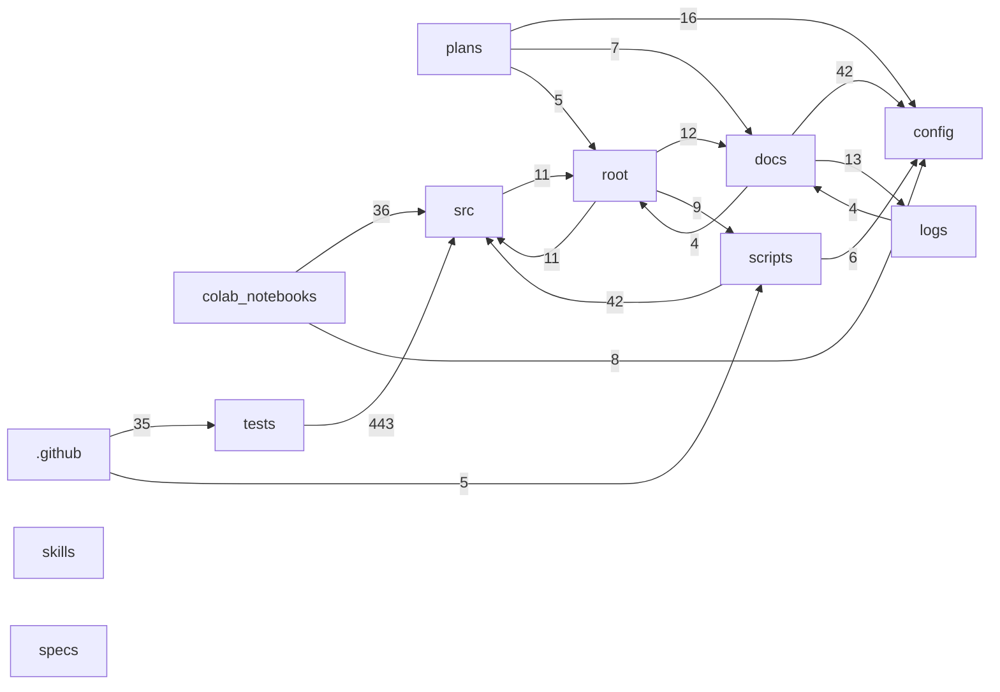

# Repository File Relationships (Detailed)

- Generated at (UTC): `2026-02-26T16:16:59Z`
- Scan root: `.`
- Excluded directories: `.venv,.git`
- Deep inference: `enabled`
- Total files scanned: `264`

## Legend

- `relation_type`: semantic connection from source file to target file.
- `confidence=explicit`: parsed from direct syntax/link/command/path evidence.
- `confidence=inferred`: heuristic or contextual relationship.

## Global Metrics

### File Counts by Type

| Type | Count |
|---|---:|
| `.py` | 125 |
| `.md` | 80 |
| `.pdf` | 12 |
| `.ipynb` | 11 |
| `.yaml` | 9 |
| `.json` | 7 |
| `<noext>` | 5 |
| `.tex` | 4 |
| `.log` | 3 |
| `.txt` | 3 |
| `.example` | 1 |
| `.ini` | 1 |
| `.sh` | 1 |
| `.yml` | 1 |
| `.zip` | 1 |

### File Counts by Category

| Category | Count |
|---|---:|
| `docs` | 66 |
| `src` | 54 |
| `tests` | 42 |
| `scripts` | 24 |
| `skills` | 24 |
| `root` | 18 |
| `colab_notebooks` | 12 |
| `plans` | 9 |
| `config` | 7 |
| `logs` | 4 |
| `.github` | 3 |
| `specs` | 1 |

### Edge Counts by Relation Type

| Relation Type | Count |
|---|---:|
| `imports` | 526 |
| `validates` | 186 |
| `mirror_of` | 136 |
| `links_to` | 80 |
| `uses_config` | 72 |
| `mentions_artifact` | 48 |
| `invokes_tests` | 35 |
| `owned_by_context` | 17 |
| `references_path` | 7 |
| `compatibility_alias` | 5 |
| `invokes` | 5 |
| `delegates_to_script` | 4 |
| `compatibility_mirror` | 2 |

### Edge Counts by Confidence

| Confidence | Count |
|---|---:|
| `explicit` | 946 |
| `inferred` | 177 |

## High-Level Relationship Map



## Directory-Level Relationship Matrix

| Source \ Target | `.github` | `colab_notebooks` | `config` | `docs` | `logs` | `plans` | `root` | `scripts` | `skills` | `specs` | `src` | `tests` |
|---|---:|---:|---:|---:|---:|---:|---:|---:|---:|---:|---:|---:|
| `.github` | 0 | 0 | 0 | 0 | 1 | 0 | 0 | 5 | 0 | 0 | 0 | 35 |
| `colab_notebooks` | 0 | 1 | 8 | 0 | 0 | 0 | 3 | 2 | 0 | 0 | 36 | 0 |
| `config` | 0 | 0 | 2 | 0 | 1 | 0 | 0 | 0 | 0 | 0 | 0 | 0 |
| `docs` | 0 | 1 | 42 | 74 | 13 | 0 | 4 | 2 | 0 | 0 | 0 | 0 |
| `logs` | 0 | 0 | 0 | 4 | 0 | 0 | 0 | 0 | 0 | 0 | 0 | 0 |
| `plans` | 0 | 1 | 16 | 7 | 2 | 2 | 5 | 0 | 0 | 0 | 4 | 1 |
| `root` | 0 | 4 | 2 | 12 | 1 | 0 | 0 | 9 | 0 | 0 | 11 | 0 |
| `scripts` | 0 | 0 | 6 | 0 | 2 | 0 | 0 | 0 | 0 | 0 | 42 | 0 |
| `skills` | 0 | 0 | 4 | 0 | 0 | 0 | 0 | 0 | 0 | 0 | 0 | 0 |
| `specs` | 0 | 0 | 0 | 0 | 0 | 0 | 0 | 0 | 0 | 0 | 0 | 0 |
| `src` | 0 | 0 | 1 | 0 | 2 | 0 | 11 | 0 | 0 | 0 | 260 | 0 |
| `tests` | 0 | 0 | 0 | 0 | 0 | 0 | 0 | 2 | 0 | 0 | 443 | 39 |

## Per-File Relationship Catalog

### `.coveragerc`

- `type`: `<noext>`
- `size`: `1239` bytes (1.21 KB)
- `sha256`: `2e86e1d17afc9a84936e5cfa0249dfc888d981706b51964de04d4cd37b6831d7`
- `category`: `root`
- `purpose`: Repository file artifact.

- `outgoing_edges`: 0 (explicit=0, inferred=0)
  - none

- `incoming_edges`: 0 (explicit=0, inferred=0)
  - none

### `.env.example`

- `type`: `.example`
- `size`: `533` bytes (533 B)
- `sha256`: `72ed47a648b6e30b773dfe0ab2eb8c13919d9738823f6ef2ee052c7535547a75`
- `category`: `root`
- `purpose`: Repository file artifact.

- `outgoing_edges`: 0 (explicit=0, inferred=0)
  - none

- `incoming_edges`: 0 (explicit=0, inferred=0)
  - none

### `.github/ISSUE_TEMPLATE.md`

- `type`: `.md`
- `size`: `2035` bytes (1.99 KB)
- `sha256`: `3f744e389bb6455ab2e53868a1a0e372fee85840f8f2540306f1d4393143cf87`
- `category`: `.github`
- `purpose`: Bug Report.

- `outgoing_edges`: 0 (explicit=0, inferred=0)
  - none

- `incoming_edges`: 0 (explicit=0, inferred=0)
  - none

### `.github/PULL_REQUEST_TEMPLATE.md`

- `type`: `.md`
- `size`: `2052` bytes (2.00 KB)
- `sha256`: `ced5397d0f569342e3841011d731d7d71023ea042fb3b89aa6105aae9f084249`
- `category`: `.github`
- `purpose`: Description.

- `outgoing_edges`: 0 (explicit=0, inferred=0)
  - none

- `incoming_edges`: 0 (explicit=0, inferred=0)
  - none

### `.github/workflows/ci.yml`

- `type`: `.yml`
- `size`: `4026` bytes (3.93 KB)
- `sha256`: `307c8b537648ef885f4d241e46fbf086c682110588be7824117dc63ca8fe2b42`
- `category`: `.github`
- `purpose`: Repository file artifact.

- `outgoing_edges`: 41 (explicit=40, inferred=1)
  - [`mentions_artifact` | `inferred`] -> `logs/phase5_router_benchmark.json` | evidence: text mention of 'phase5_router_benchmark.json'
  - [`invokes` | `explicit`] -> `scripts/benchmark_router_phase5.py` | evidence: workflow command: python scripts/benchmark_router_phase5.py
  - [`invokes` | `explicit`] -> `scripts/check_markdown_links.py` | evidence: workflow command: python scripts/check_markdown_links.py --root .
  - [`invokes` | `explicit`] -> `scripts/check_phase5_perf_regression.py` | evidence: workflow command: python scripts/check_phase5_perf_regression.py
  - [`invokes` | `explicit`] -> `scripts/profile_policy_sanity.py` | evidence: workflow command: python scripts/profile_policy_sanity.py
  - [`invokes` | `explicit`] -> `scripts/run_policy_regression_bundle.py` | evidence: workflow command: python scripts/run_policy_regression_bundle.py
  - [`invokes_tests` | `explicit`] -> `tests/colab/test_data_pipeline.py` | evidence: workflow command: pytest tests/ -v --cov=src --cov-report=xml --cov-report=html
  - [`invokes_tests` | `explicit`] -> `tests/colab/test_environment.py` | evidence: workflow command: pytest tests/ -v --cov=src --cov-report=xml --cov-report=html
  - [`invokes_tests` | `explicit`] -> `tests/colab/test_smoke_training.py` | evidence: workflow command: pytest tests/ -v --cov=src --cov-report=xml --cov-report=html
  - [`invokes_tests` | `explicit`] -> `tests/fixtures/test_fixtures.py` | evidence: workflow command: pytest tests/ -v --cov=src --cov-report=xml --cov-report=html
  - [`invokes_tests` | `explicit`] -> `tests/integration/test_colab_integration.py` | evidence: workflow command: pytest tests/ -v --cov=src --cov-report=xml --cov-report=html
  - [`invokes_tests` | `explicit`] -> `tests/integration/test_configuration_final.py` | evidence: workflow command: pytest tests/ -v --cov=src --cov-report=xml --cov-report=html
  - [`invokes_tests` | `explicit`] -> `tests/integration/test_configuration_integration.py` | evidence: workflow command: pytest tests/ -v --cov=src --cov-report=xml --cov-report=html
  - [`invokes_tests` | `explicit`] -> `tests/integration/test_full_pipeline.py` | evidence: workflow command: pytest tests/ -v --cov=src --cov-report=xml --cov-report=html
  - [`invokes_tests` | `explicit`] -> `tests/unit/adapters/test_adapter_comprehensive.py` | evidence: workflow command: pytest tests/ -v --cov=src --cov-report=xml --cov-report=html
  - [`invokes_tests` | `explicit`] -> `tests/unit/adapters/test_prototypes.py` | evidence: workflow command: pytest tests/ -v --cov=src --cov-report=xml --cov-report=html
  - [`invokes_tests` | `explicit`] -> `tests/unit/dataset/test_colab_pipeline.py` | evidence: workflow command: pytest tests/ -v --cov=src --cov-report=xml --cov-report=html
  - [`invokes_tests` | `explicit`] -> `tests/unit/dataset/test_dataset_preparation.py` | evidence: workflow command: pytest tests/ -v --cov=src --cov-report=xml --cov-report=html
  - [`invokes_tests` | `explicit`] -> `tests/unit/debugging/test_debugging_monitoring.py` | evidence: workflow command: pytest tests/ -v --cov=src --cov-report=xml --cov-report=html
  - [`invokes_tests` | `explicit`] -> `tests/unit/evaluation/test_evaluation_metrics.py` | evidence: workflow command: pytest tests/ -v --cov=src --cov-report=xml --cov-report=html
  - [`invokes_tests` | `explicit`] -> `tests/unit/monitoring/test_monitoring_metrics.py` | evidence: workflow command: pytest tests/ -v --cov=src --cov-report=xml --cov-report=html
  - [`invokes_tests` | `explicit`] -> `tests/unit/ood/test_dynamic_thresholds_improved.py` | evidence: workflow command: pytest tests/ -v --cov=src --cov-report=xml --cov-report=html
  - [`invokes_tests` | `explicit`] -> `tests/unit/ood/test_ood_comprehensive.py` | evidence: workflow command: pytest tests/ -v --cov=src --cov-report=xml --cov-report=html
  - [`invokes_tests` | `explicit`] -> `tests/unit/pipeline/test_pipeline_comprehensive.py` | evidence: workflow command: pytest tests/ -v --cov=src --cov-report=xml --cov-report=html
  - [`invokes_tests` | `explicit`] -> `tests/unit/pipeline/test_pipeline_strict_router_init.py` | evidence: workflow command: pytest tests/ -v --cov=src --cov-report=xml --cov-report=html
  - [`invokes_tests` | `explicit`] -> `tests/unit/router/test_router_comprehensive.py` | evidence: workflow command: pytest tests/ -v --cov=src --cov-report=xml --cov-report=html
  - [`invokes_tests` | `explicit`] -> `tests/unit/router/test_vlm_policy_stage_order.py` | evidence: workflow command: pytest tests/ -v --cov=src --cov-report=xml --cov-report=html
  - [`invokes_tests` | `explicit`] -> `tests/unit/router/test_vlm_strict_loading.py` | evidence: workflow command: pytest tests/ -v --cov=src --cov-report=xml --cov-report=html
  - [`invokes_tests` | `explicit`] -> `tests/unit/security/test_security.py` | evidence: workflow command: pytest tests/ -v --cov=src --cov-report=xml --cov-report=html
  - [`invokes_tests` | `explicit`] -> `tests/unit/test_ood.py` | evidence: workflow command: pytest tests/ -v --cov=src --cov-report=xml --cov-report=html
  - [`invokes_tests` | `explicit`] -> `tests/unit/test_router.py` | evidence: workflow command: pytest tests/ -v --cov=src --cov-report=xml --cov-report=html
  - [`invokes_tests` | `explicit`] -> `tests/unit/training/test_phase2_sd_lora.py` | evidence: workflow command: pytest tests/ -v --cov=src --cov-report=xml --cov-report=html
  - [`invokes_tests` | `explicit`] -> `tests/unit/training/test_phase3_conec_lora.py` | evidence: workflow command: pytest tests/ -v --cov=src --cov-report=xml --cov-report=html
  - [`invokes_tests` | `explicit`] -> `tests/unit/utils/test_bug_fixes_simple.py` | evidence: workflow command: pytest tests/ -v --cov=src --cov-report=xml --cov-report=html
  - [`invokes_tests` | `explicit`] -> `tests/unit/utils/test_imports.py` | evidence: workflow command: pytest tests/ -v --cov=src --cov-report=xml --cov-report=html
  - [`invokes_tests` | `explicit`] -> `tests/unit/utils/test_minimal_implementation.py` | evidence: workflow command: pytest tests/ -v --cov=src --cov-report=xml --cov-report=html
  - [`invokes_tests` | `explicit`] -> `tests/unit/utils/test_model_utils.py` | evidence: workflow command: pytest tests/ -v --cov=src --cov-report=xml --cov-report=html
  - [`invokes_tests` | `explicit`] -> `tests/unit/utils/test_optimizations.py` | evidence: workflow command: pytest tests/ -v --cov=src --cov-report=xml --cov-report=html
  - [`invokes_tests` | `explicit`] -> `tests/unit/validation/test_schemas.py` | evidence: workflow command: pytest tests/ -v --cov=src --cov-report=xml --cov-report=html
  - [`invokes_tests` | `explicit`] -> `tests/unit/validation/test_validation_comprehensive.py` | evidence: workflow command: pytest tests/ -v --cov=src --cov-report=xml --cov-report=html
  - [`invokes_tests` | `explicit`] -> `tests/unit/visualization/test_visualization.py` | evidence: workflow command: pytest tests/ -v --cov=src --cov-report=xml --cov-report=html

- `incoming_edges`: 0 (explicit=0, inferred=0)
  - none

### `.gitignore`

- `type`: `<noext>`
- `size`: `1653` bytes (1.61 KB)
- `sha256`: `809d5643e49dd143686e6b34cf0cbc59102a8ecbbd3ac6adfbd9f8d01010e0ae`
- `category`: `root`
- `purpose`: Repository file artifact.

- `outgoing_edges`: 0 (explicit=0, inferred=0)
  - none

- `incoming_edges`: 0 (explicit=0, inferred=0)
  - none

### `.pre-commit-config.yaml`

- `type`: `.yaml`
- `size`: `256` bytes (256 B)
- `sha256`: `9f4e23c5c04580967941fbcee87d0a6c2d56d3b835ccb15ba8f2737f361c82db`
- `category`: `root`
- `purpose`: Repository file artifact.

- `outgoing_edges`: 0 (explicit=0, inferred=0)
  - none

- `incoming_edges`: 0 (explicit=0, inferred=0)
  - none

### `AGENTS.md`

- `type`: `.md`
- `size`: `2737` bytes (2.67 KB)
- `sha256`: `a576ea9203b103bf80ab47ceefa87af355ff6d9f1504346bd8654486fa61a9e2`
- `category`: `root`
- `purpose`: Skills.

- `outgoing_edges`: 0 (explicit=0, inferred=0)
  - none

- `incoming_edges`: 0 (explicit=0, inferred=0)
  - none

### `LICENSE`

- `type`: `<noext>`
- `size`: `1099` bytes (1.07 KB)
- `sha256`: `301f2ceafab660c8b22b12dc3861b73717e2b875158c77db1ac14cca07594240`
- `category`: `root`
- `purpose`: Repository file artifact.

- `outgoing_edges`: 0 (explicit=0, inferred=0)
  - none

- `incoming_edges`: 0 (explicit=0, inferred=0)
  - none

### `README.md`

- `type`: `.md`
- `size`: `15414` bytes (15.05 KB)
- `sha256`: `3eaf50d0059ed71437496876e7bb3811f2a6ee2122804469bf6c8b2052108d86`
- `category`: `root`
- `purpose`: Primary project overview and quick-start entrypoint.

- `outgoing_edges`: 15 (explicit=14, inferred=1)
  - [`links_to` | `explicit`] -> `colab_notebooks/README.md` | evidence: markdown link colab_notebooks/README.md
  - [`links_to` | `explicit`] -> `docs/README.md` | evidence: markdown link docs/README.md
  - [`links_to` | `explicit`] -> `docs/REPO_FILE_RELATIONS.md` | evidence: markdown link docs/REPO_FILE_RELATIONS.md
  - [`links_to` | `explicit`] -> `docs/architecture/crop-router-technical-guide.md` | evidence: markdown link docs/architecture/crop-router-technical-guide.md
  - [`links_to` | `explicit`] -> `docs/architecture/overview.md` | evidence: markdown link docs/architecture/overview.md
  - [`links_to` | `explicit`] -> `docs/architecture/vlm-pipeline-guide.md` | evidence: markdown link docs/architecture/vlm-pipeline-guide.md
  - [`links_to` | `explicit`] -> `docs/development/development-setup.md` | evidence: markdown link docs/development/development-setup.md
  - [`links_to` | `explicit`] -> `docs/guides/CHECKPOINT_SYSTEM_GUIDE.md` | evidence: markdown link docs/guides/CHECKPOINT_SYSTEM_GUIDE.md
  - [`links_to` | `explicit`] -> `docs/guides/SEAMLESS_AUTOTRAIN_GUIDE.md` | evidence: markdown link docs/guides/SEAMLESS_AUTOTRAIN_GUIDE.md
  - [`links_to` | `explicit`] -> `docs/reports/README.md` | evidence: markdown link docs/reports/README.md
  - [`links_to` | `explicit`] -> `docs/user_guide/cheatsheet_colab.md` | evidence: markdown link docs/user_guide/cheatsheet_colab.md
  - [`links_to` | `explicit`] -> `docs/user_guide/colab_training_manual.md` | evidence: markdown link docs/user_guide/colab_training_manual.md
  - [`links_to` | `explicit`] -> `docs/user_guide/tomato_crop_adapter_manual.md` | evidence: markdown link docs/user_guide/tomato_crop_adapter_manual.md
  - [`mentions_artifact` | `inferred`] -> `logs/training.log` | evidence: text mention of 'training.log'
  - [`links_to` | `explicit`] -> `scripts/README.md` | evidence: markdown link scripts/README.md

- `incoming_edges`: 4 (explicit=4, inferred=0)
  - [`links_to` | `explicit`] <- `docs/README.md` | evidence: markdown link ../README.md
  - [`links_to` | `explicit`] <- `docs/guides/SEAMLESS_AUTOTRAIN_GUIDE.md` | evidence: markdown link ../../README.md
  - [`links_to` | `explicit`] <- `docs/user_guide/colab_training_manual.md` | evidence: markdown link ../README.md
  - [`links_to` | `explicit`] <- `plans/optimization_phase1_consistency_report.md` | evidence: markdown link ../README.md

### `SECURITY.md`

- `type`: `.md`
- `size`: `3079` bytes (3.01 KB)
- `sha256`: `69ec3ebfc40e84bd9e25b163ec96c67ed44d4d1438e476eb17a6d2e1c814addd`
- `category`: `root`
- `purpose`: Security Policy.

- `outgoing_edges`: 0 (explicit=0, inferred=0)
  - none

- `incoming_edges`: 1 (explicit=1, inferred=0)
  - [`links_to` | `explicit`] <- `docs/README.md` | evidence: markdown link ../SECURITY.md

### `colab_bootstrap.ipynb`

- `type`: `.ipynb`
- `size`: `34991` bytes (34.17 KB)
- `sha256`: `cff933b28b5846ff80fb7724f50ba96cd47e3e906754d594f0de9a9ffd85657c`
- `category`: `root`
- `purpose`: Repository file artifact.

- `outgoing_edges`: 5 (explicit=5, inferred=0)
  - [`compatibility_mirror` | `explicit`] -> `colab_notebooks/colab_bootstrap.ipynb` | evidence: root mirror of canonical notebook
  - [`mirror_of` | `explicit`] -> `colab_notebooks/colab_bootstrap.ipynb` | evidence: sha256 match cff933b28b58
  - [`references_path` | `explicit`] -> `colab_notebooks/requirements_colab.txt` | evidence: path reference colab_notebooks/requirements_colab.txt
  - [`references_path` | `explicit`] -> `config/colab.json` | evidence: path reference config/colab.json
  - [`uses_config` | `explicit`] -> `config/colab.json` | evidence: mentions config path config/colab.json

- `incoming_edges`: 2 (explicit=2, inferred=0)
  - [`compatibility_mirror` | `explicit`] <- `colab_notebooks/colab_bootstrap.ipynb` | evidence: canonical notebook mirrored to root compatibility path
  - [`mirror_of` | `explicit`] <- `colab_notebooks/colab_bootstrap.ipynb` | evidence: sha256 match cff933b28b58

### `colab_notebooks/0_AUTO_TRAIN_COMPLETE_PIPELINE.ipynb`

- `type`: `.ipynb`
- `size`: `50186` bytes (49.01 KB)
- `sha256`: `b5af91bb7ce6a6cdebca164cfaf5a934d09f828d3aadeffd16ccf9f511bb18d4`
- `category`: `colab_notebooks`
- `purpose`: AADS-ULoRA v5.5 - Complete Auto-Training Pipeline.

- `outgoing_edges`: 7 (explicit=7, inferred=0)
  - [`imports` | `explicit`] -> `src/core/config_manager.py` | evidence: notebook from-import src.core.config_manager
  - [`imports` | `explicit`] -> `src/core/config_manager.py` | evidence: notebook from-import src.core.config_manager.config_manager
  - [`imports` | `explicit`] -> `src/core/config_manager.py` | evidence: notebook from-import src.core.config_manager.get_config
    from src
  - [`imports` | `explicit`] -> `src/training/colab_phase1_training.py` | evidence: notebook from-import src.training.colab_phase1_training
  - [`imports` | `explicit`] -> `src/training/colab_phase1_training.py` | evidence: notebook from-import src.training.colab_phase1_training.ColabPhase1Trainer
    from src
  - [`imports` | `explicit`] -> `src/training/colab_phase3_conec_lora.py` | evidence: notebook from-import src.training.colab_phase3_conec_lora
  - [`imports` | `explicit`] -> `src/training/colab_phase3_conec_lora.py` | evidence: notebook from-import src.training.colab_phase3_conec_lora.ColabPhase3Trainer
    import torch
    import torchvision
    from PIL import Image
    
    print

- `incoming_edges`: 0 (explicit=0, inferred=0)
  - none

### `colab_notebooks/1_data_preparation.ipynb`

- `type`: `.ipynb`
- `size`: `16407` bytes (16.02 KB)
- `sha256`: `f38cd67561fb2c9ecd18086f34f67010b8bd7293d38a6658c843ae871642e1b9`
- `category`: `colab_notebooks`
- `purpose`: AADS-ULoRA Colab: Data Preparation.

- `outgoing_edges`: 2 (explicit=2, inferred=0)
  - [`imports` | `explicit`] -> `src/core/colab_contract.py` | evidence: notebook from-import src.core.colab_contract
  - [`imports` | `explicit`] -> `src/core/colab_contract.py` | evidence: notebook from-import src.core.colab_contract.is_placeholder_drive_id

logging

- `incoming_edges`: 0 (explicit=0, inferred=0)
  - none

### `colab_notebooks/2_phase1_training.ipynb`

- `type`: `.ipynb`
- `size`: `14167` bytes (13.83 KB)
- `sha256`: `e48ba63f223dbd70dc72c89d13abe39d7b4e4dce3c31f55363fab3f0b9ac74cd`
- `category`: `colab_notebooks`
- `purpose`: AADS-ULoRA Colab: Phase 1 Training (DoRA).

- `outgoing_edges`: 4 (explicit=4, inferred=0)
  - [`imports` | `explicit`] -> `src/dataset/colab_datasets.py` | evidence: notebook from-import src.dataset.colab_datasets
  - [`imports` | `explicit`] -> `src/dataset/colab_datasets.py` | evidence: notebook from-import src.dataset.colab_datasets.ColabCropDataset
from src
  - [`imports` | `explicit`] -> `src/training/colab_phase1_training.py` | evidence: notebook from-import src.training.colab_phase1_training
  - [`imports` | `explicit`] -> `src/training/colab_phase1_training.py` | evidence: notebook from-import src.training.colab_phase1_training.ColabPhase1Trainer

- `incoming_edges`: 0 (explicit=0, inferred=0)
  - none

### `colab_notebooks/3_phase2_training.ipynb`

- `type`: `.ipynb`
- `size`: `14592` bytes (14.25 KB)
- `sha256`: `cffbd5502adde103535bcc9b9b45053822c0a20c829a03bf08f66df09a75bed1`
- `category`: `colab_notebooks`
- `purpose`: AADS-ULoRA Colab: Phase 2 Training (SD-LoRA).

- `outgoing_edges`: 4 (explicit=4, inferred=0)
  - [`imports` | `explicit`] -> `src/dataset/colab_datasets.py` | evidence: notebook from-import src.dataset.colab_datasets
  - [`imports` | `explicit`] -> `src/dataset/colab_datasets.py` | evidence: notebook from-import src.dataset.colab_datasets.ColabCropDataset
from src
  - [`imports` | `explicit`] -> `src/training/colab_phase2_sd_lora.py` | evidence: notebook from-import src.training.colab_phase2_sd_lora
  - [`imports` | `explicit`] -> `src/training/colab_phase2_sd_lora.py` | evidence: notebook from-import src.training.colab_phase2_sd_lora.ColabPhase2Trainer

- `incoming_edges`: 0 (explicit=0, inferred=0)
  - none

### `colab_notebooks/4_phase3_training.ipynb`

- `type`: `.ipynb`
- `size`: `20042` bytes (19.57 KB)
- `sha256`: `b92c00bd2e29fa3712e8b0804b3c7e79897e2e5e15a453fc59a9873c6c461466`
- `category`: `colab_notebooks`
- `purpose`: AADS-ULoRA Colab: Phase 3 Training (CoNeC-LoRA).

- `outgoing_edges`: 5 (explicit=5, inferred=0)
  - [`imports` | `explicit`] -> `src/dataset/colab_datasets.py` | evidence: notebook from-import src.dataset.colab_datasets
  - [`imports` | `explicit`] -> `src/dataset/colab_datasets.py` | evidence: notebook from-import src.dataset.colab_datasets.ColabDomainShiftDataset
from src
  - [`imports` | `explicit`] -> `src/training/colab_phase3_conec_lora.py` | evidence: notebook from-import src.training.colab_phase3_conec_lora
  - [`imports` | `explicit`] -> `src/training/colab_phase3_conec_lora.py` | evidence: notebook from-import src.training.colab_phase3_conec_lora.CoNeCConfig
from src
  - [`imports` | `explicit`] -> `src/training/colab_phase3_conec_lora.py` | evidence: notebook from-import src.training.colab_phase3_conec_lora.ColabPhase3Trainer

- `incoming_edges`: 0 (explicit=0, inferred=0)
  - none

### `colab_notebooks/5_testing_validation.ipynb`

- `type`: `.ipynb`
- `size`: `38362` bytes (37.46 KB)
- `sha256`: `055b8711a492cc4be7abcd3e674e5baa220ef9fdf085aea6a100a1eee33c23b8`
- `category`: `colab_notebooks`
- `purpose`: AADS-ULoRA Colab: Testing and Validation.

- `outgoing_edges`: 12 (explicit=12, inferred=0)
  - [`references_path` | `explicit`] -> `config/colab.json` | evidence: path reference config/colab.json
  - [`uses_config` | `explicit`] -> `config/colab.json` | evidence: mentions config path config/colab.json
  - [`imports` | `explicit`] -> `src/core/artifact_manifest.py` | evidence: notebook from-import src.core.artifact_manifest
  - [`imports` | `explicit`] -> `src/core/artifact_manifest.py` | evidence: notebook from-import src.core.artifact_manifest.validate_manifest_artifacts

gate_check
  - [`imports` | `explicit`] -> `src/dataset/colab_datasets.py` | evidence: notebook from-import src.dataset.colab_datasets
  - [`imports` | `explicit`] -> `src/dataset/colab_datasets.py` | evidence: notebook from-import src.dataset.colab_datasets.ColabCropDataset
  - [`imports` | `explicit`] -> `src/dataset/colab_datasets.py` | evidence: notebook from-import src.dataset.colab_datasets.ColabDomainShiftDataset
from src
  - [`imports` | `explicit`] -> `src/training/colab_phase1_training.py` | evidence: notebook from-import src.training.colab_phase1_training
  - [`imports` | `explicit`] -> `src/training/colab_phase1_training.py` | evidence: notebook from-import src.training.colab_phase1_training.ColabPhase1Trainer
from src
  - [`imports` | `explicit`] -> `src/training/colab_phase3_conec_lora.py` | evidence: notebook from-import src.training.colab_phase3_conec_lora
  - [`imports` | `explicit`] -> `src/training/colab_phase3_conec_lora.py` | evidence: notebook from-import src.training.colab_phase3_conec_lora.CoNeCConfig
from src
  - [`imports` | `explicit`] -> `src/training/colab_phase3_conec_lora.py` | evidence: notebook from-import src.training.colab_phase3_conec_lora.ColabPhase3Trainer

- `incoming_edges`: 0 (explicit=0, inferred=0)
  - none

### `colab_notebooks/6_performance_monitoring.ipynb`

- `type`: `.ipynb`
- `size`: `28800` bytes (28.12 KB)
- `sha256`: `e6b56748a3a2f2ce2eb76c8b6f15db3b64123732a1c2c18d6dbeec679f969b89`
- `category`: `colab_notebooks`
- `purpose`: AADS-ULoRA Colab: Performance Monitoring.

- `outgoing_edges`: 0 (explicit=0, inferred=0)
  - none

- `incoming_edges`: 0 (explicit=0, inferred=0)
  - none

### `colab_notebooks/7_VLM_ROUTER_ONECLICK.ipynb`

- `type`: `.ipynb`
- `size`: `13582` bytes (13.26 KB)
- `sha256`: `fe44e23285ea31db5d902fc2f2eec29105bebcbd79edd776fe54a1199d8c9324`
- `category`: `colab_notebooks`
- `purpose`: AADS-ULoRA VLM Router (One-Click Colab).

- `outgoing_edges`: 6 (explicit=6, inferred=0)
  - [`references_path` | `explicit`] -> `config/colab.json` | evidence: path reference config/colab.json
  - [`uses_config` | `explicit`] -> `config/colab.json` | evidence: mentions config path config/colab.json
  - [`references_path` | `explicit`] -> `config/plant_taxonomy.json` | evidence: path reference config/plant_taxonomy.json
  - [`uses_config` | `explicit`] -> `config/plant_taxonomy.json` | evidence: mentions config path config/plant_taxonomy.json
  - [`imports` | `explicit`] -> `src/router/vlm_pipeline.py` | evidence: notebook from-import src.router.vlm_pipeline
  - [`imports` | `explicit`] -> `src/router/vlm_pipeline.py` | evidence: notebook from-import src.router.vlm_pipeline.VLMPipeline
except Exception

- `incoming_edges`: 0 (explicit=0, inferred=0)
  - none

### `colab_notebooks/README.md`

- `type`: `.md`
- `size`: `3133` bytes (3.06 KB)
- `sha256`: `0740c895ccd827b81c00eaf10f124d83e38953fcff5b6aa76e93bae9ed196356`
- `category`: `colab_notebooks`
- `purpose`: Colab notebook workflow artifact.

- `outgoing_edges`: 2 (explicit=2, inferred=0)
  - [`links_to` | `explicit`] -> `scripts/README.md` | evidence: markdown link ../scripts/README.md
  - [`links_to` | `explicit`] -> `scripts/README.md` | evidence: markdown link ../scripts/README.md#vlm-test-decision-matrix

- `incoming_edges`: 2 (explicit=2, inferred=0)
  - [`links_to` | `explicit`] <- `README.md` | evidence: markdown link colab_notebooks/README.md
  - [`links_to` | `explicit`] <- `docs/README.md` | evidence: markdown link ../colab_notebooks/README.md

### `colab_notebooks/TEST_VLM_ROUTER.ipynb`

- `type`: `.ipynb`
- `size`: `15817` bytes (15.45 KB)
- `sha256`: `2650951c543f949c1c82531cf0c243b8a7ae9f71479fd2049a4e49a8a40f55eb`
- `category`: `colab_notebooks`
- `purpose`: 🧪 VLM Router Test - GroundingDINO → SAM2 → BioCLIP2.

- `outgoing_edges`: 2 (explicit=2, inferred=0)
  - [`imports` | `explicit`] -> `src/router/vlm_pipeline.py` | evidence: notebook from-import src.router.vlm_pipeline
  - [`imports` | `explicit`] -> `src/router/vlm_pipeline.py` | evidence: notebook from-import src.router.vlm_pipeline.VLMPipeline
import torch

- `incoming_edges`: 0 (explicit=0, inferred=0)
  - none

### `colab_notebooks/colab_bootstrap.ipynb`

- `type`: `.ipynb`
- `size`: `34991` bytes (34.17 KB)
- `sha256`: `cff933b28b5846ff80fb7724f50ba96cd47e3e906754d594f0de9a9ffd85657c`
- `category`: `colab_notebooks`
- `purpose`: AADS-ULoRA Colab Bootstrap.

- `outgoing_edges`: 5 (explicit=5, inferred=0)
  - [`compatibility_mirror` | `explicit`] -> `colab_bootstrap.ipynb` | evidence: canonical notebook mirrored to root compatibility path
  - [`mirror_of` | `explicit`] -> `colab_bootstrap.ipynb` | evidence: sha256 match cff933b28b58
  - [`references_path` | `explicit`] -> `colab_notebooks/requirements_colab.txt` | evidence: path reference colab_notebooks/requirements_colab.txt
  - [`references_path` | `explicit`] -> `config/colab.json` | evidence: path reference config/colab.json
  - [`uses_config` | `explicit`] -> `config/colab.json` | evidence: mentions config path config/colab.json

- `incoming_edges`: 2 (explicit=2, inferred=0)
  - [`compatibility_mirror` | `explicit`] <- `colab_bootstrap.ipynb` | evidence: root mirror of canonical notebook
  - [`mirror_of` | `explicit`] <- `colab_bootstrap.ipynb` | evidence: sha256 match cff933b28b58

### `colab_notebooks/requirements_colab.txt`

- `type`: `.txt`
- `size`: `123` bytes (123 B)
- `sha256`: `4372329443a79543a1dc3dfb531350409b124e388dcf3f50e4626d871b653c76`
- `category`: `colab_notebooks`
- `purpose`: Colab notebook workflow artifact.

- `outgoing_edges`: 1 (explicit=1, inferred=0)
  - [`compatibility_alias` | `explicit`] -> `requirements_colab.txt` | evidence: mirror requirements file includes canonical dependency list

- `incoming_edges`: 3 (explicit=3, inferred=0)
  - [`references_path` | `explicit`] <- `colab_bootstrap.ipynb` | evidence: path reference colab_notebooks/requirements_colab.txt
  - [`references_path` | `explicit`] <- `colab_notebooks/colab_bootstrap.ipynb` | evidence: path reference colab_notebooks/requirements_colab.txt
  - [`links_to` | `explicit`] <- `plans/optimization_executive_summary.md` | evidence: markdown link ../colab_notebooks/requirements_colab.txt

### `colab_test_upload.py`

- `type`: `.py`
- `size`: `393` bytes (393 B)
- `sha256`: `7314009c8eb62779c97fa225a6785e1c65e3115ff10c75270626e3759a41bb7c`
- `category`: `root`
- `purpose`: Compatibility wrapper for Colab upload helper test.

- `outgoing_edges`: 2 (explicit=2, inferred=0)
  - [`compatibility_alias` | `explicit`] -> `scripts/colab_test_upload.py` | evidence: canonical script location marker
  - [`delegates_to_script` | `explicit`] -> `scripts/colab_test_upload.py` | evidence: runpy.run_path wrapper dispatch

- `incoming_edges`: 0 (explicit=0, inferred=0)
  - none

### `config/.gitattributes`

- `type`: `<noext>`
- `size`: `73` bytes (73 B)
- `sha256`: `8cce4616b9e9f9a49c11769d20655620abdd0d8476e93358a4730ad71bec6454`
- `category`: `config`
- `purpose`: Configuration contract or runtime settings file.

- `outgoing_edges`: 0 (explicit=0, inferred=0)
  - none

- `incoming_edges`: 2 (explicit=2, inferred=0)
  - [`uses_config` | `explicit`] <- `docs/REPO_FILE_RELATIONS_DETAILED.md` | evidence: mentions config path config/.gitattributes
  - [`uses_config` | `explicit`] <- `docs/reports/repository_relationships_snapshot.json` | evidence: mentions config path config/.gitattributes

### `config/.gitignore`

- `type`: `<noext>`
- `size`: `1516` bytes (1.48 KB)
- `sha256`: `a8bb901d46b1c29e94b73cfed1a6f5e1f6854e3302aff8437e8b34d18191bf90`
- `category`: `config`
- `purpose`: Configuration contract or runtime settings file.

- `outgoing_edges`: 0 (explicit=0, inferred=0)
  - none

- `incoming_edges`: 2 (explicit=2, inferred=0)
  - [`uses_config` | `explicit`] <- `docs/REPO_FILE_RELATIONS_DETAILED.md` | evidence: mentions config path config/.gitignore
  - [`uses_config` | `explicit`] <- `docs/reports/repository_relationships_snapshot.json` | evidence: mentions config path config/.gitignore

### `config/base.json`

- `type`: `.json`
- `size`: `7415` bytes (7.24 KB)
- `sha256`: `0fc5fbe8e83904c7ddc66b377316a063d9b98b9189dae3a8ca6b1e55d0dd9508`
- `category`: `config`
- `purpose`: Configuration contract or runtime settings file.

- `outgoing_edges`: 1 (explicit=1, inferred=0)
  - [`uses_config` | `explicit`] -> `config/plant_taxonomy.json` | evidence: mentions config path config/plant_taxonomy.json

- `incoming_edges`: 11 (explicit=11, inferred=0)
  - [`uses_config` | `explicit`] <- `docs/REPO_FILE_RELATIONS.md` | evidence: mentions config path config/base.json
  - [`uses_config` | `explicit`] <- `docs/REPO_FILE_RELATIONS_DETAILED.md` | evidence: mentions config path config/base.json
  - [`uses_config` | `explicit`] <- `docs/architecture/crop-router-technical-guide.md` | evidence: mentions config path config/base.json
  - [`uses_config` | `explicit`] <- `docs/development/development-setup.md` | evidence: mentions config path config/base.json
  - [`uses_config` | `explicit`] <- `docs/reports/repository_relationships_snapshot.json` | evidence: mentions config path config/base.json
  - [`uses_config` | `explicit`] <- `docs/security/README.md` | evidence: mentions config path config/base.json
  - [`links_to` | `explicit`] <- `plans/optimization_executive_summary.md` | evidence: markdown link ../config/base.json
  - [`uses_config` | `explicit`] <- `plans/optimization_executive_summary.md` | evidence: mentions config path config/base.json
  - [`uses_config` | `explicit`] <- `plans/optimization_phase2_config_dependency_report.md` | evidence: mentions config path config/base.json
  - [`uses_config` | `explicit`] <- `scripts/profile_policy_sanity.py` | evidence: mentions config path config/base.json
  - [`uses_config` | `explicit`] <- `skills/aads-config-pipeline-guardrails/references/config-pipeline-checklist.md` | evidence: mentions config path config/base.json

### `config/colab.json`

- `type`: `.json`
- `size`: `12934` bytes (12.63 KB)
- `sha256`: `13967abd5b6ec3ef2eae24f6a244bc48e681806ead98401cef2bba09d31bd483`
- `category`: `config`
- `purpose`: Configuration contract or runtime settings file.

- `outgoing_edges`: 2 (explicit=1, inferred=1)
  - [`uses_config` | `explicit`] -> `config/plant_taxonomy.json` | evidence: mentions config path config/plant_taxonomy.json
  - [`mentions_artifact` | `inferred`] -> `logs/training.log` | evidence: text mention of 'training.log'

- `incoming_edges`: 29 (explicit=29, inferred=0)
  - [`references_path` | `explicit`] <- `colab_bootstrap.ipynb` | evidence: path reference config/colab.json
  - [`uses_config` | `explicit`] <- `colab_bootstrap.ipynb` | evidence: mentions config path config/colab.json
  - [`references_path` | `explicit`] <- `colab_notebooks/5_testing_validation.ipynb` | evidence: path reference config/colab.json
  - [`uses_config` | `explicit`] <- `colab_notebooks/5_testing_validation.ipynb` | evidence: mentions config path config/colab.json
  - [`references_path` | `explicit`] <- `colab_notebooks/7_VLM_ROUTER_ONECLICK.ipynb` | evidence: path reference config/colab.json
  - [`uses_config` | `explicit`] <- `colab_notebooks/7_VLM_ROUTER_ONECLICK.ipynb` | evidence: mentions config path config/colab.json
  - [`references_path` | `explicit`] <- `colab_notebooks/colab_bootstrap.ipynb` | evidence: path reference config/colab.json
  - [`uses_config` | `explicit`] <- `colab_notebooks/colab_bootstrap.ipynb` | evidence: mentions config path config/colab.json
  - [`uses_config` | `explicit`] <- `docs/REPO_FILE_RELATIONS.md` | evidence: mentions config path config/colab.json
  - [`uses_config` | `explicit`] <- `docs/REPO_FILE_RELATIONS_DETAILED.md` | evidence: mentions config path config/colab.json
  - [`uses_config` | `explicit`] <- `docs/SAM3_BIOCLIP25_PIPELINE.md` | evidence: mentions config path config/colab.json
  - [`uses_config` | `explicit`] <- `docs/architecture/crop-router-technical-guide.md` | evidence: mentions config path config/colab.json
  - [`uses_config` | `explicit`] <- `docs/colab_migration_guide.md` | evidence: mentions config path config/colab.json
  - [`uses_config` | `explicit`] <- `docs/development/development-setup.md` | evidence: mentions config path config/colab.json
  - [`uses_config` | `explicit`] <- `docs/guides/COLAB_MIGRATION_IMPLEMENTATION.md` | evidence: mentions config path config/colab.json
  - [`uses_config` | `explicit`] <- `docs/guides/COLAB_QUICK_START.md` | evidence: mentions config path config/colab.json
  - [`uses_config` | `explicit`] <- `docs/guides/SEAMLESS_AUTOTRAIN_GUIDE.md` | evidence: mentions config path config/colab.json
  - [`uses_config` | `explicit`] <- `docs/reports/repository_relationships_snapshot.json` | evidence: mentions config path config/colab.json
  - [`uses_config` | `explicit`] <- `docs/reports/v55/VLM_FIX_SUMMARY.md` | evidence: mentions config path config/colab.json
  - [`uses_config` | `explicit`] <- `docs/user_guide/cheatsheet_colab.md` | evidence: mentions config path config/colab.json
  - [`uses_config` | `explicit`] <- `docs/user_guide/colab_training_manual.md` | evidence: mentions config path config/colab.json
  - [`uses_config` | `explicit`] <- `plans/colab_migration_plan.md` | evidence: mentions config path config/colab.json
  - [`links_to` | `explicit`] <- `plans/optimization_executive_summary.md` | evidence: markdown link ../config/colab.json
  - [`uses_config` | `explicit`] <- `plans/optimization_executive_summary.md` | evidence: mentions config path config/colab.json
  - [`uses_config` | `explicit`] <- `plans/optimization_phase2_config_dependency_report.md` | evidence: mentions config path config/colab.json
  - [`uses_config` | `explicit`] <- `scripts/colab_interactive_vlm_test.py` | evidence: mentions config path config/colab.json
  - [`uses_config` | `explicit`] <- `scripts/debug_sam3_bioclip_pipeline.py` | evidence: mentions config path config/colab.json
  - [`uses_config` | `explicit`] <- `scripts/profile_policy_sanity.py` | evidence: mentions config path config/colab.json
  - [`uses_config` | `explicit`] <- `skills/aads-config-pipeline-guardrails/references/config-pipeline-checklist.md` | evidence: mentions config path config/colab.json

### `config/perf_guardrails_phase5.json`

- `type`: `.json`
- `size`: `629` bytes (629 B)
- `sha256`: `2798334e2c10787be1b49d1196bf748f5c329f4dc9f675d2cd4b3828f7407624`
- `category`: `config`
- `purpose`: Configuration contract or runtime settings file.

- `outgoing_edges`: 0 (explicit=0, inferred=0)
  - none

- `incoming_edges`: 8 (explicit=8, inferred=0)
  - [`uses_config` | `explicit`] <- `docs/REPO_FILE_RELATIONS_DETAILED.md` | evidence: mentions config path config/perf_guardrails_phase5.json
  - [`uses_config` | `explicit`] <- `docs/development/development-setup.md` | evidence: mentions config path config/perf_guardrails_phase5.json
  - [`uses_config` | `explicit`] <- `docs/reports/phase5_optimization_executive_summary.md` | evidence: mentions config path config/perf_guardrails_phase5.json
  - [`uses_config` | `explicit`] <- `docs/reports/repository_relationships_snapshot.json` | evidence: mentions config path config/perf_guardrails_phase5.json
  - [`uses_config` | `explicit`] <- `plans/optimization_phase5_baseline_report.md` | evidence: mentions config path config/perf_guardrails_phase5.json
  - [`uses_config` | `explicit`] <- `plans/optimization_phase5_performance_plan.md` | evidence: mentions config path config/perf_guardrails_phase5.json
  - [`uses_config` | `explicit`] <- `scripts/check_phase5_perf_regression.py` | evidence: mentions config path config/perf_guardrails_phase5.json
  - [`uses_config` | `explicit`] <- `skills/aads-router-ood-guardrails/references/router-guardrails.md` | evidence: mentions config path config/perf_guardrails_phase5.json

### `config/plant_taxonomy.json`

- `type`: `.json`
- `size`: `5446` bytes (5.32 KB)
- `sha256`: `344d0929580cc21e83816eb44748b879aba0f30abe11539ca3490a3919f5c2ce`
- `category`: `config`
- `purpose`: Configuration contract or runtime settings file.

- `outgoing_edges`: 0 (explicit=0, inferred=0)
  - none

- `incoming_edges`: 12 (explicit=12, inferred=0)
  - [`references_path` | `explicit`] <- `colab_notebooks/7_VLM_ROUTER_ONECLICK.ipynb` | evidence: path reference config/plant_taxonomy.json
  - [`uses_config` | `explicit`] <- `colab_notebooks/7_VLM_ROUTER_ONECLICK.ipynb` | evidence: mentions config path config/plant_taxonomy.json
  - [`uses_config` | `explicit`] <- `config/base.json` | evidence: mentions config path config/plant_taxonomy.json
  - [`uses_config` | `explicit`] <- `config/colab.json` | evidence: mentions config path config/plant_taxonomy.json
  - [`uses_config` | `explicit`] <- `docs/REPO_FILE_RELATIONS.md` | evidence: mentions config path config/plant_taxonomy.json
  - [`uses_config` | `explicit`] <- `docs/REPO_FILE_RELATIONS_DETAILED.md` | evidence: mentions config path config/plant_taxonomy.json
  - [`links_to` | `explicit`] <- `docs/dynamic_plant_detection.md` | evidence: markdown link ../config/plant_taxonomy.json
  - [`uses_config` | `explicit`] <- `docs/dynamic_plant_detection.md` | evidence: mentions config path config/plant_taxonomy.json
  - [`uses_config` | `explicit`] <- `docs/reports/repository_relationships_snapshot.json` | evidence: mentions config path config/plant_taxonomy.json
  - [`uses_config` | `explicit`] <- `scripts/test_dynamic_taxonomy.py` | evidence: mentions config path config/plant_taxonomy.json
  - [`uses_config` | `explicit`] <- `skills/aads-config-pipeline-guardrails/references/config-pipeline-checklist.md` | evidence: mentions config path config/plant_taxonomy.json
  - [`uses_config` | `explicit`] <- `src/router/vlm_pipeline.py` | evidence: mentions config path config/plant_taxonomy.json

### `config/pytest.ini`

- `type`: `.ini`
- `size`: `491` bytes (491 B)
- `sha256`: `f7550699bf11936efb4c8500f7a25bd0d5e2bb2dfcfdd5061431e05a8e784691`
- `category`: `config`
- `purpose`: Configuration contract or runtime settings file.

- `outgoing_edges`: 0 (explicit=0, inferred=0)
  - none

- `incoming_edges`: 17 (explicit=17, inferred=0)
  - [`uses_config` | `explicit`] <- `docs/REPO_FILE_RELATIONS.md` | evidence: mentions config path config/pytest.ini
  - [`uses_config` | `explicit`] <- `docs/REPO_FILE_RELATIONS_DETAILED.md` | evidence: mentions config path config/pytest.ini
  - [`uses_config` | `explicit`] <- `docs/architecture/comprehensive-codebase-evaluation.md` | evidence: mentions config path config/pytest.ini
  - [`uses_config` | `explicit`] <- `docs/architecture/vlm-pipeline-guide.md` | evidence: mentions config path config/pytest.ini
  - [`uses_config` | `explicit`] <- `docs/contributing/README.md` | evidence: mentions config path config/pytest.ini
  - [`uses_config` | `explicit`] <- `docs/development/rollback-guide.md` | evidence: mentions config path config/pytest.ini
  - [`uses_config` | `explicit`] <- `docs/development/synchronization-report.md` | evidence: mentions config path config/pytest.ini
  - [`uses_config` | `explicit`] <- `docs/development/test-documentation.md` | evidence: mentions config path config/pytest.ini
  - [`uses_config` | `explicit`] <- `docs/reports/phase5_optimization_executive_summary.md` | evidence: mentions config path config/pytest.ini
  - [`uses_config` | `explicit`] <- `docs/reports/repository_relationships_snapshot.json` | evidence: mentions config path config/pytest.ini
  - [`uses_config` | `explicit`] <- `plans/optimization_phase0_baseline.md` | evidence: mentions config path config/pytest.ini
  - [`links_to` | `explicit`] <- `plans/optimization_phase1_consistency_report.md` | evidence: markdown link ../config/pytest.ini
  - [`uses_config` | `explicit`] <- `plans/optimization_phase1_consistency_report.md` | evidence: mentions config path config/pytest.ini
  - [`uses_config` | `explicit`] <- `plans/optimization_phase3_hotspot_blueprint.md` | evidence: mentions config path config/pytest.ini
  - [`uses_config` | `explicit`] <- `plans/optimization_phase4_prioritized_backlog.md` | evidence: mentions config path config/pytest.ini
  - [`uses_config` | `explicit`] <- `plans/optimization_phase5_baseline_report.md` | evidence: mentions config path config/pytest.ini
  - [`uses_config` | `explicit`] <- `plans/optimization_phase5_performance_plan.md` | evidence: mentions config path config/pytest.ini

### `docs/README.md`

- `type`: `.md`
- `size`: `5390` bytes (5.26 KB)
- `sha256`: `64a13ac5bc203354277e98c5e1c389c1fc031fbc7dadb4dcff6415920fa1c496`
- `category`: `docs`
- `purpose`: AADS-ULoRA Documentation Index.

- `outgoing_edges`: 26 (explicit=26, inferred=0)
  - [`links_to` | `explicit`] -> `README.md` | evidence: markdown link ../README.md
  - [`links_to` | `explicit`] -> `SECURITY.md` | evidence: markdown link ../SECURITY.md
  - [`links_to` | `explicit`] -> `colab_notebooks/README.md` | evidence: markdown link ../colab_notebooks/README.md
  - [`links_to` | `explicit`] -> `docs/REPO_FILE_RELATIONS.md` | evidence: markdown link REPO_FILE_RELATIONS.md
  - [`links_to` | `explicit`] -> `docs/REPO_FILE_RELATIONS_DETAILED.md` | evidence: markdown link REPO_FILE_RELATIONS_DETAILED.md
  - [`links_to` | `explicit`] -> `docs/architecture/comprehensive-codebase-evaluation.md` | evidence: markdown link architecture/comprehensive-codebase-evaluation.md
  - [`links_to` | `explicit`] -> `docs/architecture/crop-router-technical-guide.md` | evidence: markdown link architecture/crop-router-technical-guide.md
  - [`links_to` | `explicit`] -> `docs/architecture/overview.md` | evidence: markdown link architecture/overview.md
  - [`links_to` | `explicit`] -> `docs/architecture/vlm-pipeline-guide.md` | evidence: markdown link architecture/vlm-pipeline-guide.md
  - [`links_to` | `explicit`] -> `docs/colab_data_pipeline.md` | evidence: markdown link colab_data_pipeline.md
  - [`links_to` | `explicit`] -> `docs/colab_migration_guide.md` | evidence: markdown link colab_migration_guide.md
  - [`links_to` | `explicit`] -> `docs/contributing/README.md` | evidence: markdown link contributing/README.md
  - [`links_to` | `explicit`] -> `docs/deployment/README.md` | evidence: markdown link deployment/README.md
  - [`links_to` | `explicit`] -> `docs/development/development-setup.md` | evidence: markdown link development/development-setup.md
  - [`links_to` | `explicit`] -> `docs/development/github-setup.md` | evidence: markdown link development/github-setup.md
  - [`links_to` | `explicit`] -> `docs/development/implementation-plan.md` | evidence: markdown link development/implementation-plan.md
  - [`links_to` | `explicit`] -> `docs/development/project-fix-summary.md` | evidence: markdown link development/project-fix-summary.md
  - [`links_to` | `explicit`] -> `docs/development/synchronization-report.md` | evidence: markdown link development/synchronization-report.md
  - [`links_to` | `explicit`] -> `docs/development/test-documentation.md` | evidence: markdown link development/test-documentation.md
  - [`links_to` | `explicit`] -> `docs/guides/COLAB_MIGRATION_IMPLEMENTATION.md` | evidence: markdown link guides/COLAB_MIGRATION_IMPLEMENTATION.md
  - [`links_to` | `explicit`] -> `docs/reports/README.md` | evidence: markdown link reports/README.md
  - [`links_to` | `explicit`] -> `docs/security/README.md` | evidence: markdown link security/README.md
  - [`links_to` | `explicit`] -> `docs/user_guide/cheatsheet_colab.md` | evidence: markdown link user_guide/cheatsheet_colab.md
  - [`links_to` | `explicit`] -> `docs/user_guide/colab_training_manual.md` | evidence: markdown link user_guide/colab_training_manual.md
  - [`links_to` | `explicit`] -> `docs/user_guide/tomato_crop_adapter_manual.md` | evidence: markdown link user_guide/tomato_crop_adapter_manual.md
  - [`links_to` | `explicit`] -> `scripts/README.md` | evidence: markdown link ../scripts/README.md

- `incoming_edges`: 18 (explicit=1, inferred=17)
  - [`links_to` | `explicit`] <- `README.md` | evidence: markdown link docs/README.md
  - [`owned_by_context` | `inferred`] <- `docs/literature/lit_review/Advanced Out-of-Distribution Detection Frameworks for Fine-Grained Plant Disease Diagnosis_ A Synthesis of Vision Transformers, Foundation Models, and Parameter-Efficient Adaptation.pdf` | evidence: context owner fallback for low-signal artifact in 'docs'
  - [`owned_by_context` | `inferred`] <- `docs/literature/lit_review/IE4197_EOZTEMEL_FİNALRAPOR_B.OZ_150321033;D.SENER_150321014;E.ERIM_150321054.pdf` | evidence: context owner fallback for low-signal artifact in 'docs'
  - [`owned_by_context` | `inferred`] <- `docs/literature/lit_review/Incremental Adapter Updates Literature Review.pdf` | evidence: context owner fallback for low-signal artifact in 'docs'
  - [`owned_by_context` | `inferred`] <- `docs/literature/lit_review/OOD Detection Research For Agriculture.pdf` | evidence: context owner fallback for low-signal artifact in 'docs'
  - [`owned_by_context` | `inferred`] <- `docs/literature/lit_review/OOD Detection and ViT Research.pdf` | evidence: context owner fallback for low-signal artifact in 'docs'
  - [`owned_by_context` | `inferred`] <- `docs/literature/lit_review/Project Evaluation and Literature Review.pdf` | evidence: context owner fallback for low-signal artifact in 'docs'
  - [`owned_by_context` | `inferred`] <- `docs/reports/maintenance/desktop_ini_archive_2026-02-24.zip` | evidence: context owner fallback for low-signal artifact in 'docs'
  - [`owned_by_context` | `inferred`] <- `docs/user_guide/documents/aaaa.pdf` | evidence: context owner fallback for low-signal artifact in 'docs'
  - [`owned_by_context` | `inferred`] <- `docs/user_guide/documents/adapter_guide.pdf` | evidence: context owner fallback for low-signal artifact in 'docs'
  - [`owned_by_context` | `inferred`] <- `docs/user_guide/documents/implementation.pdf` | evidence: context owner fallback for low-signal artifact in 'docs'
  - [`owned_by_context` | `inferred`] <- `docs/user_guide/documents/implementation_part_2.pdf` | evidence: context owner fallback for low-signal artifact in 'docs'
  - [`owned_by_context` | `inferred`] <- `docs/user_guide/documents/main.pdf` | evidence: context owner fallback for low-signal artifact in 'docs'
  - [`owned_by_context` | `inferred`] <- `docs/user_guide/documents/mobile (1).pdf` | evidence: context owner fallback for low-signal artifact in 'docs'
  - [`owned_by_context` | `inferred`] <- `logs/backup.log` | evidence: context owner fallback for low-signal artifact in 'logs'
  - [`owned_by_context` | `inferred`] <- `logs/performance_monitor.log` | evidence: context owner fallback for low-signal artifact in 'logs'
  - [`owned_by_context` | `inferred`] <- `logs/phase5_router_benchmark.json` | evidence: context owner fallback for low-signal artifact in 'logs'
  - [`owned_by_context` | `inferred`] <- `logs/training.log` | evidence: context owner fallback for low-signal artifact in 'logs'

### `docs/REPO_FILE_RELATIONS.md`

- `type`: `.md`
- `size`: `6490` bytes (6.34 KB)
- `sha256`: `80cbd3595c317418e2230b0bb18e712ad3a376705d1a0ccaa4eb9aa9c4a43779`
- `category`: `docs`
- `purpose`: Repository File & Relationship Map.

- `outgoing_edges`: 5 (explicit=5, inferred=0)
  - [`uses_config` | `explicit`] -> `config/base.json` | evidence: mentions config path config/base.json
  - [`uses_config` | `explicit`] -> `config/colab.json` | evidence: mentions config path config/colab.json
  - [`uses_config` | `explicit`] -> `config/plant_taxonomy.json` | evidence: mentions config path config/plant_taxonomy.json
  - [`uses_config` | `explicit`] -> `config/pytest.ini` | evidence: mentions config path config/pytest.ini
  - [`links_to` | `explicit`] -> `scripts/README.md` | evidence: markdown link ../scripts/README.md#vlm-test-decision-matrix

- `incoming_edges`: 2 (explicit=2, inferred=0)
  - [`links_to` | `explicit`] <- `README.md` | evidence: markdown link docs/REPO_FILE_RELATIONS.md
  - [`links_to` | `explicit`] <- `docs/README.md` | evidence: markdown link REPO_FILE_RELATIONS.md

### `docs/REPO_FILE_RELATIONS_DETAILED.md`

- `type`: `.md`
- `size`: `389255` bytes (380.13 KB)
- `sha256`: `0000000000000000000000000000000000000000000000000000000000000000`
- `category`: `docs`
- `purpose`: Repository File Relationships (Detailed).

- `outgoing_edges`: 25 (explicit=8, inferred=17)
  - [`uses_config` | `explicit`] -> `config/.gitattributes` | evidence: mentions config path config/.gitattributes
  - [`uses_config` | `explicit`] -> `config/.gitignore` | evidence: mentions config path config/.gitignore
  - [`uses_config` | `explicit`] -> `config/base.json` | evidence: mentions config path config/base.json
  - [`uses_config` | `explicit`] -> `config/colab.json` | evidence: mentions config path config/colab.json
  - [`uses_config` | `explicit`] -> `config/perf_guardrails_phase5.json` | evidence: mentions config path config/perf_guardrails_phase5.json
  - [`uses_config` | `explicit`] -> `config/plant_taxonomy.json` | evidence: mentions config path config/plant_taxonomy.json
  - [`uses_config` | `explicit`] -> `config/pytest.ini` | evidence: mentions config path config/pytest.ini
  - [`mentions_artifact` | `inferred`] -> `docs/literature/lit_review/Advanced Out-of-Distribution Detection Frameworks for Fine-Grained Plant Disease Diagnosis_ A Synthesis of Vision Transformers, Foundation Models, and Parameter-Efficient Adaptation.pdf` | evidence: text mention of 'Advanced Out-of-Distribution Detection Frameworks for Fine-Grained Plant Disease Diagnosis_ A Synthesis of Vision Transformers, Foundation Models, and Parameter-Efficient Adaptation.pdf'
  - [`mentions_artifact` | `inferred`] -> `docs/literature/lit_review/IE4197_EOZTEMEL_FİNALRAPOR_B.OZ_150321033;D.SENER_150321014;E.ERIM_150321054.pdf` | evidence: text mention of 'IE4197_EOZTEMEL_FİNALRAPOR_B.OZ_150321033;D.SENER_150321014;E.ERIM_150321054.pdf'
  - [`mentions_artifact` | `inferred`] -> `docs/literature/lit_review/Incremental Adapter Updates Literature Review.pdf` | evidence: text mention of 'Incremental Adapter Updates Literature Review.pdf'
  - [`mentions_artifact` | `inferred`] -> `docs/literature/lit_review/OOD Detection Research For Agriculture.pdf` | evidence: text mention of 'OOD Detection Research For Agriculture.pdf'
  - [`mentions_artifact` | `inferred`] -> `docs/literature/lit_review/OOD Detection and ViT Research.pdf` | evidence: text mention of 'OOD Detection and ViT Research.pdf'
  - [`mentions_artifact` | `inferred`] -> `docs/literature/lit_review/Project Evaluation and Literature Review.pdf` | evidence: text mention of 'Project Evaluation and Literature Review.pdf'
  - [`mentions_artifact` | `inferred`] -> `docs/reports/maintenance/desktop_ini_archive_2026-02-24.zip` | evidence: text mention of 'desktop_ini_archive_2026-02-24.zip'
  - [`mirror_of` | `explicit`] -> `docs/reports/repository_relationships_snapshot.json` | evidence: sha256 match 000000000000
  - [`mentions_artifact` | `inferred`] -> `docs/user_guide/documents/aaaa.pdf` | evidence: text mention of 'aaaa.pdf'
  - [`mentions_artifact` | `inferred`] -> `docs/user_guide/documents/adapter_guide.pdf` | evidence: text mention of 'adapter_guide.pdf'
  - [`mentions_artifact` | `inferred`] -> `docs/user_guide/documents/implementation.pdf` | evidence: text mention of 'implementation.pdf'
  - [`mentions_artifact` | `inferred`] -> `docs/user_guide/documents/implementation_part_2.pdf` | evidence: text mention of 'implementation_part_2.pdf'
  - [`mentions_artifact` | `inferred`] -> `docs/user_guide/documents/main.pdf` | evidence: text mention of 'main.pdf'
  - [`mentions_artifact` | `inferred`] -> `docs/user_guide/documents/mobile (1).pdf` | evidence: text mention of 'mobile (1).pdf'
  - [`mentions_artifact` | `inferred`] -> `logs/backup.log` | evidence: text mention of 'backup.log'
  - [`mentions_artifact` | `inferred`] -> `logs/performance_monitor.log` | evidence: text mention of 'performance_monitor.log'
  - [`mentions_artifact` | `inferred`] -> `logs/phase5_router_benchmark.json` | evidence: text mention of 'phase5_router_benchmark.json'
  - [`mentions_artifact` | `inferred`] -> `logs/training.log` | evidence: text mention of 'training.log'

- `incoming_edges`: 2 (explicit=2, inferred=0)
  - [`links_to` | `explicit`] <- `docs/README.md` | evidence: markdown link REPO_FILE_RELATIONS_DETAILED.md
  - [`mirror_of` | `explicit`] <- `docs/reports/repository_relationships_snapshot.json` | evidence: sha256 match 000000000000

### `docs/SAM3_BIOCLIP25_PIPELINE.md`

- `type`: `.md`
- `size`: `12910` bytes (12.61 KB)
- `sha256`: `94b863c141ccf93992b4c0b2e426e8d4cf32b4417c76e73a6f6061f9f4cf85cc`
- `category`: `docs`
- `purpose`: SAM3 + BioCLIP-2.5 Pipeline Implementation.

- `outgoing_edges`: 1 (explicit=1, inferred=0)
  - [`uses_config` | `explicit`] -> `config/colab.json` | evidence: mentions config path config/colab.json

- `incoming_edges`: 0 (explicit=0, inferred=0)
  - none

### `docs/api/api-reference.md`

- `type`: `.md`
- `size`: `8731` bytes (8.53 KB)
- `sha256`: `898cef33704a47b158351d7d95b0fc367edc460f5032d8be21cf0923d4c7b379`
- `category`: `docs`
- `purpose`: AADS-ULoRA v5.5 API Reference.

- `outgoing_edges`: 0 (explicit=0, inferred=0)
  - none

- `incoming_edges`: 0 (explicit=0, inferred=0)
  - none

### `docs/architecture/comprehensive-codebase-evaluation.md`

- `type`: `.md`
- `size`: `2234` bytes (2.18 KB)
- `sha256`: `12eeb8483d4616a3044854a58a1a57eee464e2beea80813f3f8a8317126c3038`
- `category`: `docs`
- `purpose`: Comprehensive Codebase Evaluation.

- `outgoing_edges`: 1 (explicit=1, inferred=0)
  - [`uses_config` | `explicit`] -> `config/pytest.ini` | evidence: mentions config path config/pytest.ini

- `incoming_edges`: 1 (explicit=1, inferred=0)
  - [`links_to` | `explicit`] <- `docs/README.md` | evidence: markdown link architecture/comprehensive-codebase-evaluation.md

### `docs/architecture/crop-router-technical-guide.md`

- `type`: `.md`
- `size`: `2096` bytes (2.05 KB)
- `sha256`: `7df35b4a40f5c7b12afd6582a2561e03fc586dc3f44215b74b3fae6c10ec4698`
- `category`: `docs`
- `purpose`: Crop Router Technical Guide.

- `outgoing_edges`: 2 (explicit=2, inferred=0)
  - [`uses_config` | `explicit`] -> `config/base.json` | evidence: mentions config path config/base.json
  - [`uses_config` | `explicit`] -> `config/colab.json` | evidence: mentions config path config/colab.json

- `incoming_edges`: 2 (explicit=2, inferred=0)
  - [`links_to` | `explicit`] <- `README.md` | evidence: markdown link docs/architecture/crop-router-technical-guide.md
  - [`links_to` | `explicit`] <- `docs/README.md` | evidence: markdown link architecture/crop-router-technical-guide.md

### `docs/architecture/overview.md`

- `type`: `.md`
- `size`: `3018` bytes (2.95 KB)
- `sha256`: `d016c06f29134b094e94eddf39b0e7d3feee85ea9c19a0b17f0405df83aac57c`
- `category`: `docs`
- `purpose`: AADS-ULoRA Architecture Overview.

- `outgoing_edges`: 0 (explicit=0, inferred=0)
  - none

- `incoming_edges`: 3 (explicit=3, inferred=0)
  - [`links_to` | `explicit`] <- `README.md` | evidence: markdown link docs/architecture/overview.md
  - [`links_to` | `explicit`] <- `docs/README.md` | evidence: markdown link architecture/overview.md
  - [`links_to` | `explicit`] <- `plans/optimization_phase1_consistency_report.md` | evidence: markdown link ../docs/architecture/overview.md

### `docs/architecture/vlm-pipeline-guide.md`

- `type`: `.md`
- `size`: `2077` bytes (2.03 KB)
- `sha256`: `2daf111ba0babe21a9edc2160ab9dc708fefb82eb7b6154f73e353b8dab38319`
- `category`: `docs`
- `purpose`: VLM Pipeline Guide.

- `outgoing_edges`: 1 (explicit=1, inferred=0)
  - [`uses_config` | `explicit`] -> `config/pytest.ini` | evidence: mentions config path config/pytest.ini

- `incoming_edges`: 2 (explicit=2, inferred=0)
  - [`links_to` | `explicit`] <- `README.md` | evidence: markdown link docs/architecture/vlm-pipeline-guide.md
  - [`links_to` | `explicit`] <- `docs/README.md` | evidence: markdown link architecture/vlm-pipeline-guide.md

### `docs/colab_data_pipeline.md`

- `type`: `.md`
- `size`: `12304` bytes (12.02 KB)
- `sha256`: `ca653cd3dedfd78e2e087239c3a1e9cde5ce77f206f3b4788b28ac5c0d75eb32`
- `category`: `docs`
- `purpose`: Google Colab Data Pipeline.

- `outgoing_edges`: 0 (explicit=0, inferred=0)
  - none

- `incoming_edges`: 1 (explicit=1, inferred=0)
  - [`links_to` | `explicit`] <- `docs/README.md` | evidence: markdown link colab_data_pipeline.md

### `docs/colab_migration_guide.md`

- `type`: `.md`
- `size`: `8021` bytes (7.83 KB)
- `sha256`: `ea8209b0aafb426086ef93d51090097c48d8160759b20ac12a2e0111fbc43bbd`
- `category`: `docs`
- `purpose`: AADS-ULoRA Colab Migration Guide.

- `outgoing_edges`: 1 (explicit=1, inferred=0)
  - [`uses_config` | `explicit`] -> `config/colab.json` | evidence: mentions config path config/colab.json

- `incoming_edges`: 1 (explicit=1, inferred=0)
  - [`links_to` | `explicit`] <- `docs/README.md` | evidence: markdown link colab_migration_guide.md

### `docs/contributing/README.md`

- `type`: `.md`
- `size`: `905` bytes (905 B)
- `sha256`: `927f95568eeb95a1c92490877fc20b37ca34f7055c7709f8695a6e3331425462`
- `category`: `docs`
- `purpose`: Contributing Guide.

- `outgoing_edges`: 1 (explicit=1, inferred=0)
  - [`uses_config` | `explicit`] -> `config/pytest.ini` | evidence: mentions config path config/pytest.ini

- `incoming_edges`: 1 (explicit=1, inferred=0)
  - [`links_to` | `explicit`] <- `docs/README.md` | evidence: markdown link contributing/README.md

### `docs/deployment/README.md`

- `type`: `.md`
- `size`: `951` bytes (951 B)
- `sha256`: `2f1bc9779276e773c3b622bf272528b197cba709f34ca84c30299bca503fd3fc`
- `category`: `docs`
- `purpose`: Deployment Guide.

- `outgoing_edges`: 0 (explicit=0, inferred=0)
  - none

- `incoming_edges`: 2 (explicit=2, inferred=0)
  - [`links_to` | `explicit`] <- `docs/README.md` | evidence: markdown link deployment/README.md
  - [`links_to` | `explicit`] <- `plans/optimization_phase1_consistency_report.md` | evidence: markdown link ../docs/deployment/README.md

### `docs/development/development-setup.md`

- `type`: `.md`
- `size`: `1438` bytes (1.40 KB)
- `sha256`: `9ce4f54d077e3785b41641e62b64a7e8e490aa0b09e0150e65fbae61c8fd5c66`
- `category`: `docs`
- `purpose`: Development Setup.

- `outgoing_edges`: 3 (explicit=3, inferred=0)
  - [`uses_config` | `explicit`] -> `config/base.json` | evidence: mentions config path config/base.json
  - [`uses_config` | `explicit`] -> `config/colab.json` | evidence: mentions config path config/colab.json
  - [`uses_config` | `explicit`] -> `config/perf_guardrails_phase5.json` | evidence: mentions config path config/perf_guardrails_phase5.json

- `incoming_edges`: 2 (explicit=2, inferred=0)
  - [`links_to` | `explicit`] <- `README.md` | evidence: markdown link docs/development/development-setup.md
  - [`links_to` | `explicit`] <- `docs/README.md` | evidence: markdown link development/development-setup.md

### `docs/development/github-setup.md`

- `type`: `.md`
- `size`: `1182` bytes (1.15 KB)
- `sha256`: `e1bdaddf4a4f21ff6e8989e0a8fd23c04fb2c0c7fc412da07b1d7c5be1887bb9`
- `category`: `docs`
- `purpose`: GitHub Setup.

- `outgoing_edges`: 0 (explicit=0, inferred=0)
  - none

- `incoming_edges`: 1 (explicit=1, inferred=0)
  - [`links_to` | `explicit`] <- `docs/README.md` | evidence: markdown link development/github-setup.md

### `docs/development/implementation-plan.md`

- `type`: `.md`
- `size`: `1032` bytes (1.01 KB)
- `sha256`: `60d940885984f9efcb4a4885927163dd527a9dd7452664dd7ce7ac7f9bb42e6c`
- `category`: `docs`
- `purpose`: Implementation Plan (Current Baseline).

- `outgoing_edges`: 0 (explicit=0, inferred=0)
  - none

- `incoming_edges`: 1 (explicit=1, inferred=0)
  - [`links_to` | `explicit`] <- `docs/README.md` | evidence: markdown link development/implementation-plan.md

### `docs/development/project-fix-summary.md`

- `type`: `.md`
- `size`: `719` bytes (719 B)
- `sha256`: `a8c483929d76ed060e0e92925767aa44f5a95b6e2abfb98ddfeff761a639cb44`
- `category`: `docs`
- `purpose`: Project Fix Summary.

- `outgoing_edges`: 0 (explicit=0, inferred=0)
  - none

- `incoming_edges`: 1 (explicit=1, inferred=0)
  - [`links_to` | `explicit`] <- `docs/README.md` | evidence: markdown link development/project-fix-summary.md

### `docs/development/repository-organization-audit-2026-02-26.md`

- `type`: `.md`
- `size`: `3389` bytes (3.31 KB)
- `sha256`: `0dc71e2376c5813a7364fd386d8575cc992ec7e6b7b6834c7e547c5a90519f42`
- `category`: `docs`
- `purpose`: Repository Organization Audit (2026-02-26).

- `outgoing_edges`: 0 (explicit=0, inferred=0)
  - none

- `incoming_edges`: 0 (explicit=0, inferred=0)
  - none

### `docs/development/rollback-guide.md`

- `type`: `.md`
- `size`: `966` bytes (966 B)
- `sha256`: `7965eb59850972fec4589457b3d4941f6aa64bc96c3ed03492b00f0afc3b9689`
- `category`: `docs`
- `purpose`: Rollback Guide.

- `outgoing_edges`: 1 (explicit=1, inferred=0)
  - [`uses_config` | `explicit`] -> `config/pytest.ini` | evidence: mentions config path config/pytest.ini

- `incoming_edges`: 0 (explicit=0, inferred=0)
  - none

### `docs/development/synchronization-report.md`

- `type`: `.md`
- `size`: `818` bytes (818 B)
- `sha256`: `b9d7392835353d09fbb24de2a414dd6b4a695317f8b7baddccae6e1ef22dd785`
- `category`: `docs`
- `purpose`: Synchronization Report.

- `outgoing_edges`: 1 (explicit=1, inferred=0)
  - [`uses_config` | `explicit`] -> `config/pytest.ini` | evidence: mentions config path config/pytest.ini

- `incoming_edges`: 1 (explicit=1, inferred=0)
  - [`links_to` | `explicit`] <- `docs/README.md` | evidence: markdown link development/synchronization-report.md

### `docs/development/test-documentation.md`

- `type`: `.md`
- `size`: `1120` bytes (1.09 KB)
- `sha256`: `728eeb17c743c1b42cc49e89d3e26d57bdff0c5490098d54850c0efb62521f64`
- `category`: `docs`
- `purpose`: Test Documentation.

- `outgoing_edges`: 1 (explicit=1, inferred=0)
  - [`uses_config` | `explicit`] -> `config/pytest.ini` | evidence: mentions config path config/pytest.ini

- `incoming_edges`: 3 (explicit=3, inferred=0)
  - [`links_to` | `explicit`] <- `docs/README.md` | evidence: markdown link development/test-documentation.md
  - [`links_to` | `explicit`] <- `plans/optimization_executive_summary.md` | evidence: markdown link ../docs/development/test-documentation.md
  - [`links_to` | `explicit`] <- `plans/optimization_phase1_consistency_report.md` | evidence: markdown link ../docs/development/test-documentation.md

### `docs/dynamic_plant_detection.md`

- `type`: `.md`
- `size`: `6941` bytes (6.78 KB)
- `sha256`: `88dd2b1a5f6441b7df118dc3235d84ec4743a9d4a5c9c3281370f7e1bf97e927`
- `category`: `docs`
- `purpose`: Dynamic Plant Detection Guide.

- `outgoing_edges`: 2 (explicit=2, inferred=0)
  - [`links_to` | `explicit`] -> `config/plant_taxonomy.json` | evidence: markdown link ../config/plant_taxonomy.json
  - [`uses_config` | `explicit`] -> `config/plant_taxonomy.json` | evidence: mentions config path config/plant_taxonomy.json

- `incoming_edges`: 0 (explicit=0, inferred=0)
  - none

### `docs/guides/CHECKPOINT_SYSTEM_GUIDE.md`

- `type`: `.md`
- `size`: `8872` bytes (8.66 KB)
- `sha256`: `9d100c5396b15c6eae078db45c23b0b4bda3ffb8d886d45619a737c557d76ec3`
- `category`: `docs`
- `purpose`: Checkpoint System Guide.

- `outgoing_edges`: 0 (explicit=0, inferred=0)
  - none

- `incoming_edges`: 1 (explicit=1, inferred=0)
  - [`links_to` | `explicit`] <- `README.md` | evidence: markdown link docs/guides/CHECKPOINT_SYSTEM_GUIDE.md

### `docs/guides/COLAB_MIGRATION_IMPLEMENTATION.md`

- `type`: `.md`
- `size`: `13735` bytes (13.41 KB)
- `sha256`: `b62d659b3df919581a0e6da114fff6d7922d82a6f43afa4b458ac6c27ae88939`
- `category`: `docs`
- `purpose`: AADS-ULoRA Colab Migration - Complete Implementation Summary.

- `outgoing_edges`: 1 (explicit=1, inferred=0)
  - [`uses_config` | `explicit`] -> `config/colab.json` | evidence: mentions config path config/colab.json

- `incoming_edges`: 1 (explicit=1, inferred=0)
  - [`links_to` | `explicit`] <- `docs/README.md` | evidence: markdown link guides/COLAB_MIGRATION_IMPLEMENTATION.md

### `docs/guides/COLAB_QUICK_START.md`

- `type`: `.md`
- `size`: `3815` bytes (3.73 KB)
- `sha256`: `7ffb09f49f2d471b4bdafba78222b151eee4a62c4b38aee3a475a7f49533590a`
- `category`: `docs`
- `purpose`: 🚀 Colab Quick Start - Plant Identification Pipeline.

- `outgoing_edges`: 1 (explicit=1, inferred=0)
  - [`uses_config` | `explicit`] -> `config/colab.json` | evidence: mentions config path config/colab.json

- `incoming_edges`: 0 (explicit=0, inferred=0)
  - none

### `docs/guides/OUTPUT_FILES_SPECIFICATION.md`

- `type`: `.md`
- `size`: `18458` bytes (18.03 KB)
- `sha256`: `98ff9763a912bc1d3051600437967a7dbe968aac40104cdaf29e04236a11b226`
- `category`: `docs`
- `purpose`: Complete Output Files Specification.

- `outgoing_edges`: 1 (explicit=0, inferred=1)
  - [`mentions_artifact` | `inferred`] -> `logs/training.log` | evidence: text mention of 'training.log'

- `incoming_edges`: 0 (explicit=0, inferred=0)
  - none

### `docs/guides/SEAMLESS_AUTOTRAIN_GUIDE.md`

- `type`: `.md`
- `size`: `7476` bytes (7.30 KB)
- `sha256`: `e0c9a4dcbb3a826207a53997cdab0688049806a3bfb649bf433d43951a121f02`
- `category`: `docs`
- `purpose`: AADS-ULoRA v5.5 - Seamless End-to-End Auto-Training.

- `outgoing_edges`: 3 (explicit=2, inferred=1)
  - [`links_to` | `explicit`] -> `README.md` | evidence: markdown link ../../README.md
  - [`uses_config` | `explicit`] -> `config/colab.json` | evidence: mentions config path config/colab.json
  - [`mentions_artifact` | `inferred`] -> `logs/training.log` | evidence: text mention of 'training.log'

- `incoming_edges`: 1 (explicit=1, inferred=0)
  - [`links_to` | `explicit`] <- `README.md` | evidence: markdown link docs/guides/SEAMLESS_AUTOTRAIN_GUIDE.md

### `docs/literature/lit_review/Advanced Out-of-Distribution Detection Frameworks for Fine-Grained Plant Disease Diagnosis_ A Synthesis of Vision Transformers, Foundation Models, and Parameter-Efficient Adaptation.pdf`

- `type`: `.pdf`
- `size`: `316105` bytes (308.70 KB)
- `sha256`: `624866a5e9e3d4409e4dc319fb53f2f67409ac352933b8f0d1a628d4985e0289`
- `category`: `docs`
- `purpose`: Documentation artifact.

- `outgoing_edges`: 1 (explicit=0, inferred=1)
  - [`owned_by_context` | `inferred`] -> `docs/README.md` | evidence: context owner fallback for low-signal artifact in 'docs'

- `incoming_edges`: 2 (explicit=0, inferred=2)
  - [`mentions_artifact` | `inferred`] <- `docs/REPO_FILE_RELATIONS_DETAILED.md` | evidence: text mention of 'Advanced Out-of-Distribution Detection Frameworks for Fine-Grained Plant Disease Diagnosis_ A Synthesis of Vision Transformers, Foundation Models, and Parameter-Efficient Adaptation.pdf'
  - [`mentions_artifact` | `inferred`] <- `docs/reports/repository_relationships_snapshot.json` | evidence: text mention of 'Advanced Out-of-Distribution Detection Frameworks for Fine-Grained Plant Disease Diagnosis_ A Synthesis of Vision Transformers, Foundation Models, and Parameter-Efficient Adaptation.pdf'

### `docs/literature/lit_review/IE4197_EOZTEMEL_FİNALRAPOR_B.OZ_150321033;D.SENER_150321014;E.ERIM_150321054.pdf`

- `type`: `.pdf`
- `size`: `1027226` bytes (1003.15 KB)
- `sha256`: `7d33398661effba2f045d5d12ca81ff929a0735bd2545576f9dea1befd276119`
- `category`: `docs`
- `purpose`: Documentation artifact.

- `outgoing_edges`: 1 (explicit=0, inferred=1)
  - [`owned_by_context` | `inferred`] -> `docs/README.md` | evidence: context owner fallback for low-signal artifact in 'docs'

- `incoming_edges`: 2 (explicit=0, inferred=2)
  - [`mentions_artifact` | `inferred`] <- `docs/REPO_FILE_RELATIONS_DETAILED.md` | evidence: text mention of 'IE4197_EOZTEMEL_FİNALRAPOR_B.OZ_150321033;D.SENER_150321014;E.ERIM_150321054.pdf'
  - [`mentions_artifact` | `inferred`] <- `docs/reports/repository_relationships_snapshot.json` | evidence: text mention of 'IE4197_EOZTEMEL_FİNALRAPOR_B.OZ_150321033;D.SENER_150321014;E.ERIM_150321054.pdf'

### `docs/literature/lit_review/Incremental Adapter Updates Literature Review.pdf`

- `type`: `.pdf`
- `size`: `365617` bytes (357.05 KB)
- `sha256`: `9a08b31603c63701806f9cfbc508556b890a3214089dbfe2b6c41c154e4b1465`
- `category`: `docs`
- `purpose`: Documentation artifact.

- `outgoing_edges`: 1 (explicit=0, inferred=1)
  - [`owned_by_context` | `inferred`] -> `docs/README.md` | evidence: context owner fallback for low-signal artifact in 'docs'

- `incoming_edges`: 2 (explicit=0, inferred=2)
  - [`mentions_artifact` | `inferred`] <- `docs/REPO_FILE_RELATIONS_DETAILED.md` | evidence: text mention of 'Incremental Adapter Updates Literature Review.pdf'
  - [`mentions_artifact` | `inferred`] <- `docs/reports/repository_relationships_snapshot.json` | evidence: text mention of 'Incremental Adapter Updates Literature Review.pdf'

### `docs/literature/lit_review/OOD Detection Research For Agriculture.pdf`

- `type`: `.pdf`
- `size`: `358906` bytes (350.49 KB)
- `sha256`: `f767456b891f8a493cd063eb899e610f941882aa2ce6aada0b18b3006da03941`
- `category`: `docs`
- `purpose`: Documentation artifact.

- `outgoing_edges`: 1 (explicit=0, inferred=1)
  - [`owned_by_context` | `inferred`] -> `docs/README.md` | evidence: context owner fallback for low-signal artifact in 'docs'

- `incoming_edges`: 2 (explicit=0, inferred=2)
  - [`mentions_artifact` | `inferred`] <- `docs/REPO_FILE_RELATIONS_DETAILED.md` | evidence: text mention of 'OOD Detection Research For Agriculture.pdf'
  - [`mentions_artifact` | `inferred`] <- `docs/reports/repository_relationships_snapshot.json` | evidence: text mention of 'OOD Detection Research For Agriculture.pdf'

### `docs/literature/lit_review/OOD Detection and ViT Research.pdf`

- `type`: `.pdf`
- `size`: `446595` bytes (436.13 KB)
- `sha256`: `70c62d653a8903e41e3cd6fe8a824a480a51dbcd11841d20daf29e435477f44d`
- `category`: `docs`
- `purpose`: Documentation artifact.

- `outgoing_edges`: 1 (explicit=0, inferred=1)
  - [`owned_by_context` | `inferred`] -> `docs/README.md` | evidence: context owner fallback for low-signal artifact in 'docs'

- `incoming_edges`: 2 (explicit=0, inferred=2)
  - [`mentions_artifact` | `inferred`] <- `docs/REPO_FILE_RELATIONS_DETAILED.md` | evidence: text mention of 'OOD Detection and ViT Research.pdf'
  - [`mentions_artifact` | `inferred`] <- `docs/reports/repository_relationships_snapshot.json` | evidence: text mention of 'OOD Detection and ViT Research.pdf'

### `docs/literature/lit_review/Project Evaluation and Literature Review.pdf`

- `type`: `.pdf`
- `size`: `321079` bytes (313.55 KB)
- `sha256`: `84f6243255595d5dbbbd8227534fb647a0136e8962e333142222dbc7633f8db4`
- `category`: `docs`
- `purpose`: Documentation artifact.

- `outgoing_edges`: 1 (explicit=0, inferred=1)
  - [`owned_by_context` | `inferred`] -> `docs/README.md` | evidence: context owner fallback for low-signal artifact in 'docs'

- `incoming_edges`: 2 (explicit=0, inferred=2)
  - [`mentions_artifact` | `inferred`] <- `docs/REPO_FILE_RELATIONS_DETAILED.md` | evidence: text mention of 'Project Evaluation and Literature Review.pdf'
  - [`mentions_artifact` | `inferred`] <- `docs/reports/repository_relationships_snapshot.json` | evidence: text mention of 'Project Evaluation and Literature Review.pdf'

### `docs/literature/lit_review/alternative_tta_analysis.md`

- `type`: `.md`
- `size`: `8108` bytes (7.92 KB)
- `sha256`: `05da3154259ad1c62ffcab89188cd2544c178e03ef783e718f7557993909a622`
- `category`: `docs`
- `purpose`: TTA Alternative Analysis for AADS-ULoRA v5.1.

- `outgoing_edges`: 0 (explicit=0, inferred=0)
  - none

- `incoming_edges`: 0 (explicit=0, inferred=0)
  - none

### `docs/literature/lit_review/literature_review_2026.md`

- `type`: `.md`
- `size`: `15875` bytes (15.50 KB)
- `sha256`: `ed9def4919d6b1cfce3d138277985508dc0249dc081c57b258a855788f92a74d`
- `category`: `docs`
- `purpose`: AADS-ULoRA v5.0: SOTA Literature Review & Architectural Updates.

- `outgoing_edges`: 0 (explicit=0, inferred=0)
  - none

- `incoming_edges`: 0 (explicit=0, inferred=0)
  - none

### `docs/literature/lit_review/literature_review_findings.md`

- `type`: `.md`
- `size`: `19900` bytes (19.43 KB)
- `sha256`: `5f4ccd11987ef843a5de14742c0f8f96845d51e8e64d1cf9293b5d3e31338d35`
- `category`: `docs`
- `purpose`: AADS-ULoRA v5.0: Comprehensive Literature Review & Document Evaluation.

- `outgoing_edges`: 0 (explicit=0, inferred=0)
  - none

- `incoming_edges`: 0 (explicit=0, inferred=0)
  - none

### `docs/reports/FINAL_EXAMINATION_REPORT.md`

- `type`: `.md`
- `size`: `11694` bytes (11.42 KB)
- `sha256`: `13185068d864d0b34a2314a9fbb3a6925f0574e0543116b6843d8a4e52fa26cd`
- `category`: `docs`
- `purpose`: FINAL EXAMINATION REPORT - SAM3 + BioCLIP-2.5 Pipeline.

- `outgoing_edges`: 0 (explicit=0, inferred=0)
  - none

- `incoming_edges`: 1 (explicit=1, inferred=0)
  - [`links_to` | `explicit`] <- `docs/reports/README.md` | evidence: markdown link FINAL_EXAMINATION_REPORT.md

### `docs/reports/README.md`

- `type`: `.md`
- `size`: `494` bytes (494 B)
- `sha256`: `e3eac9802f6b1ac35653fdc7a2830a5f78d4ae4d98c5fb6cba56b4de3d9b4d1e`
- `category`: `docs`
- `purpose`: Reports Archive.

- `outgoing_edges`: 3 (explicit=3, inferred=0)
  - [`links_to` | `explicit`] -> `docs/reports/FINAL_EXAMINATION_REPORT.md` | evidence: markdown link FINAL_EXAMINATION_REPORT.md
  - [`links_to` | `explicit`] -> `docs/reports/SESSION_6_COMPLETION_SUMMARY.md` | evidence: markdown link SESSION_6_COMPLETION_SUMMARY.md
  - [`links_to` | `explicit`] -> `docs/reports/v55/README.md` | evidence: markdown link v55/README.md

- `incoming_edges`: 2 (explicit=2, inferred=0)
  - [`links_to` | `explicit`] <- `README.md` | evidence: markdown link docs/reports/README.md
  - [`links_to` | `explicit`] <- `docs/README.md` | evidence: markdown link reports/README.md

### `docs/reports/SESSION_6_COMPLETION_SUMMARY.md`

- `type`: `.md`
- `size`: `11112` bytes (10.85 KB)
- `sha256`: `de97d768fb0181207aa75bf4834fe8fa02003d66340cef52fbb7085a324aeae0`
- `category`: `docs`
- `purpose`: 🎉 v5.5 Implementation Complete - Session 6 Summary.

- `outgoing_edges`: 0 (explicit=0, inferred=0)
  - none

- `incoming_edges`: 1 (explicit=1, inferred=0)
  - [`links_to` | `explicit`] <- `docs/reports/README.md` | evidence: markdown link SESSION_6_COMPLETION_SUMMARY.md

### `docs/reports/maintenance/desktop_ini_archive_2026-02-24.zip`

- `type`: `.zip`
- `size`: `423` bytes (423 B)
- `sha256`: `2cba38155dd13a4953d020b919d9d89d2d4a815c17542544bd33df1115c95071`
- `category`: `docs`
- `purpose`: Documentation artifact.

- `outgoing_edges`: 1 (explicit=0, inferred=1)
  - [`owned_by_context` | `inferred`] -> `docs/README.md` | evidence: context owner fallback for low-signal artifact in 'docs'

- `incoming_edges`: 2 (explicit=0, inferred=2)
  - [`mentions_artifact` | `inferred`] <- `docs/REPO_FILE_RELATIONS_DETAILED.md` | evidence: text mention of 'desktop_ini_archive_2026-02-24.zip'
  - [`mentions_artifact` | `inferred`] <- `docs/reports/repository_relationships_snapshot.json` | evidence: text mention of 'desktop_ini_archive_2026-02-24.zip'

### `docs/reports/maintenance/desktop_ini_cleanup_2026-02-24.md`

- `type`: `.md`
- `size`: `397` bytes (397 B)
- `sha256`: `9307ad35aabfaa88fc76802929bf69ae6250d217827a5f347ee3a3369fa5aad4`
- `category`: `docs`
- `purpose`: Desktop.ini Cleanup Record (2026-02-24).

- `outgoing_edges`: 0 (explicit=0, inferred=0)
  - none

- `incoming_edges`: 0 (explicit=0, inferred=0)
  - none

### `docs/reports/maintenance/notebook_script_markdown_ux_cleanup_2026-02-25.md`

- `type`: `.md`
- `size`: `2953` bytes (2.88 KB)
- `sha256`: `a06f0b2460a1229baac3f854c08eed613837d8319b7c6cbbe7758deeb024dc2f`
- `category`: `docs`
- `purpose`: Notebook/Script/Markdown UX Cleanup (2026-02-25).

- `outgoing_edges`: 0 (explicit=0, inferred=0)
  - none

- `incoming_edges`: 0 (explicit=0, inferred=0)
  - none

### `docs/reports/phase5_optimization_executive_summary.md`

- `type`: `.md`
- `size`: `14748` bytes (14.40 KB)
- `sha256`: `0ddd6c2694138f1bdf4724a06b078e65e631fc7f9e53e8bc47a41c167b64146c`
- `category`: `docs`
- `purpose`: Phase 5 Optimization Executive Summary.

- `outgoing_edges`: 3 (explicit=2, inferred=1)
  - [`uses_config` | `explicit`] -> `config/perf_guardrails_phase5.json` | evidence: mentions config path config/perf_guardrails_phase5.json
  - [`uses_config` | `explicit`] -> `config/pytest.ini` | evidence: mentions config path config/pytest.ini
  - [`mentions_artifact` | `inferred`] -> `logs/phase5_router_benchmark.json` | evidence: text mention of 'phase5_router_benchmark.json'

- `incoming_edges`: 1 (explicit=1, inferred=0)
  - [`links_to` | `explicit`] <- `plans/optimization_phase5_performance_plan.md` | evidence: markdown link ../docs/reports/phase5_optimization_executive_summary.md

### `docs/reports/repository_relationships_snapshot.json`

- `type`: `.json`
- `size`: `595817` bytes (581.85 KB)
- `sha256`: `0000000000000000000000000000000000000000000000000000000000000000`
- `category`: `docs`
- `purpose`: Documentation artifact.

- `outgoing_edges`: 25 (explicit=8, inferred=17)
  - [`uses_config` | `explicit`] -> `config/.gitattributes` | evidence: mentions config path config/.gitattributes
  - [`uses_config` | `explicit`] -> `config/.gitignore` | evidence: mentions config path config/.gitignore
  - [`uses_config` | `explicit`] -> `config/base.json` | evidence: mentions config path config/base.json
  - [`uses_config` | `explicit`] -> `config/colab.json` | evidence: mentions config path config/colab.json
  - [`uses_config` | `explicit`] -> `config/perf_guardrails_phase5.json` | evidence: mentions config path config/perf_guardrails_phase5.json
  - [`uses_config` | `explicit`] -> `config/plant_taxonomy.json` | evidence: mentions config path config/plant_taxonomy.json
  - [`uses_config` | `explicit`] -> `config/pytest.ini` | evidence: mentions config path config/pytest.ini
  - [`mirror_of` | `explicit`] -> `docs/REPO_FILE_RELATIONS_DETAILED.md` | evidence: sha256 match 000000000000
  - [`mentions_artifact` | `inferred`] -> `docs/literature/lit_review/Advanced Out-of-Distribution Detection Frameworks for Fine-Grained Plant Disease Diagnosis_ A Synthesis of Vision Transformers, Foundation Models, and Parameter-Efficient Adaptation.pdf` | evidence: text mention of 'Advanced Out-of-Distribution Detection Frameworks for Fine-Grained Plant Disease Diagnosis_ A Synthesis of Vision Transformers, Foundation Models, and Parameter-Efficient Adaptation.pdf'
  - [`mentions_artifact` | `inferred`] -> `docs/literature/lit_review/IE4197_EOZTEMEL_FİNALRAPOR_B.OZ_150321033;D.SENER_150321014;E.ERIM_150321054.pdf` | evidence: text mention of 'IE4197_EOZTEMEL_FİNALRAPOR_B.OZ_150321033;D.SENER_150321014;E.ERIM_150321054.pdf'
  - [`mentions_artifact` | `inferred`] -> `docs/literature/lit_review/Incremental Adapter Updates Literature Review.pdf` | evidence: text mention of 'Incremental Adapter Updates Literature Review.pdf'
  - [`mentions_artifact` | `inferred`] -> `docs/literature/lit_review/OOD Detection Research For Agriculture.pdf` | evidence: text mention of 'OOD Detection Research For Agriculture.pdf'
  - [`mentions_artifact` | `inferred`] -> `docs/literature/lit_review/OOD Detection and ViT Research.pdf` | evidence: text mention of 'OOD Detection and ViT Research.pdf'
  - [`mentions_artifact` | `inferred`] -> `docs/literature/lit_review/Project Evaluation and Literature Review.pdf` | evidence: text mention of 'Project Evaluation and Literature Review.pdf'
  - [`mentions_artifact` | `inferred`] -> `docs/reports/maintenance/desktop_ini_archive_2026-02-24.zip` | evidence: text mention of 'desktop_ini_archive_2026-02-24.zip'
  - [`mentions_artifact` | `inferred`] -> `docs/user_guide/documents/aaaa.pdf` | evidence: text mention of 'aaaa.pdf'
  - [`mentions_artifact` | `inferred`] -> `docs/user_guide/documents/adapter_guide.pdf` | evidence: text mention of 'adapter_guide.pdf'
  - [`mentions_artifact` | `inferred`] -> `docs/user_guide/documents/implementation.pdf` | evidence: text mention of 'implementation.pdf'
  - [`mentions_artifact` | `inferred`] -> `docs/user_guide/documents/implementation_part_2.pdf` | evidence: text mention of 'implementation_part_2.pdf'
  - [`mentions_artifact` | `inferred`] -> `docs/user_guide/documents/main.pdf` | evidence: text mention of 'main.pdf'
  - [`mentions_artifact` | `inferred`] -> `docs/user_guide/documents/mobile (1).pdf` | evidence: text mention of 'mobile (1).pdf'
  - [`mentions_artifact` | `inferred`] -> `logs/backup.log` | evidence: text mention of 'backup.log'
  - [`mentions_artifact` | `inferred`] -> `logs/performance_monitor.log` | evidence: text mention of 'performance_monitor.log'
  - [`mentions_artifact` | `inferred`] -> `logs/phase5_router_benchmark.json` | evidence: text mention of 'phase5_router_benchmark.json'
  - [`mentions_artifact` | `inferred`] -> `logs/training.log` | evidence: text mention of 'training.log'

- `incoming_edges`: 1 (explicit=1, inferred=0)
  - [`mirror_of` | `explicit`] <- `docs/REPO_FILE_RELATIONS_DETAILED.md` | evidence: sha256 match 000000000000

### `docs/reports/v55/README.md`

- `type`: `.md`
- `size`: `467` bytes (467 B)
- `sha256`: `b79a9d91bd41f4ccace2203f0f189066f16cbb69ee328a7c5af2e2e204f72cf8`
- `category`: `docs`
- `purpose`: V55 Reports.

- `outgoing_edges`: 7 (explicit=7, inferred=0)
  - [`links_to` | `explicit`] -> `docs/reports/v55/V55_CRITICAL_FIXES_SUMMARY.md` | evidence: markdown link V55_CRITICAL_FIXES_SUMMARY.md
  - [`links_to` | `explicit`] -> `docs/reports/v55/V55_FINAL_STATUS_REPORT.md` | evidence: markdown link V55_FINAL_STATUS_REPORT.md
  - [`links_to` | `explicit`] -> `docs/reports/v55/V55_IMPLEMENTATION_SUMMARY.md` | evidence: markdown link V55_IMPLEMENTATION_SUMMARY.md
  - [`links_to` | `explicit`] -> `docs/reports/v55/V55_INTEGRATION_GUIDE.md` | evidence: markdown link V55_INTEGRATION_GUIDE.md
  - [`links_to` | `explicit`] -> `docs/reports/v55/V55_ROUTER_ARCHITECTURE.md` | evidence: markdown link V55_ROUTER_ARCHITECTURE.md
  - [`links_to` | `explicit`] -> `docs/reports/v55/V55_SPECIFICATION_AUDIT.md` | evidence: markdown link V55_SPECIFICATION_AUDIT.md
  - [`links_to` | `explicit`] -> `docs/reports/v55/VLM_FIX_SUMMARY.md` | evidence: markdown link VLM_FIX_SUMMARY.md

- `incoming_edges`: 1 (explicit=1, inferred=0)
  - [`links_to` | `explicit`] <- `docs/reports/README.md` | evidence: markdown link v55/README.md

### `docs/reports/v55/V55_CRITICAL_FIXES_SUMMARY.md`

- `type`: `.md`
- `size`: `10516` bytes (10.27 KB)
- `sha256`: `9d40ec295b7cb02c828cb98661204a04734e0cb3c0b7f2cb3d0cd153eee11b68`
- `category`: `docs`
- `purpose`: v5.5 Critical Freezing Logic Implementation - Summary.

- `outgoing_edges`: 0 (explicit=0, inferred=0)
  - none

- `incoming_edges`: 1 (explicit=1, inferred=0)
  - [`links_to` | `explicit`] <- `docs/reports/v55/README.md` | evidence: markdown link V55_CRITICAL_FIXES_SUMMARY.md

### `docs/reports/v55/V55_FINAL_STATUS_REPORT.md`

- `type`: `.md`
- `size`: `14137` bytes (13.81 KB)
- `sha256`: `357fdfe0bdc65165c1f9764356b1e15dc58fad7331534a4d9b99c559717e0ebf`
- `category`: `docs`
- `purpose`: v5.5 Implementation - Final Status Report.

- `outgoing_edges`: 1 (explicit=1, inferred=0)
  - [`links_to` | `explicit`] -> `docs/reports/v55/V55_INTEGRATION_GUIDE.md` | evidence: markdown link V55_INTEGRATION_GUIDE.md

- `incoming_edges`: 1 (explicit=1, inferred=0)
  - [`links_to` | `explicit`] <- `docs/reports/v55/README.md` | evidence: markdown link V55_FINAL_STATUS_REPORT.md

### `docs/reports/v55/V55_IMPLEMENTATION_SUMMARY.md`

- `type`: `.md`
- `size`: `15655` bytes (15.29 KB)
- `sha256`: `d764a1e9b33cff1ec66c6244edc7cdea3da97e18d7db9ddf695fca00134ad912`
- `category`: `docs`
- `purpose`: AADS-ULoRA v5.5 Implementation Summary.

- `outgoing_edges`: 0 (explicit=0, inferred=0)
  - none

- `incoming_edges`: 1 (explicit=1, inferred=0)
  - [`links_to` | `explicit`] <- `docs/reports/v55/README.md` | evidence: markdown link V55_IMPLEMENTATION_SUMMARY.md

### `docs/reports/v55/V55_INTEGRATION_GUIDE.md`

- `type`: `.md`
- `size`: `16277` bytes (15.90 KB)
- `sha256`: `9f9dfd1c4ab7d06a52f40a2a3c3537f3a3754a6a8782ca32b0d7514aa5def290`
- `category`: `docs`
- `purpose`: v5.5 Implementation Integration Guide.

- `outgoing_edges`: 0 (explicit=0, inferred=0)
  - none

- `incoming_edges`: 2 (explicit=2, inferred=0)
  - [`links_to` | `explicit`] <- `docs/reports/v55/README.md` | evidence: markdown link V55_INTEGRATION_GUIDE.md
  - [`links_to` | `explicit`] <- `docs/reports/v55/V55_FINAL_STATUS_REPORT.md` | evidence: markdown link V55_INTEGRATION_GUIDE.md

### `docs/reports/v55/V55_ROUTER_ARCHITECTURE.md`

- `type`: `.md`
- `size`: `11847` bytes (11.57 KB)
- `sha256`: `bcbf84f8308d980debd77a8efeee2852afbd3e5e9ea10833c86bbe2a0bb84ec8`
- `category`: `docs`
- `purpose`: v5.5 Router Architecture - VLM Pipeline (Primary).

- `outgoing_edges`: 0 (explicit=0, inferred=0)
  - none

- `incoming_edges`: 1 (explicit=1, inferred=0)
  - [`links_to` | `explicit`] <- `docs/reports/v55/README.md` | evidence: markdown link V55_ROUTER_ARCHITECTURE.md

### `docs/reports/v55/V55_SPECIFICATION_AUDIT.md`

- `type`: `.md`
- `size`: `14884` bytes (14.54 KB)
- `sha256`: `cfffabbcf324b6f1e4fe1c2c192158b848e810e605a4716916913dc34541ef38`
- `category`: `docs`
- `purpose`: AADS-ULoRA v5.5 Specification Audit Report.

- `outgoing_edges`: 0 (explicit=0, inferred=0)
  - none

- `incoming_edges`: 1 (explicit=1, inferred=0)
  - [`links_to` | `explicit`] <- `docs/reports/v55/README.md` | evidence: markdown link V55_SPECIFICATION_AUDIT.md

### `docs/reports/v55/VLM_FIX_SUMMARY.md`

- `type`: `.md`
- `size`: `6007` bytes (5.87 KB)
- `sha256`: `74235890926ce8e5b1cca46e17f150959184d3f5d222c70484991db465dc71c3`
- `category`: `docs`
- `purpose`: VLM Pipeline Image Encoding Fix - Session Summary.

- `outgoing_edges`: 1 (explicit=1, inferred=0)
  - [`uses_config` | `explicit`] -> `config/colab.json` | evidence: mentions config path config/colab.json

- `incoming_edges`: 1 (explicit=1, inferred=0)
  - [`links_to` | `explicit`] <- `docs/reports/v55/README.md` | evidence: markdown link VLM_FIX_SUMMARY.md

### `docs/research_papers/v5.5-technical-specifications/01-architecture-main.tex`

- `type`: `.tex`
- `size`: `15274` bytes (14.92 KB)
- `sha256`: `28090c0988a45820ab3e0712e0d930e8419352b55352144986ba93e0389a01cf`
- `category`: `docs`
- `purpose`: Documentation artifact.

- `outgoing_edges`: 0 (explicit=0, inferred=0)
  - none

- `incoming_edges`: 0 (explicit=0, inferred=0)
  - none

### `docs/research_papers/v5.5-technical-specifications/02-implementation-part1.tex`

- `type`: `.tex`
- `size`: `25327` bytes (24.73 KB)
- `sha256`: `2da4bbfe169adf204fc42158c567cba6acca5b854ebc8395c6fcb4447356624d`
- `category`: `docs`
- `purpose`: Step 1: Verify GPU.

- `outgoing_edges`: 0 (explicit=0, inferred=0)
  - none

- `incoming_edges`: 0 (explicit=0, inferred=0)
  - none

### `docs/research_papers/v5.5-technical-specifications/03-implementation-part2.tex`

- `type`: `.tex`
- `size`: `27888` bytes (27.23 KB)
- `sha256`: `db40fe741689cb2385ade51666f8d4ae6f3469aecfd5d4fd9726fba2597c48de`
- `category`: `docs`
- `purpose`: Expand classifier.

- `outgoing_edges`: 0 (explicit=0, inferred=0)
  - none

- `incoming_edges`: 0 (explicit=0, inferred=0)
  - none

### `docs/research_papers/v5.5-technical-specifications/04-quick-start-adapter-guide.tex`

- `type`: `.tex`
- `size`: `14682` bytes (14.34 KB)
- `sha256`: `8488d81b773b362bf761a8d4d31787ad8251125fd60e2a3802158da9438b725a`
- `category`: `docs`
- `purpose`: Identity.

- `outgoing_edges`: 0 (explicit=0, inferred=0)
  - none

- `incoming_edges`: 0 (explicit=0, inferred=0)
  - none

### `docs/security/README.md`

- `type`: `.md`
- `size`: `689` bytes (689 B)
- `sha256`: `bcbe7e03c52561a8e49b77d97b5b9f6c59a83fc18ede6875ce967abf0e5ffca4`
- `category`: `docs`
- `purpose`: Security Notes.

- `outgoing_edges`: 1 (explicit=1, inferred=0)
  - [`uses_config` | `explicit`] -> `config/base.json` | evidence: mentions config path config/base.json

- `incoming_edges`: 1 (explicit=1, inferred=0)
  - [`links_to` | `explicit`] <- `docs/README.md` | evidence: markdown link security/README.md

### `docs/user_guide/cheatsheet_colab.md`

- `type`: `.md`
- `size`: `11797` bytes (11.52 KB)
- `sha256`: `d867c5509f80a24f0ea267d77f10bb14c0d93c322b36593d5ca988fa25185f91`
- `category`: `docs`
- `purpose`: AADS-ULoRA Colab Cheatsheet.

- `outgoing_edges`: 2 (explicit=1, inferred=1)
  - [`uses_config` | `explicit`] -> `config/colab.json` | evidence: mentions config path config/colab.json
  - [`mentions_artifact` | `inferred`] -> `logs/training.log` | evidence: text mention of 'training.log'

- `incoming_edges`: 2 (explicit=2, inferred=0)
  - [`links_to` | `explicit`] <- `README.md` | evidence: markdown link docs/user_guide/cheatsheet_colab.md
  - [`links_to` | `explicit`] <- `docs/README.md` | evidence: markdown link user_guide/cheatsheet_colab.md

### `docs/user_guide/colab_training_manual.md`

- `type`: `.md`
- `size`: `14432` bytes (14.09 KB)
- `sha256`: `2f22f70d8b6426c10f9c80ef5a1537df26981f9521dd1ebef16930e5af3212ad`
- `category`: `docs`
- `purpose`: Colab Training Manual.

- `outgoing_edges`: 3 (explicit=2, inferred=1)
  - [`links_to` | `explicit`] -> `README.md` | evidence: markdown link ../README.md
  - [`uses_config` | `explicit`] -> `config/colab.json` | evidence: mentions config path config/colab.json
  - [`mentions_artifact` | `inferred`] -> `logs/training.log` | evidence: text mention of 'training.log'

- `incoming_edges`: 4 (explicit=4, inferred=0)
  - [`links_to` | `explicit`] <- `README.md` | evidence: markdown link docs/user_guide/colab_training_manual.md
  - [`links_to` | `explicit`] <- `docs/README.md` | evidence: markdown link user_guide/colab_training_manual.md
  - [`links_to` | `explicit`] <- `plans/optimization_executive_summary.md` | evidence: markdown link ../docs/user_guide/colab_training_manual.md
  - [`links_to` | `explicit`] <- `plans/optimization_phase1_consistency_report.md` | evidence: markdown link ../docs/user_guide/colab_training_manual.md

### `docs/user_guide/documents/aaaa.pdf`

- `type`: `.pdf`
- `size`: `340243` bytes (332.27 KB)
- `sha256`: `102096ced49e3ebd3b3861e3656fbfa73ab6a855ca010d95cbd08e9421fe46c2`
- `category`: `docs`
- `purpose`: Documentation artifact.

- `outgoing_edges`: 1 (explicit=0, inferred=1)
  - [`owned_by_context` | `inferred`] -> `docs/README.md` | evidence: context owner fallback for low-signal artifact in 'docs'

- `incoming_edges`: 2 (explicit=0, inferred=2)
  - [`mentions_artifact` | `inferred`] <- `docs/REPO_FILE_RELATIONS_DETAILED.md` | evidence: text mention of 'aaaa.pdf'
  - [`mentions_artifact` | `inferred`] <- `docs/reports/repository_relationships_snapshot.json` | evidence: text mention of 'aaaa.pdf'

### `docs/user_guide/documents/adapter_guide.pdf`

- `type`: `.pdf`
- `size`: `320004` bytes (312.50 KB)
- `sha256`: `c91ea37a0c20649acc80b39b5e79fe54456771be173cb947bec14494afce1035`
- `category`: `docs`
- `purpose`: Documentation artifact.

- `outgoing_edges`: 1 (explicit=0, inferred=1)
  - [`owned_by_context` | `inferred`] -> `docs/README.md` | evidence: context owner fallback for low-signal artifact in 'docs'

- `incoming_edges`: 2 (explicit=0, inferred=2)
  - [`mentions_artifact` | `inferred`] <- `docs/REPO_FILE_RELATIONS_DETAILED.md` | evidence: text mention of 'adapter_guide.pdf'
  - [`mentions_artifact` | `inferred`] <- `docs/reports/repository_relationships_snapshot.json` | evidence: text mention of 'adapter_guide.pdf'

### `docs/user_guide/documents/implementation.pdf`

- `type`: `.pdf`
- `size`: `265469` bytes (259.25 KB)
- `sha256`: `6897ae07638e99f8a8b7d61fedffad32694283b2d4f2e78ead49bb1a0de3fcb6`
- `category`: `docs`
- `purpose`: Documentation artifact.

- `outgoing_edges`: 1 (explicit=0, inferred=1)
  - [`owned_by_context` | `inferred`] -> `docs/README.md` | evidence: context owner fallback for low-signal artifact in 'docs'

- `incoming_edges`: 2 (explicit=0, inferred=2)
  - [`mentions_artifact` | `inferred`] <- `docs/REPO_FILE_RELATIONS_DETAILED.md` | evidence: text mention of 'implementation.pdf'
  - [`mentions_artifact` | `inferred`] <- `docs/reports/repository_relationships_snapshot.json` | evidence: text mention of 'implementation.pdf'

### `docs/user_guide/documents/implementation_part_2.pdf`

- `type`: `.pdf`
- `size`: `319393` bytes (311.91 KB)
- `sha256`: `037a728b0491fc2b7591b6e4566fa8e1d4653f6b76809a4e2704535866c8ac96`
- `category`: `docs`
- `purpose`: Documentation artifact.

- `outgoing_edges`: 1 (explicit=0, inferred=1)
  - [`owned_by_context` | `inferred`] -> `docs/README.md` | evidence: context owner fallback for low-signal artifact in 'docs'

- `incoming_edges`: 2 (explicit=0, inferred=2)
  - [`mentions_artifact` | `inferred`] <- `docs/REPO_FILE_RELATIONS_DETAILED.md` | evidence: text mention of 'implementation_part_2.pdf'
  - [`mentions_artifact` | `inferred`] <- `docs/reports/repository_relationships_snapshot.json` | evidence: text mention of 'implementation_part_2.pdf'

### `docs/user_guide/documents/main.pdf`

- `type`: `.pdf`
- `size`: `382656` bytes (373.69 KB)
- `sha256`: `33036bbc3d4a6549037880d030a53d0abbce9bc266a975b16e2900d78ec9ebe5`
- `category`: `docs`
- `purpose`: Documentation artifact.

- `outgoing_edges`: 1 (explicit=0, inferred=1)
  - [`owned_by_context` | `inferred`] -> `docs/README.md` | evidence: context owner fallback for low-signal artifact in 'docs'

- `incoming_edges`: 2 (explicit=0, inferred=2)
  - [`mentions_artifact` | `inferred`] <- `docs/REPO_FILE_RELATIONS_DETAILED.md` | evidence: text mention of 'main.pdf'
  - [`mentions_artifact` | `inferred`] <- `docs/reports/repository_relationships_snapshot.json` | evidence: text mention of 'main.pdf'

### `docs/user_guide/documents/mobile (1).pdf`

- `type`: `.pdf`
- `size`: `355030` bytes (346.71 KB)
- `sha256`: `046c04a8721dabfa8c5d7060058267760401ac46a3a8e90635b32901b8ab967c`
- `category`: `docs`
- `purpose`: Documentation artifact.

- `outgoing_edges`: 1 (explicit=0, inferred=1)
  - [`owned_by_context` | `inferred`] -> `docs/README.md` | evidence: context owner fallback for low-signal artifact in 'docs'

- `incoming_edges`: 2 (explicit=0, inferred=2)
  - [`mentions_artifact` | `inferred`] <- `docs/REPO_FILE_RELATIONS_DETAILED.md` | evidence: text mention of 'mobile (1).pdf'
  - [`mentions_artifact` | `inferred`] <- `docs/reports/repository_relationships_snapshot.json` | evidence: text mention of 'mobile (1).pdf'

### `docs/user_guide/tomato_crop_adapter_manual.md`

- `type`: `.md`
- `size`: `20178` bytes (19.71 KB)
- `sha256`: `4aa0e2978ac2c1602108c559155247bfff8bb49166d6eb8d436f28a41dd628e4`
- `category`: `docs`
- `purpose`: Tomato Crop Adapter - Developer Manual.

- `outgoing_edges`: 0 (explicit=0, inferred=0)
  - none

- `incoming_edges`: 2 (explicit=2, inferred=0)
  - [`links_to` | `explicit`] <- `README.md` | evidence: markdown link docs/user_guide/tomato_crop_adapter_manual.md
  - [`links_to` | `explicit`] <- `docs/README.md` | evidence: markdown link user_guide/tomato_crop_adapter_manual.md

### `logs/backup.log`

- `type`: `.log`
- `size`: `235408` bytes (229.89 KB)
- `sha256`: `52b0cefaec08e01e320835b33df798e457a4a9885adc37ae3dfda3124ca94bac`
- `category`: `logs`
- `purpose`: Execution log artifact.

- `outgoing_edges`: 1 (explicit=0, inferred=1)
  - [`owned_by_context` | `inferred`] -> `docs/README.md` | evidence: context owner fallback for low-signal artifact in 'logs'

- `incoming_edges`: 2 (explicit=0, inferred=2)
  - [`mentions_artifact` | `inferred`] <- `docs/REPO_FILE_RELATIONS_DETAILED.md` | evidence: text mention of 'backup.log'
  - [`mentions_artifact` | `inferred`] <- `docs/reports/repository_relationships_snapshot.json` | evidence: text mention of 'backup.log'

### `logs/performance_monitor.log`

- `type`: `.log`
- `size`: `101` bytes (101 B)
- `sha256`: `9c066e850bd0cdebaae1c68ae87521fc5c2a2b90da2fdfeb6719fd7cf6677eee`
- `category`: `logs`
- `purpose`: Execution log artifact.

- `outgoing_edges`: 1 (explicit=0, inferred=1)
  - [`owned_by_context` | `inferred`] -> `docs/README.md` | evidence: context owner fallback for low-signal artifact in 'logs'

- `incoming_edges`: 3 (explicit=0, inferred=3)
  - [`mentions_artifact` | `inferred`] <- `docs/REPO_FILE_RELATIONS_DETAILED.md` | evidence: text mention of 'performance_monitor.log'
  - [`mentions_artifact` | `inferred`] <- `docs/reports/repository_relationships_snapshot.json` | evidence: text mention of 'performance_monitor.log'
  - [`mentions_artifact` | `inferred`] <- `src/debugging/performance_monitor.py` | evidence: text mention of 'performance_monitor.log'

### `logs/phase5_router_benchmark.json`

- `type`: `.json`
- `size`: `1776` bytes (1.73 KB)
- `sha256`: `291d0de85c10e270f2e82d7d597513715303090e63c1924e7275d7efc897576e`
- `category`: `logs`
- `purpose`: Execution log artifact.

- `outgoing_edges`: 1 (explicit=0, inferred=1)
  - [`owned_by_context` | `inferred`] -> `docs/README.md` | evidence: context owner fallback for low-signal artifact in 'logs'

- `incoming_edges`: 8 (explicit=0, inferred=8)
  - [`mentions_artifact` | `inferred`] <- `.github/workflows/ci.yml` | evidence: text mention of 'phase5_router_benchmark.json'
  - [`mentions_artifact` | `inferred`] <- `docs/REPO_FILE_RELATIONS_DETAILED.md` | evidence: text mention of 'phase5_router_benchmark.json'
  - [`mentions_artifact` | `inferred`] <- `docs/reports/phase5_optimization_executive_summary.md` | evidence: text mention of 'phase5_router_benchmark.json'
  - [`mentions_artifact` | `inferred`] <- `docs/reports/repository_relationships_snapshot.json` | evidence: text mention of 'phase5_router_benchmark.json'
  - [`mentions_artifact` | `inferred`] <- `plans/optimization_phase5_baseline_report.md` | evidence: text mention of 'phase5_router_benchmark.json'
  - [`mentions_artifact` | `inferred`] <- `plans/optimization_phase5_performance_plan.md` | evidence: text mention of 'phase5_router_benchmark.json'
  - [`mentions_artifact` | `inferred`] <- `scripts/benchmark_router_phase5.py` | evidence: text mention of 'phase5_router_benchmark.json'
  - [`mentions_artifact` | `inferred`] <- `scripts/check_phase5_perf_regression.py` | evidence: text mention of 'phase5_router_benchmark.json'

### `logs/training.log`

- `type`: `.log`
- `size`: `1136` bytes (1.11 KB)
- `sha256`: `90af02bba818c648488a993105d26bf85542a2ef36c145a0dd6a13089ffa3b95`
- `category`: `logs`
- `purpose`: Execution log artifact.

- `outgoing_edges`: 1 (explicit=0, inferred=1)
  - [`owned_by_context` | `inferred`] -> `docs/README.md` | evidence: context owner fallback for low-signal artifact in 'logs'

- `incoming_edges`: 9 (explicit=0, inferred=9)
  - [`mentions_artifact` | `inferred`] <- `README.md` | evidence: text mention of 'training.log'
  - [`mentions_artifact` | `inferred`] <- `config/colab.json` | evidence: text mention of 'training.log'
  - [`mentions_artifact` | `inferred`] <- `docs/REPO_FILE_RELATIONS_DETAILED.md` | evidence: text mention of 'training.log'
  - [`mentions_artifact` | `inferred`] <- `docs/guides/OUTPUT_FILES_SPECIFICATION.md` | evidence: text mention of 'training.log'
  - [`mentions_artifact` | `inferred`] <- `docs/guides/SEAMLESS_AUTOTRAIN_GUIDE.md` | evidence: text mention of 'training.log'
  - [`mentions_artifact` | `inferred`] <- `docs/reports/repository_relationships_snapshot.json` | evidence: text mention of 'training.log'
  - [`mentions_artifact` | `inferred`] <- `docs/user_guide/cheatsheet_colab.md` | evidence: text mention of 'training.log'
  - [`mentions_artifact` | `inferred`] <- `docs/user_guide/colab_training_manual.md` | evidence: text mention of 'training.log'
  - [`mentions_artifact` | `inferred`] <- `src/debugging/monitoring.py` | evidence: text mention of 'training.log'

### `plans/colab_migration_plan.md`

- `type`: `.md`
- `size`: `32172` bytes (31.42 KB)
- `sha256`: `c007c6027ce09fc5acd7a4a679500073adafe2bc54fa21b611b2323d6b9c01ea`
- `category`: `plans`
- `purpose`: Planning artifact for implementation sequencing and status.

- `outgoing_edges`: 1 (explicit=1, inferred=0)
  - [`uses_config` | `explicit`] -> `config/colab.json` | evidence: mentions config path config/colab.json

- `incoming_edges`: 0 (explicit=0, inferred=0)
  - none

### `plans/optimization_executive_summary.md`

- `type`: `.md`
- `size`: `5277` bytes (5.15 KB)
- `sha256`: `e0fbaf948516afee31ac7f1a30c87e9b7fde55011810e2d3350b9c3c4d1014c9`
- `category`: `plans`
- `purpose`: Planning artifact for implementation sequencing and status.

- `outgoing_edges`: 16 (explicit=16, inferred=0)
  - [`links_to` | `explicit`] -> `colab_notebooks/requirements_colab.txt` | evidence: markdown link ../colab_notebooks/requirements_colab.txt
  - [`links_to` | `explicit`] -> `config/base.json` | evidence: markdown link ../config/base.json
  - [`uses_config` | `explicit`] -> `config/base.json` | evidence: mentions config path config/base.json
  - [`links_to` | `explicit`] -> `config/colab.json` | evidence: markdown link ../config/colab.json
  - [`uses_config` | `explicit`] -> `config/colab.json` | evidence: mentions config path config/colab.json
  - [`links_to` | `explicit`] -> `docs/development/test-documentation.md` | evidence: markdown link ../docs/development/test-documentation.md
  - [`links_to` | `explicit`] -> `docs/user_guide/colab_training_manual.md` | evidence: markdown link ../docs/user_guide/colab_training_manual.md
  - [`links_to` | `explicit`] -> `plans/optimization_phase0_baseline.md` | evidence: markdown link ../plans/optimization_phase0_baseline.md
  - [`links_to` | `explicit`] -> `plans/optimization_phase1_consistency_report.md` | evidence: markdown link ../plans/optimization_phase1_consistency_report.md
  - [`links_to` | `explicit`] -> `requirements.txt` | evidence: markdown link ../requirements.txt
  - [`links_to` | `explicit`] -> `requirements_colab.txt` | evidence: markdown link ../requirements_colab.txt
  - [`links_to` | `explicit`] -> `setup.py` | evidence: markdown link ../setup.py
  - [`links_to` | `explicit`] -> `src/core/config_manager.py` | evidence: markdown link ../src/core/config_manager.py
  - [`links_to` | `explicit`] -> `src/debugging/performance_monitor.py` | evidence: markdown link ../src/debugging/performance_monitor.py
  - [`links_to` | `explicit`] -> `src/router/vlm_pipeline.py` | evidence: markdown link ../src/router/vlm_pipeline.py
  - [`links_to` | `explicit`] -> `src/training/colab_phase3_conec_lora.py` | evidence: markdown link ../src/training/colab_phase3_conec_lora.py

- `incoming_edges`: 0 (explicit=0, inferred=0)
  - none

### `plans/optimization_phase0_baseline.md`

- `type`: `.md`
- `size`: `9853` bytes (9.62 KB)
- `sha256`: `c1ee1278c07e445da255e03edeb809fc512e57a2067017107c18d51dae559a75`
- `category`: `plans`
- `purpose`: Planning artifact for implementation sequencing and status.

- `outgoing_edges`: 1 (explicit=1, inferred=0)
  - [`uses_config` | `explicit`] -> `config/pytest.ini` | evidence: mentions config path config/pytest.ini

- `incoming_edges`: 1 (explicit=1, inferred=0)
  - [`links_to` | `explicit`] <- `plans/optimization_executive_summary.md` | evidence: markdown link ../plans/optimization_phase0_baseline.md

### `plans/optimization_phase1_consistency_report.md`

- `type`: `.md`
- `size`: `4987` bytes (4.87 KB)
- `sha256`: `8fbbc1e8093b575dc558983c84013dd3c54e8c9641aee4cda0ed4a7333ae7cab`
- `category`: `plans`
- `purpose`: Planning artifact for implementation sequencing and status.

- `outgoing_edges`: 9 (explicit=9, inferred=0)
  - [`links_to` | `explicit`] -> `README.md` | evidence: markdown link ../README.md
  - [`links_to` | `explicit`] -> `config/pytest.ini` | evidence: markdown link ../config/pytest.ini
  - [`uses_config` | `explicit`] -> `config/pytest.ini` | evidence: mentions config path config/pytest.ini
  - [`links_to` | `explicit`] -> `docs/architecture/overview.md` | evidence: markdown link ../docs/architecture/overview.md
  - [`links_to` | `explicit`] -> `docs/deployment/README.md` | evidence: markdown link ../docs/deployment/README.md
  - [`links_to` | `explicit`] -> `docs/development/test-documentation.md` | evidence: markdown link ../docs/development/test-documentation.md
  - [`links_to` | `explicit`] -> `docs/user_guide/colab_training_manual.md` | evidence: markdown link ../docs/user_guide/colab_training_manual.md
  - [`links_to` | `explicit`] -> `setup.py` | evidence: markdown link ../setup.py
  - [`links_to` | `explicit`] -> `tests/import_test.py` | evidence: markdown link ../tests/import_test.py

- `incoming_edges`: 1 (explicit=1, inferred=0)
  - [`links_to` | `explicit`] <- `plans/optimization_executive_summary.md` | evidence: markdown link ../plans/optimization_phase1_consistency_report.md

### `plans/optimization_phase2_config_dependency_report.md`

- `type`: `.md`
- `size`: `2451` bytes (2.39 KB)
- `sha256`: `c7a569e7aee0635a172a2e436f98ba9cf401fb1604c057ace4cc0dafcfede1e9`
- `category`: `plans`
- `purpose`: Planning artifact for implementation sequencing and status.

- `outgoing_edges`: 2 (explicit=2, inferred=0)
  - [`uses_config` | `explicit`] -> `config/base.json` | evidence: mentions config path config/base.json
  - [`uses_config` | `explicit`] -> `config/colab.json` | evidence: mentions config path config/colab.json

- `incoming_edges`: 0 (explicit=0, inferred=0)
  - none

### `plans/optimization_phase3_hotspot_blueprint.md`

- `type`: `.md`
- `size`: `9338` bytes (9.12 KB)
- `sha256`: `59d3f035bfdd2c0bbb067652c481d86748f19e5931162e0b3e4d53a7d30f86a3`
- `category`: `plans`
- `purpose`: Planning artifact for implementation sequencing and status.

- `outgoing_edges`: 1 (explicit=1, inferred=0)
  - [`uses_config` | `explicit`] -> `config/pytest.ini` | evidence: mentions config path config/pytest.ini

- `incoming_edges`: 0 (explicit=0, inferred=0)
  - none

### `plans/optimization_phase4_prioritized_backlog.md`

- `type`: `.md`
- `size`: `4928` bytes (4.81 KB)
- `sha256`: `603ae7203ff91a78263fa678079ac470d38faeeecd430dac17eff19fcabdbbdf`
- `category`: `plans`
- `purpose`: Planning artifact for implementation sequencing and status.

- `outgoing_edges`: 1 (explicit=1, inferred=0)
  - [`uses_config` | `explicit`] -> `config/pytest.ini` | evidence: mentions config path config/pytest.ini

- `incoming_edges`: 0 (explicit=0, inferred=0)
  - none

### `plans/optimization_phase5_baseline_report.md`

- `type`: `.md`
- `size`: `4588` bytes (4.48 KB)
- `sha256`: `0f657f99515f08617cd632b11dad116d56ea3a32198a4a39d47b91971b5d20c8`
- `category`: `plans`
- `purpose`: Planning artifact for implementation sequencing and status.

- `outgoing_edges`: 3 (explicit=2, inferred=1)
  - [`uses_config` | `explicit`] -> `config/perf_guardrails_phase5.json` | evidence: mentions config path config/perf_guardrails_phase5.json
  - [`uses_config` | `explicit`] -> `config/pytest.ini` | evidence: mentions config path config/pytest.ini
  - [`mentions_artifact` | `inferred`] -> `logs/phase5_router_benchmark.json` | evidence: text mention of 'phase5_router_benchmark.json'

- `incoming_edges`: 0 (explicit=0, inferred=0)
  - none

### `plans/optimization_phase5_performance_plan.md`

- `type`: `.md`
- `size`: `5524` bytes (5.39 KB)
- `sha256`: `7e2b09d6b27adf8896adb02bef324e182a68c88dd49da1d29107bd500f46cb34`
- `category`: `plans`
- `purpose`: Planning artifact for implementation sequencing and status.

- `outgoing_edges`: 4 (explicit=3, inferred=1)
  - [`uses_config` | `explicit`] -> `config/perf_guardrails_phase5.json` | evidence: mentions config path config/perf_guardrails_phase5.json
  - [`uses_config` | `explicit`] -> `config/pytest.ini` | evidence: mentions config path config/pytest.ini
  - [`links_to` | `explicit`] -> `docs/reports/phase5_optimization_executive_summary.md` | evidence: markdown link ../docs/reports/phase5_optimization_executive_summary.md
  - [`mentions_artifact` | `inferred`] -> `logs/phase5_router_benchmark.json` | evidence: text mention of 'phase5_router_benchmark.json'

- `incoming_edges`: 0 (explicit=0, inferred=0)
  - none

### `requirements.txt`

- `type`: `.txt`
- `size`: `723` bytes (723 B)
- `sha256`: `c7e2b71022eafbf2693c4ed026a71e22a84b06a321fdb6051b75a9ed75199a13`
- `category`: `root`
- `purpose`: Repository file artifact.

- `outgoing_edges`: 0 (explicit=0, inferred=0)
  - none

- `incoming_edges`: 1 (explicit=1, inferred=0)
  - [`links_to` | `explicit`] <- `plans/optimization_executive_summary.md` | evidence: markdown link ../requirements.txt

### `requirements_colab.txt`

- `type`: `.txt`
- `size`: `700` bytes (700 B)
- `sha256`: `f25012b8401d9b5a0fa7fbfab265e7885542e3b0a8f46a41af016d8c793d958d`
- `category`: `root`
- `purpose`: Repository file artifact.

- `outgoing_edges`: 0 (explicit=0, inferred=0)
  - none

- `incoming_edges`: 2 (explicit=2, inferred=0)
  - [`compatibility_alias` | `explicit`] <- `colab_notebooks/requirements_colab.txt` | evidence: mirror requirements file includes canonical dependency list
  - [`links_to` | `explicit`] <- `plans/optimization_executive_summary.md` | evidence: markdown link ../requirements_colab.txt

### `scripts/README.md`

- `type`: `.md`
- `size`: `3888` bytes (3.80 KB)
- `sha256`: `9017c737a636dda91cd3e602d4108fbfb46ad4a7e71732ff3bd7fdcacf8ed78b`
- `category`: `scripts`
- `purpose`: Operational utility script used for setup, checks, or diagnostics.

- `outgoing_edges`: 0 (explicit=0, inferred=0)
  - none

- `incoming_edges`: 5 (explicit=5, inferred=0)
  - [`links_to` | `explicit`] <- `README.md` | evidence: markdown link scripts/README.md
  - [`links_to` | `explicit`] <- `colab_notebooks/README.md` | evidence: markdown link ../scripts/README.md
  - [`links_to` | `explicit`] <- `colab_notebooks/README.md` | evidence: markdown link ../scripts/README.md#vlm-test-decision-matrix
  - [`links_to` | `explicit`] <- `docs/README.md` | evidence: markdown link ../scripts/README.md
  - [`links_to` | `explicit`] <- `docs/REPO_FILE_RELATIONS.md` | evidence: markdown link ../scripts/README.md#vlm-test-decision-matrix

### `scripts/benchmark_router_phase5.py`

- `type`: `.py`
- `size`: `4985` bytes (4.87 KB)
- `sha256`: `34a78a1513e06cf656c2334795b9054d21d577063fbdda35f8009dc61132d47c`
- `category`: `scripts`
- `purpose`: Phase 5 router latency benchmark with deterministic mocked model hooks.

- `outgoing_edges`: 3 (explicit=2, inferred=1)
  - [`mentions_artifact` | `inferred`] -> `logs/phase5_router_benchmark.json` | evidence: text mention of 'phase5_router_benchmark.json'
  - [`imports` | `explicit`] -> `src/router/vlm_pipeline.py` | evidence: from src.router.vlm_pipeline import ...
  - [`imports` | `explicit`] -> `src/router/vlm_pipeline.py` | evidence: from src.router.vlm_pipeline import VLMPipeline

- `incoming_edges`: 1 (explicit=1, inferred=0)
  - [`invokes` | `explicit`] <- `.github/workflows/ci.yml` | evidence: workflow command: python scripts/benchmark_router_phase5.py

### `scripts/check_markdown_links.py`

- `type`: `.py`
- `size`: `2881` bytes (2.81 KB)
- `sha256`: `81607c4db0083bde42d0350c1d273662ea706974c682968524a203cee31b819b`
- `category`: `scripts`
- `purpose`: Check local markdown links and fail on broken targets.

- `outgoing_edges`: 0 (explicit=0, inferred=0)
  - none

- `incoming_edges`: 1 (explicit=1, inferred=0)
  - [`invokes` | `explicit`] <- `.github/workflows/ci.yml` | evidence: workflow command: python scripts/check_markdown_links.py --root .

### `scripts/check_phase5_perf_regression.py`

- `type`: `.py`
- `size`: `4386` bytes (4.28 KB)
- `sha256`: `c149cce4ac4988d046983c02d096df4e177d9d1a23786c293640c1cfededaf6c`
- `category`: `scripts`
- `purpose`: Validate Phase 5 benchmark results against guardrail thresholds.

- `outgoing_edges`: 2 (explicit=1, inferred=1)
  - [`uses_config` | `explicit`] -> `config/perf_guardrails_phase5.json` | evidence: mentions config path config/perf_guardrails_phase5.json
  - [`mentions_artifact` | `inferred`] -> `logs/phase5_router_benchmark.json` | evidence: text mention of 'phase5_router_benchmark.json'

- `incoming_edges`: 1 (explicit=1, inferred=0)
  - [`invokes` | `explicit`] <- `.github/workflows/ci.yml` | evidence: workflow command: python scripts/check_phase5_perf_regression.py

### `scripts/colab_auto_orchestrator.py`

- `type`: `.py`
- `size`: `8923` bytes (8.71 KB)
- `sha256`: `4d045a2110631d077e72b51c5c476bbf93fb0c75de5785c8c416ea828dc67c38`
- `category`: `scripts`
- `purpose`: AADS-ULoRA Colab Auto-Orchestrator

- `outgoing_edges`: 0 (explicit=0, inferred=0)
  - none

- `incoming_edges`: 0 (explicit=0, inferred=0)
  - none

### `scripts/colab_interactive_vlm_test.py`

- `type`: `.py`
- `size`: `3787` bytes (3.70 KB)
- `sha256`: `0b1e4656c3f192aa8e7b41c5daeeee5d1eb9eed24004a8356569ea8b8896147a`
- `category`: `scripts`
- `purpose`: Interactive Colab VLM test helper.

- `outgoing_edges`: 3 (explicit=3, inferred=0)
  - [`uses_config` | `explicit`] -> `config/colab.json` | evidence: mentions config path config/colab.json
  - [`imports` | `explicit`] -> `src/pipeline/independent_multi_crop_pipeline.py` | evidence: from src.pipeline.independent_multi_crop_pipeline import ...
  - [`imports` | `explicit`] -> `src/pipeline/independent_multi_crop_pipeline.py` | evidence: from src.pipeline.independent_multi_crop_pipeline import IndependentMultiCropPipeline

- `incoming_edges`: 0 (explicit=0, inferred=0)
  - none

### `scripts/colab_quick_setup.py`

- `type`: `.py`
- `size`: `1315` bytes (1.28 KB)
- `sha256`: `75d9481353b4279407002662974cae94d4db7523a2317a0e1b176bddb2433021`
- `category`: `scripts`
- `purpose`: AADS-ULoRA Colab Quick Setup

- `outgoing_edges`: 0 (explicit=0, inferred=0)
  - none

- `incoming_edges`: 0 (explicit=0, inferred=0)
  - none

### `scripts/colab_setup_dependencies.py`

- `type`: `.py`
- `size`: `4360` bytes (4.26 KB)
- `sha256`: `4385e56a5a2cfc266a1d018097d9fddbf125268b519ae857ae58ddbfcd3ae8cd`
- `category`: `scripts`
- `purpose`: Colab Setup Script: Install all dependencies for SAM3+BioCLIP-2.5 pipeline

- `outgoing_edges`: 0 (explicit=0, inferred=0)
  - none

- `incoming_edges`: 0 (explicit=0, inferred=0)
  - none

### `scripts/colab_test_gpu_vlm.py`

- `type`: `.py`
- `size`: `3360` bytes (3.28 KB)
- `sha256`: `cc514805814d288ee0a0a747d98bcc4b13dc5ba73510d9b4cb1ce6bb4d4ff2d6`
- `category`: `scripts`
- `purpose`: Quick test of VLM pipeline in Colab with GPU support and debug logging.

- `outgoing_edges`: 2 (explicit=2, inferred=0)
  - [`imports` | `explicit`] -> `src/router/vlm_pipeline.py` | evidence: from src.router.vlm_pipeline import ...
  - [`imports` | `explicit`] -> `src/router/vlm_pipeline.py` | evidence: from src.router.vlm_pipeline import VLMPipeline

- `incoming_edges`: 0 (explicit=0, inferred=0)
  - none

### `scripts/colab_test_upload.py`

- `type`: `.py`
- `size`: `10291` bytes (10.05 KB)
- `sha256`: `d13d43a6d4f4f9ec0c95623b902824d750684a76ce63d90a69e9b88aa9591623`
- `category`: `scripts`
- `purpose`: BioCLIP-2 Test with Image Upload

- `outgoing_edges`: 0 (explicit=0, inferred=0)
  - none

- `incoming_edges`: 2 (explicit=2, inferred=0)
  - [`compatibility_alias` | `explicit`] <- `colab_test_upload.py` | evidence: canonical script location marker
  - [`delegates_to_script` | `explicit`] <- `colab_test_upload.py` | evidence: runpy.run_path wrapper dispatch

### `scripts/colab_vlm_quick_test.py`

- `type`: `.py`
- `size`: `15162` bytes (14.81 KB)
- `sha256`: `d9a1f96e9c32ffd16bb155481cad76d19186bfbae5a4173e6c5156f697f7e496`
- `category`: `scripts`
- `purpose`: Quick VLM Pipeline Test for Colab - No config file needed!

- `outgoing_edges`: 2 (explicit=2, inferred=0)
  - [`imports` | `explicit`] -> `src/router/vlm_pipeline.py` | evidence: from src.router.vlm_pipeline import ...
  - [`imports` | `explicit`] -> `src/router/vlm_pipeline.py` | evidence: from src.router.vlm_pipeline import VLMPipeline

- `incoming_edges`: 0 (explicit=0, inferred=0)
  - none

### `scripts/debug_sam3_bioclip_pipeline.py`

- `type`: `.py`
- `size`: `13379` bytes (13.07 KB)
- `sha256`: `c25723ea1e1a8c2cb6b73487d6c120331075dedcc8504a9cea8747024b0b3837`
- `category`: `scripts`
- `purpose`: Debug SAM3 + BioCLIP pipeline outputs per ROI.

- `outgoing_edges`: 3 (explicit=3, inferred=0)
  - [`uses_config` | `explicit`] -> `config/colab.json` | evidence: mentions config path config/colab.json
  - [`imports` | `explicit`] -> `src/router/vlm_pipeline.py` | evidence: from src.router.vlm_pipeline import ...
  - [`imports` | `explicit`] -> `src/router/vlm_pipeline.py` | evidence: from src.router.vlm_pipeline import VLMPipeline

- `incoming_edges`: 0 (explicit=0, inferred=0)
  - none

### `scripts/download_data_colab.py`

- `type`: `.py`
- `size`: `14584` bytes (14.24 KB)
- `sha256`: `6d7f8a337fa12013f8be83be757f196a23f6f40357a2f61caad25d76085f2737`
- `category`: `scripts`
- `purpose`: Data Download Script for Google Colab

- `outgoing_edges`: 8 (explicit=8, inferred=0)
  - [`imports` | `explicit`] -> `src/core/colab_contract.py` | evidence: from src.core.colab_contract import ...
  - [`imports` | `explicit`] -> `src/core/colab_contract.py` | evidence: from src.core.colab_contract import StepGate
  - [`imports` | `explicit`] -> `src/core/colab_contract.py` | evidence: from src.core.colab_contract import is_placeholder_drive_id
  - [`imports` | `explicit`] -> `src/dataset/error_handling.py` | evidence: from src.dataset.error_handling import ...
  - [`imports` | `explicit`] -> `src/dataset/error_handling.py` | evidence: from src.dataset.error_handling import DownloadError
  - [`imports` | `explicit`] -> `src/dataset/error_handling.py` | evidence: from src.dataset.error_handling import get_error_handler
  - [`imports` | `explicit`] -> `src/dataset/error_handling.py` | evidence: from src.dataset.error_handling import get_resource_monitor
  - [`imports` | `explicit`] -> `src/dataset/error_handling.py` | evidence: from src.dataset.error_handling import get_retry_handler

- `incoming_edges`: 0 (explicit=0, inferred=0)
  - none

### `scripts/generate_repo_relationships.py`

- `type`: `.py`
- `size`: `40172` bytes (39.23 KB)
- `sha256`: `306feb60cc6f5ec7b909a1d53f396a2b0970bceff10ace8865dbc7f8c6fee6f1`
- `category`: `scripts`
- `purpose`: Generate an exhaustive repository file-relationship document.

- `outgoing_edges`: 0 (explicit=0, inferred=0)
  - none

- `incoming_edges`: 0 (explicit=0, inferred=0)
  - none

### `scripts/install_colab.py`

- `type`: `.py`
- `size`: `19618` bytes (19.16 KB)
- `sha256`: `fbc5871dfbdc4a3bce9924319f8a1194b863db20a108bc39f440f8a8c65b2e17`
- `category`: `scripts`
- `purpose`: Automated Installation Script for Google Colab

- `outgoing_edges`: 4 (explicit=4, inferred=0)
  - [`imports` | `explicit`] -> `src/core/colab_contract.py` | evidence: from src.core.colab_contract import ...
  - [`imports` | `explicit`] -> `src/core/colab_contract.py` | evidence: from src.core.colab_contract import COLAB_WORKSPACE_PATH
  - [`imports` | `explicit`] -> `src/core/colab_contract.py` | evidence: from src.core.colab_contract import StepGate
  - [`imports` | `explicit`] -> `src/core/colab_contract.py` | evidence: from src.core.colab_contract import required_workspace_paths

- `incoming_edges`: 2 (explicit=2, inferred=0)
  - [`imports` | `explicit`] <- `tests/colab/test_environment.py` | evidence: from scripts.install_colab import ...
  - [`imports` | `explicit`] <- `tests/colab/test_environment.py` | evidence: from scripts.install_colab import ColabInstaller

### `scripts/profile_policy_sanity.py`

- `type`: `.py`
- `size`: `1985` bytes (1.94 KB)
- `sha256`: `13204f73e5a641e4d12e6e027f24415996b633b8b844f44a4922d008db9a7283`
- `category`: `scripts`
- `purpose`: Quick sanity check for VLM profile policy behavior.

- `outgoing_edges`: 4 (explicit=4, inferred=0)
  - [`uses_config` | `explicit`] -> `config/base.json` | evidence: mentions config path config/base.json
  - [`uses_config` | `explicit`] -> `config/colab.json` | evidence: mentions config path config/colab.json
  - [`imports` | `explicit`] -> `src/router/vlm_pipeline.py` | evidence: from src.router.vlm_pipeline import ...
  - [`imports` | `explicit`] -> `src/router/vlm_pipeline.py` | evidence: from src.router.vlm_pipeline import VLMPipeline

- `incoming_edges`: 1 (explicit=1, inferred=0)
  - [`invokes` | `explicit`] <- `.github/workflows/ci.yml` | evidence: workflow command: python scripts/profile_policy_sanity.py

### `scripts/run_policy_regression_bundle.py`

- `type`: `.py`
- `size`: `1737` bytes (1.70 KB)
- `sha256`: `16770fd39d6c07ede3983dc7abacfea8d419b8ded7a74e7b45c9eeec93e81ecf`
- `category`: `scripts`
- `purpose`: Run Phase-4 policy validation bundle.

- `outgoing_edges`: 0 (explicit=0, inferred=0)
  - none

- `incoming_edges`: 1 (explicit=1, inferred=0)
  - [`invokes` | `explicit`] <- `.github/workflows/ci.yml` | evidence: workflow command: python scripts/run_policy_regression_bundle.py

### `scripts/run_python_sanity_bundle.py`

- `type`: `.py`
- `size`: `1420` bytes (1.39 KB)
- `sha256`: `027760b5e0bf1d9a4156c3ad378768f8a9ec45fe8094bf9546c6258396b8d9de`
- `category`: `scripts`
- `purpose`: Run core Python sanity checks used during local development.

- `outgoing_edges`: 0 (explicit=0, inferred=0)
  - none

- `incoming_edges`: 0 (explicit=0, inferred=0)
  - none

### `scripts/test_bioclip_github.py`

- `type`: `.py`
- `size`: `5816` bytes (5.68 KB)
- `sha256`: `c1dd193d1ced8dce7d58a24aa039215435393129b3f25a54e727afd5684490a1`
- `category`: `scripts`
- `purpose`: Direct test of BioCLIP-2 using open_clip from GitHub.

- `outgoing_edges`: 0 (explicit=0, inferred=0)
  - none

- `incoming_edges`: 0 (explicit=0, inferred=0)
  - none

### `scripts/test_dynamic_taxonomy.py`

- `type`: `.py`
- `size`: `4218` bytes (4.12 KB)
- `sha256`: `a2f3f682a3413a60e94d28cf86dee743363e4ffe511bfafe80247c63743002ee`
- `category`: `scripts`
- `purpose`: Quick test of dynamic taxonomy loading and pipeline configuration.

- `outgoing_edges`: 3 (explicit=3, inferred=0)
  - [`uses_config` | `explicit`] -> `config/plant_taxonomy.json` | evidence: mentions config path config/plant_taxonomy.json
  - [`imports` | `explicit`] -> `src/router/vlm_pipeline.py` | evidence: from src.router.vlm_pipeline import ...
  - [`imports` | `explicit`] -> `src/router/vlm_pipeline.py` | evidence: from src.router.vlm_pipeline import VLMPipeline

- `incoming_edges`: 2 (explicit=2, inferred=0)
  - [`compatibility_alias` | `explicit`] <- `test_dynamic_taxonomy.py` | evidence: canonical script location marker
  - [`delegates_to_script` | `explicit`] <- `test_dynamic_taxonomy.py` | evidence: runpy.run_path wrapper dispatch

### `scripts/test_pipeline_final_check.py`

- `type`: `.py`
- `size`: `4438` bytes (4.33 KB)
- `sha256`: `cb7a2d1b8ddfddc7df3ef4afb11f296b02b6a268169cbe533d9a775de71e8644`
- `category`: `scripts`
- `purpose`: Final VLM pipeline sanity check without model downloads.

- `outgoing_edges`: 3 (explicit=3, inferred=0)
  - [`imports` | `explicit`] -> `src/router/vlm_pipeline.py` | evidence: from src.router.vlm_pipeline import ...
  - [`imports` | `explicit`] -> `src/router/vlm_pipeline.py` | evidence: from src.router.vlm_pipeline import DiagnosticScoutingAnalyzer
  - [`imports` | `explicit`] -> `src/router/vlm_pipeline.py` | evidence: from src.router.vlm_pipeline import VLMPipeline

- `incoming_edges`: 2 (explicit=2, inferred=0)
  - [`compatibility_alias` | `explicit`] <- `test_pipeline_final_check.py` | evidence: canonical script location marker
  - [`delegates_to_script` | `explicit`] <- `test_pipeline_final_check.py` | evidence: runpy.run_path wrapper dispatch

### `scripts/test_sam3_raw.py`

- `type`: `.py`
- `size`: `2995` bytes (2.92 KB)
- `sha256`: `9cec60d5784acac257d23e9e887c05cc93e6d0a55d525638638bbafd66d21233`
- `category`: `scripts`
- `purpose`: Test SAM3 raw outputs without any filtering.

- `outgoing_edges`: 0 (explicit=0, inferred=0)
  - none

- `incoming_edges`: 0 (explicit=0, inferred=0)
  - none

### `scripts/test_vlm_pipeline_standalone.py`

- `type`: `.py`
- `size`: `12077` bytes (11.79 KB)
- `sha256`: `5add139a18811f867588859d34ce40689a0b10d1df5d5a60d18dd85082625839`
- `category`: `scripts`
- `purpose`: Standalone VLM Pipeline Test Script

- `outgoing_edges`: 0 (explicit=0, inferred=0)
  - none

- `incoming_edges`: 0 (explicit=0, inferred=0)
  - none

### `scripts/validate_notebook_imports.py`

- `type`: `.py`
- `size`: `9501` bytes (9.28 KB)
- `sha256`: `94ed8445b78caaf805e8545ab7729b9ce93913494afc18a761c738e1484d1401`
- `category`: `scripts`
- `purpose`: Validate that all notebook imports work correctly.

- `outgoing_edges`: 13 (explicit=13, inferred=0)
  - [`imports` | `explicit`] -> `src/dataset/colab_dataloader.py` | evidence: from src.dataset.colab_dataloader import ...
  - [`imports` | `explicit`] -> `src/dataset/colab_dataloader.py` | evidence: from src.dataset.colab_dataloader import ColabDataLoader
  - [`imports` | `explicit`] -> `src/dataset/colab_dataloader.py` | evidence: from src.dataset.colab_dataloader import DataLoaderConfig
  - [`imports` | `explicit`] -> `src/dataset/colab_datasets.py` | evidence: from src.dataset.colab_datasets import ...
  - [`imports` | `explicit`] -> `src/dataset/colab_datasets.py` | evidence: from src.dataset.colab_datasets import ColabCropDataset
  - [`imports` | `explicit`] -> `src/dataset/colab_datasets.py` | evidence: from src.dataset.colab_datasets import ColabDomainShiftDataset
  - [`imports` | `explicit`] -> `src/training/colab_phase1_training.py` | evidence: from src.training.colab_phase1_training import ...
  - [`imports` | `explicit`] -> `src/training/colab_phase1_training.py` | evidence: from src.training.colab_phase1_training import ColabPhase1Trainer
  - [`imports` | `explicit`] -> `src/training/colab_phase2_sd_lora.py` | evidence: from src.training.colab_phase2_sd_lora import ...
  - [`imports` | `explicit`] -> `src/training/colab_phase2_sd_lora.py` | evidence: from src.training.colab_phase2_sd_lora import ColabPhase2Trainer
  - [`imports` | `explicit`] -> `src/training/colab_phase3_conec_lora.py` | evidence: from src.training.colab_phase3_conec_lora import ...
  - [`imports` | `explicit`] -> `src/training/colab_phase3_conec_lora.py` | evidence: from src.training.colab_phase3_conec_lora import CoNeCConfig
  - [`imports` | `explicit`] -> `src/training/colab_phase3_conec_lora.py` | evidence: from src.training.colab_phase3_conec_lora import ColabPhase3Trainer

- `incoming_edges`: 2 (explicit=2, inferred=0)
  - [`compatibility_alias` | `explicit`] <- `validate_notebook_imports.py` | evidence: canonical script location marker
  - [`delegates_to_script` | `explicit`] <- `validate_notebook_imports.py` | evidence: runpy.run_path wrapper dispatch

### `setup.py`

- `type`: `.py`
- `size`: `3312` bytes (3.23 KB)
- `sha256`: `89244632ae123643ab951836fe7721796793ea7c9fd454ea6e731901f1701754`
- `category`: `root`
- `purpose`: Setup script for AADS-ULoRA v5.5

- `outgoing_edges`: 0 (explicit=0, inferred=0)
  - none

- `incoming_edges`: 2 (explicit=2, inferred=0)
  - [`links_to` | `explicit`] <- `plans/optimization_executive_summary.md` | evidence: markdown link ../setup.py
  - [`links_to` | `explicit`] <- `plans/optimization_phase1_consistency_report.md` | evidence: markdown link ../setup.py

### `setup_git.sh`

- `type`: `.sh`
- `size`: `0` bytes (0 B)
- `sha256`: `e3b0c44298fc1c149afbf4c8996fb92427ae41e4649b934ca495991b7852b855`
- `category`: `root`
- `purpose`: Repository file artifact.

- `outgoing_edges`: 11 (explicit=11, inferred=0)
  - [`mirror_of` | `explicit`] -> `src/adapter/__init__.py` | evidence: sha256 match e3b0c44298fc
  - [`mirror_of` | `explicit`] -> `src/core/__init__.py` | evidence: sha256 match e3b0c44298fc
  - [`mirror_of` | `explicit`] -> `src/dataset/__init__.py` | evidence: sha256 match e3b0c44298fc
  - [`mirror_of` | `explicit`] -> `src/debugging/__init__.py` | evidence: sha256 match e3b0c44298fc
  - [`mirror_of` | `explicit`] -> `src/evaluation/__init__.py` | evidence: sha256 match e3b0c44298fc
  - [`mirror_of` | `explicit`] -> `src/monitoring/__init__.py` | evidence: sha256 match e3b0c44298fc
  - [`mirror_of` | `explicit`] -> `src/ood/__init__.py` | evidence: sha256 match e3b0c44298fc
  - [`mirror_of` | `explicit`] -> `src/pipeline/__init__.py` | evidence: sha256 match e3b0c44298fc
  - [`mirror_of` | `explicit`] -> `src/training/__init__.py` | evidence: sha256 match e3b0c44298fc
  - [`mirror_of` | `explicit`] -> `src/utils/__init__.py` | evidence: sha256 match e3b0c44298fc
  - [`mirror_of` | `explicit`] -> `src/visualization/__init__.py` | evidence: sha256 match e3b0c44298fc

- `incoming_edges`: 11 (explicit=11, inferred=0)
  - [`mirror_of` | `explicit`] <- `src/adapter/__init__.py` | evidence: sha256 match e3b0c44298fc
  - [`mirror_of` | `explicit`] <- `src/core/__init__.py` | evidence: sha256 match e3b0c44298fc
  - [`mirror_of` | `explicit`] <- `src/dataset/__init__.py` | evidence: sha256 match e3b0c44298fc
  - [`mirror_of` | `explicit`] <- `src/debugging/__init__.py` | evidence: sha256 match e3b0c44298fc
  - [`mirror_of` | `explicit`] <- `src/evaluation/__init__.py` | evidence: sha256 match e3b0c44298fc
  - [`mirror_of` | `explicit`] <- `src/monitoring/__init__.py` | evidence: sha256 match e3b0c44298fc
  - [`mirror_of` | `explicit`] <- `src/ood/__init__.py` | evidence: sha256 match e3b0c44298fc
  - [`mirror_of` | `explicit`] <- `src/pipeline/__init__.py` | evidence: sha256 match e3b0c44298fc
  - [`mirror_of` | `explicit`] <- `src/training/__init__.py` | evidence: sha256 match e3b0c44298fc
  - [`mirror_of` | `explicit`] <- `src/utils/__init__.py` | evidence: sha256 match e3b0c44298fc
  - [`mirror_of` | `explicit`] <- `src/visualization/__init__.py` | evidence: sha256 match e3b0c44298fc

### `sitecustomize.py`

- `type`: `.py`
- `size`: `2769` bytes (2.70 KB)
- `sha256`: `ca3ade7d93d21eb83876379ff4fb54cd3a96c2d24d6974b06d2aedb75c91cc7d`
- `category`: `root`
- `purpose`: Site customization to fix Python 3.13 warnings filter issue.

- `outgoing_edges`: 0 (explicit=0, inferred=0)
  - none

- `incoming_edges`: 0 (explicit=0, inferred=0)
  - none

### `skills/aads-architect/SKILL.md`

- `type`: `.md`
- `size`: `1320` bytes (1.29 KB)
- `sha256`: `bc5a2b509460c72e9b2bedf65feb320dc8f719f696b4606a7b760be82c42f2ee`
- `category`: `skills`
- `purpose`: Project-local agent skill definition or reference asset.

- `outgoing_edges`: 0 (explicit=0, inferred=0)
  - none

- `incoming_edges`: 0 (explicit=0, inferred=0)
  - none

### `skills/aads-architect/agents/openai.yaml`

- `type`: `.yaml`
- `size`: `270` bytes (270 B)
- `sha256`: `5706bb14472c32e91cff60e13d04a0dd14a7a2823219b26f7da23370b5650197`
- `category`: `skills`
- `purpose`: Project-local agent skill definition or reference asset.

- `outgoing_edges`: 0 (explicit=0, inferred=0)
  - none

- `incoming_edges`: 0 (explicit=0, inferred=0)
  - none

### `skills/aads-architect/references/architecture-checklist.md`

- `type`: `.md`
- `size`: `1675` bytes (1.64 KB)
- `sha256`: `05984367806eadd027e69ce3ac1457bf1ed959b05b7c569611114bf8725524a9`
- `category`: `skills`
- `purpose`: Project-local agent skill definition or reference asset.

- `outgoing_edges`: 0 (explicit=0, inferred=0)
  - none

- `incoming_edges`: 0 (explicit=0, inferred=0)
  - none

### `skills/aads-coder/SKILL.md`

- `type`: `.md`
- `size`: `1451` bytes (1.42 KB)
- `sha256`: `693d193808d0f23627608765a105a9792c03b5fb0b224cb5b0fb125c223b7b62`
- `category`: `skills`
- `purpose`: Project-local agent skill definition or reference asset.

- `outgoing_edges`: 0 (explicit=0, inferred=0)
  - none

- `incoming_edges`: 0 (explicit=0, inferred=0)
  - none

### `skills/aads-coder/agents/openai.yaml`

- `type`: `.yaml`
- `size`: `259` bytes (259 B)
- `sha256`: `a404dcf01566d034cf136be0dc80e8d69c14f4b07af6c67b4d79e162495efe4a`
- `category`: `skills`
- `purpose`: Project-local agent skill definition or reference asset.

- `outgoing_edges`: 0 (explicit=0, inferred=0)
  - none

- `incoming_edges`: 0 (explicit=0, inferred=0)
  - none

### `skills/aads-coder/references/coding-playbook.md`

- `type`: `.md`
- `size`: `2619` bytes (2.56 KB)
- `sha256`: `4cae5a121cf17e65ad01560a3ef3ad7e31fed24a8463dc5afa38f4869593d5c0`
- `category`: `skills`
- `purpose`: Project-local agent skill definition or reference asset.

- `outgoing_edges`: 0 (explicit=0, inferred=0)
  - none

- `incoming_edges`: 0 (explicit=0, inferred=0)
  - none

### `skills/aads-colab-doc-sync/SKILL.md`

- `type`: `.md`
- `size`: `1367` bytes (1.33 KB)
- `sha256`: `b51f71556a6c4691b60e9ed65f71f90f72762dc48fd549f756a86a274f2cdac7`
- `category`: `skills`
- `purpose`: Project-local agent skill definition or reference asset.

- `outgoing_edges`: 0 (explicit=0, inferred=0)
  - none

- `incoming_edges`: 0 (explicit=0, inferred=0)
  - none

### `skills/aads-colab-doc-sync/agents/openai.yaml`

- `type`: `.yaml`
- `size`: `300` bytes (300 B)
- `sha256`: `63f523062c887ef563373d7c8fcadb4c9cf26702d96f84d83c84793eecea851f`
- `category`: `skills`
- `purpose`: Project-local agent skill definition or reference asset.

- `outgoing_edges`: 0 (explicit=0, inferred=0)
  - none

- `incoming_edges`: 0 (explicit=0, inferred=0)
  - none

### `skills/aads-colab-doc-sync/references/colab-doc-sync-checklist.md`

- `type`: `.md`
- `size`: `1208` bytes (1.18 KB)
- `sha256`: `71d8c6c4b85f7fa209b214c0b867c7d1702fc2f50b5e5a75988dbdd3cafb80e1`
- `category`: `skills`
- `purpose`: Project-local agent skill definition or reference asset.

- `outgoing_edges`: 0 (explicit=0, inferred=0)
  - none

- `incoming_edges`: 0 (explicit=0, inferred=0)
  - none

### `skills/aads-config-pipeline-guardrails/SKILL.md`

- `type`: `.md`
- `size`: `1911` bytes (1.87 KB)
- `sha256`: `459cff75c711a9779cf015a757cf5ca1c80e39eedc9e9254a46683ab57cb3614`
- `category`: `skills`
- `purpose`: Project-local agent skill definition or reference asset.

- `outgoing_edges`: 0 (explicit=0, inferred=0)
  - none

- `incoming_edges`: 0 (explicit=0, inferred=0)
  - none

### `skills/aads-config-pipeline-guardrails/agents/openai.yaml`

- `type`: `.yaml`
- `size`: `290` bytes (290 B)
- `sha256`: `1a3395bb1e565d7acaaf4eb5b156b6c357cb616b2829a53975ed72287e55bbfd`
- `category`: `skills`
- `purpose`: Project-local agent skill definition or reference asset.

- `outgoing_edges`: 0 (explicit=0, inferred=0)
  - none

- `incoming_edges`: 0 (explicit=0, inferred=0)
  - none

### `skills/aads-config-pipeline-guardrails/references/config-pipeline-checklist.md`

- `type`: `.md`
- `size`: `2221` bytes (2.17 KB)
- `sha256`: `a43432a3655761557aab3defaf6fc2dae08c58ebeb98c0e895241d96b9d30adc`
- `category`: `skills`
- `purpose`: Project-local agent skill definition or reference asset.

- `outgoing_edges`: 3 (explicit=3, inferred=0)
  - [`uses_config` | `explicit`] -> `config/base.json` | evidence: mentions config path config/base.json
  - [`uses_config` | `explicit`] -> `config/colab.json` | evidence: mentions config path config/colab.json
  - [`uses_config` | `explicit`] -> `config/plant_taxonomy.json` | evidence: mentions config path config/plant_taxonomy.json

- `incoming_edges`: 0 (explicit=0, inferred=0)
  - none

### `skills/aads-orchestrator/SKILL.md`

- `type`: `.md`
- `size`: `1453` bytes (1.42 KB)
- `sha256`: `a91929d417ed8ecbe55fd15a482627c939606cf241c4ab22b37d2e66dfbec5c0`
- `category`: `skills`
- `purpose`: Project-local agent skill definition or reference asset.

- `outgoing_edges`: 0 (explicit=0, inferred=0)
  - none

- `incoming_edges`: 0 (explicit=0, inferred=0)
  - none

### `skills/aads-orchestrator/agents/openai.yaml`

- `type`: `.yaml`
- `size`: `273` bytes (273 B)
- `sha256`: `b54eef30804c6c29462c6886e834d1c4bc905a331cc53d349b0091b008e1600e`
- `category`: `skills`
- `purpose`: Project-local agent skill definition or reference asset.

- `outgoing_edges`: 0 (explicit=0, inferred=0)
  - none

- `incoming_edges`: 0 (explicit=0, inferred=0)
  - none

### `skills/aads-orchestrator/references/orchestration-matrix.md`

- `type`: `.md`
- `size`: `1602` bytes (1.56 KB)
- `sha256`: `a8a208f713b8151055892f37979e34b47760f871fcdfd65e3203ece20d287200`
- `category`: `skills`
- `purpose`: Project-local agent skill definition or reference asset.

- `outgoing_edges`: 0 (explicit=0, inferred=0)
  - none

- `incoming_edges`: 0 (explicit=0, inferred=0)
  - none

### `skills/aads-router-ood-guardrails/SKILL.md`

- `type`: `.md`
- `size`: `1429` bytes (1.40 KB)
- `sha256`: `4bdc58a550f89d1f5f2c643499d71fba4d11bb3a0756f15bea60fe5115ee80d7`
- `category`: `skills`
- `purpose`: Project-local agent skill definition or reference asset.

- `outgoing_edges`: 0 (explicit=0, inferred=0)
  - none

- `incoming_edges`: 0 (explicit=0, inferred=0)
  - none

### `skills/aads-router-ood-guardrails/agents/openai.yaml`

- `type`: `.yaml`
- `size`: `309` bytes (309 B)
- `sha256`: `bd62e62cfd2caef2363889510c987ab2c512215be0c4f5558e23bdb3ac5c8d0b`
- `category`: `skills`
- `purpose`: Project-local agent skill definition or reference asset.

- `outgoing_edges`: 0 (explicit=0, inferred=0)
  - none

- `incoming_edges`: 0 (explicit=0, inferred=0)
  - none

### `skills/aads-router-ood-guardrails/references/router-guardrails.md`

- `type`: `.md`
- `size`: `1628` bytes (1.59 KB)
- `sha256`: `4d5cc033fa0b153b4c8568094e1c192a1d6b1413fb79411d4d78a7e80636aeac`
- `category`: `skills`
- `purpose`: Project-local agent skill definition or reference asset.

- `outgoing_edges`: 1 (explicit=1, inferred=0)
  - [`uses_config` | `explicit`] -> `config/perf_guardrails_phase5.json` | evidence: mentions config path config/perf_guardrails_phase5.json

- `incoming_edges`: 0 (explicit=0, inferred=0)
  - none

### `skills/aads-status-triage/SKILL.md`

- `type`: `.md`
- `size`: `1583` bytes (1.55 KB)
- `sha256`: `89129468163859ae4bfb1b54822d58c1ec2a5cf7516f266bc666f0784fd88f86`
- `category`: `skills`
- `purpose`: Project-local agent skill definition or reference asset.

- `outgoing_edges`: 0 (explicit=0, inferred=0)
  - none

- `incoming_edges`: 0 (explicit=0, inferred=0)
  - none

### `skills/aads-status-triage/agents/openai.yaml`

- `type`: `.yaml`
- `size`: `259` bytes (259 B)
- `sha256`: `bb4c7bf98e3ee88aea9400143fceaca6a1263efb089280b8aa54417df3e6a3d6`
- `category`: `skills`
- `purpose`: Project-local agent skill definition or reference asset.

- `outgoing_edges`: 0 (explicit=0, inferred=0)
  - none

- `incoming_edges`: 0 (explicit=0, inferred=0)
  - none

### `skills/aads-status-triage/references/status-checklist.md`

- `type`: `.md`
- `size`: `2764` bytes (2.70 KB)
- `sha256`: `274ac2b7aa0067e8f7b9abd110ebd0175d02d026c0a00314129a762ed271d7ac`
- `category`: `skills`
- `purpose`: Project-local agent skill definition or reference asset.

- `outgoing_edges`: 0 (explicit=0, inferred=0)
  - none

- `incoming_edges`: 0 (explicit=0, inferred=0)
  - none

### `skills/aads-training-lifecycle/SKILL.md`

- `type`: `.md`
- `size`: `1424` bytes (1.39 KB)
- `sha256`: `e5a616d7c07a545a674dd56ae1c386527326e26119bb1c221d06942033b68552`
- `category`: `skills`
- `purpose`: Project-local agent skill definition or reference asset.

- `outgoing_edges`: 0 (explicit=0, inferred=0)
  - none

- `incoming_edges`: 0 (explicit=0, inferred=0)
  - none

### `skills/aads-training-lifecycle/agents/openai.yaml`

- `type`: `.yaml`
- `size`: `287` bytes (287 B)
- `sha256`: `196fde5941e935a2810bc8be7b2a9a4e365a4680461de65ec45cd8543e7020e0`
- `category`: `skills`
- `purpose`: Project-local agent skill definition or reference asset.

- `outgoing_edges`: 0 (explicit=0, inferred=0)
  - none

- `incoming_edges`: 0 (explicit=0, inferred=0)
  - none

### `skills/aads-training-lifecycle/references/training-invariants.md`

- `type`: `.md`
- `size`: `1639` bytes (1.60 KB)
- `sha256`: `a1b8d81df002a99f4f16deaec0ff442e0cd12cdeb9ddb76b51a09066f3350d47`
- `category`: `skills`
- `purpose`: Project-local agent skill definition or reference asset.

- `outgoing_edges`: 0 (explicit=0, inferred=0)
  - none

- `incoming_edges`: 0 (explicit=0, inferred=0)
  - none

### `specs/adapter-spec.json`

- `type`: `.json`
- `size`: `2699` bytes (2.64 KB)
- `sha256`: `3b3d75981c25c4524bbea145e7f1ce7614eb55f0ed490a38765ebe4ec085ed9a`
- `category`: `specs`
- `purpose`: Repository file artifact.

- `outgoing_edges`: 0 (explicit=0, inferred=0)
  - none

- `incoming_edges`: 0 (explicit=0, inferred=0)
  - none

### `src/__init__.py`

- `type`: `.py`
- `size`: `15` bytes (15 B)
- `sha256`: `4b671e4f6951b909d262e59ce852fc0c0cfa469e4f04375efdd06f81b4c9866b`
- `category`: `src`
- `purpose`: Core runtime source module for training/inference pipeline.

- `outgoing_edges`: 0 (explicit=0, inferred=0)
  - none

- `incoming_edges`: 7 (explicit=7, inferred=0)
  - [`imports` | `explicit`] <- `tests/unit/security/test_security.py` | evidence: from src.security.security import ...
  - [`imports` | `explicit`] <- `tests/unit/security/test_security.py` | evidence: from src.security.security import APIKeyValidator
  - [`imports` | `explicit`] <- `tests/unit/security/test_security.py` | evidence: from src.security.security import InputValidator
  - [`imports` | `explicit`] <- `tests/unit/security/test_security.py` | evidence: from src.security.security import PasswordHasher
  - [`imports` | `explicit`] <- `tests/unit/security/test_security.py` | evidence: from src.security.security import SecurityHeaders
  - [`imports` | `explicit`] <- `tests/unit/security/test_security.py` | evidence: from src.security.security import TokenManager
  - [`validates` | `explicit`] <- `tests/unit/security/test_security.py` | evidence: test imports target module

### `src/adapter/__init__.py`

- `type`: `.py`
- `size`: `0` bytes (0 B)
- `sha256`: `e3b0c44298fc1c149afbf4c8996fb92427ae41e4649b934ca495991b7852b855`
- `category`: `src`
- `purpose`: Core runtime source module for training/inference pipeline.

- `outgoing_edges`: 11 (explicit=11, inferred=0)
  - [`mirror_of` | `explicit`] -> `setup_git.sh` | evidence: sha256 match e3b0c44298fc
  - [`mirror_of` | `explicit`] -> `src/core/__init__.py` | evidence: sha256 match e3b0c44298fc
  - [`mirror_of` | `explicit`] -> `src/dataset/__init__.py` | evidence: sha256 match e3b0c44298fc
  - [`mirror_of` | `explicit`] -> `src/debugging/__init__.py` | evidence: sha256 match e3b0c44298fc
  - [`mirror_of` | `explicit`] -> `src/evaluation/__init__.py` | evidence: sha256 match e3b0c44298fc
  - [`mirror_of` | `explicit`] -> `src/monitoring/__init__.py` | evidence: sha256 match e3b0c44298fc
  - [`mirror_of` | `explicit`] -> `src/ood/__init__.py` | evidence: sha256 match e3b0c44298fc
  - [`mirror_of` | `explicit`] -> `src/pipeline/__init__.py` | evidence: sha256 match e3b0c44298fc
  - [`mirror_of` | `explicit`] -> `src/training/__init__.py` | evidence: sha256 match e3b0c44298fc
  - [`mirror_of` | `explicit`] -> `src/utils/__init__.py` | evidence: sha256 match e3b0c44298fc
  - [`mirror_of` | `explicit`] -> `src/visualization/__init__.py` | evidence: sha256 match e3b0c44298fc

- `incoming_edges`: 11 (explicit=11, inferred=0)
  - [`mirror_of` | `explicit`] <- `setup_git.sh` | evidence: sha256 match e3b0c44298fc
  - [`mirror_of` | `explicit`] <- `src/core/__init__.py` | evidence: sha256 match e3b0c44298fc
  - [`mirror_of` | `explicit`] <- `src/dataset/__init__.py` | evidence: sha256 match e3b0c44298fc
  - [`mirror_of` | `explicit`] <- `src/debugging/__init__.py` | evidence: sha256 match e3b0c44298fc
  - [`mirror_of` | `explicit`] <- `src/evaluation/__init__.py` | evidence: sha256 match e3b0c44298fc
  - [`mirror_of` | `explicit`] <- `src/monitoring/__init__.py` | evidence: sha256 match e3b0c44298fc
  - [`mirror_of` | `explicit`] <- `src/ood/__init__.py` | evidence: sha256 match e3b0c44298fc
  - [`mirror_of` | `explicit`] <- `src/pipeline/__init__.py` | evidence: sha256 match e3b0c44298fc
  - [`mirror_of` | `explicit`] <- `src/training/__init__.py` | evidence: sha256 match e3b0c44298fc
  - [`mirror_of` | `explicit`] <- `src/utils/__init__.py` | evidence: sha256 match e3b0c44298fc
  - [`mirror_of` | `explicit`] <- `src/visualization/__init__.py` | evidence: sha256 match e3b0c44298fc

### `src/adapter/independent_crop_adapter.py`

- `type`: `.py`
- `size`: `22008` bytes (21.49 KB)
- `sha256`: `db8ab8608f76e8cbf70936ea6445a91ac7a70b8900ea9d795c302d5a8b33ca69`
- `category`: `src`
- `purpose`: Independent Crop Adapter for AADS-ULoRA v5.5

- `outgoing_edges`: 0 (explicit=0, inferred=0)
  - none

- `incoming_edges`: 11 (explicit=11, inferred=0)
  - [`imports` | `explicit`] <- `src/pipeline/independent_multi_crop_pipeline.py` | evidence: from src.adapter.independent_crop_adapter import ...
  - [`imports` | `explicit`] <- `src/pipeline/independent_multi_crop_pipeline.py` | evidence: from src.adapter.independent_crop_adapter import IndependentCropAdapter
  - [`imports` | `explicit`] <- `tests/integration/test_full_pipeline.py` | evidence: from src.adapter.independent_crop_adapter import ...
  - [`imports` | `explicit`] <- `tests/integration/test_full_pipeline.py` | evidence: from src.adapter.independent_crop_adapter import IndependentCropAdapter
  - [`validates` | `explicit`] <- `tests/integration/test_full_pipeline.py` | evidence: test imports target module
  - [`imports` | `explicit`] <- `tests/unit/adapters/test_adapter_comprehensive.py` | evidence: from src.adapter.independent_crop_adapter import ...
  - [`imports` | `explicit`] <- `tests/unit/adapters/test_adapter_comprehensive.py` | evidence: from src.adapter.independent_crop_adapter import IndependentCropAdapter
  - [`validates` | `explicit`] <- `tests/unit/adapters/test_adapter_comprehensive.py` | evidence: test imports target module
  - [`imports` | `explicit`] <- `tests/unit/utils/test_bug_fixes_simple.py` | evidence: from src.adapter.independent_crop_adapter import ...
  - [`imports` | `explicit`] <- `tests/unit/utils/test_bug_fixes_simple.py` | evidence: from src.adapter.independent_crop_adapter import IndependentCropAdapter
  - [`validates` | `explicit`] <- `tests/unit/utils/test_bug_fixes_simple.py` | evidence: test imports target module

### `src/core/__init__.py`

- `type`: `.py`
- `size`: `0` bytes (0 B)
- `sha256`: `e3b0c44298fc1c149afbf4c8996fb92427ae41e4649b934ca495991b7852b855`
- `category`: `src`
- `purpose`: Core runtime source module for training/inference pipeline.

- `outgoing_edges`: 11 (explicit=11, inferred=0)
  - [`mirror_of` | `explicit`] -> `setup_git.sh` | evidence: sha256 match e3b0c44298fc
  - [`mirror_of` | `explicit`] -> `src/adapter/__init__.py` | evidence: sha256 match e3b0c44298fc
  - [`mirror_of` | `explicit`] -> `src/dataset/__init__.py` | evidence: sha256 match e3b0c44298fc
  - [`mirror_of` | `explicit`] -> `src/debugging/__init__.py` | evidence: sha256 match e3b0c44298fc
  - [`mirror_of` | `explicit`] -> `src/evaluation/__init__.py` | evidence: sha256 match e3b0c44298fc
  - [`mirror_of` | `explicit`] -> `src/monitoring/__init__.py` | evidence: sha256 match e3b0c44298fc
  - [`mirror_of` | `explicit`] -> `src/ood/__init__.py` | evidence: sha256 match e3b0c44298fc
  - [`mirror_of` | `explicit`] -> `src/pipeline/__init__.py` | evidence: sha256 match e3b0c44298fc
  - [`mirror_of` | `explicit`] -> `src/training/__init__.py` | evidence: sha256 match e3b0c44298fc
  - [`mirror_of` | `explicit`] -> `src/utils/__init__.py` | evidence: sha256 match e3b0c44298fc
  - [`mirror_of` | `explicit`] -> `src/visualization/__init__.py` | evidence: sha256 match e3b0c44298fc

- `incoming_edges`: 11 (explicit=11, inferred=0)
  - [`mirror_of` | `explicit`] <- `setup_git.sh` | evidence: sha256 match e3b0c44298fc
  - [`mirror_of` | `explicit`] <- `src/adapter/__init__.py` | evidence: sha256 match e3b0c44298fc
  - [`mirror_of` | `explicit`] <- `src/dataset/__init__.py` | evidence: sha256 match e3b0c44298fc
  - [`mirror_of` | `explicit`] <- `src/debugging/__init__.py` | evidence: sha256 match e3b0c44298fc
  - [`mirror_of` | `explicit`] <- `src/evaluation/__init__.py` | evidence: sha256 match e3b0c44298fc
  - [`mirror_of` | `explicit`] <- `src/monitoring/__init__.py` | evidence: sha256 match e3b0c44298fc
  - [`mirror_of` | `explicit`] <- `src/ood/__init__.py` | evidence: sha256 match e3b0c44298fc
  - [`mirror_of` | `explicit`] <- `src/pipeline/__init__.py` | evidence: sha256 match e3b0c44298fc
  - [`mirror_of` | `explicit`] <- `src/training/__init__.py` | evidence: sha256 match e3b0c44298fc
  - [`mirror_of` | `explicit`] <- `src/utils/__init__.py` | evidence: sha256 match e3b0c44298fc
  - [`mirror_of` | `explicit`] <- `src/visualization/__init__.py` | evidence: sha256 match e3b0c44298fc

### `src/core/artifact_manifest.py`

- `type`: `.py`
- `size`: `1725` bytes (1.68 KB)
- `sha256`: `91e7bb575d9ed23488a4b3175594c18cf5c9f6a37e0ee4050eaf25cd457b45fb`
- `category`: `src`
- `purpose`: Helpers to write and validate Colab training output manifests.

- `outgoing_edges`: 0 (explicit=0, inferred=0)
  - none

- `incoming_edges`: 8 (explicit=8, inferred=0)
  - [`imports` | `explicit`] <- `colab_notebooks/5_testing_validation.ipynb` | evidence: notebook from-import src.core.artifact_manifest
  - [`imports` | `explicit`] <- `colab_notebooks/5_testing_validation.ipynb` | evidence: notebook from-import src.core.artifact_manifest.validate_manifest_artifacts

gate_check
  - [`imports` | `explicit`] <- `src/training/colab_phase1_training.py` | evidence: from src.core.artifact_manifest import ...
  - [`imports` | `explicit`] <- `src/training/colab_phase1_training.py` | evidence: from src.core.artifact_manifest import write_output_manifest
  - [`imports` | `explicit`] <- `src/training/colab_phase2_sd_lora.py` | evidence: from src.core.artifact_manifest import ...
  - [`imports` | `explicit`] <- `src/training/colab_phase2_sd_lora.py` | evidence: from src.core.artifact_manifest import write_output_manifest
  - [`imports` | `explicit`] <- `src/training/colab_phase3_conec_lora.py` | evidence: from src.core.artifact_manifest import ...
  - [`imports` | `explicit`] <- `src/training/colab_phase3_conec_lora.py` | evidence: from src.core.artifact_manifest import write_output_manifest

### `src/core/colab_contract.py`

- `type`: `.py`
- `size`: `1349` bytes (1.32 KB)
- `sha256`: `9042dae81172257784dc11b6205aa545a71e2dcdb12b2be4943df72c65d446d0`
- `category`: `src`
- `purpose`: Shared Colab runtime contract and step gate utilities.

- `outgoing_edges`: 0 (explicit=0, inferred=0)
  - none

- `incoming_edges`: 9 (explicit=9, inferred=0)
  - [`imports` | `explicit`] <- `colab_notebooks/1_data_preparation.ipynb` | evidence: notebook from-import src.core.colab_contract
  - [`imports` | `explicit`] <- `colab_notebooks/1_data_preparation.ipynb` | evidence: notebook from-import src.core.colab_contract.is_placeholder_drive_id

logging
  - [`imports` | `explicit`] <- `scripts/download_data_colab.py` | evidence: from src.core.colab_contract import ...
  - [`imports` | `explicit`] <- `scripts/download_data_colab.py` | evidence: from src.core.colab_contract import StepGate
  - [`imports` | `explicit`] <- `scripts/download_data_colab.py` | evidence: from src.core.colab_contract import is_placeholder_drive_id
  - [`imports` | `explicit`] <- `scripts/install_colab.py` | evidence: from src.core.colab_contract import ...
  - [`imports` | `explicit`] <- `scripts/install_colab.py` | evidence: from src.core.colab_contract import COLAB_WORKSPACE_PATH
  - [`imports` | `explicit`] <- `scripts/install_colab.py` | evidence: from src.core.colab_contract import StepGate
  - [`imports` | `explicit`] <- `scripts/install_colab.py` | evidence: from src.core.colab_contract import required_workspace_paths

### `src/core/config_manager.py`

- `type`: `.py`
- `size`: `15001` bytes (14.65 KB)
- `sha256`: `df4335bd5d1bec7bc6a94bc64da82fe079e4c8eece082f76ac997e5f40ea3d18`
- `category`: `src`
- `purpose`: Configuration Management System for AADS-ULoRA

- `outgoing_edges`: 8 (explicit=8, inferred=0)
  - [`imports` | `explicit`] -> `src/core/configuration_validator.py` | evidence: from src.core.configuration_validator import ...
  - [`imports` | `explicit`] -> `src/core/configuration_validator.py` | evidence: from src.core.configuration_validator import ConfigurationError
  - [`imports` | `explicit`] -> `src/core/configuration_validator.py` | evidence: from src.core.configuration_validator import config_validator
  - [`imports` | `explicit`] -> `src/core/schemas.py` | evidence: from src.core.schemas import ...
  - [`imports` | `explicit`] -> `src/core/schemas.py` | evidence: from src.core.schemas import monitoring_schema
  - [`imports` | `explicit`] -> `src/core/schemas.py` | evidence: from src.core.schemas import ood_schema
  - [`imports` | `explicit`] -> `src/core/schemas.py` | evidence: from src.core.schemas import router_schema
  - [`imports` | `explicit`] -> `src/core/schemas.py` | evidence: from src.core.schemas import security_schema

- `incoming_edges`: 14 (explicit=14, inferred=0)
  - [`imports` | `explicit`] <- `colab_notebooks/0_AUTO_TRAIN_COMPLETE_PIPELINE.ipynb` | evidence: notebook from-import src.core.config_manager
  - [`imports` | `explicit`] <- `colab_notebooks/0_AUTO_TRAIN_COMPLETE_PIPELINE.ipynb` | evidence: notebook from-import src.core.config_manager.config_manager
  - [`imports` | `explicit`] <- `colab_notebooks/0_AUTO_TRAIN_COMPLETE_PIPELINE.ipynb` | evidence: notebook from-import src.core.config_manager.get_config
    from src
  - [`links_to` | `explicit`] <- `plans/optimization_executive_summary.md` | evidence: markdown link ../src/core/config_manager.py
  - [`imports` | `explicit`] <- `src/debugging/performance_monitor.py` | evidence: from src.core.config_manager import ...
  - [`imports` | `explicit`] <- `src/debugging/performance_monitor.py` | evidence: from src.core.config_manager import ConfigurationManager
  - [`imports` | `explicit`] <- `tests/integration/test_configuration_final.py` | evidence: from src.core.config_manager import ...
  - [`imports` | `explicit`] <- `tests/integration/test_configuration_final.py` | evidence: from src.core.config_manager import ConfigurationManager
  - [`imports` | `explicit`] <- `tests/integration/test_configuration_final.py` | evidence: from src.core.config_manager import get_config
  - [`validates` | `explicit`] <- `tests/integration/test_configuration_final.py` | evidence: test imports target module
  - [`imports` | `explicit`] <- `tests/integration/test_configuration_integration.py` | evidence: from src.core.config_manager import ...
  - [`imports` | `explicit`] <- `tests/integration/test_configuration_integration.py` | evidence: from src.core.config_manager import ConfigurationManager
  - [`imports` | `explicit`] <- `tests/integration/test_configuration_integration.py` | evidence: from src.core.config_manager import get_config
  - [`validates` | `explicit`] <- `tests/integration/test_configuration_integration.py` | evidence: test imports target module

### `src/core/configuration_validator.py`

- `type`: `.py`
- `size`: `6549` bytes (6.40 KB)
- `sha256`: `68b59c8ae65f02306736de59605c4f1467f883dd470bb16bfc9eac7b2b2e1fa6`
- `category`: `src`
- `purpose`: Schema validation for configuration files and runtime parameters.

- `outgoing_edges`: 0 (explicit=0, inferred=0)
  - none

- `incoming_edges`: 14 (explicit=12, inferred=2)
  - [`imports` | `explicit`] <- `src/core/config_manager.py` | evidence: from src.core.configuration_validator import ...
  - [`imports` | `explicit`] <- `src/core/config_manager.py` | evidence: from src.core.configuration_validator import ConfigurationError
  - [`imports` | `explicit`] <- `src/core/config_manager.py` | evidence: from src.core.configuration_validator import config_validator
  - [`imports` | `explicit`] <- `tests/integration/test_configuration_final.py` | evidence: from src.core.configuration_validator import ...
  - [`imports` | `explicit`] <- `tests/integration/test_configuration_final.py` | evidence: from src.core.configuration_validator import ConfigurationError
  - [`validates` | `explicit`] <- `tests/integration/test_configuration_final.py` | evidence: test imports target module
  - [`validates` | `inferred`] <- `tests/integration/test_configuration_final.py` | evidence: filename token match 'configuration'
  - [`imports` | `explicit`] <- `tests/integration/test_configuration_integration.py` | evidence: from src.core.configuration_validator import ...
  - [`imports` | `explicit`] <- `tests/integration/test_configuration_integration.py` | evidence: from src.core.configuration_validator import ConfigurationError
  - [`validates` | `explicit`] <- `tests/integration/test_configuration_integration.py` | evidence: test imports target module
  - [`validates` | `inferred`] <- `tests/integration/test_configuration_integration.py` | evidence: filename token match 'configuration'
  - [`imports` | `explicit`] <- `tests/unit/validation/test_schemas.py` | evidence: from src.core.configuration_validator import ...
  - [`imports` | `explicit`] <- `tests/unit/validation/test_schemas.py` | evidence: from src.core.configuration_validator import config_validator
  - [`validates` | `explicit`] <- `tests/unit/validation/test_schemas.py` | evidence: test imports target module

### `src/core/model_registry.py`

- `type`: `.py`
- `size`: `10657` bytes (10.41 KB)
- `sha256`: `3221c0e5796f5f4e41cf5613c3d4e8983b5dc0358920add5cb4f5025d80f8a14`
- `category`: `src`
- `purpose`: Model version tracking and caching system.

- `outgoing_edges`: 0 (explicit=0, inferred=0)
  - none

- `incoming_edges`: 0 (explicit=0, inferred=0)
  - none

### `src/core/pipeline_manager.py`

- `type`: `.py`
- `size`: `7898` bytes (7.71 KB)
- `sha256`: `ae79a57729ce7640570daab57f2599a4aba8d8649feadac2f559f9143a0a2ea0`
- `category`: `src`
- `purpose`: Centralized pipeline orchestration and management.

- `outgoing_edges`: 0 (explicit=0, inferred=0)
  - none

- `incoming_edges`: 2 (explicit=0, inferred=2)
  - [`validates` | `inferred`] <- `tests/colab/test_data_pipeline.py` | evidence: filename token match 'pipeline'
  - [`validates` | `inferred`] <- `tests/integration/test_full_pipeline.py` | evidence: filename token match 'pipeline'

### `src/core/schemas.py`

- `type`: `.py`
- `size`: `20617` bytes (20.13 KB)
- `sha256`: `d95054a6603e941b88b5be591955e1ac33da1f4ec45a5aef8491a984bf91acfd`
- `category`: `src`
- `purpose`: Configuration schemas for AADS-ULoRA

- `outgoing_edges`: 0 (explicit=0, inferred=0)
  - none

- `incoming_edges`: 11 (explicit=11, inferred=0)
  - [`imports` | `explicit`] <- `src/core/config_manager.py` | evidence: from src.core.schemas import ...
  - [`imports` | `explicit`] <- `src/core/config_manager.py` | evidence: from src.core.schemas import monitoring_schema
  - [`imports` | `explicit`] <- `src/core/config_manager.py` | evidence: from src.core.schemas import ood_schema
  - [`imports` | `explicit`] <- `src/core/config_manager.py` | evidence: from src.core.schemas import router_schema
  - [`imports` | `explicit`] <- `src/core/config_manager.py` | evidence: from src.core.schemas import security_schema
  - [`imports` | `explicit`] <- `tests/unit/validation/test_schemas.py` | evidence: from src.core.schemas import ...
  - [`imports` | `explicit`] <- `tests/unit/validation/test_schemas.py` | evidence: from src.core.schemas import monitoring_schema
  - [`imports` | `explicit`] <- `tests/unit/validation/test_schemas.py` | evidence: from src.core.schemas import ood_schema
  - [`imports` | `explicit`] <- `tests/unit/validation/test_schemas.py` | evidence: from src.core.schemas import router_schema
  - [`imports` | `explicit`] <- `tests/unit/validation/test_schemas.py` | evidence: from src.core.schemas import security_schema
  - [`validates` | `explicit`] <- `tests/unit/validation/test_schemas.py` | evidence: test imports target module

### `src/core/validation.py`

- `type`: `.py`
- `size`: `8871` bytes (8.66 KB)
- `sha256`: `21db9354c798b39e1592f49bdac0a70bdc3083ddc975417d06910ad8d62f2a4a`
- `category`: `src`
- `purpose`: Shared validation utilities for AADS-ULoRA API endpoints.

- `outgoing_edges`: 0 (explicit=0, inferred=0)
  - none

- `incoming_edges`: 6 (explicit=6, inferred=0)
  - [`imports` | `explicit`] <- `tests/unit/validation/test_validation_comprehensive.py` | evidence: from src.core.validation import ...
  - [`imports` | `explicit`] <- `tests/unit/validation/test_validation_comprehensive.py` | evidence: from src.core.validation import sanitize_input
  - [`imports` | `explicit`] <- `tests/unit/validation/test_validation_comprehensive.py` | evidence: from src.core.validation import validate_base64_image
  - [`imports` | `explicit`] <- `tests/unit/validation/test_validation_comprehensive.py` | evidence: from src.core.validation import validate_image_file
  - [`imports` | `explicit`] <- `tests/unit/validation/test_validation_comprehensive.py` | evidence: from src.core.validation import validate_uuid
  - [`validates` | `explicit`] <- `tests/unit/validation/test_validation_comprehensive.py` | evidence: test imports target module

### `src/dataset/__init__.py`

- `type`: `.py`
- `size`: `0` bytes (0 B)
- `sha256`: `e3b0c44298fc1c149afbf4c8996fb92427ae41e4649b934ca495991b7852b855`
- `category`: `src`
- `purpose`: Core runtime source module for training/inference pipeline.

- `outgoing_edges`: 11 (explicit=11, inferred=0)
  - [`mirror_of` | `explicit`] -> `setup_git.sh` | evidence: sha256 match e3b0c44298fc
  - [`mirror_of` | `explicit`] -> `src/adapter/__init__.py` | evidence: sha256 match e3b0c44298fc
  - [`mirror_of` | `explicit`] -> `src/core/__init__.py` | evidence: sha256 match e3b0c44298fc
  - [`mirror_of` | `explicit`] -> `src/debugging/__init__.py` | evidence: sha256 match e3b0c44298fc
  - [`mirror_of` | `explicit`] -> `src/evaluation/__init__.py` | evidence: sha256 match e3b0c44298fc
  - [`mirror_of` | `explicit`] -> `src/monitoring/__init__.py` | evidence: sha256 match e3b0c44298fc
  - [`mirror_of` | `explicit`] -> `src/ood/__init__.py` | evidence: sha256 match e3b0c44298fc
  - [`mirror_of` | `explicit`] -> `src/pipeline/__init__.py` | evidence: sha256 match e3b0c44298fc
  - [`mirror_of` | `explicit`] -> `src/training/__init__.py` | evidence: sha256 match e3b0c44298fc
  - [`mirror_of` | `explicit`] -> `src/utils/__init__.py` | evidence: sha256 match e3b0c44298fc
  - [`mirror_of` | `explicit`] -> `src/visualization/__init__.py` | evidence: sha256 match e3b0c44298fc

- `incoming_edges`: 13 (explicit=11, inferred=2)
  - [`mirror_of` | `explicit`] <- `setup_git.sh` | evidence: sha256 match e3b0c44298fc
  - [`mirror_of` | `explicit`] <- `src/adapter/__init__.py` | evidence: sha256 match e3b0c44298fc
  - [`mirror_of` | `explicit`] <- `src/core/__init__.py` | evidence: sha256 match e3b0c44298fc
  - [`mirror_of` | `explicit`] <- `src/debugging/__init__.py` | evidence: sha256 match e3b0c44298fc
  - [`mirror_of` | `explicit`] <- `src/evaluation/__init__.py` | evidence: sha256 match e3b0c44298fc
  - [`mirror_of` | `explicit`] <- `src/monitoring/__init__.py` | evidence: sha256 match e3b0c44298fc
  - [`mirror_of` | `explicit`] <- `src/ood/__init__.py` | evidence: sha256 match e3b0c44298fc
  - [`mirror_of` | `explicit`] <- `src/pipeline/__init__.py` | evidence: sha256 match e3b0c44298fc
  - [`mirror_of` | `explicit`] <- `src/training/__init__.py` | evidence: sha256 match e3b0c44298fc
  - [`mirror_of` | `explicit`] <- `src/utils/__init__.py` | evidence: sha256 match e3b0c44298fc
  - [`mirror_of` | `explicit`] <- `src/visualization/__init__.py` | evidence: sha256 match e3b0c44298fc
  - [`validates` | `inferred`] <- `tests/unit/dataset/test_colab_pipeline.py` | evidence: area mapping tests/unit/dataset -> src/dataset
  - [`validates` | `inferred`] <- `tests/unit/dataset/test_dataset_preparation.py` | evidence: area mapping tests/unit/dataset -> src/dataset

### `src/dataset/colab_cache.py`

- `type`: `.py`
- `size`: `19239` bytes (18.79 KB)
- `sha256`: `934886c3242121c1b62b453a04e41207bf9b4374ec11df736b70fd492c6af050`
- `category`: `src`
- `purpose`: Local Caching Strategy for Google Colab

- `outgoing_edges`: 5 (explicit=5, inferred=0)
  - [`imports` | `explicit`] -> `src/dataset/error_handling.py` | evidence: from src.dataset.error_handling import ...
  - [`imports` | `explicit`] -> `src/dataset/error_handling.py` | evidence: from src.dataset.error_handling import CacheError
  - [`imports` | `explicit`] -> `src/dataset/error_handling.py` | evidence: from src.dataset.error_handling import get_error_handler
  - [`imports` | `explicit`] -> `src/dataset/error_handling.py` | evidence: from src.dataset.error_handling import get_resource_monitor
  - [`imports` | `explicit`] -> `src/dataset/error_handling.py` | evidence: from src.dataset.error_handling import get_retry_handler

- `incoming_edges`: 8 (explicit=6, inferred=2)
  - [`imports` | `explicit`] <- `tests/unit/dataset/test_colab_pipeline.py` | evidence: from src.dataset.colab_cache import ...
  - [`imports` | `explicit`] <- `tests/unit/dataset/test_colab_pipeline.py` | evidence: from src.dataset.colab_cache import CacheEntry
  - [`imports` | `explicit`] <- `tests/unit/dataset/test_colab_pipeline.py` | evidence: from src.dataset.colab_cache import ColabCacheManager
  - [`imports` | `explicit`] <- `tests/unit/dataset/test_colab_pipeline.py` | evidence: from src.dataset.colab_cache import LRUCache
  - [`imports` | `explicit`] <- `tests/unit/dataset/test_colab_pipeline.py` | evidence: from src.dataset.colab_cache import get_colab_cache_manager
  - [`validates` | `explicit`] <- `tests/unit/dataset/test_colab_pipeline.py` | evidence: test imports target module
  - [`validates` | `inferred`] <- `tests/unit/dataset/test_colab_pipeline.py` | evidence: area mapping tests/unit/dataset -> src/dataset
  - [`validates` | `inferred`] <- `tests/unit/dataset/test_dataset_preparation.py` | evidence: area mapping tests/unit/dataset -> src/dataset

### `src/dataset/colab_dataloader.py`

- `type`: `.py`
- `size`: `22114` bytes (21.60 KB)
- `sha256`: `0e198ae135d00cfee49dcc4a0065c618482aa479a69ff8fb32a02641a027c3d5`
- `category`: `src`
- `purpose`: Optimized DataLoader for Google Colab

- `outgoing_edges`: 6 (explicit=6, inferred=0)
  - [`imports` | `explicit`] -> `src/dataset/error_handling.py` | evidence: from src.dataset.error_handling import ...
  - [`imports` | `explicit`] -> `src/dataset/error_handling.py` | evidence: from src.dataset.error_handling import DataLoaderError
  - [`imports` | `explicit`] -> `src/dataset/error_handling.py` | evidence: from src.dataset.error_handling import ErrorContext
  - [`imports` | `explicit`] -> `src/dataset/error_handling.py` | evidence: from src.dataset.error_handling import get_error_handler
  - [`imports` | `explicit`] -> `src/dataset/error_handling.py` | evidence: from src.dataset.error_handling import get_resource_monitor
  - [`imports` | `explicit`] -> `src/dataset/error_handling.py` | evidence: from src.dataset.error_handling import get_retry_handler

- `incoming_edges`: 28 (explicit=24, inferred=4)
  - [`imports` | `explicit`] <- `scripts/validate_notebook_imports.py` | evidence: from src.dataset.colab_dataloader import ...
  - [`imports` | `explicit`] <- `scripts/validate_notebook_imports.py` | evidence: from src.dataset.colab_dataloader import ColabDataLoader
  - [`imports` | `explicit`] <- `scripts/validate_notebook_imports.py` | evidence: from src.dataset.colab_dataloader import DataLoaderConfig
  - [`imports` | `explicit`] <- `src/training/colab_phase3_conec_lora.py` | evidence: from src.dataset.colab_dataloader import ...
  - [`imports` | `explicit`] <- `src/training/colab_phase3_conec_lora.py` | evidence: from src.dataset.colab_dataloader import ColabDataLoader
  - [`imports` | `explicit`] <- `tests/colab/test_data_pipeline.py` | evidence: from src.dataset.colab_dataloader import ...
  - [`imports` | `explicit`] <- `tests/colab/test_data_pipeline.py` | evidence: from src.dataset.colab_dataloader import ColabDataLoader
  - [`validates` | `explicit`] <- `tests/colab/test_data_pipeline.py` | evidence: test imports target module
  - [`validates` | `inferred`] <- `tests/colab/test_data_pipeline.py` | evidence: filename token match 'data'
  - [`imports` | `explicit`] <- `tests/colab/test_smoke_training.py` | evidence: from src.dataset.colab_dataloader import ...
  - [`imports` | `explicit`] <- `tests/colab/test_smoke_training.py` | evidence: from src.dataset.colab_dataloader import ColabDataLoader
  - [`validates` | `explicit`] <- `tests/colab/test_smoke_training.py` | evidence: test imports target module
  - [`validates` | `inferred`] <- `tests/fixtures/sample_data.py` | evidence: filename token match 'data'
  - [`imports` | `explicit`] <- `tests/integration/test_colab_integration.py` | evidence: from src.dataset.colab_dataloader import ...
  - [`imports` | `explicit`] <- `tests/integration/test_colab_integration.py` | evidence: from src.dataset.colab_dataloader import ColabDataLoader
  - [`validates` | `explicit`] <- `tests/integration/test_colab_integration.py` | evidence: test imports target module
  - [`imports` | `explicit`] <- `tests/unit/dataset/test_colab_pipeline.py` | evidence: from src.dataset.colab_dataloader import ...
  - [`imports` | `explicit`] <- `tests/unit/dataset/test_colab_pipeline.py` | evidence: from src.dataset.colab_dataloader import AdaptiveWorkerManager
  - [`imports` | `explicit`] <- `tests/unit/dataset/test_colab_pipeline.py` | evidence: from src.dataset.colab_dataloader import ColabDataLoader
  - [`imports` | `explicit`] <- `tests/unit/dataset/test_colab_pipeline.py` | evidence: from src.dataset.colab_dataloader import DataLoaderConfig
  - [`imports` | `explicit`] <- `tests/unit/dataset/test_colab_pipeline.py` | evidence: from src.dataset.colab_dataloader import MemoryEfficientDataset
  - [`imports` | `explicit`] <- `tests/unit/dataset/test_colab_pipeline.py` | evidence: from src.dataset.colab_dataloader import PrefetchIterator
  - [`imports` | `explicit`] <- `tests/unit/dataset/test_colab_pipeline.py` | evidence: from src.dataset.colab_dataloader import benchmark_dataloader
  - [`imports` | `explicit`] <- `tests/unit/dataset/test_colab_pipeline.py` | evidence: from src.dataset.colab_dataloader import create_optimized_dataloader
  - [`imports` | `explicit`] <- `tests/unit/dataset/test_colab_pipeline.py` | evidence: from src.dataset.colab_dataloader import get_colab_dataloader
  - [`validates` | `explicit`] <- `tests/unit/dataset/test_colab_pipeline.py` | evidence: test imports target module
  - [`validates` | `inferred`] <- `tests/unit/dataset/test_colab_pipeline.py` | evidence: area mapping tests/unit/dataset -> src/dataset
  - [`validates` | `inferred`] <- `tests/unit/dataset/test_dataset_preparation.py` | evidence: area mapping tests/unit/dataset -> src/dataset

### `src/dataset/colab_datasets.py`

- `type`: `.py`
- `size`: `24155` bytes (23.59 KB)
- `sha256`: `3167e6417b1c4687d31cbe91961fcdc9fe7b109690ec3a9f5535fa045b8bd33b`
- `category`: `src`
- `purpose`: Modified Dataset Classes for Google Colab

- `outgoing_edges`: 6 (explicit=6, inferred=0)
  - [`imports` | `explicit`] -> `src/dataset/error_handling.py` | evidence: from src.dataset.error_handling import ...
  - [`imports` | `explicit`] -> `src/dataset/error_handling.py` | evidence: from src.dataset.error_handling import DatasetError
  - [`imports` | `explicit`] -> `src/dataset/error_handling.py` | evidence: from src.dataset.error_handling import ErrorContext
  - [`imports` | `explicit`] -> `src/dataset/error_handling.py` | evidence: from src.dataset.error_handling import get_error_handler
  - [`imports` | `explicit`] -> `src/dataset/error_handling.py` | evidence: from src.dataset.error_handling import get_resource_monitor
  - [`imports` | `explicit`] -> `src/dataset/error_handling.py` | evidence: from src.dataset.error_handling import get_retry_handler

- `incoming_edges`: 38 (explicit=34, inferred=4)
  - [`imports` | `explicit`] <- `colab_notebooks/2_phase1_training.ipynb` | evidence: notebook from-import src.dataset.colab_datasets
  - [`imports` | `explicit`] <- `colab_notebooks/2_phase1_training.ipynb` | evidence: notebook from-import src.dataset.colab_datasets.ColabCropDataset
from src
  - [`imports` | `explicit`] <- `colab_notebooks/3_phase2_training.ipynb` | evidence: notebook from-import src.dataset.colab_datasets
  - [`imports` | `explicit`] <- `colab_notebooks/3_phase2_training.ipynb` | evidence: notebook from-import src.dataset.colab_datasets.ColabCropDataset
from src
  - [`imports` | `explicit`] <- `colab_notebooks/4_phase3_training.ipynb` | evidence: notebook from-import src.dataset.colab_datasets
  - [`imports` | `explicit`] <- `colab_notebooks/4_phase3_training.ipynb` | evidence: notebook from-import src.dataset.colab_datasets.ColabDomainShiftDataset
from src
  - [`imports` | `explicit`] <- `colab_notebooks/5_testing_validation.ipynb` | evidence: notebook from-import src.dataset.colab_datasets
  - [`imports` | `explicit`] <- `colab_notebooks/5_testing_validation.ipynb` | evidence: notebook from-import src.dataset.colab_datasets.ColabCropDataset
  - [`imports` | `explicit`] <- `colab_notebooks/5_testing_validation.ipynb` | evidence: notebook from-import src.dataset.colab_datasets.ColabDomainShiftDataset
from src
  - [`imports` | `explicit`] <- `scripts/validate_notebook_imports.py` | evidence: from src.dataset.colab_datasets import ...
  - [`imports` | `explicit`] <- `scripts/validate_notebook_imports.py` | evidence: from src.dataset.colab_datasets import ColabCropDataset
  - [`imports` | `explicit`] <- `scripts/validate_notebook_imports.py` | evidence: from src.dataset.colab_datasets import ColabDomainShiftDataset
  - [`imports` | `explicit`] <- `src/training/colab_phase3_conec_lora.py` | evidence: from src.dataset.colab_datasets import ...
  - [`imports` | `explicit`] <- `src/training/colab_phase3_conec_lora.py` | evidence: from src.dataset.colab_datasets import ColabDomainShiftDataset
  - [`imports` | `explicit`] <- `tests/colab/test_data_pipeline.py` | evidence: from src.dataset.colab_datasets import ...
  - [`imports` | `explicit`] <- `tests/colab/test_data_pipeline.py` | evidence: from src.dataset.colab_datasets import ColabCropDataset
  - [`imports` | `explicit`] <- `tests/colab/test_data_pipeline.py` | evidence: from src.dataset.colab_datasets import ColabDomainShiftDataset
  - [`validates` | `explicit`] <- `tests/colab/test_data_pipeline.py` | evidence: test imports target module
  - [`validates` | `inferred`] <- `tests/colab/test_data_pipeline.py` | evidence: filename token match 'data'
  - [`validates` | `inferred`] <- `tests/fixtures/sample_data.py` | evidence: filename token match 'data'
  - [`imports` | `explicit`] <- `tests/integration/test_colab_integration.py` | evidence: from src.dataset.colab_datasets import ...
  - [`imports` | `explicit`] <- `tests/integration/test_colab_integration.py` | evidence: from src.dataset.colab_datasets import ColabCropDataset
  - [`validates` | `explicit`] <- `tests/integration/test_colab_integration.py` | evidence: test imports target module
  - [`imports` | `explicit`] <- `tests/unit/dataset/test_colab_pipeline.py` | evidence: from src.dataset.colab_datasets import ...
  - [`imports` | `explicit`] <- `tests/unit/dataset/test_colab_pipeline.py` | evidence: from src.dataset.colab_datasets import ColabDataAugmentation
  - [`imports` | `explicit`] <- `tests/unit/dataset/test_colab_pipeline.py` | evidence: from src.dataset.colab_datasets import ColabDataset
  - [`imports` | `explicit`] <- `tests/unit/dataset/test_colab_pipeline.py` | evidence: from src.dataset.colab_datasets import DatasetConfig
  - [`imports` | `explicit`] <- `tests/unit/dataset/test_colab_pipeline.py` | evidence: from src.dataset.colab_datasets import LazyLoadConfig
  - [`imports` | `explicit`] <- `tests/unit/dataset/test_colab_pipeline.py` | evidence: from src.dataset.colab_datasets import LazyLoadingDataset
  - [`imports` | `explicit`] <- `tests/unit/dataset/test_colab_pipeline.py` | evidence: from src.dataset.colab_datasets import MemoryMapConfig
  - [`imports` | `explicit`] <- `tests/unit/dataset/test_colab_pipeline.py` | evidence: from src.dataset.colab_datasets import MemoryMappedDataset
  - [`imports` | `explicit`] <- `tests/unit/dataset/test_colab_pipeline.py` | evidence: from src.dataset.colab_datasets import ProgressiveLoadConfig
  - [`imports` | `explicit`] <- `tests/unit/dataset/test_colab_pipeline.py` | evidence: from src.dataset.colab_datasets import ProgressiveLoadingDataset
  - [`imports` | `explicit`] <- `tests/unit/dataset/test_colab_pipeline.py` | evidence: from src.dataset.colab_datasets import benchmark_dataset
  - [`imports` | `explicit`] <- `tests/unit/dataset/test_colab_pipeline.py` | evidence: from src.dataset.colab_datasets import get_colab_dataset
  - [`validates` | `explicit`] <- `tests/unit/dataset/test_colab_pipeline.py` | evidence: test imports target module
  - [`validates` | `inferred`] <- `tests/unit/dataset/test_colab_pipeline.py` | evidence: area mapping tests/unit/dataset -> src/dataset
  - [`validates` | `inferred`] <- `tests/unit/dataset/test_dataset_preparation.py` | evidence: area mapping tests/unit/dataset -> src/dataset

### `src/dataset/error_handling.py`

- `type`: `.py`
- `size`: `11401` bytes (11.13 KB)
- `sha256`: `93bf5703d57372ad07ec419c5d35a7c95f9dc2389c64f1c1a45ad436eccebbfa`
- `category`: `src`
- `purpose`: Error Handling Module for Google Colab Data Pipeline

- `outgoing_edges`: 0 (explicit=0, inferred=0)
  - none

- `incoming_edges`: 36 (explicit=34, inferred=2)
  - [`imports` | `explicit`] <- `scripts/download_data_colab.py` | evidence: from src.dataset.error_handling import ...
  - [`imports` | `explicit`] <- `scripts/download_data_colab.py` | evidence: from src.dataset.error_handling import DownloadError
  - [`imports` | `explicit`] <- `scripts/download_data_colab.py` | evidence: from src.dataset.error_handling import get_error_handler
  - [`imports` | `explicit`] <- `scripts/download_data_colab.py` | evidence: from src.dataset.error_handling import get_resource_monitor
  - [`imports` | `explicit`] <- `scripts/download_data_colab.py` | evidence: from src.dataset.error_handling import get_retry_handler
  - [`imports` | `explicit`] <- `src/dataset/colab_cache.py` | evidence: from src.dataset.error_handling import ...
  - [`imports` | `explicit`] <- `src/dataset/colab_cache.py` | evidence: from src.dataset.error_handling import CacheError
  - [`imports` | `explicit`] <- `src/dataset/colab_cache.py` | evidence: from src.dataset.error_handling import get_error_handler
  - [`imports` | `explicit`] <- `src/dataset/colab_cache.py` | evidence: from src.dataset.error_handling import get_resource_monitor
  - [`imports` | `explicit`] <- `src/dataset/colab_cache.py` | evidence: from src.dataset.error_handling import get_retry_handler
  - [`imports` | `explicit`] <- `src/dataset/colab_dataloader.py` | evidence: from src.dataset.error_handling import ...
  - [`imports` | `explicit`] <- `src/dataset/colab_dataloader.py` | evidence: from src.dataset.error_handling import DataLoaderError
  - [`imports` | `explicit`] <- `src/dataset/colab_dataloader.py` | evidence: from src.dataset.error_handling import ErrorContext
  - [`imports` | `explicit`] <- `src/dataset/colab_dataloader.py` | evidence: from src.dataset.error_handling import get_error_handler
  - [`imports` | `explicit`] <- `src/dataset/colab_dataloader.py` | evidence: from src.dataset.error_handling import get_resource_monitor
  - [`imports` | `explicit`] <- `src/dataset/colab_dataloader.py` | evidence: from src.dataset.error_handling import get_retry_handler
  - [`imports` | `explicit`] <- `src/dataset/colab_datasets.py` | evidence: from src.dataset.error_handling import ...
  - [`imports` | `explicit`] <- `src/dataset/colab_datasets.py` | evidence: from src.dataset.error_handling import DatasetError
  - [`imports` | `explicit`] <- `src/dataset/colab_datasets.py` | evidence: from src.dataset.error_handling import ErrorContext
  - [`imports` | `explicit`] <- `src/dataset/colab_datasets.py` | evidence: from src.dataset.error_handling import get_error_handler
  - [`imports` | `explicit`] <- `src/dataset/colab_datasets.py` | evidence: from src.dataset.error_handling import get_resource_monitor
  - [`imports` | `explicit`] <- `src/dataset/colab_datasets.py` | evidence: from src.dataset.error_handling import get_retry_handler
  - [`imports` | `explicit`] <- `src/debugging/performance_monitor.py` | evidence: from src.dataset.error_handling import ...
  - [`imports` | `explicit`] <- `src/debugging/performance_monitor.py` | evidence: from src.dataset.error_handling import get_error_handler
  - [`imports` | `explicit`] <- `src/debugging/performance_monitor.py` | evidence: from src.dataset.error_handling import get_resource_monitor
  - [`imports` | `explicit`] <- `tests/unit/dataset/test_colab_pipeline.py` | evidence: from src.dataset.error_handling import ...
  - [`imports` | `explicit`] <- `tests/unit/dataset/test_colab_pipeline.py` | evidence: from src.dataset.error_handling import CacheError
  - [`imports` | `explicit`] <- `tests/unit/dataset/test_colab_pipeline.py` | evidence: from src.dataset.error_handling import DataLoaderError
  - [`imports` | `explicit`] <- `tests/unit/dataset/test_colab_pipeline.py` | evidence: from src.dataset.error_handling import DatasetError
  - [`imports` | `explicit`] <- `tests/unit/dataset/test_colab_pipeline.py` | evidence: from src.dataset.error_handling import DownloadError
  - [`imports` | `explicit`] <- `tests/unit/dataset/test_colab_pipeline.py` | evidence: from src.dataset.error_handling import get_error_handler
  - [`imports` | `explicit`] <- `tests/unit/dataset/test_colab_pipeline.py` | evidence: from src.dataset.error_handling import get_resource_monitor
  - [`imports` | `explicit`] <- `tests/unit/dataset/test_colab_pipeline.py` | evidence: from src.dataset.error_handling import get_retry_handler
  - [`validates` | `explicit`] <- `tests/unit/dataset/test_colab_pipeline.py` | evidence: test imports target module
  - [`validates` | `inferred`] <- `tests/unit/dataset/test_colab_pipeline.py` | evidence: area mapping tests/unit/dataset -> src/dataset
  - [`validates` | `inferred`] <- `tests/unit/dataset/test_dataset_preparation.py` | evidence: area mapping tests/unit/dataset -> src/dataset

### `src/dataset/preparation.py`

- `type`: `.py`
- `size`: `22269` bytes (21.75 KB)
- `sha256`: `b76d391c5dcacc358799c2852401ff80185e8c8e5029686d16ae881edef1bb9e`
- `category`: `src`
- `purpose`: Dataset Preparation Script for AADS-ULoRA v5.5

- `outgoing_edges`: 0 (explicit=0, inferred=0)
  - none

- `incoming_edges`: 10 (explicit=8, inferred=2)
  - [`validates` | `inferred`] <- `tests/unit/dataset/test_colab_pipeline.py` | evidence: area mapping tests/unit/dataset -> src/dataset
  - [`imports` | `explicit`] <- `tests/unit/dataset/test_dataset_preparation.py` | evidence: from src.dataset.preparation import ...
  - [`imports` | `explicit`] <- `tests/unit/dataset/test_dataset_preparation.py` | evidence: from src.dataset.preparation import DatasetConfig
  - [`imports` | `explicit`] <- `tests/unit/dataset/test_dataset_preparation.py` | evidence: from src.dataset.preparation import DatasetPreparer
  - [`imports` | `explicit`] <- `tests/unit/dataset/test_dataset_preparation.py` | evidence: from src.dataset.preparation import augment_dataset
  - [`imports` | `explicit`] <- `tests/unit/dataset/test_dataset_preparation.py` | evidence: from src.dataset.preparation import balance_dataset
  - [`imports` | `explicit`] <- `tests/unit/dataset/test_dataset_preparation.py` | evidence: from src.dataset.preparation import prepare_dataset
  - [`imports` | `explicit`] <- `tests/unit/dataset/test_dataset_preparation.py` | evidence: from src.dataset.preparation import split_dataset
  - [`validates` | `explicit`] <- `tests/unit/dataset/test_dataset_preparation.py` | evidence: test imports target module
  - [`validates` | `inferred`] <- `tests/unit/dataset/test_dataset_preparation.py` | evidence: area mapping tests/unit/dataset -> src/dataset

### `src/debugging/__init__.py`

- `type`: `.py`
- `size`: `0` bytes (0 B)
- `sha256`: `e3b0c44298fc1c149afbf4c8996fb92427ae41e4649b934ca495991b7852b855`
- `category`: `src`
- `purpose`: Core runtime source module for training/inference pipeline.

- `outgoing_edges`: 11 (explicit=11, inferred=0)
  - [`mirror_of` | `explicit`] -> `setup_git.sh` | evidence: sha256 match e3b0c44298fc
  - [`mirror_of` | `explicit`] -> `src/adapter/__init__.py` | evidence: sha256 match e3b0c44298fc
  - [`mirror_of` | `explicit`] -> `src/core/__init__.py` | evidence: sha256 match e3b0c44298fc
  - [`mirror_of` | `explicit`] -> `src/dataset/__init__.py` | evidence: sha256 match e3b0c44298fc
  - [`mirror_of` | `explicit`] -> `src/evaluation/__init__.py` | evidence: sha256 match e3b0c44298fc
  - [`mirror_of` | `explicit`] -> `src/monitoring/__init__.py` | evidence: sha256 match e3b0c44298fc
  - [`mirror_of` | `explicit`] -> `src/ood/__init__.py` | evidence: sha256 match e3b0c44298fc
  - [`mirror_of` | `explicit`] -> `src/pipeline/__init__.py` | evidence: sha256 match e3b0c44298fc
  - [`mirror_of` | `explicit`] -> `src/training/__init__.py` | evidence: sha256 match e3b0c44298fc
  - [`mirror_of` | `explicit`] -> `src/utils/__init__.py` | evidence: sha256 match e3b0c44298fc
  - [`mirror_of` | `explicit`] -> `src/visualization/__init__.py` | evidence: sha256 match e3b0c44298fc

- `incoming_edges`: 12 (explicit=11, inferred=1)
  - [`mirror_of` | `explicit`] <- `setup_git.sh` | evidence: sha256 match e3b0c44298fc
  - [`mirror_of` | `explicit`] <- `src/adapter/__init__.py` | evidence: sha256 match e3b0c44298fc
  - [`mirror_of` | `explicit`] <- `src/core/__init__.py` | evidence: sha256 match e3b0c44298fc
  - [`mirror_of` | `explicit`] <- `src/dataset/__init__.py` | evidence: sha256 match e3b0c44298fc
  - [`mirror_of` | `explicit`] <- `src/evaluation/__init__.py` | evidence: sha256 match e3b0c44298fc
  - [`mirror_of` | `explicit`] <- `src/monitoring/__init__.py` | evidence: sha256 match e3b0c44298fc
  - [`mirror_of` | `explicit`] <- `src/ood/__init__.py` | evidence: sha256 match e3b0c44298fc
  - [`mirror_of` | `explicit`] <- `src/pipeline/__init__.py` | evidence: sha256 match e3b0c44298fc
  - [`mirror_of` | `explicit`] <- `src/training/__init__.py` | evidence: sha256 match e3b0c44298fc
  - [`mirror_of` | `explicit`] <- `src/utils/__init__.py` | evidence: sha256 match e3b0c44298fc
  - [`mirror_of` | `explicit`] <- `src/visualization/__init__.py` | evidence: sha256 match e3b0c44298fc
  - [`validates` | `inferred`] <- `tests/unit/debugging/test_debugging_monitoring.py` | evidence: area mapping tests/unit/debugging -> src/debugging

### `src/debugging/collectors.py`

- `type`: `.py`
- `size`: `13784` bytes (13.46 KB)
- `sha256`: `7b0c34f2dbac46c05caa9e1df30c03197b37eee8c456ff46c3fc425d9704082f`
- `category`: `src`
- `purpose`: Collector implementations for performance monitoring.

- `outgoing_edges`: 4 (explicit=4, inferred=0)
  - [`imports` | `explicit`] -> `src/debugging/monitoring_types.py` | evidence: from src.debugging.monitoring_types import ...
  - [`imports` | `explicit`] -> `src/debugging/monitoring_types.py` | evidence: from src.debugging.monitoring_types import DriveIOMetrics
  - [`imports` | `explicit`] -> `src/debugging/monitoring_types.py` | evidence: from src.debugging.monitoring_types import GPUMetrics
  - [`imports` | `explicit`] -> `src/debugging/monitoring_types.py` | evidence: from src.debugging.monitoring_types import MemoryProfile

- `incoming_edges`: 5 (explicit=4, inferred=1)
  - [`imports` | `explicit`] <- `src/debugging/performance_monitor.py` | evidence: from src.debugging.collectors import ...
  - [`imports` | `explicit`] <- `src/debugging/performance_monitor.py` | evidence: from src.debugging.collectors import DriveIOMonitor
  - [`imports` | `explicit`] <- `src/debugging/performance_monitor.py` | evidence: from src.debugging.collectors import GPUMonitor
  - [`imports` | `explicit`] <- `src/debugging/performance_monitor.py` | evidence: from src.debugging.collectors import MemoryProfiler
  - [`validates` | `inferred`] <- `tests/unit/debugging/test_debugging_monitoring.py` | evidence: area mapping tests/unit/debugging -> src/debugging

### `src/debugging/monitoring.py`

- `type`: `.py`
- `size`: `18790` bytes (18.35 KB)
- `sha256`: `de73dce5ce718994cbc4c85206357b1780ae79d5582f4b358dbfc080a5be1aea`
- `category`: `src`
- `purpose`: Training Monitoring and Debugging System for AADS-ULoRA v5.5

- `outgoing_edges`: 1 (explicit=0, inferred=1)
  - [`mentions_artifact` | `inferred`] -> `logs/training.log` | evidence: text mention of 'training.log'

- `incoming_edges`: 11 (explicit=10, inferred=1)
  - [`imports` | `explicit`] <- `src/training/phase3_components.py` | evidence: from src.debugging.monitoring import ...
  - [`imports` | `explicit`] <- `src/training/phase3_components.py` | evidence: from src.debugging.monitoring import ColabMemoryMonitor
  - [`imports` | `explicit`] <- `tests/unit/debugging/test_debugging_monitoring.py` | evidence: from src.debugging.monitoring import ...
  - [`imports` | `explicit`] <- `tests/unit/debugging/test_debugging_monitoring.py` | evidence: from src.debugging.monitoring import ActivationTracker
  - [`imports` | `explicit`] <- `tests/unit/debugging/test_debugging_monitoring.py` | evidence: from src.debugging.monitoring import DebugLogger
  - [`imports` | `explicit`] <- `tests/unit/debugging/test_debugging_monitoring.py` | evidence: from src.debugging.monitoring import DebugMonitor
  - [`imports` | `explicit`] <- `tests/unit/debugging/test_debugging_monitoring.py` | evidence: from src.debugging.monitoring import GradientTracker
  - [`imports` | `explicit`] <- `tests/unit/debugging/test_debugging_monitoring.py` | evidence: from src.debugging.monitoring import ModelDebugger
  - [`imports` | `explicit`] <- `tests/unit/debugging/test_debugging_monitoring.py` | evidence: from src.debugging.monitoring import TrainingMonitor
  - [`validates` | `explicit`] <- `tests/unit/debugging/test_debugging_monitoring.py` | evidence: test imports target module
  - [`validates` | `inferred`] <- `tests/unit/debugging/test_debugging_monitoring.py` | evidence: area mapping tests/unit/debugging -> src/debugging

### `src/debugging/monitoring_types.py`

- `type`: `.py`
- `size`: `1792` bytes (1.75 KB)
- `sha256`: `d9cd3b83656629da2d9697d437008e2bc80b9a4e98366fe55ea4f5250e110ca6`
- `category`: `src`
- `purpose`: Shared monitoring dataclasses for performance monitoring.

- `outgoing_edges`: 0 (explicit=0, inferred=0)
  - none

- `incoming_edges`: 10 (explicit=9, inferred=1)
  - [`imports` | `explicit`] <- `src/debugging/collectors.py` | evidence: from src.debugging.monitoring_types import ...
  - [`imports` | `explicit`] <- `src/debugging/collectors.py` | evidence: from src.debugging.monitoring_types import DriveIOMetrics
  - [`imports` | `explicit`] <- `src/debugging/collectors.py` | evidence: from src.debugging.monitoring_types import GPUMetrics
  - [`imports` | `explicit`] <- `src/debugging/collectors.py` | evidence: from src.debugging.monitoring_types import MemoryProfile
  - [`imports` | `explicit`] <- `src/debugging/performance_monitor.py` | evidence: from src.debugging.monitoring_types import ...
  - [`imports` | `explicit`] <- `src/debugging/performance_monitor.py` | evidence: from src.debugging.monitoring_types import DriveIOMetrics
  - [`imports` | `explicit`] <- `src/debugging/performance_monitor.py` | evidence: from src.debugging.monitoring_types import GPUMetrics
  - [`imports` | `explicit`] <- `src/debugging/performance_monitor.py` | evidence: from src.debugging.monitoring_types import MemoryProfile
  - [`imports` | `explicit`] <- `src/debugging/performance_monitor.py` | evidence: from src.debugging.monitoring_types import TrainingMetrics
  - [`validates` | `inferred`] <- `tests/unit/debugging/test_debugging_monitoring.py` | evidence: area mapping tests/unit/debugging -> src/debugging

### `src/debugging/performance_monitor.py`

- `type`: `.py`
- `size`: `25531` bytes (24.93 KB)
- `sha256`: `c3bf9598648b783876e9dce1fd6138d5a6869b9aaf5aed74c65117c5bffc683b`
- `category`: `src`
- `purpose`: Comprehensive Performance Monitoring for Colab Deployment

- `outgoing_edges`: 15 (explicit=14, inferred=1)
  - [`mentions_artifact` | `inferred`] -> `logs/performance_monitor.log` | evidence: text mention of 'performance_monitor.log'
  - [`imports` | `explicit`] -> `src/core/config_manager.py` | evidence: from src.core.config_manager import ...
  - [`imports` | `explicit`] -> `src/core/config_manager.py` | evidence: from src.core.config_manager import ConfigurationManager
  - [`imports` | `explicit`] -> `src/dataset/error_handling.py` | evidence: from src.dataset.error_handling import ...
  - [`imports` | `explicit`] -> `src/dataset/error_handling.py` | evidence: from src.dataset.error_handling import get_error_handler
  - [`imports` | `explicit`] -> `src/dataset/error_handling.py` | evidence: from src.dataset.error_handling import get_resource_monitor
  - [`imports` | `explicit`] -> `src/debugging/collectors.py` | evidence: from src.debugging.collectors import ...
  - [`imports` | `explicit`] -> `src/debugging/collectors.py` | evidence: from src.debugging.collectors import DriveIOMonitor
  - [`imports` | `explicit`] -> `src/debugging/collectors.py` | evidence: from src.debugging.collectors import GPUMonitor
  - [`imports` | `explicit`] -> `src/debugging/collectors.py` | evidence: from src.debugging.collectors import MemoryProfiler
  - [`imports` | `explicit`] -> `src/debugging/monitoring_types.py` | evidence: from src.debugging.monitoring_types import ...
  - [`imports` | `explicit`] -> `src/debugging/monitoring_types.py` | evidence: from src.debugging.monitoring_types import DriveIOMetrics
  - [`imports` | `explicit`] -> `src/debugging/monitoring_types.py` | evidence: from src.debugging.monitoring_types import GPUMetrics
  - [`imports` | `explicit`] -> `src/debugging/monitoring_types.py` | evidence: from src.debugging.monitoring_types import MemoryProfile
  - [`imports` | `explicit`] -> `src/debugging/monitoring_types.py` | evidence: from src.debugging.monitoring_types import TrainingMetrics

- `incoming_edges`: 2 (explicit=1, inferred=1)
  - [`links_to` | `explicit`] <- `plans/optimization_executive_summary.md` | evidence: markdown link ../src/debugging/performance_monitor.py
  - [`validates` | `inferred`] <- `tests/unit/debugging/test_debugging_monitoring.py` | evidence: area mapping tests/unit/debugging -> src/debugging

### `src/evaluation/__init__.py`

- `type`: `.py`
- `size`: `0` bytes (0 B)
- `sha256`: `e3b0c44298fc1c149afbf4c8996fb92427ae41e4649b934ca495991b7852b855`
- `category`: `src`
- `purpose`: Core runtime source module for training/inference pipeline.

- `outgoing_edges`: 11 (explicit=11, inferred=0)
  - [`mirror_of` | `explicit`] -> `setup_git.sh` | evidence: sha256 match e3b0c44298fc
  - [`mirror_of` | `explicit`] -> `src/adapter/__init__.py` | evidence: sha256 match e3b0c44298fc
  - [`mirror_of` | `explicit`] -> `src/core/__init__.py` | evidence: sha256 match e3b0c44298fc
  - [`mirror_of` | `explicit`] -> `src/dataset/__init__.py` | evidence: sha256 match e3b0c44298fc
  - [`mirror_of` | `explicit`] -> `src/debugging/__init__.py` | evidence: sha256 match e3b0c44298fc
  - [`mirror_of` | `explicit`] -> `src/monitoring/__init__.py` | evidence: sha256 match e3b0c44298fc
  - [`mirror_of` | `explicit`] -> `src/ood/__init__.py` | evidence: sha256 match e3b0c44298fc
  - [`mirror_of` | `explicit`] -> `src/pipeline/__init__.py` | evidence: sha256 match e3b0c44298fc
  - [`mirror_of` | `explicit`] -> `src/training/__init__.py` | evidence: sha256 match e3b0c44298fc
  - [`mirror_of` | `explicit`] -> `src/utils/__init__.py` | evidence: sha256 match e3b0c44298fc
  - [`mirror_of` | `explicit`] -> `src/visualization/__init__.py` | evidence: sha256 match e3b0c44298fc

- `incoming_edges`: 12 (explicit=11, inferred=1)
  - [`mirror_of` | `explicit`] <- `setup_git.sh` | evidence: sha256 match e3b0c44298fc
  - [`mirror_of` | `explicit`] <- `src/adapter/__init__.py` | evidence: sha256 match e3b0c44298fc
  - [`mirror_of` | `explicit`] <- `src/core/__init__.py` | evidence: sha256 match e3b0c44298fc
  - [`mirror_of` | `explicit`] <- `src/dataset/__init__.py` | evidence: sha256 match e3b0c44298fc
  - [`mirror_of` | `explicit`] <- `src/debugging/__init__.py` | evidence: sha256 match e3b0c44298fc
  - [`mirror_of` | `explicit`] <- `src/monitoring/__init__.py` | evidence: sha256 match e3b0c44298fc
  - [`mirror_of` | `explicit`] <- `src/ood/__init__.py` | evidence: sha256 match e3b0c44298fc
  - [`mirror_of` | `explicit`] <- `src/pipeline/__init__.py` | evidence: sha256 match e3b0c44298fc
  - [`mirror_of` | `explicit`] <- `src/training/__init__.py` | evidence: sha256 match e3b0c44298fc
  - [`mirror_of` | `explicit`] <- `src/utils/__init__.py` | evidence: sha256 match e3b0c44298fc
  - [`mirror_of` | `explicit`] <- `src/visualization/__init__.py` | evidence: sha256 match e3b0c44298fc
  - [`validates` | `inferred`] <- `tests/unit/evaluation/test_evaluation_metrics.py` | evidence: area mapping tests/unit/evaluation -> src/evaluation

### `src/evaluation/metrics.py`

- `type`: `.py`
- `size`: `21397` bytes (20.90 KB)
- `sha256`: `c699123594d340d1ab9de686b71189fada1c733183193a43c8250452a9c82fe2`
- `category`: `src`
- `purpose`: Evaluation Metrics for AADS-ULoRA v5.5

- `outgoing_edges`: 0 (explicit=0, inferred=0)
  - none

- `incoming_edges`: 22 (explicit=21, inferred=1)
  - [`imports` | `explicit`] <- `src/training/colab_phase1_training.py` | evidence: from src.evaluation.metrics import ...
  - [`imports` | `explicit`] <- `src/training/colab_phase1_training.py` | evidence: from src.evaluation.metrics import compute_metrics
  - [`imports` | `explicit`] <- `src/training/colab_phase2_sd_lora.py` | evidence: from src.evaluation.metrics import ...
  - [`imports` | `explicit`] <- `src/training/colab_phase2_sd_lora.py` | evidence: from src.evaluation.metrics import compute_metrics
  - [`imports` | `explicit`] <- `src/training/colab_phase3_conec_lora.py` | evidence: from src.evaluation.metrics import ...
  - [`imports` | `explicit`] <- `src/training/colab_phase3_conec_lora.py` | evidence: from src.evaluation.metrics import compute_protected_retention
  - [`imports` | `explicit`] <- `src/training/phase1_training.py` | evidence: from src.evaluation.metrics import ...
  - [`imports` | `explicit`] <- `src/training/phase1_training.py` | evidence: from src.evaluation.metrics import compute_metrics
  - [`imports` | `explicit`] <- `src/training/phase2_sd_lora.py` | evidence: from src.evaluation.metrics import ...
  - [`imports` | `explicit`] <- `src/training/phase2_sd_lora.py` | evidence: from src.evaluation.metrics import compute_metrics
  - [`imports` | `explicit`] <- `src/training/phase3_conec_lora.py` | evidence: from src.evaluation.metrics import ...
  - [`imports` | `explicit`] <- `src/training/phase3_conec_lora.py` | evidence: from src.evaluation.metrics import compute_protected_retention
  - [`imports` | `explicit`] <- `tests/unit/evaluation/test_evaluation_metrics.py` | evidence: from src.evaluation.metrics import ...
  - [`imports` | `explicit`] <- `tests/unit/evaluation/test_evaluation_metrics.py` | evidence: from src.evaluation.metrics import ClassificationMetrics
  - [`imports` | `explicit`] <- `tests/unit/evaluation/test_evaluation_metrics.py` | evidence: from src.evaluation.metrics import DetectionMetrics
  - [`imports` | `explicit`] <- `tests/unit/evaluation/test_evaluation_metrics.py` | evidence: from src.evaluation.metrics import SegmentationMetrics
  - [`imports` | `explicit`] <- `tests/unit/evaluation/test_evaluation_metrics.py` | evidence: from src.evaluation.metrics import compute_accuracy
  - [`imports` | `explicit`] <- `tests/unit/evaluation/test_evaluation_metrics.py` | evidence: from src.evaluation.metrics import compute_ap
  - [`imports` | `explicit`] <- `tests/unit/evaluation/test_evaluation_metrics.py` | evidence: from src.evaluation.metrics import compute_auc
  - [`imports` | `explicit`] <- `tests/unit/evaluation/test_evaluation_metrics.py` | evidence: from src.evaluation.metrics import compute_precision_recall_f1
  - [`validates` | `explicit`] <- `tests/unit/evaluation/test_evaluation_metrics.py` | evidence: test imports target module
  - [`validates` | `inferred`] <- `tests/unit/evaluation/test_evaluation_metrics.py` | evidence: area mapping tests/unit/evaluation -> src/evaluation

### `src/evaluation/v55_metrics.py`

- `type`: `.py`
- `size`: `14902` bytes (14.55 KB)
- `sha256`: `00f2a7678627f58b037ace680a780741476f6e3768bf7234fb6b1b48f06bf395`
- `category`: `src`
- `purpose`: v5.5 Performance Metrics Tracking Module

- `outgoing_edges`: 0 (explicit=0, inferred=0)
  - none

- `incoming_edges`: 1 (explicit=0, inferred=1)
  - [`validates` | `inferred`] <- `tests/unit/evaluation/test_evaluation_metrics.py` | evidence: area mapping tests/unit/evaluation -> src/evaluation

### `src/monitoring/__init__.py`

- `type`: `.py`
- `size`: `0` bytes (0 B)
- `sha256`: `e3b0c44298fc1c149afbf4c8996fb92427ae41e4649b934ca495991b7852b855`
- `category`: `src`
- `purpose`: Core runtime source module for training/inference pipeline.

- `outgoing_edges`: 11 (explicit=11, inferred=0)
  - [`mirror_of` | `explicit`] -> `setup_git.sh` | evidence: sha256 match e3b0c44298fc
  - [`mirror_of` | `explicit`] -> `src/adapter/__init__.py` | evidence: sha256 match e3b0c44298fc
  - [`mirror_of` | `explicit`] -> `src/core/__init__.py` | evidence: sha256 match e3b0c44298fc
  - [`mirror_of` | `explicit`] -> `src/dataset/__init__.py` | evidence: sha256 match e3b0c44298fc
  - [`mirror_of` | `explicit`] -> `src/debugging/__init__.py` | evidence: sha256 match e3b0c44298fc
  - [`mirror_of` | `explicit`] -> `src/evaluation/__init__.py` | evidence: sha256 match e3b0c44298fc
  - [`mirror_of` | `explicit`] -> `src/ood/__init__.py` | evidence: sha256 match e3b0c44298fc
  - [`mirror_of` | `explicit`] -> `src/pipeline/__init__.py` | evidence: sha256 match e3b0c44298fc
  - [`mirror_of` | `explicit`] -> `src/training/__init__.py` | evidence: sha256 match e3b0c44298fc
  - [`mirror_of` | `explicit`] -> `src/utils/__init__.py` | evidence: sha256 match e3b0c44298fc
  - [`mirror_of` | `explicit`] -> `src/visualization/__init__.py` | evidence: sha256 match e3b0c44298fc

- `incoming_edges`: 12 (explicit=11, inferred=1)
  - [`mirror_of` | `explicit`] <- `setup_git.sh` | evidence: sha256 match e3b0c44298fc
  - [`mirror_of` | `explicit`] <- `src/adapter/__init__.py` | evidence: sha256 match e3b0c44298fc
  - [`mirror_of` | `explicit`] <- `src/core/__init__.py` | evidence: sha256 match e3b0c44298fc
  - [`mirror_of` | `explicit`] <- `src/dataset/__init__.py` | evidence: sha256 match e3b0c44298fc
  - [`mirror_of` | `explicit`] <- `src/debugging/__init__.py` | evidence: sha256 match e3b0c44298fc
  - [`mirror_of` | `explicit`] <- `src/evaluation/__init__.py` | evidence: sha256 match e3b0c44298fc
  - [`mirror_of` | `explicit`] <- `src/ood/__init__.py` | evidence: sha256 match e3b0c44298fc
  - [`mirror_of` | `explicit`] <- `src/pipeline/__init__.py` | evidence: sha256 match e3b0c44298fc
  - [`mirror_of` | `explicit`] <- `src/training/__init__.py` | evidence: sha256 match e3b0c44298fc
  - [`mirror_of` | `explicit`] <- `src/utils/__init__.py` | evidence: sha256 match e3b0c44298fc
  - [`mirror_of` | `explicit`] <- `src/visualization/__init__.py` | evidence: sha256 match e3b0c44298fc
  - [`validates` | `inferred`] <- `tests/unit/monitoring/test_monitoring_metrics.py` | evidence: area mapping tests/unit/monitoring -> src/monitoring

### `src/monitoring/metrics.py`

- `type`: `.py`
- `size`: `14193` bytes (13.86 KB)
- `sha256`: `24a6a292673bb9940c2de7f1cf478be39bbf2104c48ee44257a90b420a5f4503`
- `category`: `src`
- `purpose`: Metrics collection for monitoring API performance.

- `outgoing_edges`: 0 (explicit=0, inferred=0)
  - none

- `incoming_edges`: 11 (explicit=10, inferred=1)
  - [`imports` | `explicit`] <- `tests/unit/monitoring/test_monitoring_metrics.py` | evidence: from src.monitoring.metrics import ...
  - [`imports` | `explicit`] <- `tests/unit/monitoring/test_monitoring_metrics.py` | evidence: from src.monitoring.metrics import CacheMetrics
  - [`imports` | `explicit`] <- `tests/unit/monitoring/test_monitoring_metrics.py` | evidence: from src.monitoring.metrics import ErrorMetrics
  - [`imports` | `explicit`] <- `tests/unit/monitoring/test_monitoring_metrics.py` | evidence: from src.monitoring.metrics import GPUMetrics
  - [`imports` | `explicit`] <- `tests/unit/monitoring/test_monitoring_metrics.py` | evidence: from src.monitoring.metrics import LatencyMetrics
  - [`imports` | `explicit`] <- `tests/unit/monitoring/test_monitoring_metrics.py` | evidence: from src.monitoring.metrics import MemoryMetrics
  - [`imports` | `explicit`] <- `tests/unit/monitoring/test_monitoring_metrics.py` | evidence: from src.monitoring.metrics import MetricsCollector
  - [`imports` | `explicit`] <- `tests/unit/monitoring/test_monitoring_metrics.py` | evidence: from src.monitoring.metrics import OODMetrics
  - [`imports` | `explicit`] <- `tests/unit/monitoring/test_monitoring_metrics.py` | evidence: from src.monitoring.metrics import RequestMetrics
  - [`validates` | `explicit`] <- `tests/unit/monitoring/test_monitoring_metrics.py` | evidence: test imports target module
  - [`validates` | `inferred`] <- `tests/unit/monitoring/test_monitoring_metrics.py` | evidence: area mapping tests/unit/monitoring -> src/monitoring

### `src/ood/__init__.py`

- `type`: `.py`
- `size`: `0` bytes (0 B)
- `sha256`: `e3b0c44298fc1c149afbf4c8996fb92427ae41e4649b934ca495991b7852b855`
- `category`: `src`
- `purpose`: Core runtime source module for training/inference pipeline.

- `outgoing_edges`: 11 (explicit=11, inferred=0)
  - [`mirror_of` | `explicit`] -> `setup_git.sh` | evidence: sha256 match e3b0c44298fc
  - [`mirror_of` | `explicit`] -> `src/adapter/__init__.py` | evidence: sha256 match e3b0c44298fc
  - [`mirror_of` | `explicit`] -> `src/core/__init__.py` | evidence: sha256 match e3b0c44298fc
  - [`mirror_of` | `explicit`] -> `src/dataset/__init__.py` | evidence: sha256 match e3b0c44298fc
  - [`mirror_of` | `explicit`] -> `src/debugging/__init__.py` | evidence: sha256 match e3b0c44298fc
  - [`mirror_of` | `explicit`] -> `src/evaluation/__init__.py` | evidence: sha256 match e3b0c44298fc
  - [`mirror_of` | `explicit`] -> `src/monitoring/__init__.py` | evidence: sha256 match e3b0c44298fc
  - [`mirror_of` | `explicit`] -> `src/pipeline/__init__.py` | evidence: sha256 match e3b0c44298fc
  - [`mirror_of` | `explicit`] -> `src/training/__init__.py` | evidence: sha256 match e3b0c44298fc
  - [`mirror_of` | `explicit`] -> `src/utils/__init__.py` | evidence: sha256 match e3b0c44298fc
  - [`mirror_of` | `explicit`] -> `src/visualization/__init__.py` | evidence: sha256 match e3b0c44298fc

- `incoming_edges`: 13 (explicit=11, inferred=2)
  - [`mirror_of` | `explicit`] <- `setup_git.sh` | evidence: sha256 match e3b0c44298fc
  - [`mirror_of` | `explicit`] <- `src/adapter/__init__.py` | evidence: sha256 match e3b0c44298fc
  - [`mirror_of` | `explicit`] <- `src/core/__init__.py` | evidence: sha256 match e3b0c44298fc
  - [`mirror_of` | `explicit`] <- `src/dataset/__init__.py` | evidence: sha256 match e3b0c44298fc
  - [`mirror_of` | `explicit`] <- `src/debugging/__init__.py` | evidence: sha256 match e3b0c44298fc
  - [`mirror_of` | `explicit`] <- `src/evaluation/__init__.py` | evidence: sha256 match e3b0c44298fc
  - [`mirror_of` | `explicit`] <- `src/monitoring/__init__.py` | evidence: sha256 match e3b0c44298fc
  - [`mirror_of` | `explicit`] <- `src/pipeline/__init__.py` | evidence: sha256 match e3b0c44298fc
  - [`mirror_of` | `explicit`] <- `src/training/__init__.py` | evidence: sha256 match e3b0c44298fc
  - [`mirror_of` | `explicit`] <- `src/utils/__init__.py` | evidence: sha256 match e3b0c44298fc
  - [`mirror_of` | `explicit`] <- `src/visualization/__init__.py` | evidence: sha256 match e3b0c44298fc
  - [`validates` | `inferred`] <- `tests/unit/ood/test_dynamic_thresholds_improved.py` | evidence: area mapping tests/unit/ood -> src/ood
  - [`validates` | `inferred`] <- `tests/unit/ood/test_ood_comprehensive.py` | evidence: area mapping tests/unit/ood -> src/ood

### `src/ood/dynamic_thresholds.py`

- `type`: `.py`
- `size`: `28917` bytes (28.24 KB)
- `sha256`: `f68f4eba7f192fd5262f990f387a6badc36f697bcfa5fc1ddcb9460265e2f116`
- `category`: `src`
- `purpose`: Dynamic OOD Threshold Computation for AADS-ULoRA v5.5

- `outgoing_edges`: 2 (explicit=2, inferred=0)
  - [`imports` | `explicit`] -> `src/utils/model_utils.py` | evidence: from src.utils.model_utils import ...
  - [`imports` | `explicit`] -> `src/utils/model_utils.py` | evidence: from src.utils.model_utils import extract_pooled_output

- `incoming_edges`: 21 (explicit=19, inferred=2)
  - [`imports` | `explicit`] <- `src/training/phase3_components.py` | evidence: from src.ood.dynamic_thresholds import ...
  - [`imports` | `explicit`] <- `src/training/phase3_components.py` | evidence: from src.ood.dynamic_thresholds import DynamicThresholdManager
  - [`imports` | `explicit`] <- `tests/unit/ood/test_dynamic_thresholds_improved.py` | evidence: from src.ood.dynamic_thresholds import ...
  - [`imports` | `explicit`] <- `tests/unit/ood/test_dynamic_thresholds_improved.py` | evidence: from src.ood.dynamic_thresholds import DynamicOODThreshold
  - [`validates` | `explicit`] <- `tests/unit/ood/test_dynamic_thresholds_improved.py` | evidence: test imports target module
  - [`validates` | `inferred`] <- `tests/unit/ood/test_dynamic_thresholds_improved.py` | evidence: area mapping tests/unit/ood -> src/ood
  - [`imports` | `explicit`] <- `tests/unit/ood/test_ood_comprehensive.py` | evidence: from src.ood.dynamic_thresholds import ...
  - [`imports` | `explicit`] <- `tests/unit/ood/test_ood_comprehensive.py` | evidence: from src.ood.dynamic_thresholds import AdaptiveThresholdManager
  - [`imports` | `explicit`] <- `tests/unit/ood/test_ood_comprehensive.py` | evidence: from src.ood.dynamic_thresholds import DynamicOODThreshold
  - [`imports` | `explicit`] <- `tests/unit/ood/test_ood_comprehensive.py` | evidence: from src.ood.dynamic_thresholds import calibrate_thresholds_using_validation
  - [`validates` | `explicit`] <- `tests/unit/ood/test_ood_comprehensive.py` | evidence: test imports target module
  - [`validates` | `inferred`] <- `tests/unit/ood/test_ood_comprehensive.py` | evidence: area mapping tests/unit/ood -> src/ood
  - [`imports` | `explicit`] <- `tests/unit/test_ood.py` | evidence: from src.ood.dynamic_thresholds import ...
  - [`imports` | `explicit`] <- `tests/unit/test_ood.py` | evidence: from src.ood.dynamic_thresholds import DynamicOODThreshold
  - [`validates` | `explicit`] <- `tests/unit/test_ood.py` | evidence: test imports target module
  - [`imports` | `explicit`] <- `tests/unit/utils/test_bug_fixes_simple.py` | evidence: from src.ood.dynamic_thresholds import ...
  - [`imports` | `explicit`] <- `tests/unit/utils/test_bug_fixes_simple.py` | evidence: from src.ood.dynamic_thresholds import DynamicOODThreshold
  - [`validates` | `explicit`] <- `tests/unit/utils/test_bug_fixes_simple.py` | evidence: test imports target module
  - [`imports` | `explicit`] <- `tests/unit/utils/test_minimal_implementation.py` | evidence: from src.ood.dynamic_thresholds import ...
  - [`imports` | `explicit`] <- `tests/unit/utils/test_minimal_implementation.py` | evidence: from src.ood.dynamic_thresholds import DynamicOODThreshold
  - [`validates` | `explicit`] <- `tests/unit/utils/test_minimal_implementation.py` | evidence: test imports target module

### `src/ood/mahalanobis.py`

- `type`: `.py`
- `size`: `11177` bytes (10.92 KB)
- `sha256`: `3039de781b3bef8ad52f74f25f1ffd05e50653941f001791092edf3206eb208d`
- `category`: `src`
- `purpose`: Mahalanobis Distance Calculator for OOD Detection

- `outgoing_edges`: 0 (explicit=0, inferred=0)
  - none

- `incoming_edges`: 10 (explicit=8, inferred=2)
  - [`imports` | `explicit`] <- `src/training/phase3_components.py` | evidence: from src.ood.mahalanobis import ...
  - [`imports` | `explicit`] <- `src/training/phase3_components.py` | evidence: from src.ood.mahalanobis import MahalanobisDetector
  - [`validates` | `inferred`] <- `tests/unit/ood/test_dynamic_thresholds_improved.py` | evidence: area mapping tests/unit/ood -> src/ood
  - [`validates` | `inferred`] <- `tests/unit/ood/test_ood_comprehensive.py` | evidence: area mapping tests/unit/ood -> src/ood
  - [`imports` | `explicit`] <- `tests/unit/test_ood.py` | evidence: from src.ood.mahalanobis import ...
  - [`imports` | `explicit`] <- `tests/unit/test_ood.py` | evidence: from src.ood.mahalanobis import MahalanobisDistance
  - [`validates` | `explicit`] <- `tests/unit/test_ood.py` | evidence: test imports target module
  - [`imports` | `explicit`] <- `tests/unit/utils/test_bug_fixes_simple.py` | evidence: from src.ood.mahalanobis import ...
  - [`imports` | `explicit`] <- `tests/unit/utils/test_bug_fixes_simple.py` | evidence: from src.ood.mahalanobis import MahalanobisDistance
  - [`validates` | `explicit`] <- `tests/unit/utils/test_bug_fixes_simple.py` | evidence: test imports target module

### `src/ood/prototypes.py`

- `type`: `.py`
- `size`: `25237` bytes (24.65 KB)
- `sha256`: `45de9df6d5956c8250cd46c2dab6544ac247276a818dd43a9ea1077a8ba930dd`
- `category`: `src`
- `purpose`: Prototype Computation for OOD Detection

- `outgoing_edges`: 2 (explicit=2, inferred=0)
  - [`imports` | `explicit`] -> `src/utils/model_utils.py` | evidence: from src.utils.model_utils import ...
  - [`imports` | `explicit`] -> `src/utils/model_utils.py` | evidence: from src.utils.model_utils import extract_pooled_output

- `incoming_edges`: 24 (explicit=22, inferred=2)
  - [`imports` | `explicit`] <- `src/training/phase3_components.py` | evidence: from src.ood.prototypes import ...
  - [`imports` | `explicit`] <- `src/training/phase3_components.py` | evidence: from src.ood.prototypes import PrototypeManager
  - [`imports` | `explicit`] <- `tests/import_test.py` | evidence: from src.ood.prototypes import ...
  - [`imports` | `explicit`] <- `tests/import_test.py` | evidence: from src.ood.prototypes import PrototypeComputer
  - [`validates` | `explicit`] <- `tests/import_test.py` | evidence: test imports target module
  - [`imports` | `explicit`] <- `tests/unit/adapters/test_prototypes.py` | evidence: from src.ood.prototypes import ...
  - [`imports` | `explicit`] <- `tests/unit/adapters/test_prototypes.py` | evidence: from src.ood.prototypes import PrototypeComputer
  - [`imports` | `explicit`] <- `tests/unit/adapters/test_prototypes.py` | evidence: from src.ood.prototypes import PrototypeConfig
  - [`imports` | `explicit`] <- `tests/unit/adapters/test_prototypes.py` | evidence: from src.ood.prototypes import compute_prototype_accuracy
  - [`imports` | `explicit`] <- `tests/unit/adapters/test_prototypes.py` | evidence: from src.ood.prototypes import compute_prototypes
  - [`imports` | `explicit`] <- `tests/unit/adapters/test_prototypes.py` | evidence: from src.ood.prototypes import find_nearest_prototype
  - [`imports` | `explicit`] <- `tests/unit/adapters/test_prototypes.py` | evidence: from src.ood.prototypes import update_prototypes_moving_average
  - [`validates` | `explicit`] <- `tests/unit/adapters/test_prototypes.py` | evidence: test imports target module
  - [`validates` | `inferred`] <- `tests/unit/ood/test_dynamic_thresholds_improved.py` | evidence: area mapping tests/unit/ood -> src/ood
  - [`validates` | `inferred`] <- `tests/unit/ood/test_ood_comprehensive.py` | evidence: area mapping tests/unit/ood -> src/ood
  - [`imports` | `explicit`] <- `tests/unit/utils/test_optimizations.py` | evidence: from src.ood.prototypes import ...
  - [`imports` | `explicit`] <- `tests/unit/utils/test_optimizations.py` | evidence: from src.ood.prototypes import PrototypeComputer
  - [`validates` | `explicit`] <- `tests/unit/utils/test_optimizations.py` | evidence: test imports target module
  - [`imports` | `explicit`] <- `tests/unit/utils/verify_optimizations.py` | evidence: from src.ood.prototypes import ...
  - [`imports` | `explicit`] <- `tests/unit/utils/verify_optimizations.py` | evidence: from src.ood.prototypes import PrototypeComputer
  - [`validates` | `explicit`] <- `tests/unit/utils/verify_optimizations.py` | evidence: test imports target module
  - [`imports` | `explicit`] <- `tests/unit/utils/verify_optimizations_simple.py` | evidence: from src.ood.prototypes import ...
  - [`imports` | `explicit`] <- `tests/unit/utils/verify_optimizations_simple.py` | evidence: from src.ood.prototypes import PrototypeComputer
  - [`validates` | `explicit`] <- `tests/unit/utils/verify_optimizations_simple.py` | evidence: test imports target module

### `src/pipeline/__init__.py`

- `type`: `.py`
- `size`: `0` bytes (0 B)
- `sha256`: `e3b0c44298fc1c149afbf4c8996fb92427ae41e4649b934ca495991b7852b855`
- `category`: `src`
- `purpose`: Core runtime source module for training/inference pipeline.

- `outgoing_edges`: 11 (explicit=11, inferred=0)
  - [`mirror_of` | `explicit`] -> `setup_git.sh` | evidence: sha256 match e3b0c44298fc
  - [`mirror_of` | `explicit`] -> `src/adapter/__init__.py` | evidence: sha256 match e3b0c44298fc
  - [`mirror_of` | `explicit`] -> `src/core/__init__.py` | evidence: sha256 match e3b0c44298fc
  - [`mirror_of` | `explicit`] -> `src/dataset/__init__.py` | evidence: sha256 match e3b0c44298fc
  - [`mirror_of` | `explicit`] -> `src/debugging/__init__.py` | evidence: sha256 match e3b0c44298fc
  - [`mirror_of` | `explicit`] -> `src/evaluation/__init__.py` | evidence: sha256 match e3b0c44298fc
  - [`mirror_of` | `explicit`] -> `src/monitoring/__init__.py` | evidence: sha256 match e3b0c44298fc
  - [`mirror_of` | `explicit`] -> `src/ood/__init__.py` | evidence: sha256 match e3b0c44298fc
  - [`mirror_of` | `explicit`] -> `src/training/__init__.py` | evidence: sha256 match e3b0c44298fc
  - [`mirror_of` | `explicit`] -> `src/utils/__init__.py` | evidence: sha256 match e3b0c44298fc
  - [`mirror_of` | `explicit`] -> `src/visualization/__init__.py` | evidence: sha256 match e3b0c44298fc

- `incoming_edges`: 13 (explicit=11, inferred=2)
  - [`mirror_of` | `explicit`] <- `setup_git.sh` | evidence: sha256 match e3b0c44298fc
  - [`mirror_of` | `explicit`] <- `src/adapter/__init__.py` | evidence: sha256 match e3b0c44298fc
  - [`mirror_of` | `explicit`] <- `src/core/__init__.py` | evidence: sha256 match e3b0c44298fc
  - [`mirror_of` | `explicit`] <- `src/dataset/__init__.py` | evidence: sha256 match e3b0c44298fc
  - [`mirror_of` | `explicit`] <- `src/debugging/__init__.py` | evidence: sha256 match e3b0c44298fc
  - [`mirror_of` | `explicit`] <- `src/evaluation/__init__.py` | evidence: sha256 match e3b0c44298fc
  - [`mirror_of` | `explicit`] <- `src/monitoring/__init__.py` | evidence: sha256 match e3b0c44298fc
  - [`mirror_of` | `explicit`] <- `src/ood/__init__.py` | evidence: sha256 match e3b0c44298fc
  - [`mirror_of` | `explicit`] <- `src/training/__init__.py` | evidence: sha256 match e3b0c44298fc
  - [`mirror_of` | `explicit`] <- `src/utils/__init__.py` | evidence: sha256 match e3b0c44298fc
  - [`mirror_of` | `explicit`] <- `src/visualization/__init__.py` | evidence: sha256 match e3b0c44298fc
  - [`validates` | `inferred`] <- `tests/unit/pipeline/test_pipeline_comprehensive.py` | evidence: area mapping tests/unit/pipeline -> src/pipeline
  - [`validates` | `inferred`] <- `tests/unit/pipeline/test_pipeline_strict_router_init.py` | evidence: area mapping tests/unit/pipeline -> src/pipeline

### `src/pipeline/independent_multi_crop_pipeline.py`

- `type`: `.py`
- `size`: `29333` bytes (28.65 KB)
- `sha256`: `3eed50735ae876889396419bc00aa2b53365fd736e39d4e7ab417d255eab41ca`
- `category`: `src`
- `purpose`: Independent Multi-Crop Pipeline for AADS-ULoRA v5.5

- `outgoing_edges`: 8 (explicit=8, inferred=0)
  - [`imports` | `explicit`] -> `src/adapter/independent_crop_adapter.py` | evidence: from src.adapter.independent_crop_adapter import ...
  - [`imports` | `explicit`] -> `src/adapter/independent_crop_adapter.py` | evidence: from src.adapter.independent_crop_adapter import IndependentCropAdapter
  - [`imports` | `explicit`] -> `src/router/vlm_pipeline.py` | evidence: from src.router.vlm_pipeline import ...
  - [`imports` | `explicit`] -> `src/router/vlm_pipeline.py` | evidence: from src.router.vlm_pipeline import DiagnosticScoutingAnalyzer
  - [`imports` | `explicit`] -> `src/router/vlm_pipeline.py` | evidence: from src.router.vlm_pipeline import VLMPipeline
  - [`imports` | `explicit`] -> `src/utils/data_loader.py` | evidence: from src.utils.data_loader import ...
  - [`imports` | `explicit`] -> `src/utils/data_loader.py` | evidence: from src.utils.data_loader import LRUCache
  - [`imports` | `explicit`] -> `src/utils/data_loader.py` | evidence: from src.utils.data_loader import preprocess_image

- `incoming_edges`: 33 (explicit=29, inferred=4)
  - [`imports` | `explicit`] <- `scripts/colab_interactive_vlm_test.py` | evidence: from src.pipeline.independent_multi_crop_pipeline import ...
  - [`imports` | `explicit`] <- `scripts/colab_interactive_vlm_test.py` | evidence: from src.pipeline.independent_multi_crop_pipeline import IndependentMultiCropPipeline
  - [`validates` | `inferred`] <- `tests/colab/test_data_pipeline.py` | evidence: filename token match 'pipeline'
  - [`imports` | `explicit`] <- `tests/import_test.py` | evidence: from src.pipeline.independent_multi_crop_pipeline import ...
  - [`imports` | `explicit`] <- `tests/import_test.py` | evidence: from src.pipeline.independent_multi_crop_pipeline import IndependentMultiCropPipeline
  - [`validates` | `explicit`] <- `tests/import_test.py` | evidence: test imports target module
  - [`imports` | `explicit`] <- `tests/integration/test_configuration_integration.py` | evidence: from src.pipeline.independent_multi_crop_pipeline import ...
  - [`imports` | `explicit`] <- `tests/integration/test_configuration_integration.py` | evidence: from src.pipeline.independent_multi_crop_pipeline import IndependentMultiCropPipeline
  - [`validates` | `explicit`] <- `tests/integration/test_configuration_integration.py` | evidence: test imports target module
  - [`imports` | `explicit`] <- `tests/integration/test_full_pipeline.py` | evidence: from src.pipeline.independent_multi_crop_pipeline import ...
  - [`imports` | `explicit`] <- `tests/integration/test_full_pipeline.py` | evidence: from src.pipeline.independent_multi_crop_pipeline import IndependentMultiCropPipeline
  - [`validates` | `explicit`] <- `tests/integration/test_full_pipeline.py` | evidence: test imports target module
  - [`validates` | `inferred`] <- `tests/integration/test_full_pipeline.py` | evidence: filename token match 'pipeline'
  - [`imports` | `explicit`] <- `tests/unit/pipeline/test_pipeline_comprehensive.py` | evidence: from src.pipeline.independent_multi_crop_pipeline import ...
  - [`imports` | `explicit`] <- `tests/unit/pipeline/test_pipeline_comprehensive.py` | evidence: from src.pipeline.independent_multi_crop_pipeline import IndependentMultiCropPipeline
  - [`validates` | `explicit`] <- `tests/unit/pipeline/test_pipeline_comprehensive.py` | evidence: test imports target module
  - [`validates` | `inferred`] <- `tests/unit/pipeline/test_pipeline_comprehensive.py` | evidence: area mapping tests/unit/pipeline -> src/pipeline
  - [`imports` | `explicit`] <- `tests/unit/pipeline/test_pipeline_strict_router_init.py` | evidence: from src.pipeline.independent_multi_crop_pipeline import ...
  - [`imports` | `explicit`] <- `tests/unit/pipeline/test_pipeline_strict_router_init.py` | evidence: from src.pipeline.independent_multi_crop_pipeline import IndependentMultiCropPipeline
  - [`validates` | `explicit`] <- `tests/unit/pipeline/test_pipeline_strict_router_init.py` | evidence: test imports target module
  - [`validates` | `inferred`] <- `tests/unit/pipeline/test_pipeline_strict_router_init.py` | evidence: area mapping tests/unit/pipeline -> src/pipeline
  - [`imports` | `explicit`] <- `tests/unit/utils/test_bug_fixes_simple.py` | evidence: from src.pipeline.independent_multi_crop_pipeline import ...
  - [`imports` | `explicit`] <- `tests/unit/utils/test_bug_fixes_simple.py` | evidence: from src.pipeline.independent_multi_crop_pipeline import IndependentMultiCropPipeline
  - [`validates` | `explicit`] <- `tests/unit/utils/test_bug_fixes_simple.py` | evidence: test imports target module
  - [`imports` | `explicit`] <- `tests/unit/utils/test_optimizations.py` | evidence: from src.pipeline.independent_multi_crop_pipeline import ...
  - [`imports` | `explicit`] <- `tests/unit/utils/test_optimizations.py` | evidence: from src.pipeline.independent_multi_crop_pipeline import IndependentMultiCropPipeline
  - [`validates` | `explicit`] <- `tests/unit/utils/test_optimizations.py` | evidence: test imports target module
  - [`imports` | `explicit`] <- `tests/unit/utils/verify_optimizations.py` | evidence: from src.pipeline.independent_multi_crop_pipeline import ...
  - [`imports` | `explicit`] <- `tests/unit/utils/verify_optimizations.py` | evidence: from src.pipeline.independent_multi_crop_pipeline import IndependentMultiCropPipeline
  - [`validates` | `explicit`] <- `tests/unit/utils/verify_optimizations.py` | evidence: test imports target module
  - [`imports` | `explicit`] <- `tests/unit/utils/verify_optimizations_simple.py` | evidence: from src.pipeline.independent_multi_crop_pipeline import ...
  - [`imports` | `explicit`] <- `tests/unit/utils/verify_optimizations_simple.py` | evidence: from src.pipeline.independent_multi_crop_pipeline import IndependentMultiCropPipeline
  - [`validates` | `explicit`] <- `tests/unit/utils/verify_optimizations_simple.py` | evidence: test imports target module

### `src/router/__init__.py`

- `type`: `.py`
- `size`: `335` bytes (335 B)
- `sha256`: `260cb4f0481f4397c0efb746f94775626411721a232208ab27b80509a3a6fd29`
- `category`: `src`
- `purpose`: Router module for AADS-ULoRA v5.5 VLM pipeline.

- `outgoing_edges`: 5 (explicit=5, inferred=0)
  - [`imports` | `explicit`] -> `src/router/simple_crop_router.py` | evidence: from src.router.simple_crop_router import ...
  - [`imports` | `explicit`] -> `src/router/simple_crop_router.py` | evidence: from src.router.simple_crop_router import SimpleCropRouter
  - [`imports` | `explicit`] -> `src/router/vlm_pipeline.py` | evidence: from src.router.vlm_pipeline import ...
  - [`imports` | `explicit`] -> `src/router/vlm_pipeline.py` | evidence: from src.router.vlm_pipeline import DiagnosticScoutingAnalyzer
  - [`imports` | `explicit`] -> `src/router/vlm_pipeline.py` | evidence: from src.router.vlm_pipeline import VLMPipeline

- `incoming_edges`: 5 (explicit=2, inferred=3)
  - [`validates` | `inferred`] <- `tests/unit/router/test_router_comprehensive.py` | evidence: area mapping tests/unit/router -> src/router
  - [`validates` | `inferred`] <- `tests/unit/router/test_vlm_policy_stage_order.py` | evidence: area mapping tests/unit/router -> src/router
  - [`validates` | `inferred`] <- `tests/unit/router/test_vlm_strict_loading.py` | evidence: area mapping tests/unit/router -> src/router
  - [`imports` | `explicit`] <- `tests/unit/test_router.py` | evidence: from src.router import ...
  - [`validates` | `explicit`] <- `tests/unit/test_router.py` | evidence: test imports target module

### `src/router/policy_taxonomy_utils.py`

- `type`: `.py`
- `size`: `6817` bytes (6.66 KB)
- `sha256`: `5871810481f6419b29ef1fabef0f3bcf2a218c8d08485a1fce53714414ce5425`
- `category`: `src`
- `purpose`: Policy/profile and taxonomy utility helpers for VLM router.

- `outgoing_edges`: 0 (explicit=0, inferred=0)
  - none

- `incoming_edges`: 13 (explicit=10, inferred=3)
  - [`imports` | `explicit`] <- `src/router/vlm_pipeline.py` | evidence: from src.router.policy_taxonomy_utils import ...
  - [`imports` | `explicit`] <- `src/router/vlm_pipeline.py` | evidence: from src.router.policy_taxonomy_utils import apply_runtime_profile
  - [`imports` | `explicit`] <- `src/router/vlm_pipeline.py` | evidence: from src.router.policy_taxonomy_utils import build_policy_graph
  - [`imports` | `explicit`] <- `src/router/vlm_pipeline.py` | evidence: from src.router.policy_taxonomy_utils import deep_merge_dicts
  - [`imports` | `explicit`] <- `src/router/vlm_pipeline.py` | evidence: from src.router.policy_taxonomy_utils import default_policy_graph
  - [`imports` | `explicit`] <- `src/router/vlm_pipeline.py` | evidence: from src.router.policy_taxonomy_utils import load_crop_part_compatibility
  - [`imports` | `explicit`] <- `src/router/vlm_pipeline.py` | evidence: from src.router.policy_taxonomy_utils import load_taxonomy
  - [`imports` | `explicit`] <- `src/router/vlm_pipeline.py` | evidence: from src.router.policy_taxonomy_utils import policy_enabled
  - [`imports` | `explicit`] <- `src/router/vlm_pipeline.py` | evidence: from src.router.policy_taxonomy_utils import policy_value
  - [`imports` | `explicit`] <- `src/router/vlm_pipeline.py` | evidence: from src.router.policy_taxonomy_utils import resolve_requested_profile
  - [`validates` | `inferred`] <- `tests/unit/router/test_router_comprehensive.py` | evidence: area mapping tests/unit/router -> src/router
  - [`validates` | `inferred`] <- `tests/unit/router/test_vlm_policy_stage_order.py` | evidence: area mapping tests/unit/router -> src/router
  - [`validates` | `inferred`] <- `tests/unit/router/test_vlm_strict_loading.py` | evidence: area mapping tests/unit/router -> src/router

### `src/router/roi_helpers.py`

- `type`: `.py`
- `size`: `7643` bytes (7.46 KB)
- `sha256`: `1d5e318ce28d6382b7b4de81383a6794b8996e0e4dabc3f0e11afce408a0e466`
- `category`: `src`
- `purpose`: ROI/image utility helpers for VLM router.

- `outgoing_edges`: 0 (explicit=0, inferred=0)
  - none

- `incoming_edges`: 13 (explicit=10, inferred=3)
  - [`imports` | `explicit`] <- `src/router/vlm_pipeline.py` | evidence: from src.router.roi_helpers import ...
  - [`imports` | `explicit`] <- `src/router/vlm_pipeline.py` | evidence: from src.router.roi_helpers import bbox_area_ratio
  - [`imports` | `explicit`] <- `src/router/vlm_pipeline.py` | evidence: from src.router.roi_helpers import bbox_iou
  - [`imports` | `explicit`] <- `src/router/vlm_pipeline.py` | evidence: from src.router.roi_helpers import coerce_image_input
  - [`imports` | `explicit`] <- `src/router/vlm_pipeline.py` | evidence: from src.router.roi_helpers import extract_roi
  - [`imports` | `explicit`] <- `src/router/vlm_pipeline.py` | evidence: from src.router.roi_helpers import sanitize_bbox
  - [`imports` | `explicit`] <- `src/router/vlm_pipeline.py` | evidence: from src.router.roi_helpers import select_best_detection
  - [`imports` | `explicit`] <- `src/router/vlm_pipeline.py` | evidence: from src.router.roi_helpers import suppress_overlapping_detections
  - [`imports` | `explicit`] <- `src/router/vlm_pipeline.py` | evidence: from src.router.roi_helpers import tensor_to_pil
  - [`imports` | `explicit`] <- `src/router/vlm_pipeline.py` | evidence: from src.router.roi_helpers import unique_nonempty
  - [`validates` | `inferred`] <- `tests/unit/router/test_router_comprehensive.py` | evidence: area mapping tests/unit/router -> src/router
  - [`validates` | `inferred`] <- `tests/unit/router/test_vlm_policy_stage_order.py` | evidence: area mapping tests/unit/router -> src/router
  - [`validates` | `inferred`] <- `tests/unit/router/test_vlm_strict_loading.py` | evidence: area mapping tests/unit/router -> src/router

### `src/router/roi_pipeline.py`

- `type`: `.py`
- `size`: `15661` bytes (15.29 KB)
- `sha256`: `2930cb899c85bcdc3b4975ee4d59016d52a19e3503862f2cd4e8d630bbca6f5e`
- `category`: `src`
- `purpose`: SAM3 ROI classification orchestration helpers for VLM router.

- `outgoing_edges`: 0 (explicit=0, inferred=0)
  - none

- `incoming_edges`: 9 (explicit=4, inferred=5)
  - [`imports` | `explicit`] <- `src/router/vlm_pipeline.py` | evidence: from src.router.roi_pipeline import ...
  - [`imports` | `explicit`] <- `src/router/vlm_pipeline.py` | evidence: from src.router.roi_pipeline import classify_sam3_roi_candidate
  - [`imports` | `explicit`] <- `src/router/vlm_pipeline.py` | evidence: from src.router.roi_pipeline import collect_sam3_roi_candidates
  - [`imports` | `explicit`] <- `src/router/vlm_pipeline.py` | evidence: from src.router.roi_pipeline import run_sam3_roi_classification_stage
  - [`validates` | `inferred`] <- `tests/colab/test_data_pipeline.py` | evidence: filename token match 'pipeline'
  - [`validates` | `inferred`] <- `tests/integration/test_full_pipeline.py` | evidence: filename token match 'pipeline'
  - [`validates` | `inferred`] <- `tests/unit/router/test_router_comprehensive.py` | evidence: area mapping tests/unit/router -> src/router
  - [`validates` | `inferred`] <- `tests/unit/router/test_vlm_policy_stage_order.py` | evidence: area mapping tests/unit/router -> src/router
  - [`validates` | `inferred`] <- `tests/unit/router/test_vlm_strict_loading.py` | evidence: area mapping tests/unit/router -> src/router

### `src/router/simple_crop_router.py`

- `type`: `.py`
- `size`: `12730` bytes (12.43 KB)
- `sha256`: `8e71205f80b8c3a18b800eeec7e6849ba0f0e23a1451bbd3d4e5bdff5eef3a2e`
- `category`: `src`
- `purpose`: Simple Crop Router for AADS-ULoRA v5.5

- `outgoing_edges`: 0 (explicit=0, inferred=0)
  - none

- `incoming_edges`: 10 (explicit=6, inferred=4)
  - [`imports` | `explicit`] <- `src/router/__init__.py` | evidence: from src.router.simple_crop_router import ...
  - [`imports` | `explicit`] <- `src/router/__init__.py` | evidence: from src.router.simple_crop_router import SimpleCropRouter
  - [`validates` | `inferred`] <- `tests/unit/router/test_router_comprehensive.py` | evidence: area mapping tests/unit/router -> src/router
  - [`validates` | `inferred`] <- `tests/unit/router/test_vlm_policy_stage_order.py` | evidence: area mapping tests/unit/router -> src/router
  - [`validates` | `inferred`] <- `tests/unit/router/test_vlm_strict_loading.py` | evidence: area mapping tests/unit/router -> src/router
  - [`imports` | `explicit`] <- `tests/unit/test_router.py` | evidence: from src.router import simple_crop_router
  - [`imports` | `explicit`] <- `tests/unit/test_router.py` | evidence: from src.router.simple_crop_router import ...
  - [`imports` | `explicit`] <- `tests/unit/test_router.py` | evidence: from src.router.simple_crop_router import SimpleCropRouter
  - [`validates` | `explicit`] <- `tests/unit/test_router.py` | evidence: test imports target module
  - [`validates` | `inferred`] <- `tests/unit/test_router.py` | evidence: filename token match 'router'

### `src/router/vlm_pipeline.py`

- `type`: `.py`
- `size`: `96491` bytes (94.23 KB)
- `sha256`: `645b11664992e2cafbd4a1707946fc2882f715d05d57ac60e45cf023d7265a10`
- `category`: `src`
- `purpose`: VLM Pipeline for AADS-ULoRA

- `outgoing_edges`: 25 (explicit=25, inferred=0)
  - [`uses_config` | `explicit`] -> `config/plant_taxonomy.json` | evidence: mentions config path config/plant_taxonomy.json
  - [`imports` | `explicit`] -> `src/router/policy_taxonomy_utils.py` | evidence: from src.router.policy_taxonomy_utils import ...
  - [`imports` | `explicit`] -> `src/router/policy_taxonomy_utils.py` | evidence: from src.router.policy_taxonomy_utils import apply_runtime_profile
  - [`imports` | `explicit`] -> `src/router/policy_taxonomy_utils.py` | evidence: from src.router.policy_taxonomy_utils import build_policy_graph
  - [`imports` | `explicit`] -> `src/router/policy_taxonomy_utils.py` | evidence: from src.router.policy_taxonomy_utils import deep_merge_dicts
  - [`imports` | `explicit`] -> `src/router/policy_taxonomy_utils.py` | evidence: from src.router.policy_taxonomy_utils import default_policy_graph
  - [`imports` | `explicit`] -> `src/router/policy_taxonomy_utils.py` | evidence: from src.router.policy_taxonomy_utils import load_crop_part_compatibility
  - [`imports` | `explicit`] -> `src/router/policy_taxonomy_utils.py` | evidence: from src.router.policy_taxonomy_utils import load_taxonomy
  - [`imports` | `explicit`] -> `src/router/policy_taxonomy_utils.py` | evidence: from src.router.policy_taxonomy_utils import policy_enabled
  - [`imports` | `explicit`] -> `src/router/policy_taxonomy_utils.py` | evidence: from src.router.policy_taxonomy_utils import policy_value
  - [`imports` | `explicit`] -> `src/router/policy_taxonomy_utils.py` | evidence: from src.router.policy_taxonomy_utils import resolve_requested_profile
  - [`imports` | `explicit`] -> `src/router/roi_helpers.py` | evidence: from src.router.roi_helpers import ...
  - [`imports` | `explicit`] -> `src/router/roi_helpers.py` | evidence: from src.router.roi_helpers import bbox_area_ratio
  - [`imports` | `explicit`] -> `src/router/roi_helpers.py` | evidence: from src.router.roi_helpers import bbox_iou
  - [`imports` | `explicit`] -> `src/router/roi_helpers.py` | evidence: from src.router.roi_helpers import coerce_image_input
  - [`imports` | `explicit`] -> `src/router/roi_helpers.py` | evidence: from src.router.roi_helpers import extract_roi
  - [`imports` | `explicit`] -> `src/router/roi_helpers.py` | evidence: from src.router.roi_helpers import sanitize_bbox
  - [`imports` | `explicit`] -> `src/router/roi_helpers.py` | evidence: from src.router.roi_helpers import select_best_detection
  - [`imports` | `explicit`] -> `src/router/roi_helpers.py` | evidence: from src.router.roi_helpers import suppress_overlapping_detections
  - [`imports` | `explicit`] -> `src/router/roi_helpers.py` | evidence: from src.router.roi_helpers import tensor_to_pil
  - [`imports` | `explicit`] -> `src/router/roi_helpers.py` | evidence: from src.router.roi_helpers import unique_nonempty
  - [`imports` | `explicit`] -> `src/router/roi_pipeline.py` | evidence: from src.router.roi_pipeline import ...
  - [`imports` | `explicit`] -> `src/router/roi_pipeline.py` | evidence: from src.router.roi_pipeline import classify_sam3_roi_candidate
  - [`imports` | `explicit`] -> `src/router/roi_pipeline.py` | evidence: from src.router.roi_pipeline import collect_sam3_roi_candidates
  - [`imports` | `explicit`] -> `src/router/roi_pipeline.py` | evidence: from src.router.roi_pipeline import run_sam3_roi_classification_stage

- `incoming_edges`: 61 (explicit=56, inferred=5)
  - [`imports` | `explicit`] <- `colab_notebooks/7_VLM_ROUTER_ONECLICK.ipynb` | evidence: notebook from-import src.router.vlm_pipeline
  - [`imports` | `explicit`] <- `colab_notebooks/7_VLM_ROUTER_ONECLICK.ipynb` | evidence: notebook from-import src.router.vlm_pipeline.VLMPipeline
except Exception
  - [`imports` | `explicit`] <- `colab_notebooks/TEST_VLM_ROUTER.ipynb` | evidence: notebook from-import src.router.vlm_pipeline
  - [`imports` | `explicit`] <- `colab_notebooks/TEST_VLM_ROUTER.ipynb` | evidence: notebook from-import src.router.vlm_pipeline.VLMPipeline
import torch
  - [`links_to` | `explicit`] <- `plans/optimization_executive_summary.md` | evidence: markdown link ../src/router/vlm_pipeline.py
  - [`imports` | `explicit`] <- `scripts/benchmark_router_phase5.py` | evidence: from src.router.vlm_pipeline import ...
  - [`imports` | `explicit`] <- `scripts/benchmark_router_phase5.py` | evidence: from src.router.vlm_pipeline import VLMPipeline
  - [`imports` | `explicit`] <- `scripts/colab_test_gpu_vlm.py` | evidence: from src.router.vlm_pipeline import ...
  - [`imports` | `explicit`] <- `scripts/colab_test_gpu_vlm.py` | evidence: from src.router.vlm_pipeline import VLMPipeline
  - [`imports` | `explicit`] <- `scripts/colab_vlm_quick_test.py` | evidence: from src.router.vlm_pipeline import ...
  - [`imports` | `explicit`] <- `scripts/colab_vlm_quick_test.py` | evidence: from src.router.vlm_pipeline import VLMPipeline
  - [`imports` | `explicit`] <- `scripts/debug_sam3_bioclip_pipeline.py` | evidence: from src.router.vlm_pipeline import ...
  - [`imports` | `explicit`] <- `scripts/debug_sam3_bioclip_pipeline.py` | evidence: from src.router.vlm_pipeline import VLMPipeline
  - [`imports` | `explicit`] <- `scripts/profile_policy_sanity.py` | evidence: from src.router.vlm_pipeline import ...
  - [`imports` | `explicit`] <- `scripts/profile_policy_sanity.py` | evidence: from src.router.vlm_pipeline import VLMPipeline
  - [`imports` | `explicit`] <- `scripts/test_dynamic_taxonomy.py` | evidence: from src.router.vlm_pipeline import ...
  - [`imports` | `explicit`] <- `scripts/test_dynamic_taxonomy.py` | evidence: from src.router.vlm_pipeline import VLMPipeline
  - [`imports` | `explicit`] <- `scripts/test_pipeline_final_check.py` | evidence: from src.router.vlm_pipeline import ...
  - [`imports` | `explicit`] <- `scripts/test_pipeline_final_check.py` | evidence: from src.router.vlm_pipeline import DiagnosticScoutingAnalyzer
  - [`imports` | `explicit`] <- `scripts/test_pipeline_final_check.py` | evidence: from src.router.vlm_pipeline import VLMPipeline
  - [`imports` | `explicit`] <- `src/pipeline/independent_multi_crop_pipeline.py` | evidence: from src.router.vlm_pipeline import ...
  - [`imports` | `explicit`] <- `src/pipeline/independent_multi_crop_pipeline.py` | evidence: from src.router.vlm_pipeline import DiagnosticScoutingAnalyzer
  - [`imports` | `explicit`] <- `src/pipeline/independent_multi_crop_pipeline.py` | evidence: from src.router.vlm_pipeline import VLMPipeline
  - [`imports` | `explicit`] <- `src/router/__init__.py` | evidence: from src.router.vlm_pipeline import ...
  - [`imports` | `explicit`] <- `src/router/__init__.py` | evidence: from src.router.vlm_pipeline import DiagnosticScoutingAnalyzer
  - [`imports` | `explicit`] <- `src/router/__init__.py` | evidence: from src.router.vlm_pipeline import VLMPipeline
  - [`validates` | `inferred`] <- `tests/colab/test_data_pipeline.py` | evidence: filename token match 'pipeline'
  - [`imports` | `explicit`] <- `tests/import_test.py` | evidence: from src.router.vlm_pipeline import ...
  - [`imports` | `explicit`] <- `tests/import_test.py` | evidence: from src.router.vlm_pipeline import VLMPipeline
  - [`validates` | `explicit`] <- `tests/import_test.py` | evidence: test imports target module
  - [`imports` | `explicit`] <- `tests/integration/test_full_pipeline.py` | evidence: from src.router.vlm_pipeline import ...
  - [`imports` | `explicit`] <- `tests/integration/test_full_pipeline.py` | evidence: from src.router.vlm_pipeline import DiagnosticScoutingAnalyzer
  - [`imports` | `explicit`] <- `tests/integration/test_full_pipeline.py` | evidence: from src.router.vlm_pipeline import VLMPipeline
  - [`validates` | `explicit`] <- `tests/integration/test_full_pipeline.py` | evidence: test imports target module
  - [`validates` | `inferred`] <- `tests/integration/test_full_pipeline.py` | evidence: filename token match 'pipeline'
  - [`imports` | `explicit`] <- `tests/unit/pipeline/test_pipeline_comprehensive.py` | evidence: from src.router.vlm_pipeline import ...
  - [`imports` | `explicit`] <- `tests/unit/pipeline/test_pipeline_comprehensive.py` | evidence: from src.router.vlm_pipeline import DiagnosticScoutingAnalyzer
  - [`imports` | `explicit`] <- `tests/unit/pipeline/test_pipeline_comprehensive.py` | evidence: from src.router.vlm_pipeline import VLMPipeline
  - [`validates` | `explicit`] <- `tests/unit/pipeline/test_pipeline_comprehensive.py` | evidence: test imports target module
  - [`imports` | `explicit`] <- `tests/unit/router/test_router_comprehensive.py` | evidence: from src.router.vlm_pipeline import ...
  - [`imports` | `explicit`] <- `tests/unit/router/test_router_comprehensive.py` | evidence: from src.router.vlm_pipeline import DiagnosticScoutingAnalyzer
  - [`imports` | `explicit`] <- `tests/unit/router/test_router_comprehensive.py` | evidence: from src.router.vlm_pipeline import VLMPipeline
  - [`validates` | `explicit`] <- `tests/unit/router/test_router_comprehensive.py` | evidence: test imports target module
  - [`validates` | `inferred`] <- `tests/unit/router/test_router_comprehensive.py` | evidence: area mapping tests/unit/router -> src/router
  - [`imports` | `explicit`] <- `tests/unit/router/test_vlm_policy_stage_order.py` | evidence: from src.router.vlm_pipeline import ...
  - [`imports` | `explicit`] <- `tests/unit/router/test_vlm_policy_stage_order.py` | evidence: from src.router.vlm_pipeline import VLMPipeline
  - [`validates` | `explicit`] <- `tests/unit/router/test_vlm_policy_stage_order.py` | evidence: test imports target module
  - [`validates` | `inferred`] <- `tests/unit/router/test_vlm_policy_stage_order.py` | evidence: area mapping tests/unit/router -> src/router
  - [`imports` | `explicit`] <- `tests/unit/router/test_vlm_strict_loading.py` | evidence: from src.router.vlm_pipeline import ...
  - [`imports` | `explicit`] <- `tests/unit/router/test_vlm_strict_loading.py` | evidence: from src.router.vlm_pipeline import VLMPipeline
  - [`validates` | `explicit`] <- `tests/unit/router/test_vlm_strict_loading.py` | evidence: test imports target module
  - [`validates` | `inferred`] <- `tests/unit/router/test_vlm_strict_loading.py` | evidence: area mapping tests/unit/router -> src/router
  - [`imports` | `explicit`] <- `tests/unit/utils/test_optimizations.py` | evidence: from src.router.vlm_pipeline import ...
  - [`imports` | `explicit`] <- `tests/unit/utils/test_optimizations.py` | evidence: from src.router.vlm_pipeline import VLMPipeline
  - [`validates` | `explicit`] <- `tests/unit/utils/test_optimizations.py` | evidence: test imports target module
  - [`imports` | `explicit`] <- `tests/unit/utils/verify_optimizations.py` | evidence: from src.router.vlm_pipeline import ...
  - [`imports` | `explicit`] <- `tests/unit/utils/verify_optimizations.py` | evidence: from src.router.vlm_pipeline import VLMPipeline
  - [`validates` | `explicit`] <- `tests/unit/utils/verify_optimizations.py` | evidence: test imports target module
  - [`imports` | `explicit`] <- `tests/unit/utils/verify_optimizations_simple.py` | evidence: from src.router.vlm_pipeline import ...
  - [`imports` | `explicit`] <- `tests/unit/utils/verify_optimizations_simple.py` | evidence: from src.router.vlm_pipeline import VLMPipeline
  - [`validates` | `explicit`] <- `tests/unit/utils/verify_optimizations_simple.py` | evidence: test imports target module

### `src/training/__init__.py`

- `type`: `.py`
- `size`: `0` bytes (0 B)
- `sha256`: `e3b0c44298fc1c149afbf4c8996fb92427ae41e4649b934ca495991b7852b855`
- `category`: `src`
- `purpose`: Core runtime source module for training/inference pipeline.

- `outgoing_edges`: 11 (explicit=11, inferred=0)
  - [`mirror_of` | `explicit`] -> `setup_git.sh` | evidence: sha256 match e3b0c44298fc
  - [`mirror_of` | `explicit`] -> `src/adapter/__init__.py` | evidence: sha256 match e3b0c44298fc
  - [`mirror_of` | `explicit`] -> `src/core/__init__.py` | evidence: sha256 match e3b0c44298fc
  - [`mirror_of` | `explicit`] -> `src/dataset/__init__.py` | evidence: sha256 match e3b0c44298fc
  - [`mirror_of` | `explicit`] -> `src/debugging/__init__.py` | evidence: sha256 match e3b0c44298fc
  - [`mirror_of` | `explicit`] -> `src/evaluation/__init__.py` | evidence: sha256 match e3b0c44298fc
  - [`mirror_of` | `explicit`] -> `src/monitoring/__init__.py` | evidence: sha256 match e3b0c44298fc
  - [`mirror_of` | `explicit`] -> `src/ood/__init__.py` | evidence: sha256 match e3b0c44298fc
  - [`mirror_of` | `explicit`] -> `src/pipeline/__init__.py` | evidence: sha256 match e3b0c44298fc
  - [`mirror_of` | `explicit`] -> `src/utils/__init__.py` | evidence: sha256 match e3b0c44298fc
  - [`mirror_of` | `explicit`] -> `src/visualization/__init__.py` | evidence: sha256 match e3b0c44298fc

- `incoming_edges`: 13 (explicit=11, inferred=2)
  - [`mirror_of` | `explicit`] <- `setup_git.sh` | evidence: sha256 match e3b0c44298fc
  - [`mirror_of` | `explicit`] <- `src/adapter/__init__.py` | evidence: sha256 match e3b0c44298fc
  - [`mirror_of` | `explicit`] <- `src/core/__init__.py` | evidence: sha256 match e3b0c44298fc
  - [`mirror_of` | `explicit`] <- `src/dataset/__init__.py` | evidence: sha256 match e3b0c44298fc
  - [`mirror_of` | `explicit`] <- `src/debugging/__init__.py` | evidence: sha256 match e3b0c44298fc
  - [`mirror_of` | `explicit`] <- `src/evaluation/__init__.py` | evidence: sha256 match e3b0c44298fc
  - [`mirror_of` | `explicit`] <- `src/monitoring/__init__.py` | evidence: sha256 match e3b0c44298fc
  - [`mirror_of` | `explicit`] <- `src/ood/__init__.py` | evidence: sha256 match e3b0c44298fc
  - [`mirror_of` | `explicit`] <- `src/pipeline/__init__.py` | evidence: sha256 match e3b0c44298fc
  - [`mirror_of` | `explicit`] <- `src/utils/__init__.py` | evidence: sha256 match e3b0c44298fc
  - [`mirror_of` | `explicit`] <- `src/visualization/__init__.py` | evidence: sha256 match e3b0c44298fc
  - [`validates` | `inferred`] <- `tests/unit/training/test_phase2_sd_lora.py` | evidence: area mapping tests/unit/training -> src/training
  - [`validates` | `inferred`] <- `tests/unit/training/test_phase3_conec_lora.py` | evidence: area mapping tests/unit/training -> src/training

### `src/training/colab_phase1_training.py`

- `type`: `.py`
- `size`: `31314` bytes (30.58 KB)
- `sha256`: `2a636a29f3a2219bde56bdc64cb661dbefbbda1f2afc29491c940ba203ad41c3`
- `category`: `src`
- `purpose`: Colab-Optimized Phase 1 Training: DoRA Initialization for Independent Crop Adapter

- `outgoing_edges`: 8 (explicit=8, inferred=0)
  - [`imports` | `explicit`] -> `src/core/artifact_manifest.py` | evidence: from src.core.artifact_manifest import ...
  - [`imports` | `explicit`] -> `src/core/artifact_manifest.py` | evidence: from src.core.artifact_manifest import write_output_manifest
  - [`imports` | `explicit`] -> `src/evaluation/metrics.py` | evidence: from src.evaluation.metrics import ...
  - [`imports` | `explicit`] -> `src/evaluation/metrics.py` | evidence: from src.evaluation.metrics import compute_metrics
  - [`imports` | `explicit`] -> `src/utils/data_loader.py` | evidence: from src.utils.data_loader import ...
  - [`imports` | `explicit`] -> `src/utils/data_loader.py` | evidence: from src.utils.data_loader import CropDataset
  - [`imports` | `explicit`] -> `src/utils/model_utils.py` | evidence: from src.utils.model_utils import ...
  - [`imports` | `explicit`] -> `src/utils/model_utils.py` | evidence: from src.utils.model_utils import extract_pooled_output

- `incoming_edges`: 17 (explicit=14, inferred=3)
  - [`imports` | `explicit`] <- `colab_notebooks/0_AUTO_TRAIN_COMPLETE_PIPELINE.ipynb` | evidence: notebook from-import src.training.colab_phase1_training
  - [`imports` | `explicit`] <- `colab_notebooks/0_AUTO_TRAIN_COMPLETE_PIPELINE.ipynb` | evidence: notebook from-import src.training.colab_phase1_training.ColabPhase1Trainer
    from src
  - [`imports` | `explicit`] <- `colab_notebooks/2_phase1_training.ipynb` | evidence: notebook from-import src.training.colab_phase1_training
  - [`imports` | `explicit`] <- `colab_notebooks/2_phase1_training.ipynb` | evidence: notebook from-import src.training.colab_phase1_training.ColabPhase1Trainer
  - [`imports` | `explicit`] <- `colab_notebooks/5_testing_validation.ipynb` | evidence: notebook from-import src.training.colab_phase1_training
  - [`imports` | `explicit`] <- `colab_notebooks/5_testing_validation.ipynb` | evidence: notebook from-import src.training.colab_phase1_training.ColabPhase1Trainer
from src
  - [`imports` | `explicit`] <- `scripts/validate_notebook_imports.py` | evidence: from src.training.colab_phase1_training import ...
  - [`imports` | `explicit`] <- `scripts/validate_notebook_imports.py` | evidence: from src.training.colab_phase1_training import ColabPhase1Trainer
  - [`imports` | `explicit`] <- `tests/colab/test_smoke_training.py` | evidence: from src.training.colab_phase1_training import ...
  - [`imports` | `explicit`] <- `tests/colab/test_smoke_training.py` | evidence: from src.training.colab_phase1_training import ColabPhase1Trainer
  - [`validates` | `explicit`] <- `tests/colab/test_smoke_training.py` | evidence: test imports target module
  - [`validates` | `inferred`] <- `tests/colab/test_smoke_training.py` | evidence: filename token match 'training'
  - [`imports` | `explicit`] <- `tests/integration/test_colab_integration.py` | evidence: from src.training.colab_phase1_training import ...
  - [`imports` | `explicit`] <- `tests/integration/test_colab_integration.py` | evidence: from src.training.colab_phase1_training import ColabPhase1Trainer
  - [`validates` | `explicit`] <- `tests/integration/test_colab_integration.py` | evidence: test imports target module
  - [`validates` | `inferred`] <- `tests/unit/training/test_phase2_sd_lora.py` | evidence: area mapping tests/unit/training -> src/training
  - [`validates` | `inferred`] <- `tests/unit/training/test_phase3_conec_lora.py` | evidence: area mapping tests/unit/training -> src/training

### `src/training/colab_phase2_sd_lora.py`

- `type`: `.py`
- `size`: `32529` bytes (31.77 KB)
- `sha256`: `985dba444a660be4d30543339cc0fc7d3a5aeb8c7f8fef53f230719ed4a20003`
- `category`: `src`
- `purpose`: Colab-Optimized Phase 2 Training: SD-LoRA for New Disease Addition

- `outgoing_edges`: 8 (explicit=8, inferred=0)
  - [`imports` | `explicit`] -> `src/core/artifact_manifest.py` | evidence: from src.core.artifact_manifest import ...
  - [`imports` | `explicit`] -> `src/core/artifact_manifest.py` | evidence: from src.core.artifact_manifest import write_output_manifest
  - [`imports` | `explicit`] -> `src/evaluation/metrics.py` | evidence: from src.evaluation.metrics import ...
  - [`imports` | `explicit`] -> `src/evaluation/metrics.py` | evidence: from src.evaluation.metrics import compute_metrics
  - [`imports` | `explicit`] -> `src/utils/data_loader.py` | evidence: from src.utils.data_loader import ...
  - [`imports` | `explicit`] -> `src/utils/data_loader.py` | evidence: from src.utils.data_loader import CropDataset
  - [`imports` | `explicit`] -> `src/utils/model_utils.py` | evidence: from src.utils.model_utils import ...
  - [`imports` | `explicit`] -> `src/utils/model_utils.py` | evidence: from src.utils.model_utils import extract_pooled_output

- `incoming_edges`: 20 (explicit=18, inferred=2)
  - [`imports` | `explicit`] <- `colab_notebooks/3_phase2_training.ipynb` | evidence: notebook from-import src.training.colab_phase2_sd_lora
  - [`imports` | `explicit`] <- `colab_notebooks/3_phase2_training.ipynb` | evidence: notebook from-import src.training.colab_phase2_sd_lora.ColabPhase2Trainer
  - [`imports` | `explicit`] <- `scripts/validate_notebook_imports.py` | evidence: from src.training.colab_phase2_sd_lora import ...
  - [`imports` | `explicit`] <- `scripts/validate_notebook_imports.py` | evidence: from src.training.colab_phase2_sd_lora import ColabPhase2Trainer
  - [`imports` | `explicit`] <- `tests/colab/test_smoke_training.py` | evidence: from src.training.colab_phase2_sd_lora import ...
  - [`imports` | `explicit`] <- `tests/colab/test_smoke_training.py` | evidence: from src.training.colab_phase2_sd_lora import ColabPhase2Trainer
  - [`validates` | `explicit`] <- `tests/colab/test_smoke_training.py` | evidence: test imports target module
  - [`imports` | `explicit`] <- `tests/integration/test_colab_integration.py` | evidence: from src.training.colab_phase2_sd_lora import ...
  - [`imports` | `explicit`] <- `tests/integration/test_colab_integration.py` | evidence: from src.training.colab_phase2_sd_lora import ColabPhase2Trainer
  - [`validates` | `explicit`] <- `tests/integration/test_colab_integration.py` | evidence: test imports target module
  - [`imports` | `explicit`] <- `tests/unit/training/test_phase2_sd_lora.py` | evidence: from src.training.colab_phase2_sd_lora import ...
  - [`imports` | `explicit`] <- `tests/unit/training/test_phase2_sd_lora.py` | evidence: from src.training.colab_phase2_sd_lora import ColabPhase2Trainer
  - [`imports` | `explicit`] <- `tests/unit/training/test_phase2_sd_lora.py` | evidence: from src.training.colab_phase2_sd_lora import SDLoRAConfig
  - [`imports` | `explicit`] <- `tests/unit/training/test_phase2_sd_lora.py` | evidence: from src.training.colab_phase2_sd_lora import compute_sd_loss
  - [`imports` | `explicit`] <- `tests/unit/training/test_phase2_sd_lora.py` | evidence: from src.training.colab_phase2_sd_lora import load_pretrained_sd
  - [`imports` | `explicit`] <- `tests/unit/training/test_phase2_sd_lora.py` | evidence: from src.training.colab_phase2_sd_lora import prepare_lora_layers
  - [`imports` | `explicit`] <- `tests/unit/training/test_phase2_sd_lora.py` | evidence: from src.training.colab_phase2_sd_lora import train_sd_lora
  - [`validates` | `explicit`] <- `tests/unit/training/test_phase2_sd_lora.py` | evidence: test imports target module
  - [`validates` | `inferred`] <- `tests/unit/training/test_phase2_sd_lora.py` | evidence: area mapping tests/unit/training -> src/training
  - [`validates` | `inferred`] <- `tests/unit/training/test_phase3_conec_lora.py` | evidence: area mapping tests/unit/training -> src/training

### `src/training/colab_phase3_conec_lora.py`

- `type`: `.py`
- `size`: `25977` bytes (25.37 KB)
- `sha256`: `dac30ecfcb48ec4d6676eb1a224088f9423444bbdc8125aaea669f74cd1a9ad9`
- `category`: `src`
- `purpose`: Colab-Optimized Phase 3 Training: CoNeC-LoRA with Contrastive Learning

- `outgoing_edges`: 24 (explicit=24, inferred=0)
  - [`imports` | `explicit`] -> `src/core/artifact_manifest.py` | evidence: from src.core.artifact_manifest import ...
  - [`imports` | `explicit`] -> `src/core/artifact_manifest.py` | evidence: from src.core.artifact_manifest import write_output_manifest
  - [`imports` | `explicit`] -> `src/dataset/colab_dataloader.py` | evidence: from src.dataset.colab_dataloader import ...
  - [`imports` | `explicit`] -> `src/dataset/colab_dataloader.py` | evidence: from src.dataset.colab_dataloader import ColabDataLoader
  - [`imports` | `explicit`] -> `src/dataset/colab_datasets.py` | evidence: from src.dataset.colab_datasets import ...
  - [`imports` | `explicit`] -> `src/dataset/colab_datasets.py` | evidence: from src.dataset.colab_datasets import ColabDomainShiftDataset
  - [`imports` | `explicit`] -> `src/evaluation/metrics.py` | evidence: from src.evaluation.metrics import ...
  - [`imports` | `explicit`] -> `src/evaluation/metrics.py` | evidence: from src.evaluation.metrics import compute_protected_retention
  - [`imports` | `explicit`] -> `src/training/phase3_components.py` | evidence: from src.training.phase3_components import ...
  - [`imports` | `explicit`] -> `src/training/phase3_components.py` | evidence: from src.training.phase3_components import CoNeCConfig
  - [`imports` | `explicit`] -> `src/training/phase3_components.py` | evidence: from src.training.phase3_components import ColabMemoryMonitor
  - [`imports` | `explicit`] -> `src/training/phase3_components.py` | evidence: from src.training.phase3_components import DynamicThresholdManager
  - [`imports` | `explicit`] -> `src/training/phase3_components.py` | evidence: from src.training.phase3_components import MahalanobisDetector
  - [`imports` | `explicit`] -> `src/training/phase3_components.py` | evidence: from src.training.phase3_components import PrototypeManager
  - [`imports` | `explicit`] -> `src/training/phase3_runtime.py` | evidence: from src.training.phase3_runtime import ...
  - [`imports` | `explicit`] -> `src/training/phase3_runtime.py` | evidence: from src.training.phase3_runtime import phase3_load_checkpoint
  - [`imports` | `explicit`] -> `src/training/phase3_runtime.py` | evidence: from src.training.phase3_runtime import phase3_save_checkpoint
  - [`imports` | `explicit`] -> `src/training/phase3_runtime.py` | evidence: from src.training.phase3_runtime import phase3_train_epoch
  - [`imports` | `explicit`] -> `src/training/phase3_runtime.py` | evidence: from src.training.phase3_runtime import phase3_training_step
  - [`imports` | `explicit`] -> `src/training/phase3_runtime.py` | evidence: from src.training.phase3_runtime import phase3_validate
  - [`imports` | `explicit`] -> `src/utils/data_loader.py` | evidence: from src.utils.data_loader import ...
  - [`imports` | `explicit`] -> `src/utils/data_loader.py` | evidence: from src.utils.data_loader import DomainShiftDataset
  - [`imports` | `explicit`] -> `src/utils/model_utils.py` | evidence: from src.utils.model_utils import ...
  - [`imports` | `explicit`] -> `src/utils/model_utils.py` | evidence: from src.utils.model_utils import extract_pooled_output

- `incoming_edges`: 34 (explicit=32, inferred=2)
  - [`imports` | `explicit`] <- `colab_notebooks/0_AUTO_TRAIN_COMPLETE_PIPELINE.ipynb` | evidence: notebook from-import src.training.colab_phase3_conec_lora
  - [`imports` | `explicit`] <- `colab_notebooks/0_AUTO_TRAIN_COMPLETE_PIPELINE.ipynb` | evidence: notebook from-import src.training.colab_phase3_conec_lora.ColabPhase3Trainer
    import torch
    import torchvision
    from PIL import Image
    
    print
  - [`imports` | `explicit`] <- `colab_notebooks/4_phase3_training.ipynb` | evidence: notebook from-import src.training.colab_phase3_conec_lora
  - [`imports` | `explicit`] <- `colab_notebooks/4_phase3_training.ipynb` | evidence: notebook from-import src.training.colab_phase3_conec_lora.CoNeCConfig
from src
  - [`imports` | `explicit`] <- `colab_notebooks/4_phase3_training.ipynb` | evidence: notebook from-import src.training.colab_phase3_conec_lora.ColabPhase3Trainer
  - [`imports` | `explicit`] <- `colab_notebooks/5_testing_validation.ipynb` | evidence: notebook from-import src.training.colab_phase3_conec_lora
  - [`imports` | `explicit`] <- `colab_notebooks/5_testing_validation.ipynb` | evidence: notebook from-import src.training.colab_phase3_conec_lora.CoNeCConfig
from src
  - [`imports` | `explicit`] <- `colab_notebooks/5_testing_validation.ipynb` | evidence: notebook from-import src.training.colab_phase3_conec_lora.ColabPhase3Trainer
  - [`links_to` | `explicit`] <- `plans/optimization_executive_summary.md` | evidence: markdown link ../src/training/colab_phase3_conec_lora.py
  - [`imports` | `explicit`] <- `scripts/validate_notebook_imports.py` | evidence: from src.training.colab_phase3_conec_lora import ...
  - [`imports` | `explicit`] <- `scripts/validate_notebook_imports.py` | evidence: from src.training.colab_phase3_conec_lora import CoNeCConfig
  - [`imports` | `explicit`] <- `scripts/validate_notebook_imports.py` | evidence: from src.training.colab_phase3_conec_lora import ColabPhase3Trainer
  - [`imports` | `explicit`] <- `tests/colab/test_smoke_training.py` | evidence: from src.training.colab_phase3_conec_lora import ...
  - [`imports` | `explicit`] <- `tests/colab/test_smoke_training.py` | evidence: from src.training.colab_phase3_conec_lora import CoNeCConfig
  - [`imports` | `explicit`] <- `tests/colab/test_smoke_training.py` | evidence: from src.training.colab_phase3_conec_lora import ColabPhase3Trainer
  - [`validates` | `explicit`] <- `tests/colab/test_smoke_training.py` | evidence: test imports target module
  - [`imports` | `explicit`] <- `tests/integration/test_colab_integration.py` | evidence: from src.training.colab_phase3_conec_lora import ...
  - [`imports` | `explicit`] <- `tests/integration/test_colab_integration.py` | evidence: from src.training.colab_phase3_conec_lora import CoNeCConfig
  - [`imports` | `explicit`] <- `tests/integration/test_colab_integration.py` | evidence: from src.training.colab_phase3_conec_lora import ColabPhase3Trainer
  - [`validates` | `explicit`] <- `tests/integration/test_colab_integration.py` | evidence: test imports target module
  - [`validates` | `inferred`] <- `tests/unit/training/test_phase2_sd_lora.py` | evidence: area mapping tests/unit/training -> src/training
  - [`imports` | `explicit`] <- `tests/unit/training/test_phase3_conec_lora.py` | evidence: from src.training.colab_phase3_conec_lora import ...
  - [`imports` | `explicit`] <- `tests/unit/training/test_phase3_conec_lora.py` | evidence: from src.training.colab_phase3_conec_lora import CoNeCConfig
  - [`imports` | `explicit`] <- `tests/unit/training/test_phase3_conec_lora.py` | evidence: from src.training.colab_phase3_conec_lora import ColabPhase3Trainer
  - [`imports` | `explicit`] <- `tests/unit/training/test_phase3_conec_lora.py` | evidence: from src.training.colab_phase3_conec_lora import apply_conec_adapter
  - [`imports` | `explicit`] <- `tests/unit/training/test_phase3_conec_lora.py` | evidence: from src.training.colab_phase3_conec_lora import compute_conec_loss
  - [`imports` | `explicit`] <- `tests/unit/training/test_phase3_conec_lora.py` | evidence: from src.training.colab_phase3_conec_lora import compute_orthogonal_loss
  - [`imports` | `explicit`] <- `tests/unit/training/test_phase3_conec_lora.py` | evidence: from src.training.colab_phase3_conec_lora import compute_prototype_contrastive_loss
  - [`imports` | `explicit`] <- `tests/unit/training/test_phase3_conec_lora.py` | evidence: from src.training.colab_phase3_conec_lora import initialize_prototypes
  - [`imports` | `explicit`] <- `tests/unit/training/test_phase3_conec_lora.py` | evidence: from src.training.colab_phase3_conec_lora import load_base_model
  - [`imports` | `explicit`] <- `tests/unit/training/test_phase3_conec_lora.py` | evidence: from src.training.colab_phase3_conec_lora import train_conec_lora
  - [`imports` | `explicit`] <- `tests/unit/training/test_phase3_conec_lora.py` | evidence: from src.training.colab_phase3_conec_lora import update_prototype_moving_average
  - [`validates` | `explicit`] <- `tests/unit/training/test_phase3_conec_lora.py` | evidence: test imports target module
  - [`validates` | `inferred`] <- `tests/unit/training/test_phase3_conec_lora.py` | evidence: area mapping tests/unit/training -> src/training

### `src/training/phase1_training.py`

- `type`: `.py`
- `size`: `21609` bytes (21.10 KB)
- `sha256`: `e27aa7c8d65fcdfb0f6776bccbc83c1dd04e375e7a7723d36db9f90977b1faa3`
- `category`: `src`
- `purpose`: Phase 1 Training: DoRA Initialization for Independent Crop Adapter

- `outgoing_edges`: 6 (explicit=6, inferred=0)
  - [`imports` | `explicit`] -> `src/evaluation/metrics.py` | evidence: from src.evaluation.metrics import ...
  - [`imports` | `explicit`] -> `src/evaluation/metrics.py` | evidence: from src.evaluation.metrics import compute_metrics
  - [`imports` | `explicit`] -> `src/utils/data_loader.py` | evidence: from src.utils.data_loader import ...
  - [`imports` | `explicit`] -> `src/utils/data_loader.py` | evidence: from src.utils.data_loader import CropDataset
  - [`imports` | `explicit`] -> `src/utils/model_utils.py` | evidence: from src.utils.model_utils import ...
  - [`imports` | `explicit`] -> `src/utils/model_utils.py` | evidence: from src.utils.model_utils import extract_pooled_output

- `incoming_edges`: 3 (explicit=0, inferred=3)
  - [`validates` | `inferred`] <- `tests/colab/test_smoke_training.py` | evidence: filename token match 'training'
  - [`validates` | `inferred`] <- `tests/unit/training/test_phase2_sd_lora.py` | evidence: area mapping tests/unit/training -> src/training
  - [`validates` | `inferred`] <- `tests/unit/training/test_phase3_conec_lora.py` | evidence: area mapping tests/unit/training -> src/training

### `src/training/phase2_sd_lora.py`

- `type`: `.py`
- `size`: `28540` bytes (27.87 KB)
- `sha256`: `594af4392ac2d5cdad3db7e72b71dde65d2b3e5a5b6de465c0e824f5157c0ffd`
- `category`: `src`
- `purpose`: Core runtime source module for training/inference pipeline.

- `outgoing_edges`: 6 (explicit=6, inferred=0)
  - [`imports` | `explicit`] -> `src/evaluation/metrics.py` | evidence: from src.evaluation.metrics import ...
  - [`imports` | `explicit`] -> `src/evaluation/metrics.py` | evidence: from src.evaluation.metrics import compute_metrics
  - [`imports` | `explicit`] -> `src/utils/data_loader.py` | evidence: from src.utils.data_loader import ...
  - [`imports` | `explicit`] -> `src/utils/data_loader.py` | evidence: from src.utils.data_loader import CropDataset
  - [`imports` | `explicit`] -> `src/utils/model_utils.py` | evidence: from src.utils.model_utils import ...
  - [`imports` | `explicit`] -> `src/utils/model_utils.py` | evidence: from src.utils.model_utils import extract_pooled_output

- `incoming_edges`: 2 (explicit=0, inferred=2)
  - [`validates` | `inferred`] <- `tests/unit/training/test_phase2_sd_lora.py` | evidence: area mapping tests/unit/training -> src/training
  - [`validates` | `inferred`] <- `tests/unit/training/test_phase3_conec_lora.py` | evidence: area mapping tests/unit/training -> src/training

### `src/training/phase3_components.py`

- `type`: `.py`
- `size`: `3265` bytes (3.19 KB)
- `sha256`: `ab434bcfd7541326427449a8df3d280eef8be3204994b10adb0341eee1d2df0e`
- `category`: `src`
- `purpose`: Shared Phase 3 CoNeC training components and lightweight fallbacks.

- `outgoing_edges`: 8 (explicit=8, inferred=0)
  - [`imports` | `explicit`] -> `src/debugging/monitoring.py` | evidence: from src.debugging.monitoring import ...
  - [`imports` | `explicit`] -> `src/debugging/monitoring.py` | evidence: from src.debugging.monitoring import ColabMemoryMonitor
  - [`imports` | `explicit`] -> `src/ood/dynamic_thresholds.py` | evidence: from src.ood.dynamic_thresholds import ...
  - [`imports` | `explicit`] -> `src/ood/dynamic_thresholds.py` | evidence: from src.ood.dynamic_thresholds import DynamicThresholdManager
  - [`imports` | `explicit`] -> `src/ood/mahalanobis.py` | evidence: from src.ood.mahalanobis import ...
  - [`imports` | `explicit`] -> `src/ood/mahalanobis.py` | evidence: from src.ood.mahalanobis import MahalanobisDetector
  - [`imports` | `explicit`] -> `src/ood/prototypes.py` | evidence: from src.ood.prototypes import ...
  - [`imports` | `explicit`] -> `src/ood/prototypes.py` | evidence: from src.ood.prototypes import PrototypeManager

- `incoming_edges`: 8 (explicit=6, inferred=2)
  - [`imports` | `explicit`] <- `src/training/colab_phase3_conec_lora.py` | evidence: from src.training.phase3_components import ...
  - [`imports` | `explicit`] <- `src/training/colab_phase3_conec_lora.py` | evidence: from src.training.phase3_components import CoNeCConfig
  - [`imports` | `explicit`] <- `src/training/colab_phase3_conec_lora.py` | evidence: from src.training.phase3_components import ColabMemoryMonitor
  - [`imports` | `explicit`] <- `src/training/colab_phase3_conec_lora.py` | evidence: from src.training.phase3_components import DynamicThresholdManager
  - [`imports` | `explicit`] <- `src/training/colab_phase3_conec_lora.py` | evidence: from src.training.phase3_components import MahalanobisDetector
  - [`imports` | `explicit`] <- `src/training/colab_phase3_conec_lora.py` | evidence: from src.training.phase3_components import PrototypeManager
  - [`validates` | `inferred`] <- `tests/unit/training/test_phase2_sd_lora.py` | evidence: area mapping tests/unit/training -> src/training
  - [`validates` | `inferred`] <- `tests/unit/training/test_phase3_conec_lora.py` | evidence: area mapping tests/unit/training -> src/training

### `src/training/phase3_conec_lora.py`

- `type`: `.py`
- `size`: `26445` bytes (25.83 KB)
- `sha256`: `a659534fb9fd0a833d87d5a3b75430c46e9a62d880343277b1805d7d98144421`
- `category`: `src`
- `purpose`: Core runtime source module for training/inference pipeline.

- `outgoing_edges`: 6 (explicit=6, inferred=0)
  - [`imports` | `explicit`] -> `src/evaluation/metrics.py` | evidence: from src.evaluation.metrics import ...
  - [`imports` | `explicit`] -> `src/evaluation/metrics.py` | evidence: from src.evaluation.metrics import compute_protected_retention
  - [`imports` | `explicit`] -> `src/utils/data_loader.py` | evidence: from src.utils.data_loader import ...
  - [`imports` | `explicit`] -> `src/utils/data_loader.py` | evidence: from src.utils.data_loader import DomainShiftDataset
  - [`imports` | `explicit`] -> `src/utils/model_utils.py` | evidence: from src.utils.model_utils import ...
  - [`imports` | `explicit`] -> `src/utils/model_utils.py` | evidence: from src.utils.model_utils import extract_pooled_output

- `incoming_edges`: 2 (explicit=0, inferred=2)
  - [`validates` | `inferred`] <- `tests/unit/training/test_phase2_sd_lora.py` | evidence: area mapping tests/unit/training -> src/training
  - [`validates` | `inferred`] <- `tests/unit/training/test_phase3_conec_lora.py` | evidence: area mapping tests/unit/training -> src/training

### `src/training/phase3_runtime.py`

- `type`: `.py`
- `size`: `9607` bytes (9.38 KB)
- `sha256`: `c82bd42adae30e9a17672643838ca2a079db59bb5b0286b2c2eb3d76efdaddff`
- `category`: `src`
- `purpose`: Runtime helpers for Phase 3 CoNeC trainer.

- `outgoing_edges`: 0 (explicit=0, inferred=0)
  - none

- `incoming_edges`: 8 (explicit=6, inferred=2)
  - [`imports` | `explicit`] <- `src/training/colab_phase3_conec_lora.py` | evidence: from src.training.phase3_runtime import ...
  - [`imports` | `explicit`] <- `src/training/colab_phase3_conec_lora.py` | evidence: from src.training.phase3_runtime import phase3_load_checkpoint
  - [`imports` | `explicit`] <- `src/training/colab_phase3_conec_lora.py` | evidence: from src.training.phase3_runtime import phase3_save_checkpoint
  - [`imports` | `explicit`] <- `src/training/colab_phase3_conec_lora.py` | evidence: from src.training.phase3_runtime import phase3_train_epoch
  - [`imports` | `explicit`] <- `src/training/colab_phase3_conec_lora.py` | evidence: from src.training.phase3_runtime import phase3_training_step
  - [`imports` | `explicit`] <- `src/training/colab_phase3_conec_lora.py` | evidence: from src.training.phase3_runtime import phase3_validate
  - [`validates` | `inferred`] <- `tests/unit/training/test_phase2_sd_lora.py` | evidence: area mapping tests/unit/training -> src/training
  - [`validates` | `inferred`] <- `tests/unit/training/test_phase3_conec_lora.py` | evidence: area mapping tests/unit/training -> src/training

### `src/utils/__init__.py`

- `type`: `.py`
- `size`: `0` bytes (0 B)
- `sha256`: `e3b0c44298fc1c149afbf4c8996fb92427ae41e4649b934ca495991b7852b855`
- `category`: `src`
- `purpose`: Core runtime source module for training/inference pipeline.

- `outgoing_edges`: 11 (explicit=11, inferred=0)
  - [`mirror_of` | `explicit`] -> `setup_git.sh` | evidence: sha256 match e3b0c44298fc
  - [`mirror_of` | `explicit`] -> `src/adapter/__init__.py` | evidence: sha256 match e3b0c44298fc
  - [`mirror_of` | `explicit`] -> `src/core/__init__.py` | evidence: sha256 match e3b0c44298fc
  - [`mirror_of` | `explicit`] -> `src/dataset/__init__.py` | evidence: sha256 match e3b0c44298fc
  - [`mirror_of` | `explicit`] -> `src/debugging/__init__.py` | evidence: sha256 match e3b0c44298fc
  - [`mirror_of` | `explicit`] -> `src/evaluation/__init__.py` | evidence: sha256 match e3b0c44298fc
  - [`mirror_of` | `explicit`] -> `src/monitoring/__init__.py` | evidence: sha256 match e3b0c44298fc
  - [`mirror_of` | `explicit`] -> `src/ood/__init__.py` | evidence: sha256 match e3b0c44298fc
  - [`mirror_of` | `explicit`] -> `src/pipeline/__init__.py` | evidence: sha256 match e3b0c44298fc
  - [`mirror_of` | `explicit`] -> `src/training/__init__.py` | evidence: sha256 match e3b0c44298fc
  - [`mirror_of` | `explicit`] -> `src/visualization/__init__.py` | evidence: sha256 match e3b0c44298fc

- `incoming_edges`: 22 (explicit=15, inferred=7)
  - [`mirror_of` | `explicit`] <- `setup_git.sh` | evidence: sha256 match e3b0c44298fc
  - [`mirror_of` | `explicit`] <- `src/adapter/__init__.py` | evidence: sha256 match e3b0c44298fc
  - [`mirror_of` | `explicit`] <- `src/core/__init__.py` | evidence: sha256 match e3b0c44298fc
  - [`mirror_of` | `explicit`] <- `src/dataset/__init__.py` | evidence: sha256 match e3b0c44298fc
  - [`mirror_of` | `explicit`] <- `src/debugging/__init__.py` | evidence: sha256 match e3b0c44298fc
  - [`mirror_of` | `explicit`] <- `src/evaluation/__init__.py` | evidence: sha256 match e3b0c44298fc
  - [`mirror_of` | `explicit`] <- `src/monitoring/__init__.py` | evidence: sha256 match e3b0c44298fc
  - [`mirror_of` | `explicit`] <- `src/ood/__init__.py` | evidence: sha256 match e3b0c44298fc
  - [`mirror_of` | `explicit`] <- `src/pipeline/__init__.py` | evidence: sha256 match e3b0c44298fc
  - [`mirror_of` | `explicit`] <- `src/training/__init__.py` | evidence: sha256 match e3b0c44298fc
  - [`mirror_of` | `explicit`] <- `src/visualization/__init__.py` | evidence: sha256 match e3b0c44298fc
  - [`validates` | `inferred`] <- `tests/unit/utils/test_bug_fixes_simple.py` | evidence: area mapping tests/unit/utils -> src/utils
  - [`validates` | `inferred`] <- `tests/unit/utils/test_imports.py` | evidence: area mapping tests/unit/utils -> src/utils
  - [`validates` | `inferred`] <- `tests/unit/utils/test_minimal_implementation.py` | evidence: area mapping tests/unit/utils -> src/utils
  - [`validates` | `inferred`] <- `tests/unit/utils/test_model_utils.py` | evidence: area mapping tests/unit/utils -> src/utils
  - [`imports` | `explicit`] <- `tests/unit/utils/test_optimizations.py` | evidence: from src.utils import ...
  - [`validates` | `explicit`] <- `tests/unit/utils/test_optimizations.py` | evidence: test imports target module
  - [`validates` | `inferred`] <- `tests/unit/utils/test_optimizations.py` | evidence: area mapping tests/unit/utils -> src/utils
  - [`validates` | `inferred`] <- `tests/unit/utils/verify_optimizations.py` | evidence: area mapping tests/unit/utils -> src/utils
  - [`imports` | `explicit`] <- `tests/unit/utils/verify_optimizations_simple.py` | evidence: from src.utils import ...
  - [`validates` | `explicit`] <- `tests/unit/utils/verify_optimizations_simple.py` | evidence: test imports target module
  - [`validates` | `inferred`] <- `tests/unit/utils/verify_optimizations_simple.py` | evidence: area mapping tests/unit/utils -> src/utils

### `src/utils/data_loader.py`

- `type`: `.py`
- `size`: `19490` bytes (19.03 KB)
- `sha256`: `d3fdb79e36228b5dfe1bae5fc98936813c9878530c34f0f26b82a86352f1875f`
- `category`: `src`
- `purpose`: Data Loading Utilities for AADS-ULoRA v5.5

- `outgoing_edges`: 0 (explicit=0, inferred=0)
  - none

- `incoming_edges`: 47 (explicit=38, inferred=9)
  - [`imports` | `explicit`] <- `src/pipeline/independent_multi_crop_pipeline.py` | evidence: from src.utils.data_loader import ...
  - [`imports` | `explicit`] <- `src/pipeline/independent_multi_crop_pipeline.py` | evidence: from src.utils.data_loader import LRUCache
  - [`imports` | `explicit`] <- `src/pipeline/independent_multi_crop_pipeline.py` | evidence: from src.utils.data_loader import preprocess_image
  - [`imports` | `explicit`] <- `src/training/colab_phase1_training.py` | evidence: from src.utils.data_loader import ...
  - [`imports` | `explicit`] <- `src/training/colab_phase1_training.py` | evidence: from src.utils.data_loader import CropDataset
  - [`imports` | `explicit`] <- `src/training/colab_phase2_sd_lora.py` | evidence: from src.utils.data_loader import ...
  - [`imports` | `explicit`] <- `src/training/colab_phase2_sd_lora.py` | evidence: from src.utils.data_loader import CropDataset
  - [`imports` | `explicit`] <- `src/training/colab_phase3_conec_lora.py` | evidence: from src.utils.data_loader import ...
  - [`imports` | `explicit`] <- `src/training/colab_phase3_conec_lora.py` | evidence: from src.utils.data_loader import DomainShiftDataset
  - [`imports` | `explicit`] <- `src/training/phase1_training.py` | evidence: from src.utils.data_loader import ...
  - [`imports` | `explicit`] <- `src/training/phase1_training.py` | evidence: from src.utils.data_loader import CropDataset
  - [`imports` | `explicit`] <- `src/training/phase2_sd_lora.py` | evidence: from src.utils.data_loader import ...
  - [`imports` | `explicit`] <- `src/training/phase2_sd_lora.py` | evidence: from src.utils.data_loader import CropDataset
  - [`imports` | `explicit`] <- `src/training/phase3_conec_lora.py` | evidence: from src.utils.data_loader import ...
  - [`imports` | `explicit`] <- `src/training/phase3_conec_lora.py` | evidence: from src.utils.data_loader import DomainShiftDataset
  - [`validates` | `inferred`] <- `tests/colab/test_data_pipeline.py` | evidence: filename token match 'data'
  - [`validates` | `inferred`] <- `tests/fixtures/sample_data.py` | evidence: filename token match 'data'
  - [`imports` | `explicit`] <- `tests/import_test.py` | evidence: from src.utils.data_loader import ...
  - [`imports` | `explicit`] <- `tests/import_test.py` | evidence: from src.utils.data_loader import CropDataset
  - [`validates` | `explicit`] <- `tests/import_test.py` | evidence: test imports target module
  - [`imports` | `explicit`] <- `tests/integration/test_full_pipeline.py` | evidence: from src.utils.data_loader import ...
  - [`imports` | `explicit`] <- `tests/integration/test_full_pipeline.py` | evidence: from src.utils.data_loader import CropDataset
  - [`imports` | `explicit`] <- `tests/integration/test_full_pipeline.py` | evidence: from src.utils.data_loader import preprocess_image
  - [`validates` | `explicit`] <- `tests/integration/test_full_pipeline.py` | evidence: test imports target module
  - [`imports` | `explicit`] <- `tests/unit/utils/test_bug_fixes_simple.py` | evidence: from src.utils.data_loader import ...
  - [`imports` | `explicit`] <- `tests/unit/utils/test_bug_fixes_simple.py` | evidence: from src.utils.data_loader import LRUCache
  - [`imports` | `explicit`] <- `tests/unit/utils/test_bug_fixes_simple.py` | evidence: from src.utils.data_loader import preprocess_image
  - [`validates` | `explicit`] <- `tests/unit/utils/test_bug_fixes_simple.py` | evidence: test imports target module
  - [`validates` | `inferred`] <- `tests/unit/utils/test_bug_fixes_simple.py` | evidence: area mapping tests/unit/utils -> src/utils
  - [`validates` | `inferred`] <- `tests/unit/utils/test_imports.py` | evidence: area mapping tests/unit/utils -> src/utils
  - [`validates` | `inferred`] <- `tests/unit/utils/test_minimal_implementation.py` | evidence: area mapping tests/unit/utils -> src/utils
  - [`validates` | `inferred`] <- `tests/unit/utils/test_model_utils.py` | evidence: area mapping tests/unit/utils -> src/utils
  - [`imports` | `explicit`] <- `tests/unit/utils/test_optimizations.py` | evidence: from src.utils import data_loader
  - [`imports` | `explicit`] <- `tests/unit/utils/test_optimizations.py` | evidence: from src.utils.data_loader import ...
  - [`imports` | `explicit`] <- `tests/unit/utils/test_optimizations.py` | evidence: from src.utils.data_loader import LRUCache
  - [`validates` | `explicit`] <- `tests/unit/utils/test_optimizations.py` | evidence: test imports target module
  - [`validates` | `inferred`] <- `tests/unit/utils/test_optimizations.py` | evidence: area mapping tests/unit/utils -> src/utils
  - [`imports` | `explicit`] <- `tests/unit/utils/verify_optimizations.py` | evidence: from src.utils.data_loader import ...
  - [`imports` | `explicit`] <- `tests/unit/utils/verify_optimizations.py` | evidence: from src.utils.data_loader import CropDataset
  - [`imports` | `explicit`] <- `tests/unit/utils/verify_optimizations.py` | evidence: from src.utils.data_loader import LRUCache
  - [`validates` | `explicit`] <- `tests/unit/utils/verify_optimizations.py` | evidence: test imports target module
  - [`validates` | `inferred`] <- `tests/unit/utils/verify_optimizations.py` | evidence: area mapping tests/unit/utils -> src/utils
  - [`imports` | `explicit`] <- `tests/unit/utils/verify_optimizations_simple.py` | evidence: from src.utils import data_loader
  - [`imports` | `explicit`] <- `tests/unit/utils/verify_optimizations_simple.py` | evidence: from src.utils.data_loader import ...
  - [`imports` | `explicit`] <- `tests/unit/utils/verify_optimizations_simple.py` | evidence: from src.utils.data_loader import LRUCache
  - [`validates` | `explicit`] <- `tests/unit/utils/verify_optimizations_simple.py` | evidence: test imports target module
  - [`validates` | `inferred`] <- `tests/unit/utils/verify_optimizations_simple.py` | evidence: area mapping tests/unit/utils -> src/utils

### `src/utils/model_utils.py`

- `type`: `.py`
- `size`: `11553` bytes (11.28 KB)
- `sha256`: `1b32feab68afbcd39ebc0ad923e903d8e392a0896b9d67630d0a69a666149fc0`
- `category`: `src`
- `purpose`: Model utilities: shared helpers for extracting pooled features, model management, and inspection.

- `outgoing_edges`: 0 (explicit=0, inferred=0)
  - none

- `incoming_edges`: 34 (explicit=27, inferred=7)
  - [`imports` | `explicit`] <- `src/ood/dynamic_thresholds.py` | evidence: from src.utils.model_utils import ...
  - [`imports` | `explicit`] <- `src/ood/dynamic_thresholds.py` | evidence: from src.utils.model_utils import extract_pooled_output
  - [`imports` | `explicit`] <- `src/ood/prototypes.py` | evidence: from src.utils.model_utils import ...
  - [`imports` | `explicit`] <- `src/ood/prototypes.py` | evidence: from src.utils.model_utils import extract_pooled_output
  - [`imports` | `explicit`] <- `src/training/colab_phase1_training.py` | evidence: from src.utils.model_utils import ...
  - [`imports` | `explicit`] <- `src/training/colab_phase1_training.py` | evidence: from src.utils.model_utils import extract_pooled_output
  - [`imports` | `explicit`] <- `src/training/colab_phase2_sd_lora.py` | evidence: from src.utils.model_utils import ...
  - [`imports` | `explicit`] <- `src/training/colab_phase2_sd_lora.py` | evidence: from src.utils.model_utils import extract_pooled_output
  - [`imports` | `explicit`] <- `src/training/colab_phase3_conec_lora.py` | evidence: from src.utils.model_utils import ...
  - [`imports` | `explicit`] <- `src/training/colab_phase3_conec_lora.py` | evidence: from src.utils.model_utils import extract_pooled_output
  - [`imports` | `explicit`] <- `src/training/phase1_training.py` | evidence: from src.utils.model_utils import ...
  - [`imports` | `explicit`] <- `src/training/phase1_training.py` | evidence: from src.utils.model_utils import extract_pooled_output
  - [`imports` | `explicit`] <- `src/training/phase2_sd_lora.py` | evidence: from src.utils.model_utils import ...
  - [`imports` | `explicit`] <- `src/training/phase2_sd_lora.py` | evidence: from src.utils.model_utils import extract_pooled_output
  - [`imports` | `explicit`] <- `src/training/phase3_conec_lora.py` | evidence: from src.utils.model_utils import ...
  - [`imports` | `explicit`] <- `src/training/phase3_conec_lora.py` | evidence: from src.utils.model_utils import extract_pooled_output
  - [`validates` | `inferred`] <- `tests/unit/utils/test_bug_fixes_simple.py` | evidence: area mapping tests/unit/utils -> src/utils
  - [`validates` | `inferred`] <- `tests/unit/utils/test_imports.py` | evidence: area mapping tests/unit/utils -> src/utils
  - [`validates` | `inferred`] <- `tests/unit/utils/test_minimal_implementation.py` | evidence: area mapping tests/unit/utils -> src/utils
  - [`imports` | `explicit`] <- `tests/unit/utils/test_model_utils.py` | evidence: from src.utils.model_utils import ...
  - [`imports` | `explicit`] <- `tests/unit/utils/test_model_utils.py` | evidence: from src.utils.model_utils import ModelInspector
  - [`imports` | `explicit`] <- `tests/unit/utils/test_model_utils.py` | evidence: from src.utils.model_utils import ModelLoader
  - [`imports` | `explicit`] <- `tests/unit/utils/test_model_utils.py` | evidence: from src.utils.model_utils import ModelSaver
  - [`imports` | `explicit`] <- `tests/unit/utils/test_model_utils.py` | evidence: from src.utils.model_utils import count_parameters
  - [`imports` | `explicit`] <- `tests/unit/utils/test_model_utils.py` | evidence: from src.utils.model_utils import freeze_layers
  - [`imports` | `explicit`] <- `tests/unit/utils/test_model_utils.py` | evidence: from src.utils.model_utils import get_model_size
  - [`imports` | `explicit`] <- `tests/unit/utils/test_model_utils.py` | evidence: from src.utils.model_utils import load_checkpoint
  - [`imports` | `explicit`] <- `tests/unit/utils/test_model_utils.py` | evidence: from src.utils.model_utils import save_checkpoint
  - [`imports` | `explicit`] <- `tests/unit/utils/test_model_utils.py` | evidence: from src.utils.model_utils import unfreeze_layers
  - [`validates` | `explicit`] <- `tests/unit/utils/test_model_utils.py` | evidence: test imports target module
  - [`validates` | `inferred`] <- `tests/unit/utils/test_model_utils.py` | evidence: area mapping tests/unit/utils -> src/utils
  - [`validates` | `inferred`] <- `tests/unit/utils/test_optimizations.py` | evidence: area mapping tests/unit/utils -> src/utils
  - [`validates` | `inferred`] <- `tests/unit/utils/verify_optimizations.py` | evidence: area mapping tests/unit/utils -> src/utils
  - [`validates` | `inferred`] <- `tests/unit/utils/verify_optimizations_simple.py` | evidence: area mapping tests/unit/utils -> src/utils

### `src/visualization/__init__.py`

- `type`: `.py`
- `size`: `0` bytes (0 B)
- `sha256`: `e3b0c44298fc1c149afbf4c8996fb92427ae41e4649b934ca495991b7852b855`
- `category`: `src`
- `purpose`: Core runtime source module for training/inference pipeline.

- `outgoing_edges`: 11 (explicit=11, inferred=0)
  - [`mirror_of` | `explicit`] -> `setup_git.sh` | evidence: sha256 match e3b0c44298fc
  - [`mirror_of` | `explicit`] -> `src/adapter/__init__.py` | evidence: sha256 match e3b0c44298fc
  - [`mirror_of` | `explicit`] -> `src/core/__init__.py` | evidence: sha256 match e3b0c44298fc
  - [`mirror_of` | `explicit`] -> `src/dataset/__init__.py` | evidence: sha256 match e3b0c44298fc
  - [`mirror_of` | `explicit`] -> `src/debugging/__init__.py` | evidence: sha256 match e3b0c44298fc
  - [`mirror_of` | `explicit`] -> `src/evaluation/__init__.py` | evidence: sha256 match e3b0c44298fc
  - [`mirror_of` | `explicit`] -> `src/monitoring/__init__.py` | evidence: sha256 match e3b0c44298fc
  - [`mirror_of` | `explicit`] -> `src/ood/__init__.py` | evidence: sha256 match e3b0c44298fc
  - [`mirror_of` | `explicit`] -> `src/pipeline/__init__.py` | evidence: sha256 match e3b0c44298fc
  - [`mirror_of` | `explicit`] -> `src/training/__init__.py` | evidence: sha256 match e3b0c44298fc
  - [`mirror_of` | `explicit`] -> `src/utils/__init__.py` | evidence: sha256 match e3b0c44298fc

- `incoming_edges`: 12 (explicit=11, inferred=1)
  - [`mirror_of` | `explicit`] <- `setup_git.sh` | evidence: sha256 match e3b0c44298fc
  - [`mirror_of` | `explicit`] <- `src/adapter/__init__.py` | evidence: sha256 match e3b0c44298fc
  - [`mirror_of` | `explicit`] <- `src/core/__init__.py` | evidence: sha256 match e3b0c44298fc
  - [`mirror_of` | `explicit`] <- `src/dataset/__init__.py` | evidence: sha256 match e3b0c44298fc
  - [`mirror_of` | `explicit`] <- `src/debugging/__init__.py` | evidence: sha256 match e3b0c44298fc
  - [`mirror_of` | `explicit`] <- `src/evaluation/__init__.py` | evidence: sha256 match e3b0c44298fc
  - [`mirror_of` | `explicit`] <- `src/monitoring/__init__.py` | evidence: sha256 match e3b0c44298fc
  - [`mirror_of` | `explicit`] <- `src/ood/__init__.py` | evidence: sha256 match e3b0c44298fc
  - [`mirror_of` | `explicit`] <- `src/pipeline/__init__.py` | evidence: sha256 match e3b0c44298fc
  - [`mirror_of` | `explicit`] <- `src/training/__init__.py` | evidence: sha256 match e3b0c44298fc
  - [`mirror_of` | `explicit`] <- `src/utils/__init__.py` | evidence: sha256 match e3b0c44298fc
  - [`validates` | `inferred`] <- `tests/unit/visualization/test_visualization.py` | evidence: area mapping tests/unit/visualization -> src/visualization

### `src/visualization/visualization.py`

- `type`: `.py`
- `size`: `10879` bytes (10.62 KB)
- `sha256`: `db1478a779d41d7de12fc2bc9598bd0c5183fd75eb2a0200b77935c798a9bd65`
- `category`: `src`
- `purpose`: Core runtime source module for training/inference pipeline.

- `outgoing_edges`: 0 (explicit=0, inferred=0)
  - none

- `incoming_edges`: 14 (explicit=13, inferred=1)
  - [`imports` | `explicit`] <- `tests/unit/visualization/test_visualization.py` | evidence: from src.visualization.visualization import ...
  - [`imports` | `explicit`] <- `tests/unit/visualization/test_visualization.py` | evidence: from src.visualization.visualization import AttentionVisualizer
  - [`imports` | `explicit`] <- `tests/unit/visualization/test_visualization.py` | evidence: from src.visualization.visualization import ConfusionMatrixPlotter
  - [`imports` | `explicit`] <- `tests/unit/visualization/test_visualization.py` | evidence: from src.visualization.visualization import GradCAMVisualizer
  - [`imports` | `explicit`] <- `tests/unit/visualization/test_visualization.py` | evidence: from src.visualization.visualization import PlotGenerator
  - [`imports` | `explicit`] <- `tests/unit/visualization/test_visualization.py` | evidence: from src.visualization.visualization import PrecisionRecallPlotter
  - [`imports` | `explicit`] <- `tests/unit/visualization/test_visualization.py` | evidence: from src.visualization.visualization import ROCPlotter
  - [`imports` | `explicit`] <- `tests/unit/visualization/test_visualization.py` | evidence: from src.visualization.visualization import TrainingCurvePlotter
  - [`imports` | `explicit`] <- `tests/unit/visualization/test_visualization.py` | evidence: from src.visualization.visualization import get_color_palette
  - [`imports` | `explicit`] <- `tests/unit/visualization/test_visualization.py` | evidence: from src.visualization.visualization import get_colormap
  - [`imports` | `explicit`] <- `tests/unit/visualization/test_visualization.py` | evidence: from src.visualization.visualization import save_plot
  - [`imports` | `explicit`] <- `tests/unit/visualization/test_visualization.py` | evidence: from src.visualization.visualization import set_plot_style
  - [`validates` | `explicit`] <- `tests/unit/visualization/test_visualization.py` | evidence: test imports target module
  - [`validates` | `inferred`] <- `tests/unit/visualization/test_visualization.py` | evidence: area mapping tests/unit/visualization -> src/visualization

### `test_dynamic_taxonomy.py`

- `type`: `.py`
- `size`: `406` bytes (406 B)
- `sha256`: `2332ee1b630c2597bbcb0a055f669c229625188aed2f7c057f9a3d9ff4920d53`
- `category`: `root`
- `purpose`: Compatibility wrapper for dynamic taxonomy sanity check.

- `outgoing_edges`: 2 (explicit=2, inferred=0)
  - [`compatibility_alias` | `explicit`] -> `scripts/test_dynamic_taxonomy.py` | evidence: canonical script location marker
  - [`delegates_to_script` | `explicit`] -> `scripts/test_dynamic_taxonomy.py` | evidence: runpy.run_path wrapper dispatch

- `incoming_edges`: 0 (explicit=0, inferred=0)
  - none

### `test_pipeline_final_check.py`

- `type`: `.py`
- `size`: `412` bytes (412 B)
- `sha256`: `98e918247917d634b395e32314bdc3bebfc5636079fdee91085d239dad6ce5e0`
- `category`: `root`
- `purpose`: Compatibility wrapper for final pipeline sanity check.

- `outgoing_edges`: 2 (explicit=2, inferred=0)
  - [`compatibility_alias` | `explicit`] -> `scripts/test_pipeline_final_check.py` | evidence: canonical script location marker
  - [`delegates_to_script` | `explicit`] -> `scripts/test_pipeline_final_check.py` | evidence: runpy.run_path wrapper dispatch

- `incoming_edges`: 0 (explicit=0, inferred=0)
  - none

### `tests/__init__.py`

- `type`: `.py`
- `size`: `4` bytes (4 B)
- `sha256`: `92213166b606712b238db29140eaaac87be277b693b020226bd5bc78478838d5`
- `category`: `tests`
- `purpose`: Automated test surface covering behavior, regressions, or integration.

- `outgoing_edges`: 0 (explicit=0, inferred=0)
  - none

- `incoming_edges`: 0 (explicit=0, inferred=0)
  - none

### `tests/colab/__init__.py`

- `type`: `.py`
- `size`: `336` bytes (336 B)
- `sha256`: `dbc7784e293aad822a1385b6c5e566f686ab8bae83029b338534383fbe9cc93d`
- `category`: `tests`
- `purpose`: Colab-specific test suite for AADS-ULoRA.

- `outgoing_edges`: 0 (explicit=0, inferred=0)
  - none

- `incoming_edges`: 0 (explicit=0, inferred=0)
  - none

### `tests/colab/test_data_pipeline.py`

- `type`: `.py`
- `size`: `11597` bytes (11.33 KB)
- `sha256`: `63816a118517c9f164067fab29312e3d891fc92245dcf1e529e2b5aaf221f795`
- `category`: `tests`
- `purpose`: Colab Data Pipeline Tests

- `outgoing_edges`: 14 (explicit=7, inferred=7)
  - [`validates` | `inferred`] -> `src/core/pipeline_manager.py` | evidence: filename token match 'pipeline'
  - [`imports` | `explicit`] -> `src/dataset/colab_dataloader.py` | evidence: from src.dataset.colab_dataloader import ...
  - [`imports` | `explicit`] -> `src/dataset/colab_dataloader.py` | evidence: from src.dataset.colab_dataloader import ColabDataLoader
  - [`validates` | `explicit`] -> `src/dataset/colab_dataloader.py` | evidence: test imports target module
  - [`validates` | `inferred`] -> `src/dataset/colab_dataloader.py` | evidence: filename token match 'data'
  - [`imports` | `explicit`] -> `src/dataset/colab_datasets.py` | evidence: from src.dataset.colab_datasets import ...
  - [`imports` | `explicit`] -> `src/dataset/colab_datasets.py` | evidence: from src.dataset.colab_datasets import ColabCropDataset
  - [`imports` | `explicit`] -> `src/dataset/colab_datasets.py` | evidence: from src.dataset.colab_datasets import ColabDomainShiftDataset
  - [`validates` | `explicit`] -> `src/dataset/colab_datasets.py` | evidence: test imports target module
  - [`validates` | `inferred`] -> `src/dataset/colab_datasets.py` | evidence: filename token match 'data'
  - [`validates` | `inferred`] -> `src/pipeline/independent_multi_crop_pipeline.py` | evidence: filename token match 'pipeline'
  - [`validates` | `inferred`] -> `src/router/roi_pipeline.py` | evidence: filename token match 'pipeline'
  - [`validates` | `inferred`] -> `src/router/vlm_pipeline.py` | evidence: filename token match 'pipeline'
  - [`validates` | `inferred`] -> `src/utils/data_loader.py` | evidence: filename token match 'data'

- `incoming_edges`: 1 (explicit=1, inferred=0)
  - [`invokes_tests` | `explicit`] <- `.github/workflows/ci.yml` | evidence: workflow command: pytest tests/ -v --cov=src --cov-report=xml --cov-report=html

### `tests/colab/test_environment.py`

- `type`: `.py`
- `size`: `7151` bytes (6.98 KB)
- `sha256`: `c5dee48bc9531b315573c162b98a552a424758bd3525f1c14070a3de93f29d4f`
- `category`: `tests`
- `purpose`: Colab Environment Detection and Validation Tests

- `outgoing_edges`: 2 (explicit=2, inferred=0)
  - [`imports` | `explicit`] -> `scripts/install_colab.py` | evidence: from scripts.install_colab import ...
  - [`imports` | `explicit`] -> `scripts/install_colab.py` | evidence: from scripts.install_colab import ColabInstaller

- `incoming_edges`: 1 (explicit=1, inferred=0)
  - [`invokes_tests` | `explicit`] <- `.github/workflows/ci.yml` | evidence: workflow command: pytest tests/ -v --cov=src --cov-report=xml --cov-report=html

### `tests/colab/test_smoke_training.py`

- `type`: `.py`
- `size`: `14386` bytes (14.05 KB)
- `sha256`: `fbe6c0917fae6a42fb69a1ef31a87917e9c889bcdb573b142b2bf09fd2ddbfa3`
- `category`: `tests`
- `purpose`: Smoke Tests for Colab Training Pipeline

- `outgoing_edges`: 15 (explicit=13, inferred=2)
  - [`imports` | `explicit`] -> `src/dataset/colab_dataloader.py` | evidence: from src.dataset.colab_dataloader import ...
  - [`imports` | `explicit`] -> `src/dataset/colab_dataloader.py` | evidence: from src.dataset.colab_dataloader import ColabDataLoader
  - [`validates` | `explicit`] -> `src/dataset/colab_dataloader.py` | evidence: test imports target module
  - [`imports` | `explicit`] -> `src/training/colab_phase1_training.py` | evidence: from src.training.colab_phase1_training import ...
  - [`imports` | `explicit`] -> `src/training/colab_phase1_training.py` | evidence: from src.training.colab_phase1_training import ColabPhase1Trainer
  - [`validates` | `explicit`] -> `src/training/colab_phase1_training.py` | evidence: test imports target module
  - [`validates` | `inferred`] -> `src/training/colab_phase1_training.py` | evidence: filename token match 'training'
  - [`imports` | `explicit`] -> `src/training/colab_phase2_sd_lora.py` | evidence: from src.training.colab_phase2_sd_lora import ...
  - [`imports` | `explicit`] -> `src/training/colab_phase2_sd_lora.py` | evidence: from src.training.colab_phase2_sd_lora import ColabPhase2Trainer
  - [`validates` | `explicit`] -> `src/training/colab_phase2_sd_lora.py` | evidence: test imports target module
  - [`imports` | `explicit`] -> `src/training/colab_phase3_conec_lora.py` | evidence: from src.training.colab_phase3_conec_lora import ...
  - [`imports` | `explicit`] -> `src/training/colab_phase3_conec_lora.py` | evidence: from src.training.colab_phase3_conec_lora import CoNeCConfig
  - [`imports` | `explicit`] -> `src/training/colab_phase3_conec_lora.py` | evidence: from src.training.colab_phase3_conec_lora import ColabPhase3Trainer
  - [`validates` | `explicit`] -> `src/training/colab_phase3_conec_lora.py` | evidence: test imports target module
  - [`validates` | `inferred`] -> `src/training/phase1_training.py` | evidence: filename token match 'training'

- `incoming_edges`: 1 (explicit=1, inferred=0)
  - [`invokes_tests` | `explicit`] <- `.github/workflows/ci.yml` | evidence: workflow command: pytest tests/ -v --cov=src --cov-report=xml --cov-report=html

### `tests/conftest.py`

- `type`: `.py`
- `size`: `3636` bytes (3.55 KB)
- `sha256`: `0a6a6388af30ec546ae2706910d40a45e96b738aae54ecc929326e613e60eff1`
- `category`: `tests`
- `purpose`: Pytest configuration and shared fixtures for AADS-ULoRA tests.

- `outgoing_edges`: 8 (explicit=8, inferred=0)
  - [`imports` | `explicit`] -> `tests/fixtures/test_fixtures.py` | evidence: from tests.fixtures.test_fixtures import ...
  - [`imports` | `explicit`] -> `tests/fixtures/test_fixtures.py` | evidence: from tests.fixtures.test_fixtures import mock_adapter_data
  - [`imports` | `explicit`] -> `tests/fixtures/test_fixtures.py` | evidence: from tests.fixtures.test_fixtures import mock_dataset_factory
  - [`imports` | `explicit`] -> `tests/fixtures/test_fixtures.py` | evidence: from tests.fixtures.test_fixtures import mock_ood_data
  - [`imports` | `explicit`] -> `tests/fixtures/test_fixtures.py` | evidence: from tests.fixtures.test_fixtures import mock_pipeline_data
  - [`imports` | `explicit`] -> `tests/fixtures/test_fixtures.py` | evidence: from tests.fixtures.test_fixtures import mock_router_data
  - [`imports` | `explicit`] -> `tests/fixtures/test_fixtures.py` | evidence: from tests.fixtures.test_fixtures import mock_tensor_factory
  - [`imports` | `explicit`] -> `tests/fixtures/test_fixtures.py` | evidence: from tests.fixtures.test_fixtures import mock_validation_data

- `incoming_edges`: 0 (explicit=0, inferred=0)
  - none

### `tests/fixtures/sample_data.py`

- `type`: `.py`
- `size`: `5459` bytes (5.33 KB)
- `sha256`: `f6aa25f1c6b8281a8f81840ca0759fc654068bff4daf5f03fc87a8203b40f787`
- `category`: `tests`
- `purpose`: Test fixtures and sample data generation for AADS-ULoRA tests

- `outgoing_edges`: 3 (explicit=0, inferred=3)
  - [`validates` | `inferred`] -> `src/dataset/colab_dataloader.py` | evidence: filename token match 'data'
  - [`validates` | `inferred`] -> `src/dataset/colab_datasets.py` | evidence: filename token match 'data'
  - [`validates` | `inferred`] -> `src/utils/data_loader.py` | evidence: filename token match 'data'

- `incoming_edges`: 0 (explicit=0, inferred=0)
  - none

### `tests/fixtures/test_fixtures.py`

- `type`: `.py`
- `size`: `7935` bytes (7.75 KB)
- `sha256`: `7b6d5c8ca6183fa6915757a6c11d260716429519759c43b70012756446fab5d2`
- `category`: `tests`
- `purpose`: Test fixtures for AADS-ULoRA unit tests.

- `outgoing_edges`: 0 (explicit=0, inferred=0)
  - none

- `incoming_edges`: 40 (explicit=40, inferred=0)
  - [`invokes_tests` | `explicit`] <- `.github/workflows/ci.yml` | evidence: workflow command: pytest tests/ -v --cov=src --cov-report=xml --cov-report=html
  - [`imports` | `explicit`] <- `tests/conftest.py` | evidence: from tests.fixtures.test_fixtures import ...
  - [`imports` | `explicit`] <- `tests/conftest.py` | evidence: from tests.fixtures.test_fixtures import mock_adapter_data
  - [`imports` | `explicit`] <- `tests/conftest.py` | evidence: from tests.fixtures.test_fixtures import mock_dataset_factory
  - [`imports` | `explicit`] <- `tests/conftest.py` | evidence: from tests.fixtures.test_fixtures import mock_ood_data
  - [`imports` | `explicit`] <- `tests/conftest.py` | evidence: from tests.fixtures.test_fixtures import mock_pipeline_data
  - [`imports` | `explicit`] <- `tests/conftest.py` | evidence: from tests.fixtures.test_fixtures import mock_router_data
  - [`imports` | `explicit`] <- `tests/conftest.py` | evidence: from tests.fixtures.test_fixtures import mock_tensor_factory
  - [`imports` | `explicit`] <- `tests/conftest.py` | evidence: from tests.fixtures.test_fixtures import mock_validation_data
  - [`imports` | `explicit`] <- `tests/unit/adapters/test_adapter_comprehensive.py` | evidence: from tests.fixtures.test_fixtures import ...
  - [`imports` | `explicit`] <- `tests/unit/adapters/test_adapter_comprehensive.py` | evidence: from tests.fixtures.test_fixtures import mock_dataset_factory
  - [`imports` | `explicit`] <- `tests/unit/adapters/test_adapter_comprehensive.py` | evidence: from tests.fixtures.test_fixtures import mock_tensor_factory
  - [`imports` | `explicit`] <- `tests/unit/adapters/test_prototypes.py` | evidence: from tests.fixtures.test_fixtures import ...
  - [`imports` | `explicit`] <- `tests/unit/adapters/test_prototypes.py` | evidence: from tests.fixtures.test_fixtures import mock_dataset_factory
  - [`imports` | `explicit`] <- `tests/unit/adapters/test_prototypes.py` | evidence: from tests.fixtures.test_fixtures import mock_tensor_factory
  - [`imports` | `explicit`] <- `tests/unit/dataset/test_dataset_preparation.py` | evidence: from tests.fixtures.test_fixtures import ...
  - [`imports` | `explicit`] <- `tests/unit/dataset/test_dataset_preparation.py` | evidence: from tests.fixtures.test_fixtures import mock_dataset_factory
  - [`imports` | `explicit`] <- `tests/unit/dataset/test_dataset_preparation.py` | evidence: from tests.fixtures.test_fixtures import mock_tensor_factory
  - [`imports` | `explicit`] <- `tests/unit/debugging/test_debugging_monitoring.py` | evidence: from tests.fixtures.test_fixtures import ...
  - [`imports` | `explicit`] <- `tests/unit/debugging/test_debugging_monitoring.py` | evidence: from tests.fixtures.test_fixtures import mock_tensor_factory
  - [`imports` | `explicit`] <- `tests/unit/evaluation/test_evaluation_metrics.py` | evidence: from tests.fixtures.test_fixtures import ...
  - [`imports` | `explicit`] <- `tests/unit/evaluation/test_evaluation_metrics.py` | evidence: from tests.fixtures.test_fixtures import mock_tensor_factory
  - [`imports` | `explicit`] <- `tests/unit/monitoring/test_monitoring_metrics.py` | evidence: from tests.fixtures.test_fixtures import ...
  - [`imports` | `explicit`] <- `tests/unit/monitoring/test_monitoring_metrics.py` | evidence: from tests.fixtures.test_fixtures import mock_tensor_factory
  - [`imports` | `explicit`] <- `tests/unit/security/test_security.py` | evidence: from tests.fixtures.test_fixtures import ...
  - [`imports` | `explicit`] <- `tests/unit/security/test_security.py` | evidence: from tests.fixtures.test_fixtures import mock_tensor_factory
  - [`imports` | `explicit`] <- `tests/unit/training/test_phase2_sd_lora.py` | evidence: from tests.fixtures.test_fixtures import ...
  - [`imports` | `explicit`] <- `tests/unit/training/test_phase2_sd_lora.py` | evidence: from tests.fixtures.test_fixtures import mock_dataset_factory
  - [`imports` | `explicit`] <- `tests/unit/training/test_phase2_sd_lora.py` | evidence: from tests.fixtures.test_fixtures import mock_tensor_factory
  - [`imports` | `explicit`] <- `tests/unit/training/test_phase3_conec_lora.py` | evidence: from tests.fixtures.test_fixtures import ...
  - [`imports` | `explicit`] <- `tests/unit/training/test_phase3_conec_lora.py` | evidence: from tests.fixtures.test_fixtures import mock_dataset_factory
  - [`imports` | `explicit`] <- `tests/unit/training/test_phase3_conec_lora.py` | evidence: from tests.fixtures.test_fixtures import mock_tensor_factory
  - [`imports` | `explicit`] <- `tests/unit/utils/test_model_utils.py` | evidence: from tests.fixtures.test_fixtures import ...
  - [`imports` | `explicit`] <- `tests/unit/utils/test_model_utils.py` | evidence: from tests.fixtures.test_fixtures import mock_dataset_factory
  - [`imports` | `explicit`] <- `tests/unit/utils/test_model_utils.py` | evidence: from tests.fixtures.test_fixtures import mock_tensor_factory
  - [`imports` | `explicit`] <- `tests/unit/utils/test_optimizations.py` | evidence: from tests.fixtures.test_fixtures import ...
  - [`imports` | `explicit`] <- `tests/unit/utils/test_optimizations.py` | evidence: from tests.fixtures.test_fixtures import mock_pipeline_data
  - [`imports` | `explicit`] <- `tests/unit/utils/test_optimizations.py` | evidence: from tests.fixtures.test_fixtures import mock_tensor_factory
  - [`imports` | `explicit`] <- `tests/unit/visualization/test_visualization.py` | evidence: from tests.fixtures.test_fixtures import ...
  - [`imports` | `explicit`] <- `tests/unit/visualization/test_visualization.py` | evidence: from tests.fixtures.test_fixtures import mock_tensor_factory

### `tests/import_test.py`

- `type`: `.py`
- `size`: `1233` bytes (1.20 KB)
- `sha256`: `21755acab1e97a85879460240c522703a69ae915b9a75cf17a606b8ee9fe2805`
- `category`: `tests`
- `purpose`: Automated test surface covering behavior, regressions, or integration.

- `outgoing_edges`: 12 (explicit=12, inferred=0)
  - [`imports` | `explicit`] -> `src/ood/prototypes.py` | evidence: from src.ood.prototypes import ...
  - [`imports` | `explicit`] -> `src/ood/prototypes.py` | evidence: from src.ood.prototypes import PrototypeComputer
  - [`validates` | `explicit`] -> `src/ood/prototypes.py` | evidence: test imports target module
  - [`imports` | `explicit`] -> `src/pipeline/independent_multi_crop_pipeline.py` | evidence: from src.pipeline.independent_multi_crop_pipeline import ...
  - [`imports` | `explicit`] -> `src/pipeline/independent_multi_crop_pipeline.py` | evidence: from src.pipeline.independent_multi_crop_pipeline import IndependentMultiCropPipeline
  - [`validates` | `explicit`] -> `src/pipeline/independent_multi_crop_pipeline.py` | evidence: test imports target module
  - [`imports` | `explicit`] -> `src/router/vlm_pipeline.py` | evidence: from src.router.vlm_pipeline import ...
  - [`imports` | `explicit`] -> `src/router/vlm_pipeline.py` | evidence: from src.router.vlm_pipeline import VLMPipeline
  - [`validates` | `explicit`] -> `src/router/vlm_pipeline.py` | evidence: test imports target module
  - [`imports` | `explicit`] -> `src/utils/data_loader.py` | evidence: from src.utils.data_loader import ...
  - [`imports` | `explicit`] -> `src/utils/data_loader.py` | evidence: from src.utils.data_loader import CropDataset
  - [`validates` | `explicit`] -> `src/utils/data_loader.py` | evidence: test imports target module

- `incoming_edges`: 1 (explicit=1, inferred=0)
  - [`links_to` | `explicit`] <- `plans/optimization_phase1_consistency_report.md` | evidence: markdown link ../tests/import_test.py

### `tests/integration/test_colab_integration.py`

- `type`: `.py`
- `size`: `22476` bytes (21.95 KB)
- `sha256`: `6bb6321035ed46880d25a7b543134c8bf4e962d933042fdd8ee53da79a21ccd3`
- `category`: `tests`
- `purpose`: End-to-End Integration Tests for Colab Migration

- `outgoing_edges`: 16 (explicit=16, inferred=0)
  - [`imports` | `explicit`] -> `src/dataset/colab_dataloader.py` | evidence: from src.dataset.colab_dataloader import ...
  - [`imports` | `explicit`] -> `src/dataset/colab_dataloader.py` | evidence: from src.dataset.colab_dataloader import ColabDataLoader
  - [`validates` | `explicit`] -> `src/dataset/colab_dataloader.py` | evidence: test imports target module
  - [`imports` | `explicit`] -> `src/dataset/colab_datasets.py` | evidence: from src.dataset.colab_datasets import ...
  - [`imports` | `explicit`] -> `src/dataset/colab_datasets.py` | evidence: from src.dataset.colab_datasets import ColabCropDataset
  - [`validates` | `explicit`] -> `src/dataset/colab_datasets.py` | evidence: test imports target module
  - [`imports` | `explicit`] -> `src/training/colab_phase1_training.py` | evidence: from src.training.colab_phase1_training import ...
  - [`imports` | `explicit`] -> `src/training/colab_phase1_training.py` | evidence: from src.training.colab_phase1_training import ColabPhase1Trainer
  - [`validates` | `explicit`] -> `src/training/colab_phase1_training.py` | evidence: test imports target module
  - [`imports` | `explicit`] -> `src/training/colab_phase2_sd_lora.py` | evidence: from src.training.colab_phase2_sd_lora import ...
  - [`imports` | `explicit`] -> `src/training/colab_phase2_sd_lora.py` | evidence: from src.training.colab_phase2_sd_lora import ColabPhase2Trainer
  - [`validates` | `explicit`] -> `src/training/colab_phase2_sd_lora.py` | evidence: test imports target module
  - [`imports` | `explicit`] -> `src/training/colab_phase3_conec_lora.py` | evidence: from src.training.colab_phase3_conec_lora import ...
  - [`imports` | `explicit`] -> `src/training/colab_phase3_conec_lora.py` | evidence: from src.training.colab_phase3_conec_lora import CoNeCConfig
  - [`imports` | `explicit`] -> `src/training/colab_phase3_conec_lora.py` | evidence: from src.training.colab_phase3_conec_lora import ColabPhase3Trainer
  - [`validates` | `explicit`] -> `src/training/colab_phase3_conec_lora.py` | evidence: test imports target module

- `incoming_edges`: 1 (explicit=1, inferred=0)
  - [`invokes_tests` | `explicit`] <- `.github/workflows/ci.yml` | evidence: workflow command: pytest tests/ -v --cov=src --cov-report=xml --cov-report=html

### `tests/integration/test_configuration_final.py`

- `type`: `.py`
- `size`: `22394` bytes (21.87 KB)
- `sha256`: `6f045e4d385d0d77e8956b3925ed7e010f8b942feeafd6bdc522dcc825635750`
- `category`: `tests`
- `purpose`: Final integration test to verify complete configuration system.

- `outgoing_edges`: 8 (explicit=7, inferred=1)
  - [`imports` | `explicit`] -> `src/core/config_manager.py` | evidence: from src.core.config_manager import ...
  - [`imports` | `explicit`] -> `src/core/config_manager.py` | evidence: from src.core.config_manager import ConfigurationManager
  - [`imports` | `explicit`] -> `src/core/config_manager.py` | evidence: from src.core.config_manager import get_config
  - [`validates` | `explicit`] -> `src/core/config_manager.py` | evidence: test imports target module
  - [`imports` | `explicit`] -> `src/core/configuration_validator.py` | evidence: from src.core.configuration_validator import ...
  - [`imports` | `explicit`] -> `src/core/configuration_validator.py` | evidence: from src.core.configuration_validator import ConfigurationError
  - [`validates` | `explicit`] -> `src/core/configuration_validator.py` | evidence: test imports target module
  - [`validates` | `inferred`] -> `src/core/configuration_validator.py` | evidence: filename token match 'configuration'

- `incoming_edges`: 1 (explicit=1, inferred=0)
  - [`invokes_tests` | `explicit`] <- `.github/workflows/ci.yml` | evidence: workflow command: pytest tests/ -v --cov=src --cov-report=xml --cov-report=html

### `tests/integration/test_configuration_integration.py`

- `type`: `.py`
- `size`: `11624` bytes (11.35 KB)
- `sha256`: `f8463ecd7de3606ec514f6a9217a5093cbd9e2149a9859acc9ee6f96189fdbb3`
- `category`: `tests`
- `purpose`: Integration tests for the complete configuration system.

- `outgoing_edges`: 11 (explicit=10, inferred=1)
  - [`imports` | `explicit`] -> `src/core/config_manager.py` | evidence: from src.core.config_manager import ...
  - [`imports` | `explicit`] -> `src/core/config_manager.py` | evidence: from src.core.config_manager import ConfigurationManager
  - [`imports` | `explicit`] -> `src/core/config_manager.py` | evidence: from src.core.config_manager import get_config
  - [`validates` | `explicit`] -> `src/core/config_manager.py` | evidence: test imports target module
  - [`imports` | `explicit`] -> `src/core/configuration_validator.py` | evidence: from src.core.configuration_validator import ...
  - [`imports` | `explicit`] -> `src/core/configuration_validator.py` | evidence: from src.core.configuration_validator import ConfigurationError
  - [`validates` | `explicit`] -> `src/core/configuration_validator.py` | evidence: test imports target module
  - [`validates` | `inferred`] -> `src/core/configuration_validator.py` | evidence: filename token match 'configuration'
  - [`imports` | `explicit`] -> `src/pipeline/independent_multi_crop_pipeline.py` | evidence: from src.pipeline.independent_multi_crop_pipeline import ...
  - [`imports` | `explicit`] -> `src/pipeline/independent_multi_crop_pipeline.py` | evidence: from src.pipeline.independent_multi_crop_pipeline import IndependentMultiCropPipeline
  - [`validates` | `explicit`] -> `src/pipeline/independent_multi_crop_pipeline.py` | evidence: test imports target module

- `incoming_edges`: 1 (explicit=1, inferred=0)
  - [`invokes_tests` | `explicit`] <- `.github/workflows/ci.yml` | evidence: workflow command: pytest tests/ -v --cov=src --cov-report=xml --cov-report=html

### `tests/integration/test_full_pipeline.py`

- `type`: `.py`
- `size`: `5389` bytes (5.26 KB)
- `sha256`: `c69de7c7bea2cf20ecb72d150adc97098fbc91746e88fd5f3a7e2abbc8821da5`
- `category`: `tests`
- `purpose`: Integration tests for the full AADS-ULoRA pipeline

- `outgoing_edges`: 18 (explicit=14, inferred=4)
  - [`imports` | `explicit`] -> `src/adapter/independent_crop_adapter.py` | evidence: from src.adapter.independent_crop_adapter import ...
  - [`imports` | `explicit`] -> `src/adapter/independent_crop_adapter.py` | evidence: from src.adapter.independent_crop_adapter import IndependentCropAdapter
  - [`validates` | `explicit`] -> `src/adapter/independent_crop_adapter.py` | evidence: test imports target module
  - [`validates` | `inferred`] -> `src/core/pipeline_manager.py` | evidence: filename token match 'pipeline'
  - [`imports` | `explicit`] -> `src/pipeline/independent_multi_crop_pipeline.py` | evidence: from src.pipeline.independent_multi_crop_pipeline import ...
  - [`imports` | `explicit`] -> `src/pipeline/independent_multi_crop_pipeline.py` | evidence: from src.pipeline.independent_multi_crop_pipeline import IndependentMultiCropPipeline
  - [`validates` | `explicit`] -> `src/pipeline/independent_multi_crop_pipeline.py` | evidence: test imports target module
  - [`validates` | `inferred`] -> `src/pipeline/independent_multi_crop_pipeline.py` | evidence: filename token match 'pipeline'
  - [`validates` | `inferred`] -> `src/router/roi_pipeline.py` | evidence: filename token match 'pipeline'
  - [`imports` | `explicit`] -> `src/router/vlm_pipeline.py` | evidence: from src.router.vlm_pipeline import ...
  - [`imports` | `explicit`] -> `src/router/vlm_pipeline.py` | evidence: from src.router.vlm_pipeline import DiagnosticScoutingAnalyzer
  - [`imports` | `explicit`] -> `src/router/vlm_pipeline.py` | evidence: from src.router.vlm_pipeline import VLMPipeline
  - [`validates` | `explicit`] -> `src/router/vlm_pipeline.py` | evidence: test imports target module
  - [`validates` | `inferred`] -> `src/router/vlm_pipeline.py` | evidence: filename token match 'pipeline'
  - [`imports` | `explicit`] -> `src/utils/data_loader.py` | evidence: from src.utils.data_loader import ...
  - [`imports` | `explicit`] -> `src/utils/data_loader.py` | evidence: from src.utils.data_loader import CropDataset
  - [`imports` | `explicit`] -> `src/utils/data_loader.py` | evidence: from src.utils.data_loader import preprocess_image
  - [`validates` | `explicit`] -> `src/utils/data_loader.py` | evidence: test imports target module

- `incoming_edges`: 1 (explicit=1, inferred=0)
  - [`invokes_tests` | `explicit`] <- `.github/workflows/ci.yml` | evidence: workflow command: pytest tests/ -v --cov=src --cov-report=xml --cov-report=html

### `tests/unit/adapters/test_adapter_comprehensive.py`

- `type`: `.py`
- `size`: `36895` bytes (36.03 KB)
- `sha256`: `3d9df24813a636b6d1d2c2e28f51be924972c553ce327a00e415566852221547`
- `category`: `tests`
- `purpose`: Comprehensive unit tests for IndependentCropAdapter.

- `outgoing_edges`: 6 (explicit=6, inferred=0)
  - [`imports` | `explicit`] -> `src/adapter/independent_crop_adapter.py` | evidence: from src.adapter.independent_crop_adapter import ...
  - [`imports` | `explicit`] -> `src/adapter/independent_crop_adapter.py` | evidence: from src.adapter.independent_crop_adapter import IndependentCropAdapter
  - [`validates` | `explicit`] -> `src/adapter/independent_crop_adapter.py` | evidence: test imports target module
  - [`imports` | `explicit`] -> `tests/fixtures/test_fixtures.py` | evidence: from tests.fixtures.test_fixtures import ...
  - [`imports` | `explicit`] -> `tests/fixtures/test_fixtures.py` | evidence: from tests.fixtures.test_fixtures import mock_dataset_factory
  - [`imports` | `explicit`] -> `tests/fixtures/test_fixtures.py` | evidence: from tests.fixtures.test_fixtures import mock_tensor_factory

- `incoming_edges`: 1 (explicit=1, inferred=0)
  - [`invokes_tests` | `explicit`] <- `.github/workflows/ci.yml` | evidence: workflow command: pytest tests/ -v --cov=src --cov-report=xml --cov-report=html

### `tests/unit/adapters/test_prototypes.py`

- `type`: `.py`
- `size`: `14973` bytes (14.62 KB)
- `sha256`: `62106b58c4f294501b754f4ea69a923578ace347b947102b1c07ceb95a930a6c`
- `category`: `tests`
- `purpose`: Tests for OOD prototypes module.

- `outgoing_edges`: 11 (explicit=11, inferred=0)
  - [`imports` | `explicit`] -> `src/ood/prototypes.py` | evidence: from src.ood.prototypes import ...
  - [`imports` | `explicit`] -> `src/ood/prototypes.py` | evidence: from src.ood.prototypes import PrototypeComputer
  - [`imports` | `explicit`] -> `src/ood/prototypes.py` | evidence: from src.ood.prototypes import PrototypeConfig
  - [`imports` | `explicit`] -> `src/ood/prototypes.py` | evidence: from src.ood.prototypes import compute_prototype_accuracy
  - [`imports` | `explicit`] -> `src/ood/prototypes.py` | evidence: from src.ood.prototypes import compute_prototypes
  - [`imports` | `explicit`] -> `src/ood/prototypes.py` | evidence: from src.ood.prototypes import find_nearest_prototype
  - [`imports` | `explicit`] -> `src/ood/prototypes.py` | evidence: from src.ood.prototypes import update_prototypes_moving_average
  - [`validates` | `explicit`] -> `src/ood/prototypes.py` | evidence: test imports target module
  - [`imports` | `explicit`] -> `tests/fixtures/test_fixtures.py` | evidence: from tests.fixtures.test_fixtures import ...
  - [`imports` | `explicit`] -> `tests/fixtures/test_fixtures.py` | evidence: from tests.fixtures.test_fixtures import mock_dataset_factory
  - [`imports` | `explicit`] -> `tests/fixtures/test_fixtures.py` | evidence: from tests.fixtures.test_fixtures import mock_tensor_factory

- `incoming_edges`: 1 (explicit=1, inferred=0)
  - [`invokes_tests` | `explicit`] <- `.github/workflows/ci.yml` | evidence: workflow command: pytest tests/ -v --cov=src --cov-report=xml --cov-report=html

### `tests/unit/dataset/test_colab_pipeline.py`

- `type`: `.py`
- `size`: `20448` bytes (19.97 KB)
- `sha256`: `da8664d5836e592c898d00803b59a843f6b13624ffe6a6c8e33122392bcb4035`
- `category`: `tests`
- `purpose`: Tests for Colab Data Pipeline Components

- `outgoing_edges`: 44 (explicit=38, inferred=6)
  - [`validates` | `inferred`] -> `src/dataset/__init__.py` | evidence: area mapping tests/unit/dataset -> src/dataset
  - [`imports` | `explicit`] -> `src/dataset/colab_cache.py` | evidence: from src.dataset.colab_cache import ...
  - [`imports` | `explicit`] -> `src/dataset/colab_cache.py` | evidence: from src.dataset.colab_cache import CacheEntry
  - [`imports` | `explicit`] -> `src/dataset/colab_cache.py` | evidence: from src.dataset.colab_cache import ColabCacheManager
  - [`imports` | `explicit`] -> `src/dataset/colab_cache.py` | evidence: from src.dataset.colab_cache import LRUCache
  - [`imports` | `explicit`] -> `src/dataset/colab_cache.py` | evidence: from src.dataset.colab_cache import get_colab_cache_manager
  - [`validates` | `explicit`] -> `src/dataset/colab_cache.py` | evidence: test imports target module
  - [`validates` | `inferred`] -> `src/dataset/colab_cache.py` | evidence: area mapping tests/unit/dataset -> src/dataset
  - [`imports` | `explicit`] -> `src/dataset/colab_dataloader.py` | evidence: from src.dataset.colab_dataloader import ...
  - [`imports` | `explicit`] -> `src/dataset/colab_dataloader.py` | evidence: from src.dataset.colab_dataloader import AdaptiveWorkerManager
  - [`imports` | `explicit`] -> `src/dataset/colab_dataloader.py` | evidence: from src.dataset.colab_dataloader import ColabDataLoader
  - [`imports` | `explicit`] -> `src/dataset/colab_dataloader.py` | evidence: from src.dataset.colab_dataloader import DataLoaderConfig
  - [`imports` | `explicit`] -> `src/dataset/colab_dataloader.py` | evidence: from src.dataset.colab_dataloader import MemoryEfficientDataset
  - [`imports` | `explicit`] -> `src/dataset/colab_dataloader.py` | evidence: from src.dataset.colab_dataloader import PrefetchIterator
  - [`imports` | `explicit`] -> `src/dataset/colab_dataloader.py` | evidence: from src.dataset.colab_dataloader import benchmark_dataloader
  - [`imports` | `explicit`] -> `src/dataset/colab_dataloader.py` | evidence: from src.dataset.colab_dataloader import create_optimized_dataloader
  - [`imports` | `explicit`] -> `src/dataset/colab_dataloader.py` | evidence: from src.dataset.colab_dataloader import get_colab_dataloader
  - [`validates` | `explicit`] -> `src/dataset/colab_dataloader.py` | evidence: test imports target module
  - [`validates` | `inferred`] -> `src/dataset/colab_dataloader.py` | evidence: area mapping tests/unit/dataset -> src/dataset
  - [`imports` | `explicit`] -> `src/dataset/colab_datasets.py` | evidence: from src.dataset.colab_datasets import ...
  - [`imports` | `explicit`] -> `src/dataset/colab_datasets.py` | evidence: from src.dataset.colab_datasets import ColabDataAugmentation
  - [`imports` | `explicit`] -> `src/dataset/colab_datasets.py` | evidence: from src.dataset.colab_datasets import ColabDataset
  - [`imports` | `explicit`] -> `src/dataset/colab_datasets.py` | evidence: from src.dataset.colab_datasets import DatasetConfig
  - [`imports` | `explicit`] -> `src/dataset/colab_datasets.py` | evidence: from src.dataset.colab_datasets import LazyLoadConfig
  - [`imports` | `explicit`] -> `src/dataset/colab_datasets.py` | evidence: from src.dataset.colab_datasets import LazyLoadingDataset
  - [`imports` | `explicit`] -> `src/dataset/colab_datasets.py` | evidence: from src.dataset.colab_datasets import MemoryMapConfig
  - [`imports` | `explicit`] -> `src/dataset/colab_datasets.py` | evidence: from src.dataset.colab_datasets import MemoryMappedDataset
  - [`imports` | `explicit`] -> `src/dataset/colab_datasets.py` | evidence: from src.dataset.colab_datasets import ProgressiveLoadConfig
  - [`imports` | `explicit`] -> `src/dataset/colab_datasets.py` | evidence: from src.dataset.colab_datasets import ProgressiveLoadingDataset
  - [`imports` | `explicit`] -> `src/dataset/colab_datasets.py` | evidence: from src.dataset.colab_datasets import benchmark_dataset
  - [`imports` | `explicit`] -> `src/dataset/colab_datasets.py` | evidence: from src.dataset.colab_datasets import get_colab_dataset
  - [`validates` | `explicit`] -> `src/dataset/colab_datasets.py` | evidence: test imports target module
  - [`validates` | `inferred`] -> `src/dataset/colab_datasets.py` | evidence: area mapping tests/unit/dataset -> src/dataset
  - [`imports` | `explicit`] -> `src/dataset/error_handling.py` | evidence: from src.dataset.error_handling import ...
  - [`imports` | `explicit`] -> `src/dataset/error_handling.py` | evidence: from src.dataset.error_handling import CacheError
  - [`imports` | `explicit`] -> `src/dataset/error_handling.py` | evidence: from src.dataset.error_handling import DataLoaderError
  - [`imports` | `explicit`] -> `src/dataset/error_handling.py` | evidence: from src.dataset.error_handling import DatasetError
  - [`imports` | `explicit`] -> `src/dataset/error_handling.py` | evidence: from src.dataset.error_handling import DownloadError
  - [`imports` | `explicit`] -> `src/dataset/error_handling.py` | evidence: from src.dataset.error_handling import get_error_handler
  - [`imports` | `explicit`] -> `src/dataset/error_handling.py` | evidence: from src.dataset.error_handling import get_resource_monitor
  - [`imports` | `explicit`] -> `src/dataset/error_handling.py` | evidence: from src.dataset.error_handling import get_retry_handler
  - [`validates` | `explicit`] -> `src/dataset/error_handling.py` | evidence: test imports target module
  - [`validates` | `inferred`] -> `src/dataset/error_handling.py` | evidence: area mapping tests/unit/dataset -> src/dataset
  - [`validates` | `inferred`] -> `src/dataset/preparation.py` | evidence: area mapping tests/unit/dataset -> src/dataset

- `incoming_edges`: 1 (explicit=1, inferred=0)
  - [`invokes_tests` | `explicit`] <- `.github/workflows/ci.yml` | evidence: workflow command: pytest tests/ -v --cov=src --cov-report=xml --cov-report=html

### `tests/unit/dataset/test_dataset_preparation.py`

- `type`: `.py`
- `size`: `7777` bytes (7.59 KB)
- `sha256`: `dc29d984a6521728fe8df5c9f983661163b8236d31581960778680436db66bb4`
- `category`: `tests`
- `purpose`: Tests for dataset preparation module.

- `outgoing_edges`: 17 (explicit=11, inferred=6)
  - [`validates` | `inferred`] -> `src/dataset/__init__.py` | evidence: area mapping tests/unit/dataset -> src/dataset
  - [`validates` | `inferred`] -> `src/dataset/colab_cache.py` | evidence: area mapping tests/unit/dataset -> src/dataset
  - [`validates` | `inferred`] -> `src/dataset/colab_dataloader.py` | evidence: area mapping tests/unit/dataset -> src/dataset
  - [`validates` | `inferred`] -> `src/dataset/colab_datasets.py` | evidence: area mapping tests/unit/dataset -> src/dataset
  - [`validates` | `inferred`] -> `src/dataset/error_handling.py` | evidence: area mapping tests/unit/dataset -> src/dataset
  - [`imports` | `explicit`] -> `src/dataset/preparation.py` | evidence: from src.dataset.preparation import ...
  - [`imports` | `explicit`] -> `src/dataset/preparation.py` | evidence: from src.dataset.preparation import DatasetConfig
  - [`imports` | `explicit`] -> `src/dataset/preparation.py` | evidence: from src.dataset.preparation import DatasetPreparer
  - [`imports` | `explicit`] -> `src/dataset/preparation.py` | evidence: from src.dataset.preparation import augment_dataset
  - [`imports` | `explicit`] -> `src/dataset/preparation.py` | evidence: from src.dataset.preparation import balance_dataset
  - [`imports` | `explicit`] -> `src/dataset/preparation.py` | evidence: from src.dataset.preparation import prepare_dataset
  - [`imports` | `explicit`] -> `src/dataset/preparation.py` | evidence: from src.dataset.preparation import split_dataset
  - [`validates` | `explicit`] -> `src/dataset/preparation.py` | evidence: test imports target module
  - [`validates` | `inferred`] -> `src/dataset/preparation.py` | evidence: area mapping tests/unit/dataset -> src/dataset
  - [`imports` | `explicit`] -> `tests/fixtures/test_fixtures.py` | evidence: from tests.fixtures.test_fixtures import ...
  - [`imports` | `explicit`] -> `tests/fixtures/test_fixtures.py` | evidence: from tests.fixtures.test_fixtures import mock_dataset_factory
  - [`imports` | `explicit`] -> `tests/fixtures/test_fixtures.py` | evidence: from tests.fixtures.test_fixtures import mock_tensor_factory

- `incoming_edges`: 1 (explicit=1, inferred=0)
  - [`invokes_tests` | `explicit`] <- `.github/workflows/ci.yml` | evidence: workflow command: pytest tests/ -v --cov=src --cov-report=xml --cov-report=html

### `tests/unit/debugging/test_debugging_monitoring.py`

- `type`: `.py`
- `size`: `12331` bytes (12.04 KB)
- `sha256`: `8cee7bf5d0940cf9eabbeafd03107b377a4738abae9ee245bd3ffd965b73730d`
- `category`: `tests`
- `purpose`: Tests for debugging and monitoring module.

- `outgoing_edges`: 15 (explicit=10, inferred=5)
  - [`validates` | `inferred`] -> `src/debugging/__init__.py` | evidence: area mapping tests/unit/debugging -> src/debugging
  - [`validates` | `inferred`] -> `src/debugging/collectors.py` | evidence: area mapping tests/unit/debugging -> src/debugging
  - [`imports` | `explicit`] -> `src/debugging/monitoring.py` | evidence: from src.debugging.monitoring import ...
  - [`imports` | `explicit`] -> `src/debugging/monitoring.py` | evidence: from src.debugging.monitoring import ActivationTracker
  - [`imports` | `explicit`] -> `src/debugging/monitoring.py` | evidence: from src.debugging.monitoring import DebugLogger
  - [`imports` | `explicit`] -> `src/debugging/monitoring.py` | evidence: from src.debugging.monitoring import DebugMonitor
  - [`imports` | `explicit`] -> `src/debugging/monitoring.py` | evidence: from src.debugging.monitoring import GradientTracker
  - [`imports` | `explicit`] -> `src/debugging/monitoring.py` | evidence: from src.debugging.monitoring import ModelDebugger
  - [`imports` | `explicit`] -> `src/debugging/monitoring.py` | evidence: from src.debugging.monitoring import TrainingMonitor
  - [`validates` | `explicit`] -> `src/debugging/monitoring.py` | evidence: test imports target module
  - [`validates` | `inferred`] -> `src/debugging/monitoring.py` | evidence: area mapping tests/unit/debugging -> src/debugging
  - [`validates` | `inferred`] -> `src/debugging/monitoring_types.py` | evidence: area mapping tests/unit/debugging -> src/debugging
  - [`validates` | `inferred`] -> `src/debugging/performance_monitor.py` | evidence: area mapping tests/unit/debugging -> src/debugging
  - [`imports` | `explicit`] -> `tests/fixtures/test_fixtures.py` | evidence: from tests.fixtures.test_fixtures import ...
  - [`imports` | `explicit`] -> `tests/fixtures/test_fixtures.py` | evidence: from tests.fixtures.test_fixtures import mock_tensor_factory

- `incoming_edges`: 1 (explicit=1, inferred=0)
  - [`invokes_tests` | `explicit`] <- `.github/workflows/ci.yml` | evidence: workflow command: pytest tests/ -v --cov=src --cov-report=xml --cov-report=html

### `tests/unit/evaluation/test_evaluation_metrics.py`

- `type`: `.py`
- `size`: `7410` bytes (7.24 KB)
- `sha256`: `403d853db9437328c27f7d8ae570eecdecbae210bf98e465481fc15276b14e0e`
- `category`: `tests`
- `purpose`: Tests for evaluation metrics module.

- `outgoing_edges`: 14 (explicit=11, inferred=3)
  - [`validates` | `inferred`] -> `src/evaluation/__init__.py` | evidence: area mapping tests/unit/evaluation -> src/evaluation
  - [`imports` | `explicit`] -> `src/evaluation/metrics.py` | evidence: from src.evaluation.metrics import ...
  - [`imports` | `explicit`] -> `src/evaluation/metrics.py` | evidence: from src.evaluation.metrics import ClassificationMetrics
  - [`imports` | `explicit`] -> `src/evaluation/metrics.py` | evidence: from src.evaluation.metrics import DetectionMetrics
  - [`imports` | `explicit`] -> `src/evaluation/metrics.py` | evidence: from src.evaluation.metrics import SegmentationMetrics
  - [`imports` | `explicit`] -> `src/evaluation/metrics.py` | evidence: from src.evaluation.metrics import compute_accuracy
  - [`imports` | `explicit`] -> `src/evaluation/metrics.py` | evidence: from src.evaluation.metrics import compute_ap
  - [`imports` | `explicit`] -> `src/evaluation/metrics.py` | evidence: from src.evaluation.metrics import compute_auc
  - [`imports` | `explicit`] -> `src/evaluation/metrics.py` | evidence: from src.evaluation.metrics import compute_precision_recall_f1
  - [`validates` | `explicit`] -> `src/evaluation/metrics.py` | evidence: test imports target module
  - [`validates` | `inferred`] -> `src/evaluation/metrics.py` | evidence: area mapping tests/unit/evaluation -> src/evaluation
  - [`validates` | `inferred`] -> `src/evaluation/v55_metrics.py` | evidence: area mapping tests/unit/evaluation -> src/evaluation
  - [`imports` | `explicit`] -> `tests/fixtures/test_fixtures.py` | evidence: from tests.fixtures.test_fixtures import ...
  - [`imports` | `explicit`] -> `tests/fixtures/test_fixtures.py` | evidence: from tests.fixtures.test_fixtures import mock_tensor_factory

- `incoming_edges`: 1 (explicit=1, inferred=0)
  - [`invokes_tests` | `explicit`] <- `.github/workflows/ci.yml` | evidence: workflow command: pytest tests/ -v --cov=src --cov-report=xml --cov-report=html

### `tests/unit/monitoring/test_monitoring_metrics.py`

- `type`: `.py`
- `size`: `10291` bytes (10.05 KB)
- `sha256`: `55fbc6ea4b43749af54407a06db92639adf6877e00f093f40fd38f74172c24fc`
- `category`: `tests`
- `purpose`: Tests for monitoring metrics module.

- `outgoing_edges`: 14 (explicit=12, inferred=2)
  - [`validates` | `inferred`] -> `src/monitoring/__init__.py` | evidence: area mapping tests/unit/monitoring -> src/monitoring
  - [`imports` | `explicit`] -> `src/monitoring/metrics.py` | evidence: from src.monitoring.metrics import ...
  - [`imports` | `explicit`] -> `src/monitoring/metrics.py` | evidence: from src.monitoring.metrics import CacheMetrics
  - [`imports` | `explicit`] -> `src/monitoring/metrics.py` | evidence: from src.monitoring.metrics import ErrorMetrics
  - [`imports` | `explicit`] -> `src/monitoring/metrics.py` | evidence: from src.monitoring.metrics import GPUMetrics
  - [`imports` | `explicit`] -> `src/monitoring/metrics.py` | evidence: from src.monitoring.metrics import LatencyMetrics
  - [`imports` | `explicit`] -> `src/monitoring/metrics.py` | evidence: from src.monitoring.metrics import MemoryMetrics
  - [`imports` | `explicit`] -> `src/monitoring/metrics.py` | evidence: from src.monitoring.metrics import MetricsCollector
  - [`imports` | `explicit`] -> `src/monitoring/metrics.py` | evidence: from src.monitoring.metrics import OODMetrics
  - [`imports` | `explicit`] -> `src/monitoring/metrics.py` | evidence: from src.monitoring.metrics import RequestMetrics
  - [`validates` | `explicit`] -> `src/monitoring/metrics.py` | evidence: test imports target module
  - [`validates` | `inferred`] -> `src/monitoring/metrics.py` | evidence: area mapping tests/unit/monitoring -> src/monitoring
  - [`imports` | `explicit`] -> `tests/fixtures/test_fixtures.py` | evidence: from tests.fixtures.test_fixtures import ...
  - [`imports` | `explicit`] -> `tests/fixtures/test_fixtures.py` | evidence: from tests.fixtures.test_fixtures import mock_tensor_factory

- `incoming_edges`: 1 (explicit=1, inferred=0)
  - [`invokes_tests` | `explicit`] <- `.github/workflows/ci.yml` | evidence: workflow command: pytest tests/ -v --cov=src --cov-report=xml --cov-report=html

### `tests/unit/ood/test_dynamic_thresholds_improved.py`

- `type`: `.py`
- `size`: `6627` bytes (6.47 KB)
- `sha256`: `985a163c0f7ce0fe1c49a599e7ca6822c36c2ba34e5b18ecad0cab407eb9d07d`
- `category`: `tests`
- `purpose`: Test script for improved dynamic thresholds implementation.

- `outgoing_edges`: 7 (explicit=3, inferred=4)
  - [`validates` | `inferred`] -> `src/ood/__init__.py` | evidence: area mapping tests/unit/ood -> src/ood
  - [`imports` | `explicit`] -> `src/ood/dynamic_thresholds.py` | evidence: from src.ood.dynamic_thresholds import ...
  - [`imports` | `explicit`] -> `src/ood/dynamic_thresholds.py` | evidence: from src.ood.dynamic_thresholds import DynamicOODThreshold
  - [`validates` | `explicit`] -> `src/ood/dynamic_thresholds.py` | evidence: test imports target module
  - [`validates` | `inferred`] -> `src/ood/dynamic_thresholds.py` | evidence: area mapping tests/unit/ood -> src/ood
  - [`validates` | `inferred`] -> `src/ood/mahalanobis.py` | evidence: area mapping tests/unit/ood -> src/ood
  - [`validates` | `inferred`] -> `src/ood/prototypes.py` | evidence: area mapping tests/unit/ood -> src/ood

- `incoming_edges`: 1 (explicit=1, inferred=0)
  - [`invokes_tests` | `explicit`] <- `.github/workflows/ci.yml` | evidence: workflow command: pytest tests/ -v --cov=src --cov-report=xml --cov-report=html

### `tests/unit/ood/test_ood_comprehensive.py`

- `type`: `.py`
- `size`: `28761` bytes (28.09 KB)
- `sha256`: `a2702b2b519bc22a641bbf2fae2425c4167173383ff7c6ff893939defc767ace`
- `category`: `tests`
- `purpose`: Comprehensive unit tests for DynamicOODThreshold.

- `outgoing_edges`: 9 (explicit=5, inferred=4)
  - [`validates` | `inferred`] -> `src/ood/__init__.py` | evidence: area mapping tests/unit/ood -> src/ood
  - [`imports` | `explicit`] -> `src/ood/dynamic_thresholds.py` | evidence: from src.ood.dynamic_thresholds import ...
  - [`imports` | `explicit`] -> `src/ood/dynamic_thresholds.py` | evidence: from src.ood.dynamic_thresholds import AdaptiveThresholdManager
  - [`imports` | `explicit`] -> `src/ood/dynamic_thresholds.py` | evidence: from src.ood.dynamic_thresholds import DynamicOODThreshold
  - [`imports` | `explicit`] -> `src/ood/dynamic_thresholds.py` | evidence: from src.ood.dynamic_thresholds import calibrate_thresholds_using_validation
  - [`validates` | `explicit`] -> `src/ood/dynamic_thresholds.py` | evidence: test imports target module
  - [`validates` | `inferred`] -> `src/ood/dynamic_thresholds.py` | evidence: area mapping tests/unit/ood -> src/ood
  - [`validates` | `inferred`] -> `src/ood/mahalanobis.py` | evidence: area mapping tests/unit/ood -> src/ood
  - [`validates` | `inferred`] -> `src/ood/prototypes.py` | evidence: area mapping tests/unit/ood -> src/ood

- `incoming_edges`: 1 (explicit=1, inferred=0)
  - [`invokes_tests` | `explicit`] <- `.github/workflows/ci.yml` | evidence: workflow command: pytest tests/ -v --cov=src --cov-report=xml --cov-report=html

### `tests/unit/pipeline/test_pipeline_comprehensive.py`

- `type`: `.py`
- `size`: `29011` bytes (28.33 KB)
- `sha256`: `acf7c64f4e53aee30bd1acf8390b9282241242cc36c34e45b5489ea90a1c05f2`
- `category`: `tests`
- `purpose`: Comprehensive unit tests for IndependentMultiCropPipeline.

- `outgoing_edges`: 9 (explicit=7, inferred=2)
  - [`validates` | `inferred`] -> `src/pipeline/__init__.py` | evidence: area mapping tests/unit/pipeline -> src/pipeline
  - [`imports` | `explicit`] -> `src/pipeline/independent_multi_crop_pipeline.py` | evidence: from src.pipeline.independent_multi_crop_pipeline import ...
  - [`imports` | `explicit`] -> `src/pipeline/independent_multi_crop_pipeline.py` | evidence: from src.pipeline.independent_multi_crop_pipeline import IndependentMultiCropPipeline
  - [`validates` | `explicit`] -> `src/pipeline/independent_multi_crop_pipeline.py` | evidence: test imports target module
  - [`validates` | `inferred`] -> `src/pipeline/independent_multi_crop_pipeline.py` | evidence: area mapping tests/unit/pipeline -> src/pipeline
  - [`imports` | `explicit`] -> `src/router/vlm_pipeline.py` | evidence: from src.router.vlm_pipeline import ...
  - [`imports` | `explicit`] -> `src/router/vlm_pipeline.py` | evidence: from src.router.vlm_pipeline import DiagnosticScoutingAnalyzer
  - [`imports` | `explicit`] -> `src/router/vlm_pipeline.py` | evidence: from src.router.vlm_pipeline import VLMPipeline
  - [`validates` | `explicit`] -> `src/router/vlm_pipeline.py` | evidence: test imports target module

- `incoming_edges`: 1 (explicit=1, inferred=0)
  - [`invokes_tests` | `explicit`] <- `.github/workflows/ci.yml` | evidence: workflow command: pytest tests/ -v --cov=src --cov-report=xml --cov-report=html

### `tests/unit/pipeline/test_pipeline_strict_router_init.py`

- `type`: `.py`
- `size`: `890` bytes (890 B)
- `sha256`: `fad7add7df5741a9a3678a3f36791cc47054709fc9390f0100e2c78975b0ddd4`
- `category`: `tests`
- `purpose`: Automated test surface covering behavior, regressions, or integration.

- `outgoing_edges`: 5 (explicit=3, inferred=2)
  - [`validates` | `inferred`] -> `src/pipeline/__init__.py` | evidence: area mapping tests/unit/pipeline -> src/pipeline
  - [`imports` | `explicit`] -> `src/pipeline/independent_multi_crop_pipeline.py` | evidence: from src.pipeline.independent_multi_crop_pipeline import ...
  - [`imports` | `explicit`] -> `src/pipeline/independent_multi_crop_pipeline.py` | evidence: from src.pipeline.independent_multi_crop_pipeline import IndependentMultiCropPipeline
  - [`validates` | `explicit`] -> `src/pipeline/independent_multi_crop_pipeline.py` | evidence: test imports target module
  - [`validates` | `inferred`] -> `src/pipeline/independent_multi_crop_pipeline.py` | evidence: area mapping tests/unit/pipeline -> src/pipeline

- `incoming_edges`: 1 (explicit=1, inferred=0)
  - [`invokes_tests` | `explicit`] <- `.github/workflows/ci.yml` | evidence: workflow command: pytest tests/ -v --cov=src --cov-report=xml --cov-report=html

### `tests/unit/router/test_router_comprehensive.py`

- `type`: `.py`
- `size`: `1158` bytes (1.13 KB)
- `sha256`: `1b3bcfa38c675c80f9e3a720050f8e28b9dc1d63da40003d992645daa5c32a8a`
- `category`: `tests`
- `purpose`: Automated test surface covering behavior, regressions, or integration.

- `outgoing_edges`: 10 (explicit=4, inferred=6)
  - [`validates` | `inferred`] -> `src/router/__init__.py` | evidence: area mapping tests/unit/router -> src/router
  - [`validates` | `inferred`] -> `src/router/policy_taxonomy_utils.py` | evidence: area mapping tests/unit/router -> src/router
  - [`validates` | `inferred`] -> `src/router/roi_helpers.py` | evidence: area mapping tests/unit/router -> src/router
  - [`validates` | `inferred`] -> `src/router/roi_pipeline.py` | evidence: area mapping tests/unit/router -> src/router
  - [`validates` | `inferred`] -> `src/router/simple_crop_router.py` | evidence: area mapping tests/unit/router -> src/router
  - [`imports` | `explicit`] -> `src/router/vlm_pipeline.py` | evidence: from src.router.vlm_pipeline import ...
  - [`imports` | `explicit`] -> `src/router/vlm_pipeline.py` | evidence: from src.router.vlm_pipeline import DiagnosticScoutingAnalyzer
  - [`imports` | `explicit`] -> `src/router/vlm_pipeline.py` | evidence: from src.router.vlm_pipeline import VLMPipeline
  - [`validates` | `explicit`] -> `src/router/vlm_pipeline.py` | evidence: test imports target module
  - [`validates` | `inferred`] -> `src/router/vlm_pipeline.py` | evidence: area mapping tests/unit/router -> src/router

- `incoming_edges`: 1 (explicit=1, inferred=0)
  - [`invokes_tests` | `explicit`] <- `.github/workflows/ci.yml` | evidence: workflow command: pytest tests/ -v --cov=src --cov-report=xml --cov-report=html

### `tests/unit/router/test_vlm_policy_stage_order.py`

- `type`: `.py`
- `size`: `16206` bytes (15.83 KB)
- `sha256`: `65ed20936dde536ec4e8ca808cebaac4ea5319f24f2ead9fa94800562c761862`
- `category`: `tests`
- `purpose`: Automated test surface covering behavior, regressions, or integration.

- `outgoing_edges`: 9 (explicit=3, inferred=6)
  - [`validates` | `inferred`] -> `src/router/__init__.py` | evidence: area mapping tests/unit/router -> src/router
  - [`validates` | `inferred`] -> `src/router/policy_taxonomy_utils.py` | evidence: area mapping tests/unit/router -> src/router
  - [`validates` | `inferred`] -> `src/router/roi_helpers.py` | evidence: area mapping tests/unit/router -> src/router
  - [`validates` | `inferred`] -> `src/router/roi_pipeline.py` | evidence: area mapping tests/unit/router -> src/router
  - [`validates` | `inferred`] -> `src/router/simple_crop_router.py` | evidence: area mapping tests/unit/router -> src/router
  - [`imports` | `explicit`] -> `src/router/vlm_pipeline.py` | evidence: from src.router.vlm_pipeline import ...
  - [`imports` | `explicit`] -> `src/router/vlm_pipeline.py` | evidence: from src.router.vlm_pipeline import VLMPipeline
  - [`validates` | `explicit`] -> `src/router/vlm_pipeline.py` | evidence: test imports target module
  - [`validates` | `inferred`] -> `src/router/vlm_pipeline.py` | evidence: area mapping tests/unit/router -> src/router

- `incoming_edges`: 1 (explicit=1, inferred=0)
  - [`invokes_tests` | `explicit`] <- `.github/workflows/ci.yml` | evidence: workflow command: pytest tests/ -v --cov=src --cov-report=xml --cov-report=html

### `tests/unit/router/test_vlm_strict_loading.py`

- `type`: `.py`
- `size`: `4847` bytes (4.73 KB)
- `sha256`: `75cd5ab04b11e8634530e3b7e2b038ab5822c706992cda562ce778b6722afd7a`
- `category`: `tests`
- `purpose`: Automated test surface covering behavior, regressions, or integration.

- `outgoing_edges`: 9 (explicit=3, inferred=6)
  - [`validates` | `inferred`] -> `src/router/__init__.py` | evidence: area mapping tests/unit/router -> src/router
  - [`validates` | `inferred`] -> `src/router/policy_taxonomy_utils.py` | evidence: area mapping tests/unit/router -> src/router
  - [`validates` | `inferred`] -> `src/router/roi_helpers.py` | evidence: area mapping tests/unit/router -> src/router
  - [`validates` | `inferred`] -> `src/router/roi_pipeline.py` | evidence: area mapping tests/unit/router -> src/router
  - [`validates` | `inferred`] -> `src/router/simple_crop_router.py` | evidence: area mapping tests/unit/router -> src/router
  - [`imports` | `explicit`] -> `src/router/vlm_pipeline.py` | evidence: from src.router.vlm_pipeline import ...
  - [`imports` | `explicit`] -> `src/router/vlm_pipeline.py` | evidence: from src.router.vlm_pipeline import VLMPipeline
  - [`validates` | `explicit`] -> `src/router/vlm_pipeline.py` | evidence: test imports target module
  - [`validates` | `inferred`] -> `src/router/vlm_pipeline.py` | evidence: area mapping tests/unit/router -> src/router

- `incoming_edges`: 1 (explicit=1, inferred=0)
  - [`invokes_tests` | `explicit`] <- `.github/workflows/ci.yml` | evidence: workflow command: pytest tests/ -v --cov=src --cov-report=xml --cov-report=html

### `tests/unit/security/test_security.py`

- `type`: `.py`
- `size`: `9047` bytes (8.83 KB)
- `sha256`: `5539dc655619b9d6603f0168cd76fb58a5060d9b98f48c37b7ef4cbeff77684b`
- `category`: `tests`
- `purpose`: Tests for security module.

- `outgoing_edges`: 9 (explicit=9, inferred=0)
  - [`imports` | `explicit`] -> `src/__init__.py` | evidence: from src.security.security import ...
  - [`imports` | `explicit`] -> `src/__init__.py` | evidence: from src.security.security import APIKeyValidator
  - [`imports` | `explicit`] -> `src/__init__.py` | evidence: from src.security.security import InputValidator
  - [`imports` | `explicit`] -> `src/__init__.py` | evidence: from src.security.security import PasswordHasher
  - [`imports` | `explicit`] -> `src/__init__.py` | evidence: from src.security.security import SecurityHeaders
  - [`imports` | `explicit`] -> `src/__init__.py` | evidence: from src.security.security import TokenManager
  - [`validates` | `explicit`] -> `src/__init__.py` | evidence: test imports target module
  - [`imports` | `explicit`] -> `tests/fixtures/test_fixtures.py` | evidence: from tests.fixtures.test_fixtures import ...
  - [`imports` | `explicit`] -> `tests/fixtures/test_fixtures.py` | evidence: from tests.fixtures.test_fixtures import mock_tensor_factory

- `incoming_edges`: 1 (explicit=1, inferred=0)
  - [`invokes_tests` | `explicit`] <- `.github/workflows/ci.yml` | evidence: workflow command: pytest tests/ -v --cov=src --cov-report=xml --cov-report=html

### `tests/unit/test_ood.py`

- `type`: `.py`
- `size`: `4838` bytes (4.72 KB)
- `sha256`: `0e99e7621bf5718680e0503df7c96f6c2733550d4602d8f19ce2fd0393eefa4f`
- `category`: `tests`
- `purpose`: Unit tests for OOD detection components

- `outgoing_edges`: 6 (explicit=6, inferred=0)
  - [`imports` | `explicit`] -> `src/ood/dynamic_thresholds.py` | evidence: from src.ood.dynamic_thresholds import ...
  - [`imports` | `explicit`] -> `src/ood/dynamic_thresholds.py` | evidence: from src.ood.dynamic_thresholds import DynamicOODThreshold
  - [`validates` | `explicit`] -> `src/ood/dynamic_thresholds.py` | evidence: test imports target module
  - [`imports` | `explicit`] -> `src/ood/mahalanobis.py` | evidence: from src.ood.mahalanobis import ...
  - [`imports` | `explicit`] -> `src/ood/mahalanobis.py` | evidence: from src.ood.mahalanobis import MahalanobisDistance
  - [`validates` | `explicit`] -> `src/ood/mahalanobis.py` | evidence: test imports target module

- `incoming_edges`: 1 (explicit=1, inferred=0)
  - [`invokes_tests` | `explicit`] <- `.github/workflows/ci.yml` | evidence: workflow command: pytest tests/ -v --cov=src --cov-report=xml --cov-report=html

### `tests/unit/test_router.py`

- `type`: `.py`
- `size`: `2281` bytes (2.23 KB)
- `sha256`: `eb3887261026582c1a4efb0ff93148b4c3c1aa0aba827087aa323e533927b56b`
- `category`: `tests`
- `purpose`: Unit tests for SimpleCropRouter.

- `outgoing_edges`: 7 (explicit=6, inferred=1)
  - [`imports` | `explicit`] -> `src/router/__init__.py` | evidence: from src.router import ...
  - [`validates` | `explicit`] -> `src/router/__init__.py` | evidence: test imports target module
  - [`imports` | `explicit`] -> `src/router/simple_crop_router.py` | evidence: from src.router import simple_crop_router
  - [`imports` | `explicit`] -> `src/router/simple_crop_router.py` | evidence: from src.router.simple_crop_router import ...
  - [`imports` | `explicit`] -> `src/router/simple_crop_router.py` | evidence: from src.router.simple_crop_router import SimpleCropRouter
  - [`validates` | `explicit`] -> `src/router/simple_crop_router.py` | evidence: test imports target module
  - [`validates` | `inferred`] -> `src/router/simple_crop_router.py` | evidence: filename token match 'router'

- `incoming_edges`: 1 (explicit=1, inferred=0)
  - [`invokes_tests` | `explicit`] <- `.github/workflows/ci.yml` | evidence: workflow command: pytest tests/ -v --cov=src --cov-report=xml --cov-report=html

### `tests/unit/training/test_phase2_sd_lora.py`

- `type`: `.py`
- `size`: `8754` bytes (8.55 KB)
- `sha256`: `8a42166479c06621e968f8ef62bf8a7df07ebdee9138273c91eb3bf4eff8eda6`
- `category`: `tests`
- `purpose`: Tests for Phase 2 SD-LoRA training module.

- `outgoing_edges`: 20 (explicit=11, inferred=9)
  - [`validates` | `inferred`] -> `src/training/__init__.py` | evidence: area mapping tests/unit/training -> src/training
  - [`validates` | `inferred`] -> `src/training/colab_phase1_training.py` | evidence: area mapping tests/unit/training -> src/training
  - [`imports` | `explicit`] -> `src/training/colab_phase2_sd_lora.py` | evidence: from src.training.colab_phase2_sd_lora import ...
  - [`imports` | `explicit`] -> `src/training/colab_phase2_sd_lora.py` | evidence: from src.training.colab_phase2_sd_lora import ColabPhase2Trainer
  - [`imports` | `explicit`] -> `src/training/colab_phase2_sd_lora.py` | evidence: from src.training.colab_phase2_sd_lora import SDLoRAConfig
  - [`imports` | `explicit`] -> `src/training/colab_phase2_sd_lora.py` | evidence: from src.training.colab_phase2_sd_lora import compute_sd_loss
  - [`imports` | `explicit`] -> `src/training/colab_phase2_sd_lora.py` | evidence: from src.training.colab_phase2_sd_lora import load_pretrained_sd
  - [`imports` | `explicit`] -> `src/training/colab_phase2_sd_lora.py` | evidence: from src.training.colab_phase2_sd_lora import prepare_lora_layers
  - [`imports` | `explicit`] -> `src/training/colab_phase2_sd_lora.py` | evidence: from src.training.colab_phase2_sd_lora import train_sd_lora
  - [`validates` | `explicit`] -> `src/training/colab_phase2_sd_lora.py` | evidence: test imports target module
  - [`validates` | `inferred`] -> `src/training/colab_phase2_sd_lora.py` | evidence: area mapping tests/unit/training -> src/training
  - [`validates` | `inferred`] -> `src/training/colab_phase3_conec_lora.py` | evidence: area mapping tests/unit/training -> src/training
  - [`validates` | `inferred`] -> `src/training/phase1_training.py` | evidence: area mapping tests/unit/training -> src/training
  - [`validates` | `inferred`] -> `src/training/phase2_sd_lora.py` | evidence: area mapping tests/unit/training -> src/training
  - [`validates` | `inferred`] -> `src/training/phase3_components.py` | evidence: area mapping tests/unit/training -> src/training
  - [`validates` | `inferred`] -> `src/training/phase3_conec_lora.py` | evidence: area mapping tests/unit/training -> src/training
  - [`validates` | `inferred`] -> `src/training/phase3_runtime.py` | evidence: area mapping tests/unit/training -> src/training
  - [`imports` | `explicit`] -> `tests/fixtures/test_fixtures.py` | evidence: from tests.fixtures.test_fixtures import ...
  - [`imports` | `explicit`] -> `tests/fixtures/test_fixtures.py` | evidence: from tests.fixtures.test_fixtures import mock_dataset_factory
  - [`imports` | `explicit`] -> `tests/fixtures/test_fixtures.py` | evidence: from tests.fixtures.test_fixtures import mock_tensor_factory

- `incoming_edges`: 1 (explicit=1, inferred=0)
  - [`invokes_tests` | `explicit`] <- `.github/workflows/ci.yml` | evidence: workflow command: pytest tests/ -v --cov=src --cov-report=xml --cov-report=html

### `tests/unit/training/test_phase3_conec_lora.py`

- `type`: `.py`
- `size`: `13220` bytes (12.91 KB)
- `sha256`: `02dfd34beb1b7b58fc4e04b299fddc65cbde0cc0a7e75e843c08454881bd0c47`
- `category`: `tests`
- `purpose`: Tests for Phase 3 CoNeC-LoRA training module.

- `outgoing_edges`: 24 (explicit=15, inferred=9)
  - [`validates` | `inferred`] -> `src/training/__init__.py` | evidence: area mapping tests/unit/training -> src/training
  - [`validates` | `inferred`] -> `src/training/colab_phase1_training.py` | evidence: area mapping tests/unit/training -> src/training
  - [`validates` | `inferred`] -> `src/training/colab_phase2_sd_lora.py` | evidence: area mapping tests/unit/training -> src/training
  - [`imports` | `explicit`] -> `src/training/colab_phase3_conec_lora.py` | evidence: from src.training.colab_phase3_conec_lora import ...
  - [`imports` | `explicit`] -> `src/training/colab_phase3_conec_lora.py` | evidence: from src.training.colab_phase3_conec_lora import CoNeCConfig
  - [`imports` | `explicit`] -> `src/training/colab_phase3_conec_lora.py` | evidence: from src.training.colab_phase3_conec_lora import ColabPhase3Trainer
  - [`imports` | `explicit`] -> `src/training/colab_phase3_conec_lora.py` | evidence: from src.training.colab_phase3_conec_lora import apply_conec_adapter
  - [`imports` | `explicit`] -> `src/training/colab_phase3_conec_lora.py` | evidence: from src.training.colab_phase3_conec_lora import compute_conec_loss
  - [`imports` | `explicit`] -> `src/training/colab_phase3_conec_lora.py` | evidence: from src.training.colab_phase3_conec_lora import compute_orthogonal_loss
  - [`imports` | `explicit`] -> `src/training/colab_phase3_conec_lora.py` | evidence: from src.training.colab_phase3_conec_lora import compute_prototype_contrastive_loss
  - [`imports` | `explicit`] -> `src/training/colab_phase3_conec_lora.py` | evidence: from src.training.colab_phase3_conec_lora import initialize_prototypes
  - [`imports` | `explicit`] -> `src/training/colab_phase3_conec_lora.py` | evidence: from src.training.colab_phase3_conec_lora import load_base_model
  - [`imports` | `explicit`] -> `src/training/colab_phase3_conec_lora.py` | evidence: from src.training.colab_phase3_conec_lora import train_conec_lora
  - [`imports` | `explicit`] -> `src/training/colab_phase3_conec_lora.py` | evidence: from src.training.colab_phase3_conec_lora import update_prototype_moving_average
  - [`validates` | `explicit`] -> `src/training/colab_phase3_conec_lora.py` | evidence: test imports target module
  - [`validates` | `inferred`] -> `src/training/colab_phase3_conec_lora.py` | evidence: area mapping tests/unit/training -> src/training
  - [`validates` | `inferred`] -> `src/training/phase1_training.py` | evidence: area mapping tests/unit/training -> src/training
  - [`validates` | `inferred`] -> `src/training/phase2_sd_lora.py` | evidence: area mapping tests/unit/training -> src/training
  - [`validates` | `inferred`] -> `src/training/phase3_components.py` | evidence: area mapping tests/unit/training -> src/training
  - [`validates` | `inferred`] -> `src/training/phase3_conec_lora.py` | evidence: area mapping tests/unit/training -> src/training
  - [`validates` | `inferred`] -> `src/training/phase3_runtime.py` | evidence: area mapping tests/unit/training -> src/training
  - [`imports` | `explicit`] -> `tests/fixtures/test_fixtures.py` | evidence: from tests.fixtures.test_fixtures import ...
  - [`imports` | `explicit`] -> `tests/fixtures/test_fixtures.py` | evidence: from tests.fixtures.test_fixtures import mock_dataset_factory
  - [`imports` | `explicit`] -> `tests/fixtures/test_fixtures.py` | evidence: from tests.fixtures.test_fixtures import mock_tensor_factory

- `incoming_edges`: 1 (explicit=1, inferred=0)
  - [`invokes_tests` | `explicit`] <- `.github/workflows/ci.yml` | evidence: workflow command: pytest tests/ -v --cov=src --cov-report=xml --cov-report=html

### `tests/unit/utils/test_bug_fixes_simple.py`

- `type`: `.py`
- `size`: `13996` bytes (13.67 KB)
- `sha256`: `f364bcfb3e41c0daf82398d85f573dd61a500fa9b92b34dfdd30f4d559d19c9e`
- `category`: `tests`
- `purpose`: Simple focused tests for bug fixes.

- `outgoing_edges`: 19 (explicit=16, inferred=3)
  - [`imports` | `explicit`] -> `src/adapter/independent_crop_adapter.py` | evidence: from src.adapter.independent_crop_adapter import ...
  - [`imports` | `explicit`] -> `src/adapter/independent_crop_adapter.py` | evidence: from src.adapter.independent_crop_adapter import IndependentCropAdapter
  - [`validates` | `explicit`] -> `src/adapter/independent_crop_adapter.py` | evidence: test imports target module
  - [`imports` | `explicit`] -> `src/ood/dynamic_thresholds.py` | evidence: from src.ood.dynamic_thresholds import ...
  - [`imports` | `explicit`] -> `src/ood/dynamic_thresholds.py` | evidence: from src.ood.dynamic_thresholds import DynamicOODThreshold
  - [`validates` | `explicit`] -> `src/ood/dynamic_thresholds.py` | evidence: test imports target module
  - [`imports` | `explicit`] -> `src/ood/mahalanobis.py` | evidence: from src.ood.mahalanobis import ...
  - [`imports` | `explicit`] -> `src/ood/mahalanobis.py` | evidence: from src.ood.mahalanobis import MahalanobisDistance
  - [`validates` | `explicit`] -> `src/ood/mahalanobis.py` | evidence: test imports target module
  - [`imports` | `explicit`] -> `src/pipeline/independent_multi_crop_pipeline.py` | evidence: from src.pipeline.independent_multi_crop_pipeline import ...
  - [`imports` | `explicit`] -> `src/pipeline/independent_multi_crop_pipeline.py` | evidence: from src.pipeline.independent_multi_crop_pipeline import IndependentMultiCropPipeline
  - [`validates` | `explicit`] -> `src/pipeline/independent_multi_crop_pipeline.py` | evidence: test imports target module
  - [`validates` | `inferred`] -> `src/utils/__init__.py` | evidence: area mapping tests/unit/utils -> src/utils
  - [`imports` | `explicit`] -> `src/utils/data_loader.py` | evidence: from src.utils.data_loader import ...
  - [`imports` | `explicit`] -> `src/utils/data_loader.py` | evidence: from src.utils.data_loader import LRUCache
  - [`imports` | `explicit`] -> `src/utils/data_loader.py` | evidence: from src.utils.data_loader import preprocess_image
  - [`validates` | `explicit`] -> `src/utils/data_loader.py` | evidence: test imports target module
  - [`validates` | `inferred`] -> `src/utils/data_loader.py` | evidence: area mapping tests/unit/utils -> src/utils
  - [`validates` | `inferred`] -> `src/utils/model_utils.py` | evidence: area mapping tests/unit/utils -> src/utils

- `incoming_edges`: 1 (explicit=1, inferred=0)
  - [`invokes_tests` | `explicit`] <- `.github/workflows/ci.yml` | evidence: workflow command: pytest tests/ -v --cov=src --cov-report=xml --cov-report=html

### `tests/unit/utils/test_imports.py`

- `type`: `.py`
- `size`: `1511` bytes (1.48 KB)
- `sha256`: `bb186ca53c64036de427122a88b0a0e654ede44248aee6ca1651bb2441330d84`
- `category`: `tests`
- `purpose`: Simple test script to verify imports work correctly.

- `outgoing_edges`: 3 (explicit=0, inferred=3)
  - [`validates` | `inferred`] -> `src/utils/__init__.py` | evidence: area mapping tests/unit/utils -> src/utils
  - [`validates` | `inferred`] -> `src/utils/data_loader.py` | evidence: area mapping tests/unit/utils -> src/utils
  - [`validates` | `inferred`] -> `src/utils/model_utils.py` | evidence: area mapping tests/unit/utils -> src/utils

- `incoming_edges`: 1 (explicit=1, inferred=0)
  - [`invokes_tests` | `explicit`] <- `.github/workflows/ci.yml` | evidence: workflow command: pytest tests/ -v --cov=src --cov-report=xml --cov-report=html

### `tests/unit/utils/test_minimal_implementation.py`

- `type`: `.py`
- `size`: `3417` bytes (3.34 KB)
- `sha256`: `0b6979872b71f7049bbc60306ac80bae3a26e692b5db82f1a4903da2b18e635a`
- `category`: `tests`
- `purpose`: Minimal test for dynamic thresholds implementation.

- `outgoing_edges`: 6 (explicit=3, inferred=3)
  - [`imports` | `explicit`] -> `src/ood/dynamic_thresholds.py` | evidence: from src.ood.dynamic_thresholds import ...
  - [`imports` | `explicit`] -> `src/ood/dynamic_thresholds.py` | evidence: from src.ood.dynamic_thresholds import DynamicOODThreshold
  - [`validates` | `explicit`] -> `src/ood/dynamic_thresholds.py` | evidence: test imports target module
  - [`validates` | `inferred`] -> `src/utils/__init__.py` | evidence: area mapping tests/unit/utils -> src/utils
  - [`validates` | `inferred`] -> `src/utils/data_loader.py` | evidence: area mapping tests/unit/utils -> src/utils
  - [`validates` | `inferred`] -> `src/utils/model_utils.py` | evidence: area mapping tests/unit/utils -> src/utils

- `incoming_edges`: 1 (explicit=1, inferred=0)
  - [`invokes_tests` | `explicit`] <- `.github/workflows/ci.yml` | evidence: workflow command: pytest tests/ -v --cov=src --cov-report=xml --cov-report=html

### `tests/unit/utils/test_model_utils.py`

- `type`: `.py`
- `size`: `10274` bytes (10.03 KB)
- `sha256`: `cfe03ae62834a728302879ad90f36bf69386dd931f88949c0af120b6bee3aae1`
- `category`: `tests`
- `purpose`: Tests for model utilities module.

- `outgoing_edges`: 17 (explicit=14, inferred=3)
  - [`validates` | `inferred`] -> `src/utils/__init__.py` | evidence: area mapping tests/unit/utils -> src/utils
  - [`validates` | `inferred`] -> `src/utils/data_loader.py` | evidence: area mapping tests/unit/utils -> src/utils
  - [`imports` | `explicit`] -> `src/utils/model_utils.py` | evidence: from src.utils.model_utils import ...
  - [`imports` | `explicit`] -> `src/utils/model_utils.py` | evidence: from src.utils.model_utils import ModelInspector
  - [`imports` | `explicit`] -> `src/utils/model_utils.py` | evidence: from src.utils.model_utils import ModelLoader
  - [`imports` | `explicit`] -> `src/utils/model_utils.py` | evidence: from src.utils.model_utils import ModelSaver
  - [`imports` | `explicit`] -> `src/utils/model_utils.py` | evidence: from src.utils.model_utils import count_parameters
  - [`imports` | `explicit`] -> `src/utils/model_utils.py` | evidence: from src.utils.model_utils import freeze_layers
  - [`imports` | `explicit`] -> `src/utils/model_utils.py` | evidence: from src.utils.model_utils import get_model_size
  - [`imports` | `explicit`] -> `src/utils/model_utils.py` | evidence: from src.utils.model_utils import load_checkpoint
  - [`imports` | `explicit`] -> `src/utils/model_utils.py` | evidence: from src.utils.model_utils import save_checkpoint
  - [`imports` | `explicit`] -> `src/utils/model_utils.py` | evidence: from src.utils.model_utils import unfreeze_layers
  - [`validates` | `explicit`] -> `src/utils/model_utils.py` | evidence: test imports target module
  - [`validates` | `inferred`] -> `src/utils/model_utils.py` | evidence: area mapping tests/unit/utils -> src/utils
  - [`imports` | `explicit`] -> `tests/fixtures/test_fixtures.py` | evidence: from tests.fixtures.test_fixtures import ...
  - [`imports` | `explicit`] -> `tests/fixtures/test_fixtures.py` | evidence: from tests.fixtures.test_fixtures import mock_dataset_factory
  - [`imports` | `explicit`] -> `tests/fixtures/test_fixtures.py` | evidence: from tests.fixtures.test_fixtures import mock_tensor_factory

- `incoming_edges`: 1 (explicit=1, inferred=0)
  - [`invokes_tests` | `explicit`] <- `.github/workflows/ci.yml` | evidence: workflow command: pytest tests/ -v --cov=src --cov-report=xml --cov-report=html

### `tests/unit/utils/test_optimizations.py`

- `type`: `.py`
- `size`: `6991` bytes (6.83 KB)
- `sha256`: `4a4da9a08de51460e6a0fb5a86bcbf02aaeaff1f4dfb21b9da8c17c96fea0f95`
- `category`: `tests`
- `purpose`: Pytest tests for Stage 2 optimizations - batch processing, caching, OpenCV, and prototypes.

- `outgoing_edges`: 21 (explicit=18, inferred=3)
  - [`imports` | `explicit`] -> `src/ood/prototypes.py` | evidence: from src.ood.prototypes import ...
  - [`imports` | `explicit`] -> `src/ood/prototypes.py` | evidence: from src.ood.prototypes import PrototypeComputer
  - [`validates` | `explicit`] -> `src/ood/prototypes.py` | evidence: test imports target module
  - [`imports` | `explicit`] -> `src/pipeline/independent_multi_crop_pipeline.py` | evidence: from src.pipeline.independent_multi_crop_pipeline import ...
  - [`imports` | `explicit`] -> `src/pipeline/independent_multi_crop_pipeline.py` | evidence: from src.pipeline.independent_multi_crop_pipeline import IndependentMultiCropPipeline
  - [`validates` | `explicit`] -> `src/pipeline/independent_multi_crop_pipeline.py` | evidence: test imports target module
  - [`imports` | `explicit`] -> `src/router/vlm_pipeline.py` | evidence: from src.router.vlm_pipeline import ...
  - [`imports` | `explicit`] -> `src/router/vlm_pipeline.py` | evidence: from src.router.vlm_pipeline import VLMPipeline
  - [`validates` | `explicit`] -> `src/router/vlm_pipeline.py` | evidence: test imports target module
  - [`imports` | `explicit`] -> `src/utils/__init__.py` | evidence: from src.utils import ...
  - [`validates` | `explicit`] -> `src/utils/__init__.py` | evidence: test imports target module
  - [`validates` | `inferred`] -> `src/utils/__init__.py` | evidence: area mapping tests/unit/utils -> src/utils
  - [`imports` | `explicit`] -> `src/utils/data_loader.py` | evidence: from src.utils import data_loader
  - [`imports` | `explicit`] -> `src/utils/data_loader.py` | evidence: from src.utils.data_loader import ...
  - [`imports` | `explicit`] -> `src/utils/data_loader.py` | evidence: from src.utils.data_loader import LRUCache
  - [`validates` | `explicit`] -> `src/utils/data_loader.py` | evidence: test imports target module
  - [`validates` | `inferred`] -> `src/utils/data_loader.py` | evidence: area mapping tests/unit/utils -> src/utils
  - [`validates` | `inferred`] -> `src/utils/model_utils.py` | evidence: area mapping tests/unit/utils -> src/utils
  - [`imports` | `explicit`] -> `tests/fixtures/test_fixtures.py` | evidence: from tests.fixtures.test_fixtures import ...
  - [`imports` | `explicit`] -> `tests/fixtures/test_fixtures.py` | evidence: from tests.fixtures.test_fixtures import mock_pipeline_data
  - [`imports` | `explicit`] -> `tests/fixtures/test_fixtures.py` | evidence: from tests.fixtures.test_fixtures import mock_tensor_factory

- `incoming_edges`: 1 (explicit=1, inferred=0)
  - [`invokes_tests` | `explicit`] <- `.github/workflows/ci.yml` | evidence: workflow command: pytest tests/ -v --cov=src --cov-report=xml --cov-report=html

### `tests/unit/utils/verify_optimizations.py`

- `type`: `.py`
- `size`: `6761` bytes (6.60 KB)
- `sha256`: `ced75f50db10769432dcc841bbd6200ecfae4478d42e5c23d8e05782e65e3808`
- `category`: `tests`
- `purpose`: Simple verification script for Stage 2 optimizations.

- `outgoing_edges`: 16 (explicit=13, inferred=3)
  - [`imports` | `explicit`] -> `src/ood/prototypes.py` | evidence: from src.ood.prototypes import ...
  - [`imports` | `explicit`] -> `src/ood/prototypes.py` | evidence: from src.ood.prototypes import PrototypeComputer
  - [`validates` | `explicit`] -> `src/ood/prototypes.py` | evidence: test imports target module
  - [`imports` | `explicit`] -> `src/pipeline/independent_multi_crop_pipeline.py` | evidence: from src.pipeline.independent_multi_crop_pipeline import ...
  - [`imports` | `explicit`] -> `src/pipeline/independent_multi_crop_pipeline.py` | evidence: from src.pipeline.independent_multi_crop_pipeline import IndependentMultiCropPipeline
  - [`validates` | `explicit`] -> `src/pipeline/independent_multi_crop_pipeline.py` | evidence: test imports target module
  - [`imports` | `explicit`] -> `src/router/vlm_pipeline.py` | evidence: from src.router.vlm_pipeline import ...
  - [`imports` | `explicit`] -> `src/router/vlm_pipeline.py` | evidence: from src.router.vlm_pipeline import VLMPipeline
  - [`validates` | `explicit`] -> `src/router/vlm_pipeline.py` | evidence: test imports target module
  - [`validates` | `inferred`] -> `src/utils/__init__.py` | evidence: area mapping tests/unit/utils -> src/utils
  - [`imports` | `explicit`] -> `src/utils/data_loader.py` | evidence: from src.utils.data_loader import ...
  - [`imports` | `explicit`] -> `src/utils/data_loader.py` | evidence: from src.utils.data_loader import CropDataset
  - [`imports` | `explicit`] -> `src/utils/data_loader.py` | evidence: from src.utils.data_loader import LRUCache
  - [`validates` | `explicit`] -> `src/utils/data_loader.py` | evidence: test imports target module
  - [`validates` | `inferred`] -> `src/utils/data_loader.py` | evidence: area mapping tests/unit/utils -> src/utils
  - [`validates` | `inferred`] -> `src/utils/model_utils.py` | evidence: area mapping tests/unit/utils -> src/utils

- `incoming_edges`: 0 (explicit=0, inferred=0)
  - none

### `tests/unit/utils/verify_optimizations_simple.py`

- `type`: `.py`
- `size`: `5748` bytes (5.61 KB)
- `sha256`: `7a09baedbc50c749cbae9b44b592c714d0e74bfc785597ca0216681ce521b8cc`
- `category`: `tests`
- `purpose`: Simple verification for Stage 2 optimizations - checks that new methods exist and work

- `outgoing_edges`: 18 (explicit=15, inferred=3)
  - [`imports` | `explicit`] -> `src/ood/prototypes.py` | evidence: from src.ood.prototypes import ...
  - [`imports` | `explicit`] -> `src/ood/prototypes.py` | evidence: from src.ood.prototypes import PrototypeComputer
  - [`validates` | `explicit`] -> `src/ood/prototypes.py` | evidence: test imports target module
  - [`imports` | `explicit`] -> `src/pipeline/independent_multi_crop_pipeline.py` | evidence: from src.pipeline.independent_multi_crop_pipeline import ...
  - [`imports` | `explicit`] -> `src/pipeline/independent_multi_crop_pipeline.py` | evidence: from src.pipeline.independent_multi_crop_pipeline import IndependentMultiCropPipeline
  - [`validates` | `explicit`] -> `src/pipeline/independent_multi_crop_pipeline.py` | evidence: test imports target module
  - [`imports` | `explicit`] -> `src/router/vlm_pipeline.py` | evidence: from src.router.vlm_pipeline import ...
  - [`imports` | `explicit`] -> `src/router/vlm_pipeline.py` | evidence: from src.router.vlm_pipeline import VLMPipeline
  - [`validates` | `explicit`] -> `src/router/vlm_pipeline.py` | evidence: test imports target module
  - [`imports` | `explicit`] -> `src/utils/__init__.py` | evidence: from src.utils import ...
  - [`validates` | `explicit`] -> `src/utils/__init__.py` | evidence: test imports target module
  - [`validates` | `inferred`] -> `src/utils/__init__.py` | evidence: area mapping tests/unit/utils -> src/utils
  - [`imports` | `explicit`] -> `src/utils/data_loader.py` | evidence: from src.utils import data_loader
  - [`imports` | `explicit`] -> `src/utils/data_loader.py` | evidence: from src.utils.data_loader import ...
  - [`imports` | `explicit`] -> `src/utils/data_loader.py` | evidence: from src.utils.data_loader import LRUCache
  - [`validates` | `explicit`] -> `src/utils/data_loader.py` | evidence: test imports target module
  - [`validates` | `inferred`] -> `src/utils/data_loader.py` | evidence: area mapping tests/unit/utils -> src/utils
  - [`validates` | `inferred`] -> `src/utils/model_utils.py` | evidence: area mapping tests/unit/utils -> src/utils

- `incoming_edges`: 0 (explicit=0, inferred=0)
  - none

### `tests/unit/validation/test_schemas.py`

- `type`: `.py`
- `size`: `6831` bytes (6.67 KB)
- `sha256`: `60d65a50870b9c7e336cf8eaa7f1d921d8a7679d5d769bdf83268f7cef4bf161`
- `category`: `tests`
- `purpose`: Tests for configuration schemas.

- `outgoing_edges`: 9 (explicit=9, inferred=0)
  - [`imports` | `explicit`] -> `src/core/configuration_validator.py` | evidence: from src.core.configuration_validator import ...
  - [`imports` | `explicit`] -> `src/core/configuration_validator.py` | evidence: from src.core.configuration_validator import config_validator
  - [`validates` | `explicit`] -> `src/core/configuration_validator.py` | evidence: test imports target module
  - [`imports` | `explicit`] -> `src/core/schemas.py` | evidence: from src.core.schemas import ...
  - [`imports` | `explicit`] -> `src/core/schemas.py` | evidence: from src.core.schemas import monitoring_schema
  - [`imports` | `explicit`] -> `src/core/schemas.py` | evidence: from src.core.schemas import ood_schema
  - [`imports` | `explicit`] -> `src/core/schemas.py` | evidence: from src.core.schemas import router_schema
  - [`imports` | `explicit`] -> `src/core/schemas.py` | evidence: from src.core.schemas import security_schema
  - [`validates` | `explicit`] -> `src/core/schemas.py` | evidence: test imports target module

- `incoming_edges`: 1 (explicit=1, inferred=0)
  - [`invokes_tests` | `explicit`] <- `.github/workflows/ci.yml` | evidence: workflow command: pytest tests/ -v --cov=src --cov-report=xml --cov-report=html

### `tests/unit/validation/test_validation_comprehensive.py`

- `type`: `.py`
- `size`: `5363` bytes (5.24 KB)
- `sha256`: `e4dd08d290d7b0007529ba92ca93389c090aa06deb82ea8c1dc28174c9816ad6`
- `category`: `tests`
- `purpose`: Comprehensive validation tests for AADS-ULoRA API endpoints.

- `outgoing_edges`: 6 (explicit=6, inferred=0)
  - [`imports` | `explicit`] -> `src/core/validation.py` | evidence: from src.core.validation import ...
  - [`imports` | `explicit`] -> `src/core/validation.py` | evidence: from src.core.validation import sanitize_input
  - [`imports` | `explicit`] -> `src/core/validation.py` | evidence: from src.core.validation import validate_base64_image
  - [`imports` | `explicit`] -> `src/core/validation.py` | evidence: from src.core.validation import validate_image_file
  - [`imports` | `explicit`] -> `src/core/validation.py` | evidence: from src.core.validation import validate_uuid
  - [`validates` | `explicit`] -> `src/core/validation.py` | evidence: test imports target module

- `incoming_edges`: 1 (explicit=1, inferred=0)
  - [`invokes_tests` | `explicit`] <- `.github/workflows/ci.yml` | evidence: workflow command: pytest tests/ -v --cov=src --cov-report=xml --cov-report=html

### `tests/unit/visualization/test_visualization.py`

- `type`: `.py`
- `size`: `12125` bytes (11.84 KB)
- `sha256`: `0ddbc4d91972503d295e50696aaf609bdf2730bc7434acc5f69b32f67d1bfe7f`
- `category`: `tests`
- `purpose`: Tests for visualization module.

- `outgoing_edges`: 17 (explicit=15, inferred=2)
  - [`validates` | `inferred`] -> `src/visualization/__init__.py` | evidence: area mapping tests/unit/visualization -> src/visualization
  - [`imports` | `explicit`] -> `src/visualization/visualization.py` | evidence: from src.visualization.visualization import ...
  - [`imports` | `explicit`] -> `src/visualization/visualization.py` | evidence: from src.visualization.visualization import AttentionVisualizer
  - [`imports` | `explicit`] -> `src/visualization/visualization.py` | evidence: from src.visualization.visualization import ConfusionMatrixPlotter
  - [`imports` | `explicit`] -> `src/visualization/visualization.py` | evidence: from src.visualization.visualization import GradCAMVisualizer
  - [`imports` | `explicit`] -> `src/visualization/visualization.py` | evidence: from src.visualization.visualization import PlotGenerator
  - [`imports` | `explicit`] -> `src/visualization/visualization.py` | evidence: from src.visualization.visualization import PrecisionRecallPlotter
  - [`imports` | `explicit`] -> `src/visualization/visualization.py` | evidence: from src.visualization.visualization import ROCPlotter
  - [`imports` | `explicit`] -> `src/visualization/visualization.py` | evidence: from src.visualization.visualization import TrainingCurvePlotter
  - [`imports` | `explicit`] -> `src/visualization/visualization.py` | evidence: from src.visualization.visualization import get_color_palette
  - [`imports` | `explicit`] -> `src/visualization/visualization.py` | evidence: from src.visualization.visualization import get_colormap
  - [`imports` | `explicit`] -> `src/visualization/visualization.py` | evidence: from src.visualization.visualization import save_plot
  - [`imports` | `explicit`] -> `src/visualization/visualization.py` | evidence: from src.visualization.visualization import set_plot_style
  - [`validates` | `explicit`] -> `src/visualization/visualization.py` | evidence: test imports target module
  - [`validates` | `inferred`] -> `src/visualization/visualization.py` | evidence: area mapping tests/unit/visualization -> src/visualization
  - [`imports` | `explicit`] -> `tests/fixtures/test_fixtures.py` | evidence: from tests.fixtures.test_fixtures import ...
  - [`imports` | `explicit`] -> `tests/fixtures/test_fixtures.py` | evidence: from tests.fixtures.test_fixtures import mock_tensor_factory

- `incoming_edges`: 1 (explicit=1, inferred=0)
  - [`invokes_tests` | `explicit`] <- `.github/workflows/ci.yml` | evidence: workflow command: pytest tests/ -v --cov=src --cov-report=xml --cov-report=html

### `validate_notebook_imports.py`

- `type`: `.py`
- `size`: `411` bytes (411 B)
- `sha256`: `5208d41a1ee8894dd6f1e13da61e8b386c484dd4ae891dcd6e982cbd7f9fd19b`
- `category`: `root`
- `purpose`: Compatibility wrapper for notebook import validation.

- `outgoing_edges`: 2 (explicit=2, inferred=0)
  - [`compatibility_alias` | `explicit`] -> `scripts/validate_notebook_imports.py` | evidence: canonical script location marker
  - [`delegates_to_script` | `explicit`] -> `scripts/validate_notebook_imports.py` | evidence: runpy.run_path wrapper dispatch

- `incoming_edges`: 0 (explicit=0, inferred=0)
  - none

## Unresolved or Weakly Linked Files

- `.coveragerc`
- `.env.example`
- `.github/ISSUE_TEMPLATE.md`
- `.github/PULL_REQUEST_TEMPLATE.md`
- `.gitignore`
- `.pre-commit-config.yaml`
- `AGENTS.md`
- `LICENSE`
- `colab_notebooks/6_performance_monitoring.ipynb`
- `docs/api/api-reference.md`
- `docs/development/repository-organization-audit-2026-02-26.md`
- `docs/guides/OUTPUT_FILES_SPECIFICATION.md`
- `docs/literature/lit_review/Advanced Out-of-Distribution Detection Frameworks for Fine-Grained Plant Disease Diagnosis_ A Synthesis of Vision Transformers, Foundation Models, and Parameter-Efficient Adaptation.pdf`
- `docs/literature/lit_review/IE4197_EOZTEMEL_FİNALRAPOR_B.OZ_150321033;D.SENER_150321014;E.ERIM_150321054.pdf`
- `docs/literature/lit_review/Incremental Adapter Updates Literature Review.pdf`
- `docs/literature/lit_review/OOD Detection Research For Agriculture.pdf`
- `docs/literature/lit_review/OOD Detection and ViT Research.pdf`
- `docs/literature/lit_review/Project Evaluation and Literature Review.pdf`
- `docs/literature/lit_review/alternative_tta_analysis.md`
- `docs/literature/lit_review/literature_review_2026.md`
- `docs/literature/lit_review/literature_review_findings.md`
- `docs/reports/maintenance/desktop_ini_archive_2026-02-24.zip`
- `docs/reports/maintenance/desktop_ini_cleanup_2026-02-24.md`
- `docs/reports/maintenance/notebook_script_markdown_ux_cleanup_2026-02-25.md`
- `docs/research_papers/v5.5-technical-specifications/01-architecture-main.tex`
- `docs/research_papers/v5.5-technical-specifications/02-implementation-part1.tex`
- `docs/research_papers/v5.5-technical-specifications/03-implementation-part2.tex`
- `docs/research_papers/v5.5-technical-specifications/04-quick-start-adapter-guide.tex`
- `docs/user_guide/documents/aaaa.pdf`
- `docs/user_guide/documents/adapter_guide.pdf`
- `docs/user_guide/documents/implementation.pdf`
- `docs/user_guide/documents/implementation_part_2.pdf`
- `docs/user_guide/documents/main.pdf`
- `docs/user_guide/documents/mobile (1).pdf`
- `logs/backup.log`
- `logs/performance_monitor.log`
- `logs/phase5_router_benchmark.json`
- `logs/training.log`
- `scripts/colab_auto_orchestrator.py`
- `scripts/colab_quick_setup.py`
- `scripts/colab_setup_dependencies.py`
- `scripts/generate_repo_relationships.py`
- `scripts/run_python_sanity_bundle.py`
- `scripts/test_bioclip_github.py`
- `scripts/test_sam3_raw.py`
- `scripts/test_vlm_pipeline_standalone.py`
- `sitecustomize.py`
- `skills/aads-architect/SKILL.md`
- `skills/aads-architect/agents/openai.yaml`
- `skills/aads-architect/references/architecture-checklist.md`
- `skills/aads-coder/SKILL.md`
- `skills/aads-coder/agents/openai.yaml`
- `skills/aads-coder/references/coding-playbook.md`
- `skills/aads-colab-doc-sync/SKILL.md`
- `skills/aads-colab-doc-sync/agents/openai.yaml`
- `skills/aads-colab-doc-sync/references/colab-doc-sync-checklist.md`
- `skills/aads-config-pipeline-guardrails/SKILL.md`
- `skills/aads-config-pipeline-guardrails/agents/openai.yaml`
- `skills/aads-orchestrator/SKILL.md`
- `skills/aads-orchestrator/agents/openai.yaml`
- `skills/aads-orchestrator/references/orchestration-matrix.md`
- `skills/aads-router-ood-guardrails/SKILL.md`
- `skills/aads-router-ood-guardrails/agents/openai.yaml`
- `skills/aads-status-triage/SKILL.md`
- `skills/aads-status-triage/agents/openai.yaml`
- `skills/aads-status-triage/references/status-checklist.md`
- `skills/aads-training-lifecycle/SKILL.md`
- `skills/aads-training-lifecycle/agents/openai.yaml`
- `skills/aads-training-lifecycle/references/training-invariants.md`
- `specs/adapter-spec.json`
- `src/core/model_registry.py`
- `src/core/pipeline_manager.py`
- `src/evaluation/v55_metrics.py`
- `tests/__init__.py`
- `tests/colab/__init__.py`
- `tests/fixtures/sample_data.py`

## Regeneration

```bash
python scripts/generate_repo_relationships.py --output docs/REPO_FILE_RELATIONS_DETAILED.md --json-output docs/reports/repository_relationships_snapshot.json
```

## Parser Warnings

- none
