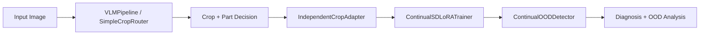
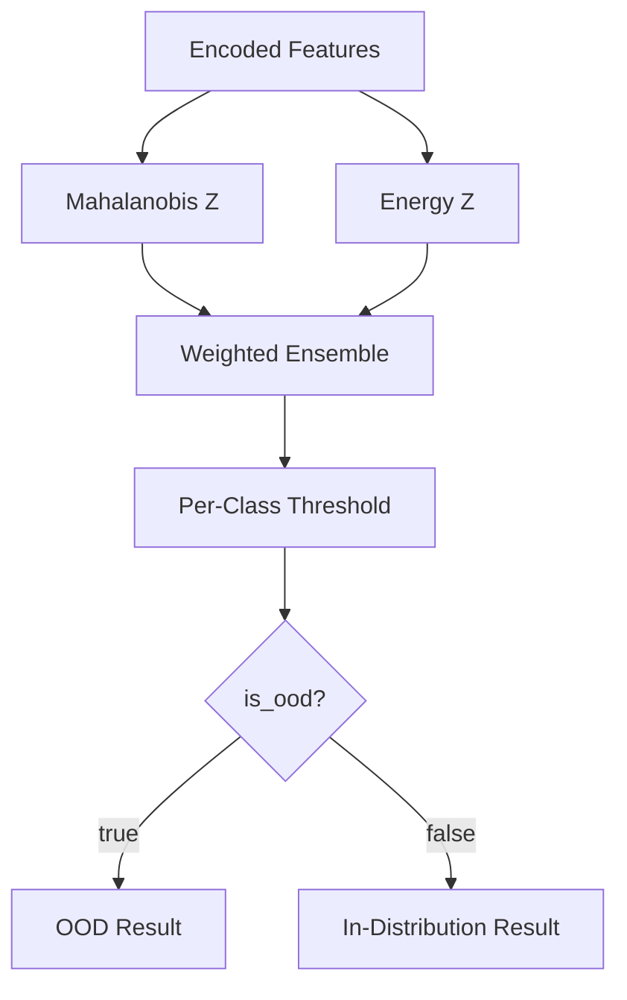
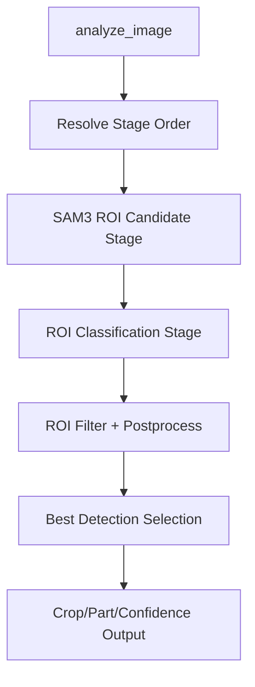

# AADS v6 Architecture Overview

## Component Diagram

## Runtime Data Flow

1. `src/pipeline/independent_multi_crop_pipeline.py` accepts an image and normalizes input shape.
2. `src/router/vlm_pipeline.py` (or `src/router/simple_crop_router.py`) predicts crop/part with confidence.
3. Pipeline resolves the matching `src/adapter/independent_crop_adapter.py` instance.
4. Adapter runs `src/training/continual_sd_lora.py` inference surfaces and returns disease logits/probabilities.
5. Adapter invokes OOD scoring (`src/ood/continual_ood.py`) and attaches:
   - `ensemble_score`
   - `class_threshold`
   - `is_ood`
   - `calibration_version`
6. Pipeline emits a unified response payload with router confidence, diagnosis, and OOD analysis.

## OOD Architecture

- Score contract: `0.6 * mahalanobis_z + 0.4 * energy_z`
- Calibration state is versioned and persisted in adapter metadata.
- Threshold handling lives in `src/ood/dynamic_thresholds.py` and `src/ood/continual_ood.py`.

## Policy Graph (Router Stage Ordering)

- Stage order and profile behavior are defined in `src/router/vlm_pipeline.py`.
- Policy/taxonomy normalization helpers are in `src/router/policy_taxonomy_utils.py`.
- Regression guardrails:
  - `tests/unit/router/test_vlm_policy_stage_order.py`
  - `tests/unit/router/test_vlm_strict_loading.py`

## Config and Contract Anchors

- Runtime config sources:
  - `config/training_config.json`
  - `config/router_config.json`
- Canonical contract specs:
  - `specs/adapter-spec.json`
  - `specs/router-spec.json`
  - `specs/pipeline-spec.json`
