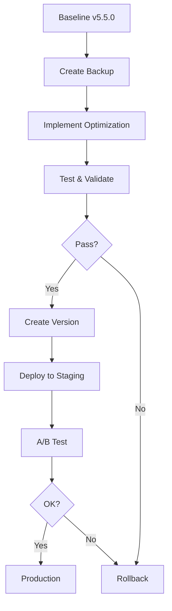

# AADS-ULoRA Version Management & Fallback Strategy

## Quick Start Guide

This guide provides a complete version management and fallback strategy for the AADS-ULoRA v5.5 optimization implementation.

---

## 📋 Table of Contents

1. [Overview](#overview)
2. [Quick Start](#quick-start)
3. [Version Naming Convention](#version-naming-convention)
4. [Backup System](#backup-system)
5. [Rollback Mechanisms](#rollback-mechanisms)
6. [Staged Implementation](#staged-implementation)
7. [Testing & Validation](#testing--validation)
8. [Monitoring](#monitoring)
9. [Emergency Procedures](#emergency-procedures)
10. [Commands Reference](#commands-reference)

---

## Overview

### Purpose

Ensure safe implementation of AADS-ULoRA optimizations with:
- **Automated backups** before any changes
- **Instant rollback** capability for each version
- **Staged deployment** with validation checkpoints
- **A/B testing** for performance comparisons
- **Comprehensive monitoring** and alerting

### Architecture

```
project/
├── version_management/          # Version control system
│   ├── backup.py               # Python implementation
│   ├── backup.sh               # Shell script (reference)
│   ├── README.md               # This documentation
│   ├── rollback_mechanisms.md
│   ├── staged_implementation.md
│   └── testing_validation.md
├── backups/                    # Backup storage (auto-created)
├── versions/                   # Version storage (auto-created)
├── current/                    # Current working directory
└── rollback_*.py              # Auto-generated rollback scripts
```

---

## Quick Start

### 1. Initial Setup

```bash
# Create directory structure
mkdir -p version_management backups versions current

# Copy backup.py to version_management/
# (Already included in this documentation)

# Make backup script executable
chmod +x version_management/backup.py
```

### 2. Create Initial Baseline Backup

```bash
# From project root
python -m version_management.backup create \
  --version v5.5.0-baseline \
  --description "Initial baseline before optimizations"
```

### 3. Verify System

```bash
# List backups
python -m version_management.backup list

# Verify baseline
python -m version_management.backup verify --version v5.5.0-baseline
```

### 4. Ready to Implement

You now have a complete version management system. Proceed with optimizations using the staged implementation strategy.

---

## Version Naming Convention

### Format

```
v[MAJOR].[MINOR].[PATCH]-[OPTIMIZATION]
```

### Examples

- `v5.5.0` - Base version (no optimization suffix)
- `v5.5.1-ood` - OOD detection optimization
- `v5.5.2-router` - Router improvement
- `v5.5.3-performance` - Performance optimization
- `v6.0.0` - Major version (breaking changes)

### Rules

- **MAJOR**: Breaking changes, architecture overhaul
- **MINOR**: New features, significant improvements
- **PATCH**: Bug fixes, minor tweaks
- **OPTIMIZATION**: Specific optimization type (ood, router, performance, etc.)

---

## Backup System

### Automated Backup Creation

**Before any changes:**

```bash
python -m version_management.backup create \
  --version v5.5.1-ood-work \
  --description "OOD optimization implementation in progress"
```

This creates:
- Backup in `backups/v5.5.1-ood-work/`
- Version in `versions/v5.5.1-ood-work/`
- Manifest file `versions/v5.5.1-ood-work/version.json`
- Rollback script `rollback_v5.5.1-ood-work.py`

### Backup Verification

```bash
# Verify a specific backup
python -m version_management.backup verify --version v5.5.1-ood

# Output:
# ✓ Backup verified successfully (5 critical files present)
```

### List All Backups

```bash
python -m version_management.backup list

# Output:
# Version                          Description                          Files    Size (MB)
# ------------------------------------------------------------------------------------
# v5.5.0-baseline                  Initial baseline                     245     15.23
# v5.5.1-ood                       OOD detection optimization          247     15.45
```

---

## Rollback Mechanisms

### Quick Rollback

```bash
# Use standalone rollback script (fastest)
./rollback_v5.5.1-ood.py

# Or use VersionManager
python -m version_management.backup restore --version v5.5.0
```

### Rollback to Specific Directory

```bash
# Dry run first (see what would be restored)
python -m version_management.backup restore \
  --version v5.5.0 \
  --target ./deployment_test \
  --dry-run

# Execute rollback
python -m version_management.backup restore \
  --version v5.5.0 \
  --target ./deployment_test
```

### Rollback Verification

After rollback, automatically verify:

```bash
python -m version_management.backup verify --version v5.5.0
```

---

## Staged Implementation

### Implementation Workflow



### Stage 1: OOD Detection (v5.5.1-ood)

**Pre-Implementation:**
```bash
# 1. Create backup
python -m version_management.backup create \
  --version v5.5.1-ood-work \
  --description "OOD detection optimization"

# 2. Create rollback script
python -m version_management.backup rollback_script --version v5.5.1-ood-work
```

**Implementation:**
- Modify `src/ood/dynamic_thresholds.py`
- Update `src/adapter/independent_crop_adapter.py` OOD logic
- Adjust config: `config/adapter_spec_v55.json`

**Validation:**
```bash
# Run tests
pytest tests/version_tests/test_v5.5.1_ood.py -v

# Benchmark performance
pytest tests/performance/test_regression.py -k v5.5.1 -v

# Verify metrics
# Expected: OOD AUROC ≥ 0.92, FPR ≤ 0.05, Latency +≤ 5ms
```

**Post-Implementation:**
```bash
# Create final version
python -m version_management.backup create \
  --version v5.5.1-ood \
  --description "OOD detection with dynamic Mahalanobis thresholds"

# Tag in git
git tag -a v5.5.1-ood -m "OOD detection optimization"
git push origin v5.5.1-ood
```

### Stage 2: Router Improvement (v5.5.2-router)

Follow same pattern:
1. Backup current (v5.5.1-ood)
2. Implement router changes
3. Test routing accuracy ≥ 98.5%
4. Create version v5.5.2-router

### Stage 3: Performance Optimization (v5.5.3-performance)

1. Backup current (v5.5.2-router)
2. Apply optimizations (gradient checkpointing, quantization)
3. Benchmark: latency ≤ 150ms, memory ≤ 20MB
4. Create version v5.5.3-performance

---

## Testing & Validation

### Test Suite Structure

```
tests/
├── version_tests/           # Version-specific tests
│   ├── test_v5.5.0.py
│   ├── test_v5.5.1_ood.py
│   └── test_v5.5.2_router.py
├── integration/             # Integration tests
│   └── test_full_pipeline.py
├── performance/             # Performance tests
│   └── test_regression.py
└── rollback/               # Rollback tests
    └── test_rollback_procedures.py
```

### Run Tests for a Version

```bash
# All tests for v5.5.1
pytest tests/ -k v5.5.1 -v

# Specific test file
pytest tests/version_tests/test_v5.5.1_ood.py -v

# With coverage
pytest tests/version_tests/ --cov=src --cov-report=html
```

### Pre-Deployment Test Suite

```bash
#!/bin/bash
# run_pre_deploy_tests.sh

VERSION=$1

echo "=== Pre-Deployment Tests: $VERSION ==="

# 1. Verify backup
python -m version_management.backup verify --version "$VERSION"

# 2. Unit tests
pytest tests/version_tests/test_${VERSION}.py -v

# 3. Integration tests
pytest tests/integration/ -k "$VERSION" -v

# 4. Performance regression
pytest tests/performance/test_regression.py -k "$VERSION" -v

# 5. Rollback test
pytest tests/rollback/test_rollback_procedures.py -v

echo "✓ All tests passed. Ready to deploy."
```

---

## Monitoring

### Key Metrics to Track

| Category | Metric | Baseline | Target |
|----------|--------|----------|--------|
| Accuracy | Crop routing | 98.2% | ≥ 98% |
| Accuracy | Phase 1 | 95.3% | ≥ 95% |
| OOD | AUROC | 89.1% | ≥ 92% |
| OOD | FPR | 6.7% | ≤ 5% |
| Performance | Latency | 185ms | ≤ 200ms |
| Performance | Memory | 23.5MB | ≤ 25MB |

### Alert Rules

```python
ALERT_RULES = {
    "accuracy_drop": {
        "condition": lambda current, baseline: current < baseline * 0.99,
        "message": "Accuracy dropped >1% from baseline",
        "severity": "critical"
    },
    "latency_increase": {
        "condition": lambda current, baseline: current > baseline * 1.10,
        "message": "Latency increased >10%",
        "severity": "warning"
    },
    "error_rate_high": {
        "condition": lambda rate: rate > 0.01,
        "message": "Error rate exceeds 1%",
        "severity": "critical"
    }
}
```

### Monitoring Dashboard

```python
# monitoring/dashboard.py (Streamlit)
import streamlit as st
import pandas as pd
import plotly.express as px

st.title("AADS-ULoRA Version Monitoring")

# Load version metrics
versions = load_all_versions_metrics()

# Version comparison
selected = st.multiselect("Compare versions", list(versions.keys()))
if selected:
    df = pd.DataFrame([versions[v] for v in selected])
    st.dataframe(df)
    fig = px.bar(df, x="version", y="accuracy")
    st.plotly_chart(fig)
```

Run dashboard:
```bash
streamlit run monitoring/dashboard.py
```

---

## Emergency Procedures

### Immediate Rollback (< 5 min)

**Scenario:** Production failure or critical errors

**Steps:**

1. **Stop deployment**
   ```bash
   # Kubernetes
   kubectl rollout undo deployment/aads-ulora

   # Docker Compose
   docker-compose down
   ```

2. **Execute rollback**
   ```bash
   # Fastest: standalone script
   python rollback_v5.5.1-ood.py

   # Or: VersionManager
   python -m version_management.backup restore --version v5.5.0
   ```

3. **Verify rollback**
   ```bash
   python -m version_management.backup verify --version v5.5.0
   ```

4. **Restart services**
   ```bash
   ./deploy.sh v5.5.0
   ```

5. **Monitor recovery**
   ```bash
   tail -f logs/application.log
   ```

6. **Notify team**
   - Slack/Teams alert
   - Incident report
   - Schedule post-mortem

### Partial Rollback

Only specific components:

```bash
# Rollback only adapter code
python -m version_management.backup restore \
  --version v5.5.0 \
  --target ./src/adapter

# Rollback only configuration
python -m version_management.backup restore \
  --version v5.5.0 \
  --target ./config
```

---

## Commands Reference

### Version Management

```bash
# Create backup
python -m version_management.backup create \
  --version <version> \
  --description "<description>"

# List all backups
python -m version_management.backup list

# Restore version
python -m version_management.backup restore \
  --version <version> \
  --target <directory>  # optional, defaults to current/

# Verify backup
python -m version_management.backup verify \
  --version <version>

# Create rollback script
python -m version_management.backup rollback_script \
  --version <version>
```

### Testing

```bash
# Run all tests
pytest tests/ -v

# Run version-specific tests
pytest tests/ -k v5.5.1 -v

# Run with coverage
pytest tests/ --cov=src --cov-report=html

# Pre-deployment test suite
./run_pre_deploy_tests.sh v5.5.1-ood

# Post-deployment smoke tests
./run_post_deploy_tests.sh v5.5.1-ood http://localhost:8000
```

### Git Operations

```bash
# Create version tag
git tag -a v5.5.1-ood -m "OOD optimization"

# Push tag
git push origin v5.5.1-ood

# List tags
git tag --list

# Checkout version
git checkout tags/v5.5.1-ood -b v5.5.1-ood-branch
```

---

## Implementation Checklist

### Pre-Implementation

- [ ] Baseline backup created (v5.5.0)
- [ ] Baseline metrics documented
- [ ] Rollback procedures reviewed
- [ ] Test environment ready
- [ ] Team notified of deployment window

### During Implementation

- [ ] Daily backups created
- [ ] Unit tests passing
- [ ] Integration tests passing
- [ ] No critical alerts
- [ ] Performance within threshold

### Pre-Deployment

- [ ] Backup verified
- [ ] All tests passing
- [ ] Performance benchmarks complete
- [ ] Rollback script tested
- [ ] Documentation updated
- [ ] CHANGELOG.md updated

### Deployment

- [ ] Canary deployment (10% traffic)
- [ ] Monitor 24h
- [ ] No critical alerts
- [ ] Metrics within threshold
- [ ] Gradual rollout (50% → 100%)

### Post-Deployment

- [ ] Full traffic stable
- [ ] 7-day monitoring complete
- [ ] Performance report generated
- [ ] Team debriefed
- [ ] Lessons learned documented

---

## Performance Thresholds

### Critical Thresholds (Automatic Rollback)

| Metric | Baseline | Critical Threshold | Action |
|--------|----------|-------------------|--------|
| Accuracy | 95.3% | < 94% | Immediate rollback |
| OOD AUROC | 89.1% | < 85% | Immediate rollback |
| Latency | 185ms | > 220ms | Immediate rollback |
| Error rate | 0.1% | > 0.5% | Immediate rollback |

### Warning Thresholds (Investigate)

| Metric | Baseline | Warning Threshold | Action |
|--------|----------|-------------------|--------|
| Accuracy | 95.3% | 94-95% | Investigate |
| OOD AUROC | 89.1% | 87-89% | Investigate |
| Latency | 185ms | 200-220ms | Investigate |
| Memory | 23.5MB | 25-28MB | Investigate |

---

## A/B Testing Guide

### When to Use A/B Testing

- Major architecture changes
- Performance-critical optimizations
- Before full production rollout
- When metrics are borderline

### Setup

```bash
# 1. Deploy both versions
python deploy.py --version v5.5.1-ood --port 8000
python deploy.py --version v5.5.2-router --port 8001

# 2. Configure load balancer (nginx)
# See rollback_mechanisms.md for full config

# 3. Start A/B test
python monitoring/ab_test_manager.py \
  --version-a v5.5.1-ood \
  --version-b v5.5.2-router \
  --duration 48h

# 4. Analyze results
python monitoring/analyze_ab_results.py
```

### Decision Criteria

- **Statistical significance**: p-value < 0.05
- **Improvement**: ≥ 0.5% for accuracy, ≥ 10% for performance
- **No regressions**: All metrics within acceptable thresholds
- **Stability**: Error rate < 0.1% during test

---

## Troubleshooting

### Common Issues

**1. Backup creation fails**
```bash
# Check permissions
ls -la backups/ versions/

# Ensure directories exist
mkdir -p backups versions current

# Check disk space
df -h
```

**2. Rollback fails**
```bash
# Verify backup exists
python -m version_management.backup list

# Check backup integrity
python -m version_management.backup verify --version v5.5.0

# Try manual restore
cp -r backups/v5.5.0/* current/
```

**3. Tests fail after restore**
```bash
# Ensure Python path is correct
export PYTHONPATH=/path/to/project:$PYTHONPATH

# Reinstall dependencies
pip install -r requirements.txt

# Clear Python cache
find . -type d -name __pycache__ -exec rm -r {} +
```

**4. Import errors**
```bash
# Check if files exist in restored version
ls -la current/src/

# Verify version structure
python -c "import sys; sys.path.insert(0, 'current'); import src"
```

---

## Best Practices

1. **Always backup before changes** - Never skip this step
2. **Test rollback procedures** - Monthly drills
3. **Keep multiple versions** - At least 3 recent versions
4. **Document performance impact** - Benchmark before/after
5. **Use semantic versioning** - Clear version meaning
6. **Automate verification** - Include in CI/CD
7. **Monitor in production** - Track metrics per version
8. **Train the team** - Everyone knows rollback procedures

---

## Support & Resources

### Documentation Files

- `README.md` - Version management overview
- `backup_implementation.md` - Backup system details
- `rollback_mechanisms.md` - Rollback procedures
- `staged_implementation.md` - Implementation strategy
- `testing_validation.md` - Testing procedures
- `IMPLEMENTATION_GUIDE.md` - This file (quick reference)

### Key Scripts

- `version_management/backup.py` - Main backup/restore tool
- `rollback_<version>.py` - Auto-generated rollback scripts
- `run_pre_deploy_tests.sh` - Pre-deployment test suite
- `run_post_deploy_tests.sh` - Post-deployment validation

### Contact

For issues or questions:
- Create issue in GitHub repository
- Contact DevOps team
- Refer to AADS-ULoRA documentation

---

## Summary

You now have a complete version management and fallback strategy for AADS-ULoRA v5.5 optimizations:

✅ **Automated backups** before any changes
✅ **Versioned directories** with manifests
✅ **Standalone rollback scripts** for each version
✅ **Staged implementation** with checkpoints
✅ **A/B testing** capability
✅ **Comprehensive testing** suite
✅ **Monitoring & alerting** framework
✅ **Emergency procedures** documented

**Next Steps:**
1. Create initial baseline backup: `python -m version_management.backup create --version v5.5.0-baseline --description "Initial baseline"`
2. Follow staged implementation in `staged_implementation.md`
3. Run tests from `testing_validation.md`
4. Keep this guide as quick reference

---

**Version:** 1.0
**Last Updated:** 2026-02-11
**Status:** Production Ready