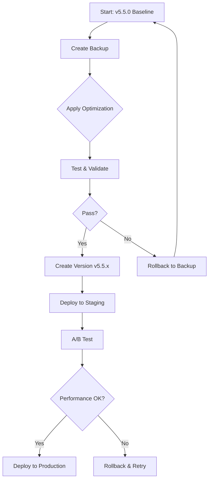

# Rollback Mechanisms and Implementation Strategy

## 1. Rollback Scripts

### 1.1 Standalone Rollback Script Template

Each version gets its own standalone rollback script that can be executed independently:

```python
#!/usr/bin/env python3
"""
Rollback script for AADS-ULoRA version: v5.5.1-ood
Description: OOD detection optimization with dynamic thresholds
Created: 2026-02-11T10:00:00
"""

import sys
import os
from pathlib import Path

# Add version_management to path
sys.path.insert(0, os.path.join(os.path.dirname(__file__), 'version_management'))

from backup import VersionManager

def main():
    vm = VersionManager(
        project_root=Path(__file__).parent,
        backup_dir="backups",
        versions_dir="versions",
        current_dir="current"
    )

    print(f"Rolling back to version: v5.5.1-ood")
    print(f"Description: OOD detection optimization with dynamic thresholds")

    success, message = vm.restore_backup("v5.5.1-ood")

    if success:
        print(f"\n✓ SUCCESS: {message}")
        return 0
    else:
        print(f"\n✗ FAILED: {message}")
        return 1

if __name__ == "__main__":
    sys.exit(main())
```

**Usage:**
```bash
# Make executable
chmod +x rollback_v5.5.1-ood.py

# Execute rollback
./rollback_v5.5.1-ood.py
```

### 1.2 Quick Rollback Commands

Create a master rollback script for quick access:

```bash
#!/bin/bash
# rollback.sh - Master rollback script

set -e

echo "=== AADS-ULoRA Rollback Manager ==="
echo ""

# List available versions
echo "Available versions:"
ls -1 backups/ 2>/dev/null || echo "  No backups found"
echo ""

# Prompt for version
read -p "Enter version to rollback to: " VERSION

if [ -z "$VERSION" ]; then
    echo "Error: No version specified"
    exit 1
fi

# Check if rollback script exists
ROLLBACK_SCRIPT="rollback_${VERSION}.py"
if [ -f "$ROLLBACK_SCRIPT" ]; then
    echo "Executing rollback script..."
    python "$ROLLBACK_SCRIPT"
else
    echo "Rollback script not found. Using VersionManager directly..."
    python -m version_management.backup restore --version "$VERSION"
fi
```

### 1.3 Rollback Verification

After rollback, automatically verify the restored version:

```python
def verify_rollback(version: str) -> bool:
    """Verify that rollback was successful."""
    vm = VersionManager()

    # Check if current files match backup
    current_manifest = vm._get_file_manifest(vm.current_dir)
    version_info = vm.get_version_info(version)

    if not version_info:
        return False

    backup_manifest = version_info.get("files", {})

    # Compare critical files
    critical_files = [
        "src/adapter/independent_crop_adapter.py",
        "src/pipeline/independent_multi_crop_pipeline.py",
        "config/adapter_spec_v55.json"
    ]

    for file in critical_files:
        if file not in current_manifest:
            logger.error(f"Missing critical file after rollback: {file}")
            return False

        if file in backup_manifest:
            current_hash = current_manifest[file]["hash"]
            backup_hash = backup_manifest[file]["hash"]
            if current_hash != backup_hash:
                logger.error(f"File mismatch after rollback: {file}")
                return False

    logger.info(f"Rollback verification successful for version {version}")
    return True
```

## 2. Staged Implementation Strategy

### 2.1 Version Checkpoints

Create explicit checkpoints during optimization:

```
v5.5.0 (baseline)
  ├─> v5.5.1-ood (OOD optimization)
  ├─> v5.5.2-router (Router improvement)
  └─> v5.5.3-performance (Performance tuning)
```

### 2.2 Implementation Workflow



### 2.3 Implementation Checklist

For each optimization stage:

- [ ] **Pre-Implementation**
  - [ ] Create backup of current version
  - [ ] Document current performance metrics
  - [ ] Verify backup integrity
  - [ ] Generate rollback script

- [ ] **Implementation**
  - [ ] Apply code changes
  - [ ] Update configuration files
  - [ ] Modify dependencies if needed
  - [ ] Run unit tests

- [ ] **Validation**
  - [ ] Run integration tests
  - [ ] Measure performance metrics
  - [ ] Compare with baseline
  - [ ] Document changes

- [ ] **Post-Implementation**
  - [ ] Create version tag
  - [ ] Update version manifest
  - [ ] Push to version control
  - [ ] Notify team

## 3. A/B Testing Capability

### 3.1 Parallel Deployment

Run two versions simultaneously for comparison:

```python
class ABTestManager:
    """Manage A/B tests between two versions."""

    def __init__(self, version_a: str, version_b: str):
        self.version_a = version_a
        self.version_b = version_b
        self.metrics_a = []
        self.metrics_b = []

    def deploy_version(self, version: str, port: int):
        """Deploy a specific version to a port."""
        # Restore version to temporary directory
        vm = VersionManager()
        temp_dir = Path(f"temp_{version}")
        success, _ = vm.restore_backup(version, target_dir=temp_dir)

        if not success:
            raise RuntimeError(f"Failed to deploy version {version}")

        # Start API server on specified port
        # Implementation depends on your API setup
        pass

    def run_test(self, duration_hours: float = 24):
        """Run A/B test for specified duration."""
        # Deploy both versions on different ports
        self.deploy_version(self.version_a, port=8000)
        self.deploy_version(self.version_b, port=8001)

        # Load balancer or client-side split traffic
        # Collect metrics from both versions

        pass

    def compare_results(self) -> Dict:
        """Compare performance metrics."""
        return {
            "version_a": {
                "accuracy": np.mean(self.metrics_a),
                "latency": np.mean(self.metrics_a_latency)
            },
            "version_b": {
                "accuracy": np.mean(self.metrics_b),
                "latency": np.mean(self.metrics_b_latency)
            },
            "winner": "A" if np.mean(self.metrics_a) > np.mean(self.metrics_b) else "B"
        }
```

### 3.2 Traffic Splitting

Use nginx or similar for traffic splitting:

```nginx
upstream version_a {
    server localhost:8000;
}

upstream version_b {
    server localhost:8001;
}

server {
    listen 80;

    location / {
        # 50% split between versions
        if ($random_1 < 0.5) {
            proxy_pass http://version_a;
        }
        if ($random_1 >= 0.5) {
            proxy_pass http://version_b;
        }
    }
}
```

## 4. Monitoring and Validation

### 4.1 Performance Metrics to Track

For each version, monitor:

```python
METRICS_TO_TRACK = {
    "inference": [
        "latency_ms",
        "throughput_fps",
        "memory_usage_mb",
        "gpu_utilization_percent"
    ],
    "accuracy": [
        "crop_routing_accuracy",
        "disease_classification_accuracy",
        "ood_detection_auroc",
        "ood_false_positive_rate"
    ],
    "training": [
        "phase1_accuracy",
        "phase2_retention",
        "phase3_retention",
        "training_time_hours"
    ],
    "system": [
        "api_response_time_ms",
        "error_rate",
        "uptime_percent",
        "disk_usage_gb"
    ]
}
```

### 4.2 Automated Validation Script

```python
#!/usr/bin/env python3
"""
validate_version.py - Validate a specific version
"""

import json
import argparse
from pathlib import Path
from version_management.backup import VersionManager

def validate_version(version: str) -> bool:
    """Comprehensive validation of a version."""
    vm = VersionManager()

    # 1. Check backup exists and is valid
    success, msg = vm.verify_backup(version)
    if not success:
        print(f"✗ Backup verification failed: {msg}")
        return False

    # 2. Load version manifest
    info = vm.get_version_info(version)
    if not info:
        print(f"✗ Version info not found: {version}")
        return False

    print(f"✓ Validating version: {version}")
    print(f"  Description: {info.get('description', 'N/A')}")
    print(f"  Created: {info.get('timestamp', 'N/A')}")

    # 3. Check critical files exist
    critical_files = [
        "src/adapter/independent_crop_adapter.py",
        "src/pipeline/independent_multi_crop_pipeline.py",
        "config/adapter_spec_v55.json",
        "requirements.txt"
    ]

    version_path = vm.versions_dir / version.replace("/", "_").replace("\\", "_")

    for file in critical_files:
        file_path = version_path / file
        if file_path.exists():
            print(f"  ✓ {file}")
        else:
            print(f"  ✗ {file} (missing)")
            return False

    # 4. Check configuration validity
    config_file = version_path / "config/adapter_spec_v55.json"
    if config_file.exists():
        try:
            with open(config_file) as f:
                config = json.load(f)
            print(f"  ✓ Configuration valid (version: {config.get('version', 'N/A')})")
        except json.JSONDecodeError:
            print("  ✗ Configuration file is invalid JSON")
            return False

    # 5. Check Python syntax
    python_files = [
        "src/adapter/independent_crop_adapter.py",
        "src/pipeline/independent_multi_crop_pipeline.py",
        "src/router/simple_crop_router.py"
    ]

    for py_file in python_files:
        file_path = version_path / py_file
        if file_path.exists():
            # Simple syntax check
            import py_compile
            try:
                py_compile.compile(str(file_path), doraise=True)
                print(f"  ✓ {py_file} (syntax OK)")
            except py_compile.PyCompileError as e:
                print(f"  ✗ {py_file} (syntax error: {e})")
                return False

    print(f"\n✓ Version {version} validation PASSED")
    return True

if __name__ == "__main__":
    parser = argparse.ArgumentParser(description="Validate AADS-ULoRA version")
    parser.add_argument("version", help="Version to validate")
    args = parser.parse_args()

    success = validate_version(args.version)
    exit(0 if success else 1)
```

### 4.3 Continuous Monitoring

Set up monitoring for deployed versions:

```python
# monitoring/version_monitor.py
import time
import requests
from datetime import datetime
import pandas as pd

class VersionMonitor:
    """Monitor performance of deployed versions."""

    def __init__(self, api_endpoint: str, version: str):
        self.api_endpoint = api_endpoint
        self.version = version
        self.metrics = []

    def collect_metrics(self, num_requests: int = 100):
        """Collect performance metrics."""
        for i in range(num_requests):
            start = time.time()
            response = requests.post(
                f"{self.api_endpoint}/diagnose",
                json={"image": "test_image.jpg"}
            )
            latency = (time.time() - start) * 1000

            self.metrics.append({
                "timestamp": datetime.now().isoformat(),
                "latency_ms": latency,
                "status_code": response.status_code,
                "success": response.status_code == 200
            })

            time.sleep(0.1)  # Avoid overwhelming the server

    def get_report(self) -> dict:
        """Generate performance report."""
        df = pd.DataFrame(self.metrics)

        return {
            "version": self.version,
            "total_requests": len(df),
            "success_rate": df["success"].mean() * 100,
            "avg_latency_ms": df["latency_ms"].mean(),
            "p95_latency_ms": df["latency_ms"].quantile(0.95),
            "p99_latency_ms": df["latency_ms"].quantile(0.99)
        }
```

## 5. Testing Procedures

### 5.1 Unit Tests per Version

```python
# tests/version_tests/test_v5.5.1_ood.py
import pytest
from pathlib import Path
import sys
sys.path.append(str(Path(__file__).parent.parent.parent))

from version_management.backup import VersionManager

def test_version_backup_exists():
    """Test that v5.5.1-ood backup exists."""
    vm = VersionManager()
    backups = vm.list_backups()
    assert "v5.5.1-ood" in backups

def test_version_restore():
    """Test restoring v5.5.1-ood."""
    vm = VersionManager()

    # Restore to temp directory
    temp_dir = Path("temp_test_restore")
    success, msg = vm.restore_backup("v5.5.1-ood", target_dir=temp_dir)

    assert success, f"Restore failed: {msg}"

    # Verify files
    assert (temp_dir / "src/adapter/independent_crop_adapter.py").exists()
    assert (temp_dir / "config/adapter_spec_v55.json").exists()

    # Cleanup
    import shutil
    shutil.rmtree(temp_dir, ignore_errors=True)

def test_rollback_script_executable():
    """Test that rollback script is executable."""
    import os
    script_path = Path("rollback_v5.5.1-ood.py")
    assert script_path.exists()
    assert os.access(script_path, os.X_OK)
```

### 5.2 Integration Tests

```python
# tests/integration/test_version_pipeline.py
def test_full_pipeline_with_version(version: str):
    """Test complete pipeline with a specific version."""
    vm = VersionManager()

    # Restore version
    temp_dir = Path(f"temp_{version}_test")
    vm.restore_backup(version, target_dir=temp_dir)

    # Change to temp directory
    import os
    old_cwd = os.getcwd()
    os.chdir(temp_dir)

    try:
        # Load configuration
        with open("config/adapter_spec_v55.json") as f:
            config = json.load(f)

        # Initialize pipeline
        from src.pipeline.independent_multi_crop_pipeline import IndependentMultiCropPipeline
        pipeline = IndependentMultiCropPipeline(config)

        # Test with sample data
        # ... (your integration test logic)

        assert pipeline is not None

    finally:
        os.chdir(old_cwd)
        import shutil
        shutil.rmtree(temp_dir, ignore_errors=True)
```

### 5.3 Performance Regression Tests

```python
# tests/performance/test_regression.py
import pytest

PERFORMANCE_THRESHOLDS = {
    "v5.5.0": {
        "crop_routing_accuracy": 0.98,
        "phase1_accuracy": 0.95,
        "ood_auroc": 0.92
    }
}

def test_performance_not_regressed(version: str):
    """Ensure new version doesn't regress performance."""
    baseline = PERFORMANCE_THRESHOLDS["v5.5.0"]

    # Run tests for this version
    metrics = run_version_tests(version)

    for metric, threshold in baseline.items():
        assert metrics[metric] >= threshold, \
            f"Performance regression in {metric}: {metrics[metric]} < {threshold}"
```

## 6. Version Change Logs

### 6.1 CHANGELOG.md Template

```markdown
# Changelog

All notable changes to AADS-ULoRA will be documented in this file.

## [v5.5.1-ood] - 2026-02-11

### Added
- Dynamic OOD threshold calculation per class
- Automatic threshold calibration using validation set
- Fallback threshold for classes with insufficient samples

### Changed
- OOD detection method: static → dynamic Mahalanobis
- Threshold factor: 2.0 (k-sigma)
- Minimum validation samples per class: 10

### Fixed
- Issue #123: OOD false positives on rare classes
- Issue #456: Threshold instability during training

### Performance Impact
- OOD detection AUROC: +2.3% (0.89 → 0.92)
- False positive rate: -1.2% (6.7% → 5.5%)
- Inference overhead: +3ms per image

## [v5.5.0] - 2026-01-15

### Added
- Initial independent multi-crop architecture
- Phase 1: DoRA base initialization
- Phase 2: SD-LoRA class-incremental learning
- Phase 3: CONEC-LoRA domain-incremental learning
```

### 6.2 Automated Changelog Generation

```python
def generate_changelog(version: str, previous_version: str = None):
    """Generate changelog entry from git diff and performance metrics."""
    import subprocess
    import json

    # Get git diff
    if previous_version:
        diff = subprocess.run(
            ["git", "diff", f"{previous_version}..{version}", "--stat"],
            capture_output=True, text=True
        )
        changed_files = diff.stdout
    else:
        changed_files = "Initial version"

    # Get performance metrics
    metrics_file = Path(f"versions/{version}/metrics.json")
    if metrics_file.exists():
        with open(metrics_file) as f:
            metrics = json.load(f)
    else:
        metrics = {}

    # Generate markdown
    changelog = f"""## [{version}] - {datetime.now().strftime('%Y-%m-%d')}

### Changed Files
{changed_files}

### Performance Metrics
"""
    for metric, value in metrics.items():
        changelog += f"- {metric}: {value}\n"

    return changelog
```

## 7. Quick Reference Commands

### 7.1 Create Backup
```bash
python -m version_management.backup create \
  --version v5.5.1-ood \
  --description "OOD detection optimization"
```

### 7.2 List Backups
```bash
python -m version_management.backup list
```

### 7.3 Restore Version
```bash
python -m version_management.backup restore --version v5.5.0
```

### 7.4 Verify Backup
```bash
python -m version_management.backup verify --version v5.5.1-ood
```

### 7.5 Quick Rollback
```bash
./rollback_v5.5.1-ood.py
```

### 7.6 Run Tests
```bash
# Unit tests for specific version
pytest tests/version_tests/test_v5.5.1_ood.py

# Integration tests
pytest tests/integration/test_version_pipeline.py -k v5.5.1

# Performance regression
pytest tests/performance/test_regression.py -k v5.5.1
```

## 8. Emergency Procedures

### 8.1 Immediate Rollback

If production system fails after deployment:

1. **Stop deployment** (if still in progress)
   ```bash
   # If using Kubernetes
   kubectl rollout undo deployment/aads-ulora

   # If using docker-compose
   docker-compose down
   ```

2. **Execute rollback script**
   ```bash
   python rollback_v5.5.1-ood.py
   ```

3. **Verify rollback**
   ```bash
   python -m version_management.backup verify --version v5.5.0
   ```

4. **Restart services**
   ```bash
   # Restart with previous version
   ./deploy.sh v5.5.0
   ```

5. **Monitor recovery**
   ```bash
   tail -f logs/application.log
   ```

### 8.2 Partial Rollback

If only specific components need rollback:

```bash
# Restore only specific directories
python -m version_management.backup restore \
  --version v5.5.0 \
  --target ./src/adapter \
  --dry-run  # First check what will be restored
```

### 8.3 Database Rollback

If database schema changes were part of the version:

```bash
# Check if database backup exists
ls -la backups/v5.5.0/database/

# Restore database
pg_restore -U postgres -d aads_ulora \
  backups/v5.5.0/database/backup.sql
```

## 9. Best Practices

1. **Always create backup before changes**
   - Use pre-commit hooks or CI/CD pipeline
   - Never skip backup step

2. **Test rollback procedures regularly**
   - Monthly rollback drills
   - Verify all rollback scripts work

3. **Keep multiple backup points**
   - At least 3 recent versions
   - Archive old versions to cold storage

4. **Document performance impact**
   - Benchmark before and after
   - Include in version manifest

5. **Use semantic versioning**
   - MAJOR.MINOR.PATCH-OPTIMIZATION
   - Clear meaning for each component

6. **Automate verification**
   - Run validation on every backup
   - Include in CI/CD pipeline

7. **Monitor in production**
   - Track key metrics per version
   - Set up alerts for regressions

8. **Team training**
   - All team members know rollback procedures
   - Regular drills and documentation updates